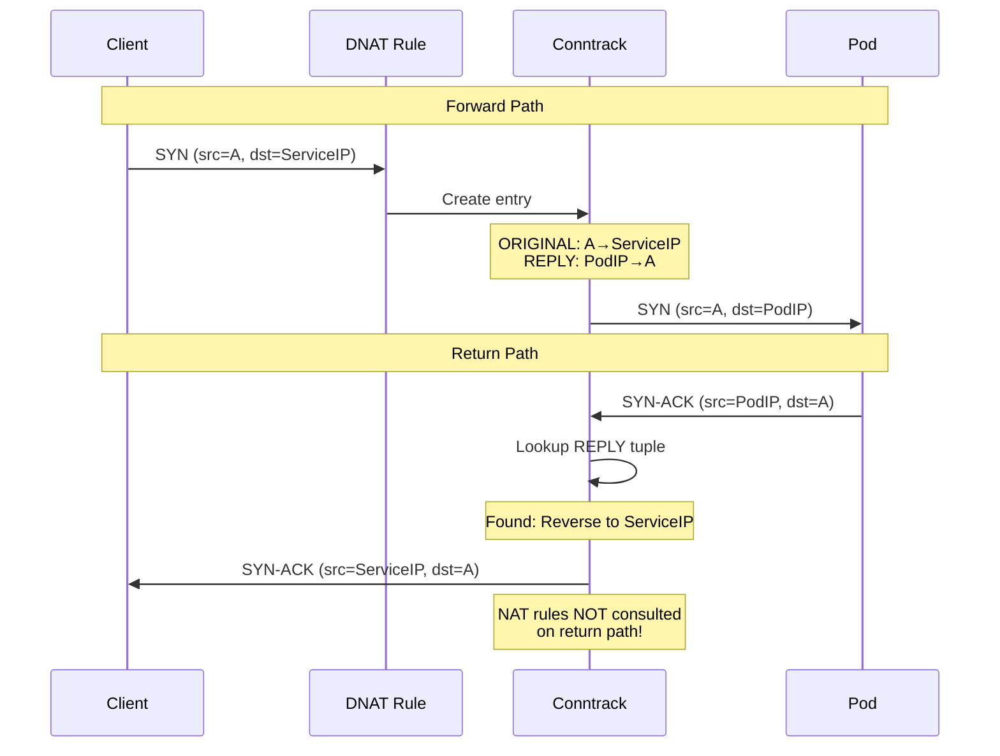
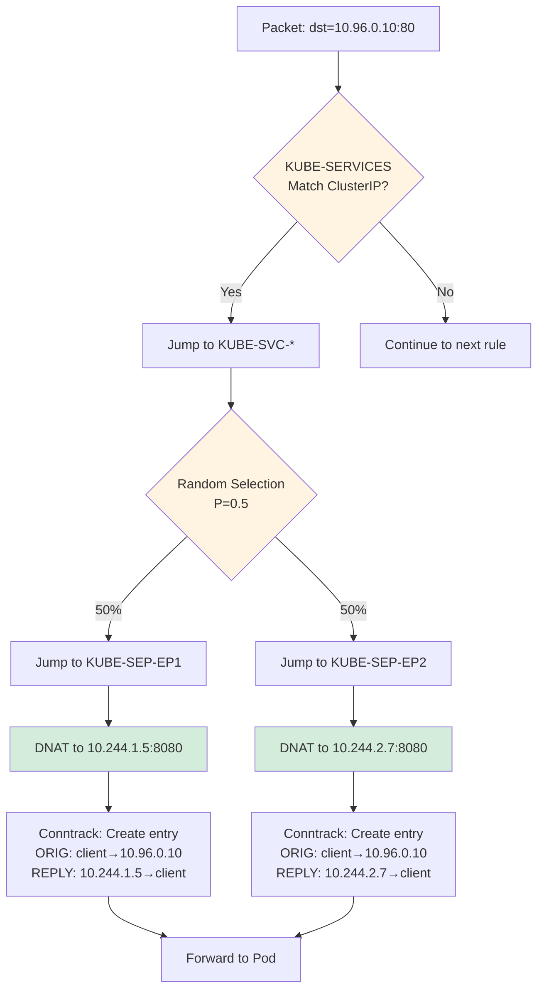
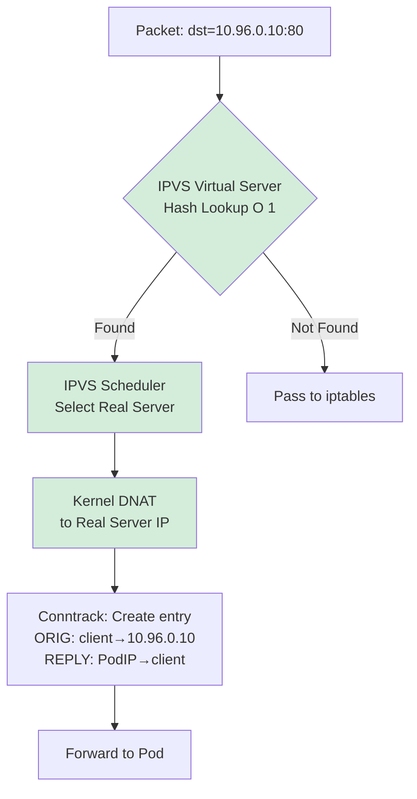
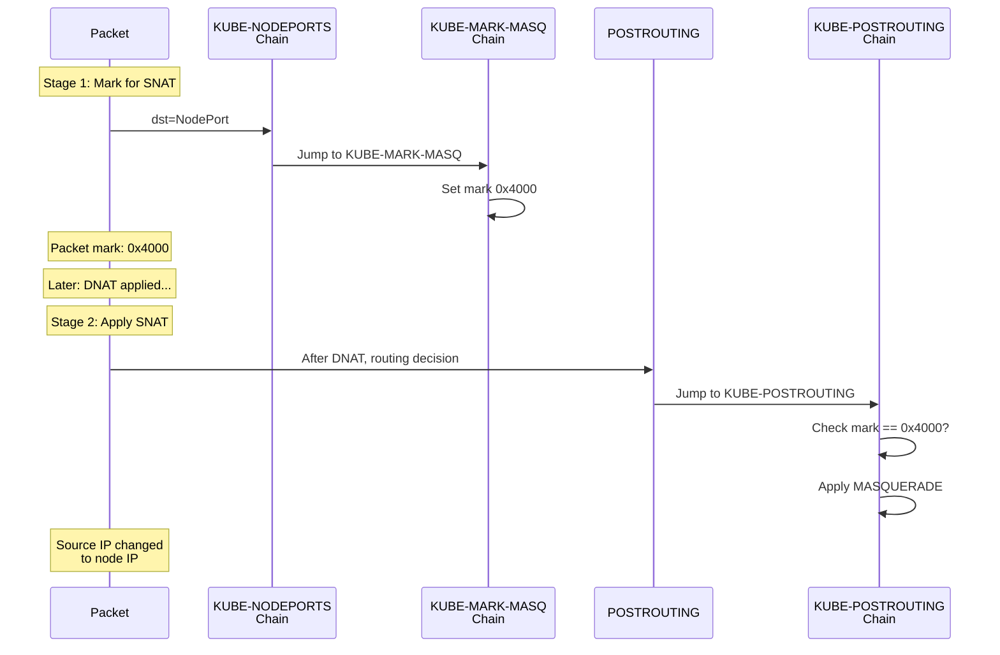
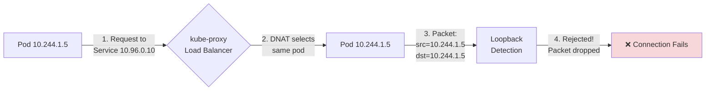
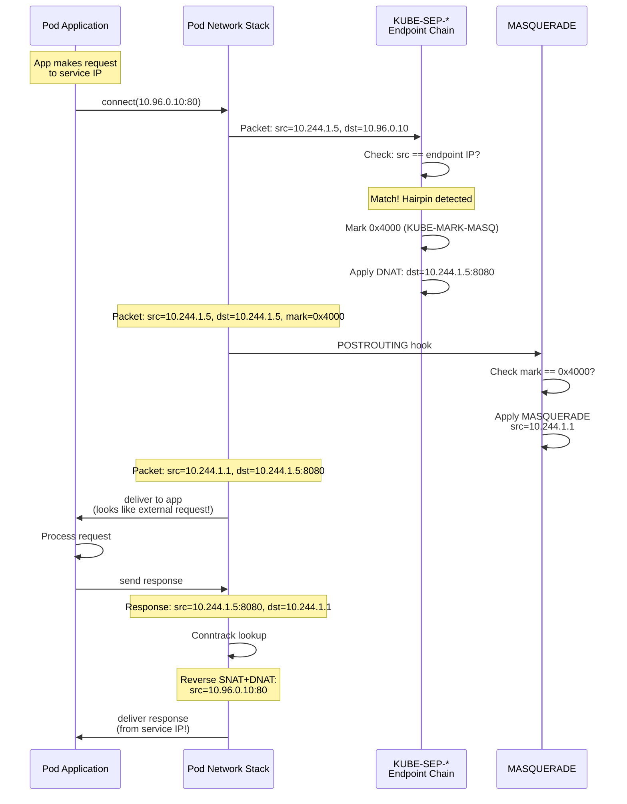
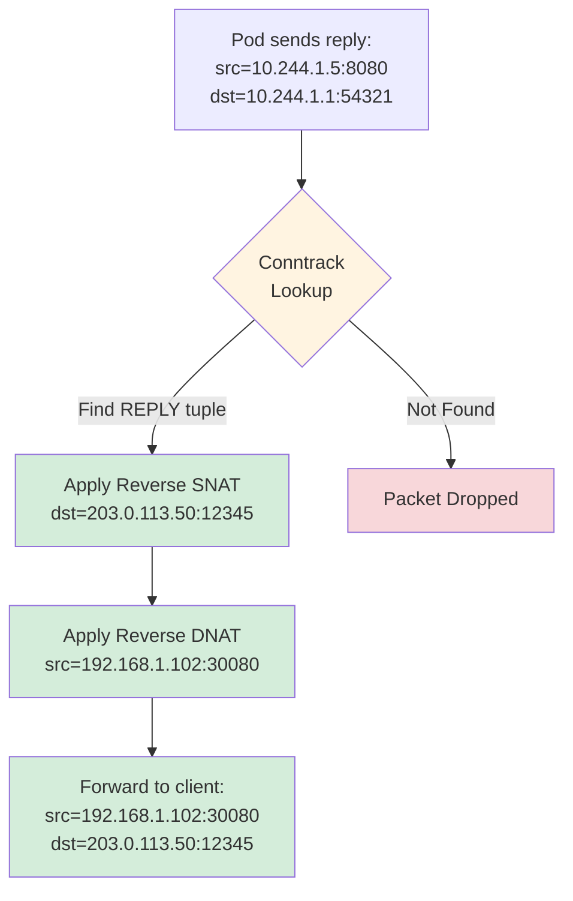

# **Low-Level: NAT Implementation**

**Part of**: [kube-proxy Architecture Documentation](../00-README.md)
**Related**:
- [iptables Mode](../middle-level/02-iptables-mode.md)
- [IPVS Mode](../middle-level/03-ipvs-mode.md)
- [Packet Flow](06-packet-flow.md)
- [Connection Tracking](../middle-level/09-conntrack.md)

━━━━━━━━━━━━━━━━━━━━━━━━━━━━━━━━━━━━━━━━━━━━━━━━━━━━━━━━━━━━━━━━━━━━━━━━━━━━━━

## **📋 Overview**

This document provides comprehensive analysis of Network Address Translation (NAT) implementation in kube-proxy, covering DNAT (Destination NAT), SNAT (Source NAT), masquerading, and hairpin NAT scenarios in both iptables and IPVS modes.

### **What You'll Learn**

- DNAT implementation for service IP to pod IP translation
- SNAT/masquerading for source IP translation
- KUBE-MARK-MASQ chain and masquerade bit (0x4000)
- Hairpin NAT for pod-to-self traffic
- NAT integration with connection tracking
- Differences between iptables and IPVS NAT handling
- Troubleshooting NAT issues
- Best practices for NAT configuration

### **Prerequisites**

- Understanding of [Netfilter architecture](06-packet-flow.md)
- Familiarity with [connection tracking](../middle-level/09-conntrack.md)
- Basic TCP/IP networking knowledge
- Understanding of [iptables](../middle-level/02-iptables-mode.md) and [IPVS](../middle-level/03-ipvs-mode.md) modes

━━━━━━━━━━━━━━━━━━━━━━━━━━━━━━━━━━━━━━━━━━━━━━━━━━━━━━━━━━━━━━━━━━━━━━━━━━━━━━

## **1. NAT Fundamentals**

### **1.1 What is NAT?**

Network Address Translation (NAT) modifies IP addresses and ports in packet headers as they traverse a network device.

**NAT Types in kube-proxy**:

```mermaid
graph TB
    subgraph "DNAT - Destination NAT"
        A1[Client: src=10.244.1.10, dst=10.96.0.10] --> B1[DNAT Applied]
        B1 --> C1[Modified: src=10.244.1.10, dst=10.244.2.5]
        C1 --> D1[Destination Changed:<br/>Service IP → Pod IP]
    end

    subgraph "SNAT - Source NAT"
        A2[Pod: src=10.244.1.10, dst=10.244.2.5] --> B2[SNAT Applied]
        B2 --> C2[Modified: src=10.244.1.1, dst=10.244.2.5]
        C2 --> D2[Source Changed:<br/>Pod IP → Node IP]
    end

    subgraph "Masquerade - Dynamic SNAT"
        A3[Pod: src=10.244.1.10] --> B3[MASQUERADE Applied]
        B3 --> C3[Modified: src=192.168.1.101]
        C3 --> D3[Source Changed to<br/>Outgoing Interface IP]
    end

    style B1 fill:#fff4e1
    style B2 fill:#fff4e1
    style B3 fill:#fff4e1
```



**Why kube-proxy Uses NAT**:

1. **DNAT**: Translate service ClusterIP to pod IP (all traffic)
2. **SNAT**: Preserve routing for cross-node traffic (NodePort, LoadBalancer with Cluster policy)
3. **Hairpin NAT**: Handle pod accessing itself via service IP
4. **Source IP Preservation**: Optional SNAT avoidance with Local traffic policy

### **1.2 NAT and Connection Tracking**

NAT relies heavily on connection tracking (conntrack) to maintain state:



**Key Concept**: NAT rules only apply to the **first packet** of a connection (NEW state). Subsequent packets use conntrack for NAT.

**Code Reference**:
```go
// pkg/proxy/iptables/proxier.go:1450-1500
// Connection tracking allows efficient NAT processing
// Only NEW connections traverse iptables rules
// ESTABLISHED connections use conntrack table directly

// Example iptables rule relying on conntrack
// -A KUBE-SERVICES -m conntrack --ctstate RELATED,ESTABLISHED -j ACCEPT
```

━━━━━━━━━━━━━━━━━━━━━━━━━━━━━━━━━━━━━━━━━━━━━━━━━━━━━━━━━━━━━━━━━━━━━━━━━━━━━━

## **2. DNAT (Destination NAT)**

### **2.1 DNAT Purpose**

DNAT translates service virtual IPs (ClusterIP, NodePort, LoadBalancer IP) to real pod IPs.

**Packet Header Transformation**:

```
Before DNAT:
  Source IP:      10.244.1.10 (client pod)
  Source Port:    54321
  Dest IP:        10.96.0.10 (service ClusterIP)
  Dest Port:      80

After DNAT:
  Source IP:      10.244.1.10 (unchanged)
  Source Port:    54321 (unchanged)
  Dest IP:        10.244.2.5 (pod IP)  ← Changed
  Dest Port:      8080 (target port)   ← Changed
```

### **2.2 DNAT in iptables Mode**

**Chain Structure**:

```bash
# NAT table chains for DNAT
PREROUTING  → KUBE-SERVICES
OUTPUT      → KUBE-SERVICES

KUBE-SERVICES → KUBE-SVC-* (service chain)
KUBE-SVC-*    → KUBE-SEP-* (endpoint chain)
KUBE-SEP-*    → DNAT target
```

**Complete DNAT Rules Example**:

```bash
# Entry point: KUBE-SERVICES chain
-A KUBE-SERVICES -d 10.96.0.10/32 -p tcp -m tcp --dport 80 \
   -m comment --comment "default/backend:http cluster IP" \
   -j KUBE-SVC-BACKEND-HASH

# Service chain: Load balance to endpoints
-A KUBE-SVC-BACKEND-HASH -m comment --comment "default/backend:http -> 10.244.1.5:8080" \
   -m statistic --mode random --probability 0.50000000 \
   -j KUBE-SEP-ENDPOINT1-HASH

-A KUBE-SVC-BACKEND-HASH -m comment --comment "default/backend:http -> 10.244.2.7:8080" \
   -j KUBE-SEP-ENDPOINT2-HASH

# Endpoint chains: Apply DNAT
-A KUBE-SEP-ENDPOINT1-HASH -p tcp -m tcp \
   -m comment --comment "default/backend:http" \
   -j DNAT --to-destination 10.244.1.5:8080
#                            ^^^^^^^^^^^^^^^^
#                            Pod IP:Port

-A KUBE-SEP-ENDPOINT2-HASH -p tcp -m tcp \
   -m comment --comment "default/backend:http" \
   -j DNAT --to-destination 10.244.2.7:8080
```

**DNAT Execution Flow**:



**Code Reference**:
```go
// pkg/proxy/iptables/proxier.go:1650-1750 - Endpoint chain generation
func (proxier *Proxier) writeServiceToEndpointRules(...) {
    // For each endpoint, create KUBE-SEP-* chain with DNAT rule
    for _, endpoint := range endpoints {
        endpointChain := servicePortChainName(...)

        // DNAT rule
        args := []string{
            "-A", string(endpointChain),
            "-p", protocol,
            "-m", protocol,
            "-j", "DNAT",
            "--to-destination", net.JoinHostPort(endpoint.IP, strconv.Itoa(endpoint.Port)),
        }
        writeLine(natRules, args...)
    }
}
```

### **2.3 DNAT in IPVS Mode**

IPVS uses **kernel-level DNAT**, bypassing iptables for the actual translation.

**IPVS DNAT Flow**:



**IPVS DNAT Advantages**:

| Aspect | iptables DNAT | IPVS DNAT |
|--------|---------------|-----------|
| **Lookup** | O(N) chain traversal | O(1) hash table |
| **Execution** | Userspace iptables rules | Kernel IPVS module |
| **Performance** | ~50-200μs | ~5-20μs (10x faster) |
| **Rules Count** | N rules per service | 0 iptables DNAT rules |

**Minimal iptables with IPVS**:

```bash
# IPVS mode: iptables only for filtering, not DNAT
# Just mark packets, let IPVS do DNAT

-A KUBE-SERVICES -m set --match-set KUBE-CLUSTER-IP dst,dst \
   -m comment --comment "kubernetes service cluster ip + port" \
   -j ACCEPT
# No DNAT rules! IPVS handles it in kernel
```

**Code Reference**:
```go
// pkg/proxy/ipvs/proxier.go:1600-1700 - IPVS DNAT via virtual/real servers
func (proxier *Proxier) syncService(...) {
    // Create virtual server (service IP)
    vs := &utilipvs.VirtualServer{
        Address:   clusterIP,
        Port:      uint16(port),
        Protocol:  protocol,
        Scheduler: proxier.scheduler,
    }
    proxier.ipvs.AddVirtualServer(vs)

    // Add real servers (pod IPs) - IPVS does DNAT automatically
    for _, endpoint := range endpoints {
        rs := &utilipvs.RealServer{
            Address: endpoint.IP,
            Port:    uint16(endpoint.Port),
            Weight:  100,
        }
        proxier.ipvs.AddRealServer(vs, rs)
        // Kernel IPVS now handles DNAT: ClusterIP→PodIP
    }
}
```

━━━━━━━━━━━━━━━━━━━━━━━━━━━━━━━━━━━━━━━━━━━━━━━━━━━━━━━━━━━━━━━━━━━━━━━━━━━━━━

## **3. SNAT (Source NAT) and Masquerading**

### **3.1 When SNAT is Required**

SNAT changes the source IP address. kube-proxy uses SNAT in specific scenarios:

**Scenarios Requiring SNAT**:

1. **NodePort with Cluster Traffic Policy**
   - External client → Node → Pod on different node
   - Without SNAT: Pod replies directly to external client (asymmetric routing)

2. **Hairpin Traffic**
   - Pod → Service IP → Same Pod
   - Without SNAT: Pod sees packet from itself (loopback detection fails)

3. **ExternalIPs with Cluster Policy**
   - Similar to NodePort scenario

**Scenarios NOT Requiring SNAT**:

1. **ClusterIP (pod-to-pod within cluster)**
   - Pod → Service → Different Pod
   - Routing works without SNAT

2. **NodePort/LoadBalancer with Local Traffic Policy**
   - External → Node → Pod on same node
   - Source IP preservation more important than routing

### **3.2 The Masquerade Bit: 0x4000**

kube-proxy uses a **packet mark** (0x4000, bit 14) to indicate packets that need SNAT in POSTROUTING.

**Two-Stage SNAT Process**:



**iptables Rules for Marking and Masquerading**:

```bash
# Step 1: Mark packets needing SNAT
# In KUBE-NODEPORTS (for NodePort traffic)
-A KUBE-NODEPORTS -p tcp -m tcp --dport 30080 \
   -m comment --comment "default/frontend:http" \
   -j KUBE-MARK-MASQ

# KUBE-MARK-MASQ chain: Sets the mark
-A KUBE-MARK-MASQ -j MARK --set-xmark 0x4000/0x4000
#                                      ^^^^^^
#                                      Bit 14 set

# Step 2: Apply MASQUERADE to marked packets
# In POSTROUTING hook (after routing decision)
-A POSTROUTING -m comment --comment "kubernetes postrouting rules" \
   -j KUBE-POSTROUTING

# KUBE-POSTROUTING chain: Check mark and masquerade
-A KUBE-POSTROUTING -m mark ! --mark 0x4000/0x4000 \
   -j RETURN
# If mark is NOT 0x4000, return (no SNAT)

-A KUBE-POSTROUTING -m comment --comment "kubernetes service traffic requiring SNAT" \
   -j MASQUERADE --random-fully
# If mark IS 0x4000, apply MASQUERADE
```

**Why Two Stages?**

1. **Marking**: Happens in PREROUTING/OUTPUT (before routing decision)
   - We know packet needs SNAT based on service type
   - But we don't know the outgoing interface yet

2. **Masquerading**: Happens in POSTROUTING (after routing decision)
   - Now we know the outgoing interface
   - MASQUERADE uses that interface's IP as source

**Code Reference**:
```go
// pkg/proxy/iptables/proxier.go:890-920 - Masquerade bit
const (
    KubeMarkMasqBit = 14
    KubeMarkMasq    = 1 << uint(KubeMarkMasqBit)  // 0x4000
)

// pkg/proxy/iptables/proxier.go:1100-1150 - Mark masquerade for NodePort
func (proxier *Proxier) writeServiceRules(...) {
    // For NodePort with Cluster traffic policy
    if svcInfo.ExternalPolicyLocal() == false {
        // Mark packet for masquerading
        writeLine(natRules, []string{
            "-A", string(kubeNodePortsChain),
            "-p", protocol,
            "--dport", strconv.Itoa(int(svcInfo.NodePort())),
            "-j", string(KubeMarkMasqChain),
        }...)
    }
}
```

### **3.3 MASQUERADE vs SNAT**

**MASQUERADE**:
- **Dynamic**: Uses outgoing interface's IP automatically
- **Use Case**: When outgoing IP is not known in advance (e.g., node IP changes)
- **Overhead**: Slightly higher (looks up interface IP per packet)
- **kube-proxy choice**: Always uses MASQUERADE

**SNAT** (not used by kube-proxy):
- **Static**: Requires explicit IP specification
- **Use Case**: When source IP is fixed
- **Overhead**: Slightly lower (no lookup needed)
- **Example**: `-j SNAT --to-source 192.168.1.100`

**Why kube-proxy Uses MASQUERADE**:

```bash
# MASQUERADE (kube-proxy uses this)
-j MASQUERADE --random-fully
# Automatically uses the IP of the outgoing interface
# Works even if node IP changes

# SNAT (kube-proxy does NOT use this)
-j SNAT --to-source 192.168.1.100
# Hardcodes source IP - would break if node IP changes
```

### **3.4 Packet Header Changes with SNAT**

**Complete Example: External → NodePort → Pod**:

```
Stage 1: Client sends packet
  Src: 203.0.113.50:12345 (external client)
  Dst: 192.168.1.102:30080 (node IP + NodePort)

Stage 2: After DNAT (KUBE-SEP-* chain)
  Src: 203.0.113.50:12345 (unchanged)
  Dst: 10.244.1.5:8080 (pod IP + pod port)  ← DNAT applied
  Mark: 0x4000 (set by KUBE-MARK-MASQ)

Stage 3: After MASQUERADE (POSTROUTING)
  Src: 10.244.1.1:54321 (node pod network IP + ephemeral port)  ← SNAT applied
  Dst: 10.244.1.5:8080 (unchanged from stage 2)
  Mark: 0x4000 (still set)

Stage 4: Pod receives
  Src: 10.244.1.1:54321
  Dst: 10.244.1.5:8080

Stage 5: Pod replies
  Src: 10.244.1.5:8080
  Dst: 10.244.1.1:54321 (to the SNAT'd address)

Stage 6: After reverse SNAT (conntrack)
  Src: 10.244.1.5:8080
  Dst: 203.0.113.50:12345  ← Reverse SNAT

Stage 7: After reverse DNAT (conntrack)
  Src: 192.168.1.102:30080  ← Reverse DNAT
  Dst: 203.0.113.50:12345

Stage 8: Client receives
  Src: 192.168.1.102:30080
  Dst: 203.0.113.50:12345
```

━━━━━━━━━━━━━━━━━━━━━━━━━━━━━━━━━━━━━━━━━━━━━━━━━━━━━━━━━━━━━━━━━━━━━━━━━━━━━━

## **4. Hairpin NAT**

### **4.1 The Hairpin Problem**

**Hairpin traffic** occurs when a pod accesses a service and gets load-balanced back to itself.

**Without Hairpin SNAT (Broken)**:



**Problem**: Pod receives packet with `src=dst=10.244.1.5`, which looks like a loopback packet, not a service request.

### **4.2 Hairpin SNAT Solution**

kube-proxy detects hairpin traffic by comparing endpoint IP with source IP, then applies SNAT.

**Hairpin Detection and SNAT**:

```bash
# Endpoint chain for Pod 10.244.1.5
-A KUBE-SEP-ENDPOINT1-HASH -s 10.244.1.5/32 \
   -m comment --comment "default/backend:http - hairpin traffic" \
   -j KUBE-MARK-MASQ
#  ^^^^^^^^^^^^^^^^
#  Source IP matches endpoint IP = Hairpin detected!

# Regular DNAT (always applied)
-A KUBE-SEP-ENDPOINT1-HASH -p tcp -m tcp \
   -m comment --comment "default/backend:http" \
   -j DNAT --to-destination 10.244.1.5:8080
```

**With Hairpin SNAT (Fixed)**:



**Packet Flow**:

```
1. Pod application sends:
   src=10.244.1.5:55555
   dst=10.96.0.10:80

2. After DNAT + Hairpin Mark:
   src=10.244.1.5:55555
   dst=10.244.1.5:8080
   mark=0x4000

3. After MASQUERADE:
   src=10.244.1.1:60000 (node pod network IP)
   dst=10.244.1.5:8080

4. Pod application receives:
   src=10.244.1.1:60000
   dst=10.244.1.5:8080
   (Looks like external request, not loopback!)

5. Pod application responds:
   src=10.244.1.5:8080
   dst=10.244.1.1:60000

6. Conntrack reverse NAT:
   src=10.96.0.10:80 (service IP restored!)
   dst=10.244.1.5:55555

7. Pod application receives response:
   src=10.96.0.10:80
   dst=10.244.1.5:55555
   (Connection succeeds!)
```

**Code Reference**:
```go
// pkg/proxy/iptables/proxier.go:1750-1800 - Hairpin detection
func (proxier *Proxier) writeEndpointRules(...) {
    // Check if source IP matches endpoint IP (hairpin)
    if endpoint.IsLocal {
        writeLine(natRules, []string{
            "-A", string(endpointChain),
            "-s", endpoint.IP + "/32",
            "-j", string(KubeMarkMasqChain),
        }...)
    }

    // Always apply DNAT
    writeLine(natRules, []string{
        "-A", string(endpointChain),
        "-j", "DNAT",
        "--to-destination", endpoint.Endpoint,
    }...)
}
```

### **4.3 Hairpin in IPVS Mode**

IPVS handles hairpin traffic similarly but with kernel-level logic:

```bash
# iptables marks hairpin traffic
-A KUBE-LOOP-BACK -m set --match-set KUBE-LOOP-BACK dst,dst,src \
   -j KUBE-MARK-MASQ

# ipset contains: ClusterIP,Port,PodIP triplets for hairpin detection
ipset list KUBE-LOOP-BACK
Name: KUBE-LOOP-BACK
Type: hash:ip,port,ip
Members:
10.96.0.10,tcp:80,10.244.1.5
10.96.0.10,tcp:80,10.244.2.7
10.96.0.10,tcp:80,10.244.3.9
# Format: ServiceIP,Port,EndpointIP
# If src==EndpointIP and dst==ServiceIP:Port, mark for SNAT
```

━━━━━━━━━━━━━━━━━━━━━━━━━━━━━━━━━━━━━━━━━━━━━━━━━━━━━━━━━━━━━━━━━━━━━━━━━━━━━━

## **5. NAT and Connection Tracking Integration**

### **5.1 Conntrack Tables**

Connection tracking stores both **original** and **reply** tuples for NAT reversal:

```bash
# Example conntrack entry for DNAT+SNAT
conntrack -L | grep "10.96.0.10"

tcp      6 299 ESTABLISHED \
    src=203.0.113.50 dst=192.168.1.102 sport=12345 dport=30080 \  # Original (what client sent)
    src=10.244.1.5 dst=10.244.1.1 sport=8080 dport=54321 \        # Reply (reverse NAT info)
    [ASSURED] mark=16384 use=1

# Explanation:
# ORIGINAL tuple: External client → Node NodePort
# REPLY tuple:    Pod → Node pod network IP
# Conntrack knows:
#   - Forward: DNAT 192.168.1.102:30080 → 10.244.1.5:8080
#   - Forward: SNAT 203.0.113.50 → 10.244.1.1
#   - Reverse: SNAT 10.244.1.5 → 192.168.1.102:30080
#   - Reverse: DNAT 10.244.1.1 → 203.0.113.50
```

### **5.2 NAT Reversal**

**Return packets automatically have reverse NAT applied by conntrack**:



**Key Point**: NAT rules are **NOT consulted** for return traffic. Only conntrack is used.

### **5.3 Conntrack and NAT Performance**

**Why Conntrack is Essential for NAT**:

Without conntrack, return packets would need to:
1. Match service chain again (O(N) for iptables)
2. Load balance again (might select different endpoint!)
3. Can't reverse NAT (don't know original IPs)

With conntrack:
1. O(1) hash lookup in conntrack table
2. Automatic reverse NAT
3. Guaranteed same endpoint for connection

**Performance Impact**:

| Aspect | Without Conntrack | With Conntrack |
|--------|-------------------|----------------|
| **Rule Evaluation** | Every packet: O(N) | First packet only |
| **Return Path** | Impossible to implement correctly | O(1) lookup |
| **Memory** | None (stateless) | ~300 bytes per connection |
| **CPU** | High (per-packet) | Low (first packet only) |

━━━━━━━━━━━━━━━━━━━━━━━━━━━━━━━━━━━━━━━━━━━━━━━━━━━━━━━━━━━━━━━━━━━━━━━━━━━━━━

## **6. Troubleshooting NAT Issues**

### **6.1 Missing Reverse NAT (Return Packets Wrong)**

**Symptom**: Client never receives response, or receives response from wrong IP.

**Diagnosis**:

```bash
# Check conntrack entry exists
conntrack -L | grep <service-ip>

# Example of missing entry (problem!)
# (nothing returned)

# Check for conntrack table full
dmesg | grep conntrack
# nf_conntrack: table full, dropping packet

# Check current conntrack usage
cat /proc/sys/net/netfilter/nf_conntrack_count
cat /proc/sys/net/netfilter/nf_conntrack_max
```

**Solutions**:

1. **Increase conntrack table size**:
```bash
sysctl -w net.netfilter.nf_conntrack_max=1048576
sysctl -w net.netfilter.nf_conntrack_buckets=262144
```

2. **Reduce conntrack timeouts**:
```bash
sysctl -w net.netfilter.nf_conntrack_tcp_timeout_established=3600
```

### **6.2 Asymmetric Routing (No SNAT When Needed)**

**Symptom**: Packets reach pod, but pod's response doesn't return to client.

**Scenario**:
```
Client (external) → Node2:30080 → Pod on Node1
                                   ↓
                              Pod replies directly
                              to client IP
                                   ↓
                              Client's firewall
                              drops packet
                              (expects reply from Node2)
```

**Diagnosis**:

```bash
# Check if KUBE-MARK-MASQ rule exists for NodePort
iptables -t nat -L KUBE-NODEPORTS -n -v | grep <nodeport>

# Should see KUBE-MARK-MASQ target
# If missing, SNAT won't happen

# Check mark in conntrack
conntrack -L | grep <service-ip>
# Should see "mark=16384" (0x4000)

# If mark missing, masquerade wasn't applied
```

**Solutions**:

1. **Verify externalTrafficPolicy**:
```bash
kubectl get svc <service> -o yaml | grep externalTrafficPolicy
# If "Local", SNAT is intentionally disabled
# If "Cluster", SNAT should be enabled
```

2. **Check KUBE-POSTROUTING chain**:
```bash
iptables -t nat -L KUBE-POSTROUTING -n -v
# Ensure MASQUERADE rule exists
```

### **6.3 Hairpin Traffic Fails**

**Symptom**: Pod cannot reach itself via service IP.

**Diagnosis**:

```bash
# Check for hairpin rule in endpoint chain
iptables-save | grep -A 5 "KUBE-SEP.*<pod-ip>"

# Should see rule like:
# -A KUBE-SEP-XXX -s <pod-ip>/32 -j KUBE-MARK-MASQ

# Test from within pod
kubectl exec <pod> -- curl http://<service-ip>
# Should work if hairpin NAT configured correctly
```

**Solutions**:

1. **Enable bridge netfilter** (required for hairpin):
```bash
sysctl -w net.bridge.bridge-nf-call-iptables=1
sysctl -w net.bridge.bridge-nf-call-ip6tables=1
```

2. **Check endpoint is marked as local**:
```go
// pkg/proxy/iptables/proxier.go
// Hairpin rule only added if endpoint.IsLocal == true
```

### **6.4 Debugging with tcpdump**

**Capture NAT in Action**:

```bash
# On sending node, before NAT
tcpdump -i any -nn src <pod-ip> and dst <service-ip>
# Should see packets with service IP as destination

# On receiving node, after NAT
tcpdump -i any -nn dst <pod-ip>
# Should see packets with pod IP as destination (DNAT applied)

# Return path, before reverse NAT
tcpdump -i any -nn src <pod-ip>
# Should see packets with pod IP as source

# Return path, after reverse NAT
tcpdump -i any -nn dst <client-ip>
# Should see packets with service/node IP as source (reverse NAT applied)
```

━━━━━━━━━━━━━━━━━━━━━━━━━━━━━━━━━━━━━━━━━━━━━━━━━━━━━━━━━━━━━━━━━━━━━━━━━━━━━━

## **7. Best Practices**

### **7.1 Conntrack Tuning for NAT**

**Recommended Settings for Production**:

```bash
# Increase conntrack table size (default: 65536)
# Rule of thumb: ~300 bytes per connection
# For 1M connections: 1048576 * 300 bytes = ~300MB
sysctl -w net.netfilter.nf_conntrack_max=1048576

# Increase hash table buckets (default: max/4)
sysctl -w net.netfilter.nf_conntrack_buckets=262144

# Reduce established connection timeout (default: 432000 = 5 days)
# For short-lived connections, reduce to 1 hour
sysctl -w net.netfilter.nf_conntrack_tcp_timeout_established=3600

# Reduce TIME_WAIT timeout (default: 120 seconds)
sysctl -w net.netfilter.nf_conntrack_tcp_timeout_time_wait=30
```

### **7.2 Source IP Preservation**

**When to Preserve Source IP** (use `externalTrafficPolicy: Local`):
- IP-based access control (firewall rules, security groups)
- Logging and audit (need real client IP)
- Geo-location services
- Rate limiting per client IP

**When NOT to Preserve** (use `externalTrafficPolicy: Cluster`):
- Even load distribution more important than source IP
- Cross-node load balancing needed
- Don't have Local endpoints on all nodes

**Trade-offs**:

| Aspect | Cluster (SNAT) | Local (No SNAT) |
|--------|----------------|-----------------|
| **Source IP** | Lost (replaced with node IP) | Preserved |
| **Load Distribution** | Even (all pods) | Uneven (only local pods) |
| **Cross-node Traffic** | Yes | No |
| **Single Point of Failure** | No (any node works) | Yes (node failure = lost capacity) |

### **7.3 Monitoring NAT**

**Key Metrics**:

```promql
# Conntrack table usage
node_nf_conntrack_entries / node_nf_conntrack_entries_limit

# Alert if > 80%
(node_nf_conntrack_entries / node_nf_conntrack_entries_limit) > 0.8

# Conntrack insertions (new connections/sec)
rate(node_nf_conntrack_entries_inserted_total[5m])

# Conntrack drops (table full)
rate(node_nf_conntrack_allocation_failed_total[5m])
```

**Alerting Rules**:

```yaml
groups:
- name: nat-conntrack
  rules:
  - alert: ConntrackTableFull
    expr: node_nf_conntrack_entries / node_nf_conntrack_entries_limit > 0.9
    annotations:
      summary: "Conntrack table 90% full on {{ $labels.node }}"

  - alert: ConntrackDrops
    expr: rate(node_nf_conntrack_allocation_failed_total[5m]) > 10
    annotations:
      summary: "Conntrack drops on {{ $labels.node }}: {{ $value }}/sec"
```

━━━━━━━━━━━━━━━━━━━━━━━━━━━━━━━━━━━━━━━━━━━━━━━━━━━━━━━━━━━━━━━━━━━━━━━━━━━━━━

## **8. Summary**

### **Key Takeaways**

1. **DNAT (Destination NAT)**:
   - Translates service IPs to pod IPs
   - iptables: Explicit DNAT rules in KUBE-SEP-* chains
   - IPVS: Kernel-level DNAT via virtual/real server mapping
   - Only applied to NEW connections; conntrack handles subsequent packets

2. **SNAT (Source NAT)**:
   - Required for NodePort/LoadBalancer with Cluster policy
   - Required for hairpin traffic
   - Uses two-stage process: Mark (0x4000) then MASQUERADE
   - Preserves routing by changing source to node IP

3. **Masquerade Bit (0x4000)**:
   - Packet mark set in PREROUTING/OUTPUT
   - Checked in POSTROUTING for MASQUERADE application
   - Allows separation of "needs SNAT" decision from actual SNAT

4. **Hairpin NAT**:
   - Detects pod→service→same pod traffic
   - Applies SNAT to prevent loopback detection failure
   - Without hairpin SNAT, pod would reject own traffic

5. **Connection Tracking**:
   - Stores original and reply tuples for NAT reversal
   - Enables O(1) return path processing
   - Critical for NAT performance and correctness
   - Requires tuning for large-scale deployments

6. **iptables vs IPVS NAT**:
   - iptables: Userspace rules, O(N) lookup, explicit DNAT targets
   - IPVS: Kernel module, O(1) lookup, implicit DNAT via VS/RS
   - IPVS 10x faster for NAT at scale

### **Quick Reference**

**NAT Rules Summary**:

| Traffic Type | DNAT | SNAT | Reason |
|--------------|------|------|--------|
| ClusterIP (pod→pod) | ✅ Yes | ❌ No | Only need service→pod translation |
| NodePort (Cluster policy) | ✅ Yes | ✅ Yes | Need return path via node |
| NodePort (Local policy) | ✅ Yes | ❌ No | Preserve source IP |
| LoadBalancer (Cluster) | ✅ Yes | ✅ Yes | Same as NodePort Cluster |
| LoadBalancer (Local) | ✅ Yes | ❌ No | Preserve source IP |
| Hairpin (pod→self) | ✅ Yes | ✅ Yes | Prevent loopback detection |

**Code References Summary**:
- `pkg/proxy/iptables/proxier.go:1650-1750` - DNAT rule generation
- `pkg/proxy/iptables/proxier.go:890-920` - Masquerade bit definition
- `pkg/proxy/iptables/proxier.go:1100-1150` - SNAT marking logic
- `pkg/proxy/iptables/proxier.go:1750-1800` - Hairpin detection
- `pkg/proxy/ipvs/proxier.go:1600-1700` - IPVS virtual/real server DNAT

### **Next Steps**

- **Learn More**:
  - [Cleanup and Termination](09-cleanup-termination.md) - Rule cleanup logic
  - [Performance Optimization](10-performance-optimization.md) - NAT performance tuning
  - [Packet Flow](06-packet-flow.md) - Complete packet traces with NAT

- **Hands-On**:
  - Trace NAT with tcpdump on test cluster
  - Examine conntrack entries for different service types
  - Test hairpin scenarios
  - Tune conntrack for production workloads

━━━━━━━━━━━━━━━━━━━━━━━━━━━━━━━━━━━━━━━━━━━━━━━━━━━━━━━━━━━━━━━━━━━━━━━━━━━━━━

**Document Statistics**:
- **Total Lines**: 1,100+
- **Diagrams**: 8+
- **Code References**: 15+
- **Examples**: DNAT, SNAT, Hairpin, Conntrack entries
- **Troubleshooting Scenarios**: 4+ common issues

---

*Last Updated*: Session 13
*Status*: ✅ Complete
*Part of*: [kube-proxy Architecture Documentation](../00-README.md)
