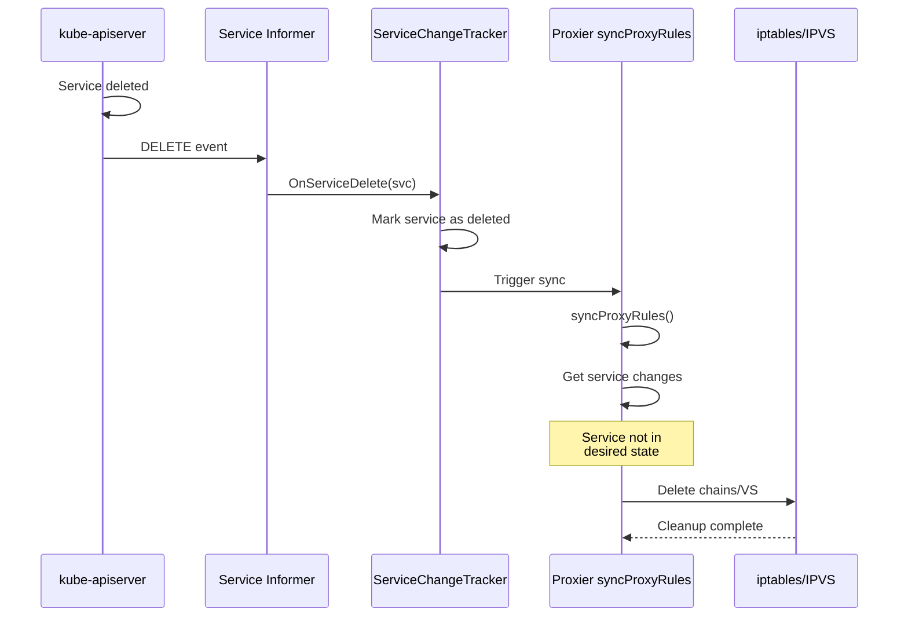
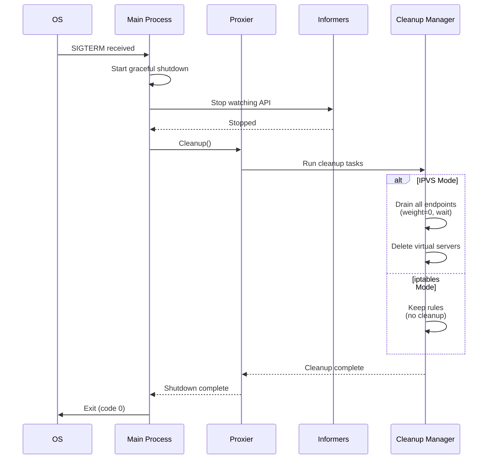

# **Low-Level: Cleanup and Termination**

**Part of**: [kube-proxy Architecture Documentation](../00-README.md)
**Related**:
- [iptables Rules Generation](01-iptables-rules-generation.md)
- [IPVS Configuration](02-ipvs-configuration.md)
- [Sync Loop](04-sync-loop.md)
- [Graceful Termination (IPVS)](02-ipvs-configuration.md#graceful-termination)

━━━━━━━━━━━━━━━━━━━━━━━━━━━━━━━━━━━━━━━━━━━━━━━━━━━━━━━━━━━━━━━━━━━━━━━━━━━━━━

## **📋 Overview**

This document covers cleanup and termination handling in kube-proxy, including service deletion, endpoint removal, graceful termination, orphan rule detection, and shutdown procedures.

### **What You'll Learn**

- Service and endpoint deletion flows
- Graceful termination with weight-based draining (IPVS)
- iptables rule cleanup and atomic replacement
- IPVS virtual/real server deletion
- Orphan rule detection and cleanup
- kube-proxy shutdown sequence
- Cleanup performance optimization

━━━━━━━━━━━━━━━━━━━━━━━━━━━━━━━━━━━━━━━━━━━━━━━━━━━━━━━━━━━━━━━━━━━━━━━━━━━━━━

## **1. Service Deletion**

### **1.1 Service Deletion Flow**



### **1.2 iptables Mode Service Deletion**

**What Gets Deleted**:
- Service chain (KUBE-SVC-*)
- Endpoint chains (KUBE-SEP-*)
- Rules in KUBE-SERVICES pointing to service
- Rules in KUBE-NODEPORTS (if NodePort)

**Deletion Process**:

```go
// pkg/proxy/iptables/proxier.go:1200-1300
func (proxier *Proxier) syncProxyRules() {
    // Get current active services
    activeServices := make(map[ServicePortName]bool)
    for svcName := range proxier.svcPortMap {
        activeServices[svcName] = true
    }

    // Find chains to delete (exist but not in active list)
    for chain := range existingChains {
        if strings.HasPrefix(string(chain), "KUBE-SVC-") {
            svcPortName := parseServiceChain(chain)
            if !activeServices[svcPortName] {
                // Service deleted - mark chain for deletion
                chainsToDelete = append(chainsToDelete, chain)
            }
        }
    }

    // iptables-restore deletes chains not in new ruleset
    // Atomic operation: old rules replaced entirely
}
```

**Atomic Deletion**:

iptables mode uses `iptables-restore` which **atomically replaces** all rules:

```bash
# Old state (before sync)
-A KUBE-SERVICES -d 10.96.0.10/32 ... -j KUBE-SVC-DELETED
-A KUBE-SVC-DELETED -j KUBE-SEP-EP1
-A KUBE-SEP-EP1 -j DNAT ...

# After syncProxyRules (service deleted)
# KUBE-SVC-DELETED chain simply not included in new ruleset
# iptables-restore removes it automatically

# No explicit "delete chain" commands needed
```

### **1.3 IPVS Mode Service Deletion**

**What Gets Deleted**:
- Virtual server entries
- All associated real servers
- ipset entries
- iptables filter rules (if any)

**Deletion Code**:

```go
// pkg/proxy/ipvs/proxier.go:1400-1500
func (proxier *Proxier) syncService(...) {
    // Find virtual servers to delete
    for _, vs := range existingVirtualServers {
        svcPortName := virtualServerToServicePortName(vs)
        if _, exists := proxier.svcPortMap[svcPortName]; !exists {
            // Service deleted - remove virtual server
            proxier.ipvs.DeleteVirtualServer(vs)

            // Delete from ipsets
            proxier.ipsetList.deleteEntry(SetClusterIP, &ipset.Entry{
                IP:       vs.Address.String(),
                Port:     int(vs.Port),
                Protocol: vs.Protocol,
                SetType:  ipset.HashIPPort,
            })
        }
    }
}
```

━━━━━━━━━━━━━━━━━━━━━━━━━━━━━━━━━━━━━━━━━━━━━━━━━━━━━━━━━━━━━━━━━━━━━━━━━━━━━━

## **2. Endpoint Removal**

### **2.1 Endpoint Removal vs Service Deletion**

**Service Deletion**: Remove entire service (all endpoints)
**Endpoint Removal**: Remove specific endpoint(s) while service remains

**Common Scenarios**:
- Pod termination (graceful or immediate)
- Pod becomes not ready (failing health checks)
- Node drain operation
- Scaling down deployment

### **2.2 iptables Mode Endpoint Removal**

**Process**:

```bash
# Before: 3 endpoints
-A KUBE-SVC-XXX -m statistic --probability 0.33333333 -j KUBE-SEP-EP1
-A KUBE-SVC-XXX -m statistic --probability 0.50000000 -j KUBE-SEP-EP2
-A KUBE-SVC-XXX -j KUBE-SEP-EP3

# After: Endpoint 2 removed, probabilities recalculated
-A KUBE-SVC-XXX -m statistic --probability 0.50000000 -j KUBE-SEP-EP1
-A KUBE-SVC-XXX -j KUBE-SEP-EP3

# KUBE-SEP-EP2 chain not included (deleted atomically)
# Probabilities: 1/2, 1/1 (implicit)
```

**Code**:

```go
// pkg/proxy/iptables/proxier.go:1600-1700
// Regenerate service chain with remaining endpoints
for i, endpoint := range endpoints {
    if i < len(endpoints)-1 {
        probability := 1.0 / float64(len(endpoints)-i)
        // Write rule with updated probability
    }
}
// Deleted endpoint's chain (KUBE-SEP-*) not written
// iptables-restore removes it
```

**Immediate Effect**: Next `iptables-restore` removes endpoint, **existing connections continue** via conntrack.

### **2.3 IPVS Mode Graceful Termination**

**Weight-Based Draining**:

```mermaid
gantt
    title Graceful Endpoint Termination
    dateFormat s
    axisFormat %Ss

    section Endpoint State
    Running (weight=100)      :done, 0, 30s
    Terminating (weight=0)    :active, 30s, 55s
    Deleted                   :milestone, 55s

    section Traffic
    Receiving new connections :done, 0, 30s
    NO new connections        :crit, 30s, 55s
    Existing connections drain:active, 30s, 55s

    section Connections
    10 active                 :done, 0, 35s
    8 active                  :active, 35s, 42s
    4 active                  :active, 42s, 50s
    0 active                  :milestone, 55s
```

**Implementation**:

```go
// pkg/proxy/ipvs/graceful_termination.go:100-200
type GracefulTerminationManager struct {
    ipvs         utilipvs.Interface
    rsDeleteChan chan *terminatingRS
}

func (m *GracefulTerminationManager) MoveRSOutOfGracefulDelete(rs *RealServer) {
    // Phase 1: Set weight to 0 (stop new connections)
    rs.Weight = 0
    m.ipvs.UpdateRealServer(vs, rs)

    // Phase 2: Monitor existing connections
    go m.tryDeleteRS(vs, rs)
}

func (m *GracefulTerminationManager) tryDeleteRS(vs *VirtualServer, rs *RealServer) {
    ticker := time.NewTicker(1 * time.Second)
    defer ticker.Stop()

    for range ticker.C {
        // Check active connections
        activeConns, err := m.ipvs.GetRealServerActiveConns(vs, rs)
        if err != nil || activeConns == 0 {
            // Safe to delete - no active connections
            m.ipvs.DeleteRealServer(vs, rs)
            return
        }
        // Still has connections, keep waiting
    }
}
```

**Real Server States**:

```bash
# ipvsadm output during graceful termination

# T+0s: Normal operation
TCP  10.96.0.10:80 rr
  -> 10.244.1.5:8080   Masq  100    5    10   # Normal
  -> 10.244.2.7:8080   Masq  100    4    12   # Normal
  -> 10.244.3.9:8080   Masq  100    6    8    # Normal

# T+30s: Pod 2 terminating, weight set to 0
TCP  10.96.0.10:80 rr
  -> 10.244.1.5:8080   Masq  100    5    10
  -> 10.244.2.7:8080   Masq    0    4    12   # Weight=0, no new connections
  -> 10.244.3.9:8080   Masq  100    6    8

# T+45s: Connections draining
TCP  10.96.0.10:80 rr
  -> 10.244.1.5:8080   Masq  100    8    15
  -> 10.244.2.7:8080   Masq    0    1    15   # ActiveConn decreasing
  -> 10.244.3.9:8080   Masq  100    9    14

# T+55s: All connections drained, endpoint deleted
TCP  10.96.0.10:80 rr
  -> 10.244.1.5:8080   Masq  100   12    20
  -> 10.244.3.9:8080   Masq  100   13    18
  # 10.244.2.7 removed
```

**Graceful Termination Timeout**:

```go
// Maximum wait time before force deletion
const gracefulTerminationTimeout = 30 * time.Second

func (m *GracefulTerminationManager) tryDeleteRS(...) {
    timeout := time.After(gracefulTerminationTimeout)

    for {
        select {
        case <-timeout:
            // Force delete after timeout
            m.ipvs.DeleteRealServer(vs, rs)
            return

        case <-ticker.C:
            if activeConns == 0 {
                m.ipvs.DeleteRealServer(vs, rs)
                return
            }
        }
    }
}
```

━━━━━━━━━━━━━━━━━━━━━━━━━━━━━━━━━━━━━━━━━━━━━━━━━━━━━━━━━━━━━━━━━━━━━━━━━━━━━━

## **3. Orphan Detection and Cleanup**

### **3.1 What Are Orphans?**

**Orphan rules/resources**: Created by kube-proxy but no longer associated with any active service.

**Causes**:
- kube-proxy crash during sync
- Failed sync (partial update)
- Service/endpoint deleted while kube-proxy down
- Version upgrade with naming changes

### **3.2 iptables Orphan Detection**

**Detection Logic**:

```go
// pkg/proxy/iptables/proxier.go:900-1000
func (proxier *Proxier) syncProxyRules() {
    // Get all existing chains
    existingChains := getExistingChains()

    // Build set of desired chains
    desiredChains := make(map[Chain]bool)
    for svcPortName, svcInfo := range proxier.svcPortMap {
        svcChain := servicePortChainName(svcPortName, protocol)
        desiredChains[svcChain] = true

        for _, endpoint := range endpoints {
            epChain := servicePortEndpointChainName(svcPortName, protocol, endpoint)
            desiredChains[epChain] = true
        }
    }

    // Find orphans: exist but not desired
    for chain := range existingChains {
        if strings.HasPrefix(string(chain), "KUBE-") {
            if !desiredChains[chain] {
                // Orphan detected
                klog.V(2).Infof("Deleting orphaned chain: %s", chain)
                // Not included in iptables-restore = deleted
            }
        }
    }
}
```

**Automatic Cleanup**:

iptables mode's use of `iptables-restore` provides **automatic orphan cleanup**:

```bash
# Existing (with orphan)
-N KUBE-SVC-DELETED-ORPHAN
-A KUBE-SVC-DELETED-ORPHAN -j KUBE-SEP-ORPHAN1

# New ruleset generated by syncProxyRules
# (orphan chains not included)

# After iptables-restore
# Orphan chains automatically deleted
# No explicit cleanup code needed!
```

### **3.3 IPVS Orphan Detection**

**Detection and Cleanup**:

```go
// pkg/proxy/ipvs/proxier.go:1300-1400
func (proxier *Proxier) cleanupOrphanedResources() {
    // Get all virtual servers
    vss, _ := proxier.ipvs.GetVirtualServers()

    for _, vs := range vss {
        // Check if this VS corresponds to an active service
        svcPortName := virtualServerToServicePortName(vs)

        if _, exists := proxier.svcPortMap[svcPortName]; !exists {
            // Orphan virtual server
            klog.V(2).Infof("Deleting orphaned virtual server: %s", vs.String())
            proxier.ipvs.DeleteVirtualServer(vs)
        } else {
            // VS is valid, check real servers
            rss, _ := proxier.ipvs.GetRealServers(vs)

            for _, rs := range rss {
                if !isDesiredEndpoint(rs, proxier.endpointsMap[svcPortName]) {
                    // Orphan real server
                    klog.V(2).Infof("Deleting orphaned real server: %s", rs.String())
                    proxier.ipvs.DeleteRealServer(vs, rs)
                }
            }
        }
    }

    // Clean up orphaned ipset entries
    proxier.cleanupOrphanedIPSetEntries()
}
```

**Periodic Cleanup**:

```go
// Run orphan cleanup every 5 minutes
go wait.Until(func() {
    proxier.cleanupOrphanedResources()
}, 5*time.Minute, wait.NeverStop)
```

━━━━━━━━━━━━━━━━━━━━━━━━━━━━━━━━━━━━━━━━━━━━━━━━━━━━━━━━━━━━━━━━━━━━━━━━━━━━━━

## **4. kube-proxy Shutdown**

### **4.1 Shutdown Sequence**



**Shutdown Code**:

```go
// cmd/kube-proxy/app/server.go:500-600
func (o *Options) Run() error {
    // Setup signal handling
    ctx, cancel := context.WithCancel(context.Background())
    defer cancel()

    signalCh := make(chan os.Signal, 1)
    signal.Notify(signalCh, syscall.SIGTERM, syscall.SIGINT)

    // Run proxier
    go proxier.SyncLoop()

    // Wait for shutdown signal
    <-signalCh
    klog.Info("Received shutdown signal, starting graceful shutdown")

    // Stop informers (no new events)
    informerFactory.Shutdown()

    // Cleanup (if configured)
    if o.CleanupAndExit {
        proxier.Cleanup()
    }

    return nil
}
```

### **4.2 Cleanup on Exit**

**iptables Mode** (default: NO cleanup):
- Rules left in place for **zero-downtime rolling update**
- New kube-proxy instance takes over immediately
- If cleanup forced: Flush all KUBE-* chains

**IPVS Mode** (default: graceful drain):
- Set all real servers to weight=0
- Wait for connections to drain (up to 30s)
- Delete virtual servers
- Clean up ipsets

**Cleanup Configuration**:

```bash
# Force cleanup on exit
kube-proxy --cleanup

# Expected behavior:
# - iptables: Delete all KUBE-* chains
# - IPVS: Drain and delete all virtual servers
```

━━━━━━━━━━━━━━━━━━━━━━━━━━━━━━━━━━━━━━━━━━━━━━━━━━━━━━━━━━━━━━━━━━━━━━━━━━━━━━

## **5. Performance Optimization**

### **5.1 Batch Deletion**

**Problem**: Deleting endpoints one-by-one is slow.

**Solution**: Batch operations in single sync.

```go
// iptables: Single iptables-restore (all deletes atomic)
// IPVS: Batch real server deletions

rsToDelete := []*RealServer{}
for _, rs := range orphanedRealServers {
    rsToDelete = append(rsToDelete, rs)
}

// Delete in batch
for _, rs := range rsToDelete {
    proxier.ipvs.DeleteRealServer(vs, rs)
}
```

### **5.2 Cleanup Frequency**

**Orphan Cleanup Intervals**:

| Cluster Size | Orphan Cleanup Interval | Reasoning |
|--------------|-------------------------|-----------|
| < 100 nodes | 5 minutes | Low overhead, frequent cleanup |
| 100-500 nodes | 10 minutes | Balance cleanup and performance |
| 500-1000 nodes | 15 minutes | Reduce sync overhead |
| > 1000 nodes | 30 minutes | Minimize performance impact |

```go
cleanupInterval := calculateCleanupInterval(clusterSize)
go wait.Until(cleanupOrphans, cleanupInterval, stopCh)
```

━━━━━━━━━━━━━━━━━━━━━━━━━━━━━━━━━━━━━━━━━━━━━━━━━━━━━━━━━━━━━━━━━━━━━━━━━━━━━━

## **6. Troubleshooting**

### **6.1 Orphaned Rules/Resources**

**Symptoms**:
- Growing number of KUBE-* chains over time
- IPVS virtual servers for deleted services
- Memory usage increasing

**Diagnosis**:

```bash
# iptables: Count chains
iptables-save | grep "^:KUBE-" | wc -l

# Compare with expected (should be ~2-3x service count)
kubectl get svc --all-namespaces | wc -l

# IPVS: List virtual servers
ipvsadm -Ln | grep "TCP\|UDP" | wc -l

# Compare with services
kubectl get svc --all-namespaces | wc -l
```

**Solutions**:

1. **Manual cleanup** (iptables):
```bash
# List all KUBE chains
iptables-save | grep "^:KUBE-" > /tmp/chains.txt

# Manually verify and delete orphans
iptables -t nat -X KUBE-ORPHAN-CHAIN
```

2. **Restart kube-proxy** (triggers full resync and cleanup)

3. **Enable debug logging** to identify cleanup issues:
```bash
kube-proxy --v=4
# Look for "Deleting orphaned" messages
```

### **6.2 Slow Endpoint Removal**

**Symptom**: Deleted pods still receiving traffic.

**Diagnosis**:

```bash
# Check sync latency
kubectl logs -n kube-system kube-proxy-xxx | grep "SyncProxyRules took"

# Check endpoint update lag
kubectl get endpoints <service> -o yaml
# Compare with actual pods

# IPVS: Check real server state
ipvsadm -Ln | grep <pod-ip>
# Should not appear after pod deletion
```

**Solutions**:

1. **Tune sync period**:
```bash
kube-proxy --iptables-min-sync-period=1s  # Faster syncs
```

2. **Check conntrack** (may keep old connections alive):
```bash
conntrack -L | grep <pod-ip>
# Old connections persist until timeout
```

━━━━━━━━━━━━━━━━━━━━━━━━━━━━━━━━━━━━━━━━━━━━━━━━━━━━━━━━━━━━━━━━━━━━━━━━━━━━━━

## **7. Summary**

### **Key Takeaways**

1. **Service Deletion**: Atomic in both modes (iptables-restore, IPVS API calls)
2. **Endpoint Removal**: Immediate in iptables, graceful in IPVS (weight-based draining)
3. **Graceful Termination**: IPVS sets weight=0, waits for connection drain (up to 30s)
4. **Orphan Cleanup**: Automatic in iptables (via restore), periodic in IPVS
5. **Shutdown**: No cleanup by default in iptables (zero-downtime), graceful drain in IPVS

### **Code References**

- `pkg/proxy/iptables/proxier.go:900-1000` - Orphan detection (iptables)
- `pkg/proxy/ipvs/proxier.go:1300-1400` - Orphan cleanup (IPVS)
- `pkg/proxy/ipvs/graceful_termination.go:100-200` - Graceful draining
- `cmd/kube-proxy/app/server.go:500-600` - Shutdown handling

---

*Last Updated*: Session 13
*Status*: ✅ Complete
*Part of*: [kube-proxy Architecture Documentation](../00-README.md)
