# Service Types Implementation in kube-proxy

**Document Status**: ✅ Complete
**Last Updated**: 2024
**Applies to**: Kubernetes v1.28+

## Table of Contents

1. [Overview](#overview)
2. [Service Type Hierarchy](#service-type-hierarchy)
3. [Service Type Detection and Filtering](#service-type-detection-and-filtering)
4. [ClusterIP Services](#clusterip-services)
5. [NodePort Services](#nodeport-services)
6. [LoadBalancer Services](#loadbalancer-services)
7. [ExternalIPs](#externalips)
8. [Headless Services](#headless-services)
9. [ExternalName Services](#externalname-services)
10. [Traffic Policy Impact](#traffic-policy-impact)
11. [Packet Flow Examples](#packet-flow-examples)
12. [Configuration Options](#configuration-options)
13. [Comparison: iptables vs IPVS](#comparison-iptables-vs-ipvs)
14. [Troubleshooting](#troubleshooting)
15. [Best Practices](#best-practices)
16. [Summary](#summary)

---

## Overview

Kubernetes defines several **Service types** that determine how a Service is exposed and accessed. kube-proxy is responsible for implementing the network programming that makes these Service types function correctly.

### Service Types Defined by Kubernetes

```mermaid
graph TD
    A[Kubernetes Service Types] --> B[ClusterIP]
    A --> C[NodePort]
    A --> D[LoadBalancer]
    A --> E[ExternalName]
    A --> F[Headless<br/>ClusterIP: None]

    B --> B1[Default type]
    B --> B2[Internal cluster access only]
    B --> B3[Assigned virtual IP]

    C --> C1[Extends ClusterIP]
    C --> C2[Opens port on all nodes]
    C --> C3[External access via node IP]

    D --> D1[Extends NodePort]
    D --> D2[Provisions cloud load balancer]
    D --> D3[External IP from cloud provider]

    E --> E1[DNS CNAME record]
    E --> E2[No proxying by kube-proxy]
    E --> E3[DNS resolution only]

    F --> F1[No virtual IP assigned]
    F --> F2[No load balancing]
    F --> F3[Direct pod DNS records]

    style A fill:#326CE5,color:#fff
    style B fill:#4CAF50,color:#fff
    style C fill:#FF9800,color:#fff
    style D fill:#F44336,color:#fff
    style E fill:#9C27B0,color:#fff
    style F fill:#607D8B,color:#fff
```

**Location**: staging/src/k8s.io/api/core/v1/types.go:5633-5655

```go
type ServiceType string

const (
    // ServiceTypeClusterIP - accessible only inside cluster via ClusterIP
    ServiceTypeClusterIP ServiceType = "ClusterIP"

    // ServiceTypeNodePort - exposed on every node port + ClusterIP
    ServiceTypeNodePort ServiceType = "NodePort"

    // ServiceTypeLoadBalancer - exposed via external LB + NodePort + ClusterIP
    ServiceTypeLoadBalancer ServiceType = "LoadBalancer"

    // ServiceTypeExternalName - DNS CNAME record, no proxying
    ServiceTypeExternalName ServiceType = "ExternalName"
)
```

### kube-proxy's Role

kube-proxy implements the network programming for service types **except**:
- ❌ **ExternalName** services (DNS-only, handled by CoreDNS/kube-dns)
- ❌ **Headless** services (ClusterIP: None, DNS-only)

For all other service types, kube-proxy:
1. **Watches** Service and EndpointSlice API objects
2. **Programs** iptables rules or IPVS virtual servers
3. **Implements** load balancing across endpoints
4. **Applies** traffic policies and session affinity
5. **Handles** source IP preservation and masquerading

---

## Service Type Hierarchy

Service types in Kubernetes follow a **hierarchical model** where more complex types include all features of simpler types:

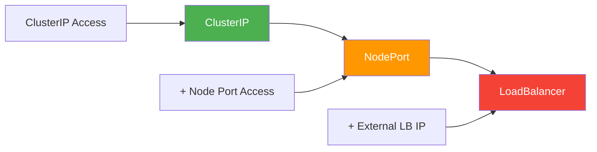

### Hierarchical Features

| Service Type | ClusterIP | NodePort | ExternalIPs | LoadBalancer IP |
|--------------|-----------|----------|-------------|-----------------|
| **ClusterIP** | ✅ | ❌ | Optional | ❌ |
| **NodePort** | ✅ | ✅ | Optional | ❌ |
| **LoadBalancer** | ✅ | ✅ | Optional | ✅ |
| **ExternalName** | ❌ (DNS only) | ❌ | ❌ | ❌ |
| **Headless** | ❌ (None) | ❌ | ❌ | ❌ |

**Key Insight**: A LoadBalancer service gets:
1. A **ClusterIP** for internal access
2. A **NodePort** for direct node access
3. One or more **LoadBalancer IPs** for external access
4. Optional **ExternalIPs** for additional external access points

### Implementation in kube-proxy

kube-proxy implements this hierarchy by creating **multiple access paths** for services:

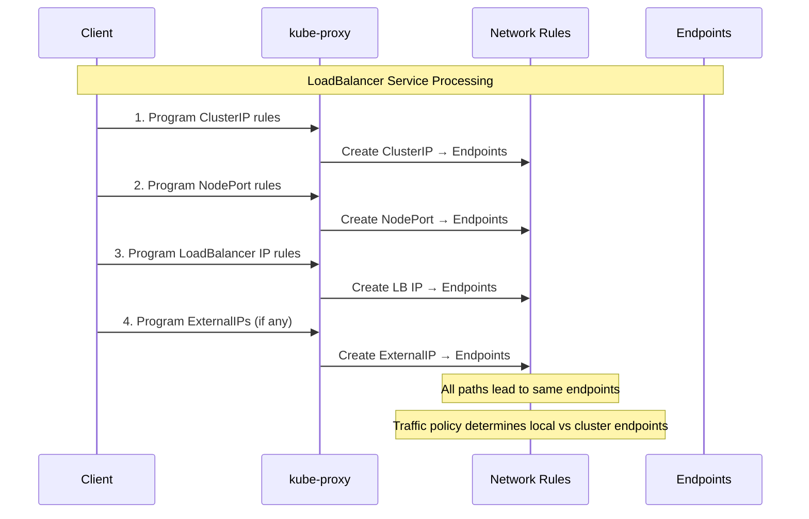

**Code Reference**: Both iptables and IPVS modes iterate through service properties:
- **iptables**: pkg/proxy/iptables/proxier.go:1020-1180
- **IPVS**: pkg/proxy/ipvs/proxier.go:1020-1380

---

## Service Type Detection and Filtering

### Service Filtering Logic

kube-proxy filters out services that it should **not** proxy:

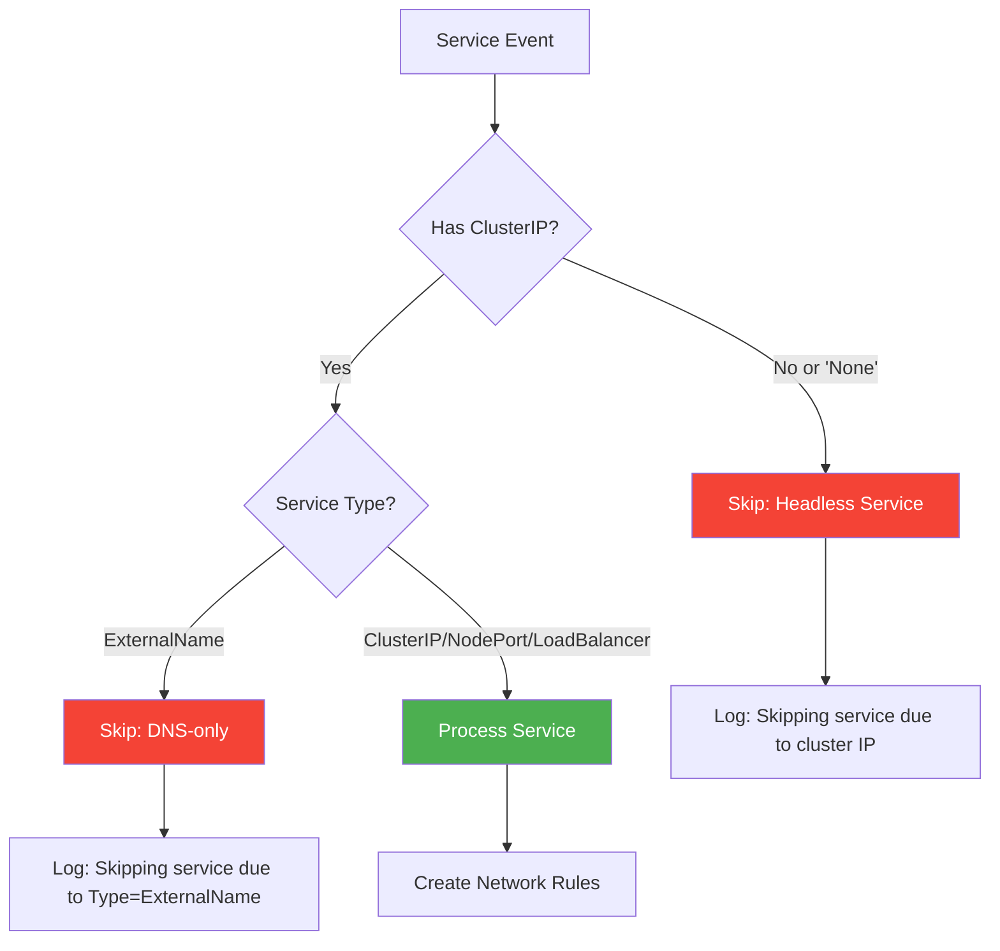

**Location**: pkg/proxy/util/utils.go:56-69

```go
// ShouldSkipService returns true if the service should not be proxied
func ShouldSkipService(service *v1.Service) bool {
    // Skip headless services (ClusterIP = "None" or empty)
    if !helper.IsServiceIPSet(service) {
        klog.V(3).InfoS("Skipping service due to cluster IP",
            "service", klog.KObj(service),
            "clusterIP", service.Spec.ClusterIP)
        return true
    }

    // Skip ExternalName services (DNS-only)
    if service.Spec.Type == v1.ServiceTypeExternalName {
        klog.V(3).InfoS("Skipping service due to Type=ExternalName",
            "service", klog.KObj(service))
        return true
    }

    return false
}
```

### Service Port Information Structure

All proxy modes use a common structure to represent service port information:

**Location**: pkg/proxy/serviceport.go:75-88

```go
type BaseServicePortInfo struct {
    clusterIP                net.IP           // ClusterIP address
    port                     int              // Service port
    protocol                 v1.Protocol      // TCP, UDP, or SCTP
    nodePort                 int              // NodePort (0 if not NodePort/LoadBalancer)
    loadBalancerVIPs         []net.IP         // LoadBalancer IPs
    sessionAffinityType      v1.ServiceAffinity
    stickyMaxAgeSeconds      int
    externalIPs              []net.IP         // ExternalIPs field
    loadBalancerSourceRanges []*net.IPNet     // Source IP restrictions
    healthCheckNodePort      int              // For externalTrafficPolicy=Local
    externalPolicyLocal      bool             // ExternalTrafficPolicy=Local
    internalPolicyLocal      bool             // InternalTrafficPolicy=Local
}
```

### Service Classification Methods

**Location**: pkg/proxy/serviceport.go:158-173

```go
// ExternallyAccessible returns true if the service has external access points
func (info *BaseServicePortInfo) ExternallyAccessible() bool {
    return info.nodePort != 0 ||
           len(info.loadBalancerVIPs) != 0 ||
           len(info.externalIPs) != 0
}

// UsesClusterEndpoints returns true if service uses cluster-wide endpoints
func (info *BaseServicePortInfo) UsesClusterEndpoints() bool {
    // Use cluster endpoints if:
    // - InternalTrafficPolicy is Cluster, OR
    // - Service is externally accessible (external traffic uses cluster endpoints by default)
    return !info.internalPolicyLocal || info.ExternallyAccessible()
}

// UsesLocalEndpoints returns true if service uses local (node-local) endpoints
func (info *BaseServicePortInfo) UsesLocalEndpoints() bool {
    // Use local endpoints if:
    // - InternalTrafficPolicy is Local, OR
    // - ExternalTrafficPolicy is Local AND service is externally accessible
    return info.internalPolicyLocal ||
           (info.externalPolicyLocal && info.ExternallyAccessible())
}
```

---

## ClusterIP Services

**ClusterIP** is the **default** service type. It exposes the service on a cluster-internal virtual IP address.

### Characteristics

- ✅ **Default** service type (when type not specified)
- ✅ **Internal access only** - only accessible from within the cluster
- ✅ **Virtual IP** - kube-apiserver allocates IP from service CIDR
- ✅ **Stable** - IP persists for lifetime of service
- ✅ **DNS record** - gets `<service>.<namespace>.svc.cluster.local`

### YAML Example

```yaml
apiVersion: v1
kind: Service
metadata:
  name: my-service
  namespace: default
spec:
  type: ClusterIP  # Default, can be omitted
  selector:
    app: my-app
  ports:
  - name: http
    protocol: TCP
    port: 80          # Service port
    targetPort: 8080  # Pod port
  clusterIP: 10.96.1.100  # Auto-assigned if not specified
  sessionAffinity: None
```

### ClusterIP Allocation

**Allocation by kube-apiserver** (not kube-proxy):
- **CIDR**: Configured via `--service-cluster-ip-range` flag
- **Default range**: Typically `10.96.0.0/12` (10.96.0.0 - 10.111.255.255)
- **Dual-stack**: Separate ranges for IPv4 and IPv6
- **Reserved IPs**:
  - First IP (`.0`): Reserved for network address
  - Usually `.1`: `kubernetes` service in `default` namespace
  - Last IP (`.255` for /24): Broadcast address (though not used)

### iptables Mode Implementation

**Location**: pkg/proxy/iptables/proxier.go:1033-1052

```go
// Capture the clusterIP
if hasInternalEndpoints {
    args := []string{
        "-A", string(kubeServicesChain),
        "-m", "comment", "--comment", fmt.Sprintf(`"%s cluster IP"`, svcPortNameString),
        "-m", protocol, "-p", protocol,
        "-d", svcInfo.ClusterIP().String(),
        "--dport", strconv.Itoa(svcInfo.Port()),
    }

    if svcInfo.SessionAffinityType() == v1.ServiceAffinityClientIP {
        args = append(args,
            "-m", "recent", "--name", string(internalTrafficChain),
            "--rcheck", "--seconds", strconv.Itoa(svcInfo.StickyMaxAgeSeconds()),
            "--reap")
    }

    args = append(args, "-j", string(internalTrafficChain))
    natRules.Write(args...)
}
```

#### Generated iptables Rules

For a ClusterIP service `default/my-service` with ClusterIP `10.96.1.100:80` and 3 endpoints:

```bash
# Main service chain entry
-A KUBE-SERVICES -d 10.96.1.100/32 -p tcp -m tcp --dport 80 \
   -m comment --comment "default/my-service:http cluster IP" \
   -j KUBE-SVC-ABCDEFGHIJKLMNOP

# Service chain (load balancing with probability)
-A KUBE-SVC-ABCDEFGHIJKLMNOP \
   -m comment --comment "default/my-service:http -> 10.244.1.5:8080" \
   -m statistic --mode random --probability 0.33333333 \
   -j KUBE-SEP-AAAAAAAAAAAAAAAA

-A KUBE-SVC-ABCDEFGHIJKLMNOP \
   -m comment --comment "default/my-service:http -> 10.244.2.7:8080" \
   -m statistic --mode random --probability 0.50000000 \
   -j KUBE-SEP-BBBBBBBBBBBBBBBB

-A KUBE-SVC-ABCDEFGHIJKLMNOP \
   -m comment --comment "default/my-service:http -> 10.244.3.9:8080" \
   -j KUBE-SEP-CCCCCCCCCCCCCCCC

# Endpoint chains (DNAT to pod IP)
-A KUBE-SEP-AAAAAAAAAAAAAAAA -p tcp -m tcp \
   -j DNAT --to-destination 10.244.1.5:8080

-A KUBE-SEP-BBBBBBBBBBBBBBBB -p tcp -m tcp \
   -j DNAT --to-destination 10.244.2.7:8080

-A KUBE-SEP-CCCCCCCCCCCCCCCC -p tcp -m tcp \
   -j DNAT --to-destination 10.244.3.9:8080
```

#### Chain Structure

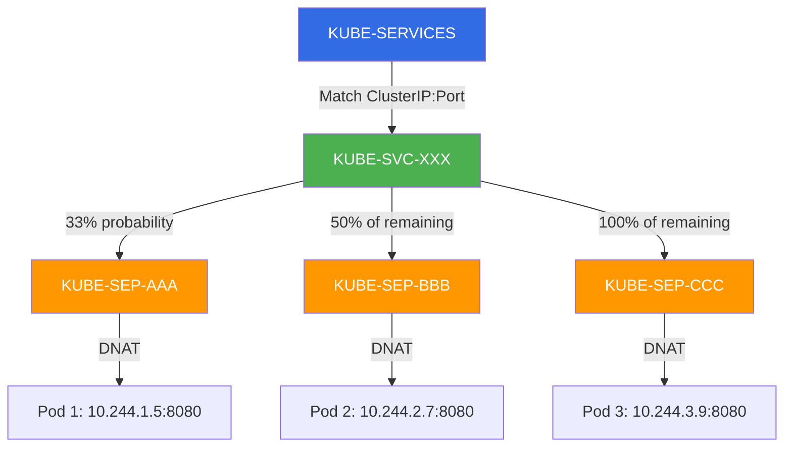

### IPVS Mode Implementation

**Location**: pkg/proxy/ipvs/proxier.go:1034-1067

```go
// Create IPVS virtual server for ClusterIP
serv := &utilipvs.VirtualServer{
    Address:   svcInfo.ClusterIP(),
    Port:      uint16(svcInfo.Port()),
    Protocol:  string(svcInfo.Protocol()),
    Scheduler: proxier.ipvsScheduler,  // Default: "rr" (round-robin)
}

// Session affinity configuration
if svcInfo.SessionAffinityType() == v1.ServiceAffinityClientIP {
    serv.Flags |= utilipvs.FlagPersistent
    serv.Timeout = uint32(svcInfo.StickyMaxAgeSeconds())
}

// Bind ClusterIP to dummy interface (kube-ipvs0)
if err := proxier.syncService(svcPortNameString, serv, true, alreadyBoundAddrs); err != nil {
    klog.ErrorS(err, "Failed to sync service", "service", svcPortNameString)
}

// Add real servers (endpoints)
if err := proxier.syncEndpoint(svcPortName, false, serv); err != nil {
    klog.ErrorS(err, "Failed to sync endpoint", "service", svcPortName)
}
```

#### IPVS Configuration

```bash
# View IPVS virtual servers
$ ipvsadm -Ln

IP Virtual Server version 1.2.1 (size=4096)
Prot LocalAddress:Port Scheduler Flags
  -> RemoteAddress:Port           Forward Weight ActiveConn InActConn
TCP  10.96.1.100:80 rr
  -> 10.244.1.5:8080               Masq    1      0          0
  -> 10.244.2.7:8080               Masq    1      0          0
  -> 10.244.3.9:8080               Masq    1      0          0
```

#### Dummy Interface IP Binding

ClusterIPs are bound to the **kube-ipvs0** dummy interface:

```bash
$ ip addr show kube-ipvs0
5: kube-ipvs0: <BROADCAST,NOARP> mtu 1500 qdisc noop state DOWN group default
    link/ether xx:xx:xx:xx:xx:xx brd ff:ff:ff:ff:ff:ff
    inet 10.96.0.1/32 scope global kube-ipvs0
    inet 10.96.0.10/32 scope global kube-ipvs0
    inet 10.96.1.100/32 scope global kube-ipvs0
    ...
```

**Why?** Linux routing requires a local IP to send packets to IPVS. The dummy interface provides a local destination for ClusterIP traffic.

#### IPSet Usage

**Location**: pkg/proxy/ipvs/ipset.go:34-36

ClusterIP services are added to the `KUBE-CLUSTER-IP` ipset for masquerading:

```bash
$ ipset list KUBE-CLUSTER-IP

Name: KUBE-CLUSTER-IP
Type: hash:ip,port
Members:
10.96.1.100,tcp:80
10.96.2.50,tcp:443
10.96.3.80,udp:53
...
```

**iptables integration** (for masquerading):

```bash
-A KUBE-POSTROUTING -m set --match-set KUBE-CLUSTER-IP dst,dst \
   -m mark --mark 0x4000/0x4000 -j MASQUERADE
```

### Packet Flow: ClusterIP

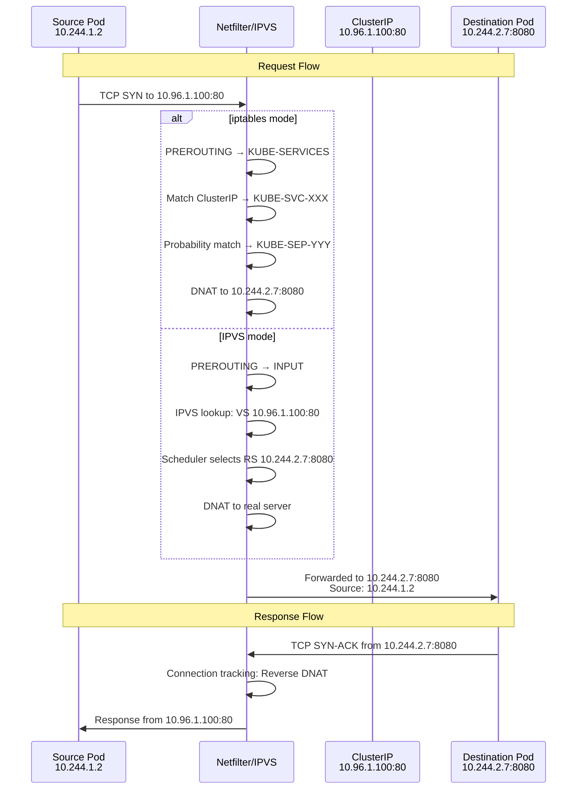

**Key Points**:
1. **Source IP preserved**: Pod-to-pod via ClusterIP preserves source pod IP
2. **No masquerading needed**: Traffic stays within cluster network
3. **Symmetric path**: Return traffic follows reverse path via connection tracking

---

## NodePort Services

**NodePort** services extend ClusterIP by opening a port on **every node** in the cluster, allowing external access.

### Characteristics

- ✅ **Extends ClusterIP** - includes all ClusterIP functionality
- ✅ **External access** - accessible via `<NodeIP>:<NodePort>`
- ✅ **Port on all nodes** - same port opened on every node
- ✅ **Port range** - typically 30000-32767 (configurable)
- ✅ **Static or dynamic** - can specify port or let Kubernetes allocate
- ⚠️ **No HA** - if node goes down, that access point is lost (use LoadBalancer for HA)

### YAML Example

```yaml
apiVersion: v1
kind: Service
metadata:
  name: my-nodeport-service
  namespace: default
spec:
  type: NodePort
  selector:
    app: my-app
  ports:
  - name: http
    protocol: TCP
    port: 80          # ClusterIP port
    targetPort: 8080  # Pod port
    nodePort: 30080   # NodePort (auto-assigned if omitted)
```

### Port Allocation

**NodePort range configuration**:
- **Default**: 30000-32767 (2768 ports)
- **Configurable**: kube-apiserver flag `--service-node-port-range`
- **Location**: pkg/kubeapiserver/options/options.go:27

```go
DefaultServiceNodePortRange = utilnet.PortRange{Base: 30000, Size: 2768}
```

**Allocation by kube-apiserver**:
1. **Explicit nodePort**: User specifies port in spec
2. **Auto-allocation**: apiserver allocates from available ports in range
3. **Conflict detection**: Port must be unique across all NodePort services

### iptables Mode Implementation

**Location**: pkg/proxy/iptables/proxier.go:1120-1156

```go
// Capture nodeports
if svcInfo.NodePort() != 0 {
    if hasEndpoints {
        // Localhost NodePort support (IPv4 only)
        if proxier.localhostNodePorts && proxier.ipFamily == v1.IPv4Protocol {
            natRules.Write(
                "-A", string(kubeNodePortsChain),
                "-m", "comment", "--comment", svcPortNameString,
                "-m", protocol, "-p", protocol,
                "-d", "127.0.0.0/8",
                "--dport", strconv.Itoa(svcInfo.NodePort()),
                "-j", string(externalTrafficChain))
        }

        // Regular NodePort rule
        natRules.Write(
            "-A", string(kubeNodePortsChain),
            "-m", "comment", "--comment", svcPortNameString,
            "-m", protocol, "-p", protocol,
            "--dport", strconv.Itoa(svcInfo.NodePort()),
            "-j", string(externalTrafficChain))
    }
}
```

#### Generated iptables Rules

For a NodePort service with NodePort `30080`:

```bash
# PREROUTING: Capture external traffic
-A PREROUTING -m comment --comment "kubernetes service portals" \
   -j KUBE-SERVICES

# KUBE-SERVICES: Jump to KUBE-NODEPORTS for non-cluster traffic
-A KUBE-SERVICES -m comment --comment "kubernetes service nodeports" \
   -m addrtype --dst-type LOCAL -j KUBE-NODEPORTS

# KUBE-NODEPORTS: Match NodePort
-A KUBE-NODEPORTS -p tcp -m tcp --dport 30080 \
   -m comment --comment "default/my-nodeport-service:http" \
   -j KUBE-EXT-ABCDEFGHIJKLMNOP

# External traffic chain (marks for masquerade)
-A KUBE-EXT-ABCDEFGHIJKLMNOP \
   -m comment --comment "masquerade traffic for external access" \
   -j KUBE-MARK-MASQ

# Jump to service chain
-A KUBE-EXT-ABCDEFGHIJKLMNOP \
   -m comment --comment "route to service endpoints" \
   -j KUBE-SVC-ABCDEFGHIJKLMNOP

# POSTROUTING: Apply masquerade
-A POSTROUTING -m comment --comment "kubernetes postrouting rules" \
   -j KUBE-POSTROUTING

-A KUBE-POSTROUTING -m mark --mark 0x4000/0x4000 \
   -j MASQUERADE
```

#### Localhost NodePort Access

**Configuration**: `--iptables-localhost-nodeports` flag (default: true)

When enabled, NodePort services are accessible on `127.0.0.1:<nodePort>`:

```bash
# Localhost NodePort rule (IPv4 only)
-A KUBE-NODEPORTS -p tcp -m tcp \
   -d 127.0.0.0/8 --dport 30080 \
   -m comment --comment "default/my-nodeport-service:http" \
   -j KUBE-EXT-ABCDEFGHIJKLMNOP
```

**Requirement**: Sysctl `net.ipv4.conf.all.route_localnet=1`

**Location**: pkg/proxy/iptables/proxier.go:239-244

```go
if proxier.localhostNodePorts {
    if err := utilproxy.EnsureSysctl(proxier.sysctl, sysctlRouteLocalnet, 1); err != nil {
        return nil, fmt.Errorf("can't set sysctl %s: %w", sysctlRouteLocalnet, err)
    }
}
```

### IPVS Mode Implementation

**Location**: pkg/proxy/ipvs/proxier.go:1233-1353

```go
if svcInfo.NodePort() != 0 {
    var nodePortSet *IPSet
    var entries []*utilipset.Entry

    // Protocol-specific ipset selection
    switch protocol {
    case utilipset.ProtocolTCP:
        nodePortSet = proxier.ipsetList[kubeNodePortSetTCP]
        entries = []*utilipset.Entry{{
            Port:     svcInfo.NodePort(),
            Protocol: protocol,
            SetType:  utilipset.BitmapPort,
        }}
    case utilipset.ProtocolUDP:
        nodePortSet = proxier.ipsetList[kubeNodePortSetUDP]
        // Similar structure
    case utilipset.ProtocolSCTP:
        // SCTP uses hash:ip,port for all node IPs
        nodePortSet = proxier.ipsetList[kubeNodePortSetSCTP]
        for _, nodeIP := range nodeIPs {
            entries = append(entries, &utilipset.Entry{
                IP:       nodeIP.String(),
                Port:     svcInfo.NodePort(),
                Protocol: protocol,
                SetType:  utilipset.HashIPPort,
            })
        }
    }

    // Add entries to ipset
    for _, entry := range entries {
        nodePortSet.activeEntries.Insert(entry.String())
    }

    // ExternalTrafficPolicy=Local handling
    if svcInfo.ExternalPolicyLocal() {
        var nodePortLocalSet *IPSet
        switch protocol {
        case utilipset.ProtocolTCP:
            nodePortLocalSet = proxier.ipsetList[kubeNodePortLocalSetTCP]
        case utilipset.ProtocolUDP:
            nodePortLocalSet = proxier.ipsetList[kubeNodePortLocalSetUDP]
        case utilipset.ProtocolSCTP:
            nodePortLocalSet = proxier.ipsetList[kubeNodePortLocalSetSCTP]
        }
        for _, entry := range entries {
            nodePortLocalSet.activeEntries.Insert(entry.String())
        }
    }

    // Create IPVS virtual servers for each node IP
    for _, nodeIP := range nodeIPs {
        serv := &utilipvs.VirtualServer{
            Address:   nodeIP,
            Port:      uint16(svcInfo.NodePort()),
            Protocol:  string(svcInfo.Protocol()),
            Scheduler: proxier.ipvsScheduler,
        }
        // Don't bind node IP to dummy interface (bindAddr = false)
        proxier.syncService(svcPortNameString, serv, false, alreadyBoundAddrs)
        proxier.syncEndpoint(svcPortName, svcInfo.ExternalPolicyLocal(), serv)
    }
}
```

#### IPSet Usage for NodePort

IPVS uses **separate ipsets per protocol**:

| IPSet Name | Type | Protocol | Purpose |
|------------|------|----------|---------|
| `KUBE-NODE-PORT-TCP` | bitmap:port | TCP | TCP NodePorts |
| `KUBE-NODE-PORT-UDP` | bitmap:port | UDP | UDP NodePorts |
| `KUBE-NODE-PORT-SCTP` | hash:ip,port | SCTP | SCTP NodePorts |
| `KUBE-NODE-PORT-LOCAL-TCP` | bitmap:port | TCP | TCP with externalTrafficPolicy=Local |
| `KUBE-NODE-PORT-LOCAL-UDP` | bitmap:port | UDP | UDP with externalTrafficPolicy=Local |
| `KUBE-NODE-PORT-LOCAL-SCTP` | hash:ip,port | SCTP | SCTP with externalTrafficPolicy=Local |

**Why bitmap:port for TCP/UDP?**
Bitmap ipsets are **more efficient** for port ranges (memory: O(1) per bit vs O(n) per entry).

**Why hash:ip,port for SCTP?**
SCTP requires explicit node IP matching (not just port matching).

#### IPVS Virtual Servers

```bash
# IPVS virtual servers for NodePort (each node IP gets a virtual server)
$ ipvsadm -Ln | grep -A 3 "192.168.1.10:30080"

TCP  192.168.1.10:30080 rr
  -> 10.244.1.5:8080               Masq    1      0          0
  -> 10.244.2.7:8080               Masq    1      0          0
  -> 10.244.3.9:8080               Masq    1      0          0
```

**Note**: Node IPs are **not bound** to kube-ipvs0 (they already exist on real interfaces).

### Packet Flow: NodePort (External Client)

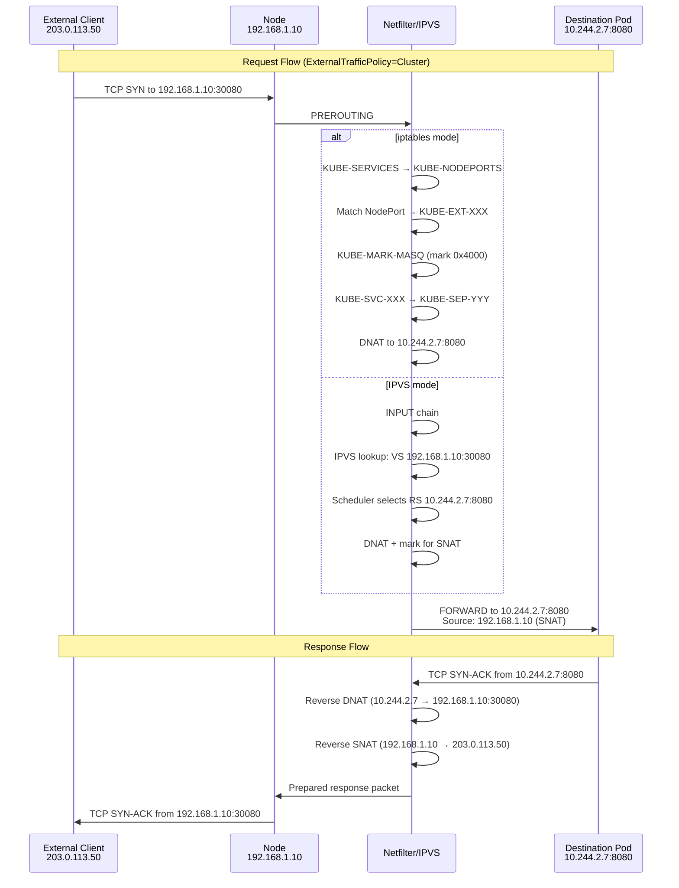

**Key Points**:
1. **SNAT applied**: External client IP is replaced with node IP (connection tracking)
2. **Source IP lost**: Pod sees node IP, not original client IP (unless externalTrafficPolicy=Local)
3. **Masquerading**: POSTROUTING chain applies MASQUERADE for marked packets

### NodePort Address Filtering

**Configuration**: `--nodeport-addresses` flag

Restricts which interfaces accept NodePort traffic:

```bash
# Example: Only accept NodePort on specific CIDRs
kube-proxy --nodeport-addresses=192.168.1.0/24,10.0.0.0/8
```

**Location**: pkg/proxy/iptables/proxier.go:199-200 (iptables)
**Location**: pkg/proxy/ipvs/proxier.go:200 (IPVS)

**iptables implementation**:

```bash
# Only match NodePort traffic from allowed CIDRs
-A KUBE-NODEPORTS -m tcp -p tcp --dport 30080 \
   -m comment --comment "default/my-service:http" \
   -s 192.168.1.0/24 \
   -j KUBE-EXT-XXX
```

---

## LoadBalancer Services

**LoadBalancer** services extend NodePort by provisioning an **external load balancer** from a cloud provider.

### Characteristics

- ✅ **Extends NodePort** - includes ClusterIP + NodePort functionality
- ✅ **External load balancer** - cloud provider (AWS ELB/NLB, GCP GCLB, Azure LB)
- ✅ **External IP** - load balancer provides stable external IP(s)
- ✅ **High availability** - LB handles node failures
- ✅ **Source ranges** - optional IP allowlist via `loadBalancerSourceRanges`
- ⚠️ **Cloud provider required** - doesn't work on bare-metal (without MetalLB, etc.)

### YAML Example

```yaml
apiVersion: v1
kind: Service
metadata:
  name: my-lb-service
  namespace: default
spec:
  type: LoadBalancer
  selector:
    app: my-app
  ports:
  - name: http
    protocol: TCP
    port: 80          # LoadBalancer port
    targetPort: 8080  # Pod port
    nodePort: 30080   # Auto-assigned if omitted
  loadBalancerSourceRanges:  # Optional: IP allowlist
  - 203.0.113.0/24
  - 198.51.100.0/24
  externalTrafficPolicy: Local  # Preserve source IP
status:
  loadBalancer:
    ingress:
    - ip: 203.0.113.100  # Assigned by cloud provider
```

### Cloud Provider Integration

**LoadBalancer provisioning flow**:

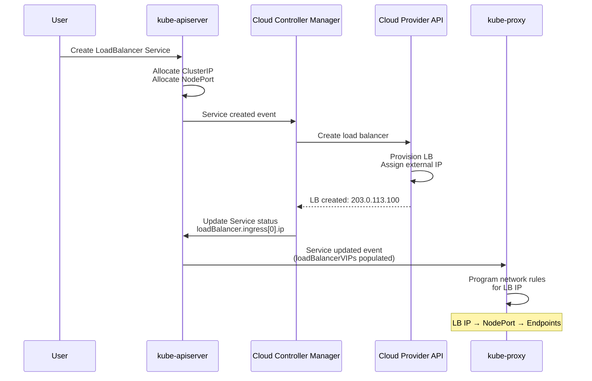

**Key insight**: kube-proxy **does not** provision the load balancer. It only programs local network rules once the LB IP is assigned.

### iptables Mode Implementation

**Location**: pkg/proxy/iptables/proxier.go:1082-1118

```go
// Capture load-balancer ingress
for _, lbip := range svcInfo.LoadBalancerVIPs() {
    if hasEndpoints {
        // Main load balancer rule
        natRules.Write(
            "-A", string(kubeServicesChain),
            "-m", "comment", "--comment", fmt.Sprintf(`"%s loadbalancer IP"`, svcPortNameString),
            "-m", protocol, "-p", protocol,
            "-d", lbip.String(),
            "--dport", strconv.Itoa(svcInfo.Port()),
            "-j", string(loadBalancerTrafficChain))

        // LoadBalancerSourceRanges firewall
        if len(svcInfo.LoadBalancerSourceRanges()) != 0 {
            for _, cidr := range svcInfo.LoadBalancerSourceRanges() {
                filterRules.Write(
                    "-A", string(kubeProxyFirewallChain),
                    "-m", "comment", "--comment", fmt.Sprintf(`"%s loadbalancer IP with source range"`, svcPortNameString),
                    "-d", lbip.String(),
                    "--dport", strconv.Itoa(svcInfo.Port()),
                    "-s", cidr.String(),
                    "-j", "ACCEPT")
            }
            // Drop traffic not from allowed ranges
            filterRules.Write(
                "-A", string(kubeProxyFirewallChain),
                "-m", "comment", "--comment", fmt.Sprintf(`"%s loadbalancer IP without source range match"`, svcPortNameString),
                "-d", lbip.String(),
                "--dport", strconv.Itoa(svcInfo.Port()),
                "-j", "DROP")
        }
    }
}
```

#### Generated iptables Rules

**Without loadBalancerSourceRanges**:

```bash
# NAT table: Capture LB IP traffic
-A KUBE-SERVICES -d 203.0.113.100/32 -p tcp -m tcp --dport 80 \
   -m comment --comment "default/my-lb-service:http loadbalancer IP" \
   -j KUBE-FW-ABCDEFGHIJKLMNOP

# Loadbalancer traffic chain (marks and routes)
-A KUBE-FW-ABCDEFGHIJKLMNOP \
   -m comment --comment "default/my-lb-service:http loadbalancer IP" \
   -j KUBE-MARK-MASQ

-A KUBE-FW-ABCDEFGHIJKLMNOP \
   -m comment --comment "default/my-lb-service:http loadbalancer IP" \
   -j KUBE-SVC-ABCDEFGHIJKLMNOP
```

**With loadBalancerSourceRanges**:

```bash
# Filter table: FORWARD chain
-A FORWARD -m conntrack --ctstate NEW \
   -m comment --comment "kubernetes load balancer firewall" \
   -j KUBE-PROXY-FIREWALL

# Allow traffic from specified CIDRs
-A KUBE-PROXY-FIREWALL -d 203.0.113.100/32 -p tcp --dport 80 \
   -s 203.0.113.0/24 \
   -m comment --comment "default/my-lb-service:http loadbalancer IP with source range" \
   -j ACCEPT

-A KUBE-PROXY-FIREWALL -d 203.0.113.100/32 -p tcp --dport 80 \
   -s 198.51.100.0/24 \
   -m comment --comment "default/my-lb-service:http loadbalancer IP with source range" \
   -j ACCEPT

# Drop all other traffic to LB IP
-A KUBE-PROXY-FIREWALL -d 203.0.113.100/32 -p tcp --dport 80 \
   -m comment --comment "default/my-lb-service:http loadbalancer IP without source range match" \
   -j DROP
```

### IPVS Mode Implementation

**Location**: pkg/proxy/ipvs/proxier.go:1124-1231

```go
// Capture load-balancer ingress
for _, ingress := range svcInfo.LoadBalancerVIPs() {
    // IPSet entries
    entry := &utilipset.Entry{
        IP:       ingress.String(),
        Port:     svcInfo.Port(),
        Protocol: protocol,
        SetType:  utilipset.HashIPPort,
    }

    // Add to main LB ipset
    proxier.ipsetList[kubeLoadBalancerSet].activeEntries.Insert(entry.String())

    // Add to local ipset if externalTrafficPolicy=Local
    if svcInfo.ExternalPolicyLocal() {
        proxier.ipsetList[kubeLoadBalancerLocalSet].activeEntries.Insert(entry.String())
    }

    // LoadBalancerSourceRanges handling
    if len(svcInfo.LoadBalancerSourceRanges()) != 0 {
        // Mark LB IP as having firewall rules
        proxier.ipsetList[kubeLoadBalancerFWSet].activeEntries.Insert(entry.String())

        allowFromNode := false
        for _, cidr := range svcInfo.LoadBalancerSourceRanges() {
            // Add CIDR entry for source matching
            entry := &utilipset.Entry{
                IP:       ingress.String(),
                Port:     svcInfo.Port(),
                Protocol: protocol,
                Net:      cidr.String(),
                SetType:  utilipset.HashIPPortNet,
            }
            proxier.ipsetList[kubeLoadBalancerSourceCIDRSet].activeEntries.Insert(entry.String())

            // Check if node IP is in allowed range
            if cidr.Contains(proxier.nodeIP) {
                allowFromNode = true
            }
        }

        // Block LB access from nodes if nodeIP not in source ranges
        if !allowFromNode {
            lbEntry := &lbNoNodeAccessIPPortProtocolEntry{
                ip:       ingress.String(),
                port:     svcInfo.Port(),
                protocol: protocol,
            }
            proxier.lbNoNodeAccessIPPortProtocolEntries = append(
                proxier.lbNoNodeAccessIPPortProtocolEntries, lbEntry)
        }
    }

    // Create IPVS virtual server
    serv := &utilipvs.VirtualServer{
        Address:   ingress,
        Port:      uint16(svcInfo.Port()),
        Protocol:  string(svcInfo.Protocol()),
        Scheduler: proxier.ipvsScheduler,
    }

    // Bind LB IP to dummy interface if not on real interface
    shouldBind := !nodeAddressSet.Has(ingress.String())
    proxier.syncService(svcPortNameString, serv, shouldBind, alreadyBoundAddrs)
    proxier.syncEndpoint(svcPortName, svcInfo.ExternalPolicyLocal(), serv)
}
```

#### IPSet Usage for LoadBalancer

| IPSet Name | Type | Purpose |
|------------|------|---------|
| `KUBE-LOAD-BALANCER` | hash:ip,port | All LoadBalancer IPs (for marking) |
| `KUBE-LOAD-BALANCER-LOCAL` | hash:ip,port | LB IPs with externalTrafficPolicy=Local |
| `KUBE-LOAD-BALANCER-FW` | hash:ip,port | LB IPs with loadBalancerSourceRanges |
| `KUBE-LOAD-BALANCER-SOURCE-CIDR` | hash:ip,port,net | Allowed source CIDRs |
| `KUBE-LOAD-BALANCER-SOURCE-IP` | hash:ip,port,ip | Allowed source IPs (deprecated) |

#### iptables Rules with IPSets

```bash
# PREROUTING: Mark packets from non-cluster sources
-A KUBE-SERVICES -m set --match-set KUBE-LOAD-BALANCER dst,dst \
   -m comment --comment "kubernetes load balancer IP" \
   -j KUBE-MARK-MASQ

# FORWARD: Firewall for source ranges
-A KUBE-FORWARD -m set --match-set KUBE-LOAD-BALANCER-FW dst,dst \
   -m comment --comment "kubernetes load balancer firewall" \
   -j KUBE-LOAD-BALANCER-FIREWALL

# Allow traffic from allowed CIDRs
-A KUBE-LOAD-BALANCER-FIREWALL \
   -m set --match-set KUBE-LOAD-BALANCER-SOURCE-CIDR dst,dst,src \
   -m comment --comment "allow traffic from allowed CIDR" \
   -j ACCEPT

# Drop other traffic
-A KUBE-LOAD-BALANCER-FIREWALL \
   -m comment --comment "drop traffic from disallowed CIDR" \
   -j DROP

# OUTPUT: Block node-originated traffic to LB if node not in source ranges
-A KUBE-LOAD-BALANCER-FIREWALL \
   -m set --match-set KUBE-LB-NO-NODE-ACCESS dst,dst \
   -m comment --comment "block node access to LB" \
   -j DROP
```

### Packet Flow: LoadBalancer

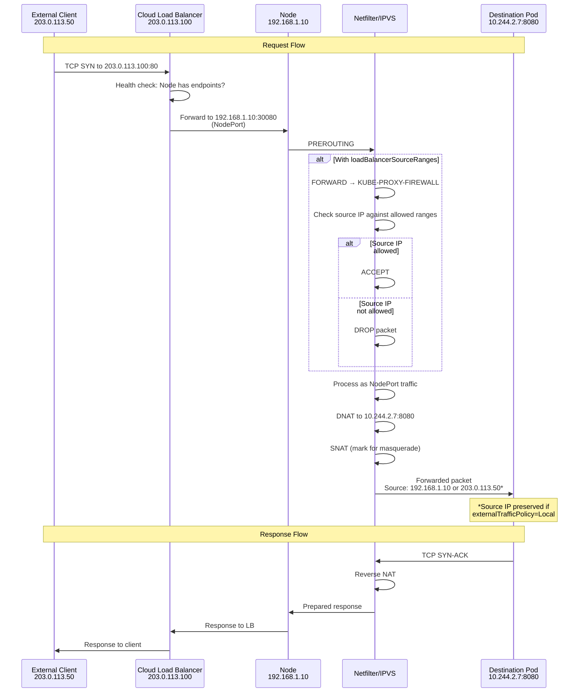

---

## ExternalIPs

**ExternalIPs** allow exposing a service on **user-specified external IPs**, separate from the Service type.

### Characteristics

- ✅ **Type-agnostic** - can be added to ClusterIP, NodePort, or LoadBalancer services
- ✅ **User-managed IPs** - user is responsible for routing traffic to nodes
- ✅ **Multiple IPs** - can specify multiple external IPs
- ⚠️ **No cloud integration** - no automatic load balancer provisioning
- ⚠️ **Routing required** - IPs must be routed to cluster nodes externally

### YAML Example

```yaml
apiVersion: v1
kind: Service
metadata:
  name: my-external-ip-service
  namespace: default
spec:
  type: ClusterIP  # Can be any type
  selector:
    app: my-app
  ports:
  - name: http
    protocol: TCP
    port: 80
    targetPort: 8080
  externalIPs:
  - 203.0.113.200
  - 198.51.100.50
```

### Use Cases

1. **On-premise deployments** - Use enterprise IP addresses without cloud LB
2. **Anycast IPs** - Multiple clusters sharing same external IP
3. **Migration** - Preserve existing external IPs when moving to Kubernetes
4. **Custom routing** - Advanced networking with BGP or static routes

### iptables Mode Implementation

**Location**: pkg/proxy/iptables/proxier.go:1054-1080

```go
// Capture externalIPs
for _, externalIP := range svcInfo.ExternalIPs() {
    if hasEndpoints {
        // Create NAT rule for external IP
        natRules.Write(
            "-A", string(kubeServicesChain),
            "-m", "comment", "--comment", fmt.Sprintf(`"%s external IP"`, svcPortNameString),
            "-m", protocol, "-p", protocol,
            "-d", externalIP.String(),
            "--dport", strconv.Itoa(svcInfo.Port()),
            "-j", string(externalTrafficChain))

        // Mark for masquerade (external traffic)
        natRules.Write(
            "-A", string(externalTrafficChain),
            "-m", "comment", "--comment", fmt.Sprintf(`"masquerade traffic for %s external IP"`, svcPortNameString),
            "-j", "KUBE-MARK-MASQ")

        // Jump to service chain
        natRules.Write(
            "-A", string(externalTrafficChain),
            "-m", "comment", "--comment", fmt.Sprintf(`"%s external IP"`, svcPortNameString),
            "-j", string(svcInfo.ServiceChain()))

        // Filter rules for external endpoints (if externalTrafficPolicy=Local)
        if svcInfo.ExternalPolicyLocal() {
            if !hasLocalEndpoints {
                filterRules.Write(
                    "-A", string(kubeExternalServicesChain),
                    "-m", "comment", "--comment", fmt.Sprintf(`"%s has no local endpoints"`, svcPortNameString),
                    "-m", protocol, "-p", protocol,
                    "-d", externalIP.String(),
                    "--dport", strconv.Itoa(svcInfo.Port()),
                    "-j", "DROP")
            }
        }
    }
}
```

#### Generated iptables Rules

```bash
# NAT table: Capture external IP traffic
-A KUBE-SERVICES -d 203.0.113.200/32 -p tcp -m tcp --dport 80 \
   -m comment --comment "default/my-external-ip-service:http external IP" \
   -j KUBE-EXT-XYXYXYXYXYXYXYXY

# External traffic chain
-A KUBE-EXT-XYXYXYXYXYXYXYXY \
   -m comment --comment "masquerade traffic for default/my-external-ip-service:http external IP" \
   -j KUBE-MARK-MASQ

-A KUBE-EXT-XYXYXYXYXYXYXYXY \
   -m comment --comment "default/my-external-ip-service:http external IP" \
   -j KUBE-SVC-ABCDEFGHIJKLMNOP

# Filter table: Drop if no local endpoints (externalTrafficPolicy=Local)
-A KUBE-EXTERNAL-SERVICES -d 203.0.113.200/32 -p tcp --dport 80 \
   -m comment --comment "default/my-external-ip-service:http has no local endpoints" \
   -j DROP
```

### IPVS Mode Implementation

**Location**: pkg/proxy/ipvs/proxier.go:1069-1122

```go
// Capture externalIPs
for _, externalIP := range svcInfo.ExternalIPs() {
    // IPSet entry
    entry := &utilipset.Entry{
        IP:       externalIP.String(),
        Port:     svcInfo.Port(),
        Protocol: protocol,
        SetType:  utilipset.HashIPPort,
    }

    // Add to appropriate ipset based on traffic policy
    if svcInfo.ExternalPolicyLocal() {
        proxier.ipsetList[kubeExternalIPLocalSet].activeEntries.Insert(entry.String())
    } else {
        proxier.ipsetList[kubeExternalIPSet].activeEntries.Insert(entry.String())
    }

    // Create IPVS virtual server
    serv := &utilipvs.VirtualServer{
        Address:   externalIP,
        Port:      uint16(svcInfo.Port()),
        Protocol:  string(svcInfo.Protocol()),
        Scheduler: proxier.ipvsScheduler,
    }

    // Session affinity
    if svcInfo.SessionAffinityType() == v1.ServiceAffinityClientIP {
        serv.Flags |= utilipvs.FlagPersistent
        serv.Timeout = uint32(svcInfo.StickyMaxAgeSeconds())
    }

    // Bind to dummy interface only if IP not on real interface
    shouldBind := !nodeAddressSet.Has(externalIP.String())
    proxier.syncService(svcPortNameString, serv, shouldBind, alreadyBoundAddrs)
    proxier.syncEndpoint(svcPortName, svcInfo.ExternalPolicyLocal(), serv)
}
```

#### IPSet Usage for ExternalIPs

| IPSet Name | Type | Purpose |
|------------|------|---------|
| `KUBE-EXTERNAL-IP` | hash:ip,port | ExternalIPs with externalTrafficPolicy=Cluster |
| `KUBE-EXTERNAL-IP-LOCAL` | hash:ip,port | ExternalIPs with externalTrafficPolicy=Local |

#### iptables Rules with IPSets

```bash
# Mark external IP traffic for masquerading
-A KUBE-SERVICES -m set --match-set KUBE-EXTERNAL-IP dst,dst \
   -m comment --comment "kubernetes service external IP" \
   -j KUBE-MARK-MASQ

# Drop traffic to external IPs with local policy but no local endpoints
-A KUBE-SERVICES -m set --match-set KUBE-EXTERNAL-IP-LOCAL dst,dst \
   -m comment --comment "kubernetes service external IP with no local endpoints" \
   -m hashlimit --hashlimit-upto 5/min --hashlimit-burst 5 \
   --hashlimit-mode srcip --hashlimit-name kube-svc-no-local-ep \
   -j LOG --log-prefix "No local endpoints: " --log-level warning

-A KUBE-SERVICES -m set --match-set KUBE-EXTERNAL-IP-LOCAL dst,dst \
   -j DROP
```

---

## Headless Services

**Headless services** (ClusterIP: None) provide **DNS records for pods** without load balancing.

### Characteristics

- ❌ **No ClusterIP** - spec.clusterIP is set to "None"
- ❌ **No load balancing** - kube-proxy does not program rules
- ✅ **DNS records** - DNS returns A records for all pod IPs
- ✅ **Direct pod access** - clients connect directly to pods
- ✅ **StatefulSets** - commonly used with StatefulSets for stable pod identity

### YAML Example

```yaml
apiVersion: v1
kind: Service
metadata:
  name: my-headless-service
  namespace: default
spec:
  clusterIP: None  # Headless service
  selector:
    app: my-app
  ports:
  - name: http
    protocol: TCP
    port: 80
    targetPort: 8080
```

### DNS Resolution

**For headless service** `my-headless-service.default.svc.cluster.local`:

```bash
$ nslookup my-headless-service.default.svc.cluster.local

Name:    my-headless-service.default.svc.cluster.local
Address: 10.244.1.5    # Pod 1
Address: 10.244.2.7    # Pod 2
Address: 10.244.3.9    # Pod 3
```

**For StatefulSet pods**:

```bash
$ nslookup my-statefulset-0.my-headless-service.default.svc.cluster.local

Name:    my-statefulset-0.my-headless-service.default.svc.cluster.local
Address: 10.244.1.5
```

### kube-proxy Handling

**Location**: pkg/proxy/util/utils.go:58-61

```go
// ShouldSkipService returns true for headless services
if !helper.IsServiceIPSet(service) {
    klog.V(3).InfoS("Skipping service due to cluster IP",
        "service", klog.KObj(service),
        "clusterIP", service.Spec.ClusterIP)
    return true
}
```

**Result**: kube-proxy **skips** headless services entirely:
- ❌ No iptables rules created
- ❌ No IPVS virtual servers created
- ❌ No network programming

**DNS handles everything**:
- ✅ CoreDNS/kube-dns watches Services and Endpoints
- ✅ Creates A records for pod IPs
- ✅ Updates records when pods change

### Use Cases

1. **StatefulSets** - Stable network identities for stateful applications
2. **Custom load balancing** - Client-side load balancing
3. **Service discovery** - Discover all pod IPs for a service
4. **Database clusters** - Direct connections to specific database instances

---

## ExternalName Services

**ExternalName services** provide a **DNS CNAME record** pointing to an external DNS name.

### Characteristics

- ❌ **No proxying** - kube-proxy does not program rules
- ❌ **No ClusterIP** - no virtual IP allocated
- ❌ **No selectors** - no endpoints
- ✅ **DNS CNAME** - DNS returns CNAME record
- ✅ **External integration** - map Kubernetes service to external service

### YAML Example

```yaml
apiVersion: v1
kind: Service
metadata:
  name: my-external-service
  namespace: default
spec:
  type: ExternalName
  externalName: external-api.example.com  # External DNS name
  ports:
  - name: http
    protocol: TCP
    port: 80
```

### DNS Resolution

**For ExternalName service** `my-external-service.default.svc.cluster.local`:

```bash
$ nslookup my-external-service.default.svc.cluster.local

my-external-service.default.svc.cluster.local    canonical name = external-api.example.com.
Name:    external-api.example.com
Address: 203.0.113.100
```

### kube-proxy Handling

**Location**: pkg/proxy/util/utils.go:64-66

```go
// ShouldSkipService returns true for ExternalName services
if service.Spec.Type == v1.ServiceTypeExternalName {
    klog.V(3).InfoS("Skipping service due to Type=ExternalName",
        "service", klog.KObj(service))
    return true
}
```

**Result**: kube-proxy **skips** ExternalName services:
- ❌ No iptables rules
- ❌ No IPVS virtual servers
- ❌ No network programming

**DNS handles everything**:
- ✅ CoreDNS/kube-dns creates CNAME record
- ✅ Clients resolve external DNS name
- ✅ Traffic goes directly to external service

### Use Cases

1. **External database** - Map internal service name to external DB
2. **Migration** - Gradually migrate from external to internal services
3. **Multi-cluster** - Services in other Kubernetes clusters
4. **Legacy systems** - Integration with existing external systems

### Security Considerations

⚠️ **DNS rebinding risk**: ExternalName can point to arbitrary domains
⚠️ **Admission control**: Consider using admission webhooks to restrict allowed domains

---

## Traffic Policy Impact

Traffic policies (`externalTrafficPolicy` and `internalTrafficPolicy`) determine **which endpoints** receive traffic and whether **source IP is preserved**.

### Traffic Policy Types

| Policy | Scope | Values | Default | Since |
|--------|-------|--------|---------|-------|
| `externalTrafficPolicy` | External traffic (NodePort, LoadBalancer, ExternalIPs) | Local, Cluster | Cluster | v1.4 |
| `internalTrafficPolicy` | Internal traffic (ClusterIP) | Local, Cluster | Cluster | v1.22 |

### Traffic Policy Impact by Service Type

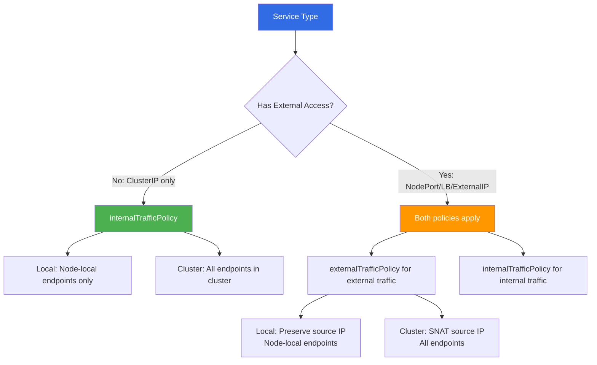

### externalTrafficPolicy=Local

**Impact on NodePort, LoadBalancer, ExternalIPs**:

```yaml
spec:
  type: NodePort
  externalTrafficPolicy: Local  # Only local endpoints
```

**Behavior**:
- ✅ **Source IP preserved** - No SNAT, pod sees original client IP
- ✅ **Reduced hops** - Traffic doesn't cross nodes
- ⚠️ **Uneven load** - Only nodes with endpoints receive traffic
- ⚠️ **Health check** - Load balancer checks node has local endpoints

**iptables implementation** (pkg/proxy/iptables/proxier.go:956-980):

```go
// Determine traffic chains based on policy
var internalTrafficChain, externalTrafficChain utiliptables.Chain

if svcInfo.ExternalPolicyLocal() {
    internalTrafficChain = svcInfo.ServiceChain()
    externalTrafficChain = svcInfo.ServiceExternalChain()  // Separate chain for external
} else {
    internalTrafficChain = svcInfo.ServiceChain()
    externalTrafficChain = svcInfo.ServiceChain()  // Same chain
}
```

**Generated rules**:

```bash
# External traffic → KUBE-XLB-XXX (local endpoints only)
-A KUBE-NODEPORTS -p tcp --dport 30080 \
   -j KUBE-XLB-ABCDEFGHIJKLMNOP

# Drop if no local endpoints
-A KUBE-XLB-ABCDEFGHIJKLMNOP \
   -m comment --comment "default/my-service:http has no local endpoints" \
   -j DROP

# No KUBE-MARK-MASQ (preserve source IP)
-A KUBE-XLB-ABCDEFGHIJKLMNOP \
   -j KUBE-SVC-ABCDEFGHIJKLMNOP
```

### internalTrafficPolicy=Local

**Impact on ClusterIP traffic**:

```yaml
spec:
  type: ClusterIP
  internalTrafficPolicy: Local  # Only local endpoints
```

**Behavior**:
- ✅ **Node-local endpoints** - Traffic to ClusterIP uses local endpoints
- ✅ **Reduced latency** - Avoids cross-node hops
- ⚠️ **Connection failures** - If no local endpoints, connection fails

**IPVS implementation** (pkg/proxy/ipvs/proxier.go:1058-1062):

```go
// Sync endpoints based on internal traffic policy
localEndpoints := svcInfo.InternalPolicyLocal()
proxier.syncEndpoint(svcPortName, localEndpoints, serv)
```

---

## Packet Flow Examples

### ClusterIP Packet Flow (iptables mode)

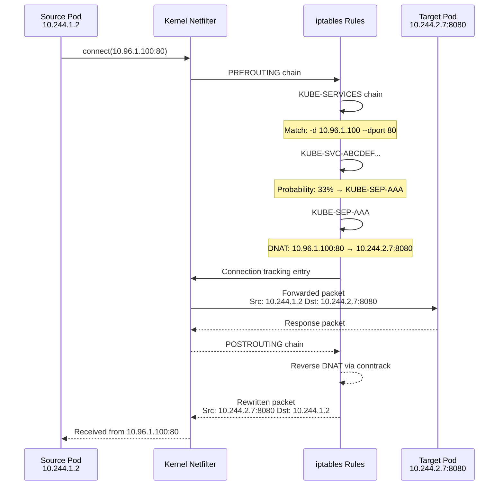

### NodePort Packet Flow (IPVS mode)

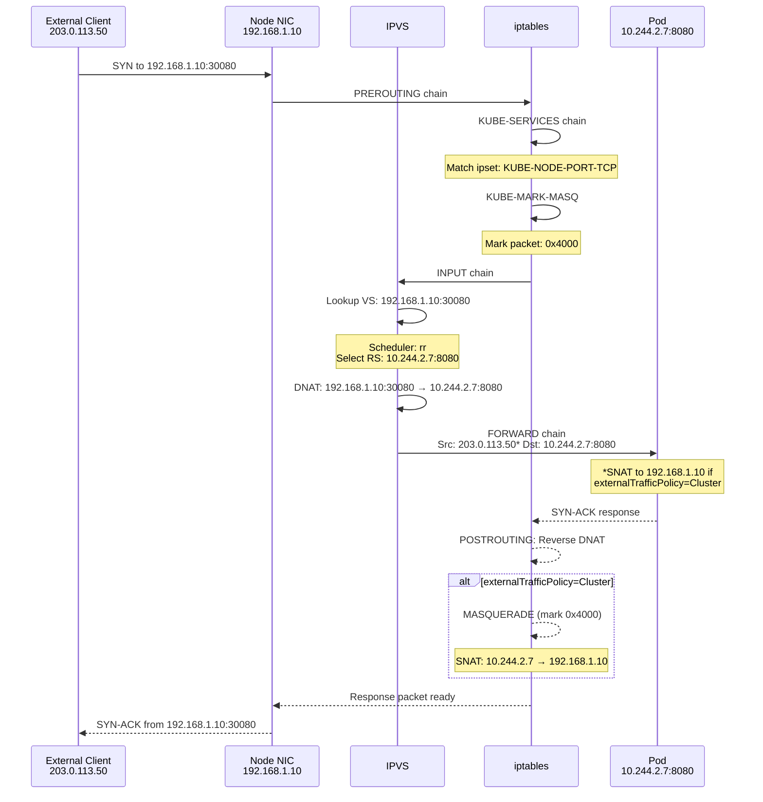

---

## Configuration Options

### kube-proxy Flags

| Flag | Default | Service Types Affected | Description |
|------|---------|------------------------|-------------|
| `--cluster-cidr` | - | All | Cluster pod CIDR for masquerading decisions |
| `--service-node-port-range` | 30000-32767 | NodePort, LoadBalancer | NodePort allocation range |
| `--nodeport-addresses` | [] | NodePort, LoadBalancer | CIDR ranges for NodePort interfaces |
| `--iptables-localhost-nodeports` | true (IPv4) | NodePort, LoadBalancer | Allow NodePort on 127.0.0.1 |
| `--masquerade-all` | false | All | SNAT all traffic (rarely needed) |
| `--ipvs-scheduler` | rr | All (IPVS mode) | IPVS scheduling algorithm |

### Service-Level Configuration

**In Service spec**:

```yaml
spec:
  type: LoadBalancer  # Service type
  externalTrafficPolicy: Local  # External traffic policy
  internalTrafficPolicy: Local  # Internal traffic policy (v1.22+)
  sessionAffinity: ClientIP  # Session affinity
  sessionAffinityConfig:
    clientIP:
      timeoutSeconds: 10800  # 3 hours
  loadBalancerSourceRanges:  # IP allowlist
  - 203.0.113.0/24
  healthCheckNodePort: 30100  # Health check port (auto-assigned if omitted)
```

### kube-apiserver Configuration

**Service CIDR allocation**:

```bash
kube-apiserver \
  --service-cluster-ip-range=10.96.0.0/12 \
  --service-node-port-range=30000-32767
```

---

## Comparison: iptables vs IPVS

### Service Type Implementation Differences

| Service Type | iptables Mode | IPVS Mode |
|--------------|---------------|-----------|
| **ClusterIP** | NAT rules in KUBE-SERVICES | IPVS virtual server + dummy interface binding |
| **NodePort** | KUBE-NODEPORTS chain | IPSet (bitmap:port) + IPVS virtual servers per node IP |
| **LoadBalancer** | KUBE-PROXY-FIREWALL (filter table) | IPSets (KUBE-LOAD-BALANCER-*) + iptables firewall |
| **ExternalIPs** | NAT rules in KUBE-SERVICES | KUBE-EXTERNAL-IP ipset + IPVS virtual servers |
| **Headless** | Skipped (no rules) | Skipped (no virtual servers) |
| **ExternalName** | Skipped (no rules) | Skipped (no virtual servers) |

### Load Balancing

| Aspect | iptables Mode | IPVS Mode |
|--------|---------------|-----------|
| **Algorithm** | Probability-based random (statistic module) | 11 algorithms (rr, lc, wrr, sh, dh, etc.) |
| **Complexity** | O(n) rule evaluation | O(1) hash lookup |
| **Session Affinity** | `recent` module with timeout | Native IPVS persistence |
| **Distribution** | Statistically even | Algorithm-dependent (perfect with rr) |

### Scalability

| Metric | iptables Mode | IPVS Mode |
|--------|---------------|-----------|
| **Rule count** | ~5 rules per endpoint | ~2 iptables rules (total) + IPVS entries |
| **Memory** | O(n) per service × endpoints | O(1) iptables + IPVS hash table |
| **Sync time** | O(n) rule generation | O(1) ipset updates + IPVS API calls |
| **Max services** | ~1,000 (practical limit) | 10,000+ |

### Feature Parity

| Feature | iptables | IPVS | Notes |
|---------|----------|------|-------|
| ClusterIP | ✅ | ✅ | Identical behavior |
| NodePort | ✅ | ✅ | Identical behavior |
| LoadBalancer | ✅ | ✅ | IPVS uses more ipsets |
| ExternalIPs | ✅ | ✅ | Identical behavior |
| Session Affinity | ✅ | ✅ | IPVS more efficient |
| ExternalTrafficPolicy | ✅ | ✅ | Identical behavior |
| InternalTrafficPolicy | ✅ | ✅ | Identical behavior |
| LoadBalancerSourceRanges | ✅ | ✅ | IPVS uses ipsets |
| Dual-stack | ✅ | ✅ | Separate proxiers per family |

---

## Troubleshooting

### ClusterIP Issues

#### Problem: ClusterIP not accessible from pods

**Diagnosis**:

```bash
# iptables mode: Check rules
iptables -t nat -L KUBE-SERVICES -n | grep <ClusterIP>

# IPVS mode: Check virtual server
ipvsadm -Ln | grep <ClusterIP>

# Check service has endpoints
kubectl get endpoints <service-name>
```

**Common causes**:
- ❌ Service has no endpoints (no pods matching selector)
- ❌ kube-proxy not running
- ❌ iptables/IPVS rules not programmed

**Solution**:

```bash
# Restart kube-proxy
kubectl -n kube-system delete pod -l k8s-app=kube-proxy

# Check kube-proxy logs
kubectl -n kube-system logs -l k8s-app=kube-proxy --tail=100
```

### NodePort Issues

#### Problem: NodePort not accessible externally

**Diagnosis**:

```bash
# Check NodePort is allocated
kubectl get svc <service-name> -o yaml | grep nodePort

# iptables mode: Check KUBE-NODEPORTS chain
iptables -t nat -L KUBE-NODEPORTS -n

# IPVS mode: Check ipset
ipset list KUBE-NODE-PORT-TCP | grep <nodePort>

# Test from node itself
curl localhost:<nodePort>

# Check firewall rules
iptables -L -n | grep <nodePort>
```

**Common causes**:
- ❌ Firewall blocking NodePort range
- ❌ Cloud security group not allowing traffic
- ❌ NodePort range not configured correctly
- ❌ `--nodeport-addresses` filtering traffic

**Solution**:

```bash
# Allow NodePort range in firewall
iptables -A INPUT -p tcp --dport 30000:32767 -j ACCEPT

# Check kube-proxy nodeport-addresses config
kubectl -n kube-system get configmap kube-proxy -o yaml | grep nodeport-addresses
```

### LoadBalancer Issues

#### Problem: LoadBalancer stuck in Pending state

**Diagnosis**:

```bash
# Check service status
kubectl describe svc <service-name>

# Check cloud controller manager logs
kubectl -n kube-system logs -l app=cloud-controller-manager
```

**Common causes**:
- ❌ No cloud provider integration
- ❌ Cloud controller manager not running
- ❌ Insufficient cloud provider quota
- ❌ Invalid loadBalancerSourceRanges

**Solution**: Ensure cloud controller manager is running and properly configured.

#### Problem: LoadBalancer IP not accessible

**Diagnosis**:

```bash
# Check LB IP is assigned
kubectl get svc <service-name> -o jsonpath='{.status.loadBalancer.ingress[0].ip}'

# iptables mode: Check rules for LB IP
iptables -t nat -L KUBE-SERVICES -n | grep <LB-IP>

# IPVS mode: Check ipset and virtual server
ipset list KUBE-LOAD-BALANCER | grep <LB-IP>
ipvsadm -Ln | grep <LB-IP>

# Check loadBalancerSourceRanges firewall
iptables -L KUBE-PROXY-FIREWALL -n
```

**Common causes**:
- ❌ kube-proxy hasn't synced LB IP yet
- ❌ loadBalancerSourceRanges blocking your IP
- ❌ Cloud LB health checks failing (no local endpoints with externalTrafficPolicy=Local)

### ExternalIPs Issues

#### Problem: ExternalIP not accessible

**Diagnosis**:

```bash
# Check external IP is configured
kubectl get svc <service-name> -o yaml | grep externalIPs -A 5

# Check routing to node
ping <external-IP>
traceroute <external-IP>

# iptables mode: Check rules
iptables -t nat -L KUBE-SERVICES -n | grep <external-IP>

# IPVS mode: Check ipset and virtual server
ipset list KUBE-EXTERNAL-IP | grep <external-IP>
ipvsadm -Ln | grep <external-IP>
```

**Common causes**:
- ❌ External IP not routed to cluster nodes
- ❌ IP conflict (IP exists on another interface)
- ❌ No endpoints available

**Solution**: Ensure external IP is properly routed to cluster nodes (BGP, static routes, etc.)

### General Debugging Commands

```bash
# Check all services and their IPs
kubectl get svc --all-namespaces -o wide

# Check all endpoints
kubectl get endpoints --all-namespaces

# iptables mode: Dump all rules
iptables-save > /tmp/iptables-dump.txt

# IPVS mode: List all virtual servers
ipvsadm -Ln --stats

# IPVS mode: List all ipsets
ipset list | grep KUBE

# Check kube-proxy metrics
curl localhost:10249/metrics | grep kubeproxy_sync

# Connection tracking
conntrack -L | grep <service-IP>
```

---

## Best Practices

### Service Type Selection

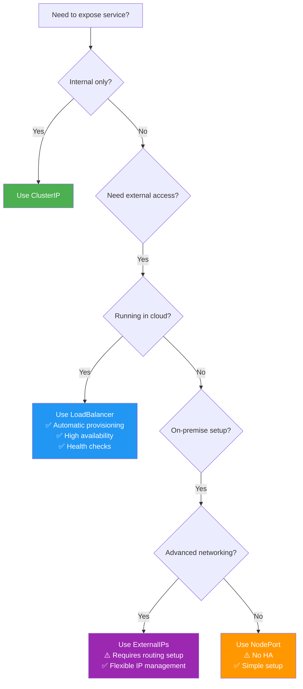

### Traffic Policy Recommendations

| Scenario | externalTrafficPolicy | internalTrafficPolicy | Reason |
|----------|----------------------|----------------------|---------|
| **Logging/monitoring needs source IP** | Local | Cluster | Preserve client IP for logs |
| **Minimize latency** | Local | Local | Reduce network hops |
| **Even load distribution** | Cluster | Cluster | All endpoints receive traffic |
| **StatefulSet services** | Local | Local | Pods usually communicate with local instance |
| **High availability** | Cluster | Cluster | Traffic spreads across nodes |

### Proxy Mode Selection

| Cluster Size | Services | Recommendation | Reason |
|--------------|----------|----------------|---------|
| **Small** (<100 nodes) | <500 | iptables | Simpler to debug, lower overhead |
| **Medium** (100-500 nodes) | 500-2000 | IPVS | Better performance, more algorithms |
| **Large** (>500 nodes) | >2000 | IPVS | Required for scale, much faster sync |

### Configuration Best Practices

1. **Set cluster CIDR correctly**:
   ```yaml
   --cluster-cidr=10.244.0.0/16  # Must match CNI configuration
   ```

2. **Use appropriate NodePort range**:
   ```yaml
   --service-node-port-range=30000-32767  # Default is usually fine
   ```

3. **Enable localhost NodePorts** (helpful for debugging):
   ```yaml
   --iptables-localhost-nodeports=true  # Default: true
   ```

4. **Configure IPVS scheduler** based on workload:
   ```yaml
   --ipvs-scheduler=rr  # Round-robin (default, even distribution)
   --ipvs-scheduler=lc  # Least connection (long-lived connections)
   --ipvs-scheduler=sh  # Source hashing (session persistence without ClientIP affinity)
   ```

5. **Set session affinity timeout appropriately**:
   ```yaml
   sessionAffinityConfig:
     clientIP:
       timeoutSeconds: 10800  # 3 hours (default), adjust based on session length
   ```

6. **Use loadBalancerSourceRanges for security**:
   ```yaml
   loadBalancerSourceRanges:
   - 203.0.113.0/24  # Corporate network
   - 198.51.100.0/24  # Partner network
   ```

---

## Summary

### Key Takeaways

1. **Service Type Hierarchy**:
   - LoadBalancer ⊃ NodePort ⊃ ClusterIP
   - More complex types include all features of simpler types

2. **kube-proxy's Role**:
   - ✅ Programs network rules for ClusterIP, NodePort, LoadBalancer, ExternalIPs
   - ❌ Skips Headless and ExternalName services (DNS-only)

3. **Implementation Modes**:
   - **iptables mode**: NAT rules, probability-based load balancing
   - **IPVS mode**: Virtual servers, ipsets, kernel schedulers

4. **Traffic Policies**:
   - `externalTrafficPolicy=Local`: Preserves source IP, node-local endpoints
   - `internalTrafficPolicy=Local`: Node-local endpoints for ClusterIP traffic

5. **Scalability**:
   - iptables: Practical limit ~1,000 services
   - IPVS: Scales to 10,000+ services

### Service Type Decision Matrix

| Requirement | Recommended Type | Alternative |
|-------------|------------------|-------------|
| Internal cluster access only | ClusterIP | - |
| External access, cloud environment | LoadBalancer | - |
| External access, on-premise | NodePort | ExternalIPs with routing |
| Custom IP addresses | ExternalIPs | LoadBalancer (cloud) |
| Direct pod access, no load balancing | Headless | - |
| DNS alias to external service | ExternalName | - |
| Preserve client source IP | LoadBalancer + externalTrafficPolicy=Local | - |

### Critical Files Reference

**Service filtering**:
- pkg/proxy/util/utils.go:56-69 - `ShouldSkipService()`

**Common structures**:
- pkg/proxy/serviceport.go:75-241 - `BaseServicePortInfo`
- staging/src/k8s.io/api/core/v1/types.go:5633-5655 - Service type constants

**iptables mode**:
- pkg/proxy/iptables/proxier.go:1033-1180 - Service type implementations

**IPVS mode**:
- pkg/proxy/ipvs/proxier.go:1034-1380 - Service type implementations
- pkg/proxy/ipvs/ipset.go:31-85 - IPSet definitions

### Next Steps

For deeper understanding of specific topics:
- **iptables mode details**: See `02-iptables-mode.md`
- **IPVS mode details**: See `03-ipvs-mode.md`
- **Endpoint management**: See `05-endpoint-management.md` (to be written)
- **Session affinity**: See `06-session-affinity.md` (to be written)
- **Traffic policies**: See `07-external-traffic-policy.md` (to be written)

---

**Document Complete**: This document provides comprehensive coverage of how kube-proxy implements different Kubernetes service types across iptables and IPVS modes.
