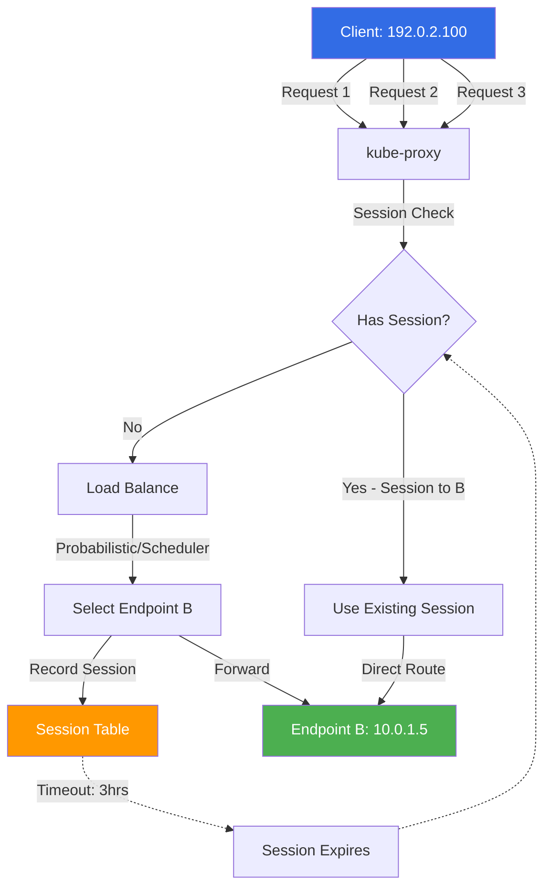
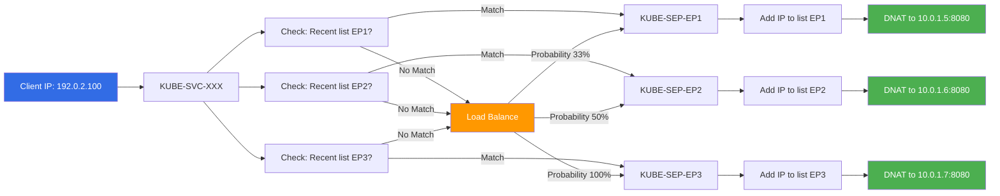
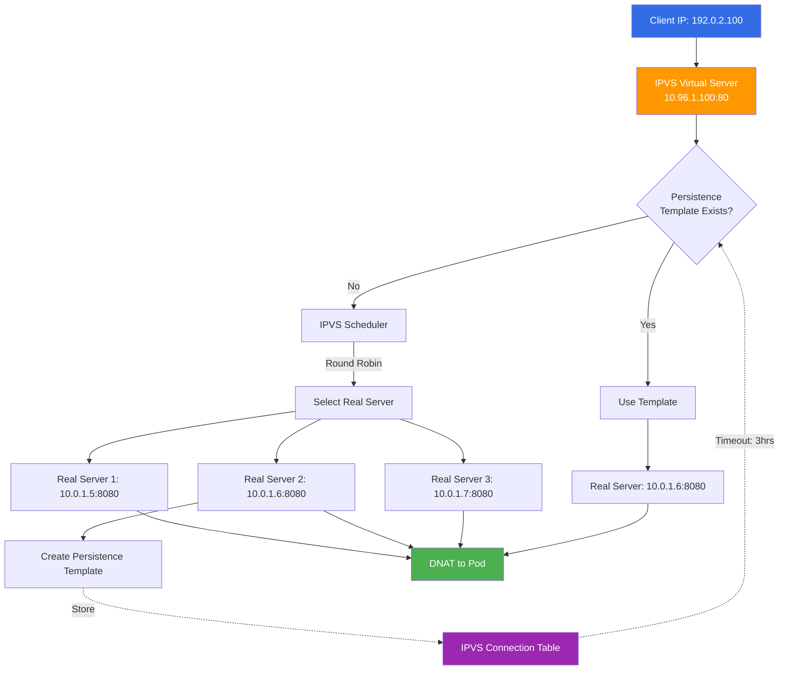
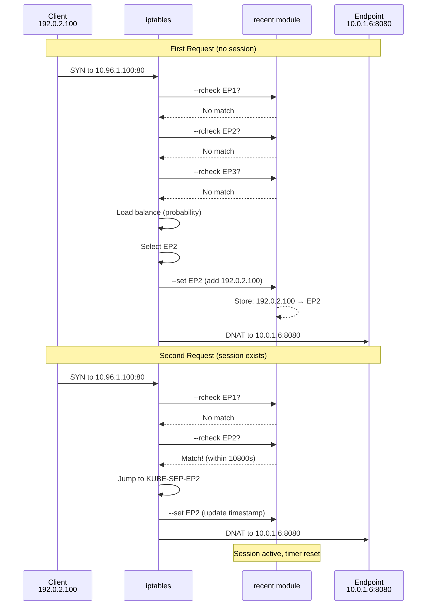
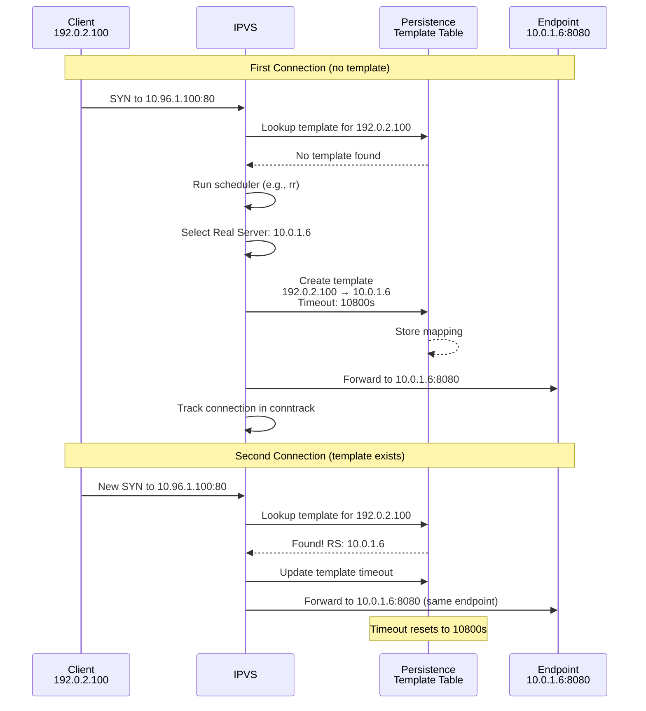
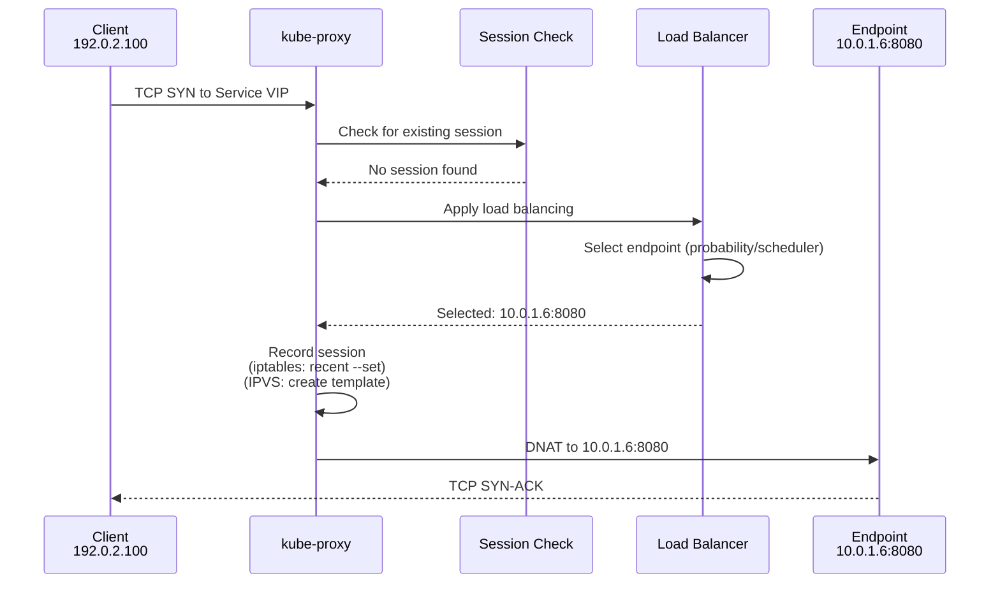
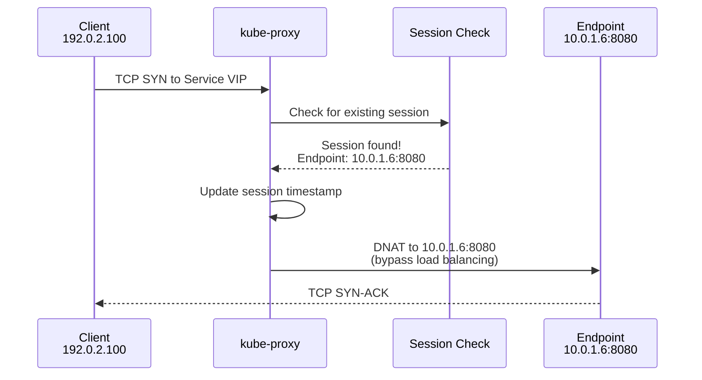
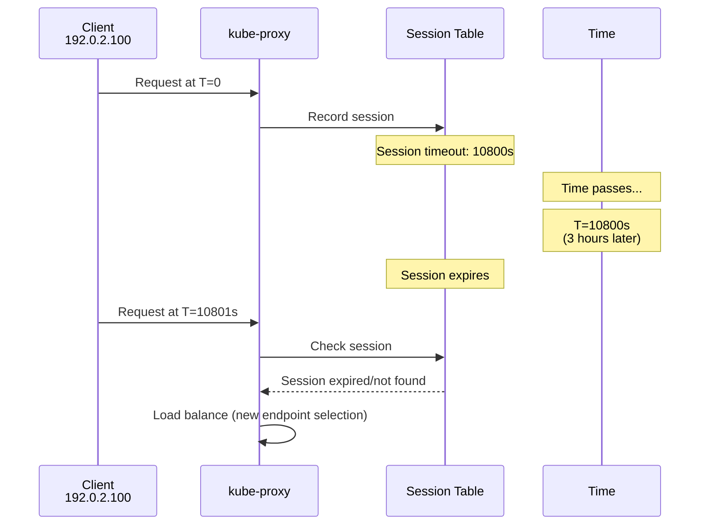
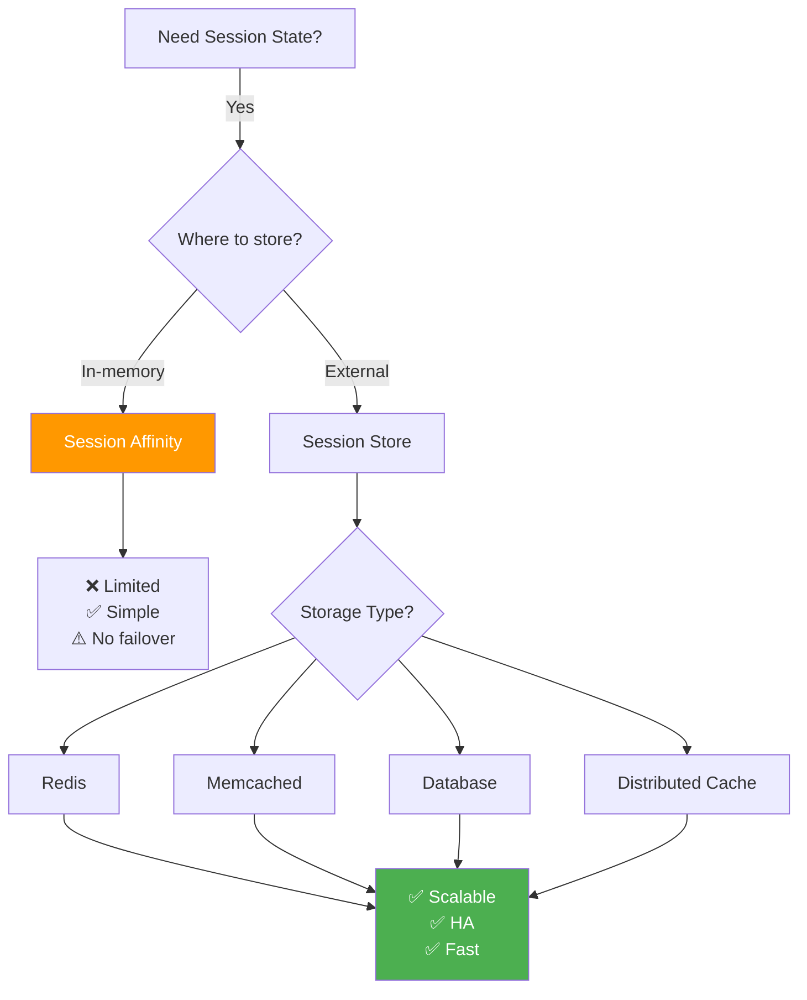

# Session Affinity in kube-proxy

**Document Status**: ✅ Complete
**Last Updated**: 2024
**Applies to**: Kubernetes v1.0+

## Table of Contents

1. [Overview](#overview)
2. [Session Affinity Configuration](#session-affinity-configuration)
3. [iptables Mode Implementation](#iptables-mode-implementation)
4. [IPVS Mode Implementation](#ipvs-mode-implementation)
5. [Session Tracking Mechanisms](#session-tracking-mechanisms)
6. [Packet Flow with Session Affinity](#packet-flow-with-session-affinity)
7. [Use Cases](#use-cases)
8. [Performance Implications](#performance-implications)
9. [Limitations and Edge Cases](#limitations-and-edge-cases)
10. [Troubleshooting](#troubleshooting)
11. [Best Practices](#best-practices)
12. [Summary](#summary)

---

## Overview

**Session affinity** (also called "sticky sessions") ensures that requests from the same client are always routed to the same backend pod. This is useful for stateful applications that store session data locally.

### What is Session Affinity?

Without session affinity, kube-proxy distributes traffic across all available endpoints:

```
Client Request 1 → Endpoint A
Client Request 2 → Endpoint B  (different pod!)
Client Request 3 → Endpoint C
```

With session affinity enabled:

```
Client Request 1 → Endpoint A
Client Request 2 → Endpoint A  (same pod)
Client Request 3 → Endpoint A  (consistent routing)
```

### Session Affinity Types

Kubernetes supports two session affinity types:

| Type | Description | Implementation |
|------|-------------|----------------|
| **None** | No session affinity (default) | Random load balancing |
| **ClientIP** | Route based on client IP address | Client IP → same endpoint |

**Note**: Kubernetes does **not** support cookie-based or header-based session affinity. Only ClientIP is available.

### Architecture Overview



**Key Components**:
1. **Client IP** - Source of session identity
2. **Session table** - Tracks client IP → endpoint mappings
3. **Timeout** - Sessions expire after inactivity
4. **Fallback** - Load balance if no session exists

---

## Session Affinity Configuration

### API Structure

**Location**: staging/src/k8s.io/api/core/v1/types.go:5605-5631

```go
// Session affinity type
type ServiceAffinity string

const (
    // ClientIP - session affinity based on client IP
    ServiceAffinityClientIP ServiceAffinity = "ClientIP"

    // None - no session affinity (default)
    ServiceAffinityNone ServiceAffinity = "None"
)

// Default timeout for ClientIP session affinity
const DefaultClientIPServiceAffinitySeconds int32 = 10800  // 3 hours

// SessionAffinityConfig represents session affinity configuration
type SessionAffinityConfig struct {
    // ClientIP contains the configurations of Client IP based session affinity
    ClientIP *ClientIPConfig `json:"clientIP,omitempty"`
}

// ClientIPConfig represents the configuration of ClientIP session affinity
type ClientIPConfig struct {
    // TimeoutSeconds specifies the seconds of ClientIP type session sticky time
    // Must be >0 && <=86400 (1 day) if ServiceAffinity == "ClientIP"
    // Default value is 10800 (3 hours)
    TimeoutSeconds *int32 `json:"timeoutSeconds,omitempty"`
}
```

### Service Specification

**Location**: staging/src/k8s.io/api/core/v1/types.go:5933-5939, 6008

```go
type ServiceSpec struct {
    // SessionAffinity enables client IP based session affinity
    // Must be ClientIP or None
    // Defaults to None
    SessionAffinity ServiceAffinity `json:"sessionAffinity,omitempty"`

    // SessionAffinityConfig contains the configurations of session affinity
    SessionAffinityConfig *SessionAffinityConfig `json:"sessionAffinityConfig,omitempty"`

    // ... other fields ...
}
```

### Example YAML Configurations

#### Basic Session Affinity (Default Timeout)

```yaml
apiVersion: v1
kind: Service
metadata:
  name: my-sticky-service
spec:
  selector:
    app: my-app
  sessionAffinity: ClientIP  # Enable session affinity
  ports:
  - protocol: TCP
    port: 80
    targetPort: 8080
```

**Result**: 3-hour session timeout (default: 10800 seconds)

#### Custom Session Timeout

```yaml
apiVersion: v1
kind: Service
metadata:
  name: my-sticky-service
spec:
  selector:
    app: my-app
  sessionAffinity: ClientIP
  sessionAffinityConfig:
    clientIP:
      timeoutSeconds: 3600  # 1 hour
  ports:
  - protocol: TCP
    port: 80
    targetPort: 8080
```

**Result**: 1-hour session timeout

#### No Session Affinity (Default)

```yaml
apiVersion: v1
kind: Service
metadata:
  name: my-service
spec:
  selector:
    app: my-app
  sessionAffinity: None  # Default, can be omitted
  ports:
  - protocol: TCP
    port: 80
    targetPort: 8080
```

**Result**: Random load balancing, no sticky sessions

### Configuration Defaults

**Location**: pkg/apis/core/v1/defaults.go:106-122

```go
func SetDefaults_Service(obj *v1.Service) {
    // Default SessionAffinity to None
    if obj.Spec.SessionAffinity == "" {
        obj.Spec.SessionAffinity = v1.ServiceAffinityNone
    }

    // Clear SessionAffinityConfig if SessionAffinity is None
    if obj.Spec.SessionAffinity == v1.ServiceAffinityNone {
        obj.Spec.SessionAffinityConfig = nil
    }

    // Set default timeout for ClientIP affinity
    if obj.Spec.SessionAffinity == v1.ServiceAffinityClientIP {
        if obj.Spec.SessionAffinityConfig == nil ||
           obj.Spec.SessionAffinityConfig.ClientIP == nil ||
           obj.Spec.SessionAffinityConfig.ClientIP.TimeoutSeconds == nil {
            timeoutSeconds := v1.DefaultClientIPServiceAffinitySeconds
            obj.Spec.SessionAffinityConfig = &v1.SessionAffinityConfig{
                ClientIP: &v1.ClientIPConfig{
                    TimeoutSeconds: &timeoutSeconds,
                },
            }
        }
    }
}
```

### Validation

**Location**: pkg/apis/core/validation/validation.go:3373-3379

```go
func validateAffinityTimeout(timeout *int32, fldPath *field.Path) field.ErrorList {
    allErrs := field.ErrorList{}
    if *timeout <= 0 || *timeout > core.MaxClientIPServiceAffinitySeconds {
        allErrs = append(allErrs, field.Invalid(fldPath, timeout,
            fmt.Sprintf("must be greater than 0 and less than %d",
            core.MaxClientIPServiceAffinitySeconds)))
    }
    return allErrs
}
```

**Validation Rules**:
- ✅ **Minimum**: 1 second
- ✅ **Maximum**: 86400 seconds (24 hours)
- ✅ **Default**: 10800 seconds (3 hours)

### BaseServicePortInfo Storage

**Location**: pkg/proxy/serviceport.go:75-115

```go
type BaseServicePortInfo struct {
    clusterIP           net.IP
    port                int
    protocol            v1.Protocol
    sessionAffinityType v1.ServiceAffinity  // None or ClientIP
    stickyMaxAgeSeconds int                 // Timeout in seconds
    // ... other fields ...
}

// SessionAffinityType returns the session affinity type
func (info *BaseServicePortInfo) SessionAffinityType() v1.ServiceAffinity {
    return info.sessionAffinityType
}

// StickyMaxAgeSeconds returns the session timeout
func (info *BaseServicePortInfo) StickyMaxAgeSeconds() int {
    return info.stickyMaxAgeSeconds
}
```

**Initialization** (pkg/proxy/serviceport.go:175-183):

```go
var stickyMaxAgeSeconds int
if service.Spec.SessionAffinity == v1.ServiceAffinityClientIP {
    // Guaranteed non-nil by kube-apiserver defaults
    stickyMaxAgeSeconds = int(*service.Spec.SessionAffinityConfig.ClientIP.TimeoutSeconds)
}

info := &BaseServicePortInfo{
    sessionAffinityType: service.Spec.SessionAffinity,
    stickyMaxAgeSeconds: stickyMaxAgeSeconds,
    // ...
}
```

---

## iptables Mode Implementation

In iptables mode, session affinity is implemented using the **`recent` module**, which tracks client IPs per endpoint.

### Overview



### Session Affinity Check Rules

**Location**: pkg/proxy/iptables/proxier.go:1543-1561

```go
// Generate session affinity check rules before load balancing
if svcInfo.SessionAffinityType() == v1.ServiceAffinityClientIP {
    for _, ep := range endpoints {
        epInfo, ok := ep.(*endpointInfo)
        if !ok {
            continue
        }

        comment := fmt.Sprintf(`"%s -> %s"`, svcPortNameString, epInfo.String())

        args = append(args[:0],
            "-A", string(svcChain),
        )
        args = proxier.appendServiceCommentLocked(args, comment)
        args = append(args,
            "-m", "recent",
            "--name", string(epInfo.ChainName),
            "--rcheck",
            "--seconds", strconv.Itoa(svcInfo.StickyMaxAgeSeconds()),
            "--reap",
            "-j", string(epInfo.ChainName),
        )
        natRules.Write(args)
    }
}
```

**Generated Rules** (session affinity checks):

```bash
# Service chain (KUBE-SVC-ABCDEFGH)
# Check if client IP is in endpoint 1's recent list
-A KUBE-SVC-ABCDEFGH \
   -m comment --comment "default/my-service:http -> 10.0.1.5:8080" \
   -m recent --name KUBE-SEP-EP1HASH --rcheck --seconds 10800 --reap \
   -j KUBE-SEP-EP1HASH

# Check if client IP is in endpoint 2's recent list
-A KUBE-SVC-ABCDEFGH \
   -m comment --comment "default/my-service:http -> 10.0.1.6:8080" \
   -m recent --name KUBE-SEP-EP2HASH --rcheck --seconds 10800 --reap \
   -j KUBE-SEP-EP2HASH

# Check if client IP is in endpoint 3's recent list
-A KUBE-SVC-ABCDEFGH \
   -m comment --comment "default/my-service:http -> 10.0.1.7:8080" \
   -m recent --name KUBE-SEP-EP3HASH --rcheck --seconds 10800 --reap \
   -j KUBE-SEP-EP3HASH

# If no session found, use probability-based load balancing
-A KUBE-SVC-ABCDEFGH \
   -m comment --comment "default/my-service:http" \
   -m statistic --mode random --probability 0.33333333 \
   -j KUBE-SEP-EP1HASH

-A KUBE-SVC-ABCDEFGH \
   -m comment --comment "default/my-service:http" \
   -m statistic --mode random --probability 0.50000000 \
   -j KUBE-SEP-EP2HASH

-A KUBE-SVC-ABCDEFGH \
   -m comment --comment "default/my-service:http" \
   -j KUBE-SEP-EP3HASH
```

### Session Recording Rules

**Location**: pkg/proxy/iptables/proxier.go:1348-1350

```go
// Add client IP to recent list when endpoint is selected
if svcInfo.SessionAffinityType() == v1.ServiceAffinityClientIP {
    args = append(args, "-m", "recent", "--name", string(endpointChain), "--set")
}
```

**Generated Rules** (endpoint chains):

```bash
# Endpoint chain 1 (KUBE-SEP-EP1HASH)
-A KUBE-SEP-EP1HASH \
   -m recent --name KUBE-SEP-EP1HASH --set \
   -p tcp -m tcp \
   -j DNAT --to-destination 10.0.1.5:8080

# Endpoint chain 2 (KUBE-SEP-EP2HASH)
-A KUBE-SEP-EP2HASH \
   -m recent --name KUBE-SEP-EP2HASH --set \
   -p tcp -m tcp \
   -j DNAT --to-destination 10.0.1.6:8080

# Endpoint chain 3 (KUBE-SEP-EP3HASH)
-A KUBE-SEP-EP3HASH \
   -m recent --name KUBE-SEP-EP3HASH --set \
   -p tcp -m tcp \
   -j DNAT --to-destination 10.0.1.7:8080
```

### iptables `recent` Module

The `recent` module maintains lists of recently seen source addresses per tracking name.

#### Module Options

| Option | Description | Usage |
|--------|-------------|-------|
| **--name** | Name of the IP list | Identifies which list to use |
| **--set** | Add source IP to list | Records client IP when endpoint selected |
| **--rcheck** | Check if IP is in list | Tests for existing session |
| **--seconds N** | Match if seen within N seconds | Implements timeout |
| **--reap** | Remove expired entries | Cleans up stale sessions |

#### How It Works

1. **Tracking Lists**:
   - Stored in kernel memory
   - One list per endpoint chain name
   - `/proc/net/xt_recent/` entries (readable)

2. **--set Behavior**:
   - Adds source IP to the named list
   - Updates timestamp to current time
   - Creates entry if not exists

3. **--rcheck Behavior**:
   - Checks if source IP exists in list
   - Verifies last seen within `--seconds`
   - Returns match if found and not expired

4. **--reap Behavior**:
   - Removes expired entries during check
   - Keeps memory footprint low
   - Automatic cleanup

### Viewing Session State

Check active sessions:

```bash
# List all recent module tracking lists
ls /proc/net/xt_recent/

# View IPs in a specific list
cat /proc/net/xt_recent/KUBE-SEP-XXXXXXXXXX

# Output format:
src=192.0.2.100 ttl: 0 last_seen: 4295123456 oldest_pkt: 1 192.0.2.100
```

### Complete iptables Rule Example

**Service**: `default/my-service` with 3 endpoints, SessionAffinity=ClientIP, TimeoutSeconds=10800

```bash
# NAT table rules
-A PREROUTING -m comment --comment "kubernetes service portals" -j KUBE-SERVICES

-A KUBE-SERVICES -d 10.96.1.100/32 -p tcp -m tcp --dport 80 \
   -m comment --comment "default/my-service:http cluster IP" \
   -j KUBE-SVC-ABCDEFGHIJKLMNOP

# Session affinity check rules (before load balancing)
-A KUBE-SVC-ABCDEFGHIJKLMNOP \
   -m comment --comment "default/my-service:http -> 10.0.1.5:8080" \
   -m recent --name KUBE-SEP-AAAAAAAAAAAAAAAA --rcheck --seconds 10800 --reap \
   -j KUBE-SEP-AAAAAAAAAAAAAAAA

-A KUBE-SVC-ABCDEFGHIJKLMNOP \
   -m comment --comment "default/my-service:http -> 10.0.1.6:8080" \
   -m recent --name KUBE-SEP-BBBBBBBBBBBBBBBB --rcheck --seconds 10800 --reap \
   -j KUBE-SEP-BBBBBBBBBBBBBBBB

-A KUBE-SVC-ABCDEFGHIJKLMNOP \
   -m comment --comment "default/my-service:http -> 10.0.1.7:8080" \
   -m recent --name KUBE-SEP-CCCCCCCCCCCCCCCC --rcheck --seconds 10800 --reap \
   -j KUBE-SEP-CCCCCCCCCCCCCCCC

# Load balancing rules (if no session match)
-A KUBE-SVC-ABCDEFGHIJKLMNOP \
   -m comment --comment "default/my-service:http" \
   -m statistic --mode random --probability 0.33333333 \
   -j KUBE-SEP-AAAAAAAAAAAAAAAA

-A KUBE-SVC-ABCDEFGHIJKLMNOP \
   -m comment --comment "default/my-service:http" \
   -m statistic --mode random --probability 0.50000000 \
   -j KUBE-SEP-BBBBBBBBBBBBBBBB

-A KUBE-SVC-ABCDEFGHIJKLMNOP \
   -m comment --comment "default/my-service:http" \
   -j KUBE-SEP-CCCCCCCCCCCCCCCC

# Endpoint chains (record session and DNAT)
-A KUBE-SEP-AAAAAAAAAAAAAAAA \
   -m recent --name KUBE-SEP-AAAAAAAAAAAAAAAA --set \
   -p tcp -m tcp \
   -j DNAT --to-destination 10.0.1.5:8080

-A KUBE-SEP-BBBBBBBBBBBBBBBB \
   -m recent --name KUBE-SEP-BBBBBBBBBBBBBBBB --set \
   -p tcp -m tcp \
   -j DNAT --to-destination 10.0.1.6:8080

-A KUBE-SEP-CCCCCCCCCCCCCCCC \
   -m recent --name KUBE-SEP-CCCCCCCCCCCCCCCC --set \
   -p tcp -m tcp \
   -j DNAT --to-destination 10.0.1.7:8080
```

---

## IPVS Mode Implementation

In IPVS mode, session affinity uses the **native IPVS persistence** mechanism, which is more efficient than iptables.

### Overview



### IPVS Persistence Configuration

**Location**: pkg/proxy/ipvs/proxier.go:1044-1047

```go
// Set session affinity flag and timeout for IPVS virtual server
if svcInfo.SessionAffinityType() == v1.ServiceAffinityClientIP {
    serv.Flags |= utilipvs.FlagPersistent
    serv.Timeout = uint32(svcInfo.StickyMaxAgeSeconds())
}
```

**Applied at multiple locations** for different service types:
- **ClusterIP**: Line 1044-1047
- **ExternalIPs**: Line 1101-1104
- **LoadBalancer IPs**: Line 1210-1213
- **NodePort**: Line 1335-1337

### IPVS Virtual Server Structure

**Location**: pkg/proxy/ipvs/util/ipvs.go:55-75

```go
type VirtualServer struct {
    Address   net.IP        // Virtual IP (ClusterIP, ExternalIP, etc.)
    Protocol  string        // TCP, UDP, SCTP
    Port      uint16        // Service port
    Scheduler string        // Scheduling algorithm (rr, lc, sh, etc.)
    Flags     ServiceFlags  // Includes session affinity settings
    Timeout   uint32        // Session timeout in seconds
}

// ServiceFlags specify session affinity and other options
type ServiceFlags uint32

const (
    // FlagPersistent enables IPVS session affinity
    FlagPersistent = 0x1

    // FlagHashed specifies IPVS service hash flag
    FlagHashed = 0x2

    // FlagSourceHash enables hashing on source port and IP
    FlagSourceHash = 0x10
)
```

### ipvsadm Output

View IPVS virtual servers and persistence:

```bash
$ ipvsadm -Ln

IP Virtual Server version 1.2.1 (size=4096)
Prot LocalAddress:Port Scheduler Flags
  -> RemoteAddress:Port           Forward Weight ActiveConn InActConn

TCP  10.96.1.100:80 rr persistent 10800
  -> 10.0.1.5:8080                Masq    1      0          2
  -> 10.0.1.6:8080                Masq    1      5          0
  -> 10.0.1.7:8080                Masq    1      0          1
```

**Key Fields**:
- **persistent 10800**: Session affinity enabled with 10800 second timeout
- **rr**: Round-robin scheduler (works with persistence)
- **Forward: Masq**: Masquerading (SNAT) mode
- **Weight**: All endpoints have equal weight (1)

### IPVS Persistence Templates

IPVS maintains **persistence templates** in the connection table:

```bash
# View IPVS persistence templates
$ ipvsadm -Lnc | grep TEMPLATE

IPVS connection entries
pro expire state       source             virtual            destination
TCP 10793  NONE        192.0.2.100:0      10.96.1.100:80     10.0.1.6:8080
                       ^^^^^^^^^^                            ^^^^^^^^^^
                       Client IP                             Selected endpoint
```

**Persistence Template Fields**:
- **Source**: Client IP (and optionally port)
- **Virtual**: Service VIP and port
- **Destination**: Selected real server
- **Expire**: Remaining timeout seconds
- **Type**: TEMPLATE (not a real connection)

### IPVS Schedulers

Session affinity works with **all IPVS schedulers**:

| Scheduler | Name | Behavior with Persistence |
|-----------|------|---------------------------|
| **rr** | Round Robin | First connection uses RR, persistence maintains mapping |
| **wrr** | Weighted Round Robin | Uses weights for selection, then persists |
| **lc** | Least Connection | Selects least connected, then persists |
| **wlc** | Weighted Least Connection | Weighted selection, then persists |
| **sh** | Source Hash | Deterministic hashing, plus persistence |
| **dh** | Destination Hash | Hash-based, plus persistence |
| **sed** | Shortest Expected Delay | SED selection, then persists |
| **nq** | Never Queue | NQ selection, then persists |
| **mh** | Maglev Hashing | Consistent hashing, plus persistence |

**Key Insight**: Persistence is **orthogonal** to the scheduler. The scheduler selects the initial endpoint, then persistence maintains that mapping.

### Source Hash vs Persistence

**Source Hash (sh) Scheduler**:
- Deterministic: same source IP → same endpoint
- No timeout (permanent affinity)
- Faster (no template lookup)

**Persistence (FlagPersistent)**:
- Configurable timeout
- Works with any scheduler
- Template overhead

**Comparison**:

```yaml
# Source Hash (no timeout, permanent)
apiVersion: v1
kind: Service
spec:
  sessionAffinity: None  # Don't use both!
---
# kube-proxy flag: --ipvs-scheduler=sh

# Persistence (configurable timeout)
apiVersion: v1
kind: Service
spec:
  sessionAffinity: ClientIP
  sessionAffinityConfig:
    clientIP:
      timeoutSeconds: 3600
---
# kube-proxy flag: --ipvs-scheduler=rr (any scheduler)
```

**Recommendation**: Use **persistence** for flexibility and timeout control.

---

## Session Tracking Mechanisms

### iptables Mode Tracking

#### Kernel Recent Module

**Storage Location**: `/proc/net/xt_recent/`

**Per-endpoint tracking lists**:

```bash
$ ls /proc/net/xt_recent/
KUBE-SEP-AAAAAAAAAAAAAAAA
KUBE-SEP-BBBBBBBBBBBBBBBB
KUBE-SEP-CCCCCCCCCCCCCCCC
```

Each file contains client IPs and timestamps:

```bash
$ cat /proc/net/xt_recent/KUBE-SEP-AAAAAAAAAAAAAAAA
src=192.0.2.100 ttl: 0 last_seen: 4295123456 oldest_pkt: 1 192.0.2.100
src=192.0.2.101 ttl: 0 last_seen: 4295123789 oldest_pkt: 1 192.0.2.101
```

#### Session Flow



#### Timeout Behavior

- **Timer resets** on each packet (--rcheck updates timestamp)
- **Idle timeout**: Session expires after `--seconds` of inactivity
- **--reap**: Automatically removes expired entries during checks

### IPVS Mode Tracking

#### IPVS Connection Table

**View connections**:

```bash
$ ipvsadm -Lnc

IPVS connection entries
pro expire state       source             virtual            destination
TCP 10793  NONE        192.0.2.100:0      10.96.1.100:80     10.0.1.6:8080
TCP 00:55  ESTABLISHED 192.0.2.100:54321  10.96.1.100:80     10.0.1.6:8080
```

**Entry types**:
1. **Persistence Template**: `state=NONE`, `source` port is 0
2. **Real Connection**: `state=ESTABLISHED`, actual connection

#### Session Flow



#### Timeout Behavior

- **Persistence template** has configurable timeout
- **Timer resets** on new connections from same client IP
- **Independent** of TCP connection state
- **Template expires** after timeout seconds of inactivity

---

## Packet Flow with Session Affinity

### First Request (No Session)



### Subsequent Request (Session Exists)



### Session Expiry



---

## Use Cases

### When to Use Session Affinity

#### ✅ Appropriate Use Cases

1. **WebSocket Connections**
   ```yaml
   # WebSocket server storing connection state in memory
   apiVersion: v1
   kind: Service
   metadata:
     name: websocket-server
   spec:
     sessionAffinity: ClientIP
     sessionAffinityConfig:
       clientIP:
         timeoutSeconds: 7200  # 2 hours for long-lived connections
   ```

2. **File Upload/Download**
   ```yaml
   # File upload server with temporary storage
   apiVersion: v1
   kind: Service
   metadata:
     name: file-upload
   spec:
     sessionAffinity: ClientIP
     sessionAffinityConfig:
       clientIP:
         timeoutSeconds: 1800  # 30 minutes for uploads
   ```

3. **Legacy Applications** (Short-term)
   - Applications storing sessions in local memory
   - Cannot be easily refactored
   - Migration plan to external session store

4. **Debugging/Testing**
   - Troubleshooting specific pod behavior
   - Consistent routing for testing
   - Temporary debugging aid

#### ❌ Inappropriate Use Cases

1. **Stateless Applications**
   - No session state to maintain
   - Session affinity adds unnecessary overhead
   - Better load distribution without it

2. **Applications with External Session Storage**
   - Redis, Memcached, database sessions
   - No need for sticky sessions
   - Better scalability and failover

3. **High Availability Requirements**
   - Session affinity breaks when pods fail
   - No automatic session migration
   - Use distributed session storage instead

### Alternatives to Session Affinity



**Recommendation**: Use external session stores (Redis, Memcached) for production applications.

---

## Performance Implications

### iptables Mode Performance

#### Memory Overhead

**Per-endpoint tracking lists**:
- Each endpoint has its own recent list
- Memory scales with: endpoints × active clients
- Example: 100 endpoints × 1000 clients = 100,000 entries

#### CPU Overhead

**Rule traversal**:
- O(N) checks before load balancing (N = endpoint count)
- Each request checks all endpoint recent lists
- More endpoints = more rule evaluations

**Performance at scale**:

| Endpoints | Session Check Rules | Overhead |
|-----------|---------------------|----------|
| 3 | 3 checks | Negligible |
| 10 | 10 checks | Low |
| 50 | 50 checks | Medium |
| 100+ | 100+ checks | **High** |

#### Optimization

Reduce overhead:
- Limit endpoint count per service
- Use IPVS mode for large deployments
- Consider external session stores

### IPVS Mode Performance

#### Memory Overhead

**Persistence templates**:
- O(active clients) memory usage
- More efficient than iptables recent module
- Stored in kernel IPVS connection table

#### CPU Overhead

**Template lookup**:
- O(1) hash table lookup
- **Much faster** than iptables rule traversal
- Scalable to large endpoint counts

**Performance comparison**:

| Operation | iptables Mode | IPVS Mode |
|-----------|---------------|-----------|
| **Session lookup** | O(N) rules | O(1) hash |
| **Memory per client** | N recent entries | 1 template |
| **Scalability** | Poor (>50 endpoints) | Excellent (1000+ endpoints) |
| **CPU overhead** | High at scale | Low at scale |

**Recommendation**: Use **IPVS mode** for services with >50 endpoints.

### Network Overhead

**Connection tracking**:
- All modes use Linux conntrack
- Session affinity doesn't add connection tracking overhead
- Conntrack table size may need tuning for high connection rates

**Timeout considerations**:
- Longer timeouts = more persistent memory usage
- Shorter timeouts = more session churn
- Balance based on application needs

---

## Limitations and Edge Cases

### 1. Client IP Changes

**Problem**: Session breaks if client IP changes

**Scenarios**:
- Mobile networks (tower handoffs)
- VPN reconnections
- Corporate proxy rotations
- NAT gateway changes

**Example**:
```
Time 0: Client IP 192.0.2.100 → Session to Endpoint A
Time 5: Client IP changes to 192.0.2.101 → New session to Endpoint B
```

**Impact**: User session lost, may need to re-authenticate

**Mitigation**:
- Use application-level session tokens
- External session storage (Redis)
- Short session timeouts to limit impact

### 2. Uneven Load Distribution

**Problem**: Some endpoints receive more traffic than others

**Cause**: Clients with different traffic patterns

**Example**:
```
Client A (heavy user) → Endpoint 1 (overloaded)
Client B (heavy user) → Endpoint 1 (overloaded)
Client C (light user) → Endpoint 2 (underutilized)
```

**Impact**: Resource imbalance, hot spots

**Mitigation**:
- Monitor per-pod metrics
- Use HPA to scale based on actual load
- Shorter session timeouts

### 3. No Automatic Failover

**Problem**: Session lost when endpoint fails

**Scenario**:
```
Client → Session to Endpoint A
Endpoint A crashes
Client → New session to Endpoint B (fresh session)
```

**Impact**: User must re-authenticate, session data lost

**Solution**: Use external session storage for critical applications

### 4. Source IP Preservation Required

**Problem**: Session affinity requires seeing actual client IP

**NAT scenarios**:
```
External Client → Cloud LB → NodePort → Pod
                  ^^^^^^^^
                  SNAT here loses client IP
```

**Fix**: Use `externalTrafficPolicy: Local`

```yaml
apiVersion: v1
kind: Service
metadata:
  name: my-service
spec:
  type: LoadBalancer
  externalTrafficPolicy: Local  # Preserve source IP
  sessionAffinity: ClientIP
```

**Trade-off**: Local policy may cause uneven load distribution

### 5. Rolling Updates

**Problem**: Endpoint changes during updates

**Scenario**:
```
Rolling update starts:
- Old pods terminating (sessions still active)
- New pods starting (no sessions yet)
- Traffic imbalance during transition
```

**Impact**: Uneven load during rollout

**Mitigation**:
- Gradual rollout strategy
- Proper termination grace period
- Pre-stop hooks to drain connections

### 6. Scale Limitations

**iptables mode**:
- Performance degrades with many endpoints
- O(N) rule evaluation per request
- Consider IPVS for >50 endpoints

**IPVS mode**:
- Scales well to 1000+ endpoints
- O(1) persistence template lookup
- Better choice for large deployments

### 7. Timeout Edge Cases

**Too short**:
- Frequent session breaks
- Poor user experience
- Unnecessary re-authentication

**Too long**:
- Stale sessions persist
- Poor load distribution
- Memory pressure (many templates/recent entries)

**Recommendation**:
- Default (3 hours) works for most cases
- Tune based on application behavior
- Monitor session distribution

### 8. Multiple Load Balancers

**Problem**: Session affinity is per-service, not per-client

**Scenario**:
```
Client → Service A → Session to Pod 1
Client → Service B → Session to Pod 5 (different service, different session)
```

**Impact**: Can't maintain cross-service session affinity

**Solution**: Application-level session management

---

## Troubleshooting

### Problem: Sessions not sticky

**Symptoms**:
- Requests go to different pods
- Session data lost between requests
- Users need to re-authenticate frequently

**Diagnosis**:

```bash
# Check service configuration
kubectl get svc my-service -o yaml | grep -A 5 sessionAffinity

# Expected output:
# sessionAffinity: ClientIP
# sessionAffinityConfig:
#   clientIP:
#     timeoutSeconds: 10800
```

**Common causes**:

1. **SessionAffinity not set**:
```yaml
# Wrong
spec:
  sessionAffinity: None  # or omitted (defaults to None)

# Right
spec:
  sessionAffinity: ClientIP
```

2. **Client IP changes**:
```bash
# Check if client IP is stable
# On client side:
curl -v http://my-service/whoami
# Look for X-Forwarded-For or client IP in response

# Multiple requests should show same client IP
```

3. **External traffic policy**:
```yaml
# For external clients, need to preserve source IP
spec:
  type: LoadBalancer
  externalTrafficPolicy: Local  # Preserve client IP
  sessionAffinity: ClientIP
```

**Solution**:

```bash
# Fix service configuration
kubectl patch svc my-service -p '{"spec":{"sessionAffinity":"ClientIP"}}'

# With custom timeout
kubectl patch svc my-service -p '{"spec":{"sessionAffinity":"ClientIP","sessionAffinityConfig":{"clientIP":{"timeoutSeconds":7200}}}}'
```

### Problem: Uneven load distribution

**Symptoms**:
- Some pods have high CPU/memory
- Other pods idle
- Poor resource utilization

**Diagnosis**:

```bash
# Check pod resource usage
kubectl top pods -l app=my-app

NAME           CPU(cores)   MEMORY(bytes)
my-app-pod-1   450m         1200Mi     # High load
my-app-pod-2   50m          200Mi      # Low load
my-app-pod-3   60m          210Mi      # Low load
```

**Common causes**:

1. **Session affinity with uneven traffic**:
   - Heavy users all hashing to same pod
   - Long session timeouts

2. **Not enough pods**:
   - Few pods means less distribution options

**Solutions**:

```bash
# 1. Reduce session timeout
kubectl patch svc my-service -p '{"spec":{"sessionAffinityConfig":{"clientIP":{"timeoutSeconds":1800}}}}'

# 2. Scale up replicas
kubectl scale deployment my-app --replicas=10

# 3. Consider removing session affinity
kubectl patch svc my-service -p '{"spec":{"sessionAffinity":"None"}}'

# 4. Use external session storage instead
# (requires application changes)
```

### Problem: Sessions lost after pod restart

**Symptoms**:
- Users logged out when pods restart
- Shopping carts cleared
- Work progress lost

**Diagnosis**:

```bash
# Check recent pod restarts
kubectl get pods -l app=my-app

NAME           READY   STATUS    RESTARTS   AGE
my-app-pod-1   1/1     Running   0          2m     # Recently restarted
my-app-pod-2   1/1     Running   5          10d
```

**Cause**: Session affinity doesn't migrate sessions during failover

**Solution**: **Use external session storage**

```yaml
# Application using Redis for sessions
apiVersion: apps/v1
kind: Deployment
spec:
  template:
    spec:
      containers:
      - name: app
        env:
        - name: SESSION_STORE
          value: redis://redis-service:6379
```

**Benefit**: Sessions survive pod restarts

### Problem: High memory usage (iptables mode)

**Symptoms**:
- kube-proxy high memory
- `/proc/net/xt_recent/` files growing
- Node memory pressure

**Diagnosis**:

```bash
# Check recent module memory usage
sudo ls -lh /proc/net/xt_recent/
# Many files = many endpoints

# Check entry counts
for f in /proc/net/xt_recent/KUBE-*; do
    echo "$f: $(wc -l < $f) entries"
done
```

**Common causes**:
- Many endpoints (>100)
- Many active clients (>10,000)
- Long session timeouts

**Solutions**:

```bash
# 1. Switch to IPVS mode (better scalability)
kubectl edit cm kube-proxy -n kube-system
# Set: mode: "ipvs"
kubectl delete pods -n kube-system -l k8s-app=kube-proxy

# 2. Reduce session timeout
kubectl patch svc my-service -p '{"spec":{"sessionAffinityConfig":{"clientIP":{"timeoutSeconds":900}}}}'

# 3. Reduce endpoint count (scale down if possible)
kubectl scale deployment my-app --replicas=20
```

### Problem: IPVS persistence not working

**Symptoms**:
- ipvsadm shows no "persistent" flag
- Sessions not sticky in IPVS mode

**Diagnosis**:

```bash
# Check IPVS virtual server configuration
sudo ipvsadm -Ln | grep -A 5 "$(kubectl get svc my-service -o jsonpath='{.spec.clusterIP}')"

# Should show:
# TCP  10.96.1.100:80 rr persistent 10800
#                        ^^^^^^^^^^^^^^^^^^
```

**If "persistent" is missing**:

```bash
# Check service configuration
kubectl get svc my-service -o yaml | grep sessionAffinity
# Should show: sessionAffinity: ClientIP

# Check kube-proxy logs
kubectl logs -n kube-system -l k8s-app=kube-proxy | grep -i affinity
```

**Solution**:

```bash
# Restart kube-proxy to re-sync
kubectl delete pods -n kube-system -l k8s-app=kube-proxy
```

---

## Best Practices

### 1. Use External Session Storage

**Recommended approach** for production:

```yaml
# Application architecture
┌─────────────┐
│   Client    │
└──────┬──────┘
       │
       ▼
┌─────────────┐       ┌────────────┐
│  Service    │       │   Redis    │
│ (No Affinity)◄─────►│  Sessions  │
└──────┬──────┘       └────────────┘
       │
       ▼
┌─────────────┐
│    Pods     │
│  (Stateless)│
└─────────────┘
```

**Benefits**:
- ✅ Scalable
- ✅ High availability
- ✅ Session survives pod failures
- ✅ Better load distribution

### 2. Choose Appropriate Timeout

| Use Case | Recommended Timeout | Rationale |
|----------|---------------------|-----------|
| **File uploads** | 1800s (30min) | Upload duration |
| **Web applications** | 3600s (1hr) | Typical session length |
| **WebSocket** | 7200s (2hrs) | Long-lived connections |
| **API backends** | None | Use tokens, not sessions |

### 3. Use IPVS Mode for Scale

```bash
# Switch to IPVS mode for better performance
kubectl edit cm kube-proxy -n kube-system
```

```yaml
kind: KubeProxyConfiguration
mode: "ipvs"          # Change from "iptables"
ipvs:
  scheduler: "rr"     # Round-robin works well with persistence
```

**When to use IPVS**:
- Services with >50 endpoints
- Large clusters (>100 nodes)
- Need better performance

### 4. Preserve Source IP for External Traffic

```yaml
apiVersion: v1
kind: Service
metadata:
  name: my-service
spec:
  type: LoadBalancer
  externalTrafficPolicy: Local  # Required for session affinity
  sessionAffinity: ClientIP
```

**Why**: Session affinity needs actual client IP, not NAT'd IP.

### 5. Monitor Session Distribution

```bash
# Check endpoint traffic distribution
kubectl top pods -l app=my-app

# Monitor connection counts per pod
kubectl exec my-app-pod-1 -- netstat -an | grep ESTABLISHED | wc -l
```

**Alert on**: Significant imbalance (>2x difference between pods)

### 6. Plan for Rolling Updates

```yaml
apiVersion: apps/v1
kind: Deployment
spec:
  strategy:
    type: RollingUpdate
    rollingUpdate:
      maxSurge: 1
      maxUnavailable: 0  # Keep all pods running during update
  template:
    spec:
      terminationGracePeriodSeconds: 60  # Allow session drain
      containers:
      - name: app
        lifecycle:
          preStop:
            exec:
              command: ["/bin/sh", "-c", "sleep 30"]  # Drain connections
```

### 7. Use Session Affinity as Temporary Solution

**Migration path**:

```
Phase 1: Enable session affinity (temporary fix)
         ↓
Phase 2: Implement external session storage
         ↓
Phase 3: Test without session affinity
         ↓
Phase 4: Remove session affinity configuration
```

### 8. Document Why Session Affinity is Needed

```yaml
apiVersion: v1
kind: Service
metadata:
  name: legacy-app
  annotations:
    # Document why session affinity is needed
    app.kubernetes.io/session-affinity-reason: |
      Legacy application stores sessions in memory.
      Migration to Redis planned for Q2 2024.
      Ticket: INFRA-1234
spec:
  sessionAffinity: ClientIP
```

**Why**: Future maintainers understand context and can plan removal.

---

## Summary

### Key Takeaways

1. **Session Affinity Types**:
   - ✅ ClientIP (available)
   - ❌ Cookie/Header-based (not supported in Kubernetes)

2. **Implementation**:
   - **iptables mode**: `recent` module, O(N) overhead
   - **IPVS mode**: Native persistence, O(1) lookup

3. **Configuration**:
   - Default: None (no session affinity)
   - ClientIP: Configurable timeout (default 3 hours)
   - Max timeout: 24 hours

4. **Use Cases**:
   - ✅ WebSocket connections
   - ✅ File uploads/downloads
   - ❌ Stateless applications
   - ❌ Applications with external session stores

5. **Performance**:
   - iptables: Poor scalability (>50 endpoints)
   - IPVS: Excellent scalability (1000+ endpoints)

6. **Limitations**:
   - No failover (sessions lost on pod failure)
   - Requires stable client IP
   - Uneven load distribution possible
   - No cross-service session affinity

7. **Best Practices**:
   - ✅ Use external session storage (Redis, Memcached)
   - ✅ Use IPVS mode for large deployments
   - ✅ Preserve source IP with externalTrafficPolicy=Local
   - ✅ Choose appropriate timeout

### Architecture Summary

```mermaid
graph TD
    A[Session Affinity] --> B[iptables Mode]
    A --> C[IPVS Mode]

    B --> B1[recent module]
    B --> B2[Per-endpoint lists]
    B --> B3[O(N) checks]

    C --> C1[Native persistence]
    C --> C2[Connection templates]
    C --> C3[O(1) lookup]

    A --> D[Configuration]
    D --> D1[Default: 3 hours]
    D --> D2[Max: 24 hours]
    D --> D3[API: sessionAffinityConfig]

    A --> E[Use Cases]
    E --> E1[WebSocket]
    E --> E2[File uploads]
    E --> E3[Legacy apps]

    A --> F[Alternatives]
    F --> F1[Redis sessions]
    F --> F2[Memcached]
    F --> F3[Database sessions]

    style A fill:#326CE5,color:#fff
    style B1 fill:#FF9800,color:#fff
    style C1 fill:#4CAF50,color:#fff
    style F1 fill:#9C27B0,color:#fff
```

### Critical Files Reference

| Component | File | Lines |
|-----------|------|-------|
| **API Types** | `staging/src/k8s.io/api/core/v1/types.go` | 5605-5631, 5933-5939, 6008 |
| **Defaults** | `pkg/apis/core/v1/defaults.go` | 106-122 |
| **Service Interface** | `pkg/proxy/serviceport.go` | 75-115, 175-183 |
| **iptables Impl** | `pkg/proxy/iptables/proxier.go` | 1348-1350, 1543-1561 |
| **IPVS Impl** | `pkg/proxy/ipvs/proxier.go` | 1044-1047, 1101-1104, 1210-1213, 1335-1337 |
| **IPVS Types** | `pkg/proxy/ipvs/util/ipvs.go` | 55-75 |

### Next Steps

For deeper understanding:
- **iptables mode details**: See `02-iptables-mode.md`
- **IPVS mode details**: See `03-ipvs-mode.md`
- **Traffic policies**: See `07-external-traffic-policy.md` (to be written)
- **Load balancing algorithms**: See `02-iptables-mode.md` and `03-ipvs-mode.md`

---

**Document Complete**: This document provides comprehensive coverage of ClientIP session affinity in kube-proxy, including configuration, implementation in both proxy modes, session tracking mechanisms, use cases, limitations, and best practices.
