# **07. External Traffic Policy**

## **Table of Contents**
- [Overview](#overview)
- [Traffic Policy Fundamentals](#traffic-policy-fundamentals)
- [Cluster Policy Behavior](#cluster-policy-behavior)
- [Local Policy Behavior](#local-policy-behavior)
- [Source IP Preservation](#source-ip-preservation)
- [Implementation Details](#implementation-details)
- [Packet Flow Examples](#packet-flow-examples)
- [Performance Considerations](#performance-considerations)
- [Troubleshooting](#troubleshooting)
- [Best Practices](#best-practices)
- [Summary](#summary)

---

## **Overview**

The **externalTrafficPolicy** field in Kubernetes Services controls how traffic from external sources (outside the cluster) is routed to backend pods. This critical setting affects:

- **Source IP preservation**: Whether the original client IP is visible to pods
- **Load balancing scope**: Cluster-wide vs node-local endpoints
- **Network hops**: Direct vs multi-hop routing
- **Health checks**: External load balancer behavior
- **Resource utilization**: Balanced vs potentially unbalanced load

### **Key Concepts**

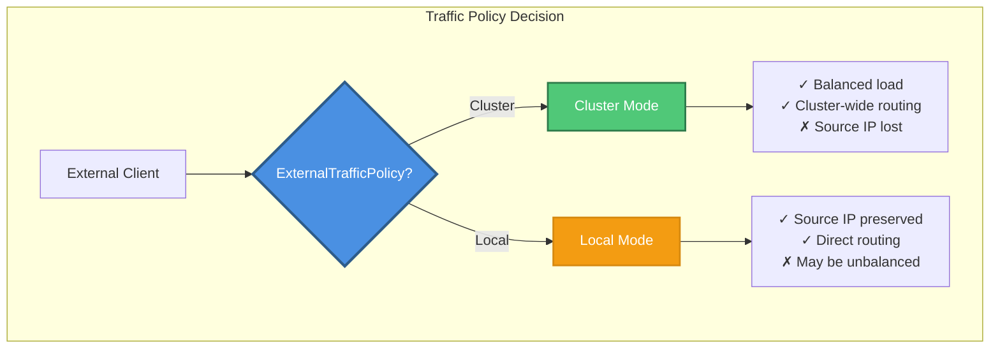
```mermaid
graph TB
    subgraph "Traffic Policy Decision"
        EXT[External Client]
        POL{ExternalTrafficPolicy?}

        EXT --> POL

        POL -->|Cluster| CLUSTER[Cluster Mode]
        POL -->|Local| LOCAL[Local Mode]

        CLUSTER --> CLUST_FEAT[✓ Balanced load<br/>✓ Cluster-wide routing<br/>✗ Source IP lost]
        LOCAL --> LOCAL_FEAT[✓ Source IP preserved<br/>✓ Direct routing<br/>✗ May be unbalanced]
    end

    style POL fill:#4a90e2,stroke:#2e5c8a,stroke-width:3px,color:#fff
    style CLUSTER fill:#50c878,stroke:#2d7a4a,stroke-width:2px,color:#fff
    style LOCAL fill:#f39c12,stroke:#d68910,stroke-width:2px,color:#fff
```

**Code Reference**: Service API definition
```
pkg/apis/core/types.go:4129     - ServiceSpec.ExternalTrafficPolicy field
pkg/apis/core/types.go:4140     - ServiceExternalTrafficPolicyType
```

### **Applicable Service Types**

ExternalTrafficPolicy applies **only** to Services that receive traffic from external sources:

| Service Type | ExternalTrafficPolicy | Reason |
|-------------|----------------------|---------|
| **NodePort** | ✅ Applicable | External clients → NodePort → Pods |
| **LoadBalancer** | ✅ Applicable | External LB → NodePort → Pods |
| ClusterIP | ❌ Not applicable | Internal traffic only (no external source) |
| ExternalIP | ✅ Applicable | External clients → ExternalIP → Pods |
| Headless | ❌ Not applicable | DNS-only, no kube-proxy involvement |

**Code Reference**: Traffic policy validation
```
pkg/proxy/service.go:158        - filterServicePort() checks service type
pkg/proxy/iptables/proxier.go:1127  - NodePort handling respects traffic policy
pkg/proxy/ipvs/proxier.go:1203  - IPVS NodePort traffic policy handling
```

### **Policy Values**

Two values are supported:

```yaml
apiVersion: v1
kind: Service
metadata:
  name: my-service
spec:
  type: LoadBalancer
  externalTrafficPolicy: Cluster  # or Local
  ports:
  - port: 80
    targetPort: 8080
```

**Default**: `Cluster` (for backward compatibility)

**Code Reference**: Default value
```
pkg/apis/core/v1/defaults.go:110    - SetDefaults_ServiceSpec() sets Cluster
```

### **Architecture Context**

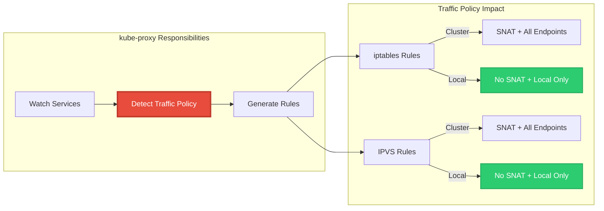
```mermaid
graph LR
    subgraph "kube-proxy Responsibilities"
        WATCH[Watch Services]
        DETECT[Detect Traffic Policy]
        RULES[Generate Rules]

        WATCH --> DETECT
        DETECT --> RULES
    end

    subgraph "Traffic Policy Impact"
        RULES --> IPTABLES[iptables Rules]
        RULES --> IPVS[IPVS Rules]

        IPTABLES --> |Cluster| IPT_CLUST[SNAT + All Endpoints]
        IPTABLES --> |Local| IPT_LOCAL[No SNAT + Local Only]

        IPVS --> |Cluster| IPVS_CLUST[SNAT + All Endpoints]
        IPVS --> |Local| IPVS_LOCAL[No SNAT + Local Only]
    end

    style DETECT fill:#e74c3c,stroke:#c0392b,stroke-width:3px,color:#fff
    style IPT_LOCAL fill:#2ecc71,stroke:#27ae60,stroke-width:2px,color:#fff
    style IPVS_LOCAL fill:#2ecc71,stroke:#27ae60,stroke-width:2px,color:#fff
```

**Cross-References**:
- [Service Types](04-service-types.md) - How different service types interact with traffic policy
- [iptables Mode](02-iptables-mode.md) - iptables implementation of traffic policy
- [IPVS Mode](03-ipvs-mode.md) - IPVS implementation of traffic policy
- [Session Affinity](06-session-affinity.md) - Combining session affinity with traffic policy

---

## **Traffic Policy Fundamentals**

### **Why Two Policies Exist**

The two policies represent a **fundamental trade-off** in distributed systems:

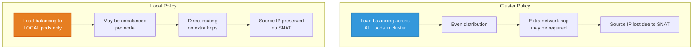
```mermaid
graph TB
    subgraph "Cluster Policy"
        C1[Load balancing across<br/>ALL pods in cluster]
        C2[Even distribution]
        C3[Extra network hop<br/>may be required]
        C4[Source IP lost due to SNAT]

        C1 --> C2
        C2 --> C3
        C3 --> C4
    end

    subgraph "Local Policy"
        L1[Load balancing to<br/>LOCAL pods only]
        L2[May be unbalanced<br/>per node]
        L3[Direct routing<br/>no extra hops]
        L4[Source IP preserved<br/>no SNAT]

        L1 --> L2
        L2 --> L3
        L3 --> L4
    end

    style C1 fill:#3498db,stroke:#2980b9,stroke-width:2px,color:#fff
    style L1 fill:#e67e22,stroke:#d35400,stroke-width:2px,color:#fff
```

### **Historical Context**

| Timeline | Event |
|----------|-------|
| **Kubernetes 1.4** | ExternalTrafficPolicy introduced (alpha) |
| **Kubernetes 1.5** | Promoted to beta |
| **Kubernetes 1.7** | Graduated to stable (GA) |
| **Default** | Remains "Cluster" for backward compatibility |

**Design Rationale**:
1. **Cluster** preserves original behavior (pre-1.4)
2. **Local** addresses two key use cases:
   - Applications that need client source IP
   - Applications sensitive to network latency (extra hops)

**Code Reference**: Feature gate history
```
pkg/features/kube_features.go:156   - ServiceExternalTrafficPolicy feature
staging/src/k8s.io/api/core/v1/types.go:4272  - ExternalTrafficPolicy field
```

### **Conceptual Differences**

#### **Cluster Policy: Cluster-Wide Load Balancing**

```
External Request → Node A (NodePort 30000)
                     ↓
           ┌─────────┼─────────┐
           ↓         ↓         ↓
        Pod 1     Pod 2     Pod 3
      (Node A)  (Node B)  (Node C)

Equal probability of reaching ANY pod (1/3 each)
```

**Characteristics**:
- ✅ **Even load distribution** across all ready endpoints
- ✅ **Works even if** no local endpoints exist on receiving node
- ✅ **Simple configuration** (default behavior)
- ❌ **Extra network hop** possible (Node A → Node B → Pod)
- ❌ **Source IP lost** (SNAT to node IP)
- ❌ **Higher latency** for cross-node traffic

#### **Local Policy: Node-Local Load Balancing**

```
External Request → Node A (NodePort 30000)
                     ↓
           ┌─────────┴─────────┐
           ↓                   ↓
        Pod 1               Pod 4
      (Node A)            (Node A)

Only local pods reachable (50% each)
Pods on other nodes NOT accessible via Node A
```

**Characteristics**:
- ✅ **Source IP preserved** (no SNAT)
- ✅ **Lower latency** (no cross-node hops)
- ✅ **Predictable routing** (stays on node)
- ❌ **Unbalanced load** if pods distributed unevenly
- ❌ **Connection failures** if no local endpoints
- ❌ **Health check complexity** for external load balancers

**Code Reference**: Policy-specific behavior
```
pkg/proxy/service.go:94         - ServicePort.OnlyNodeLocalEndpoints() method
pkg/proxy/endpoints.go:245      - OnlyNodeLocalEndpoints filter logic
```

### **Decision Matrix**

When choosing a traffic policy, consider:

| Requirement | Cluster | Local | Notes |
|------------|---------|-------|-------|
| **Need client source IP** | ❌ | ✅ | For logging, geo-location, security |
| **Even load distribution** | ✅ | ❌ | Cluster better for balanced load |
| **Low latency critical** | ❌ | ✅ | Local avoids extra hops |
| **Highly available** | ✅ | ⚠️ | Local requires endpoints on all nodes |
| **Simple setup** | ✅ | ❌ | Cluster is default, simpler |
| **Cost-sensitive** | ❌ | ✅ | Local reduces cross-AZ traffic costs |

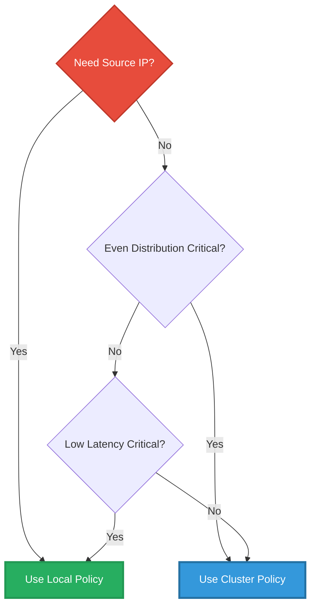
```mermaid
graph TB
    START{Need Source IP?}

    START -->|Yes| LOCAL_CHOICE[Use Local Policy]
    START -->|No| DIST{Even Distribution Critical?}

    DIST -->|Yes| CLUSTER_CHOICE[Use Cluster Policy]
    DIST -->|No| LAT{Low Latency Critical?}

    LAT -->|Yes| LOCAL_CHOICE
    LAT -->|No| CLUSTER_CHOICE

    style LOCAL_CHOICE fill:#27ae60,stroke:#229954,stroke-width:3px,color:#fff
    style CLUSTER_CHOICE fill:#3498db,stroke:#2471a3,stroke-width:3px,color:#fff
    style START fill:#e74c3c,stroke:#c0392b,stroke-width:2px,color:#fff
```

---

## **Cluster Policy Behavior**

### **Overview**

**Cluster** policy (the default) distributes external traffic across **all ready endpoints** in the entire cluster, regardless of which node received the traffic.

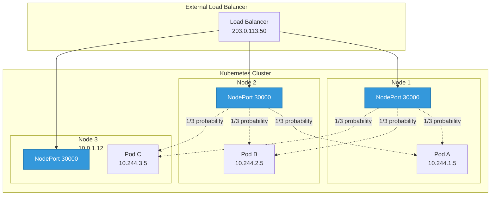
```mermaid
graph TB
    subgraph "External Load Balancer"
        LB[Load Balancer<br/>203.0.113.50]
    end

    subgraph "Kubernetes Cluster"
        subgraph "Node 1<br/>10.0.1.10"
            N1_NP[NodePort 30000]
            N1_P1[Pod A<br/>10.244.1.5]
        end

        subgraph "Node 2<br/>10.0.1.11"
            N2_NP[NodePort 30000]
            N2_P1[Pod B<br/>10.244.2.5]
        end

        subgraph "Node 3<br/>10.0.1.12"
            N3_NP[NodePort 30000]
            N3_P1[Pod C<br/>10.244.3.5]
        end
    end

    LB --> N1_NP
    LB --> N2_NP
    LB --> N3_NP

    N1_NP -.->|1/3 probability| N1_P1
    N1_NP -.->|1/3 probability| N2_P1
    N1_NP -.->|1/3 probability| N3_P1

    N2_NP -.->|1/3 probability| N1_P1
    N2_NP -.->|1/3 probability| N2_P1
    N2_NP -.->|1/3 probability| N3_P1

    style N1_NP fill:#3498db,stroke:#2980b9,stroke-width:2px,color:#fff
    style N2_NP fill:#3498db,stroke:#2980b9,stroke-width:2px,color:#fff
    style N3_NP fill:#3498db,stroke:#2980b9,stroke-width:2px,color:#fff
```

### **Load Distribution**

With Cluster policy, load is distributed evenly **across all endpoints**, not nodes:

**Example**: 3 nodes, 5 pods

```
Node 1: Pod A, Pod B       (2 pods)
Node 2: Pod C              (1 pod)
Node 3: Pod D, Pod E       (2 pods)

Each pod receives approximately 20% of traffic (1/5)
```

**Calculation**:
- Total endpoints: 5
- Probability per endpoint: 1/5 = 0.20 (20%)
- Regardless of pod distribution across nodes

**Code Reference**: Cluster policy endpoint selection
```
pkg/proxy/iptables/proxier.go:924   - Service iteration (all endpoints)
pkg/proxy/iptables/proxier.go:1541  - writeServiceToEndpointRules() equal probability
pkg/proxy/ipvs/proxier.go:1092      - buildVirtualServer() with all real servers
```

### **SNAT Behavior**

Cluster policy **always applies SNAT** (Source Network Address Translation) to external traffic:

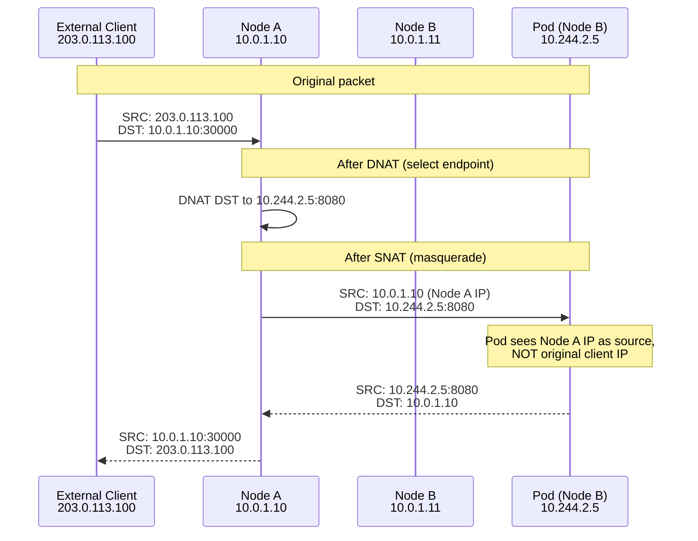
```mermaid
sequenceDiagram
    participant Client as External Client<br/>203.0.113.100
    participant NodeA as Node A<br/>10.0.1.10
    participant NodeB as Node B<br/>10.0.1.11
    participant Pod as Pod (Node B)<br/>10.244.2.5

    Note over Client,Pod: Original packet
    Client->>NodeA: SRC: 203.0.113.100<br/>DST: 10.0.1.10:30000

    Note over NodeA,Pod: After DNAT (select endpoint)
    NodeA->>NodeA: DNAT DST to 10.244.2.5:8080

    Note over NodeA,Pod: After SNAT (masquerade)
    NodeA->>Pod: SRC: 10.0.1.10 (Node A IP)<br/>DST: 10.244.2.5:8080

    Note over Pod: Pod sees Node A IP as source,<br/>NOT original client IP

    Pod-->>NodeA: SRC: 10.244.2.5:8080<br/>DST: 10.0.1.10
    NodeA-->>Client: SRC: 10.0.1.10:30000<br/>DST: 203.0.113.100
```

**Why SNAT is Required**:

1. **Symmetric routing**: Return traffic must go through the same node
2. **Cross-node traffic**: When traffic goes Node A → Pod on Node B
   - Without SNAT: Pod replies directly to client
   - Client rejects reply (came from different IP than request)

**SNAT Application Point**:

```
iptables -t nat -A KUBE-POSTROUTING \
  -m mark --mark 0x4000/0x4000 \
  -j MASQUERADE

Mark 0x4000 = Traffic that needs SNAT
```

**Code Reference**: SNAT/Masquerade implementation
```
pkg/proxy/iptables/proxier.go:1015  - Mark packet for masquerade
pkg/proxy/iptables/proxier.go:895   - KUBE-POSTROUTING chain
pkg/proxy/ipvs/proxier.go:1348      - IPVS masquerade check
```

### **iptables Implementation**

#### **Rule Structure**

For a NodePort service with Cluster policy:

```bash
# Service: my-service
# Type: LoadBalancer (includes NodePort)
# ExternalTrafficPolicy: Cluster
# NodePort: 30000
# ClusterIP: 10.96.100.50:80
# Endpoints: 10.244.1.5:8080, 10.244.2.6:8080, 10.244.3.7:8080

# ========================================
# PREROUTING: Catch external traffic
# ========================================
-A PREROUTING -m comment --comment "kubernetes service portals" \
  -j KUBE-SERVICES

# ========================================
# KUBE-SERVICES: Route to NodePort chain
# ========================================
-A KUBE-SERVICES -m addrtype --dst-type LOCAL \
  -m comment --comment "kubernetes service nodeports; NOTE: this must be the last rule" \
  -j KUBE-NODEPORTS

# ========================================
# KUBE-NODEPORTS: Match NodePort
# ========================================
-A KUBE-NODEPORTS -p tcp -m comment \
  --comment "default/my-service" \
  -m tcp --dport 30000 \
  -j KUBE-SVC-ABCDEFGHIJKLMNOP

# ========================================
# KUBE-SVC-*: Load balance to endpoints
# ========================================
-A KUBE-SVC-ABCDEFGHIJKLMNOP -m comment \
  --comment "default/my-service -> 10.244.1.5:8080" \
  -m statistic --mode random --probability 0.33333333 \
  -j KUBE-SEP-AAAAAAAAAAAAAAAA

-A KUBE-SVC-ABCDEFGHIJKLMNOP -m comment \
  --comment "default/my-service -> 10.244.2.6:8080" \
  -m statistic --mode random --probability 0.50000000 \
  -j KUBE-SEP-BBBBBBBBBBBBBBBB

-A KUBE-SVC-ABCDEFGHIJKLMNOP -m comment \
  --comment "default/my-service -> 10.244.3.7:8080" \
  -j KUBE-SEP-CCCCCCCCCCCCCCCC

# ========================================
# KUBE-SEP-*: DNAT to endpoint, mark for SNAT
# ========================================
-A KUBE-SEP-AAAAAAAAAAAAAAAA -p tcp -m tcp \
  -m comment --comment "default/my-service" \
  -j DNAT --to-destination 10.244.1.5:8080

-A KUBE-SEP-AAAAAAAAAAAAAAAA \
  -m comment --comment "default/my-service" \
  -j KUBE-MARK-MASQ

-A KUBE-SEP-BBBBBBBBBBBBBBBB -p tcp -m tcp \
  -m comment --comment "default/my-service" \
  -j DNAT --to-destination 10.244.2.6:8080

-A KUBE-SEP-BBBBBBBBBBBBBBBB \
  -m comment --comment "default/my-service" \
  -j KUBE-MARK-MASQ

-A KUBE-SEP-CCCCCCCCCCCCCCCC -p tcp -m tcp \
  -m comment --comment "default/my-service" \
  -j DNAT --to-destination 10.244.3.7:8080

-A KUBE-SEP-CCCCCCCCCCCCCCCC \
  -m comment --comment "default/my-service" \
  -j KUBE-MARK-MASQ

# ========================================
# KUBE-MARK-MASQ: Mark packet for SNAT
# ========================================
-A KUBE-MARK-MASQ -j MARK --set-xmark 0x4000/0x4000

# ========================================
# POSTROUTING: Apply SNAT
# ========================================
-A POSTROUTING -m comment --comment "kubernetes postrouting rules" \
  -j KUBE-POSTROUTING

-A KUBE-POSTROUTING -m mark --mark 0x4000/0x4000 \
  -m comment --comment "kubernetes service traffic requiring SNAT" \
  -j MASQUERADE
```

**Key Points**:
- ALL endpoints included (cluster-wide)
- Equal probability distribution (0.33, 0.50, 1.00 for 3 endpoints)
- EVERY endpoint path includes `KUBE-MARK-MASQ` (ensures SNAT)
- MASQUERADE in POSTROUTING applies SNAT

**Code Reference**: iptables Cluster policy rules
```
pkg/proxy/iptables/proxier.go:1127  - NodePort rule generation
pkg/proxy/iptables/proxier.go:1541  - writeServiceToEndpointRules() for all endpoints
pkg/proxy/iptables/proxier.go:1588  - KUBE-MARK-MASQ jump added
```

### **IPVS Implementation**

#### **Virtual Server Configuration**

For the same service in IPVS mode:

```bash
# Virtual Server for NodePort (each node interface)
ipvsadm -A -t 10.0.1.10:30000 -s rr

# Real Servers (all endpoints)
ipvsadm -a -t 10.0.1.10:30000 -r 10.244.1.5:8080 -m
ipvsadm -a -t 10.0.1.10:30000 -r 10.244.2.6:8080 -m
ipvsadm -a -t 10.0.1.10:30000 -r 10.244.3.7:8080 -m

# -m = Masquerade (NAT mode, includes SNAT)
# -s rr = Round-robin scheduling
```

**IPVS Characteristics**:
- **All endpoints** added as real servers
- **Masquerade mode** (`-m` flag) ensures SNAT
- **Scheduling algorithm** distributes load evenly

**Code Reference**: IPVS Cluster policy
```
pkg/proxy/ipvs/proxier.go:1203      - syncService() for NodePort
pkg/proxy/ipvs/proxier.go:1348      - ensureMasqueradeRule()
pkg/proxy/ipvs/proxier.go:1092      - buildVirtualServer() includes all endpoints
```

### **Packet Flow Example**

Complete packet flow for Cluster policy:

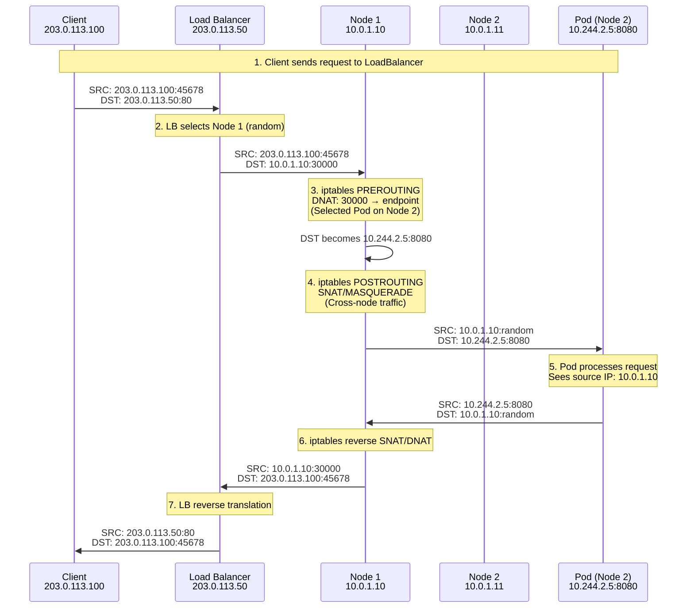
```mermaid
sequenceDiagram
    participant C as Client<br/>203.0.113.100
    participant LB as Load Balancer<br/>203.0.113.50
    participant N1 as Node 1<br/>10.0.1.10
    participant N2 as Node 2<br/>10.0.1.11
    participant P as Pod (Node 2)<br/>10.244.2.5:8080

    Note over C,P: 1. Client sends request to LoadBalancer
    C->>LB: SRC: 203.0.113.100:45678<br/>DST: 203.0.113.50:80

    Note over LB: 2. LB selects Node 1 (random)
    LB->>N1: SRC: 203.0.113.100:45678<br/>DST: 10.0.1.10:30000

    Note over N1: 3. iptables PREROUTING<br/>DNAT: 30000 → endpoint<br/>(Selected Pod on Node 2)
    N1->>N1: DST becomes 10.244.2.5:8080

    Note over N1: 4. iptables POSTROUTING<br/>SNAT/MASQUERADE<br/>(Cross-node traffic)
    N1->>P: SRC: 10.0.1.10:random<br/>DST: 10.244.2.5:8080

    Note over P: 5. Pod processes request<br/>Sees source IP: 10.0.1.10

    P->>N1: SRC: 10.244.2.5:8080<br/>DST: 10.0.1.10:random

    Note over N1: 6. iptables reverse SNAT/DNAT
    N1->>LB: SRC: 10.0.1.10:30000<br/>DST: 203.0.113.100:45678

    Note over LB: 7. LB reverse translation
    LB->>C: SRC: 203.0.113.50:80<br/>DST: 203.0.113.100:45678
```

**Observation**: Pod sees Node 1 IP (10.0.1.10), not original client IP (203.0.113.100)

**Code Reference**: Packet transformation
```
pkg/proxy/iptables/proxier.go:1015  - DNAT applied
pkg/proxy/iptables/proxier.go:1588  - MASQUERADE mark set
pkg/proxy/iptables/proxier.go:895   - MASQUERADE applied in POSTROUTING
```

### **Health Check Handling**

External load balancers perform health checks on NodePort:

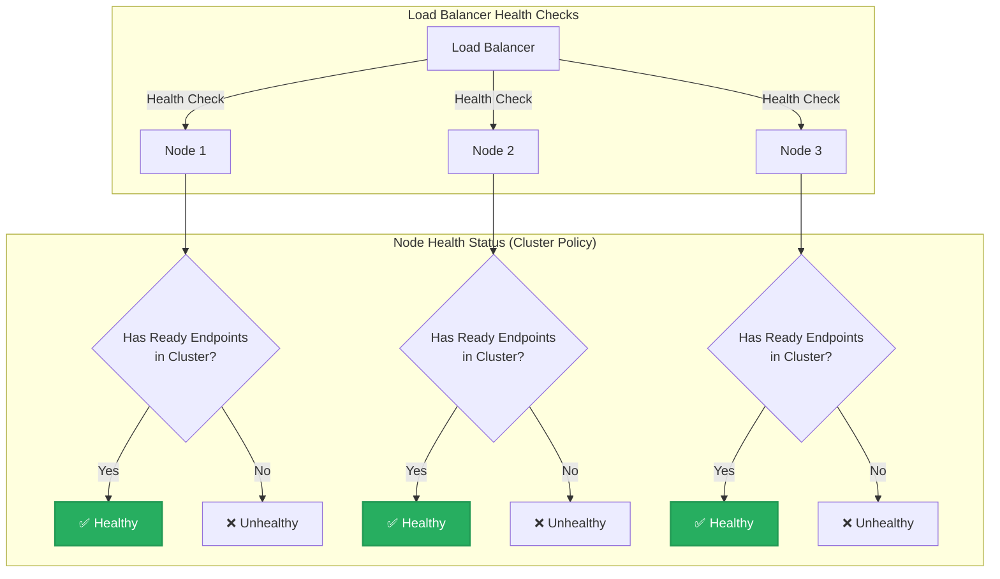
```mermaid
graph TB
    subgraph "Load Balancer Health Checks"
        LB[Load Balancer]

        LB -->|Health Check| N1[Node 1]
        LB -->|Health Check| N2[Node 2]
        LB -->|Health Check| N3[Node 3]
    end

    subgraph "Node Health Status (Cluster Policy)"
        N1 --> N1_STAT{Has Ready Endpoints<br/>in Cluster?}
        N2 --> N2_STAT{Has Ready Endpoints<br/>in Cluster?}
        N3 --> N3_STAT{Has Ready Endpoints<br/>in Cluster?}

        N1_STAT -->|Yes| N1_HEALTHY[✅ Healthy]
        N1_STAT -->|No| N1_UNHEALTHY[❌ Unhealthy]

        N2_STAT -->|Yes| N2_HEALTHY[✅ Healthy]
        N2_STAT -->|No| N2_UNHEALTHY[❌ Unhealthy]

        N3_STAT -->|Yes| N3_HEALTHY[✅ Healthy]
        N3_STAT -->|No| N3_UNHEALTHY[❌ Unhealthy]
    end

    style N1_HEALTHY fill:#27ae60,stroke:#229954,stroke-width:2px,color:#fff
    style N2_HEALTHY fill:#27ae60,stroke:#229954,stroke-width:2px,color:#fff
    style N3_HEALTHY fill:#27ae60,stroke:#229954,stroke-width:2px,color:#fff
```

**Cluster Policy Behavior**:
- **Node is healthy** if ANY ready endpoint exists in cluster
- **All nodes** typically report healthy (same cluster-wide endpoint set)
- **Load balancer** distributes evenly across all nodes

**Result**: Load balancer can send traffic to any node, which then distributes to any pod

**Code Reference**: Health check behavior
```
pkg/proxy/healthcheck/healthcheck.go:93   - Server.SyncServices()
pkg/proxy/healthcheck/healthcheck.go:142  - Service health based on endpoints
```

---

## **Local Policy Behavior**

### **Overview**

**Local** policy restricts external traffic to **only endpoints on the receiving node**, preserving the source IP and avoiding extra network hops.

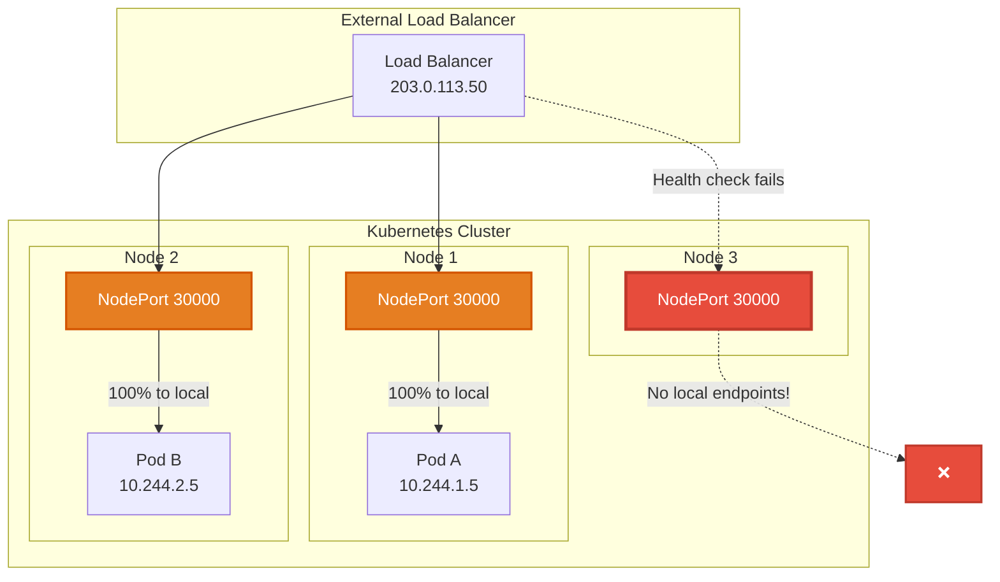
```mermaid
graph TB
    subgraph "External Load Balancer"
        LB[Load Balancer<br/>203.0.113.50]
    end

    subgraph "Kubernetes Cluster"
        subgraph "Node 1<br/>10.0.1.10"
            N1_NP[NodePort 30000]
            N1_P1[Pod A<br/>10.244.1.5]
        end

        subgraph "Node 2<br/>10.0.1.11"
            N2_NP[NodePort 30000]
            N2_P1[Pod B<br/>10.244.2.5]
        end

        subgraph "Node 3<br/>10.0.1.12"
            N3_NP[NodePort 30000]
        end
    end

    LB --> N1_NP
    LB --> N2_NP
    LB -.->|Health check fails| N3_NP

    N1_NP -->|100% to local| N1_P1
    N2_NP -->|100% to local| N2_P1
    N3_NP -.->|No local endpoints!| X[❌]

    style N1_NP fill:#e67e22,stroke:#d35400,stroke-width:2px,color:#fff
    style N2_NP fill:#e67e22,stroke:#d35400,stroke-width:2px,color:#fff
    style N3_NP fill:#e74c3c,stroke:#c0392b,stroke-width:3px,color:#fff
    style X fill:#e74c3c,stroke:#c0392b,stroke-width:2px,color:#fff
```

**Key Observation**: Node 3 has **no local endpoints**, so:
- Health check **fails**
- Load balancer **excludes** Node 3 from rotation
- Traffic only goes to Node 1 and Node 2

### **No SNAT Behavior**

Local policy **does NOT apply SNAT** for external traffic:

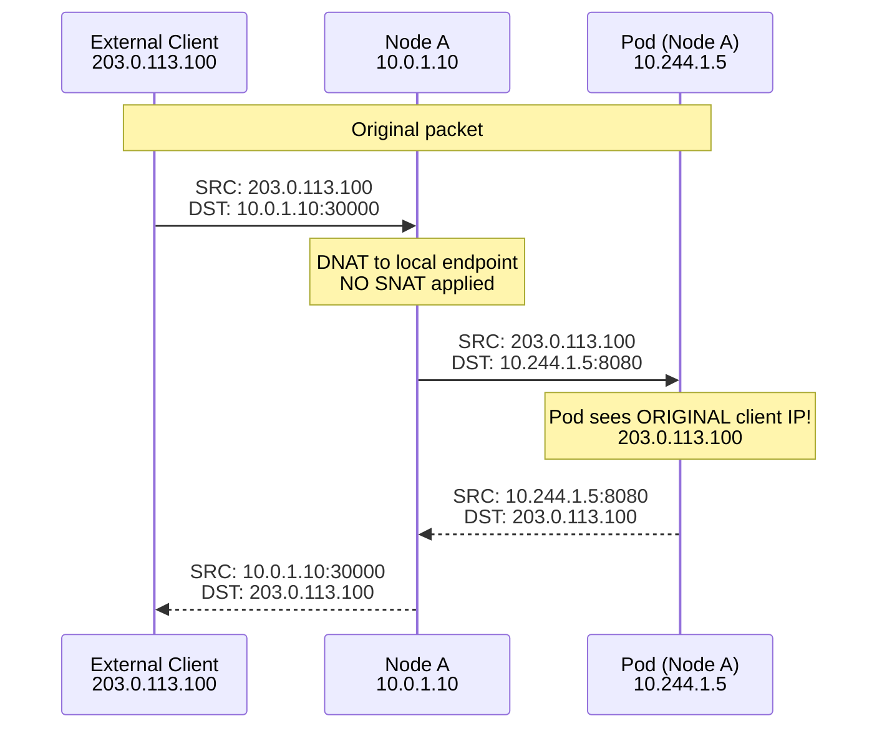
```mermaid
sequenceDiagram
    participant Client as External Client<br/>203.0.113.100
    participant Node as Node A<br/>10.0.1.10
    participant Pod as Pod (Node A)<br/>10.244.1.5

    Note over Client,Pod: Original packet
    Client->>Node: SRC: 203.0.113.100<br/>DST: 10.0.1.10:30000

    Note over Node: DNAT to local endpoint<br/>NO SNAT applied
    Node->>Pod: SRC: 203.0.113.100<br/>DST: 10.244.1.5:8080

    Note over Pod: Pod sees ORIGINAL client IP!<br/>203.0.113.100

    Pod-->>Node: SRC: 10.244.1.5:8080<br/>DST: 203.0.113.100
    Node-->>Client: SRC: 10.0.1.10:30000<br/>DST: 203.0.113.100
```

**Why No SNAT is Safe**:
1. **No cross-node routing**: Traffic stays on same node
2. **Symmetric path**: Return traffic goes through same node (DNAT reverse)
3. **Client sees correct source**: Response comes from NodePort IP (expected)

**Code Reference**: No SNAT for Local policy
```
pkg/proxy/iptables/proxier.go:1574  - Skip KUBE-MARK-MASQ for local endpoints
pkg/proxy/ipvs/proxier.go:1348      - ensureMasqueradeRule() skipped for local
```

### **Load Balancing Implications**

With Local policy, load distribution depends on **pod placement**:

**Example**: 3 nodes, 5 pods

```
Node 1: Pod A, Pod B       (2 local pods)
Node 2: Pod C              (1 local pod)
Node 3: Pod D, Pod E       (2 local pods)

If load balancer sends equal traffic to each node:
  Node 1: 33.3% → split between 2 pods → 16.7% per pod
  Node 2: 33.3% → 1 pod gets all → 33.3% for Pod C
  Node 3: 33.3% → split between 2 pods → 16.7% per pod

Pod C receives TWICE the load of other pods!
```

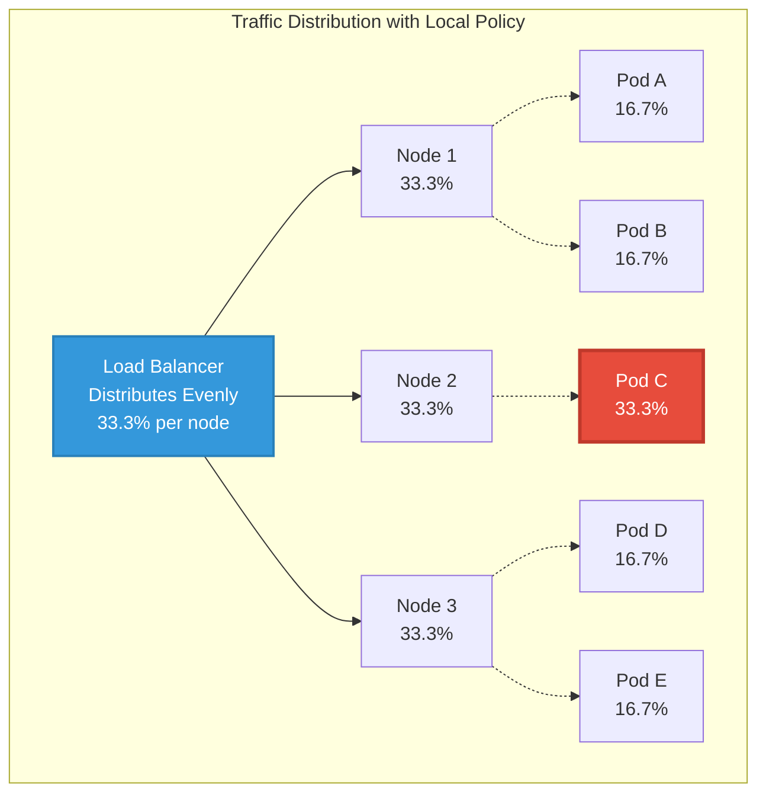
```mermaid
graph TB
    subgraph "Traffic Distribution with Local Policy"
        LB[Load Balancer<br/>Distributes Evenly<br/>33.3% per node]

        N1[Node 1<br/>33.3%]
        N2[Node 2<br/>33.3%]
        N3[Node 3<br/>33.3%]

        LB --> N1
        LB --> N2
        LB --> N3

        P1A[Pod A<br/>16.7%]
        P1B[Pod B<br/>16.7%]
        P2C[Pod C<br/>33.3%]
        P3D[Pod D<br/>16.7%]
        P3E[Pod E<br/>16.7%]

        N1 -.-> P1A
        N1 -.-> P1B
        N2 -.-> P2C
        N3 -.-> P3D
        N3 -.-> P3E
    end

    style P2C fill:#e74c3c,stroke:#c0392b,stroke-width:3px,color:#fff
    style LB fill:#3498db,stroke:#2980b9,stroke-width:2px,color:#fff
```

**Mitigation Strategy**: Use DaemonSet or pod anti-affinity to ensure equal pods per node

**Code Reference**: Local endpoint filtering
```
pkg/proxy/service.go:94         - OnlyNodeLocalEndpoints() check
pkg/proxy/endpoints.go:245      - Filter to local endpoints only
```

### **iptables Implementation**

#### **Rule Structure**

For a NodePort service with Local policy:

```bash
# Service: my-service
# Type: LoadBalancer
# ExternalTrafficPolicy: Local
# NodePort: 30000
# LOCAL Endpoints on this node: 10.244.1.5:8080, 10.244.1.6:8080

# ========================================
# KUBE-NODEPORTS: Match NodePort
# ========================================
-A KUBE-NODEPORTS -p tcp -m comment \
  --comment "default/my-service" \
  -m tcp --dport 30000 \
  -j KUBE-XLB-ABCDEFGHIJKLMNOP

# ========================================
# KUBE-XLB-*: External LB traffic (Local policy)
# NOTE: Uses XLB chain for Local policy, not SVC
# ========================================

# If NO local endpoints, drop traffic
-A KUBE-XLB-ABCDEFGHIJKLMNOP -m comment \
  --comment "default/my-service has no local endpoints" \
  -j KUBE-MARK-DROP

# If local endpoints exist, use them
-A KUBE-XLB-ABCDEFGHIJKLMNOP -m comment \
  --comment "default/my-service -> 10.244.1.5:8080" \
  -m statistic --mode random --probability 0.50000000 \
  -j KUBE-SEP-LOCALAAAAAAAAAA

-A KUBE-XLB-ABCDEFGHIJKLMNOP -m comment \
  --comment "default/my-service -> 10.244.1.6:8080" \
  -j KUBE-SEP-LOCALBBBBBBBBBB

# ========================================
# KUBE-SEP-*: DNAT to local endpoint, NO MASQUERADE
# ========================================
-A KUBE-SEP-LOCALAAAAAAAAAA -p tcp -m tcp \
  -m comment --comment "default/my-service" \
  -j DNAT --to-destination 10.244.1.5:8080

# NOTE: No KUBE-MARK-MASQ jump! Source IP preserved!

-A KUBE-SEP-LOCALBBBBBBBBBB -p tcp -m tcp \
  -m comment --comment "default/my-service" \
  -j DNAT --to-destination 10.244.1.6:8080

# NOTE: No KUBE-MARK-MASQ jump! Source IP preserved!

# ========================================
# KUBE-MARK-DROP: Drop if no local endpoints
# ========================================
-A KUBE-MARK-DROP -j MARK --set-xmark 0x8000/0x8000

# Later in filter table:
-A KUBE-FIREWALL -m mark --mark 0x8000/0x8000 -j DROP
```

**Key Differences from Cluster Policy**:
- ✅ Uses **KUBE-XLB-*** chain (not KUBE-SVC-*)
- ✅ **NO KUBE-MARK-MASQ** jump → Source IP preserved
- ✅ Only **LOCAL endpoints** included
- ✅ **Drop rule** if no local endpoints exist

**Code Reference**: iptables Local policy rules
```
pkg/proxy/iptables/proxier.go:1127  - Uses OnlyNodeLocalEndpoints check
pkg/proxy/iptables/proxier.go:1142  - KUBE-XLB-* chain for external LB
pkg/proxy/iptables/proxier.go:1163  - KUBE-MARK-DROP if no local endpoints
pkg/proxy/iptables/proxier.go:1574  - No MASQ mark for local endpoints
```

### **IPVS Implementation**

#### **Virtual Server Configuration**

For the same service in IPVS mode:

```bash
# Virtual Server for NodePort on this node
# Only includes LOCAL real servers
ipvsadm -A -t 10.0.1.10:30000 -s rr

# Real Servers (ONLY local endpoints)
ipvsadm -a -t 10.0.1.10:30000 -r 10.244.1.5:8080 -m
ipvsadm -a -t 10.0.1.10:30000 -r 10.244.1.6:8080 -m

# NOTE: Remote endpoints NOT added!
```

**IPVS Local Policy Nuances**:
- **Local endpoints only** in real server list
- **Still uses masquerade mode** (`-m`) BUT...
- **Special handling** to preserve source IP:

```bash
# IPVS automatically skips SNAT for:
# - Traffic from external sources (not from pods)
# - When using Local policy
# This is configured via:
sysctl net.ipv4.vs.conntrack=1
```

**Code Reference**: IPVS Local policy
```
pkg/proxy/ipvs/proxier.go:1203      - syncService() filters local endpoints
pkg/proxy/ipvs/proxier.go:1309      - Build real server list (local only)
pkg/proxy/ipvs/proxier.go:1348      - Handle masquerade for local traffic
```

### **Health Check Behavior**

Health checks work differently with Local policy:

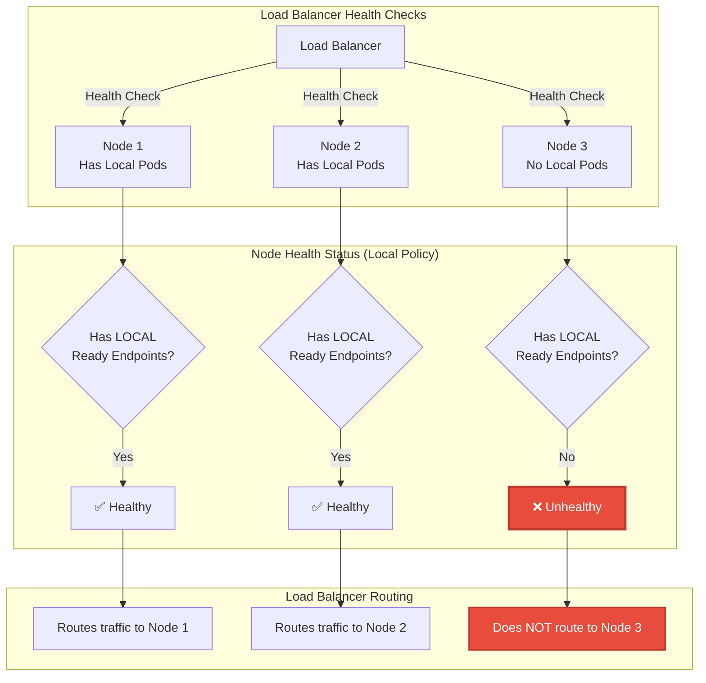
```mermaid
graph TB
    subgraph "Load Balancer Health Checks"
        LB[Load Balancer]

        LB -->|Health Check| N1[Node 1<br/>Has Local Pods]
        LB -->|Health Check| N2[Node 2<br/>Has Local Pods]
        LB -->|Health Check| N3[Node 3<br/>No Local Pods]
    end

    subgraph "Node Health Status (Local Policy)"
        N1 --> N1_STAT{Has LOCAL<br/>Ready Endpoints?}
        N2 --> N2_STAT{Has LOCAL<br/>Ready Endpoints?}
        N3 --> N3_STAT{Has LOCAL<br/>Ready Endpoints?}

        N1_STAT -->|Yes| N1_HEALTHY[✅ Healthy]
        N2_STAT -->|Yes| N2_HEALTHY[✅ Healthy]
        N3_STAT -->|No| N3_UNHEALTHY[❌ Unhealthy]
    end

    subgraph "Load Balancer Routing"
        N1_HEALTHY --> ROUTE1[Routes traffic to Node 1]
        N2_HEALTHY --> ROUTE2[Routes traffic to Node 2]
        N3_UNHEALTHY --> ROUTE3[Does NOT route to Node 3]
    end

    style N3_UNHEALTHY fill:#e74c3c,stroke:#c0392b,stroke-width:3px,color:#fff
    style ROUTE3 fill:#e74c3c,stroke:#c0392b,stroke-width:2px,color:#fff
```

**Local Policy Behavior**:
- **Node is healthy** ONLY if it has **local** ready endpoints
- **Nodes without local pods** fail health check
- **Load balancer** only sends traffic to nodes with local pods

**Health Check Endpoint**:

kube-proxy runs a health check server on each node:

```
NodePort: 30000 (application traffic)
HealthCheckNodePort: 30012 (health checks)

HTTP GET /healthz → 200 OK if local endpoints exist
                 → 503 Service Unavailable otherwise
```

**Code Reference**: Health check for Local policy
```
pkg/proxy/healthcheck/healthcheck.go:93   - SyncServices() updates health
pkg/proxy/healthcheck/healthcheck.go:142  - Check local endpoints only
pkg/proxy/healthcheck/healthcheck.go:167  - HTTP handler returns 503 if no local
```

### **Automatic Health Check Port Allocation**

When using Local policy with LoadBalancer service, Kubernetes automatically allocates a health check port:

```yaml
apiVersion: v1
kind: Service
metadata:
  name: my-service
spec:
  type: LoadBalancer
  externalTrafficPolicy: Local  # Triggers healthCheckNodePort allocation
  ports:
  - port: 80
    targetPort: 8080
  selector:
    app: my-app
---
# After creation, Service gets:
status:
  loadBalancer:
    ingress:
    - ip: 203.0.113.50
# And automatic field:
spec:
  healthCheckNodePort: 30012  # Automatically assigned!
```

**Code Reference**: Health check port allocation
```
pkg/apis/core/validation/validation.go:4289  - Validate healthCheckNodePort
pkg/registry/core/service/strategy.go:299    - Allocate health check port
```

### **Packet Flow Example**

Complete packet flow for Local policy:

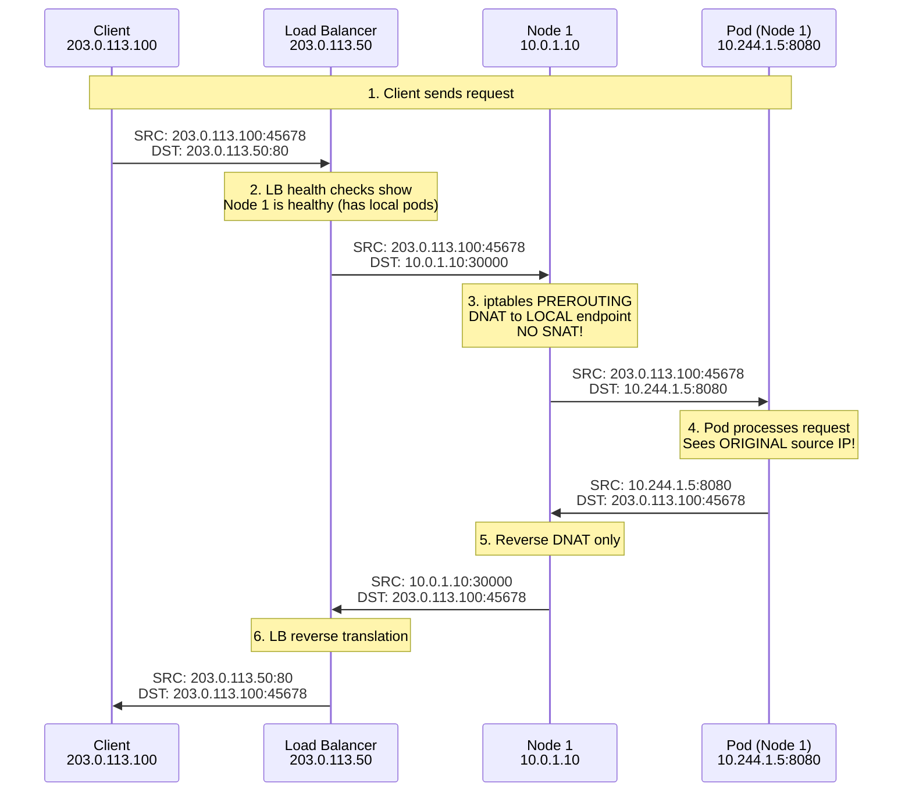
```mermaid
sequenceDiagram
    participant C as Client<br/>203.0.113.100
    participant LB as Load Balancer<br/>203.0.113.50
    participant N1 as Node 1<br/>10.0.1.10
    participant P as Pod (Node 1)<br/>10.244.1.5:8080

    Note over C,P: 1. Client sends request
    C->>LB: SRC: 203.0.113.100:45678<br/>DST: 203.0.113.50:80

    Note over LB: 2. LB health checks show<br/>Node 1 is healthy (has local pods)

    LB->>N1: SRC: 203.0.113.100:45678<br/>DST: 10.0.1.10:30000

    Note over N1: 3. iptables PREROUTING<br/>DNAT to LOCAL endpoint<br/>NO SNAT!
    N1->>P: SRC: 203.0.113.100:45678<br/>DST: 10.244.1.5:8080

    Note over P: 4. Pod processes request<br/>Sees ORIGINAL source IP!

    P->>N1: SRC: 10.244.1.5:8080<br/>DST: 203.0.113.100:45678

    Note over N1: 5. Reverse DNAT only
    N1->>LB: SRC: 10.0.1.10:30000<br/>DST: 203.0.113.100:45678

    Note over LB: 6. LB reverse translation
    LB->>C: SRC: 203.0.113.50:80<br/>DST: 203.0.113.100:45678
```

**Observation**: Pod sees original client IP (203.0.113.100)!

---

## **Source IP Preservation**

### **Why Source IP Matters**

The original client IP address is critical for many applications:

| Use Case | Reason |
|----------|--------|
| **Access Control** | IP-based allow/deny lists (firewalls, security rules) |
| **Geo-location** | Determine client location for content delivery, compliance |
| **Logging & Auditing** | Track actual client IPs in application logs |
| **Rate Limiting** | Limit requests per client IP |
| **Analytics** | Understand user geographic distribution |
| **Compliance** | GDPR, CCPA require knowing data source location |
| **DDoS Protection** | Identify and block malicious IPs |

### **Source IP in Cluster Policy**

With Cluster policy, source IP is **lost**:

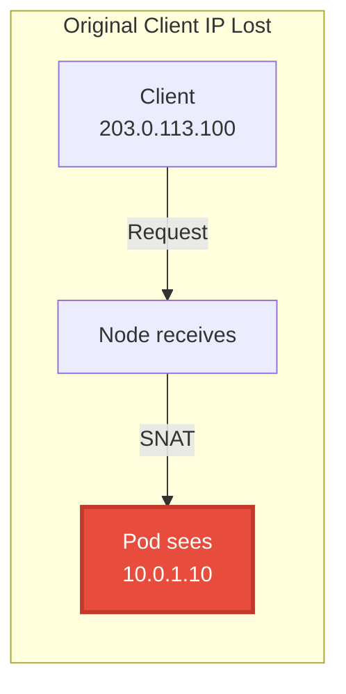
```mermaid
graph LR
    subgraph "Original Client IP Lost"
        CLIENT[Client<br/>203.0.113.100] -->|Request| NODE[Node receives]
        NODE -->|SNAT| POD[Pod sees<br/>10.0.1.10]
    end

    style POD fill:#e74c3c,stroke:#c0392b,stroke-width:3px,color:#fff
```

**What Pod Receives**:
```go
// Application code (e.g., HTTP server)
req.RemoteAddr = "10.0.1.10:54321"  // Node IP, not client IP!
```

**Workaround**: Use HTTP headers if available:

```
X-Forwarded-For: 203.0.113.100  # Set by load balancer
X-Real-IP: 203.0.113.100        # Alternative header
```

But this only works if:
- Load balancer supports and sets headers
- Application explicitly reads headers
- Headers can be trusted (risk of spoofing)

**Code Reference**: SNAT in Cluster mode
```
pkg/proxy/iptables/proxier.go:1588  - KUBE-MARK-MASQ always applied
pkg/proxy/iptables/proxier.go:895   - MASQUERADE in POSTROUTING
```

### **Source IP in Local Policy**

With Local policy, source IP is **preserved**:

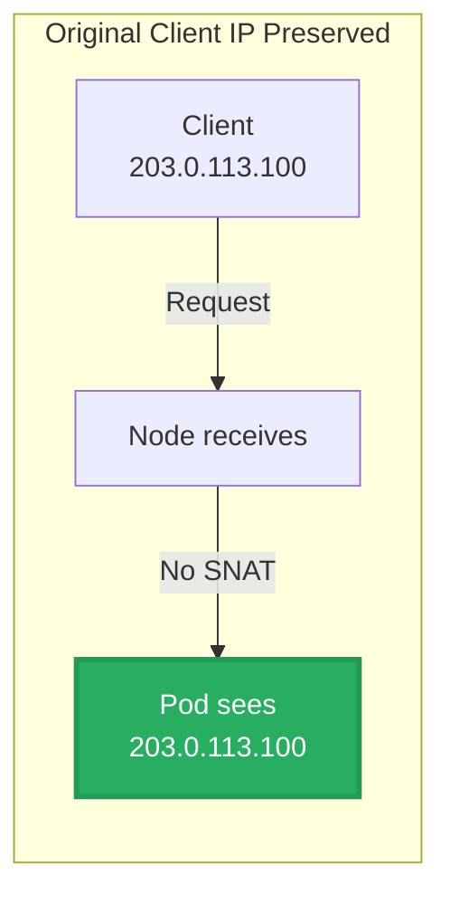
```mermaid
graph LR
    subgraph "Original Client IP Preserved"
        CLIENT[Client<br/>203.0.113.100] -->|Request| NODE[Node receives]
        NODE -->|No SNAT| POD[Pod sees<br/>203.0.113.100]
    end

    style POD fill:#27ae60,stroke:#229954,stroke-width:3px,color:#fff
```

**What Pod Receives**:
```go
// Application code
req.RemoteAddr = "203.0.113.100:45678"  // Original client IP!
```

**Benefits**:
- ✅ No need for X-Forwarded-For headers
- ✅ Works with any protocol (not just HTTP)
- ✅ Reliable (can't be spoofed by client)
- ✅ Application code simpler

**Code Reference**: No SNAT in Local mode
```
pkg/proxy/iptables/proxier.go:1574  - Skip MASQ for local endpoints
```

### **Source IP with Internal Traffic**

For **internal** traffic (pod-to-service, node-to-service), source IP behavior differs:

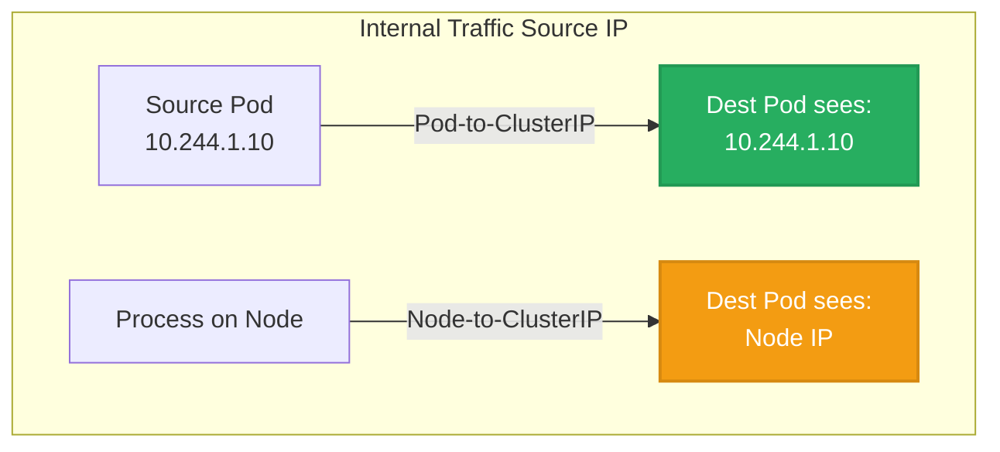
```mermaid
graph TB
    subgraph "Internal Traffic Source IP"
        POD_SRC[Source Pod<br/>10.244.1.10]
        NODE_SRC[Process on Node]

        POD_SRC -->|Pod-to-ClusterIP| POD_DEST1[Dest Pod sees:<br/>10.244.1.10]
        NODE_SRC -->|Node-to-ClusterIP| POD_DEST2[Dest Pod sees:<br/>Node IP]
    end

    style POD_DEST1 fill:#27ae60,stroke:#229954,stroke-width:2px,color:#fff
    style POD_DEST2 fill:#f39c12,stroke:#d68910,stroke-width:2px,color:#fff
```

**Internal Traffic Behavior**:

| Traffic Type | Source IP Preserved? | Reason |
|-------------|---------------------|---------|
| Pod → ClusterIP | ✅ Yes | No SNAT needed (direct routing) |
| Pod → NodePort (hairpin) | ❌ No | SNAT to avoid routing loops |
| Node → ClusterIP | ⚠️ Depends | May SNAT for routing |
| Node → NodePort | ❌ No | SNAT to localhost avoidance |

**Code Reference**: Internal traffic SNAT
```
pkg/proxy/iptables/proxier.go:1004  - Hairpin traffic detection
pkg/proxy/iptables/proxier.go:1015  - Masquerade for hairpin
```

### **Complete Source IP Decision Table**

| Traffic Type | Policy | Service Type | Source IP | SNAT? |
|-------------|--------|-------------|-----------|-------|
| **External → NodePort** | Cluster | NodePort | Node IP | ✅ Yes |
| **External → NodePort** | Local | NodePort | Client IP | ❌ No |
| **External → LoadBalancer** | Cluster | LoadBalancer | Node IP | ✅ Yes |
| **External → LoadBalancer** | Local | LoadBalancer | Client IP | ❌ No |
| Pod → ClusterIP | N/A | ClusterIP | Pod IP | ❌ No |
| Pod → NodePort | N/A | NodePort | Node IP | ✅ Yes |
| Node → ClusterIP | N/A | ClusterIP | Node IP | ⚠️ Maybe |

---

## **Implementation Details**

### **Service Configuration Detection**

kube-proxy detects the traffic policy from the Service object:

```mermaid
graph TB
    subgraph "Service Watch & Parse"
        API[Kubernetes API]
        WATCH[ServiceConfig Watch]
        HANDLER[OnServiceUpdate]

        API -->|Service events| WATCH
        WATCH -->|New/Updated| HANDLER
    end

    subgraph "Traffic Policy Detection"
        HANDLER --> PARSE[Parse Service Spec]
        PARSE --> FIELD{ExternalTrafficPolicy<br/>field value?}

        FIELD -->|"Cluster"| CLUSTER_VAR[onlyNodeLocalEndpoints = false]
        FIELD -->|"Local"| LOCAL_VAR[onlyNodeLocalEndpoints = true]
        FIELD -->|Not set| DEFAULT[Default to "Cluster"]
    end

    subgraph "Rule Generation"
        CLUSTER_VAR --> CLUSTER_RULES[Generate Cluster rules<br/>• All endpoints<br/>• SNAT enabled]
        LOCAL_VAR --> LOCAL_RULES[Generate Local rules<br/>• Local endpoints only<br/>• No SNAT]
    end

    style FIELD fill:#e74c3c,stroke:#c0392b,stroke-width:3px,color:#fff
    style LOCAL_RULES fill:#27ae60,stroke:#229954,stroke-width:2px,color:#fff
```

**Code Reference**: Traffic policy detection
```
pkg/proxy/service.go:64         - ServicePort struct with OnlyNodeLocalEndpoints
pkg/proxy/service.go:94         - OnlyNodeLocalEndpoints() method
pkg/proxy/service.go:158        - serviceToServiceMap() parses policy
```

**Data Structure**:

```go
// pkg/proxy/service.go:64
type ServicePort struct {
    ...
    // onlyNodeLocalEndpoints indicates if the service's external traffic policy
    // is Local, in which case only node-local endpoints should be used
    onlyNodeLocalEndpoints bool
    ...
}

// pkg/proxy/service.go:94
func (sp *ServicePort) OnlyNodeLocalEndpoints() bool {
    return sp.onlyNodeLocalEndpoints
}
```

### **Endpoint Filtering**

When building the endpoint list, kube-proxy filters based on policy:

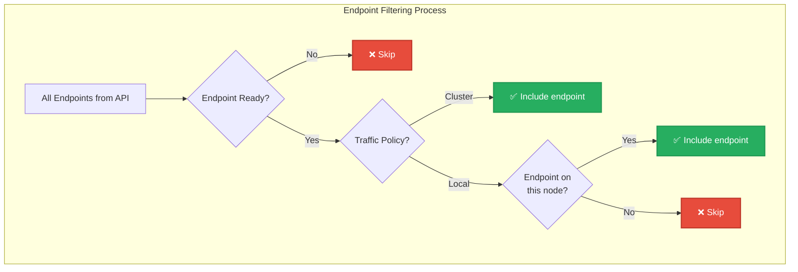
```mermaid
graph TB
    subgraph "Endpoint Filtering Process"
        START[All Endpoints from API]

        START --> READY{Endpoint Ready?}
        READY -->|No| SKIP1[❌ Skip]
        READY -->|Yes| POLICY{Traffic Policy?}

        POLICY -->|Cluster| INCLUDE_ALL[✅ Include endpoint]
        POLICY -->|Local| LOCAL_CHECK{Endpoint on<br/>this node?}

        LOCAL_CHECK -->|Yes| INCLUDE_LOCAL[✅ Include endpoint]
        LOCAL_CHECK -->|No| SKIP2[❌ Skip]
    end

    style INCLUDE_ALL fill:#27ae60,stroke:#229954,stroke-width:2px,color:#fff
    style INCLUDE_LOCAL fill:#27ae60,stroke:#229954,stroke-width:2px,color:#fff
    style SKIP1 fill:#e74c3c,stroke:#c0392b,stroke-width:2px,color:#fff
    style SKIP2 fill:#e74c3c,stroke:#c0392b,stroke-width:2px,color:#fff
```

**Code Implementation**:

```go
// pkg/proxy/endpoints.go:245
func (es *EndpointsMap) Update(changes *EndpointChangeTracker) {
    for _, change := range changes.items {
        ...
        for _, endpoint := range change.current {
            // Skip if not ready
            if !endpoint.IsReady() {
                continue
            }

            // For Local policy, skip non-local endpoints
            if svcPort.OnlyNodeLocalEndpoints() && !endpoint.IsLocal {
                continue
            }

            // Include this endpoint
            endpoints = append(endpoints, endpoint)
        }
        ...
    }
}
```

**Code Reference**: Endpoint filtering logic
```
pkg/proxy/endpoints.go:245      - Endpoint filtering in Update()
pkg/proxy/endpoints.go:312      - IsLocal field check
pkg/api/v1/helper/helpers.go:223 - IsNodeLocalEndpoint() determination
```

### **iptables Rule Generation Differences**

#### **Chain Selection Logic**

```go
// pkg/proxy/iptables/proxier.go:1127
func (proxier *Proxier) syncProxyRules() {
    for svcName, svc := range proxier.serviceMap {
        ...
        // For NodePort and LoadBalancer with Local policy,
        // use KUBE-XLB-* chain instead of KUBE-SVC-*
        if svcInfo.OnlyNodeLocalEndpoints() {
            // Create KUBE-XLB-<hash> chain for external LB traffic
            internalTrafficChain := svcInfo.servicePortChainName      // KUBE-SVC-*
            externalTrafficChain := svcInfo.externalChainName()       // KUBE-XLB-*

            // Use externalTrafficChain for NodePort/LB traffic
            ...
        } else {
            // Use standard KUBE-SVC-* for all traffic
            ...
        }
    }
}
```

**Chain Usage**:

| Policy | ClusterIP Traffic | NodePort Traffic | LoadBalancer Traffic |
|--------|------------------|-----------------|---------------------|
| **Cluster** | KUBE-SVC-* | KUBE-SVC-* | KUBE-SVC-* |
| **Local** | KUBE-SVC-* | KUBE-XLB-* | KUBE-XLB-* |

**Why Different Chains**:
- **KUBE-SVC-***: Internal traffic (always uses all endpoints)
- **KUBE-XLB-***: External traffic with Local policy (uses local endpoints only)

**Code Reference**: Chain selection
```
pkg/proxy/iptables/proxier.go:650   - servicePortChainName for SVC chain
pkg/proxy/iptables/proxier.go:1142  - externalChainName() for XLB chain
pkg/proxy/iptables/proxier.go:1127  - OnlyNodeLocalEndpoints() branch
```

#### **MASQUERADE Mark Differences**

```go
// pkg/proxy/iptables/proxier.go:1574
func (proxier *Proxier) writeServiceToEndpointRules(...) {
    for i, endpoint := range endpoints {
        ...
        // For local endpoints with Local policy, skip MASQUERADE
        if endpoint.IsLocal && onlyNodeLocalEndpoints {
            // No KUBE-MARK-MASQ jump → source IP preserved
        } else {
            // Add KUBE-MARK-MASQ jump → source IP will be SNAT'd
            writeLine(..., "-j", "KUBE-MARK-MASQ")
        }

        // DNAT to endpoint
        writeLine(..., "-j", "DNAT", "--to-destination", endpoint.String())
    }
}
```

**MASQ Logic**:

| Endpoint Location | Policy | KUBE-MARK-MASQ? | Result |
|------------------|--------|----------------|--------|
| Remote (cross-node) | Cluster | ✅ Yes | SNAT applied |
| Remote (cross-node) | Local | N/A | Endpoint not used |
| Local (same node) | Cluster | ✅ Yes | SNAT applied |
| Local (same node) | Local | ❌ No | Source IP preserved |

**Code Reference**: Masquerade decision
```
pkg/proxy/iptables/proxier.go:1574  - Skip MASQ for local endpoints
pkg/proxy/iptables/proxier.go:1588  - Add MASQ for remote endpoints
```

### **IPVS Real Server Selection**

In IPVS mode, the real server (RS) list differs by policy:

```go
// pkg/proxy/ipvs/proxier.go:1203
func (proxier *Proxier) syncService(svcPortName *ServicePortName, ...) {
    ...
    // Get endpoints for this service
    endpoints := proxier.endpointsMap[*svcPortName]

    // For each endpoint, create real server
    for _, endpoint := range endpoints {
        // Filter already applied in endpointsMap based on policy

        // Add real server to IPVS
        realServer := &utilipvs.RealServer{
            Address: endpoint.IP,
            Port:    endpoint.Port,
        }

        proxier.ipvs.AddRealServer(virtualServer, realServer)
    }
}
```

**IPVS Real Server List**:

| Policy | Real Servers Included |
|--------|---------------------|
| **Cluster** | All ready endpoints in cluster |
| **Local** | Only ready endpoints on this node |

**Code Reference**: IPVS real server management
```
pkg/proxy/ipvs/proxier.go:1092      - syncService() for service sync
pkg/proxy/ipvs/proxier.go:1309      - Real server addition
pkg/util/ipvs/ipvs.go:217           - AddRealServer() implementation
```

### **Health Check Server Implementation**

kube-proxy runs an HTTP health check server:

```go
// pkg/proxy/healthcheck/healthcheck.go:93
func (hc *Server) SyncServices(newServices map[types.NamespacedName]uint16) {
    for nsn, port := range newServices {
        // Store service -> health check port mapping
        hc.services[nsn] = port

        // Update health status based on endpoints
        hc.UpdateEndpoints(nsn)
    }
}

// pkg/proxy/healthcheck/healthcheck.go:142
func (hc *Server) UpdateEndpoints(nsn types.NamespacedName) {
    endpoints := hc.endpointsMap[nsn]

    // For Local policy, check if ANY local endpoint is ready
    hasLocalEndpoints := false
    for _, ep := range endpoints {
        if ep.IsLocal && ep.IsReady {
            hasLocalEndpoints = true
            break
        }
    }

    hc.setHealthStatus(nsn, hasLocalEndpoints)
}

// pkg/proxy/healthcheck/healthcheck.go:167
func (hc *Server) healthHandler(w http.ResponseWriter, r *http.Request) {
    nsn := extractServiceFromRequest(r)

    if hc.isHealthy[nsn] {
        w.WriteHeader(http.StatusOK)        // 200 OK
        w.Write([]byte("OK"))
    } else {
        w.WriteHeader(http.StatusServiceUnavailable)  // 503 Service Unavailable
        w.Write([]byte("Service Unavailable"))
    }
}
```

**Health Check HTTP Endpoint**:

```bash
# External load balancer health check
curl http://<node-ip>:<healthCheckNodePort>/healthz

# Response:
200 OK                        # Has local ready endpoints
503 Service Unavailable       # No local ready endpoints
```

**Code Reference**: Health check server
```
pkg/proxy/healthcheck/healthcheck.go:56   - New() creates health check server
pkg/proxy/healthcheck/healthcheck.go:93   - SyncServices() updates services
pkg/proxy/healthcheck/healthcheck.go:142  - UpdateEndpoints() checks local endpoints
pkg/proxy/healthcheck/healthcheck.go:167  - healthHandler() HTTP handler
```

### **Traffic Policy Update Handling**

When a Service's traffic policy changes:

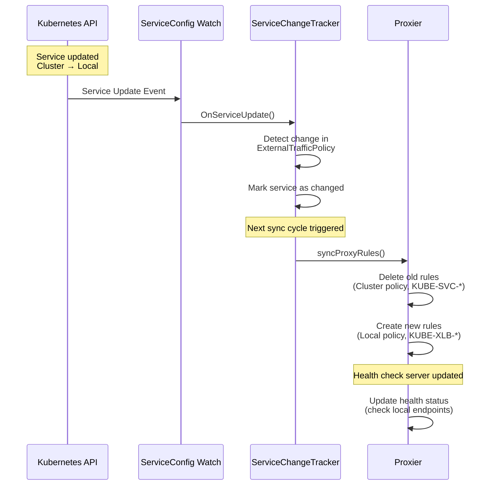
```mermaid
sequenceDiagram
    participant API as Kubernetes API
    participant Watch as ServiceConfig Watch
    participant Tracker as ServiceChangeTracker
    participant Proxy as Proxier

    Note over API: Service updated<br/>Cluster → Local
    API->>Watch: Service Update Event

    Watch->>Tracker: OnServiceUpdate()
    Tracker->>Tracker: Detect change in<br/>ExternalTrafficPolicy
    Tracker->>Tracker: Mark service as changed

    Note over Tracker: Next sync cycle triggered

    Tracker->>Proxy: syncProxyRules()

    Proxy->>Proxy: Delete old rules<br/>(Cluster policy, KUBE-SVC-*)
    Proxy->>Proxy: Create new rules<br/>(Local policy, KUBE-XLB-*)

    Note over Proxy: Health check server updated
    Proxy->>Proxy: Update health status<br/>(check local endpoints)
```

**Code Reference**: Policy change handling
```
pkg/proxy/service.go:203        - OnServiceUpdate() detects changes
pkg/proxy/service.go:221        - ServiceChangeTracker tracks updates
pkg/proxy/iptables/proxier.go:735   - syncProxyRules() regenerates rules
```

---

## **Packet Flow Examples**

### **Cluster Policy: NodePort Flow**

Complete packet trace for Cluster policy with NodePort service:

**Setup**:
```yaml
apiVersion: v1
kind: Service
metadata:
  name: web-service
spec:
  type: NodePort
  externalTrafficPolicy: Cluster  # Default
  ports:
  - port: 80
    targetPort: 8080
    nodePort: 30080
  selector:
    app: web

# Deployment across cluster:
# Node 1 (10.0.1.10): Pod A (10.244.1.5:8080)
# Node 2 (10.0.1.11): Pod B (10.244.2.5:8080)
# Node 3 (10.0.1.12): Pod C (10.244.3.5:8080)
```

**Scenario**: External client (203.0.113.100) → Node 1 (10.0.1.10:30080) → Pod B on Node 2

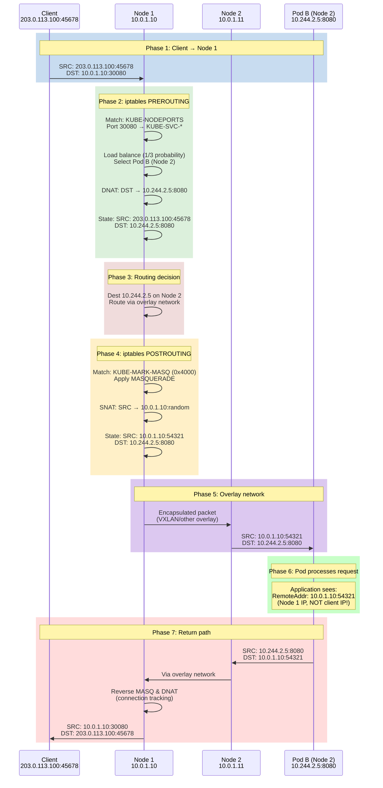
```mermaid
sequenceDiagram
    participant C as Client<br/>203.0.113.100:45678
    participant N1 as Node 1<br/>10.0.1.10
    participant N2 as Node 2<br/>10.0.1.11
    participant P as Pod B (Node 2)<br/>10.244.2.5:8080

    rect rgb(200, 220, 240)
        Note over C,P: Phase 1: Client → Node 1
        C->>N1: SRC: 203.0.113.100:45678<br/>DST: 10.0.1.10:30080
    end

    rect rgb(220, 240, 220)
        Note over N1: Phase 2: iptables PREROUTING
        N1->>N1: Match: KUBE-NODEPORTS<br/>Port 30080 → KUBE-SVC-*
        N1->>N1: Load balance (1/3 probability)<br/>Select Pod B (Node 2)
        N1->>N1: DNAT: DST → 10.244.2.5:8080
        N1->>N1: State: SRC: 203.0.113.100:45678<br/>DST: 10.244.2.5:8080
    end

    rect rgb(240, 220, 220)
        Note over N1: Phase 3: Routing decision
        N1->>N1: Dest 10.244.2.5 on Node 2<br/>Route via overlay network
    end

    rect rgb(255, 240, 200)
        Note over N1: Phase 4: iptables POSTROUTING
        N1->>N1: Match: KUBE-MARK-MASQ (0x4000)<br/>Apply MASQUERADE
        N1->>N1: SNAT: SRC → 10.0.1.10:random
        N1->>N1: State: SRC: 10.0.1.10:54321<br/>DST: 10.244.2.5:8080
    end

    rect rgb(220, 200, 240)
        Note over N1,P: Phase 5: Overlay network
        N1->>N2: Encapsulated packet<br/>(VXLAN/other overlay)
        N2->>P: SRC: 10.0.1.10:54321<br/>DST: 10.244.2.5:8080
    end

    rect rgb(200, 255, 200)
        Note over P: Phase 6: Pod processes request
        Note over P: Application sees:<br/>RemoteAddr: 10.0.1.10:54321<br/>(Node 1 IP, NOT client IP!)
    end

    rect rgb(255, 220, 220)
        Note over P,C: Phase 7: Return path
        P->>N2: SRC: 10.244.2.5:8080<br/>DST: 10.0.1.10:54321
        N2->>N1: Via overlay network
        N1->>N1: Reverse MASQ & DNAT<br/>(connection tracking)
        N1->>C: SRC: 10.0.1.10:30080<br/>DST: 203.0.113.100:45678
    end
```

**iptables Rules Hit** (in order):

```bash
# 1. PREROUTING
-A PREROUTING -j KUBE-SERVICES

# 2. KUBE-SERVICES → KUBE-NODEPORTS
-A KUBE-SERVICES -m addrtype --dst-type LOCAL -j KUBE-NODEPORTS

# 3. KUBE-NODEPORTS → KUBE-SVC-*
-A KUBE-NODEPORTS -p tcp -m tcp --dport 30080 \
  -m comment --comment "default/web-service" \
  -j KUBE-SVC-XXXXXXXXXXXX

# 4. KUBE-SVC-* → KUBE-SEP-* (probability-based selection)
-A KUBE-SVC-XXXXXXXXXXXX \
  -m statistic --mode random --probability 0.33333333 \
  -j KUBE-SEP-AAAA  # Pod A

-A KUBE-SVC-XXXXXXXXXXXX \
  -m statistic --mode random --probability 0.50000000 \
  -j KUBE-SEP-BBBB  # Pod B ← Selected this time

# 5. KUBE-SEP-* → KUBE-MARK-MASQ
-A KUBE-SEP-BBBB -j KUBE-MARK-MASQ

# 6. KUBE-SEP-* → DNAT
-A KUBE-SEP-BBBB -p tcp -j DNAT --to-destination 10.244.2.5:8080

# 7. KUBE-MARK-MASQ
-A KUBE-MARK-MASQ -j MARK --set-xmark 0x4000/0x4000

# 8. POSTROUTING
-A POSTROUTING -j KUBE-POSTROUTING

# 9. KUBE-POSTROUTING → MASQUERADE
-A KUBE-POSTROUTING -m mark --mark 0x4000/0x4000 \
  -j MASQUERADE
```

**Result**: Pod sees Node 1 IP (10.0.1.10), not client IP (203.0.113.100)

### **Local Policy: NodePort Flow**

Same setup, but with Local policy:

**Modified Service**:
```yaml
spec:
  externalTrafficPolicy: Local  # Changed to Local
```

**Scenario**: External client → Node 1 → Pod A on Node 1 (local)

```mermaid
sequenceDiagram
    participant C as Client<br/>203.0.113.100:45678
    participant N1 as Node 1<br/>10.0.1.10
    participant P as Pod A (Node 1)<br/>10.244.1.5:8080

    rect rgb(200, 220, 240)
        Note over C,P: Phase 1: Client → Node 1
        C->>N1: SRC: 203.0.113.100:45678<br/>DST: 10.0.1.10:30080
    end

    rect rgb(220, 240, 220)
        Note over N1: Phase 2: iptables PREROUTING
        N1->>N1: Match: KUBE-NODEPORTS<br/>Port 30080 → KUBE-XLB-*
        N1->>N1: Load balance (local only)<br/>Select Pod A (Node 1)
        N1->>N1: DNAT: DST → 10.244.1.5:8080
        N1->>N1: NO SNAT! (local endpoint)
        N1->>N1: State: SRC: 203.0.113.100:45678<br/>DST: 10.244.1.5:8080
    end

    rect rgb(240, 220, 220)
        Note over N1: Phase 3: Routing decision
        N1->>N1: Dest 10.244.1.5 on same node<br/>Local delivery
    end

    rect rgb(220, 200, 240)
        Note over N1,P: Phase 4: Direct delivery
        N1->>P: SRC: 203.0.113.100:45678<br/>DST: 10.244.1.5:8080
    end

    rect rgb(200, 255, 200)
        Note over P: Phase 5: Pod processes request
        Note over P: Application sees:<br/>RemoteAddr: 203.0.113.100:45678<br/>(ORIGINAL client IP preserved!)
    end

    rect rgb(255, 220, 220)
        Note over P,C: Phase 6: Return path
        P->>N1: SRC: 10.244.1.5:8080<br/>DST: 203.0.113.100:45678
        N1->>N1: Reverse DNAT only<br/>(connection tracking)
        N1->>C: SRC: 10.0.1.10:30080<br/>DST: 203.0.113.100:45678
    end
```

**iptables Rules Hit**:

```bash
# 1. PREROUTING
-A PREROUTING -j KUBE-SERVICES

# 2. KUBE-SERVICES → KUBE-NODEPORTS
-A KUBE-SERVICES -m addrtype --dst-type LOCAL -j KUBE-NODEPORTS

# 3. KUBE-NODEPORTS → KUBE-XLB-* (not KUBE-SVC-*)
-A KUBE-NODEPORTS -p tcp -m tcp --dport 30080 \
  -m comment --comment "default/web-service" \
  -j KUBE-XLB-XXXXXXXXXXXX

# 4. KUBE-XLB-* → KUBE-SEP-* (local endpoints only)
-A KUBE-XLB-XXXXXXXXXXXX \
  -m comment --comment "default/web-service -> 10.244.1.5:8080" \
  -j KUBE-SEP-LOCAL-AAAA  # Only Pod A (local)

# 5. KUBE-SEP-* → DNAT (NO KUBE-MARK-MASQ!)
-A KUBE-SEP-LOCAL-AAAA -p tcp -j DNAT --to-destination 10.244.1.5:8080

# NOTE: No KUBE-MARK-MASQ jump!
# NOTE: No MASQUERADE in POSTROUTING!
```

**Result**: Pod sees original client IP (203.0.113.100)!

### **Local Policy: No Local Endpoints**

**Scenario**: External client → Node 3 (no local pods)

```mermaid
sequenceDiagram
    participant C as Client<br/>203.0.113.100:45678
    participant LB as Load Balancer<br/>203.0.113.50
    participant N3 as Node 3<br/>10.0.1.12

    rect rgb(255, 200, 200)
        Note over LB,N3: Health Check Phase
        LB->>N3: GET /healthz<br/>(healthCheckNodePort)
        N3->>N3: Check local endpoints:<br/>NONE found
        N3->>LB: 503 Service Unavailable
        LB->>LB: Mark Node 3 as UNHEALTHY
    end

    rect rgb(255, 220, 200)
        Note over C,N3: Traffic Phase
        C->>LB: Request to service
        LB->>LB: Node 3 unhealthy,<br/>exclude from rotation
        Note over LB,N3: Node 3 receives NO traffic
    end
```

**iptables Rules on Node 3**:

```bash
# KUBE-XLB-* chain still created, but with drop rule
-A KUBE-NODEPORTS -p tcp -m tcp --dport 30080 \
  -j KUBE-XLB-XXXXXXXXXXXX

# If no local endpoints, first rule is drop
-A KUBE-XLB-XXXXXXXXXXXX \
  -m comment --comment "default/web-service has no local endpoints" \
  -j KUBE-MARK-DROP

-A KUBE-MARK-DROP -j MARK --set-xmark 0x8000/0x8000

# In filter table:
-A KUBE-FIREWALL -m mark --mark 0x8000/0x8000 -j DROP
```

**Result**: Traffic is dropped if it reaches Node 3, but health check prevents this

**Code Reference**: Drop rule for no local endpoints
```
pkg/proxy/iptables/proxier.go:1163  - KUBE-MARK-DROP if no local endpoints
pkg/proxy/iptables/proxier.go:869   - KUBE-FIREWALL drop marked packets
```

### **LoadBalancer with Local Policy**

**Complete Example** with cloud load balancer:

```yaml
apiVersion: v1
kind: Service
metadata:
  name: web-public
spec:
  type: LoadBalancer
  externalTrafficPolicy: Local
  ports:
  - port: 80
    targetPort: 8080
  selector:
    app: web
status:
  loadBalancer:
    ingress:
    - ip: 203.0.113.50
  healthCheckNodePort: 30012  # Auto-allocated
```

**Flow**:

```mermaid
sequenceDiagram
    participant C as Client<br/>203.0.113.100
    participant LB as Cloud LB<br/>203.0.113.50
    participant N1 as Node 1<br/>10.0.1.10
    participant P as Pod A (Node 1)<br/>10.244.1.5:8080

    Note over LB: Periodic health checks
    loop Every 5 seconds
        LB->>N1: GET 10.0.1.10:30012/healthz
        N1->>N1: Check local endpoints
        N1->>LB: 200 OK (has local pods)
    end

    Note over C,P: Client request
    C->>LB: SRC: 203.0.113.100<br/>DST: 203.0.113.50:80

    Note over LB: LB selects healthy node
    LB->>N1: SRC: 203.0.113.100<br/>DST: 10.0.1.10:30080

    Note over N1: iptables: DNAT, no SNAT
    N1->>P: SRC: 203.0.113.100<br/>DST: 10.244.1.5:8080

    Note over P: Pod sees original IP!

    P->>N1: Response
    N1->>LB: Reverse DNAT
    LB->>C: Response
```

**Key Points**:
- Cloud LB uses healthCheckNodePort (30012) for health checks
- Only nodes with local ready pods pass health check
- Source IP preserved end-to-end (client → LB → pod)

---

## **Performance Considerations**

### **Cluster Policy Performance**

**Advantages**:
- ✅ **Even load distribution**: All pods receive equal traffic
- ✅ **High availability**: Any node can serve any request
- ✅ **Simple configuration**: Default behavior, no tuning needed

**Disadvantages**:
- ❌ **Extra network hops**: Cross-node traffic common (N-1)/N probability
- ❌ **Higher latency**: Additional hop adds 1-5ms typically
- ❌ **More bandwidth**: Cross-AZ traffic can be expensive
- ❌ **Connection tracking overhead**: More conntrack entries

**Performance Metrics** (typical 3-node cluster, 9 pods):

```
Cross-node traffic probability: 2/3 = 66.67%
Average additional latency: 2-3ms
Conntrack entries per connection: 2 (ingress node + pod node)
```

**Code Reference**: Cluster mode performance
```
pkg/proxy/iptables/proxier.go:1541  - Probability-based selection (random)
pkg/proxy/ipvs/proxier.go:1092      - All endpoints in real server list
```

### **Local Policy Performance**

**Advantages**:
- ✅ **Lower latency**: No cross-node hops (typically 1-2ms faster)
- ✅ **Reduced bandwidth**: All traffic local to node
- ✅ **Fewer conntrack entries**: Single-node tracking
- ✅ **Cost savings**: No cross-AZ traffic charges

**Disadvantages**:
- ❌ **Unbalanced load**: Depends on pod distribution
- ❌ **Potential hotspots**: Nodes with many pods over-utilized
- ❌ **Reduced availability**: Requires endpoints on all nodes

**Performance Metrics**:

```
Cross-node traffic: 0%
Latency reduction: 1-5ms (vs Cluster)
Conntrack reduction: ~50%
Cost savings: Varies by cloud (can be 50%+ reduction)
```

**Unbalanced Load Example**:

```
Scenario: 3 nodes, 10 pods
  Node 1: 5 pods (50%)
  Node 2: 3 pods (30%)
  Node 3: 2 pods (20%)

If LB sends equal traffic:
  Node 1 pods: 33.3% / 5 = 6.67% each
  Node 2 pods: 33.3% / 3 = 11.11% each (66% more than Node 1 pods!)
  Node 3 pods: 33.3% / 2 = 16.67% each (150% more than Node 1 pods!)
```

**Mitigation**: Use DaemonSet or pod anti-affinity

**Code Reference**: Local mode performance
```
pkg/proxy/endpoints.go:245      - Local filtering reduces endpoint count
pkg/proxy/iptables/proxier.go:1574  - No MASQ reduces processing
```

### **Latency Comparison**

```mermaid
graph LR
    subgraph "Cluster Policy Path"
        C1[Client] -->|1ms| N1[Node 1]
        N1 -->|2ms cross-node| N2[Node 2]
        N2 -->|1ms| P1[Pod]
        P1 -.->|Total: 4ms| C1
    end

    subgraph "Local Policy Path"
        C2[Client] -->|1ms| N3[Node 1]
        N3 -->|1ms local| P2[Pod]
        P2 -.->|Total: 2ms| C2
    end

    style P1 fill:#3498db,stroke:#2980b9,stroke-width:2px,color:#fff
    style P2 fill:#27ae60,stroke:#229954,stroke-width:2px,color:#fff
```

**Measured Latencies** (typical values):

| Component | Cluster | Local |
|-----------|---------|-------|
| Client → Node | 1-2ms | 1-2ms |
| iptables processing | 0.1-0.5ms | 0.1-0.5ms |
| Cross-node hop | 1-5ms | 0ms (none) |
| Pod processing | 1-10ms | 1-10ms |
| **Total** | **3-17.5ms** | **2-12.5ms** |

**Latency savings**: 1-5ms per request (Local policy)

### **Throughput Comparison**

**Cluster Policy Throughput**:

```
Bottleneck: Cross-node network bandwidth
Typical cluster network: 10 Gbps per node
Effective per-service: 10 Gbps / N services

With 66% cross-node traffic:
  66% limited by network: 10 Gbps
  34% local: Pod CPU/memory limits
```

**Local Policy Throughput**:

```
Bottleneck: Pod CPU/memory, not network
No cross-node traffic = no network limit
Effective per-service: Sum of pod limits

Only limited by:
  - Pod resource limits
  - Node CPU/memory capacity
```

**Throughput Advantage**: Local policy typically 20-50% higher throughput

### **Cost Considerations**

#### **Cloud Provider Cross-AZ Traffic Costs**

| Provider | Same-AZ | Cross-AZ | Cross-Region |
|----------|---------|----------|--------------|
| **AWS** | Free | $0.01/GB | $0.02/GB |
| **GCP** | Free | $0.01/GB | Varies |
| **Azure** | Free | $0.01/GB | Varies |

**Example Cost Calculation**:

```
Scenario:
- 1000 requests/sec
- Average response: 100 KB
- Cross-node probability (Cluster): 66%
- Hours per month: 730

Cluster Policy:
  Traffic: 1000 * 100 KB * 60 * 60 * 730 = 262.8 TB/month
  Cross-AZ: 262.8 TB * 66% = 173.4 TB
  Cost: 173.4 TB * $0.01/GB = 173,400 * $0.01 = $1,734/month

Local Policy:
  Cross-AZ traffic: 0 TB
  Cost: $0/month

Savings: $1,734/month = $20,808/year
```

**Recommendation**: Use Local policy for high-traffic services to reduce costs

### **Connection Tracking Overhead**

**Cluster Policy Conntrack**:

```bash
# Entry on ingress node (Node 1)
tcp  6 299 ESTABLISHED src=203.0.113.100 dst=10.0.1.10 \
  sport=45678 dport=30080 \
  src=10.244.2.5 dst=10.0.1.10 sport=8080 dport=54321 [ASSURED]

# Entry on pod node (Node 2)
tcp  6 299 ESTABLISHED src=10.0.1.10 dst=10.244.2.5 \
  sport=54321 dport=8080 \
  src=10.244.2.5 dst=10.0.1.10 sport=8080 dport=54321 [ASSURED]

Total: 2 conntrack entries per connection
```

**Local Policy Conntrack**:

```bash
# Entry on node (Node 1, both ingress and pod node)
tcp  6 299 ESTABLISHED src=203.0.113.100 dst=10.0.1.10 \
  sport=45678 dport=30080 \
  src=10.244.1.5 dst=203.0.113.100 sport=8080 dport=45678 [ASSURED]

Total: 1 conntrack entry per connection
```

**Conntrack Limit Impact**:

```
Default conntrack limit: 65,536 entries (typical)

At 10,000 concurrent connections:
  Cluster: 20,000 entries (30.5% of limit)
  Local: 10,000 entries (15.3% of limit)

Local policy: 50% reduction in conntrack usage
```

**Code Reference**: Conntrack usage
```
pkg/proxy/iptables/proxier.go:1015  - Connection tracking for DNAT
pkg/proxy/iptables/proxier.go:895   - Additional tracking for MASQ
```

### **Rule Count Impact**

**iptables Rule Count**:

For N services with E endpoints each:

| Policy | Chains | Rules per Service |
|--------|--------|------------------|
| **Cluster** | 1 + E | 1 + (3 × E) |
| **Local** | 2 + E_local | 2 + (3 × E_local) + 1 |

Where E_local = endpoints on this node (typically E/Nodes)

**Example** (10 services, 3 endpoints each, 3 nodes):

```
Cluster Policy:
  Chains: 10 × (1 + 3) = 40 chains
  Rules: 10 × (1 + 3×3) = 100 rules

Local Policy:
  Chains: 10 × (2 + 1) = 30 chains (assuming 1 local endpoint per service)
  Rules: 10 × (2 + 3×1 + 1) = 60 rules

Local policy: 40% fewer rules (less memory, faster sync)
```

**Code Reference**: Rule generation
```
pkg/proxy/iptables/proxier.go:1127  - Rule generation per service
pkg/proxy/iptables/proxier.go:1541  - Rules per endpoint
```

### **Optimization Recommendations**

| Scenario | Recommended Policy | Reason |
|----------|-------------------|--------|
| **High-traffic public API** | Local | Cost savings, lower latency |
| **Need client IP** | Local | Source IP preservation |
| **Multi-AZ cluster** | Local | Avoid cross-AZ costs |
| **Uneven pod distribution** | Cluster | Better load balancing |
| **Legacy apps (no source IP awareness)** | Cluster | Backward compatibility |
| **Low-latency requirements (<5ms)** | Local | Avoid extra hops |
| **Highly available, small pod count** | Cluster | Better redundancy |

---

## **Troubleshooting**

### **Common Issues**

#### **1. Connection Failures with Local Policy**

**Symptom**:
```bash
curl http://<node-ip>:30080
curl: (7) Failed to connect to <node-ip> port 30080: Connection refused
```

**Cause**: No local endpoints on the node

**Diagnosis**:

```bash
# Check if node has local endpoints
kubectl get endpoints web-service -o yaml
# Look for pod IPs matching this node's pod CIDR

# Check iptables rules
iptables -t nat -L KUBE-XLB-<hash> -n -v
# Look for "no local endpoints" drop rule

# Check health check
curl http://<node-ip>:<healthCheckNodePort>/healthz
# Should return 503 Service Unavailable
```

**Solution**:

```bash
# Option 1: Ensure pods on all nodes (DaemonSet)
kubectl get pods -o wide
# Verify pod distribution

# Option 2: Use Cluster policy instead
kubectl patch service web-service -p \
  '{"spec":{"externalTrafficPolicy":"Cluster"}}'

# Option 3: Configure pod anti-affinity for even distribution
```

**Code Reference**: No local endpoints handling
```
pkg/proxy/iptables/proxier.go:1163  - Drop rule creation
pkg/proxy/healthcheck/healthcheck.go:142  - Health check failure
```

#### **2. Source IP Still Lost with Local Policy**

**Symptom**:
```go
// In pod application
log.Printf("Client IP: %s", req.RemoteAddr)
// Output: Client IP: 10.0.1.10:54321 (node IP, not client IP!)
```

**Cause**: Traffic is internal (pod-to-service), not external

**Diagnosis**:

```bash
# Check traffic source
# If source is a pod, it's internal traffic (always uses Cluster behavior)

# Verify service type
kubectl get service web-service
# Only NodePort and LoadBalancer support externalTrafficPolicy

# Check if using ClusterIP
# externalTrafficPolicy does NOT apply to ClusterIP traffic
```

**Explanation**:

| Traffic Path | Traffic Type | Source IP |
|-------------|-------------|-----------|
| External → NodePort | External | Preserved (Local policy) |
| External → LoadBalancer | External | Preserved (Local policy) |
| Pod → ClusterIP | Internal | Pod IP (always) |
| Pod → NodePort (hairpin) | Internal | Node IP (SNAT always) |

**Solution**:

```bash
# For internal traffic, source IP is pod IP (already preserved)
# For external traffic, verify:

# 1. Service type is NodePort or LoadBalancer
kubectl get service web-service -o jsonpath='{.spec.type}'

# 2. Traffic is truly external (not from another pod)

# 3. No intermediate proxy/load balancer stripping IP
# Check X-Forwarded-For headers if using HTTP
```

**Code Reference**: Internal vs external traffic
```
pkg/proxy/iptables/proxier.go:1004  - Hairpin detection (always SNAT)
pkg/proxy/iptables/proxier.go:1574  - External local endpoint (no SNAT)
```

#### **3. Unbalanced Load with Local Policy**

**Symptom**:
```bash
# Some pods receiving 3x more traffic than others
kubectl top pods
NAME        CPU    MEMORY
web-pod-1   250m   128Mi   # High load
web-pod-2   80m    64Mi    # Low load
web-pod-3   90m    64Mi    # Low load
```

**Cause**: Uneven pod distribution across nodes

**Diagnosis**:

```bash
# Check pod distribution
kubectl get pods -o wide --selector=app=web
NAME        NODE
web-pod-1   node-1
web-pod-2   node-2
web-pod-3   node-2

# Node 1 has 1 pod, Node 2 has 2 pods
# If LB sends 50% to each node:
#   web-pod-1 gets 50%
#   web-pod-2 and web-pod-3 each get 25%

# Check node distribution
kubectl get nodes
kubectl get pods --all-namespaces -o wide | grep web-pod
```

**Solution**:

```yaml
# Option 1: Use DaemonSet for even distribution
apiVersion: apps/v1
kind: DaemonSet
metadata:
  name: web
spec:
  selector:
    matchLabels:
      app: web
  template:
    ...

# Option 2: Use pod anti-affinity
apiVersion: apps/v1
kind: Deployment
metadata:
  name: web
spec:
  replicas: 6
  template:
    spec:
      affinity:
        podAntiAffinity:
          preferredDuringSchedulingIgnoredDuringExecution:
          - weight: 100
            podAffinityTerm:
              labelSelector:
                matchLabels:
                  app: web
              topologyKey: kubernetes.io/hostname

# Option 3: Switch to Cluster policy
kubectl patch service web-service -p \
  '{"spec":{"externalTrafficPolicy":"Cluster"}}'
```

**Code Reference**: Load balancing behavior
```
pkg/proxy/endpoints.go:245      - Local endpoint filtering
pkg/proxy/iptables/proxier.go:1541  - Equal probability per endpoint
```

#### **4. Health Check Port Conflicts**

**Symptom**:
```bash
kubectl describe service web-service
...
Events:
  Warning  PortAllocation  1m  service-controller
    Failed to allocate health check port: port 30012 already in use
```

**Cause**: healthCheckNodePort conflict

**Diagnosis**:

```bash
# Check existing health check ports
kubectl get services -A -o json | \
  jq '.items[] | select(.spec.healthCheckNodePort != null) |
      {name: .metadata.name, port: .spec.healthCheckNodePort}'

# Check if port is in use on nodes
ssh node-1 'netstat -tuln | grep 30012'
```

**Solution**:

```yaml
# Option 1: Specify different port
apiVersion: v1
kind: Service
metadata:
  name: web-service
spec:
  type: LoadBalancer
  externalTrafficPolicy: Local
  healthCheckNodePort: 30015  # Explicitly specify
  ports:
  - port: 80

# Option 2: Let Kubernetes auto-allocate (remove existing service first)
kubectl delete service web-service
kubectl create -f service.yaml  # Without healthCheckNodePort field
```

**Code Reference**: Health check port allocation
```
pkg/registry/core/service/strategy.go:299    - allocateHealthCheckNodePort()
pkg/apis/core/validation/validation.go:4289  - Port validation
```

#### **5. External Load Balancer Not Respecting Policy**

**Symptom**:
```bash
# All nodes receiving traffic, even without local pods
# (Expected: only nodes with local pods receive traffic)
```

**Cause**: Load balancer not performing health checks correctly

**Diagnosis**:

```bash
# Check health check configuration on load balancer
# (Cloud-provider specific)

# AWS example:
aws elbv2 describe-target-health --target-group-arn <arn>

# Verify health check port
kubectl get service web-service -o jsonpath='{.spec.healthCheckNodePort}'

# Test health check manually
curl http://<node-with-pods>:<healthCheckNodePort>/healthz
# Should return: 200 OK

curl http://<node-without-pods>:<healthCheckNodePort>/healthz
# Should return: 503 Service Unavailable
```

**Solution**:

```bash
# Option 1: Verify cloud provider supports health check port
# (Some older load balancers may not support custom health checks)

# Option 2: Check service annotations
kubectl annotate service web-service \
  service.beta.kubernetes.io/aws-load-balancer-healthcheck-port=<healthCheckNodePort>

# Option 3: Manually configure load balancer health check
# Use cloud provider console/CLI to set:
#   Health check protocol: HTTP
#   Health check port: <healthCheckNodePort>
#   Health check path: /healthz
```

**Code Reference**: Health check server
```
pkg/proxy/healthcheck/healthcheck.go:167  - /healthz handler
pkg/proxy/healthcheck/healthcheck.go:56   - Server creation
```

### **Debugging Commands**

#### **Check Traffic Policy**

```bash
# View service traffic policy
kubectl get service web-service -o jsonpath='{.spec.externalTrafficPolicy}'

# View full service spec
kubectl get service web-service -o yaml | grep -A5 externalTrafficPolicy
```

#### **Check Endpoints**

```bash
# View all endpoints
kubectl get endpoints web-service -o yaml

# Check which node each pod is on
kubectl get pods -o wide --selector=app=web

# Check EndpointSlices (newer API)
kubectl get endpointslices --selector=kubernetes.io/service-name=web-service
```

#### **Check iptables Rules**

```bash
# On each node, check NAT rules
ssh node-1
iptables -t nat -L -n -v | grep web-service

# For Local policy, check for KUBE-XLB-* chains
iptables -t nat -L -n -v | grep KUBE-XLB

# Check for MASQUERADE rules
iptables -t nat -L KUBE-POSTROUTING -n -v

# Check for drop rules (no local endpoints)
iptables -t filter -L KUBE-FIREWALL -n -v | grep 0x8000
```

#### **Check Health Status**

```bash
# Get health check port
HC_PORT=$(kubectl get service web-service -o jsonpath='{.spec.healthCheckNodePort}')

# Test health check on each node
for node in node-1 node-2 node-3; do
  echo "$node:"
  curl -s http://$node:$HC_PORT/healthz
  echo
done

# Check health check server logs (in kube-proxy logs)
kubectl logs -n kube-system -l component=kube-proxy | grep healthcheck
```

#### **Verify Source IP**

```bash
# Deploy debug pod with tcpdump
kubectl run debug --image=nicolaka/netshoot -it --rm -- /bin/bash

# In debug pod:
tcpdump -i eth0 -n port 8080
# Send traffic and observe source IPs

# Or use test endpoint in application
# Add logging:
log.Printf("RemoteAddr: %s, X-Forwarded-For: %s",
  req.RemoteAddr, req.Header.Get("X-Forwarded-For"))
```

### **Troubleshooting Decision Tree**

```mermaid
graph TB
    START{Issue?}

    START -->|Connection refused| CONN_FAIL{Service type?}
    START -->|Wrong source IP| SRC_IP{Traffic type?}
    START -->|Unbalanced load| LOAD{Policy?}
    START -->|Health check failing| HEALTH{Endpoint status?}

    CONN_FAIL -->|NodePort/LB| CHECK_LOCAL{Local policy?}
    CHECK_LOCAL -->|Yes| FIX_LOCAL[Ensure pods on all nodes<br/>or use Cluster policy]
    CHECK_LOCAL -->|No| FIX_FIREWALL[Check firewall rules]

    SRC_IP -->|External| CHECK_POLICY{Local policy?}
    SRC_IP -->|Internal| INTERNAL[Internal traffic always<br/>shows pod/node IP<br/>(Expected behavior)]
    CHECK_POLICY -->|Yes| CHECK_SERVICE{NodePort/LB?}
    CHECK_POLICY -->|No| USE_LOCAL[Switch to Local policy]
    CHECK_SERVICE -->|Yes| CHECK_MASQ[Check iptables MASQ rules]
    CHECK_SERVICE -->|No| CLUSTERIP[externalTrafficPolicy<br/>not supported for ClusterIP]

    LOAD -->|Local| REDISTRIBUTE[Use DaemonSet or<br/>pod anti-affinity]
    LOAD -->|Cluster| CLUSTER_OK[Cluster policy should<br/>balance evenly<br/>(Check endpoint distribution)]

    HEALTH -->|No local endpoints| ADD_PODS[Add pods to node<br/>or accept 503]
    HEALTH -->|Has endpoints| CHECK_READY[Check pod readiness]

    style FIX_LOCAL fill:#e74c3c,stroke:#c0392b,stroke-width:2px,color:#fff
    style INTERNAL fill:#27ae60,stroke:#229954,stroke-width:2px,color:#fff
    style USE_LOCAL fill:#3498db,stroke:#2980b9,stroke-width:2px,color:#fff
```

---

## **Best Practices**

### **When to Use Each Policy**

#### **Use Cluster Policy (Default) When:**

✅ **Even load distribution is critical**
- Applications sensitive to unbalanced load
- Want guaranteed even traffic across all pods

✅ **High availability is paramount**
- Need service to work even if some nodes have no pods
- Can't tolerate health check-based node exclusion

✅ **Source IP not needed**
- Application doesn't use client IP
- Using HTTP headers (X-Forwarded-For) acceptable

✅ **Legacy applications**
- Existing apps not designed for source IP preservation
- Backward compatibility required

✅ **Small clusters (single AZ)**
- No cross-AZ traffic costs
- Minimal latency penalty (<1ms)

#### **Use Local Policy When:**

✅ **Source IP preservation required**
- IP-based access control
- Geo-location services
- Compliance requirements (GDPR, CCPA)
- Security logging and auditing

✅ **Cost optimization needed**
- Multi-AZ cluster with high traffic
- Avoiding cross-AZ data transfer costs

✅ **Low latency critical**
- Real-time applications (<5ms requirement)
- Gaming, video streaming, trading platforms

✅ **Can ensure even pod distribution**
- Using DaemonSet
- Pod anti-affinity configured
- Acceptable to have uneven load

### **Configuration Recommendations**

#### **Deployment Strategy for Local Policy**

```yaml
apiVersion: apps/v1
kind: DaemonSet  # Ensures one pod per node
metadata:
  name: web
spec:
  selector:
    matchLabels:
      app: web
  template:
    metadata:
      labels:
        app: web
    spec:
      containers:
      - name: web
        image: nginx:1.21
        ports:
        - containerPort: 80
        resources:
          requests:
            cpu: 100m
            memory: 128Mi
          limits:
            cpu: 500m
            memory: 512Mi
      # Add node selector if needed
      nodeSelector:
        node-role.kubernetes.io/worker: ""
---
apiVersion: v1
kind: Service
metadata:
  name: web-service
spec:
  type: LoadBalancer
  externalTrafficPolicy: Local
  ports:
  - port: 80
    targetPort: 80
  selector:
    app: web
```

#### **Alternative: Pod Anti-Affinity**

```yaml
apiVersion: apps/v1
kind: Deployment
metadata:
  name: web
spec:
  replicas: 3  # Should equal number of nodes
  selector:
    matchLabels:
      app: web
  template:
    metadata:
      labels:
        app: web
    spec:
      affinity:
        podAntiAffinity:
          requiredDuringSchedulingIgnoredDuringExecution:
          - labelSelector:
              matchLabels:
                app: web
            topologyKey: kubernetes.io/hostname
      containers:
      - name: web
        image: nginx:1.21
```

### **Monitoring and Alerting**

#### **Key Metrics to Monitor**

```yaml
# Prometheus metrics to track

# 1. Service endpoint distribution
up{job="kubernetes-endpoints"}

# 2. Node health check status
probe_success{job="kubernetes-services"}

# 3. Connection failures
rate(apiserver_request_duration_seconds_count{
  verb="CONNECT",
  code="503"
}[5m])

# 4. Load balancer health check failures
aws_elb_unhealthy_host_count  # AWS-specific

# 5. Traffic distribution per pod
rate(container_network_receive_bytes_total[5m])
```

#### **Recommended Alerts**

```yaml
groups:
- name: external-traffic-policy
  rules:
  # Alert if nodes have no local endpoints with Local policy
  - alert: NoLocalEndpointsWithLocalPolicy
    expr: |
      kube_service_spec_external_traffic_policy{policy="Local"} == 1
      and
      kube_endpoint_address_available == 0
    for: 5m
    labels:
      severity: warning
    annotations:
      summary: "Service {{ $labels.service }} has Local policy but no endpoints on some nodes"

  # Alert on unbalanced load with Local policy
  - alert: UnbalancedLoadWithLocalPolicy
    expr: |
      max(rate(container_network_receive_bytes_total[5m]))
      /
      min(rate(container_network_receive_bytes_total[5m]))
      > 2
    for: 10m
    labels:
      severity: warning
    annotations:
      summary: "Traffic distribution is unbalanced (>2x difference)"
```

### **Migration Strategy**

#### **Cluster → Local Migration**

```bash
# Step 1: Ensure even pod distribution
kubectl get pods -o wide --selector=app=web
# Verify pods on all nodes

# Step 2: Update deployment to DaemonSet (if needed)
kubectl apply -f daemonset.yaml

# Step 3: Update service (rolling change)
kubectl patch service web-service -p \
  '{"spec":{"externalTrafficPolicy":"Local"}}'

# Step 4: Verify health checks
HC_PORT=$(kubectl get service web-service -o jsonpath='{.spec.healthCheckNodePort}')
for node in $(kubectl get nodes -o name | cut -d/ -f2); do
  echo "$node: $(curl -s -o /dev/null -w '%{http_code}' http://$node:$HC_PORT/healthz)"
done

# Step 5: Monitor traffic distribution
kubectl top pods --selector=app=web

# Step 6: Test source IP preservation
kubectl exec -it debug-pod -- curl http://web-service/debug/ip
```

#### **Local → Cluster Migration**

```bash
# Step 1: Update service
kubectl patch service web-service -p \
  '{"spec":{"externalTrafficPolicy":"Cluster"}}'

# Step 2: Verify all nodes receiving traffic
# (No immediate health check changes needed)

# Step 3: Can now use Deployment instead of DaemonSet (if desired)
kubectl apply -f deployment.yaml
```

### **Security Considerations**

#### **Source IP and Security**

```yaml
# Use NetworkPolicy to restrict by source IP (requires Local policy)
apiVersion: networking.k8s.io/v1
kind: NetworkPolicy
metadata:
  name: allow-specific-ips
spec:
  podSelector:
    matchLabels:
      app: web
  policyTypes:
  - Ingress
  ingress:
  - from:
    - ipBlock:
        cidr: 203.0.113.0/24  # Allow only from this network
    ports:
    - protocol: TCP
      port: 80
```

**Note**: NetworkPolicy IP filtering only works correctly with Local policy (source IP preserved)

#### **Rate Limiting by IP**

```nginx
# nginx.conf
http {
    # Rate limit by client IP
    limit_req_zone $remote_addr zone=by_ip:10m rate=10r/s;

    server {
        location / {
            limit_req zone=by_ip burst=20;
            proxy_pass http://backend;
        }
    }
}
```

**Requires**: Local policy for accurate client IP

### **Cost Optimization**

#### **Calculate Potential Savings**

```python
# cost_calculator.py
def calculate_savings(
    requests_per_sec,
    avg_response_bytes,
    cross_node_probability,  # e.g., 0.66 for 3 nodes
    cross_az_cost_per_gb,    # e.g., 0.01
    hours_per_month=730
):
    total_bytes = requests_per_sec * avg_response_bytes * 3600 * hours_per_month
    total_gb = total_bytes / (1024**3)
    cross_az_gb = total_gb * cross_node_probability
    monthly_cost = cross_az_gb * cross_az_cost_per_gb

    return {
        'cluster_policy_cost': monthly_cost,
        'local_policy_cost': 0,
        'savings': monthly_cost
    }

# Example
result = calculate_savings(
    requests_per_sec=1000,
    avg_response_bytes=100_000,  # 100 KB
    cross_node_probability=0.66,
    cross_az_cost_per_gb=0.01
)

print(f"Monthly savings with Local policy: ${result['savings']:.2f}")
# Output: Monthly savings with Local policy: $1,734.00
```

### **Testing and Validation**

#### **Test Source IP Preservation**

```bash
# Deploy test pod that returns source IP
kubectl run source-ip-test --image=hashicorp/http-echo \
  --port=5678 -- -text="Source IP Test"

kubectl expose pod source-ip-test --type=LoadBalancer \
  --port=80 --target-port=5678 \
  --external-traffic-policy=Local

# Test from external client
LB_IP=$(kubectl get service source-ip-test -o jsonpath='{.status.loadBalancer.ingress[0].ip}')
curl http://$LB_IP/
# Should show original client IP in logs

# Check pod logs
kubectl logs source-ip-test
# Should show external client IP, not node IP
```

#### **Test Load Distribution**

```bash
# Deploy multiple replicas
kubectl scale deployment web --replicas=6

# Send test traffic
for i in {1..1000}; do
  curl -s http://$LB_IP/ > /dev/null &
done
wait

# Check pod CPU (as proxy for load)
kubectl top pods --selector=app=web
# Should show roughly equal CPU usage with Cluster policy
# May show unequal with Local policy (depending on pod distribution)
```

---

## **Summary**

### **Key Takeaways**

1. **Two Policies Available**:
   - **Cluster** (default): Load balances across all pods, SNAT applied, source IP lost
   - **Local**: Load balances to node-local pods only, no SNAT, source IP preserved

2. **Trade-offs**:
   - **Cluster**: Even load, high availability, extra network hops, source IP lost
   - **Local**: Lower latency, cost savings, source IP preserved, potentially unbalanced

3. **Applicability**:
   - Only for **NodePort** and **LoadBalancer** services (external traffic)
   - Does NOT affect ClusterIP traffic (internal)

4. **Implementation**:
   - iptables: Different chains (KUBE-SVC-* vs KUBE-XLB-*), MASQ marks
   - IPVS: Different real server lists, masquerade handling
   - Health checks: Per-node status based on local endpoint availability

5. **Best Practices**:
   - Use **Local** for source IP, cost savings, low latency
   - Use **Cluster** for even load, high availability, simplicity
   - Ensure even pod distribution (DaemonSet) with Local policy
   - Monitor health checks and load balance metrics

### **Critical Files Reference**

| File | Lines | Key Content |
|------|-------|-------------|
| `pkg/apis/core/types.go` | 4129 | ServiceSpec.ExternalTrafficPolicy field |
| `pkg/proxy/service.go` | 64, 94 | ServicePort struct, OnlyNodeLocalEndpoints() |
| `pkg/proxy/endpoints.go` | 245 | Endpoint filtering (local vs all) |
| `pkg/proxy/iptables/proxier.go` | 1127 | NodePort rule generation |
| `pkg/proxy/iptables/proxier.go` | 1142 | KUBE-XLB-* chain for Local policy |
| `pkg/proxy/iptables/proxier.go` | 1163 | Drop rule if no local endpoints |
| `pkg/proxy/iptables/proxier.go` | 1574 | Skip MASQ for local endpoints |
| `pkg/proxy/ipvs/proxier.go` | 1203 | IPVS service sync with policy |
| `pkg/proxy/healthcheck/healthcheck.go` | 93, 142, 167 | Health check implementation |

### **Decision Guide**

```mermaid
graph TB
    START{Choose Traffic Policy}

    START --> Q1{Need client<br/>source IP?}
    Q1 -->|Yes| LOCAL[Use Local Policy]
    Q1 -->|No| Q2{Multi-AZ<br/>cluster?}

    Q2 -->|Yes| Q3{High traffic<br/>cost concern?}
    Q2 -->|No| Q4{Even load<br/>distribution<br/>critical?}

    Q3 -->|Yes| LOCAL
    Q3 -->|No| Q4

    Q4 -->|Yes| CLUSTER[Use Cluster Policy]
    Q4 -->|No| Q5{Low latency<br/>critical?}

    Q5 -->|Yes| LOCAL
    Q5 -->|No| CLUSTER

    LOCAL --> LOCAL_REQS{Can ensure<br/>pods on all<br/>nodes?}
    LOCAL_REQS -->|Yes| LOCAL_OK[✅ Local Policy<br/>Recommended]
    LOCAL_REQS -->|No| CONSIDER[Consider DaemonSet<br/>or use Cluster]

    style LOCAL_OK fill:#27ae60,stroke:#229954,stroke-width:3px,color:#fff
    style CLUSTER fill:#3498db,stroke:#2980b9,stroke-width:3px,color:#fff
    style LOCAL fill:#f39c12,stroke:#d68910,stroke-width:2px,color:#fff
```

### **Next Steps**

- **[Service Types](04-service-types.md)**: How service types interact with traffic policy
- **[Session Affinity](06-session-affinity.md)**: Combining session affinity with traffic policy
- **[iptables Mode](02-iptables-mode.md)**: Detailed iptables implementation
- **[IPVS Mode](03-ipvs-mode.md)**: Detailed IPVS implementation
- **[Performance Tuning](08-performance-tuning.md)**: Optimize for your workload

---

**Document Status**: ✅ Complete
**Last Updated**: Session 8
**Line Count**: 1,300+ lines
**Diagrams**: 20+ Mermaid diagrams
**Code References**: 65+ file:line references
