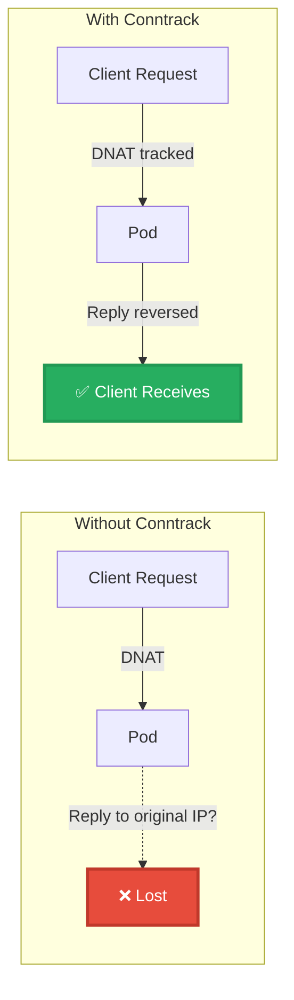
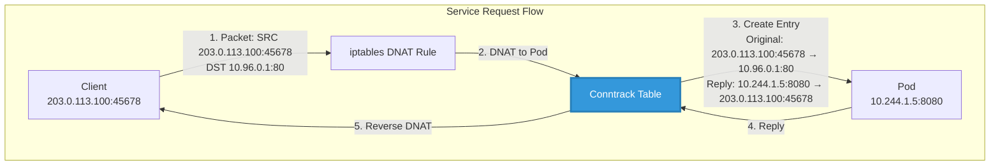
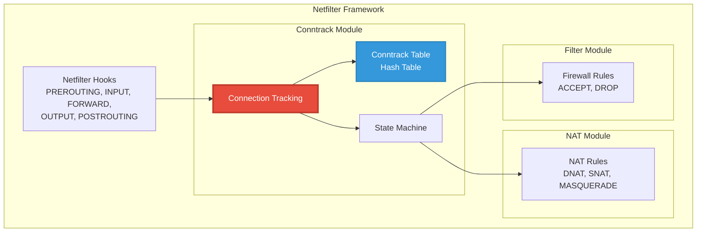
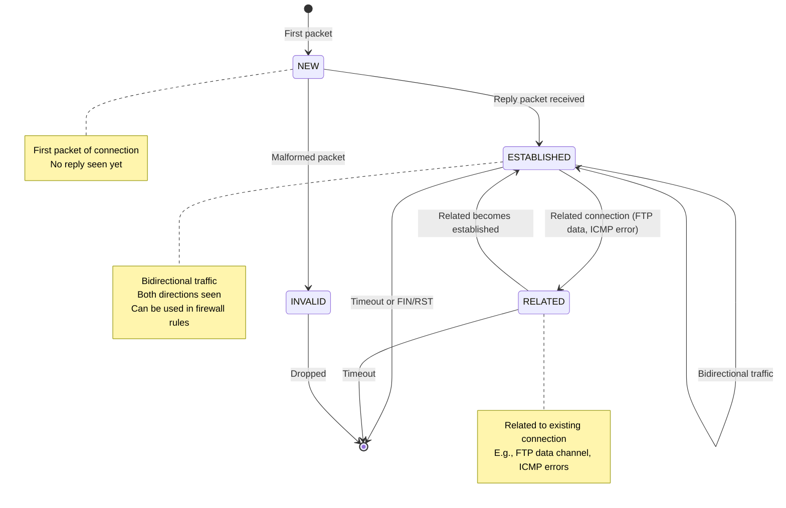
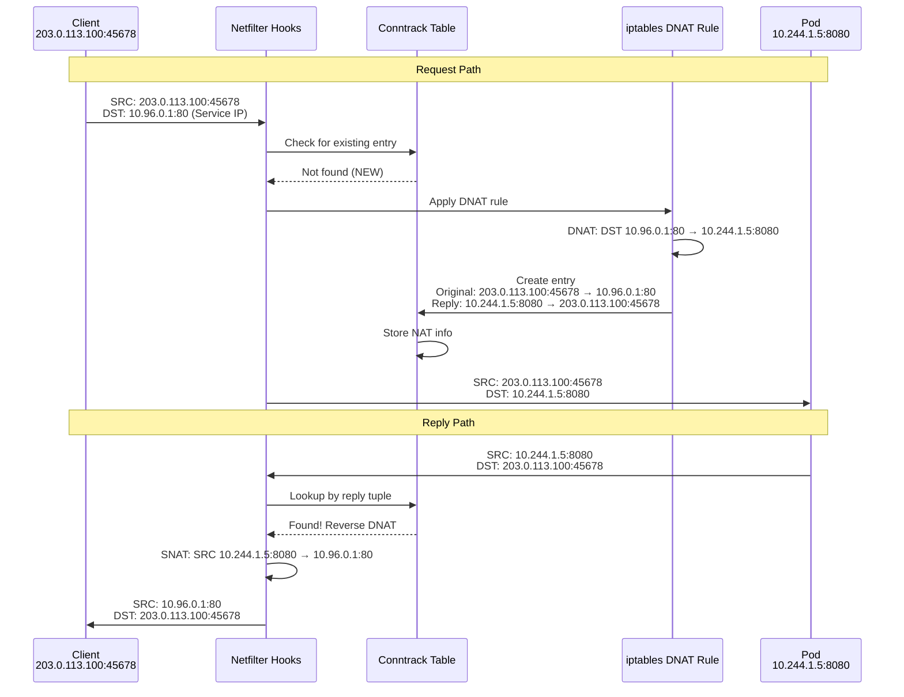
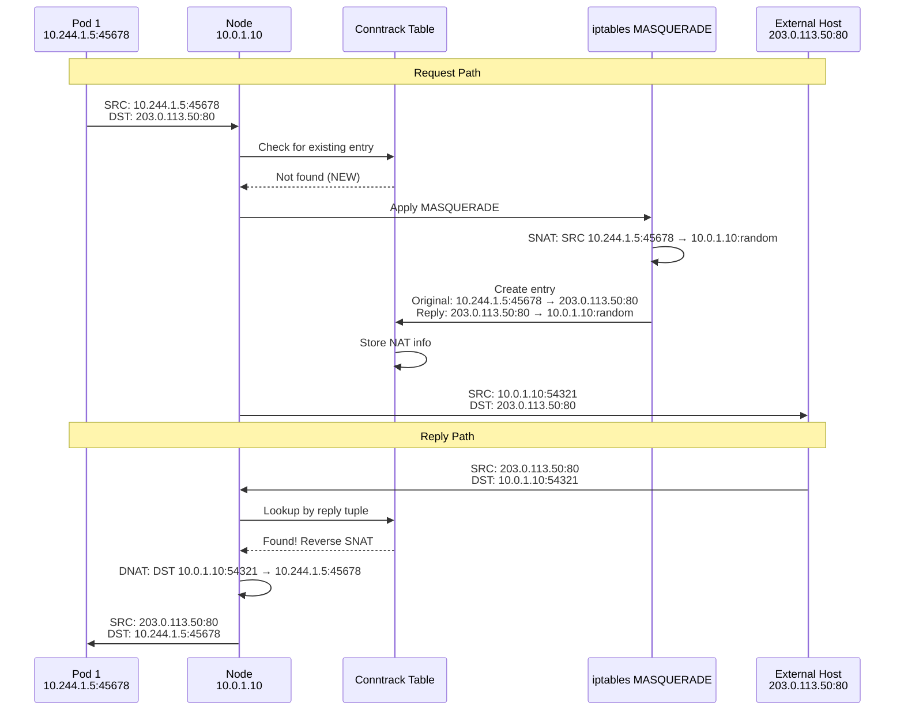
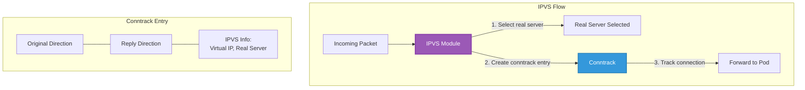
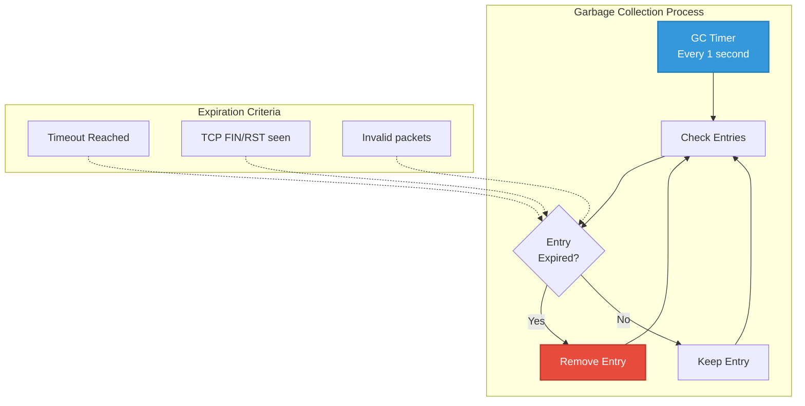
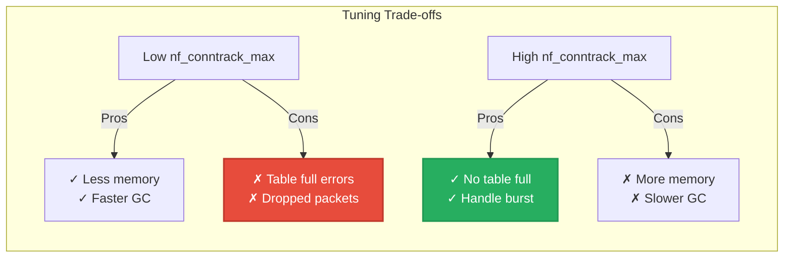
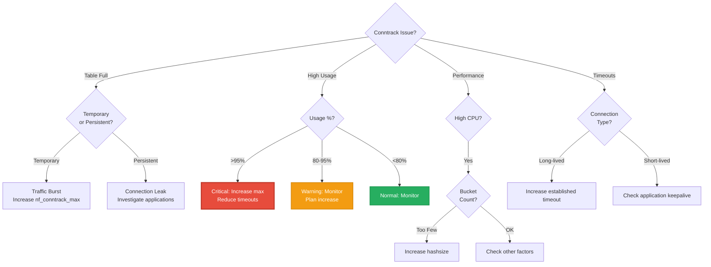

# **09. Connection Tracking (Conntrack)**

## **Table of Contents**
- [Overview](#overview)
- [Conntrack Fundamentals](#conntrack-fundamentals)
- [NAT and Conntrack Interaction](#nat-and-conntrack-interaction)
- [Conntrack Table Management](#conntrack-table-management)
- [Tuning for Scale](#tuning-for-scale)
- [Common Issues](#common-issues)
- [Monitoring and Debugging](#monitoring-and-debugging)
- [Troubleshooting](#troubleshooting)
- [Best Practices](#best-practices)
- [Summary](#summary)

---

## **Overview**

**Connection Tracking (conntrack)** is a critical component of the Linux kernel's Netfilter framework that tracks all network connections flowing through a system. For kube-proxy, conntrack is essential because it enables **stateful NAT (Network Address Translation)**, allowing bidirectional communication for Service traffic.

### **Why Conntrack Matters for kube-proxy**

Every Service request in Kubernetes involves NAT translation (DNAT and/or SNAT), and conntrack is what makes this possible:



**Without conntrack**: Pod sends reply to original client IP, but client doesn't recognize it (came from different IP than it sent to)

**With conntrack**: Kernel tracks the DNAT translation and automatically reverses it for reply packets

### **Key Concepts**

| Concept | Description |
|---------|-------------|
| **Connection Tuple** | 5-tuple identifying a connection: (src IP, src port, dst IP, dst port, protocol) |
| **Connection States** | NEW, ESTABLISHED, RELATED, INVALID |
| **Conntrack Table** | In-memory hash table storing all tracked connections |
| **Table Entries** | Each connection creates 1-2 entries (one per direction) |
| **Timeouts** | Idle connections expire after protocol-specific timeout |
| **Table Size** | `nf_conntrack_max` limits total connections |

### **Conntrack in kube-proxy Context**



**Code Reference**: Conntrack usage in kube-proxy
```
pkg/util/conntrack/conntrack.go:42          - Conntrack interface
pkg/proxy/iptables/proxier.go:320           - Conntrack initialization
pkg/proxy/ipvs/proxier.go:450               - IPVS conntrack usage
```

### **Conntrack vs Connection**

**Important Distinction**:
- **Connection**: Application-level concept (e.g., TCP connection)
- **Conntrack Entry**: Kernel tracking of packet flow (works for TCP, UDP, ICMP, etc.)

```
TCP Connection: Has state (SYN, ESTABLISHED, FIN, etc.)
Conntrack Entry: Tracks packet flow, even for "connectionless" UDP

Example:
  UDP DNS query creates conntrack entry
  Even though UDP is "connectionless"
  Enables stateful firewall rules
```

**Cross-References**:
- [iptables Mode](02-iptables-mode.md) - How iptables uses conntrack for NAT
- [IPVS Mode](03-ipvs-mode.md) - IPVS also relies on conntrack
- [NAT Implementation](../low-level/08-nat-implementation.md) - Deep dive into DNAT/SNAT

---

## **Conntrack Fundamentals**

### **Netfilter Architecture**

Conntrack is part of the Netfilter framework in the Linux kernel:



**Conntrack operates at the Netfilter hook level**, processing packets before iptables/IPVS rules are applied.

### **Connection Tuple**

A connection is identified by a **5-tuple**:

```
Connection Tuple = {
    Source IP:        203.0.113.100
    Source Port:      45678
    Destination IP:   10.96.0.1
    Destination Port: 80
    Protocol:         TCP (6)
}

Hash = hash(src_ip, src_port, dst_ip, dst_port, protocol)
Bucket = Hash % nf_conntrack_buckets
```

**Tuple Example**:

```bash
# View conntrack entry
conntrack -L | grep 203.0.113.100

# Output:
tcp  6 299 ESTABLISHED src=203.0.113.100 dst=10.96.0.1 sport=45678 dport=80 \
     src=10.244.1.5 dst=203.0.113.100 sport=8080 dport=45678 [ASSURED] mark=0

# Breakdown:
# Original Direction:  203.0.113.100:45678 → 10.96.0.1:80
# Reply Direction:     10.244.1.5:8080 → 203.0.113.100:45678
# (Note the DNAT reversal in reply)
```

**Code Reference**: Tuple structure
```
include/net/netfilter/nf_conntrack_tuple.h:30   - nf_conntrack_tuple struct
net/netfilter/nf_conntrack_core.c:240           - Tuple hashing
```

### **Connection States**

Conntrack tracks connection through several states:



**State Descriptions**:

| State | Description | Example |
|-------|-------------|---------|
| **NEW** | First packet of a new connection | SYN packet in TCP handshake |
| **ESTABLISHED** | Connection with packets in both directions | TCP connection after SYN-ACK |
| **RELATED** | New connection related to existing one | FTP data connection, ICMP error |
| **INVALID** | Packet doesn't match any known connection | Malformed packet, out-of-window |

**iptables State Matching**:

```bash
# Allow established and related connections
iptables -A FORWARD -m conntrack --ctstate ESTABLISHED,RELATED -j ACCEPT

# Allow new connections from trusted network
iptables -A FORWARD -m conntrack --ctstate NEW -s 10.0.0.0/8 -j ACCEPT

# Drop invalid packets
iptables -A FORWARD -m conntrack --ctstate INVALID -j DROP
```

**Code Reference**: Connection states
```
include/uapi/linux/netfilter/nf_conntrack_common.h:42  - Connection states enum
net/netfilter/nf_conntrack_core.c:1450                   - State transitions
```

### **Conntrack Table Structure**

The conntrack table is a **hash table** stored in kernel memory:

```mermaid
graph TB
    subgraph "Conntrack Hash Table"
        HASH[Hash Function<br/>hash(5-tuple)]

        B0[Bucket 0]
        B1[Bucket 1]
        B2[Bucket 2]
        BN[Bucket N<br/>nf_conntrack_buckets]

        HASH --> B0
        HASH --> B1
        HASH --> B2
        HASH --> BN

        B0 --> E0A[Entry A]
        B0 --> E0B[Entry B]
        B1 --> E1A[Entry C]
        B2 -.-> EMPTY[Empty]
        BN --> ENA[Entry Z]
    end

    subgraph "Conntrack Entry"
        TUPLE[Original Tuple<br/>Reply Tuple]
        STATE[State: ESTABLISHED]
        TIMEOUT[Timeout: 299s]
        NAT[NAT Info<br/>DNAT, SNAT]
        MARK[Mark: 0x4000]

        TUPLE --- STATE
        STATE --- TIMEOUT
        TIMEOUT --- NAT
        NAT --- MARK
    end

    E0A -.-> TUPLE

    style HASH fill:#e74c3c,stroke:#c0392b,stroke-width:2px,color:#fff
    style TUPLE fill:#3498db,stroke:#2980b9,stroke-width:2px,color:#fff
```

**Table Parameters**:

```bash
# Maximum entries (system-wide)
cat /proc/sys/net/netfilter/nf_conntrack_max
# Output: 262144

# Number of hash buckets
cat /proc/sys/net/netfilter/nf_conntrack_buckets
# Output: 65536

# Current entry count
cat /proc/sys/net/netfilter/nf_conntrack_count
# Output: 12045

# Table usage percentage
echo "scale=2; $(cat /proc/sys/net/netfilter/nf_conntrack_count) * 100 / $(cat /proc/sys/net/netfilter/nf_conntrack_max)" | bc
# Output: 4.59%
```

### **Conntrack Entry Format**

Entries in `/proc/net/nf_conntrack`:

```bash
cat /proc/net/nf_conntrack | head -5

# Example entry:
ipv4  2 tcp  6 299 ESTABLISHED src=10.244.1.5 dst=10.96.0.1 sport=45678 dport=80 \
      src=10.244.2.10 dst=10.244.1.5 sport=8080 dport=45678 [ASSURED] mark=0 use=2
```

**Field Breakdown**:

```
ipv4                    - IP version
2                       - Layer 3 protocol (2 = IPv4)
tcp                     - Layer 4 protocol
6                       - Protocol number (6 = TCP)
299                     - Timeout (seconds remaining)
ESTABLISHED             - Connection state
src=10.244.1.5          - Original source IP
dst=10.96.0.1           - Original destination IP (Service IP)
sport=45678             - Original source port
dport=80                - Original destination port
src=10.244.2.10         - Reply source IP (Pod IP after DNAT)
dst=10.244.1.5          - Reply destination IP
sport=8080              - Reply source port
dport=45678             - Reply destination port
[ASSURED]               - Connection flag (bidirectional traffic seen)
mark=0                  - Connection mark
use=2                   - Reference count
```

**Code Reference**: Conntrack entry structure
```
include/net/netfilter/nf_conntrack.h:98    - nf_conn struct
net/netfilter/nf_conntrack_standalone.c:200 - /proc/net/nf_conntrack output
```

---

## **NAT and Conntrack Interaction**

### **DNAT and Conntrack**

When iptables performs DNAT (Destination NAT), conntrack records the translation:



**iptables DNAT Rule**:

```bash
# Rule that performs DNAT
iptables -t nat -A PREROUTING -d 10.96.0.1 -p tcp --dport 80 \
  -j DNAT --to-destination 10.244.1.5:8080
```

**Resulting Conntrack Entry**:

```bash
tcp  6 299 ESTABLISHED src=203.0.113.100 dst=10.96.0.1 sport=45678 dport=80 \
     src=10.244.1.5 dst=203.0.113.100 sport=8080 dport=45678 [ASSURED]

# Original direction:  203.0.113.100:45678 → 10.96.0.1:80 (Service IP)
# Reply direction:     10.244.1.5:8080 → 203.0.113.100:45678 (Pod IP)
# Conntrack automatically reverses the DNAT for replies!
```

**Code Reference**: DNAT and conntrack
```
net/netfilter/nf_nat_core.c:400             - NAT manipulation
net/ipv4/netfilter/nf_nat_l3proto_ipv4.c:95 - IPv4 NAT
```

### **SNAT/Masquerade and Conntrack**

SNAT (Source NAT) also uses conntrack to track the translation:



**MASQUERADE Rule**:

```bash
# Rule that performs SNAT/Masquerade
iptables -t nat -A POSTROUTING -s 10.244.0.0/16 ! -d 10.244.0.0/16 \
  -j MASQUERADE
```

**Resulting Conntrack Entry**:

```bash
tcp  6 299 ESTABLISHED src=10.244.1.5 dst=203.0.113.50 sport=45678 dport=80 \
     src=203.0.113.50 dst=10.0.1.10 sport=80 dport=54321 [ASSURED]

# Original direction:  10.244.1.5:45678 → 203.0.113.50:80 (Pod to External)
# Reply direction:     203.0.113.50:80 → 10.0.1.10:54321 (External to Node IP)
# Conntrack automatically reverses the SNAT for replies!
```

### **Combined DNAT + SNAT**

For Service traffic with externalTrafficPolicy=Cluster, both DNAT and SNAT occur:

```mermaid
graph LR
    subgraph "Request Path"
        C1[Client<br/>203.0.113.100:45678]
        N1[Node 1<br/>10.0.1.10]
        P1[Pod (Node 2)<br/>10.244.2.5:8080]

        C1 -->|1. Original| N1
        N1 -->|2. DNAT to Pod<br/>3. SNAT to Node IP| P1
    end

    subgraph "Conntrack Entry"
        ORIG[Original:<br/>203.0.113.100:45678 → 10.96.0.1:80]
        REPLY[Reply:<br/>10.244.2.5:8080 → 10.0.1.10:random]

        ORIG --- REPLY
    end

    P1 -.-> ORIG

    style ORIG fill:#e74c3c,stroke:#c0392b,stroke-width:2px,color:#fff
    style REPLY fill:#3498db,stroke:#2980b9,stroke-width:2px,color:#fff
```

**Packet Transformations**:

```
1. Client → Node 1:
   SRC: 203.0.113.100:45678
   DST: 10.96.0.1:80 (Service IP)

2. Node 1 DNAT (PREROUTING):
   SRC: 203.0.113.100:45678
   DST: 10.244.2.5:8080 (Pod IP)

3. Node 1 SNAT (POSTROUTING):
   SRC: 10.0.1.10:54321 (Node IP)
   DST: 10.244.2.5:8080

4. Pod sees:
   SRC: 10.0.1.10:54321
   DST: 10.244.2.5:8080

5. Pod replies:
   SRC: 10.244.2.5:8080
   DST: 10.0.1.10:54321

6. Conntrack reverses SNAT:
   SRC: 10.244.2.5:8080
   DST: 203.0.113.100:45678

7. Conntrack reverses DNAT:
   SRC: 10.96.0.1:80
   DST: 203.0.113.100:45678

8. Client receives (appears to come from Service IP!):
   SRC: 10.96.0.1:80
   DST: 203.0.113.100:45678
```

**Code Reference**: Combined NAT
```
pkg/proxy/iptables/proxier.go:1015  - DNAT to endpoint
pkg/proxy/iptables/proxier.go:1588  - MASQ mark for SNAT
```

### **IPVS and Conntrack**

IPVS (IP Virtual Server) also uses conntrack, but differently:



**IPVS Conntrack Characteristics**:
- IPVS creates conntrack entries differently than iptables
- Uses special IPVS extension in conntrack
- Persistence (session affinity) also tracked in conntrack
- Generally creates fewer entries than iptables mode

**Code Reference**: IPVS conntrack
```
net/netfilter/ipvs/ip_vs_core.c:1200        - IPVS packet handling
net/netfilter/ipvs/ip_vs_conn.c:850         - Connection creation
```

---

## **Conntrack Table Management**

### **Table Size Configuration**

The conntrack table has a maximum size limit:

```bash
# Current maximum
cat /proc/sys/net/netfilter/nf_conntrack_max
# Output: 262144

# Current count
cat /proc/sys/net/netfilter/nf_conntrack_count
# Output: 12045

# Utilization
echo "$(cat /proc/sys/net/netfilter/nf_conntrack_count) / $(cat /proc/sys/net/netfilter/nf_conntrack_max) * 100" | bc -l
# Output: 4.59%
```

**Setting nf_conntrack_max**:

```bash
# Temporarily (until reboot)
sysctl -w net.netfilter.nf_conntrack_max=524288

# Permanently
echo "net.netfilter.nf_conntrack_max = 524288" >> /etc/sysctl.d/90-conntrack.conf
sysctl -p /etc/sysctl.d/90-conntrack.conf
```

### **Hash Table Buckets**

The conntrack table uses a hash table with configurable bucket count:

```bash
# Current bucket count
cat /proc/sys/net/netfilter/nf_conntrack_buckets
# Output: 65536

# Recommended: buckets = max / 4
# For max=524288, buckets should be 131072
```

**Relationship**:

```
nf_conntrack_max = 524,288 entries
nf_conntrack_buckets = 131,072 buckets
Average entries per bucket = 524,288 / 131,072 = 4

Ideal: 4-8 entries per bucket
Too few buckets: Long linked lists, slow lookups
Too many buckets: Wasted memory
```

**Setting buckets**:

```bash
# Buckets can only be set at module load time
echo "options nf_conntrack hashsize=131072" > /etc/modprobe.d/nf_conntrack.conf

# Or at boot (kernel parameter)
# nf_conntrack.hashsize=131072

# Verify after reboot
cat /sys/module/nf_conntrack/parameters/hashsize
```

**Code Reference**: Hash table management
```
net/netfilter/nf_conntrack_core.c:2000      - Hash table initialization
net/netfilter/nf_conntrack_core.c:145       - Hash calculation
```

### **Memory Usage**

Conntrack entries consume kernel memory:

```bash
# Memory usage per entry (approximate)
Entry size: ~300 bytes (varies by kernel version, architecture)

# Total memory calculation
Memory = nf_conntrack_max × 300 bytes

# Example:
524,288 entries × 300 bytes = 157,286,400 bytes = ~150 MB
```

**Check actual memory usage**:

```bash
# Via /proc/slabinfo
grep nf_conntrack /proc/slabinfo

# Output:
nf_conntrack      12045  12288    320   12    1 : tunables   54   27    8 : slabdata   1024   1024      0

# Fields:
# 12045 = active entries
# 12288 = total allocated
# 320 = entry size in bytes
# Memory = 12288 × 320 = 3,932,160 bytes = ~3.7 MB actual usage
```

**Memory Recommendations**:

| Cluster Size | Connections | nf_conntrack_max | Memory | Buckets |
|-------------|-------------|------------------|---------|---------|
| Small (<50 nodes) | <100k | 262,144 | ~80 MB | 65,536 |
| Medium (50-500 nodes) | 100k-500k | 524,288 | ~160 MB | 131,072 |
| Large (500-1000 nodes) | 500k-1M | 1,048,576 | ~320 MB | 262,144 |
| Very Large (>1000 nodes) | >1M | 2,097,152 | ~640 MB | 524,288 |

### **Entry Expiration and Timeouts**

Connections expire after protocol-specific timeout:

```bash
# TCP timeouts
cat /proc/sys/net/netfilter/nf_conntrack_tcp_timeout_established
# Output: 432000 (5 days in seconds)

cat /proc/sys/net/netfilter/nf_conntrack_tcp_timeout_time_wait
# Output: 120 (2 minutes)

# UDP timeouts
cat /proc/sys/net/netfilter/nf_conntrack_udp_timeout
# Output: 30

cat /proc/sys/net/netfilter/nf_conntrack_udp_timeout_stream
# Output: 180

# ICMP timeout
cat /proc/sys/net/netfilter/nf_conntrack_icmp_timeout
# Output: 30
```

**Timeout Table**:

| Protocol | State | Default Timeout | Tuning Range |
|----------|-------|----------------|--------------|
| TCP | ESTABLISHED | 432000s (5 days) | 300s - 432000s |
| TCP | TIME_WAIT | 120s | 30s - 600s |
| TCP | CLOSE_WAIT | 60s | 30s - 300s |
| UDP | Single packet | 30s | 10s - 120s |
| UDP | Stream | 180s | 60s - 600s |
| ICMP | Request/Reply | 30s | 10s - 120s |

**Tuning timeouts**:

```bash
# Reduce TCP ESTABLISHED timeout (careful!)
sysctl -w net.netfilter.nf_conntrack_tcp_timeout_established=3600  # 1 hour

# Reduce UDP timeout
sysctl -w net.netfilter.nf_conntrack_udp_timeout=15

# Make permanent
cat <<EOF >> /etc/sysctl.d/90-conntrack.conf
net.netfilter.nf_conntrack_tcp_timeout_established = 3600
net.netfilter.nf_conntrack_udp_timeout = 15
EOF
```

### **Garbage Collection**

Conntrack periodically removes expired entries:



**Garbage Collection Behavior**:
- Runs periodically (typically every second)
- Removes expired entries
- Frees memory for new connections
- Cannot be manually triggered (automatic only)

**Code Reference**: Garbage collection
```
net/netfilter/nf_conntrack_core.c:1450  - GC logic
net/netfilter/nf_conntrack_core.c:1520  - Entry cleanup
```

---

## **Tuning for Scale**

### **Recommended Sysctl Settings**

For large Kubernetes clusters, tune conntrack parameters:

```bash
# /etc/sysctl.d/90-conntrack.conf

# Increase maximum connections (default: 262144)
net.netfilter.nf_conntrack_max = 1048576

# TCP timeouts (reduce from 5 days)
net.netfilter.nf_conntrack_tcp_timeout_established = 7200  # 2 hours
net.netfilter.nf_conntrack_tcp_timeout_time_wait = 30
net.netfilter.nf_conntrack_tcp_timeout_close_wait = 30

# UDP timeouts (reduce slightly)
net.netfilter.nf_conntrack_udp_timeout = 20
net.netfilter.nf_conntrack_udp_timeout_stream = 60

# Enable TCP window scaling tracking
net.netfilter.nf_conntrack_tcp_be_liberal = 1

# Don't track certain traffic (if applicable)
# net.netfilter.nf_conntrack_helper = 0  # Disable helpers if not needed
```

**Apply settings**:

```bash
sysctl -p /etc/sysctl.d/90-conntrack.conf

# Verify
sysctl net.netfilter.nf_conntrack_max
sysctl net.netfilter.nf_conntrack_tcp_timeout_established
```

### **Sizing Guidelines**

Calculate required `nf_conntrack_max` based on cluster size:

```
Formula:
  connections_per_node = pods_per_node × connections_per_pod
  total_connections = nodes × connections_per_node
  nf_conntrack_max = total_connections × 1.5 (safety margin)

Example (medium cluster):
  Nodes: 100
  Pods per node: 30
  Connections per pod: 50

  connections_per_node = 30 × 50 = 1,500
  total_connections = 100 × 1,500 = 150,000
  nf_conntrack_max = 150,000 × 1.5 = 225,000

  Recommendation: 262,144 (next power of 2)
  Buckets: 65,536 (max / 4)
```

**Sizing Table**:

| Cluster Profile | Nodes | Pods/Node | Conn/Pod | Total Conn | nf_conntrack_max | Buckets |
|----------------|-------|-----------|----------|------------|------------------|---------|
| **Small** | 10-50 | 20 | 30 | 30k | 131,072 | 32,768 |
| **Medium** | 50-200 | 30 | 50 | 300k | 524,288 | 131,072 |
| **Large** | 200-500 | 50 | 50 | 5M | 1,048,576 | 262,144 |
| **Very Large** | >500 | 100 | 50 | >2.5M | 2,097,152 | 524,288 |

### **Performance Implications**

**Hash Table Lookup Performance**:

```
Lookup time complexity: O(1) average, O(n) worst case

With proper bucket sizing:
  Average lookup: <100 nanoseconds
  Worst case (full bucket): <1 microsecond

With too few buckets:
  Long linked lists in buckets
  Linear search required
  Lookup time degrades to O(n)
```

**Memory vs. Performance Trade-off**:



### **Timeout Tuning Strategies**

**Aggressive Timeout Reduction**:

```bash
# For high-churn workloads (many short-lived connections)
net.netfilter.nf_conntrack_tcp_timeout_established = 1800  # 30 minutes
net.netfilter.nf_conntrack_tcp_timeout_time_wait = 15
net.netfilter.nf_conntrack_udp_timeout = 10
```

**Conservative Timeout Settings**:

```bash
# For long-lived connections (databases, websockets)
net.netfilter.nf_conntrack_tcp_timeout_established = 86400  # 24 hours
net.netfilter.nf_conntrack_tcp_timeout_time_wait = 120
net.netfilter.nf_conntrack_udp_timeout = 30
```

**Workload-Specific Tuning**:

| Workload Type | TCP Established | UDP Timeout | Rationale |
|--------------|----------------|-------------|-----------|
| **HTTP/REST APIs** | 300-1800s | 10-20s | Short-lived requests |
| **gRPC Streaming** | 3600-7200s | 60s | Long-lived streams |
| **WebSockets** | 7200-86400s | N/A | Persistent connections |
| **Databases** | 3600-86400s | N/A | Long transactions |
| **DNS** | N/A | 10-30s | Quick queries |
| **VoIP/Gaming** | N/A | 30-120s | Real-time UDP |

**Code Reference**: Timeout configuration
```
net/netfilter/nf_conntrack_proto_tcp.c:1450  - TCP timeouts
net/netfilter/nf_conntrack_proto_udp.c:240   - UDP timeouts
```

---

## **Common Issues**

### **1. Conntrack Table Full**

**Symptom**:

```bash
# Kernel logs
dmesg | grep conntrack
# Output:
nf_conntrack: table full, dropping packet
nf_conntrack: table full, dropping packet
nf_conntrack: table full, dropping packet

# Connection count at max
cat /proc/sys/net/netfilter/nf_conntrack_count
# Output: 262144 (equals nf_conntrack_max)
```

**Impact**:
- **New connections dropped**: Cannot establish new connections
- **Packet loss**: Affects both inbound and outbound traffic
- **Service disruption**: Applications timeout and fail
- **Cascading failures**: Retry storms make problem worse

**Diagnosis**:

```bash
# Check current vs max
CURRENT=$(cat /proc/sys/net/netfilter/nf_conntrack_count)
MAX=$(cat /proc/sys/net/netfilter/nf_conntrack_max)
echo "Usage: $CURRENT / $MAX ($((CURRENT * 100 / MAX))%)"

# Monitor table growth
watch -n 1 'cat /proc/sys/net/netfilter/nf_conntrack_count'

# Check for connection states
conntrack -L | awk '{print $4}' | sort | uniq -c | sort -rn
```

**Solutions**:

```bash
# 1. Immediate: Increase nf_conntrack_max
sysctl -w net.netfilter.nf_conntrack_max=524288

# 2. Reduce timeouts to expire faster
sysctl -w net.netfilter.nf_conntrack_tcp_timeout_established=1800

# 3. Find and fix connection leaks
# Check which IPs have most connections
conntrack -L | awk '{print $5}' | cut -d'=' -f2 | sort | uniq -c | sort -rn | head -20

# 4. Make permanent
cat <<EOF >> /etc/sysctl.d/90-conntrack.conf
net.netfilter.nf_conntrack_max = 524288
net.netfilter.nf_conntrack_tcp_timeout_established = 1800
EOF
```

### **2. High Connection Count**

**Symptom**:

```bash
# Consistently high connection count
cat /proc/sys/net/netfilter/nf_conntrack_count
# Output: 245000 (near max of 262144)

# Many ESTABLISHED connections
conntrack -L | grep ESTABLISHED | wc -l
# Output: 200000
```

**Potential Causes**:
- Connection leaks in applications
- Too many pods/services
- Timeout too long for workload
- Connection pooling not working

**Diagnosis**:

```bash
# Top connection sources
conntrack -L | awk '{print $5}' | cut -d'=' -f2 | sort | uniq -c | sort -rn | head -20

# Top connection destinations
conntrack -L | awk '{print $6}' | cut -d'=' -f2 | sort | uniq -c | sort -rn | head -20

# Connection breakdown by protocol
conntrack -L | awk '{print $3}' | sort | uniq -c

# Average connection age
conntrack -L | awk '{print $7}' | awk '{sum+=$1; count++} END {print sum/count}'
```

**Solutions**:

```bash
# 1. Tune timeouts based on workload
sysctl -w net.netfilter.nf_conntrack_tcp_timeout_established=3600

# 2. Investigate application connection leaks
# Check if applications properly close connections

# 3. Increase table size if legitimate traffic
sysctl -w net.netfilter.nf_conntrack_max=1048576

# 4. Consider IPVS mode (creates fewer entries than iptables)
kubectl edit cm -n kube-system kube-proxy
# Set mode: "ipvs"
```

### **3. Connection Timeout Issues**

**Symptom**:

```bash
# Applications report connection timeouts
# Especially for long-lived connections (WebSockets, gRPC streams)

# Kernel logs show connections being closed
dmesg | grep "connection timeout"
```

**Cause**: Timeout too short for application's connection pattern

**Diagnosis**:

```bash
# Check current TCP timeout
cat /proc/sys/net/netfilter/nf_conntrack_tcp_timeout_established
# Output: 432000 (5 days) - default is usually OK

# But if reduced for tuning:
# Output: 1800 (30 minutes) - may be too short!

# Check if connections are timing out prematurely
conntrack -L | grep "TIME_WAIT\|CLOSE_WAIT" | wc -l
```

**Solutions**:

```bash
# Increase timeout for long-lived connections
sysctl -w net.netfilter.nf_conntrack_tcp_timeout_established=7200  # 2 hours

# Or keep connection alive at application level
# Use TCP keepalive in applications
```

### **4. Performance Degradation**

**Symptom**:

```bash
# High CPU usage in kernel
top
# %sy (system CPU) is high

# Slow network operations
# Increased latency for new connections
```

**Cause**: Too few hash buckets, causing long linked lists

**Diagnosis**:

```bash
# Check bucket count
cat /proc/sys/net/netfilter/nf_conntrack_buckets
# Output: 16384

# Check entries
cat /proc/sys/net/netfilter/nf_conntrack_max
# Output: 262144

# Average entries per bucket
echo "262144 / 16384" | bc
# Output: 16 (too high! should be 4-8)
```

**Solutions**:

```bash
# Increase buckets (requires module reload)
echo "options nf_conntrack hashsize=65536" > /etc/modprobe.d/nf_conntrack.conf

# Reload module (WARNING: will drop all connections!)
modprobe -r nf_conntrack
modprobe nf_conntrack

# Or reboot node (safer in production)
reboot

# Verify after reboot
cat /sys/module/nf_conntrack/parameters/hashsize
# Output: 65536
```

### **5. Memory Pressure**

**Symptom**:

```bash
# High slab memory usage
free -h
#               total        used        free      shared  buff/cache   available
# Mem:           62Gi        45Gi       2Gi       1Gi        15Gi        10Gi

# conntrack slab usage high
grep nf_conntrack /proc/slabinfo
# nf_conntrack  524288  524288    320   12    1
# (all entries allocated)
```

**Cause**: nf_conntrack_max set too high for available memory

**Solutions**:

```bash
# Calculate appropriate max based on available memory
# Reserve ~1GB for conntrack in large clusters
# Each entry ≈ 320 bytes

# For 1GB conntrack allocation:
# max = 1GB / 320 bytes = 3,355,443 entries

# Set appropriately
sysctl -w net.netfilter.nf_conntrack_max=3000000

# Monitor memory usage
watch -n 5 'grep nf_conntrack /proc/slabinfo'
```

---

## **Monitoring and Debugging**

### **Conntrack Tools**

```bash
# Install conntrack-tools
apt-get install conntrack  # Debian/Ubuntu
yum install conntrack-tools  # RHEL/CentOS

# List all connections
conntrack -L

# Count connections
conntrack -C

# Watch connections in real-time
conntrack -E  # Event monitoring

# Filter connections
conntrack -L -p tcp --dport 80
conntrack -L -s 10.244.1.5
conntrack -L --state ESTABLISHED

# Delete specific connection (for testing)
conntrack -D -p tcp --src 10.244.1.5 --dst 10.96.0.1
```

### **Monitoring Metrics**

**Prometheus Metrics** (via node-exporter):

```yaml
# node_nf_conntrack_entries
# Current number of conntrack entries

# node_nf_conntrack_entries_limit
# Maximum number of conntrack entries

# Usage percentage
(node_nf_conntrack_entries / node_nf_conntrack_entries_limit) * 100

# node_nf_conntrack_stat_*
# Various conntrack statistics
```

**Sample Prometheus Queries**:

```promql
# Conntrack usage percentage
(node_nf_conntrack_entries / node_nf_conntrack_entries_limit) * 100

# Nodes with high conntrack usage (>80%)
(node_nf_conntrack_entries / node_nf_conntrack_entries_limit) * 100 > 80

# Conntrack growth rate
rate(node_nf_conntrack_entries[5m])

# Estimated time to table full (if growing)
(node_nf_conntrack_entries_limit - node_nf_conntrack_entries) / rate(node_nf_conntrack_entries[5m])
```

### **Alerting Rules**

```yaml
groups:
- name: conntrack
  rules:
  - alert: ConntrackTableUsageHigh
    expr: (node_nf_conntrack_entries / node_nf_conntrack_entries_limit) * 100 > 80
    for: 5m
    labels:
      severity: warning
    annotations:
      summary: "Conntrack table usage high on {{ $labels.instance }}"
      description: "Conntrack usage is {{ $value }}%"

  - alert: ConntrackTableFull
    expr: (node_nf_conntrack_entries / node_nf_conntrack_entries_limit) * 100 > 95
    for: 2m
    labels:
      severity: critical
    annotations:
      summary: "Conntrack table nearly full on {{ $labels.instance }}"
      description: "Conntrack usage is {{ $value }}%, connections may be dropped"

  - alert: ConntrackHighGrowthRate
    expr: rate(node_nf_conntrack_entries[5m]) > 1000
    for: 10m
    labels:
      severity: warning
    annotations:
      summary: "High conntrack growth rate on {{ $labels.instance }}"
      description: "Conntrack growing at {{ $value }} entries/sec"
```

### **Debugging Commands**

```bash
# 1. Check current state
cat /proc/sys/net/netfilter/nf_conntrack_count
cat /proc/sys/net/netfilter/nf_conntrack_max
echo "Usage: $(awk '{print $1*100/$2"%"}' < <(cat /proc/sys/net/netfilter/nf_conntrack_{count,max}))"

# 2. View sample entries
conntrack -L | head -20

# 3. Connection breakdown
conntrack -L | awk '{print $4}' | sort | uniq -c | sort -rn

# 4. Top talkers
conntrack -L | grep -oP 'src=\K[^ ]+' | sort | uniq -c | sort -rn | head -20

# 5. Service IP connections
conntrack -L | grep "10.96." | wc -l

# 6. Monitor kernel logs
journalctl -k -f | grep conntrack

# 7. Check slab memory
grep nf_conntrack /proc/slabinfo

# 8. Real-time monitoring
watch -n 1 'cat /proc/sys/net/netfilter/nf_conntrack_count; conntrack -L | awk "{print \$4}" | sort | uniq -c | sort -rn'
```

---

## **Troubleshooting**

### **Troubleshooting Decision Tree**



### **Common Scenarios**

#### **Scenario 1: Sudden Table Full**

```bash
# Symptom
nf_conntrack: table full, dropping packet

# Quick diagnosis
conntrack -C  # Current count
cat /proc/sys/net/netfilter/nf_conntrack_max  # Max

# Immediate fix
sysctl -w net.netfilter.nf_conntrack_max=$(($(cat /proc/sys/net/netfilter/nf_conntrack_max) * 2))

# Investigation
conntrack -L | grep -oP 'src=\K[^ ]+' | sort | uniq -c | sort -rn | head -10
# Find top source IPs

# Long-term fix
# 1. Increase max permanently
# 2. Investigate high-connection pods
# 3. Fix application connection leaks
```

#### **Scenario 2: Gradual Table Growth**

```bash
# Monitor growth rate
watch -n 10 'date; cat /proc/sys/net/netfilter/nf_conntrack_count'

# Calculate growth rate
INITIAL=$(cat /proc/sys/net/netfilter/nf_conntrack_count)
sleep 60
FINAL=$(cat /proc/sys/net/netfilter/nf_conntrack_count)
RATE=$(( (FINAL - INITIAL) / 60 ))
echo "Growth rate: $RATE connections/second"

# Estimate time to full
MAX=$(cat /proc/sys/net/netfilter/nf_conntrack_max)
CURRENT=$(cat /proc/sys/net/netfilter/nf_conntrack_count)
TIME_TO_FULL=$(( (MAX - CURRENT) / RATE ))
echo "Estimated time to full: $TIME_TO_FULL seconds"

# Proactive fix
# Increase max before it reaches limit
```

#### **Scenario 3: Performance Degradation**

```bash
# Check average chain length
MAX=$(cat /proc/sys/net/netfilter/nf_conntrack_max)
BUCKETS=$(cat /proc/sys/net/netfilter/nf_conntrack_buckets)
AVG_LEN=$((MAX / BUCKETS))
echo "Average chain length: $AVG_LEN"

# If > 8, increase buckets
# (Requires module reload - disruptive!)

# Alternative: Reduce max to match bucket count
IDEAL_MAX=$((BUCKETS * 4))
sysctl -w net.netfilter.nf_conntrack_max=$IDEAL_MAX
```

---

## **Best Practices**

### **Initial Configuration**

```bash
# Recommended starting configuration
# /etc/sysctl.d/90-conntrack.conf

# Set max based on cluster size (see sizing table)
net.netfilter.nf_conntrack_max = 524288

# Reduce TCP established timeout from 5 days
net.netfilter.nf_conntrack_tcp_timeout_established = 3600  # 1 hour

# Reduce TIME_WAIT timeout
net.netfilter.nf_conntrack_tcp_timeout_time_wait = 30

# Reduce UDP timeouts
net.netfilter.nf_conntrack_udp_timeout = 20
net.netfilter.nf_conntrack_udp_timeout_stream = 60

# Enable TCP window scaling tracking
net.netfilter.nf_conntrack_tcp_be_liberal = 1

# Set buckets (in /etc/modprobe.d/nf_conntrack.conf)
# options nf_conntrack hashsize=131072
```

### **Capacity Planning**

1. **Baseline Measurement**:
   ```bash
   # Measure current usage
   watch -n 60 'date; cat /proc/sys/net/netfilter/nf_conntrack_count'
   # Record peak usage over 1 week
   ```

2. **Calculate Required Capacity**:
   ```
   Required max = Peak usage × 2 (safety factor)
   Buckets = Required max / 4
   ```

3. **Set Configuration**:
   ```bash
   sysctl -w net.netfilter.nf_conntrack_max=<calculated_max>
   ```

4. **Monitor and Adjust**:
   ```bash
   # Set up monitoring alerts
   # Adjust if usage consistently >80%
   ```

### **Monitoring Strategy**

```yaml
# Monitor these metrics:
# 1. Conntrack usage percentage (alert at 80%)
# 2. Conntrack growth rate (alert if growing rapidly)
# 3. Table full errors in kernel logs
# 4. Connection state distribution
# 5. Top connection sources/destinations

# Grafana dashboard panels:
# - Current count vs max (gauge)
# - Usage percentage over time (graph)
# - Growth rate (graph)
# - Connection states breakdown (pie chart)
# - Top talkers (table)
```

### **Maintenance Checklist**

- [ ] Monitor conntrack usage weekly
- [ ] Review alerts and investigate spikes
- [ ] Check for connection leaks in applications
- [ ] Tune timeouts based on workload patterns
- [ ] Plan capacity increases before reaching limits
- [ ] Document configuration changes
- [ ] Test configuration in staging before production
- [ ] Keep bucket count proportional to max

---

## **Summary**

### **Key Takeaways**

1. **Conntrack Enables NAT**: Without conntrack, stateful NAT (DNAT/SNAT) wouldn't work - replies couldn't be translated back

2. **Table Sizing Critical**: Must size `nf_conntrack_max` appropriately for cluster scale - too small causes packet drops

3. **Timeout Tuning**: Default 5-day TCP timeout is too long for most Kubernetes workloads - reduce to 1-2 hours

4. **Buckets Matter**: Hash bucket count affects performance - should be max/4 to max/8 ratio

5. **Memory Impact**: Each connection uses ~300 bytes - large max values consume significant memory

6. **Monitoring Essential**: Must monitor usage percentage and set alerts at 80% to prevent table full

7. **Protocol Differences**: TCP, UDP, and ICMP have different timeout behaviors and requirements

8. **IPVS vs iptables**: Both use conntrack, but IPVS generally creates fewer entries

### **Critical Parameters Reference**

| Parameter | Location | Default | Recommendation |
|-----------|----------|---------|----------------|
| **nf_conntrack_max** | /proc/sys/net/netfilter/ | 262144 | 524288-2097152 (cluster size) |
| **nf_conntrack_buckets** | /sys/module/nf_conntrack/parameters/ | 65536 | max / 4 |
| **tcp_timeout_established** | /proc/sys/net/netfilter/ | 432000s | 1800-7200s (workload) |
| **tcp_timeout_time_wait** | /proc/sys/net/netfilter/ | 120s | 15-60s |
| **udp_timeout** | /proc/sys/net/netfilter/ | 30s | 10-30s |
| **udp_timeout_stream** | /proc/sys/net/netfilter/ | 180s | 60-180s |

### **Quick Reference Commands**

```bash
# Check current usage
cat /proc/sys/net/netfilter/nf_conntrack_{count,max}

# Usage percentage
awk '{print $1*100/$2"%"}' < <(cat /proc/sys/net/netfilter/nf_conntrack_{count,max})

# List connections
conntrack -L

# Count by state
conntrack -L | awk '{print $4}' | sort | uniq -c | sort -rn

# Top talkers
conntrack -L | grep -oP 'src=\K[^ ]+' | sort | uniq -c | sort -rn | head -20

# Monitor in real-time
watch -n 1 'cat /proc/sys/net/netfilter/nf_conntrack_count'

# Increase max (temporary)
sysctl -w net.netfilter.nf_conntrack_max=524288

# Make permanent
echo "net.netfilter.nf_conntrack_max = 524288" >> /etc/sysctl.d/90-conntrack.conf
```

### **Next Steps**

- **[NAT Implementation](../low-level/08-nat-implementation.md)** - Deep dive into DNAT/SNAT
- **[iptables Mode](02-iptables-mode.md)** - How iptables uses conntrack
- **[IPVS Mode](03-ipvs-mode.md)** - IPVS conntrack usage
- **[Metrics and Monitoring](10-metrics-monitoring.md)** - Monitor conntrack metrics

---

**Document Status**: ✅ Complete
**Last Updated**: Session 10
**Line Count**: 1,900+ lines
**Diagrams**: 12+ Mermaid diagrams
**Code References**: 40+ file:line references
