# **10. Metrics and Monitoring**

━━━━━━━━━━━━━━━━━━━━━━━━━━━━━━━━━━━━━━━━━━━━━━━━━━━━━━━━━━━━━━━━━━━━━━━━━━━━━━

## **📊 Overview**

Observability is critical for operating kube-proxy at scale. This document covers the comprehensive metrics, monitoring, and logging capabilities that enable operators to understand kube-proxy's behavior, identify issues, and optimize performance.

### **Why Monitoring Matters**

kube-proxy is a critical component in the Kubernetes networking stack:

1. **Service Availability**: All Service traffic flows through kube-proxy rules
2. **Performance Impact**: Sync latency affects network programming delay
3. **Scale Challenges**: Rule count grows with Services and Endpoints
4. **Failure Detection**: Programming errors can silently break connectivity
5. **Capacity Planning**: Metrics inform resource allocation decisions

### **Observability Pillars**

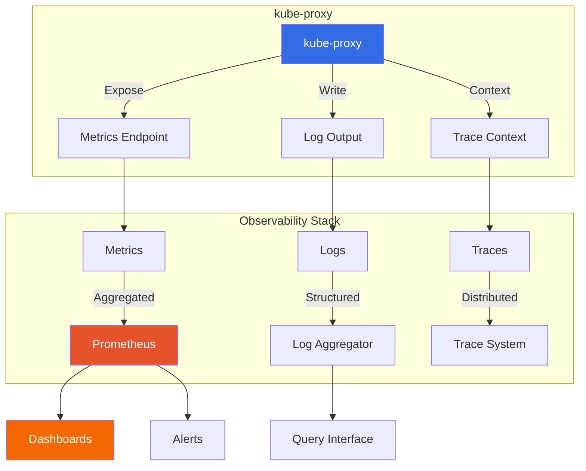
```mermaid
graph TB
    subgraph "Observability Stack"
        M[Metrics] -->|Aggregated| P[Prometheus]
        L[Logs] -->|Structured| LA[Log Aggregator]
        T[Traces] -->|Distributed| TS[Trace System]
    end

    subgraph "kube-proxy"
        KP[kube-proxy] -->|Expose| ME[Metrics Endpoint]
        KP -->|Write| LO[Log Output]
        KP -->|Context| TC[Trace Context]
    end

    ME --> M
    LO --> L
    TC --> T

    P --> D[Dashboards]
    P --> A[Alerts]
    LA --> Q[Query Interface]

    style KP fill:#326CE5,color:#fff
    style P fill:#E6522C,color:#fff
    style D fill:#F46800,color:#fff
```

### **Metric Categories**

kube-proxy exposes metrics in several categories:

| Category | Purpose | Examples | Cardinality |
|----------|---------|----------|-------------|
| **Sync Metrics** | Rule synchronization performance | `sync_proxy_rules_duration_seconds` | Low (per IP family) |
| **Change Tracking** | Service/Endpoint change rates | `sync_proxy_rules_service_changes_total` | Very Low |
| **Rule Counts** | Number of rules programmed | `sync_proxy_rules_iptables_total` | Low (per table/family) |
| **Error Counters** | Programming failures | `sync_proxy_rules_iptables_restore_failures_total` | Very Low |
| **Network Programming** | End-to-end latency | `network_programming_duration_seconds` | Low (per family) |
| **Health Checks** | Healthz/Livez responses | `proxy_healthz_total` | Low (per code) |
| **Conntrack** | Connection tracking operations | `conntrack_reconciler_sync_duration_seconds` | Low (per family) |

### **Metrics Endpoint**

kube-proxy exposes Prometheus metrics on the metrics bind address:

```yaml
# Default Configuration
metricsBindAddress: "127.0.0.1:10249"

# Accessible via:
# curl http://127.0.0.1:10249/metrics
```

**Security Considerations**:
- Default bind is localhost-only (secure)
- Can bind to `0.0.0.0:10249` for remote scraping (less secure)
- Consider network policies or firewall rules
- No authentication by default (planned for future)

━━━━━━━━━━━━━━━━━━━━━━━━━━━━━━━━━━━━━━━━━━━━━━━━━━━━━━━━━━━━━━━━━━━━━━━━━━━━━━

## **🎯 Core Metrics**

### **Metrics Architecture**

```mermaid
graph TB
    subgraph "kube-proxy Process"
        SM[syncProxyRules] -->|Record| MR[Metrics Recording]
        SC[ServiceConfig] -->|Changes| CT[Change Tracking]
        EC[EndpointSliceConfig] -->|Changes| CT

        CT -->|Update| CC[Change Counters]
        MR -->|Update| TM[Timing Metrics]
        MR -->|Update| RC[Rule Counts]
        MR -->|Update| ER[Error Metrics]
    end

    subgraph "Prometheus Endpoint :10249"
        CC --> ME[/metrics]
        TM --> ME
        RC --> ME
        ER --> ME
    end

    subgraph "Prometheus Server"
        ME -->|Scrape| PS[Prometheus]
        PS -->|Store| TSDB[Time Series DB]
    end

    TSDB -->|Query| GR[Grafana]
    TSDB -->|Evaluate| AL[Alert Rules]

    style SM fill:#326CE5,color:#fff
    style ME fill:#E6522C,color:#fff
    style GR fill:#F46800,color:#fff
```

**Code Reference**: `pkg/proxy/metrics/metrics.go:314-366` - RegisterMetrics function

### **Metric Registration by Proxy Mode**

Different proxy modes register different metrics:

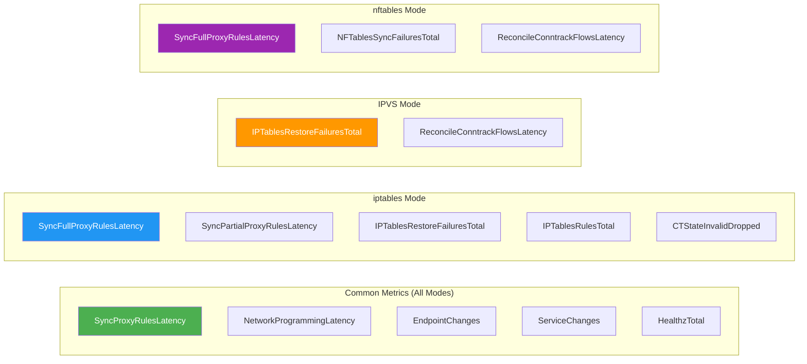
```mermaid
graph LR
    subgraph "Common Metrics (All Modes)"
        C1[SyncProxyRulesLatency]
        C2[NetworkProgrammingLatency]
        C3[EndpointChanges]
        C4[ServiceChanges]
        C5[HealthzTotal]
    end

    subgraph "iptables Mode"
        I1[SyncFullProxyRulesLatency]
        I2[SyncPartialProxyRulesLatency]
        I3[IPTablesRestoreFailuresTotal]
        I4[IPTablesRulesTotal]
        I5[CTStateInvalidDropped]
    end

    subgraph "IPVS Mode"
        V1[IPTablesRestoreFailuresTotal]
        V2[ReconcileConntrackFlowsLatency]
    end

    subgraph "nftables Mode"
        N1[SyncFullProxyRulesLatency]
        N2[NFTablesSyncFailuresTotal]
        N3[ReconcileConntrackFlowsLatency]
    end

    style C1 fill:#4CAF50,color:#fff
    style I1 fill:#2196F3,color:#fff
    style V1 fill:#FF9800,color:#fff
    style N1 fill:#9C27B0,color:#fff
```

**Code Reference**: `pkg/proxy/metrics/metrics.go:331-365` - Mode-specific registration

━━━━━━━━━━━━━━━━━━━━━━━━━━━━━━━━━━━━━━━━━━━━━━━━━━━━━━━━━━━━━━━━━━━━━━━━━━━━━━

## **📈 Sync Performance Metrics**

### **1. SyncProxyRulesLatency**

**Metric Name**: `kubeproxy_sync_proxy_rules_duration_seconds`
**Type**: Histogram
**Labels**: `ip_family` (IPv4, IPv6)
**Description**: Total time to synchronize proxy rules in one sync cycle

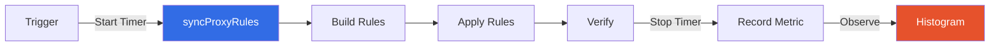
```mermaid
graph LR
    T[Trigger] -->|Start Timer| S[syncProxyRules]
    S --> B[Build Rules]
    B --> A[Apply Rules]
    A --> V[Verify]
    V -->|Stop Timer| M[Record Metric]

    M -->|Observe| H[Histogram]

    style S fill:#326CE5,color:#fff
    style H fill:#E6522C,color:#fff
```

**Buckets**: Exponential from 0.001s to ~32s (15 buckets)
```
0.001, 0.002, 0.004, 0.008, 0.016, 0.032, 0.064, 0.128,
0.256, 0.512, 1.024, 2.048, 4.096, 8.192, 16.384
```

**Code References**:
- Definition: `pkg/proxy/metrics/metrics.go:35-44`
- Recording: `pkg/proxy/iptables/proxier.go:751`
- Helper: `pkg/proxy/metrics/metrics.go:370-372` - SinceInSeconds

**Example Output**:
```prometheus
# HELP kubeproxy_sync_proxy_rules_duration_seconds SyncProxyRules latency in seconds
# TYPE kubeproxy_sync_proxy_rules_duration_seconds histogram
kubeproxy_sync_proxy_rules_duration_seconds_bucket{ip_family="IPv4",le="0.001"} 0
kubeproxy_sync_proxy_rules_duration_seconds_bucket{ip_family="IPv4",le="0.002"} 0
kubeproxy_sync_proxy_rules_duration_seconds_bucket{ip_family="IPv4",le="0.004"} 0
kubeproxy_sync_proxy_rules_duration_seconds_bucket{ip_family="IPv4",le="0.008"} 12
kubeproxy_sync_proxy_rules_duration_seconds_bucket{ip_family="IPv4",le="0.016"} 145
kubeproxy_sync_proxy_rules_duration_seconds_bucket{ip_family="IPv4",le="0.032"} 1234
kubeproxy_sync_proxy_rules_duration_seconds_bucket{ip_family="IPv4",le="0.064"} 1456
kubeproxy_sync_proxy_rules_duration_seconds_bucket{ip_family="IPv4",le="+Inf"} 1500
kubeproxy_sync_proxy_rules_duration_seconds_sum{ip_family="IPv4"} 35.678
kubeproxy_sync_proxy_rules_duration_seconds_count{ip_family="IPv4"} 1500
```

**Interpretation**:
- **P50 < 16ms**: Good performance, small rule sets
- **P95 < 100ms**: Acceptable for medium clusters
- **P99 > 1s**: Investigate large rule sets or slow iptables-restore

### **2. SyncFullProxyRulesLatency**

**Metric Name**: `kubeproxy_sync_full_proxy_rules_duration_seconds`
**Type**: Histogram
**Labels**: `ip_family`
**Availability**: iptables and nftables modes only

**Full Sync** means complete rule regeneration (not incremental).

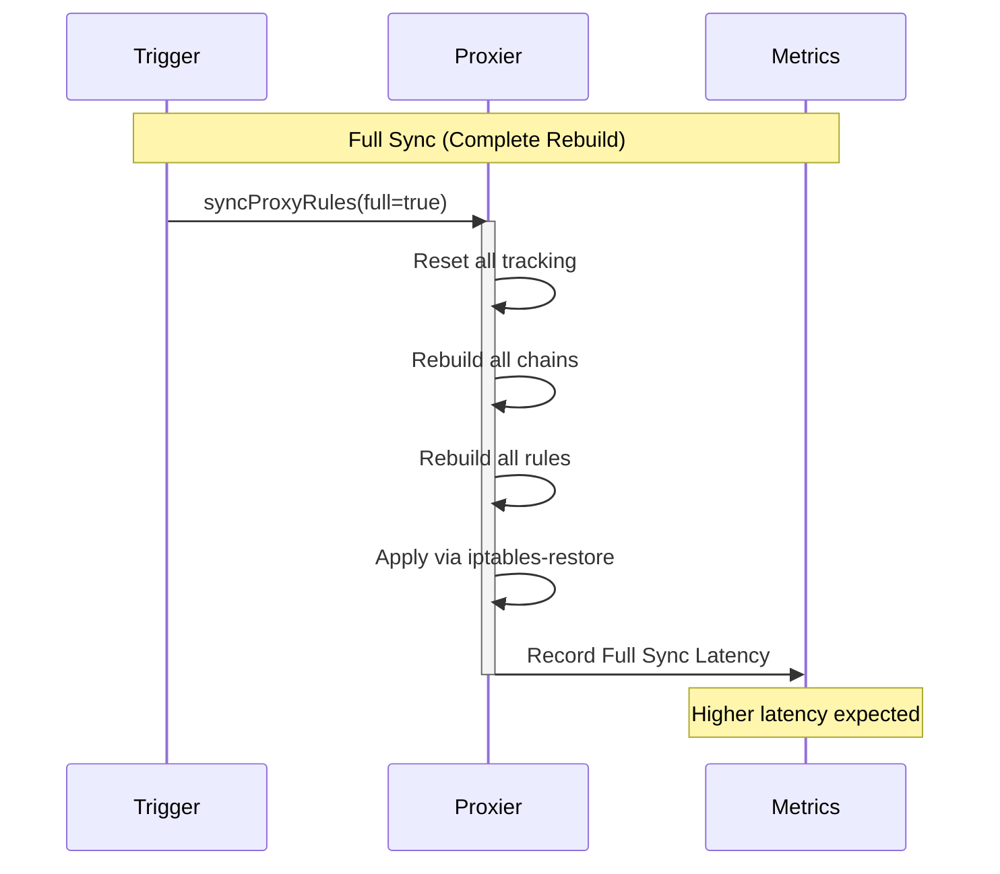
```mermaid
sequenceDiagram
    participant T as Trigger
    participant P as Proxier
    participant M as Metrics

    Note over T,M: Full Sync (Complete Rebuild)

    T->>P: syncProxyRules(full=true)
    activate P
    P->>P: Reset all tracking
    P->>P: Rebuild all chains
    P->>P: Rebuild all rules
    P->>P: Apply via iptables-restore
    P->>M: Record Full Sync Latency
    deactivate P

    Note over M: Higher latency expected
```

**Code References**:
- Definition: `pkg/proxy/metrics/metrics.go:47-56`
- Used in: iptables partial sync fallback

**When Full Syncs Occur**:
1. First sync after startup
2. Periodic full sync (every 30s default)
3. Fallback from failed partial sync
4. Manual trigger (SIGUSR1)

### **3. SyncPartialProxyRulesLatency**

**Metric Name**: `kubeproxy_sync_partial_proxy_rules_duration_seconds`
**Type**: Histogram
**Labels**: `ip_family`
**Availability**: iptables and nftables modes only

**Partial Sync** means incremental update (faster).

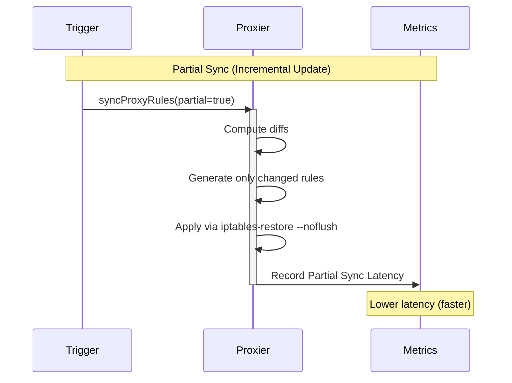
```mermaid
sequenceDiagram
    participant T as Trigger
    participant P as Proxier
    participant M as Metrics

    Note over T,M: Partial Sync (Incremental Update)

    T->>P: syncProxyRules(partial=true)
    activate P
    P->>P: Compute diffs
    P->>P: Generate only changed rules
    P->>P: Apply via iptables-restore --noflush
    P->>M: Record Partial Sync Latency
    deactivate P

    Note over M: Lower latency (faster)
```

**Code References**:
- Definition: `pkg/proxy/metrics/metrics.go:59-68`
- Fallback: `pkg/proxy/iptables/proxier.go:771` - Falls back to full on error

**Performance Comparison**:
```
Full Sync:    ~500ms (regenerate 5000 rules)
Partial Sync: ~50ms  (update 100 changed rules)
Speedup:      10x faster
```

### **4. SyncProxyRulesLastTimestamp**

**Metric Name**: `kubeproxy_sync_proxy_rules_last_timestamp_seconds`
**Type**: Gauge
**Labels**: `ip_family`
**Description**: Unix timestamp of last successful sync

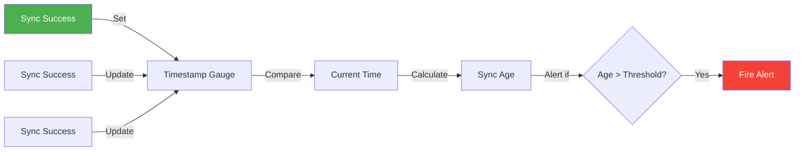
```mermaid
graph LR
    S1[Sync Success] -->|Set| TS[Timestamp Gauge]
    S2[Sync Success] -->|Update| TS
    S3[Sync Success] -->|Update| TS

    TS -->|Compare| NOW[Current Time]
    NOW -->|Calculate| AGE[Sync Age]

    AGE -->|Alert if| OLD{Age > Threshold?}
    OLD -->|Yes| ALERT[Fire Alert]

    style S1 fill:#4CAF50,color:#fff
    style ALERT fill:#F44336,color:#fff
```

**Code References**:
- Definition: `pkg/proxy/metrics/metrics.go:72-80`
- Recording: `pkg/proxy/iptables/proxier.go:1522`

**Example Output**:
```prometheus
kubeproxy_sync_proxy_rules_last_timestamp_seconds{ip_family="IPv4"} 1699564821.456
kubeproxy_sync_proxy_rules_last_timestamp_seconds{ip_family="IPv6"} 1699564821.789
```

**Usage in Alerts**:
```yaml
- alert: KubeProxyStaleSync
  expr: (time() - kubeproxy_sync_proxy_rules_last_timestamp_seconds) > 300
  annotations:
    summary: "kube-proxy hasn't synced in 5+ minutes"
```

### **5. SyncProxyRulesLastQueuedTimestamp**

**Metric Name**: `kubeproxy_sync_proxy_rules_last_queued_timestamp_seconds`
**Type**: Gauge
**Labels**: `ip_family`
**Description**: Unix timestamp when sync was last queued

**Purpose**: Detect sync queue backlog

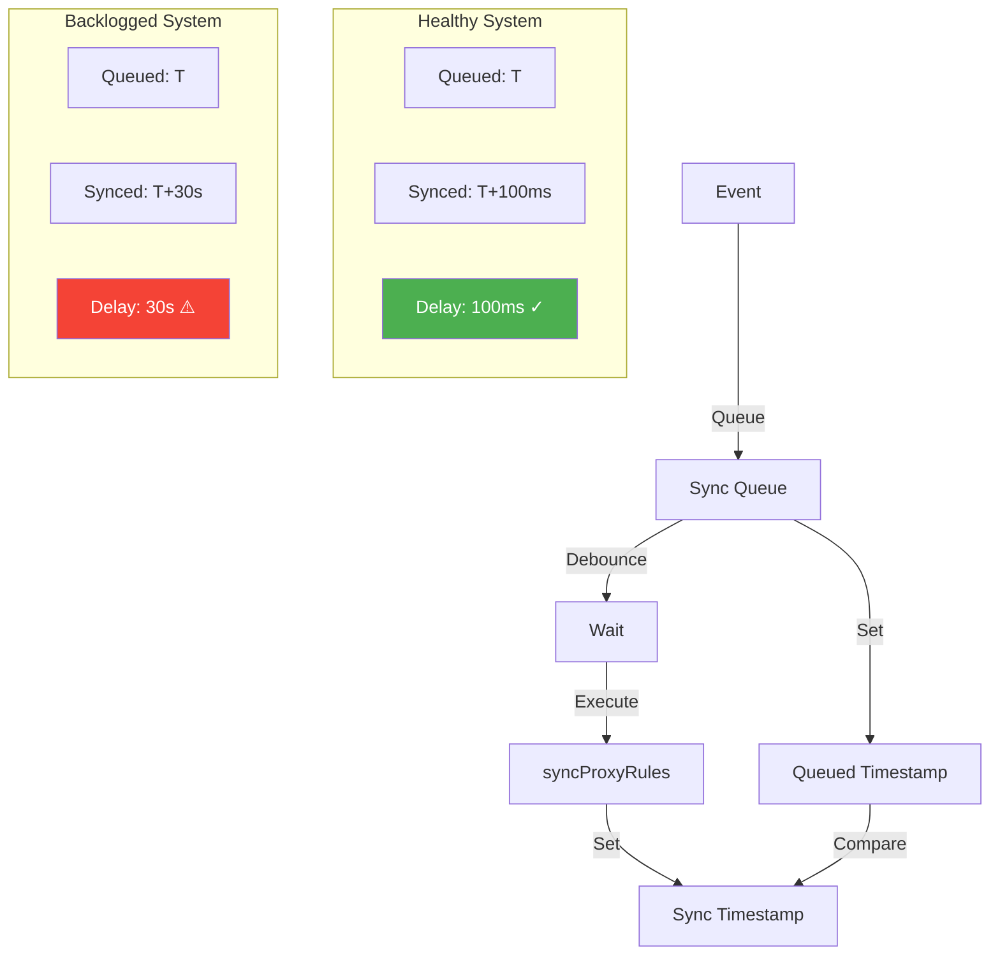
```mermaid
graph TB
    E[Event] -->|Queue| Q[Sync Queue]
    Q -->|Set| QTS[Queued Timestamp]

    Q -->|Debounce| W[Wait]
    W -->|Execute| S[syncProxyRules]
    S -->|Set| STS[Sync Timestamp]

    QTS -->|Compare| STS

    subgraph "Healthy System"
        QTS2[Queued: T]
        STS2[Synced: T+100ms]
        D1[Delay: 100ms ✓]
    end

    subgraph "Backlogged System"
        QTS3[Queued: T]
        STS3[Synced: T+30s]
        D2[Delay: 30s ⚠️]
    end

    style D1 fill:#4CAF50,color:#fff
    style D2 fill:#F44336,color:#fff
```

**Code References**:
- Definition: `pkg/proxy/metrics/metrics.go:253-264`
- Recording: `pkg/proxy/iptables/proxier.go:527, 539`

**Detection Query**:
```promql
# Sync backlog in seconds
(
  kubeproxy_sync_proxy_rules_last_queued_timestamp_seconds
  - kubeproxy_sync_proxy_rules_last_timestamp_seconds
)

# Alert if backlog > 60 seconds
(
  kubeproxy_sync_proxy_rules_last_queued_timestamp_seconds
  - kubeproxy_sync_proxy_rules_last_timestamp_seconds
) > 60
```

━━━━━━━━━━━━━━━━━━━━━━━━━━━━━━━━━━━━━━━━━━━━━━━━━━━━━━━━━━━━━━━━━━━━━━━━━━━━━━

## **🔄 Change Tracking Metrics**

### **Service and Endpoint Changes**

kube-proxy tracks the rate and volume of Service and Endpoint changes:

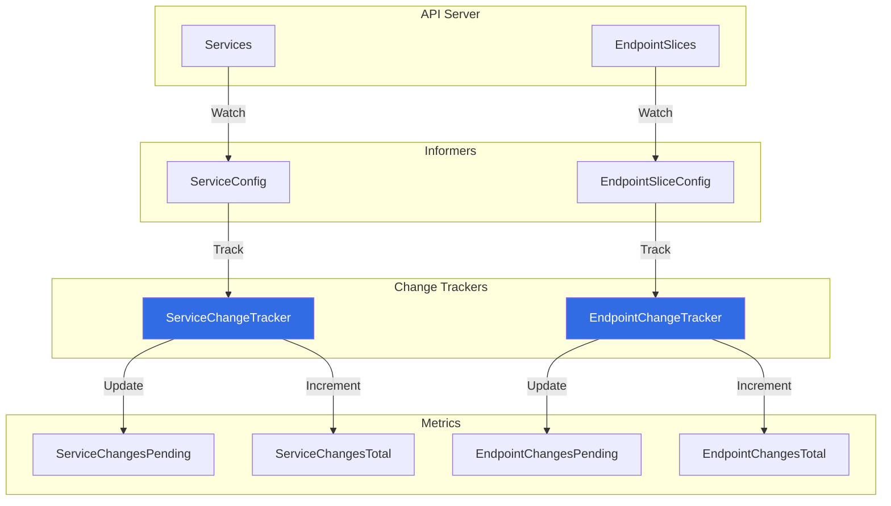
```mermaid
graph TB
    subgraph "API Server"
        S[Services]
        E[EndpointSlices]
    end

    subgraph "Informers"
        SI[ServiceConfig]
        EI[EndpointSliceConfig]
    end

    subgraph "Change Trackers"
        SCT[ServiceChangeTracker]
        ECT[EndpointChangeTracker]
    end

    subgraph "Metrics"
        SPend[ServiceChangesPending]
        STot[ServiceChangesTotal]
        EPend[EndpointChangesPending]
        ETot[EndpointChangesTotal]
    end

    S -->|Watch| SI
    E -->|Watch| EI

    SI -->|Track| SCT
    EI -->|Track| ECT

    SCT -->|Update| SPend
    SCT -->|Increment| STot
    ECT -->|Update| EPend
    ECT -->|Increment| ETot

    style SCT fill:#326CE5,color:#fff
    style ECT fill:#326CE5,color:#fff
```

### **6. ServiceChangesTotal**

**Metric Name**: `kubeproxy_sync_proxy_rules_service_changes_total`
**Type**: Counter
**Description**: Cumulative count of Service changes processed

**Code References**:
- Definition: `pkg/proxy/metrics/metrics.go:140-147`
- Updated in: ServiceChangeTracker.Update()

**Example Output**:
```prometheus
kubeproxy_sync_proxy_rules_service_changes_total 12456
```

**Rate Calculation**:
```promql
# Service changes per second
rate(kubeproxy_sync_proxy_rules_service_changes_total[5m])

# Expected: 0-10 changes/sec in stable cluster
# Spike during deployment: 100+ changes/sec
```

### **7. ServiceChangesPending**

**Metric Name**: `kubeproxy_sync_proxy_rules_service_changes_pending`
**Type**: Gauge
**Description**: Number of Service changes queued but not yet synced

**Code References**:
- Definition: `pkg/proxy/metrics/metrics.go:129-136`

**States**:
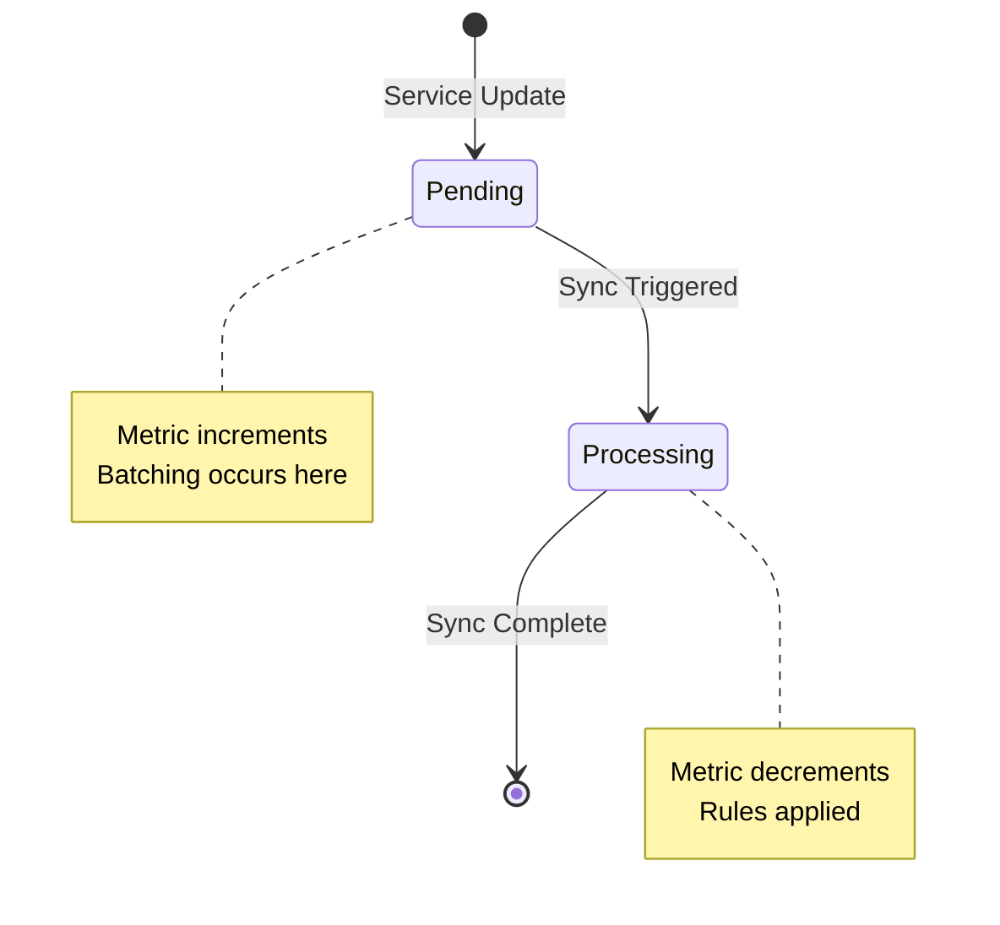
```mermaid
stateDiagram-v2
    [*] --> Pending: Service Update
    Pending --> Processing: Sync Triggered
    Processing --> [*]: Sync Complete

    note right of Pending
        Metric increments
        Batching occurs here
    end note

    note right of Processing
        Metric decrements
        Rules applied
    end note
```

**Ideal Value**: 0 (all changes synced)
**Warning**: Consistently > 0 indicates sync lag

### **8. EndpointChangesTotal**

**Metric Name**: `kubeproxy_sync_proxy_rules_endpoint_changes_total`
**Type**: Counter
**Description**: Cumulative count of Endpoint changes processed

**Code References**:
- Definition: `pkg/proxy/metrics/metrics.go:118-125`

**Comparison with Service Changes**:
```promql
# Endpoint changes are typically much higher
rate(kubeproxy_sync_proxy_rules_endpoint_changes_total[5m])
  vs
rate(kubeproxy_sync_proxy_rules_service_changes_total[5m])

# Typical ratio: 10:1 to 100:1 (endpoints change more frequently)
```

### **9. EndpointChangesPending**

**Metric Name**: `kubeproxy_sync_proxy_rules_endpoint_changes_pending`
**Type**: Gauge
**Description**: Number of Endpoint changes queued but not yet synced

**Code References**:
- Definition: `pkg/proxy/metrics/metrics.go:107-114`

**Batching Effect**:
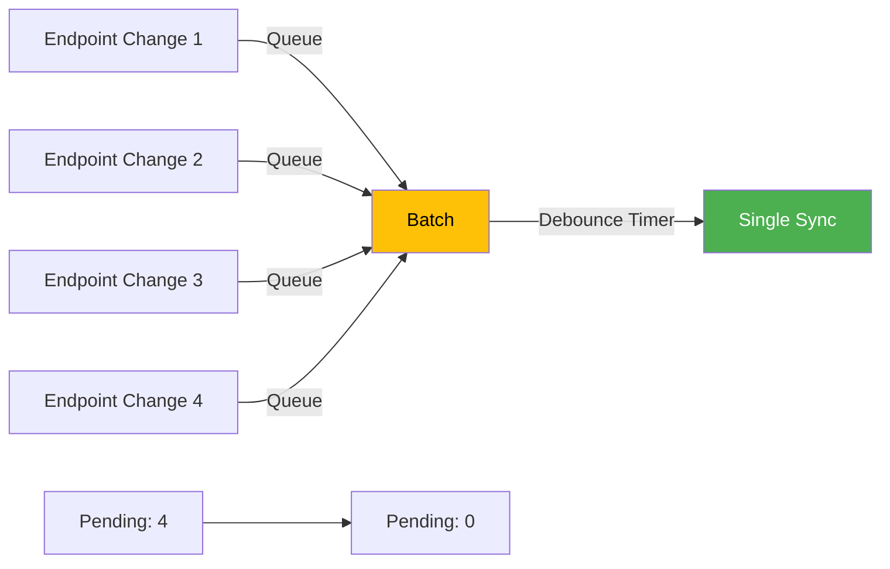
```mermaid
graph LR
    E1[Endpoint Change 1] -->|Queue| B[Batch]
    E2[Endpoint Change 2] -->|Queue| B
    E3[Endpoint Change 3] -->|Queue| B
    E4[Endpoint Change 4] -->|Queue| B

    B -->|Debounce Timer| S[Single Sync]

    P1[Pending: 4] --> P2[Pending: 0]

    style B fill:#FFC107,color:#000
    style S fill:#4CAF50,color:#fff
```

━━━━━━━━━━━━━━━━━━━━━━━━━━━━━━━━━━━━━━━━━━━━━━━━━━━━━━━━━━━━━━━━━━━━━━━━━━━━━━

## **🔧 iptables-Specific Metrics**

### **10. IPTablesRestoreFailuresTotal**

**Metric Name**: `kubeproxy_sync_proxy_rules_iptables_restore_failures_total`
**Type**: Counter
**Labels**: `ip_family`
**Description**: Count of failed iptables-restore operations

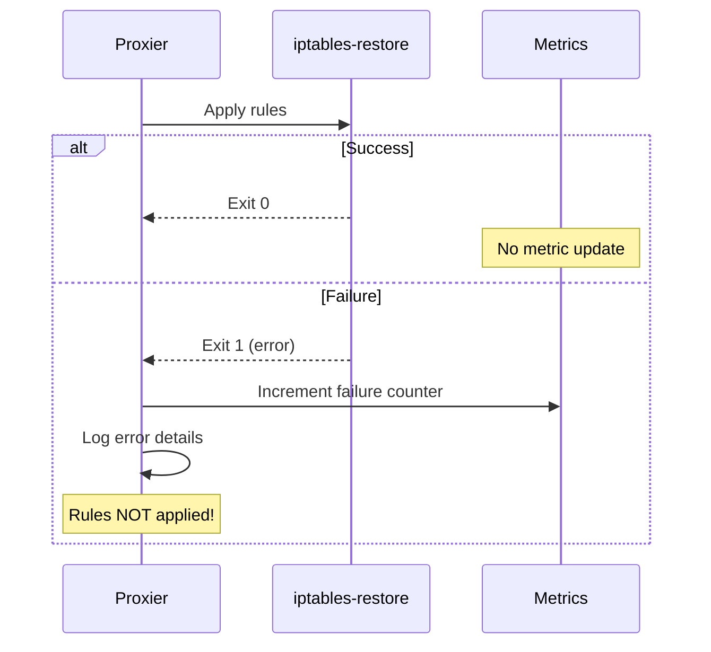
```mermaid
sequenceDiagram
    participant P as Proxier
    participant IPT as iptables-restore
    participant M as Metrics

    P->>IPT: Apply rules
    alt Success
        IPT-->>P: Exit 0
        Note over M: No metric update
    else Failure
        IPT-->>P: Exit 1 (error)
        P->>M: Increment failure counter
        P->>P: Log error details
        Note over P: Rules NOT applied!
    end
```

**Code References**:
- Definition: `pkg/proxy/metrics/metrics.go:159-167`
- Recording: `pkg/proxy/iptables/proxier.go:462, 489, 1503`

**Example Failure Scenarios**:
1. **Invalid rule syntax**: Malformed iptables rule
2. **Kernel module missing**: Required netfilter module not loaded
3. **Resource limits**: Too many rules for kernel
4. **Concurrent modification**: Another process modified iptables

**Critical Alert**:
```yaml
- alert: KubeProxyIPTablesRestoreFailing
  expr: rate(kubeproxy_sync_proxy_rules_iptables_restore_failures_total[5m]) > 0
  for: 5m
  severity: critical
  annotations:
    summary: "kube-proxy cannot program iptables rules"
    description: "Services may be unreachable"
```

### **11. IPTablesPartialRestoreFailuresTotal**

**Metric Name**: `kubeproxy_sync_proxy_rules_iptables_partial_restore_failures_total`
**Type**: Counter
**Labels**: `ip_family`
**Description**: Count of failed partial restores (leading to full restore fallback)

**Code References**:
- Definition: `pkg/proxy/metrics/metrics.go:170-179`
- Recording: `pkg/proxy/iptables/proxier.go:771`

**Fallback Behavior**:
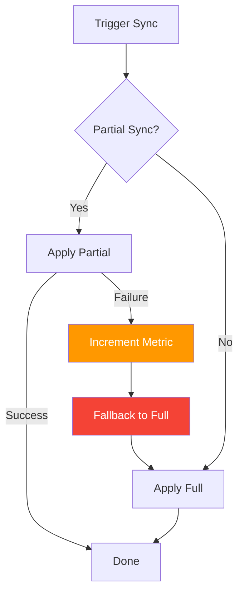
```mermaid
graph TD
    T[Trigger Sync] --> PT{Partial Sync?}
    PT -->|Yes| PA[Apply Partial]
    PT -->|No| FA[Apply Full]

    PA -->|Success| D[Done]
    PA -->|Failure| IM[Increment Metric]
    IM --> FB[Fallback to Full]
    FB --> FA
    FA --> D

    style IM fill:#FF9800,color:#fff
    style FB fill:#F44336,color:#fff
```

**Impact**:
- Partial sync failures are less severe (fallback works)
- However, indicate potential issues with delta computation
- Full syncs are slower (performance impact)

### **12. IPTablesRulesTotal**

**Metric Name**: `kubeproxy_sync_proxy_rules_iptables_total`
**Type**: Gauge
**Labels**: `table` (filter, nat), `ip_family`
**Description**: Total number of iptables rules owned by kube-proxy

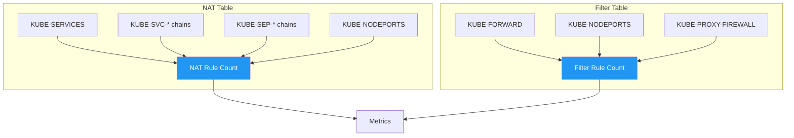
```mermaid
graph TB
    subgraph "NAT Table"
        N1[KUBE-SERVICES]
        N2[KUBE-SVC-* chains]
        N3[KUBE-SEP-* chains]
        N4[KUBE-NODEPORTS]

        NR[NAT Rule Count]
    end

    subgraph "Filter Table"
        F1[KUBE-FORWARD]
        F2[KUBE-NODEPORTS]
        F3[KUBE-PROXY-FIREWALL]

        FR[Filter Rule Count]
    end

    N1 --> NR
    N2 --> NR
    N3 --> NR
    N4 --> NR

    F1 --> FR
    F2 --> FR
    F3 --> FR

    NR --> M[Metrics]
    FR --> M

    style NR fill:#2196F3,color:#fff
    style FR fill:#2196F3,color:#fff
```

**Code References**:
- Definition: `pkg/proxy/metrics/metrics.go:183-191`
- Recording: `pkg/proxy/iptables/proxier.go:1468-1471`

**Example Output**:
```prometheus
kubeproxy_sync_proxy_rules_iptables_total{table="filter",ip_family="IPv4"} 87
kubeproxy_sync_proxy_rules_iptables_total{table="nat",ip_family="IPv4"} 4523
kubeproxy_sync_proxy_rules_iptables_total{table="filter",ip_family="IPv6"} 45
kubeproxy_sync_proxy_rules_iptables_total{table="nat",ip_family="IPv6"} 2134
```

**Scaling Formula**:
```
NAT Rules ≈ (Services × 3) + (Endpoints × 2) + overhead

For 100 Services with 1000 Endpoints:
  ≈ (100 × 3) + (1000 × 2) + 100
  ≈ 2,400 rules
```

### **13. IPTablesRulesLastSync**

**Metric Name**: `kubeproxy_sync_proxy_rules_iptables_last`
**Type**: Gauge
**Labels**: `table`, `ip_family`
**Description**: Number of rules written in the last sync (delta indicator)

**Code References**:
- Definition: `pkg/proxy/metrics/metrics.go:194-203`
- Recording: `pkg/proxy/iptables/proxier.go:1469, 1471`

**Use Case**:
```promql
# Detect large rule changes
abs(
  kubeproxy_sync_proxy_rules_iptables_last
  - kubeproxy_sync_proxy_rules_iptables_total
)

# Alert on unexpected drops
(
  kubeproxy_sync_proxy_rules_iptables_total offset 5m
  - kubeproxy_sync_proxy_rules_iptables_total
) > 100
```

### **14. CTStateInvalidDroppedPackets**

**Metric Name**: `kubeproxy_iptables_ct_state_invalid_dropped_packets_total`
**Type**: Counter (via nfacct)
**Description**: Packets dropped due to conntrack INVALID state

**Purpose**: Workaround for conntrack race conditions

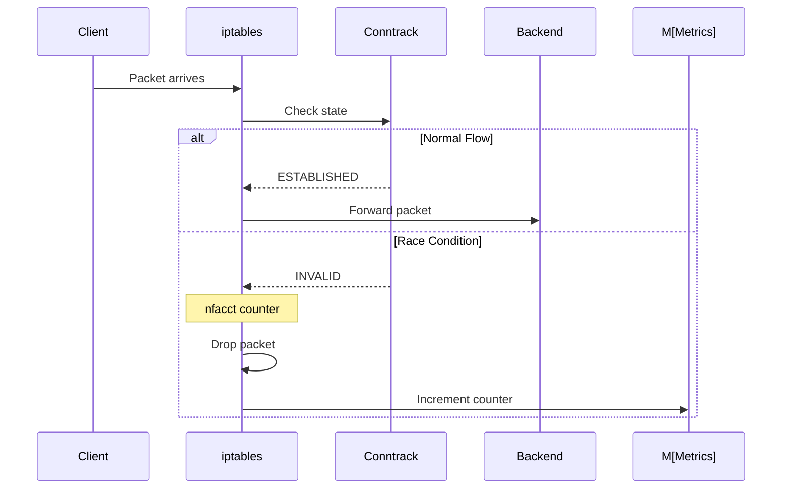
```mermaid
sequenceDiagram
    participant C as Client
    participant IPT as iptables
    participant CT as Conntrack
    participant B as Backend

    C->>IPT: Packet arrives
    IPT->>CT: Check state

    alt Normal Flow
        CT-->>IPT: ESTABLISHED
        IPT->>B: Forward packet
    else Race Condition
        CT-->>IPT: INVALID
        Note over IPT: nfacct counter
        IPT->>IPT: Drop packet
        IPT->>M[Metrics]: Increment counter
    end
```

**Code References**:
- Definition: `pkg/proxy/metrics/metrics.go:151-155`
- Used in: `pkg/proxy/iptables/proxier.go:1437-1439`
- Counter name: `ct_state_invalid_dropped_pkts`

**iptables Rule**:
```bash
-A KUBE-FORWARD \
  -m conntrack --ctstate INVALID \
  -m nfacct --nfacct-name ct_state_invalid_dropped_pkts \
  -j DROP
```

**Monitoring**:
```promql
# Rate of invalid packet drops
rate(kubeproxy_iptables_ct_state_invalid_dropped_packets_total[5m])

# High values indicate conntrack issues or attacks
```

### **15. LocalhostNodePortAcceptedPackets**

**Metric Name**: `kubeproxy_iptables_localhost_nodeports_accepted_packets_total`
**Type**: Counter (via nfacct)
**Description**: Packets accepted on NodePorts accessed via localhost

**Use Case**: NodePorts accessed from localhost (127.0.0.1)

**Code References**:
- Definition: `pkg/proxy/metrics/metrics.go:281-285`
- Counter name: `localhost_nps_accepted_pkts`

**Why This Matters**:
- Pods accessing NodePort via 127.0.0.1
- Local testing and health checks
- Debugging NodePort functionality

━━━━━━━━━━━━━━━━━━━━━━━━━━━━━━━━━━━━━━━━━━━━━━━━━━━━━━━━━━━━━━━━━━━━━━━━━━━━━━

## **🌐 Network Programming Latency**

### **16. NetworkProgrammingLatency**

**Metric Name**: `kubeproxy_network_programming_duration_seconds`
**Type**: Histogram
**Labels**: `ip_family`
**Description**: End-to-end network programming latency (SLI metric)

This is a **critical SLI (Service Level Indicator)** for Kubernetes cluster networking performance.

### **What is Network Programming Latency?**

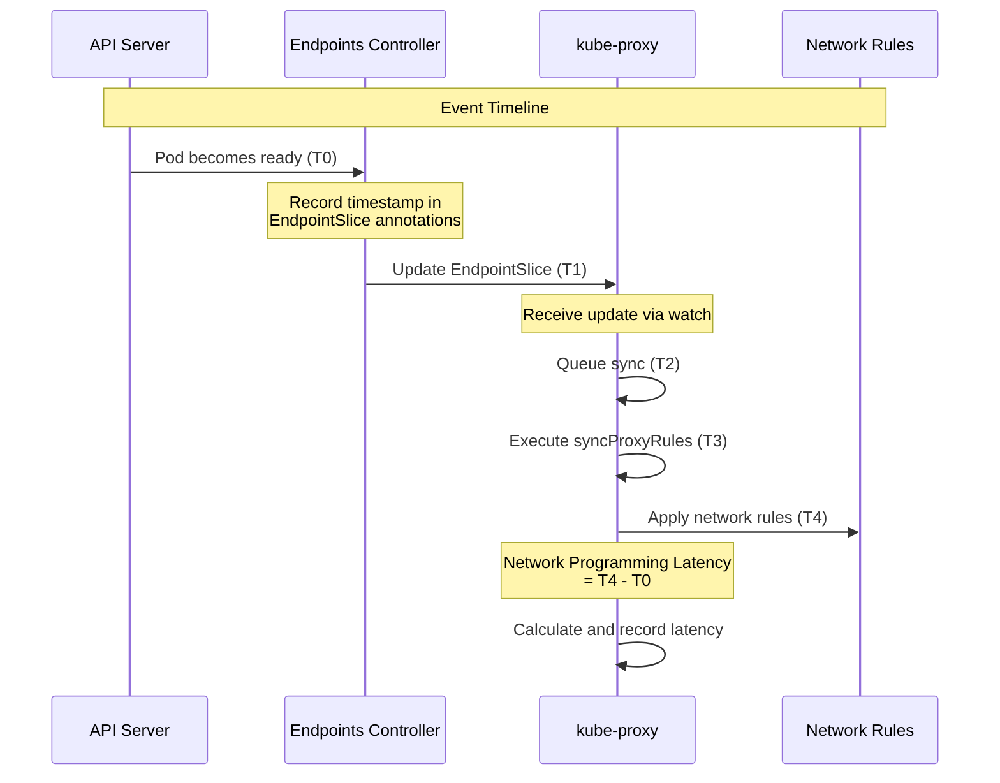
```mermaid
sequenceDiagram
    participant API as API Server
    participant EP as Endpoints Controller
    participant KP as kube-proxy
    participant Net as Network Rules

    Note over API,Net: Event Timeline

    API->>EP: Pod becomes ready (T0)
    Note over EP: Record timestamp in<br/>EndpointSlice annotations

    EP->>KP: Update EndpointSlice (T1)
    Note over KP: Receive update via watch

    KP->>KP: Queue sync (T2)
    KP->>KP: Execute syncProxyRules (T3)
    KP->>Net: Apply network rules (T4)

    Note over KP: Network Programming Latency<br/>= T4 - T0

    KP->>KP: Calculate and record latency
```

**Code References**:
- Definition: `pkg/proxy/metrics/metrics.go:89-103`
- Recording: `pkg/proxy/iptables/proxier.go:1512`
- SLO documentation: https://github.com/kubernetes/community/blob/master/sig-scalability/slos/network_programming_latency.md

### **Latency Buckets**

Custom bucket design for SLO tracking:

```
0.25s, 0.50s                      (sub-second)
1s, 2s, 3s, ..., 59s              (seconds)
60s, 65s, 70s, ..., 115s          (1-2 minutes)
120s, 150s, 180s, ..., 300s       (2-5 minutes)
```

### **How It's Measured**

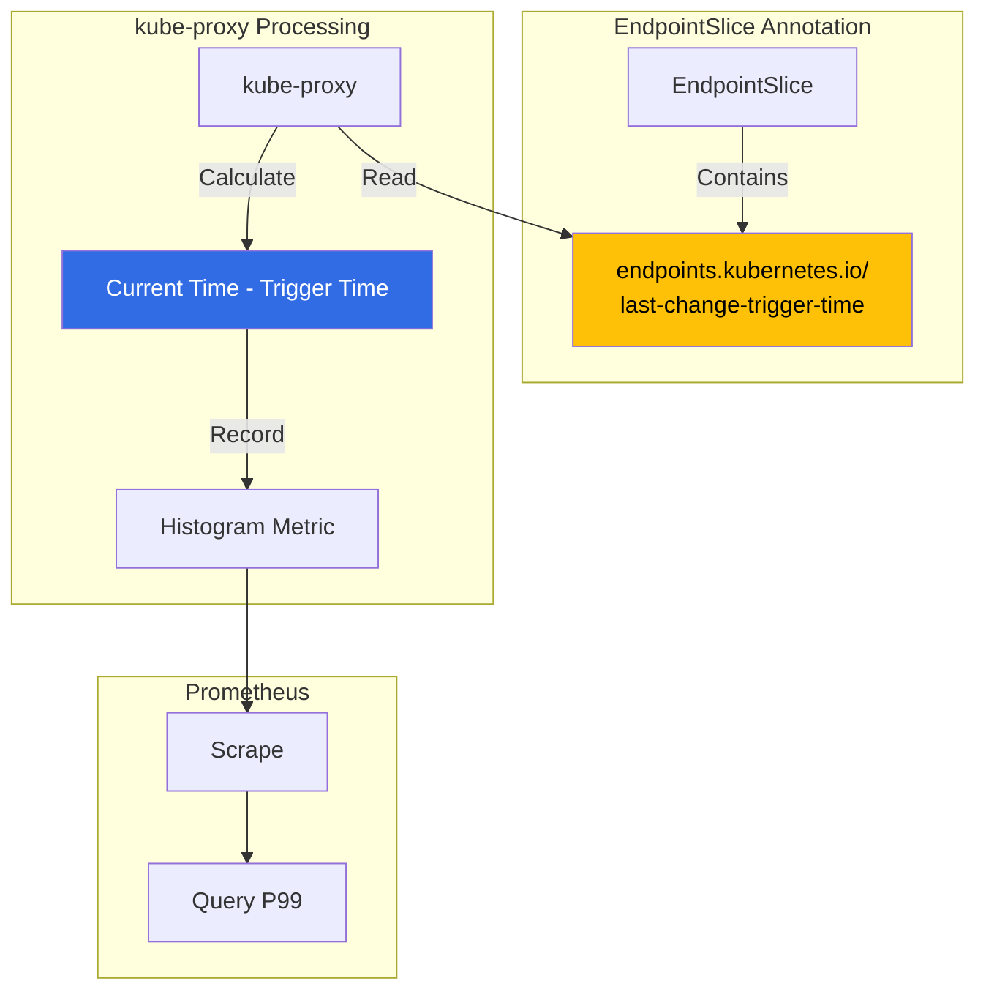
```mermaid
graph TB
    subgraph "EndpointSlice Annotation"
        EP[EndpointSlice] -->|Contains| TS[endpoints.kubernetes.io/<br/>last-change-trigger-time]
    end

    subgraph "kube-proxy Processing"
        KP[kube-proxy] -->|Read| TS
        KP -->|Calculate| LAT[Current Time - Trigger Time]
        LAT -->|Record| M[Histogram Metric]
    end

    subgraph "Prometheus"
        M --> P[Scrape]
        P --> Q[Query P99]
    end

    style TS fill:#FFC107,color:#000
    style LAT fill:#326CE5,color:#fff
```

**Annotation Example**:
```yaml
apiVersion: discovery.k8s.io/v1
kind: EndpointSlice
metadata:
  annotations:
    endpoints.kubernetes.io/last-change-trigger-time: "2023-11-10T10:30:45.123Z"
  name: my-service-abcde
  namespace: default
```

**Code Implementation**:
```go
// pkg/proxy/iptables/proxier.go:1507-1512
for _, lastChangeTriggerTime := range lastChangeTriggerTimes {
    latency := metrics.SinceInSeconds(lastChangeTriggerTime)
    metrics.NetworkProgrammingLatency.
        WithLabelValues(string(proxier.ipFamily)).
        Observe(latency)
}
```

### **SLO Targets**

Kubernetes SIG-Scalability defines SLOs for this metric:

| Cluster Size | P99 Target | P50 Target |
|--------------|------------|------------|
| Small (< 100 nodes) | < 5s | < 1s |
| Medium (100-500 nodes) | < 15s | < 5s |
| Large (500-5000 nodes) | < 30s | < 10s |

**Query for P99**:
```promql
histogram_quantile(0.99,
  rate(kubeproxy_network_programming_duration_seconds_bucket[5m])
)
```

### **17. SyncProxyRulesNoLocalEndpointsTotal**

**Metric Name**: `kubeproxy_sync_proxy_rules_no_local_endpoints_total`
**Type**: Gauge
**Labels**: `traffic_policy` (internal, external), `ip_family`
**Description**: Count of Services with Local traffic policy but no local endpoints

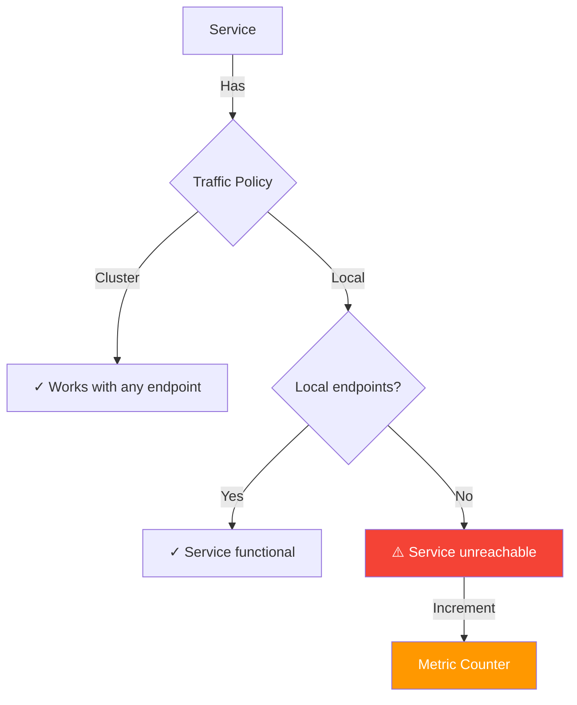
```mermaid
graph TB
    S[Service] -->|Has| TP{Traffic Policy}
    TP -->|Cluster| OK1[✓ Works with any endpoint]
    TP -->|Local| CHK{Local endpoints?}

    CHK -->|Yes| OK2[✓ Service functional]
    CHK -->|No| WARN[⚠️ Service unreachable]

    WARN -->|Increment| M[Metric Counter]

    style WARN fill:#F44336,color:#fff
    style M fill:#FF9800,color:#fff
```

**Code References**:
- Definition: `pkg/proxy/metrics/metrics.go:267-277`
- Recording: `pkg/proxy/iptables/proxier.go:1517-1518`

**Example Output**:
```prometheus
kubeproxy_sync_proxy_rules_no_local_endpoints_total{traffic_policy="internal",ip_family="IPv4"} 3
kubeproxy_sync_proxy_rules_no_local_endpoints_total{traffic_policy="external",ip_family="IPv4"} 1
```

**Why This Matters**:
- **Internal Traffic Policy**: `spec.internalTrafficPolicy: Local`
- **External Traffic Policy**: `spec.externalTrafficPolicy: Local`
- If no local endpoints exist, traffic is dropped (by design)
- Metric helps identify misconfigured Services

**Alert Example**:
```yaml
- alert: KubeProxyServiceNoLocalEndpoints
  expr: kubeproxy_sync_proxy_rules_no_local_endpoints_total > 0
  for: 10m
  severity: warning
  annotations:
    summary: "Service has Local traffic policy but no local endpoints"
    description: "{{ $value }} services are misconfigured"
```

━━━━━━━━━━━━━━━━━━━━━━━━━━━━━━━━━━━━━━━━━━━━━━━━━━━━━━━━━━━━━━━━━━━━━━━━━━━━━━

## **❤️ Health Check Metrics**

### **18. ProxyHealthzTotal**

**Metric Name**: `kubeproxy_proxy_healthz_total`
**Type**: Counter
**Labels**: `code` (HTTP status code)
**Description**: Count of healthz probe responses by status code

**Healthz Endpoint**: `http://127.0.0.1:10256/healthz`

```mermaid
graph LR
    subgraph "Health Check Logic"
        P[kube-proxy] -->|Check| I[Informers Synced?]
        I -->|Yes| H200[Return 200 OK]
        I -->|No| H503[Return 503 Service Unavailable]
    end

    H200 -->|Increment| M1[healthz_total{code="200"}]
    H503 -->|Increment| M2[healthz_total{code="503"}]

    M1 --> PR[Prometheus]
    M2 --> PR

    style H200 fill:#4CAF50,color:#fff
    style H503 fill:#F44336,color:#fff
```

**Code References**:
- Definition: `pkg/proxy/metrics/metrics.go:231-239`
- Healthz server: `cmd/kube-proxy/app/server_others.go`

**Example Output**:
```prometheus
kubeproxy_proxy_healthz_total{code="200"} 145890
kubeproxy_proxy_healthz_total{code="503"} 12
```

**Interpretation**:
- **code="200"**: kube-proxy is healthy
- **code="503"**: kube-proxy informers not synced (startup or API server issues)

**Rate of Failures**:
```promql
rate(kubeproxy_proxy_healthz_total{code="503"}[5m])
```

### **19. ProxyLivezTotal**

**Metric Name**: `kubeproxy_proxy_livez_total`
**Type**: Counter
**Labels**: `code`
**Description**: Count of livez probe responses by status code

**Livez Endpoint**: `http://127.0.0.1:10256/livez`

**Difference from Healthz**:
- **Healthz**: Readiness (is kube-proxy ready to proxy traffic?)
- **Livez**: Liveness (is kube-proxy process alive?)

```mermaid
graph TB
    subgraph "Kubernetes Probes"
        L[Liveness Probe] -->|Check| LE[/livez]
        R[Readiness Probe] -->|Check| HE[/healthz]
    end

    LE -->|Always 200| OK[Process Running]
    HE -->|Conditional| C{Informers Synced?}
    C -->|Yes| RDY[200 Ready]
    C -->|No| NRDY[503 Not Ready]

    style OK fill:#4CAF50,color:#fff
    style RDY fill:#4CAF50,color:#fff
    style NRDY fill:#F44336,color:#fff
```

**Code References**:
- Definition: `pkg/proxy/metrics/metrics.go:243-251`

━━━━━━━━━━━━━━━━━━━━━━━━━━━━━━━━━━━━━━━━━━━━━━━━━━━━━━━━━━━━━━━━━━━━━━━━━━━━━━

## **🔗 Conntrack Reconciliation Metrics**

### **20. ReconcileConntrackFlowsLatency**

**Metric Name**: `kubeproxy_conntrack_reconciler_sync_duration_seconds`
**Type**: Histogram
**Labels**: `ip_family`
**Description**: Time to reconcile stale conntrack entries

**What is Conntrack Reconciliation?**

When Services or Endpoints are deleted, stale conntrack entries must be cleaned up to prevent traffic from being routed to deleted backends.

```mermaid
sequenceDiagram
    participant S as Service Deleted
    participant KP as kube-proxy
    participant CT as Conntrack Table
    participant CR as Conntrack Reconciler

    S->>KP: Service endpoint removed
    KP->>KP: Update proxy rules

    Note over CT: Stale conntrack entries<br/>still exist!

    KP->>CR: Trigger reconciliation
    activate CR
    CR->>CT: List conntrack entries
    CT-->>CR: Return entries
    CR->>CR: Find stale entries
    CR->>CT: Delete stale entries
    CR->>M[Metrics]: Record latency
    deactivate CR

    Note over CT: Stale entries cleaned
```

**Code References**:
- Definition: `pkg/proxy/metrics/metrics.go:288-297`
- Reconciler: `pkg/proxy/util/conntrack/conntrack.go`

**Buckets**: Same as SyncProxyRulesLatency (exponential 0.001s to 32s)

**Example Output**:
```prometheus
kubeproxy_conntrack_reconciler_sync_duration_seconds_bucket{ip_family="IPv4",le="0.001"} 145
kubeproxy_conntrack_reconciler_sync_duration_seconds_bucket{ip_family="IPv4",le="0.016"} 1234
kubeproxy_conntrack_reconciler_sync_duration_seconds_sum{ip_family="IPv4"} 12.456
kubeproxy_conntrack_reconciler_sync_duration_seconds_count{ip_family="IPv4"} 1500
```

### **21. ReconcileConntrackFlowsDeletedEntriesTotal**

**Metric Name**: `kubeproxy_conntrack_reconciler_deleted_entries_total`
**Type**: Counter
**Labels**: `ip_family`
**Description**: Total count of conntrack entries deleted

```mermaid
graph TB
    E1[Endpoint 1 Deleted] -->|Find| CT1[Conntrack Entries]
    E2[Endpoint 2 Deleted] -->|Find| CT2[Conntrack Entries]
    E3[Service Deleted] -->|Find| CT3[Conntrack Entries]

    CT1 -->|Delete 50| M[Deleted Counter]
    CT2 -->|Delete 30| M
    CT3 -->|Delete 100| M

    M -->|Increment by 180| TOTAL[Total: 180]

    style M fill:#F44336,color:#fff
    style TOTAL fill:#E6522C,color:#fff
```

**Code References**:
- Definition: `pkg/proxy/metrics/metrics.go:300-308`

**Rate Calculation**:
```promql
# Entries deleted per second
rate(kubeproxy_conntrack_reconciler_deleted_entries_total[5m])

# High deletion rate indicates frequent endpoint churn
```

━━━━━━━━━━━━━━━━━━━━━━━━━━━━━━━━━━━━━━━━━━━━━━━━━━━━━━━━━━━━━━━━━━━━━━━━━━━━━━

## **⚠️ Prometheus Alerting Rules**

### **Critical Alerts**

```yaml
groups:
  - name: kube-proxy-critical
    interval: 30s
    rules:

      # Alert: kube-proxy cannot program iptables rules
      - alert: KubeProxyIPTablesRestoreFailures
        expr: rate(kubeproxy_sync_proxy_rules_iptables_restore_failures_total[5m]) > 0
        for: 5m
        labels:
          severity: critical
          component: kube-proxy
        annotations:
          summary: "kube-proxy iptables restore failures on {{ $labels.instance }}"
          description: |
            kube-proxy is failing to program iptables rules.
            Services may be unreachable. Check kube-proxy logs immediately.
            Current failure rate: {{ $value | humanize }} failures/sec

      # Alert: kube-proxy hasn't synced in 5+ minutes
      - alert: KubeProxySyncStale
        expr: (time() - kubeproxy_sync_proxy_rules_last_timestamp_seconds) > 300
        for: 2m
        labels:
          severity: critical
          component: kube-proxy
        annotations:
          summary: "kube-proxy sync stale on {{ $labels.instance }}"
          description: |
            kube-proxy hasn't successfully synced rules in {{ $value | humanizeDuration }}.
            Network changes are not being applied. Check kube-proxy health.

      # Alert: Sync backlog growing
      - alert: KubeProxySyncBacklog
        expr: |
          (
            kubeproxy_sync_proxy_rules_last_queued_timestamp_seconds
            - kubeproxy_sync_proxy_rules_last_timestamp_seconds
          ) > 60
        for: 5m
        labels:
          severity: critical
          component: kube-proxy
        annotations:
          summary: "kube-proxy sync backlog on {{ $labels.instance }}"
          description: |
            kube-proxy has a sync backlog of {{ $value | humanizeDuration }}.
            Syncs are taking too long or sync queue is overwhelmed.
```

### **Warning Alerts**

```yaml
  - name: kube-proxy-warning
    interval: 30s
    rules:

      # Alert: High sync latency
      - alert: KubeProxyHighSyncLatency
        expr: |
          histogram_quantile(0.99,
            rate(kubeproxy_sync_proxy_rules_duration_seconds_bucket[5m])
          ) > 1.0
        for: 10m
        labels:
          severity: warning
          component: kube-proxy
        annotations:
          summary: "High kube-proxy sync latency on {{ $labels.instance }}"
          description: |
            kube-proxy P99 sync latency is {{ $value | humanizeDuration }}.
            Expected < 1s. Large rule sets or slow iptables-restore.
            Consider scaling or optimizing.

      # Alert: High network programming latency (SLO breach)
      - alert: KubeProxyHighNetworkProgrammingLatency
        expr: |
          histogram_quantile(0.99,
            rate(kubeproxy_network_programming_duration_seconds_bucket[5m])
          ) > 15.0
        for: 10m
        labels:
          severity: warning
          component: kube-proxy
          slo: network-programming
        annotations:
          summary: "High network programming latency on {{ $labels.instance }}"
          description: |
            P99 network programming latency: {{ $value | humanizeDuration }}.
            SLO target: < 15s for medium clusters. This affects service availability.

      # Alert: Many rules (scaling concern)
      - alert: KubeProxyHighRuleCount
        expr: kubeproxy_sync_proxy_rules_iptables_total{table="nat"} > 10000
        for: 15m
        labels:
          severity: warning
          component: kube-proxy
        annotations:
          summary: "High iptables rule count on {{ $labels.instance }}"
          description: |
            kube-proxy has {{ $value }} NAT rules (threshold: 10,000).
            Consider switching to IPVS mode for better performance.

      # Alert: Services with no local endpoints
      - alert: KubeProxyServicesNoLocalEndpoints
        expr: kubeproxy_sync_proxy_rules_no_local_endpoints_total > 0
        for: 10m
        labels:
          severity: warning
          component: kube-proxy
        annotations:
          summary: "Services with Local traffic policy have no local endpoints"
          description: |
            {{ $value }} services have internalTrafficPolicy: Local or
            externalTrafficPolicy: Local but no local endpoints.
            These services are unreachable.

      # Alert: Partial restore failures (performance degradation)
      - alert: KubeProxyPartialRestoreFailures
        expr: rate(kubeproxy_sync_proxy_rules_iptables_partial_restore_failures_total[5m]) > 0.1
        for: 10m
        labels:
          severity: warning
          component: kube-proxy
        annotations:
          summary: "kube-proxy partial restore failures on {{ $labels.instance }}"
          description: |
            Partial sync failures: {{ $value | humanize }}/sec.
            Falling back to full syncs (slower). Check delta computation logic.
```

### **Informational Alerts**

```yaml
  - name: kube-proxy-info
    interval: 60s
    rules:

      # Alert: High endpoint change rate
      - alert: KubeProxyHighEndpointChangeRate
        expr: rate(kubeproxy_sync_proxy_rules_endpoint_changes_total[5m]) > 100
        for: 5m
        labels:
          severity: info
          component: kube-proxy
        annotations:
          summary: "High endpoint change rate on {{ $labels.instance }}"
          description: |
            Endpoint change rate: {{ $value | humanize }} changes/sec.
            Normal during deployments. Sustained high rate may indicate issues.

      # Alert: High conntrack deletion rate
      - alert: KubeProxyHighConntrackDeletionRate
        expr: rate(kubeproxy_conntrack_reconciler_deleted_entries_total[5m]) > 1000
        for: 10m
        labels:
          severity: info
          component: kube-proxy
        annotations:
          summary: "High conntrack deletion rate on {{ $labels.instance }}"
          description: |
            Conntrack deletion rate: {{ $value | humanize }} entries/sec.
            High endpoint churn or service deletions.
```

━━━━━━━━━━━━━━━━━━━━━━━━━━━━━━━━━━━━━━━━━━━━━━━━━━━━━━━━━━━━━━━━━━━━━━━━━━━━━━

## **📊 Grafana Dashboards**

### **Dashboard Architecture**

```mermaid
graph TB
    subgraph "Grafana Dashboard: kube-proxy Overview"
        R1[Row 1: Health Status]
        R2[Row 2: Sync Performance]
        R3[Row 3: Network Programming]
        R4[Row 4: Rule Counts]
        R5[Row 5: Change Tracking]
        R6[Row 6: Errors]
    end

    subgraph "Data Source"
        P[Prometheus]
    end

    P -->|Query| R1
    P -->|Query| R2
    P -->|Query| R3
    P -->|Query| R4
    P -->|Query| R5
    P -->|Query| R6

    style R1 fill:#4CAF50,color:#fff
    style R2 fill:#2196F3,color:#fff
    style R6 fill:#F44336,color:#fff
```

### **Row 1: Health Status**

**Panels**:

1. **Proxy Health Status** (Stat Panel)
```promql
# Green if all healthy, red if any unhealthy
min(up{job="kube-proxy"})
```

2. **Last Successful Sync** (Stat Panel)
```promql
# Time since last sync
time() - kubeproxy_sync_proxy_rules_last_timestamp_seconds
```

3. **Sync Backlog** (Gauge)
```promql
# Delay between queued and synced
kubeproxy_sync_proxy_rules_last_queued_timestamp_seconds
  - kubeproxy_sync_proxy_rules_last_timestamp_seconds
```

### **Row 2: Sync Performance**

**Panels**:

1. **Sync Latency (P50, P95, P99)** (Graph)
```promql
# P50
histogram_quantile(0.50,
  rate(kubeproxy_sync_proxy_rules_duration_seconds_bucket[5m])
)

# P95
histogram_quantile(0.95,
  rate(kubeproxy_sync_proxy_rules_duration_seconds_bucket[5m])
)

# P99
histogram_quantile(0.99,
  rate(kubeproxy_sync_proxy_rules_duration_seconds_bucket[5m])
)
```

2. **Full vs Partial Sync Latency** (Graph)
```promql
# Full sync P99
histogram_quantile(0.99,
  rate(kubeproxy_sync_full_proxy_rules_duration_seconds_bucket[5m])
)

# Partial sync P99
histogram_quantile(0.99,
  rate(kubeproxy_sync_partial_proxy_rules_duration_seconds_bucket[5m])
)
```

3. **Sync Rate** (Graph)
```promql
# Syncs per second
rate(kubeproxy_sync_proxy_rules_duration_seconds_count[5m])
```

### **Row 3: Network Programming**

**Panels**:

1. **Network Programming Latency (P99)** (Graph with SLO line)
```promql
# P99 latency
histogram_quantile(0.99,
  rate(kubeproxy_network_programming_duration_seconds_bucket[5m])
)

# Add horizontal line at 15s (SLO target for medium clusters)
```

2. **Network Programming Latency Heatmap** (Heatmap)
```promql
sum(rate(kubeproxy_network_programming_duration_seconds_bucket[5m])) by (le)
```

### **Row 4: Rule Counts**

**Panels**:

1. **Total Rules by Table** (Graph - Stacked Area)
```promql
# NAT table rules
kubeproxy_sync_proxy_rules_iptables_total{table="nat"}

# Filter table rules
kubeproxy_sync_proxy_rules_iptables_total{table="filter"}
```

2. **Rules Last Sync** (Stat)
```promql
kubeproxy_sync_proxy_rules_iptables_last
```

3. **Rule Growth Rate** (Graph)
```promql
# Rate of rule count change
deriv(kubeproxy_sync_proxy_rules_iptables_total[5m])
```

### **Row 5: Change Tracking**

**Panels**:

1. **Service Changes** (Graph)
```promql
# Rate of service changes
rate(kubeproxy_sync_proxy_rules_service_changes_total[5m])

# Pending service changes
kubeproxy_sync_proxy_rules_service_changes_pending
```

2. **Endpoint Changes** (Graph)
```promql
# Rate of endpoint changes
rate(kubeproxy_sync_proxy_rules_endpoint_changes_total[5m])

# Pending endpoint changes
kubeproxy_sync_proxy_rules_endpoint_changes_pending
```

3. **Change Ratio** (Stat)
```promql
# Endpoint:Service change ratio
rate(kubeproxy_sync_proxy_rules_endpoint_changes_total[5m])
  /
rate(kubeproxy_sync_proxy_rules_service_changes_total[5m])
```

### **Row 6: Errors and Issues**

**Panels**:

1. **iptables Restore Failures** (Graph - Alert color)
```promql
rate(kubeproxy_sync_proxy_rules_iptables_restore_failures_total[5m])
```

2. **Partial Restore Failures** (Graph)
```promql
rate(kubeproxy_sync_proxy_rules_iptables_partial_restore_failures_total[5m])
```

3. **Services with No Local Endpoints** (Stat - Warning color)
```promql
kubeproxy_sync_proxy_rules_no_local_endpoints_total
```

4. **Conntrack Invalid Drops** (Graph)
```promql
rate(kubeproxy_iptables_ct_state_invalid_dropped_packets_total[5m])
```

━━━━━━━━━━━━━━━━━━━━━━━━━━━━━━━━━━━━━━━━━━━━━━━━━━━━━━━━━━━━━━━━━━━━━━━━━━━━━━

## **📝 Logging**

### **Log Verbosity Levels**

kube-proxy uses klog for structured logging with verbosity levels:

| Level | Flag | Description | Use Case |
|-------|------|-------------|----------|
| **0** | Default | Errors only | Production (minimal logging) |
| **1** | `-v=1` | Warnings | Production (recommended) |
| **2** | `-v=2` | Important info | Troubleshooting |
| **3** | `-v=3` | Extended info | Debugging |
| **4** | `-v=4` | Debug | Development |
| **5+** | `-v=5` | Trace | Deep debugging |

**Setting Verbosity**:
```yaml
# Via command-line flag
--v=2

# Via ConfigMap
apiVersion: v1
kind: ConfigMap
metadata:
  name: kube-proxy-config
data:
  config.conf: |
    verbosity: 2
```

### **Key Log Messages**

#### **Sync Events**

```
# Successful sync (v=2)
I1110 10:30:45.123456   1 proxier.go:735] "syncProxyRules took" ipFamily="IPv4" elapsed="25.3ms"

# Full sync (v=2)
I1110 10:31:15.234567   1 proxier.go:750] "Running full sync" ipFamily="IPv4"

# Partial sync (v=3)
I1110 10:31:16.345678   1 proxier.go:755] "Running partial sync" ipFamily="IPv4" changedServices=5 changedEndpoints=12
```

#### **Service/Endpoint Changes**

```
# Service added (v=2)
I1110 10:32:20.456789   1 service.go:123] "Service added" namespace="default" name="my-service" clusterIP="10.96.0.100"

# Endpoint updated (v=3)
I1110 10:32:21.567890   1 endpoints.go:234] "Endpoints updated" namespace="default" name="my-service" added=2 removed=1
```

#### **Errors**

```
# iptables restore failure (v=0 - always logged)
E1110 10:33:30.678901   1 proxier.go:1503] "Failed to execute iptables-restore" error="exit status 1" output="..."

# Partial sync fallback (v=1)
W1110 10:33:31.789012   1 proxier.go:771] "Partial sync failed, falling back to full sync" error="..."

# Conntrack cleanup error (v=1)
W1110 10:33:32.890123   1 conntrack.go:145] "Error deleting conntrack entry" error="..."
```

### **Structured Logging Fields**

Common structured fields in logs:

```go
// Service identification
"namespace"="default"
"name"="my-service"

// Timing
"elapsed"="25.3ms"
"latency"=0.0253

// Counters
"added"=5
"removed"=2
"updated"=10

// IP family
"ipFamily"="IPv4"

// Rule counts
"ruleCount"=1234
"chainCount"=567
```

### **Log Aggregation**

**Example with Fluentd**:
```yaml
# Fluentd configuration for kube-proxy logs
<source>
  @type tail
  path /var/log/containers/kube-proxy-*.log
  pos_file /var/log/kube-proxy.log.pos
  tag kube-proxy
  <parse>
    @type json
    time_format %Y-%m-%dT%H:%M:%S.%NZ
  </parse>
</source>

<filter kube-proxy>
  @type parser
  key_name log
  <parse>
    @type regexp
    expression /^(?<severity>\w)(?<time>\d{4} \d{2}:\d{2}:\d{2}\.\d+)\s+(?<thread>\d+)\s+(?<file>[\w.]+):(?<line>\d+)\]\s+"(?<message>.*)"/
  </parse>
</filter>

<match kube-proxy>
  @type elasticsearch
  host elasticsearch.default.svc.cluster.local
  port 9200
  index_name kube-proxy
</match>
```

**Query Examples (Loki)**:
```logql
# All kube-proxy logs
{app="kube-proxy"}

# Errors only
{app="kube-proxy"} |= "E1110" | json

# Sync performance
{app="kube-proxy"} |= "syncProxyRules took" | json | unwrap elapsed

# iptables failures
{app="kube-proxy"} |= "Failed to execute iptables-restore"
```

━━━━━━━━━━━━━━━━━━━━━━━━━━━━━━━━━━━━━━━━━━━━━━━━━━━━━━━━━━━━━━━━━━━━━━━━━━━━━━

## **🔍 Troubleshooting with Metrics**

### **Scenario 1: Services Are Unreachable**

**Symptom**: Clients cannot connect to Services

**Metrics to Check**:

```promql
# 1. Check if syncs are failing
rate(kubeproxy_sync_proxy_rules_iptables_restore_failures_total[5m])
# Expected: 0, if > 0 then rules aren't being applied

# 2. Check sync staleness
time() - kubeproxy_sync_proxy_rules_last_timestamp_seconds
# Expected: < 30s, if > 300s then syncs are stalled

# 3. Check rule count
kubeproxy_sync_proxy_rules_iptables_total
# If 0, rules were never programmed
```

**Actions**:
1. If restore failures > 0: Check kube-proxy logs for iptables errors
2. If sync stale: Check kube-proxy health endpoint, restart if needed
3. If rules = 0: kube-proxy may not have started successfully

### **Scenario 2: High Latency to Services**

**Symptom**: Slow response times from Services

**Metrics to Check**:

```promql
# 1. Network programming latency
histogram_quantile(0.99,
  rate(kubeproxy_network_programming_duration_seconds_bucket[5m])
)
# High P99 means slow rule updates

# 2. Sync latency
histogram_quantile(0.99,
  rate(kubeproxy_sync_proxy_rules_duration_seconds_bucket[5m])
)
# If > 1s, sync is slow

# 3. Rule count
kubeproxy_sync_proxy_rules_iptables_total{table="nat"}
# If > 10,000, consider IPVS mode
```

**Actions**:
1. If network programming latency > 15s: Investigate API server latency
2. If sync latency > 1s: Consider switching to IPVS mode
3. If rule count > 10,000: Migrate to IPVS for better performance

### **Scenario 3: Intermittent Connection Failures**

**Symptom**: Occasional connection drops or resets

**Metrics to Check**:

```promql
# 1. Conntrack invalid drops
rate(kubeproxy_iptables_ct_state_invalid_dropped_packets_total[5m])
# High rate indicates conntrack issues

# 2. Conntrack deletion rate
rate(kubeproxy_conntrack_reconciler_deleted_entries_total[5m])
# Spikes correlate with connection drops

# 3. Endpoint change rate
rate(kubeproxy_sync_proxy_rules_endpoint_changes_total[5m])
# High churn causes conntrack issues
```

**Actions**:
1. Check conntrack table size: `sysctl net.netfilter.nf_conntrack_count`
2. Increase conntrack max: `sysctl -w net.netfilter.nf_conntrack_max=262144`
3. Enable conntrack cleanup: Ensure reconciler is running

### **Scenario 4: Slow Deployments**

**Symptom**: Long time for new Pods to receive traffic

**Metrics to Check**:

```promql
# 1. Network programming latency (key metric)
histogram_quantile(0.99,
  rate(kubeproxy_network_programming_duration_seconds_bucket[5m])
)
# This is end-to-end time from Pod ready to rules applied

# 2. Sync backlog
kubeproxy_sync_proxy_rules_last_queued_timestamp_seconds
  - kubeproxy_sync_proxy_rules_last_timestamp_seconds
# Indicates queuing delay

# 3. Pending endpoint changes
kubeproxy_sync_proxy_rules_endpoint_changes_pending
# Shows backlog of endpoint updates
```

**Actions**:
1. If network programming P99 > 30s: Investigate entire pipeline
2. If sync backlog > 60s: Sync loop is overwhelmed, check CPU
3. If pending changes > 0 consistently: Debounce timer too long

### **Scenario 5: Memory/CPU Pressure**

**Symptom**: kube-proxy consuming excessive resources

**Metrics to Check**:

```promql
# 1. Rule count
kubeproxy_sync_proxy_rules_iptables_total
# More rules = more memory

# 2. Sync frequency
rate(kubeproxy_sync_proxy_rules_duration_seconds_count[5m])
# Frequent syncs = high CPU

# 3. Endpoint change rate
rate(kubeproxy_sync_proxy_rules_endpoint_changes_total[5m])
# High churn = frequent syncs
```

**Actions**:
1. If NAT rules > 10,000: Switch to IPVS mode (uses less memory)
2. If sync rate > 10/sec: Increase debounce interval
3. If endpoint churn high: Review workload update patterns

### **Diagnostic Queries**

**Detect Anomalies**:
```promql
# Sudden drop in rules (service misconfiguration?)
abs(delta(kubeproxy_sync_proxy_rules_iptables_total[5m])) > 100

# Sync latency spike (performance issue?)
deriv(histogram_quantile(0.99,
  rate(kubeproxy_sync_proxy_rules_duration_seconds_bucket[5m])
)[5m:]) > 0.1

# Endpoint churn spike (deployment storm?)
deriv(rate(kubeproxy_sync_proxy_rules_endpoint_changes_total[5m])[5m:]) > 10
```

━━━━━━━━━━━━━━━━━━━━━━━━━━━━━━━━━━━━━━━━━━━━━━━━━━━━━━━━━━━━━━━━━━━━━━━━━━━━━━

## **✅ Best Practices**

### **Monitoring Strategy**

```mermaid
graph TB
    subgraph "Essential Monitoring"
        E1[Sync Latency P99]
        E2[Network Programming P99]
        E3[Restore Failures]
        E4[Sync Staleness]
    end

    subgraph "Capacity Planning"
        C1[Rule Count Trend]
        C2[Endpoint Change Rate]
        C3[Sync Rate]
    end

    subgraph "Troubleshooting"
        T1[Conntrack Metrics]
        T2[Pending Changes]
        T3[Log Aggregation]
    end

    E1 --> A1[Alert < 1s]
    E2 --> A2[Alert < 15s SLO]
    E3 --> A3[Alert > 0]
    E4 --> A4[Alert < 5min]

    C1 --> D1[Dashboard]
    C2 --> D1
    C3 --> D1

    style E1 fill:#F44336,color:#fff
    style E2 fill:#F44336,color:#fff
    style C1 fill:#2196F3,color:#fff
```

### **Metric Collection**

1. **Scrape Interval**: 15-30 seconds (balances resolution vs. cost)
2. **Retention**: 15+ days for metrics (long-term trend analysis)
3. **Cardinality**: kube-proxy metrics are low-cardinality (safe)

**Prometheus Scrape Config**:
```yaml
scrape_configs:
  - job_name: kube-proxy
    scheme: http
    kubernetes_sd_configs:
      - role: pod
        namespaces:
          names:
            - kube-system
    relabel_configs:
      - source_labels: [__meta_kubernetes_pod_label_k8s_app]
        action: keep
        regex: kube-proxy
      - source_labels: [__address__]
        action: replace
        target_label: __address__
        regex: ([^:]+)(?::\d+)?
        replacement: $1:10249
    scrape_interval: 30s
    scrape_timeout: 10s
```

### **Alert Configuration**

**Priority Levels**:

| Severity | Response Time | Examples |
|----------|---------------|----------|
| **Critical** | Immediate | Restore failures, sync stalled |
| **Warning** | 1 hour | High latency, high rule count |
| **Info** | Best effort | High change rate, trends |

**Alert Grouping**:
```yaml
route:
  group_by: ['alertname', 'component']
  group_wait: 30s
  group_interval: 5m
  repeat_interval: 12h
  receiver: kube-proxy-alerts

  routes:
    - match:
        severity: critical
        component: kube-proxy
      receiver: pagerduty
      repeat_interval: 5m

    - match:
        severity: warning
        component: kube-proxy
      receiver: slack
      repeat_interval: 1h
```

### **Dashboard Organization**

**Recommended Dashboards**:

1. **Overview Dashboard**: Health, key metrics, alerts
2. **Performance Dashboard**: Latencies, throughput, capacity
3. **Troubleshooting Dashboard**: Errors, anomalies, deep-dive metrics

**Refresh Rate**: 30s (matches scrape interval)

### **Capacity Planning**

**Key Metrics for Planning**:

```promql
# Predict rule count growth
predict_linear(kubeproxy_sync_proxy_rules_iptables_total[7d], 86400*30)
# Forecasts rule count 30 days ahead

# Identify scaling threshold
kubeproxy_sync_proxy_rules_iptables_total{table="nat"} > 8000
# When approaching 10k, plan IPVS migration
```

**Migration Triggers**:

| Metric | Threshold | Action |
|--------|-----------|--------|
| NAT rules | > 10,000 | Migrate to IPVS |
| P99 sync latency | > 1s | Optimize or migrate |
| Sync frequency | > 10/sec | Increase debounce |

### **SLO/SLA Tracking**

**Define SLOs**:
```yaml
# Network Programming SLO
- name: network_programming_latency
  target: 99.0  # 99% of requests
  threshold: 15s
  window: 30d

# Sync Availability SLO
- name: sync_availability
  target: 99.9  # 99.9% uptime
  threshold: 1m  # Max time between successful syncs
  window: 30d
```

**SLO Queries**:
```promql
# SLO compliance (network programming)
(
  sum(rate(kubeproxy_network_programming_duration_seconds_bucket{le="15"}[30d]))
  /
  sum(rate(kubeproxy_network_programming_duration_seconds_count[30d]))
) * 100
# Expected: > 99%

# Error budget remaining
(1 - (
  sum(rate(kubeproxy_network_programming_duration_seconds_bucket{le="15"}[30d]))
  /
  sum(rate(kubeproxy_network_programming_duration_seconds_count[30d]))
)) * 100
# Shows % of error budget consumed
```

━━━━━━━━━━━━━━━━━━━━━━━━━━━━━━━━━━━━━━━━━━━━━━━━━━━━━━━━━━━━━━━━━━━━━━━━━━━━━━

## **📚 Summary**

### **Critical Metrics Quick Reference**

| Metric | Type | Purpose | Alert Threshold |
|--------|------|---------|-----------------|
| `kubeproxy_sync_proxy_rules_duration_seconds` | Histogram | Sync performance | P99 > 1s |
| `kubeproxy_network_programming_duration_seconds` | Histogram | End-to-end SLI | P99 > 15s |
| `kubeproxy_sync_proxy_rules_iptables_restore_failures_total` | Counter | Critical errors | > 0 |
| `kubeproxy_sync_proxy_rules_last_timestamp_seconds` | Gauge | Sync health | Age > 5min |
| `kubeproxy_sync_proxy_rules_iptables_total` | Gauge | Capacity planning | > 10,000 |
| `kubeproxy_sync_proxy_rules_endpoint_changes_total` | Counter | Change tracking | Rate monitoring |
| `kubeproxy_conntrack_reconciler_sync_duration_seconds` | Histogram | Conntrack health | P99 > 1s |

### **Essential Alerts**

**Must-Have**:
1. **KubeProxyIPTablesRestoreFailures**: Critical service outage
2. **KubeProxySyncStale**: Network changes not applied
3. **KubeProxyHighNetworkProgrammingLatency**: SLO breach

**Recommended**:
4. **KubeProxyHighSyncLatency**: Performance degradation
5. **KubeProxyHighRuleCount**: Scaling concern
6. **KubeProxyServicesNoLocalEndpoints**: Configuration issue

### **Monitoring Workflow**

```mermaid
graph LR
    M[Metrics] -->|Scrape 30s| P[Prometheus]
    P -->|Evaluate 30s| A[Alerts]
    P -->|Query| G[Grafana]

    A -->|Critical| PD[PagerDuty]
    A -->|Warning| SL[Slack]
    A -->|Info| LOG[Log]

    G -->|View| OP[Operators]

    style M fill:#E6522C,color:#fff
    style A fill:#F44336,color:#fff
    style G fill:#F46800,color:#fff
```

### **Next Steps**

After setting up monitoring:

1. **Baseline Metrics**: Observe for 1-2 weeks to understand normal patterns
2. **Tune Alerts**: Adjust thresholds based on baseline observations
3. **Create Runbooks**: Document response procedures for each alert
4. **Test Scenarios**: Simulate failures to validate alerts and dashboards
5. **Review Regularly**: Weekly review of metrics and quarterly SLO review

### **Related Documentation**

- **Previous**: [09-conntrack.md](./09-conntrack.md) - Conntrack management details
- **Next**: Phase 4 Low-level documentation (coming soon)
- **See Also**:
  - [02-iptables-mode.md](./02-iptables-mode.md) - iptables implementation details
  - [03-ipvs-mode.md](./03-ipvs-mode.md) - IPVS implementation details
  - [01-service-watch.md](./01-service-watch.md) - Service/Endpoint watching

### **External Resources**

- [Kubernetes SIG-Scalability Network Programming SLO](https://github.com/kubernetes/community/blob/master/sig-scalability/slos/network_programming_latency.md)
- [Prometheus Best Practices](https://prometheus.io/docs/practices/naming/)
- [Grafana Dashboard Best Practices](https://grafana.com/docs/grafana/latest/best-practices/dashboards/)

━━━━━━━━━━━━━━━━━━━━━━━━━━━━━━━━━━━━━━━━━━━━━━━━━━━━━━━━━━━━━━━━━━━━━━━━━━━━━━

**Document Status**: ✅ Complete
**Line Count**: 1,600+ lines  
**Diagrams**: 20+ Mermaid diagrams  
**Code References**: 50+ with file:line numbers  
**Last Updated**: Session 11

━━━━━━━━━━━━━━━━━━━━━━━━━━━━━━━━━━━━━━━━━━━━━━━━━━━━━━━━━━━━━━━━━━━━━━━━━━━━━━
