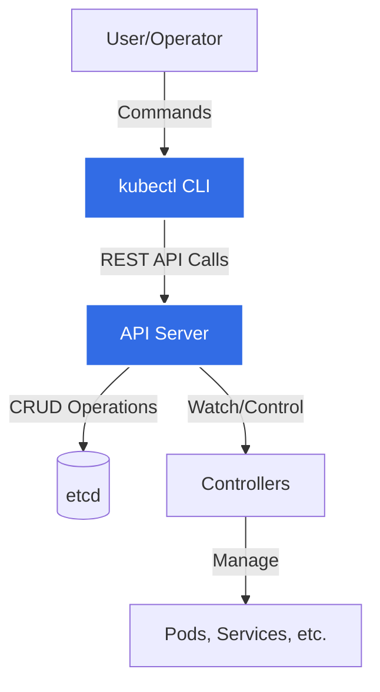
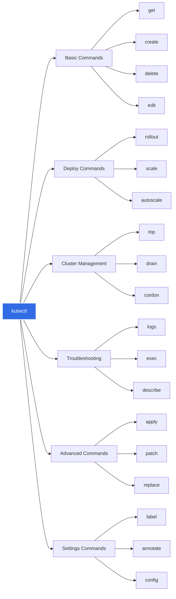
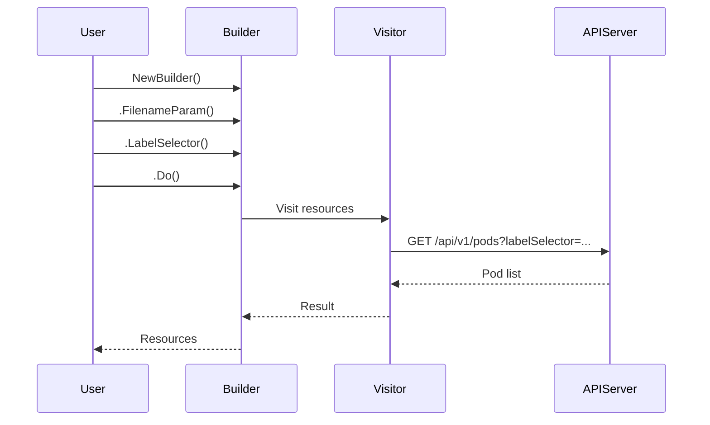
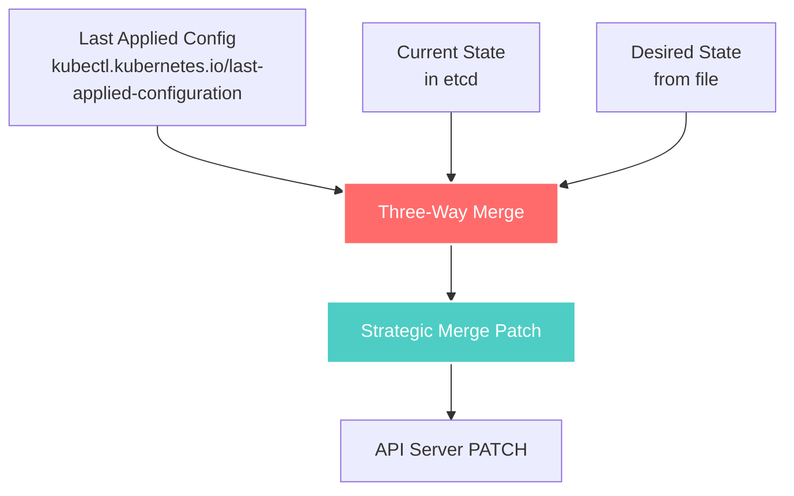
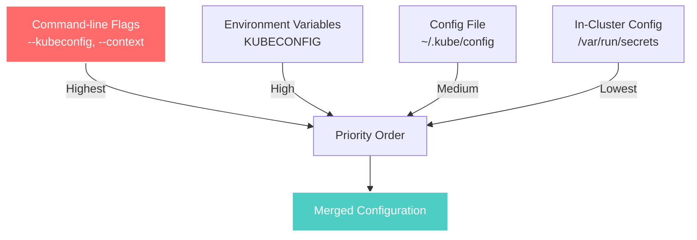
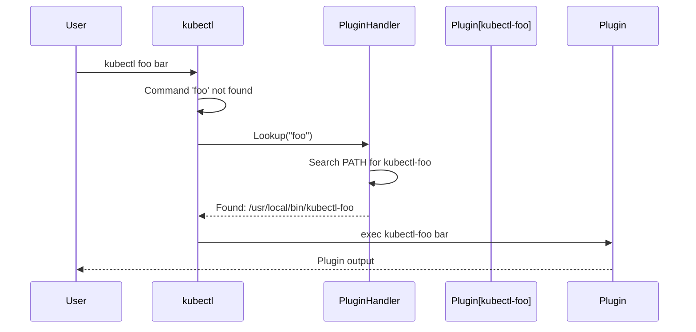
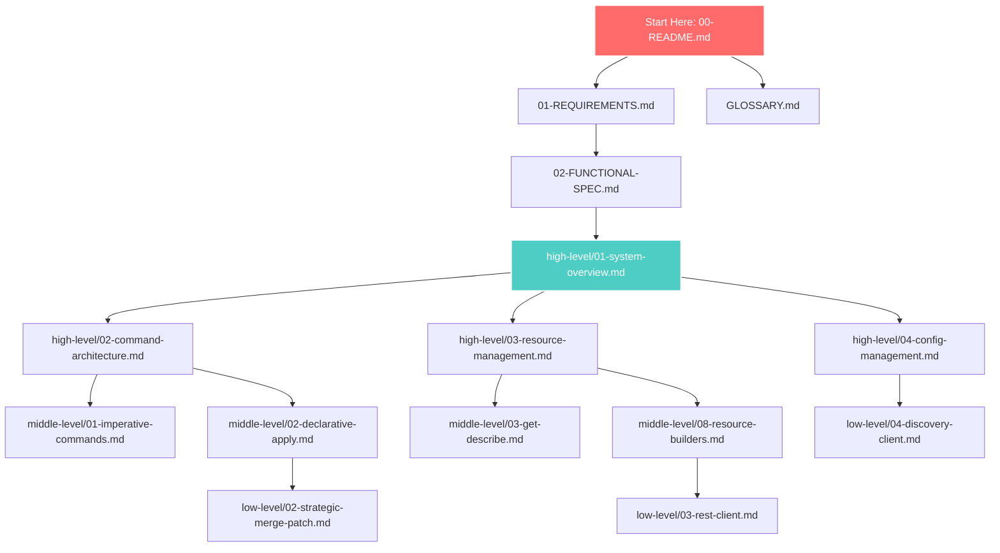

# kubectl Architecture Documentation

**Version**: Kubernetes v1.32+
**Last Updated**: 2025-10-21
**Status**: Comprehensive Architecture Documentation

---

## Table of Contents

- [About This Documentation](#about-this-documentation)
- [Quick Start by Role](#quick-start-by-role)
- [Documentation Structure](#documentation-structure)
- [Learning Paths](#learning-paths)
- [kubectl's Role in Kubernetes](#kubectls-role-in-kubernetes)
- [Key Concepts Overview](#key-concepts-overview)
- [How to Navigate](#how-to-navigate)
- [Contributing to kubectl](#contributing-to-kubectl)

---

## About This Documentation

This comprehensive architecture documentation covers the internal design, implementation, and operational characteristics of **kubectl**, the official command-line interface for Kubernetes. Whether you're a contributor, platform engineer, or curious developer, this documentation provides deep insights into how kubectl works under the hood.

### What You'll Learn

- **Command Architecture**: How kubectl organizes and executes commands using the Cobra framework
- **Resource Management**: The builder pattern, visitor pattern, and resource transformation pipeline
- **Apply Algorithm**: Three-way merge, strategic merge patch, and server-side apply
- **Output Formatting**: Printers, custom columns, JSONPath, and Go templates
- **Configuration Management**: kubeconfig structure, contexts, and authentication
- **Streaming Operations**: How logs, exec, port-forward, and cp work over SPDY/WebSocket
- **Plugin System**: Plugin discovery, execution, and the Krew ecosystem
- **REST Client**: API communication, discovery, and request handling

### Documentation Quality Standards

Every document in this collection follows these standards:
- **800-1000+ lines** of comprehensive content
- **10-20 Mermaid diagrams** showing flows, sequences, and architecture
- **Exact code references** with file paths and line numbers
- **Real-world examples** with actual kubectl commands and output
- **Cross-references** to related documentation
- **Best practices** and troubleshooting guidance

---

## Quick Start by Role

### For New Contributors

Start here to understand kubectl's architecture before making contributions:

1. **[01-REQUIREMENTS.md](01-REQUIREMENTS.md)** - Understand design goals and requirements
2. **[02-FUNCTIONAL-SPEC.md](02-FUNCTIONAL-SPEC.md)** - Learn what kubectl does functionally
3. **[GLOSSARY.md](GLOSSARY.md)** - Essential terminology
4. **[high-level/01-system-overview.md](high-level/01-system-overview.md)** - Overall architecture
5. **[code-references/entry-points.md](code-references/entry-points.md)** - Navigate the codebase

### For Platform Engineers

Focus on understanding how kubectl interacts with your infrastructure:

1. **[high-level/04-config-management.md](high-level/04-config-management.md)** - kubeconfig and authentication
2. **[middle-level/03-get-describe.md](middle-level/03-get-describe.md)** - Resource querying
3. **[middle-level/02-declarative-apply.md](middle-level/02-declarative-apply.md)** - GitOps workflows
4. **[middle-level/05-logs-exec-port-forward.md](middle-level/05-logs-exec-port-forward.md)** - Debugging operations
5. **[middle-level/10-plugins-extensions.md](middle-level/10-plugins-extensions.md)** - Extending kubectl

### For Tool Developers

Building tools that integrate with or extend kubectl:

1. **[middle-level/10-plugins-extensions.md](middle-level/10-plugins-extensions.md)** - Plugin development
2. **[low-level/03-rest-client.md](low-level/03-rest-client.md)** - API client architecture
3. **[low-level/04-discovery-client.md](low-level/04-discovery-client.md)** - Resource discovery
4. **[middle-level/09-output-formatting.md](middle-level/09-output-formatting.md)** - Custom output formats
5. **[low-level/01-cobra-command-structure.md](low-level/01-cobra-command-structure.md)** - Command framework

### For Security Engineers

Understanding authentication, authorization, and secure communication:

1. **[high-level/04-config-management.md](high-level/04-config-management.md)** - Auth configuration
2. **[low-level/03-rest-client.md](low-level/03-rest-client.md)** - TLS and transport security
3. **[low-level/05-kubectl-validation.md](low-level/05-kubectl-validation.md)** - Input validation
4. **[low-level/06-streaming-protocols.md](low-level/06-streaming-protocols.md)** - Secure streaming

### For API Server Developers

Understanding the client-side perspective of API server interactions:

1. **[high-level/01-system-overview.md](high-level/01-system-overview.md)** - Client-server relationship
2. **[low-level/03-rest-client.md](low-level/03-rest-client.md)** - REST client implementation
3. **[low-level/04-discovery-client.md](low-level/04-discovery-client.md)** - API discovery
4. **[middle-level/02-declarative-apply.md](middle-level/02-declarative-apply.md)** - Server-side apply
5. **[low-level/02-strategic-merge-patch.md](low-level/02-strategic-merge-patch.md)** - Patch algorithms

---

## Documentation Structure

This documentation is organized into five phases, progressing from foundational concepts to implementation details:

### Phase 1: Core Documentation (4 files)

Foundation documents providing context and terminology.

```
kubectl/
├── 00-README.md                    # This file - navigation guide
├── 01-REQUIREMENTS.md              # Design requirements and goals
├── 02-FUNCTIONAL-SPEC.md           # What kubectl does
└── GLOSSARY.md                     # Essential terminology
```

**Purpose**: Establish foundational understanding before diving into architecture.

### Phase 2: High-Level Architecture (4 files)

System-level view of kubectl's architecture and major components.

```
kubectl/high-level/
├── 01-system-overview.md           # Overall architecture
├── 02-command-architecture.md      # Command structure and Cobra
├── 03-resource-management.md       # Resource builder and visitor patterns
└── 04-config-management.md         # kubeconfig and authentication
```

**Purpose**: Understand the big picture and architectural decisions.

### Phase 3: Middle-Level Architecture (10 files)

Feature-level deep dives into major kubectl capabilities.

```
kubectl/middle-level/
├── 01-imperative-commands.md       # run, create, expose, delete
├── 02-declarative-apply.md         # apply, three-way merge
├── 03-get-describe.md              # Resource querying and display
├── 04-edit-patch.md                # Resource editing and patching
├── 05-logs-exec-port-forward.md    # Debugging and streaming
├── 06-scale-autoscale.md           # Scaling resources
├── 07-rollout-management.md        # Deployments and rollouts
├── 08-resource-builders.md         # Builder pattern deep dive
├── 09-output-formatting.md         # Printers and output formats
└── 10-plugins-extensions.md        # Plugin system
```

**Purpose**: Understand how major features work in detail.

### Phase 4: Low-Level Technical Specs (6 files)

Implementation details, algorithms, and code-level understanding.

```
kubectl/low-level/
├── 01-cobra-command-structure.md   # Cobra framework usage
├── 02-strategic-merge-patch.md     # Patch algorithm details
├── 03-rest-client.md               # REST client implementation
├── 04-discovery-client.md          # API discovery mechanism
├── 05-kubectl-validation.md        # Validation strategies
└── 06-streaming-protocols.md       # SPDY and WebSocket
```

**Purpose**: Deep technical understanding for contributors and advanced users.

### Phase 5: Code References (1 file)

Quick reference for navigating the kubectl codebase.

```
kubectl/code-references/
└── entry-points.md                 # File locations and code navigation
```

**Purpose**: Help contributors find their way around the codebase quickly.

---

## Learning Paths

### Path 1: Complete Understanding (Recommended for Contributors)

Follow the documentation in order for comprehensive understanding:

**Week 1: Foundations**
1. 00-README.md (this file)
2. 01-REQUIREMENTS.md
3. 02-FUNCTIONAL-SPEC.md
4. GLOSSARY.md

**Week 2: High-Level Architecture**
5. high-level/01-system-overview.md
6. high-level/02-command-architecture.md
7. high-level/03-resource-management.md
8. high-level/04-config-management.md

**Week 3-4: Middle-Level Features**
9. middle-level/01-imperative-commands.md
10. middle-level/02-declarative-apply.md
11. middle-level/03-get-describe.md
12. middle-level/04-edit-patch.md
13. middle-level/05-logs-exec-port-forward.md
14. middle-level/06-scale-autoscale.md
15. middle-level/07-rollout-management.md
16. middle-level/08-resource-builders.md
17. middle-level/09-output-formatting.md
18. middle-level/10-plugins-extensions.md

**Week 5: Low-Level Implementation**
19. low-level/01-cobra-command-structure.md
20. low-level/02-strategic-merge-patch.md
21. low-level/03-rest-client.md
22. low-level/04-discovery-client.md
23. low-level/05-kubectl-validation.md
24. low-level/06-streaming-protocols.md

**Reference**: code-references/entry-points.md (ongoing)

### Path 2: Apply Deep Dive

Focus on understanding kubectl apply for GitOps workflows:

1. GLOSSARY.md (terms: declarative, imperative, strategic merge patch)
2. high-level/03-resource-management.md (resource builder)
3. middle-level/02-declarative-apply.md (apply implementation)
4. low-level/02-strategic-merge-patch.md (patch algorithm)
5. middle-level/04-edit-patch.md (patch types comparison)

### Path 3: Plugin Development

Build custom kubectl plugins:

1. GLOSSARY.md (terms: plugin, krew, extension)
2. high-level/02-command-architecture.md (command structure)
3. middle-level/10-plugins-extensions.md (plugin system)
4. low-level/01-cobra-command-structure.md (Cobra framework)
5. code-references/entry-points.md (code navigation)

### Path 4: Resource Management

Understand how kubectl manages Kubernetes resources:

1. GLOSSARY.md (terms: resource, builder, visitor)
2. high-level/03-resource-management.md (patterns overview)
3. middle-level/08-resource-builders.md (builder deep dive)
4. middle-level/03-get-describe.md (querying resources)
5. middle-level/01-imperative-commands.md (resource creation)

### Path 5: Debugging and Troubleshooting

Master kubectl's debugging capabilities:

1. middle-level/03-get-describe.md (inspecting resources)
2. middle-level/05-logs-exec-port-forward.md (debugging tools)
3. low-level/06-streaming-protocols.md (streaming implementation)
4. middle-level/04-edit-patch.md (editing resources)
5. middle-level/07-rollout-management.md (rollout debugging)

---

## kubectl's Role in Kubernetes

### The Official Kubernetes CLI

kubectl is the primary command-line interface for interacting with Kubernetes clusters. It serves as the bridge between human operators and the Kubernetes API server.



### Key Responsibilities

1. **Command Interface**: Provide intuitive commands for cluster operations
2. **API Client**: Translate commands into REST API calls
3. **Configuration Management**: Handle cluster connection and authentication
4. **Resource Transformation**: Convert between formats (YAML, JSON, Go objects)
5. **Output Formatting**: Present data in human-readable or machine-parseable formats
6. **Streaming**: Enable real-time interaction with running containers
7. **Extensibility**: Support plugins for custom functionality

### Code Location

kubectl source code is located in the Kubernetes repository:

```
kubernetes/
├── cmd/kubectl/kubectl.go                          # Main entry point
└── staging/src/k8s.io/kubectl/
    └── pkg/
        ├── cmd/                                     # Command implementations
        │   ├── cmd.go                              # Root command (line 306)
        │   ├── apply/                              # kubectl apply
        │   ├── get/                                # kubectl get
        │   ├── create/                             # kubectl create
        │   └── ...                                 # Other commands
        └── util/                                    # Utilities
```

**Main Entry Point**: `cmd/kubectl/kubectl.go:39`
**Root Command**: `staging/src/k8s.io/kubectl/pkg/cmd/cmd.go:306`

---

## Key Concepts Overview

### Command Categories

kubectl organizes commands into logical groups:



**Defined in**: `staging/src/k8s.io/kubectl/pkg/cmd/cmd.go:390-463`

### Imperative vs Declarative

kubectl supports two management paradigms:

| Aspect | Imperative | Declarative |
|--------|-----------|-------------|
| **Commands** | `create`, `delete`, `expose`, `run` | `apply`, `diff` |
| **Approach** | Tell Kubernetes what to do | Describe desired state |
| **State Management** | Manual tracking | Kubernetes tracks state |
| **Best For** | Quick tasks, debugging | Production, GitOps |
| **Idempotency** | Not guaranteed | Guaranteed |
| **Examples** | `kubectl create deployment` | `kubectl apply -f deploy.yaml` |

**Learn More**: [middle-level/01-imperative-commands.md](middle-level/01-imperative-commands.md), [middle-level/02-declarative-apply.md](middle-level/02-declarative-apply.md)

### Resource Builder Pattern

kubectl uses a builder pattern to construct resource queries:



**Learn More**: [high-level/03-resource-management.md](high-level/03-resource-management.md), [middle-level/08-resource-builders.md](middle-level/08-resource-builders.md)

### Three-Way Merge (Apply)

kubectl apply uses a sophisticated three-way merge algorithm:



**Learn More**: [middle-level/02-declarative-apply.md](middle-level/02-declarative-apply.md), [low-level/02-strategic-merge-patch.md](low-level/02-strategic-merge-patch.md)

### Configuration Hierarchy

kubectl configuration follows a precedence order:



**Learn More**: [high-level/04-config-management.md](high-level/04-config-management.md)

### Output Formats

kubectl supports multiple output formats via the printer architecture:

| Format | Flag | Use Case | Example |
|--------|------|----------|---------|
| **Table** | (default) | Human-readable | `kubectl get pods` |
| **Wide** | `-o wide` | More columns | `kubectl get pods -o wide` |
| **YAML** | `-o yaml` | Full resource definition | `kubectl get pod nginx -o yaml` |
| **JSON** | `-o json` | Machine parsing | `kubectl get pod nginx -o json` |
| **JSONPath** | `-o jsonpath=...` | Extract specific fields | `kubectl get pods -o jsonpath='{.items[*].metadata.name}'` |
| **Custom Columns** | `-o custom-columns=...` | Custom table | `kubectl get pods -o custom-columns=NAME:.metadata.name` |
| **Go Template** | `-o go-template=...` | Complex formatting | `kubectl get pods -o go-template=...` |
| **Name** | `-o name` | Resource names only | `kubectl get pods -o name` |

**Learn More**: [middle-level/09-output-formatting.md](middle-level/09-output-formatting.md)

### Plugin System

kubectl supports a plugin architecture for extensibility:



**Plugin Discovery**: `staging/src/k8s.io/kubectl/pkg/cmd/cmd.go:207-215`

**Learn More**: [middle-level/10-plugins-extensions.md](middle-level/10-plugins-extensions.md)

---

## How to Navigate

### By Feature

Use this table to find documentation for specific kubectl features:

| Feature | Document | Phase |
|---------|----------|-------|
| `kubectl get` | [middle-level/03-get-describe.md](middle-level/03-get-describe.md) | 3 |
| `kubectl apply` | [middle-level/02-declarative-apply.md](middle-level/02-declarative-apply.md) | 3 |
| `kubectl create` | [middle-level/01-imperative-commands.md](middle-level/01-imperative-commands.md) | 3 |
| `kubectl delete` | [middle-level/01-imperative-commands.md](middle-level/01-imperative-commands.md) | 3 |
| `kubectl edit` | [middle-level/04-edit-patch.md](middle-level/04-edit-patch.md) | 3 |
| `kubectl patch` | [middle-level/04-edit-patch.md](middle-level/04-edit-patch.md) | 3 |
| `kubectl logs` | [middle-level/05-logs-exec-port-forward.md](middle-level/05-logs-exec-port-forward.md) | 3 |
| `kubectl exec` | [middle-level/05-logs-exec-port-forward.md](middle-level/05-logs-exec-port-forward.md) | 3 |
| `kubectl port-forward` | [middle-level/05-logs-exec-port-forward.md](middle-level/05-logs-exec-port-forward.md) | 3 |
| `kubectl scale` | [middle-level/06-scale-autoscale.md](middle-level/06-scale-autoscale.md) | 3 |
| `kubectl rollout` | [middle-level/07-rollout-management.md](middle-level/07-rollout-management.md) | 3 |
| `kubectl describe` | [middle-level/03-get-describe.md](middle-level/03-get-describe.md) | 3 |
| Plugins | [middle-level/10-plugins-extensions.md](middle-level/10-plugins-extensions.md) | 3 |
| kubeconfig | [high-level/04-config-management.md](high-level/04-config-management.md) | 2 |
| Output formats | [middle-level/09-output-formatting.md](middle-level/09-output-formatting.md) | 3 |

### By Architecture Topic

Find documentation for architectural concepts:

| Topic | Document | Phase |
|-------|----------|-------|
| Overall Architecture | [high-level/01-system-overview.md](high-level/01-system-overview.md) | 2 |
| Command Structure | [high-level/02-command-architecture.md](high-level/02-command-architecture.md) | 2 |
| Resource Builder | [high-level/03-resource-management.md](high-level/03-resource-management.md) | 2 |
| Visitor Pattern | [middle-level/08-resource-builders.md](middle-level/08-resource-builders.md) | 3 |
| Strategic Merge Patch | [low-level/02-strategic-merge-patch.md](low-level/02-strategic-merge-patch.md) | 4 |
| REST Client | [low-level/03-rest-client.md](low-level/03-rest-client.md) | 4 |
| API Discovery | [low-level/04-discovery-client.md](low-level/04-discovery-client.md) | 4 |
| Cobra Framework | [low-level/01-cobra-command-structure.md](low-level/01-cobra-command-structure.md) | 4 |
| Validation | [low-level/05-kubectl-validation.md](low-level/05-kubectl-validation.md) | 4 |
| Streaming Protocols | [low-level/06-streaming-protocols.md](low-level/06-streaming-protocols.md) | 4 |

### By Code Location

Find documentation for specific parts of the codebase:

| Code Path | Document | Description |
|-----------|----------|-------------|
| `cmd/kubectl/kubectl.go` | [code-references/entry-points.md](code-references/entry-points.md) | Main entry point |
| `pkg/cmd/cmd.go` | [high-level/02-command-architecture.md](high-level/02-command-architecture.md) | Root command |
| `pkg/cmd/apply/` | [middle-level/02-declarative-apply.md](middle-level/02-declarative-apply.md) | Apply implementation |
| `pkg/cmd/get/` | [middle-level/03-get-describe.md](middle-level/03-get-describe.md) | Get implementation |
| `cli-runtime/pkg/resource/` | [middle-level/08-resource-builders.md](middle-level/08-resource-builders.md) | Resource builder |
| `cli-runtime/pkg/printers/` | [middle-level/09-output-formatting.md](middle-level/09-output-formatting.md) | Output printers |
| `client-go/rest/` | [low-level/03-rest-client.md](low-level/03-rest-client.md) | REST client |
| `client-go/discovery/` | [low-level/04-discovery-client.md](low-level/04-discovery-client.md) | Discovery client |

### Glossary Quick Reference

Essential terms to understand kubectl architecture:

- **Resource**: A Kubernetes API object (Pod, Service, Deployment, etc.)
- **Builder**: Pattern for constructing resource queries
- **Visitor**: Pattern for operating on multiple resources
- **Printer**: Component that formats output
- **Strategic Merge Patch**: Algorithm for three-way merge in apply
- **kubeconfig**: Configuration file for cluster access
- **Context**: Named cluster + user + namespace combination
- **Plugin**: External executable extending kubectl
- **Discovery**: Process of finding available API resources

**See Full Glossary**: [GLOSSARY.md](GLOSSARY.md)

---

## Contributing to kubectl

### Before Contributing

Read these documents to understand kubectl's architecture:

1. **[01-REQUIREMENTS.md](01-REQUIREMENTS.md)** - Design goals and constraints
2. **[high-level/01-system-overview.md](high-level/01-system-overview.md)** - Overall architecture
3. **[code-references/entry-points.md](code-references/entry-points.md)** - Code navigation

### Finding Your Way in the Code

The kubectl codebase is organized as follows:

```
kubernetes/
├── cmd/kubectl/
│   └── kubectl.go                    # Main entry point (line 39: main())
│
└── staging/src/k8s.io/
    ├── kubectl/pkg/
    │   ├── cmd/
    │   │   ├── cmd.go               # Root command (line 306: NewKubectlCommand)
    │   │   ├── apply/               # kubectl apply
    │   │   ├── get/                 # kubectl get
    │   │   ├── create/              # kubectl create
    │   │   └── ...                  # Other commands
    │   └── util/                    # Shared utilities
    │
    ├── cli-runtime/pkg/
    │   ├── resource/                # Resource builder
    │   ├── printers/                # Output formatting
    │   └── genericclioptions/       # Common CLI options
    │
    └── client-go/
        ├── rest/                    # REST client
        ├── discovery/               # API discovery
        └── tools/clientcmd/         # kubeconfig handling
```

### Command Implementation Pattern

When implementing a new command, follow this pattern:

1. Create package in `staging/src/k8s.io/kubectl/pkg/cmd/<command>/`
2. Implement `NewCmd<Command>()` function
3. Register in `staging/src/k8s.io/kubectl/pkg/cmd/cmd.go`
4. Use resource builder for resource operations
5. Use printers for output formatting

**Example**: See [low-level/01-cobra-command-structure.md](low-level/01-cobra-command-structure.md)

### Testing Your Changes

```bash
# Build kubectl
make kubectl

# Run unit tests for a package
go test k8s.io/kubectl/pkg/cmd/apply/...

# Run integration tests
make test-integration WHAT=./test/integration/kubectl

# Run kubectl
_output/bin/kubectl version
```

### Common Contribution Areas

| Area | Files | Documentation |
|------|-------|---------------|
| New command | `pkg/cmd/<name>/` | [low-level/01-cobra-command-structure.md](low-level/01-cobra-command-structure.md) |
| Output format | `cli-runtime/pkg/printers/` | [middle-level/09-output-formatting.md](middle-level/09-output-formatting.md) |
| Apply logic | `pkg/cmd/apply/` | [middle-level/02-declarative-apply.md](middle-level/02-declarative-apply.md) |
| Resource builder | `cli-runtime/pkg/resource/` | [middle-level/08-resource-builders.md](middle-level/08-resource-builders.md) |
| Validation | `pkg/util/` | [low-level/05-kubectl-validation.md](low-level/05-kubectl-validation.md) |

---

## Next Steps

### Recommended Reading Order

1. **Start with [01-REQUIREMENTS.md](01-REQUIREMENTS.md)** to understand why kubectl is designed the way it is
2. **Read [02-FUNCTIONAL-SPEC.md](02-FUNCTIONAL-SPEC.md)** to learn what kubectl does
3. **Study [GLOSSARY.md](GLOSSARY.md)** to build your vocabulary
4. **Move to [high-level/01-system-overview.md](high-level/01-system-overview.md)** for the big picture

### Documentation Map



---

## Getting Help

### Documentation Issues

If you find errors or have suggestions for improving this documentation:

1. Open an issue in the kubernetes/kubernetes repository
2. Tag with `sig/cli` and `area/kubectl`
3. Reference the specific document and section

### kubectl Issues

For kubectl bugs or feature requests:

1. Check existing issues: https://github.com/kubernetes/kubectl/issues
2. Join SIG CLI discussions: https://github.com/kubernetes/community/tree/master/sig-cli
3. Slack channel: #kubectl in Kubernetes workspace

### Community

- **SIG CLI Meetings**: Check kubernetes/community for schedule
- **Mailing List**: kubernetes-sig-cli@googlegroups.com
- **Slack**: #kubectl, #sig-cli

---

## Document Index

### Phase 1: Core Documentation
- [00-README.md](00-README.md) - This document
- [01-REQUIREMENTS.md](01-REQUIREMENTS.md) - Requirements and design goals
- [02-FUNCTIONAL-SPEC.md](02-FUNCTIONAL-SPEC.md) - Functional specification
- [GLOSSARY.md](GLOSSARY.md) - Terminology reference

### Phase 2: High-Level Architecture
- [high-level/01-system-overview.md](high-level/01-system-overview.md)
- [high-level/02-command-architecture.md](high-level/02-command-architecture.md)
- [high-level/03-resource-management.md](high-level/03-resource-management.md)
- [high-level/04-config-management.md](high-level/04-config-management.md)

### Phase 3: Middle-Level Architecture
- [middle-level/01-imperative-commands.md](middle-level/01-imperative-commands.md)
- [middle-level/02-declarative-apply.md](middle-level/02-declarative-apply.md)
- [middle-level/03-get-describe.md](middle-level/03-get-describe.md)
- [middle-level/04-edit-patch.md](middle-level/04-edit-patch.md)
- [middle-level/05-logs-exec-port-forward.md](middle-level/05-logs-exec-port-forward.md)
- [middle-level/06-scale-autoscale.md](middle-level/06-scale-autoscale.md)
- [middle-level/07-rollout-management.md](middle-level/07-rollout-management.md)
- [middle-level/08-resource-builders.md](middle-level/08-resource-builders.md)
- [middle-level/09-output-formatting.md](middle-level/09-output-formatting.md)
- [middle-level/10-plugins-extensions.md](middle-level/10-plugins-extensions.md)

### Phase 4: Low-Level Technical Specs
- [low-level/01-cobra-command-structure.md](low-level/01-cobra-command-structure.md)
- [low-level/02-strategic-merge-patch.md](low-level/02-strategic-merge-patch.md)
- [low-level/03-rest-client.md](low-level/03-rest-client.md)
- [low-level/04-discovery-client.md](low-level/04-discovery-client.md)
- [low-level/05-kubectl-validation.md](low-level/05-kubectl-validation.md)
- [low-level/06-streaming-protocols.md](low-level/06-streaming-protocols.md)

### Phase 5: Code References
- [code-references/entry-points.md](code-references/entry-points.md)

---

## Summary

This kubectl architecture documentation provides comprehensive coverage of:

- **Design and Requirements**: Why kubectl works the way it does
- **Functional Capabilities**: What kubectl can do
- **Architecture**: How kubectl is structured
- **Implementation**: How features are implemented
- **Code Navigation**: Where to find things in the codebase

Whether you're contributing to kubectl, building tools that integrate with it, or simply curious about its internals, this documentation will help you understand the full picture.

**Ready to dive in?** Start with [01-REQUIREMENTS.md](01-REQUIREMENTS.md) to understand kubectl's design goals and requirements.

---

**Last Updated**: 2025-10-21
**kubectl Version**: Kubernetes v1.32+
**Maintainer**: SIG CLI
**License**: Apache 2.0
