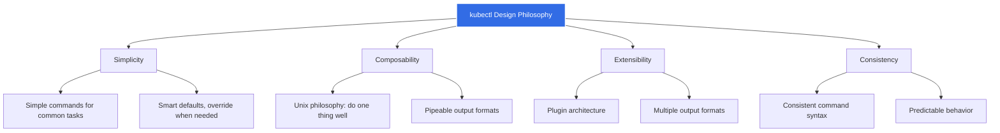
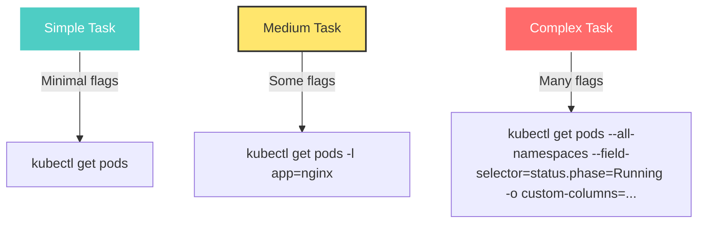
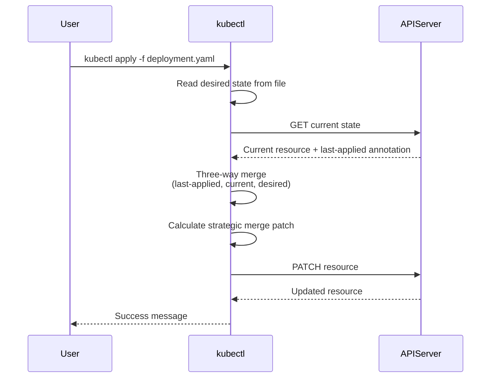
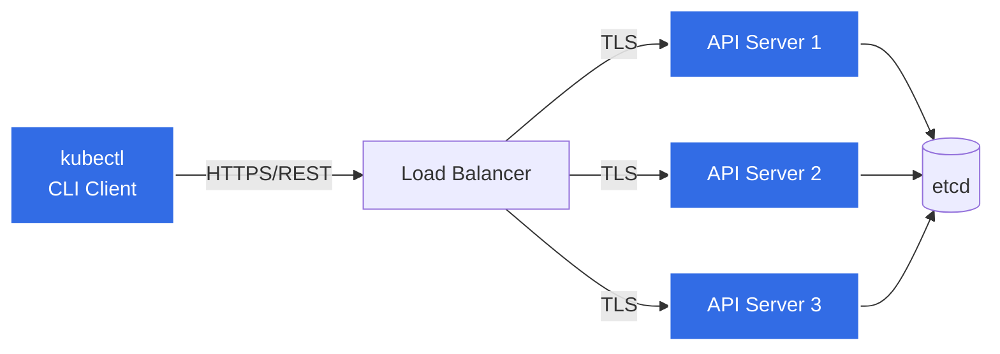
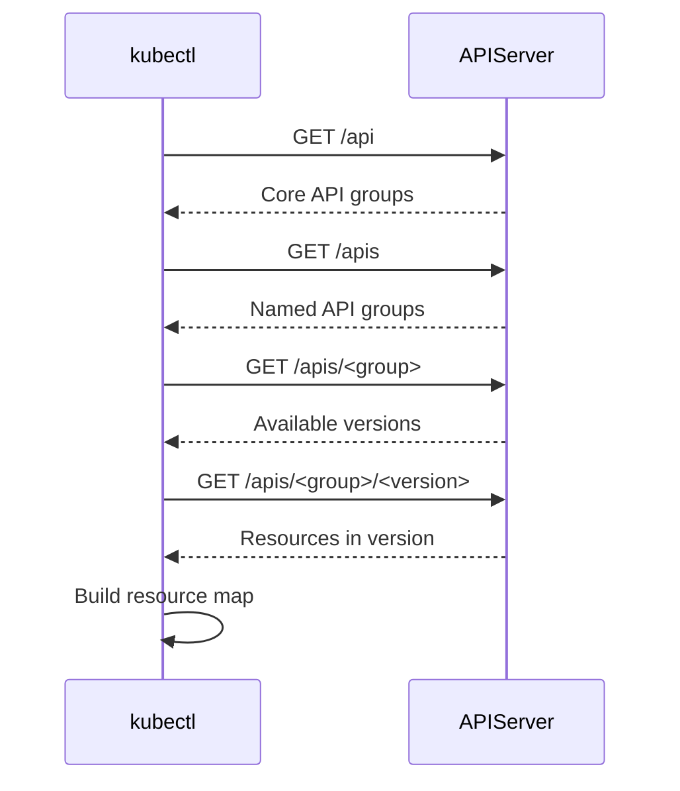
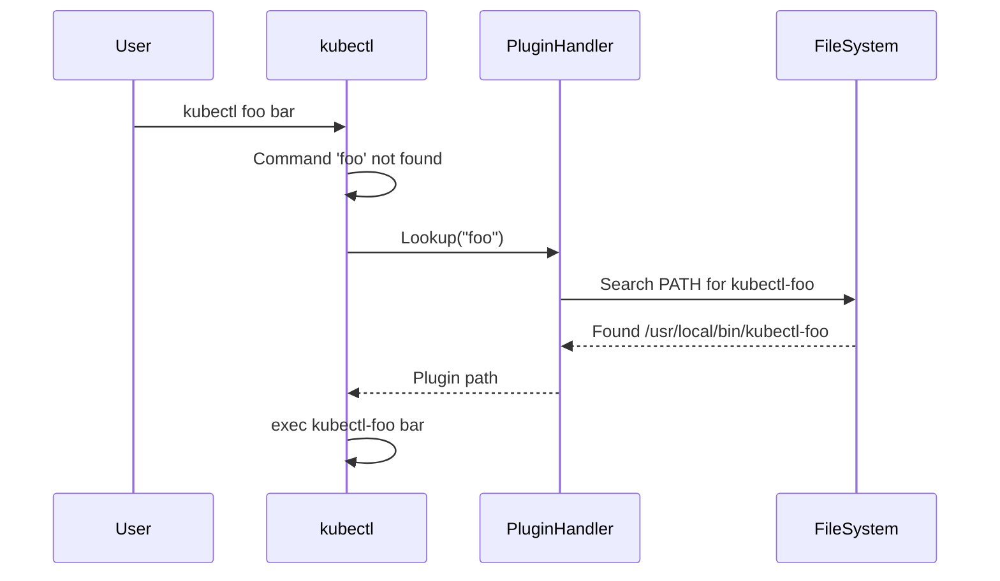

# kubectl Requirements and Design Goals

**Document Version**: 1.0
**Last Updated**: 2025-10-21
**Status**: Comprehensive Requirements Specification

---

## Table of Contents

- [Overview](#overview)
- [Design Philosophy](#design-philosophy)
- [User Experience Requirements](#user-experience-requirements)
- [Functional Requirements](#functional-requirements)
- [Technical Requirements](#technical-requirements)
- [Performance Requirements](#performance-requirements)
- [Security Requirements](#security-requirements)
- [Extensibility Requirements](#extensibility-requirements)
- [Compatibility Requirements](#compatibility-requirements)
- [Cross-Cutting Concerns](#cross-cutting-concerns)
- [Trade-offs and Decisions](#trade-offs-and-decisions)

---

## Overview

kubectl is the official command-line interface for Kubernetes, serving as the primary tool for cluster operators, developers, and administrators to interact with Kubernetes clusters. This document outlines the requirements, design goals, and architectural constraints that shape kubectl's implementation.

### Purpose

kubectl must provide:
1. **Intuitive CLI** for Kubernetes operations
2. **Complete API coverage** for all Kubernetes resources
3. **Efficient resource management** across namespaces and clusters
4. **Extensible architecture** supporting plugins and custom workflows
5. **Production-grade reliability** for mission-critical operations

### Stakeholders

| Stakeholder | Primary Needs |
|-------------|---------------|
| **Cluster Operators** | Reliable cluster management, troubleshooting, maintenance |
| **Application Developers** | Fast deployment, debugging, log access |
| **Platform Engineers** | Automation, scripting, CI/CD integration |
| **Security Engineers** | Secure authentication, RBAC, audit trails |
| **Tool Developers** | Plugin development, API client libraries |
| **Contributors** | Clear architecture, testable code, documentation |

---

## Design Philosophy

### Core Principles

kubectl's design follows these fundamental principles:



### 1. Simplicity

**Requirement**: Common operations should be simple and intuitive.

**Design Goals**:
- One-word commands for frequent operations (`get`, `create`, `delete`)
- Sensible defaults requiring minimal flags
- Human-readable output by default
- Progressive disclosure of complexity

**Examples**:
```bash
# Simple operations need minimal syntax
kubectl get pods
kubectl create deployment nginx --image=nginx
kubectl delete pod nginx

# Complex operations available when needed
kubectl get pods --all-namespaces --selector=app=nginx --field-selector=status.phase=Running -o json
```

**Code Reference**: Command registration in `staging/src/k8s.io/kubectl/pkg/cmd/cmd.go:390-463`

### 2. Composability

**Requirement**: kubectl should work well with standard Unix tools and scripting.

**Design Goals**:
- Structured output formats (JSON, YAML)
- Exit codes indicating success/failure
- Stderr for errors, stdout for data
- Support for stdin/stdout piping

**Examples**:
```bash
# Composable with Unix tools
kubectl get pods -o json | jq '.items[].metadata.name'
kubectl get pods --selector=app=nginx -o name | xargs kubectl delete

# Scriptable
if kubectl get pod nginx &>/dev/null; then
  echo "Pod exists"
fi
```

### 3. Extensibility

**Requirement**: kubectl should support customization and extension without modifying core code.

**Design Goals**:
- Plugin architecture for custom commands
- Multiple output formats via printer interface
- Custom columns and formatting
- Hook points for validation and transformation

**Code Reference**: Plugin handler in `staging/src/k8s.io/kubectl/pkg/cmd/cmd.go:178-191`

### 4. Consistency

**Requirement**: Similar operations should have similar syntax and behavior.

**Design Goals**:
- Consistent flag names across commands
- Predictable resource name patterns
- Uniform error messages
- Standard output formatting

**Examples**:
```bash
# Consistent patterns across resources
kubectl get pods
kubectl get services
kubectl get deployments

# Consistent flags
kubectl get pods -n kube-system
kubectl describe pod nginx -n default
kubectl delete deployment app -n production
```

---

## User Experience Requirements

### UX-1: Command Discoverability

**Requirement**: Users should be able to discover commands and options without external documentation.

**Implementation**:
- Grouped help output (Basic, Deploy, Cluster, Troubleshooting, Advanced, Settings)
- `kubectl --help` and `kubectl <command> --help`
- Command suggestions for typos
- Tab completion for bash, zsh, fish, PowerShell

**Code Reference**: Help system in `staging/src/k8s.io/kubectl/pkg/cmd/cmd.go:560-562`

```bash
# Grouped help output
$ kubectl --help
kubectl controls the Kubernetes cluster manager.

Find more information at: https://kubernetes.io/docs/reference/kubectl/

Basic Commands (Beginner):
  create      Create a resource from a file or from stdin
  expose      Take a replication controller, service, deployment or pod and expose it as a new Kubernetes service
  run         Run a particular image on the cluster
  set         Set specific features on objects
...
```

### UX-2: Error Messages

**Requirement**: Error messages should be clear, actionable, and help users fix problems.

**Design Goals**:
- Explain what went wrong
- Suggest how to fix it
- Include resource names and namespaces
- Distinguish client-side vs server-side errors

**Examples**:
```bash
# Clear error with context
$ kubectl get pod nonexistent
Error from server (NotFound): pods "nonexistent" not found

# Helpful suggestion
$ kubectl get po nginx
error: the server doesn't have a resource type "po"
Did you mean "pod"?

# Permission error with details
$ kubectl delete deployment nginx
Error from server (Forbidden): deployments.apps "nginx" is forbidden:
User "john" cannot delete resource "deployments" in API group "apps" in the namespace "default"
```

### UX-3: Output Formatting

**Requirement**: Support multiple output formats for different use cases.

| Use Case | Format | Command Example |
|----------|--------|-----------------|
| **Human reading** | Table (default) | `kubectl get pods` |
| **More details** | Wide table | `kubectl get pods -o wide` |
| **Full definition** | YAML | `kubectl get pod nginx -o yaml` |
| **Machine parsing** | JSON | `kubectl get pods -o json` |
| **Field extraction** | JSONPath | `kubectl get pods -o jsonpath='{.items[*].metadata.name}'` |
| **Custom table** | Custom columns | `kubectl get pods -o custom-columns=NAME:.metadata.name,STATUS:.status.phase` |
| **Templates** | Go template | `kubectl get pods -o go-template='{{range .items}}{{.metadata.name}}{{"\n"}}{{end}}'` |
| **Names only** | Name | `kubectl get pods -o name` |

**Code Reference**: Printer initialization in `staging/src/k8s.io/cli-runtime/pkg/printers/`

### UX-4: Progressive Complexity

**Requirement**: Simple tasks should be simple; complex tasks should be possible.



### UX-5: Interactive Operations

**Requirement**: Support interactive workflows where appropriate.

**Implementations**:
- `kubectl edit`: Open editor for resource modification
- `kubectl exec -it`: Interactive terminal in container
- `kubectl attach -it`: Attach to running container
- `kubectl port-forward`: Interactive port forwarding
- Confirmation prompts for destructive operations

**Code References**:
- Edit: `staging/src/k8s.io/kubectl/pkg/cmd/edit/edit.go`
- Exec: `staging/src/k8s.io/kubectl/pkg/cmd/exec/exec.go`

---

## Functional Requirements

### FUNC-1: Resource Management

**Requirement**: kubectl must support CRUD operations on all Kubernetes resources.

**Operations**:

| Operation | Commands | Example |
|-----------|----------|---------|
| **Create** | `create`, `run`, `expose` | `kubectl create deployment nginx --image=nginx` |
| **Read** | `get`, `describe`, `logs` | `kubectl get pods`, `kubectl describe pod nginx` |
| **Update** | `edit`, `patch`, `set`, `apply` | `kubectl edit deployment nginx` |
| **Delete** | `delete` | `kubectl delete pod nginx` |

**Code Reference**: Command implementations in `staging/src/k8s.io/kubectl/pkg/cmd/`

### FUNC-2: Declarative Configuration

**Requirement**: Support declarative resource management with idempotent operations.

**Features**:
- `kubectl apply`: Three-way merge for declarative updates
- `kubectl diff`: Preview changes before applying
- `kubectl apply --prune`: Remove resources not in configuration
- Server-side apply: Field management and conflict resolution

**Three-Way Merge**:


**Code Reference**: Apply implementation in `staging/src/k8s.io/kubectl/pkg/cmd/apply/apply.go`

### FUNC-3: Resource Selection

**Requirement**: Support flexible resource selection and filtering.

**Selection Methods**:

| Method | Flag | Example |
|--------|------|---------|
| **By name** | (positional) | `kubectl get pod nginx` |
| **By label** | `-l, --selector` | `kubectl get pods -l app=nginx,env=prod` |
| **By field** | `--field-selector` | `kubectl get pods --field-selector=status.phase=Running` |
| **All namespaces** | `-A, --all-namespaces` | `kubectl get pods -A` |
| **All resources** | `--all` | `kubectl delete pods --all` |
| **Multiple types** | (comma-separated) | `kubectl get pods,services` |

**Code Reference**: Resource builder in `staging/src/k8s.io/cli-runtime/pkg/resource/builder.go`

### FUNC-4: Configuration Management

**Requirement**: Manage cluster access, authentication, and contexts.

**kubeconfig Components**:
```yaml
apiVersion: v1
kind: Config
clusters:
- cluster:
    certificate-authority-data: <base64-cert>
    server: https://kubernetes.example.com:6443
  name: production
contexts:
- context:
    cluster: production
    namespace: default
    user: admin
  name: prod-admin
current-context: prod-admin
users:
- name: admin
  user:
    client-certificate-data: <base64-cert>
    client-key-data: <base64-key>
```

**Commands**:
- `kubectl config view`: View merged configuration
- `kubectl config use-context`: Switch contexts
- `kubectl config set-context`: Modify context
- `kubectl config set-credentials`: Add user credentials

**Code Reference**: Config management in `staging/src/k8s.io/client-go/tools/clientcmd/`

### FUNC-5: Debugging and Troubleshooting

**Requirement**: Provide comprehensive debugging capabilities.

**Features**:

| Feature | Command | Use Case |
|---------|---------|----------|
| **View logs** | `kubectl logs` | Debug application issues |
| **Execute commands** | `kubectl exec` | Run diagnostic commands in containers |
| **Port forwarding** | `kubectl port-forward` | Access services locally |
| **File transfer** | `kubectl cp` | Copy files to/from containers |
| **Resource details** | `kubectl describe` | Inspect resource state and events |
| **Debug containers** | `kubectl debug` | Create ephemeral debug containers |
| **Events** | `kubectl get events` | View cluster events |

**Example Debug Flow**:
```bash
# 1. Check pod status
kubectl get pod nginx -o wide

# 2. View events
kubectl describe pod nginx

# 3. Check logs
kubectl logs nginx --previous --timestamps

# 4. Execute diagnostic commands
kubectl exec nginx -- curl localhost:80

# 5. Debug with ephemeral container
kubectl debug nginx -it --image=busybox --target=nginx

# 6. Port forward for local testing
kubectl port-forward pod/nginx 8080:80
```

**Code References**:
- Logs: `staging/src/k8s.io/kubectl/pkg/cmd/logs/logs.go`
- Exec: `staging/src/k8s.io/kubectl/pkg/cmd/exec/exec.go`
- Debug: `staging/src/k8s.io/kubectl/pkg/cmd/debug/debug.go`

### FUNC-6: Namespace Operations

**Requirement**: Support multi-namespace operations and namespace management.

**Features**:
- Default namespace from context
- `-n, --namespace` flag for explicit namespace
- `--all-namespaces` for cluster-wide operations
- Namespace-scoped vs cluster-scoped resources

**Examples**:
```bash
# Use default namespace (from context)
kubectl get pods

# Explicit namespace
kubectl get pods -n kube-system

# All namespaces
kubectl get pods --all-namespaces

# Create namespace
kubectl create namespace production

# Set default namespace in context
kubectl config set-context --current --namespace=production
```

### FUNC-7: Resource Updates

**Requirement**: Support multiple update strategies for different use cases.

**Update Methods**:

| Method | Command | Use Case | Idempotent |
|--------|---------|----------|------------|
| **Apply** | `kubectl apply` | Declarative updates, GitOps | Yes |
| **Edit** | `kubectl edit` | Interactive editing | No |
| **Patch** | `kubectl patch` | Programmatic partial updates | Depends |
| **Replace** | `kubectl replace` | Complete resource replacement | No |
| **Set** | `kubectl set image` | Specific field updates | Depends |

**Patch Types**:
```bash
# Strategic merge patch (default for most resources)
kubectl patch deployment nginx --type=strategic -p '{"spec":{"replicas":3}}'

# JSON merge patch (RFC 7386)
kubectl patch deployment nginx --type=merge -p '{"spec":{"replicas":3}}'

# JSON patch (RFC 6902)
kubectl patch deployment nginx --type=json -p '[{"op":"replace","path":"/spec/replicas","value":3}]'
```

**Code References**:
- Patch: `staging/src/k8s.io/kubectl/pkg/cmd/patch/patch.go`
- Apply: `staging/src/k8s.io/kubectl/pkg/cmd/apply/apply.go`

---

## Technical Requirements

### TECH-1: Client-Server Architecture

**Requirement**: kubectl must be a thin client communicating with the API server via REST.



**Design Decisions**:
- No direct etcd access (API server is source of truth)
- Stateless client (all state in API server)
- RESTful operations (GET, POST, PUT, PATCH, DELETE)
- Standard HTTP status codes

**Code Reference**: REST client in `staging/src/k8s.io/client-go/rest/request.go`

### TECH-2: API Discovery

**Requirement**: Dynamically discover available API resources and versions.

**Discovery Process**:


**Use Cases**:
- Custom Resource Definitions (CRDs)
- API version selection
- Resource shortname resolution (`po` → `pods`)
- Resource capability discovery

**Code Reference**: Discovery client in `staging/src/k8s.io/client-go/discovery/discovery_client.go`

### TECH-3: Authentication and Authorization

**Requirement**: Support multiple authentication methods and respect RBAC.

**Authentication Methods**:

| Method | Configuration | Use Case |
|--------|---------------|----------|
| **Client Certificates** | `client-certificate`, `client-key` | Static authentication |
| **Bearer Token** | `token` | Service accounts, OIDC |
| **Basic Auth** | `username`, `password` | Legacy (deprecated) |
| **Exec Plugins** | `exec` command | Cloud provider auth, credential rotation |
| **OIDC** | Token from identity provider | SSO integration |

**Example exec plugin (AWS EKS)**:
```yaml
users:
- name: aws-user
  user:
    exec:
      apiVersion: client.authentication.k8s.io/v1beta1
      command: aws
      args:
      - eks
      - get-token
      - --cluster-name
      - my-cluster
```

**Code Reference**: Client config in `staging/src/k8s.io/client-go/tools/clientcmd/client_config.go`

### TECH-4: Resource Encoding/Decoding

**Requirement**: Convert between wire formats (JSON), storage formats (protobuf), and user formats (YAML).

**Encoding Flow**:


**Code References**:
- Scheme: `staging/src/k8s.io/kubectl/pkg/scheme/scheme.go`
- Codec: `staging/src/k8s.io/apimachinery/pkg/runtime/codec.go`

### TECH-5: Cobra Framework

**Requirement**: Use Cobra for command-line parsing and organization.

**Command Structure**:
```go
// Cobra command structure
type cobra.Command struct {
    Use   string          // "get [flags] TYPE [NAME]"
    Short string          // Brief description
    Long  string          // Detailed description
    Run   func(cmd, args) // Execution function
    Flags *FlagSet        // Command flags
}
```

**Benefits**:
- Automatic help generation
- Subcommand support
- Flag parsing and validation
- Shell completion
- Consistent UX

**Code Reference**: Root command in `staging/src/k8s.io/kubectl/pkg/cmd/cmd.go:306`

### TECH-6: Builder Pattern

**Requirement**: Use builder pattern for flexible resource queries.

**Builder API**:
```go
result := f.NewBuilder().
    Unstructured().
    NamespaceParam(namespace).
    FilenameParam(enforceNamespace, &FilenameOptions{Filenames: filenames}).
    LabelSelectorParam(selector).
    FieldSelectorParam(fieldSelector).
    RequestChunksOf(chunkSize).
    ResourceTypeOrNameArgs(true, args...).
    ContinueOnError().
    Latest().
    Flatten().
    Do()
```

**Benefits**:
- Fluent API
- Flexible configuration
- Lazy evaluation
- Testability

**Code Reference**: Builder in `staging/src/k8s.io/cli-runtime/pkg/resource/builder.go`

---

## Performance Requirements

### PERF-1: Response Time

**Requirement**: kubectl operations should have acceptable latency.

| Operation | Target Latency | Notes |
|-----------|----------------|-------|
| **Simple get** | < 100ms | Single resource by name |
| **List resources** | < 500ms | Namespace-scoped list |
| **Cluster-wide list** | < 2s | All namespaces |
| **Apply small config** | < 500ms | Single resource update |
| **Apply large config** | < 5s | Multiple resources |

**Optimization Strategies**:
- Client-side caching of discovery data
- Request chunking for large lists
- Compression for large payloads
- Connection reuse (HTTP keep-alive)

### PERF-2: Scalability

**Requirement**: kubectl must work efficiently with large clusters.

**Scale Targets**:
- 5,000 nodes
- 150,000 pods
- 50,000 services
- 100 namespaces

**Techniques**:
- Pagination for list operations
- Label selectors to reduce result sets
- Field selectors for server-side filtering
- Watch for real-time updates instead of polling

**Example**:
```bash
# Pagination with chunking
kubectl get pods --chunk-size=500

# Server-side filtering
kubectl get pods --field-selector=spec.nodeName=node-1

# Label-based reduction
kubectl get pods -l tier=frontend
```

### PERF-3: Memory Footprint

**Requirement**: kubectl should have reasonable memory usage.

**Targets**:
- Base memory: < 50 MB
- Large list operation: < 500 MB
- No memory leaks in long-running operations (watch, port-forward)

**Strategies**:
- Streaming for large responses
- Bounded buffers for logs
- Incremental processing of lists

---

## Security Requirements

### SEC-1: Credential Protection

**Requirement**: Protect sensitive authentication data.

**Requirements**:
- Never log credentials
- Secure file permissions on kubeconfig (0600)
- Support for credential plugins (avoid storing credentials)
- Warn on insecure configurations

**Code Reference**: Config loading in `staging/src/k8s.io/client-go/tools/clientcmd/loader.go`

### SEC-2: TLS/HTTPS

**Requirement**: All communication must be encrypted.

**Requirements**:
- TLS 1.2+ for API communication
- Certificate validation by default
- Support for custom CA bundles
- `--insecure-skip-tls-verify` flag (with warnings)

### SEC-3: RBAC Compliance

**Requirement**: Respect Kubernetes RBAC policies.

**Behavior**:
- Return clear permission errors
- No privilege escalation
- Audit logging support
- Impersonation support (`--as`, `--as-group`)

**Examples**:
```bash
# Impersonate user
kubectl get pods --as=john --as-group=developers

# Check permissions
kubectl auth can-i delete deployments --namespace=production
```

### SEC-4: Input Validation

**Requirement**: Validate all user input to prevent injection attacks.

**Validations**:
- Resource name validation (DNS subdomain rules)
- Label/annotation key/value validation
- Namespace name validation
- YAML/JSON parsing with limits

**Code Reference**: Validation in `staging/src/k8s.io/kubectl/pkg/validation/validation.go`

---

## Extensibility Requirements

### EXT-1: Plugin Architecture

**Requirement**: Support external plugins as first-class kubectl commands.

**Plugin Discovery**:


**Plugin Requirements**:
- Executable named `kubectl-<plugin>`
- In PATH
- Receives remaining args
- Inherits environment (KUBECONFIG, etc.)

**Code Reference**: Plugin handler in `staging/src/k8s.io/kubectl/pkg/cmd/cmd.go:178-303`

### EXT-2: Custom Printers

**Requirement**: Support custom output formats via printer interface.

**Printer Interface**:
```go
type ResourcePrinter interface {
    PrintObj(obj runtime.Object, w io.Writer) error
}
```

**Built-in Printers**:
- TablePrinter
- YAMLPrinter
- JSONPrinter
- JSONPathPrinter
- CustomColumnsPrinter
- GoTemplatePrinter

**Code Reference**: Printers in `staging/src/k8s.io/cli-runtime/pkg/printers/`

### EXT-3: Custom Resources

**Requirement**: Support Custom Resource Definitions (CRDs) transparently.

**Requirements**:
- Automatic discovery of CRDs
- Same commands work for CRDs
- Custom columns from CRD spec
- Printer columns from CRD

**Example**:
```bash
# Works the same as built-in resources
kubectl get crontabs
kubectl describe crontab my-cron
kubectl delete crontab my-cron

# Custom columns from CRD spec
kubectl get crontabs -o wide
```

---

## Compatibility Requirements

### COMPAT-1: API Version Skew

**Requirement**: kubectl must work with multiple API server versions.

**Support Matrix**:
- kubectl N works with API server N-1, N, N+1
- Graceful degradation for unavailable features
- Feature detection via API discovery

**Example**:
```
kubectl v1.28 ← → API server v1.27, v1.28, v1.29
```

### COMPAT-2: Platform Support

**Requirement**: kubectl must run on multiple operating systems and architectures.

**Platforms**:
- Linux (amd64, arm64, arm)
- macOS (amd64, arm64)
- Windows (amd64)

### COMPAT-3: Backward Compatibility

**Requirement**: Maintain backward compatibility for stable commands.

**Stability Levels**:
- **GA commands**: No breaking changes
- **Beta commands**: May change with notice
- **Alpha commands**: May change without notice

**Deprecation Policy**:
- Deprecation notice for 2 releases
- Removal after deprecation period
- Migration guide provided

---

## Cross-Cutting Concerns

### CROSS-1: Logging and Debugging

**Requirement**: Provide debugging capabilities for troubleshooting.

**Verbosity Levels**:
```bash
kubectl get pods -v=0  # No logs (default)
kubectl get pods -v=1  # Request method and URL
kubectl get pods -v=2  # Request/response headers
kubectl get pods -v=6  # Request/response bodies
kubectl get pods -v=8  # Full request/response with metadata
```

**Code Reference**: Logging setup in `cmd/kubectl/kubectl.go:38`

### CROSS-2: Testing

**Requirement**: Comprehensive testing at multiple levels.

**Test Types**:
- **Unit tests**: Individual functions and methods
- **Integration tests**: kubectl ↔ API server
- **E2E tests**: Real cluster scenarios
- **Table tests**: Multiple test cases

### CROSS-3: Documentation

**Requirement**: Comprehensive, accurate, accessible documentation.

**Documentation Types**:
- Command help (`--help`)
- User guides (kubernetes.io)
- API documentation (godoc)
- Architecture docs (this document)

### CROSS-4: Internationalization (i18n)

**Requirement**: Support localized messages.

**Implementation**:
- Message templates
- Translation files
- Locale detection

**Code Reference**: i18n in `staging/src/k8s.io/kubectl/pkg/util/i18n/i18n.go`

---

## Trade-offs and Decisions

### Decision 1: Client-Side vs Server-Side Logic

**Decision**: Keep kubectl as a thin client; push logic to API server when possible.

**Rationale**:
- Easier to update server-side logic
- Consistent behavior across clients
- Better security (validation, authorization)

**Exceptions**:
- Client-side validation for fast feedback
- Output formatting (printer logic)
- Configuration merging

### Decision 2: Declarative vs Imperative

**Decision**: Support both paradigms.

**Rationale**:
- Imperative for quick tasks and learning
- Declarative for production and GitOps
- Different users, different needs

### Decision 3: Plugin Architecture

**Decision**: Use exec-based plugins rather than compiled-in extensions.

**Pros**:
- No recompilation needed
- Any language can be used
- Clear separation of concerns

**Cons**:
- Slower startup (exec overhead)
- Less type safety
- Distribution challenges

**Rationale**: Flexibility and ease of extension outweigh performance concerns.

### Decision 4: Multiple Output Formats

**Decision**: Support many output formats via printer interface.

**Rationale**:
- Different users, different needs (humans vs machines)
- Composability with other tools
- Extensibility for custom formats

**Trade-off**: More complexity in printer architecture.

### Decision 5: Configuration Precedence

**Decision**: Command-line flags override environment, which overrides config file.

**Rationale**:
- Follows Unix conventions
- Allows temporary overrides
- Predictable behavior

**Order** (highest to lowest):
1. Command-line flags
2. Environment variables
3. Config file
4. In-cluster config

---

## Requirements Summary

### Must Have (P0)

- ✅ Complete CRUD operations for all resources
- ✅ Declarative apply with three-way merge
- ✅ Multiple output formats (JSON, YAML, table)
- ✅ kubeconfig management
- ✅ Plugin architecture
- ✅ TLS/HTTPS communication
- ✅ RBAC compliance
- ✅ Cross-platform support (Linux, macOS, Windows)
- ✅ API version skew support (N-1, N, N+1)

### Should Have (P1)

- ✅ Advanced selectors (label, field)
- ✅ Custom columns and JSONPath
- ✅ Streaming operations (logs, exec, port-forward)
- ✅ Dry-run capabilities
- ✅ Diff before apply
- ✅ Prune for apply
- ✅ Shell completion
- ✅ Client-side caching

### Could Have (P2)

- ⚠️ Interactive editors
- ⚠️ Diff viewers
- ⚠️ Progress indicators
- ⚠️ Colored output
- ⚠️ Resource usage display
- ⚠️ Bulk operations

### Won't Have

- ❌ Direct etcd access
- ❌ Built-in resource scheduling logic
- ❌ Controller functionality
- ❌ Admission control
- ❌ Cluster bootstrap/installation

---

## Related Documents

- **[02-FUNCTIONAL-SPEC.md](02-FUNCTIONAL-SPEC.md)**: Detailed functional specifications
- **[GLOSSARY.md](GLOSSARY.md)**: Terminology reference
- **[high-level/01-system-overview.md](high-level/01-system-overview.md)**: Architecture overview
- **[high-level/02-command-architecture.md](high-level/02-command-architecture.md)**: Command structure

---

## Summary

kubectl's requirements reflect its role as the primary CLI for Kubernetes:

1. **User-Centric Design**: Simplicity for common tasks, power for complex operations
2. **Architectural Constraints**: Thin client, REST API communication, API server as source of truth
3. **Extensibility**: Plugins, custom output formats, CRD support
4. **Production-Grade**: Security, performance, reliability, compatibility
5. **Community-Driven**: Open source, contributor-friendly, well-documented

These requirements guide all architectural and implementation decisions, ensuring kubectl remains the trusted, powerful, and flexible tool for Kubernetes operations.

---

**Next Steps**: Read [02-FUNCTIONAL-SPEC.md](02-FUNCTIONAL-SPEC.md) to understand how these requirements translate into specific functionality.

**Last Updated**: 2025-10-21
**Document Version**: 1.0
**Maintainer**: SIG CLI
