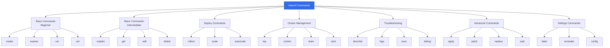
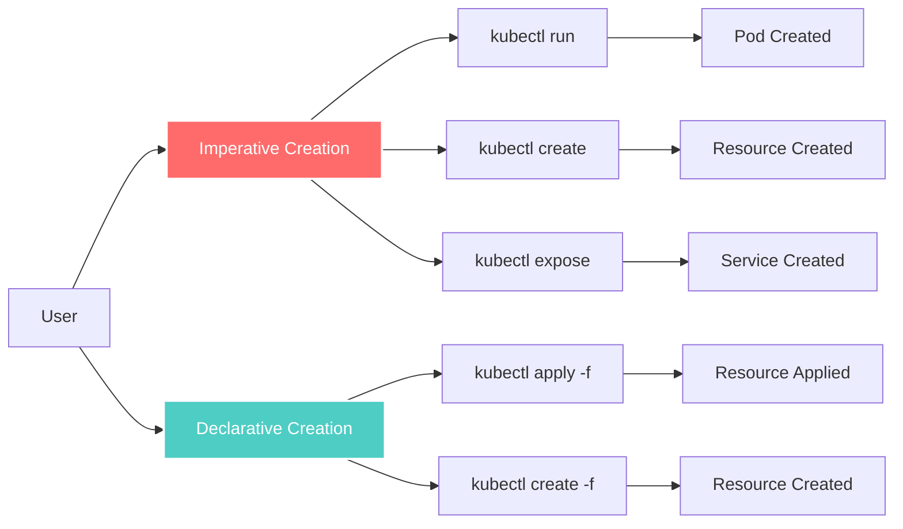
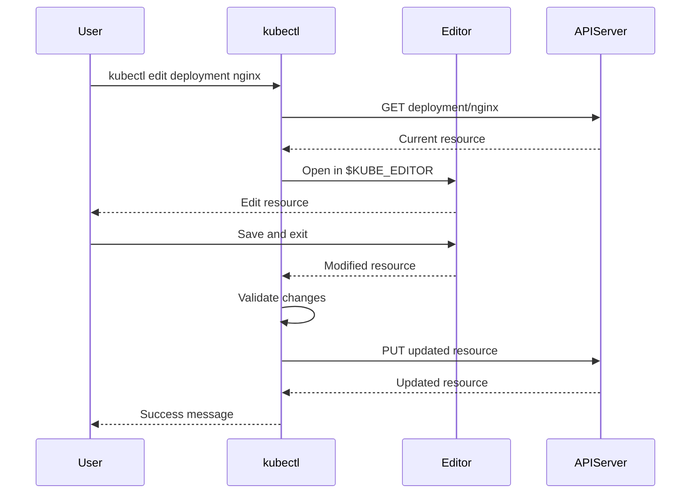
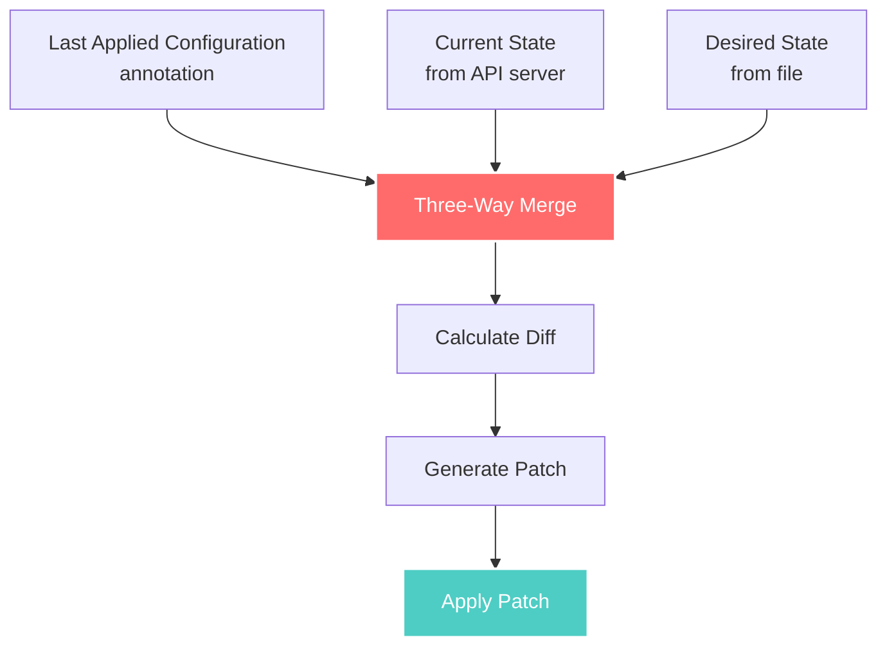
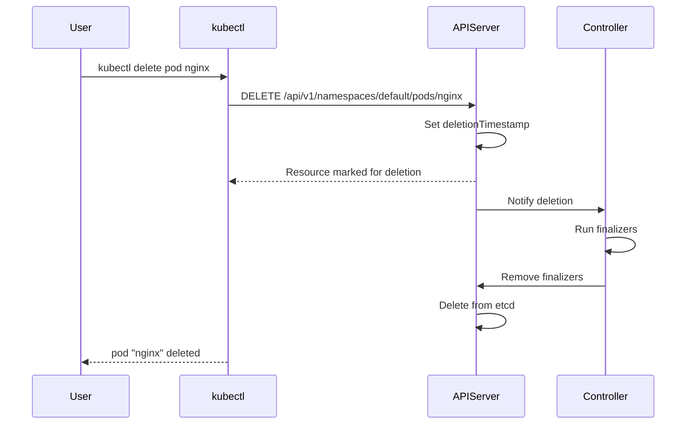
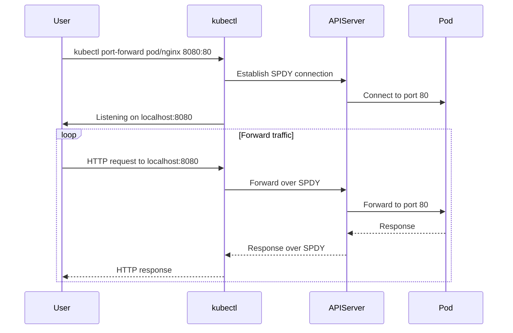
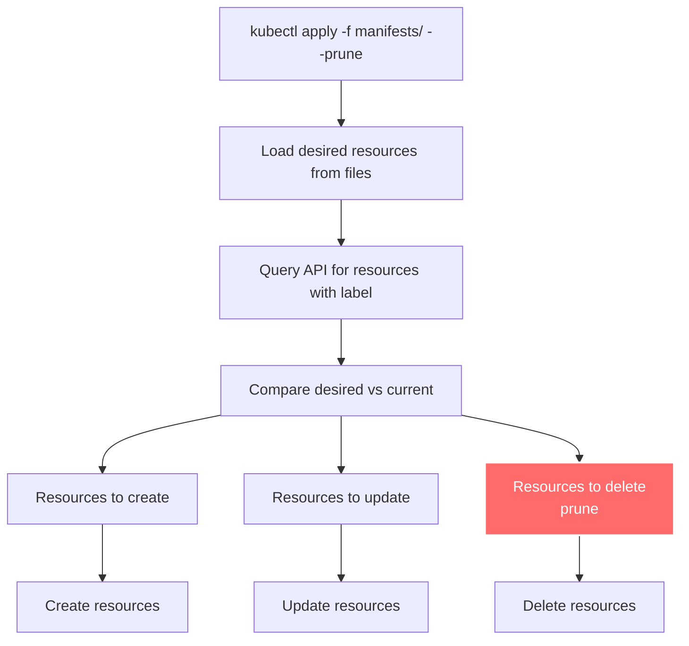
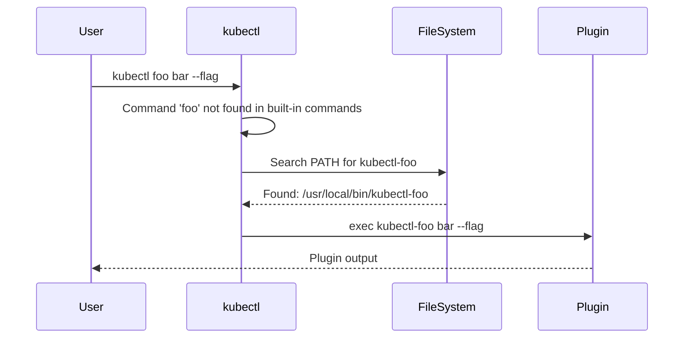

# kubectl Functional Specification

**Document Version**: 1.0
**Last Updated**: 2025-10-21
**Status**: Comprehensive Functional Specification

---

## Table of Contents

- [Overview](#overview)
- [Command Categories](#command-categories)
- [Resource Management](#resource-management)
- [Configuration Management](#configuration-management)
- [Output Formatting](#output-formatting)
- [Debugging and Troubleshooting](#debugging-and-troubleshooting)
- [Advanced Operations](#advanced-operations)
- [Plugin System](#plugin-system)
- [Batch Operations](#batch-operations)
- [Resource Lifecycle](#resource-lifecycle)

---

## Overview

This document provides a comprehensive functional specification for kubectl, detailing what kubectl does, how commands work, and the complete feature set available to users.

### Command-Line Syntax

kubectl follows a consistent command-line syntax:

```
kubectl [command] [TYPE] [NAME] [flags]
```

**Components**:
- **command**: The operation (get, create, apply, delete, etc.)
- **TYPE**: Resource type (pod, service, deployment, etc.)
- **NAME**: Resource name (optional, supports patterns)
- **flags**: Options to modify behavior

**Examples**:
```bash
kubectl get pods                           # List all pods
kubectl get pod nginx                      # Get specific pod
kubectl delete deployment app              # Delete deployment
kubectl apply -f deployment.yaml           # Apply from file
kubectl get pods -n kube-system -o yaml    # With namespace and output format
```

---

## Command Categories

kubectl organizes commands into six logical categories:



**Code Reference**: Command groups defined in `staging/src/k8s.io/kubectl/pkg/cmd/cmd.go:390-463`

### Basic Commands (Beginner)

Commands for users new to Kubernetes:

| Command | Purpose | Example |
|---------|---------|---------|
| **create** | Create resource from file or flags | `kubectl create deployment nginx --image=nginx` |
| **expose** | Expose resource as service | `kubectl expose deployment nginx --port=80` |
| **run** | Run image in pod | `kubectl run nginx --image=nginx` |
| **set** | Set specific features | `kubectl set image deployment/nginx nginx=nginx:1.20` |

**Code References**:
- create: `staging/src/k8s.io/kubectl/pkg/cmd/create/create.go`
- expose: `staging/src/k8s.io/kubectl/pkg/cmd/expose/expose.go`
- run: `staging/src/k8s.io/kubectl/pkg/cmd/run/run.go`
- set: `staging/src/k8s.io/kubectl/pkg/cmd/set/set.go`

### Basic Commands (Intermediate)

Commands for users comfortable with Kubernetes:

| Command | Purpose | Example |
|---------|---------|---------|
| **explain** | Documentation for resources | `kubectl explain pod.spec.containers` |
| **get** | Display resources | `kubectl get pods -o wide` |
| **edit** | Edit resource in editor | `kubectl edit deployment nginx` |
| **delete** | Delete resources | `kubectl delete pod nginx` |

**Code References**:
- explain: `staging/src/k8s.io/kubectl/pkg/cmd/explain/explain.go`
- get: `staging/src/k8s.io/kubectl/pkg/cmd/get/get.go`
- edit: `staging/src/k8s.io/kubectl/pkg/cmd/edit/edit.go`
- delete: `staging/src/k8s.io/kubectl/pkg/cmd/delete/delete.go`

### Deploy Commands

Commands for deploying and managing applications:

| Command | Purpose | Example |
|---------|---------|---------|
| **rollout** | Manage rollouts | `kubectl rollout status deployment/nginx` |
| **scale** | Scale resources | `kubectl scale deployment nginx --replicas=3` |
| **autoscale** | Configure autoscaling | `kubectl autoscale deployment nginx --min=2 --max=10 --cpu-percent=80` |

**Code References**:
- rollout: `staging/src/k8s.io/kubectl/pkg/cmd/rollout/rollout.go`
- scale: `staging/src/k8s.io/kubectl/pkg/cmd/scale/scale.go`
- autoscale: `staging/src/k8s.io/kubectl/pkg/cmd/autoscale/autoscale.go`

### Cluster Management Commands

Commands for managing the cluster infrastructure:

| Command | Purpose | Example |
|---------|---------|---------|
| **cluster-info** | Display cluster information | `kubectl cluster-info` |
| **top** | Resource usage | `kubectl top nodes` |
| **cordon** | Mark node unschedulable | `kubectl cordon node-1` |
| **uncordon** | Mark node schedulable | `kubectl uncordon node-1` |
| **drain** | Drain node for maintenance | `kubectl drain node-1 --ignore-daemonsets` |
| **taint** | Update taints on nodes | `kubectl taint nodes node-1 key=value:NoSchedule` |

**Code References**:
- top: `staging/src/k8s.io/kubectl/pkg/cmd/top/top.go`
- drain: `staging/src/k8s.io/kubectl/pkg/cmd/drain/drain.go`
- taint: `staging/src/k8s.io/kubectl/pkg/cmd/taint/taint.go`

### Troubleshooting Commands

Commands for debugging and diagnosing issues:

| Command | Purpose | Example |
|---------|---------|---------|
| **describe** | Show detailed resource info | `kubectl describe pod nginx` |
| **logs** | Print container logs | `kubectl logs nginx -f` |
| **attach** | Attach to running container | `kubectl attach nginx -it` |
| **exec** | Execute command in container | `kubectl exec nginx -- ls /` |
| **port-forward** | Forward local port to pod | `kubectl port-forward pod/nginx 8080:80` |
| **proxy** | Run proxy to API server | `kubectl proxy --port=8080` |
| **cp** | Copy files to/from containers | `kubectl cp nginx:/tmp/file ./file` |
| **auth** | Inspect authorization | `kubectl auth can-i create deployments` |
| **debug** | Create debugging session | `kubectl debug pod/nginx -it --image=busybox` |
| **events** | List events | `kubectl events --for pod/nginx` |

**Code References**:
- describe: `staging/src/k8s.io/kubectl/pkg/cmd/describe/describe.go`
- logs: `staging/src/k8s.io/kubectl/pkg/cmd/logs/logs.go`
- exec: `staging/src/k8s.io/kubectl/pkg/cmd/exec/exec.go`
- debug: `staging/src/k8s.io/kubectl/pkg/cmd/debug/debug.go`

### Advanced Commands

Commands for sophisticated resource management:

| Command | Purpose | Example |
|---------|---------|---------|
| **diff** | Show diff before applying | `kubectl diff -f deployment.yaml` |
| **apply** | Apply configuration | `kubectl apply -f deployment.yaml` |
| **patch** | Update resource fields | `kubectl patch deployment nginx -p '{"spec":{"replicas":3}}'` |
| **replace** | Replace resource | `kubectl replace -f deployment.yaml` |
| **wait** | Wait for condition | `kubectl wait --for=condition=Ready pod/nginx` |
| **kustomize** | Build kustomization | `kubectl kustomize ./overlays/production` |

**Code References**:
- apply: `staging/src/k8s.io/kubectl/pkg/cmd/apply/apply.go`
- patch: `staging/src/k8s.io/kubectl/pkg/cmd/patch/patch.go`
- diff: `staging/src/k8s.io/kubectl/pkg/cmd/diff/diff.go`

### Settings Commands

Commands for modifying resource metadata:

| Command | Purpose | Example |
|---------|---------|---------|
| **label** | Update labels | `kubectl label pods nginx env=prod` |
| **annotate** | Update annotations | `kubectl annotate pods nginx description="web server"` |
| **completion** | Generate shell completion | `kubectl completion bash > ~/.kubectl_completion` |

**Code References**:
- label: `staging/src/k8s.io/kubectl/pkg/cmd/label/label.go`
- annotate: `staging/src/k8s.io/kubectl/pkg/cmd/annotate/annotate.go`

---

## Resource Management

### Resource Types

kubectl works with all Kubernetes resource types:

**Core Resources** (api/v1):
- Pods, Services, ConfigMaps, Secrets
- PersistentVolumes, PersistentVolumeClaims
- Namespaces, Nodes, Events
- ServiceAccounts, ResourceQuotas, LimitRanges

**Workload Resources** (apps/v1):
- Deployments, ReplicaSets, StatefulSets
- DaemonSets, Jobs, CronJobs

**Network Resources**:
- Ingress, NetworkPolicy, IngressClass

**Storage Resources**:
- StorageClass, VolumeAttachment, CSIDriver

**RBAC Resources** (rbac.authorization.k8s.io/v1):
- Role, ClusterRole, RoleBinding, ClusterRoleBinding

**Custom Resources**:
- Any CRD installed in the cluster

### Resource Naming

Resources can be specified in multiple ways:

```bash
# Full resource type
kubectl get pods
kubectl get services
kubectl get deployments.apps

# Short names
kubectl get po          # pods
kubectl get svc         # services
kubectl get deploy      # deployments

# API group.resource
kubectl get deployments.apps
kubectl get horizontalpodautoscalers.autoscaling
```

**Shortname Discovery**:
```bash
kubectl api-resources
```

**Code Reference**: Resource discovery in `staging/src/k8s.io/client-go/discovery/discovery_client.go`

### Resource Selection

Multiple ways to select resources:

#### By Name

```bash
# Single resource
kubectl get pod nginx

# Multiple resources by name
kubectl get pod nginx redis postgres

# All resources of type
kubectl get pods
```

#### By Label Selector

```bash
# Equality-based
kubectl get pods -l app=nginx
kubectl get pods -l env=prod,tier=frontend

# Set-based
kubectl get pods -l 'app in (nginx, redis)'
kubectl get pods -l 'env notin (dev, test)'
kubectl get pods -l 'tier'          # Has label tier
kubectl get pods -l '!tier'         # Does not have label tier
```

#### By Field Selector

```bash
# Single field
kubectl get pods --field-selector=status.phase=Running
kubectl get pods --field-selector=spec.nodeName=node-1

# Multiple fields
kubectl get pods --field-selector=status.phase=Running,spec.restartPolicy=Always
```

**Supported Fields**:
- `metadata.name`
- `metadata.namespace`
- Resource-specific fields (varies by resource type)

#### By Namespace

```bash
# Specific namespace
kubectl get pods -n kube-system

# All namespaces
kubectl get pods --all-namespaces
kubectl get pods -A

# Current namespace (from context)
kubectl get pods
```

### Resource Creation

kubectl provides multiple ways to create resources:



#### Imperative with Arguments

```bash
# Create deployment
kubectl create deployment nginx --image=nginx:1.20 --replicas=3

# Create service
kubectl create service clusterip nginx --tcp=80:80

# Create configmap
kubectl create configmap app-config --from-literal=key1=value1 --from-file=config.txt

# Create secret
kubectl create secret generic app-secret --from-literal=password=secret123
```

**Code Reference**: Create generators in `staging/src/k8s.io/kubectl/pkg/cmd/create/`

#### Declarative with Files

```bash
# Single file
kubectl apply -f deployment.yaml

# Multiple files
kubectl apply -f deployment.yaml -f service.yaml

# Directory
kubectl apply -f ./manifests/

# Recursive directory
kubectl apply -f ./manifests/ --recursive

# URL
kubectl apply -f https://example.com/deployment.yaml

# Stdin
cat deployment.yaml | kubectl apply -f -
```

**YAML Example**:
```yaml
apiVersion: apps/v1
kind: Deployment
metadata:
  name: nginx
  labels:
    app: nginx
spec:
  replicas: 3
  selector:
    matchLabels:
      app: nginx
  template:
    metadata:
      labels:
        app: nginx
    spec:
      containers:
      - name: nginx
        image: nginx:1.20
        ports:
        - containerPort: 80
```

### Resource Reading

#### kubectl get

Display one or many resources:

```bash
# Default table output
kubectl get pods

# Wide output (more columns)
kubectl get pods -o wide

# YAML output
kubectl get pod nginx -o yaml

# JSON output
kubectl get pod nginx -o json

# Custom columns
kubectl get pods -o custom-columns=NAME:.metadata.name,STATUS:.status.phase,NODE:.spec.nodeName

# JSONPath
kubectl get pods -o jsonpath='{.items[*].metadata.name}'

# Watch for changes
kubectl get pods --watch

# Sort by field
kubectl get pods --sort-by=.metadata.creationTimestamp
```

**GetOptions Structure** (from code at `staging/src/k8s.io/kubectl/pkg/cmd/get/get.go:54-85`):
```go
type GetOptions struct {
    PrintFlags         *PrintFlags
    FilenameOptions    resource.FilenameOptions
    Raw                string
    Watch              bool
    WatchOnly          bool
    ChunkSize          int64
    LabelSelector      string
    FieldSelector      string
    AllNamespaces      bool
    Namespace          string
    Subresource        string
    SortBy             string
    ServerPrint        bool
    NoHeaders          bool
    IgnoreNotFound     bool
}
```

#### kubectl describe

Show detailed information about resources:

```bash
# Describe pod
kubectl describe pod nginx

# Describe with namespace
kubectl describe pod nginx -n kube-system

# Describe multiple resources
kubectl describe pods nginx redis

# Describe all pods
kubectl describe pods

# Describe by label
kubectl describe pods -l app=nginx
```

**Describe Output Includes**:
- Resource metadata
- Spec configuration
- Status and conditions
- Related events
- Volume information
- Container details

### Resource Updating

kubectl supports multiple update methods:

#### kubectl edit

Interactive editing with text editor:

```bash
# Edit deployment
kubectl edit deployment nginx

# Edit with specific editor
KUBE_EDITOR="vim" kubectl edit deployment nginx

# Edit service
kubectl edit service nginx
```

**Edit Flow**:


**Code Reference**: Edit implementation in `staging/src/k8s.io/kubectl/pkg/cmd/edit/edit.go`

#### kubectl patch

Programmatic partial updates:

```bash
# Strategic merge patch (default)
kubectl patch deployment nginx -p '{"spec":{"replicas":5}}'

# JSON merge patch
kubectl patch deployment nginx --type=merge -p '{"spec":{"replicas":5}}'

# JSON patch (RFC 6902)
kubectl patch deployment nginx --type=json -p '[
  {"op":"replace","path":"/spec/replicas","value":5}
]'

# Patch from file
kubectl patch deployment nginx --patch-file=patch.yaml
```

**Patch Types Comparison**:

| Type | RFC | Use Case | Example |
|------|-----|----------|---------|
| **Strategic Merge** | Custom | Kubernetes resources | Merge arrays by key |
| **JSON Merge** | RFC 7386 | Generic JSON | Replace fields |
| **JSON Patch** | RFC 6902 | Precise operations | Add/Remove/Replace |

**Code Reference**: Patch implementation in `staging/src/k8s.io/kubectl/pkg/cmd/patch/patch.go`

#### kubectl apply

Declarative updates with three-way merge:

```bash
# Apply single file
kubectl apply -f deployment.yaml

# Apply with namespace
kubectl apply -f deployment.yaml -n production

# Apply directory
kubectl apply -f ./manifests/

# Dry run
kubectl apply -f deployment.yaml --dry-run=client
kubectl apply -f deployment.yaml --dry-run=server

# Server-side apply
kubectl apply -f deployment.yaml --server-side

# Apply with field manager
kubectl apply -f deployment.yaml --field-manager=my-tool

# Force conflicts
kubectl apply -f deployment.yaml --force-conflicts
```

**Apply Algorithm** (three-way merge):


**Code Reference**: Apply implementation in `staging/src/k8s.io/kubectl/pkg/cmd/apply/apply.go`

#### kubectl replace

Complete resource replacement:

```bash
# Replace from file
kubectl replace -f deployment.yaml

# Force replace (delete and recreate)
kubectl replace -f deployment.yaml --force

# Replace from stdin
cat deployment.yaml | kubectl replace -f -
```

**Apply vs Replace**:

| Aspect | apply | replace |
|--------|-------|---------|
| **Create if missing** | Yes | No (error) |
| **Partial updates** | Yes | No (full replacement) |
| **Conflict handling** | Three-way merge | Overwrite |
| **Idempotent** | Yes | Yes |
| **Best for** | Declarative management | Full replacement |

### Resource Deletion

```bash
# Delete by name
kubectl delete pod nginx

# Delete from file
kubectl delete -f deployment.yaml

# Delete all of type
kubectl delete pods --all

# Delete by label
kubectl delete pods -l app=nginx

# Delete with grace period
kubectl delete pod nginx --grace-period=30

# Force delete (immediate)
kubectl delete pod nginx --force --grace-period=0

# Delete and wait
kubectl delete pod nginx --wait=true

# Delete without waiting
kubectl delete pod nginx --wait=false
```

**Deletion Flow**:


**Code Reference**: Delete implementation in `staging/src/k8s.io/kubectl/pkg/cmd/delete/delete.go`

---

## Configuration Management

### kubeconfig File

kubectl uses kubeconfig for cluster access configuration:

**Default Locations** (in order of precedence):
1. `--kubeconfig` flag
2. `KUBECONFIG` environment variable
3. `~/.kube/config`

**Structure**:
```yaml
apiVersion: v1
kind: Config
current-context: production

clusters:
- cluster:
    certificate-authority: /path/to/ca.crt
    server: https://kubernetes.example.com:6443
  name: production
- cluster:
    insecure-skip-tls-verify: true
    server: https://dev.example.com:6443
  name: development

contexts:
- context:
    cluster: production
    namespace: default
    user: admin
  name: production
- context:
    cluster: development
    namespace: default
    user: dev-user
  name: development

users:
- name: admin
  user:
    client-certificate: /path/to/admin.crt
    client-key: /path/to/admin.key
- name: dev-user
  user:
    token: eyJhbGciOiJSUzI1NiIsImtpZCI6IiJ9...
```

### kubectl config Commands

Manage kubeconfig configuration:

```bash
# View merged config
kubectl config view

# View raw config (without merging)
kubectl config view --raw

# Get current context
kubectl config current-context

# List contexts
kubectl config get-contexts

# Use context
kubectl config use-context production

# Set cluster
kubectl config set-cluster production \
  --server=https://kubernetes.example.com:6443 \
  --certificate-authority=/path/to/ca.crt

# Set credentials
kubectl config set-credentials admin \
  --client-certificate=/path/to/admin.crt \
  --client-key=/path/to/admin.key

# Set context
kubectl config set-context production \
  --cluster=production \
  --user=admin \
  --namespace=default

# Delete context
kubectl config delete-context development

# Rename context
kubectl config rename-context old-name new-name

# Set default namespace for context
kubectl config set-context --current --namespace=kube-system
```

**Code Reference**: Config commands in `staging/src/k8s.io/kubectl/pkg/cmd/config/`

### Multiple kubeconfig Files

Merge multiple config files:

```bash
# Set KUBECONFIG to multiple files (colon-separated on Unix, semicolon on Windows)
export KUBECONFIG=~/.kube/config:~/.kube/config-dev:~/.kube/config-prod

# View merged configuration
kubectl config view
```

---

## Output Formatting

kubectl supports multiple output formats via the printer architecture:

### Output Format Comparison

| Format | Flag | Description | Use Case |
|--------|------|-------------|----------|
| **Table** | (default) | Human-readable table | Interactive use |
| **Wide** | `-o wide` | Table with more columns | More details |
| **YAML** | `-o yaml` | YAML representation | Full resource definition |
| **JSON** | `-o json` | JSON representation | Machine parsing |
| **Name** | `-o name` | Resource name only | Piping to other commands |
| **JSONPath** | `-o jsonpath=<expr>` | Extract specific fields | Scripting |
| **Custom Columns** | `-o custom-columns=<spec>` | Custom table columns | Custom views |
| **Go Template** | `-o go-template=<tmpl>` | Go template formatting | Complex formatting |
| **Go Template File** | `-o go-template-file=<file>` | Template from file | Reusable templates |

### Table Output

Default human-readable format:

```bash
$ kubectl get pods
NAME                     READY   STATUS    RESTARTS   AGE
nginx-6799fc88d8-4jq5p   1/1     Running   0          5m
nginx-6799fc88d8-9xk7l   1/1     Running   0          5m
nginx-6799fc88d8-zq8h2   1/1     Running   0          5m
```

**Wide Output**:
```bash
$ kubectl get pods -o wide
NAME                     READY   STATUS    RESTARTS   AGE   IP           NODE     NOMINATED NODE   READINESS GATES
nginx-6799fc88d8-4jq5p   1/1     Running   0          5m    10.244.1.5   node-1   <none>           <none>
nginx-6799fc88d8-9xk7l   1/1     Running   0          5m    10.244.2.3   node-2   <none>           <none>
nginx-6799fc88d8-zq8h2   1/1     Running   0          5m    10.244.1.6   node-1   <none>           <none>
```

### Custom Columns

Define custom table columns:

```bash
# Basic custom columns
kubectl get pods -o custom-columns=NAME:.metadata.name,STATUS:.status.phase

# Multiple columns
kubectl get pods -o custom-columns=\
NAME:.metadata.name,\
STATUS:.status.phase,\
NODE:.spec.nodeName,\
IP:.status.podIP

# Custom columns from file
kubectl get pods -o custom-columns-file=columns.txt
```

**columns.txt**:
```
NAME                    STATUS              NODE
metadata.name           status.phase        spec.nodeName
```

**Output**:
```
NAME                     STATUS    NODE
nginx-6799fc88d8-4jq5p   Running   node-1
nginx-6799fc88d8-9xk7l   Running   node-2
nginx-6799fc88d8-zq8h2   Running   node-1
```

### JSONPath

Extract specific fields using JSONPath expressions:

```bash
# Single field
kubectl get pods -o jsonpath='{.items[0].metadata.name}'

# Multiple fields
kubectl get pods -o jsonpath='{range .items[*]}{.metadata.name}{"\t"}{.status.phase}{"\n"}{end}'

# Specific array element
kubectl get pods -o jsonpath='{.items[0].spec.containers[0].image}'

# All pod IPs
kubectl get pods -o jsonpath='{.items[*].status.podIP}'

# Conditional selection
kubectl get pods -o jsonpath='{.items[?(@.status.phase=="Running")].metadata.name}'
```

**Common JSONPath Patterns**:
```bash
# Get all container images
kubectl get pods -o jsonpath='{.items[*].spec.containers[*].image}'

# Get pod names and IPs
kubectl get pods -o jsonpath='{range .items[*]}{.metadata.name}{"\t"}{.status.podIP}{"\n"}{end}'

# Get node names
kubectl get pods -o jsonpath='{.items[*].spec.nodeName}'
```

### Go Templates

Use Go template for complex formatting:

```bash
# Basic template
kubectl get pods -o go-template='{{range .items}}{{.metadata.name}}{{"\n"}}{{end}}'

# With functions
kubectl get pods -o go-template='{{range .items}}{{.metadata.name | upper}}{{"\n"}}{{end}}'

# Conditional logic
kubectl get pods -o go-template='{{range .items}}{{if eq .status.phase "Running"}}{{.metadata.name}}{{"\n"}}{{end}}{{end}}'

# Template from file
kubectl get pods -o go-template-file=template.tmpl
```

**template.tmpl**:
```
{{range .items}}
Pod: {{.metadata.name}}
  Status: {{.status.phase}}
  IP: {{.status.podIP}}
  Node: {{.spec.nodeName}}
{{end}}
```

**Code Reference**: Printers in `staging/src/k8s.io/cli-runtime/pkg/printers/`

---

## Debugging and Troubleshooting

### kubectl logs

Stream or retrieve container logs:

```bash
# Basic logs
kubectl logs pod-name

# Specific container in pod
kubectl logs pod-name -c container-name

# Follow logs (stream)
kubectl logs pod-name -f

# Tail last N lines
kubectl logs pod-name --tail=100

# Logs since timestamp
kubectl logs pod-name --since=1h
kubectl logs pod-name --since-time=2024-01-01T00:00:00Z

# Previous container instance (after crash)
kubectl logs pod-name --previous

# All containers in pod
kubectl logs pod-name --all-containers=true

# With timestamps
kubectl logs pod-name --timestamps

# Limit bytes
kubectl logs pod-name --limit-bytes=1048576
```

**Code Reference**: Logs implementation in `staging/src/k8s.io/kubectl/pkg/cmd/logs/logs.go`

### kubectl exec

Execute commands in containers:

```bash
# Execute single command
kubectl exec pod-name -- ls /

# Execute with multiple args
kubectl exec pod-name -- ls -la /var/log

# Interactive shell
kubectl exec -it pod-name -- /bin/bash

# Specific container
kubectl exec -it pod-name -c container-name -- /bin/sh

# Execute without allocating TTY
kubectl exec pod-name -- curl localhost:8080

# Set environment variables
kubectl exec pod-name -- env VAR=value command
```

**Code Reference**: Exec implementation in `staging/src/k8s.io/kubectl/pkg/cmd/exec/exec.go`

### kubectl port-forward

Forward local port to pod:

```bash
# Forward local port 8080 to pod port 80
kubectl port-forward pod/nginx 8080:80

# Random local port
kubectl port-forward pod/nginx :80

# Multiple ports
kubectl port-forward pod/nginx 8080:80 8443:443

# Listen on specific address
kubectl port-forward --address=0.0.0.0 pod/nginx 8080:80

# Port forward to service
kubectl port-forward service/nginx 8080:80

# Port forward to deployment
kubectl port-forward deployment/nginx 8080:80
```

**Port Forward Flow**:


**Code Reference**: Port-forward implementation in `staging/src/k8s.io/kubectl/pkg/cmd/portforward/portforward.go`

### kubectl debug

Create debugging sessions:

```bash
# Debug pod with ephemeral container
kubectl debug pod-name -it --image=busybox

# Debug with specific target container
kubectl debug pod-name -it --image=busybox --target=container-name

# Debug node by creating pod
kubectl debug node/node-1 -it --image=ubuntu

# Copy pod and debug
kubectl debug pod-name --copy-to=debug-pod --image=busybox

# Debug with different command
kubectl debug pod-name -it --image=busybox -- sh
```

**Code Reference**: Debug implementation in `staging/src/k8s.io/kubectl/pkg/cmd/debug/debug.go`

---

## Advanced Operations

### kubectl apply with Pruning

Remove resources not in configuration:

```bash
# Apply with prune
kubectl apply -f ./manifests/ --prune -l app=myapp

# Apply with prune allowlist
kubectl apply -f ./manifests/ --prune \
  --prune-allowlist=core/v1/ConfigMap \
  --prune-allowlist=apps/v1/Deployment
```

**Prune Flow**:


### kubectl wait

Wait for specific conditions:

```bash
# Wait for pod to be ready
kubectl wait --for=condition=Ready pod/nginx

# Wait for deletion
kubectl wait --for=delete pod/nginx

# Wait with timeout
kubectl wait --for=condition=Ready pod/nginx --timeout=60s

# Wait for multiple resources
kubectl wait --for=condition=Ready pods -l app=nginx

# Wait for deployment rollout
kubectl wait --for=condition=Available deployment/nginx

# Wait for custom conditions
kubectl wait --for=condition=Established crd/mycrd.example.com
```

### kubectl diff

Preview changes before applying:

```bash
# Diff single file
kubectl diff -f deployment.yaml

# Diff directory
kubectl diff -f ./manifests/

# Diff with server-side dry-run
kubectl diff -f deployment.yaml --server-side
```

**Diff Output**:
```diff
diff -u -N /tmp/LIVE-123/apps.v1.Deployment.default.nginx /tmp/MERGED-456/apps.v1.Deployment.default.nginx
--- /tmp/LIVE-123/apps.v1.Deployment.default.nginx
+++ /tmp/MERGED-456/apps.v1.Deployment.default.nginx
@@ -6,7 +6,7 @@
     app: nginx
   name: nginx
 spec:
-  replicas: 2
+  replicas: 3
   selector:
     matchLabels:
       app: nginx
```

---

## Plugin System

kubectl supports extensibility through plugins:

### Plugin Discovery

kubectl searches for plugins in PATH:

```bash
# Plugin naming: kubectl-<plugin-name>
# Example: kubectl-foo

# kubectl will find and execute:
/usr/local/bin/kubectl-foo
~/bin/kubectl-foo
```

**Plugin Execution**:


### Plugin Management with Krew

Krew is the plugin manager for kubectl:

```bash
# Install krew
curl -fsSLO https://github.com/kubernetes-sigs/krew/releases/latest/download/krew.tar.gz

# Install plugin
kubectl krew install ctx

# Use plugin
kubectl ctx

# List installed plugins
kubectl krew list

# Update plugins
kubectl krew update
kubectl krew upgrade
```

**Popular Plugins**:
- `kubectl ctx`: Switch contexts
- `kubectl ns`: Switch namespaces
- `kubectl tree`: Show resource hierarchy
- `kubectl neat`: Clean up resource output
- `kubectl images`: Show container images

**Code Reference**: Plugin handler in `staging/src/k8s.io/kubectl/pkg/cmd/cmd.go:178-303`

---

## Batch Operations

### Process Multiple Resources

```bash
# Multiple resources by name
kubectl get pod nginx redis postgres

# Multiple resource types
kubectl get pods,services,deployments

# All resources in namespace
kubectl get all

# Delete multiple resources
kubectl delete pod nginx redis postgres

# Delete all of type
kubectl delete pods --all
```

### Using Labels for Batch Operations

```bash
# Get all resources with label
kubectl get pods -l app=nginx

# Delete all resources with label
kubectl delete pods -l app=nginx

# Scale all deployments with label
kubectl scale deployment -l app=nginx --replicas=3
```

### From File Patterns

```bash
# Multiple files
kubectl apply -f deployment.yaml -f service.yaml -f configmap.yaml

# Glob pattern
kubectl apply -f *.yaml

# Directory
kubectl apply -f ./manifests/

# Recursive
kubectl apply -f ./manifests/ --recursive
```

---

## Resource Lifecycle

Complete lifecycle of a Deployment resource:

```mermaid
stateDiagram-v2
    [*] --> Create: kubectl create/apply
    Create --> Running: Controllers reconcile
    Running --> Update: kubectl apply/patch/edit
    Update --> Running: Rolling update
    Running --> Scale: kubectl scale
    Scale --> Running: Replicas adjusted
    Running --> Pause: kubectl rollout pause
    Pause --> Running: kubectl rollout resume
    Running --> Delete: kubectl delete
    Delete --> [*]: Resource removed

    Update --> Rollback: kubectl rollout undo
    Rollback --> Running: Previous version
```

### Complete Example

```bash
# 1. Create deployment
kubectl create deployment nginx --image=nginx:1.19 --replicas=3

# 2. Verify creation
kubectl get deployment nginx
kubectl get pods -l app=nginx

# 3. Expose as service
kubectl expose deployment nginx --port=80 --target-port=80

# 4. Scale deployment
kubectl scale deployment nginx --replicas=5

# 5. Update image
kubectl set image deployment/nginx nginx=nginx:1.20

# 6. Monitor rollout
kubectl rollout status deployment/nginx

# 7. View history
kubectl rollout history deployment/nginx

# 8. Rollback if needed
kubectl rollout undo deployment/nginx

# 9. Cleanup
kubectl delete deployment nginx
kubectl delete service nginx
```

---

## Summary

kubectl provides comprehensive functionality for:

1. **Resource Management**: CRUD operations on all Kubernetes resources
2. **Configuration**: Cluster access, authentication, contexts
3. **Output Formatting**: Multiple formats for different use cases
4. **Debugging**: Logs, exec, port-forward, debug containers
5. **Advanced Operations**: Apply, patch, diff, wait, prune
6. **Extensibility**: Plugin system for custom commands
7. **Batch Operations**: Multiple resources, labels, patterns

All operations follow consistent patterns and conventions, making kubectl both powerful and learnable.

---

## Related Documents

- **[01-REQUIREMENTS.md](01-REQUIREMENTS.md)**: Design requirements
- **[GLOSSARY.md](GLOSSARY.md)**: Terminology reference
- **[high-level/01-system-overview.md](high-level/01-system-overview.md)**: Architecture overview
- **[middle-level/02-declarative-apply.md](middle-level/02-declarative-apply.md)**: Apply deep dive

---

**Last Updated**: 2025-10-21
**Document Version**: 1.0
**Maintainer**: SIG CLI
