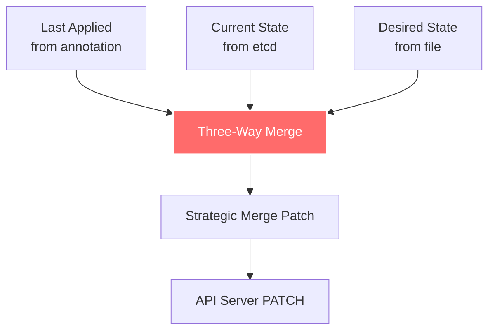

# kubectl Glossary

**Document Version**: 1.0
**Last Updated**: 2025-10-21
**Status**: Comprehensive Terminology Reference

---

## Table of Contents

- [Overview](#overview)
- [Command Terms](#command-terms)
- [Resource Terms](#resource-terms)
- [Configuration Terms](#configuration-terms)
- [Output Terms](#output-terms)
- [Apply and Patch Terms](#apply-and-patch-terms)
- [Architecture Terms](#architecture-terms)
- [Plugin Terms](#plugin-terms)
- [Authentication Terms](#authentication-terms)
- [Networking Terms](#networking-terms)
- [Operational Terms](#operational-terms)

---

## Overview

This glossary defines essential terms used throughout the kubectl architecture documentation. Terms are organized by category and include cross-references to related concepts and documentation.

**Notation**:
- **Term**: Primary definition
- *See also*: Related terms
- *Documented in*: Related documentation files
- **Code**: Source code references

---

## Command Terms

### Imperative Command

**Definition**: A kubectl command that directly tells Kubernetes what action to perform, without maintaining a declarative configuration file.

**Examples**:
```bash
kubectl create deployment nginx --image=nginx
kubectl run redis --image=redis
kubectl expose deployment nginx --port=80
kubectl delete pod nginx
```

**Characteristics**:
- Direct action specification
- Not idempotent (except delete)
- Good for quick tasks and debugging
- Difficult to track in version control

*See also*: [Declarative Command](#declarative-command), [Generator](#generator)
*Documented in*: [middle-level/01-imperative-commands.md](middle-level/01-imperative-commands.md)
**Code**: `staging/src/k8s.io/kubectl/pkg/cmd/create/`, `staging/src/k8s.io/kubectl/pkg/cmd/run/`

### Declarative Command

**Definition**: A kubectl command that describes the desired state in configuration files and lets Kubernetes reconcile the current state to match.

**Primary Command**: `kubectl apply`

**Examples**:
```bash
kubectl apply -f deployment.yaml
kubectl apply -f ./manifests/
kubectl apply -k ./overlays/production
```

**Characteristics**:
- Describes desired state
- Idempotent operations
- Version control friendly
- Best practice for production

*See also*: [Imperative Command](#imperative-command), [Apply](#apply), [Three-Way Merge](#three-way-merge)
*Documented in*: [middle-level/02-declarative-apply.md](middle-level/02-declarative-apply.md)
**Code**: `staging/src/k8s.io/kubectl/pkg/cmd/apply/apply.go`

### Apply

**Definition**: kubectl command that declaratively manages Kubernetes resources using a three-way merge algorithm.

**Syntax**:
```bash
kubectl apply -f <file>
kubectl apply -f <directory>
kubectl apply --server-side -f <file>
```

**How It Works**:
1. Reads desired state from file
2. Fetches current state from API server
3. Retrieves last-applied configuration from annotation
4. Performs three-way merge
5. Generates strategic merge patch
6. Sends PATCH request to API server

**Modes**:
- **Client-Side Apply**: kubectl calculates patch (default)
- **Server-Side Apply**: API server calculates patch (v1.16+)

*See also*: [Three-Way Merge](#three-way-merge), [Strategic Merge Patch](#strategic-merge-patch), [Server-Side Apply](#server-side-apply)
*Documented in*: [middle-level/02-declarative-apply.md](middle-level/02-declarative-apply.md)
**Code**: `staging/src/k8s.io/kubectl/pkg/cmd/apply/apply.go:82-141`

### Create

**Definition**: kubectl command to create new resources from files or command-line arguments.

**Modes**:
- **Imperative**: `kubectl create deployment nginx --image=nginx`
- **From file**: `kubectl create -f deployment.yaml`

**Difference from Apply**:
- Fails if resource already exists
- No three-way merge
- No last-applied annotation

*See also*: [Apply](#apply), [Imperative Command](#imperative-command)
**Code**: `staging/src/k8s.io/kubectl/pkg/cmd/create/create.go`

### Delete

**Definition**: kubectl command to remove resources from the cluster.

**Syntax**:
```bash
kubectl delete <resource> <name>
kubectl delete -f <file>
kubectl delete <resource> --all
kubectl delete <resource> -l <label-selector>
```

**Options**:
- `--grace-period`: Seconds to wait before force delete
- `--force`: Immediate deletion
- `--wait`: Wait for deletion to complete
- `--cascade`: Delete dependent resources

*See also*: [Finalizer](#finalizer), [Grace Period](#grace-period)
**Code**: `staging/src/k8s.io/kubectl/pkg/cmd/delete/delete.go`

### Get

**Definition**: kubectl command to display one or many resources.

**Syntax**:
```bash
kubectl get <resource> [name] [flags]
```

**Common Flags**:
- `-o`: Output format (yaml, json, wide, custom-columns, etc.)
- `-l`: Label selector
- `--field-selector`: Field selector
- `-w, --watch`: Watch for changes
- `-A, --all-namespaces`: All namespaces
- `--sort-by`: Sort by JSONPath expression

*See also*: [Output Format](#output-format), [Label Selector](#label-selector), [Watch](#watch)
*Documented in*: [middle-level/03-get-describe.md](middle-level/03-get-describe.md)
**Code**: `staging/src/k8s.io/kubectl/pkg/cmd/get/get.go:54-85`

### Describe

**Definition**: kubectl command to show detailed information about resources, including events and status.

**Output Includes**:
- Resource metadata
- Spec configuration
- Status and conditions
- Related events
- Volume mounts
- Container details

**Syntax**:
```bash
kubectl describe <resource> <name>
kubectl describe <resource> -l <label-selector>
```

*See also*: [Get](#get), [Events](#events)
*Documented in*: [middle-level/03-get-describe.md](middle-level/03-get-describe.md)
**Code**: `staging/src/k8s.io/kubectl/pkg/cmd/describe/describe.go`

### Patch

**Definition**: kubectl command to update specific fields of a resource using different patch strategies.

**Patch Types**:
1. **Strategic Merge Patch** (default)
2. **JSON Merge Patch** (RFC 7386)
3. **JSON Patch** (RFC 6902)

**Syntax**:
```bash
kubectl patch <resource> <name> -p <patch>
kubectl patch <resource> <name> --type=<type> -p <patch>
```

*See also*: [Strategic Merge Patch](#strategic-merge-patch), [JSON Merge Patch](#json-merge-patch), [JSON Patch](#json-patch)
*Documented in*: [middle-level/04-edit-patch.md](middle-level/04-edit-patch.md)
**Code**: `staging/src/k8s.io/kubectl/pkg/cmd/patch/patch.go`

### Edit

**Definition**: kubectl command to interactively edit a resource using a text editor.

**Flow**:
1. GET resource from API server
2. Open in editor ($KUBE_EDITOR or $EDITOR)
3. User modifies resource
4. Validate changes
5. PUT updated resource to API server

**Editors** (in order of precedence):
- `KUBE_EDITOR` environment variable
- `EDITOR` environment variable
- Platform default (vi/vim on Unix, notepad on Windows)

*See also*: [Patch](#patch), [Replace](#replace)
*Documented in*: [middle-level/04-edit-patch.md](middle-level/04-edit-patch.md)
**Code**: `staging/src/k8s.io/kubectl/pkg/cmd/edit/edit.go`

### Replace

**Definition**: kubectl command to completely replace an existing resource with a new definition.

**Difference from Apply/Patch**:
- Complete replacement (not partial update)
- Resource must already exist
- No three-way merge
- All fields must be specified

**Syntax**:
```bash
kubectl replace -f <file>
kubectl replace -f <file> --force  # Delete and recreate
```

*See also*: [Apply](#apply), [Patch](#patch)
**Code**: `staging/src/k8s.io/kubectl/pkg/cmd/replace/replace.go`

### Scale

**Definition**: kubectl command to change the number of replicas for a resource.

**Supported Resources**:
- Deployment
- ReplicaSet
- StatefulSet
- ReplicationController

**Syntax**:
```bash
kubectl scale deployment nginx --replicas=3
kubectl scale --replicas=5 -f deployment.yaml
```

*See also*: [Autoscale](#autoscale), [HPA](#hpa)
*Documented in*: [middle-level/06-scale-autoscale.md](middle-level/06-scale-autoscale.md)
**Code**: `staging/src/k8s.io/kubectl/pkg/cmd/scale/scale.go`

### Rollout

**Definition**: kubectl command group for managing rollouts of Deployments, DaemonSets, and StatefulSets.

**Subcommands**:
- `status`: Show rollout status
- `history`: View rollout history
- `undo`: Rollback to previous revision
- `restart`: Restart resource
- `pause`: Pause rollout
- `resume`: Resume rollout

**Syntax**:
```bash
kubectl rollout status deployment/nginx
kubectl rollout history deployment/nginx
kubectl rollout undo deployment/nginx
kubectl rollout restart deployment/nginx
```

*See also*: [Rolling Update](#rolling-update), [Revision](#revision)
*Documented in*: [middle-level/07-rollout-management.md](middle-level/07-rollout-management.md)
**Code**: `staging/src/k8s.io/kubectl/pkg/cmd/rollout/rollout.go`

---

## Resource Terms

### Resource

**Definition**: A Kubernetes API object representing a desired state or component in the cluster.

**Categories**:
- **Workload Resources**: Pod, Deployment, StatefulSet, DaemonSet, Job, CronJob
- **Service Resources**: Service, Ingress, NetworkPolicy
- **Config Resources**: ConfigMap, Secret
- **Storage Resources**: PersistentVolume, PersistentVolumeClaim, StorageClass
- **RBAC Resources**: Role, ClusterRole, RoleBinding, ClusterRoleBinding
- **Custom Resources**: Defined by CRDs

**Resource Specification**:
```yaml
apiVersion: <group>/<version>
kind: <resource-kind>
metadata:
  name: <name>
  namespace: <namespace>
spec:
  # Resource-specific configuration
```

*See also*: [Kind](#kind), [API Group](#api-group), [Custom Resource](#custom-resource)
*Documented in*: [high-level/03-resource-management.md](high-level/03-resource-management.md)

### Kind

**Definition**: The type of Kubernetes resource (Pod, Service, Deployment, etc.).

**Examples**:
- Pod
- Service
- Deployment
- ConfigMap
- CustomResourceDefinition

**Usage in kubectl**:
```bash
kubectl get pods
kubectl get services
kubectl get deployments
```

*See also*: [Resource](#resource), [API Group](#api-group)

### API Group

**Definition**: A collection of related Kubernetes API resources, providing namespace and versioning for resources.

**Examples**:
- ` ` (core group): Pod, Service, ConfigMap, Secret
- `apps/v1`: Deployment, StatefulSet, DaemonSet, ReplicaSet
- `batch/v1`: Job, CronJob
- `rbac.authorization.k8s.io/v1`: Role, ClusterRole, RoleBinding
- `networking.k8s.io/v1`: Ingress, NetworkPolicy

**Full Resource Name**: `<resource>.<group>`
```bash
kubectl get deployments.apps
kubectl get horizontalpodautoscalers.autoscaling
```

*See also*: [API Version](#api-version), [Resource](#resource)
*Documented in*: [low-level/04-discovery-client.md](low-level/04-discovery-client.md)
**Code**: `staging/src/k8s.io/client-go/discovery/discovery_client.go`

### API Version

**Definition**: The version of the API for a resource, indicating stability and compatibility.

**Stability Levels**:
- **alpha** (v1alpha1, v1alpha2): Experimental, may change
- **beta** (v1beta1, v1beta2): Pre-release, relatively stable
- **stable** (v1, v2): Production-ready, guaranteed compatibility

**Examples**:
```yaml
apiVersion: v1                              # Core, stable
apiVersion: apps/v1                         # Apps group, stable
apiVersion: batch/v1                        # Batch group, stable
apiVersion: autoscaling/v2                  # Autoscaling group, v2 stable
```

*See also*: [API Group](#api-group), [Version Skew](#version-skew)

### Namespace

**Definition**: A logical partition within a Kubernetes cluster for grouping and isolating resources.

**Special Namespaces**:
- `default`: Default namespace for resources
- `kube-system`: Kubernetes system components
- `kube-public`: Public resources, readable by all
- `kube-node-lease`: Node heartbeat data

**Namespace Scope**:
- **Namespaced Resources**: Pod, Service, Deployment, ConfigMap, Secret
- **Cluster-Scoped Resources**: Node, PersistentVolume, Namespace, ClusterRole

**kubectl Usage**:
```bash
kubectl get pods -n <namespace>
kubectl get pods --all-namespaces
kubectl config set-context --current --namespace=<namespace>
```

*See also*: [Context](#context), [Cluster-Scoped Resource](#cluster-scoped-resource)

### Label

**Definition**: Key-value pairs attached to Kubernetes resources for identification and selection.

**Format**: `<key>=<value>`
- Key: `[prefix/]name` (max 253 chars for prefix, 63 for name)
- Value: max 63 chars, alphanumeric, dash, underscore, dot

**Examples**:
```yaml
metadata:
  labels:
    app: nginx
    environment: production
    tier: frontend
    version: "1.20"
```

**kubectl Usage**:
```bash
kubectl get pods -l app=nginx
kubectl get pods -l env=prod,tier=frontend
kubectl label pods nginx tier=backend --overwrite
```

*See also*: [Label Selector](#label-selector), [Annotation](#annotation)

### Label Selector

**Definition**: A query expression for selecting resources based on labels.

**Types**:

**Equality-Based**:
```bash
kubectl get pods -l app=nginx
kubectl get pods -l env=prod,tier=frontend
kubectl get pods -l app!=nginx
```

**Set-Based**:
```bash
kubectl get pods -l 'app in (nginx, redis)'
kubectl get pods -l 'env notin (dev, test)'
kubectl get pods -l tier                    # Has label 'tier'
kubectl get pods -l '!tier'                 # Does not have label 'tier'
```

*See also*: [Label](#label), [Field Selector](#field-selector)
*Documented in*: [high-level/03-resource-management.md](high-level/03-resource-management.md)

### Annotation

**Definition**: Key-value metadata attached to resources for storing arbitrary non-identifying information.

**Use Cases**:
- Tool/library metadata
- Build/release information
- Contact information
- Timestamps

**Differences from Labels**:
- Not used for selection
- Can contain larger values
- Can include structured data (JSON, YAML)

**Examples**:
```yaml
metadata:
  annotations:
    kubectl.kubernetes.io/last-applied-configuration: |
      {"apiVersion":"v1","kind":"Pod"...}
    description: "Web server pod for frontend"
    contact: "ops-team@example.com"
```

**kubectl Usage**:
```bash
kubectl annotate pods nginx description="web server"
kubectl annotate pods nginx contact=ops-team@example.com --overwrite
```

*See also*: [Label](#label), [Last-Applied Annotation](#last-applied-annotation)

### Field Selector

**Definition**: A query expression for selecting resources based on resource field values.

**Supported Fields** (varies by resource):
- `metadata.name`
- `metadata.namespace`
- `status.phase` (Pod)
- `spec.nodeName` (Pod)
- `spec.restartPolicy` (Pod)

**Examples**:
```bash
kubectl get pods --field-selector=status.phase=Running
kubectl get pods --field-selector=spec.nodeName=node-1
kubectl get pods --field-selector=metadata.name=nginx
kubectl get pods --field-selector=status.phase=Running,spec.nodeName=node-1
```

*See also*: [Label Selector](#label-selector)

### Custom Resource

**Definition**: A resource type defined by a CustomResourceDefinition (CRD), extending the Kubernetes API.

**Example CRD**:
```yaml
apiVersion: apiextensions.k8s.io/v1
kind: CustomResourceDefinition
metadata:
  name: crontabs.stable.example.com
spec:
  group: stable.example.com
  versions:
  - name: v1
    served: true
    storage: true
    schema:
      openAPIV3Schema:
        type: object
        properties:
          spec:
            type: object
            properties:
              cronSpec:
                type: string
              image:
                type: string
              replicas:
                type: integer
```

**kubectl Usage**:
```bash
kubectl get crontabs
kubectl describe crontab my-cron
kubectl delete crontab my-cron
```

*See also*: [CRD](#crd), [API Group](#api-group)

### CRD

**Definition**: CustomResourceDefinition - a resource that defines a new custom resource type.

**Purpose**:
- Extend Kubernetes API
- Define custom resources
- Add domain-specific objects
- Support operators and controllers

*See also*: [Custom Resource](#custom-resource), [Operator](#operator)

---

## Configuration Terms

### kubeconfig

**Definition**: Configuration file containing cluster access information, contexts, and user credentials.

**Default Location**: `~/.kube/config`

**Structure**:
```yaml
apiVersion: v1
kind: Config
current-context: <context-name>
clusters: [...]
contexts: [...]
users: [...]
```

**Environment Variable**: `KUBECONFIG`

*See also*: [Context](#context), [Cluster](#cluster), [User](#user)
*Documented in*: [high-level/04-config-management.md](high-level/04-config-management.md)
**Code**: `staging/src/k8s.io/client-go/tools/clientcmd/`

### Context

**Definition**: A named combination of cluster, user, and namespace in kubeconfig.

**Components**:
- **Cluster**: Which cluster to connect to
- **User**: Which credentials to use
- **Namespace**: Default namespace for commands

**Example**:
```yaml
contexts:
- context:
    cluster: production
    user: admin
    namespace: default
  name: prod-admin
```

**kubectl Usage**:
```bash
kubectl config get-contexts
kubectl config current-context
kubectl config use-context prod-admin
kubectl config set-context --current --namespace=kube-system
```

*See also*: [kubeconfig](#kubeconfig), [Cluster](#cluster), [User](#user)

### Cluster

**Definition**: Connection information for a Kubernetes cluster in kubeconfig.

**Components**:
- **server**: API server URL
- **certificate-authority**: CA certificate
- **insecure-skip-tls-verify**: Skip TLS verification (not recommended)

**Example**:
```yaml
clusters:
- cluster:
    certificate-authority: /path/to/ca.crt
    server: https://kubernetes.example.com:6443
  name: production
```

**kubectl Usage**:
```bash
kubectl config set-cluster production \
  --server=https://kubernetes.example.com:6443 \
  --certificate-authority=/path/to/ca.crt
```

*See also*: [Context](#context), [kubeconfig](#kubeconfig)

### User

**Definition**: Authentication credentials for accessing a Kubernetes cluster.

**Authentication Methods**:
- Client certificates
- Bearer tokens
- Username/password (deprecated)
- Authentication provider (exec plugin)
- OIDC tokens

**Example**:
```yaml
users:
- name: admin
  user:
    client-certificate: /path/to/admin.crt
    client-key: /path/to/admin.key
- name: dev-user
  user:
    token: eyJhbGciOiJSUzI1NiIsImtpZCI6IiJ9...
```

**kubectl Usage**:
```bash
kubectl config set-credentials admin \
  --client-certificate=/path/to/admin.crt \
  --client-key=/path/to/admin.key
```

*See also*: [Context](#context), [Authentication](#authentication)

---

## Output Terms

### Output Format

**Definition**: The format in which kubectl displays resource data.

**Formats**:
- **table**: Human-readable table (default)
- **wide**: Table with additional columns
- **yaml**: YAML representation
- **json**: JSON representation
- **name**: Resource name only
- **jsonpath**: Extract fields using JSONPath
- **custom-columns**: Custom table columns
- **go-template**: Go template formatting

**Syntax**:
```bash
kubectl get pods -o <format>
```

*See also*: [Printer](#printer), [JSONPath](#jsonpath), [Custom Columns](#custom-columns)
*Documented in*: [middle-level/09-output-formatting.md](middle-level/09-output-formatting.md)
**Code**: `staging/src/k8s.io/cli-runtime/pkg/printers/`

### Printer

**Definition**: A component that formats and outputs Kubernetes resources in a specific format.

**Printer Interface**:
```go
type ResourcePrinter interface {
    PrintObj(obj runtime.Object, w io.Writer) error
}
```

**Built-in Printers**:
- TablePrinter
- YAMLPrinter
- JSONPrinter
- JSONPathPrinter
- CustomColumnsPrinter
- GoTemplatePrinter
- NamePrinter

*See also*: [Output Format](#output-format)
*Documented in*: [middle-level/09-output-formatting.md](middle-level/09-output-formatting.md)
**Code**: `staging/src/k8s.io/cli-runtime/pkg/printers/`

### JSONPath

**Definition**: A query language for extracting specific fields from JSON documents.

**kubectl Usage**:
```bash
kubectl get pods -o jsonpath='{.items[*].metadata.name}'
kubectl get pods -o jsonpath='{range .items[*]}{.metadata.name}{"\t"}{.status.phase}{"\n"}{end}'
```

**Common Patterns**:
- `.items[*]`: All items in array
- `.items[0]`: First item
- `.items[?(@.status.phase=="Running")]`: Conditional selection
- `{range .items[*]}...{end}`: Iterate over items

*See also*: [Output Format](#output-format), [Custom Columns](#custom-columns)
*Documented in*: [middle-level/09-output-formatting.md](middle-level/09-output-formatting.md)

### Custom Columns

**Definition**: A kubectl output format for defining custom table columns using JSONPath expressions.

**Syntax**:
```bash
kubectl get pods -o custom-columns=<NAME>:<JSONPATH>,<NAME>:<JSONPATH>,...
```

**Example**:
```bash
kubectl get pods -o custom-columns=\
NAME:.metadata.name,\
STATUS:.status.phase,\
NODE:.spec.nodeName,\
IP:.status.podIP
```

**From File**:
```bash
kubectl get pods -o custom-columns-file=columns.txt
```

*See also*: [JSONPath](#jsonpath), [Output Format](#output-format)
*Documented in*: [middle-level/09-output-formatting.md](middle-level/09-output-formatting.md)

### Watch

**Definition**: kubectl feature to continuously monitor resources for changes.

**Syntax**:
```bash
kubectl get pods --watch
kubectl get pods -w
```

**Output**:
```
NAME    READY   STATUS    RESTARTS   AGE
nginx   0/1     Pending   0          0s
nginx   0/1     Pending   0          1s
nginx   0/1     ContainerCreating   0          1s
nginx   1/1     Running   0          3s
```

**Implementation**: Uses Kubernetes Watch API with long-polling or WebSocket.

*See also*: [Get](#get), [Events](#events)
**Code**: `staging/src/k8s.io/kubectl/pkg/cmd/get/get.go`

---

## Apply and Patch Terms

### Three-Way Merge

**Definition**: Algorithm used by kubectl apply to merge three versions of a resource: last-applied, current, and desired.

**Three Versions**:
1. **Last-Applied**: From `kubectl.kubernetes.io/last-applied-configuration` annotation
2. **Current**: Current state in etcd (from API server)
3. **Desired**: New desired state from file

**Merge Logic**:
```
if field in desired and not in last-applied:
    add field (user added in desired)
elif field in last-applied and not in desired:
    delete field (user removed from desired)
elif field value changed from last-applied to desired:
    update field (user modified value)
else:
    keep current (no change)
```

**Diagram**:


*See also*: [Apply](#apply), [Strategic Merge Patch](#strategic-merge-patch), [Last-Applied Annotation](#last-applied-annotation)
*Documented in*: [middle-level/02-declarative-apply.md](middle-level/02-declarative-apply.md), [low-level/02-strategic-merge-patch.md](low-level/02-strategic-merge-patch.md)

### Strategic Merge Patch

**Definition**: A Kubernetes-specific patch algorithm that understands resource structure and merges arrays intelligently.

**Features**:
- **List Merge**: Merge arrays by key field (e.g., container name)
- **Directives**: Special fields like `$patch`, `$retainKeys`, `$deleteFromPrimitiveList`
- **Type Awareness**: Knows resource schema

**Example**:
```yaml
# Current state
spec:
  containers:
  - name: nginx
    image: nginx:1.19
  - name: sidecar
    image: busybox

# Patch (updates nginx, keeps sidecar)
spec:
  containers:
  - name: nginx
    image: nginx:1.20

# Result (nginx updated, sidecar preserved)
spec:
  containers:
  - name: nginx
    image: nginx:1.20
  - name: sidecar
    image: busybox
```

**Merge Key**: Field used to identify array elements (e.g., `name` for containers)

*See also*: [Three-Way Merge](#three-way-merge), [JSON Merge Patch](#json-merge-patch), [Patch](#patch)
*Documented in*: [low-level/02-strategic-merge-patch.md](low-level/02-strategic-merge-patch.md)
**Code**: `staging/src/k8s.io/apimachinery/pkg/util/strategicpatch/`

### JSON Merge Patch

**Definition**: A patch format defined by RFC 7386 that merges JSON documents.

**Characteristics**:
- Simple merge semantics
- Cannot delete array elements
- Cannot patch arrays (replaces entire array)
- Standard (non-Kubernetes-specific)

**Example**:
```bash
kubectl patch deployment nginx --type=merge -p '{"spec":{"replicas":3}}'
```

**RFC 7386 Behavior**:
- New fields are added
- Existing fields are replaced
- `null` values delete fields
- Arrays are replaced entirely

*See also*: [Strategic Merge Patch](#strategic-merge-patch), [JSON Patch](#json-patch)

### JSON Patch

**Definition**: A patch format defined by RFC 6902 using explicit operations.

**Operations**:
- `add`: Add value
- `remove`: Remove value
- `replace`: Replace value
- `move`: Move value
- `copy`: Copy value
- `test`: Test value (assertion)

**Example**:
```bash
kubectl patch deployment nginx --type=json -p '[
  {"op":"replace","path":"/spec/replicas","value":3},
  {"op":"add","path":"/metadata/labels/env","value":"prod"}
]'
```

**Path Syntax**: JSON Pointer (RFC 6901)
- `/spec/replicas`
- `/metadata/labels/app`
- `/spec/template/spec/containers/0/image`

*See also*: [Strategic Merge Patch](#strategic-merge-patch), [JSON Merge Patch](#json-merge-patch)

### Last-Applied Annotation

**Definition**: Annotation added by kubectl apply containing the last-applied configuration.

**Annotation Key**: `kubectl.kubernetes.io/last-applied-configuration`

**Purpose**:
- Track what user last applied
- Enable three-way merge
- Detect user-intended deletions

**Example**:
```yaml
metadata:
  annotations:
    kubectl.kubernetes.io/last-applied-configuration: |
      {"apiVersion":"v1","kind":"Pod","metadata":{"name":"nginx"},"spec":{"containers":[{"name":"nginx","image":"nginx:1.19"}]}}
```

**Note**: Only added by `kubectl apply`, not by `create` or imperative commands.

*See also*: [Three-Way Merge](#three-way-merge), [Apply](#apply)

### Server-Side Apply

**Definition**: Apply mode where the API server (not kubectl) calculates the patch and manages field ownership.

**Features**:
- **Field Management**: Track which tool/user owns each field
- **Conflict Detection**: Detect conflicting field ownership
- **Force Conflicts**: Override field ownership
- **Improved Performance**: Less client-side processing

**Syntax**:
```bash
kubectl apply -f deployment.yaml --server-side
kubectl apply -f deployment.yaml --server-side --field-manager=my-tool
kubectl apply -f deployment.yaml --server-side --force-conflicts
```

**Introduced**: Kubernetes v1.16 (beta), v1.22 (GA)

*See also*: [Apply](#apply), [Field Manager](#field-manager)
*Documented in*: [middle-level/02-declarative-apply.md](middle-level/02-declarative-apply.md)

### Field Manager

**Definition**: Identifier tracking which tool or user owns specific fields in a resource (used with server-side apply).

**Purpose**:
- Track field ownership
- Detect conflicts
- Enable multi-tool management

**Default**: `kubectl` (for kubectl apply)

**Custom**:
```bash
kubectl apply -f deployment.yaml --server-side --field-manager=helm
kubectl apply -f deployment.yaml --server-side --field-manager=my-operator
```

*See also*: [Server-Side Apply](#server-side-apply), [Managed Fields](#managed-fields)

### Managed Fields

**Definition**: Metadata tracking field ownership for server-side apply.

**Location**: `.metadata.managedFields`

**Example**:
```yaml
metadata:
  managedFields:
  - apiVersion: apps/v1
    fieldsType: FieldsV1
    fieldsV1:
      f:spec:
        f:replicas: {}
        f:template:
          f:spec:
            f:containers:
              k:{"name":"nginx"}:
                f:image: {}
    manager: kubectl
    operation: Apply
    time: "2024-01-01T00:00:00Z"
```

*See also*: [Server-Side Apply](#server-side-apply), [Field Manager](#field-manager)

---

## Architecture Terms

### Resource Builder

**Definition**: Design pattern in kubectl for constructing resource queries using a fluent API.

**Purpose**:
- Flexible resource selection
- Lazy evaluation
- Composable operations
- Visitor pattern integration

**Example**:
```go
result := f.NewBuilder().
    Unstructured().
    NamespaceParam(namespace).
    FilenameParam(enforceNamespace, &FilenameOptions{Filenames: filenames}).
    LabelSelectorParam(selector).
    FieldSelectorParam(fieldSelector).
    ResourceTypeOrNameArgs(true, args...).
    Flatten().
    Do()
```

*See also*: [Visitor Pattern](#visitor-pattern), [Builder Pattern](#builder-pattern)
*Documented in*: [high-level/03-resource-management.md](high-level/03-resource-management.md), [middle-level/08-resource-builders.md](middle-level/08-resource-builders.md)
**Code**: `staging/src/k8s.io/cli-runtime/pkg/resource/builder.go`

### Visitor Pattern

**Definition**: Design pattern for performing operations on a collection of resources.

**Purpose**:
- Separate operations from resource structure
- Process multiple resources uniformly
- Support different operation types

**Example**:
```go
// Visit each resource
err := result.Visit(func(info *resource.Info, err error) error {
    if err != nil {
        return err
    }
    // Perform operation on resource
    return applyToResource(info)
})
```

*See also*: [Resource Builder](#resource-builder)
*Documented in*: [middle-level/08-resource-builders.md](middle-level/08-resource-builders.md)
**Code**: `staging/src/k8s.io/cli-runtime/pkg/resource/visitor.go`

### Builder Pattern

**Definition**: Design pattern for constructing complex objects step-by-step.

**kubectl Usage**: Resource builder, flag builders, printer builders

**Benefits**:
- Fluent API
- Optional parameters
- Immutability
- Testability

*See also*: [Resource Builder](#resource-builder)

### REST Client

**Definition**: HTTP client for communicating with the Kubernetes API server using REST.

**Responsibilities**:
- Construct API requests
- Handle authentication
- Encode/decode payloads
- Error handling
- Retry logic

**Request Flow**:
```
Request → Authentication → Encoding → HTTP → Decoding → Response
```

*See also*: [Discovery Client](#discovery-client), [API Server](#api-server)
*Documented in*: [low-level/03-rest-client.md](low-level/03-rest-client.md)
**Code**: `staging/src/k8s.io/client-go/rest/request.go`

### Discovery Client

**Definition**: Client for discovering available API resources, groups, and versions.

**Capabilities**:
- List API groups
- List API versions
- List resources in each API group/version
- Fetch OpenAPI schema
- Resolve resource short names

**kubectl Usage**: Every command uses discovery to:
- Validate resource types
- Resolve short names (`po` → `pods`)
- Find resource capabilities
- Determine API paths

*See also*: [REST Client](#rest-client), [API Group](#api-group)
*Documented in*: [low-level/04-discovery-client.md](low-level/04-discovery-client.md)
**Code**: `staging/src/k8s.io/client-go/discovery/discovery_client.go`

### Cobra

**Definition**: Go library for creating powerful command-line applications.

**kubectl Usage**: All kubectl commands built using Cobra.

**Features**:
- Subcommands
- Flag parsing
- Help generation
- Shell completion
- Command validation

**Command Structure**:
```go
var cmd = &cobra.Command{
    Use:   "get [flags] TYPE [NAME]",
    Short: "Display resources",
    Run:   func(cmd *cobra.Command, args []string) { ... },
}
```

*See also*: [Command Architecture](#command-architecture)
*Documented in*: [low-level/01-cobra-command-structure.md](low-level/01-cobra-command-structure.md)
**Code**: `staging/src/k8s.io/kubectl/pkg/cmd/cmd.go:306`

---

## Plugin Terms

### Plugin

**Definition**: External executable that extends kubectl with custom commands.

**Requirements**:
- Named `kubectl-<plugin-name>`
- In system PATH
- Executable permission

**Discovery**: kubectl searches PATH for executables matching `kubectl-*` pattern.

**Example**:
```bash
# Plugin: /usr/local/bin/kubectl-foo
# Usage:
kubectl foo bar --flag
```

*See also*: [Krew](#krew), [Plugin Handler](#plugin-handler)
*Documented in*: [middle-level/10-plugins-extensions.md](middle-level/10-plugins-extensions.md)
**Code**: `staging/src/k8s.io/kubectl/pkg/cmd/cmd.go:178-303`

### Krew

**Definition**: Package manager for kubectl plugins.

**Features**:
- Install plugins
- Update plugins
- List available plugins
- Search plugins

**Usage**:
```bash
kubectl krew install ctx
kubectl krew update
kubectl krew upgrade
kubectl krew list
```

**Plugin Repository**: https://github.com/kubernetes-sigs/krew-index

*See also*: [Plugin](#plugin)

### Plugin Handler

**Definition**: kubectl component responsible for discovering and executing plugins.

**Responsibilities**:
- Search PATH for plugin executables
- Validate plugin names
- Execute plugins with arguments
- Pass environment variables

**Discovery Algorithm**:
1. Command not found in built-in commands
2. Search PATH for `kubectl-<command>`
3. If found, exec with remaining arguments
4. If not found, show error with suggestions

*See also*: [Plugin](#plugin)
**Code**: `staging/src/k8s.io/kubectl/pkg/cmd/cmd.go:178-303`

---

## Authentication Terms

### Authentication

**Definition**: Process of verifying the identity of a user or service account.

**Methods Supported by kubectl**:
- Client certificates
- Bearer tokens
- Basic auth (deprecated)
- Exec plugins
- OIDC tokens

*See also*: [Authorization](#authorization), [User](#user)
*Documented in*: [high-level/04-config-management.md](high-level/04-config-management.md)

### Authorization

**Definition**: Process of determining what operations an authenticated user can perform.

**Kubernetes Authorization**:
- RBAC (Role-Based Access Control)
- ABAC (Attribute-Based Access Control)
- Webhook
- Node authorization

**kubectl Check**:
```bash
kubectl auth can-i create deployments
kubectl auth can-i delete pods --namespace=production
kubectl auth can-i '*' '*' --all-namespaces
```

*See also*: [RBAC](#rbac), [Authentication](#authentication)

### RBAC

**Definition**: Role-Based Access Control - authorization mechanism based on roles and role bindings.

**Resources**:
- **Role**: Namespace-scoped permissions
- **ClusterRole**: Cluster-wide permissions
- **RoleBinding**: Bind Role to users/groups
- **ClusterRoleBinding**: Bind ClusterRole to users/groups

**Example**:
```yaml
apiVersion: rbac.authorization.k8s.io/v1
kind: Role
metadata:
  name: pod-reader
rules:
- apiGroups: [""]
  resources: ["pods"]
  verbs: ["get", "list", "watch"]
```

*See also*: [Authorization](#authorization)

---

## Networking Terms

### Service

**Definition**: Kubernetes resource providing stable network endpoint for a set of Pods.

**Types**:
- **ClusterIP**: Internal cluster IP (default)
- **NodePort**: Exposes on each node's IP at a static port
- **LoadBalancer**: External load balancer
- **ExternalName**: DNS CNAME record

**kubectl Usage**:
```bash
kubectl get services
kubectl expose deployment nginx --port=80 --type=LoadBalancer
kubectl describe service nginx
```

*See also*: [Ingress](#ingress), [Endpoint](#endpoint)

### Ingress

**Definition**: Kubernetes resource managing external access to services, typically HTTP/HTTPS.

**Features**:
- Host-based routing
- Path-based routing
- TLS termination
- Load balancing

**Example**:
```yaml
apiVersion: networking.k8s.io/v1
kind: Ingress
metadata:
  name: example-ingress
spec:
  rules:
  - host: example.com
    http:
      paths:
      - path: /
        pathType: Prefix
        backend:
          service:
            name: nginx
            port:
              number: 80
```

*See also*: [Service](#service), [NetworkPolicy](#networkpolicy)

### Port Forward

**Definition**: kubectl feature to forward local port to a port on a Pod, Service, or Deployment.

**Protocol**: SPDY or WebSocket

**Usage**:
```bash
kubectl port-forward pod/nginx 8080:80
kubectl port-forward service/nginx 8080:80
kubectl port-forward deployment/nginx 8080:80
```

*See also*: [Proxy](#proxy), [SPDY](#spdy)
*Documented in*: [middle-level/05-logs-exec-port-forward.md](middle-level/05-logs-exec-port-forward.md)
**Code**: `staging/src/k8s.io/kubectl/pkg/cmd/portforward/portforward.go`

### SPDY

**Definition**: Protocol used by kubectl for bidirectional streaming (exec, attach, port-forward).

**Features**:
- Multiplexing
- Stream prioritization
- Header compression

**kubectl Usage**:
- `kubectl exec`
- `kubectl attach`
- `kubectl port-forward`
- `kubectl logs -f` (streaming)

**Transition**: Moving to WebSocket in newer Kubernetes versions.

*See also*: [WebSocket](#websocket), [Exec](#exec), [Port Forward](#port-forward)
*Documented in*: [low-level/06-streaming-protocols.md](low-level/06-streaming-protocols.md)

### WebSocket

**Definition**: Protocol for bidirectional communication, replacing SPDY in newer Kubernetes versions.

**Advantages over SPDY**:
- Wider support
- Standard protocol
- Better tooling

*See also*: [SPDY](#spdy)
*Documented in*: [low-level/06-streaming-protocols.md](low-level/06-streaming-protocols.md)

---

## Operational Terms

### Dry Run

**Definition**: kubectl feature to preview changes without actually applying them.

**Modes**:
- **Client-Side**: `--dry-run=client` (validation only)
- **Server-Side**: `--dry-run=server` (full admission control)

**Usage**:
```bash
kubectl apply -f deployment.yaml --dry-run=client
kubectl apply -f deployment.yaml --dry-run=server
kubectl create deployment nginx --image=nginx --dry-run=client -o yaml
```

**Use Cases**:
- Validate YAML syntax
- Preview generated resources
- Test admission webhooks
- Generate resource definitions

*See also*: [Diff](#diff), [Apply](#apply)

### Diff

**Definition**: kubectl command to show differences between current state and desired state.

**Usage**:
```bash
kubectl diff -f deployment.yaml
kubectl diff -f ./manifests/
```

**Output**: Unified diff format showing additions/deletions/changes.

*See also*: [Dry Run](#dry-run), [Apply](#apply)
**Code**: `staging/src/k8s.io/kubectl/pkg/cmd/diff/diff.go`

### Events

**Definition**: Kubernetes resources recording cluster state changes and issues.

**Event Types**:
- Normal: Routine operations
- Warning: Potential issues

**kubectl Usage**:
```bash
kubectl get events
kubectl get events --sort-by='.lastTimestamp'
kubectl get events --field-selector involvedObject.name=nginx
kubectl events --for pod/nginx
kubectl events --watch
```

*See also*: [Describe](#describe), [Logs](#logs)

### Logs

**Definition**: kubectl command to retrieve container logs.

**Features**:
- Stream logs (`-f, --follow`)
- Tail logs (`--tail=N`)
- Previous container (`--previous`)
- Timestamps (`--timestamps`)
- Since time (`--since`, `--since-time`)

**Usage**:
```bash
kubectl logs pod-name
kubectl logs pod-name -c container-name
kubectl logs pod-name -f --tail=100
kubectl logs pod-name --previous
```

*See also*: [Events](#events), [Describe](#describe)
*Documented in*: [middle-level/05-logs-exec-port-forward.md](middle-level/05-logs-exec-port-forward.md)
**Code**: `staging/src/k8s.io/kubectl/pkg/cmd/logs/logs.go`

### Exec

**Definition**: kubectl command to execute commands in a container.

**Usage**:
```bash
kubectl exec pod-name -- command
kubectl exec -it pod-name -- /bin/bash
kubectl exec pod-name -c container-name -- ls /
```

**Flags**:
- `-i, --stdin`: Pass stdin to container
- `-t, --tty`: Allocate TTY
- `-c, --container`: Container name (if multiple)

*See also*: [Attach](#attach), [Debug](#debug), [SPDY](#spdy)
*Documented in*: [middle-level/05-logs-exec-port-forward.md](middle-level/05-logs-exec-port-forward.md)
**Code**: `staging/src/k8s.io/kubectl/pkg/cmd/exec/exec.go`

### Rolling Update

**Definition**: Strategy for updating resources (Deployments, DaemonSets, StatefulSets) with zero downtime.

**Process**:
1. Create new ReplicaSet with new template
2. Scale up new ReplicaSet
3. Scale down old ReplicaSet
4. Repeat until complete

**Control**:
- `maxSurge`: Max pods above desired count
- `maxUnavailable`: Max unavailable pods

**kubectl Usage**:
```bash
kubectl set image deployment/nginx nginx=nginx:1.20
kubectl rollout status deployment/nginx
kubectl rollout pause deployment/nginx
kubectl rollout resume deployment/nginx
```

*See also*: [Rollout](#rollout), [Revision](#revision)
*Documented in*: [middle-level/07-rollout-management.md](middle-level/07-rollout-management.md)

### Revision

**Definition**: Historical version of a Deployment, DaemonSet, or StatefulSet configuration.

**kubectl Usage**:
```bash
kubectl rollout history deployment/nginx
kubectl rollout history deployment/nginx --revision=3
kubectl rollout undo deployment/nginx
kubectl rollout undo deployment/nginx --to-revision=2
```

**Storage**: Kept in old ReplicaSets (for Deployments)

**Retention**: Controlled by `revisionHistoryLimit` (default: 10)

*See also*: [Rollout](#rollout), [Rolling Update](#rolling-update)

### Finalizer

**Definition**: Metadata field that prevents resource deletion until specific cleanup tasks complete.

**Purpose**:
- Ensure cleanup before deletion
- Coordinate with controllers
- Prevent orphaned resources

**Example**:
```yaml
metadata:
  finalizers:
  - kubernetes.io/pv-protection
```

**Deletion Flow**:
1. DELETE request sets `deletionTimestamp`
2. Controllers run finalizer logic
3. Controllers remove their finalizers
4. When finalizers empty, resource deleted

*See also*: [Delete](#delete)

### Grace Period

**Definition**: Time allowed for a Pod to shut down gracefully before forced termination.

**Default**: 30 seconds

**kubectl Usage**:
```bash
kubectl delete pod nginx --grace-period=60
kubectl delete pod nginx --grace-period=0 --force  # Immediate
```

**Pod Shutdown**:
1. Pod set to Terminating state
2. SIGTERM sent to containers
3. Wait for grace period
4. SIGKILL sent if still running

*See also*: [Delete](#delete)

---

## Summary

This glossary covers 100+ essential kubectl terms across:

- **Commands**: imperative, declarative, apply, patch, get, describe, etc.
- **Resources**: pods, deployments, services, namespaces, labels, etc.
- **Configuration**: kubeconfig, contexts, clusters, users, authentication
- **Output**: formats, printers, JSONPath, custom columns
- **Apply/Patch**: three-way merge, strategic merge patch, server-side apply
- **Architecture**: resource builder, visitor pattern, REST client, discovery
- **Plugins**: plugin system, Krew, plugin handler
- **Operations**: dry-run, diff, events, logs, exec, rollouts

Use this glossary as a quick reference while reading the kubectl architecture documentation.

---

## Related Documents

- **[00-README.md](00-README.md)**: Documentation navigation
- **[01-REQUIREMENTS.md](01-REQUIREMENTS.md)**: Design requirements
- **[02-FUNCTIONAL-SPEC.md](02-FUNCTIONAL-SPEC.md)**: Functional specification
- **All middle-level and low-level docs**: Detailed explanations

---

**Last Updated**: 2025-10-21
**Document Version**: 1.0
**Terms Defined**: 100+
**Maintainer**: SIG CLI
