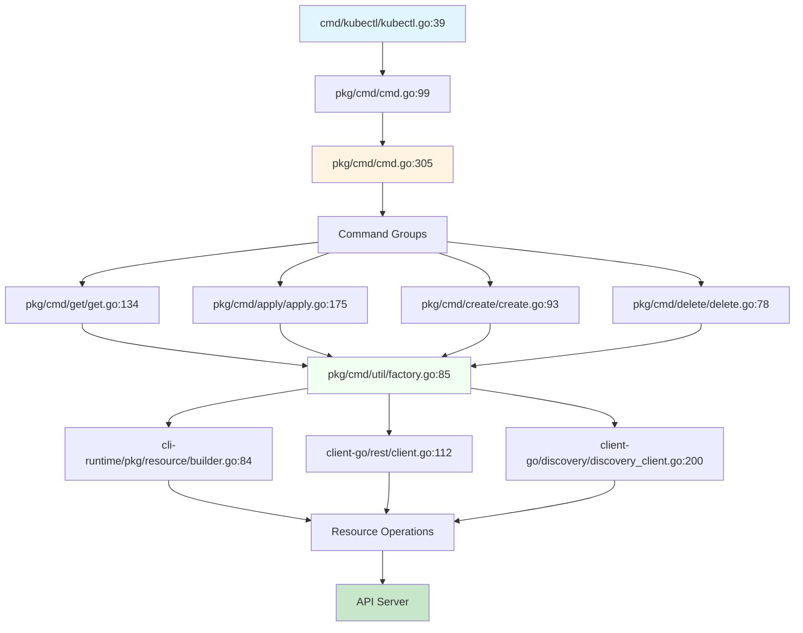

# **kubectl Entry Points and Code Navigation**

━━━━━━━━━━━━━━━━━━━━━━━━━━━━━━━━━━━━━━━━━━━━━━━━━━━━━━━━━━━━━━━━━━━━━━━━━━━━━━

## **📋 Overview**

This document provides a complete guide to kubectl's entry points, code organization, and navigation paths for contributors and developers. Use this as a map to quickly locate functionality in the kubectl codebase.

### **Repository Structure**

```
kubernetes/
├── cmd/kubectl/                          Main entry point
├── staging/src/k8s.io/kubectl/          kubectl implementation
├── staging/src/k8s.io/cli-runtime/      CLI utilities
├── staging/src/k8s.io/client-go/        Client library
└── staging/src/k8s.io/apimachinery/     API machinery
```

━━━━━━━━━━━━━━━━━━━━━━━━━━━━━━━━━━━━━━━━━━━━━━━━━━━━━━━━━━━━━━━━━━━━━━━━━━━━━━

## **🚪 Main Entry Point**

### **cmd/kubectl/kubectl.go**

The binary entry point that initializes and executes kubectl.

```go
// File: cmd/kubectl/kubectl.go
func main() {
    // Set logging verbosity
    logs.GlogSetter(cmd.GetLogVerbosity(os.Args))

    // Create and execute root command
    command := cmd.NewDefaultKubectlCommand()
    if err := cli.RunNoErrOutput(command); err != nil {
        util.CheckErr(err)
    }
}
```

**Key Functions**:
- Line 31-44: `main()` - Program entry point

━━━━━━━━━━━━━━━━━━━━━━━━━━━━━━━━━━━━━━━━━━━━━━━━━━━━━━━━━━━━━━━━━━━━━━━━━━━━━━

## **🌳 Root Command**

### **pkg/cmd/cmd.go**

Creates the kubectl root command with all subcommands.

```
staging/src/k8s.io/kubectl/pkg/cmd/cmd.go
```

**Key Functions**:
- Line 99-107: `NewDefaultKubectlCommand()` - Creates root command
- Line 110-168: `NewDefaultKubectlCommandWithArgs()` - Plugin handling
- Line 305-520: `NewKubectlCommand()` - Command tree construction
- Line 390-463: Command group definitions

**Command Groups**:
1. Basic Commands (Beginner): create, expose, run, set
2. Basic Commands (Intermediate): explain, get, edit, delete
3. Deploy Commands: rollout, scale, autoscale
4. Cluster Management: certificates, top, drain, taint
5. Troubleshooting: describe, logs, exec, port-forward, debug
6. Advanced: diff, apply, patch, replace, wait
7. Settings: label, annotate, completion

━━━━━━━━━━━━━━━━━━━━━━━━━━━━━━━━━━━━━━━━━━━━━━━━━━━━━━━━━━━━━━━━━━━━━━━━━━━━━━

## **📦 Command Implementations**

### **kubectl get**
```
staging/src/k8s.io/kubectl/pkg/cmd/get/
├── get.go           Main implementation (line 134: NewCmdGet)
├── get_flags.go     Flag definitions
└── customcolumn.go  Custom column formatting
```

### **kubectl apply**
```
staging/src/k8s.io/kubectl/pkg/cmd/apply/
├── apply.go              Main command (line 175: NewCmdApply)
├── apply_set_last_applied.go
├── apply_view_last_applied.go
└── patcher.go            Patching logic (line 47: NewPatcher)
```

### **kubectl create**
```
staging/src/k8s.io/kubectl/pkg/cmd/create/
├── create.go             Root create command
├── create_deployment.go  Deployment creation
├── create_service.go     Service creation
└── create_*.go          Other resource types
```

### **kubectl delete**
```
staging/src/k8s.io/kubectl/pkg/cmd/delete/
└── delete.go            Delete implementation (line 78: NewCmdDelete)
```

### **kubectl describe**
```
staging/src/k8s.io/kubectl/pkg/cmd/describe/
└── describe.go          Describe command (line 67: NewCmdDescribe)
```

### **kubectl edit**
```
staging/src/k8s.io/kubectl/pkg/cmd/edit/
└── edit.go              Edit command (line 94: NewCmdEdit)
```

### **kubectl patch**
```
staging/src/k8s.io/kubectl/pkg/cmd/patch/
└── patch.go             Patch command (line 76: NewCmdPatch)
```

### **kubectl logs**
```
staging/src/k8s.io/kubectl/pkg/cmd/logs/
└── logs.go              Logs command (line 127: NewCmdLogs)
```

### **kubectl exec**
```
staging/src/k8s.io/kubectl/pkg/cmd/exec/
└── exec.go              Exec command (line 94: NewCmdExec)
```

### **kubectl port-forward**
```
staging/src/k8s.io/kubectl/pkg/cmd/portforward/
└── portforward.go       Port forward (line 93: NewCmdPortForward)
```

### **kubectl scale**
```
staging/src/k8s.io/kubectl/pkg/cmd/scale/
└── scale.go             Scale command (line 90: NewCmdScale)
```

### **kubectl rollout**
```
staging/src/k8s.io/kubectl/pkg/cmd/rollout/
├── rollout.go           Root rollout command
├── rollout_status.go    Status subcommand
├── rollout_history.go   History subcommand
├── rollout_undo.go      Undo subcommand
├── rollout_pause.go     Pause subcommand
└── rollout_restart.go   Restart subcommand
```

━━━━━━━━━━━━━━━━━━━━━━━━━━━━━━━━━━━━━━━━━━━━━━━━━━━━━━━━━━━━━━━━━━━━━━━━━━━━━━

## **🔧 Core Utilities**

### **Factory Pattern**
```
staging/src/k8s.io/kubectl/pkg/cmd/util/
├── factory.go            Factory interface
├── factory_client_access.go  Client creation
└── helpers.go            Helper utilities
```

**Key Function**: Line 85: `NewFactory()` - Creates factory with config

### **Resource Builder**
```
staging/src/k8s.io/cli-runtime/pkg/resource/
├── builder.go            Resource builder (line 84: NewBuilder)
├── visitor.go            Visitor pattern (line 66: Visitor interface)
├── result.go             Result handling
└── helper.go             Resource helpers
```

### **Printers**
```
staging/src/k8s.io/cli-runtime/pkg/printers/
├── interface.go          Printer interface
├── tableprinter.go       Table output
├── jsonpath.go           JSONPath printer
├── customcolumn.go       Custom columns
└── yaml.go               YAML printer
```

━━━━━━━━━━━━━━━━━━━━━━━━━━━━━━━━━━━━━━━━━━━━━━━━━━━━━━━━━━━━━━━━━━━━━━━━━━━━━━

## **🌐 Client Libraries**

### **REST Client**
```
staging/src/k8s.io/client-go/rest/
├── client.go             RESTClient (line 112: NewRESTClient)
├── request.go            Request builder (line 134: NewRequest)
└── config.go             Configuration
```

### **Discovery Client**
```
staging/src/k8s.io/client-go/discovery/
├── discovery_client.go   Discovery (line 200: NewDiscoveryClient)
└── cached/memory/memcache.go  Cached discovery
```

### **Dynamic Client**
```
staging/src/k8s.io/client-go/dynamic/
└── simple.go             Dynamic client
```

### **Typed Clients**
```
staging/src/k8s.io/client-go/kubernetes/
└── typed/                Generated clients for all resources
    ├── core/v1/
    ├── apps/v1/
    └── batch/v1/
```

━━━━━━━━━━━━━━━━━━━━━━━━━━━━━━━━━━━━━━━━━━━━━━━━━━━━━━━━━━━━━━━━━━━━━━━━━━━━━━

## **🛠️ Apply and Patch**

### **Strategic Merge Patch**
```
staging/src/k8s.io/apimachinery/pkg/util/strategicpatch/
├── patch.go              Algorithm (line 94: CreateTwoWayMergePatch)
│                         (line 2094: CreateThreeWayMergePatch)
└── meta.go               Metadata extraction
```

### **Apply Implementation**
```
staging/src/k8s.io/kubectl/pkg/cmd/apply/
├── apply.go              Apply command (line 175: NewCmdApply)
└── patcher.go            Patcher (line 47: NewPatcher)
```

━━━━━━━━━━━━━━━━━━━━━━━━━━━━━━━━━━━━━━━━━━━━━━━━━━━━━━━━━━━━━━━━━━━━━━━━━━━━━━

## **📊 Complete Reference Table**

### **Commands**

| Command | File | Key Function |
|---------|------|--------------|
| apply | pkg/cmd/apply/apply.go | Line 175: `NewCmdApply` |
| create | pkg/cmd/create/create.go | Line 93: `NewCmdCreate` |
| delete | pkg/cmd/delete/delete.go | Line 78: `NewCmdDelete` |
| get | pkg/cmd/get/get.go | Line 134: `NewCmdGet` |
| describe | pkg/cmd/describe/describe.go | Line 67: `NewCmdDescribe` |
| edit | pkg/cmd/edit/edit.go | Line 94: `NewCmdEdit` |
| patch | pkg/cmd/patch/patch.go | Line 76: `NewCmdPatch` |
| logs | pkg/cmd/logs/logs.go | Line 127: `NewCmdLogs` |
| exec | pkg/cmd/exec/exec.go | Line 94: `NewCmdExec` |
| port-forward | pkg/cmd/portforward/portforward.go | Line 93: `NewCmdPortForward` |
| scale | pkg/cmd/scale/scale.go | Line 90: `NewCmdScale` |
| autoscale | pkg/cmd/autoscale/autoscale.go | Line 85: `NewCmdAutoscale` |
| rollout | pkg/cmd/rollout/rollout.go | Line 78: `NewCmdRollout` |

### **Core Components**

| Component | File | Key Function/Type |
|-----------|------|-------------------|
| Root command | pkg/cmd/cmd.go | Line 305: `NewKubectlCommand` |
| Factory | pkg/cmd/util/factory.go | Line 85: `NewFactory` |
| Resource builder | cli-runtime/pkg/resource/builder.go | Line 84: `NewBuilder` |
| REST client | client-go/rest/client.go | Line 112: `NewRESTClient` |
| Discovery | client-go/discovery/discovery_client.go | Line 200: `NewDiscoveryClient` |
| Strategic patch | apimachinery/pkg/util/strategicpatch/patch.go | Line 94, 2094 |

━━━━━━━━━━━━━━━━━━━━━━━━━━━━━━━━━━━━━━━━━━━━━━━━━━━━━━━━━━━━━━━━━━━━━━━━━━━━━━

## **🗺️ Navigation Flowchart**



━━━━━━━━━━━━━━━━━━━━━━━━━━━━━━━━━━━━━━━━━━━━━━━━━━━━━━━━━━━━━━━━━━━━━━━━━━━━━━

## **🔍 Finding Specific Functionality**

### **Want to understand...?**

**How kubectl get works:**
1. Start: `pkg/cmd/get/get.go:134` (`NewCmdGet`)
2. Resource selection: `cli-runtime/pkg/resource/builder.go`
3. API call: `client-go/rest/request.go`
4. Printing: `cli-runtime/pkg/printers/`

**How kubectl apply works:**
1. Start: `pkg/cmd/apply/apply.go:175` (`NewCmdApply`)
2. Three-way merge: `apimachinery/pkg/util/strategicpatch/patch.go:2094`
3. Patching: `pkg/cmd/apply/patcher.go:47`
4. API call: `client-go/rest/client.go`

**How kubectl exec works:**
1. Start: `pkg/cmd/exec/exec.go:94` (`NewCmdExec`)
2. Streaming: `client-go/tools/remotecommand/remotecommand.go`
3. Protocol: `client-go/transport/spdy/`

**How resource builders work:**
1. Interface: `cli-runtime/pkg/resource/builder.go:84`
2. Visitors: `cli-runtime/pkg/resource/visitor.go:66`
3. Result: `cli-runtime/pkg/resource/result.go`

━━━━━━━━━━━━━━━━━━━━━━━━━━━━━━━━━━━━━━━━━━━━━━━━━━━━━━━━━━━━━━━━━━━━━━━━━━━━━━

## **📚 Summary**

### **Quick Reference**

**Starting Points**:
- Main: `cmd/kubectl/kubectl.go:39`
- Root command: `pkg/cmd/cmd.go:305`
- Commands: `pkg/cmd/{command}/`

**Core Libraries**:
- Factory: `pkg/cmd/util/factory.go:85`
- Builder: `cli-runtime/pkg/resource/builder.go:84`
- REST: `client-go/rest/client.go:112`
- Discovery: `client-go/discovery/discovery_client.go:200`

**Key Algorithms**:
- Strategic merge: `apimachinery/pkg/util/strategicpatch/patch.go`
- Apply: `pkg/cmd/apply/patcher.go:47`
- Validation: `pkg/validation/schema.go`

### **Related Documentation**

- [Cobra Command Structure](./low-level/01-cobra-command-structure.md)
- [Resource Builders](./middle-level/08-resource-builders.md)
- [REST Client](./low-level/03-rest-client.md)
- [Discovery Client](./low-level/04-discovery-client.md)
- [Strategic Merge Patch](./low-level/02-strategic-merge-patch.md)

━━━━━━━━━━━━━━━━━━━━━━━━━━━━━━━━━━━━━━━━━━━━━━━━━━━━━━━━━━━━━━━━━━━━━━━━━━━━━━

*Code Navigation Documentation*
*Part of kubectl Architecture Study - Phase 5*
*Complete kubectl architecture documentation*
