# kubectl System Overview

**Document Version**: 1.0
**Last Updated**: 2025-10-21
**Status**: High-Level Architecture Documentation

---

## Table of Contents

- [Overview](#overview)
- [kubectl's Role in Kubernetes](#kubectls-role-in-kubernetes)
- [System Architecture](#system-architecture)
- [Component Architecture](#component-architecture)
- [Request Flow](#request-flow)
- [Data Flow](#data-flow)
- [Key Subsystems](#key-subsystems)
- [Communication Patterns](#communication-patterns)
- [Design Patterns](#design-patterns)
- [Error Handling](#error-handling)
- [Performance Characteristics](#performance-characteristics)

---

## Overview

kubectl is the official command-line interface for Kubernetes, serving as a thin client that translates user commands into REST API calls to the Kubernetes API server. It is designed as a stateless CLI tool that provides comprehensive access to cluster operations while maintaining simplicity and extensibility.

### Core Design Principles

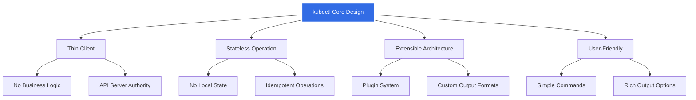
```mermaid
graph TD
    kubectl[kubectl Core Design]

    kubectl --> ThinClient[Thin Client]
    kubectl --> Stateless[Stateless Operation]
    kubectl --> Extensible[Extensible Architecture]
    kubectl --> UserFriendly[User-Friendly]

    ThinClient --> NoLogic[No Business Logic]
    ThinClient --> APIOnly[API Server Authority]

    Stateless --> NoLocalState[No Local State]
    Stateless --> Idempotent[Idempotent Operations]

    Extensible --> Plugins[Plugin System]
    Extensible --> Formats[Custom Output Formats]

    UserFriendly --> SimpleCommands[Simple Commands]
    UserFriendly --> RichOutput[Rich Output Options]

    style kubectl fill:#326CE5,stroke:#fff,stroke-width:2px,color:#fff
```

### Key Characteristics

| Characteristic | Description | Benefit |
|----------------|-------------|---------|
| **Thin Client** | Minimal client-side logic | Easy to maintain, update |
| **Stateless** | No local state persistence | Works across multiple clusters |
| **RESTful** | Uses Kubernetes REST API | Standard protocol, interoperable |
| **Extensible** | Plugin architecture | Community can extend functionality |
| **Cross-Platform** | Runs on Linux, macOS, Windows | Wide accessibility |
| **Single Binary** | No dependencies | Easy distribution, deployment |

---

## kubectl's Role in Kubernetes

### The Kubernetes Ecosystem

kubectl sits between users and the Kubernetes control plane, providing the primary interface for cluster interaction:

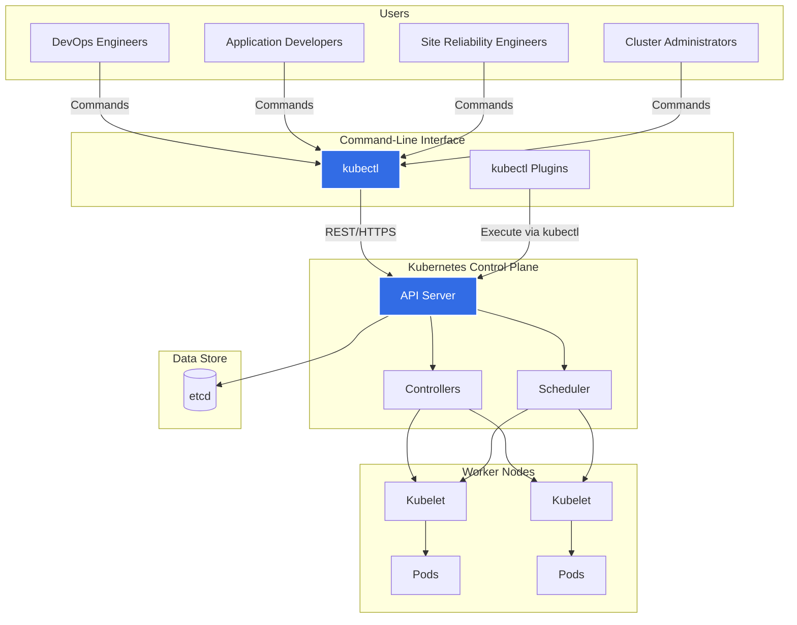
```mermaid
graph TB
    subgraph Users
        DevOps[DevOps Engineers]
        Developers[Application Developers]
        SRE[Site Reliability Engineers]
        Admins[Cluster Administrators]
    end

    subgraph CLI["Command-Line Interface"]
        kubectl[kubectl]
        Plugins[kubectl Plugins]
    end

    subgraph ControlPlane["Kubernetes Control Plane"]
        APIServer[API Server]
        Controllers[Controllers]
        Scheduler[Scheduler]
    end

    subgraph Data["Data Store"]
        etcd[(etcd)]
    end

    subgraph Workers["Worker Nodes"]
        Kubelet1[Kubelet]
        Kubelet2[Kubelet]
        Pods1[Pods]
        Pods2[Pods]
    end

    DevOps -->|Commands| kubectl
    Developers -->|Commands| kubectl
    SRE -->|Commands| kubectl
    Admins -->|Commands| kubectl

    kubectl -->|REST/HTTPS| APIServer
    Plugins -->|Execute via kubectl| APIServer

    APIServer --> etcd
    APIServer --> Controllers
    APIServer --> Scheduler

    Controllers --> Kubelet1
    Controllers --> Kubelet2
    Scheduler --> Kubelet1
    Scheduler --> Kubelet2

    Kubelet1 --> Pods1
    Kubelet2 --> Pods2

    style kubectl fill:#326CE5,stroke:#fff,stroke-width:2px,color:#fff
    style APIServer fill:#326CE5,stroke:#fff,stroke-width:2px,color:#fff
```

### Responsibilities

kubectl is responsible for:

1. **Command Interface**: Provide intuitive CLI for all Kubernetes operations
2. **API Translation**: Convert commands to appropriate REST API calls
3. **Authentication**: Handle cluster authentication (certificates, tokens, etc.)
4. **Configuration**: Manage cluster connection configuration
5. **Resource Transformation**: Convert between YAML/JSON and Go objects
6. **Output Formatting**: Present data in human or machine-readable formats
7. **Streaming**: Handle bidirectional streaming (logs, exec, port-forward)
8. **Extensibility**: Support plugins for custom functionality

kubectl is **NOT** responsible for:

- ❌ Resource scheduling (handled by kube-scheduler)
- ❌ Controller reconciliation (handled by controllers)
- ❌ Container runtime (handled by kubelet + container runtime)
- ❌ Service mesh (handled by separate service mesh implementation)
- ❌ Policy enforcement (handled by admission controllers)
- ❌ Cluster installation/bootstrap (handled by kubeadm, kops, etc.)

---

## System Architecture

### High-Level Architecture

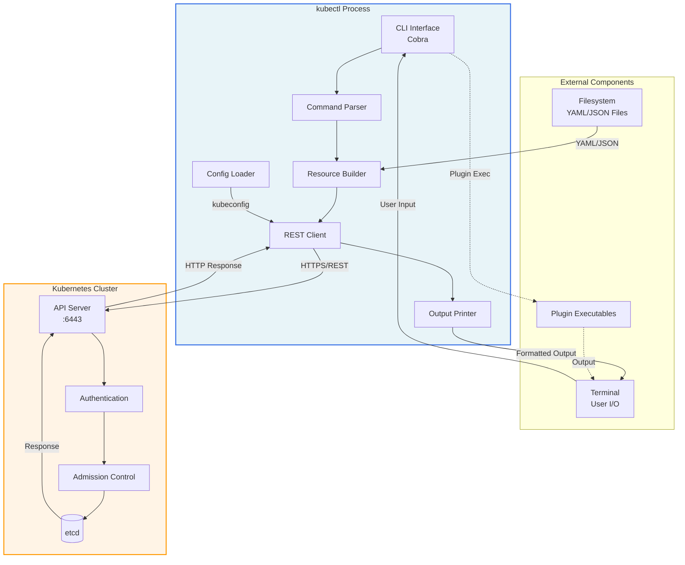
```mermaid
graph TB
    subgraph kubectl["kubectl Process"]
        CLI[CLI Interface<br/>Cobra]
        Parser[Command Parser]
        Builder[Resource Builder]
        Client[REST Client]
        Printer[Output Printer]
        Config[Config Loader]
    end

    subgraph External["External Components"]
        Filesystem[Filesystem<br/>YAML/JSON Files]
        Terminal[Terminal<br/>User I/O]
        Plugins[Plugin Executables]
    end

    subgraph Kubernetes["Kubernetes Cluster"]
        APIServer[API Server<br/>:6443]
        Auth[Authentication]
        Admission[Admission Control]
        Storage[(etcd)]
    end

    Terminal -->|User Input| CLI
    CLI --> Parser
    Parser --> Builder
    Builder --> Client

    Config -->|kubeconfig| Client
    Filesystem -->|YAML/JSON| Builder

    Client -->|HTTPS/REST| APIServer
    APIServer --> Auth
    Auth --> Admission
    Admission --> Storage

    Storage -->|Response| APIServer
    APIServer -->|HTTP Response| Client
    Client --> Printer
    Printer -->|Formatted Output| Terminal

    CLI -.->|Plugin Exec| Plugins
    Plugins -.->|Output| Terminal

    style kubectl fill:#E8F4F8,stroke:#326CE5,stroke-width:2px
    style Kubernetes fill:#FFF4E6,stroke:#FF9800,stroke-width:2px
```

**Code Reference**: Entry point at `cmd/kubectl/kubectl.go:31`

### Layered Architecture

kubectl follows a layered architecture pattern:

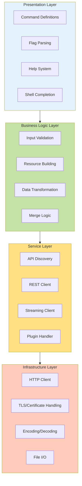
```mermaid
graph TB
    subgraph Layer1["Presentation Layer"]
        Commands[Command Definitions]
        Flags[Flag Parsing]
        Help[Help System]
        Completion[Shell Completion]
    end

    subgraph Layer2["Business Logic Layer"]
        Validation[Input Validation]
        ResourceBuilder[Resource Building]
        Transformation[Data Transformation]
        Merge[Merge Logic]
    end

    subgraph Layer3["Service Layer"]
        Discovery[API Discovery]
        RESTClient[REST Client]
        Streaming[Streaming Client]
        PluginHandler[Plugin Handler]
    end

    subgraph Layer4["Infrastructure Layer"]
        HTTPClient[HTTP Client]
        TLS[TLS/Certificate Handling]
        Serialization[Encoding/Decoding]
        FileIO[File I/O]
    end

    Layer1 --> Layer2
    Layer2 --> Layer3
    Layer3 --> Layer4

    style Layer1 fill:#E3F2FD
    style Layer2 fill:#C5E1A5
    style Layer3 fill:#FFE082
    style Layer4 fill:#FFCCBC
```

---

## Component Architecture

### Major Components

kubectl consists of several major components that work together:

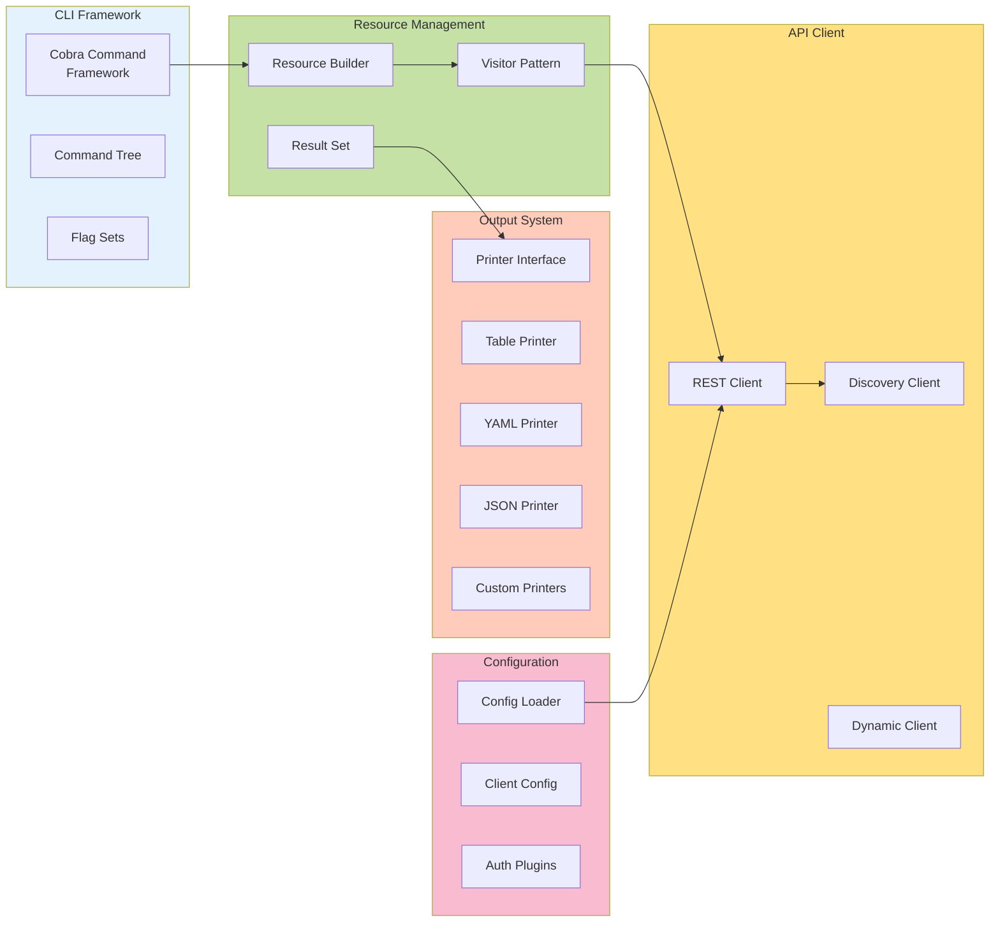
```mermaid
graph LR
    subgraph CLI["CLI Framework"]
        Cobra[Cobra Command<br/>Framework]
        CobraCmd[Command Tree]
        Flags[Flag Sets]
    end

    subgraph Resource["Resource Management"]
        Builder[Resource Builder]
        Visitor[Visitor Pattern]
        Result[Result Set]
    end

    subgraph Client["API Client"]
        REST[REST Client]
        Discovery[Discovery Client]
        Dynamic[Dynamic Client]
    end

    subgraph Output["Output System"]
        Printers[Printer Interface]
        TablePrinter[Table Printer]
        YAMLPrinter[YAML Printer]
        JSONPrinter[JSON Printer]
        CustomPrinter[Custom Printers]
    end

    subgraph Config["Configuration"]
        ConfigLoader[Config Loader]
        ClientConfig[Client Config]
        AuthPlugin[Auth Plugins]
    end

    Cobra --> Builder
    Builder --> Visitor
    Visitor --> REST
    REST --> Discovery
    Result --> Printers
    ConfigLoader --> REST

    style CLI fill:#E3F2FD
    style Resource fill:#C5E1A5
    style Client fill:#FFE082
    style Output fill:#FFCCBC
    style Config fill:#F8BBD0
```

### Component Breakdown

#### 1. CLI Framework

**Purpose**: Command-line interface structure and parsing

**Components**:
- **Cobra Commands**: Command hierarchy and execution (`staging/src/k8s.io/kubectl/pkg/cmd/`)
- **Flag Parsing**: Command-line flag handling
- **Help System**: Automatic help generation
- **Completion**: Shell completion support

**Code Reference**: `staging/src/k8s.io/kubectl/pkg/cmd/cmd.go:306`

**Key Command Groups**:
```go
// From cmd.go:390-463
groups := templates.CommandGroups{
    {
        Message: "Basic Commands (Beginner):",
        Commands: []*cobra.Command{
            create.NewCmdCreate(f, o.IOStreams),
            expose.NewCmdExposeService(f, o.IOStreams),
            run.NewCmdRun(f, o.IOStreams),
            set.NewCmdSet(f, o.IOStreams),
        },
    },
    {
        Message: "Basic Commands (Intermediate):",
        Commands: []*cobra.Command{
            explain.NewCmdExplain("kubectl", f, o.IOStreams),
            getCmd,
            edit.NewCmdEdit(f, o.IOStreams),
            delete.NewCmdDelete(f, o.IOStreams),
        },
    },
    // ... more command groups
}
```

#### 2. Resource Builder

**Purpose**: Construct resource queries from various inputs

**Pattern**: Builder pattern with fluent API

**Key Features**:
- File/stdin input handling
- Label/field selector support
- Namespace handling
- Multi-resource selection
- Lazy evaluation

**Code Reference**: `staging/src/k8s.io/cli-runtime/pkg/resource/builder.go:54-116`

**Example Usage**:
```go
result := f.NewBuilder().
    Unstructured().
    NamespaceParam(namespace).DefaultNamespace().
    FilenameParam(enforceNamespace, &options).
    LabelSelectorParam(selector).
    FieldSelectorParam(fieldSelector).
    ResourceTypeOrNameArgs(true, args...).
    ContinueOnError().
    Latest().
    Flatten().
    Do()
```

#### 3. REST Client

**Purpose**: HTTP communication with API server

**Responsibilities**:
- Build REST requests
- Handle authentication
- Encode/decode payloads
- Error handling
- Retry logic
- Rate limiting

**Code Reference**: `staging/src/k8s.io/client-go/rest/request.go`

**Request Structure**:
```
Method: GET/POST/PUT/PATCH/DELETE
URL: https://<server>/apis/<group>/<version>/namespaces/<ns>/<resource>/<name>
Headers:
  - Authorization: Bearer <token>
  - Accept: application/json
  - Content-Type: application/json
Body: JSON-encoded resource (for POST/PUT/PATCH)
```

#### 4. Discovery Client

**Purpose**: Discover available API resources

**Capabilities**:
- List API groups
- List API versions
- List resources per API group
- Resolve short names (po → pods)
- Fetch OpenAPI schema

**Code Reference**: `staging/src/k8s.io/client-go/discovery/discovery_client.go`

**Discovery Flow**:
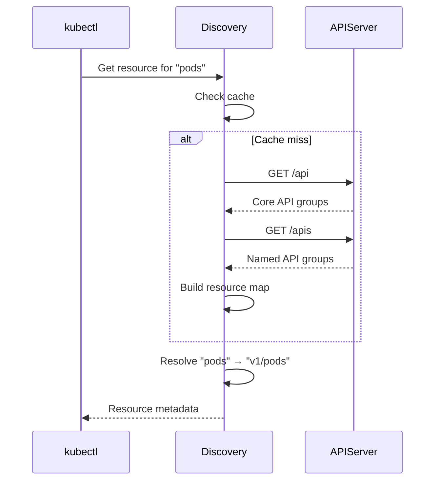
```mermaid
sequenceDiagram
    participant kubectl
    participant Discovery
    participant APIServer

    kubectl->>Discovery: Get resource for "pods"
    Discovery->>Discovery: Check cache

    alt Cache miss
        Discovery->>APIServer: GET /api
        APIServer-->>Discovery: Core API groups
        Discovery->>APIServer: GET /apis
        APIServer-->>Discovery: Named API groups
        Discovery->>Discovery: Build resource map
    end

    Discovery->>Discovery: Resolve "pods" → "v1/pods"
    Discovery-->>kubectl: Resource metadata
```

#### 5. Printer System

**Purpose**: Format output for display

**Architecture**:
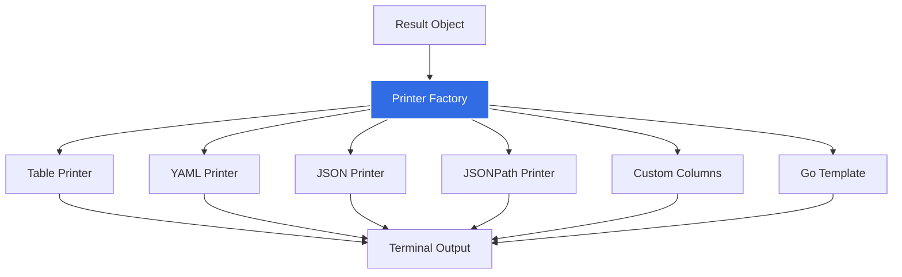
```mermaid
graph TD
    Result[Result Object] --> PrinterFactory[Printer Factory]
    PrinterFactory --> TablePrinter[Table Printer]
    PrinterFactory --> YAMLPrinter[YAML Printer]
    PrinterFactory --> JSONPrinter[JSON Printer]
    PrinterFactory --> JSONPathPrinter[JSONPath Printer]
    PrinterFactory --> CustomColumns[Custom Columns]
    PrinterFactory --> GoTemplate[Go Template]

    TablePrinter --> Output[Terminal Output]
    YAMLPrinter --> Output
    JSONPrinter --> Output
    JSONPathPrinter --> Output
    CustomColumns --> Output
    GoTemplate --> Output

    style PrinterFactory fill:#326CE5,stroke:#fff,stroke-width:2px,color:#fff
```

**Code Reference**: `staging/src/k8s.io/cli-runtime/pkg/printers/`

#### 6. Configuration System

**Purpose**: Manage cluster access configuration

**Configuration Sources** (in precedence order):
1. Command-line flags (`--kubeconfig`, `--context`, `--namespace`)
2. Environment variables (`KUBECONFIG`)
3. Default config file (`~/.kube/config`)
4. In-cluster configuration (`/var/run/secrets/kubernetes.io/serviceaccount/`)

**Code Reference**: `staging/src/k8s.io/client-go/tools/clientcmd/`

---

## Request Flow

### Standard kubectl Command Flow

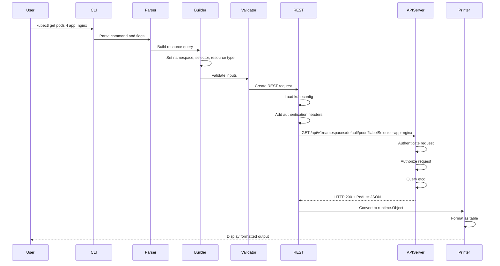
```mermaid
sequenceDiagram
    participant User
    participant CLI
    participant Parser
    participant Builder
    participant Validator
    participant REST
    participant APIServer
    participant Printer

    User->>CLI: kubectl get pods -l app=nginx
    CLI->>Parser: Parse command and flags
    Parser->>Builder: Build resource query
    Builder->>Builder: Set namespace, selector, resource type
    Builder->>Validator: Validate inputs

    Validator->>REST: Create REST request
    REST->>REST: Load kubeconfig
    REST->>REST: Add authentication headers
    REST->>APIServer: GET /api/v1/namespaces/default/pods?labelSelector=app=nginx

    APIServer->>APIServer: Authenticate request
    APIServer->>APIServer: Authorize request
    APIServer->>APIServer: Query etcd
    APIServer-->>REST: HTTP 200 + PodList JSON

    REST->>Printer: Convert to runtime.Object
    Printer->>Printer: Format as table
    Printer-->>User: Display formatted output
```

### kubectl apply Flow

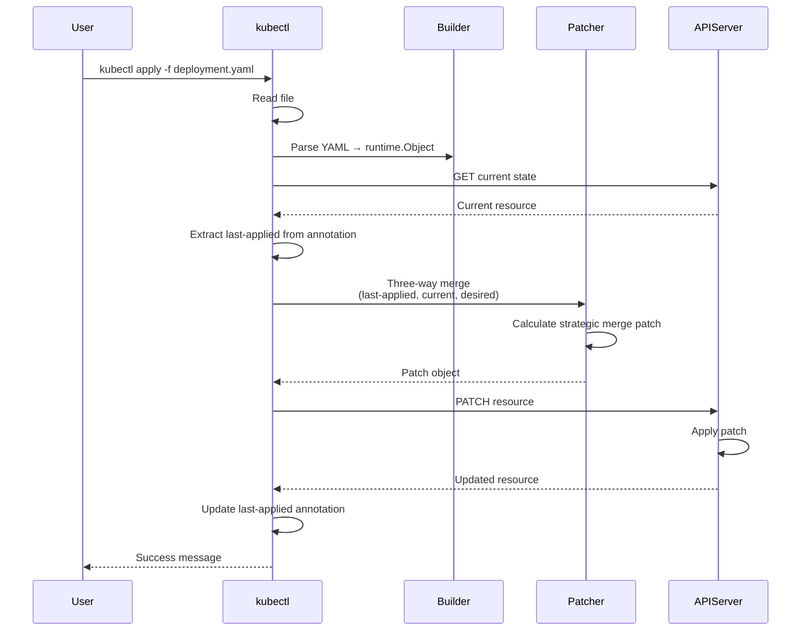
```mermaid
sequenceDiagram
    participant User
    participant kubectl
    participant Builder
    participant Patcher
    participant APIServer

    User->>kubectl: kubectl apply -f deployment.yaml
    kubectl->>kubectl: Read file
    kubectl->>Builder: Parse YAML → runtime.Object

    kubectl->>APIServer: GET current state
    APIServer-->>kubectl: Current resource

    kubectl->>kubectl: Extract last-applied from annotation
    kubectl->>Patcher: Three-way merge<br/>(last-applied, current, desired)

    Patcher->>Patcher: Calculate strategic merge patch
    Patcher-->>kubectl: Patch object

    kubectl->>APIServer: PATCH resource
    APIServer->>APIServer: Apply patch
    APIServer-->>kubectl: Updated resource

    kubectl->>kubectl: Update last-applied annotation
    kubectl-->>User: Success message
```

### Streaming Operation Flow (kubectl logs -f)

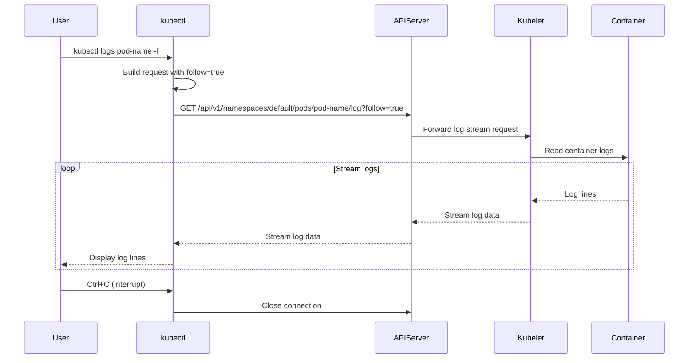
```mermaid
sequenceDiagram
    participant User
    participant kubectl
    participant APIServer
    participant Kubelet
    participant Container

    User->>kubectl: kubectl logs pod-name -f
    kubectl->>kubectl: Build request with follow=true
    kubectl->>APIServer: GET /api/v1/namespaces/default/pods/pod-name/log?follow=true

    APIServer->>Kubelet: Forward log stream request
    Kubelet->>Container: Read container logs

    loop Stream logs
        Container-->>Kubelet: Log lines
        Kubelet-->>APIServer: Stream log data
        APIServer-->>kubectl: Stream log data
        kubectl-->>User: Display log lines
    end

    User->>kubectl: Ctrl+C (interrupt)
    kubectl->>APIServer: Close connection
```

---

## Data Flow

### Input Processing

kubectl accepts input from multiple sources:

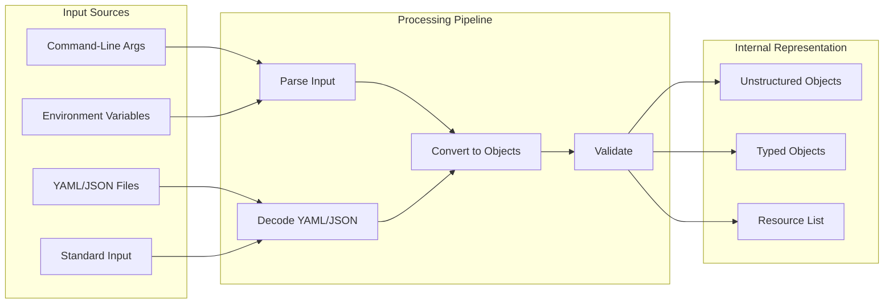
```mermaid
graph LR
    subgraph Input["Input Sources"]
        CLI[Command-Line Args]
        Files[YAML/JSON Files]
        Stdin[Standard Input]
        Env[Environment Variables]
    end

    subgraph Processing["Processing Pipeline"]
        Parse[Parse Input]
        Decode[Decode YAML/JSON]
        Convert[Convert to Objects]
        Validate[Validate]
    end

    subgraph Output["Internal Representation"]
        Unstructured[Unstructured Objects]
        Typed[Typed Objects]
        ResourceList[Resource List]
    end

    CLI --> Parse
    Files --> Decode
    Stdin --> Decode
    Env --> Parse

    Parse --> Convert
    Decode --> Convert
    Convert --> Validate

    Validate --> Unstructured
    Validate --> Typed
    Validate --> ResourceList
```

### Output Processing

kubectl generates output in multiple formats:

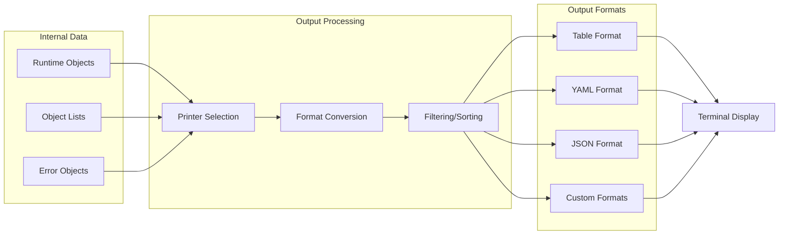
```mermaid
graph LR
    subgraph Internal["Internal Data"]
        Objects[Runtime Objects]
        Lists[Object Lists]
        Errors[Error Objects]
    end

    subgraph Processing["Output Processing"]
        Printer[Printer Selection]
        Format[Format Conversion]
        Filter[Filtering/Sorting]
    end

    subgraph Output["Output Formats"]
        Table[Table Format]
        YAML[YAML Format]
        JSON[JSON Format]
        Custom[Custom Formats]
    end

    Objects --> Printer
    Lists --> Printer
    Errors --> Printer

    Printer --> Format
    Format --> Filter

    Filter --> Table
    Filter --> YAML
    Filter --> JSON
    Filter --> Custom

    Table --> Terminal[Terminal Display]
    YAML --> Terminal
    JSON --> Terminal
    Custom --> Terminal
```

---

## Key Subsystems

### 1. Authentication Subsystem

Handles cluster authentication:

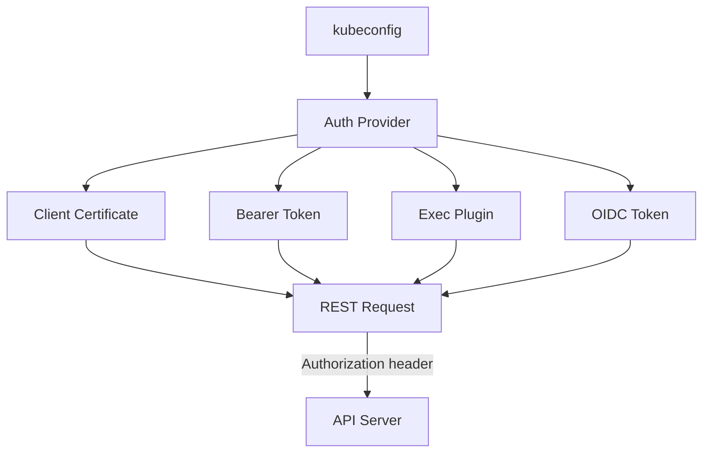
```mermaid
graph TD
    Config[kubeconfig] --> AuthProvider[Auth Provider]

    AuthProvider --> Cert[Client Certificate]
    AuthProvider --> Token[Bearer Token]
    AuthProvider --> Exec[Exec Plugin]
    AuthProvider --> OIDC[OIDC Token]

    Cert --> Request[REST Request]
    Token --> Request
    Exec --> Request
    OIDC --> Request

    Request -->|Authorization header| APIServer[API Server]
```

**Supported Methods**:
- **Client Certificates**: X.509 client cert and key
- **Bearer Tokens**: Static token or service account token
- **Exec Plugins**: External command providing credentials
- **OIDC**: OpenID Connect tokens
- **Username/Password**: Basic auth (deprecated)

**Code Reference**: `staging/src/k8s.io/client-go/tools/clientcmd/client_config.go`

### 2. Validation Subsystem

Multi-layer validation:

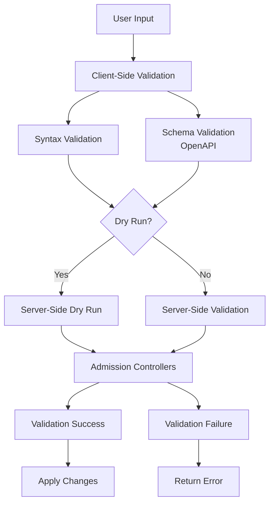
```mermaid
graph TD
    Input[User Input] --> ClientValidation[Client-Side Validation]

    ClientValidation --> Syntax[Syntax Validation]
    ClientValidation --> Schema[Schema Validation<br/>OpenAPI]

    Syntax --> DryRun{Dry Run?}
    Schema --> DryRun

    DryRun -->|Yes| DryRunServer[Server-Side Dry Run]
    DryRun -->|No| ServerValidation[Server-Side Validation]

    DryRunServer --> Admission[Admission Controllers]
    ServerValidation --> Admission

    Admission --> Success[Validation Success]
    Admission --> Failure[Validation Failure]

    Success --> Apply[Apply Changes]
    Failure --> Error[Return Error]
```

**Validation Levels**:
1. **Client-Side Syntax**: Basic YAML/JSON parsing
2. **Client-Side Schema**: OpenAPI schema validation
3. **Server-Side Dry Run**: Full validation without persistence
4. **Server-Side Admission**: Admission controllers and webhooks

**Code Reference**: `staging/src/k8s.io/kubectl/pkg/validation/validation.go`

### 3. Plugin Subsystem

Extensibility through plugins:

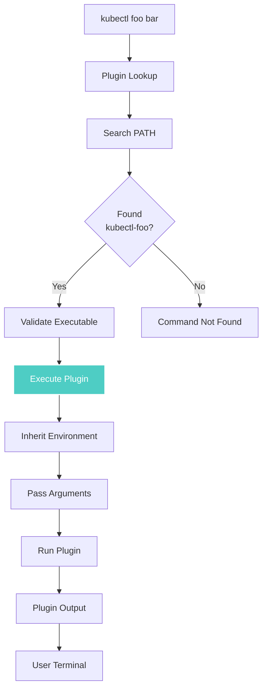
```mermaid
graph TD
    Command[kubectl foo bar] --> Lookup[Plugin Lookup]

    Lookup --> Search[Search PATH]
    Search --> Find{Found<br/>kubectl-foo?}

    Find -->|Yes| Validate[Validate Executable]
    Find -->|No| NotFound[Command Not Found]

    Validate --> Exec[Execute Plugin]
    Exec --> Inherit[Inherit Environment]
    Inherit --> PassArgs[Pass Arguments]
    PassArgs --> Run[Run Plugin]

    Run --> PluginOutput[Plugin Output]
    PluginOutput --> User[User Terminal]

    style Exec fill:#4ECDC4,stroke:#fff,stroke-width:2px,color:#fff
```

**Plugin Requirements**:
- Named `kubectl-<name>`
- Executable permission
- In system PATH
- Receives remaining arguments
- Inherits KUBECONFIG and other env vars

**Code Reference**: `staging/src/k8s.io/kubectl/pkg/cmd/cmd.go:178-303`

---

## Communication Patterns

### Request-Response Pattern

Most kubectl commands use synchronous request-response:

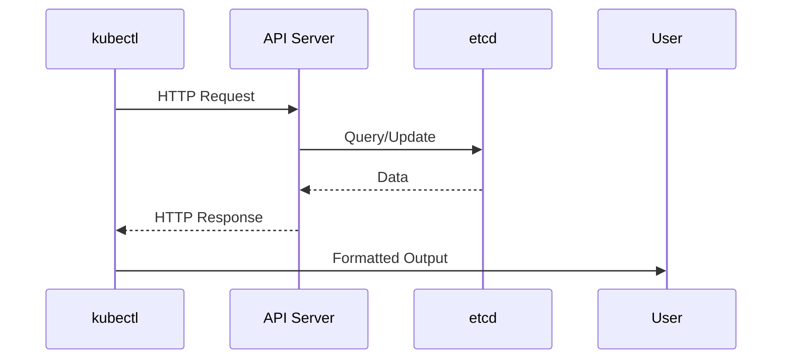
```mermaid
sequenceDiagram
    kubectl->>API Server: HTTP Request
    API Server->>etcd: Query/Update
    etcd-->>API Server: Data
    API Server-->>kubectl: HTTP Response
    kubectl->>User: Formatted Output
```

**Examples**: `get`, `create`, `delete`, `patch`

### Streaming Pattern

Some operations use bidirectional streaming:

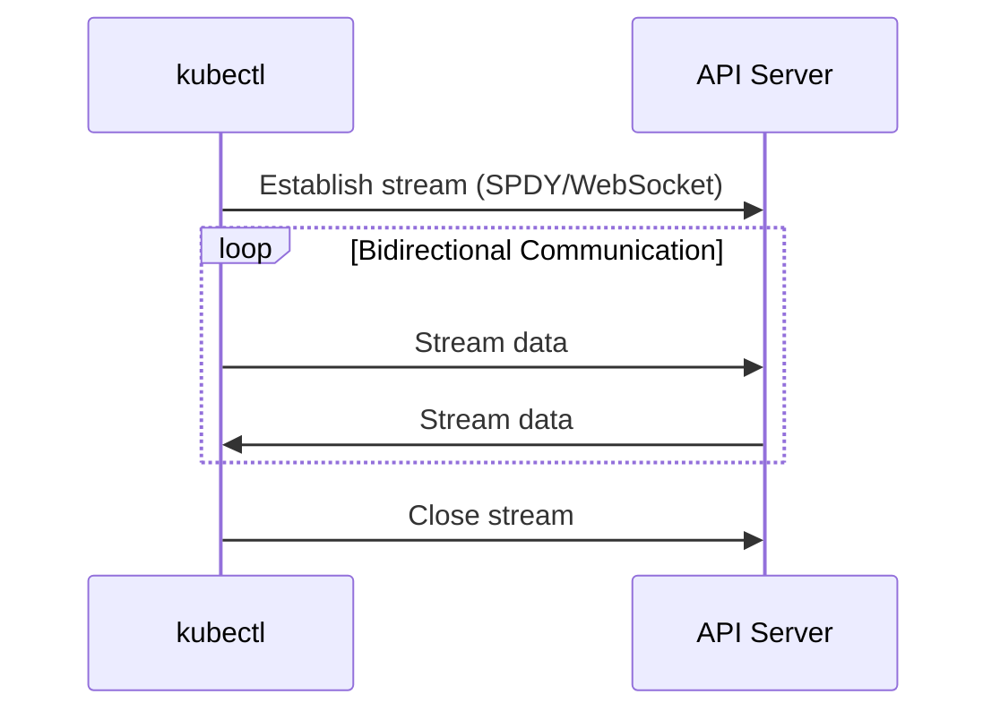
```mermaid
sequenceDiagram
    kubectl->>API Server: Establish stream (SPDY/WebSocket)

    loop Bidirectional Communication
        kubectl->>API Server: Stream data
        API Server->>kubectl: Stream data
    end

    kubectl->>API Server: Close stream
```

**Examples**: `logs -f`, `exec`, `attach`, `port-forward`

**Protocol**: SPDY (being replaced by WebSocket)

### Watch Pattern

kubectl can watch resources for changes:

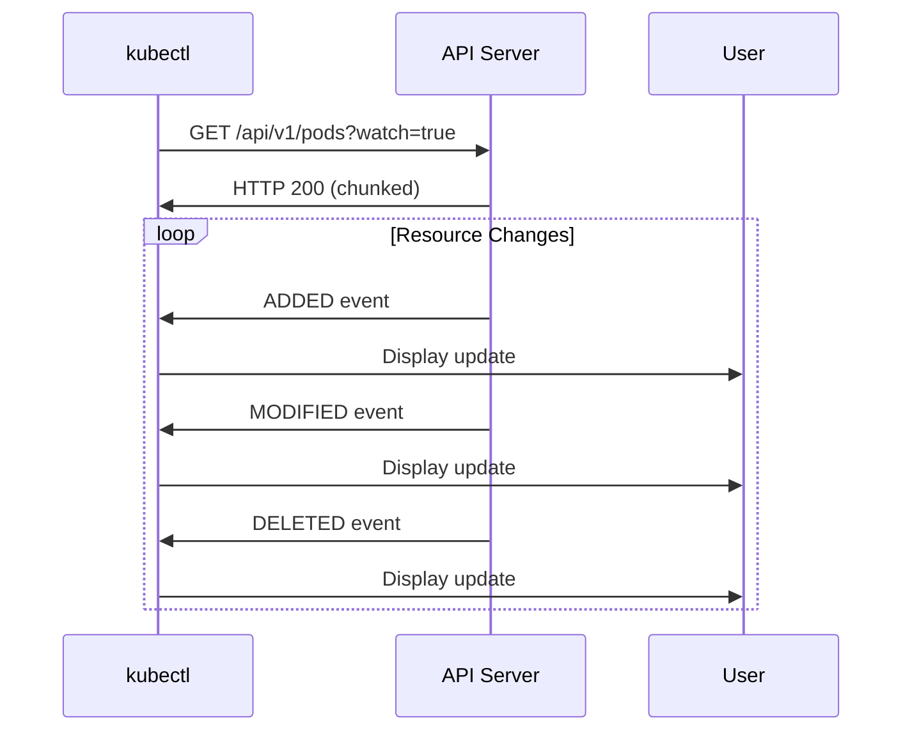
```mermaid
sequenceDiagram
    kubectl->>API Server: GET /api/v1/pods?watch=true
    API Server->>kubectl: HTTP 200 (chunked)

    loop Resource Changes
        API Server->>kubectl: ADDED event
        kubectl->>User: Display update
        API Server->>kubectl: MODIFIED event
        kubectl->>User: Display update
        API Server->>kubectl: DELETED event
        kubectl->>User: Display update
    end
```

**Example**: `kubectl get pods --watch`

---

## Design Patterns

### 1. Builder Pattern

Used extensively for resource queries:

```go
// Fluent API for building resource queries
result := f.NewBuilder().
    Unstructured().                              // Use unstructured objects
    NamespaceParam(namespace).                   // Set namespace
    DefaultNamespace().                          // Use default if not specified
    FilenameParam(enforceNamespace, &options).   // Load from files
    LabelSelectorParam(selector).                // Filter by labels
    FieldSelectorParam(fieldSelector).           // Filter by fields
    ResourceTypeOrNameArgs(true, args...).       // Parse resource args
    ContinueOnError().                           // Don't stop on first error
    Latest().                                    // Get latest version
    Flatten().                                   // Flatten results
    Do()                                         // Execute query
```

**Benefits**:
- Readable, fluent API
- Optional parameters
- Lazy evaluation
- Composable operations

### 2. Visitor Pattern

Used to operate on resource collections:

```go
// Visit each resource in the result
err := result.Visit(func(info *resource.Info, err error) error {
    if err != nil {
        return err
    }

    // Perform operation on each resource
    obj := info.Object
    // ... process obj

    return nil
})
```

**Benefits**:
- Separate iteration from operation logic
- Support for different operation types
- Error handling per resource

### 3. Factory Pattern

Used to create clients and utilities:

```go
// Factory provides common kubectl utilities
type Factory interface {
    // Creates a builder for resource operations
    NewBuilder() *resource.Builder

    // Creates REST client for API calls
    RESTClient() (*rest.RESTClient, error)

    // Creates dynamic client
    DynamicClient() (dynamic.Interface, error)

    // ... more factory methods
}
```

**Benefits**:
- Centralized configuration
- Consistent client creation
- Testability (mock factory)

### 4. Strategy Pattern

Used for different patch strategies:

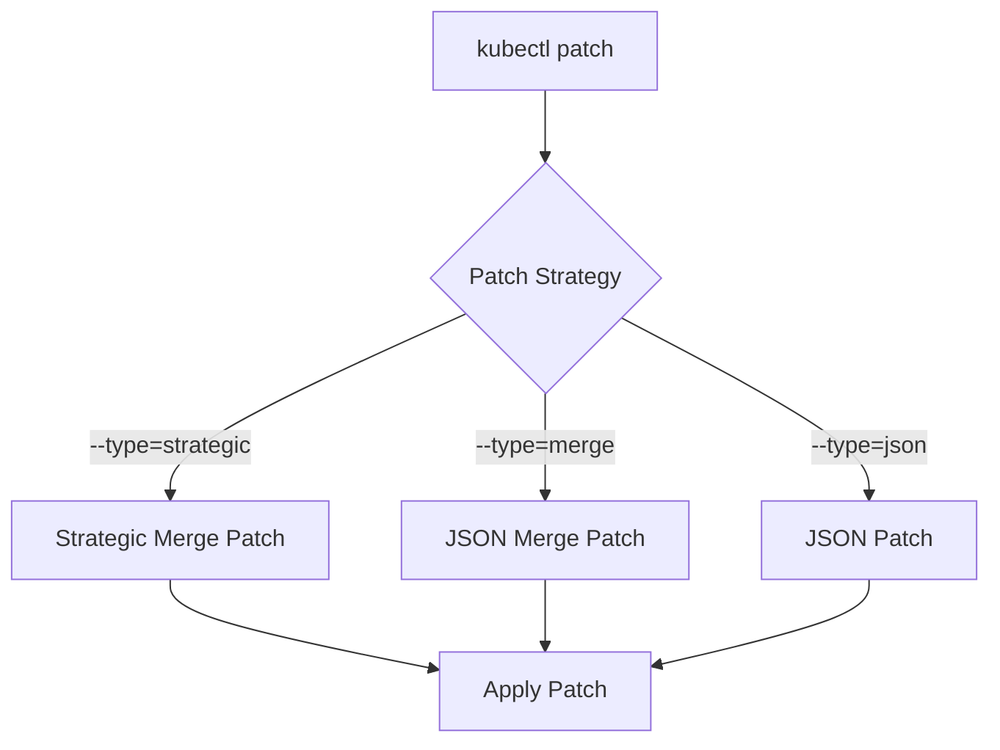
```mermaid
graph TD
    PatchCommand[kubectl patch] --> Strategy{Patch Strategy}

    Strategy -->|--type=strategic| Strategic[Strategic Merge Patch]
    Strategy -->|--type=merge| Merge[JSON Merge Patch]
    Strategy -->|--type=json| JSON[JSON Patch]

    Strategic --> Apply[Apply Patch]
    Merge --> Apply
    JSON --> Apply
```

**Benefits**:
- Multiple algorithms for same operation
- Easy to add new strategies
- User choice at runtime

---

## Error Handling

### Error Handling Architecture

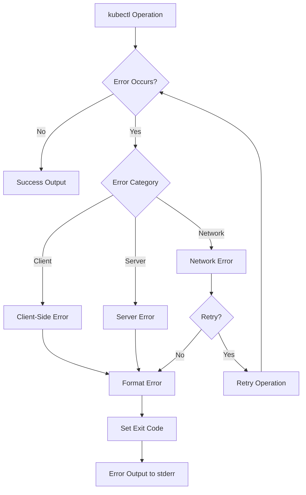
```mermaid
graph TD
    Operation[kubectl Operation] --> Error{Error Occurs?}

    Error -->|No| Success[Success Output]
    Error -->|Yes| Categorize{Error Category}

    Categorize -->|Client| ClientError[Client-Side Error]
    Categorize -->|Network| NetworkError[Network Error]
    Categorize -->|Server| ServerError[Server Error]

    ClientError --> Format[Format Error]
    NetworkError --> Retry{Retry?}
    ServerError --> Format

    Retry -->|Yes| RetryOp[Retry Operation]
    Retry -->|No| Format

    RetryOp --> Error

    Format --> ExitCode[Set Exit Code]
    ExitCode --> Output[Error Output to stderr]
```

### Error Categories

| Category | Exit Code | Examples |
|----------|-----------|----------|
| **Success** | 0 | Operation completed successfully |
| **Generic Error** | 1 | Unknown or uncategorized error |
| **Invalid Usage** | 1 | Missing required arguments, invalid flags |
| **Not Found** | 1 | Resource not found (from server) |
| **Unauthorized** | 1 | Authentication failure |
| **Forbidden** | 1 | Authorization failure (RBAC) |
| **Conflict** | 1 | Resource conflict (e.g., already exists) |

### Error Messages

kubectl provides contextual error messages:

```bash
# Resource not found
$ kubectl get pod nonexistent
Error from server (NotFound): pods "nonexistent" not found

# Permission denied
$ kubectl delete deployment nginx
Error from server (Forbidden): deployments.apps "nginx" is forbidden:
User "john" cannot delete resource "deployments" in API group "apps" in the namespace "default"

# Invalid resource type
$ kubectl get po nginx
error: the server doesn't have a resource type "po"
Did you mean "pod"?
```

---

## Performance Characteristics

### Latency Profile

Typical kubectl operation latencies:

```mermaid
gantt
    title kubectl Operation Latency (typical)
    dateFormat X
    axisFormat %L ms

    section Get Single Pod
    Client processing: 0, 10
    Network request: 10, 30
    Server processing: 30, 40
    Network response: 40, 60
    Output formatting: 60, 70

    section List 100 Pods
    Client processing: 0, 15
    Network request: 15, 40
    Server processing: 40, 120
    Network response: 120, 200
    Output formatting: 200, 220

    section Apply Small Resource
    File reading: 0, 5
    YAML parsing: 5, 15
    Three-way merge: 15, 30
    Network request: 30, 55
    Server processing: 55, 120
    Network response: 120, 140
```

### Optimization Strategies

1. **Client-Side Caching**
   - Discovery data cached for 10 minutes
   - OpenAPI schema cached
   - Reduces repeated discovery calls

2. **Request Chunking**
   - Large list operations chunked (default 500)
   - `--chunk-size` flag for customization
   - Reduces memory usage

3. **Connection Reuse**
   - HTTP keep-alive enabled
   - Connection pooling
   - Reduces TLS handshake overhead

4. **Parallel Operations**
   - Visitor pattern supports concurrency
   - File operations parallelized
   - `--allow-missing-template-keys` for partial failures

**Code Reference**: Chunking in `staging/src/k8s.io/kubectl/pkg/cmd/get/get.go`

---

## Related Documents

- **[00-README.md](../00-README.md)**: Documentation navigation
- **[01-REQUIREMENTS.md](../01-REQUIREMENTS.md)**: Design requirements
- **[02-FUNCTIONAL-SPEC.md](../02-FUNCTIONAL-SPEC.md)**: Functional capabilities
- **[GLOSSARY.md](../GLOSSARY.md)**: Terminology reference
- **[02-command-architecture.md](02-command-architecture.md)**: Command structure details
- **[03-resource-management.md](03-resource-management.md)**: Resource builder deep dive
- **[04-config-management.md](04-config-management.md)**: Configuration system

---

## Summary

kubectl's system architecture is designed around these key principles:

1. **Thin Client**: Minimal client-side logic, API server is authoritative
2. **Stateless**: No local state, all state in Kubernetes cluster
3. **RESTful**: Standard HTTP/REST communication with API server
4. **Modular**: Clear separation of concerns (CLI, builder, client, printer)
5. **Extensible**: Plugin architecture for custom functionality
6. **User-Friendly**: Rich output options, helpful error messages

The architecture enables kubectl to be:
- **Simple to use**: Intuitive commands for common operations
- **Powerful**: Comprehensive access to all Kubernetes features
- **Reliable**: Minimal client logic reduces failure points
- **Maintainable**: Clear architecture supports long-term maintenance
- **Extensible**: Community can add functionality via plugins

Understanding this system architecture provides the foundation for diving deeper into specific subsystems in the subsequent high-level and middle-level documentation.

---

**Last Updated**: 2025-10-21
**Document Version**: 1.0
**Maintainer**: SIG CLI
