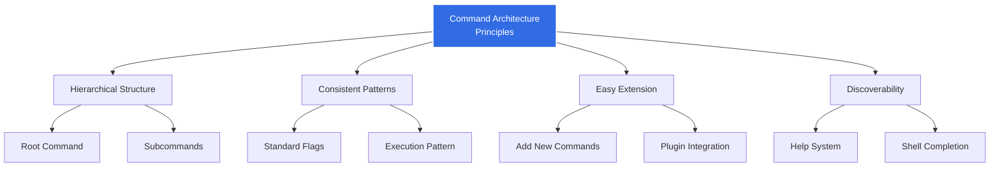
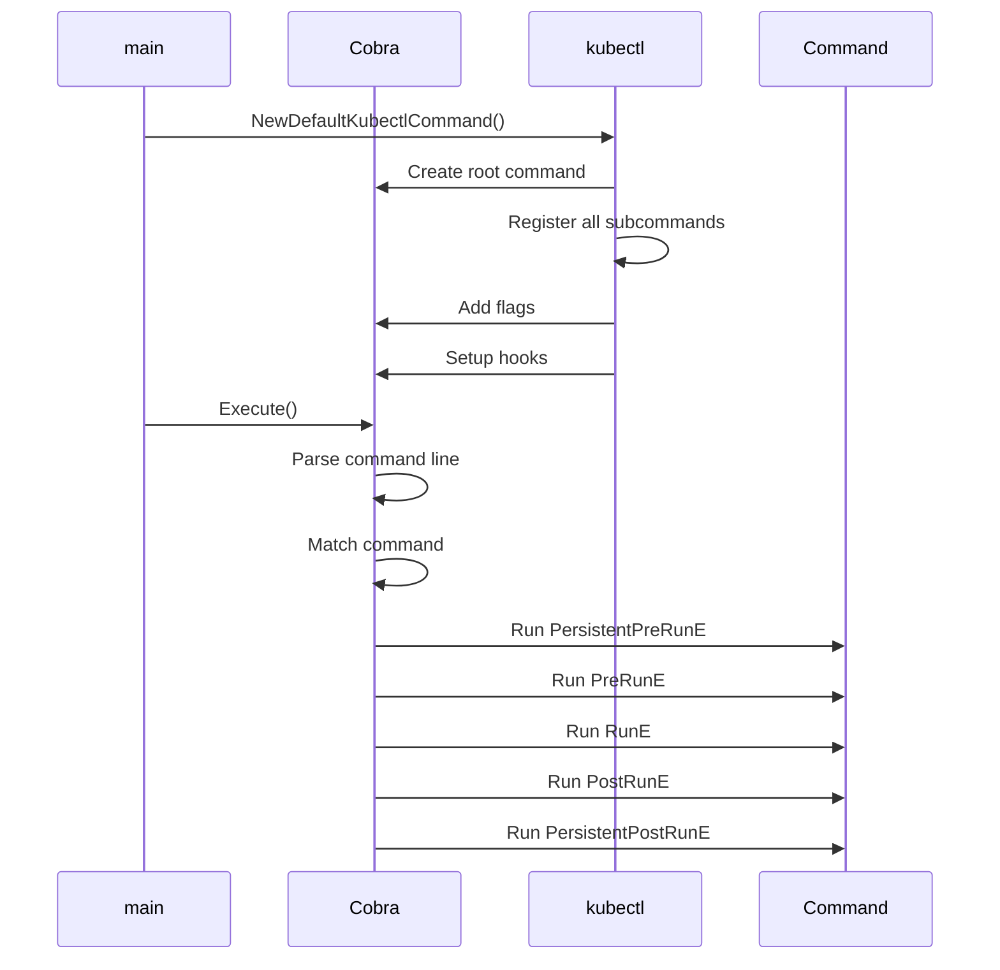
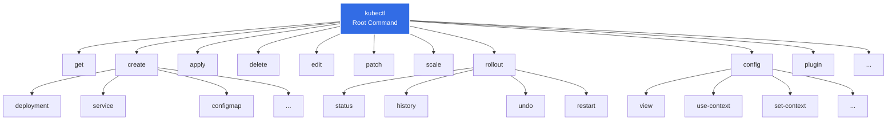
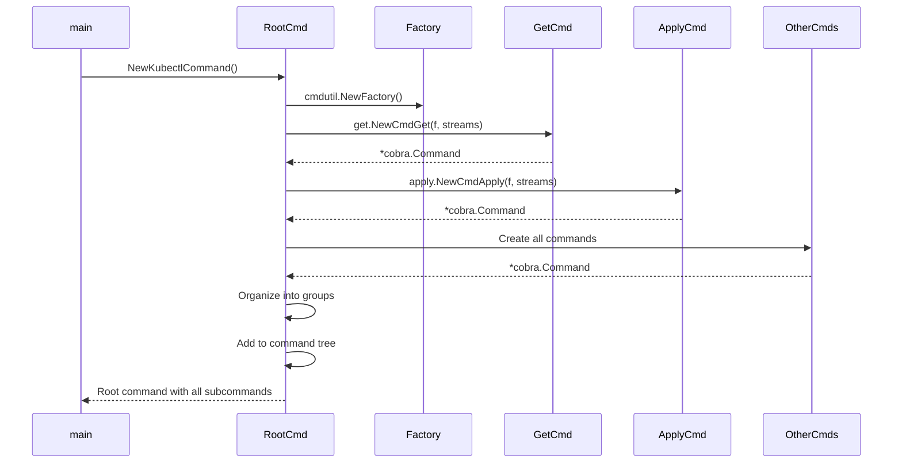
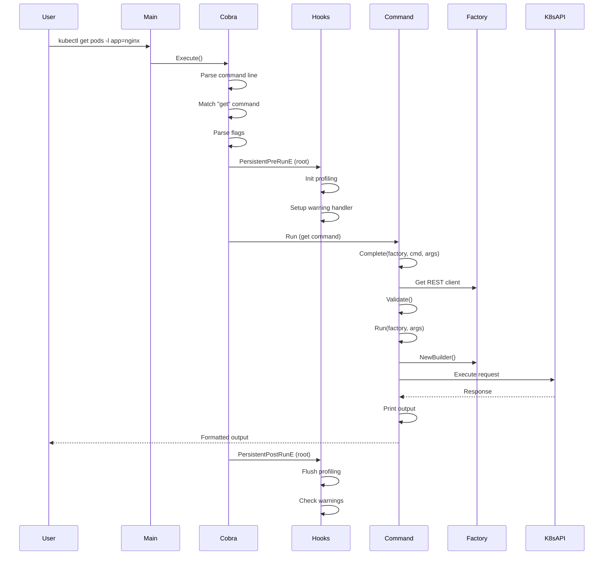
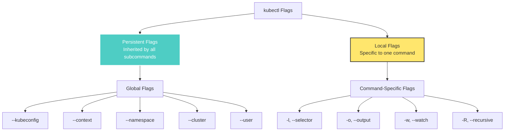
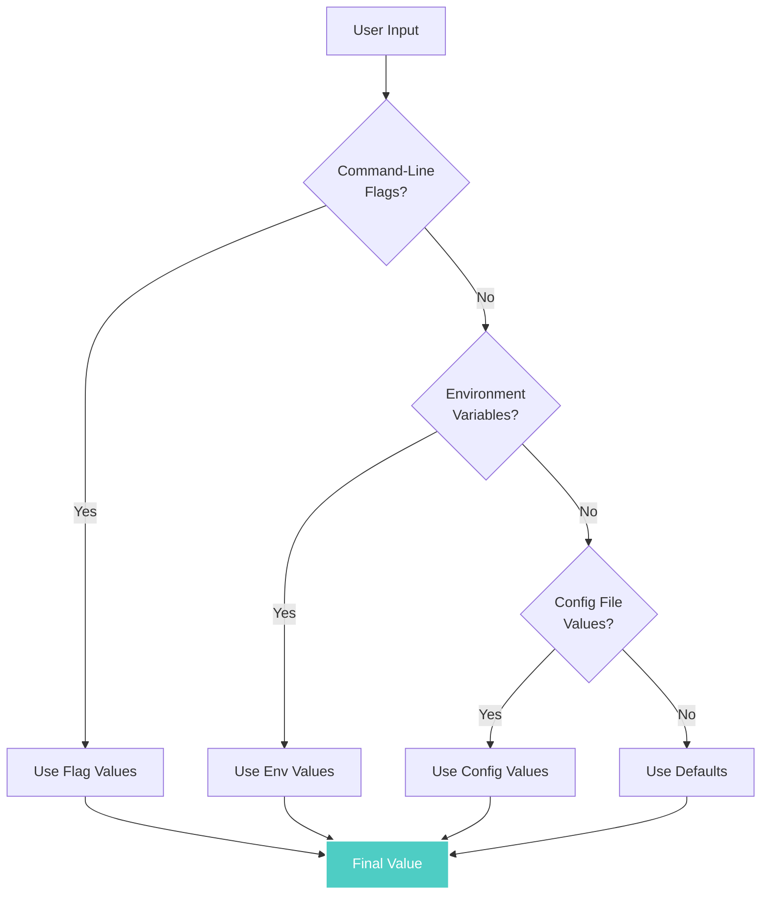
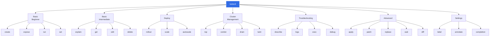
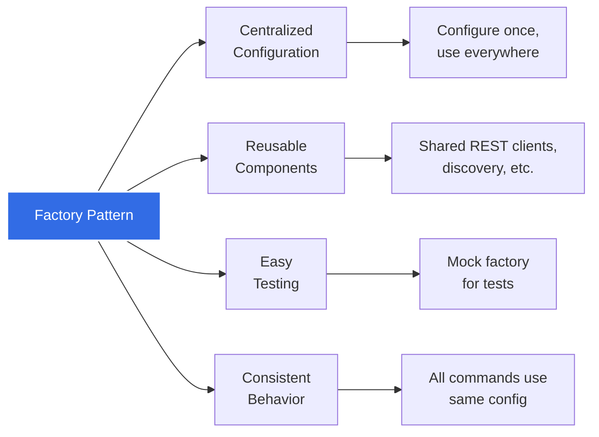

# kubectl Command Architecture

**Document Version**: 1.0
**Last Updated**: 2025-10-21
**Status**: High-Level Architecture Documentation

---

## Table of Contents

- [Overview](#overview)
- [Cobra Framework](#cobra-framework)
- [Command Tree Structure](#command-tree-structure)
- [Command Registration](#command-registration)
- [Command Execution Flow](#command-execution-flow)
- [Flag System](#flag-system)
- [Help System](#help-system)
- [Shell Completion](#shell-completion)
- [Command Groups](#command-groups)
- [Factory Pattern](#factory-pattern)

---

## Overview

kubectl's command architecture is built on the Cobra framework, providing a hierarchical command structure with consistent flag handling, automatic help generation, and shell completion support. The architecture supports 40+ commands organized into logical groups, all following consistent patterns for implementation and execution.

### Architecture Principles



---

## Cobra Framework

### What is Cobra?

Cobra is a powerful Go library for creating modern CLI applications. kubectl uses Cobra for all command-line parsing and command organization.

**Key Features**:
- Hierarchical command structure
- Automatic help generation
- Flag parsing (persistent and local flags)
- Shell completion (bash, zsh, fish, PowerShell)
- Command aliases and suggestions
- PreRun/PostRun hooks

**Code Reference**: `github.com/spf13/cobra` (external dependency)

### Basic Cobra Structure

```go
type cobra.Command struct {
    Use   string                      // Command usage line
    Short string                      // Brief description
    Long  string                      // Detailed description
    Run   func(*cobra.Command, []string) // Execution function

    // Lifecycle hooks
    PersistentPreRunE  func(*cobra.Command, []string) error
    PreRunE            func(*cobra.Command, []string) error
    RunE               func(*cobra.Command, []string) error
    PostRunE           func(*cobra.Command, []string) error
    PersistentPostRunE func(*cobra.Command, []string) error

    // Flags
    Flags            *pflag.FlagSet  // Local flags
    PersistentFlags  *pflag.FlagSet  // Inherited by children

    // Subcommands
    Commands         []*cobra.Command
    Parent           *cobra.Command
}
```

### kubectl's Cobra Usage



**Code Reference**: Root command creation at `staging/src/k8s.io/kubectl/pkg/cmd/cmd.go:306`

---

## Command Tree Structure

### kubectl Command Hierarchy



### Root Command Structure

```go
// From staging/src/k8s.io/kubectl/pkg/cmd/cmd.go:306-349
func NewKubectlCommand(o KubectlOptions) *cobra.Command {
    cmds := &cobra.Command{
        Use:   "kubectl",
        Short: i18n.T("kubectl controls the Kubernetes cluster manager"),
        Long: templates.LongDesc(`
            kubectl controls the Kubernetes cluster manager.

            Find more information at:
                https://kubernetes.io/docs/reference/kubectl/`),
        Run: runHelp,

        // Global pre-run hook
        PersistentPreRunE: func(cmd *cobra.Command, args []string) error {
            rest.SetDefaultWarningHandler(warningHandler)

            if cmd.Name() == cobra.ShellCompRequestCmd {
                plugin.SetupPluginCompletion(cmd, args)
            }

            return initProfiling()
        },

        // Global post-run hook
        PersistentPostRunE: func(*cobra.Command, []string) error {
            if err := flushProfiling(); err != nil {
                return err
            }
            if warningsAsErrors {
                count := warningHandler.WarningCount()
                if count > 0 {
                    return fmt.Errorf("%d warnings received", count)
                }
            }
            return nil
        },
    }

    // Add flags, subcommands, etc.
    // ...

    return cmds
}
```

---

## Command Registration

### Command Group Registration

kubectl organizes commands into logical groups:

```go
// From staging/src/k8s.io/kubectl/pkg/cmd/cmd.go:390-463
groups := templates.CommandGroups{
    {
        Message: "Basic Commands (Beginner):",
        Commands: []*cobra.Command{
            create.NewCmdCreate(f, o.IOStreams),
            expose.NewCmdExposeService(f, o.IOStreams),
            run.NewCmdRun(f, o.IOStreams),
            set.NewCmdSet(f, o.IOStreams),
        },
    },
    {
        Message: "Basic Commands (Intermediate):",
        Commands: []*cobra.Command{
            explain.NewCmdExplain("kubectl", f, o.IOStreams),
            getCmd,
            edit.NewCmdEdit(f, o.IOStreams),
            delete.NewCmdDelete(f, o.IOStreams),
        },
    },
    {
        Message: "Deploy Commands:",
        Commands: []*cobra.Command{
            rollout.NewCmdRollout(f, o.IOStreams),
            scale.NewCmdScale(f, o.IOStreams),
            autoscale.NewCmdAutoscale(f, o.IOStreams),
        },
    },
    {
        Message: "Cluster Management Commands:",
        Commands: []*cobra.Command{
            certificates.NewCmdCertificate(f, o.IOStreams),
            clusterinfo.NewCmdClusterInfo(f, o.IOStreams),
            top.NewCmdTop(f, o.IOStreams),
            drain.NewCmdCordon(f, o.IOStreams),
            drain.NewCmdUncordon(f, o.IOStreams),
            drain.NewCmdDrain(f, o.IOStreams),
            taint.NewCmdTaint(f, o.IOStreams),
        },
    },
    {
        Message: "Troubleshooting and Debugging Commands:",
        Commands: []*cobra.Command{
            describe.NewCmdDescribe("kubectl", f, o.IOStreams),
            logs.NewCmdLogs(f, o.IOStreams),
            attach.NewCmdAttach(f, o.IOStreams),
            cmdexec.NewCmdExec(f, o.IOStreams),
            portforward.NewCmdPortForward(f, o.IOStreams),
            proxyCmd,
            cp.NewCmdCp(f, o.IOStreams),
            auth.NewCmdAuth(f, o.IOStreams),
            debugCmd,
            events.NewCmdEvents(f, o.IOStreams),
        },
    },
    {
        Message: "Advanced Commands:",
        Commands: []*cobra.Command{
            diff.NewCmdDiff(f, o.IOStreams),
            apply.NewCmdApply("kubectl", f, o.IOStreams),
            patch.NewCmdPatch(f, o.IOStreams),
            replace.NewCmdReplace(f, o.IOStreams),
            wait.NewCmdWait(f, o.IOStreams),
            kustomize.NewCmdKustomize(o.IOStreams),
        },
    },
    {
        Message: "Settings Commands:",
        Commands: []*cobra.Command{
            label.NewCmdLabel(f, o.IOStreams),
            annotate.NewCmdAnnotate("kubectl", f, o.IOStreams),
            completion.NewCmdCompletion(o.IOStreams.Out, ""),
        },
    },
}

groups.Add(cmds)
```

### Command Creation Pattern

Every kubectl command follows a consistent pattern:

```go
// Example: kubectl get command
// From staging/src/k8s.io/kubectl/pkg/cmd/get/get.go

func NewCmdGet(parent string, f cmdutil.Factory, streams genericiooptions.IOStreams) *cobra.Command {
    o := NewGetOptions(parent, streams)

    cmd := &cobra.Command{
        Use:   "get [(-o|--output=)json|yaml|name|go-template|go-template-file|template|templatefile|jsonpath|jsonpath-as-json|jsonpath-file|custom-columns|custom-columns-file|wide] (TYPE[.VERSION][.GROUP] [NAME | -l label] | TYPE[.VERSION][.GROUP]/NAME ...) [flags]",
        Short: i18n.T("Display one or many resources"),
        Long:  getLong,
        Example: getExample,

        // Validation
        ValidArgsFunction: utilcomp.ResourceTypeAndNameCompletionFunc(f),

        // Execution
        Run: func(cmd *cobra.Command, args []string) {
            cmdutil.CheckErr(o.Complete(f, cmd, args))
            cmdutil.CheckErr(o.Validate())
            cmdutil.CheckErr(o.Run(f, args))
        },
    }

    // Add command-specific flags
    o.PrintFlags.AddFlags(cmd)
    cmd.Flags().StringVarP(&o.LabelSelector, "selector", "l", o.LabelSelector, "Selector (label query)")
    cmd.Flags().StringVar(&o.FieldSelector, "field-selector", o.FieldSelector, "Selector (field query)")
    // ... more flags

    return cmd
}
```

### Registration Flow



---

## Command Execution Flow

### Complete Execution Flow



### Three-Phase Execution Pattern

kubectl commands follow a three-phase execution pattern:

```go
type Command interface {
    // Phase 1: Complete - populate options from flags and factory
    Complete(f cmdutil.Factory, cmd *cobra.Command, args []string) error

    // Phase 2: Validate - validate all inputs
    Validate() error

    // Phase 3: Run - execute the command
    Run(f cmdutil.Factory, args []string) error
}
```

**Example**: kubectl get

```go
// Phase 1: Complete
func (o *GetOptions) Complete(f cmdutil.Factory, cmd *cobra.Command, args []string) error {
    // Set namespace from flag or context
    var err error
    o.Namespace, o.ExplicitNamespace, err = f.ToRawKubeConfigLoader().Namespace()
    if err != nil {
        return err
    }

    // Create printer based on output flag
    o.ToPrinter = func(mapping *meta.RESTMapping, outputObjects *bool, withNamespace bool, withKind bool) (printers.ResourcePrinterFunc, error) {
        return o.PrintFlags.ToPrinter()
    }

    return nil
}

// Phase 2: Validate
func (o *GetOptions) Validate() error {
    if len(o.Raw) > 0 {
        if o.Watch || o.WatchOnly || len(o.LabelSelector) > 0 {
            return fmt.Errorf("--raw cannot be used with --watch, --watch-only, or --selector")
        }
    }
    return nil
}

// Phase 3: Run
func (o *GetOptions) Run(f cmdutil.Factory, args []string) error {
    // Build resource query
    r := f.NewBuilder().
        Unstructured().
        NamespaceParam(o.Namespace).DefaultNamespace().
        FilenameParam(o.ExplicitNamespace, &o.FilenameOptions).
        LabelSelectorParam(o.LabelSelector).
        FieldSelectorParam(o.FieldSelector).
        ResourceTypeOrNameArgs(true, args...).
        ContinueOnError().
        Latest().
        Flatten().
        Do()

    // Visit resources and print
    return r.Visit(func(info *resource.Info, err error) error {
        if err != nil {
            return err
        }
        return o.ToPrinter(info.Object, o.Out)
    })
}
```

---

## Flag System

### Flag Types

kubectl uses two types of flags:



### Persistent Flags (Global)

Applied to all commands:

```go
// From staging/src/k8s.io/kubectl/pkg/cmd/cmd.go:354-371
flags := cmds.PersistentFlags()

// Profiling flags
addProfilingFlags(flags)

// Warning handling
flags.BoolVar(&warningsAsErrors, "warnings-as-errors", warningsAsErrors,
    "Treat warnings received from the server as errors and exit with a non-zero exit code")

// kubeconfig flags
kubeConfigFlags := o.ConfigFlags
kubeConfigFlags.AddFlags(flags)
// Adds: --kubeconfig, --context, --cluster, --user, --namespace, --server, etc.

// Match version flags
matchVersionKubeConfigFlags := cmdutil.NewMatchVersionFlags(kubeConfigFlags)
matchVersionKubeConfigFlags.AddFlags(flags)
```

### Common Global Flags

| Flag | Short | Type | Purpose |
|------|-------|------|---------|
| `--kubeconfig` | - | string | Path to kubeconfig file |
| `--context` | - | string | Context to use |
| `--cluster` | - | string | Cluster to use |
| `--user` | - | string | User credentials to use |
| `--namespace` | `-n` | string | Namespace for request |
| `--server` | `-s` | string | API server address |
| `--insecure-skip-tls-verify` | - | bool | Skip TLS verification |
| `--certificate-authority` | - | string | CA certificate path |
| `--client-certificate` | - | string | Client cert path |
| `--client-key` | - | string | Client key path |
| `--token` | - | string | Bearer token |
| `--v` | - | int | Log verbosity level |

### Local Flags (Command-Specific)

Example from `kubectl get`:

```go
// Output flags (from PrintFlags)
o.PrintFlags.AddFlags(cmd)
// Adds: -o/--output, --template, --sort-by, --show-labels, --no-headers, etc.

// Selector flags
cmd.Flags().StringVarP(&o.LabelSelector, "selector", "l", o.LabelSelector,
    "Selector (label query) to filter on")
cmd.Flags().StringVar(&o.FieldSelector, "field-selector", o.FieldSelector,
    "Selector (field query) to filter on")

// Watch flags
cmd.Flags().BoolVarP(&o.Watch, "watch", "w", o.Watch,
    "Watch for changes after listing/getting")
cmd.Flags().BoolVar(&o.WatchOnly, "watch-only", o.WatchOnly,
    "Watch for changes to the requested object(s)")

// Namespace flags
cmd.Flags().BoolVarP(&o.AllNamespaces, "all-namespaces", "A", o.AllNamespaces,
    "List resources in all namespaces")

// Chunk size
cmd.Flags().Int64Var(&o.ChunkSize, "chunk-size", o.ChunkSize,
    "Return large lists in chunks")
```

### Flag Precedence



**Precedence Order** (highest to lowest):
1. Command-line flags
2. Environment variables (e.g., `KUBECONFIG`)
3. Config file values (e.g., `~/.kube/config`)
4. Built-in defaults

---

## Help System

### Automatic Help Generation

Cobra automatically generates help for all commands:

```bash
# Root help
$ kubectl --help
kubectl controls the Kubernetes cluster manager.

Find more information at: https://kubernetes.io/docs/reference/kubectl/

Basic Commands (Beginner):
  create      Create a resource from a file or from stdin
  expose      Take a replication controller, service, deployment or pod...
  run         Run a particular image on the cluster
  set         Set specific features on objects

Basic Commands (Intermediate):
  explain     Documentation of resources
  get         Display one or many resources
  edit        Edit a resource on the server
  delete      Delete resources by filenames, stdin, resources and names...
...

# Command-specific help
$ kubectl get --help
Display one or many resources

Prints a table of the most important information about the specified resources...

Usage:
  kubectl get [flags] TYPE [NAME | -l label] [options]

Examples:
  # List all pods in ps output format
  kubectl get pods

  # List all pods with more information
  kubectl get pods -o wide
...
```

### Help Template

kubectl customizes the help template:

```go
// From staging/src/k8s.io/kubectl/pkg/cmd/cmd.go:480
templates.ActsAsRootCommand(cmds, filters, groups...)
```

This groups commands and adds custom formatting.

### Command Documentation Fields

```go
cmd := &cobra.Command{
    Use:   "get [flags] TYPE [NAME]",  // Usage line
    Short: "Display one or many resources",  // Brief description (one line)
    Long:  getLong,  // Detailed description (multiple paragraphs)
    Example: getExample,  // Usage examples
}
```

**Long Description Example**:
```go
var getLong = templates.LongDesc(`
    Display one or many resources.

    Prints a table of the most important information about the specified resources.
    You can filter the list using a label selector and the --selector flag. If the
    desired resource type is namespaced you will only see results in the current
    namespace if you don't specify any namespace.

    By specifying the output as 'template' and providing a Go template as the value
    of the --template flag, you can filter the attributes of the fetched resources.`)
```

**Examples**:
```go
var getExample = templates.Examples(`
    # List all pods in ps output format
    kubectl get pods

    # List all pods in ps output format with more information
    kubectl get pods -o wide

    # List a single replication controller with specified NAME
    kubectl get replicationcontroller web

    # List deployments in JSON output format
    kubectl get deployments.v1.apps -o json

    # List a pod identified by type and name specified in "pod.yaml"
    kubectl get -f pod.yaml -o json`)
```

---

## Shell Completion

### Completion Support

kubectl supports shell completion for:
- bash
- zsh
- fish
- PowerShell

### Generating Completion Scripts

```bash
# Bash
kubectl completion bash > ~/.kubectl_completion
source ~/.kubectl_completion

# Zsh
kubectl completion zsh > "${fpath[1]}/_kubectl"

# Fish
kubectl completion fish | source

# PowerShell
kubectl completion powershell | Out-String | Invoke-Expression
```

### Completion Functions

kubectl provides intelligent completion:

```go
// From staging/src/k8s.io/kubectl/pkg/cmd/cmd.go:385-388
getCmd := get.NewCmdGet("kubectl", f, o.IOStreams)
getCmd.ValidArgsFunction = utilcomp.ResourceTypeAndNameCompletionFunc(f)
```

**Completion Types**:
1. **Resource Type Completion**: Suggests resource types (pods, services, etc.)
2. **Resource Name Completion**: Suggests resource names after type
3. **Flag Completion**: Suggests valid flag values
4. **Context Completion**: Suggests available contexts

**Example**:
```bash
$ kubectl get <TAB>
pods  services  deployments  configmaps  secrets  ...

$ kubectl get pods <TAB>
nginx-123  redis-456  postgres-789  ...

$ kubectl get pods nginx-123 -o <TAB>
json  yaml  wide  name  custom-columns  jsonpath  ...
```

### Completion Implementation

```go
// Resource type and name completion
func ResourceTypeAndNameCompletionFunc(f cmdutil.Factory) func(*cobra.Command, []string, string) ([]string, cobra.ShellCompDirective) {
    return func(cmd *cobra.Command, args []string, toComplete string) ([]string, cobra.ShellCompDirective) {
        if len(args) == 0 {
            // Complete resource types
            return CompGetResourceList(f, toComplete), cobra.ShellCompDirectiveNoFileComp
        }

        if len(args) == 1 {
            // Complete resource names for the specified type
            return CompGetResource(f, args[0], toComplete), cobra.ShellCompDirectiveNoFileComp
        }

        return nil, cobra.ShellCompDirectiveNoFileComp
    }
}
```

**Code Reference**: `staging/src/k8s.io/kubectl/pkg/util/completion/completion.go`

---

## Command Groups

### Group Organization

kubectl organizes 40+ commands into 6 groups:



### Group Purposes

| Group | Purpose | Commands |
|-------|---------|----------|
| **Basic (Beginner)** | Simple resource creation | create, expose, run, set |
| **Basic (Intermediate)** | Resource inspection and editing | explain, get, edit, delete |
| **Deploy** | Deployment management | rollout, scale, autoscale |
| **Cluster Management** | Node and cluster operations | top, cordon, drain, taint |
| **Troubleshooting** | Debugging and diagnostics | describe, logs, exec, debug |
| **Advanced** | Sophisticated operations | apply, patch, replace, wait, diff |
| **Settings** | Resource metadata | label, annotate, completion |

---

## Factory Pattern

### cmdutil.Factory

kubectl uses a Factory pattern to provide common utilities to all commands:

```go
type Factory interface {
    // Creates a builder for resource operations
    NewBuilder() *resource.Builder

    // Creates REST client
    RESTClient() (*rest.RESTClient, error)

    // Creates dynamic client
    DynamicClient() (dynamic.Interface, error)

    // Creates Kubernetes client set
    KubernetesClientSet() (*kubernetes.Clientset, error)

    // Gets namespace from context
    ToRawKubeConfigLoader() clientcmd.ClientConfig

    // Gets discovery client
    ToDiscoveryClient() (discovery.CachedDiscoveryInterface, error)

    // Gets REST mapper
    ToRESTMapper() (meta.RESTMapper, error)

    // Validates resources
    Validator(validate bool) (validation.Schema, error)
}
```

**Code Reference**: `staging/src/k8s.io/kubectl/pkg/cmd/util/factory.go`

### Factory Usage in Commands

```go
func NewCmdGet(parent string, f cmdutil.Factory, streams genericiooptions.IOStreams) *cobra.Command {
    cmd := &cobra.Command{
        Run: func(cmd *cobra.Command, args []string) {
            // Use factory to create builder
            r := f.NewBuilder().
                Unstructured().
                NamespaceParam(namespace).
                // ...
                Do()

            // Use factory to get REST client
            client, err := f.RESTClient()

            // Use factory for discovery
            discoveryClient, err := f.ToDiscoveryClient()
        },
    }

    return cmd
}
```

### Factory Benefits



---

## Related Documents

- **[01-system-overview.md](01-system-overview.md)**: Overall system architecture
- **[03-resource-management.md](03-resource-management.md)**: Resource builder pattern
- **[04-config-management.md](04-config-management.md)**: Configuration and authentication
- **[../02-FUNCTIONAL-SPEC.md](../02-FUNCTIONAL-SPEC.md)**: All command specifications
- **[../low-level/01-cobra-command-structure.md](../low-level/01-cobra-command-structure.md)**: Detailed Cobra implementation

---

## Summary

kubectl's command architecture is built on these key components:

1. **Cobra Framework**: Provides command structure, flag parsing, and help generation
2. **Hierarchical Organization**: 40+ commands organized into 6 logical groups
3. **Consistent Patterns**: All commands follow Complete-Validate-Run pattern
4. **Factory Pattern**: Centralized utilities and configuration
5. **Rich Flags**: Global and local flags with precedence rules
6. **Automatic Help**: Generated help and usage information
7. **Shell Completion**: Intelligent completion for all shells

This architecture enables:
- **Easy Extension**: Adding new commands follows clear patterns
- **Consistency**: All commands behave similarly
- **Discoverability**: Users can explore commands via help and completion
- **Maintainability**: Clear separation of concerns
- **Testability**: Factory pattern enables easy testing

Understanding the command architecture is essential for contributing new commands or understanding how kubectl processes user input.

---

**Last Updated**: 2025-10-21
**Document Version**: 1.0
**Maintainer**: SIG CLI
