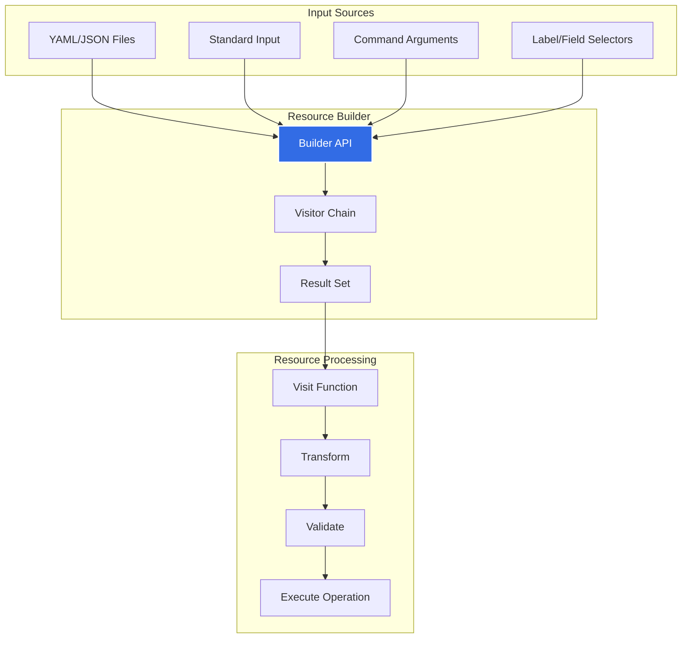
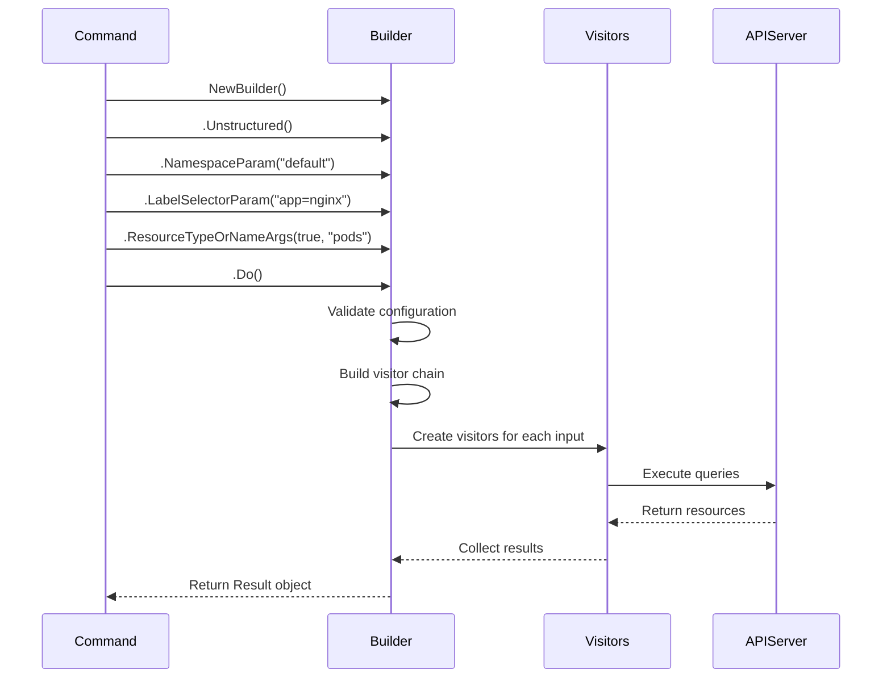
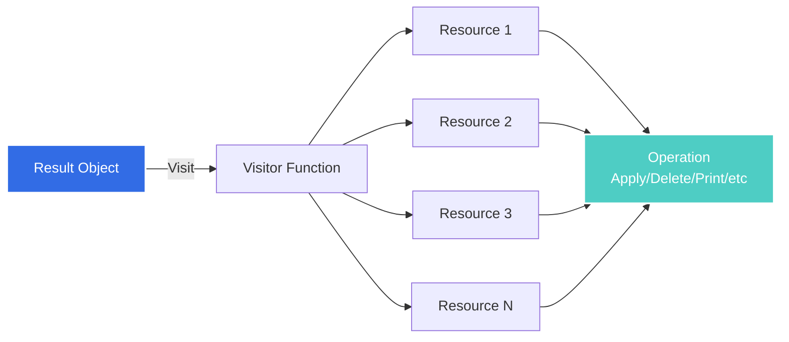
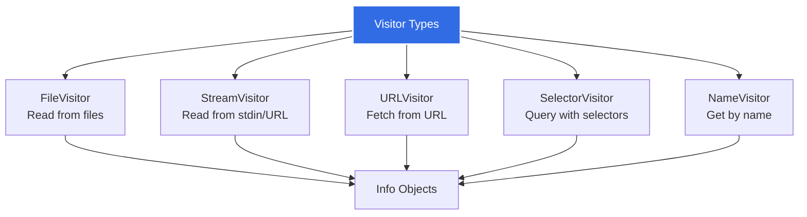
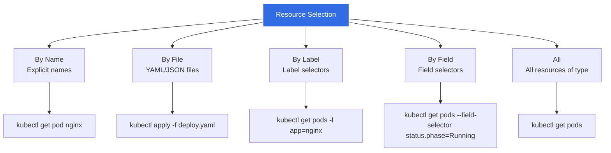
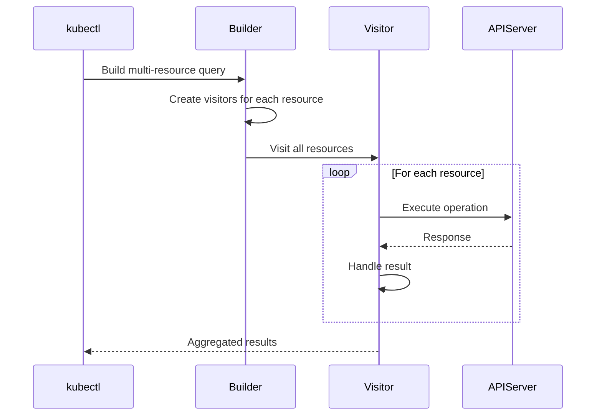
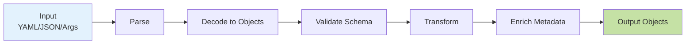
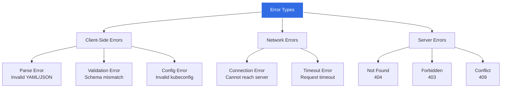

# kubectl Resource Management

**Document Version**: 1.0
**Last Updated**: 2025-10-21
**Status**: High-Level Architecture Documentation

---

## Table of Contents

- [Overview](#overview)
- [Resource Builder Pattern](#resource-builder-pattern)
- [Visitor Pattern](#visitor-pattern)
- [Resource Selection](#resource-selection)
- [Multi-Resource Operations](#multi-resource-operations)
- [Resource Transformation Pipeline](#resource-transformation-pipeline)
- [Result Processing](#result-processing)
- [Error Handling](#error-handling)
- [Performance Optimizations](#performance-optimizations)

---

## Overview

kubectl's resource management system is built on two powerful design patterns: the Builder pattern for constructing resource queries and the Visitor pattern for operating on resource collections. This architecture provides a flexible, composable API for selecting, transforming, and processing Kubernetes resources.

### Core Components



**Key Principles**:
- **Lazy Evaluation**: Queries are not executed until `.Do()` is called
- **Fluent API**: Chainable methods for readability
- **Composability**: Combine multiple selection criteria
- **Error Handling**: Continue-on-error support for batch operations

---

## Resource Builder Pattern

### Builder Overview

The Resource Builder provides a fluent API for constructing resource queries:

```go
// Example: Build a query for pods with label app=nginx
result := f.NewBuilder().
    Unstructured().                              // Use unstructured objects
    NamespaceParam(namespace).                   // Set namespace
    DefaultNamespace().                          // Use default if not specified
    LabelSelectorParam("app=nginx").             // Filter by label
    ResourceTypeOrNameArgs(true, "pods").        // Resource type
    Latest().                                    // Get latest version
    Do()                                         // Execute query
```

**Code Reference**: `staging/src/k8s.io/cli-runtime/pkg/resource/builder.go:54-116`

### Builder Structure

```go
type Builder struct {
    // Discovery and mapping
    categoryExpanderFn CategoryExpanderFunc
    mapper             *mapper
    restMapperFn       RESTMapperFunc

    // Client configuration
    clientConfigFn ClientConfigFunc

    // Object type handling
    objectTyper          runtime.ObjectTyper
    negotiatedSerializer runtime.NegotiatedSerializer

    // Resource selection
    paths              []Visitor
    labelSelector      *string
    fieldSelector      *string
    resources          []string
    names              []string
    namespace          string
    allNamespace       bool

    // Behavior flags
    local              bool
    flatten            bool
    latest             bool
    continueOnError    bool
    singleResourceType bool

    // Constraints
    limitChunks        int64
    requireNamespace   bool
    requireObject      bool

    // Transformations
    requestTransforms  []RequestTransform

    // Validation
    schema             ContentValidator

    // Errors
    errs               []error
}
```

### Builder API Methods

#### Input Configuration

| Method | Purpose | Example |
|--------|---------|---------|
| `FilenameParam()` | Load from files | `.FilenameParam(false, &FilenameOptions{Filenames: []string{"deploy.yaml"}})` |
| `ResourceTypeOrNameArgs()` | Parse resource args | `.ResourceTypeOrNameArgs(true, "pods", "nginx")` |
| `ResourceNames()` | Set resource names | `.ResourceNames("deployment", "nginx", "redis")` |
| `Stdin()` | Read from stdin | `.Stdin()` |

#### Selection Configuration

| Method | Purpose | Example |
|--------|---------|---------|
| `NamespaceParam()` | Set namespace | `.NamespaceParam("kube-system")` |
| `DefaultNamespace()` | Use default namespace | `.DefaultNamespace()` |
| `AllNamespaces()` | Query all namespaces | `.AllNamespaces()` |
| `LabelSelectorParam()` | Filter by labels | `.LabelSelectorParam("app=nginx,env=prod")` |
| `FieldSelectorParam()` | Filter by fields | `.FieldSelectorParam("status.phase=Running")` |
| `SelectAllParam()` | Select all resources | `.SelectAllParam(true)` |

#### Behavior Configuration

| Method | Purpose | Example |
|--------|---------|---------|
| `Latest()` | Get latest version | `.Latest()` |
| `Flatten()` | Flatten lists | `.Flatten()` |
| `ContinueOnError()` | Don't stop on errors | `.ContinueOnError()` |
| `SingleResourceType()` | Require single type | `.SingleResourceType()` |
| `RequireObject()` | Require object existence | `.RequireObject(true)` |

#### Object Type Configuration

| Method | Purpose | Example |
|--------|---------|---------|
| `Unstructured()` | Use unstructured objects | `.Unstructured()` |
| `Local()` | Don't contact server | `.Local()` |

#### Execution

| Method | Purpose | Example |
|--------|---------|---------|
| `Do()` | Execute query | `.Do()` |

### Builder Flow



### Example: kubectl get pods -l app=nginx

```go
// From staging/src/k8s.io/kubectl/pkg/cmd/get/get.go
func (o *GetOptions) Run(f cmdutil.Factory, args []string) error {
    r := f.NewBuilder().
        Unstructured().                            // Use unstructured objects
        NamespaceParam(o.Namespace).               // Use namespace from flag/context
        DefaultNamespace().                        // Use default if not specified
        FilenameParam(o.ExplicitNamespace, &o.FilenameOptions).  // Files if specified
        LabelSelectorParam(o.LabelSelector).       // -l flag value
        FieldSelectorParam(o.FieldSelector).       // --field-selector value
        ResourceTypeOrNameArgs(true, args...).     // Parse "pods" from args
        RequestChunksOf(o.ChunkSize).              // Pagination
        ContinueOnError().                         // Don't stop on first error
        Latest().                                  // Get latest version
        Flatten().                                 // Flatten resource lists
        Do()                                       // Execute

    if err := r.Err(); err != nil {
        return err
    }

    // Visit each resource and print
    return r.Visit(func(info *resource.Info, err error) error {
        if err != nil {
            return err
        }
        return o.PrintObj(info.Object)
    })
}
```

---

## Visitor Pattern

### Visitor Overview

The Visitor pattern separates resource iteration from the operations performed on resources:



### Visitor Interface

```go
// VisitorFunc is a function that operates on a resource
type VisitorFunc func(info *Info, err error) error

// Visitor is an interface for visiting resources
type Visitor interface {
    Visit(VisitorFunc) error
}
```

**Code Reference**: `staging/src/k8s.io/cli-runtime/pkg/resource/visitor.go:45-54`

### Info Structure

Each resource visited is wrapped in an `Info` object:

```go
// From staging/src/k8s.io/cli-runtime/pkg/resource/visitor.go:64-92
type Info struct {
    // REST client for API calls
    Client RESTClient

    // REST mapping (API group, version, resource)
    Mapping *meta.RESTMapping

    // Resource identification
    Namespace string
    Name      string

    // Source of the resource (file, stdin, URL)
    Source string

    // The actual resource object
    Object runtime.Object

    // Resource version from server
    ResourceVersion string

    // Subresource if applicable (e.g., "/status", "/scale")
    Subresource string
}
```

### Visitor Types

kubectl uses several visitor implementations:



### Using Visitors

**Example 1: Print each resource**
```go
err := result.Visit(func(info *resource.Info, err error) error {
    if err != nil {
        return err
    }

    // Print resource name
    fmt.Printf("%s/%s\n", info.Mapping.Resource.Resource, info.Name)
    return nil
})
```

**Example 2: Delete each resource**
```go
err := result.Visit(func(info *resource.Info, err error) error {
    if err != nil {
        return err
    }

    // Delete the resource
    return info.Client.Delete().
        Namespace(info.Namespace).
        Resource(info.Mapping.Resource.Resource).
        Name(info.Name).
        Do(context.TODO()).
        Error()
})
```

**Example 3: Apply operation with three-way merge**
```go
err := result.Visit(func(info *resource.Info, err error) error {
    if err != nil {
        return err
    }

    // Get current state from server
    current, err := info.Get()
    if err != nil && !errors.IsNotFound(err) {
        return err
    }

    // Perform three-way merge
    patch, err := threeWayMerge(lastApplied, current, info.Object)
    if err != nil {
        return err
    }

    // Apply patch
    return info.Client.Patch(types.StrategicMergePatchType).
        Namespace(info.Namespace).
        Resource(info.Mapping.Resource.Resource).
        Name(info.Name).
        Body(patch).
        Do(context.TODO()).
        Error()
})
```

### Visitor Composition

Visitors can be composed for complex operations:

```go
// DecoratedVisitor wraps another visitor
type DecoratedVisitor struct {
    visitor Visitor
    decorators []VisitorFunc
}

// Visit applies decorators then visits resources
func (v DecoratedVisitor) Visit(fn VisitorFunc) error {
    return v.visitor.Visit(func(info *Info, err error) error {
        // Apply decorators
        for _, decorator := range v.decorators {
            if err := decorator(info, err); err != nil {
                return err
            }
        }
        // Apply final function
        return fn(info, err)
    })
}
```

---

## Resource Selection

### Selection Methods

kubectl supports multiple ways to select resources:



### 1. Selection by Name

```go
// Build query for specific named resources
result := f.NewBuilder().
    Unstructured().
    NamespaceParam(namespace).DefaultNamespace().
    ResourceTypeOrNameArgs(true, "pod", "nginx", "redis").  // Type and names
    Do()
```

**Generated API Call**:
```
GET /api/v1/namespaces/default/pods/nginx
GET /api/v1/namespaces/default/pods/redis
```

### 2. Selection by Label

```go
// Build query with label selector
result := f.NewBuilder().
    Unstructured().
    NamespaceParam(namespace).DefaultNamespace().
    LabelSelectorParam("app=nginx,env=prod").  // Label selector
    ResourceTypeOrNameArgs(true, "pods").
    Do()
```

**Generated API Call**:
```
GET /api/v1/namespaces/default/pods?labelSelector=app%3Dnginx%2Cenv%3Dprod
```

### 3. Selection by Field

```go
// Build query with field selector
result := f.NewBuilder().
    Unstructured().
    NamespaceParam(namespace).DefaultNamespace().
    FieldSelectorParam("status.phase=Running").  // Field selector
    ResourceTypeOrNameArgs(true, "pods").
    Do()
```

**Generated API Call**:
```
GET /api/v1/namespaces/default/pods?fieldSelector=status.phase%3DRunning
```

### 4. Selection from Files

```go
// Build query from YAML/JSON files
result := f.NewBuilder().
    Unstructured().
    FilenameParam(false, &resource.FilenameOptions{
        Filenames: []string{"deployment.yaml", "service.yaml"},
        Recursive: true,
    }).
    Flatten().
    Do()
```

**Process**:
1. Read files
2. Parse YAML/JSON
3. Convert to runtime.Objects
4. Validate against schema
5. Return as Info objects

### 5. Selection from Stdin

```bash
cat deployment.yaml | kubectl apply -f -
```

```go
// Build query from stdin
result := f.NewBuilder().
    Unstructured().
    Stdin().
    Flatten().
    Do()
```

### Combining Selection Methods

Multiple selection methods can be combined:

```go
result := f.NewBuilder().
    Unstructured().
    NamespaceParam(namespace).DefaultNamespace().
    FilenameParam(false, &options).              // From files
    LabelSelectorParam(selector).                // AND label selector
    ResourceTypeOrNameArgs(true, args...).       // AND command args
    Flatten().
    Do()
```

---

## Multi-Resource Operations

### Handling Multiple Resources

kubectl efficiently handles operations across multiple resources:



### Error Handling with ContinueOnError

```go
result := f.NewBuilder().
    Unstructured().
    FilenameParam(false, &options).
    ContinueOnError().  // Don't stop on first error
    Do()

err := result.Visit(func(info *resource.Info, err error) error {
    if err != nil {
        // Log error but continue
        fmt.Fprintf(os.Stderr, "error: %v\n", err)
        return nil  // Continue to next resource
    }

    // Process resource
    return processResource(info)
})
```

### Parallel Processing

Some operations can be parallelized:

```go
// Visit with concurrency
result.VisitWithConcurrency(func(info *resource.Info, err error) error {
    if err != nil {
        return err
    }
    return processResource(info)
}, maxConcurrency)
```

### Resource Batching

kubectl can batch API calls for efficiency:

```go
result := f.NewBuilder().
    Unstructured().
    NamespaceParam(namespace).DefaultNamespace().
    ResourceTypeOrNameArgs(true, "pods").
    RequestChunksOf(500).  // Fetch 500 at a time
    Do()
```

---

## Resource Transformation Pipeline

### Transformation Flow



### Transformation Steps

#### 1. Parsing

Convert input to structured data:

```go
// YAML to unstructured
decoder := yaml.NewYAMLOrJSONDecoder(reader, 4096)
obj := &unstructured.Unstructured{}
err := decoder.Decode(obj)
```

#### 2. Decoding

Convert to runtime.Object:

```go
// Unstructured to typed object
codec := unstructured.NewJSONFallbackEncoder(codec)
obj, err := runtime.Decode(codec, data)
```

#### 3. Validation

Validate against OpenAPI schema:

```go
// Validate object
err := validator.ValidateBytes(data)
```

#### 4. Defaulting

Apply default values:

```go
// Apply defaults
scheme.Default(obj)
```

#### 5. Namespace Setting

Set namespace if not specified:

```go
// Set namespace
if obj.GetNamespace() == "" {
    obj.SetNamespace(namespace)
}
```

### Request Transforms

Builders can apply transformations to requests:

```go
type RequestTransform func(req *rest.Request) *rest.Request

// Add transform to builder
builder.TransformRequests(func(req *rest.Request) *rest.Request {
    // Add custom header
    return req.SetHeader("X-Custom-Header", "value")
})
```

---

## Result Processing

### Result Object

The `Do()` method returns a Result object:

```go
type Result struct {
    visitor Visitor
    sources []Visitor
    err     error

    // Options
    ignoreErrors []utilerrors.Matcher
    targetsSingleItems bool
}
```

### Result Methods

| Method | Purpose | Example |
|--------|---------|---------|
| `Err()` | Get errors | `if err := result.Err(); err != nil { ... }` |
| `Infos()` | Get all Info objects | `infos, err := result.Infos()` |
| `Visit()` | Visit each resource | `result.Visit(func(info *Info, err error) error { ... })` |
| `Object()` | Get single object | `obj, err := result.Object()` |
| `ResourceMapping()` | Get REST mapping | `mapping := result.ResourceMapping()` |

### Processing Examples

**Get all resources**:
```go
infos, err := result.Infos()
if err != nil {
    return err
}

for _, info := range infos {
    fmt.Printf("%s/%s\n", info.Mapping.Resource.Resource, info.Name)
}
```

**Get single resource**:
```go
obj, err := result.Object()
if err != nil {
    return err
}

fmt.Printf("Type: %T\n", obj)
```

**Visit and transform**:
```go
var transformed []runtime.Object

err := result.Visit(func(info *resource.Info, err error) error {
    if err != nil {
        return err
    }

    // Transform object
    modified := transformObject(info.Object)
    transformed = append(transformed, modified)
    return nil
})
```

---

## Error Handling

### Error Categories



### Error Handling Strategies

#### 1. Fail Fast (Default)

```go
result := f.NewBuilder().
    Unstructured().
    FilenameParam(false, &options).
    Do()  // Stops on first error

if err := result.Err(); err != nil {
    return err  // Return immediately
}
```

#### 2. Continue on Error

```go
result := f.NewBuilder().
    Unstructured().
    FilenameParam(false, &options).
    ContinueOnError().  // Collect all errors
    Do()

// Get aggregated errors
if err := result.Err(); err != nil {
    // err contains all errors
    fmt.Fprintf(os.Stderr, "Errors: %v\n", err)
}
```

#### 3. Per-Resource Error Handling

```go
err := result.Visit(func(info *resource.Info, err error) error {
    if err != nil {
        // Handle error for this specific resource
        fmt.Fprintf(os.Stderr, "Error processing %s: %v\n", info.Name, err)
        return nil  // Continue to next resource
    }

    return processResource(info)
})
```

---

## Performance Optimizations

### 1. Chunking

Fetch large lists in chunks:

```go
result := f.NewBuilder().
    Unstructured().
    ResourceTypeOrNameArgs(true, "pods").
    RequestChunksOf(500).  // Fetch 500 pods at a time
    Do()
```

**Benefit**: Reduces memory usage for large lists.

### 2. Server-Side Filtering

Use selectors to filter on server:

```go
// Server filters, only matching pods returned
result := f.NewBuilder().
    Unstructured().
    LabelSelectorParam("app=nginx").
    FieldSelectorParam("status.phase=Running").
    ResourceTypeOrNameArgs(true, "pods").
    Do()
```

**Benefit**: Reduces network traffic and client-side processing.

### 3. Latest Version

Skip intermediate versions:

```go
result := f.NewBuilder().
    Unstructured().
    Latest().  // Get latest version only
    Do()
```

**Benefit**: Reduces unnecessary API calls.

### 4. Flattening

Flatten resource lists:

```go
result := f.NewBuilder().
    Unstructured().
    FilenameParam(false, &options).
    Flatten().  // Flatten lists to individual items
    Do()
```

**Benefit**: Simplifies visitor logic.

### 5. Caching

kubectl caches discovery data:

```bash
# Cache location
~/.kube/cache/discovery/
```

**Benefit**: Reduces repeated API discovery calls.

---

## Related Documents

- **[01-system-overview.md](01-system-overview.md)**: Overall architecture
- **[02-command-architecture.md](02-command-architecture.md)**: Command structure
- **[04-config-management.md](04-config-management.md)**: Configuration
- **[../middle-level/08-resource-builders.md](../middle-level/08-resource-builders.md)**: Detailed builder implementation
- **[../GLOSSARY.md](../GLOSSARY.md)**: Resource builder and visitor terms

---

## Summary

kubectl's resource management system provides:

1. **Builder Pattern**: Fluent API for constructing queries
2. **Visitor Pattern**: Separation of iteration from operations
3. **Flexible Selection**: By name, label, field, file, stdin
4. **Multi-Resource Support**: Batch operations with error handling
5. **Transformation Pipeline**: Parse, decode, validate, transform
6. **Performance Optimizations**: Chunking, caching, server-side filtering

This architecture enables kubectl to:
- Handle simple and complex queries with the same API
- Process multiple resources efficiently
- Provide consistent error handling
- Support diverse input sources
- Optimize performance for large-scale operations

Understanding resource management is essential for implementing kubectl commands and understanding how kubectl interacts with the Kubernetes API.

---

**Last Updated**: 2025-10-21
**Document Version**: 1.0
**Maintainer**: SIG CLI
