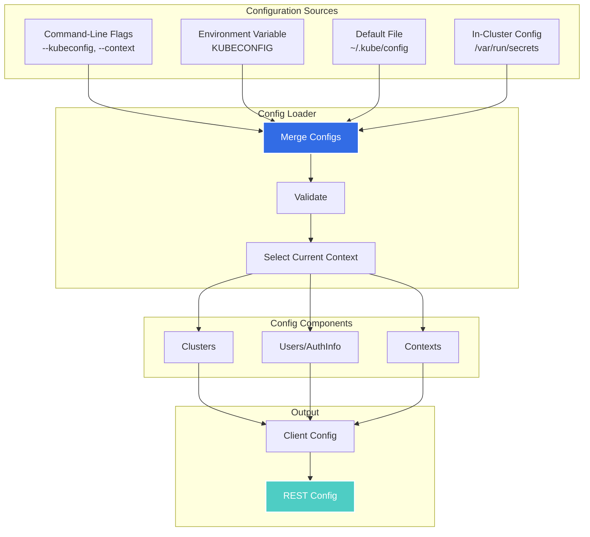
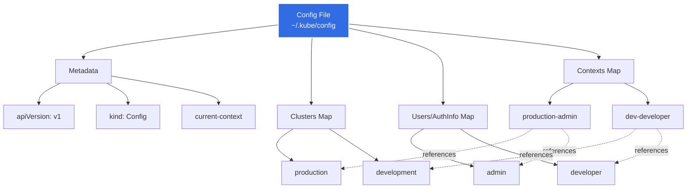
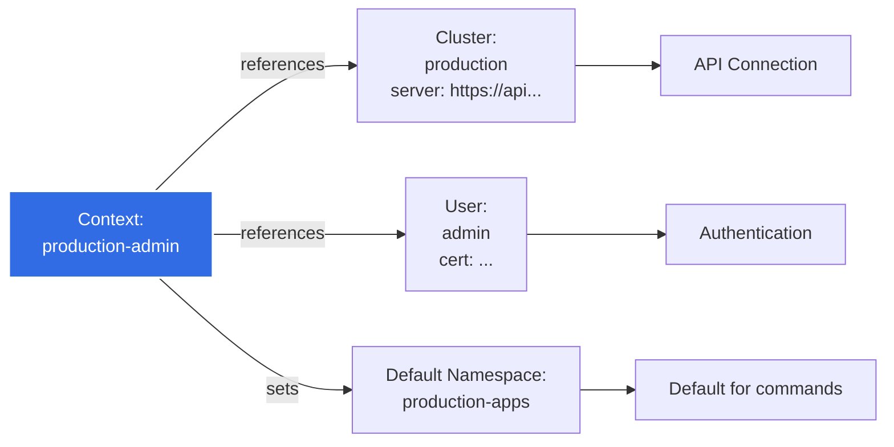
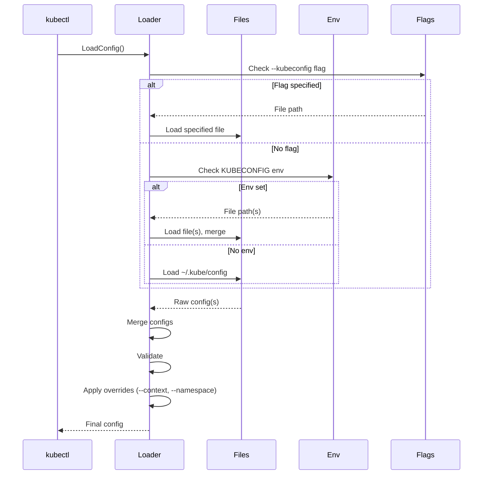
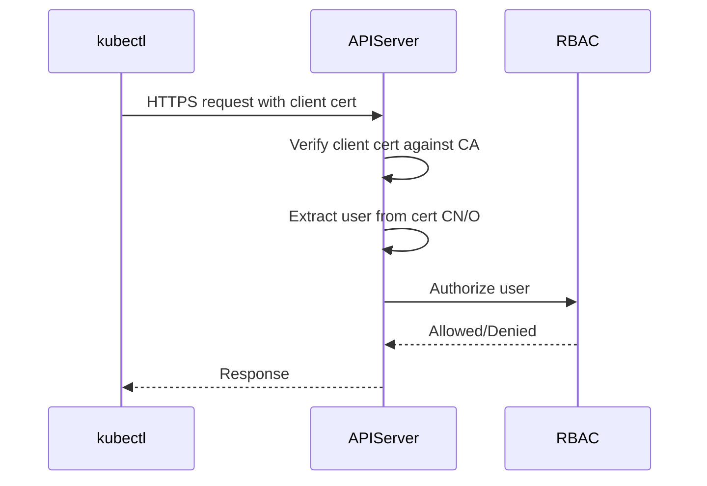
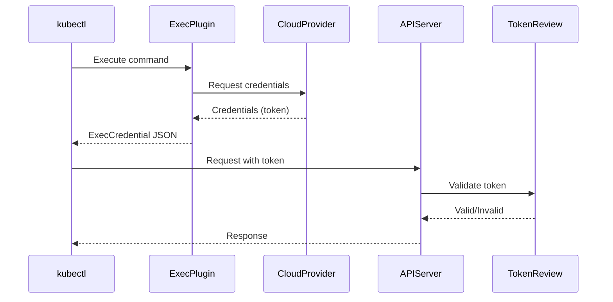
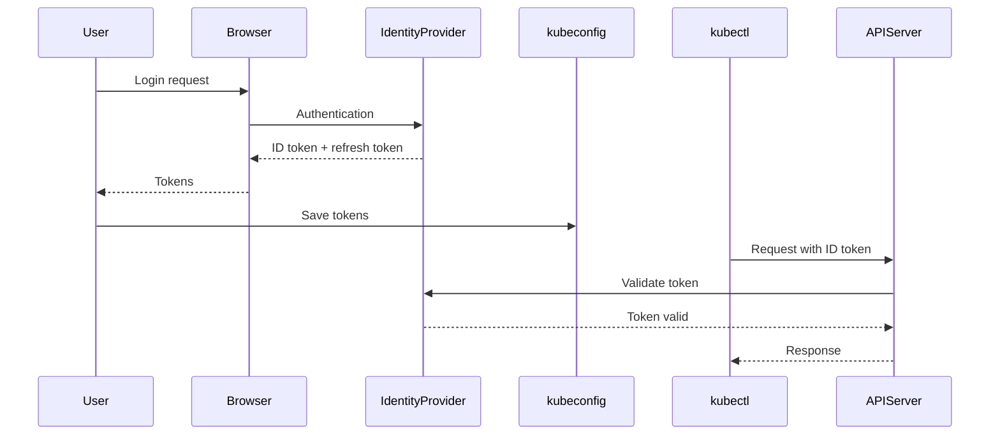
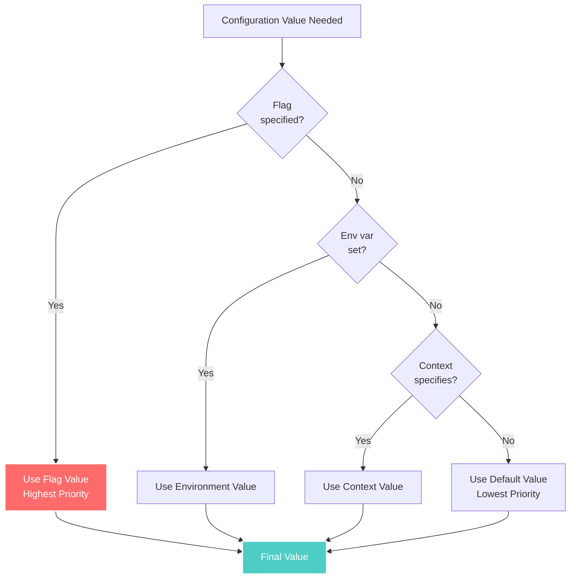

# kubectl Configuration Management

**Document Version**: 1.0
**Last Updated**: 2025-10-21
**Status**: High-Level Architecture Documentation

---

## Table of Contents

- [Overview](#overview)
- [kubeconfig File Structure](#kubeconfig-file-structure)
- [Configuration Components](#configuration-components)
- [Configuration Loading](#configuration-loading)
- [Authentication Methods](#authentication-methods)
- [Context Management](#context-management)
- [Configuration Precedence](#configuration-precedence)
- [kubectl config Commands](#kubectl-config-commands)
- [Best Practices](#best-practices)

---

## Overview

kubectl uses a configuration system based on the kubeconfig file to manage cluster access, user credentials, and default settings. This configuration system supports multiple clusters, users, and contexts, enabling seamless switching between different Kubernetes environments.

### Configuration Architecture



**Code Reference**: `staging/src/k8s.io/client-go/tools/clientcmd/`

---

## kubeconfig File Structure

### Basic Structure

```yaml
apiVersion: v1
kind: Config
current-context: production-admin
preferences: {}

clusters:
- cluster:
    certificate-authority-data: LS0tLS1CRUdJTi...
    server: https://api.prod.example.com:6443
  name: production
- cluster:
    insecure-skip-tls-verify: true
    server: https://api.dev.example.com:6443
  name: development

users:
- name: admin
  user:
    client-certificate-data: LS0tLS1CRUdJTi...
    client-key-data: LS0tLS1CRUdJTi...
- name: developer
  user:
    token: eyJhbGciOiJSUzI1NiIsImtpZCI6IiJ9...

contexts:
- context:
    cluster: production
    namespace: default
    user: admin
  name: production-admin
- context:
    cluster: development
    namespace: development
    user: developer
  name: dev-developer
```

### Structure Diagram



**Code Reference**: Config structure at `staging/src/k8s.io/client-go/tools/clientcmd/api/types.go:31-56`

---

## Configuration Components

### 1. Clusters

Defines how to connect to a Kubernetes cluster:

```yaml
clusters:
- cluster:
    # API server endpoint
    server: https://api.example.com:6443

    # Certificate authority (choose one)
    certificate-authority: /path/to/ca.crt
    certificate-authority-data: LS0tLS1CRUdJTi...

    # Server name for TLS verification
    tls-server-name: kubernetes.example.com

    # Skip TLS verification (not recommended)
    insecure-skip-tls-verify: false

    # Proxy for API requests
    proxy-url: http://proxy.example.com:8080

    # Disable response compression
    disable-compression: false

    # Extensions (custom data)
    extensions:
    - name: custom-extension
      extension:
        custom-field: value

  name: production
```

**Cluster Fields**:

| Field | Type | Purpose | Example |
|-------|------|---------|---------|
| `server` | string | API server URL | `https://api.example.com:6443` |
| `certificate-authority` | string | Path to CA cert | `/path/to/ca.crt` |
| `certificate-authority-data` | base64 | Inline CA cert | `LS0tLS1CRUdJTi...` |
| `tls-server-name` | string | Expected server name | `kubernetes.example.com` |
| `insecure-skip-tls-verify` | bool | Skip TLS verification | `false` |
| `proxy-url` | string | Proxy for requests | `http://proxy:8080` |

**Code Reference**: Cluster type at `staging/src/k8s.io/client-go/tools/clientcmd/api/types.go:68-107`

### 2. Users (AuthInfo)

Defines user credentials:

```yaml
users:
# Client certificate authentication
- name: admin
  user:
    client-certificate: /path/to/admin.crt
    client-key: /path/to/admin.key
    # OR inline:
    client-certificate-data: LS0tLS1CRUdJTi...
    client-key-data: LS0tLS1CRUdJTi...

# Token authentication
- name: service-account
  user:
    token: eyJhbGciOiJSUzI1NiIsImtpZCI6IiJ9...
    # OR from file:
    tokenFile: /path/to/token

# Username/password (deprecated)
- name: basic-user
  user:
    username: admin
    password: secret123

# Exec plugin (dynamic credentials)
- name: cloud-user
  user:
    exec:
      apiVersion: client.authentication.k8s.io/v1beta1
      command: aws
      args:
      - eks
      - get-token
      - --cluster-name
      - my-cluster
      env:
      - name: AWS_PROFILE
        value: production

# OIDC authentication
- name: oidc-user
  user:
    auth-provider:
      name: oidc
      config:
        client-id: kubectl
        client-secret: secret
        id-token: eyJhbGciOiJSUzI1NiIsImtpZCI6IiJ9...
        idp-issuer-url: https://accounts.example.com
        refresh-token: eyJhbGciOiJSUzI1NiIsImtpZCI6IiJ9...
```

**AuthInfo Fields**:

| Field | Type | Purpose | Authentication Method |
|-------|------|---------|----------------------|
| `client-certificate` | string | Client cert path | X.509 certificate |
| `client-certificate-data` | base64 | Inline client cert | X.509 certificate |
| `client-key` | string | Client key path | X.509 certificate |
| `client-key-data` | base64 | Inline client key | X.509 certificate |
| `token` | string | Bearer token | Token authentication |
| `tokenFile` | string | Token file path | Token authentication |
| `username` | string | Username | Basic auth (deprecated) |
| `password` | string | Password | Basic auth (deprecated) |
| `exec` | object | Exec plugin config | Dynamic credential provider |
| `auth-provider` | object | Auth provider config | OIDC, GCP, Azure, etc. |

### 3. Contexts

Combines cluster, user, and namespace:

```yaml
contexts:
- context:
    # Required: which cluster
    cluster: production

    # Required: which user
    user: admin

    # Optional: default namespace
    namespace: production-apps

    # Optional: extensions
    extensions:
    - name: custom-extension
      extension:
        team: platform

  name: production-admin
```

**Context Fields**:

| Field | Required | Purpose | Example |
|-------|----------|---------|---------|
| `cluster` | Yes | Cluster name | `production` |
| `user` | Yes | User/AuthInfo name | `admin` |
| `namespace` | No | Default namespace | `default` |
| `extensions` | No | Custom metadata | Custom data |

**Context Purpose**:



---

## Configuration Loading

### Loading Process



**Code Reference**: Config loading at `staging/src/k8s.io/client-go/tools/clientcmd/loader.go`

### Loading Priority

1. **Command-line flags** (highest priority)
   - `--kubeconfig=/path/to/config`
   - `--context=production-admin`
   - `--cluster=production`
   - `--user=admin`
   - `--namespace=kube-system`

2. **Environment variables**
   - `KUBECONFIG=/path/to/config1:/path/to/config2`

3. **Default config file**
   - `~/.kube/config`

4. **In-cluster configuration** (when running in a pod)
   - `/var/run/secrets/kubernetes.io/serviceaccount/token`
   - `/var/run/secrets/kubernetes.io/serviceaccount/ca.crt`

### Merging Multiple Configs

When `KUBECONFIG` contains multiple files:

```bash
export KUBECONFIG=~/.kube/config:~/other/config:~/third/config
```

**Merge Rules**:
- **Clusters**: All clusters from all files
- **Users**: All users from all files
- **Contexts**: All contexts from all files
- **current-context**: From first file that has it set
- **Conflicts**: First file wins (for same-named entries)

---

## Authentication Methods

### 1. Client Certificates (X.509)

Most secure, certificate-based authentication:

```yaml
users:
- name: admin
  user:
    client-certificate: /path/to/admin.crt
    client-key: /path/to/admin.key
```

**Process**:


**Generate Certificates**:
```bash
# Generate private key
openssl genrsa -out admin.key 2048

# Generate certificate signing request
openssl req -new -key admin.key -out admin.csr -subj "/CN=admin/O=system:masters"

# Sign certificate (using cluster CA)
openssl x509 -req -in admin.csr -CA ca.crt -CAkey ca.key -CAcreateserial -out admin.crt -days 365
```

### 2. Bearer Tokens

Token-based authentication (service accounts, OIDC):

```yaml
users:
- name: service-account
  user:
    token: eyJhbGciOiJSUzI1NiIsImtpZCI6IiJ9...
```

**Service Account Token** (in-cluster):
```bash
# Token is mounted at:
/var/run/secrets/kubernetes.io/serviceaccount/token
```

**Static Token File** (API server):
```csv
# /etc/kubernetes/token.csv
token123,admin,admin,"system:masters"
```

### 3. Exec Plugins

Dynamic credential providers:

```yaml
users:
- name: aws-eks
  user:
    exec:
      apiVersion: client.authentication.k8s.io/v1beta1
      command: aws
      args:
      - eks
      - get-token
      - --cluster-name
      - my-cluster
      env:
      - name: AWS_PROFILE
        value: production
      interactiveMode: Never
      provideClusterInfo: false
```

**Flow**:


**ExecCredential Response**:
```json
{
  "apiVersion": "client.authentication.k8s.io/v1beta1",
  "kind": "ExecCredential",
  "status": {
    "token": "k8s-aws-v1.aHR0cHM6Ly9...",
    "expirationTimestamp": "2024-01-01T12:00:00Z"
  }
}
```

**Common Exec Plugins**:
- AWS EKS: `aws eks get-token`
- GCP GKE: `gke-gcloud-auth-plugin`
- Azure AKS: `kubelogin`
- Custom plugins

**Code Reference**: Exec plugin at `staging/src/k8s.io/client-go/plugin/pkg/client/auth/exec/exec.go`

### 4. OIDC (OpenID Connect)

SSO integration with identity providers:

```yaml
users:
- name: oidc-user
  user:
    auth-provider:
      name: oidc
      config:
        client-id: kubectl
        client-secret: secret
        id-token: eyJhbGciOiJSUzI1NiIsImtpZCI6IiJ9...
        idp-issuer-url: https://accounts.example.com
        refresh-token: eyJhbGciOiJSUzI1NiIsImtpZCI6IiJ9...
        idp-certificate-authority: /path/to/ca.crt
```

**OIDC Flow**:


### 5. Basic Authentication (Deprecated)

**Not recommended** - username/password:

```yaml
users:
- name: basic-user
  user:
    username: admin
    password: secret123
```

**Why deprecated**:
- Passwords in plain text
- No rotation mechanism
- Security risk
- Removed in Kubernetes 1.19+

---

## Context Management

### Current Context

The `current-context` field sets the default context:

```yaml
current-context: production-admin

contexts:
- name: production-admin
  context:
    cluster: production
    user: admin
    namespace: default
```

### Switching Contexts

```bash
# View current context
kubectl config current-context

# List all contexts
kubectl config get-contexts

# Switch context
kubectl config use-context dev-developer

# Use context for single command
kubectl get pods --context=production-admin
```

### Context Information

```bash
$ kubectl config get-contexts
CURRENT   NAME                CLUSTER       AUTHINFO    NAMESPACE
*         production-admin    production    admin       default
          dev-developer       development   developer   development
          staging-ops         staging       ops-user    staging-apps
```

**Explanation**:
- `*` indicates current context
- Shows cluster, user, and default namespace for each context

---

## Configuration Precedence

### Precedence Order



### Precedence Examples

**Namespace**:
1. `--namespace` flag: `kubectl get pods -n kube-system`
2. Context namespace in kubeconfig
3. Default: `default`

**Cluster**:
1. `--cluster` flag: `kubectl get pods --cluster=production`
2. Current context's cluster
3. Error if not specified

**User**:
1. `--user` flag: `kubectl get pods --user=admin`
2. Current context's user
3. Error if not specified

### Override Examples

```bash
# Use different namespace for one command
kubectl get pods --namespace=kube-system

# Use different context for one command
kubectl get pods --context=dev-developer

# Use different cluster and user
kubectl get pods --cluster=production --user=admin

# Combine overrides
kubectl get pods --context=dev --namespace=testing --user=developer
```

---

## kubectl config Commands

### Viewing Configuration

```bash
# View merged configuration
kubectl config view

# View raw configuration (include secrets)
kubectl config view --raw

# View specific context
kubectl config view --context=production-admin

# View as JSON
kubectl config view -o json

# View minimal (current context only)
kubectl config view --minify
```

### Managing Contexts

```bash
# Get current context
kubectl config current-context

# List all contexts
kubectl config get-contexts

# Get specific context details
kubectl config get-contexts production-admin

# Switch context
kubectl config use-context dev-developer

# Create new context
kubectl config set-context new-context \
  --cluster=production \
  --user=admin \
  --namespace=production-apps

# Rename context
kubectl config rename-context old-name new-name

# Delete context
kubectl config delete-context old-context
```

### Managing Clusters

```bash
# Set cluster
kubectl config set-cluster production \
  --server=https://api.prod.example.com:6443 \
  --certificate-authority=/path/to/ca.crt \
  --embed-certs=false

# Set cluster with inline cert
kubectl config set-cluster production \
  --server=https://api.prod.example.com:6443 \
  --certificate-authority=/path/to/ca.crt \
  --embed-certs=true  # Embeds cert data in config

# Delete cluster
kubectl config delete-cluster old-cluster

# Set server
kubectl config set-cluster production --server=https://new-api.example.com:6443
```

### Managing Users

```bash
# Set user with cert files
kubectl config set-credentials admin \
  --client-certificate=/path/to/admin.crt \
  --client-key=/path/to/admin.key \
  --embed-certs=false

# Set user with token
kubectl config set-credentials service-account \
  --token=eyJhbGciOiJSUzI1NiIsImtpZCI6IiJ9...

# Set user with username/password (deprecated)
kubectl config set-credentials basic-user \
  --username=admin \
  --password=secret123

# Set user with exec plugin
kubectl config set-credentials aws-user \
  --exec-command=aws \
  --exec-arg=eks \
  --exec-arg=get-token \
  --exec-arg=--cluster-name \
  --exec-arg=my-cluster

# Delete user
kubectl config delete-user old-user
```

### Modifying Current Context

```bash
# Set default namespace for current context
kubectl config set-context --current --namespace=kube-system

# Change cluster for current context
kubectl config set-context --current --cluster=production

# Change user for current context
kubectl config set-context --current --user=admin
```

### Configuration Files

```bash
# Use specific config file
kubectl --kubeconfig=/path/to/config get pods

# Set config file for session
export KUBECONFIG=/path/to/config
kubectl get pods

# Multiple config files (merged)
export KUBECONFIG=~/.kube/config:~/other/config
kubectl get pods

# Unset (use default ~/.kube/config)
unset KUBECONFIG
```

---

## Best Practices

### 1. Security

**Do**:
- ✅ Use client certificates for production
- ✅ Use exec plugins for dynamic credentials
- ✅ Set restrictive file permissions: `chmod 600 ~/.kube/config`
- ✅ Use separate users for different access levels
- ✅ Enable TLS verification: `insecure-skip-tls-verify: false`
- ✅ Rotate credentials regularly

**Don't**:
- ❌ Commit kubeconfig to version control
- ❌ Share kubeconfig files between users
- ❌ Use basic authentication
- ❌ Skip TLS verification in production
- ❌ Use overly permissive service accounts

### 2. Organization

```yaml
# Good: Descriptive, organized names
clusters:
- name: prod-us-east-1
- name: prod-eu-west-1
- name: staging-us-east-1
- name: dev-local

users:
- name: admin-prod
- name: developer-staging
- name: viewer-prod

contexts:
- name: prod-us-east-1-admin
- name: staging-us-east-1-developer
```

### 3. Namespace Defaults

Set default namespaces in contexts:

```yaml
contexts:
- name: production-apps
  context:
    cluster: production
    user: app-deployer
    namespace: production-apps  # Default namespace

- name: production-monitoring
  context:
    cluster: production
    user: monitoring-viewer
    namespace: monitoring  # Different default
```

### 4. Multiple Environments

Separate configs for different environments:

```bash
# Personal config
~/.kube/config  # Dev, testing

# Production config (restricted)
~/.kube/config-prod

# Use production
export KUBECONFIG=~/.kube/config-prod
kubectl get pods
```

### 5. Config Validation

```bash
# Validate config
kubectl config view --validate

# Test connection
kubectl cluster-info

# Test authentication
kubectl auth can-i get pods

# Test with specific context
kubectl get nodes --context=production-admin
```

---

## Related Documents

- **[01-system-overview.md](01-system-overview.md)**: Overall architecture
- **[02-command-architecture.md](02-command-architecture.md)**: Command structure
- **[03-resource-management.md](03-resource-management.md)**: Resource management
- **[../01-REQUIREMENTS.md](../01-REQUIREMENTS.md)**: Configuration requirements
- **[../GLOSSARY.md](../GLOSSARY.md)**: kubeconfig, context, cluster, user terms

---

## Summary

kubectl's configuration management provides:

1. **Flexible Configuration**: Support for multiple clusters, users, and contexts
2. **Multiple Auth Methods**: Certificates, tokens, exec plugins, OIDC
3. **Configuration Merging**: Combine multiple config files
4. **Precedence Rules**: Clear priority order for configuration sources
5. **Rich CLI**: Complete `kubectl config` commands for management
6. **Security**: Best practices for credential protection

This system enables:
- **Multi-cluster management**: Easily switch between clusters
- **Role-based access**: Different users with different permissions
- **Environment separation**: Separate dev/staging/production configs
- **Dynamic credentials**: Exec plugins for cloud provider integration
- **Team collaboration**: Shareable cluster/context definitions

Understanding configuration management is essential for:
- Setting up kubectl for cluster access
- Managing multiple Kubernetes environments
- Implementing secure authentication workflows
- Troubleshooting connection issues
- Automating cluster operations

---

**Last Updated**: 2025-10-21
**Document Version**: 1.0
**Maintainer**: SIG CLI
