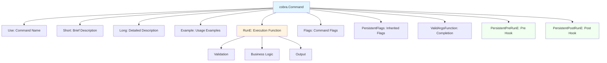
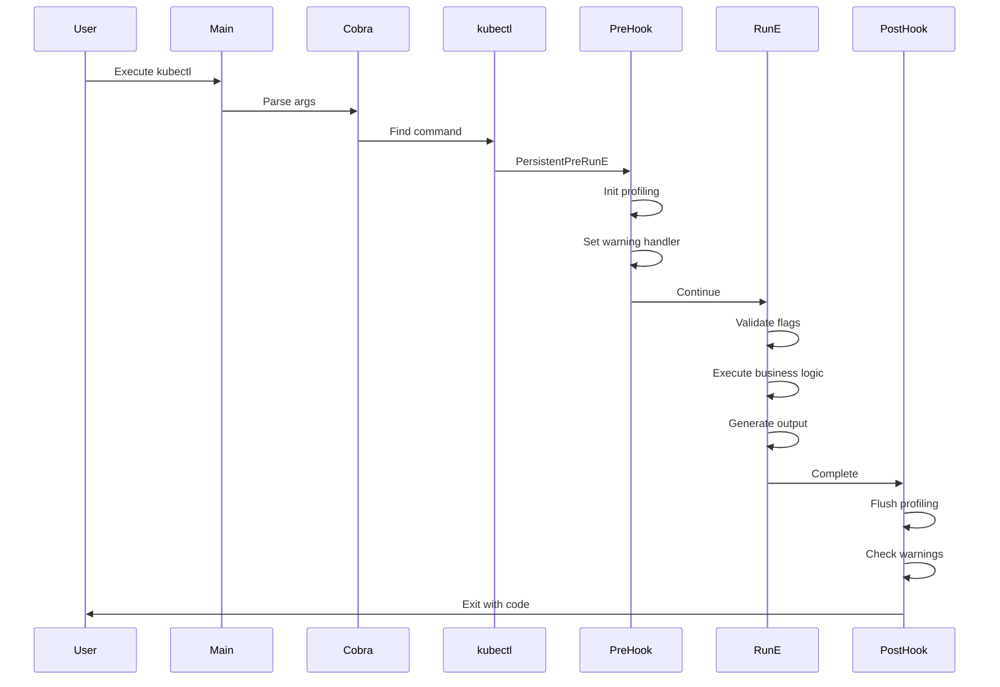
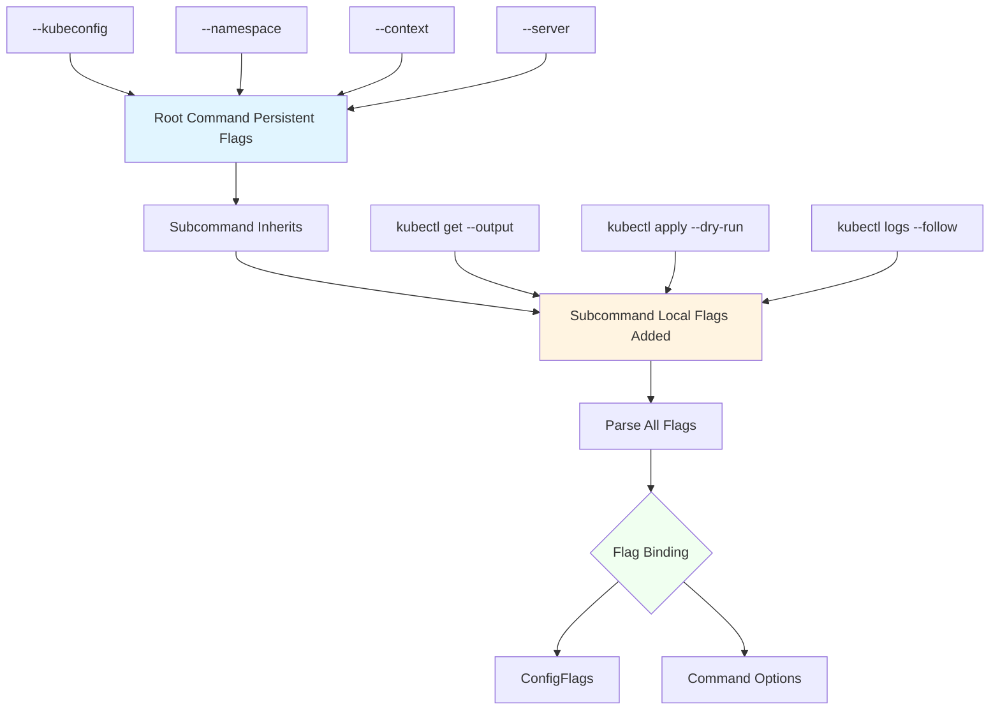
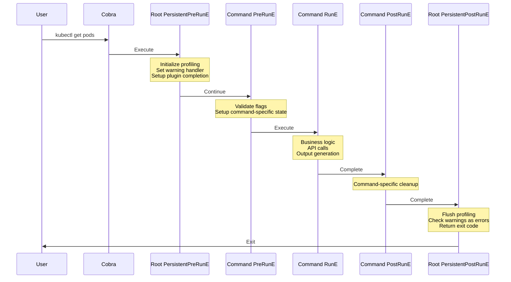
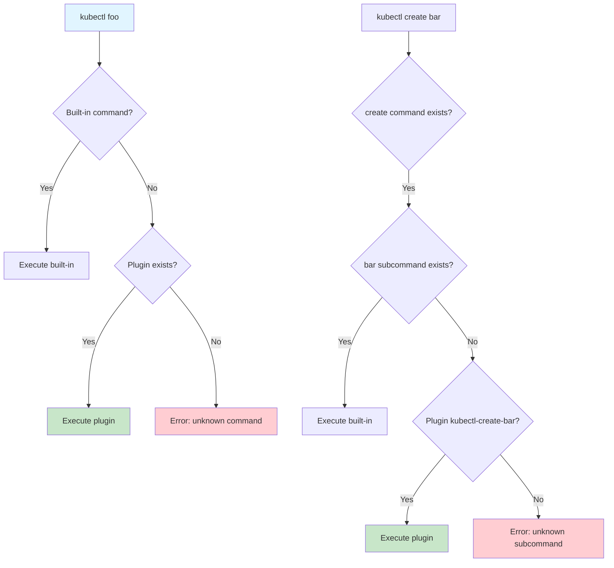
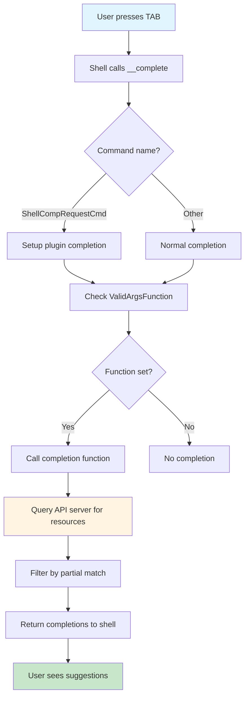
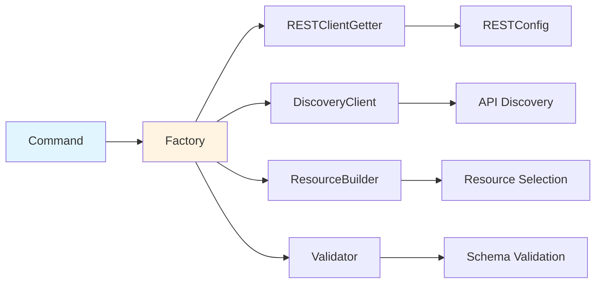
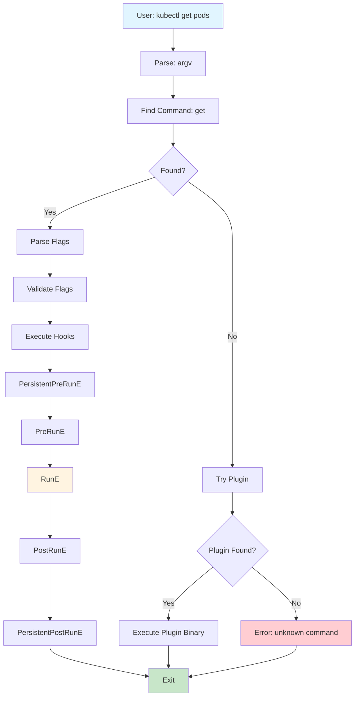

# **Cobra Command Structure in kubectl**

━━━━━━━━━━━━━━━━━━━━━━━━━━━━━━━━━━━━━━━━━━━━━━━━━━━━━━━━━━━━━━━━━━━━━━━━━━━━━━

## **📋 Overview**

kubectl is built on top of the **Cobra CLI framework**, which provides a powerful structure for organizing commands, managing flags, generating help text, and implementing shell completion. This document explores how kubectl leverages Cobra to create its command-line interface.

### **Key Concepts**

- **Root Command**: The main `kubectl` command that acts as the entry point
- **Subcommands**: Individual commands like `get`, `apply`, `create`, etc.
- **Command Groups**: Logical organization of commands (Basic, Deploy, Cluster Management, etc.)
- **Flags**: Command-line options (global/persistent vs command-specific)
- **Hooks**: PersistentPreRunE, PreRunE, RunE, PostRunE, PersistentPostRunE
- **Completion**: Shell completion for bash, zsh, fish, and PowerShell

### **Code Locations**

```
cmd/kubectl/kubectl.go:31-44                                    Main entry point
staging/src/k8s.io/kubectl/pkg/cmd/cmd.go:305-520              Root command creation
staging/src/k8s.io/kubectl/pkg/cmd/cmd.go:390-463              Command groups
staging/src/k8s.io/kubectl/pkg/util/templates/                 Template utilities
staging/src/k8s.io/kubectl/pkg/util/templates/command_groups.go Command group structure
vendor/github.com/spf13/cobra/                                  Cobra framework
```

━━━━━━━━━━━━━━━━━━━━━━━━━━━━━━━━━━━━━━━━━━━━━━━━━━━━━━━━━━━━━━━━━━━━━━━━━━━━━━

## **🏗️ Cobra Framework Architecture**

### **What is Cobra?**

Cobra is a Go library for creating powerful CLI applications. It provides:

1. **Command Structure**: Hierarchical organization of commands and subcommands
2. **Flag Parsing**: Automatic parsing of command-line flags
3. **Help Generation**: Automatic help text and usage generation
4. **Shell Completion**: Built-in shell completion support
5. **Error Handling**: Structured error handling and reporting

### **Cobra Command Structure**



### **Core Components**

**Command Fields**:
```go
type Command struct {
    Use   string              // Command name and usage
    Short string              // Brief description
    Long  string              // Detailed description
    Example string            // Usage examples
    RunE  func(*Command, []string) error  // Execution function
    PersistentPreRunE  func(*Command, []string) error
    PersistentPostRunE func(*Command, []string) error
    Flags *pflag.FlagSet     // Command-specific flags
    PersistentFlags *pflag.FlagSet  // Inherited flags
}
```

━━━━━━━━━━━━━━━━━━━━━━━━━━━━━━━━━━━━━━━━━━━━━━━━━━━━━━━━━━━━━━━━━━━━━━━━━━━━━━

## **🚀 kubectl Root Command**

### **Main Entry Point**

The kubectl binary starts in `cmd/kubectl/kubectl.go:31-44`:

```go
func main() {
    // Set logging verbosity from args
    logs.GlogSetter(cmd.GetLogVerbosity(os.Args))

    // Create the root kubectl command
    command := cmd.NewDefaultKubectlCommand()

    // Execute the command
    if err := cli.RunNoErrOutput(command); err != nil {
        util.CheckErr(err)
    }
}
```

**Code Reference**: `cmd/kubectl/kubectl.go:39`

### **Root Command Creation**

The root command is created in `staging/src/k8s.io/kubectl/pkg/cmd/cmd.go:99-107`:

```go
// NewDefaultKubectlCommand creates the `kubectl` command with default arguments
func NewDefaultKubectlCommand() *cobra.Command {
    ioStreams := genericiooptions.IOStreams{
        In: os.Stdin,
        Out: os.Stdout,
        ErrOut: os.Stderr
    }
    return NewDefaultKubectlCommandWithArgs(KubectlOptions{
        PluginHandler: NewDefaultPluginHandler(plugin.ValidPluginFilenamePrefixes),
        Arguments:     os.Args,
        ConfigFlags:   defaultConfigFlags().WithWarningPrinter(ioStreams),
        IOStreams:     ioStreams,
    })
}
```

**Code Reference**: `staging/src/k8s.io/kubectl/pkg/cmd/cmd.go:99`

### **Root Command Structure**

The actual root command is constructed in `staging/src/k8s.io/kubectl/pkg/cmd/cmd.go:305-349`:

```go
func NewKubectlCommand(o KubectlOptions) *cobra.Command {
    warningHandler := rest.NewWarningWriter(o.IOStreams.ErrOut, ...)
    warningsAsErrors := false

    // Parent command to which all subcommands are added
    cmds := &cobra.Command{
        Use:   "kubectl",
        Short: i18n.T("kubectl controls the Kubernetes cluster manager"),
        Long: templates.LongDesc(`
            kubectl controls the Kubernetes cluster manager.
            Find more information at:
                https://kubernetes.io/docs/reference/kubectl/`),
        Run: runHelp,  // Show help if no subcommand provided

        // Pre-run hook: Initialize profiling, set warning handler
        PersistentPreRunE: func(cmd *cobra.Command, args []string) error {
            rest.SetDefaultWarningHandler(warningHandler)

            // Setup plugin completion if needed
            if cmd.Name() == cobra.ShellCompRequestCmd {
                plugin.SetupPluginCompletion(cmd, args)
            }

            return initProfiling()
        },

        // Post-run hook: Flush profiling, handle warnings as errors
        PersistentPostRunE: func(*cobra.Command, []string) error {
            if err := flushProfiling(); err != nil {
                return err
            }
            if warningsAsErrors {
                count := warningHandler.WarningCount()
                switch count {
                case 0:
                    // no warnings
                case 1:
                    return fmt.Errorf("%d warning received", count)
                default:
                    return fmt.Errorf("%d warnings received", count)
                }
            }
            return nil
        },
    }

    return cmds
}
```

**Code Reference**: `staging/src/k8s.io/kubectl/pkg/cmd/cmd.go:310`

### **Command Execution Flow**



━━━━━━━━━━━━━━━━━━━━━━━━━━━━━━━━━━━━━━━━━━━━━━━━━━━━━━━━━━━━━━━━━━━━━━━━━━━━━━

## **📦 Command Groups**

### **Command Organization**

kubectl organizes its commands into **7 logical groups** defined in `staging/src/k8s.io/kubectl/pkg/cmd/cmd.go:390-463`:

```go
groups := templates.CommandGroups{
    {
        Message: "Basic Commands (Beginner):",
        Commands: []*cobra.Command{
            create.NewCmdCreate(f, o.IOStreams),
            expose.NewCmdExposeService(f, o.IOStreams),
            run.NewCmdRun(f, o.IOStreams),
            set.NewCmdSet(f, o.IOStreams),
        },
    },
    {
        Message: "Basic Commands (Intermediate):",
        Commands: []*cobra.Command{
            explain.NewCmdExplain("kubectl", f, o.IOStreams),
            getCmd,
            edit.NewCmdEdit(f, o.IOStreams),
            delete.NewCmdDelete(f, o.IOStreams),
        },
    },
    {
        Message: "Deploy Commands:",
        Commands: []*cobra.Command{
            rollout.NewCmdRollout(f, o.IOStreams),
            scale.NewCmdScale(f, o.IOStreams),
            autoscale.NewCmdAutoscale(f, o.IOStreams),
        },
    },
    {
        Message: "Cluster Management Commands:",
        Commands: []*cobra.Command{
            certificates.NewCmdCertificate(f, o.IOStreams),
            clusterinfo.NewCmdClusterInfo(f, o.IOStreams),
            top.NewCmdTop(f, o.IOStreams),
            drain.NewCmdCordon(f, o.IOStreams),
            drain.NewCmdUncordon(f, o.IOStreams),
            drain.NewCmdDrain(f, o.IOStreams),
            taint.NewCmdTaint(f, o.IOStreams),
        },
    },
    {
        Message: "Troubleshooting and Debugging Commands:",
        Commands: []*cobra.Command{
            describe.NewCmdDescribe("kubectl", f, o.IOStreams),
            logs.NewCmdLogs(f, o.IOStreams),
            attach.NewCmdAttach(f, o.IOStreams),
            cmdexec.NewCmdExec(f, o.IOStreams),
            portforward.NewCmdPortForward(f, o.IOStreams),
            proxyCmd,
            cp.NewCmdCp(f, o.IOStreams),
            auth.NewCmdAuth(f, o.IOStreams),
            debugCmd,
            events.NewCmdEvents(f, o.IOStreams),
        },
    },
    {
        Message: "Advanced Commands:",
        Commands: []*cobra.Command{
            diff.NewCmdDiff(f, o.IOStreams),
            apply.NewCmdApply("kubectl", f, o.IOStreams),
            patch.NewCmdPatch(f, o.IOStreams),
            replace.NewCmdReplace(f, o.IOStreams),
            wait.NewCmdWait(f, o.IOStreams),
            kustomize.NewCmdKustomize(o.IOStreams),
        },
    },
    {
        Message: "Settings Commands:",
        Commands: []*cobra.Command{
            label.NewCmdLabel(f, o.IOStreams),
            annotate.NewCmdAnnotate("kubectl", f, o.IOStreams),
            completion.NewCmdCompletion(o.IOStreams.Out, ""),
        },
    },
}
```

**Code Reference**: `staging/src/k8s.io/kubectl/pkg/cmd/cmd.go:390`

### **Command Group Structure**

The `CommandGroups` type is defined in `staging/src/k8s.io/kubectl/pkg/util/templates/command_groups.go:23-28`:

```go
type CommandGroup struct {
    Message  string               // Group heading
    Commands []*cobra.Command     // Commands in this group
}

type CommandGroups []CommandGroup
```

**Code Reference**: `staging/src/k8s.io/kubectl/pkg/util/templates/command_groups.go:23`

### **Adding Commands to Root**

Commands are added to the root command using `staging/src/k8s.io/kubectl/pkg/util/templates/command_groups.go:30-34`:

```go
func (g CommandGroups) Add(c *cobra.Command) {
    for _, group := range g {
        c.AddCommand(group.Commands...)
    }
}
```

Then called at `staging/src/k8s.io/kubectl/pkg/cmd/cmd.go:464`:

```go
groups.Add(cmds)  // Add all grouped commands to root
```

**Code Reference**: `staging/src/k8s.io/kubectl/pkg/cmd/cmd.go:464`

### **Command Tree Visualization**

```mermaid
graph TD
    ROOT[kubectl] --> BEG[Basic Beginner]
    ROOT --> INT[Basic Intermediate]
    ROOT --> DEP[Deploy]
    ROOT --> CLU[Cluster Management]
    ROOT --> TRO[Troubleshooting]
    ROOT --> ADV[Advanced]
    ROOT --> SET[Settings]
    ROOT --> OTH[Other Commands]

    BEG --> create
    BEG --> expose
    BEG --> run
    BEG --> set

    INT --> explain
    INT --> get
    INT --> edit
    INT --> delete

    DEP --> rollout
    DEP --> scale
    DEP --> autoscale

    CLU --> certificates
    CLU --> clusterinfo
    CLU --> top
    CLU --> cordon
    CLU --> uncordon
    CLU --> drain
    CLU --> taint

    TRO --> describe
    TRO --> logs
    TRO --> attach
    TRO --> exec
    TRO --> portforward
    TRO --> proxy
    TRO --> cp
    TRO --> auth
    TRO --> debug
    TRO --> events

    ADV --> diff
    ADV --> apply
    ADV --> patch
    ADV --> replace
    ADV --> wait
    ADV --> kustomize

    SET --> label
    SET --> annotate
    SET --> completion

    OTH --> config
    OTH --> plugin
    OTH --> version
    OTH --> apiresources

    style ROOT fill:#e1f5ff
    style BEG fill:#e8f5e9
    style INT fill:#e8f5e9
    style DEP fill:#fff3e0
    style CLU fill:#f3e5f5
    style TRO fill:#ffebee
    style ADV fill:#e0f2f1
    style SET fill:#fce4ec
```



### **Additional Commands**

Some commands are added individually after the groups at `staging/src/k8s.io/kubectl/pkg/cmd/cmd.go:485-491`:

```go
cmds.AddCommand(alpha)  // Alpha commands (feature-gated)
cmds.AddCommand(cmdconfig.NewCmdConfig(f, clientcmd.NewDefaultPathOptions(), o.IOStreams))
cmds.AddCommand(plugin.NewCmdPlugin(o.IOStreams))
cmds.AddCommand(version.NewCmdVersion(f, o.IOStreams))
cmds.AddCommand(apiresources.NewCmdAPIVersions(f, o.IOStreams))
cmds.AddCommand(apiresources.NewCmdAPIResources(f, o.IOStreams))
cmds.AddCommand(options.NewCmdOptions(o.IOStreams.Out))
```

**Code Reference**: `staging/src/k8s.io/kubectl/pkg/cmd/cmd.go:485`

━━━━━━━━━━━━━━━━━━━━━━━━━━━━━━━━━━━━━━━━━━━━━━━━━━━━━━━━━━━━━━━━━━━━━━━━━━━━━━

## **🏴 Flag Management**

### **Flag Types**

kubectl uses two types of flags:

1. **Persistent Flags**: Inherited by all subcommands
2. **Local Flags**: Specific to a single command

### **Global Flags (ConfigFlags)**

Global flags are added via `ConfigFlags` at `staging/src/k8s.io/kubectl/pkg/cmd/cmd.go:365-371`:

```go
kubeConfigFlags := o.ConfigFlags
if kubeConfigFlags == nil {
    kubeConfigFlags = defaultConfigFlags().WithWarningPrinter(o.IOStreams)
}
kubeConfigFlags.AddFlags(flags)  // Add to persistent flags
matchVersionKubeConfigFlags := cmdutil.NewMatchVersionFlags(kubeConfigFlags)
matchVersionKubeConfigFlags.AddFlags(flags)
```

**Code Reference**: `staging/src/k8s.io/kubectl/pkg/cmd/cmd.go:365`

### **Default ConfigFlags**

Created at `staging/src/k8s.io/kubectl/pkg/cmd/cmd.go:94-96`:

```go
func defaultConfigFlags() *genericclioptions.ConfigFlags {
    return genericclioptions.NewConfigFlags(true).
        WithDeprecatedPasswordFlag().
        WithDiscoveryBurst(300).
        WithDiscoveryQPS(50.0)
}
```

**Code Reference**: `staging/src/k8s.io/kubectl/pkg/cmd/cmd.go:94`

### **Common Global Flags**

ConfigFlags includes these common flags:

| Flag | Type | Description | Default |
|------|------|-------------|---------|
| `--kubeconfig` | string | Path to kubeconfig file | `$KUBECONFIG` or `~/.kube/config` |
| `--context` | string | Kubernetes context to use | Current context |
| `--cluster` | string | Kubernetes cluster to use | Current cluster |
| `--namespace` | string | Namespace scope | `default` |
| `--server` | string | API server address | From kubeconfig |
| `--insecure-skip-tls-verify` | bool | Skip TLS verification | `false` |
| `--certificate-authority` | string | CA certificate file | From kubeconfig |
| `--client-certificate` | string | Client cert file | From kubeconfig |
| `--client-key` | string | Client key file | From kubeconfig |
| `--token` | string | Bearer token | From kubeconfig |
| `--user` | string | User credentials to use | Current user |
| `--as` | string | Impersonate user | None |
| `--as-group` | []string | Impersonate group | None |
| `--request-timeout` | duration | Request timeout | `0` (no timeout) |

### **Additional Persistent Flags**

Other persistent flags are added at `staging/src/k8s.io/kubectl/pkg/cmd/cmd.go:354-362`:

```go
flags := cmds.PersistentFlags()

addProfilingFlags(flags)  // CPU/memory profiling

flags.BoolVar(&warningsAsErrors, "warnings-as-errors", warningsAsErrors,
    "Treat warnings received from the server as errors and exit with a non-zero exit code")

pref := kuberc.NewPreferences()
if !cmdutil.KubeRC.IsDisabled() {
    pref.AddFlags(flags)  // Add .kuberc preferences
}
```

**Code Reference**: `staging/src/k8s.io/kubectl/pkg/cmd/cmd.go:354`

### **Flag Inheritance Flow**



### **Flag Normalization**

kubectl uses custom flag normalization at `staging/src/k8s.io/kubectl/pkg/cmd/cmd.go:352`:

```go
// Warn on flags that contain "_" separators
cmds.SetGlobalNormalizationFunc(cliflag.WarnWordSepNormalizeFunc)
```

Later changed to standard normalization at line 495:

```go
// Stop warning about normalization of flags
cmds.SetGlobalNormalizationFunc(cliflag.WordSepNormalizeFunc)
```

**Code Reference**: `staging/src/k8s.io/kubectl/pkg/cmd/cmd.go:352, 495`

━━━━━━━━━━━━━━━━━━━━━━━━━━━━━━━━━━━━━━━━━━━━━━━━━━━━━━━━━━━━━━━━━━━━━━━━━━━━━━

## **🔄 Command Execution Lifecycle**

### **Execution Hooks**

Cobra provides several hooks that execute in a specific order:

1. `PersistentPreRunE` - Root command pre-hook (runs for all commands)
2. `PreRunE` - Command-specific pre-hook
3. `RunE` - Main command execution
4. `PostRunE` - Command-specific post-hook
5. `PersistentPostRunE` - Root command post-hook (runs for all commands)

### **Hook Execution Flow**



### **Root PersistentPreRunE**

Defined at `staging/src/k8s.io/kubectl/pkg/cmd/cmd.go:321-331`:

```go
PersistentPreRunE: func(cmd *cobra.Command, args []string) error {
    rest.SetDefaultWarningHandler(warningHandler)

    // Setup plugin completion if this is a completion request
    if cmd.Name() == cobra.ShellCompRequestCmd {
        plugin.SetupPluginCompletion(cmd, args)
    }

    return initProfiling()
},
```

**Code Reference**: `staging/src/k8s.io/kubectl/pkg/cmd/cmd.go:321`

### **Root PersistentPostRunE**

Defined at `staging/src/k8s.io/kubectl/pkg/cmd/cmd.go:332-348`:

```go
PersistentPostRunE: func(*cobra.Command, []string) error {
    if err := flushProfiling(); err != nil {
        return err
    }
    if warningsAsErrors {
        count := warningHandler.WarningCount()
        switch count {
        case 0:
            // no warnings
        case 1:
            return fmt.Errorf("%d warning received", count)
        default:
            return fmt.Errorf("%d warnings received", count)
        }
    }
    return nil
},
```

**Code Reference**: `staging/src/k8s.io/kubectl/pkg/cmd/cmd.go:332`

### **Example: kubectl get Command Hooks**

For a command like `kubectl get pods`, the execution flow is:

```
1. Root PersistentPreRunE
   └─ Initialize profiling
   └─ Set warning handler

2. get Command Complete (PreRunE equivalent)
   └─ Validate flags (--output, --selector, etc.)
   └─ Validate namespace
   └─ Validate resource type

3. get Command Run
   └─ Build resource request
   └─ Query API server
   └─ Format output
   └─ Print to stdout

4. Root PersistentPostRunE
   └─ Flush profiling
   └─ Check warnings
   └─ Return exit code
```

### **KubeRC Hook Integration**

If `.kuberc` is enabled, an additional hook is added at `staging/src/k8s.io/kubectl/pkg/cmd/cmd.go:497-503`:

```go
if !cmdutil.KubeRC.IsDisabled() {
    existingPreRunE := cmds.PersistentPreRunE
    cmds.PersistentPreRunE = func(cmd *cobra.Command, args []string) error {
        // Run existing pre-run hook first
        if err := existingPreRunE(cmd, args); err != nil {
            return err
        }
        // Then execute kuberc
        return pref.Execute(cmd, args)
    }
}
```

**Code Reference**: `staging/src/k8s.io/kubectl/pkg/cmd/cmd.go:497`

━━━━━━━━━━━━━━━━━━━━━━━━━━━━━━━━━━━━━━━━━━━━━━━━━━━━━━━━━━━━━━━━━━━━━━━━━━━━━━

## **🔌 Plugin Integration**

### **Plugin Handler**

kubectl supports external plugins through the `PluginHandler` interface defined at `staging/src/k8s.io/kubectl/pkg/cmd/cmd.go:178-191`:

```go
type PluginHandler interface {
    // Lookup searches for a plugin executable
    Lookup(filename string) (string, bool)

    // Execute runs the plugin
    Execute(executablePath string, cmdArgs, environment []string) error
}
```

**Code Reference**: `staging/src/k8s.io/kubectl/pkg/cmd/cmd.go:181`

### **Plugin Discovery**

Plugin discovery happens in `staging/src/k8s.io/kubectl/pkg/cmd/cmd.go:110-168`:

```go
func NewDefaultKubectlCommandWithArgs(o KubectlOptions) *cobra.Command {
    cmd := NewKubectlCommand(o)

    if o.PluginHandler == nil {
        return cmd
    }

    if len(o.Arguments) > 1 {
        cmdPathPieces := o.Arguments[1:]

        // Check if the specified command exists
        if foundCmd, foundArgs, err := cmd.Find(cmdPathPieces); err != nil {
            // Command not found, check for plugin
            var cmdName string
            for _, arg := range cmdPathPieces {
                if !strings.HasPrefix(arg, "-") {
                    cmdName = arg
                    break
                }
            }

            // Skip built-in commands
            switch cmdName {
            case "help", cobra.ShellCompRequestCmd, cobra.ShellCompNoDescRequestCmd:
                // Don't search for a plugin
            default:
                if err := HandlePluginCommand(o.PluginHandler, cmdPathPieces, 1); err != nil {
                    fmt.Fprintf(o.IOStreams.ErrOut, "Error: %v\n", err)
                    os.Exit(1)
                }
            }
        } else if err == nil {
            // Command exists, check for plugin subcommand
            if IsSubcommandPluginAllowed(foundCmd.Name()) &&
               len(foundArgs) >= 1 &&
               !strings.HasPrefix(foundArgs[0], "-") {
                subcommand := foundArgs[0]
                builtinSubcmdExist := false

                for _, subcmd := range foundCmd.Commands() {
                    if subcmd.Name() == subcommand {
                        builtinSubcmdExist = true
                        break
                    }
                }

                if !builtinSubcmdExist {
                    if err := HandlePluginCommand(o.PluginHandler, cmdPathPieces,
                                                 len(cmdPathPieces)-len(foundArgs)+1); err != nil {
                        fmt.Fprintf(o.IOStreams.ErrOut, "Error: %v\n", err)
                        os.Exit(1)
                    }
                }
            }
        }
    }

    return cmd
}
```

**Code Reference**: `staging/src/k8s.io/kubectl/pkg/cmd/cmd.go:110`

### **Plugin Subcommand Allowlist**

Only certain commands allow plugin subcommands at `staging/src/k8s.io/kubectl/pkg/cmd/cmd.go:172-176`:

```go
func IsSubcommandPluginAllowed(foundCmd string) bool {
    allowedCmds := map[string]struct{}{"create": {}}
    _, ok := allowedCmds[foundCmd]
    return ok
}
```

This allows `kubectl create <plugin>` but not other commands.

**Code Reference**: `staging/src/k8s.io/kubectl/pkg/cmd/cmd.go:172`

### **Plugin Discovery Flow**



━━━━━━━━━━━━━━━━━━━━━━━━━━━━━━━━━━━━━━━━━━━━━━━━━━━━━━━━━━━━━━━━━━━━━━━━━━━━━━

## **📖 Help and Documentation**

### **Help Generation**

Cobra automatically generates help text from command metadata. kubectl customizes this with templates.

### **ActsAsRootCommand**

kubectl uses the `ActsAsRootCommand` function at `staging/src/k8s.io/kubectl/pkg/cmd/cmd.go:480`:

```go
templates.ActsAsRootCommand(cmds, filters, groups...)
```

This function:
1. Organizes commands into groups
2. Customizes help output
3. Hides certain commands (specified in `filters`)
4. Provides structured help text

**Code Reference**: `staging/src/k8s.io/kubectl/pkg/cmd/cmd.go:480`

### **Filtered Commands**

Some commands are hidden from help by default at `staging/src/k8s.io/kubectl/pkg/cmd/cmd.go:466-472`:

```go
filters := []string{"options"}

// Hide the "alpha" subcommand if there are no alpha commands
alpha := NewCmdAlpha(f, o.IOStreams)
if !alpha.HasSubCommands() {
    filters = append(filters, alpha.Name())
}
```

**Code Reference**: `staging/src/k8s.io/kubectl/pkg/cmd/cmd.go:466`

### **Default Help Behavior**

If no subcommand is provided, the root command runs help at `staging/src/k8s.io/kubectl/pkg/cmd/cmd.go:318`:

```go
cmds := &cobra.Command{
    Use:   "kubectl",
    Run: runHelp,  // Show help if no subcommand
    ...
}
```

**Code Reference**: `staging/src/k8s.io/kubectl/pkg/cmd/cmd.go:318`

### **Help Output Example**

```bash
$ kubectl
kubectl controls the Kubernetes cluster manager.

 Find more information at: https://kubernetes.io/docs/reference/kubectl/

Basic Commands (Beginner):
  create          Create a resource from a file or from stdin
  expose          Take a replication controller, service, deployment or pod and expose it as a new Kubernetes service
  run             Run a particular image on the cluster
  set             Set specific features on objects

Basic Commands (Intermediate):
  explain         Get documentation for a resource
  get             Display one or many resources
  edit            Edit a resource on the server
  delete          Delete resources by file names, stdin, resources and names, or by resources and label selector

Deploy Commands:
  rollout         Manage the rollout of a resource
  scale           Set a new size for a deployment, replica set, or replication controller
  autoscale       Auto-scale a deployment, replica set, stateful set, or replication controller

...
```

━━━━━━━━━━━━━━━━━━━━━━━━━━━━━━━━━━━━━━━━━━━━━━━━━━━━━━━━━━━━━━━━━━━━━━━━━━━━━━

## **🔧 Shell Completion**

### **Completion Support**

kubectl supports shell completion for bash, zsh, fish, and PowerShell through the `kubectl completion` command.

### **Completion Setup**

Completion is registered for global flags at `staging/src/k8s.io/kubectl/pkg/cmd/cmd.go:482-483`:

```go
utilcomp.SetFactoryForCompletion(f)
registerCompletionFuncForGlobalFlags(cmds, f)
```

**Code Reference**: `staging/src/k8s.io/kubectl/pkg/cmd/cmd.go:482`

### **Resource Completion**

For commands like `get` and `debug`, resource completion is enabled via `ValidArgsFunction` at `staging/src/k8s.io/kubectl/pkg/cmd/cmd.go:385-388`:

```go
getCmd := get.NewCmdGet("kubectl", f, o.IOStreams)
getCmd.ValidArgsFunction = utilcomp.ResourceTypeAndNameCompletionFunc(f)

debugCmd := debug.NewCmdDebug(f, o.IOStreams)
debugCmd.ValidArgsFunction = utilcomp.ResourceTypeAndNameCompletionFunc(f)
```

**Code Reference**: `staging/src/k8s.io/kubectl/pkg/cmd/cmd.go:385`

### **Completion Flow**



### **Plugin Completion**

Plugin completion is handled specially in the PersistentPreRunE hook at `staging/src/k8s.io/kubectl/pkg/cmd/cmd.go:324-328`:

```go
if cmd.Name() == cobra.ShellCompRequestCmd {
    // This is the __complete or __completeNoDesc command
    plugin.SetupPluginCompletion(cmd, args)
}
```

**Code Reference**: `staging/src/k8s.io/kubectl/pkg/cmd/cmd.go:324`

### **Example Completions**

**Resource type completion**:
```bash
$ kubectl get <TAB>
pods    services    deployments    configmaps    secrets    ...
```

**Resource name completion**:
```bash
$ kubectl get pod <TAB>
nginx-pod    redis-pod    mysql-pod    ...
```

**Flag completion**:
```bash
$ kubectl get pods --<TAB>
--all-namespaces    --output    --selector    --field-selector    --watch    ...
```

━━━━━━━━━━━━━━━━━━━━━━━━━━━━━━━━━━━━━━━━━━━━━━━━━━━━━━━━━━━━━━━━━━━━━━━━━━━━━━

## **🏭 Factory Pattern**

### **Factory Initialization**

The Factory pattern provides access to common utilities at `staging/src/k8s.io/kubectl/pkg/cmd/cmd.go:375`:

```go
f := cmdutil.NewFactory(matchVersionKubeConfigFlags)
```

Every command constructor receives this factory:

```go
create.NewCmdCreate(f, o.IOStreams)
get.NewCmdGet("kubectl", f, o.IOStreams)
apply.NewCmdApply("kubectl", f, o.IOStreams)
```

**Code Reference**: `staging/src/k8s.io/kubectl/pkg/cmd/cmd.go:375`

### **Factory Provides**

The factory provides:
- REST client configuration
- Discovery client
- Resource builder
- Namespace validation
- Dry-run configuration
- OpenAPI schema
- Validators

### **Factory Usage in Commands**



━━━━━━━━━━━━━━━━━━━━━━━━━━━━━━━━━━━━━━━━━━━━━━━━━━━━━━━━━━━━━━━━━━━━━━━━━━━━━━

## **⚙️ Command Header Round Tripper**

### **Command Headers**

kubectl adds custom headers to API requests for tracking command usage (SIG CLI KEP 859).

### **Setup**

Headers are configured at `staging/src/k8s.io/kubectl/pkg/cmd/cmd.go:372-373`:

```go
// Updates hooks to add kubectl command headers: SIG CLI KEP 859
addCmdHeaderHooks(cmds, kubeConfigFlags)
```

**Code Reference**: `staging/src/k8s.io/kubectl/pkg/cmd/cmd.go:372`

### **Header Format**

Headers include:
- `Kubectl-Command`: The command being executed (e.g., `get`, `apply`)
- `Kubectl-Flags`: Flags used with the command
- `Kubectl-Session`: Session identifier for grouping related requests

### **Proxy Exemption**

The `proxy` command is exempted from command headers at `staging/src/k8s.io/kubectl/pkg/cmd/cmd.go:377-382`:

```go
// Proxy command is incompatible with CommandHeaderRoundTripper
proxyCmd := proxy.NewCmdProxy(f, o.IOStreams)
proxyCmd.PreRun = func(cmd *cobra.Command, args []string) {
    kubeConfigFlags.WrapConfigFn = nil  // Clear the wrapper
}
```

**Code Reference**: `staging/src/k8s.io/kubectl/pkg/cmd/cmd.go:377`

━━━━━━━━━━━━━━━━━━━━━━━━━━━━━━━━━━━━━━━━━━━━━━━━━━━━━━━━━━━━━━━━━━━━━━━━━━━━━━

## **🧪 Testing Command Structure**

### **Command Testing Patterns**

kubectl commands are tested using:

1. **Unit Tests**: Test command logic in isolation
2. **Integration Tests**: Test command with real API server
3. **Example-Based Tests**: Validate examples in help text

### **Mock Factory**

Tests use a mock factory to avoid requiring a real cluster:

```go
tf := cmdtesting.NewTestFactory()
defer tf.Cleanup()

cmd := NewCmdGet("kubectl", tf, streams)
cmd.Run(cmd, []string{"pods"})
```

### **Example Validation**

Cobra can validate that examples in help text are valid:

```go
cmd := NewCmdGet("kubectl", f, streams)
cmd.Example = `
  # List all pods
  kubectl get pods

  # List pods in YAML format
  kubectl get pods -o yaml
`
```

━━━━━━━━━━━━━━━━━━━━━━━━━━━━━━━━━━━━━━━━━━━━━━━━━━━━━━━━━━━━━━━━━━━━━━━━━━━━━━

## **🔍 Command Discovery and Execution**

### **Command Lookup**

Cobra's `Find()` method locates commands at `staging/src/k8s.io/kubectl/pkg/cmd/cmd.go:122`:

```go
if foundCmd, foundArgs, err := cmd.Find(cmdPathPieces); err != nil {
    // Command not found, try plugin
}
```

**Code Reference**: `staging/src/k8s.io/kubectl/pkg/cmd/cmd.go:122`

### **Execution Path**



━━━━━━━━━━━━━━━━━━━━━━━━━━━━━━━━━━━━━━━━━━━━━━━━━━━━━━━━━━━━━━━━━━━━━━━━━━━━━━

## **📊 Performance Considerations**

### **Profiling Support**

kubectl includes CPU and memory profiling via flags added at `staging/src/k8s.io/kubectl/pkg/cmd/cmd.go:356`:

```go
addProfilingFlags(flags)
```

**Code Reference**: `staging/src/k8s.io/kubectl/pkg/cmd/cmd.go:356`

### **Profiling Lifecycle**

1. **Initialization**: `initProfiling()` in PersistentPreRunE
2. **Execution**: Command runs with profiling enabled
3. **Flush**: `flushProfiling()` in PersistentPostRunE

### **Discovery Tuning**

Default discovery QPS and burst are optimized at `staging/src/k8s.io/kubectl/pkg/cmd/cmd.go:95`:

```go
WithDiscoveryBurst(300).WithDiscoveryQPS(50.0)
```

**Code Reference**: `staging/src/k8s.io/kubectl/pkg/cmd/cmd.go:95`

### **Lazy Loading**

- Commands are only fully initialized when accessed
- Discovery client uses caching
- Resource builders use lazy evaluation

━━━━━━━━━━━━━━━━━━━━━━━━━━━━━━━━━━━━━━━━━━━━━━━━━━━━━━━━━━━━━━━━━━━━━━━━━━━━━━

## **🐛 Troubleshooting**

### **Common Issues**

| Issue | Cause | Solution |
|-------|-------|----------|
| Command not found | Typo or plugin not in PATH | Check spelling, verify plugin installation |
| Unknown flag | Flag doesn't exist or misspelled | Use `--help` to see available flags |
| Flag normalization warning | Using underscores in flags | Use hyphens instead (e.g., `--dry-run` not `--dry_run`) |
| Persistent flags not working | Flag defined as local instead of persistent | Move to PersistentFlags() |
| Plugin not executing | Plugin not executable or wrong prefix | Check permissions and naming |

### **Debug Techniques**

**1. Verbose Logging**:
```bash
kubectl get pods -v=9
```

**2. Check Command Tree**:
```bash
kubectl options  # Shows all global flags
```

**3. Test Completion**:
```bash
kubectl __complete get pod ""
```

**4. Verify Plugin Discovery**:
```bash
kubectl plugin list
```

### **Flag Parsing Issues**

If flags aren't being recognized:

1. Check if flag is persistent or local
2. Verify flag is added before `groups.Add(cmds)`
3. Check for typos in flag names
4. Ensure flag normalization is correct

━━━━━━━━━━━━━━━━━━━━━━━━━━━━━━━━━━━━━━━━━━━━━━━━━━━━━━━━━━━━━━━━━━━━━━━━━━━━━━

## **📚 Summary**

### **Key Takeaways**

1. **Cobra Framework**: kubectl uses Cobra for command structure, flag parsing, and help generation
2. **Root Command**: Created in `cmd.go:305` with persistent hooks for profiling and warnings
3. **Command Groups**: 7 logical groups organize 40+ commands by function
4. **Flags**: Global flags (ConfigFlags) are inherited by all commands; local flags are command-specific
5. **Execution Hooks**: PersistentPreRunE → PreRunE → RunE → PostRunE → PersistentPostRunE
6. **Plugin Support**: External commands discovered via PATH with `kubectl-` prefix
7. **Factory Pattern**: Provides shared utilities (clients, validators, builders) to all commands
8. **Shell Completion**: Supports bash, zsh, fish, PowerShell with resource-aware completion

### **Architecture Patterns**

- **Command Tree**: Hierarchical structure with root and subcommands
- **Factory Pattern**: Shared utility provider
- **Template Method**: Execution hooks define lifecycle
- **Plugin Architecture**: Extensibility via external executables
- **Decorator Pattern**: Command headers add metadata to requests

### **Code Reference Table**

| Component | File | Line |
|-----------|------|------|
| Main entry | `cmd/kubectl/kubectl.go` | 39 |
| Root command creation | `pkg/cmd/cmd.go` | 99-107 |
| Root command structure | `pkg/cmd/cmd.go` | 305-349 |
| Command groups | `pkg/cmd/cmd.go` | 390-463 |
| ConfigFlags setup | `pkg/cmd/cmd.go` | 365-371 |
| Factory creation | `pkg/cmd/cmd.go` | 375 |
| Plugin handler | `pkg/cmd/cmd.go` | 110-168 |
| Completion setup | `pkg/cmd/cmd.go` | 482-483 |
| Command group structure | `util/templates/command_groups.go` | 23-34 |

### **Related Documentation**

- [Command Architecture](../high-level/02-command-architecture.md) - High-level command overview
- [Plugins and Extensions](../middle-level/10-plugins-extensions.md) - Plugin system details
- [Factory Pattern](../high-level/01-system-overview.md) - Factory pattern usage
- [Resource Builders](../middle-level/08-resource-builders.md) - Resource builder pattern

━━━━━━━━━━━━━━━━━━━━━━━━━━━━━━━━━━━━━━━━━━━━━━━━━━━━━━━━━━━━━━━━━━━━━━━━━━━━━━

*Low-Level Architecture Documentation*
*Part of kubectl Architecture Study - Phase 4*
*File 1 of 6 - Cobra Command Structure*
