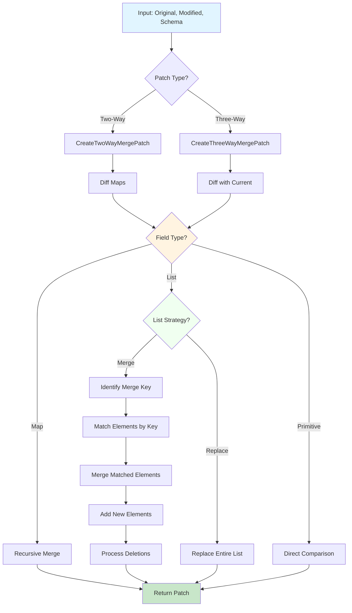
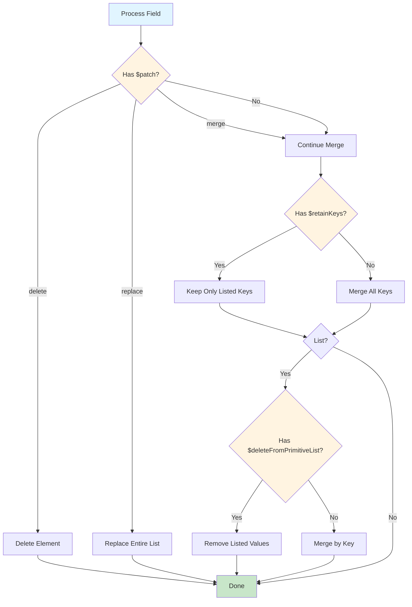
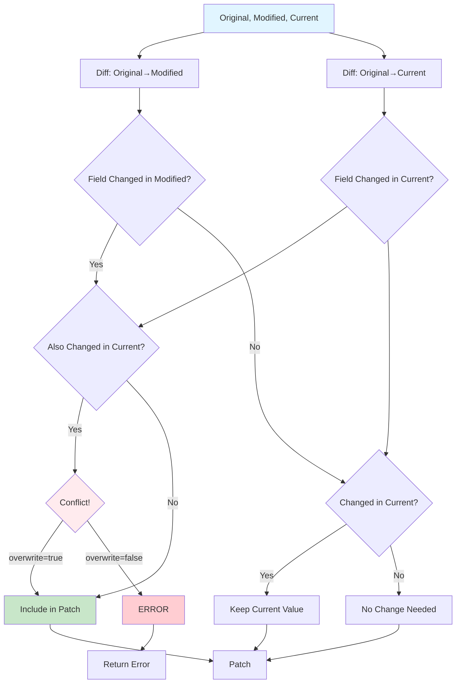
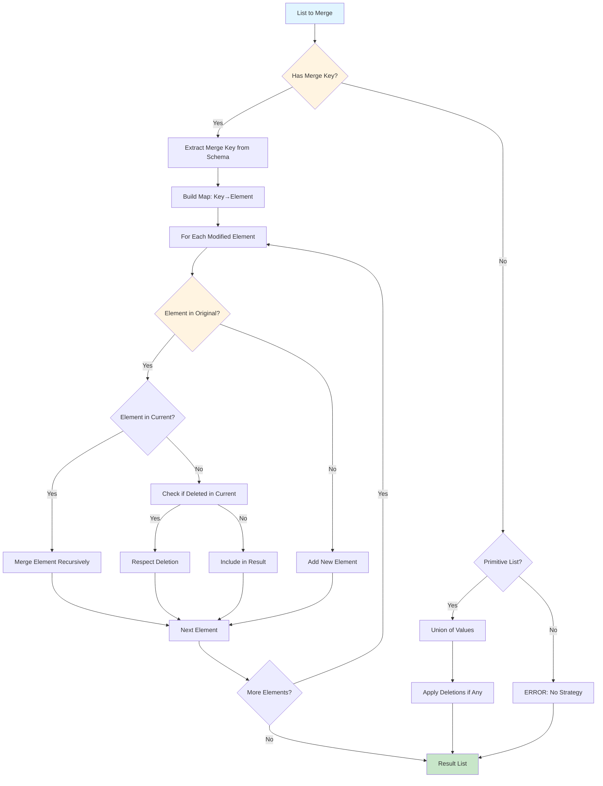
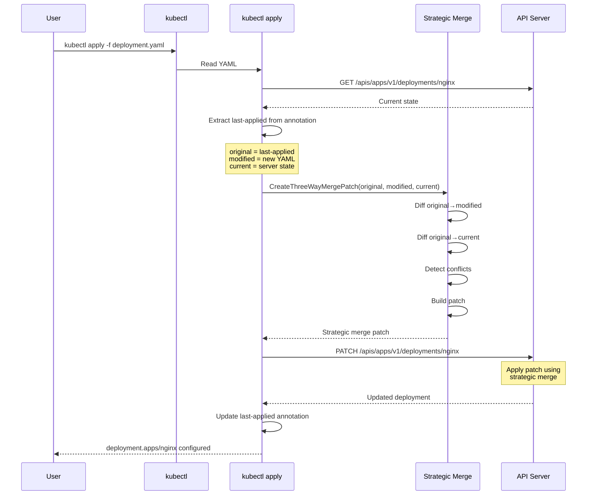

# **Strategic Merge Patch Algorithm**

━━━━━━━━━━━━━━━━━━━━━━━━━━━━━━━━━━━━━━━━━━━━━━━━━━━━━━━━━━━━━━━━━━━━━━━━━━━━━━

## **📋 Overview**

Strategic Merge Patch is Kubernetes' custom patch algorithm that extends JSON Merge Patch (RFC 7386) with the ability to **merge lists intelligently** instead of replacing them entirely. It's the foundation of `kubectl apply`'s three-way merge capability.

### **Key Concepts**

- **Strategic Merging**: List elements are merged by key rather than replaced
- **Patch Directives**: Special markers like `$patch`, `$retainKeys`, `$deleteFromPrimitiveList`
- **Merge Keys**: Struct tags that identify unique elements in lists
- **Three-Way Merge**: Reconciles original, modified, and current states
- **Schema-Driven**: Uses OpenAPI schema or struct tags for merge strategies

### **Code Locations**

```
staging/src/k8s.io/apimachinery/pkg/util/strategicpatch/patch.go:94-101      CreateTwoWayMergePatch
staging/src/k8s.io/apimachinery/pkg/util/strategicpatch/patch.go:2094-2105   CreateThreeWayMergePatch
staging/src/k8s.io/apimachinery/pkg/util/strategicpatch/patch.go:40-51       Directive constants
staging/src/k8s.io/kubectl/pkg/cmd/apply/patcher.go                          Apply integration
staging/src/k8s.io/apimachinery/pkg/util/strategicpatch/meta.go              Metadata handling
```

━━━━━━━━━━━━━━━━━━━━━━━━━━━━━━━━━━━━━━━━━━━━━━━━━━━━━━━━━━━━━━━━━━━━━━━━━━━━━━

## **🎯 Algorithm Overview**

### **Why Strategic Merge Patch?**

Standard JSON Merge Patch (RFC 7386) has limitations:

**JSON Merge Patch Problem**:
```yaml
# Original
containers:
- name: nginx
  image: nginx:1.14
- name: sidecar
  image: sidecar:1.0

# Modified (only updating nginx)
containers:
- name: nginx
  image: nginx:1.15

# Result: sidecar is DELETED! ❌
containers:
- name: nginx
  image: nginx:1.15
```

**Strategic Merge Patch Solution**:
```yaml
# Original
containers:
- name: nginx
  image: nginx:1.14
- name: sidecar
  image: sidecar:1.0

# Modified (only updating nginx)
containers:
- name: nginx
  image: nginx:1.15

# Result: sidecar is PRESERVED! ✅
containers:
- name: nginx
  image: nginx:1.15
- name: sidecar
  image: sidecar:1.0
```

### **Strategic Merge Features**

| Feature | Description | Example |
|---------|-------------|---------|
| **List Merging** | Merge list elements by key | Containers merged by `name` |
| **Selective Updates** | Update specific list items | Update only nginx container |
| **Deletion Control** | Explicit deletion directives | `$patch: delete` |
| **Replace Option** | Force list replacement | `$patch: replace` |
| **Retain Keys** | Keep only specified fields | `$retainKeys: [name, image]` |
| **Primitive List Ops** | Delete from primitive lists | `$deleteFromPrimitiveList` |
| **Order Control** | Specify element order | `$setElementOrder` |

### **Algorithm Flow**



━━━━━━━━━━━━━━━━━━━━━━━━━━━━━━━━━━━━━━━━━━━━━━━━━━━━━━━━━━━━━━━━━━━━━━━━━━━━━━

## **🔑 Merge Keys and Strategies**

### **Merge Key Definition**

Merge keys are defined via **struct tags** in Go types:

```go
type PodSpec struct {
    // Containers merged by "name"
    Containers []Container `json:"containers" patchStrategy:"merge" patchMergeKey:"name"`

    // Volumes merged by "name"
    Volumes []Volume `json:"volumes" patchStrategy:"merge" patchMergeKey:"name"`

    // ImagePullSecrets is a primitive list (no merge key)
    ImagePullSecrets []LocalObjectReference `json:"imagePullSecrets" patchStrategy:"merge"`
}
```

**Code Reference**: Kubernetes API types use these tags throughout

### **Patch Strategies**

| Strategy | Behavior | Use Case |
|----------|----------|----------|
| `merge` | Merge lists by key | Containers, volumes, env vars |
| `replace` | Replace entire list | finalizers |
| `retainKeys` | Keep only specified keys | Selective field preservation |

### **Common Merge Keys**

| Field | Merge Key | Example |
|-------|-----------|---------|
| `containers` | `name` | Container name uniquely identifies |
| `volumes` | `name` | Volume name uniquely identifies |
| `env` | `name` | Environment variable name |
| `ports` | `containerPort` + `protocol` | Port number and protocol |
| `volumeMounts` | `mountPath` | Mount path uniquely identifies |
| `initContainers` | `name` | Init container name |
| `tolerations` | Complex (key+operator+effect) | Toleration matching |

### **Schema Discovery**

Strategic merge patch discovers merge strategies from:

1. **Struct Tags** (compile-time):
   ```go
   type Container struct {
       Name  string `json:"name"`
       Env   []EnvVar `json:"env" patchStrategy:"merge" patchMergeKey:"name"`
   }
   ```

2. **OpenAPI Schema** (runtime):
   ```yaml
   x-kubernetes-patch-merge-key: name
   x-kubernetes-patch-strategy: merge
   ```

**Code Reference**: `staging/src/k8s.io/apimachinery/pkg/util/strategicpatch/meta.go`

━━━━━━━━━━━━━━━━━━━━━━━━━━━━━━━━━━━━━━━━━━━━━━━━━━━━━━━━━━━━━━━━━━━━━━━━━━━━━━

## **📝 Patch Directives**

### **Directive Constants**

Defined at `staging/src/k8s.io/apimachinery/pkg/util/strategicpatch/patch.go:40-51`:

```go
const (
    directiveMarker  = "$patch"
    deleteDirective  = "delete"
    replaceDirective = "replace"
    mergeDirective   = "merge"

    retainKeysStrategy = "retainKeys"

    deleteFromPrimitiveListDirectivePrefix = "$deleteFromPrimitiveList"
    retainKeysDirective                    = "$" + retainKeysStrategy
    setElementOrderDirectivePrefix         = "$setElementOrder"
)
```

**Code Reference**: `staging/src/k8s.io/apimachinery/pkg/util/strategicpatch/patch.go:40`

### **1. $patch Directive**

Controls how a map or list element is merged.

#### **$patch: delete**

Explicitly delete an element:

```yaml
# Delete the nginx container
containers:
- name: nginx
  $patch: delete
```

Resulting patch:
```json
{
  "containers": [
    {"name": "nginx", "$patch": "delete"}
  ]
}
```

#### **$patch: replace**

Replace entire list instead of merging:

```yaml
# Replace all containers
containers:
  $patch: replace
- name: nginx
  image: nginx:1.15
```

Resulting patch:
```json
{
  "containers": {
    "$patch": "replace",
    "value": [
      {"name": "nginx", "image": "nginx:1.15"}
    ]
  }
}
```

#### **$patch: merge**

Explicitly merge (default behavior):

```yaml
containers:
- name: nginx
  $patch: merge
  image: nginx:1.15
```

### **2. $retainKeys Directive**

Keep only specified fields, delete others:

```yaml
# Keep only name and image, delete everything else
containers:
- name: nginx
  image: nginx:1.15
  $retainKeys:
  - name
  - image
```

**Use Case**: Remove fields added by controllers or defaulting.

**Example**:
```yaml
# Original container
containers:
- name: nginx
  image: nginx:1.14
  resources:
    limits:
      cpu: 100m
      memory: 128Mi
  env:
  - name: DEBUG
    value: "true"

# Patch to remove resources and env
containers:
- name: nginx
  image: nginx:1.15
  $retainKeys:
  - name
  - image

# Result: resources and env are deleted
containers:
- name: nginx
  image: nginx:1.15
```

### **3. $deleteFromPrimitiveList Directive**

Delete specific values from primitive lists:

```yaml
# Remove specific finalizers
finalizers:
  $deleteFromPrimitiveList:
  - kubernetes
```

**Primitive Lists**: Lists of strings, numbers, or booleans (no merge key).

**Example**:
```yaml
# Original
finalizers:
- kubernetes
- foregroundDeletion
- orphan

# Patch
finalizers:
  $deleteFromPrimitiveList:
  - foregroundDeletion

# Result
finalizers:
- kubernetes
- orphan
```

### **4. $setElementOrder Directive**

Specify exact order of list elements:

```yaml
containers:
  $setElementOrder:
  - name: sidecar
  - name: nginx
```

**Note**: Rarely used; most lists don't preserve order.

### **Directive Precedence**



━━━━━━━━━━━━━━━━━━━━━━━━━━━━━━━━━━━━━━━━━━━━━━━━━━━━━━━━━━━━━━━━━━━━━━━━━━━━━━

## **🔀 Two-Way Merge Patch**

### **CreateTwoWayMergePatch**

Creates a patch from original → modified.

**Signature** (`staging/src/k8s.io/apimachinery/pkg/util/strategicpatch/patch.go:94-101`):

```go
func CreateTwoWayMergePatch(
    original, modified []byte,
    dataStruct interface{},
    fns ...mergepatch.PreconditionFunc,
) ([]byte, error)
```

**Code Reference**: `staging/src/k8s.io/apimachinery/pkg/util/strategicpatch/patch.go:94`

### **Algorithm Steps**

1. **Unmarshal** original and modified to maps
2. **Get Schema** from dataStruct (struct tags or OpenAPI)
3. **Diff Maps** recursively:
   - For each field in modified:
     - If different from original → include in patch
     - If list → apply merge strategy
     - If map → recurse
4. **Marshal** patch map to JSON

### **Example**

```go
original := []byte(`{
  "metadata": {"name": "nginx"},
  "spec": {
    "containers": [
      {"name": "nginx", "image": "nginx:1.14"}
    ]
  }
}`)

modified := []byte(`{
  "metadata": {"name": "nginx"},
  "spec": {
    "containers": [
      {"name": "nginx", "image": "nginx:1.15"},
      {"name": "sidecar", "image": "sidecar:1.0"}
    ]
  }
}`)

patch, err := strategicpatch.CreateTwoWayMergePatch(
    original, modified, &v1.Pod{},
)
// patch = {
//   "spec": {
//     "containers": [
//       {"name": "nginx", "image": "nginx:1.15"},
//       {"name": "sidecar", "image": "sidecar:1.0"}
//     ]
//   }
// }
```

### **Two-Way Flow**

```mermaid
sequenceDiagram
    participant User
    participant Create as CreateTwoWayMergePatch
    participant Diff as diffMaps
    participant Schema

    User->>Create: original, modified, struct
    Create->>Schema: Get merge metadata
    Schema-->>Create: Merge keys, strategies

    Create->>Diff: Diff maps recursively
    loop For each field
        Diff->>Diff: Compare values
        alt List with merge strategy
            Diff->>Diff: Identify merge key
            Diff->>Diff: Match elements by key
            Diff->>Diff: Include changes
        else Primitive or different
            Diff->>Diff: Include in patch
        end
    end

    Diff-->>Create: Patch map
    Create->>User: JSON patch
```

━━━━━━━━━━━━━━━━━━━━━━━━━━━━━━━━━━━━━━━━━━━━━━━━━━━━━━━━━━━━━━━━━━━━━━━━━━━━━━

## **🔀 Three-Way Merge Patch**

### **CreateThreeWayMergePatch**

The foundation of `kubectl apply` - reconciles three versions:
- **Original**: Last applied configuration
- **Modified**: New desired configuration
- **Current**: Live server state

**Signature** (`staging/src/k8s.io/apimachinery/pkg/util/strategicpatch/patch.go:2094-2105`):

```go
func CreateThreeWayMergePatch(
    original, modified, current []byte,
    schema LookupPatchMeta,
    overwrite bool,
    fns ...mergepatch.PreconditionFunc,
) ([]byte, error)
```

**Code Reference**: `staging/src/k8s.io/apimachinery/pkg/util/strategicpatch/patch.go:2094`

### **Three-Way Merge Logic**

The algorithm reconciles changes:

| Field State | Action |
|-------------|--------|
| Modified ≠ Original, Current = Original | **Apply change** (user intent) |
| Modified ≠ Original, Current ≠ Original | **Conflict** (unless overwrite=true) |
| Modified = Original, Current ≠ Original | **Keep current** (server change) |
| Field only in Modified | **Add field** (new user intent) |
| Field only in Current | **Keep field** (server added) |
| Field only in Original | **Delete from patch** (unchanged) |

### **Example Scenarios**

**Scenario 1: User Change (No Conflict)**
```yaml
# Original (last-applied-configuration)
replicas: 3

# Modified (new desired state)
replicas: 5

# Current (live state)
replicas: 3

# Result: Apply change
# Patch: {"replicas": 5}
```

**Scenario 2: Server Change (Preserved)**
```yaml
# Original
status: {}

# Modified
status: {}

# Current (server updated)
status:
  phase: Running
  conditions: [...]

# Result: Keep server change
# Patch: {} (no change to status)
```

**Scenario 3: Conflict (Both Changed)**
```yaml
# Original
replicas: 3

# Modified
replicas: 5

# Current (someone else changed it)
replicas: 7

# Result:
# - If overwrite=true: Use modified (5)
# - If overwrite=false: ERROR - conflict
```

**Scenario 4: User Deletes Field**
```yaml
# Original
resources:
  limits:
    cpu: 100m

# Modified
# (field removed)

# Current
resources:
  limits:
    cpu: 100m

# Result: Delete field
# Patch: {"resources": {"limits": null}}
```

### **Three-Way Merge Flow**



### **Conflict Detection**

Conflicts are detected when:
1. Field changed in both modified and current
2. Changes are **different**
3. `overwrite = false`

**Conflict Example**:
```go
original := `{"replicas": 3}`
modified := `{"replicas": 5}`
current := `{"replicas": 7}`

patch, err := CreateThreeWayMergePatch(
    []byte(original),
    []byte(modified),
    []byte(current),
    schema,
    false, // overwrite=false
)
// Returns error: conflict on "replicas"
```

━━━━━━━━━━━━━━━━━━━━━━━━━━━━━━━━━━━━━━━━━━━━━━━━━━━━━━━━━━━━━━━━━━━━━━━━━━━━━━

## **📝 List Merge Strategies**

### **Strategy 1: Merge by Key**

Most common strategy. Elements matched by merge key, then merged.

**Example - Containers**:
```yaml
# Original
containers:
- name: nginx
  image: nginx:1.14
  ports:
  - containerPort: 80
- name: sidecar
  image: sidecar:1.0

# Modified
containers:
- name: nginx
  image: nginx:1.15  # Update image

# Current (live)
containers:
- name: nginx
  image: nginx:1.14
  ports:
  - containerPort: 80
  resources:          # Added by admission controller
    requests:
      cpu: 100m
- name: sidecar
  image: sidecar:1.0

# Patch (strategic merge)
containers:
- name: nginx
  image: nginx:1.15

# Result after applying patch
containers:
- name: nginx
  image: nginx:1.15      # Updated
  ports:
  - containerPort: 80    # Preserved
  resources:             # Preserved (server added)
    requests:
      cpu: 100m
- name: sidecar          # Preserved (not in patch)
  image: sidecar:1.0
```

### **Strategy 2: Replace Entire List**

Force replacement instead of merging.

```yaml
# Patch with replace directive
spec:
  containers:
    $patch: replace
  - name: nginx
    image: nginx:1.15

# Result: ALL other containers deleted
```

### **Strategy 3: Primitive List Merge**

Lists without merge keys (strings, numbers, booleans).

**Default Behavior**: Union of lists
```yaml
# Original
finalizers:
- kubernetes

# Modified
finalizers:
- kubernetes
- custom-finalizer

# Result
finalizers:
- kubernetes
- custom-finalizer
```

**With Deletion**:
```yaml
# Patch
finalizers:
  $deleteFromPrimitiveList:
  - kubernetes

# Result
finalizers:
- custom-finalizer
```

### **List Merge Algorithm**



━━━━━━━━━━━━━━━━━━━━━━━━━━━━━━━━━━━━━━━━━━━━━━━━━━━━━━━━━━━━━━━━━━━━━━━━━━━━━━

## **⚙️ Implementation Details**

### **DiffOptions**

Options for creating patches at `staging/src/k8s.io/apimachinery/pkg/util/strategicpatch/patch.go:60-73`:

```go
type DiffOptions struct {
    // SetElementOrder determines whether we generate the $setElementOrder parallel list
    SetElementOrder bool

    // IgnoreChangesAndAdditions indicates if we keep the changes and additions in the patch
    IgnoreChangesAndAdditions bool

    // IgnoreDeletions indicates if we keep the deletions in the patch
    IgnoreDeletions bool

    // BuildRetainKeysDirective indicates if we build $retainKeys directives
    BuildRetainKeysDirective bool
}
```

**Code Reference**: `staging/src/k8s.io/apimachinery/pkg/util/strategicpatch/patch.go:60`

### **MergeOptions**

Options for applying patches at `staging/src/k8s.io/apimachinery/pkg/util/strategicpatch/patch.go:75-84`:

```go
type MergeOptions struct {
    // MergeParallelList indicates if we are merging the parallel list
    // We don't merge parallel list when calling mergeMap() in CreateThreeWayMergePatch()
    // which is called client-side.
    // We merge parallel list iff when calling mergeMap() in StrategicMergeMapPatch()
    // which is called server-side
    MergeParallelList bool

    // IgnoreUnmatchedNulls indicates if we should process the unmatched nulls
    IgnoreUnmatchedNulls bool
}
```

**Code Reference**: `staging/src/k8s.io/apimachinery/pkg/util/strategicpatch/patch.go:75`

### **LookupPatchMeta Interface**

Provides merge strategy metadata:

```go
type LookupPatchMeta interface {
    // LookupPatchMetadataForStruct returns metadata for a struct type
    LookupPatchMetadataForStruct(key string) (LookupPatchMeta, PatchMeta, error)

    // LookupPatchMetadataForSlice returns metadata for a slice
    LookupPatchMetadataForSlice(key string) (LookupPatchMeta, PatchMeta, error)

    // Name returns the name of the type
    Name() string
}
```

### **PatchMeta Structure**

```go
type PatchMeta struct {
    // patchStrategy is the strategy for merging
    patchStrategy string

    // patchMergeKey is the key to use for merging
    patchMergeKey string

    // patchStrategies is a map of field strategies
    patchStrategies map[string]string
}
```

### **Creating Schema from Struct**

From `staging/src/k8s.io/apimachinery/pkg/util/strategicpatch/patch.go:95-98`:

```go
schema, err := NewPatchMetaFromStruct(dataStruct)
if err != nil {
    return nil, err
}
```

This extracts merge metadata from Go struct tags:

```go
type Container struct {
    Name  string   `json:"name"`
    Image string   `json:"image"`
    Env   []EnvVar `json:"env" patchStrategy:"merge" patchMergeKey:"name"`
}
```

**Code Reference**: `staging/src/k8s.io/apimachinery/pkg/util/strategicpatch/patch.go:95`

━━━━━━━━━━━━━━━━━━━━━━━━━━━━━━━━━━━━━━━━━━━━━━━━━━━━━━━━━━━━━━━━━━━━━━━━━━━━━━

## **🔬 Edge Cases and Special Handling**

### **1. Null Values**

**Null in JSON = Deletion**:
```json
{
  "spec": {
    "replicas": null
  }
}
```

This **deletes** the `replicas` field.

**Preserving Null**:
In Go, distinguish between:
- Field not present (omitempty, not in JSON)
- Field explicitly null (`*int` set to nil)

### **2. Empty Lists**

**Empty List vs Null**:
```yaml
# Empty list (clear all items)
containers: []

# Null (delete field)
containers: null

# Not present (no change)
# (field omitted)
```

Strategic merge handles each differently:
- `[]`: Clear list while preserving field
- `null`: Delete field entirely
- Omitted: No change to field

### **3. Maps vs Structs**

**Unstructured Data**:
```go
// Structured (has schema)
pod := &v1.Pod{}
CreateTwoWayMergePatch(orig, mod, pod)

// Unstructured (generic map)
obj := &unstructured.Unstructured{}
// Uses OpenAPI schema lookup
```

### **4. Nested Lists**

Lists within lists are supported:

```yaml
containers:
- name: nginx
  env:
  - name: DEBUG    # Nested list with merge key
    value: "true"
```

Both levels use their respective merge keys.

### **5. Complex Merge Keys**

Some resources use **multiple fields** as merge key:

```go
// Tolerations use key + operator + effect
type Toleration struct {
    Key      string `json:"key"`
    Operator string `json:"operator"`
    Effect   string `json:"effect"`
    // Merged by combination of key, operator, effect
}
```

### **6. Server-Side Defaulting**

Server may add default values:

```yaml
# Client sends
containers:
- name: nginx
  image: nginx

# Server adds defaults
containers:
- name: nginx
  image: nginx
  imagePullPolicy: Always     # Added by admission
  terminationMessagePath: /dev/termination-log  # Default
  terminationMessagePolicy: File                 # Default
```

Strategic merge **preserves** these defaults on next apply.

### **7. Metadata Fields**

Special handling for metadata:

```yaml
metadata:
  labels:
    # Labels are merged as maps
    app: nginx
  annotations:
    # Annotations are merged as maps
    kubectl.kubernetes.io/last-applied-configuration: "..."
```

**Exception**: `kubectl.kubernetes.io/last-applied-configuration` is managed by apply.

━━━━━━━━━━━━━━━━━━━━━━━━━━━━━━━━━━━━━━━━━━━━━━━━━━━━━━━━━━━━━━━━━━━━━━━━━━━━━━

## **📊 Complete Example: kubectl apply**

### **Initial Apply**

```bash
kubectl apply -f deployment.yaml
```

```yaml
# deployment.yaml (original)
apiVersion: apps/v1
kind: Deployment
metadata:
  name: nginx
spec:
  replicas: 3
  selector:
    matchLabels:
      app: nginx
  template:
    metadata:
      labels:
        app: nginx
    spec:
      containers:
      - name: nginx
        image: nginx:1.14
```

**What happens**:
1. Object doesn't exist → Create
2. Annotation added:
   ```yaml
   metadata:
     annotations:
       kubectl.kubernetes.io/last-applied-configuration: |
         {"apiVersion":"apps/v1","kind":"Deployment",...}
   ```

### **Server Adds Defaults**

Server admission controllers add:

```yaml
spec:
  template:
    spec:
      containers:
      - name: nginx
        image: nginx:1.14
        imagePullPolicy: Always
        terminationMessagePath: /dev/termination-log
        terminationMessagePolicy: File
      restartPolicy: Always
      schedulerName: default-scheduler
      securityContext: {}
```

### **User Updates**

User modifies deployment.yaml:

```yaml
# deployment.yaml (modified)
spec:
  replicas: 5         # Changed
  template:
    spec:
      containers:
      - name: nginx
        image: nginx:1.15  # Changed
      - name: sidecar      # Added
        image: sidecar:1.0
```

### **Apply Process**

```bash
kubectl apply -f deployment.yaml
```

**Three-Way Merge**:
- **Original**: From annotation (last-applied-configuration)
- **Modified**: New deployment.yaml
- **Current**: Live server state

**Patch Calculation**:
```json
{
  "spec": {
    "replicas": 5,
    "template": {
      "spec": {
        "containers": [
          {
            "name": "nginx",
            "image": "nginx:1.15"
          },
          {
            "name": "sidecar",
            "image": "sidecar:1.0"
          }
        ]
      }
    }
  }
}
```

**Result**:
- `replicas`: Updated to 5
- `nginx` container: Image updated to 1.15
- `sidecar` container: Added
- Server defaults: **Preserved** (imagePullPolicy, etc.)

### **Apply Flow Diagram**



━━━━━━━━━━━━━━━━━━━━━━━━━━━━━━━━━━━━━━━━━━━━━━━━━━━━━━━━━━━━━━━━━━━━━━━━━━━━━━

## **🔧 Integration with kubectl apply**

### **Apply Patcher**

The apply command uses strategic merge patch via `staging/src/k8s.io/kubectl/pkg/cmd/apply/patcher.go`.

**Key Function**:
```go
func (p *Patcher) Patch(
    current runtime.Object,
    modified []byte,
    source, namespace, name string,
    errOut io.Writer,
) ([]byte, error)
```

### **Last Applied Configuration**

Stored in annotation:

```yaml
metadata:
  annotations:
    kubectl.kubernetes.io/last-applied-configuration: |
      {"apiVersion":"apps/v1","kind":"Deployment","metadata":{"name":"nginx"},...}
```

This annotation:
1. Stores the **original** for three-way merge
2. Updated on every successful apply
3. Used to detect deletions

**Annotation Constant**:
```go
const LastAppliedConfigAnnotation = "kubectl.kubernetes.io/last-applied-configuration"
```

### **Apply vs Patch vs Replace**

| Command | Merge Strategy | Preserves Server Changes |
|---------|---------------|--------------------------|
| `kubectl apply` | Three-way strategic merge | ✅ Yes |
| `kubectl patch` | Two-way strategic/JSON/merge | ✅ Yes (for strategic) |
| `kubectl replace` | Full replacement | ❌ No |
| `kubectl create` | Create only | N/A |

━━━━━━━━━━━━━━━━━━━━━━━━━━━━━━━━━━━━━━━━━━━━━━━━━━━━━━━━━━━━━━━━━━━━━━━━━━━━━━

## **⚡ Performance Considerations**

### **Optimization Strategies**

1. **Schema Caching**: Schema metadata cached per type
2. **Lazy Evaluation**: Only diff changed subtrees
3. **Map Representation**: Work with maps instead of structs (faster)
4. **Preallocated Maps**: Reduce allocations

### **JSONMap Representation**

From `staging/src/k8s.io/apimachinery/pkg/util/strategicpatch/patch.go:53-58`:

```go
// JSONMap is a representations of JSON object encoded as map[string]interface{}
// where the children can be either map[string]interface{}, []interface{} or
// primitive type).
// Operating on JSONMap representation is much faster as it doesn't require any
// json marshaling and/or unmarshaling operations.
type JSONMap map[string]interface{}
```

**Code Reference**: `staging/src/k8s.io/apimachinery/pkg/util/strategicpatch/patch.go:53`

### **Performance Tips**

| Scenario | Recommendation |
|----------|----------------|
| Large objects | Use `--server-side` apply (server does merge) |
| Many applies | Cache schema lookups |
| Deep nesting | Consider flattening structure |
| Huge lists | Use pagination, apply subsets |

### **Benchmarks**

Typical performance (rough estimates):

- **Two-way merge**: ~1ms for typical Pod
- **Three-way merge**: ~2-5ms for typical Deployment
- **Schema lookup**: ~100μs (cached)
- **Large objects**: Can exceed 100ms for objects >1MB

━━━━━━━━━━━━━━━━━━━━━━━━━━━━━━━━━━━━━━━━━━━━━━━━━━━━━━━━━━━━━━━━━━━━━━━━━━━━━━

## **🐛 Troubleshooting**

### **Common Issues**

| Issue | Cause | Solution |
|-------|-------|----------|
| **List replaced instead of merged** | Missing merge key | Check struct tags or OpenAPI schema |
| **Conflict error** | Both user and server changed same field | Use `--force-conflicts` or fix manually |
| **Fields keep getting removed** | Using JSON Merge instead of Strategic | Use `kubectl apply` or `-type=strategic` |
| **Deletions not working** | Null vs omitted field | Explicitly set field to `null` |
| **Unexpected behavior** | Primitive list without proper directive | Use `$deleteFromPrimitiveList` |

### **Debugging**

**1. View Last Applied**:
```bash
kubectl get deployment nginx -o jsonpath='{.metadata.annotations.kubectl\.kubernetes\.io/last-applied-configuration}' | jq .
```

**2. Dry-Run Apply**:
```bash
kubectl apply -f deployment.yaml --dry-run=server -v=8
```

Shows the patch that would be sent.

**3. View Patch**:
```bash
kubectl apply -f deployment.yaml --dry-run=client -o yaml
```

**4. Test Patch Locally**:
```go
package main

import (
    "fmt"
    "k8s.io/apimachinery/pkg/util/strategicpatch"
    corev1 "k8s.io/api/core/v1"
)

func main() {
    original := []byte(`{"spec":{"containers":[{"name":"nginx","image":"nginx:1.14"}]}}`)
    modified := []byte(`{"spec":{"containers":[{"name":"nginx","image":"nginx:1.15"}]}}`)

    patch, err := strategicpatch.CreateTwoWayMergePatch(
        original, modified, &corev1.Pod{},
    )
    if err != nil {
        panic(err)
    }

    fmt.Println(string(patch))
}
```

### **Common Errors**

**Error: Conflict**
```
error: At least one of apiVersion, kind and name was changed
```
**Fix**: Don't change core identity fields (apiVersion, kind, metadata.name)

**Error: Invalid Patch**
```
error: unable to recognize "deployment.yaml": no matches for kind "Deployment"
```
**Fix**: Check apiVersion and kind are correct

━━━━━━━━━━━━━━━━━━━━━━━━━━━━━━━━━━━━━━━━━━━━━━━━━━━━━━━━━━━━━━━━━━━━━━━━━━━━━━

## **📚 Summary**

### **Key Takeaways**

1. **Strategic Merge Patch** extends JSON Merge Patch with intelligent list merging
2. **Merge Keys** (from struct tags or OpenAPI) identify unique list elements
3. **Directives** (`$patch`, `$retainKeys`, `$deleteFromPrimitiveList`) control merge behavior
4. **Two-Way Merge** creates patches from original → modified
5. **Three-Way Merge** reconciles original, modified, and current (used by kubectl apply)
6. **List Strategies**: Merge by key (default), replace, or primitive union
7. **Conflict Detection**: Errors when both user and server change same field differently
8. **Server Defaults Preserved**: Strategic merge keeps server-added fields

### **Strategic Merge vs Other Patch Types**

| Type | RFC | List Behavior | Use Case |
|------|-----|---------------|----------|
| **JSON Patch** | RFC 6902 | Operations (add, remove, replace) | Precise modifications |
| **JSON Merge Patch** | RFC 7386 | Replace entire list | Simple merges |
| **Strategic Merge** | Kubernetes | Merge by key | kubectl apply |
| **Server-Side Apply** | K8s 1.16+ | Field management | Multi-controller |

### **Code Reference Table**

| Component | File | Line |
|-----------|------|------|
| Directive constants | `strategicpatch/patch.go` | 40-51 |
| CreateTwoWayMergePatch | `strategicpatch/patch.go` | 94-101 |
| CreateThreeWayMergePatch | `strategicpatch/patch.go` | 2094-2105 |
| DiffOptions | `strategicpatch/patch.go` | 60-73 |
| MergeOptions | `strategicpatch/patch.go` | 75-84 |
| JSONMap type | `strategicpatch/patch.go` | 53-58 |
| Apply patcher | `kubectl/pkg/cmd/apply/patcher.go` | - |
| Metadata handling | `strategicpatch/meta.go` | - |

### **Related Documentation**

- [Declarative Apply](../middle-level/02-declarative-apply.md) - kubectl apply architecture
- [Edit and Patch](../middle-level/04-edit-patch.md) - Patch command details
- [kubectl Validation](./05-kubectl-validation.md) - Schema validation

━━━━━━━━━━━━━━━━━━━━━━━━━━━━━━━━━━━━━━━━━━━━━━━━━━━━━━━━━━━━━━━━━━━━━━━━━━━━━━

*Low-Level Architecture Documentation*
*Part of kubectl Architecture Study - Phase 4*
*File 2 of 6 - Strategic Merge Patch Algorithm*
