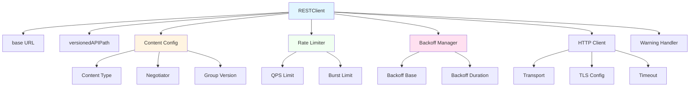
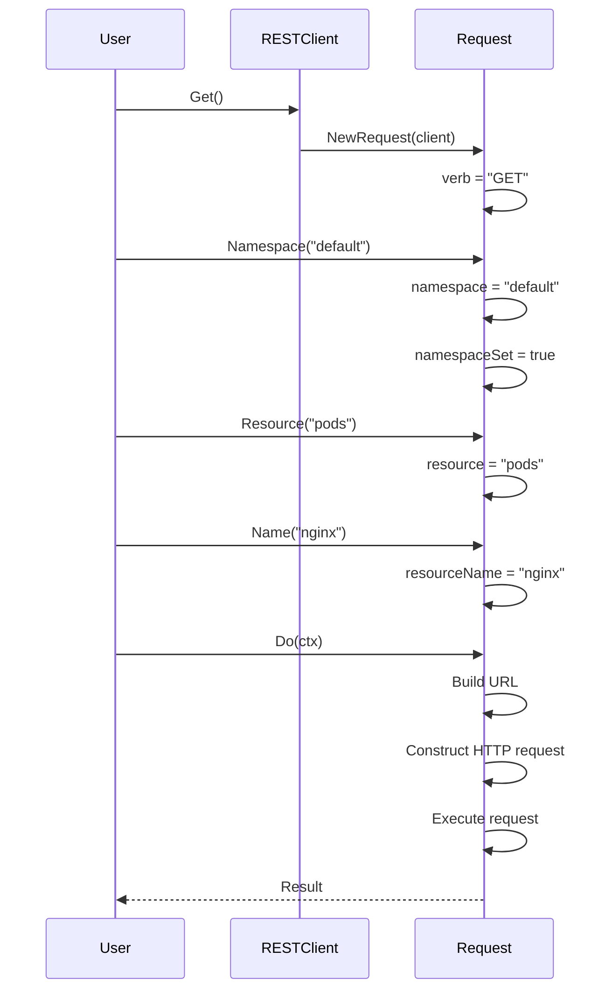
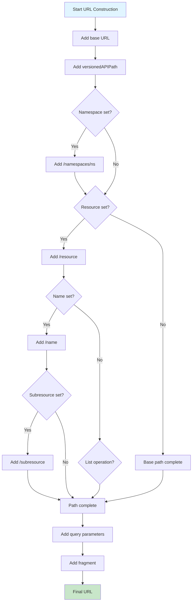
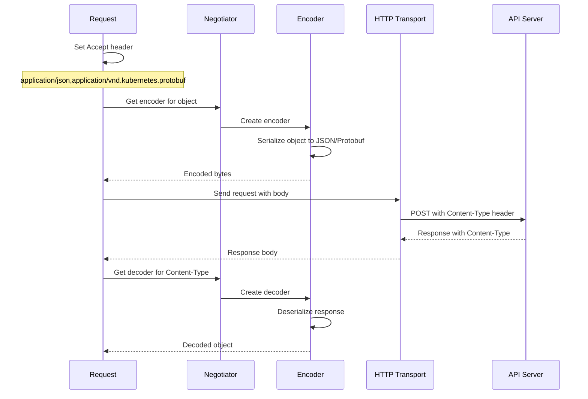
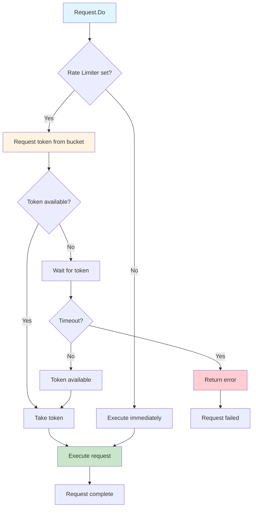
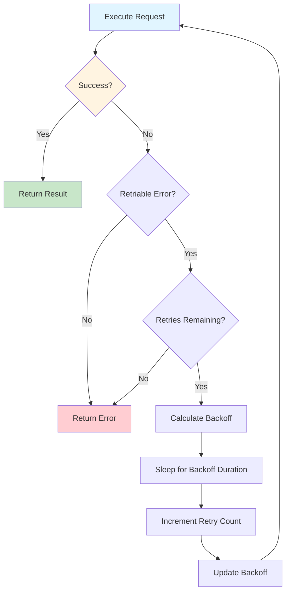
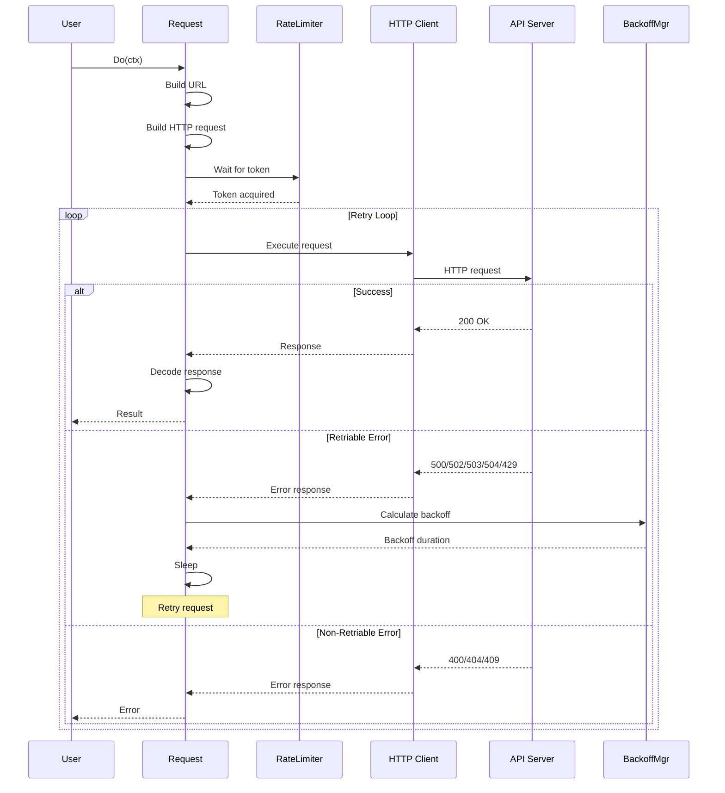

# **REST Client Architecture**

━━━━━━━━━━━━━━━━━━━━━━━━━━━━━━━━━━━━━━━━━━━━━━━━━━━━━━━━━━━━━━━━━━━━━━━━━━━━━━

## **📋 Overview**

The **REST Client** is the foundational component in client-go that provides low-level communication with the Kubernetes API server. It handles HTTP requests, content negotiation, rate limiting, retries, and error handling.

### **Key Concepts**

- **RESTClient**: Main client structure for API communication
- **Request**: Fluent builder for constructing API requests
- **Content Negotiation**: Automatic serialization/deserialization
- **Rate Limiting**: Client-side throttling to protect API server
- **Backoff**: Exponential backoff for retries
- **Streaming**: Support for watch, logs, and exec streams

### **Code Locations**

```
staging/src/k8s.io/client-go/rest/client.go:45-55         Interface definition
staging/src/k8s.io/client-go/rest/client.go:86-108        RESTClient struct
staging/src/k8s.io/client-go/rest/client.go:112-128       NewRESTClient
staging/src/k8s.io/client-go/rest/request.go:96-131       Request struct
staging/src/k8s.io/client-go/rest/request.go:134-177      NewRequest
staging/src/k8s.io/client-go/rest/config.go               Configuration
```

━━━━━━━━━━━━━━━━━━━━━━━━━━━━━━━━━━━━━━━━━━━━━━━━━━━━━━━━━━━━━━━━━━━━━━━━━━━━━━

## **🏗️ RESTClient Structure**

### **Interface Definition**

From `staging/src/k8s.io/client-go/rest/client.go:45-55`:

```go
type Interface interface {
    GetRateLimiter() flowcontrol.RateLimiter
    Verb(verb string) *Request
    Post() *Request
    Put() *Request
    Patch(pt types.PatchType) *Request
    Get() *Request
    Delete() *Request
    APIVersion() schema.GroupVersion
}
```

**Code Reference**: `staging/src/k8s.io/client-go/rest/client.go:45`

### **RESTClient Struct**

From `staging/src/k8s.io/client-go/rest/client.go:86-108`:

```go
type RESTClient struct {
    // base is the root URL for all invocations of the client
    base *url.URL

    // versionedAPIPath is a path segment connecting the base URL to the resource root
    versionedAPIPath string

    // content describes how a RESTClient encodes and decodes responses
    content requestClientContentConfigProvider

    // creates BackoffManager that is passed to requests
    createBackoffMgr func() BackoffManagerWithContext

    // rateLimiter is shared among all requests created by this client
    rateLimiter flowcontrol.RateLimiter

    // warningHandler is shared among all requests created by this client
    warningHandler WarningHandlerWithContext

    // Set specific behavior of the client. If not set http.DefaultClient will be used
    Client *http.Client
}
```

**Code Reference**: `staging/src/k8s.io/client-go/rest/client.go:86`

### **RESTClient Components**



━━━━━━━━━━━━━━━━━━━━━━━━━━━━━━━━━━━━━━━━━━━━━━━━━━━━━━━━━━━━━━━━━━━━━━━━━━━━━━

## **🔧 Request Builder**

### **Request Structure**

From `staging/src/k8s.io/client-go/rest/request.go:96-131`:

```go
type Request struct {
    c *RESTClient

    contentConfig     ClientContentConfig
    contentTypeNotSet bool

    warningHandler WarningHandlerWithContext

    rateLimiter flowcontrol.RateLimiter
    backoff     BackoffManagerWithContext
    timeout     time.Duration
    maxRetries  int

    // generic components accessible via method setters
    verb       string
    pathPrefix string
    subpath    string
    params     url.Values
    headers    http.Header

    // structural elements of the request that are part of the Kubernetes API conventions
    namespace    string
    namespaceSet bool
    resource     string
    resourceName string
    subresource  string

    // output
    err error

    // only one of body / bodyBytes may be set
    body      io.Reader
    bodyBytes []byte

    retryFn requestRetryFunc
}
```

**Code Reference**: `staging/src/k8s.io/client-go/rest/request.go:96`

### **Fluent API Pattern**

The Request uses a **fluent builder pattern**:

```go
// Example: GET /api/v1/namespaces/default/pods/nginx
result := client.Get().
    Namespace("default").
    Resource("pods").
    Name("nginx").
    Do(ctx)
```

Each method returns `*Request` allowing chaining.

### **Request Building Flow**



━━━━━━━━━━━━━━━━━━━━━━━━━━━━━━━━━━━━━━━━━━━━━━━━━━━━━━━━━━━━━━━━━━━━━━━━━━━━━━

## **🔨 HTTP Verb Methods**

### **Standard Verbs**

Each HTTP verb has a convenience method:

```go
// GET request
func (c *RESTClient) Get() *Request {
    return c.Verb("GET")
}

// POST request
func (c *RESTClient) Post() *Request {
    return c.Verb("POST")
}

// PUT request
func (c *RESTClient) Put() *Request {
    return c.Verb("PUT")
}

// DELETE request
func (c *RESTClient) Delete() *Request {
    return c.Verb("DELETE")
}

// PATCH request
func (c *RESTClient) Patch(pt types.PatchType) *Request {
    return c.Verb("PATCH").SetHeader("Content-Type", string(pt))
}
```

### **Generic Verb**

```go
// Verb sets the verb for the request
func (c *RESTClient) Verb(verb string) *Request {
    return NewRequest(c).Verb(verb)
}
```

### **Verb Usage**

| Verb | Kubernetes Operation | Example |
|------|---------------------|---------|
| **GET** | Read resource(s) | Get pod, list pods |
| **POST** | Create resource | Create deployment |
| **PUT** | Update/replace resource | Replace config map |
| **PATCH** | Partially update | Update pod labels |
| **DELETE** | Delete resource | Delete service |
| **LIST** | List resources (via GET) | List all namespaces |
| **WATCH** | Stream changes (via GET) | Watch pod events |

━━━━━━━━━━━━━━━━━━━━━━━━━━━━━━━━━━━━━━━━━━━━━━━━━━━━━━━━━━━━━━━━━━━━━━━━━━━━━━

## **🛤️ Path Construction**

### **URL Building**

Request constructs URLs following Kubernetes API conventions:

```
{base}/{versionedAPIPath}/[namespaces/{namespace}]/[{resource}[/{name}[/{subresource}]]]
```

**Examples**:

```
# Cluster-scoped resource
https://api.k8s.io/api/v1/nodes

# Namespaced resource list
https://api.k8s.io/api/v1/namespaces/default/pods

# Specific resource
https://api.k8s.io/api/v1/namespaces/default/pods/nginx

# Subresource
https://api.k8s.io/api/v1/namespaces/default/pods/nginx/log

# Custom resource
https://api.k8s.io/apis/apps/v1/namespaces/default/deployments/nginx
```

### **Path Components**

```go
// Namespace sets the namespace for namespaced resources
func (r *Request) Namespace(namespace string) *Request {
    if r.err != nil {
        return r
    }
    r.namespace = namespace
    r.namespaceSet = true
    return r
}

// Resource sets the resource type
func (r *Request) Resource(resource string) *Request {
    if r.err != nil {
        return r
    }
    r.resource = resource
    return r
}

// Name sets the resource name
func (r *Request) Name(name string) *Request {
    if r.err != nil {
        return r
    }
    r.resourceName = name
    return r
}

// SubResource sets the subresource
func (r *Request) SubResource(subresources ...string) *Request {
    if r.err != nil {
        return r
    }
    r.subresource = path.Join(subresources...)
    return r
}
```

### **URL Construction Algorithm**



### **Query Parameters**

```go
// Param sets a query parameter
func (r *Request) Param(name, value string) *Request {
    if r.err != nil {
        return r
    }
    if r.params == nil {
        r.params = make(url.Values)
    }
    r.params[name] = append(r.params[name], value)
    return r
}

// Example: Add label selector
request.Param("labelSelector", "app=nginx")
// URL: /api/v1/pods?labelSelector=app%3Dnginx
```

**Common Parameters**:

| Parameter | Use | Example |
|-----------|-----|---------|
| `labelSelector` | Filter by labels | `app=nginx,tier=frontend` |
| `fieldSelector` | Filter by fields | `status.phase=Running` |
| `limit` | Pagination limit | `500` |
| `continue` | Pagination token | `eyJv...` |
| `watch` | Enable watch mode | `true` |
| `resourceVersion` | Start watch from version | `12345` |
| `timeoutSeconds` | Request timeout | `30` |

━━━━━━━━━━━━━━━━━━━━━━━━━━━━━━━━━━━━━━━━━━━━━━━━━━━━━━━━━━━━━━━━━━━━━━━━━━━━━━

## **📦 Content Negotiation**

### **ClientContentConfig**

From `staging/src/k8s.io/client-go/rest/client.go:57-77`:

```go
type ClientContentConfig struct {
    // AcceptContentTypes specifies the types the client will accept
    AcceptContentTypes string

    // ContentType specifies the wire format used to communicate with the server
    ContentType string

    // GroupVersion is the API version to talk to
    GroupVersion schema.GroupVersion

    // Negotiator is used for obtaining encoders and decoders
    Negotiator runtime.ClientNegotiator
}
```

**Code Reference**: `staging/src/k8s.io/client-go/rest/client.go:57`

### **Supported Formats**

| Format | Content-Type | Use Case |
|--------|--------------|----------|
| **JSON** | `application/json` | Default, most common |
| **Protobuf** | `application/vnd.kubernetes.protobuf` | Efficient binary format |
| **YAML** | `application/yaml` | Human-readable (less common) |
| **CBOR** | `application/cbor` | Binary format (newer) |

### **Content Negotiation Flow**



### **Encoding/Decoding**

```go
// Body sets the request body (automatically encoded)
func (r *Request) Body(obj interface{}) *Request {
    if r.err != nil {
        return r
    }

    // Serialize obj using negotiator
    data, err := runtime.Encode(r.contentConfig.Negotiator.Encoder, obj)
    if err != nil {
        r.err = err
        return r
    }

    r.bodyBytes = data
    return r
}
```

━━━━━━━━━━━━━━━━━━━━━━━━━━━━━━━━━━━━━━━━━━━━━━━━━━━━━━━━━━━━━━━━━━━━━━━━━━━━━━

## **⚡ Rate Limiting**

### **Rate Limiter**

RESTClient uses a **token bucket** rate limiter to prevent overwhelming the API server.

```go
// flowcontrol.RateLimiter interface
type RateLimiter interface {
    // TryAccept returns true if a token is taken immediately
    TryAccept() bool

    // Accept waits until a token is available
    Accept()

    // Stop stops the rate limiter
    Stop()

    // QPS returns queries per second
    QPS() float32

    // Wait waits for a specified duration
    Wait(ctx context.Context) error
}
```

### **Rate Limit Configuration**

```go
// Default rate limits
const (
    DefaultQPS   = 5.0    // 5 queries per second
    DefaultBurst = 10     // Burst of 10 requests
)

// Create rate limiter
rateLimiter := flowcontrol.NewTokenBucketRateLimiter(
    qps,   // Queries per second
    burst, // Burst capacity
)
```

### **Rate Limiting Flow**



### **Throttle Logging**

From `staging/src/k8s.io/client-go/rest/request.go:54-61`:

```go
const (
    // longThrottleLatency defines threshold for logging requests
    longThrottleLatency = 50 * time.Millisecond

    // extraLongThrottleLatency defines the threshold for logging at log level 2
    extraLongThrottleLatency = 1 * time.Second
)
```

If throttled for more than 50ms, a warning is logged.

**Code Reference**: `staging/src/k8s.io/client-go/rest/request.go:54`

━━━━━━━━━━━━━━━━━━━━━━━━━━━━━━━━━━━━━━━━━━━━━━━━━━━━━━━━━━━━━━━━━━━━━━━━━━━━━━

## **🔄 Backoff and Retries**

### **Backoff Manager**

Handles exponential backoff for failed requests.

```go
type BackoffManagerWithContext interface {
    // UpdateBackoff updates the backoff for a given URL
    UpdateBackoff(actualUrl *url.URL, err error, responseCode int)

    // CalculateBackoff calculates the backoff duration
    CalculateBackoff(actualUrl *url.URL) time.Duration

    // Sleep sleeps for the backoff duration
    Sleep(backoff time.Duration)
}
```

### **Exponential Backoff**

Default implementation uses exponential backoff with jitter:

```go
// Environment variables for backoff configuration
const (
    envBackoffBase     = "KUBE_CLIENT_BACKOFF_BASE"
    envBackoffDuration = "KUBE_CLIENT_BACKOFF_DURATION"
)

// Default values
backoffBase     = 1.0         // 1 second base
backoffDuration = 120.0       // 120 seconds max
```

**Code Reference**: `staging/src/k8s.io/client-go/rest/client.go:38-43`

### **Retry Logic**

```go
type withRetry struct {
    maxRetries int
}

func (r *withRetry) IsRetriable(request *http.Request) bool {
    // Only retry idempotent requests (GET, PUT, DELETE, PATCH)
    return request.Method == "GET" ||
           request.Method == "PUT" ||
           request.Method == "DELETE" ||
           request.Method == "PATCH"
}

func (r *withRetry) ShouldRetry(err error, response *http.Response) bool {
    // Retry on network errors, 5xx, 429 (Too Many Requests)
    if err != nil {
        return true
    }
    if response.StatusCode >= 500 {
        return true
    }
    if response.StatusCode == 429 {
        return true
    }
    return false
}
```

### **Retry Flow**



### **Retriable Status Codes**

| Status Code | Retriable | Reason |
|-------------|-----------|--------|
| 500 | ✅ Yes | Internal server error |
| 502 | ✅ Yes | Bad gateway |
| 503 | ✅ Yes | Service unavailable |
| 504 | ✅ Yes | Gateway timeout |
| 429 | ✅ Yes | Too many requests |
| 409 | ❌ No | Conflict (version mismatch) |
| 404 | ❌ No | Not found |
| 400 | ❌ No | Bad request |

━━━━━━━━━━━━━━━━━━━━━━━━━━━━━━━━━━━━━━━━━━━━━━━━━━━━━━━━━━━━━━━━━━━━━━━━━━━━━━

## **🚀 Request Execution**

### **Do() Method**

The `Do()` method executes the request:

```go
// Do executes the request and returns the result
func (r *Request) Do(ctx context.Context) Result {
    var result Result

    // Build the final URL
    url := r.URL()

    // Apply rate limiting
    if r.rateLimiter != nil {
        start := time.Now()
        r.rateLimiter.Wait(ctx)
        throttleTime := time.Since(start)

        // Log if throttled for too long
        if throttleTime > longThrottleLatency {
            klog.V(3).Infof("Waited %v for rate limiter", throttleTime)
        }
    }

    // Execute with retries
    err := r.request(ctx, func(req *http.Request) (*http.Response, error) {
        return r.c.Client.Do(req)
    })

    if err != nil {
        result.err = err
        return result
    }

    result.body = resp.Body
    result.statusCode = resp.StatusCode
    return result
}
```

### **DoRaw() Method**

Returns raw byte array instead of structured result:

```go
// DoRaw executes the request and returns raw bytes
func (r *Request) DoRaw(ctx context.Context) ([]byte, error) {
    result := r.Do(ctx)
    if result.err != nil {
        return nil, result.err
    }
    return result.Raw()
}
```

### **Stream() Method**

Returns streaming response (for watch, logs, exec):

```go
// Stream executes the request and returns a streaming response
func (r *Request) Stream(ctx context.Context) (io.ReadCloser, error) {
    // Execute request
    resp, err := r.execute(ctx)
    if err != nil {
        return nil, err
    }

    // Don't close body - caller is responsible
    return resp.Body, nil
}
```

### **Execution Flow**



━━━━━━━━━━━━━━━━━━━━━━━━━━━━━━━━━━━━━━━━━━━━━━━━━━━━━━━━━━━━━━━━━━━━━━━━━━━━━━

## **❌ Error Handling**

### **Error Types**

```go
// RequestConstructionError: Error building the request
type RequestConstructionError struct {
    Err error
}

// StatusError: API returned an error status
// Defined in k8s.io/apimachinery/pkg/api/errors
type StatusError struct {
    ErrStatus metav1.Status
}
```

### **Status Codes to Errors**

```go
// Convert HTTP status to error
switch resp.StatusCode {
case http.StatusOK:
    // Success
case http.StatusCreated:
    // Resource created
case http.StatusNotFound:
    return errors.NewNotFound(resource, name)
case http.StatusConflict:
    return errors.NewConflict(resource, name, nil)
case http.StatusUnauthorized:
    return errors.NewUnauthorized("Unauthorized")
case http.StatusForbidden:
    return errors.NewForbidden(resource, name, nil)
case http.StatusTooManyRequests:
    return errors.NewTooManyRequests("Too many requests", 0)
default:
    return errors.NewGenericServerResponse(resp.StatusCode, ...)
}
```

### **Error Response Structure**

API server returns errors in standard format:

```json
{
  "kind": "Status",
  "apiVersion": "v1",
  "status": "Failure",
  "message": "pods \"nginx\" not found",
  "reason": "NotFound",
  "details": {
    "name": "nginx",
    "kind": "pods"
  },
  "code": 404
}
```

Decoded into:

```go
type Status struct {
    TypeMeta
    Status  string      // "Success" or "Failure"
    Message string      // Human-readable message
    Reason  StatusReason // Machine-readable reason
    Details *StatusDetails
    Code    int32       // HTTP status code
}
```

━━━━━━━━━━━━━━━━━━━━━━━━━━━━━━━━━━━━━━━━━━━━━━━━━━━━━━━━━━━━━━━━━━━━━━━━━━━━━━

## **📡 Streaming Support**

### **Watch Streams**

Watch returns a stream of events:

```go
// Watch executes the request as a watch stream
func (r *Request) Watch(ctx context.Context) (watch.Interface, error) {
    // Set watch=true query parameter
    r.Param("watch", "true")

    // Execute with streaming
    resp, err := r.Stream(ctx)
    if err != nil {
        return nil, err
    }

    // Create stream decoder
    framer := r.contentConfig.Negotiator.StreamDecoder(resp)
    decoder := streaming.NewDecoder(framer, r.contentConfig.Negotiator.Decoder)

    return watch.NewStreamWatcher(decoder), nil
}
```

### **Log Streams**

```go
// Stream pod logs
request := client.Get().
    Namespace("default").
    Resource("pods").
    Name("nginx").
    SubResource("log").
    Param("follow", "true")

stream, err := request.Stream(ctx)
// Read from stream...
```

### **Exec Streams**

```go
// Execute command in container
request := client.Post().
    Namespace("default").
    Resource("pods").
    Name("nginx").
    SubResource("exec").
    Param("command", "/bin/sh").
    Param("stdin", "true").
    Param("stdout", "true").
    Param("stderr", "true").
    Param("tty", "false")

executor, err := remotecommand.NewSPDYExecutor(config, "POST", request.URL())
err = executor.Stream(remotecommand.StreamOptions{
    Stdin:  os.Stdin,
    Stdout: os.Stdout,
    Stderr: os.Stderr,
})
```

━━━━━━━━━━━━━━━━━━━━━━━━━━━━━━━━━━━━━━━━━━━━━━━━━━━━━━━━━━━━━━━━━━━━━━━━━━━━━━

## **⚙️ Complete Example**

### **Creating RESTClient**

```go
package main

import (
    "context"
    "fmt"
    "k8s.io/client-go/rest"
    "k8s.io/client-go/tools/clientcmd"
)

func main() {
    // Load kubeconfig
    config, err := clientcmd.BuildConfigFromFlags("", "/path/to/kubeconfig")
    if err != nil {
        panic(err)
    }

    // Create RESTClient for core API
    config.GroupVersion = &corev1.SchemeGroupVersion
    config.NegotiatedSerializer = scheme.Codecs.WithoutConversion()
    config.APIPath = "/api"

    client, err := rest.RESTClientFor(config)
    if err != nil {
        panic(err)
    }

    // Use client
    result := client.Get().
        Namespace("default").
        Resource("pods").
        Name("nginx").
        Do(context.TODO())

    var pod corev1.Pod
    err = result.Into(&pod)
    if err != nil {
        panic(err)
    }

    fmt.Printf("Pod: %s, Phase: %s\n", pod.Name, pod.Status.Phase)
}
```

### **List with Pagination**

```go
func listPods(client *rest.RESTClient) error {
    var continueToken string
    limit := int64(500)

    for {
        result := client.Get().
            Namespace("default").
            Resource("pods").
            Param("limit", fmt.Sprintf("%d", limit))

        if continueToken != "" {
            result.Param("continue", continueToken)
        }

        podList := &corev1.PodList{}
        err := result.Do(context.TODO()).Into(podList)
        if err != nil {
            return err
        }

        // Process pods
        for _, pod := range podList.Items {
            fmt.Printf("Pod: %s\n", pod.Name)
        }

        // Check if more pages
        continueToken = podList.Continue
        if continueToken == "" {
            break
        }
    }

    return nil
}
```

━━━━━━━━━━━━━━━━━━━━━━━━━━━━━━━━━━━━━━━━━━━━━━━━━━━━━━━━━━━━━━━━━━━━━━━━━━━━━━

## **⚡ Performance Considerations**

### **Optimization Strategies**

| Strategy | Implementation | Benefit |
|----------|---------------|---------|
| **Connection Pooling** | HTTP/2 with connection reuse | Reduce connection overhead |
| **Protobuf** | Use `application/vnd.kubernetes.protobuf` | 3-5x faster than JSON |
| **Rate Limiting** | Configure QPS and burst appropriately | Prevent server overload |
| **Pagination** | Use `limit` parameter | Handle large lists |
| **Field Selectors** | Filter server-side | Reduce network transfer |
| **Compression** | Enable gzip | Reduce bandwidth |

### **HTTP/2 Benefits**

RESTClient uses HTTP/2 by default:

- **Multiplexing**: Multiple requests over single connection
- **Header Compression**: HPACK reduces header overhead
- **Server Push**: Potential for pushing related resources
- **Binary Protocol**: More efficient than HTTP/1.1

### **Benchmarks**

Typical performance (rough estimates):

| Operation | Latency | Throughput |
|-----------|---------|------------|
| GET single pod | 10-50ms | - |
| LIST 1000 pods (JSON) | 100-500ms | ~2 MB/s |
| LIST 1000 pods (Protobuf) | 50-200ms | ~5 MB/s |
| WATCH stream | - | 100-1000 events/s |
| CREATE pod | 50-200ms | - |

━━━━━━━━━━━━━━━━━━━━━━━━━━━━━━━━━━━━━━━━━━━━━━━━━━━━━━━━━━━━━━━━━━━━━━━━━━━━━━

## **🐛 Troubleshooting**

### **Common Issues**

| Issue | Cause | Solution |
|-------|-------|----------|
| **Connection timeout** | Network issue or wrong server address | Check connectivity, verify server URL |
| **401 Unauthorized** | Invalid credentials | Check kubeconfig, verify token/cert |
| **403 Forbidden** | Insufficient RBAC permissions | Review RBAC roles and bindings |
| **429 Too Many Requests** | Exceeding rate limits | Increase QPS or add delays |
| **500 Internal Server Error** | API server issue | Check API server logs |
| **Connection refused** | API server not running | Verify API server is up |

### **Debug Logging**

Enable verbose logging:

```go
import "k8s.io/klog/v2"

// Set log level
klog.InitFlags(nil)
flag.Set("v", "8")  // Very verbose
```

Verbose levels:
- `v=0`: Errors only
- `v=2`: Warnings
- `v=4`: Info
- `v=6`: Debug
- `v=8`: Trace (includes HTTP requests/responses)

### **Request Inspection**

```go
// Log the URL being requested
url := request.URL()
fmt.Printf("Request URL: %s\n", url.String())

// Dump HTTP request
transport.DebugWrappers = true
```

━━━━━━━━━━━━━━━━━━━━━━━━━━━━━━━━━━━━━━━━━━━━━━━━━━━━━━━━━━━━━━━━━━━━━━━━━━━━━━

## **📚 Summary**

### **Key Takeaways**

1. **RESTClient** is the foundational HTTP client for Kubernetes API communication
2. **Fluent Builder** pattern makes request construction intuitive
3. **Rate Limiting** prevents overwhelming the API server
4. **Exponential Backoff** handles transient failures gracefully
5. **Content Negotiation** automatically handles serialization (JSON/Protobuf)
6. **Streaming** supports watch, logs, and exec operations
7. **Error Handling** converts HTTP status codes to typed errors
8. **HTTP/2** provides efficient connection management

### **Architecture Patterns**

- **Builder Pattern**: Fluent API for constructing requests
- **Strategy Pattern**: Pluggable rate limiters and backoff managers
- **Adapter Pattern**: Negotiator adapts between formats
- **Decorator Pattern**: Request wraps HTTP client with additional behavior

### **Code Reference Table**

| Component | File | Line |
|-----------|------|------|
| Interface | `client-go/rest/client.go` | 45-55 |
| RESTClient struct | `client-go/rest/client.go` | 86-108 |
| NewRESTClient | `client-go/rest/client.go` | 112-128 |
| Request struct | `client-go/rest/request.go` | 96-131 |
| NewRequest | `client-go/rest/request.go` | 134-177 |
| Backoff constants | `client-go/rest/client.go` | 38-43 |
| Throttle constants | `client-go/rest/request.go` | 54-61 |
| ClientContentConfig | `client-go/rest/client.go` | 57-77 |

### **Related Documentation**

- [Discovery Client](./04-discovery-client.md) - API discovery mechanisms
- [Resource Builders](../middle-level/08-resource-builders.md) - High-level resource access
- [Streaming Protocols](./06-streaming-protocols.md) - SPDY and WebSocket details

━━━━━━━━━━━━━━━━━━━━━━━━━━━━━━━━━━━━━━━━━━━━━━━━━━━━━━━━━━━━━━━━━━━━━━━━━━━━━━

*Low-Level Architecture Documentation*
*Part of kubectl Architecture Study - Phase 4*
*File 3 of 6 - REST Client Architecture*
