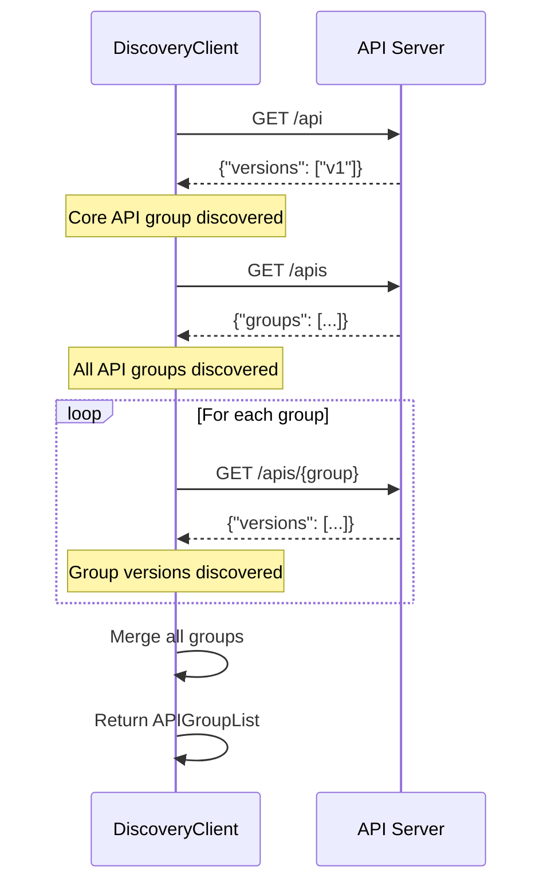
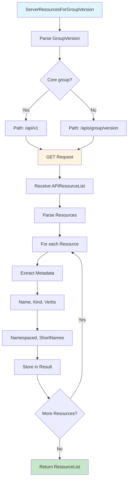
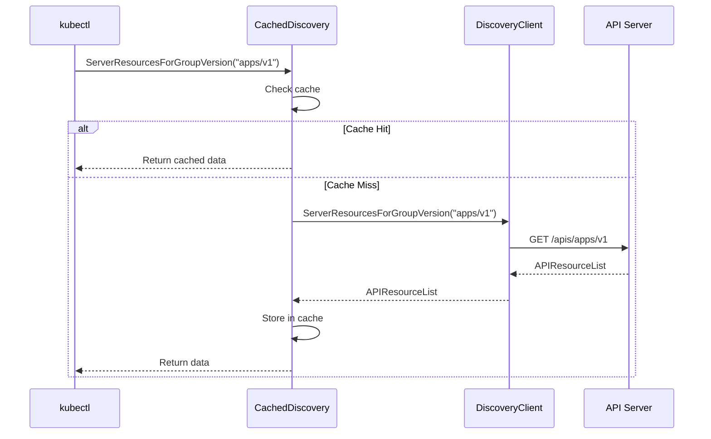

# **Discovery Client Architecture**

━━━━━━━━━━━━━━━━━━━━━━━━━━━━━━━━━━━━━━━━━━━━━━━━━━━━━━━━━━━━━━━━━━━━━━━━━━━━━━

## **📋 Overview**

The **Discovery Client** is responsible for discovering the API groups, versions, and resources available on a Kubernetes API server. It enables kubectl and other clients to dynamically adapt to different API server configurations without hard-coding resource types.

### **Key Concepts**

- **API Discovery**: Querying the API server for available APIs
- **Server Groups**: API groups available on the server (apps, batch, networking, etc.)
- **Server Resources**: Resources within each group/version (pods, deployments, services, etc.)
- **OpenAPI Schema**: Detailed schema information for validation and documentation
- **Cached Discovery**: Local caching to reduce API calls
- **Aggregated Discovery**: New v2 format that returns groups and resources in one call

### **Code Locations**

```
staging/src/k8s.io/client-go/discovery/discovery_client.go:76-89      DiscoveryInterface
staging/src/k8s.io/client-go/discovery/discovery_client.go:117-145    ServerResourcesInterface
staging/src/k8s.io/client-go/discovery/cached/memory/memcache.go      Cached discovery
staging/src/k8s.io/client-go/restmapper/discovery.go                   RESTMapper integration
```

━━━━━━━━━━━━━━━━━━━━━━━━━━━━━━━━━━━━━━━━━━━━━━━━━━━━━━━━━━━━━━━━━━━━━━━━━━━━━━

## **🏗️ Discovery Interface**

### **Interface Definition**

From `staging/src/k8s.io/client-go/discovery/discovery_client.go:76-89`:

```go
type DiscoveryInterface interface {
    RESTClient() restclient.Interface
    ServerGroupsInterface
    ServerResourcesInterface
    ServerVersionInterface
    OpenAPISchemaInterface
    OpenAPIV3SchemaInterface
    // Returns copy of current discovery client that will only
    // receive the legacy discovery format
    WithLegacy() DiscoveryInterface
}
```

**Code Reference**: `staging/src/k8s.io/client-go/discovery/discovery_client.go:76`

### **Server Groups Interface**

From `staging/src/k8s.io/client-go/discovery/discovery_client.go:117-122`:

```go
type ServerGroupsInterface interface {
    // ServerGroups returns the supported groups, with information like
    // supported versions and the preferred version
    ServerGroups() (*metav1.APIGroupList, error)
}
```

**Code Reference**: `staging/src/k8s.io/client-go/discovery/discovery_client.go:117`

### **Server Resources Interface**

From `staging/src/k8s.io/client-go/discovery/discovery_client.go:124-145`:

```go
type ServerResourcesInterface interface {
    // ServerResourcesForGroupVersion returns the supported resources
    // for a group and version
    ServerResourcesForGroupVersion(groupVersion string) (*metav1.APIResourceList, error)

    // ServerGroupsAndResources returns the supported groups and resources
    // for all groups and versions
    ServerGroupsAndResources() ([]*metav1.APIGroup, []*metav1.APIResourceList, error)

    // ServerPreferredResources returns the supported resources with
    // the version preferred by the server
    ServerPreferredResources() ([]*metav1.APIResourceList, error)

    // ServerPreferredNamespacedResources returns the supported namespaced
    // resources with the version preferred by the server
    ServerPreferredNamespacedResources() ([]*metav1.APIResourceList, error)
}
```

**Code Reference**: `staging/src/k8s.io/client-go/discovery/discovery_client.go:124`

### **Discovery Architecture**

```mermaid
graph TD
    A[DiscoveryClient] --> B[ServerGroups]
    A --> C[ServerResources]
    A --> D[ServerVersion]
    A --> E[OpenAPISchema]
    A --> F[RESTClient]

    B --> B1[/api]
    B --> B2[/apis]

    C --> C1[ServerResourcesForGroupVersion]
    C --> C2[ServerGroupsAndResources]
    C --> C3[ServerPreferredResources]

    E --> E1[OpenAPI v2]
    E --> E2[OpenAPI v3]

    F --> G[HTTP Requests]

    style A fill:#e1f5ff
    style B fill:#fff4e1
    style C fill:#f0fff0
    style E fill:#ffe0f0
```

━━━━━━━━━━━━━━━━━━━━━━━━━━━━━━━━━━━━━━━━━━━━━━━━━━━━━━━━━━━━━━━━━━━━━━━━━━━━━━

## **🔍 API Discovery Process**

### **Discovery Endpoints**

Kubernetes exposes discovery information at specific endpoints:

| Endpoint | Returns | Example |
|----------|---------|---------|
| `/api` | Core API group info | `{"versions":["v1"]}` |
| `/apis` | All API groups | List of groups (apps, batch, etc.) |
| `/apis/{group}/{version}` | Resources in group/version | Deployments, StatefulSets, etc. |
| `/openapi/v2` | OpenAPI v2 schema | Full API schema |
| `/openapi/v3` | OpenAPI v3 schema | Split by group/version |

### **ServerGroups() Flow**

```go
func (d *DiscoveryClient) ServerGroups() (*metav1.APIGroupList, error) {
    // 1. Get /api (core API)
    v := &metav1.APIVersions{}
    err := d.restClient.Get().AbsPath("/api").Do(ctx).Into(v)

    // 2. Get /apis (all other groups)
    g := &metav1.APIGroupList{}
    err = d.restClient.Get().AbsPath("/apis").Do(ctx).Into(g)

    // 3. Merge and return
    return mergeGroups(v, g)
}
```

**Discovery Sequence**:



### **Example: Discovering Groups**

```bash
# Core API group
$ kubectl get --raw /api
{
  "kind": "APIVersions",
  "versions": ["v1"]
}

# All API groups
$ kubectl get --raw /apis
{
  "kind": "APIGroupList",
  "groups": [
    {
      "name": "apps",
      "versions": [
        {"groupVersion": "apps/v1", "version": "v1"}
      ],
      "preferredVersion": {"groupVersion": "apps/v1", "version": "v1"}
    },
    {
      "name": "batch",
      "versions": [
        {"groupVersion": "batch/v1", "version": "v1"}
      ]
    }
  ]
}
```

━━━━━━━━━━━━━━━━━━━━━━━━━━━━━━━━━━━━━━━━━━━━━━━━━━━━━━━━━━━━━━━━━━━━━━━━━━━━━━

## **📦 Resource Discovery**

### **ServerResourcesForGroupVersion()**

Discovers resources for a specific group/version:

```go
func (d *DiscoveryClient) ServerResourcesForGroupVersion(groupVersion string) (*metav1.APIResourceList, error) {
    // Parse group and version
    gv, err := schema.ParseGroupVersion(groupVersion)
    if err != nil {
        return nil, err
    }

    // Construct path: /apis/{group}/{version}
    path := fmt.Sprintf("/apis/%s/%s", gv.Group, gv.Version)
    if gv.Group == "" {
        path = fmt.Sprintf("/api/%s", gv.Version)
    }

    // Request resource list
    var resources metav1.APIResourceList
    err = d.restClient.Get().AbsPath(path).Do(ctx).Into(&resources)
    return &resources, err
}
```

### **APIResourceList Structure**

```go
type APIResourceList struct {
    GroupVersion string        // "apps/v1"
    APIResources []APIResource // List of resources
}

type APIResource struct {
    Name         string           // "deployments"
    SingularName string           // "deployment"
    Namespaced   bool             // true
    Kind         string           // "Deployment"
    Verbs        []string         // ["get", "list", "watch", "create", ...]
    ShortNames   []string         // ["deploy"]
    Categories   []string         // ["all"]
    Group        string           // "apps"
    Version      string           // "v1"
    StorageVersionHash string     // Cache validation
}
```

### **Example: apps/v1 Resources**

```bash
$ kubectl get --raw /apis/apps/v1
{
  "kind": "APIResourceList",
  "groupVersion": "apps/v1",
  "resources": [
    {
      "name": "deployments",
      "singularName": "deployment",
      "namespaced": true,
      "kind": "Deployment",
      "verbs": ["create", "delete", "get", "list", "patch", "update", "watch"],
      "shortNames": ["deploy"],
      "categories": ["all"]
    },
    {
      "name": "deployments/scale",
      "namespaced": true,
      "kind": "Scale",
      "verbs": ["get", "patch", "update"]
    }
  ]
}
```

### **Resource Discovery Flow**



━━━━━━━━━━━━━━━━━━━━━━━━━━━━━━━━━━━━━━━━━━━━━━━━━━━━━━━━━━━━━━━━━━━━━━━━━━━━━━

## **🗺️ RESTMapper Integration**

### **RESTMapper Purpose**

RESTMapper converts between:
- **Kind** ↔ **Resource** (e.g., `Deployment` ↔ `deployments`)
- **Resource** ↔ **GroupVersionResource**
- **Kind** ↔ **GroupVersionKind**

### **DeferredDiscoveryRESTMapper**

Most common implementation - lazy loads discovery:

```go
type DeferredDiscoveryRESTMapper struct {
    discoveryClient CachedDiscoveryInterface
    delegate        meta.RESTMapper
    mu              sync.RWMutex
}

func (d *DeferredDiscoveryRESTMapper) KindFor(resource schema.GroupVersionResource) (schema.GroupVersionKind, error) {
    // Try cached mapper first
    d.mu.RLock()
    if d.delegate != nil {
        gvk, err := d.delegate.KindFor(resource)
        if err == nil {
            d.mu.RUnlock()
            return gvk, nil
        }
    }
    d.mu.RUnlock()

    // Cache miss - refresh discovery
    d.mu.Lock()
    defer d.mu.Unlock()

    // Re-discover API resources
    groupResources, err := restmapper.GetAPIGroupResources(d.discoveryClient)
    if err != nil {
        return schema.GroupVersionKind{}, err
    }

    // Rebuild mapper
    d.delegate = restmapper.NewDiscoveryRESTMapper(groupResources)

    return d.delegate.KindFor(resource)
}
```

### **Mapping Examples**

**Kind to Resource**:
```go
// Input: Deployment (Kind)
// Output: deployments (Resource)

gvr, err := mapper.RESTMapping(
    schema.GroupKind{Group: "apps", Kind: "Deployment"},
    "v1",
)
// gvr.Resource = "deployments"
```

**Resource to Kind**:
```go
// Input: deployments (Resource)
// Output: Deployment (Kind)

gvk, err := mapper.KindFor(
    schema.GroupVersionResource{
        Group: "apps",
        Version: "v1",
        Resource: "deployments",
    },
)
// gvk.Kind = "Deployment"
```

**Plural to Singular**:
```go
// Input: deployments
// Output: deployment

singular, err := mapper.ResourceSingularizer("deployments")
// singular = "deployment"
```

━━━━━━━━━━━━━━━━━━━━━━━━━━━━━━━━━━━━━━━━━━━━━━━━━━━━━━━━━━━━━━━━━━━━━━━━━━━━━━

## **💾 Cached Discovery**

### **Why Caching?**

Discovery calls are expensive:
- Multiple HTTP requests (one per group/version)
- Parses large JSON responses
- Happens on every kubectl command without caching

**Performance Impact**:
- Without caching: 500-1000ms per kubectl command
- With caching: 10-50ms per kubectl command

### **Memory-Based Cache**

From `staging/src/k8s.io/client-go/discovery/cached/memory/memcache.go`:

```go
type memCacheClient struct {
    delegate DiscoveryInterface

    lock                   sync.RWMutex
    groupToServerResources map[string]*metav1.APIResourceList
    groupList              *metav1.APIGroupList
    cacheValid             bool
}

func (d *memCacheClient) ServerResourcesForGroupVersion(groupVersion string) (*metav1.APIResourceList, error) {
    d.lock.RLock()
    if d.cacheValid {
        if resources, ok := d.groupToServerResources[groupVersion]; ok {
            d.lock.RUnlock()
            return resources, nil
        }
    }
    d.lock.RUnlock()

    // Cache miss - fetch from server
    d.lock.Lock()
    defer d.lock.Unlock()

    resources, err := d.delegate.ServerResourcesForGroupVersion(groupVersion)
    if err != nil {
        return nil, err
    }

    // Update cache
    d.groupToServerResources[groupVersion] = resources
    d.cacheValid = true

    return resources, nil
}
```

**Code Reference**: `staging/src/k8s.io/client-go/discovery/cached/memory/memcache.go`

### **Cache Invalidation**

```go
func (d *memCacheClient) Invalidate() {
    d.lock.Lock()
    defer d.lock.Unlock()

    d.groupToServerResources = make(map[string]*metav1.APIResourceList)
    d.groupList = nil
    d.cacheValid = false
}

func (d *memCacheClient) Fresh() bool {
    d.lock.RLock()
    defer d.lock.RUnlock()
    return d.cacheValid
}
```

### **Cache Flow**



### **Disk-Based Cache**

For persistent caching across kubectl invocations:

```go
// Cache directory: ~/.kube/cache/discovery/{host}_{port}/
diskCacheClient := disk.NewCachedDiscoveryClientForConfig(
    config,
    "/path/to/cache/dir",
    "/path/to/http/cache",
    10 * time.Minute, // TTL
)
```

**Cache Structure**:
```
~/.kube/cache/discovery/
└── 192.168.1.100_6443/
    ├── apps/
    │   └── v1/
    │       └── serverresources.json
    ├── batch/
    │   └── v1/
    │       └── serverresources.json
    └── servergroups.json
```

━━━━━━━━━━━━━━━━━━━━━━━━━━━━━━━━━━━━━━━━━━━━━━━━━━━━━━━━━━━━━━━━━━━━━━━━━━━━━━

## **🚀 Aggregated Discovery (v2)**

### **Motivation**

Legacy discovery requires **many round trips**:
1. GET /api
2. GET /apis
3. GET /apis/apps/v1
4. GET /apis/apps/v1beta1
5. GET /apis/batch/v1
... (one per group/version)

Aggregated discovery returns **everything in one call**.

### **Aggregated Discovery Format**

From `staging/src/k8s.io/client-go/discovery/discovery_client.go:62-69`:

```go
const (
    AcceptV1 = runtime.ContentTypeJSON
    // Aggregated discovery content-type (v2beta1)
    AcceptV2Beta1 = runtime.ContentTypeJSON + ";" +
        "g=apidiscovery.k8s.io;v=v2beta1;as=APIGroupDiscoveryList"
    AcceptV2 = runtime.ContentTypeJSON + ";" +
        "g=apidiscovery.k8s.io;v=v2;as=APIGroupDiscoveryList"

    acceptDiscoveryFormats = AcceptV2 + "," + AcceptV2Beta1 + "," + AcceptV1
}
```

**Code Reference**: `staging/src/k8s.io/client-go/discovery/discovery_client.go:62`

### **Request Flow**

```go
// Client sends Accept header with aggregated discovery preference
GET /apis
Accept: application/json;g=apidiscovery.k8s.io;v=v2;as=APIGroupDiscoveryList,
        application/json;g=apidiscovery.k8s.io;v=v2beta1;as=APIGroupDiscoveryList,
        application/json

// Server responds with aggregated format (if supported)
Content-Type: application/json;g=apidiscovery.k8s.io;v=v2;as=APIGroupDiscoveryList

// Response includes BOTH groups AND resources in one object
{
  "kind": "APIGroupDiscoveryList",
  "items": [
    {
      "metadata": {"name": "apps"},
      "versions": [
        {
          "version": "v1",
          "resources": [
            {"resource": "deployments", "kind": "Deployment", ...},
            {"resource": "statefulsets", "kind": "StatefulSet", ...}
          ]
        }
      ]
    }
  ]
}
```

### **Performance Comparison**

| Method | Round Trips | Time | Cache Size |
|--------|-------------|------|------------|
| **Legacy** | ~30 requests | 500-1000ms | ~500KB |
| **Aggregated v2** | 1 request | 50-100ms | ~100KB |

**Improvement**: **10x faster**, **5x smaller**

━━━━━━━━━━━━━━━━━━━━━━━━━━━━━━━━━━━━━━━━━━━━━━━━━━━━━━━━━━━━━━━━━━━━━━━━━━━━━━

## **🔐 OpenAPI Schema**

### **OpenAPI v2**

```go
func (d *DiscoveryClient) OpenAPISchema() (*openapi_v2.Document, error) {
    // GET /openapi/v2
    data, err := d.restClient.Get().AbsPath("/openapi/v2").
        SetHeader("Accept", openAPIV2mimePb).
        Do(ctx).Raw()

    // Parse protobuf or JSON
    var doc openapi_v2.Document
    if err := proto.Unmarshal(data, &doc); err != nil {
        return nil, err
    }

    return &doc, nil
}
```

**OpenAPI v2 provides**:
- Full API schema
- Resource definitions
- Field descriptions
- Validation rules
- Default values

### **OpenAPI v3**

Newer format, split by group/version for efficiency:

```go
// GET /openapi/v3
// Returns: {"paths": {"/apis/apps/v1": {...}, "/apis/batch/v1": {...}}}

// GET /openapi/v3/apis/apps/v1
// Returns: OpenAPI spec for apps/v1 only
```

**Benefits**:
- Smaller downloads (only fetch needed groups)
- Faster parsing
- Better for large clusters with many CRDs

━━━━━━━━━━━━━━━━━━━━━━━━━━━━━━━━━━━━━━━━━━━━━━━━━━━━━━━━━━━━━━━━━━━━━━━━━━━━━━

## **🔄 Server Version**

### **ServerVersion()**

Returns Kubernetes server version:

```go
func (d *DiscoveryClient) ServerVersion() (*version.Info, error) {
    // GET /version
    body, err := d.restClient.Get().AbsPath("/version").Do(ctx).Raw()

    var info version.Info
    err = json.Unmarshal(body, &info)
    return &info, err
}
```

### **Version Info Structure**

```go
type Info struct {
    Major        string `json:"major"`
    Minor        string `json:"minor"`
    GitVersion   string `json:"gitVersion"`
    GitCommit    string `json:"gitCommit"`
    GitTreeState string `json:"gitTreeState"`
    BuildDate    string `json:"buildDate"`
    GoVersion    string `json:"goVersion"`
    Compiler     string `json:"compiler"`
    Platform     string `json:"platform"`
}
```

### **Example**

```bash
$ kubectl version --short
Client Version: v1.28.0
Server Version: v1.28.3
```

```json
{
  "major": "1",
  "minor": "28",
  "gitVersion": "v1.28.3",
  "gitCommit": "abc123...",
  "buildDate": "2023-10-15T10:00:00Z",
  "goVersion": "go1.20.8",
  "compiler": "gc",
  "platform": "linux/amd64"
}
```

━━━━━━━━━━━━━━━━━━━━━━━━━━━━━━━━━━━━━━━━━━━━━━━━━━━━━━━━━━━━━━━━━━━━━━━━━━━━━━

## **⚙️ Complete Example**

### **Using Discovery Client**

```go
package main

import (
    "context"
    "fmt"
    "k8s.io/client-go/discovery"
    "k8s.io/client-go/tools/clientcmd"
)

func main() {
    // Load kubeconfig
    config, err := clientcmd.BuildConfigFromFlags("", "/path/to/kubeconfig")
    if err != nil {
        panic(err)
    }

    // Create discovery client
    discoveryClient, err := discovery.NewDiscoveryClientForConfig(config)
    if err != nil {
        panic(err)
    }

    // Discover server version
    version, err := discoveryClient.ServerVersion()
    fmt.Printf("Server Version: %s\n", version.GitVersion)

    // Discover API groups
    groups, err := discoveryClient.ServerGroups()
    fmt.Printf("Found %d API groups:\n", len(groups.Groups))
    for _, group := range groups.Groups {
        fmt.Printf("  - %s (preferred: %s)\n",
            group.Name,
            group.PreferredVersion.Version)
    }

    // Discover resources for apps/v1
    resources, err := discoveryClient.ServerResourcesForGroupVersion("apps/v1")
    fmt.Printf("\nResources in apps/v1:\n")
    for _, resource := range resources.APIResources {
        fmt.Printf("  - %s (kind: %s, namespaced: %v)\n",
            resource.Name,
            resource.Kind,
            resource.Namespaced)
    }

    // Get all resources with preferred versions
    preferredResources, err := discoveryClient.ServerPreferredResources()
    fmt.Printf("\nTotal preferred resources: %d\n", len(preferredResources))
}
```

### **With Caching**

```go
import (
    "k8s.io/client-go/discovery/cached/memory"
)

// Create cached discovery client
cachedDiscovery := memory.NewMemCacheClient(discoveryClient)

// First call - hits server
resources1, _ := cachedDiscovery.ServerResourcesForGroupVersion("apps/v1")

// Second call - uses cache
resources2, _ := cachedDiscovery.ServerResourcesForGroupVersion("apps/v1")

// Invalidate cache
cachedDiscovery.Invalidate()

// Next call hits server again
resources3, _ := cachedDiscovery.ServerResourcesForGroupVersion("apps/v1")
```

━━━━━━━━━━━━━━━━━━━━━━━━━━━━━━━━━━━━━━━━━━━━━━━━━━━━━━━━━━━━━━━━━━━━━━━━━━━━━━

## **⚡ Performance Considerations**

### **Optimization Strategies**

| Strategy | Impact | Implementation |
|----------|--------|----------------|
| **Use Aggregated Discovery** | 10x faster | Enable v2 format |
| **Cache Discovery** | 100x faster repeated calls | MemCacheClient |
| **Disk Cache** | Fast across invocations | DiskCachedDiscovery |
| **Lazy Loading** | Avoid unnecessary calls | DeferredDiscoveryRESTMapper |
| **Parallel Discovery** | Faster initial discovery | Concurrent group fetching |

### **Constants**

From `staging/src/k8s.io/client-go/discovery/discovery_client.go:49-70`:

```go
const (
    // defaultRetries is the number of times a resource discovery is repeated
    // if an api group disappears on the fly
    defaultRetries = 2

    // defaultTimeout is the maximum amount of time per request
    defaultTimeout = 32 * time.Second

    // defaultBurst is the default burst for the discovery client's rate limiter
    defaultBurst = 300
)
```

**Code Reference**: `staging/src/k8s.io/client-go/discovery/discovery_client.go:49`

### **Discovery Latency**

Typical latencies:

| Operation | Without Cache | With Cache |
|-----------|---------------|------------|
| ServerGroups() | 50-100ms | <1ms |
| ServerResourcesForGroupVersion() | 50-100ms | <1ms |
| ServerGroupsAndResources() | 500-1000ms | <10ms |
| OpenAPISchema() | 200-500ms | <1ms |

━━━━━━━━━━━━━━━━━━━━━━━━━━━━━━━━━━━━━━━━━━━━━━━━━━━━━━━━━━━━━━━━━━━━━━━━━━━━━━

## **🐛 Troubleshooting**

### **Common Issues**

| Issue | Cause | Solution |
|-------|-------|----------|
| **Slow discovery** | Not using cache | Use MemCacheClient or DiskCache |
| **Stale resource list** | Cache not invalidated | Call Invalidate() after CRD changes |
| **Unknown resource** | CRD not discovered | Invalidate cache, retry |
| **Discovery timeout** | Network issues | Increase timeout, check connectivity |
| **Missing API group** | API server not exposing | Verify API server configuration |

### **Debug Discovery**

```go
// Enable verbose logging
import "k8s.io/klog/v2"

klog.InitFlags(nil)
flag.Set("v", "6")  // Debug level

// Discovery will log all HTTP requests
discoveryClient.ServerGroups()
// Output:
// GET https://api.k8s.io/api
// GET https://api.k8s.io/apis
```

### **Verify Discovery**

```bash
# Check what kubectl discovers
kubectl api-resources

# Check specific group
kubectl api-resources --api-group=apps

# Check with custom kubeconfig
kubectl api-resources --kubeconfig=/path/to/config

# Raw discovery endpoints
kubectl get --raw /api
kubectl get --raw /apis
kubectl get --raw /apis/apps/v1
```

━━━━━━━━━━━━━━━━━━━━━━━━━━━━━━━━━━━━━━━━━━━━━━━━━━━━━━━━━━━━━━━━━━━━━━━━━━━━━━

## **📚 Summary**

### **Key Takeaways**

1. **Discovery Client** queries the API server for available APIs, resources, and schemas
2. **API Groups** represent different API categories (apps, batch, networking, etc.)
3. **API Resources** are the actual resource types (deployments, services, configmaps, etc.)
4. **RESTMapper** converts between Kinds and Resources dynamically
5. **Caching** dramatically improves performance (100x faster for repeated calls)
6. **Aggregated Discovery v2** reduces round trips from ~30 to 1
7. **OpenAPI Schema** provides validation and documentation metadata
8. **Lazy Discovery** with DeferredDiscoveryRESTMapper only fetches when needed

### **Architecture Patterns**

- **Proxy Pattern**: CachedDiscovery wraps DiscoveryClient
- **Lazy Loading**: DeferredDiscoveryRESTMapper delays discovery
- **Adapter Pattern**: RESTMapper adapts discovery to mapping interface
- **Cache-Aside**: Application manages cache, loads on miss

### **Code Reference Table**

| Component | File | Line |
|-----------|------|------|
| DiscoveryInterface | `client-go/discovery/discovery_client.go` | 76-89 |
| ServerGroupsInterface | `client-go/discovery/discovery_client.go` | 117-122 |
| ServerResourcesInterface | `client-go/discovery/discovery_client.go` | 124-145 |
| Discovery constants | `client-go/discovery/discovery_client.go` | 49-70 |
| Aggregated discovery | `client-go/discovery/discovery_client.go` | 62-69 |
| MemCacheClient | `client-go/discovery/cached/memory/memcache.go` | - |
| DiskCachedDiscovery | `client-go/discovery/cached/disk/cached_discovery.go` | - |

### **Related Documentation**

- [REST Client](./03-rest-client.md) - Underlying HTTP client
- [Resource Builders](../middle-level/08-resource-builders.md) - Uses discovery for resource selection
- [kubectl Validation](./05-kubectl-validation.md) - Uses OpenAPI schema

━━━━━━━━━━━━━━━━━━━━━━━━━━━━━━━━━━━━━━━━━━━━━━━━━━━━━━━━━━━━━━━━━━━━━━━━━━━━━━

*Low-Level Architecture Documentation*
*Part of kubectl Architecture Study - Phase 4*
*File 4 of 6 - Discovery Client Architecture*
