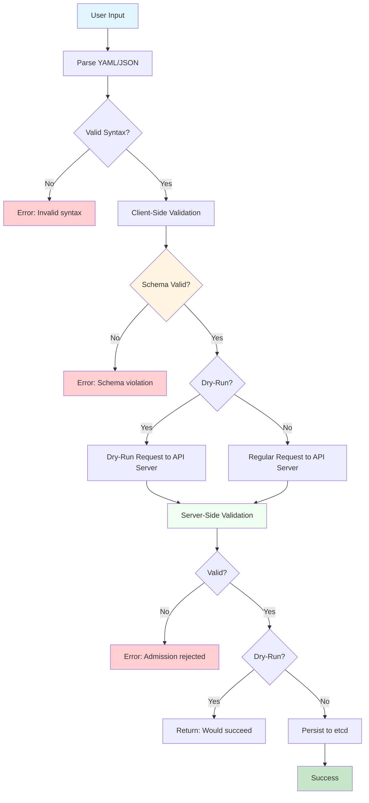
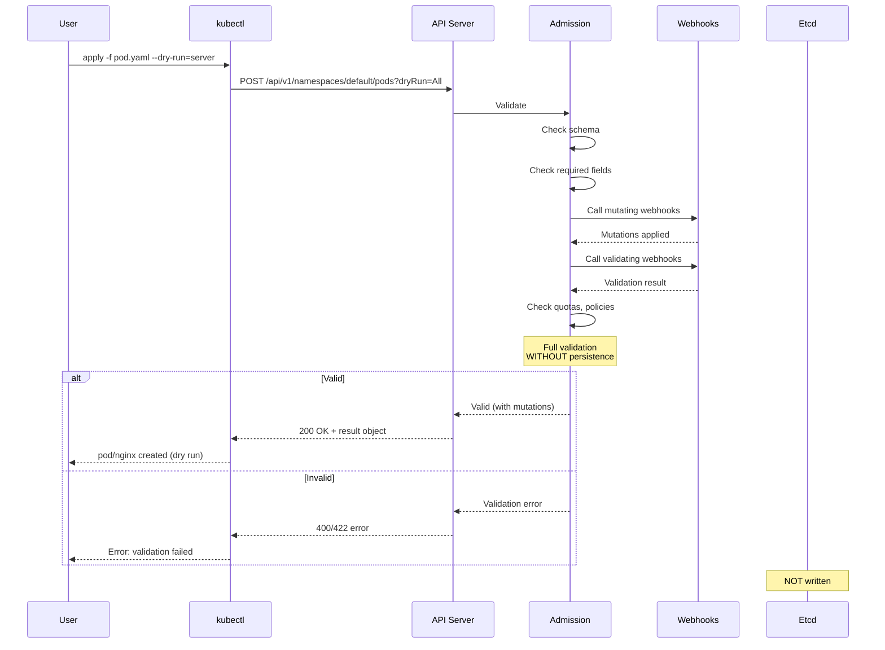
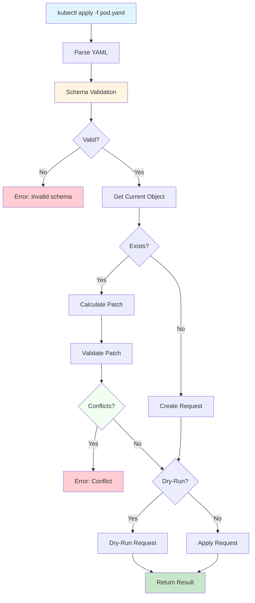
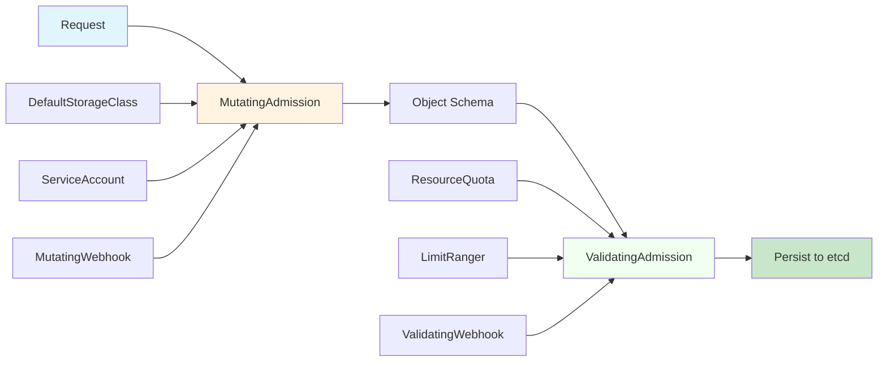

# **kubectl Validation Framework**

━━━━━━━━━━━━━━━━━━━━━━━━━━━━━━━━━━━━━━━━━━━━━━━━━━━━━━━━━━━━━━━━━━━━━━━━━━━━━━

## **📋 Overview**

kubectl performs multiple levels of validation to catch errors early and provide helpful feedback before sending requests to the API server. This includes client-side schema validation, dry-run validation, and server-side validation.

### **Key Concepts**

- **Client-Side Validation**: Schema-based validation using OpenAPI specs
- **Dry-Run Validation**: Server-side validation without persisting changes
- **Schema Validation**: Field types, required fields, enum values
- **Strict Validation**: Warn or fail on unknown fields
- **Server-Side Validation**: Final validation by API server admission controllers

### **Code Locations**

```
staging/src/k8s.io/kubectl/pkg/validation/schema.go              Schema validation
staging/src/k8s.io/kubectl/pkg/cmd/util/openapi/openapi.go       OpenAPI integration
staging/src/k8s.io/apimachinery/pkg/api/validation/             Core validation
staging/src/k8s.io/kubectl/pkg/cmd/apply/apply.go:400-450       Apply validation
```

━━━━━━━━━━━━━━━━━━━━━━━━━━━━━━━━━━━━━━━━━━━━━━━━━━━━━━━━━━━━━━━━━━━━━━━━━━━━━━

## **🔍 Validation Levels**

### **Validation Pipeline**



### **Validation Levels**

| Level | Location | When | What It Checks |
|-------|----------|------|----------------|
| **Syntax** | Client | Parse time | Valid YAML/JSON |
| **Schema** | Client | Pre-request | Field types, required fields, enums |
| **Semantic** | Client | Pre-request | Logical constraints |
| **Dry-Run** | Server | On --dry-run | Full admission without persistence |
| **Admission** | Server | Always | Webhooks, policies, quotas |

━━━━━━━━━━━━━━━━━━━━━━━━━━━━━━━━━━━━━━━━━━━━━━━━━━━━━━━━━━━━━━━━━━━━━━━━━━━━━━

## **📖 OpenAPI Schema Validation**

### **OpenAPI Schema**

kubectl uses the OpenAPI schema from the API server to validate objects:

```go
// Get OpenAPI schema from discovery
schema, err := discoveryClient.OpenAPISchema()

// Validate object against schema
validator := validation.NewSchemaValidator(schema)
errors := validator.Validate(obj)
```

### **Schema Structure**

OpenAPI v2 schema includes:

```json
{
  "definitions": {
    "io.k8s.api.core.v1.Pod": {
      "type": "object",
      "required": ["spec"],
      "properties": {
        "apiVersion": {
          "type": "string"
        },
        "kind": {
          "type": "string"
        },
        "metadata": {
          "$ref": "#/definitions/io.k8s.apimachinery.pkg.apis.meta.v1.ObjectMeta"
        },
        "spec": {
          "$ref": "#/definitions/io.k8s.api.core.v1.PodSpec"
        }
      }
    }
  }
}
```

### **Validation Rules**

**Type Checking**:
```yaml
# Valid
replicas: 3

# Invalid - wrong type
replicas: "three"  # Error: expected integer, got string
```

**Required Fields**:
```yaml
# Valid
spec:
  containers:
  - name: nginx
    image: nginx

# Invalid - missing required field
spec:
  containers:
  - image: nginx  # Error: name is required
```

**Enum Values**:
```yaml
# Valid
restartPolicy: Always

# Invalid - not in enum
restartPolicy: Sometimes  # Error: must be Always, OnFailure, or Never
```

**Pattern Matching**:
```yaml
# Valid
name: my-pod

# Invalid - doesn't match pattern
name: My_Pod!  # Error: must match ^[a-z0-9]([-a-z0-9]*[a-z0-9])?$
```

━━━━━━━━━━━━━━━━━━━━━━━━━━━━━━━━━━━━━━━━━━━━━━━━━━━━━━━━━━━━━━━━━━━━━━━━━━━━━━

## **🏃 Dry-Run Validation**

### **Dry-Run Modes**

kubectl supports two dry-run modes:

```bash
# Client-side dry-run (no request to server)
kubectl apply -f pod.yaml --dry-run=client

# Server-side dry-run (validate on server, don't persist)
kubectl apply -f pod.yaml --dry-run=server
```

### **Client vs Server Dry-Run**

| Feature | --dry-run=client | --dry-run=server |
|---------|------------------|------------------|
| **Network call** | ❌ No | ✅ Yes |
| **Schema validation** | ✅ Yes | ✅ Yes |
| **Admission webhooks** | ❌ No | ✅ Yes |
| **Defaulting** | Partial | ✅ Full |
| **Mutation webhooks** | ❌ No | ✅ Yes |
| **Resource quotas** | ❌ No | ✅ Yes |
| **Persistence** | ❌ No | ❌ No |

### **Server-Side Dry-Run Implementation**

```go
// Set dry-run parameter
request := client.Post().
    Namespace(namespace).
    Resource("pods").
    Body(pod).
    Param("dryRun", "All")  // All = full dry-run

// Execute
result := request.Do(ctx)

// Server returns what WOULD happen
var resultPod corev1.Pod
err := result.Into(&resultPod)

// resultPod includes:
// - Defaulted values
// - Generated names
// - Webhook mutations
// - But is NOT persisted
```

### **Dry-Run Flow**



━━━━━━━━━━━━━━━━━━━━━━━━━━━━━━━━━━━━━━━━━━━━━━━━━━━━━━━━━━━━━━━━━━━━━━━━━━━━━━

## **🔐 Strict Validation**

### **Validation Levels**

Kubernetes 1.25+ supports strict validation levels:

```bash
# Strict: Error on unknown fields
kubectl apply -f pod.yaml --validate=strict

# Warn: Warn on unknown fields (default)
kubectl apply -f pod.yaml --validate=warn

# Ignore: No client-side validation
kubectl apply -f pod.yaml --validate=false
```

### **Unknown Fields Handling**

**Warn Mode (Default)**:
```bash
$ kubectl apply -f pod.yaml
Warning: unknown field "spec.unknownField"
pod/nginx created
```

**Strict Mode**:
```bash
$ kubectl apply -f pod.yaml --validate=strict
Error: unknown field "spec.unknownField"
```

### **Implementation**

```go
// Validation level
type ValidationLevel string

const (
    ValidationLevelStrict ValidationLevel = "strict"
    ValidationLevelWarn   ValidationLevel = "warn"
    ValidationLevelIgnore ValidationLevel = "ignore"
)

// Apply validation
func ValidateObject(obj runtime.Object, level ValidationLevel) error {
    switch level {
    case ValidationLevelStrict:
        // Fail on unknown fields
        return strictValidate(obj)
    case ValidationLevelWarn:
        // Warn on unknown fields
        warnings := warnValidate(obj)
        for _, w := range warnings {
            klog.Warning(w)
        }
        return nil
    case ValidationLevelIgnore:
        // Skip validation
        return nil
    }
}
```

━━━━━━━━━━━━━━━━━━━━━━━━━━━━━━━━━━━━━━━━━━━━━━━━━━━━━━━━━━━━━━━━━━━━━━━━━━━━━━

## **✅ Common Validations**

### **Name Validation**

```go
// DNS-1123 subdomain
// - Lowercase alphanumeric, '-' or '.'
// - Start and end with alphanumeric
// - Max 253 characters

const DNS1123SubdomainMaxLength = 253
const dns1123SubdomainRegex = `^[a-z0-9]([-a-z0-9]*[a-z0-9])?(\.[a-z0-9]([-a-z0-9]*[a-z0-9])?)*$`
```

**Valid Names**:
```
my-pod
nginx-deployment-12345
app.example.com
```

**Invalid Names**:
```
My-Pod           # Uppercase
nginx_deployment # Underscore
-nginx           # Starts with dash
nginx-           # Ends with dash
```

### **Label Validation**

```go
// Label key: prefix/name format
// - Prefix: DNS subdomain (optional)
// - Name: alphanumeric, '-', '_', '.'
// - Max 63 characters

const LabelKeyMaxLength = 63
const LabelValueMaxLength = 63
```

**Valid Labels**:
```yaml
labels:
  app: nginx
  version: v1.2.3
  example.com/role: frontend
```

**Invalid Labels**:
```yaml
labels:
  app: nginx!          # Invalid character
  verylonglabel...: x  # Key too long (>63 chars)
```

### **Resource Quantity Validation**

```yaml
# Valid quantities
memory: 128Mi
cpu: 500m
storage: 10Gi

# Invalid quantities
memory: 128MB  # Use Mi, not MB
cpu: 0.5       # Use 500m, not decimal
```

━━━━━━━━━━━━━━━━━━━━━━━━━━━━━━━━━━━━━━━━━━━━━━━━━━━━━━━━━━━━━━━━━━━━━━━━━━━━━━

## **🎯 Apply Validation**

### **kubectl apply Validation Steps**



### **Three-Way Merge Validation**

```go
// Validate three-way merge
func ValidateApply(original, modified, current []byte) error {
    // 1. Validate modified against schema
    if err := ValidateSchema(modified); err != nil {
        return err
    }

    // 2. Check for conflicts
    patch, err := strategicpatch.CreateThreeWayMergePatch(
        original, modified, current, schema, false,
    )
    if err != nil {
        return fmt.Errorf("conflict detected: %v", err)
    }

    // 3. Validate resulting patch
    if err := ValidatePatch(patch); err != nil {
        return err
    }

    return nil
}
```

━━━━━━━━━━━━━━━━━━━━━━━━━━━━━━━━━━━━━━━━━━━━━━━━━━━━━━━━━━━━━━━━━━━━━━━━━━━━━━

## **🔄 Server-Side Validation**

### **Admission Controllers**

The API server runs multiple admission controllers:



### **Common Admission Controllers**

| Controller | Type | Purpose |
|------------|------|---------|
| **NamespaceLifecycle** | Validating | Prevent operations in terminating namespaces |
| **LimitRanger** | Validating | Enforce LimitRange constraints |
| **ServiceAccount** | Mutating | Auto-assign default ServiceAccount |
| **DefaultStorageClass** | Mutating | Set default storage class |
| **ResourceQuota** | Validating | Enforce ResourceQuota limits |
| **PodSecurity** | Validating | Enforce Pod Security Standards |
| **ValidatingWebhook** | Validating | Custom validation logic |
| **MutatingWebhook** | Mutating | Custom mutation logic |

### **Error Messages**

API server returns detailed error messages:

```json
{
  "kind": "Status",
  "status": "Failure",
  "message": "pods \"nginx\" is forbidden: exceeded quota: compute-resources, requested: cpu=2, used: cpu=8, limited: cpu=10",
  "reason": "Forbidden",
  "details": {
    "name": "nginx",
    "kind": "pods"
  },
  "code": 403
}
```

━━━━━━━━━━━━━━━━━━━━━━━━━━━━━━━━━━━━━━━━━━━━━━━━━━━━━━━━━━━━━━━━━━━━━━━━━━━━━━

## **🐛 Troubleshooting**

### **Common Validation Errors**

| Error | Cause | Solution |
|-------|-------|----------|
| **Invalid value** | Wrong field type | Check schema, fix type |
| **Required value missing** | Missing required field | Add required field |
| **Unknown field** | Field not in schema | Remove field or update schema |
| **Forbidden** | RBAC/admission denied | Check permissions, quotas |
| **Invalid name** | Name doesn't match DNS-1123 | Use lowercase, alphanumeric, dashes |
| **Conflict** | Optimistic locking failed | Retry with latest resourceVersion |

### **Debugging Validation**

```bash
# Show what would be applied (dry-run)
kubectl apply -f pod.yaml --dry-run=server -o yaml

# Validate without applying
kubectl apply -f pod.yaml --dry-run=server

# Show validation errors in detail
kubectl apply -f pod.yaml --validate=strict -v=8

# Explain field requirements
kubectl explain pod.spec.containers.resources

# Get OpenAPI schema for resource
kubectl get --raw /openapi/v2 | jq '.definitions["io.k8s.api.core.v1.Pod"]'
```

### **Bypassing Validation**

```bash
# Skip client-side validation (NOT recommended)
kubectl apply -f pod.yaml --validate=false

# Force update ignoring conflicts (dangerous)
kubectl replace -f pod.yaml --force
```

━━━━━━━━━━━━━━━━━━━━━━━━━━━━━━━━━━━━━━━━━━━━━━━━━━━━━━━━━━━━━━━━━━━━━━━━━━━━━━

## **📚 Summary**

### **Key Takeaways**

1. **Multi-Level Validation**: Client (schema) → Server (dry-run) → Server (admission)
2. **OpenAPI Schema**: Provides type information for client-side validation
3. **Dry-Run**: Test validation without persistence (--dry-run=server)
4. **Strict Mode**: Enforce unknown field detection (--validate=strict)
5. **Server-Side Admission**: Final validation with webhooks and policies
6. **Error Messages**: Detailed feedback helps debug validation issues

### **Validation Best Practices**

- ✅ Always use `--dry-run=server` before applying to production
- ✅ Enable `--validate=strict` to catch unknown fields early
- ✅ Use `kubectl explain` to understand field requirements
- ✅ Test with small changes first
- ❌ Don't skip validation with `--validate=false`
- ❌ Don't force updates without understanding conflicts

### **Code Reference Table**

| Component | File | Purpose |
|-----------|------|---------|
| Schema validation | `kubectl/pkg/validation/schema.go` | OpenAPI validation |
| OpenAPI integration | `kubectl/pkg/cmd/util/openapi/` | Schema management |
| Core validation | `apimachinery/pkg/api/validation/` | Type validation |
| Apply validation | `kubectl/pkg/cmd/apply/apply.go` | Three-way merge validation |

### **Related Documentation**

- [Discovery Client](./04-discovery-client.md) - OpenAPI schema discovery
- [Declarative Apply](../middle-level/02-declarative-apply.md) - Apply validation flow
- [Strategic Merge Patch](./02-strategic-merge-patch.md) - Patch validation

━━━━━━━━━━━━━━━━━━━━━━━━━━━━━━━━━━━━━━━━━━━━━━━━━━━━━━━━━━━━━━━━━━━━━━━━━━━━━━

*Low-Level Architecture Documentation*
*Part of kubectl Architecture Study - Phase 4*
*File 5 of 6 - kubectl Validation Framework*
