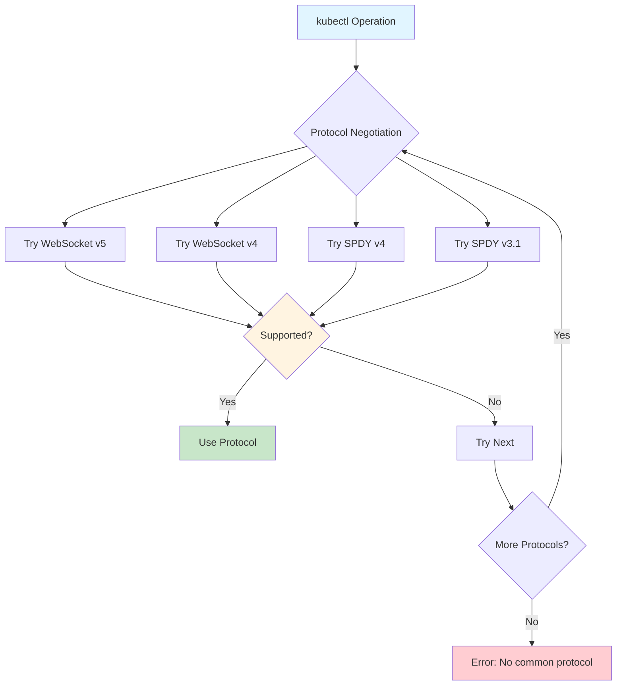
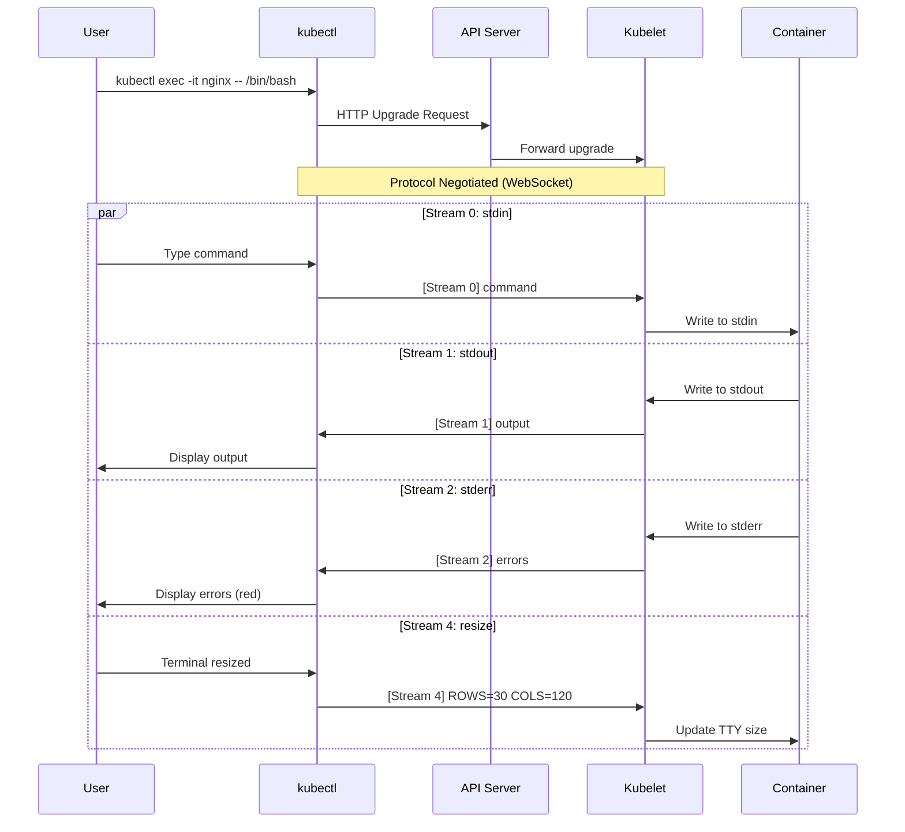
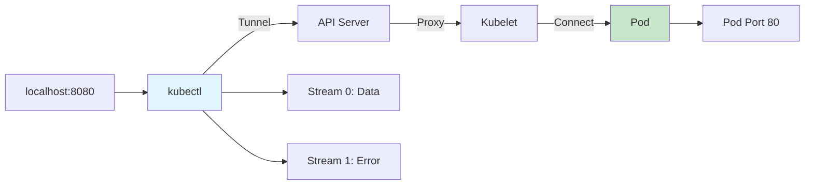

# **Streaming Protocols in kubectl**

━━━━━━━━━━━━━━━━━━━━━━━━━━━━━━━━━━━━━━━━━━━━━━━━━━━━━━━━━━━━━━━━━━━━━━━━━━━━━━

## **📋 Overview**

kubectl uses streaming protocols (SPDY and WebSocket) for interactive operations like logs, exec, attach, and port-forward. These protocols enable bidirectional communication and multiplexing multiple streams over a single connection.

### **Key Concepts**

- **SPDY**: Google's multiplexing protocol (deprecated in favor of HTTP/2)
- **WebSocket**: Standardized bidirectional protocol (RFC 6455)
- **Stream Multiplexing**: Multiple channels (stdin, stdout, stderr, resize, error)
- **Protocol Negotiation**: Client/server agree on protocol
- **Connection Upgrade**: HTTP → WebSocket/SPDY upgrade

### **Code Locations**

```
staging/src/k8s.io/client-go/tools/remotecommand/remotecommand.go    Remote execution
staging/src/k8s.io/client-go/transport/spdy/                         SPDY transport
staging/src/k8s.io/apimachinery/pkg/util/httpstream/                 HTTP streaming
staging/src/k8s.io/client-go/tools/portforward/portforward.go        Port forwarding
```

━━━━━━━━━━━━━━━━━━━━━━━━━━━━━━━━━━━━━━━━━━━━━━━━━━━━━━━━━━━━━━━━━━━━━━━━━━━━━━

## **🔌 Protocols Overview**

### **Protocol Comparison**

| Feature | SPDY | WebSocket | HTTP/2 |
|---------|------|-----------|--------|
| **Multiplexing** | ✅ Yes | ❌ No (1 stream) | ✅ Yes |
| **Bidirectional** | ✅ Yes | ✅ Yes | ✅ Yes |
| **Browser Support** | ❌ Deprecated | ✅ Yes | ✅ Yes |
| **Kubernetes Usage** | Legacy (v4) | Current | Future |
| **RFC Standard** | ❌ No | ✅ RFC 6455 | ✅ RFC 7540 |

### **Kubernetes Protocol Support**



### **Connection Upgrade**

```
# Client Request
GET /api/v1/namespaces/default/pods/nginx/exec?command=/bin/sh&stdin=true&stdout=true&tty=true
Connection: Upgrade
Upgrade: SPDY/3.1, websocket
Sec-WebSocket-Protocol: v4.channel.k8s.io, v5.channel.k8s.io

# Server Response
HTTP/1.1 101 Switching Protocols
Connection: Upgrade
Upgrade: websocket
Sec-WebSocket-Protocol: v4.channel.k8s.io
```

━━━━━━━━━━━━━━━━━━━━━━━━━━━━━━━━━━━━━━━━━━━━━━━━━━━━━━━━━━━━━━━━━━━━━━━━━━━━━━

## **📡 Stream Multiplexing**

### **Stream Types**

kubectl operations use up to 5 streams:

| Stream | Purpose | Direction | Used By |
|--------|---------|-----------|---------|
| **stdin** (0) | User input | Client → Server | exec, attach |
| **stdout** (1) | Command output | Server → Client | exec, attach, logs |
| **stderr** (2) | Error output | Server → Client | exec, attach, logs |
| **error** (3) | Protocol errors | Server → Client | All |
| **resize** (4) | Terminal resize | Client → Server | exec (with TTY) |

### **Stream Channels**



━━━━━━━━━━━━━━━━━━━━━━━━━━━━━━━━━━━━━━━━━━━━━━━━━━━━━━━━━━━━━━━━━━━━━━━━━━━━━━

## **💻 kubectl exec**

### **Execution Flow**

```go
// Create executor
executor, err := remotecommand.NewSPDYExecutor(config, "POST", url)

// Execute with streams
err = executor.Stream(remotecommand.StreamOptions{
    Stdin:  os.Stdin,
    Stdout: os.Stdout,
    Stderr: os.Stderr,
    Tty:    true,
})
```

### **Request Construction**

```go
// Build exec URL
url := client.Post().
    Namespace("default").
    Resource("pods").
    Name("nginx").
    SubResource("exec").
    VersionedParams(&corev1.PodExecOptions{
        Container: "nginx",
        Command:   []string{"/bin/bash"},
        Stdin:     true,
        Stdout:    true,
        Stderr:    true,
        TTY:       true,
    }, scheme.ParameterCodec).
    URL()

// URL: /api/v1/namespaces/default/pods/nginx/exec?
//      container=nginx&command=/bin/bash&stdin=true&stdout=true&stderr=true&tty=true
```

### **TTY vs Non-TTY**

**With TTY** (`-t` flag):
- Single stream (stdout/stderr merged)
- Interactive shell
- Terminal control codes
- Resize events

**Without TTY** (default):
- Separate stdout/stderr
- Non-interactive
- No terminal control
- No resize

### **Example: Interactive Shell**

```bash
# Interactive with TTY
kubectl exec -it nginx -- /bin/bash
# Uses: stdin=true, stdout=true, stderr=true, tty=true

# Non-interactive command
kubectl exec nginx -- ls -la
# Uses: stdin=false, stdout=true, stderr=true, tty=false

# Pipe input
echo "show databases;" | kubectl exec -i mysql -- mysql
# Uses: stdin=true, stdout=true, stderr=true, tty=false
```

━━━━━━━━━━━━━━━━━━━━━━━━━━━━━━━━━━━━━━━━━━━━━━━━━━━━━━━━━━━━━━━━━━━━━━━━━━━━━━

## **📜 kubectl logs**

### **Log Streaming**

```go
// Build logs request
req := client.Get().
    Namespace("default").
    Resource("pods").
    Name("nginx").
    SubResource("log").
    VersionedParams(&corev1.PodLogOptions{
        Container:  "nginx",
        Follow:     true,
        Timestamps: true,
        TailLines:  ptr.To(int64(100)),
    }, scheme.ParameterCodec)

// Stream logs
stream, err := req.Stream(ctx)
defer stream.Close()

// Read log lines
scanner := bufio.NewScanner(stream)
for scanner.Scan() {
    fmt.Println(scanner.Text())
}
```

### **Log Options**

| Option | Flag | Purpose |
|--------|------|---------|
| `Follow` | `-f` | Stream new logs in real-time |
| `Previous` | `-p` | Show logs from previous container |
| `Timestamps` | `--timestamps` | Include timestamps |
| `TailLines` | `--tail=N` | Show last N lines |
| `SinceSeconds` | `--since=5m` | Show logs since duration |
| `SinceTime` | `--since-time=2024-01-01T00:00:00Z` | Show logs since timestamp |
| `LimitBytes` | `--limit-bytes=1000` | Limit output bytes |

### **Multi-Container Logs**

```bash
# All containers
kubectl logs nginx --all-containers=true

# Specific container
kubectl logs nginx -c sidecar

# Previous container instance
kubectl logs nginx -p
```

━━━━━━━━━━━━━━━━━━━━━━━━━━━━━━━━━━━━━━━━━━━━━━━━━━━━━━━━━━━━━━━━━━━━━━━━━━━━━━

## **🔗 kubectl port-forward**

### **Port Forwarding Architecture**



### **Port Forward Implementation**

```go
// Create port forwarder
pf, err := portforward.New(
    dialer,
    []string{"8080:80", "8443:443"},
    stopChan,
    readyChan,
    os.Stdout,
    os.Stderr,
)

// Start forwarding
err = pf.ForwardPorts()
```

### **Request Flow**

```
1. kubectl → API Server: POST /api/v1/namespaces/default/pods/nginx/portforward
2. API Server → Kubelet: Forward request
3. Kubelet → Pod: TCP connection to port 80
4. Bi-directional streams created:
   - Stream 0 (data): Client ↔ Pod
   - Stream 1 (error): Errors from server
5. Traffic flows through streams until connection closed
```

### **Multiple Ports**

```bash
# Forward multiple ports
kubectl port-forward nginx 8080:80 8443:443

# Random local port
kubectl port-forward nginx :80
# Assigns random local port

# Different namespace
kubectl port-forward -n production nginx 8080:80
```

━━━━━━━━━━━━━━━━━━━━━━━━━━━━━━━━━━━━━━━━━━━━━━━━━━━━━━━━━━━━━━━━━━━━━━━━━━━━━━

## **🔄 Protocol Details**

### **SPDY Protocol**

**SPDY Frames**:
```
+----------------------------------+
|   Stream ID (31 bits) | Flags   |
+----------------------------------+
|   Length (24 bits)              |
+----------------------------------+
|   Data                          |
+----------------------------------+
```

**SPDY Stream Creation**:
```go
// Create new stream
stream, err := connection.CreateStream(http.Header{
    "streamType": []string{"stdin"},
})

// Write to stream
stream.Write([]byte("command\n"))

// Read from stream
buf := make([]byte, 1024)
n, err := stream.Read(buf)
```

### **WebSocket Protocol**

**WebSocket Frames**:
```
  0                   1                   2                   3
  0 1 2 3 4 5 6 7 8 9 0 1 2 3 4 5 6 7 8 9 0 1 2 3 4 5 6 7 8 9 0 1
 +-+-+-+-+-------+-+-------------+-------------------------------+
 |F|R|R|R| opcode|M| Payload len |    Extended payload length    |
 |I|S|S|S|  (4)  |A|     (7)     |             (16/64)           |
 |N|V|V|V|       |S|             |   (if payload len==126/127)   |
 | |1|2|3|       |K|             |                               |
 +-+-+-+-+-------+-+-------------+ - - - - - - - - - - - - - - - +
```

**WebSocket Subprotocols**:
- `v4.channel.k8s.io`: Version 4 (current)
- `v5.channel.k8s.io`: Version 5 (newer)
- `base64.channel.k8s.io`: Base64-encoded (legacy)

### **Channel Encoding**

```
# v4 protocol: Binary frames with channel prefix
Frame: [channel_byte][data]

Example:
0x00 stdin data   # Channel 0 (stdin)
0x01 stdout data  # Channel 1 (stdout)
0x02 stderr data  # Channel 2 (stderr)
0x03 error data   # Channel 3 (error)
0x04 resize data  # Channel 4 (resize)
```

━━━━━━━━━━━━━━━━━━━━━━━━━━━━━━━━━━━━━━━━━━━━━━━━━━━━━━━━━━━━━━━━━━━━━━━━━━━━━━

## **⚡ Performance Considerations**

### **Connection Pooling**

- kubectl reuses HTTP connections
- SPDY/WebSocket connections are short-lived
- Each exec/logs/port-forward creates new connection

### **Buffering**

```go
// Buffer sizes
const (
    MaxMessageSize = 1024 * 1024  // 1MB per message
    ReadBufferSize = 4096          // 4KB read buffer
    WriteBufferSize = 4096         // 4KB write buffer
)
```

### **Latency**

| Operation | Typical Latency | Notes |
|-----------|----------------|-------|
| Connection establishment | 50-200ms | Protocol negotiation |
| stdin → stdout | 10-50ms | Round-trip time |
| Log line | 1-10ms | Streaming |
| Port forward data | <5ms | Once established |

━━━━━━━━━━━━━━━━━━━━━━━━━━━━━━━━━━━━━━━━━━━━━━━━━━━━━━━━━━━━━━━━━━━━━━━━━━━━━━

## **🐛 Troubleshooting**

### **Common Issues**

| Issue | Cause | Solution |
|-------|-------|----------|
| **Unable to upgrade connection** | Load balancer doesn't support upgrades | Use direct pod IP or fix LB |
| **Connection timeout** | Network firewall | Allow WebSocket/SPDY traffic |
| **Broken pipe** | Connection closed unexpectedly | Check network stability |
| **TTY size issues** | Terminal not properly initialized | Use `-t` flag correctly |

### **Debug Commands**

```bash
# Verbose output
kubectl exec -v=8 nginx -- ls

# Test connectivity
kubectl exec nginx -- sh -c 'echo test'

# Check protocol
kubectl exec nginx -- env | grep TERM

# Port forward with debugging
kubectl port-forward -v=8 nginx 8080:80
```

━━━━━━━━━━━━━━━━━━━━━━━━━━━━━━━━━━━━━━━━━━━━━━━━━━━━━━━━━━━━━━━━━━━━━━━━━━━━━━

## **📚 Summary**

### **Key Takeaways**

1. **WebSocket** is replacing SPDY as the primary streaming protocol
2. **Stream Multiplexing** allows multiple channels over one connection
3. **Protocol Negotiation** ensures compatibility between client and server
4. **Five Streams**: stdin, stdout, stderr, error, resize
5. **TTY Mode** merges stdout/stderr for interactive shells
6. **Port Forwarding** creates tunnels through the API server to pods

### **Operations Using Streaming**

- `kubectl exec`: Remote command execution
- `kubectl logs -f`: Log streaming
- `kubectl attach`: Attach to running container
- `kubectl port-forward`: Port tunneling
- `kubectl cp`: File transfer (uses tar over exec)

### **Code Reference Table**

| Component | File |
|-----------|------|
| Remote command | `client-go/tools/remotecommand/remotecommand.go` |
| SPDY transport | `client-go/transport/spdy/` |
| HTTP streaming | `apimachinery/pkg/util/httpstream/` |
| Port forward | `client-go/tools/portforward/portforward.go` |

### **Related Documentation**

- [Logs, Exec, Port-Forward](../middle-level/05-logs-exec-port-forward.md) - High-level operations
- [REST Client](./03-rest-client.md) - HTTP client foundation

━━━━━━━━━━━━━━━━━━━━━━━━━━━━━━━━━━━━━━━━━━━━━━━━━━━━━━━━━━━━━━━━━━━━━━━━━━━━━━

*Low-Level Architecture Documentation*
*Part of kubectl Architecture Study - Phase 4*
*File 6 of 6 - Streaming Protocols*
