# kubectl Imperative Commands

**Document Version**: 1.0
**Last Updated**: 2025-11-05
**Status**: Middle-Level Architecture Documentation

━━━━━━━━━━━━━━━━━━━━━━━━━━━━━━━━━━━━━━━━━━━━━━━━━━━━━━━━━━━━━━━━━━━━━━━━━━━━━

## Table of Contents

- [Overview](#overview)
- [Data Structures](#data-structures)
- [Core Components](#core-components)
- [Imperative Command Types](#imperative-command-types)
- [Component Interactions](#component-interactions)
- [Command Execution Patterns](#command-execution-patterns)
- [Synchronization Patterns](#synchronization-patterns)
- [Aspect-Oriented Concerns](#aspect-oriented-concerns)
- [Command Examples](#command-examples)
- [Best Practices](#best-practices)
- [Troubleshooting](#troubleshooting)
- [Summary](#summary)

━━━━━━━━━━━━━━━━━━━━━━━━━━━━━━━━━━━━━━━━━━━━━━━━━━━━━━━━━━━━━━━━━━━━━━━━━━━━━

## **📋 Overview**

Imperative commands in kubectl allow users to directly create, modify, and delete Kubernetes resources by issuing explicit commands. Unlike declarative commands (kubectl apply) that maintain desired state, imperative commands perform immediate, one-time operations against the API server.

### Imperative vs Declarative

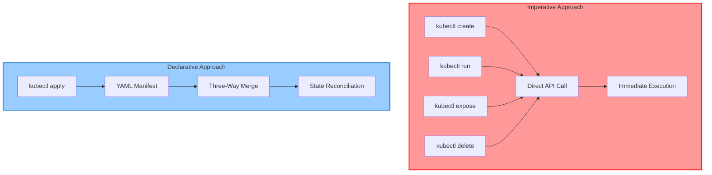

**Key Characteristics**:
- **Direct Execution**: Commands execute immediately against API server
- **No State Tracking**: No last-applied-configuration annotation
- **Explicit Operations**: User specifies exact action to perform
- **No Merge Logic**: No three-way merge calculations
- **Synchronous**: Wait for server response before returning
- **Single-Shot**: One-time operations, not idempotent

**Code Reference**: Command registration at `staging/src/k8s.io/kubectl/pkg/cmd/cmd.go:306-349`

━━━━━━━━━━━━━━━━━━━━━━━━━━━━━━━━━━━━━━━━━━━━━━━━━━━━━━━━━━━━━━━━━━━━━━━━━━━━━

## **🔧 Data Structures**

### cobra.Command Structure

All kubectl commands are built using the Cobra framework. The `cobra.Command` struct provides the foundation for command-line parsing and execution.

```go
// From github.com/spf13/cobra
type Command struct {
    // Command identification
    Use   string    // Usage pattern (e.g., "create -f FILENAME")
    Short string    // Brief description
    Long  string    // Detailed description
    Example string  // Usage examples

    // Aliases and suggestions
    Aliases      []string
    SuggestFor   []string

    // Execution
    Run   func(*Command, []string)           // Basic run function
    RunE  func(*Command, []string) error     // Run with error return

    // Lifecycle hooks (executed in this order)
    PersistentPreRunE  func(*Command, []string) error  // Inherited by children
    PreRunE            func(*Command, []string) error  // Before Run
    RunE               func(*Command, []string) error  // Main execution
    PostRunE           func(*Command, []string) error  // After Run
    PersistentPostRunE func(*Command, []string) error // Inherited cleanup

    // Flags
    Flags           *pflag.FlagSet  // Command-specific flags
    PersistentFlags *pflag.FlagSet  // Inherited by children

    // Hierarchy
    Commands []*Command  // Subcommands
    Parent   *Command    // Parent command

    // Behavior
    DisableFlagsInUseLine bool
    DisableFlagParsing    bool
    SilenceErrors         bool
    SilenceUsage          bool
}
```

**Code Reference**: External dependency `github.com/spf13/cobra`

### Factory Interface

The Factory provides utilities and clients needed by all commands. It abstracts away the complexity of creating Kubernetes clients and provides common functionality.

```go
// From staging/src/k8s.io/kubectl/pkg/cmd/util/factory.go:41-72
type Factory interface {
    genericclioptions.RESTClientGetter

    // Client creation
    DynamicClient() (dynamic.Interface, error)
    KubernetesClientSet() (*kubernetes.Clientset, error)
    RESTClient() (*restclient.RESTClient, error)

    // Resource management
    NewBuilder() *resource.Builder
    ClientForMapping(mapping *meta.RESTMapping) (resource.RESTClient, error)
    UnstructuredClientForMapping(mapping *meta.RESTMapping) (resource.RESTClient, error)

    // Validation
    Validator(validationDirective string) (validation.Schema, error)

    // OpenAPI
    openapi.OpenAPIResourcesGetter
    OpenAPIV3Client() (openapiclient.Client, error)
}
```

**Factory Benefits**:
- **Abstraction**: Commands don't need to know how to create clients
- **Testability**: Factory can be mocked for unit tests
- **Configuration**: Manages kubeconfig loading and context
- **Resource Building**: Provides the Builder pattern for resource queries
- **Validation**: Offers schema-based validation capabilities

**Code Reference**: Factory interface at `staging/src/k8s.io/kubectl/pkg/cmd/util/factory.go:41-72`

### CreateOptions Structure

Options for `kubectl create` command, which creates resources from files or stdin.

```go
// From staging/src/k8s.io/kubectl/pkg/cmd/create/create.go:50-70
type CreateOptions struct {
    // Printing
    PrintFlags  *genericclioptions.PrintFlags
    RecordFlags *genericclioptions.RecordFlags

    // Execution control
    DryRunStrategy     cmdutil.DryRunStrategy
    ValidationDirective string
    fieldManager       string

    // Input sources
    FilenameOptions  resource.FilenameOptions
    Selector         string
    EditBeforeCreate bool
    Raw              string  // Raw HTTP endpoint

    // Output
    Recorder genericclioptions.Recorder
    PrintObj func(obj runtime.Object) error

    // I/O
    genericiooptions.IOStreams
}
```

**Key Fields**:
- **DryRunStrategy**: Client-side or server-side dry-run
- **ValidationDirective**: Strict, warn, or ignore validation
- **fieldManager**: Name for field management (server-side apply)
- **FilenameOptions**: Files, directories, or URLs to process
- **EditBeforeCreate**: Launch editor before creating resource

**Code Reference**: CreateOptions struct at `staging/src/k8s.io/kubectl/pkg/cmd/create/create.go:50-70`

### RunOptions Structure

Options for `kubectl run` command, which creates and runs a pod with specified image.

```go
// From staging/src/k8s.io/kubectl/pkg/cmd/run/run.go:103-133
type RunOptions struct {
    cmdutil.OverrideOptions

    // Printing and recording
    PrintFlags  *genericclioptions.PrintFlags
    RecordFlags *genericclioptions.RecordFlags
    DeleteFlags *cmddelete.DeleteFlags
    DeleteOptions *cmddelete.DeleteOptions

    // Execution control
    DryRunStrategy cmdutil.DryRunStrategy
    PrintObj       func(runtime.Object) error
    Recorder       genericclioptions.Recorder

    // Run-specific options
    ArgsLenAtDash  int
    Attach         bool     // Attach to pod after creation
    Expose         bool     // Create service for pod
    Image          string   // Container image
    Interactive    bool     // Keep stdin open
    LeaveStdinOpen bool     // Leave stdin open after first attach
    Port           string   // Port to expose
    Privileged     bool     // Run in privileged mode
    Quiet          bool     // Suppress output
    TTY            bool     // Allocate TTY
    fieldManager   string

    // Namespace
    Namespace        string
    EnforceNamespace bool

    // I/O
    genericiooptions.IOStreams
}
```

**Special Features**:
- **Attach**: Can attach to pod after creation (like `docker run -it`)
- **Expose**: Automatically creates a Service for the pod
- **Interactive/TTY**: Supports interactive container sessions
- **Generator Pattern**: Uses generators to create pod spec (deprecated pattern)

**Code Reference**: RunOptions struct at `staging/src/k8s.io/kubectl/pkg/cmd/run/run.go:103-133`

### ExposeServiceOptions Structure

Options for `kubectl expose` command, which creates a Service for existing resources.

```go
// From staging/src/k8s.io/kubectl/pkg/cmd/expose/expose.go:89-135
type ExposeServiceOptions struct {
    cmdutil.OverrideOptions

    // Input
    FilenameOptions resource.FilenameOptions
    RecordFlags     *genericclioptions.RecordFlags
    PrintFlags      *genericclioptions.PrintFlags
    PrintObj        printers.ResourcePrinterFunc

    // Service specification
    Name            string  // Service name
    DefaultName     string  // Default if not specified
    Selector        string  // Pod selector
    Port            string  // Service port
    Ports           string  // Multiple ports
    Labels          string  // Service labels
    ExternalIP      string  // External IP
    LoadBalancerIP  string  // LoadBalancer IP
    Type            string  // Service type (ClusterIP, NodePort, LoadBalancer)
    Protocol        string  // Protocol (TCP, UDP)
    Protocols       string  // Multiple protocols
    TargetPort      string  // Container port
    PortName        string  // Port name
    SessionAffinity string  // Session affinity
    ClusterIP       string  // Cluster IP

    // Execution
    DryRunStrategy   cmdutil.DryRunStrategy
    EnforceNamespace bool
    fieldManager     string

    // Helper functions
    CanBeExposed              polymorphichelpers.CanBeExposedFunc
    MapBasedSelectorForObject func(runtime.Object) (string, error)
    PortsForObject            polymorphichelpers.PortsForObjectFunc
    ProtocolsForObject        polymorphichelpers.MultiProtocolsWithForObjectFunc

    // Resource management
    Namespace        string
    Mapper           meta.RESTMapper
    Builder          *resource.Builder
    ClientForMapping func(mapping *meta.RESTMapping) (resource.RESTClient, error)

    // Recording
    Recorder genericclioptions.Recorder
    genericiooptions.IOStreams
}
```

**Complex Logic**:
- **Resource Inspection**: Reads existing resource to extract selectors and ports
- **Service Generation**: Creates Service based on exposed resource's characteristics
- **Port Mapping**: Maps container ports to service ports
- **Type Selection**: Supports ClusterIP, NodePort, LoadBalancer, ExternalName

**Code Reference**: ExposeServiceOptions at `staging/src/k8s.io/kubectl/pkg/cmd/expose/expose.go:89-135`

### DeleteOptions Structure

Options for `kubectl delete` command, which deletes resources by name, file, or label selector.

```go
// From staging/src/k8s.io/kubectl/pkg/cmd/delete/delete.go:112-144
type DeleteOptions struct {
    resource.FilenameOptions

    // Selection
    LabelSelector       string
    FieldSelector       string
    DeleteAll           bool  // Delete all resources of type
    DeleteAllNamespaces bool  // Delete across all namespaces

    // Deletion behavior
    CascadingStrategy metav1.DeletionPropagation  // Orphan, Background, Foreground
    IgnoreNotFound    bool
    DeleteNow         bool  // Set grace period to 1
    ForceDeletion     bool  // Force delete (skip graceful deletion)
    WaitForDeletion   bool  // Wait until resources are deleted
    Quiet             bool
    WarnClusterScope  bool
    Raw               string
    Interactive       bool  // Prompt before deletion

    // Grace period
    GracePeriod int           // Seconds before force delete
    Timeout     time.Duration // Wait timeout

    // Execution
    DryRunStrategy cmdutil.DryRunStrategy
    Output         string

    // Clients
    DynamicClient      dynamic.Interface
    Mapper             meta.RESTMapper
    Result             *resource.Result
    PreviewResult      *resource.Result
    previewResourceMap map[cmdwait.ResourceLocation]struct{}

    // I/O
    genericiooptions.IOStreams
    WarningPrinter *printers.WarningPrinter
}
```

**Deletion Strategies**:
- **Orphan**: Delete object but leave dependents
- **Background**: Delete object and dependents asynchronously
- **Foreground**: Delete dependents first, then object
- **Force**: Skip graceful deletion (dangerous for stateful apps)

**Code Reference**: DeleteOptions at `staging/src/k8s.io/kubectl/pkg/cmd/delete/delete.go:112-144`

━━━━━━━━━━━━━━━━━━━━━━━━━━━━━━━━━━━━━━━━━━━━━━━━━━━━━━━━━━━━━━━━━━━━━━━━━━━━━

## **⚙️ Core Components**

### Command Registration

All imperative commands are registered in the root kubectl command during initialization.

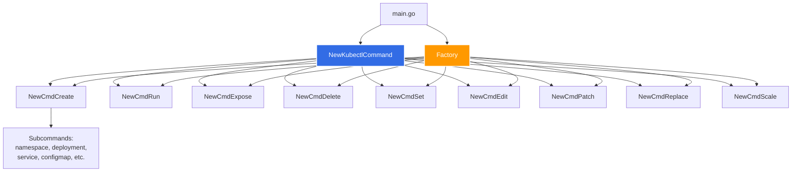

**Registration Pattern**:
```go
// From staging/src/k8s.io/kubectl/pkg/cmd/cmd.go:306-400
func NewKubectlCommand(o KubectlOptions) *cobra.Command {
    cmds := &cobra.Command{
        Use:   "kubectl",
        Short: "kubectl controls the Kubernetes cluster manager",
        // ... setup ...
    }

    // Register imperative commands
    groups.Imperative.Commands = append(groups.Imperative.Commands,
        create.NewCmdCreate(f, ioStreams),
        run.NewCmdRun(f, ioStreams),
        expose.NewCmdExposeService(f, ioStreams),
        delete.NewCmdDelete(f, ioStreams),
        // ... more commands ...
    )

    return cmds
}
```

**Code Reference**: Root command at `staging/src/k8s.io/kubectl/pkg/cmd/cmd.go:306-400`

### Factory Pattern

The Factory abstracts client creation and provides common utilities to all commands.

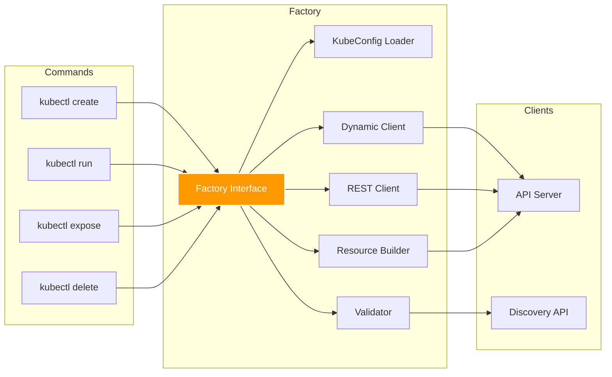

**Factory Usage in Commands**:
```go
// Command receives factory
func NewCmdCreate(f cmdutil.Factory, ioStreams genericiooptions.IOStreams) *cobra.Command {
    // Create command
    cmd := &cobra.Command{
        Run: func(cmd *cobra.Command, args []string) {
            // Use factory for operations
            o.Complete(f, cmd, args)
            o.RunCreate(f, cmd)
        },
    }
    return cmd
}

// Using factory to get clients
func (o *CreateOptions) RunCreate(f cmdutil.Factory, cmd *cobra.Command) error {
    // Get namespace from kubeconfig
    namespace, enforceNamespace, err := f.ToRawKubeConfigLoader().Namespace()

    // Create resource builder
    r := f.NewBuilder().
        Unstructured().
        Schema(schema).
        NamespaceParam(namespace).
        FilenameParam(enforceNamespace, &o.FilenameOptions).
        Do()

    // Visit each resource
    r.Visit(func(info *resource.Info, err error) error {
        // Create resource using REST client
        obj, err := resource.
            NewHelper(info.Client, info.Mapping).
            Create(info.Namespace, true, info.Object)
        return err
    })
}
```

**Code Reference**: Factory usage in create at `staging/src/k8s.io/kubectl/pkg/cmd/create/create.go:225-301`

### REST Client Creation

The Factory creates REST clients configured with authentication and API server endpoint.

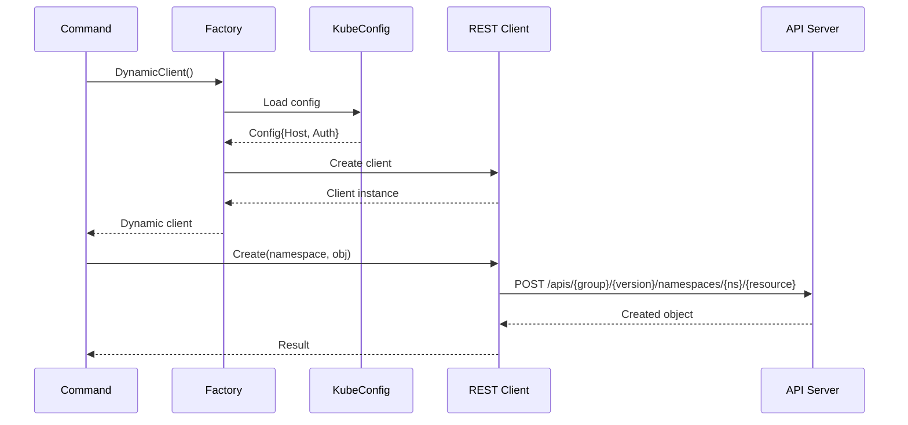

**Client Types**:

| Client Type | Purpose | Use Case |
|-------------|---------|----------|
| **RESTClient** | Low-level HTTP client | Direct API calls |
| **DynamicClient** | Works with unstructured data | Generic resource operations |
| **TypedClient** | Strongly typed (Clientset) | Type-safe operations |
| **DiscoveryClient** | API discovery | Find resources, versions |

**Code Reference**: REST client at `staging/src/k8s.io/client-go/rest/client.go`

### Resource Builders

Resource builders provide a fluent API for constructing queries to find and load resources.

```go
// From staging/src/k8s.io/kubectl/pkg/cmd/create/create.go:250-258
r := f.NewBuilder().
    Unstructured().                    // Use unstructured objects
    Schema(schema).                    // Apply schema validation
    ContinueOnError().                 // Don't stop on first error
    NamespaceParam(cmdNamespace).      // Set namespace
    DefaultNamespace().                // Use default if not specified
    FilenameParam(enforceNamespace, &o.FilenameOptions).  // Load from files
    LabelSelectorParam(o.Selector).   // Filter by labels
    Flatten().                         // Flatten nested lists
    Do()                               // Execute query
```

**Builder Chain Benefits**:
- **Readable**: Clear intent of what's being selected
- **Composable**: Combine multiple selection criteria
- **Lazy**: Query not executed until `.Do()` called
- **Flexible**: Same pattern for files, names, labels, etc.

**Code Reference**: Builder usage at `staging/src/k8s.io/kubectl/pkg/cmd/create/create.go:250-258`

### Resource Visitor Pattern

Once resources are loaded, the Visitor pattern processes each resource.

```go
// From staging/src/k8s.io/kubectl/pkg/cmd/create/create.go:265-293
err = r.Visit(func(info *resource.Info, err error) error {
    if err != nil {
        return err
    }

    // Add annotations
    if err := util.CreateOrUpdateAnnotation(/* ... */, info.Object, /* ... */); err != nil {
        return err
    }

    // Record command
    if err := o.Recorder.Record(info.Object); err != nil {
        klog.V(4).Infof("error recording: %v", err)
    }

    // Create resource via API
    if o.DryRunStrategy != cmdutil.DryRunClient {
        obj, err := resource.
            NewHelper(info.Client, info.Mapping).
            DryRun(o.DryRunStrategy == cmdutil.DryRunServer).
            WithFieldManager(o.fieldManager).
            WithFieldValidation(o.ValidationDirective).
            Create(info.Namespace, true, info.Object)
        if err != nil {
            return err
        }
        info.Refresh(obj, true)
    }

    // Print created resource
    return o.PrintObj(info.Object)
})
```

**resource.Info Structure**:
```go
type Info struct {
    Client       RESTClient      // Client for this resource
    Mapping      *RESTMapping    // GVK to REST endpoint mapping
    Namespace    string          // Resource namespace
    Name         string          // Resource name
    Source       string          // Where resource came from (file, etc.)
    Object       runtime.Object  // The actual resource object
    ResourceVersion string       // Resource version
}
```

**Code Reference**: Visitor usage at `staging/src/k8s.io/kubectl/pkg/cmd/create/create.go:265-293`

━━━━━━━━━━━━━━━━━━━━━━━━━━━━━━━━━━━━━━━━━━━━━━━━━━━━━━━━━━━━━━━━━━━━━━━━━━━━━

## **💻 Imperative Command Types**

### kubectl create

Creates resources from files, directories, or stdin. The base command supports YAML/JSON files, while subcommands provide specialized creation.

```bash
# Create from file
kubectl create -f deployment.yaml

# Create from multiple files
kubectl create -f deployment.yaml -f service.yaml

# Create from directory
kubectl create -f ./configs/

# Create from URL
kubectl create -f https://example.com/deployment.yaml

# Create from stdin
cat deployment.yaml | kubectl create -f -

# Edit before create
kubectl create -f deployment.yaml --edit

# Dry run (client-side)
kubectl create -f deployment.yaml --dry-run=client -o yaml

# Dry run (server-side, validates against API)
kubectl create -f deployment.yaml --dry-run=server
```

**Subcommands**:
```bash
# Create specific resource types
kubectl create namespace dev
kubectl create deployment nginx --image=nginx:1.21
kubectl create service clusterip nginx --tcp=80:80
kubectl create configmap app-config --from-file=config.properties
kubectl create secret generic db-secret --from-literal=password=secret123
kubectl create serviceaccount app-sa
kubectl create role pod-reader --verb=get --verb=list --resource=pods
kubectl create rolebinding pod-reader-binding --role=pod-reader --user=john
kubectl create clusterrole cluster-admin --verb=* --resource=*
kubectl create clusterrolebinding admin-binding --clusterrole=cluster-admin --user=admin
kubectl create job backup --image=backup:v1 -- ./backup.sh
kubectl create cronjob backup --image=backup:v1 --schedule="0 2 * * *" -- ./backup.sh
```

**Command Flow**:
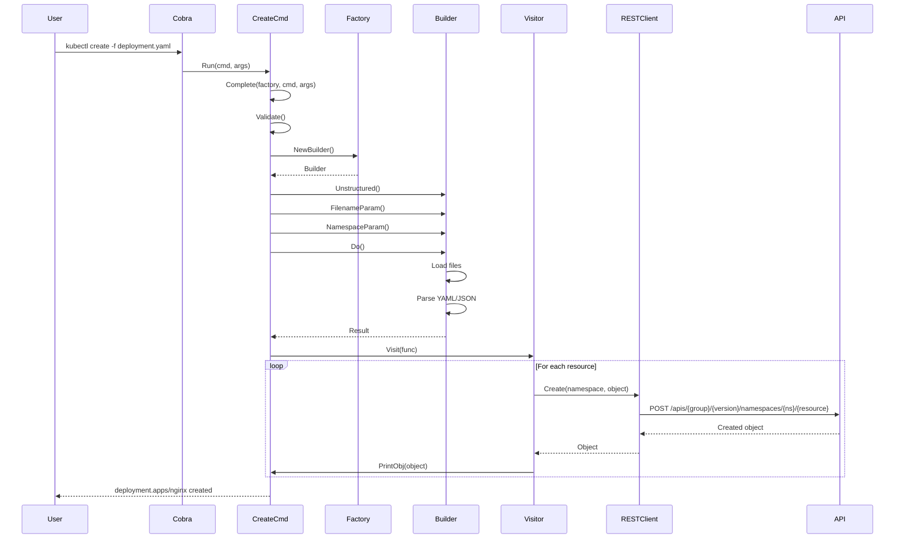

**Code Reference**: NewCmdCreate at `staging/src/k8s.io/kubectl/pkg/cmd/create/create.go:102-154`

### kubectl run

Creates and runs a pod with specified container image. Optionally attaches to the pod or creates a service.

```bash
# Basic run
kubectl run nginx --image=nginx:1.21

# With port
kubectl run nginx --image=nginx:1.21 --port=80

# With environment variables
kubectl run nginx --image=nginx:1.21 --env="ENV=prod" --env="DEBUG=true"

# With labels
kubectl run nginx --image=nginx:1.21 --labels="app=nginx,tier=frontend"

# Interactive (attaches stdin)
kubectl run -it busybox --image=busybox --restart=Never -- sh

# With TTY
kubectl run -it ubuntu --image=ubuntu:20.04 --restart=Never -- /bin/bash

# Run and expose
kubectl run nginx --image=nginx:1.21 --port=80 --expose

# With custom command
kubectl run nginx --image=nginx:1.21 -- nginx -g "daemon off;"

# Dry run to generate YAML
kubectl run nginx --image=nginx:1.21 --dry-run=client -o yaml > pod.yaml

# Run and delete when done
kubectl run -it --rm busybox --image=busybox --restart=Never -- echo "Hello"
```

**Run with Attach Flow**:
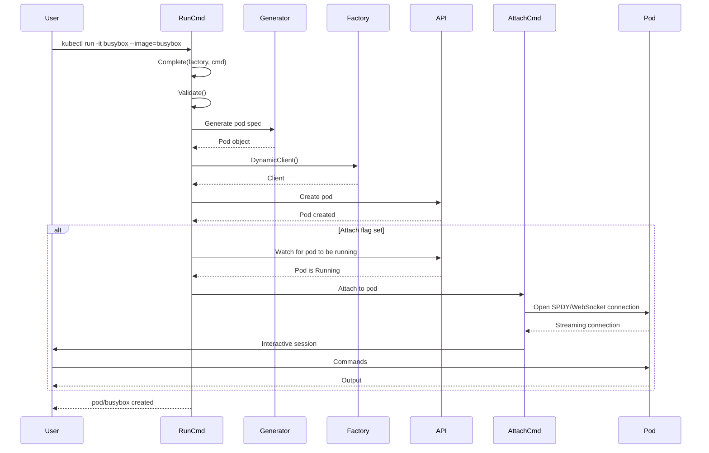

**Code Reference**: NewCmdRun at `staging/src/k8s.io/kubectl/pkg/cmd/run/run.go:147-171`

**Generator Pattern (Deprecated)**:

The `kubectl run` command historically used a generator pattern to create pod specifications:

```go
// From staging/src/k8s.io/kubectl/pkg/cmd/run/run.go:293-314
generators := generateversioned.GeneratorFn("run")
generator, found := generators[generateversioned.RunPodV1GeneratorName]

names := generator.ParamNames()
params := generate.MakeParams(cmd, names)
params["name"] = args[0]
params["image"] = o.Image
// ... more params ...

// Generate the pod object
runObject, err := o.createGeneratedObject(f, cmd, generator, names, params, overrider)
```

### kubectl expose

Creates a Service for an existing resource (Pod, Deployment, ReplicaSet, etc.).

```bash
# Expose a deployment
kubectl expose deployment nginx --port=80 --target-port=8080

# Expose with NodePort
kubectl expose deployment nginx --type=NodePort --port=80

# Expose with LoadBalancer
kubectl expose deployment nginx --type=LoadBalancer --port=80

# Expose from file
kubectl expose -f deployment.yaml --port=80

# Expose with custom name
kubectl expose deployment nginx --name=web-service --port=80

# UDP service
kubectl expose deployment dns --port=53 --protocol=UDP

# Dry run
kubectl expose deployment nginx --port=80 --dry-run=client -o yaml
```

**Expose Flow**:
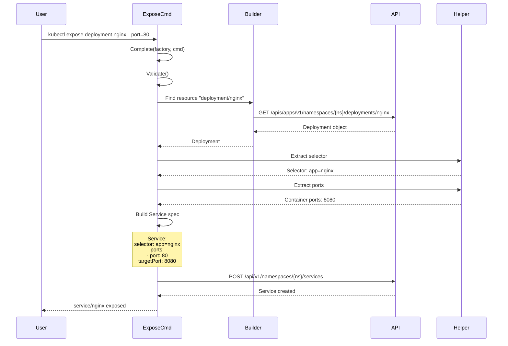

**Code Reference**: NewCmdExposeService at `staging/src/k8s.io/kubectl/pkg/cmd/expose/expose.go:98-400`

### kubectl delete

Deletes resources by file, name, label selector, or all resources of a type.

```bash
# Delete by name
kubectl delete pod nginx
kubectl delete deployment nginx

# Delete by file
kubectl delete -f deployment.yaml

# Delete by label
kubectl delete pods -l app=nginx
kubectl delete all -l env=test

# Delete all resources of type
kubectl delete pods --all

# Force delete
kubectl delete pod nginx --force --grace-period=0

# Cascading delete strategies
kubectl delete deployment nginx --cascade=background   # Default
kubectl delete deployment nginx --cascade=foreground   # Delete dependents first
kubectl delete deployment nginx --cascade=orphan       # Leave dependents
```

**Cascading Deletion Strategies**:

```mermaid
graph TB
    subgraph Background["Background Deletion"]
        B1[Delete parent immediately]
        B2[Mark dependents for deletion]
        B3[Garbage collector deletes dependents async]
        B1 --> B2
        B2 --> B3
    end

    subgraph Foreground["Foreground Deletion"]
        F1[Mark parent as deleting]
        F2[Delete all dependents first]
        F3[Delete parent when dependents gone]
        F1 --> F2
        F2 --> F3
    end

    subgraph Orphan["Orphan Deletion"]
        O1[Remove owner references from dependents]
        O2[Delete parent]
        O3[Dependents remain]
        O1 --> O2
        O2 --> O3
    end

    style Background fill:#99ccff,stroke:#0066cc
    style Foreground fill:#ffcc99,stroke:#ff6600
    style Orphan fill:#cc99ff,stroke:#6600cc
```

**Code Reference**: NewCmdDelete at `staging/src/k8s.io/kubectl/pkg/cmd/delete/delete.go:146-250`

━━━━━━━━━━━━━━━━━━━━━━━━━━━━━━━━━━━━━━━━━━━━━━━━━━━━━━━━━━━━━━━━━━━━━━━━━━━━━

## **🔄 Component Interactions**

### Complete-Validate-Run Pattern

All imperative commands follow the Complete-Validate-Run pattern, a three-phase execution model:

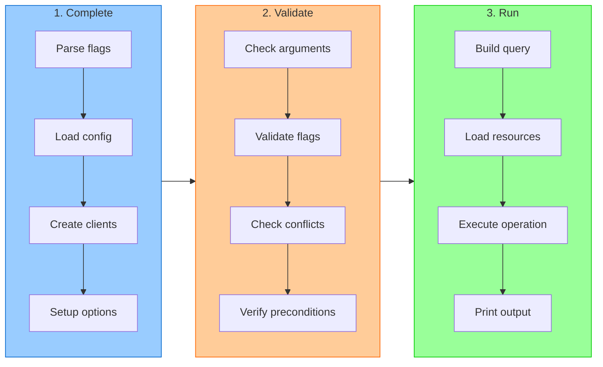

**Implementation Example**:

```go
// From staging/src/k8s.io/kubectl/pkg/cmd/create/create.go:102-114
cmd := &cobra.Command{
    Use:   "create -f FILENAME",
    Run: func(cmd *cobra.Command, args []string) {
        // Phase 1: Complete
        cmdutil.CheckErr(o.Complete(f, cmd, args))

        // Phase 2: Validate
        cmdutil.CheckErr(o.Validate())

        // Phase 3: Run
        cmdutil.CheckErr(o.RunCreate(f, cmd))
    },
}
```

**Code Reference**: Complete-Validate-Run pattern at `staging/src/k8s.io/kubectl/pkg/cmd/create/create.go:102-301`

### Factory → Builder → Visitor → REST Client Pipeline

The complete pipeline from command to API server:

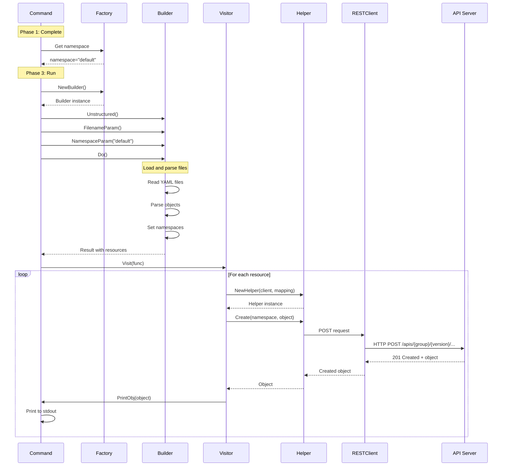

### Direct API Call Mechanism

For resources loaded from files or constructed programmatically:

```go
// Resource creation flow
func (h *Helper) Create(namespace string, modify bool, obj runtime.Object) (runtime.Object, error) {
    // 1. Convert object to internal representation
    data, err := runtime.Encode(h.Serializer, obj)

    // 2. Build REST request
    req := h.RESTClient.Post().
        NamespaceIfScoped(namespace, h.NamespaceScoped).
        Resource(h.Resource).
        Body(data)

    // 3. Execute request
    result := req.Do(context.TODO())

    // 4. Decode response
    body, err := result.Raw()
    out, err := runtime.Decode(h.Deserializer, body)

    return out, nil
}
```

**HTTP Request Details**:

```
POST /apis/apps/v1/namespaces/default/deployments HTTP/1.1
Host: kubernetes.default.svc
Authorization: Bearer <token>
Content-Type: application/json
Accept: application/json
User-Agent: kubectl/v1.28.0

{
  "apiVersion": "apps/v1",
  "kind": "Deployment",
  "metadata": {
    "name": "nginx",
    "namespace": "default"
  },
  "spec": {
    "replicas": 3,
    "selector": {
      "matchLabels": {"app": "nginx"}
    },
    "template": {
      "metadata": {"labels": {"app": "nginx"}},
      "spec": {
        "containers": [{
          "name": "nginx",
          "image": "nginx:1.21"
        }]
      }
    }
  }
}
```

━━━━━━━━━━━━━━━━━━━━━━━━━━━━━━━━━━━━━━━━━━━━━━━━━━━━━━━━━━━━━━━━━━━━━━━━━━━━━

## **🔁 Command Execution Patterns**

### Error Handling Pattern

Imperative commands use `cmdutil.CheckErr` to handle errors consistently:

```go
// Standard error handling
Run: func(cmd *cobra.Command, args []string) {
    cmdutil.CheckErr(o.Complete(f, cmd, args))
    cmdutil.CheckErr(o.Validate())
    cmdutil.CheckErr(o.RunCreate(f, cmd))
}
```

**Error Types**:

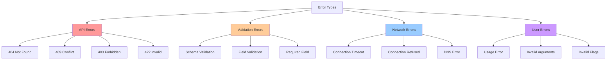

### Dry Run Pattern

Dry run allows testing commands without making actual changes:

```bash
# Client-side dry run
# - No API calls made
# - Show what would be created
kubectl create -f deployment.yaml --dry-run=client -o yaml

# Server-side dry run
# - Sends to API server for validation
# - API server validates but doesn't persist
# - Returns validated object
kubectl create -f deployment.yaml --dry-run=server -o yaml
```

### Field Management

Field management tracks which manager (kubectl, controller, etc.) owns each field:

```go
// Field manager identifies the manager
obj, err := resource.
    NewHelper(info.Client, info.Mapping).
    WithFieldManager(o.fieldManager).  // e.g., "kubectl-create"
    Create(info.Namespace, true, info.Object)
```

━━━━━━━━━━━━━━━━━━━━━━━━━━━━━━━━━━━━━━━━━━━━━━━━━━━━━━━━━━━━━━━━━━━━━━━━━━━━━

## **🔄 Synchronization Patterns**

### Synchronous Execution

Imperative commands execute synchronously - they wait for the API server response before returning.

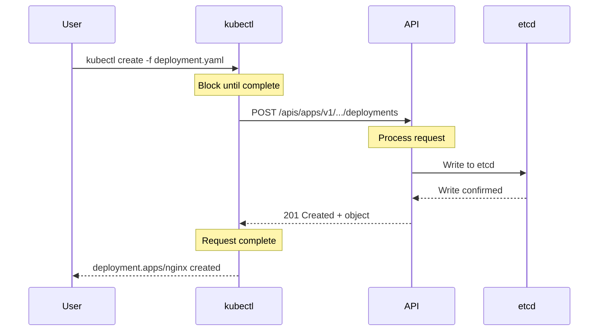

**Characteristics**:
- **Blocking**: kubectl waits for server response
- **Immediate Feedback**: User knows immediately if operation succeeded
- **No Background Work**: No client-side reconciliation loops
- **Network Dependent**: Timeout if API server unreachable

### No Client-Side Caching

Unlike declarative apply, imperative commands don't cache resources client-side:

| Aspect | Imperative | Declarative |
|--------|-----------|-------------|
| **State Tracking** | None | Stores `last-applied-configuration` |
| **Caching** | No client-side cache | Caches last-applied state |
| **Merge Logic** | None | Three-way merge algorithm |
| **Idempotency** | Not idempotent | Idempotent |
| **Conflicts** | Fails on conflict | Resolves conflicts |
| **Network** | Single request | May need GET + PATCH |

### Immediate API Server Interaction

Every imperative command results in immediate API calls:

```bash
# Each command = one API call
kubectl create -f pod1.yaml      # POST /api/v1/namespaces/default/pods
kubectl create -f pod2.yaml      # POST /api/v1/namespaces/default/pods
kubectl create -f pod3.yaml      # POST /api/v1/namespaces/default/pods
```

━━━━━━━━━━━━━━━━━━━━━━━━━━━━━━━━━━━━━━━━━━━━━━━━━━━━━━━━━━━━━━━━━━━━━━━━━━━━━

## **🔍 Aspect-Oriented Concerns**

### **📊 Observability**

#### Verbosity Levels

kubectl supports verbosity levels from 0-10 via the `--v` flag:

```bash
# Default (minimal output)
kubectl create -f deployment.yaml

# Level 6: HTTP request info
kubectl create -f deployment.yaml --v=6
# Shows: HTTP request method, URL

# Level 8: HTTP headers
kubectl create -f deployment.yaml --v=8
# Shows: Request/response headers

# Level 10: Everything
kubectl create -f deployment.yaml --v=10
# Shows: Full request/response bodies
```

**Verbosity Level Details**:

| Level | Information Shown | Use Case |
|-------|------------------|----------|
| **0** | Minimal (errors only) | Normal use |
| **1-4** | Basic operations | Script debugging |
| **5-6** | HTTP request info | Network debugging |
| **7-8** | HTTP headers | API debugging |
| **9-10** | Full HTTP bodies | Complete tracing |

### **⚠️ Error Handling**

#### API Error Translation

kubectl translates API server errors into user-friendly messages:

```bash
# 404 Not Found
$ kubectl delete deployment nonexistent
Error from server (NotFound): deployments.apps "nonexistent" not found

# 403 Forbidden
$ kubectl create -f deployment.yaml
Error from server (Forbidden): deployments.apps is forbidden: User "john" cannot create resource "deployments"

# 409 Conflict
$ kubectl create -f deployment.yaml
Error from server (AlreadyExists): deployments.apps "nginx" already exists
```

#### Validation Errors

Two types of validation:

**1. Client-Side Validation**:
```bash
# Using OpenAPI schema
kubectl create -f deployment.yaml --validate=true

# Error example
error: error validating "deployment.yaml": ValidationError(Deployment.spec.replicas): invalid type
```

**2. Server-Side Validation**:
```bash
# Validation by admission controllers
kubectl create -f deployment.yaml

# Error from admission webhook
Error from server: admission webhook "validate.deployment.apps" denied the request
```

### **⚡ Performance**

#### Single-Shot Operations

Imperative commands are one-time operations with no optimization across calls:

**Performance Characteristics**:
- **No Caching**: Every call fetches fresh data from API server
- **No Batching**: Resources created one at a time
- **Network Latency**: Each resource incurs full round-trip time
- **No Parallelization**: Sequential processing by default

#### Discovery Caching

kubectl caches API discovery information to reduce API calls:

```bash
# Cache location
~/.kube/cache/discovery/kubernetes.default.svc_443/

# Cached information:
# - API groups, versions, resource types, OpenAPI schemas

# Force refresh of discovery cache
kubectl api-resources --cached=false
```

### **🔒 Security**

#### Credential Handling from kubeconfig

kubectl loads credentials from kubeconfig file:

**Credential Types**:

1. **Client Certificates**:
```yaml
user:
  client-certificate: /path/to/cert.pem
  client-key: /path/to/key.pem
```

2. **Bearer Token**:
```yaml
user:
  token: eyJhbGciOiJSUzI1NiIsInR5cCI6IkpXVCJ9...
```

3. **Exec Auth Plugin**:
```yaml
user:
  exec:
    apiVersion: client.authentication.k8s.io/v1beta1
    command: aws
    args:
    - eks
    - get-token
    - --cluster-name
    - my-cluster
```

4. **OIDC**:
```yaml
user:
  auth-provider:
    name: oidc
    config:
      client-id: kubectl
      id-token: eyJhbGciOiJSUzI1NiIsInR5cCI6IkpXVCJ9...
      idp-issuer-url: https://accounts.google.com
```

**Code Reference**: kubeconfig loading at `staging/src/k8s.io/client-go/tools/clientcmd/`

#### TLS Verification

kubectl verifies API server TLS certificates:

```bash
# Normal operation: Verify certificate
kubectl get pods

# Skip verification (insecure, not recommended!)
kubectl get pods --insecure-skip-tls-verify

# Use custom CA
kubectl get pods --certificate-authority=/path/to/ca.crt
```

#### RBAC Authorization Checks

kubectl respects RBAC policies on the API server:

```bash
# Check if you can perform an action
kubectl auth can-i create deployments
yes

kubectl auth can-i create deployments -n kube-system
no

# Check as another user
kubectl auth can-i create deployments --as=john
no
```

━━━━━━━━━━━━━━━━━━━━━━━━━━━━━━━━━━━━━━━━━━━━━━━━━━━━━━━━━━━━━━━━━━━━━━━━━━━━━

## **📝 Command Examples**

### Complete kubectl create Examples

```bash
# Create from file
kubectl create -f deployment.yaml

# Create from multiple files
kubectl create -f deployment.yaml -f service.yaml -f configmap.yaml

# Create from directory (all YAML/JSON files)
kubectl create -f ./manifests/

# Create from URL
kubectl create -f https://k8s.io/examples/application/deployment.yaml

# Create from stdin
cat deployment.yaml | kubectl create -f -

# Edit before creating
kubectl create -f deployment.yaml --edit

# Dry run (client-side)
kubectl create -f deployment.yaml --dry-run=client

# Dry run (server-side validation)
kubectl create -f deployment.yaml --dry-run=server

# Output as YAML
kubectl create -f deployment.yaml --dry-run=client -o yaml

# Create specific resources via subcommands
kubectl create namespace production
kubectl create quota my-quota --hard=cpu=1,memory=1G,pods=10
kubectl create configmap app-config --from-file=config.properties
kubectl create configmap app-config --from-literal=key1=value1 --from-literal=key2=value2
kubectl create secret generic db-secret --from-literal=username=admin --from-literal=password=secret
kubectl create secret docker-registry regcred --docker-server=docker.io --docker-username=user --docker-password=pass
kubectl create serviceaccount app-sa
kubectl create deployment nginx --image=nginx:1.21 --replicas=3
kubectl create service clusterip nginx --tcp=80:80
kubectl create service nodeport nginx --tcp=80:80 --node-port=30080
kubectl create service loadbalancer nginx --tcp=80:80
kubectl create job backup --image=backup:v1 -- ./backup.sh
kubectl create cronjob backup --image=backup:v1 --schedule="0 2 * * *" -- ./backup.sh
kubectl create role pod-reader --verb=get --verb=list --resource=pods
kubectl create rolebinding pod-reader-binding --role=pod-reader --user=john
kubectl create clusterrole cluster-admin --verb=* --resource=*
kubectl create clusterrolebinding admin-binding --clusterrole=cluster-admin --user=admin
kubectl create poddisruptionbudget nginx-pdb --selector=app=nginx --min-available=2
kubectl create priorityclass high-priority --value=1000
kubectl create ingress nginx --rule="example.com/*=nginx:80"
```

### Complete kubectl run Examples

```bash
# Basic run
kubectl run nginx --image=nginx:1.21

# With port
kubectl run nginx --image=nginx:1.21 --port=80

# With environment variables
kubectl run nginx --image=nginx:1.21 --env="ENV=prod" --env="DEBUG=false"

# With labels
kubectl run nginx --image=nginx:1.21 --labels="app=nginx,tier=frontend,env=prod"

# Interactive with stdin
kubectl run -it busybox --image=busybox --restart=Never -- sh

# Interactive with TTY
kubectl run -it ubuntu --image=ubuntu:20.04 --restart=Never -- /bin/bash

# Run and expose as service
kubectl run nginx --image=nginx:1.21 --port=80 --expose

# Run with custom command
kubectl run nginx --image=nginx:1.21 --command -- nginx -g "daemon off;"

# Privileged mode
kubectl run busybox --image=busybox --privileged -- sh

# Restart policies
kubectl run nginx --image=nginx:1.21 --restart=Always    # Creates deployment
kubectl run nginx --image=nginx:1.21 --restart=OnFailure  # Creates job
kubectl run nginx --image=nginx:1.21 --restart=Never      # Creates pod

# Dry run to generate YAML
kubectl run nginx --image=nginx:1.21 --dry-run=client -o yaml > pod.yaml

# Run and delete after exit
kubectl run -it --rm debug --image=busybox --restart=Never -- sh
```

### Complete kubectl expose Examples

```bash
# Expose deployment
kubectl expose deployment nginx --port=80 --target-port=8080

# Expose pod
kubectl expose pod nginx --port=80 --target-port=8080

# Expose as ClusterIP (default)
kubectl expose deployment nginx --type=ClusterIP --port=80

# Expose as NodePort
kubectl expose deployment nginx --type=NodePort --port=80

# Expose as LoadBalancer
kubectl expose deployment nginx --type=LoadBalancer --port=80

# Expose with external IP
kubectl expose deployment nginx --external-ip=10.0.0.1 --port=80

# Expose with custom selector
kubectl expose deployment nginx --selector="app=nginx,version=v1" --port=80

# Expose multiple ports
kubectl expose deployment app --port=80 --port=443

# Expose with protocol
kubectl expose deployment nginx --port=80 --protocol=TCP
kubectl expose deployment dns --port=53 --protocol=UDP

# Expose with session affinity
kubectl expose deployment nginx --port=80 --session-affinity=ClientIP

# Dry run
kubectl expose deployment nginx --port=80 --dry-run=client -o yaml
```

### Complete kubectl delete Examples

```bash
# Delete by name
kubectl delete pod nginx
kubectl delete deployment nginx

# Delete by file
kubectl delete -f deployment.yaml
kubectl delete -f service.yaml -f deployment.yaml

# Delete from directory
kubectl delete -f ./manifests/

# Delete by label selector
kubectl delete pods -l app=nginx
kubectl delete deployments,services -l env=test
kubectl delete all -l app=myapp

# Delete by field selector
kubectl delete pods --field-selector=status.phase=Failed

# Delete all of type
kubectl delete pods --all
kubectl delete deployments --all

# Delete across all namespaces
kubectl delete pods --all --all-namespaces

# Force delete (skip graceful deletion)
kubectl delete pod nginx --force --grace-period=0

# Delete with grace period
kubectl delete pod nginx --grace-period=30

# Delete immediately (grace-period=1)
kubectl delete pod nginx --now

# Delete and wait for completion
kubectl delete pod nginx --wait

# Cascading delete strategies
kubectl delete deployment nginx --cascade=background   # Default
kubectl delete deployment nginx --cascade=foreground   # Delete dependents first
kubectl delete deployment nginx --cascade=orphan       # Leave dependents

# Ignore not found errors
kubectl delete pod nginx --ignore-not-found

# Interactive delete (prompt for confirmation)
kubectl delete pod nginx --interactive

# Dry run
kubectl delete pod nginx --dry-run=client
```

━━━━━━━━━━━━━━━━━━━━━━━━━━━━━━━━━━━━━━━━━━━━━━━━━━━━━━━━━━━━━━━━━━━━━━━━━━━━━

## **✅ Best Practices**

### When to Use Imperative Commands

**✅ Good Use Cases**:
- **Development/Testing**: Quick resource creation during development
- **Debugging**: One-off operations for troubleshooting
- **Learning**: Educational purposes, learning Kubernetes
- **Simple Operations**: Creating single resources
- **Interactive Work**: Exploring cluster state
- **Prototyping**: Rapid prototyping of resource configurations

```bash
# Good: Quick debugging
kubectl run debug --image=busybox -it --rm -- sh

# Good: Testing a configuration
kubectl create deployment test-nginx --image=nginx --dry-run=client -o yaml

# Good: One-off service exposure
kubectl expose deployment nginx --port=80
```

**❌ Avoid For**:
- **Production Deployments**: Use declarative YAML files
- **Automation**: Scripts should use declarative approach
- **Complex Configurations**: Multi-resource dependencies
- **Version Control**: Hard to track imperative commands
- **Repeatability**: Imperative commands are not idempotent
- **Collaboration**: Team environments need declarative configs

### Imperative vs Declarative Decision Matrix

| Criteria | Imperative | Declarative |
|----------|-----------|-------------|
| **Environment** | Dev/Test | Production |
| **Automation** | Manual | Automated |
| **Version Control** | Not needed | Required |
| **Repeatability** | One-time | Repeatable |
| **Complexity** | Simple (1-2 resources) | Complex (many resources) |
| **Team Size** | Individual | Team |
| **Change Tracking** | Not important | Important |
| **Rollback** | Manual | Git revert |

### Common Patterns and Idioms

#### Generate YAML Template

Use imperative commands to generate declarative YAML:

```bash
# Generate pod YAML
kubectl run nginx --image=nginx:1.21 --dry-run=client -o yaml > pod.yaml

# Generate deployment YAML
kubectl create deployment nginx --image=nginx:1.21 --replicas=3 --dry-run=client -o yaml > deployment.yaml

# Generate service YAML
kubectl expose deployment nginx --port=80 --dry-run=client -o yaml > service.yaml

# Edit and apply
vi deployment.yaml
kubectl apply -f deployment.yaml
```

#### Quick Debugging Pod

Create temporary debugging pods:

```bash
# Interactive busybox
kubectl run -it --rm debug --image=busybox --restart=Never -- sh

# Interactive ubuntu
kubectl run -it --rm debug --image=ubuntu:20.04 --restart=Never -- bash

# With network debugging tools
kubectl run -it --rm netshoot --image=nicolaka/netshoot --restart=Never -- bash
```

#### Test Resource Creation

Test configurations before applying to production:

```bash
# Client-side dry run (fast, no API call)
kubectl create -f deployment.yaml --dry-run=client

# Server-side dry run (validates against API)
kubectl create -f deployment.yaml --dry-run=server

# Generate and review YAML
kubectl create deployment nginx --image=nginx:1.21 --dry-run=client -o yaml | less
```

━━━━━━━━━━━━━━━━━━━━━━━━━━━━━━━━━━━━━━━━━━━━━━━━━━━━━━━━━━━━━━━━━━━━━━━━━━━━━

## **🔧 Troubleshooting**

### Common Errors

#### 🔴 "already exists" Error

```bash
$ kubectl create -f deployment.yaml
Error from server (AlreadyExists): deployments.apps "nginx" already exists
```

**Solutions**:
1. Use `kubectl apply` instead (idempotent)
2. Delete existing resource first: `kubectl delete -f deployment.yaml`
3. Use `kubectl replace --force`: `kubectl replace --force -f deployment.yaml`

#### 🔴 "forbidden" Error

```bash
$ kubectl create deployment nginx --image=nginx
Error from server (Forbidden): deployments.apps is forbidden: User "john" cannot create resource "deployments"
```

**Solutions**:
1. Check RBAC permissions: `kubectl auth can-i create deployments`
2. Request access from cluster administrator
3. Use different namespace where you have permissions

#### 🔴 "validation error" Error

```bash
$ kubectl create -f invalid.yaml
error: error validating "invalid.yaml": ValidationError(Deployment.spec.replicas): invalid type
```

**Solutions**:
1. Fix YAML syntax: Check field types
2. Validate schema: `kubectl apply --validate=strict --dry-run=server -f file.yaml`
3. Skip validation (not recommended): `kubectl create -f file.yaml --validate=false`

#### 🔴 Connection Timeout

```bash
$ kubectl create -f deployment.yaml
Unable to connect to the server: dial tcp 192.168.1.100:6443: i/o timeout
```

**Solutions**:
1. Check cluster connectivity: `kubectl cluster-info`
2. Verify kubeconfig: `kubectl config view`
3. Check network/firewall
4. Verify API server is running

### Debugging Techniques

#### Increase Verbosity

```bash
# Show HTTP requests
kubectl create -f deployment.yaml --v=6

# Show HTTP headers
kubectl create -f deployment.yaml --v=8

# Show full HTTP bodies
kubectl create -f deployment.yaml --v=10
```

#### Validate Before Creating

```bash
# Client-side validation (fast)
kubectl create -f deployment.yaml --dry-run=client --validate=true

# Server-side validation (accurate)
kubectl create -f deployment.yaml --dry-run=server --validate=strict
```

#### Check API Server Health

```bash
# Cluster info
kubectl cluster-info

# API versions
kubectl api-versions

# API resources
kubectl api-resources

# Component status
kubectl get componentstatuses
```

### Performance Issues

#### Slow Creation

**Problem**: Resource creation takes long time

**Solutions**:
1. Use server-side apply for large objects
2. Reduce number of API calls (combine resources in single file)
3. Check network connectivity
4. Investigate API server performance

#### Rate Limiting

**Problem**: Hitting API server rate limits

```bash
Error from server (TooManyRequests): the server has received too many requests
```

**Solutions**:
1. Reduce request rate
2. Increase QPS/burst in kubeconfig
3. Use batch operations (single file with multiple resources)
4. Contact cluster admin to increase API server limits

━━━━━━━━━━━━━━━━━━━━━━━━━━━━━━━━━━━━━━━━━━━━━━━━━━━━━━━━━━━━━━━━━━━━━━━━━━━━━

## **📋 Summary**

### Key Takeaways

1. **💡 Imperative Nature**:
   - Direct, one-time operations
   - No state tracking or merge logic
   - Synchronous execution with immediate feedback
   - Not idempotent (running twice may error)

2. **🏗️ Architecture Patterns**:
   - **Complete-Validate-Run**: Three-phase execution model
   - **Factory Pattern**: Abstracts client creation and utilities
   - **Builder Pattern**: Fluent API for resource queries
   - **Visitor Pattern**: Process resources uniformly

3. **⚙️ Command Types**:
   - **create**: Create resources from files or specifications
   - **run**: Create and run pods with optional attach/expose
   - **expose**: Create Services for existing resources
   - **delete**: Remove resources with various strategies

4. **✅ Best Practices**:
   - Use for development, testing, and debugging
   - Avoid for production deployments
   - Generate YAML templates with `--dry-run=client -o yaml`
   - Validate before creating with `--dry-run=server`

5. **🔧 Key Components**:
   - **cobra.Command**: Command structure and execution
   - **Factory**: Provides clients and utilities
   - **Resource Builder**: Constructs resource queries
   - **Visitor**: Processes resources uniformly
   - **REST Client**: Makes API calls

6. **📊 Observability**:
   - Verbosity levels (--v=0 to --v=10)
   - Request/response logging
   - API call tracing
   - Client-side metrics

7. **🔒 Security**:
   - kubeconfig credential management
   - TLS certificate verification
   - Exec auth plugins
   - RBAC authorization enforcement

### Comparison with Declarative Commands

| Aspect | Imperative | Declarative (apply) |
|--------|-----------|-------------------|
| **Command** | create, run, expose, delete | apply |
| **State** | No client-side state | Stores last-applied-configuration |
| **Idempotency** | Not idempotent | Idempotent |
| **Merge** | No merge logic | Three-way merge |
| **Use Case** | Dev/test, one-off ops | Production, automation |
| **Version Control** | Commands not in VCS | YAML files in VCS |
| **Rollback** | Manual recreation | Git revert |
| **Complexity** | Simple, direct | Complex but powerful |

### When to Use Imperative Commands

**✅ Good For**:
- Quick development iterations
- Interactive debugging
- Learning Kubernetes
- Generating YAML templates
- One-off operational tasks

**❌ Not Good For**:
- Production deployments
- Automation pipelines
- Team collaboration
- Change tracking
- Complex multi-resource configurations

### Related Documentation

- [Declarative Apply](./02-declarative-apply.md) - Three-way merge and kubectl apply
- [Command Architecture](../high-level/02-command-architecture.md) - Cobra framework details
- [Resource Management](../high-level/03-resource-management.md) - Builder and Visitor patterns
- [Config Management](../high-level/04-config-management.md) - kubeconfig and authentication

━━━━━━━━━━━━━━━━━━━━━━━━━━━━━━━━━━━━━━━━━━━━━━━━━━━━━━━━━━━━━━━━━━━━━━━━━━━━━

**Document Complete**: This comprehensive guide covers imperative commands in kubectl, including data structures, core components, command interactions, synchronization patterns, and aspect-oriented concerns. For declarative resource management, see the next document on `kubectl apply`.
