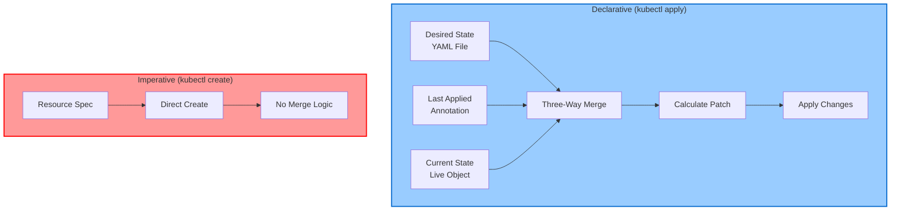
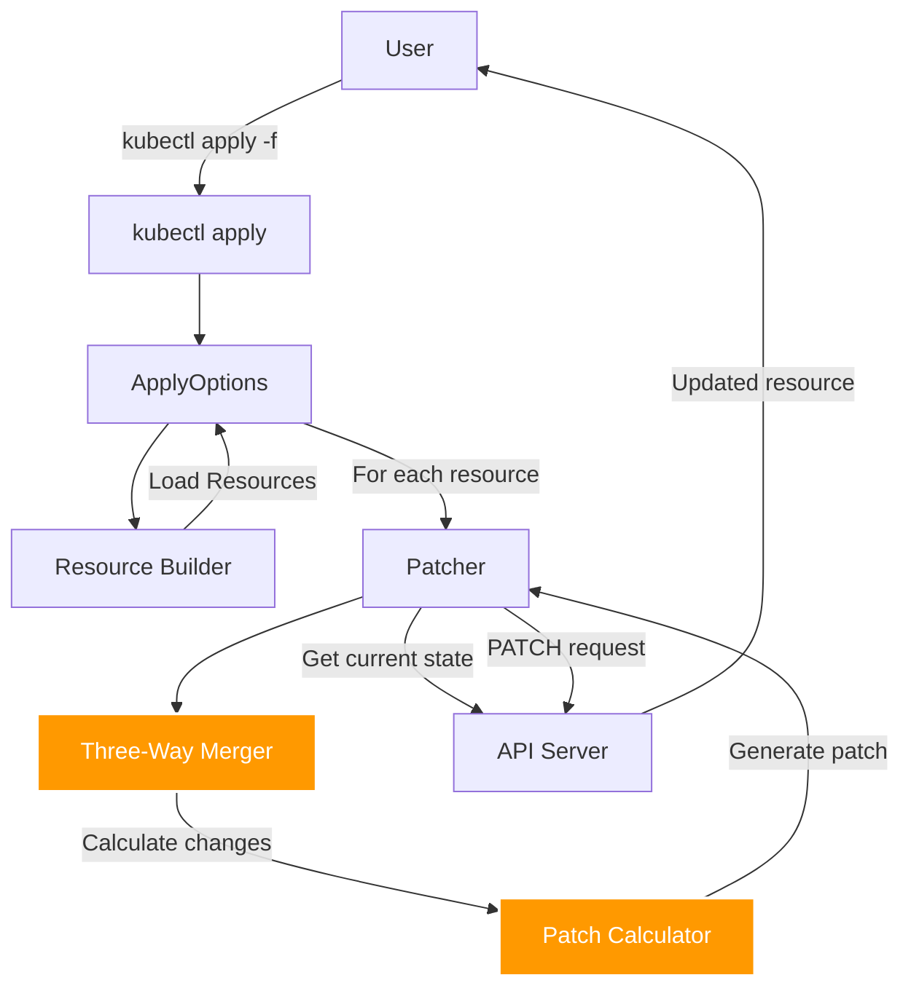
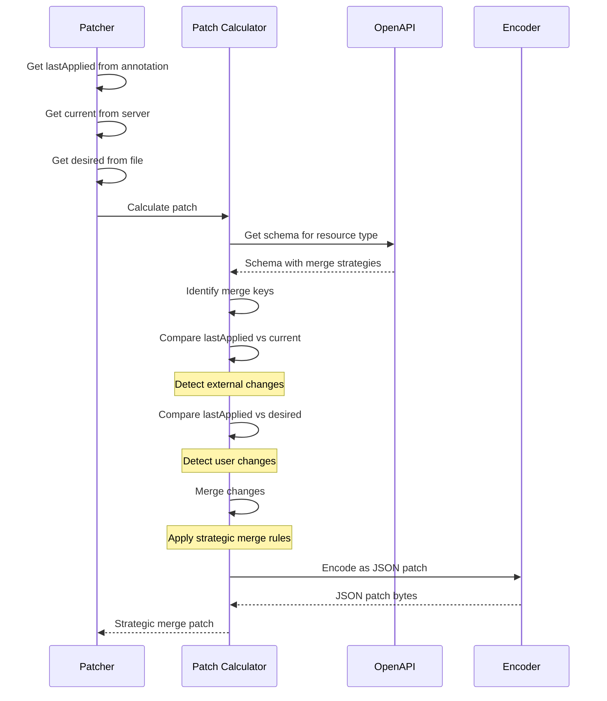
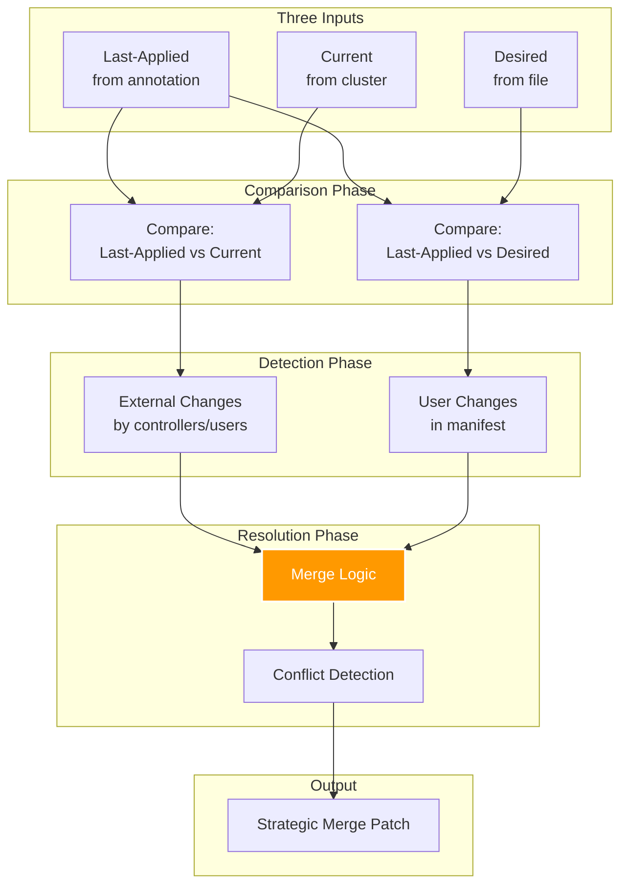
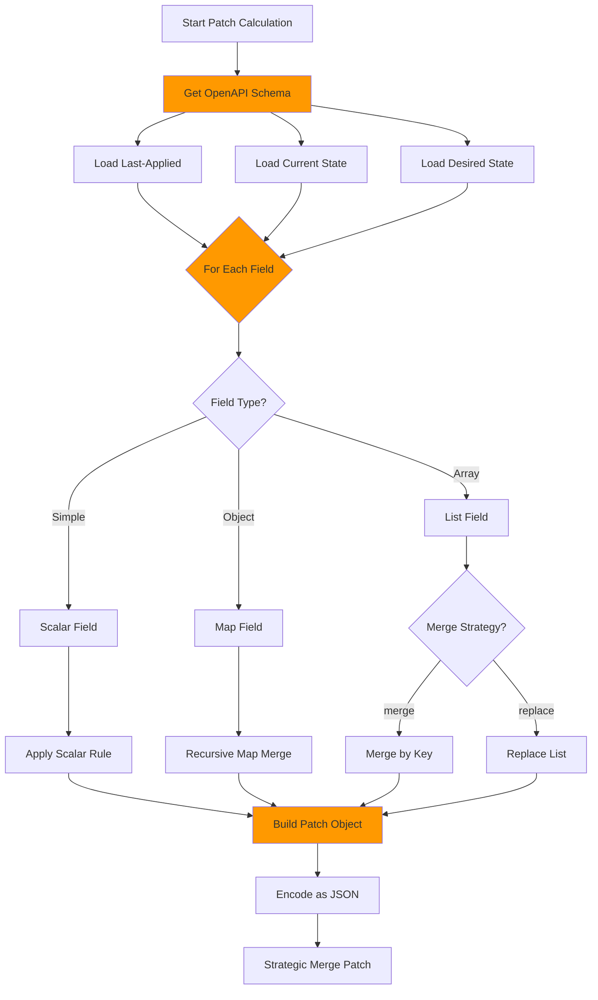
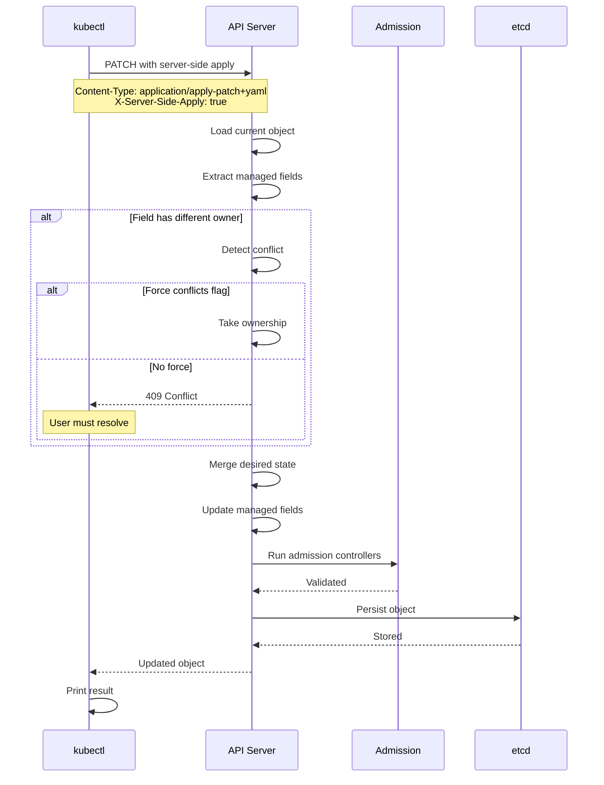
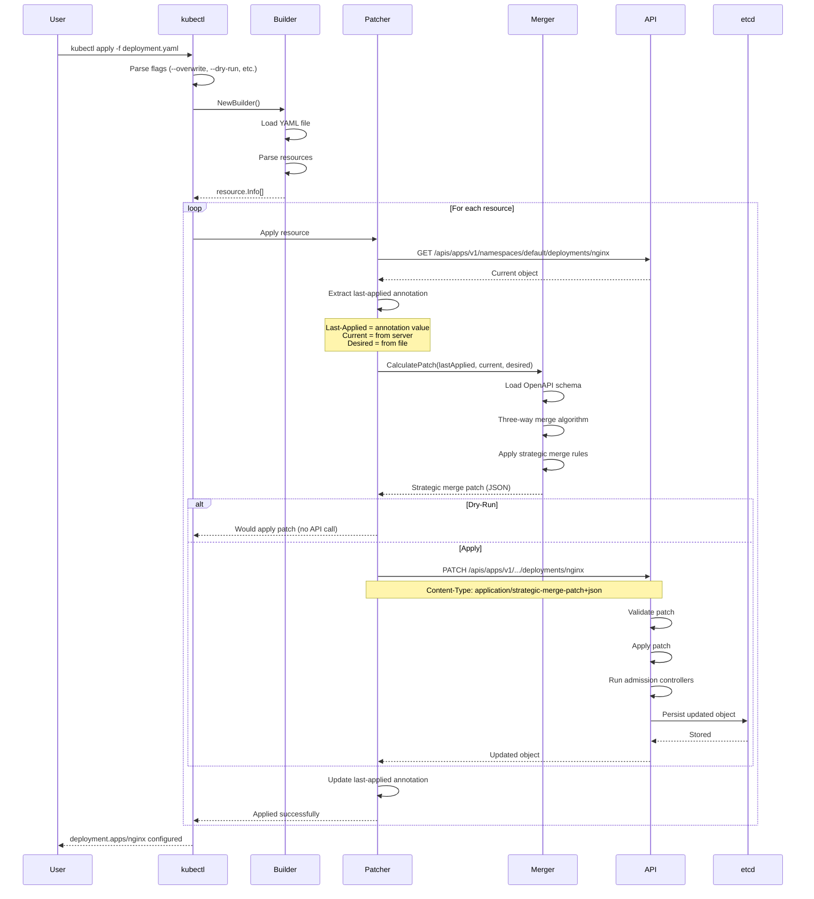
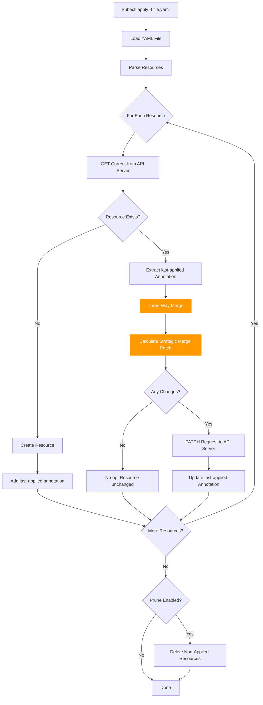
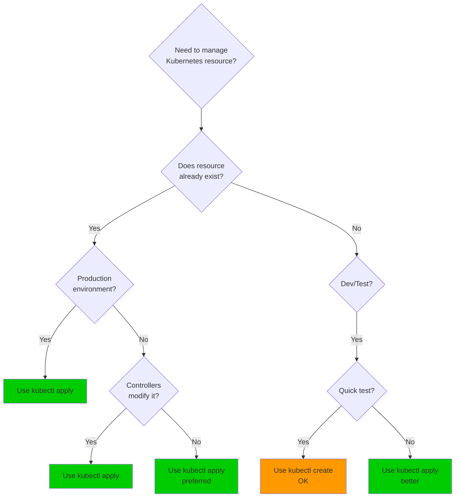

# kubectl Declarative Apply and Three-Way Merge

**Document Version**: 1.0
**Last Updated**: 2025-11-05
**Status**: Middle-Level Architecture Documentation
**Importance**: ⭐⭐⭐ CRITICAL - Core kubectl Apply Mechanism

━━━━━━━━━━━━━━━━━━━━━━━━━━━━━━━━━━━━━━━━━━━━━━━━━━━━━━━━━━━━━━━━━━━━━━━━━━━━━

## Table of Contents

- [Overview](#overview)
- [Data Structures](#data-structures)
- [Core Components](#core-components)
- [Three-Way Merge Algorithm](#three-way-merge-algorithm)
- [Strategic Merge Patch](#strategic-merge-patch)
- [Server-Side Apply](#server-side-apply)
- [Component Interactions](#component-interactions)
- [Practical Examples](#practical-examples)
- [Apply vs Create vs Replace](#apply-vs-create-vs-replace)
- [Best Practices](#best-practices)
- [Troubleshooting](#troubleshooting)
- [Summary](#summary)

━━━━━━━━━━━━━━━━━━━━━━━━━━━━━━━━━━━━━━━━━━━━━━━━━━━━━━━━━━━━━━━━━━━━━━━━━━━━━

## **📋 Overview**

`kubectl apply` is the declarative way to manage Kubernetes resources. Unlike imperative commands that directly create or modify resources, `apply` uses a sophisticated three-way merge algorithm to reconcile the desired state (YAML file) with the current state (live object) while preserving changes made by other managers.

### Declarative vs Imperative



**Key Characteristics of kubectl apply**:

| Feature | Description |
|---------|-------------|
| **Idempotent** | Can be run multiple times with same result |
| **State Tracking** | Stores `last-applied-configuration` annotation |
| **Three-Way Merge** | Merges last-applied, current, and desired states |
| **Conflict Resolution** | Detects and handles conflicts intelligently |
| **Field Management** | Tracks which manager owns each field |
| **Declarative** | Describes desired state, not operations |

**Code Reference**: Apply command at `staging/src/k8s.io/kubectl/pkg/cmd/apply/apply.go:198-223`

━━━━━━━━━━━━━━━━━━━━━━━━━━━━━━━━━━━━━━━━━━━━━━━━━━━━━━━━━━━━━━━━━━━━━━━━━━━━━

## **🔧 Data Structures**

### ApplyOptions Structure

The main options structure for `kubectl apply` command:

```go
// From staging/src/k8s.io/kubectl/pkg/cmd/apply/apply.go:82-142
type ApplyOptions struct {
    // Recording and printing
    Recorder  genericclioptions.Recorder
    PrintFlags *genericclioptions.PrintFlags
    ToPrinter  func(string) (printers.ResourcePrinter, error)

    // Deletion options for pruning
    DeleteOptions *cmddelete.DeleteOptions

    // Server-side apply
    ServerSideApply bool        // Use server-side apply (vs client-side)
    ForceConflicts  bool        // Force conflicts when using server-side apply
    FieldManager    string      // Name of field manager (e.g., "kubectl-client-side-apply")

    // Selection and execution
    Selector       string                // Label selector for resources
    DryRunStrategy cmdutil.DryRunStrategy // None, Client, or Server
    Prune          bool                  // Delete resources not in manifest
    PruneResources []prune.Resource      // Resource types to prune
    All            bool                  // Select all resources
    Overwrite      bool                  // Automatically resolve conflicts
    OpenAPIPatch   bool                  // Use OpenAPI for patch calculation

    // Subresource support
    Subresource string                   // Apply to subresource (e.g., "status")

    // Validation
    ValidationDirective string
    Validator           validation.Schema

    // Clients and utilities
    Builder       *resource.Builder      // Resource builder
    Mapper        meta.RESTMapper        // REST mapper
    DynamicClient dynamic.Interface      // Dynamic client
    OpenAPIGetter openapi.OpenAPIResourcesGetter
    OpenAPIV3Root openapi3.Root

    // Namespace
    Namespace        string
    EnforceNamespace bool

    // I/O
    genericiooptions.IOStreams

    // Cached objects
    objects       []*resource.Info  // Resources to apply
    objectsCached bool              // Whether objects are cached

    // Tracking for pruning
    VisitedUids       sets.Set[types.UID]    // UIDs of visited resources
    VisitedNamespaces sets.Set[string]       // Namespaces visited

    // Hooks
    PreProcessorFn  func() error  // Run before apply
    PostProcessorFn func() error  // Run after apply (typically prune)

    // ApplySet tracking (KEP-3659)
    ApplySet *ApplySet
}
```

**Key Fields Explained**:

- **ServerSideApply**: When true, uses server-side apply (field management on server)
- **ForceConflicts**: Forces applying changes even if there are field ownership conflicts
- **FieldManager**: Identifier for who owns fields (e.g., `kubectl-client-side-apply`)
- **Prune**: Deletes resources that exist in cluster but not in applied manifests
- **Overwrite**: Automatically resolves conflicts by using values from manifest
- **OpenAPIPatch**: Uses OpenAPI schema to calculate strategic merge patches

**Code Reference**: ApplyOptions struct at `staging/src/k8s.io/kubectl/pkg/cmd/apply/apply.go:82-142`

### Patcher Structure

Handles the actual patching operations:

```go
// From staging/src/k8s.io/kubectl/pkg/cmd/apply/patcher.go:64-85
type Patcher struct {
    Mapping *meta.RESTMapping  // Resource type mapping
    Helper  *resource.Helper   // Resource helper for API calls

    // Patch behavior
    Overwrite bool              // Overwrite conflicting fields
    BackOff   clockwork.Clock   // Backoff for retries

    // Deletion options (for recreate scenarios)
    Force             bool
    CascadingStrategy metav1.DeletionPropagation
    Timeout           time.Duration
    GracePeriod       int

    // Version control
    ResourceVersion *string  // Force patch against specific version

    // Retry configuration
    Retries int  // Number of retries on conflict (default: 5)

    // OpenAPI for patch calculation
    OpenAPIGetter openapi.OpenAPIResourcesGetter
    OpenAPIV3Root openapi3.Root
}
```

**Retry Mechanism**:
```go
const (
    maxPatchRetry = 5                    // Maximum retries
    triesBeforeBackOff = 1               // Retries before backoff
    patchRetryBackOffPeriod = 1 * time.Second  // Backoff duration
)
```

**Code Reference**: Patcher struct at `staging/src/k8s.io/kubectl/pkg/cmd/apply/patcher.go:64-85`

### Last-Applied-Configuration Annotation

The annotation that stores the last applied state:

```go
// Annotation key
const LastAppliedConfigAnnotation = "kubectl.kubernetes.io/last-applied-configuration"

// Example annotation value (JSON-encoded)
{
  "apiVersion": "apps/v1",
  "kind": "Deployment",
  "metadata": {
    "name": "nginx",
    "namespace": "default"
  },
  "spec": {
    "replicas": 3,
    "selector": {
      "matchLabels": {"app": "nginx"}
    },
    "template": {
      "metadata": {"labels": {"app": "nginx"}},
      "spec": {
        "containers": [{
          "name": "nginx",
          "image": "nginx:1.21"
        }]
      }
    }
  }
}
```

**Purpose of Annotation**:
- Stores complete last-applied configuration as JSON
- Used as input to three-way merge algorithm
- Allows kubectl to determine what fields were deleted
- Essential for idempotent apply operations

**Code Reference**: Annotation utilities at `staging/src/k8s.io/kubectl/pkg/util/apply/`

### Strategic Merge Patch Directives

Special directives that control merge behavior:

```go
// From staging/src/k8s.io/apimachinery/pkg/util/strategicpatch/patch.go:40-51
const (
    directiveMarker  = "$patch"           // Marks patch directive
    deleteDirective  = "delete"           // Delete this element
    replaceDirective = "replace"          // Replace entire list
    mergeDirective   = "merge"            // Merge with existing

    retainKeysStrategy = "retainKeys"     // Retain only specified keys
    retainKeysDirective = "$retainKeys"   // List of keys to retain

    deleteFromPrimitiveListDirectivePrefix = "$deleteFromPrimitiveList"
    setElementOrderDirectivePrefix = "$setElementOrder"
)
```

**Directive Usage**:

1. **$patch: delete** - Delete an element from a list:
```yaml
containers:
- name: app
  $patch: delete
```

2. **$patch: replace** - Replace entire list:
```yaml
containers:
  $patch: replace
  - name: new-container
    image: new:v1
```

3. **$retainKeys** - Keep only specified fields:
```yaml
metadata:
  labels:
    $retainKeys:
    - app
    - version
    app: nginx
    version: v1
```

**Code Reference**: Directives at `staging/src/k8s.io/apimachinery/pkg/util/strategicpatch/patch.go:40-51`

━━━━━━━━━━━━━━━━━━━━━━━━━━━━━━━━━━━━━━━━━━━━━━━━━━━━━━━━━━━━━━━━━━━━━━━━━━━━━

## **⚙️ Core Components**

### Apply Command Architecture



### Apply Flow Phases

**Phase 1: Initialization and Loading**
```go
// 1. Parse command-line flags
flags := NewApplyFlags(ioStreams)

// 2. Convert to options
options, err := flags.ToOptions(factory, cmd, baseName, args)

// 3. Validate options
err = options.Validate()

// 4. Load resources from files
objects, err := options.GetObjects()
```

**Phase 2: Apply Each Resource**
```go
// For each resource:
for _, info := range objects {
    // 1. Get current state from server
    current, err := helper.Get(namespace, name)

    // 2. Get last-applied configuration from annotation
    lastApplied, err := util.GetOriginalConfiguration(current)

    // 3. Three-way merge: lastApplied + current + desired
    patch, err := calculatePatch(lastApplied, current, desired)

    // 4. Apply patch to server
    result, err := helper.Patch(namespace, name, patch)

    // 5. Update last-applied annotation
    util.SetOriginalConfiguration(result, desired)
}
```

**Phase 3: Post-Processing (Pruning)**
```go
// Delete resources not in manifest but matching selector
if options.Prune {
    pruner.Prune(visitedResources, selector)
}
```

**Code Reference**: Apply flow at `staging/src/k8s.io/kubectl/pkg/cmd/apply/apply.go:400+`

### Patch Calculator Component

The patch calculator determines what changes need to be applied:



**Code Reference**: Patch calculation at `staging/src/k8s.io/kubectl/pkg/cmd/apply/patcher.go:117-200`

━━━━━━━━━━━━━━━━━━━━━━━━━━━━━━━━━━━━━━━━━━━━━━━━━━━━━━━━━━━━━━━━━━━━━━━━━━━━━

## **🔀 Three-Way Merge Algorithm**

### **Algorithm Overview**

The three-way merge is the heart of `kubectl apply`. It reconciles three versions of a resource:

1. **Last-Applied**: The configuration that was last applied (from annotation)
2. **Current (Live)**: The current state in the cluster (from API server)
3. **Desired**: The new configuration being applied (from file)



### **Three-Way Merge Rules**

The algorithm follows these rules for each field:

| Last-Applied | Current | Desired | Action | Reason |
|--------------|---------|---------|--------|--------|
| A | A | A | No change | Field unchanged |
| A | A | B | Update to B | User changed field |
| A | B | A | Keep B | External change, user didn't modify |
| A | B | B | Keep B | Both user and external made same change |
| A | B | C | **CONFLICT** | Both modified differently |
| A | A | ∅ | Delete A | User removed field |
| A | B | ∅ | Delete | User wants to remove |
| ∅ | ∅ | A | Add A | User added new field |
| ∅ | B | A | **CONFLICT** or Keep B | Depends on overwrite flag |

**Legend**:
- A, B, C = Different values
- ∅ = Field not present

### **Algorithm Pseudocode**

```python
def three_way_merge(last_applied, current, desired):
    """
    Perform three-way merge of Kubernetes resource.

    Args:
        last_applied: Configuration from last kubectl apply
        current: Current state from API server
        desired: New configuration from file

    Returns:
        patch: Strategic merge patch to apply
    """
    patch = {}

    # Get all fields from all three versions
    all_fields = set(last_applied.keys()) | set(current.keys()) | set(desired.keys())

    for field in all_fields:
        last_val = last_applied.get(field)
        curr_val = current.get(field)
        desired_val = desired.get(field)

        # Case 1: Field deleted by user
        if field in last_applied and field in current and field not in desired:
            # User removed this field - delete it
            patch[field] = None
            continue

        # Case 2: Field unchanged
        if last_val == curr_val == desired_val:
            # No change needed
            continue

        # Case 3: User changed field
        if last_val != desired_val and curr_val == last_val:
            # User modified, no external changes - use desired
            patch[field] = desired_val
            continue

        # Case 4: External change only
        if last_val == desired_val and curr_val != last_val:
            # External modification, user didn't change - keep current
            continue

        # Case 5: Both modified
        if last_val != curr_val and last_val != desired_val:
            if curr_val == desired_val:
                # Both changed to same value - no conflict
                continue
            else:
                # TRUE CONFLICT - both modified differently
                if overwrite:
                    # Overwrite mode: use desired value
                    patch[field] = desired_val
                else:
                    # Conflict error
                    raise ConflictError(f"Field {field} modified by both user and external")

        # Case 6: New field
        if field not in last_applied and field not in current:
            # New field from user
            patch[field] = desired_val

    return patch
```

### **Detailed Example: Field Changes**

Let's walk through a complete example:

**Initial State (First Apply)**:
```yaml
# deployment.yaml (first apply)
apiVersion: apps/v1
kind: Deployment
metadata:
  name: nginx
spec:
  replicas: 3
  template:
    spec:
      containers:
      - name: nginx
        image: nginx:1.20
        resources:
          requests:
            memory: "64Mi"
```

After first apply:
- **Last-Applied**: Stored in annotation (same as above)
- **Current**: Same as above (just created)

**Scenario 1: User Modifies Replicas**

User updates file:
```yaml
# deployment.yaml (second apply)
spec:
  replicas: 5  # Changed from 3
  # ... rest unchanged
```

Three-way merge:
- **Last-Applied**: `replicas: 3`
- **Current**: `replicas: 3`
- **Desired**: `replicas: 5`
- **Action**: Update replicas to 5 (user changed, no conflict)

**Scenario 2: Controller Modifies, User Doesn't**

Meanwhile, HPA scaled the deployment:
- **Last-Applied**: `replicas: 3`
- **Current**: `replicas: 8` (scaled by HPA)
- **Desired**: `replicas: 3` (user didn't change file)
- **Action**: Keep replicas at 8 (external change, user didn't modify)

**Scenario 3: Both User and Controller Modify**

User changes replicas, HPA also scaled:
- **Last-Applied**: `replicas: 3`
- **Current**: `replicas: 8` (scaled by HPA)
- **Desired**: `replicas: 5` (user changed)
- **Action**: **CONFLICT** - Both modified
  - With `--overwrite`: Use 5 (user's value)
  - Without `--overwrite`: Error

**Scenario 4: User Deletes Field**

User removes memory request:
```yaml
# deployment.yaml (third apply)
spec:
  template:
    spec:
      containers:
      - name: nginx
        image: nginx:1.20
        resources:
          requests:
            # memory field removed
```

Three-way merge:
- **Last-Applied**: `requests.memory: "64Mi"`
- **Current**: `requests.memory: "64Mi"`
- **Desired**: `requests.memory: <not present>`
- **Action**: Delete memory field from cluster

### **List Merging with Merge Keys**

Lists with merge keys (like containers) use special merge logic:

**Merge Key Identification**:
```go
// Containers list uses "name" as merge key
// Defined in OpenAPI schema:
"x-kubernetes-patch-merge-key": "name"
"x-kubernetes-patch-strategy": "merge"
```

**Example: Container List Merge**

**Last-Applied**:
```yaml
containers:
- name: nginx
  image: nginx:1.20
- name: sidecar
  image: sidecar:v1
```

**Current (HPA added resource limits)**:
```yaml
containers:
- name: nginx
  image: nginx:1.20
  resources:
    limits:
      memory: "128Mi"  # Added by HPA
- name: sidecar
  image: sidecar:v1
```

**Desired (User updates nginx image)**:
```yaml
containers:
- name: nginx
  image: nginx:1.21  # User changed
- name: sidecar
  image: sidecar:v1
```

**Result After Merge**:
```yaml
containers:
- name: nginx
  image: nginx:1.21          # User's change applied
  resources:
    limits:
      memory: "128Mi"        # External change preserved
- name: sidecar
  image: sidecar:v1
```

**Merge Logic**:
1. Match containers by name (merge key)
2. For nginx container:
   - Image: User changed (1.20 → 1.21), apply change
   - Resources: External added, user didn't touch, keep it
3. For sidecar container:
   - No changes, keep as-is

**Code Reference**: Three-way merge implementation at `staging/src/k8s.io/apimachinery/pkg/util/strategicpatch/patch.go`

━━━━━━━━━━━━━━━━━━━━━━━━━━━━━━━━━━━━━━━━━━━━━━━━━━━━━━━━━━━━━━━━━━━━━━━━━━━━━

## **📦 Strategic Merge Patch**

### **What is Strategic Merge Patch?**

Strategic Merge Patch (SMP) is Kubernetes' extension of JSON Merge Patch (RFC 7386) that adds:
- **List merge strategies** (merge by key vs replace entire list)
- **Patch directives** (delete, replace, merge)
- **Schema awareness** (uses OpenAPI schema for merge behavior)

**Standard JSON Merge Patch** (RFC 7386):
```json
{
  "replicas": 5
}
```
Limitation: Cannot delete fields, cannot merge lists intelligently

**Strategic Merge Patch**:
```json
{
  "spec": {
    "replicas": 5,
    "template": {
      "spec": {
        "containers": [
          {
            "name": "nginx",
            "image": "nginx:1.21"
          }
        ]
      }
    }
  }
}
```
Advantage: Merges container by name, preserves other containers

### **Merge Strategies**

Kubernetes objects define merge strategies in OpenAPI schema:

**1. Merge Strategy** (default for most maps):
```yaml
# Schema annotation
x-kubernetes-patch-strategy: merge
x-kubernetes-patch-merge-key: name

# Behavior: Merge items by key
containers:
- name: app     # Matches by name
  image: new:v2 # Updates only image field
```

**2. Replace Strategy** (for primitive lists):
```yaml
# Schema annotation
x-kubernetes-patch-strategy: replace

# Behavior: Replace entire list
args:
  $patch: replace
  - "--flag1"
  - "--flag2"
```

**3. Atomic Strategy** (for certain fields):
```yaml
# No merge, replace entire value
selector:
  matchLabels:
    app: nginx  # Must replace entire selector
```

### **Patch Directives**

#### **$patch: delete** - Delete Element

Remove a container from list:
```yaml
spec:
  template:
    spec:
      containers:
      - name: sidecar
        $patch: delete  # Remove this container
```

#### **$patch: replace** - Replace List

Replace entire container list:
```yaml
spec:
  template:
    spec:
      containers:
        $patch: replace
        - name: new-container
          image: new:v1
```

#### **$retainKeys** - Selective Field Retention

Keep only specified labels:
```yaml
metadata:
  labels:
    $retainKeys:
    - app
    - version
    app: nginx
    version: v1
    # All other labels will be deleted
```

#### **$deleteFromPrimitiveList** - Delete from String List

Remove specific args:
```yaml
spec:
  template:
    spec:
      containers:
      - name: app
        args:
          $deleteFromPrimitiveList:
          - "--old-flag"
```

### **Merge Key Examples**

**Containers** (merge by name):
```yaml
# OpenAPI schema
"x-kubernetes-patch-merge-key": "name"
"x-kubernetes-patch-strategy": "merge"

# Apply merges by name
containers:
- name: nginx
  image: nginx:1.21
- name: sidecar
  image: sidecar:v2
```

**Env Variables** (merge by name):
```yaml
env:
- name: LOG_LEVEL
  value: "debug"  # Updates only LOG_LEVEL
```

**Volumes** (merge by name):
```yaml
volumes:
- name: config
  configMap:
    name: new-config  # Updates only config volume
```

**Volume Mounts** (merge by mountPath):
```yaml
volumeMounts:
- mountPath: /etc/config
  name: new-config-volume
```

### **Strategic Merge Patch Calculation**



**Code Reference**: Strategic merge patch at `staging/src/k8s.io/apimachinery/pkg/util/strategicpatch/patch.go:90-100`

━━━━━━━━━━━━━━━━━━━━━━━━━━━━━━━━━━━━━━━━━━━━━━━━━━━━━━━━━━━━━━━━━━━━━━━━━━━━━

## **☁️ Server-Side Apply**

### **Server-Side Apply Overview**

Server-side apply (SSA) moves field management to the API server:

| Feature | Client-Side Apply | Server-Side Apply |
|---------|------------------|-------------------|
| **Field Tracking** | Annotation | Managed Fields |
| **Conflict Detection** | Client-side | Server-side |
| **Performance** | Higher network usage | Lower network usage |
| **Field Ownership** | Single owner | Multiple owners |
| **Schema Validation** | Client-side | Server-side |
| **Conflict Resolution** | Simple | Sophisticated |
| **Adoption** | Legacy | Current standard (1.16+) |

### **Managed Fields**

Server-side apply tracks field ownership using `managedFields`:

```yaml
apiVersion: apps/v1
kind: Deployment
metadata:
  name: nginx
  managedFields:
  - manager: kubectl-client-side-apply
    operation: Update
    apiVersion: apps/v1
    time: "2025-11-05T10:00:00Z"
    fieldsType: FieldsV1
    fieldsV1:
      f:spec:
        f:replicas: {}
        f:template:
          f:spec:
            f:containers:
              k:{"name":"nginx"}:
                f:image: {}

  - manager: horizontal-pod-autoscaler
    operation: Update
    apiVersion: apps/v1
    time: "2025-11-05T10:05:00Z"
    fieldsType: FieldsV1
    fieldsV1:
      f:spec:
        f:replicas: {}  # HPA also manages replicas
```

### **Server-Side Apply Command**

```bash
# Enable server-side apply
kubectl apply -f deployment.yaml --server-side

# Force conflicts (take ownership)
kubectl apply -f deployment.yaml --server-side --force-conflicts

# Custom field manager name
kubectl apply -f deployment.yaml --server-side --field-manager=my-tool
```

### **Server-Side Apply Flow**



### **Field Ownership and Conflicts**

**Scenario**: Two managers updating same field

**Manager A (kubectl)**:
```bash
kubectl apply -f deployment.yaml --server-side --field-manager=kubectl
```

```yaml
spec:
  replicas: 3
```

**Manager B (HPA controller)**:
```bash
# HPA updates replicas
```

```yaml
spec:
  replicas: 5
```

**Conflict Detection**:
```yaml
# managed fields shows conflict
managedFields:
- manager: kubectl
  fieldsV1:
    f:spec:
      f:replicas: {}

- manager: horizontal-pod-autoscaler
  fieldsV1:
    f:spec:
      f:replicas: {}  # CONFLICT: Both manage same field
```

**Resolution**:
```bash
# Force take ownership
kubectl apply -f deployment.yaml --server-side --force-conflicts
# Now kubectl owns replicas field
```

### **Advantages of Server-Side Apply**

1. **Multi-Manager Support**: Multiple controllers can manage different fields
2. **Better Conflict Detection**: Server knows all field owners
3. **No Annotations**: No large `last-applied-configuration` annotation
4. **Dry-Run**: Server-side dry-run shows exactly what will change
5. **Structured Diff**: Can see field-level changes
6. **Performance**: Less data transferred (no annotation)

### **Migration from Client-Side to Server-Side**

```bash
# Step 1: First server-side apply
kubectl apply -f deployment.yaml --server-side

# kubectl migrates annotation to managed fields
# Warning may be shown during migration

# Step 2: Subsequent applies
kubectl apply -f deployment.yaml --server-side
# No migration needed, uses managed fields
```

**Migration Process**:
1. kubectl reads `last-applied-configuration` annotation
2. Converts it to managed fields format
3. Sets field manager to `kubectl-client-side-apply`
4. Removes annotation
5. Server stores managed fields

**Code Reference**: Server-side apply at `staging/src/k8s.io/kubectl/pkg/cmd/apply/apply.go:249-261`

━━━━━━━━━━━━━━━━━━━━━━━━━━━━━━━━━━━━━━━━━━━━━━━━━━━━━━━━━━━━━━━━━━━━━━━━━━━━━

## **🔄 Component Interactions**

### **Complete Apply Flow**



### **Client-Side Apply Internal Flow**



**Code Reference**: Apply implementation at `staging/src/k8s.io/kubectl/pkg/cmd/apply/apply.go:400+`

━━━━━━━━━━━━━━━━━━━━━━━━━━━━━━━━━━━━━━━━━━━━━━━━━━━━━━━━━━━━━━━━━━━━━━━━━━━━━

## **💡 Practical Examples**

### **Example 1: Simple Field Update**

**Initial Apply**:
```yaml
# deployment.yaml - version 1
apiVersion: apps/v1
kind: Deployment
metadata:
  name: nginx
spec:
  replicas: 3
  selector:
    matchLabels:
      app: nginx
  template:
    metadata:
      labels:
        app: nginx
    spec:
      containers:
      - name: nginx
        image: nginx:1.20
```

```bash
kubectl apply -f deployment.yaml
# deployment.apps/nginx created
```

**State After First Apply**:
- **Last-Applied**: (stored in annotation)
- **Current**: Same as last-applied
- **Desired**: N/A (not applying yet)

**Second Apply with Changes**:
```yaml
# deployment.yaml - version 2
apiVersion: apps/v1
kind: Deployment
metadata:
  name: nginx
spec:
  replicas: 5  # Changed from 3
  selector:
    matchLabels:
      app: nginx
  template:
    metadata:
      labels:
        app: nginx
        version: v2  # Added new label
    spec:
      containers:
      - name: nginx
        image: nginx:1.21  # Updated from 1.20
```

```bash
kubectl apply -f deployment.yaml
# deployment.apps/nginx configured
```

**Three-Way Merge Analysis**:
```yaml
# replicas field:
# Last: 3, Current: 3, Desired: 5
# Action: Update to 5

# template.metadata.labels.version field:
# Last: <not present>, Current: <not present>, Desired: v2
# Action: Add version: v2

# containers[0].image field:
# Last: nginx:1.20, Current: nginx:1.20, Desired: nginx:1.21
# Action: Update to nginx:1.21
```

**Resulting Patch**:
```json
{
  "spec": {
    "replicas": 5,
    "template": {
      "metadata": {
        "labels": {
          "version": "v2"
        }
      },
      "spec": {
        "containers": [
          {
            "name": "nginx",
            "image": "nginx:1.21"
          }
        ]
      }
    }
  }
}
```

### **Example 2: External Modification Preserved**

**After First Apply** (replicas: 3)

**External Change** (HPA scales up):
```bash
# HPA scales deployment to 8 replicas
# Current state now has replicas: 8
```

**User Applies Without Changing Replicas**:
```yaml
# deployment.yaml (user only changes image)
spec:
  replicas: 3  # User didn't change this in file
  template:
    spec:
      containers:
      - name: nginx
        image: nginx:1.22  # User changed only this
```

```bash
kubectl apply -f deployment.yaml
# deployment.apps/nginx configured
```

**Three-Way Merge**:
```yaml
# replicas:
# Last: 3, Current: 8 (HPA changed), Desired: 3 (user didn't change)
# Action: Keep 8 (external change preserved)

# image:
# Last: nginx:1.21, Current: nginx:1.21, Desired: nginx:1.22
# Action: Update to nginx:1.22 (user change)
```

**Result**:
- Replicas stays at 8 (HPA's change preserved)
- Image updated to nginx:1.22 (user's change applied)

### **Example 3: Conflict Resolution**

**After First Apply** (replicas: 3, image: nginx:1.20)

**External Change**:
```bash
# HPA changes replicas to 8
```

**User Changes**:
```yaml
spec:
  replicas: 5  # User wants 5
```

**Three-Way Merge**:
```yaml
# replicas:
# Last: 3, Current: 8 (HPA), Desired: 5 (user)
# CONFLICT: Both modified from original
```

**Without --overwrite**:
```bash
kubectl apply -f deployment.yaml
# Error: field "spec.replicas" was modified by both user and external source
```

**With --overwrite**:
```bash
kubectl apply -f deployment.yaml --overwrite=true
# deployment.apps/nginx configured
# Replicas set to 5 (user's value wins)
```

### **Example 4: Field Deletion**

**Initial State**:
```yaml
spec:
  template:
    spec:
      containers:
      - name: nginx
        image: nginx:1.20
        resources:
          requests:
            memory: "64Mi"
            cpu: "250m"
```

**User Removes CPU Request**:
```yaml
spec:
  template:
    spec:
      containers:
      - name: nginx
        image: nginx:1.20
        resources:
          requests:
            memory: "64Mi"
            # cpu removed
```

**Three-Way Merge**:
```yaml
# resources.requests.cpu:
# Last: "250m", Current: "250m", Desired: <not present>
# Action: Delete cpu field
```

**Result**:
```yaml
spec:
  template:
    spec:
      containers:
      - name: nginx
        resources:
          requests:
            memory: "64Mi"
            # cpu field deleted
```

### **Example 5: Container List Merge**

**Initial State**:
```yaml
containers:
- name: app
  image: app:v1
- name: sidecar
  image: sidecar:v1
```

**User Updates App, Adds New Container**:
```yaml
containers:
- name: app
  image: app:v2  # Updated
- name: sidecar
  image: sidecar:v1
- name: logging
  image: fluentd:v1  # Added
```

**Three-Way Merge** (containers merge by name):
```yaml
# Container "app":
# Last: app:v1, Current: app:v1, Desired: app:v2
# Action: Update image to app:v2

# Container "sidecar":
# No changes

# Container "logging":
# Last: <not present>, Current: <not present>, Desired: fluentd:v1
# Action: Add new container
```

**Result**:
```yaml
containers:
- name: app
  image: app:v2
- name: sidecar
  image: sidecar:v1
- name: logging
  image: fluentd:v1
```

━━━━━━━━━━━━━━━━━━━━━━━━━━━━━━━━━━━━━━━━━━━━━━━━━━━━━━━━━━━━━━━━━━━━━━━━━━━━━

## **⚖️ Apply vs Create vs Replace**

### **Command Comparison**

| Feature | kubectl create | kubectl apply | kubectl replace |
|---------|---------------|---------------|-----------------|
| **Idempotent** | ❌ No | ✅ Yes | ⚠️ Partial |
| **State Tracking** | ❌ None | ✅ Annotation/Managed Fields | ❌ None |
| **Merge Logic** | ❌ No merge | ✅ Three-way merge | ❌ Full replacement |
| **Preserves External Changes** | N/A | ✅ Yes | ❌ No |
| **Handles Conflicts** | N/A | ✅ Yes | ❌ Overwrites all |
| **Use Case** | One-time creation | Declarative management | Force full update |
| **If Exists** | ❌ Fails | ✅ Updates | ✅ Replaces |
| **If Not Exists** | ✅ Creates | ✅ Creates | ❌ Fails |
| **Recommended For** | Dev/test | Production | Rare cases |

### **Behavioral Differences**

**Scenario**: Deployment exists with replicas: 5 (set by HPA)

**kubectl create**:
```bash
kubectl create -f deployment.yaml  # replicas: 3 in file
# Error: deployment "nginx" already exists
```

**kubectl apply**:
```bash
kubectl apply -f deployment.yaml  # replicas: 3 in file
# deployment.apps/nginx configured
# Replicas stays 5 (external change preserved)
```

**kubectl replace**:
```bash
kubectl replace -f deployment.yaml  # replicas: 3 in file
# deployment.apps/nginx replaced
# Replicas forced to 3 (HPA's change lost!)
```

### **When to Use Each**

**Use `kubectl create`**:
- ✅ One-time resource creation in dev/test
- ✅ Generating YAML templates (`--dry-run=client -o yaml`)
- ✅ Quick testing and prototyping
- ❌ Never for production management

**Use `kubectl apply`**:
- ✅ Production deployments
- ✅ GitOps workflows
- ✅ CI/CD pipelines
- ✅ Declarative resource management
- ✅ Team collaboration (everyone uses same manifests)
- ✅ Preserving controller changes (HPA, etc.)

**Use `kubectl replace`**:
- ⚠️ Force updating corrupted resources
- ⚠️ Resetting resource to exact state
- ⚠️ Emergency fixes
- ❌ Never for normal operations

### **Migration Path**

**From Imperative to Declarative**:

```bash
# Step 1: Create with --save-config (deprecated)
kubectl create -f deployment.yaml --save-config

# Or use create then apply
kubectl create -f deployment.yaml
kubectl apply -f deployment.yaml  # Migrates automatically

# Step 2: Always use apply going forward
kubectl apply -f deployment.yaml
```

━━━━━━━━━━━━━━━━━━━━━━━━━━━━━━━━━━━━━━━━━━━━━━━━━━━━━━━━━━━━━━━━━━━━━━━━━━━━━

## **✅ Best Practices**

### **General Best Practices**

1. **Always Use Apply for Production**
```bash
# Good
kubectl apply -f manifests/

# Avoid
kubectl create -f manifests/
```

2. **Store Manifests in Version Control**
```bash
# Git repository structure
manifests/
├── base/
│   ├── deployment.yaml
│   ├── service.yaml
│   └── kustomization.yaml
├── overlays/
│   ├── dev/
│   ├── staging/
│   └── prod/
```

3. **Use Dry-Run Before Applying**
```bash
# See what would change
kubectl apply -f deployment.yaml --dry-run=server

# View diff
kubectl diff -f deployment.yaml
```

4. **Understand Field Ownership**
```bash
# Check who manages which fields
kubectl get deployment nginx -o yaml | grep -A20 managedFields
```

5. **Use Server-Side Apply**
```bash
# Modern approach (Kubernetes 1.16+)
kubectl apply -f deployment.yaml --server-side
```

### **Avoiding Common Pitfalls**

**Pitfall 1: Mixing Imperative and Declarative**
```bash
# Bad: Mix of commands
kubectl create -f deployment.yaml
kubectl scale deployment nginx --replicas=10
kubectl set image deployment/nginx nginx=nginx:1.21

# Good: Single declarative approach
kubectl apply -f deployment.yaml  # Update file each time
```

**Pitfall 2: Not Understanding Merge Behavior**
```yaml
# Pitfall: Expecting full replacement
containers:
- name: new-container
  image: new:v1
# Result: Both old and new containers (merge behavior)

# Solution: Use replace directive if needed
containers:
  $patch: replace
  - name: new-container
    image: new:v1
```

**Pitfall 3: Fighting with Controllers**
```bash
# Don't fight HPA
# Bad: Manually setting replicas when HPA active
kubectl apply -f deployment.yaml  # with replicas: 3
# HPA will scale it back

# Good: Let HPA manage replicas, remove from manifest
```

### **Performance Optimization**

**1. Use --prune Carefully**
```bash
# Prune only specific resource types
kubectl apply -f manifests/ --prune \
  --prune-allowlist=apps/v1/Deployment \
  --prune-allowlist=v1/Service \
  -l app=myapp
```

**2. Apply in Parallel**
```bash
# Serial (slow)
for file in *.yaml; do kubectl apply -f $file; done

# Parallel (fast)
kubectl apply -f ./ --recursive
```

**3. Use Kustomize for Large Deployments**
```bash
# Instead of many files
kubectl apply -f file1.yaml -f file2.yaml -f file3.yaml...

# Use kustomize
kubectl apply -k overlays/prod/
```

### **Security Best Practices**

**1. Validate Before Applying**
```bash
# Schema validation
kubectl apply -f deployment.yaml --dry-run=server --validate=strict

# Policy validation (if admission controllers configured)
kubectl apply -f deployment.yaml --dry-run=server
```

**2. Use Namespaces**
```bash
# Always specify namespace
kubectl apply -f deployment.yaml -n production

# Or in manifest
metadata:
  namespace: production
```

**3. Review Managed Fields**
```bash
# Check who can modify your resources
kubectl get deployment nginx -o jsonpath='{.metadata.managedFields[*].manager}'
```

━━━━━━━━━━━━━━━━━━━━━━━━━━━━━━━━━━━━━━━━━━━━━━━━━━━━━━━━━━━━━━━━━━━━━━━━━━━━━

## **🔧 Troubleshooting**

### **Common Errors**

#### **🔴 Error: Missing last-applied-configuration Annotation**

```bash
$ kubectl apply -f deployment.yaml
Warning: resource deployment/nginx is missing the kubectl.kubernetes.io/last-applied-configuration annotation
```

**Cause**: Resource was created with `kubectl create` or another tool

**Solution**:
```bash
# Option 1: Continue applying (annotation added automatically)
kubectl apply -f deployment.yaml

# Option 2: Add annotation manually
kubectl apply set-last-applied -f deployment.yaml
```

#### **🔴 Error: Field Conflict**

```bash
$ kubectl apply -f deployment.yaml --server-side
Error from server (Conflict): Apply failed with 1 conflict: conflict with "horizontal-pod-autoscaler"
- .spec.replicas
```

**Cause**: Multiple managers trying to control same field

**Solution**:
```bash
# Option 1: Force take ownership
kubectl apply -f deployment.yaml --server-side --force-conflicts

# Option 2: Remove field from manifest (let HPA manage it)
# Edit deployment.yaml and remove replicas field
```

#### **🔴 Error: Applying to Resource Being Deleted**

```bash
$ kubectl apply -f deployment.yaml
Warning: Detected changes to resource deployment/nginx which is currently being deleted.
```

**Cause**: Resource has deletionTimestamp set

**Solution**:
```bash
# Wait for deletion to complete
kubectl wait --for=delete deployment/nginx --timeout=60s

# Then apply
kubectl apply -f deployment.yaml
```

### **Debugging Techniques**

#### **View Differences Before Applying**

```bash
# Show what would change
kubectl diff -f deployment.yaml

# Detailed diff with context
kubectl diff -f deployment.yaml | less
```

#### **Inspect Last-Applied Configuration**

```bash
# View annotation
kubectl get deployment nginx -o jsonpath='{.metadata.annotations.kubectl\.kubernetes\.io/last-applied-configuration}' | jq .

# Compare with current
kubectl get deployment nginx -o yaml
```

#### **Check Managed Fields**

```bash
# See all field managers
kubectl get deployment nginx -o yaml | grep -A30 managedFields

# JSON output for parsing
kubectl get deployment nginx -o json | jq '.metadata.managedFields'
```

#### **Dry-Run with Verbose Output**

```bash
# See what API calls would be made
kubectl apply -f deployment.yaml --dry-run=server --v=8

# Very verbose (shows HTTP requests)
kubectl apply -f deployment.yaml --dry-run=server --v=10
```

### **Resolving Conflicts**

**Scenario**: Both user and controller modified same field

**Step 1: Identify Conflict**
```bash
kubectl apply -f deployment.yaml --server-side
# Error: conflict with "horizontal-pod-autoscaler" on .spec.replicas
```

**Step 2: Decide Resolution**

**Option A: Let controller win (remove from manifest)**
```yaml
# deployment.yaml - remove replicas
spec:
  # replicas: 3  # Removed - let HPA manage
  selector:
    matchLabels:
      app: nginx
```

**Option B: Take ownership (force conflicts)**
```bash
kubectl apply -f deployment.yaml --server-side --force-conflicts
```

**Option C: Disable controller temporarily**
```bash
# Scale down HPA
kubectl scale hpa nginx --replicas=0

# Apply changes
kubectl apply -f deployment.yaml

# Re-enable HPA
kubectl scale hpa nginx --replicas=1
```

### **Performance Issues**

**Problem**: Apply takes long time

**Diagnosis**:
```bash
# Check API server latency
time kubectl apply -f deployment.yaml --dry-run=server

# Check file parsing time
time kubectl apply -f deployment.yaml --dry-run=client
```

**Solutions**:
```bash
# 1. Use server-side apply (faster)
kubectl apply -f deployment.yaml --server-side

# 2. Reduce file size (split large files)
# 3. Apply in parallel
ls *.yaml | xargs -P 10 -I {} kubectl apply -f {}

# 4. Use caching
export KUBECTL_CACHE_DIR=~/.kube/cache
```

━━━━━━━━━━━━━━━━━━━━━━━━━━━━━━━━━━━━━━━━━━━━━━━━━━━━━━━━━━━━━━━━━━━━━━━━━━━━━

## **📋 Summary**

### **Key Takeaways**

1. **🔀 Three-Way Merge Algorithm**:
   - Reconciles last-applied, current, and desired states
   - Preserves external changes made by controllers
   - Detects and resolves conflicts intelligently
   - Core innovation that makes kubectl apply powerful

2. **📦 Strategic Merge Patch**:
   - Kubernetes extension of JSON Merge Patch
   - Schema-aware merging with merge strategies
   - List merging by key (e.g., container name)
   - Patch directives for fine-grained control

3. **☁️ Server-Side Apply**:
   - Modern approach (Kubernetes 1.16+)
   - Field management on server side
   - Better conflict detection and resolution
   - Multiple managers can own different fields
   - No large annotations needed

4. **🔧 Data Structures**:
   - **ApplyOptions**: Main configuration structure
   - **Patcher**: Handles patch operations and retries
   - **ManagedFields**: Tracks field ownership (SSA)
   - **last-applied-configuration**: Annotation for client-side apply

5. **💡 Best Practices**:
   - Always use apply for production
   - Store manifests in version control
   - Use dry-run before applying
   - Prefer server-side apply
   - Understand field ownership

6. **⚖️ Apply vs Create vs Replace**:
   - **apply**: Declarative, idempotent, preserves changes
   - **create**: Imperative, fails if exists
   - **replace**: Forces full replacement, loses changes

### **Common Patterns**

**Declarative Workflow**:
```bash
# 1. Update manifest
vim deployment.yaml

# 2. Review changes
kubectl diff -f deployment.yaml

# 3. Apply changes
kubectl apply -f deployment.yaml --server-side

# 4. Verify
kubectl get deployment nginx -o yaml
```

**GitOps Workflow**:
```bash
# 1. Commit to git
git add deployment.yaml
git commit -m "Update nginx to 1.21"
git push

# 2. CI/CD pipeline applies
kubectl apply -f deployment.yaml --server-side
```

**Multi-Environment Pattern**:
```bash
# Base configuration
kubectl apply -k base/

# Environment-specific overlays
kubectl apply -k overlays/dev/
kubectl apply -k overlays/staging/
kubectl apply -k overlays/prod/
```

### **Decision Tree: Which Command to Use?**



### **Related Documentation**

- [Imperative Commands](./01-imperative-commands.md) - kubectl create, run, expose, delete
- [Resource Management](../high-level/03-resource-management.md) - Builder and Visitor patterns
- [Get and Describe](./03-get-describe.md) - Reading resource state
- [Edit and Patch](./04-edit-patch.md) - Alternative update methods

━━━━━━━━━━━━━━━━━━━━━━━━━━━━━━━━━━━━━━━━━━━━━━━━━━━━━━━━━━━━━━━━━━━━━━━━━━━━━

**Document Complete**: This comprehensive guide covers `kubectl apply` and the three-way merge algorithm, including strategic merge patch, server-side apply, extensive examples, and best practices. This is the foundational document for understanding declarative resource management in Kubernetes.
