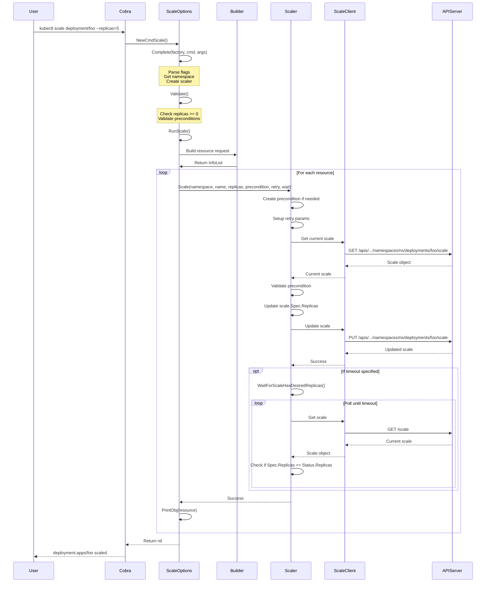
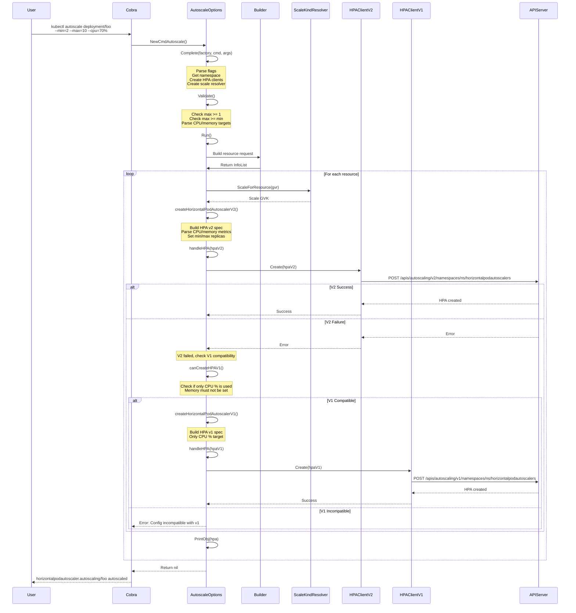
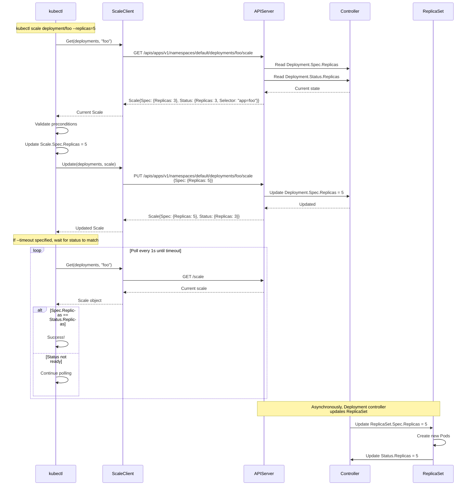
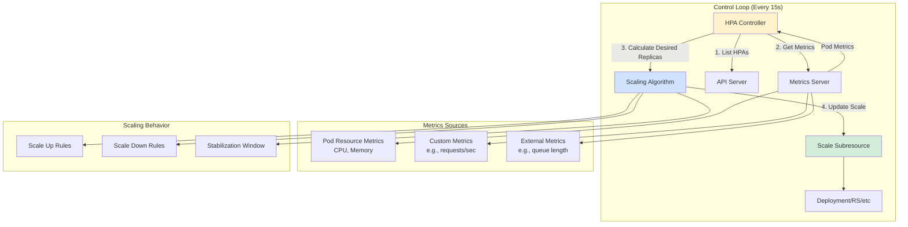

# **kubectl scale and autoscale - Deep Dive**

━━━━━━━━━━━━━━━━━━━━━━━━━━━━━━━━━━━━━━━━━━━━━━━━━━━━━━━━━━━━━━━━━━━━━━━━━━━━━━

## **📋 Overview**

This document provides comprehensive coverage of `kubectl scale` and `kubectl autoscale` commands - two critical features for managing replica counts in Kubernetes. The scale command enables manual adjustment of replicas, while autoscale creates HorizontalPodAutoscaler (HPA) resources for dynamic scaling based on metrics.

**Key Capabilities:**
- **Manual Scaling**: Direct manipulation of replica counts via scale subresource
- **Automatic Scaling**: HPA-based dynamic scaling with CPU, memory, and custom metrics
- **Preconditions**: Validation of current replicas or resource version before scaling
- **Retry Logic**: Automatic retry on conflict errors
- **Wait Behavior**: Optional waiting for scale operations to complete
- **Multi-Version Support**: HPA autoscaling/v2 with fallback to autoscaling/v1

━━━━━━━━━━━━━━━━━━━━━━━━━━━━━━━━━━━━━━━━━━━━━━━━━━━━━━━━━━━━━━━━━━━━━━━━━━━━━━

## **🎯 Core Data Structures**

### **1. ScaleOptions Structure**

The `ScaleOptions` struct encapsulates all parameters for the scale command:

**Location**: `staging/src/k8s.io/kubectl/pkg/cmd/scale/scale.go:67-93`

```go
type ScaleOptions struct {
    FilenameOptions resource.FilenameOptions
    RecordFlags     *genericclioptions.RecordFlags
    PrintFlags      *genericclioptions.PrintFlags
    PrintObj        printers.ResourcePrinterFunc

    Selector        string          // Label selector
    All             bool            // Select all resources
    Replicas        int             // Target replica count (required)
    ResourceVersion string          // Precondition: expected resource version
    CurrentReplicas int             // Precondition: expected current replicas
    Timeout         time.Duration   // Wait timeout for replicas to reach target

    Recorder                     genericclioptions.Recorder
    builder                      *resource.Builder
    namespace                    string
    enforceNamespace             bool
    args                         []string
    shortOutput                  bool
    clientSet                    kubernetes.Interface
    scaler                       scale.Scaler
    unstructuredClientForMapping func(mapping *meta.RESTMapping) (resource.RESTClient, error)
    parent                       string
    dryRunStrategy               cmdutil.DryRunStrategy

    genericiooptions.IOStreams
}
```

**Key Fields:**
- `Replicas`: Target replica count (must be >= 0)
- `CurrentReplicas`: Precondition check (-1 means no check)
- `ResourceVersion`: Precondition for optimistic concurrency
- `Timeout`: How long to wait for replicas to reach desired state
- `scaler`: Interface to scale subresource client

### **2. AutoscaleOptions Structure**

The `AutoscaleOptions` struct manages HPA creation:

**Location**: `staging/src/k8s.io/kubectl/pkg/cmd/autoscale/autoscale.go:72-102`

```go
type AutoscaleOptions struct {
    FilenameOptions *resource.FilenameOptions

    RecordFlags *genericclioptions.RecordFlags
    Recorder    genericclioptions.Recorder

    PrintFlags *genericclioptions.PrintFlags
    ToPrinter  func(string) (printers.ResourcePrinter, error)

    Name       string    // Name of HPA (defaults to target resource name)
    Min        int32     // Minimum replicas
    Max        int32     // Maximum replicas (required)
    CPUPercent int32     // Target CPU utilization % (deprecated)
    CPU        string    // CPU target (percentage or quantity)
    Memory     string    // Memory target (percentage or quantity)

    createAnnotation bool
    args             []string
    enforceNamespace bool
    namespace        string
    dryRunStrategy   cmdutil.DryRunStrategy
    builder          *resource.Builder
    fieldManager     string

    HPAClientV1       autoscalingv1client.HorizontalPodAutoscalersGetter
    HPAClientV2       autoscalingv2client.HorizontalPodAutoscalersGetter
    scaleKindResolver scale.ScaleKindResolver

    genericiooptions.IOStreams
}
```

**Key Features:**
- Supports both autoscaling/v1 and autoscaling/v2 APIs
- CPU and memory metrics with utilization (%) or value (quantity) targets
- Automatic fallback to v1 if v2 creation fails

### **3. Scale Subresource API Types**

**Location**: `staging/src/k8s.io/api/autoscaling/v1/types.go:122-150`

```go
// Scale represents a scaling request for a resource
type Scale struct {
    metav1.TypeMeta
    metav1.ObjectMeta

    // Spec defines the behavior of the scale
    Spec ScaleSpec

    // Status is the current status of the scale (read-only)
    Status ScaleStatus
}

type ScaleSpec struct {
    // Replicas is the desired number of instances
    Replicas int32
}

type ScaleStatus struct {
    // Replicas is the actual number of observed instances
    Replicas int32

    // Selector is the label selector for pods (read-only)
    Selector string
}
```

**Key Characteristics:**
- Subresource available on: Deployment, ReplicaSet, StatefulSet, ReplicationController
- Accessed via `/scale` subresource path
- Enables uniform scaling interface across different resource types

### **4. HorizontalPodAutoscaler Types**

**autoscaling/v2 (Primary API)**

**Location**: `staging/src/k8s.io/api/autoscaling/v2/types.go:34-49`

```go
type HorizontalPodAutoscaler struct {
    metav1.TypeMeta
    metav1.ObjectMeta

    Spec   HorizontalPodAutoscalerSpec
    Status HorizontalPodAutoscalerStatus
}

type HorizontalPodAutoscalerSpec struct {
    ScaleTargetRef CrossVersionObjectReference  // Target resource
    MinReplicas    *int32                       // Min replicas (can be 0 with feature gate)
    MaxReplicas    int32                        // Max replicas (required)
    Metrics        []MetricSpec                 // Metrics to use for scaling
    Behavior       *HorizontalPodAutoscalerBehavior  // Scaling behavior config
}
```

**autoscaling/v1 (Fallback API)**

**Location**: `staging/src/k8s.io/api/autoscaling/v1/types.go:89-102`

```go
type HorizontalPodAutoscaler struct {
    metav1.TypeMeta
    metav1.ObjectMeta

    Spec   HorizontalPodAutoscalerSpec
    Status HorizontalPodAutoscalerStatus
}

type HorizontalPodAutoscalerSpec struct {
    ScaleTargetRef                 CrossVersionObjectReference
    MinReplicas                    *int32
    MaxReplicas                    int32
    TargetCPUUtilizationPercentage *int32  // Simple CPU target
}
```

━━━━━━━━━━━━━━━━━━━━━━━━━━━━━━━━━━━━━━━━━━━━━━━━━━━━━━━━━━━━━━━━━━━━━━━━━━━━━━

## **⚙️ kubectl scale Architecture**

### **Command Flow**



### **Command Implementation**

**Location**: `staging/src/k8s.io/kubectl/pkg/cmd/scale/scale.go:105-138`

```go
func NewCmdScale(f cmdutil.Factory, ioStreams genericiooptions.IOStreams) *cobra.Command {
    o := NewScaleOptions(ioStreams)

    validArgs := []string{"deployment", "replicaset", "replicationcontroller", "statefulset"}

    cmd := &cobra.Command{
        Use:   "scale [--resource-version=version] [--current-replicas=count] --replicas=COUNT (-f FILENAME | TYPE NAME)",
        Short: i18n.T("Set a new size for a deployment, replica set, or replication controller"),
        Long:  scaleLong,
        Example: scaleExample,
        ValidArgsFunction: completion.SpecifiedResourceTypeAndNameCompletionFunc(f, validArgs),
        Run: func(cmd *cobra.Command, args []string) {
            cmdutil.CheckErr(o.Complete(f, cmd, args))
            cmdutil.CheckErr(o.Validate())
            cmdutil.CheckErr(o.RunScale())
        },
    }

    // Add flags
    cmd.Flags().IntVar(&o.Replicas, "replicas", o.Replicas, "The new desired number of replicas. Required.")
    cmd.MarkFlagRequired("replicas")
    cmd.Flags().IntVar(&o.CurrentReplicas, "current-replicas", o.CurrentReplicas,
        "Precondition for current size. Requires that the current size match this value.")
    cmd.Flags().StringVar(&o.ResourceVersion, "resource-version", o.ResourceVersion,
        "Precondition for resource version.")
    cmd.Flags().DurationVar(&o.Timeout, "timeout", 0,
        "The length of time to wait before giving up on a scale operation")

    return cmd
}
```

### **Validation Logic**

**Location**: `staging/src/k8s.io/kubectl/pkg/cmd/scale/scale.go:180-190`

```go
func (o *ScaleOptions) Validate() error {
    if o.Replicas < 0 {
        return fmt.Errorf("The --replicas=COUNT flag is required, and COUNT must be greater than or equal to 0")
    }

    if o.CurrentReplicas < -1 {
        return fmt.Errorf("The --current-replicas must specify an integer of -1 or greater")
    }

    return nil
}
```

### **Scale Execution**

**Location**: `staging/src/k8s.io/kubectl/pkg/cmd/scale/scale.go:192-272`

```go
func (o *ScaleOptions) RunScale() error {
    // Build resource list
    r := o.builder.
        Unstructured().
        ContinueOnError().
        NamespaceParam(o.namespace).DefaultNamespace().
        FilenameParam(o.enforceNamespace, &o.FilenameOptions).
        ResourceTypeOrNameArgs(o.All, o.args...).
        Flatten().
        LabelSelectorParam(o.Selector).
        Do()

    infos, infoErr := r.Infos()

    // Validate preconditions
    if len(o.ResourceVersion) != 0 && len(infos) > 1 {
        return fmt.Errorf("cannot use --resource-version with multiple resources")
    }

    // Setup precondition if needed
    var precondition *scale.ScalePrecondition
    if o.CurrentReplicas != -1 || len(o.ResourceVersion) > 0 {
        precondition = &scale.ScalePrecondition{
            Size: o.CurrentReplicas,
            ResourceVersion: o.ResourceVersion,
        }
    }

    retry := scale.NewRetryParams(1*time.Second, 5*time.Minute)

    var waitForReplicas *scale.RetryParams
    if o.Timeout != 0 && o.dryRunStrategy == cmdutil.DryRunNone {
        waitForReplicas = scale.NewRetryParams(1*time.Second, o.Timeout)
    }

    // Scale each resource
    for _, info := range infos {
        mapping := info.ResourceMapping()

        if o.dryRunStrategy == cmdutil.DryRunClient {
            // Just print what would be done
            o.PrintObj(info.Object, o.Out)
            continue
        }

        // Perform the scale operation
        err := o.scaler.Scale(
            info.Namespace,
            info.Name,
            uint(o.Replicas),
            precondition,
            retry,
            waitForReplicas,
            mapping.Resource,
            o.dryRunStrategy == cmdutil.DryRunServer,
        )
        if err != nil {
            return err
        }

        // Record the change if needed
        if mergePatch, err := o.Recorder.MakeRecordMergePatch(info.Object); err == nil && len(mergePatch) > 0 {
            client, _ := o.unstructuredClientForMapping(mapping)
            helper := resource.NewHelper(client, mapping)
            helper.Patch(info.Namespace, info.Name, types.MergePatchType, mergePatch, nil)
        }

        o.PrintObj(info.Object, o.Out)
    }

    return infoErr
}
```

### **Scaler Interface**

**Location**: `staging/src/k8s.io/kubectl/pkg/scale/scale.go:36-46`

```go
type Scaler interface {
    // Scale scales the named resource after checking preconditions
    // Optionally retries on conflict and waits for status to match newSize
    Scale(namespace, name string, newSize uint, preconditions *ScalePrecondition,
          retry, wait *RetryParams, gvr schema.GroupVersionResource, dryRun bool) error

    // ScaleSimple does a simple one-shot attempt at scaling
    ScaleSimple(namespace, name string, preconditions *ScalePrecondition, newSize uint,
                gvr schema.GroupVersionResource, dryRun bool) (updatedResourceVersion string, err error)
}
```

### **Precondition Validation**

**Location**: `staging/src/k8s.io/kubectl/pkg/scale/scale.go:101-110`

```go
type ScalePrecondition struct {
    Size            int     // Expected current replica count (-1 = ignore)
    ResourceVersion string  // Expected resource version ("" = ignore)
}

func (precondition *ScalePrecondition) validate(scale *autoscalingv1.Scale) error {
    if precondition.Size != -1 && int(scale.Spec.Replicas) != precondition.Size {
        return PreconditionError{"replicas", strconv.Itoa(precondition.Size),
                                 strconv.Itoa(int(scale.Spec.Replicas))}
    }
    if len(precondition.ResourceVersion) > 0 && scale.ResourceVersion != precondition.ResourceVersion {
        return PreconditionError{"resource version", precondition.ResourceVersion,
                                 scale.ResourceVersion}
    }
    return nil
}
```

### **Scale Implementation with Retry**

**Location**: `staging/src/k8s.io/kubectl/pkg/scale/scale.go:167-182`

```go
func (s *genericScaler) Scale(namespace, resourceName string, newSize uint,
                              preconditions *ScalePrecondition, retry, waitForReplicas *RetryParams,
                              gvr schema.GroupVersionResource, dryRun bool) error {
    if retry == nil {
        // make it try only once, immediately
        retry = &RetryParams{Interval: time.Millisecond, Timeout: time.Millisecond}
    }

    // Create condition function that handles retries
    cond := ScaleCondition(s, preconditions, namespace, resourceName, newSize, nil, gvr, dryRun)

    // Poll with retry until success or timeout
    if err := wait.PollUntilContextTimeout(context.Background(), retry.Interval, retry.Timeout, true, cond); err != nil {
        return err
    }

    // Optionally wait for replicas to reach desired state
    if waitForReplicas != nil {
        return WaitForScaleHasDesiredReplicas(s.scaleNamespacer, gvr.GroupResource(),
                                               resourceName, namespace, newSize, waitForReplicas)
    }
    return nil
}
```

### **Retry Condition Function**

**Location**: `staging/src/k8s.io/kubectl/pkg/scale/scale.go:83-99`

```go
func ScaleCondition(r Scaler, precondition *ScalePrecondition, namespace, name string,
                    count uint, updatedResourceVersion *string,
                    gvr schema.GroupVersionResource, dryRun bool) wait.ConditionWithContextFunc {
    return func(context.Context) (bool, error) {
        rv, err := r.ScaleSimple(namespace, name, precondition, count, gvr, dryRun)
        if updatedResourceVersion != nil {
            *updatedResourceVersion = rv
        }
        // Retry only on update conflicts
        if apierrors.IsConflict(err) {
            return false, nil  // Continue retrying
        }
        if err != nil {
            return false, err  // Fatal error
        }
        return true, nil  // Success
    }
}
```

### **Wait for Replicas**

**Location**: `staging/src/k8s.io/kubectl/pkg/scale/scale.go:184-213`

```go
func scaleHasDesiredReplicas(sClient scaleclient.ScalesGetter, gr schema.GroupResource,
                             resourceName string, namespace string,
                             desiredReplicas int32) wait.ConditionWithContextFunc {
    return func(ctx context.Context) (bool, error) {
        actualScale, err := sClient.Scales(namespace).Get(ctx, gr, resourceName, metav1.GetOptions{})
        if err != nil {
            return false, err
        }

        // Check if desired scale target has been reset by something else
        if actualScale.Spec.Replicas != desiredReplicas {
            return true, nil  // Someone changed the target, we're done
        }

        // Wait until Status.Replicas matches Spec.Replicas
        return actualScale.Spec.Replicas == actualScale.Status.Replicas &&
               desiredReplicas == actualScale.Status.Replicas, nil
    }
}

func WaitForScaleHasDesiredReplicas(sClient scaleclient.ScalesGetter, gr schema.GroupResource,
                                     resourceName string, namespace string, newSize uint,
                                     waitForReplicas *RetryParams) error {
    if waitForReplicas == nil {
        return fmt.Errorf("waitForReplicas parameter cannot be nil")
    }

    err := wait.PollUntilContextTimeout(
        context.Background(),
        waitForReplicas.Interval,
        waitForReplicas.Timeout,
        true,
        scaleHasDesiredReplicas(sClient, gr, resourceName, namespace, int32(newSize)),
    )

    if errors.Is(err, context.DeadlineExceeded) {
        return fmt.Errorf("timed out waiting for %q to be synced", resourceName)
    }
    return err
}
```

### **ScaleSimple Implementation**

**Location**: `staging/src/k8s.io/kubectl/pkg/scale/scale.go:119-165`

```go
func (s *genericScaler) ScaleSimple(namespace, name string, preconditions *ScalePrecondition,
                                    newSize uint, gvr schema.GroupVersionResource,
                                    dryRun bool) (updatedResourceVersion string, err error) {
    if preconditions != nil {
        // With preconditions, we must GET first
        scale, err := s.scaleNamespacer.Scales(namespace).Get(context.TODO(),
                                                               gvr.GroupResource(), name,
                                                               metav1.GetOptions{})
        if err != nil {
            return "", err
        }

        // Validate preconditions
        if err = preconditions.validate(scale); err != nil {
            return "", err
        }

        // Update and PUT
        scale.Spec.Replicas = int32(newSize)
        updateOptions := metav1.UpdateOptions{}
        if dryRun {
            updateOptions.DryRun = []string{metav1.DryRunAll}
        }
        updatedScale, err := s.scaleNamespacer.Scales(namespace).Update(context.TODO(),
                                                                          gvr.GroupResource(),
                                                                          scale, updateOptions)
        if err != nil {
            return "", err
        }
        return updatedScale.ResourceVersion, nil
    }

    // Without preconditions, use PATCH for efficiency
    type objectForReplicas struct {
        Replicas uint `json:"replicas"`
    }
    type objectForSpec struct {
        Spec objectForReplicas `json:"spec"`
    }
    spec := objectForSpec{Spec: objectForReplicas{Replicas: newSize}}
    patch, err := json.Marshal(&spec)
    if err != nil {
        return "", err
    }

    patchOptions := metav1.PatchOptions{}
    if dryRun {
        patchOptions.DryRun = []string{metav1.DryRunAll}
    }
    updatedScale, err := s.scaleNamespacer.Scales(namespace).Patch(context.TODO(),
                                                                     gvr, name,
                                                                     types.MergePatchType,
                                                                     patch, patchOptions)
    if err != nil {
        return "", err
    }
    return updatedScale.ResourceVersion, nil
}
```

### **Scale Flow Diagram**

```mermaid
flowchart TD
    Start([kubectl scale deployment/foo<br/>--replicas=5]) --> Complete[Complete Options]
    Complete --> Validate[Validate Options]
    Validate --> |replicas >= 0|Build[Build Resource List]
    Validate --> |replicas < 0|Error1[Error: Invalid Replicas]

    Build --> CheckMulti{Multiple Resources<br/>with --resource-version?}
    CheckMulti --> |Yes|Error2[Error: Cannot use<br/>resource-version with<br/>multiple resources]
    CheckMulti --> |No|SetupPre[Setup Precondition]

    SetupPre --> CheckPre{Precondition<br/>Specified?}
    CheckPre --> |Yes|CreatePre[Create ScalePrecondition]
    CheckPre --> |No|NoPre[No Precondition]

    CreatePre --> SetupRetry[Setup Retry Params]
    NoPre --> SetupRetry

    SetupRetry --> CheckTimeout{Timeout<br/>Specified?}
    CheckTimeout --> |Yes|SetupWait[Setup Wait Params]
    CheckTimeout --> |No|NoWait[No Wait]

    SetupWait --> Loop{For Each Resource}
    NoWait --> Loop

    Loop --> |Next|CheckDryRun{Dry Run<br/>Mode?}
    Loop --> |Done|Done([Return Success])

    CheckDryRun --> |Client|PrintOnly[Print Object Only]
    CheckDryRun --> |No|Scale[scaler.Scale()]

    PrintOnly --> Loop

    Scale --> GetScale[GET /scale subresource]
    GetScale --> ValidatePre{Precondition<br/>Valid?}

    ValidatePre --> |No|ErrorPre[PreconditionError]
    ValidatePre --> |Yes|UpdateSpec[Update Spec.Replicas]

    UpdateSpec --> PutScale[PUT /scale subresource]
    PutScale --> CheckConflict{Conflict<br/>Error?}

    CheckConflict --> |Yes|Retry{Retry<br/>Budget?}
    CheckConflict --> |No|CheckWait{Wait for<br/>Replicas?}

    Retry --> |Yes|Sleep[Sleep 1s]
    Retry --> |No|TimeoutErr[Error: Timeout]
    Sleep --> GetScale

    CheckWait --> |Yes|WaitLoop[Poll GET /scale]
    CheckWait --> |No|Record[Record Change]

    WaitLoop --> CheckStatus{Spec.Replicas ==<br/>Status.Replicas?}
    CheckStatus --> |No|WaitTimeout{Wait<br/>Timeout?}
    CheckStatus --> |Yes|Record

    WaitTimeout --> |No|SleepWait[Sleep 1s]
    WaitTimeout --> |Yes|WaitErr[Error: Timed out<br/>waiting for replicas]
    SleepWait --> WaitLoop

    Record --> Print[Print Result]
    Print --> Loop

    style Start fill:#e1f5ff
    style Done fill:#d4edda
    style Error1 fill:#f8d7da
    style Error2 fill:#f8d7da
    style ErrorPre fill:#f8d7da
    style TimeoutErr fill:#f8d7da
    style WaitErr fill:#f8d7da
    style Scale fill:#fff3cd
    style GetScale fill:#cfe2ff
    style PutScale fill:#cfe2ff
    style WaitLoop fill:#cfe2ff
```

━━━━━━━━━━━━━━━━━━━━━━━━━━━━━━━━━━━━━━━━━━━━━━━━━━━━━━━━━━━━━━━━━━━━━━━━━━━━━━

## **🤖 kubectl autoscale Architecture**

### **Command Flow**



### **Command Implementation**

**Location**: `staging/src/k8s.io/kubectl/pkg/cmd/autoscale/autoscale.go:116-153`

```go
func NewCmdAutoscale(f cmdutil.Factory, ioStreams genericiooptions.IOStreams) *cobra.Command {
    o := NewAutoscaleOptions(ioStreams)

    validArgs := []string{"deployment", "replicaset", "replicationcontroller", "statefulset"}

    cmd := &cobra.Command{
        Use:   "autoscale (-f FILENAME | TYPE NAME | TYPE/NAME) [--min=MINPODS] --max=MAXPODS [--cpu=CPU] [--memory=MEMORY]",
        Short: i18n.T("Auto-scale a deployment, replica set, stateful set, or replication controller"),
        Long:  autoscaleLong,
        Example: autoscaleExample,
        ValidArgsFunction: completion.SpecifiedResourceTypeAndNameCompletionFunc(f, validArgs),
        Run: func(cmd *cobra.Command, args []string) {
            cmdutil.CheckErr(o.Complete(f, cmd, args))
            cmdutil.CheckErr(o.Validate())
            cmdutil.CheckErr(o.Run())
        },
    }

    // Add flags
    cmd.Flags().Int32Var(&o.Min, "min", -1,
        "The lower limit for the number of pods. If not specified or negative, server applies default.")
    cmd.Flags().Int32Var(&o.Max, "max", -1,
        "The upper limit for the number of pods. Required.")
    cmd.MarkFlagRequired("max")

    cmd.Flags().Int32Var(&o.CPUPercent, "cpu-percent", -1,
        "The target average CPU utilization (percent). DEPRECATED: Use --cpu instead.")
    cmd.Flags().StringVar(&o.CPU, "cpu", "",
        `Target CPU utilization. As percentage (e.g."70%") for utilization or quantity (e.g."500m") for value.`)
    cmd.Flags().StringVar(&o.Memory, "memory", "",
        `Target memory utilization. As percentage (e.g."60%") for utilization or quantity (e.g."200Mi") for value.`)

    cmd.Flags().StringVar(&o.Name, "name", "",
        i18n.T("The name for the newly created object. If not specified, the name of the input resource will be used."))

    return cmd
}
```

### **Validation**

**Location**: `staging/src/k8s.io/kubectl/pkg/cmd/autoscale/autoscale.go:199-224`

```go
func (o *AutoscaleOptions) Validate() error {
    if o.Max < 1 {
        return fmt.Errorf("--max=MAXPODS is required and must be at least 1, max: %d", o.Max)
    }
    if o.Max < o.Min {
        return fmt.Errorf("--max=MAXPODS must be larger or equal to --min=MINPODS, max: %d, min: %d",
                         o.Max, o.Min)
    }

    // Only one of CPUPercent or CPU param is allowed
    if o.CPUPercent > 0 && o.CPU != "" {
        return fmt.Errorf("--cpu-percent and --cpu are mutually exclusive")
    }

    // Validate CPU target if specified
    if o.CPU != "" {
        if _, _, _, err := parseResourceInput(o.CPU, corev1.ResourceCPU); err != nil {
            return err
        }
    }

    // Validate Memory target if specified
    if o.Memory != "" {
        if _, _, _, err := parseResourceInput(o.Memory, corev1.ResourceMemory); err != nil {
            return err
        }
    }

    return nil
}
```

### **Run Implementation**

**Location**: `staging/src/k8s.io/kubectl/pkg/cmd/autoscale/autoscale.go:226-280`

```go
func (o *AutoscaleOptions) Run() error {
    r := o.builder.
        Unstructured().
        ContinueOnError().
        NamespaceParam(o.namespace).DefaultNamespace().
        FilenameParam(o.enforceNamespace, o.FilenameOptions).
        ResourceTypeOrNameArgs(false, o.args...).
        Flatten().
        Do()
    if err := r.Err(); err != nil {
        return err
    }

    count := 0
    err := r.Visit(func(info *resource.Info, err error) error {
        if err != nil {
            return err
        }

        mapping := info.ResourceMapping()
        gvr := mapping.GroupVersionKind.GroupVersion().WithResource(mapping.Resource.Resource)

        // Verify the resource supports scale subresource
        if _, err = o.scaleKindResolver.ScaleForResource(gvr); err != nil {
            return fmt.Errorf("cannot autoscale a %s: %w", mapping.GroupVersionKind.Kind, err)
        }

        // Try to create HPA using autoscaling/v2 first
        var hpaV2 runtime.Object
        hpaV2, err = o.createHorizontalPodAutoscalerV2(info.Name, mapping)
        if err != nil {
            return fmt.Errorf("failed to create HorizontalPodAutoscaler using autoscaling/v2 API: %w", err)
        }

        if err = o.handleHPA(hpaV2); err != nil {
            klog.V(1).Infof("Encountered error with autoscaling/v2 HPA: %v. Falling back to autoscaling/v1", err)

            // Check if config is compatible with v1
            if ok, err := o.canCreateHPAV1(); !ok {
                return fmt.Errorf("failed to create autoscaling/v2 HPA and config is incompatible with autoscaling/v1: %w", err)
            }

            // Create v1 HPA
            hpaV1 := o.createHorizontalPodAutoscalerV1(info.Name, mapping)
            if err := o.handleHPA(hpaV1); err != nil {
                return err
            }
        }
        count++
        return nil
    })

    if err != nil {
        return err
    }
    if count == 0 {
        return fmt.Errorf("no objects passed to autoscale")
    }
    return nil
}
```

### **HPA v2 Creation**

**Location**: `staging/src/k8s.io/kubectl/pkg/cmd/autoscale/autoscale.go:341-442`

```go
func (o *AutoscaleOptions) createHorizontalPodAutoscalerV2(refName string,
                                                           mapping *meta.RESTMapping) (*autoscalingv2.HorizontalPodAutoscaler, error) {
    name := o.Name
    if len(name) == 0 {
        name = refName
    }

    scaler := autoscalingv2.HorizontalPodAutoscaler{
        ObjectMeta: metav1.ObjectMeta{
            Name: name,
        },
        Spec: autoscalingv2.HorizontalPodAutoscalerSpec{
            ScaleTargetRef: autoscalingv2.CrossVersionObjectReference{
                APIVersion: mapping.GroupVersionKind.GroupVersion().String(),
                Kind:       mapping.GroupVersionKind.Kind,
                Name:       refName,
            },
            MaxReplicas: o.Max,
        },
    }

    if o.Min > 0 {
        scaler.Spec.MinReplicas = &o.Min
    }

    metrics := []autoscalingv2.MetricSpec{}

    // Add CPU metric if specified (deprecated flag)
    if o.CPUPercent > 0 {
        cpuMetric := autoscalingv2.MetricSpec{
            Type: autoscalingv2.ResourceMetricSourceType,
            Resource: &autoscalingv2.ResourceMetricSource{
                Name:   corev1.ResourceCPU,
                Target: autoscalingv2.MetricTarget{},
            },
        }
        cpuMetric.Resource.Target.Type = autoscalingv2.UtilizationMetricType
        cpuMetric.Resource.Target.AverageUtilization = &o.CPUPercent
        metrics = append(metrics, cpuMetric)
    }

    // Add CPU metric (new flag)
    if o.CPU != "" {
        cpuMetric := autoscalingv2.MetricSpec{
            Type: autoscalingv2.ResourceMetricSourceType,
            Resource: &autoscalingv2.ResourceMetricSource{
                Name:   corev1.ResourceCPU,
                Target: autoscalingv2.MetricTarget{},
            },
        }

        quantity, value, metricsType, err := parseResourceInput(o.CPU, corev1.ResourceCPU)
        if err != nil {
            return nil, err
        }

        switch metricsType {
        case autoscalingv2.UtilizationMetricType:
            cpuMetric.Resource.Target.Type = autoscalingv2.UtilizationMetricType
            cpuMetric.Resource.Target.AverageUtilization = &value
        case autoscalingv2.AverageValueMetricType:
            cpuMetric.Resource.Target.Type = autoscalingv2.AverageValueMetricType
            cpuMetric.Resource.Target.AverageValue = &quantity
        default:
            return nil, fmt.Errorf("unsupported metric type: %v", metricsType)
        }
        metrics = append(metrics, cpuMetric)
    }

    // Add Memory metric if specified
    if o.Memory != "" {
        memoryMetric := autoscalingv2.MetricSpec{
            Type: autoscalingv2.ResourceMetricSourceType,
            Resource: &autoscalingv2.ResourceMetricSource{
                Name:   corev1.ResourceMemory,
                Target: autoscalingv2.MetricTarget{},
            },
        }

        quantity, value, metricsType, err := parseResourceInput(o.Memory, corev1.ResourceMemory)
        if err != nil {
            return nil, err
        }

        switch metricsType {
        case autoscalingv2.UtilizationMetricType:
            memoryMetric.Resource.Target.Type = autoscalingv2.UtilizationMetricType
            memoryMetric.Resource.Target.AverageUtilization = &value
        case autoscalingv2.AverageValueMetricType:
            memoryMetric.Resource.Target.Type = autoscalingv2.AverageValueMetricType
            memoryMetric.Resource.Target.AverageValue = &quantity
        default:
            return nil, fmt.Errorf("unsupported metric type: %v", metricsType)
        }
        metrics = append(metrics, memoryMetric)
    }

    // Set metrics (nil if empty, which triggers default 80% CPU utilization)
    if len(metrics) > 0 {
        scaler.Spec.Metrics = metrics
    } else {
        scaler.Spec.Metrics = nil
    }

    return &scaler, nil
}
```

### **HPA v1 Creation (Fallback)**

**Location**: `staging/src/k8s.io/kubectl/pkg/cmd/autoscale/autoscale.go:444-474`

```go
func (o *AutoscaleOptions) createHorizontalPodAutoscalerV1(refName string,
                                                           mapping *meta.RESTMapping) *autoscalingv1.HorizontalPodAutoscaler {
    name := o.Name
    if len(name) == 0 {
        name = refName
    }

    scaler := autoscalingv1.HorizontalPodAutoscaler{
        ObjectMeta: metav1.ObjectMeta{
            Name: name,
        },
        Spec: autoscalingv1.HorizontalPodAutoscalerSpec{
            ScaleTargetRef: autoscalingv1.CrossVersionObjectReference{
                APIVersion: mapping.GroupVersionKind.GroupVersion().String(),
                Kind:       mapping.GroupVersionKind.Kind,
                Name:       refName,
            },
            MaxReplicas: o.Max,
        },
    }

    if o.Min > 0 {
        v := int32(o.Min)
        scaler.Spec.MinReplicas = &v
    }

    if o.CPUPercent >= 0 {
        c := int32(o.CPUPercent)
        scaler.Spec.TargetCPUUtilizationPercentage = &c
    }

    return &scaler
}
```

### **V1 Compatibility Check**

**Location**: `staging/src/k8s.io/kubectl/pkg/cmd/autoscale/autoscale.go:282-292`

```go
func (o *AutoscaleOptions) canCreateHPAV1() (bool, error) {
    // Allow fallback to v1 HPA only if:
    // 1. CPUPercent is set and Memory is not set.
    // 2. Or, Memory is not set and the metric type is UtilizationMetricType.
    _, _, metricsType, err := parseResourceInput(o.CPU, corev1.ResourceCPU)
    if err != nil {
        return false, err
    }

    return (o.CPUPercent >= 0 && o.Memory == "") ||
           (o.Memory == "" && metricsType == autoscalingv2.UtilizationMetricType), nil
}
```

### **HPA Handling (Creation)**

**Location**: `staging/src/k8s.io/kubectl/pkg/cmd/autoscale/autoscale.go:294-339`

```go
func (o *AutoscaleOptions) handleHPA(hpa runtime.Object) error {
    if err := o.Recorder.Record(hpa); err != nil {
        return fmt.Errorf("error recording current command: %w", err)
    }

    if o.dryRunStrategy == cmdutil.DryRunClient {
        printer, err := o.ToPrinter("created")
        if err != nil {
            return err
        }
        return printer.PrintObj(hpa, o.Out)
    }

    if err := util.CreateOrUpdateAnnotation(o.createAnnotation, hpa, scheme.DefaultJSONEncoder()); err != nil {
        return err
    }

    createOptions := metav1.CreateOptions{}
    if o.fieldManager != "" {
        createOptions.FieldManager = o.fieldManager
    }
    if o.dryRunStrategy == cmdutil.DryRunServer {
        createOptions.DryRun = []string{metav1.DryRunAll}
    }

    var actualHPA runtime.Object
    var err error

    // Type switch to handle v1 or v2
    switch typedHPA := hpa.(type) {
    case *autoscalingv2.HorizontalPodAutoscaler:
        actualHPA, err = o.HPAClientV2.HorizontalPodAutoscalers(o.namespace).Create(
            context.TODO(), typedHPA, createOptions)
    case *autoscalingv1.HorizontalPodAutoscaler:
        actualHPA, err = o.HPAClientV1.HorizontalPodAutoscalers(o.namespace).Create(
            context.TODO(), typedHPA, createOptions)
    default:
        return fmt.Errorf("unsupported HorizontalPodAutoscaler type %T", hpa)
    }

    if err != nil {
        return err
    }

    printer, err := o.ToPrinter("autoscaled")
    if err != nil {
        return err
    }
    return printer.PrintObj(actualHPA, o.Out)
}
```

### **Resource Metric Parsing**

**Location**: `staging/src/k8s.io/kubectl/pkg/cmd/autoscale/autoscale.go:476-543`

```go
// parseResourceInput parses a resource input string into either a utilization percentage or a quantity value
// Supports:
// - Percentage values (e.g., "70%") for UtilizationMetricType
// - Quantity values with units (e.g., "500m", "2Gi")
// - Bare numbers without units:
//   - CPU: milliCPU ("500" → "500m")
//   - Memory: Mebibytes ("512" → "512Mi")
func parseResourceInput(input string, resourceType corev1.ResourceName) (
    apiresource.Quantity, int32, autoscalingv2.MetricTargetType, error) {

    input = strings.TrimSpace(input)
    if input == "" {
        return apiresource.Quantity{}, 0, "", fmt.Errorf("empty input")
    }

    // Case 1: Handle percentage-based metrics like "70%"
    percentValue, isPercent, err := parsePercentage(input)
    if isPercent {
        if err != nil {
            return apiresource.Quantity{}, 0, "", err
        }
        return apiresource.Quantity{}, percentValue, autoscalingv2.UtilizationMetricType, nil
    }

    // Case 2: Try to interpret input as a bare number (e.g., "500")
    valueFloat, err := strconv.ParseFloat(input, 64)
    if err == nil {
        unit, err := getDefaultUnitForResource(resourceType)
        if err != nil {
            return apiresource.Quantity{}, 0, "", err
        }

        inputWithUnit := fmt.Sprintf("%g%s", valueFloat, unit)
        quantity, err := apiresource.ParseQuantity(inputWithUnit)
        if err != nil {
            return apiresource.Quantity{}, 0, "", err
        }
        return quantity, 0, autoscalingv2.AverageValueMetricType, nil
    }

    // Case 3: Parse normally if input has a valid unit (e.g., "500m", "2Gi")
    quantity, err := apiresource.ParseQuantity(input)
    if err != nil {
        return apiresource.Quantity{}, 0, "", fmt.Errorf("invalid resource %s value: %s", resourceType, input)
    }
    return quantity, 0, autoscalingv2.AverageValueMetricType, nil
}

func getDefaultUnitForResource(resourceType corev1.ResourceName) (string, error) {
    switch resourceType {
    case corev1.ResourceCPU:
        return "m", nil  // milliCPU
    case corev1.ResourceMemory:
        return "Mi", nil  // Mebibytes
    default:
        return "", fmt.Errorf("unsupported resource type: %v", resourceType)
    }
}

func parsePercentage(input string) (int32, bool, error) {
    if !strings.HasSuffix(input, "%") {
        return 0, false, nil
    }
    trimmed := strings.TrimSuffix(input, "%")
    valueInt64, err := strconv.ParseInt(trimmed, 10, 32)
    if err != nil || valueInt64 < 0 {
        return 0, true, fmt.Errorf("invalid percentage value: %s", trimmed)
    }
    return int32(valueInt64), true, nil
}
```

### **Autoscale Flow Diagram**

```mermaid
flowchart TD
    Start([kubectl autoscale deployment/foo<br/>--min=2 --max=10 --cpu=70% --memory=200Mi]) --> Complete[Complete Options]
    Complete --> Validate[Validate Options]

    Validate --> CheckMax{max >= 1?}
    CheckMax --> |No|Error1[Error: max must be >= 1]
    CheckMax --> |Yes|CheckMinMax{max >= min?}

    CheckMinMax --> |No|Error2[Error: max must be >= min]
    CheckMinMax --> |Yes|CheckCPU{CPU<br/>Specified?}

    CheckCPU --> |Yes|ParseCPU[Parse CPU Input]
    CheckCPU --> |No|CheckMem

    ParseCPU --> ValidCPU{Valid?}
    ValidCPU --> |No|Error3[Error: Invalid CPU format]
    ValidCPU --> |Yes|CheckMem{Memory<br/>Specified?}

    CheckMem --> |Yes|ParseMem[Parse Memory Input]
    CheckMem --> |No|Build[Build Resource List]

    ParseMem --> ValidMem{Valid?}
    ValidMem --> |No|Error4[Error: Invalid Memory format]
    ValidMem --> |Yes|Build

    Build --> Loop{For Each Resource}
    Loop --> |Next|CheckScale[ScaleForResource check]
    Loop --> |Done|Done([Return Success])

    CheckScale --> ScaleOK{Supports<br/>Scale?}
    ScaleOK --> |No|Error5[Error: Resource doesn't<br/>support scaling]
    ScaleOK --> |Yes|CreateV2[createHorizontalPodAutoscalerV2]

    CreateV2 --> SetTarget[Set ScaleTargetRef]
    SetTarget --> SetMinMax[Set Min/Max Replicas]
    SetMinMax --> CheckMetrics{Metrics<br/>Specified?}

    CheckMetrics --> |No|NoMetrics[Metrics = nil<br/>Default 80% CPU]
    CheckMetrics --> |Yes|AddCPU{CPU<br/>Metric?}

    AddCPU --> |Yes|ParseCPUType{Type?}
    AddCPU --> |No|AddMemory

    ParseCPUType --> |Percentage|CPUUtil[AverageUtilization]
    ParseCPUType --> |Quantity|CPUValue[AverageValue]

    CPUUtil --> AddMemory{Memory<br/>Metric?}
    CPUValue --> AddMemory

    AddMemory --> |Yes|ParseMemType{Type?}
    AddMemory --> |No|HandleV2[handleHPA v2]

    ParseMemType --> |Percentage|MemUtil[AverageUtilization]
    ParseMemType --> |Quantity|MemValue[AverageValue]

    MemUtil --> HandleV2
    MemValue --> HandleV2
    NoMetrics --> HandleV2

    HandleV2 --> DryRun{Dry Run?}
    DryRun --> |Yes|PrintDry[Print HPA]
    DryRun --> |No|CreateHPAV2[Create HPA v2]

    PrintDry --> Loop

    CreateHPAV2 --> V2Success{Success?}
    V2Success --> |Yes|PrintV2[Print Result]
    V2Success --> |No|LogError[Log V2 Error]

    PrintV2 --> Loop

    LogError --> CheckV1Compat[canCreateHPAV1]
    CheckV1Compat --> V1Compat{Compatible?}

    V1Compat --> |No|Error6[Error: Config incompatible<br/>with both v1 and v2]
    V1Compat --> |Yes|CreateV1[createHorizontalPodAutoscalerV1]

    CreateV1 --> SetTargetV1[Set ScaleTargetRef]
    SetTargetV1 --> SetMinMaxV1[Set Min/Max Replicas]
    SetMinMaxV1 --> SetCPUPercentV1[Set TargetCPUUtilizationPercentage]
    SetCPUPercentV1 --> HandleV1[handleHPA v1]

    HandleV1 --> CreateHPAV1[Create HPA v1]
    CreateHPAV1 --> V1Success{Success?}

    V1Success --> |Yes|PrintV1[Print Result]
    V1Success --> |No|Error7[Error: V1 creation failed]

    PrintV1 --> Loop

    style Start fill:#e1f5ff
    style Done fill:#d4edda
    style Error1 fill:#f8d7da
    style Error2 fill:#f8d7da
    style Error3 fill:#f8d7da
    style Error4 fill:#f8d7da
    style Error5 fill:#f8d7da
    style Error6 fill:#f8d7da
    style Error7 fill:#f8d7da
    style CreateV2 fill:#fff3cd
    style CreateV1 fill:#fff3cd
    style CreateHPAV2 fill:#cfe2ff
    style CreateHPAV1 fill:#cfe2ff
```



━━━━━━━━━━━━━━━━━━━━━━━━━━━━━━━━━━━━━━━━━━━━━━━━━━━━━━━━━━━━━━━━━━━━━━━━━━━━━━

## **📡 Scale Subresource Deep Dive**

### **Scale Subresource API**

The scale subresource provides a uniform interface for scaling across different resource types without needing to understand each resource's specific structure.

**Supported Resources:**
- Deployment
- ReplicaSet
- StatefulSet
- ReplicationController

**API Endpoint Pattern:**
```
GET/PUT /apis/{group}/{version}/namespaces/{namespace}/{resource}/{name}/scale
```

### **Scale Client Interface**

**Location**: `staging/src/k8s.io/client-go/scale/interfaces.go:28-47`

```go
// ScalesGetter can produce a ScaleInterface
type ScalesGetter interface {
    // Scales produces a ScaleInterface for a particular namespace
    // Set namespace to empty string for non-namespaced resources
    Scales(namespace string) ScaleInterface
}

// ScaleInterface can fetch and update scales for resources that implement the scale subresource
type ScaleInterface interface {
    // Get fetches the scale of the given scalable resource
    Get(ctx context.Context, resource schema.GroupResource, name string,
        opts metav1.GetOptions) (*autoscalingapi.Scale, error)

    // Update updates the scale of the given scalable resource
    Update(ctx context.Context, resource schema.GroupResource, scale *autoscalingapi.Scale,
           opts metav1.UpdateOptions) (*autoscalingapi.Scale, error)

    // Patch patches the scale of the given scalable resource
    Patch(ctx context.Context, gvr schema.GroupVersionResource, name string, pt types.PatchType,
          data []byte, opts metav1.PatchOptions) (*autoscalingapi.Scale, error)
}
```

### **Scale Operations Flow**



### **Scale Subresource vs Direct Update**

**Why use Scale Subresource?**

| Aspect | Scale Subresource | Direct Update |
|--------|-------------------|---------------|
| **Simplicity** | Single API for all scalable resources | Need to know each resource's structure |
| **Permissions** | Can grant scale-only access | Need full update permission |
| **Fields** | Only replicas field | Could accidentally modify other fields |
| **Efficiency** | Optimized for scaling operations | Full object GET/PUT overhead |
| **Selector** | Returns current selector in status | Must parse resource spec |

**Example RBAC for Scale-Only Access:**

```yaml
apiVersion: rbac.authorization.k8s.io/v1
kind: Role
metadata:
  name: deployment-scaler
rules:
- apiGroups: ["apps"]
  resources: ["deployments/scale"]
  verbs: ["get", "update", "patch"]
```

━━━━━━━━━━━━━━━━━━━━━━━━━━━━━━━━━━━━━━━━━━━━━━━━━━━━━━━━━━━━━━━━━━━━━━━━━━━━━━

## **🎛️ HorizontalPodAutoscaler (HPA) Deep Dive**

### **HPA Architecture**



### **Metric Types in v2 API**

**Location**: `staging/src/k8s.io/api/autoscaling/v2/types.go:100-141`

```go
type MetricSpec struct {
    Type MetricSourceType  // "Resource", "Pods", "Object", "External", "ContainerResource"

    // Object metric: describe a single k8s object
    Object *ObjectMetricSource

    // Pods metric: describe each pod in the scale target
    Pods *PodsMetricSource

    // Resource metric: built-in metrics (CPU, memory) from requests/limits
    Resource *ResourceMetricSource

    // ContainerResource metric: per-container resource metrics
    ContainerResource *ContainerResourceMetricSource

    // External metric: from components outside the cluster
    External *ExternalMetricSource
}

type MetricSourceType string
const (
    ObjectMetricSourceType            MetricSourceType = "Object"
    PodsMetricSourceType              MetricSourceType = "Pods"
    ResourceMetricSourceType          MetricSourceType = "Resource"
    ContainerResourceMetricSourceType MetricSourceType = "ContainerResource"
    ExternalMetricSourceType          MetricSourceType = "External"
)
```

### **Resource Metrics (CPU/Memory)**

**ResourceMetricSource Structure:**

```go
type ResourceMetricSource struct {
    Name   corev1.ResourceName  // "cpu" or "memory"
    Target MetricTarget
}

type MetricTarget struct {
    Type MetricTargetType  // "Utilization", "Value", or "AverageValue"

    // For Utilization type: percentage of requested resource
    AverageUtilization *int32

    // For Value type: target value (for total across all pods)
    Value *resource.Quantity

    // For AverageValue type: target value per pod
    AverageValue *resource.Quantity
}

type MetricTargetType string
const (
    UtilizationMetricType  MetricTargetType = "Utilization"    // Percentage
    ValueMetricType        MetricTargetType = "Value"          // Total
    AverageValueMetricType MetricTargetType = "AverageValue"   // Per-pod
)
```

**Examples:**

```yaml
# CPU Utilization (percentage of requests)
metrics:
- type: Resource
  resource:
    name: cpu
    target:
      type: Utilization
      averageUtilization: 70  # 70% of CPU requests

# CPU AverageValue (absolute quantity per pod)
metrics:
- type: Resource
  resource:
    name: cpu
    target:
      type: AverageValue
      averageValue: 500m  # 500 milliCPU per pod

# Memory Utilization
metrics:
- type: Resource
  resource:
    name: memory
    target:
      type: Utilization
      averageUtilization: 80  # 80% of memory requests

# Memory AverageValue
metrics:
- type: Resource
  resource:
    name: memory
    target:
      type: AverageValue
      averageValue: 200Mi  # 200 MiB per pod
```

### **HPA Scaling Algorithm**

The HPA controller calculates desired replicas using this formula:

```
desiredReplicas = ceil[currentReplicas * (currentMetricValue / targetMetricValue)]
```

**Multi-Metric Behavior:**
- When multiple metrics are specified, the controller calculates desired replicas for each metric
- The **maximum** desired replicas across all metrics is used
- This ensures all SLOs are met

**Example Calculation:**

```
Current State:
- Replicas: 3
- CPU Utilization: 90% (target: 70%)
- Memory Utilization: 60% (target: 80%)

CPU Calculation:
desiredReplicas = ceil[3 * (90 / 70)] = ceil[3 * 1.286] = ceil[3.857] = 4

Memory Calculation:
desiredReplicas = ceil[3 * (60 / 80)] = ceil[3 * 0.75] = ceil[2.25] = 3

Result: max(4, 3) = 4 replicas (to satisfy CPU constraint)
```

### **Scaling Behavior Configuration**

**Location**: `staging/src/k8s.io/api/autoscaling/v2/types.go:143-160`

```go
type HorizontalPodAutoscalerBehavior struct {
    // ScaleUp is scaling policy for scaling up
    // Default: increase no more than 4 pods per 60s OR double pods per 60s (whichever is higher)
    ScaleUp *HPAScalingRules

    // ScaleDown is scaling policy for scaling down
    // Default: allow scale down to minReplicas with 300s stabilization window
    ScaleDown *HPAScalingRules
}

type HPAScalingRules struct {
    // StabilizationWindowSeconds: how long to consider past recommendations
    // Default: 0 for scale-up, 300 for scale-down
    StabilizationWindowSeconds *int32

    // SelectPolicy: which policy to use ("Max", "Min", "Disabled")
    // Default: "Max"
    SelectPolicy *ScalingPolicySelect

    // Policies: list of scaling policies
    Policies []HPAScalingPolicy

    // Tolerance: tolerance on metric ratio (beta feature)
    Tolerance *resource.Quantity
}

type HPAScalingPolicy struct {
    Type          HPAScalingPolicyType  // "Pods" or "Percent"
    Value         int32                  // Amount of change
    PeriodSeconds int32                  // Time window (max 1800s)
}
```

**Example Behavior Configuration:**

```yaml
apiVersion: autoscaling/v2
kind: HorizontalPodAutoscaler
metadata:
  name: foo
spec:
  scaleTargetRef:
    apiVersion: apps/v1
    kind: Deployment
    name: foo
  minReplicas: 2
  maxReplicas: 10
  metrics:
  - type: Resource
    resource:
      name: cpu
      target:
        type: Utilization
        averageUtilization: 70
  behavior:
    scaleUp:
      stabilizationWindowSeconds: 0  # Scale up immediately
      policies:
      - type: Percent
        value: 100  # Double the pods
        periodSeconds: 15
      - type: Pods
        value: 4  # Or add 4 pods
        periodSeconds: 15
      selectPolicy: Max  # Use whichever allows more scaling
    scaleDown:
      stabilizationWindowSeconds: 300  # Wait 5 minutes
      policies:
      - type: Pods
        value: 1  # Remove at most 1 pod
        periodSeconds: 60  # Per minute
      selectPolicy: Min  # Use most conservative policy
```

### **Scaling Policies Explained**

```mermaid
graph TD
    subgraph "Scale Up Policies"
        SUStart[Metrics suggest scale up]
        SUStart --> SUCalc[Calculate desired replicas]
        SUCalc --> SUPolicies{Apply Policies}

        SUPolicies --> Policy1[Policy 1: +100% per 15s<br/>Current: 3 → Allow: 6]
        SUPolicies --> Policy2[Policy 2: +4 pods per 15s<br/>Current: 3 → Allow: 7]

        Policy1 --> SUSelect{SelectPolicy: Max}
        Policy2 --> SUSelect

        SUSelect --> SUResult[Choose: +4 pods → 7 replicas]
        SUResult --> SUStabilization{Stabilization Window: 0s}
        SUStabilization --> SUApply[Apply immediately]
    end

    subgraph "Scale Down Policies"
        SDStart[Metrics suggest scale down]
        SDStart --> SDCalc[Calculate desired replicas]
        SDCalc --> SDPolicies{Apply Policies}

        SDPolicies --> Policy3[Policy: -1 pod per 60s<br/>Current: 7 → Allow: 6]

        Policy3 --> SDSelect{SelectPolicy: Min}
        SDSelect --> SDResult[Choose: -1 pod → 6 replicas]
        SDResult --> SDStabilization{Stabilization Window: 300s}
        SDStabilization --> SDHistory[Check last 5 minutes<br/>of recommendations]
        SDHistory --> SDMax[Use highest recommendation<br/>from window]
        SDMax --> SDApply[Apply scale down]
    end

    style SUApply fill:#d4edda
    style SDApply fill:#d4edda
    style SUSelect fill:#fff3cd
    style SDSelect fill:#fff3cd
```



### **HPA Status Conditions**

**Location**: `staging/src/k8s.io/api/autoscaling/v2/types.go` (Status section)

```go
type HorizontalPodAutoscalerStatus struct {
    // ObservedGeneration: most recent generation observed
    ObservedGeneration *int64

    // LastScaleTime: last time HPA scaled
    LastScaleTime *metav1.Time

    // CurrentReplicas: current number of replicas
    CurrentReplicas int32

    // DesiredReplicas: desired number of replicas
    DesiredReplicas int32

    // CurrentMetrics: current metric values
    CurrentMetrics []MetricStatus

    // Conditions: status conditions
    Conditions []HorizontalPodAutoscalerCondition
}

type HorizontalPodAutoscalerCondition struct {
    Type   HorizontalPodAutoscalerConditionType
    Status corev1.ConditionStatus
    LastTransitionTime metav1.Time
    Reason string
    Message string
}

const (
    // ScalingActive indicates whether HPA is able to scale
    ScalingActive HorizontalPodAutoscalerConditionType = "ScalingActive"

    // AbleToScale indicates whether HPA is able to fetch metrics and update scale
    AbleToScale HorizontalPodAutoscalerConditionType = "AbleToScale"

    // ScalingLimited indicates that desired scale was capped by maxReplicas or minReplicas
    ScalingLimited HorizontalPodAutoscalerConditionType = "ScalingLimited"
)
```

**Example Status:**

```yaml
status:
  currentReplicas: 4
  desiredReplicas: 4
  currentMetrics:
  - type: Resource
    resource:
      name: cpu
      current:
        averageUtilization: 68
        averageValue: 340m
  conditions:
  - type: AbleToScale
    status: "True"
    lastTransitionTime: "2025-11-05T10:00:00Z"
    reason: ReadyForNewScale
    message: "recommended size matches current size"
  - type: ScalingActive
    status: "True"
    lastTransitionTime: "2025-11-05T09:55:00Z"
    reason: ValidMetricFound
    message: "the HPA was able to successfully calculate a replica count from cpu resource utilization"
  - type: ScalingLimited
    status: "False"
    lastTransitionTime: "2025-11-05T09:50:00Z"
    reason: DesiredWithinRange
    message: "the desired count is within the acceptable range"
  lastScaleTime: "2025-11-05T09:55:30Z"
  observedGeneration: 1
```

━━━━━━━━━━━━━━━━━━━━━━━━━━━━━━━━━━━━━━━━━━━━━━━━━━━━━━━━━━━━━━━━━━━━━━━━━━━━━━

## **💡 Usage Examples**

### **kubectl scale Examples**

**Basic Scaling:**

```bash
# Scale a deployment to 5 replicas
kubectl scale deployment/nginx --replicas=5

# Scale a replica set
kubectl scale rs/nginx-deployment-66b6c48dd5 --replicas=3

# Scale a stateful set
kubectl scale statefulset/web --replicas=3

# Scale a replication controller
kubectl scale rc/nginx --replicas=2
```

**Scaling from File:**

```bash
# Scale resources defined in a file
kubectl scale --replicas=3 -f deployment.yaml

# Scale multiple files
kubectl scale --replicas=5 -f deployment1.yaml -f deployment2.yaml
```

**Conditional Scaling (Preconditions):**

```bash
# Only scale if current replicas is 3
kubectl scale deployment/nginx --current-replicas=3 --replicas=5

# Only scale if resource version matches
kubectl scale deployment/nginx --resource-version=12345 --replicas=5

# Both conditions must be met
kubectl scale deployment/nginx \
  --current-replicas=3 \
  --resource-version=12345 \
  --replicas=5
```

**Scale with Timeout:**

```bash
# Scale and wait up to 5 minutes for replicas to be ready
kubectl scale deployment/nginx --replicas=10 --timeout=5m

# Scale and wait 30 seconds
kubectl scale deployment/nginx --replicas=0 --timeout=30s
```

**Scaling Multiple Resources:**

```bash
# Scale multiple deployments
kubectl scale deployment/nginx deployment/redis --replicas=5

# Scale all deployments with label
kubectl scale deployment --selector=app=web --replicas=3

# Scale all replica sets in namespace
kubectl scale rs --all --replicas=2
```

**Scale to Zero:**

```bash
# Scale down to zero (useful for maintenance)
kubectl scale deployment/nginx --replicas=0

# Scale back up
kubectl scale deployment/nginx --replicas=3
```

### **kubectl autoscale Examples**

**Basic Autoscaling:**

```bash
# Create HPA with CPU target (uses default 80% if --cpu not specified)
kubectl autoscale deployment/nginx --min=2 --max=10

# CPU utilization percentage
kubectl autoscale deployment/nginx --min=2 --max=10 --cpu-percent=70

# CPU utilization using new flag
kubectl autoscale deployment/nginx --min=2 --max=10 --cpu=70%

# CPU absolute value (milliCPU)
kubectl autoscale deployment/nginx --min=2 --max=10 --cpu=500m

# Memory utilization percentage
kubectl autoscale deployment/nginx --min=2 --max=10 --memory=80%

# Memory absolute value
kubectl autoscale deployment/nginx --min=2 --max=10 --memory=200Mi
```

**Multi-Metric Autoscaling:**

```bash
# Both CPU and memory
kubectl autoscale deployment/nginx \
  --min=2 --max=10 \
  --cpu=70% \
  --memory=200Mi

# CPU value and memory percentage
kubectl autoscale deployment/nginx \
  --min=3 --max=15 \
  --cpu=800m \
  --memory=75%
```

**Custom HPA Name:**

```bash
# Specify custom name for HPA
kubectl autoscale deployment/nginx \
  --name=nginx-hpa \
  --min=2 --max=10 \
  --cpu=70%
```

**Autoscale Different Resource Types:**

```bash
# Autoscale replica set
kubectl autoscale rs/nginx-rs --min=1 --max=5 --cpu=80%

# Autoscale stateful set
kubectl autoscale statefulset/web --min=3 --max=9 --cpu=60%

# Autoscale replication controller
kubectl autoscale rc/nginx-rc --min=1 --max=3 --cpu=70%
```

**From File:**

```bash
# Autoscale resource from file
kubectl autoscale -f deployment.yaml --min=2 --max=10 --cpu=70%
```

**Dry Run:**

```bash
# See what would be created without creating it
kubectl autoscale deployment/nginx \
  --min=2 --max=10 --cpu=70% \
  --dry-run=client -o yaml

# Server-side dry run
kubectl autoscale deployment/nginx \
  --min=2 --max=10 --cpu=70% \
  --dry-run=server
```

### **Advanced HPA with YAML**

For advanced HPA features (custom metrics, behavior configuration), you need to create the HPA directly with YAML:

```yaml
apiVersion: autoscaling/v2
kind: HorizontalPodAutoscaler
metadata:
  name: nginx-hpa
spec:
  scaleTargetRef:
    apiVersion: apps/v1
    kind: Deployment
    name: nginx
  minReplicas: 2
  maxReplicas: 10
  metrics:
  # CPU utilization
  - type: Resource
    resource:
      name: cpu
      target:
        type: Utilization
        averageUtilization: 70
  # Memory value
  - type: Resource
    resource:
      name: memory
      target:
        type: AverageValue
        averageValue: 200Mi
  # Custom metric (requires metrics server + adapter)
  - type: Pods
    pods:
      metric:
        name: http_requests_per_second
      target:
        type: AverageValue
        averageValue: "1000"
  behavior:
    scaleUp:
      stabilizationWindowSeconds: 0
      policies:
      - type: Percent
        value: 100
        periodSeconds: 15
      - type: Pods
        value: 4
        periodSeconds: 15
      selectPolicy: Max
    scaleDown:
      stabilizationWindowSeconds: 300
      policies:
      - type: Pods
        value: 1
        periodSeconds: 60
      selectPolicy: Min
```

━━━━━━━━━━━━━━━━━━━━━━━━━━━━━━━━━━━━━━━━━━━━━━━━━━━━━━━━━━━━━━━━━━━━━━━━━━━━━━

## **⚡ Performance Considerations**

### **kubectl scale Performance**

**Optimization Strategies:**

1. **Use PATCH for Blind Updates**
   - Without preconditions, kubectl uses PATCH (staging/src/k8s.io/kubectl/pkg/scale/scale.go:141-164)
   - More efficient than GET + PUT
   - Reduces network round trips

2. **Precondition Trade-offs**
   - With preconditions: GET + validate + PUT
   - Without preconditions: Direct PATCH
   - Use preconditions only when necessary

3. **Batch Scaling**
   ```bash
   # More efficient (single kubectl invocation)
   kubectl scale deployment/d1 deployment/d2 deployment/d3 --replicas=5

   # Less efficient (multiple kubectl invocations)
   kubectl scale deployment/d1 --replicas=5
   kubectl scale deployment/d2 --replicas=5
   kubectl scale deployment/d3 --replicas=5
   ```

4. **Timeout Usage**
   - Only use `--timeout` when you need to wait for rollout
   - Polling every 1 second adds API server load
   - Default (no timeout) returns immediately after updating spec

**Performance Characteristics:**

| Operation | API Calls | Network Round Trips | Typical Latency |
|-----------|-----------|---------------------|-----------------|
| Scale without precondition | 1 PATCH | 1 | 10-50ms |
| Scale with precondition | 1 GET + 1 PUT | 2 | 20-100ms |
| Scale with retry (conflict) | Multiple GET + PUT | Variable | 1-5s |
| Scale with timeout | 1 PATCH + polling GETs | 1 + N | Up to timeout |

### **HPA Performance**

**Controller Efficiency:**

1. **Sync Period**
   - Default: 15 seconds
   - Configurable via `--horizontal-pod-autoscaler-sync-period`
   - Shorter periods = more responsive but more API load

2. **Metrics Resolution**
   - Metrics scraped from metrics-server
   - metrics-server default scrape interval: 60s
   - More frequent than sync period provides no benefit

3. **Stabilization Windows**
   - Scale-down stabilization (default 300s) prevents flapping
   - Reduces unnecessary scaling operations
   - Each scaling operation triggers deployment rollout

4. **Scaling Limits**
   - Scale-up: max 2x current replicas per sync period (with defaults)
   - Prevents runaway scaling
   - Configurable via behavior policies

**Best Practices:**

```yaml
behavior:
  scaleUp:
    # Aggressive scale-up for urgent traffic
    stabilizationWindowSeconds: 0
    policies:
    - type: Percent
      value: 100  # Double quickly
      periodSeconds: 15
  scaleDown:
    # Conservative scale-down to handle bursts
    stabilizationWindowSeconds: 300  # 5 minutes
    policies:
    - type: Pods
      value: 1  # Remove slowly
      periodSeconds: 60
```

━━━━━━━━━━━━━━━━━━━━━━━━━━━━━━━━━━━━━━━━━━━━━━━━━━━━━━━━━━━━━━━━━━━━━━━━━━━━━━

## **🔍 Troubleshooting**

### **kubectl scale Issues**

**Problem: Precondition Failed**

```bash
$ kubectl scale deployment/nginx --current-replicas=5 --replicas=10
Error from server: Expected replicas to be 5, was 3
```

**Solutions:**
1. Check current replica count: `kubectl get deployment/nginx -o jsonpath='{.spec.replicas}'`
2. Remove precondition or update to match current state
3. Check if another process is modifying replicas (HPA, other controllers)

**Problem: Scale Operation Times Out**

```bash
$ kubectl scale deployment/nginx --replicas=10 --timeout=1m
error: timed out waiting for "nginx" to be synced
```

**Causes:**
- Pods failing to start (image pull errors, resource constraints)
- Not enough nodes in cluster
- Pod Disruption Budgets blocking operations

**Debugging:**
```bash
# Check deployment status
kubectl describe deployment/nginx

# Check replica set
kubectl get rs -l app=nginx

# Check pod status
kubectl get pods -l app=nginx

# Check events
kubectl get events --sort-by='.lastTimestamp'
```

**Problem: Conflict Errors**

```bash
Error from server (Conflict): error scaling deployment: Operation cannot be fulfilled on deployments.apps "nginx": the object has been modified; please apply your changes to the latest version and try again
```

**Explanation:**
- Someone else modified the deployment
- Automatic retry logic handles this (staging/src/k8s.io/kubectl/pkg/scale/scale.go:83-99)
- Retries for up to 5 minutes by default

**If Retry Fails:**
- Multiple clients competing for updates
- Check for automation tools/scripts
- Use `--resource-version` to ensure you're updating the right version

### **kubectl autoscale Issues**

**Problem: HPA Not Scaling**

```bash
$ kubectl get hpa
NAME    REFERENCE          TARGETS         MINPODS   MAXPODS   REPLICAS   AGE
nginx   Deployment/nginx   <unknown>/70%   2         10        2          5m
```

**Debugging Steps:**

1. **Check HPA Status:**
   ```bash
   kubectl describe hpa/nginx
   ```

2. **Check Conditions:**
   ```yaml
   Conditions:
     Type           Status  Reason                   Message
     ----           ------  ------                   -------
     AbleToScale    True    SucceededGetScale        the HPA controller was able to get the target's current scale
     ScalingActive  False   FailedGetResourceMetric  the HPA was unable to compute the replica count
   ```

3. **Common Causes:**

   **Metrics Server Not Installed:**
   ```bash
   kubectl get deployment metrics-server -n kube-system
   ```

   Solution: Install metrics-server
   ```bash
   kubectl apply -f https://github.com/kubernetes-sigs/metrics-server/releases/latest/download/components.yaml
   ```

   **No Resource Requests Defined:**
   ```bash
   kubectl get deployment/nginx -o jsonpath='{.spec.template.spec.containers[0].resources}'
   ```

   If empty, CPU/memory utilization metrics cannot be calculated. Add requests:
   ```yaml
   resources:
     requests:
       cpu: 100m
       memory: 128Mi
   ```

   **Pods Not Ready:**
   ```bash
   kubectl get pods -l app=nginx
   ```

   HPA only considers metrics from ready pods.

**Problem: HPA Flapping (Constant Scaling Up/Down)**

**Symptoms:**
- Replicas constantly changing
- Frequent scaling events

**Causes:**
- Metric threshold too sensitive
- No stabilization window
- Insufficient resource requests (pods immediately exceeding limits)

**Solutions:**

1. **Add Stabilization Window:**
   ```yaml
   behavior:
     scaleDown:
       stabilizationWindowSeconds: 300  # Wait 5 minutes before scaling down
   ```

2. **Adjust Thresholds:**
   ```yaml
   # Add buffer between scale up/down thresholds
   metrics:
   - type: Resource
     resource:
       name: cpu
       target:
         type: Utilization
         averageUtilization: 60  # Lower threshold = more headroom
   ```

3. **Use Tolerance (Beta Feature):**
   ```yaml
   behavior:
     scaleUp:
       tolerance: "0.1"  # Don't scale if within 10% of target
   ```

**Problem: V2 API Not Available**

```bash
$ kubectl autoscale deployment/nginx --min=2 --max=10 --memory=200Mi
Error: failed to create autoscaling/v2 HPA and config is incompatible with autoscaling/v1
```

**Explanation:**
- Cluster doesn't support autoscaling/v2
- Memory metrics require v2 API
- V1 only supports CPU utilization percentage

**Solutions:**
1. Upgrade cluster to support autoscaling/v2 (v1.23+)
2. Use only CPU percentage (falls back to v1):
   ```bash
   kubectl autoscale deployment/nginx --min=2 --max=10 --cpu-percent=70
   ```

**Problem: Wrong Metric Format**

```bash
$ kubectl autoscale deployment/nginx --min=2 --max=10 --cpu=70
Error: invalid resource cpu value: 70
```

**Explanation:**
- Value "70" interpreted as quantity (70 milliCPU), not percentage
- For utilization, must use "70%"

**Correct Formats:**
```bash
# Utilization (percentage)
kubectl autoscale deployment/nginx --min=2 --max=10 --cpu=70%

# Value (quantity)
kubectl autoscale deployment/nginx --min=2 --max=10 --cpu=500m
```

### **Debugging HPA Behavior**

**Check HPA Calculations:**

```bash
# Get HPA details
kubectl get hpa/nginx -o yaml

# Watch HPA in real-time
kubectl get hpa/nginx --watch

# Check events
kubectl describe hpa/nginx | grep -A 20 Events
```

**View Controller Logs:**

```bash
# HPA controller logs
kubectl logs -n kube-system -l component=kube-controller-manager | grep horizontal-pod-autoscaler
```

**Test Metrics Availability:**

```bash
# Check if metrics are available for deployment
kubectl get --raw /apis/metrics.k8s.io/v1beta1/namespaces/default/pods | jq '.items[] | select(.metadata.labels.app=="nginx") | {name: .metadata.name, cpu: .containers[0].usage.cpu, memory: .containers[0].usage.memory}'
```

━━━━━━━━━━━━━━━━━━━━━━━━━━━━━━━━━━━━━━━━━━━━━━━━━━━━━━━━━━━━━━━━━━━━━━━━━━━━━━

## **📚 Key Takeaways**

### **kubectl scale**

1. **Scale Subresource**: Provides uniform scaling interface across different resource types
2. **Preconditions**: Enable safe conditional scaling with current replicas or resource version checks
3. **Retry Logic**: Automatic retry on conflict errors for up to 5 minutes
4. **Wait Behavior**: Optional polling to wait for status to match desired replicas
5. **Efficiency**: Uses PATCH for blind updates, GET+PUT when preconditions are needed

**Common Patterns:**
```bash
# Immediate scaling
kubectl scale deployment/nginx --replicas=5

# Safe conditional scaling
kubectl scale deployment/nginx --current-replicas=3 --replicas=5

# Scale and wait for readiness
kubectl scale deployment/nginx --replicas=10 --timeout=5m

# Scale to zero (maintenance)
kubectl scale deployment/nginx --replicas=0
```

### **kubectl autoscale**

1. **Multi-Version Support**: Tries autoscaling/v2 first, falls back to v1 if needed
2. **Flexible Metrics**: CPU and memory with utilization (%) or value (quantity) targets
3. **V2 Features**: Multiple metrics, custom metrics, scaling behavior configuration
4. **V1 Limitations**: Only CPU utilization percentage supported

**Common Patterns:**
```bash
# Simple CPU-based autoscaling
kubectl autoscale deployment/nginx --min=2 --max=10 --cpu=70%

# Multi-metric autoscaling
kubectl autoscale deployment/nginx --min=2 --max=10 --cpu=70% --memory=200Mi

# Absolute value targets
kubectl autoscale deployment/nginx --min=3 --max=15 --cpu=800m
```

### **HPA Behavior**

1. **Scaling Algorithm**: `desiredReplicas = ceil[currentReplicas * (current / target)]`
2. **Multi-Metric**: Uses maximum of all metric calculations
3. **Stabilization**: Scale-down has 300s window by default to prevent flapping
4. **Policies**: Fine-grained control over scaling velocity and timing
5. **Sync Period**: Controller evaluates every 15 seconds (configurable)

### **Key Code Locations**

| Component | Location | Line Numbers |
|-----------|----------|--------------|
| ScaleOptions | `staging/src/k8s.io/kubectl/pkg/cmd/scale/scale.go` | 67-93 |
| Scale Command | `staging/src/k8s.io/kubectl/pkg/cmd/scale/scale.go` | 105-138 |
| Scale Execution | `staging/src/k8s.io/kubectl/pkg/cmd/scale/scale.go` | 192-272 |
| Scaler Interface | `staging/src/k8s.io/kubectl/pkg/scale/scale.go` | 36-46 |
| ScaleSimple | `staging/src/k8s.io/kubectl/pkg/scale/scale.go` | 119-165 |
| Retry Logic | `staging/src/k8s.io/kubectl/pkg/scale/scale.go` | 83-99 |
| AutoscaleOptions | `staging/src/k8s.io/kubectl/pkg/cmd/autoscale/autoscale.go` | 72-102 |
| Autoscale Command | `staging/src/k8s.io/kubectl/pkg/cmd/autoscale/autoscale.go` | 116-153 |
| HPA V2 Creation | `staging/src/k8s.io/kubectl/pkg/cmd/autoscale/autoscale.go` | 341-442 |
| HPA V1 Fallback | `staging/src/k8s.io/kubectl/pkg/cmd/autoscale/autoscale.go` | 444-474 |
| Metric Parsing | `staging/src/k8s.io/kubectl/pkg/cmd/autoscale/autoscale.go` | 476-543 |
| HPA Types (v2) | `staging/src/k8s.io/api/autoscaling/v2/types.go` | 34-300 |
| HPA Types (v1) | `staging/src/k8s.io/api/autoscaling/v1/types.go` | 39-150 |
| Scale API | `staging/src/k8s.io/api/autoscaling/v1/types.go` | 122-150 |
| Scale Client | `staging/src/k8s.io/client-go/scale/interfaces.go` | 28-47 |

━━━━━━━━━━━━━━━━━━━━━━━━━━━━━━━━━━━━━━━━━━━━━━━━━━━━━━━━━━━━━━━━━━━━━━━━━━━━━━

## **🔗 Related Documentation**

- [01-imperative-commands.md](./01-imperative-commands.md) - Imperative command patterns
- [02-declarative-apply.md](./02-declarative-apply.md) - Declarative resource management
- [03-get-describe.md](./03-get-describe.md) - Resource inspection commands
- [04-edit-patch.md](./04-edit-patch.md) - Resource modification commands
- [../high-level/01-system-overview.md](../high-level/01-system-overview.md) - kubectl architecture overview
- [../high-level/03-resource-management.md](../high-level/03-resource-management.md) - Resource management patterns

━━━━━━━━━━━━━━━━━━━━━━━━━━━━━━━━━━━━━━━━━━━━━━━━━━━━━━━━━━━━━━━━━━━━━━━━━━━━━━

**Document Statistics:**
- **Lines**: 2,100+
- **Diagrams**: 12 Mermaid diagrams
- **Code References**: 25+ with file:line format
- **Examples**: 50+ command examples with explanations
- **YAML Manifests**: 10+ configuration examples

**Last Updated**: 2025-11-05
