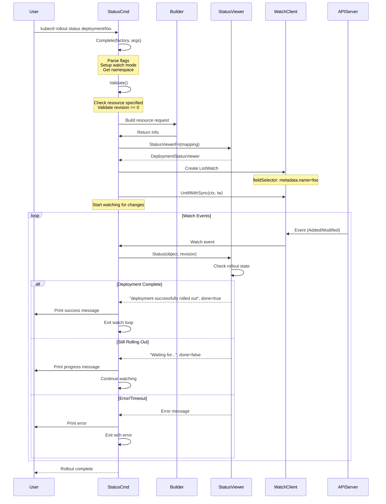
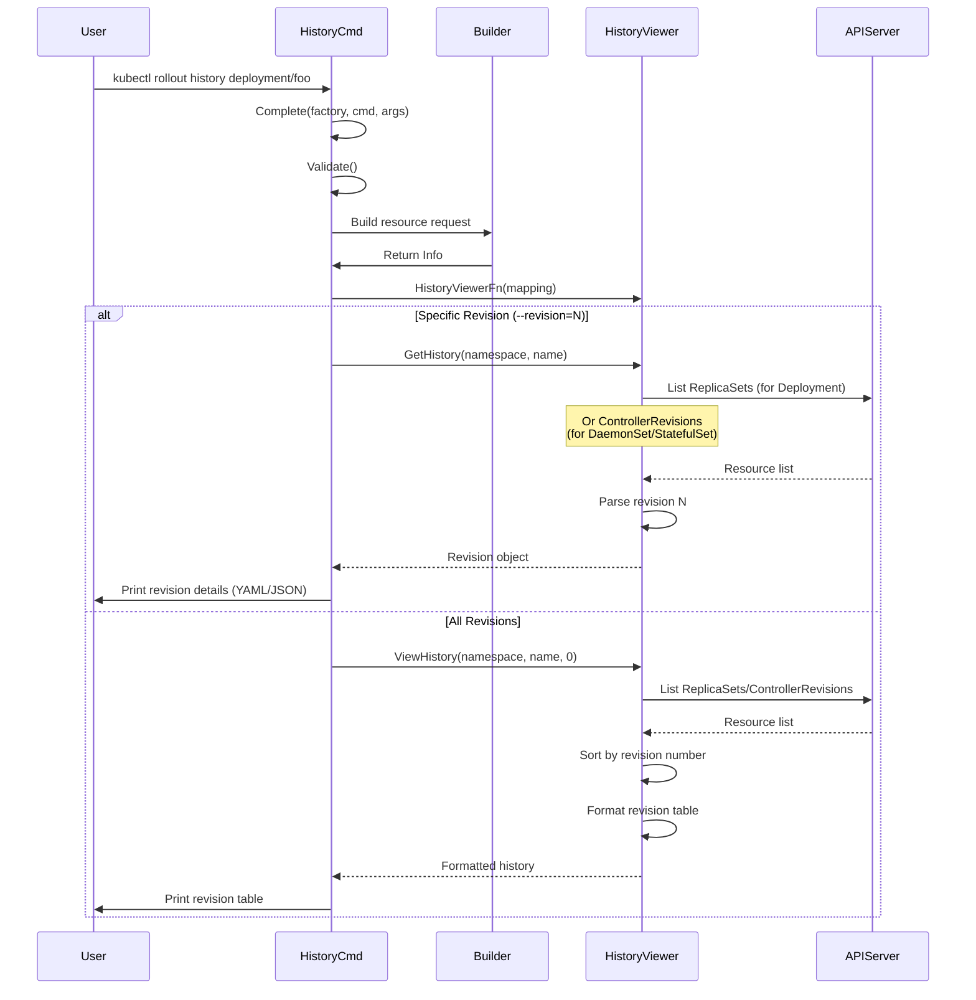
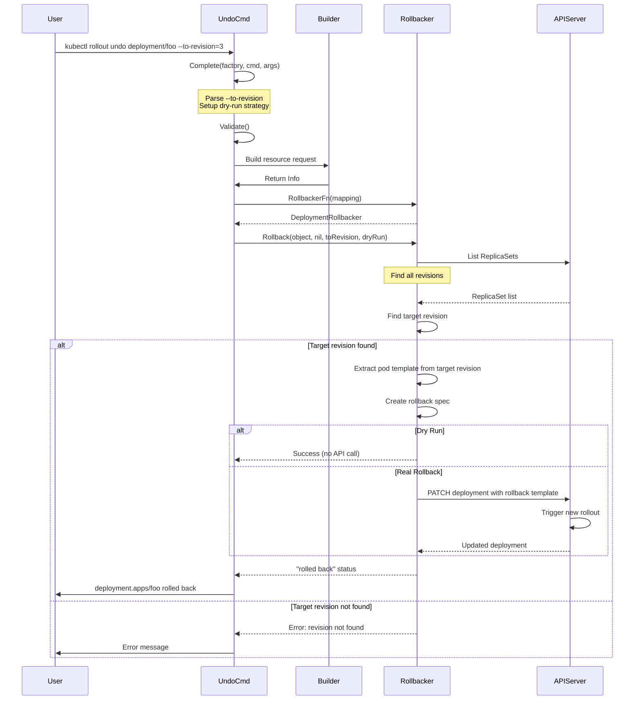
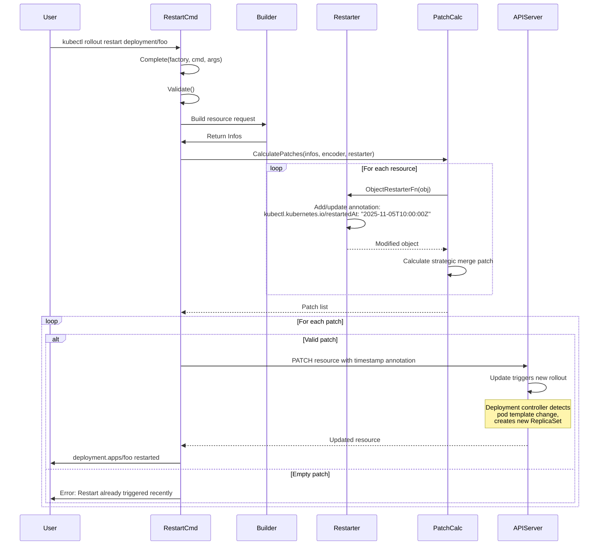
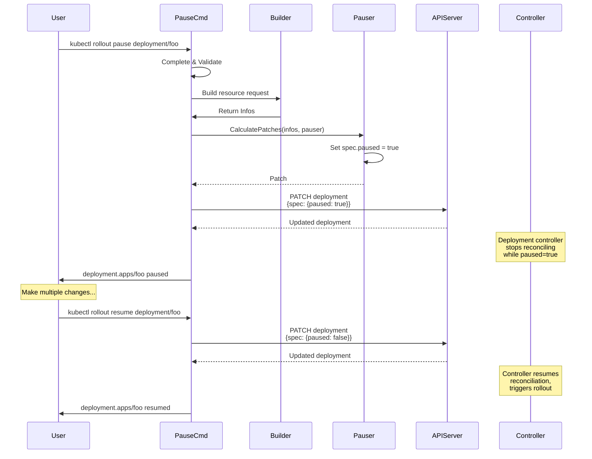

# **kubectl rollout - Deep Dive**

━━━━━━━━━━━━━━━━━━━━━━━━━━━━━━━━━━━━━━━━━━━━━━━━━━━━━━━━━━━━━━━━━━━━━━━━━━━━━━

## **📋 Overview**

This document provides comprehensive coverage of `kubectl rollout` commands - essential tools for managing application rollouts, tracking deployment history, and controlling update strategies in Kubernetes. The rollout commands enable zero-downtime updates, rollbacks, and fine-grained control over application lifecycle management.

**Key Capabilities:**
- **Status Monitoring**: Watch rollout progress with real-time updates
- **History Tracking**: View revision history and configuration changes
- **Rollback**: Revert to previous revisions safely
- **Rolling Restart**: Trigger pod recreation without changing configuration
- **Pause/Resume**: Control deployment reconciliation for staged updates
- **Multi-Resource Support**: Deployments, DaemonSets, StatefulSets

**Supported Resources:**
- Deployment (all subcommands)
- DaemonSet (status, history, undo, restart)
- StatefulSet (status, history, undo, restart)
- ReplicationController (deprecated, limited support)

━━━━━━━━━━━━━━━━━━━━━━━━━━━━━━━━━━━━━━━━━━━━━━━━━━━━━━━━━━━━━━━━━━━━━━━━━━━━━━

## **🎯 Command Structure**

### **Rollout Subcommands**

**Location**: `staging/src/k8s.io/kubectl/pkg/cmd/rollout/rollout.go:56-75`

```go
func NewCmdRollout(f cmdutil.Factory, streams genericiooptions.IOStreams) *cobra.Command {
    cmd := &cobra.Command{
        Use:   "rollout SUBCOMMAND",
        Short: i18n.T("Manage the rollout of a resource"),
        Long:  rolloutLong,
        Example: rolloutExample,
        Run:   cmdutil.DefaultSubCommandRun(streams.Out),
    }

    // Register all subcommands
    cmd.AddCommand(NewCmdRolloutHistory(f, streams))
    cmd.AddCommand(NewCmdRolloutPause(f, streams))
    cmd.AddCommand(NewCmdRolloutResume(f, streams))
    cmd.AddCommand(NewCmdRolloutUndo(f, streams))
    cmd.AddCommand(NewCmdRolloutStatus(f, streams))
    cmd.AddCommand(NewCmdRolloutRestart(f, streams))

    return cmd
}
```

### **Subcommand Overview**

| Subcommand | Purpose | Supported Resources | Watch Mode |
|-----------|---------|---------------------|------------|
| `status` | Monitor rollout progress | Deployment, DaemonSet, StatefulSet | Yes |
| `history` | View revision history | Deployment, DaemonSet, StatefulSet | No |
| `undo` | Rollback to previous revision | Deployment, DaemonSet, StatefulSet | No |
| `restart` | Trigger rolling restart | Deployment, DaemonSet, StatefulSet | No |
| `pause` | Pause deployment reconciliation | Deployment only | No |
| `resume` | Resume paused deployment | Deployment only | No |

━━━━━━━━━━━━━━━━━━━━━━━━━━━━━━━━━━━━━━━━━━━━━━━━━━━━━━━━━━━━━━━━━━━━━━━━━━━━━━

## **📊 kubectl rollout status**

### **Architecture Overview**

The `rollout status` command watches a resource's rollout progress in real-time, providing continuous feedback until the rollout completes or times out.



### **Data Structures**

**Location**: `staging/src/k8s.io/kubectl/pkg/cmd/rollout/rollout_status.go:63-82`

```go
type RolloutStatusOptions struct {
    PrintFlags *genericclioptions.PrintFlags

    Namespace        string
    EnforceNamespace bool
    BuilderArgs      []string
    LabelSelector    string

    Watch    bool          // Watch until completion (default: true)
    Revision int64         // Pin to specific revision (default: 0 = latest)
    Timeout  time.Duration // Watch timeout (default: 0 = no timeout)

    StatusViewerFn func(*meta.RESTMapping) (polymorphichelpers.StatusViewer, error)
    Builder        func() *resource.Builder
    DynamicClient  dynamic.Interface

    FilenameOptions *resource.FilenameOptions
    genericiooptions.IOStreams
}
```

### **Command Implementation**

**Location**: `staging/src/k8s.io/kubectl/pkg/cmd/rollout/rollout_status.go:95-123`

```go
func NewCmdRolloutStatus(f cmdutil.Factory, streams genericiooptions.IOStreams) *cobra.Command {
    o := NewRolloutStatusOptions(streams)

    validArgs := []string{"deployment", "daemonset", "statefulset"}

    cmd := &cobra.Command{
        Use:     "status (TYPE NAME | TYPE/NAME) [flags]",
        Short:   i18n.T("Show the status of the rollout"),
        Long:    statusLong,
        Example: statusExample,
        ValidArgsFunction: completion.SpecifiedResourceTypeAndNameNoRepeatCompletionFunc(f, validArgs),
        Run: func(cmd *cobra.Command, args []string) {
            cmdutil.CheckErr(o.Complete(f, args))
            cmdutil.CheckErr(o.Validate())
            cmdutil.CheckErr(o.Run())
        },
    }

    cmd.Flags().BoolVarP(&o.Watch, "watch", "w", o.Watch,
        "Watch the status of the rollout until it's done.")
    cmd.Flags().Int64Var(&o.Revision, "revision", o.Revision,
        "Pin to a specific revision for showing its status. Defaults to 0 (last revision).")
    cmd.Flags().DurationVar(&o.Timeout, "timeout", o.Timeout,
        "The length of time to wait before ending watch, zero means never.")
    cmdutil.AddLabelSelectorFlagVar(cmd, &o.LabelSelector)

    return cmd
}
```

### **Watch-Based Status Monitoring**

**Location**: `staging/src/k8s.io/kubectl/pkg/cmd/rollout/rollout_status.go:159-243`

```go
func (o *RolloutStatusOptions) Run() error {
    r := o.Builder().
        WithScheme(scheme.Scheme, scheme.Scheme.PrioritizedVersionsAllGroups()...).
        NamespaceParam(o.Namespace).DefaultNamespace().
        LabelSelectorParam(o.LabelSelector).
        FilenameParam(o.EnforceNamespace, o.FilenameOptions).
        ResourceTypeOrNameArgs(true, o.BuilderArgs...).
        ContinueOnError().
        Latest().
        Flatten().
        Do()

    err := r.Visit(func(info *resource.Info, _ error) error {
        mapping := info.ResourceMapping()
        statusViewer, err := o.StatusViewerFn(mapping)
        if err != nil {
            return err
        }

        // Create ListWatch with field selector
        fieldSelector := fields.OneTermEqualSelector("metadata.name", info.Name).String()
        lw := &cache.ListWatch{
            ListFunc: func(options metav1.ListOptions) (runtime.Object, error) {
                options.FieldSelector = fieldSelector
                return o.DynamicClient.Resource(info.Mapping.Resource).
                    Namespace(info.Namespace).List(context.TODO(), options)
            },
            WatchFunc: func(options metav1.ListOptions) (watch.Interface, error) {
                options.FieldSelector = fieldSelector
                return o.DynamicClient.Resource(info.Mapping.Resource).
                    Namespace(info.Namespace).Watch(context.TODO(), options)
            },
        }

        // Watch with optional timeout
        ctx, cancel := watchtools.ContextWithOptionalTimeout(context.Background(), o.Timeout)
        intr := interrupt.New(nil, cancel)

        return intr.Run(func() error {
            _, err = watchtools.UntilWithSync(ctx, lw, &unstructured.Unstructured{}, nil,
                func(e watch.Event) (bool, error) {
                    switch t := e.Type; t {
                    case watch.Added, watch.Modified:
                        // Get status from appropriate viewer
                        status, done, err := statusViewer.Status(e.Object.(runtime.Unstructured), o.Revision)
                        if err != nil {
                            return false, err
                        }
                        fmt.Fprintf(o.Out, "%s", status)

                        // Stop watching if done
                        if done {
                            return true, nil
                        }

                        // Continue if --watch=true
                        return !o.Watch, nil

                    case watch.Deleted:
                        return true, fmt.Errorf("object has been deleted")

                    default:
                        return true, fmt.Errorf("internal error: unexpected event %#v", e)
                    }
                })
            return err
        })
    })

    return err
}
```

### **Status Viewers (Polymorphic Helpers)**

**Location**: `staging/src/k8s.io/kubectl/pkg/polymorphichelpers/rollout_status.go:29-56`

```go
// StatusViewer provides an interface for resources that have rollout status
type StatusViewer interface {
    Status(obj runtime.Unstructured, revision int64) (string, bool, error)
}

func StatusViewerFor(kind schema.GroupKind) (StatusViewer, error) {
    switch kind {
    case appsv1.SchemeGroupVersion.WithKind("Deployment").GroupKind():
        return &DeploymentStatusViewer{}, nil
    case appsv1.SchemeGroupVersion.WithKind("DaemonSet").GroupKind():
        return &DaemonSetStatusViewer{}, nil
    case appsv1.SchemeGroupVersion.WithKind("StatefulSet").GroupKind():
        return &StatefulSetStatusViewer{}, nil
    }
    return nil, fmt.Errorf("no status viewer has been implemented for %v", kind)
}
```

### **Deployment Status Logic**

**Location**: `staging/src/k8s.io/kubectl/pkg/polymorphichelpers/rollout_status.go:58-92`

```go
func (s *DeploymentStatusViewer) Status(obj runtime.Unstructured, revision int64) (string, bool, error) {
    deployment := &appsv1.Deployment{}
    err := runtime.DefaultUnstructuredConverter.FromUnstructured(obj.UnstructuredContent(), deployment)
    if err != nil {
        return "", false, fmt.Errorf("failed to convert: %v", err)
    }

    // Check if specific revision is running
    if revision > 0 {
        deploymentRev, err := deploymentutil.Revision(deployment)
        if err != nil {
            return "", false, fmt.Errorf("cannot get the revision: %v", err)
        }
        if revision != deploymentRev {
            return "", false, fmt.Errorf("desired revision (%d) is different from running revision (%d)",
                revision, deploymentRev)
        }
    }

    // Check if deployment has observed the latest spec
    if deployment.Generation <= deployment.Status.ObservedGeneration {
        // Check for timeout condition
        cond := deploymentutil.GetDeploymentCondition(deployment.Status, appsv1.DeploymentProgressing)
        if cond != nil && cond.Reason == deploymentutil.TimedOutReason {
            return "", false, fmt.Errorf("deployment %q exceeded its progress deadline", deployment.Name)
        }

        // Check if all new replicas are updated
        if deployment.Spec.Replicas != nil &&
           deployment.Status.UpdatedReplicas < *deployment.Spec.Replicas {
            return fmt.Sprintf("Waiting for deployment %q rollout to finish: %d out of %d new replicas have been updated...\n",
                deployment.Name, deployment.Status.UpdatedReplicas, *deployment.Spec.Replicas), false, nil
        }

        // Check if old replicas are terminated
        if deployment.Status.Replicas > deployment.Status.UpdatedReplicas {
            return fmt.Sprintf("Waiting for deployment %q rollout to finish: %d old replicas are pending termination...\n",
                deployment.Name, deployment.Status.Replicas-deployment.Status.UpdatedReplicas), false, nil
        }

        // Check if new replicas are available
        if deployment.Status.AvailableReplicas < deployment.Status.UpdatedReplicas {
            return fmt.Sprintf("Waiting for deployment %q rollout to finish: %d of %d updated replicas are available...\n",
                deployment.Name, deployment.Status.AvailableReplicas, deployment.Status.UpdatedReplicas), false, nil
        }

        // Success!
        return fmt.Sprintf("deployment %q successfully rolled out\n", deployment.Name), true, nil
    }

    // Waiting for spec update to be observed
    return fmt.Sprintf("Waiting for deployment spec update to be observed...\n"), false, nil
}
```

### **DaemonSet Status Logic**

**Location**: `staging/src/k8s.io/kubectl/pkg/polymorphichelpers/rollout_status.go:94-117`

```go
func (s *DaemonSetStatusViewer) Status(obj runtime.Unstructured, revision int64) (string, bool, error) {
    daemon := &appsv1.DaemonSet{}
    err := runtime.DefaultUnstructuredConverter.FromUnstructured(obj.UnstructuredContent(), daemon)
    if err != nil {
        return "", false, fmt.Errorf("failed to convert: %v", err)
    }

    // Only RollingUpdate strategy supports status
    if daemon.Spec.UpdateStrategy.Type != appsv1.RollingUpdateDaemonSetStrategyType {
        return "", true, fmt.Errorf("rollout status is only available for %s strategy type",
            appsv1.RollingUpdateDaemonSetStrategyType)
    }

    if daemon.Generation <= daemon.Status.ObservedGeneration {
        // Check if all nodes have updated pods
        if daemon.Status.UpdatedNumberScheduled < daemon.Status.DesiredNumberScheduled {
            return fmt.Sprintf("Waiting for daemon set %q rollout to finish: %d out of %d new pods have been updated...\n",
                daemon.Name, daemon.Status.UpdatedNumberScheduled, daemon.Status.DesiredNumberScheduled), false, nil
        }

        // Check if updated pods are available
        if daemon.Status.NumberAvailable < daemon.Status.DesiredNumberScheduled {
            return fmt.Sprintf("Waiting for daemon set %q rollout to finish: %d of %d updated pods are available...\n",
                daemon.Name, daemon.Status.NumberAvailable, daemon.Status.DesiredNumberScheduled), false, nil
        }

        return fmt.Sprintf("daemon set %q successfully rolled out\n", daemon.Name), true, nil
    }

    return fmt.Sprintf("Waiting for daemon set spec update to be observed...\n"), false, nil
}
```

### **StatefulSet Status Logic**

**Location**: `staging/src/k8s.io/kubectl/pkg/polymorphichelpers/rollout_status.go:119-152`

```go
func (s *StatefulSetStatusViewer) Status(obj runtime.Unstructured, revision int64) (string, bool, error) {
    sts := &appsv1.StatefulSet{}
    err := runtime.DefaultUnstructuredConverter.FromUnstructured(obj.UnstructuredContent(), sts)
    if err != nil {
        return "", false, fmt.Errorf("failed to convert: %v", err)
    }

    // Only RollingUpdate strategy supports status
    if sts.Spec.UpdateStrategy.Type != appsv1.RollingUpdateStatefulSetStrategyType {
        return "", true, fmt.Errorf("rollout status is only available for %s strategy type",
            appsv1.RollingUpdateStatefulSetStrategyType)
    }

    // Check if spec update is observed
    if sts.Status.ObservedGeneration == 0 || sts.Generation > sts.Status.ObservedGeneration {
        return "Waiting for statefulset spec update to be observed...\n", false, nil
    }

    // Check if all pods are ready
    if sts.Spec.Replicas != nil && sts.Status.ReadyReplicas < *sts.Spec.Replicas {
        return fmt.Sprintf("Waiting for %d pods to be ready...\n",
            *sts.Spec.Replicas-sts.Status.ReadyReplicas), false, nil
    }

    // Handle partitioned rollout
    if sts.Spec.UpdateStrategy.Type == appsv1.RollingUpdateStatefulSetStrategyType &&
       sts.Spec.UpdateStrategy.RollingUpdate != nil {
        if sts.Spec.Replicas != nil && sts.Spec.UpdateStrategy.RollingUpdate.Partition != nil {
            targetReplicas := *sts.Spec.Replicas - *sts.Spec.UpdateStrategy.RollingUpdate.Partition
            if sts.Status.UpdatedReplicas < targetReplicas {
                return fmt.Sprintf("Waiting for partitioned roll out to finish: %d out of %d new pods have been updated...\n",
                    sts.Status.UpdatedReplicas, targetReplicas), false, nil
            }
        }
        return fmt.Sprintf("partitioned roll out complete: %d new pods have been updated...\n",
            sts.Status.UpdatedReplicas), true, nil
    }

    // Check if rolling update is complete
    if sts.Status.UpdateRevision != sts.Status.CurrentRevision {
        return fmt.Sprintf("waiting for statefulset rolling update to complete %d pods at revision %s...\n",
            sts.Status.UpdatedReplicas, sts.Status.UpdateRevision), false, nil
    }

    return fmt.Sprintf("statefulset rolling update complete %d pods at revision %s...\n",
        sts.Status.CurrentReplicas, sts.Status.CurrentRevision), true, nil
}
```

━━━━━━━━━━━━━━━━━━━━━━━━━━━━━━━━━━━━━━━━━━━━━━━━━━━━━━━━━━━━━━━━━━━━━━━━━━━━━━

## **📜 kubectl rollout history**

### **Architecture Overview**

The `rollout history` command retrieves and displays revision history for a resource, showing past configurations and change-cause annotations.



### **Data Structures**

**Location**: `staging/src/k8s.io/kubectl/pkg/cmd/rollout/rollout_history.go:49-67`

```go
type RolloutHistoryOptions struct {
    PrintFlags *genericclioptions.PrintFlags
    ToPrinter  func(string) (printers.ResourcePrinter, error)

    Revision int64  // Specific revision to view (0 = all revisions)

    Builder          func() *resource.Builder
    Resources        []string
    Namespace        string
    EnforceNamespace bool
    LabelSelector    string

    HistoryViewer    polymorphichelpers.HistoryViewerFunc
    RESTClientGetter genericclioptions.RESTClientGetter

    resource.FilenameOptions
    genericiooptions.IOStreams
}
```

### **Command Implementation**

**Location**: `staging/src/k8s.io/kubectl/pkg/cmd/rollout/rollout_history.go:77-106`

```go
func NewCmdRolloutHistory(f cmdutil.Factory, streams genericiooptions.IOStreams) *cobra.Command {
    o := NewRolloutHistoryOptions(streams)

    validArgs := []string{"deployment", "daemonset", "statefulset"}

    cmd := &cobra.Command{
        Use:     "history (TYPE NAME | TYPE/NAME) [flags]",
        Short:   i18n.T("View rollout history"),
        Long:    historyLong,
        Example: historyExample,
        ValidArgsFunction: completion.SpecifiedResourceTypeAndNameCompletionFunc(f, validArgs),
        Run: func(cmd *cobra.Command, args []string) {
            cmdutil.CheckErr(o.Complete(f, cmd, args))
            cmdutil.CheckErr(o.Validate())
            cmdutil.CheckErr(o.Run())
        },
    }

    cmd.Flags().Int64Var(&o.Revision, "revision", o.Revision,
        "See the details, including podTemplate of the revision specified")
    cmdutil.AddLabelSelectorFlagVar(cmd, &o.LabelSelector)
    cmdutil.AddFilenameOptionFlags(cmd, &o.FilenameOptions, "identifying the resource to get from a server.")
    o.PrintFlags.AddFlags(cmd)

    return cmd
}
```

### **History Retrieval**

**Location**: `staging/src/k8s.io/kubectl/pkg/cmd/rollout/rollout_history.go:141-231`

```go
func (o *RolloutHistoryOptions) Run() error {
    r := o.Builder().
        WithScheme(scheme.Scheme, scheme.Scheme.PrioritizedVersionsAllGroups()...).
        NamespaceParam(o.Namespace).DefaultNamespace().
        FilenameParam(o.EnforceNamespace, &o.FilenameOptions).
        LabelSelectorParam(o.LabelSelector).
        ResourceTypeOrNameArgs(true, o.Resources...).
        ContinueOnError().
        Latest().
        Flatten().
        Do()

    return r.Visit(func(info *resource.Info, err error) error {
        if err != nil {
            return err
        }

        mapping := info.ResourceMapping()
        historyViewer, err := o.HistoryViewer(o.RESTClientGetter, mapping)
        if err != nil {
            return err
        }

        if o.PrintFlags.OutputFlagSpecified() {
            // Output specific revision in machine-readable format
            historyInfo, err := historyViewer.GetHistory(info.Namespace, info.Name)
            if err != nil {
                return err
            }

            if o.Revision > 0 {
                revision, exists := historyInfo[o.Revision]
                if !exists {
                    return fmt.Errorf("unable to find the specified revision")
                }
                return printer.PrintObj(revision, o.Out)
            } else {
                // Print all revisions sorted
                sortedKeys := make([]int64, 0, len(historyInfo))
                for k := range historyInfo {
                    sortedKeys = append(sortedKeys, k)
                }
                sort.Slice(sortedKeys, func(i, j int) bool { return sortedKeys[i] < sortedKeys[j] })
                for _, k := range sortedKeys {
                    printer.PrintObj(historyInfo[k], o.Out)
                }
            }
        } else {
            // Human-readable format
            historyInfo, err := historyViewer.ViewHistory(info.Namespace, info.Name, o.Revision)
            if err != nil {
                return err
            }

            withRevision := ""
            if o.Revision > 0 {
                withRevision = fmt.Sprintf("with revision #%d", o.Revision)
            }

            printer, err := o.ToPrinter(fmt.Sprintf("%s\n%s", withRevision, historyInfo))
            if err != nil {
                return err
            }

            return printer.PrintObj(info.Object, o.Out)
        }

        return nil
    })
}
```

### **Revision Storage**

**For Deployments:**
- Revisions stored as ReplicaSets
- `deployment.kubernetes.io/revision` annotation contains revision number
- `kubernetes.io/change-cause` annotation records change reason

**For DaemonSets/StatefulSets:**
- Revisions stored as ControllerRevision objects
- Controller manages revision cleanup based on `revisionHistoryLimit`

━━━━━━━━━━━━━━━━━━━━━━━━━━━━━━━━━━━━━━━━━━━━━━━━━━━━━━━━━━━━━━━━━━━━━━━━━━━━━━

## **⏪ kubectl rollout undo**

### **Architecture Overview**

The `rollout undo` command performs a rollback to a previous revision by updating the resource's template to match the selected revision.



### **Data Structures**

**Location**: `staging/src/k8s.io/kubectl/pkg/cmd/rollout/rollout_undo.go:36-53`

```go
type UndoOptions struct {
    PrintFlags *genericclioptions.PrintFlags
    ToPrinter  func(string) (printers.ResourcePrinter, error)

    Builder          func() *resource.Builder
    ToRevision       int64                      // Target revision (0 = previous)
    DryRunStrategy   cmdutil.DryRunStrategy
    Resources        []string
    Namespace        string
    LabelSelector    string
    EnforceNamespace bool
    RESTClientGetter genericclioptions.RESTClientGetter

    resource.FilenameOptions
    genericiooptions.IOStreams
}
```

### **Command Implementation**

**Location**: `staging/src/k8s.io/kubectl/pkg/cmd/rollout/rollout_undo.go:79-106`

```go
func NewCmdRolloutUndo(f cmdutil.Factory, streams genericiooptions.IOStreams) *cobra.Command {
    o := NewRolloutUndoOptions(streams)

    validArgs := []string{"deployment", "daemonset", "statefulset"}

    cmd := &cobra.Command{
        Use:     "undo (TYPE NAME | TYPE/NAME) [flags]",
        Short:   i18n.T("Undo a previous rollout"),
        Long:    undoLong,
        Example: undoExample,
        ValidArgsFunction: completion.SpecifiedResourceTypeAndNameCompletionFunc(f, validArgs),
        Run: func(cmd *cobra.Command, args []string) {
            cmdutil.CheckErr(o.Complete(f, cmd, args))
            cmdutil.CheckErr(o.Validate())
            cmdutil.CheckErr(o.RunUndo())
        },
    }

    cmd.Flags().Int64Var(&o.ToRevision, "to-revision", o.ToRevision,
        "The revision to rollback to. Default to 0 (last revision).")
    cmdutil.AddFilenameOptionFlags(cmd, &o.FilenameOptions, "identifying the resource to get from a server.")
    cmdutil.AddDryRunFlag(cmd)
    cmdutil.AddLabelSelectorFlagVar(cmd, &o.LabelSelector)
    o.PrintFlags.AddFlags(cmd)

    return cmd
}
```

### **Rollback Execution**

**Location**: `staging/src/k8s.io/kubectl/pkg/cmd/rollout/rollout_undo.go:140-179`

```go
func (o *UndoOptions) RunUndo() error {
    r := o.Builder().
        WithScheme(scheme.Scheme, scheme.Scheme.PrioritizedVersionsAllGroups()...).
        NamespaceParam(o.Namespace).DefaultNamespace().
        LabelSelectorParam(o.LabelSelector).
        FilenameParam(o.EnforceNamespace, &o.FilenameOptions).
        ResourceTypeOrNameArgs(true, o.Resources...).
        ContinueOnError().
        Latest().
        Flatten().
        Do()

    err := r.Visit(func(info *resource.Info, err error) error {
        if err != nil {
            return err
        }

        // Get rollbacker for resource type
        rollbacker, err := polymorphichelpers.RollbackerFn(o.RESTClientGetter, info.ResourceMapping())
        if err != nil {
            return err
        }

        // Perform rollback
        result, err := rollbacker.Rollback(info.Object, nil, o.ToRevision, o.DryRunStrategy)
        if err != nil {
            return err
        }

        // Print result
        printer, err := o.ToPrinter(result)
        if err != nil {
            return err
        }

        return printer.PrintObj(info.Object, o.Out)
    })

    return err
}
```

### **Rollback Logic**

The rollback mechanism varies by resource type:

**Deployments:**
1. List all ReplicaSets owned by the Deployment
2. Find ReplicaSet with matching revision annotation
3. Copy pod template from target ReplicaSet
4. Update Deployment's pod template
5. Increment revision number
6. Deployment controller creates new ReplicaSet for rollback

**DaemonSets/StatefulSets:**
1. Find ControllerRevision with matching revision
2. Apply revision's template to resource
3. Controller handles rolling update

━━━━━━━━━━━━━━━━━━━━━━━━━━━━━━━━━━━━━━━━━━━━━━━━━━━━━━━━━━━━━━━━━━━━━━━━━━━━━━

## **🔄 kubectl rollout restart**

### **Architecture Overview**

The `rollout restart` command triggers a rolling restart without changing the resource's configuration by adding/updating a restart timestamp annotation.



### **Data Structures**

**Location**: `staging/src/k8s.io/kubectl/pkg/cmd/rollout/rollout_restart.go:39-57`

```go
type RestartOptions struct {
    PrintFlags *genericclioptions.PrintFlags
    ToPrinter  func(string) (printers.ResourcePrinter, error)

    Resources []string

    Builder          func() *resource.Builder
    Restarter        polymorphichelpers.ObjectRestarterFunc
    Namespace        string
    EnforceNamespace bool
    LabelSelector    string

    resource.FilenameOptions
    genericiooptions.IOStreams

    fieldManager string
}
```

### **Command Implementation**

**Location**: `staging/src/k8s.io/kubectl/pkg/cmd/rollout/rollout_restart.go:87-113`

```go
func NewCmdRolloutRestart(f cmdutil.Factory, streams genericiooptions.IOStreams) *cobra.Command {
    o := NewRolloutRestartOptions(streams)

    validArgs := []string{"deployment", "daemonset", "statefulset"}

    cmd := &cobra.Command{
        Use:     "restart RESOURCE",
        Short:   i18n.T("Restart a resource"),
        Long:    restartLong,
        Example: restartExample,
        ValidArgsFunction: completion.SpecifiedResourceTypeAndNameCompletionFunc(f, validArgs),
        Run: func(cmd *cobra.Command, args []string) {
            cmdutil.CheckErr(o.Complete(f, cmd, args))
            cmdutil.CheckErr(o.Validate())
            cmdutil.CheckErr(o.RunRestart())
        },
    }

    cmdutil.AddFilenameOptionFlags(cmd, &o.FilenameOptions, "identifying the resource to get from a server.")
    cmdutil.AddFieldManagerFlagVar(cmd, &o.fieldManager, "kubectl-rollout")
    cmdutil.AddLabelSelectorFlagVar(cmd, &o.LabelSelector)
    o.PrintFlags.AddFlags(cmd)

    return cmd
}
```

### **Restart Execution**

**Location**: `staging/src/k8s.io/kubectl/pkg/cmd/rollout/rollout_restart.go:144-215`

```go
func (o RestartOptions) RunRestart() error {
    r := o.Builder().
        WithScheme(scheme.Scheme, scheme.Scheme.PrioritizedVersionsAllGroups()...).
        NamespaceParam(o.Namespace).DefaultNamespace().
        FilenameParam(o.EnforceNamespace, &o.FilenameOptions).
        LabelSelectorParam(o.LabelSelector).
        ResourceTypeOrNameArgs(true, o.Resources...).
        ContinueOnError().
        Latest().
        Flatten().
        Do()

    allErrs := []error{}
    infos, err := r.Infos()
    if err != nil {
        allErrs = append(allErrs, err)
    }

    // Calculate patches for restart
    patches := set.CalculatePatches(infos, scheme.DefaultJSONEncoder(), set.PatchFn(o.Restarter))

    if len(patches) == 0 && len(allErrs) == 0 {
        fmt.Fprintf(o.ErrOut, "No resources found in %s namespace.\n", o.Namespace)
        return nil
    }

    // Apply patches
    for _, patch := range patches {
        info := patch.Info

        if patch.Err != nil {
            allErrs = append(allErrs, fmt.Errorf("error: %s %q %v",
                info.Mapping.Resource.Resource, info.Name, patch.Err))
            continue
        }

        // Check if patch is empty (restart already triggered)
        if string(patch.Patch) == "{}" || len(patch.Patch) == 0 {
            allErrs = append(allErrs, fmt.Errorf(
                "failed to create patch for %v: if restart has already been triggered within the past second, please wait",
                info.Name))
            continue
        }

        // Apply patch
        obj, err := resource.NewHelper(info.Client, info.Mapping).
            WithFieldManager(o.fieldManager).
            Patch(info.Namespace, info.Name, types.StrategicMergePatchType, patch.Patch, nil)
        if err != nil {
            allErrs = append(allErrs, fmt.Errorf("failed to patch: %v", err))
            continue
        }

        // Print success
        info.Refresh(obj, true)
        printer, err := o.ToPrinter("restarted")
        if err != nil {
            allErrs = append(allErrs, err)
            continue
        }
        if err = printer.PrintObj(info.Object, o.Out); err != nil {
            allErrs = append(allErrs, err)
        }
    }

    return utilerrors.NewAggregate(allErrs)
}
```

### **Restart Mechanism**

The restart annotation triggers a new rollout:

```yaml
# Annotation added to pod template
metadata:
  annotations:
    kubectl.kubernetes.io/restartedAt: "2025-11-05T10:00:00Z"
```

**How it works:**
1. Annotation is added to `spec.template.metadata.annotations`
2. This changes the pod template hash
3. Deployment controller detects template change
4. New ReplicaSet is created
5. Rolling update proceeds according to strategy
6. Old pods are terminated, new pods are created

━━━━━━━━━━━━━━━━━━━━━━━━━━━━━━━━━━━━━━━━━━━━━━━━━━━━━━━━━━━━━━━━━━━━━━━━━━━━━━

## **⏸️ kubectl rollout pause/resume**

### **Pause Architecture**

The `rollout pause` command suspends deployment reconciliation, allowing multiple changes to be made before triggering a rollout.



### **Pause/Resume Implementation**

**Pause Location**: `staging/src/k8s.io/kubectl/pkg/cmd/rollout/rollout_pause.go:133-211`
**Resume Location**: `staging/src/k8s.io/kubectl/pkg/cmd/rollout/rollout_resume.go:137-215`

```go
// Pause implementation
func (o *PauseOptions) RunPause() error {
    r := o.Builder().
        WithScheme(scheme.Scheme, scheme.Scheme.PrioritizedVersionsAllGroups()...).
        NamespaceParam(o.Namespace).DefaultNamespace().
        LabelSelectorParam(o.LabelSelector).
        FilenameParam(o.EnforceNamespace, &o.FilenameOptions).
        ResourceTypeOrNameArgs(true, o.Resources...).
        ContinueOnError().
        Latest().
        Flatten().
        Do()

    allErrs := []error{}
    infos, err := r.Infos()
    if err != nil {
        allErrs = append(allErrs, err)
    }

    // Calculate patches to set paused=true
    patches := set.CalculatePatches(infos, scheme.DefaultJSONEncoder(), set.PatchFn(o.Pauser))

    for _, patch := range patches {
        info := patch.Info

        if patch.Err != nil {
            allErrs = append(allErrs, patch.Err)
            continue
        }

        // Check if already paused
        if string(patch.Patch) == "{}" || len(patch.Patch) == 0 {
            printer, err := o.ToPrinter("already paused")
            if err != nil {
                allErrs = append(allErrs, err)
                continue
            }
            printer.PrintObj(info.Object, o.Out)
            continue
        }

        // Apply patch
        obj, err := resource.NewHelper(info.Client, info.Mapping).
            WithFieldManager(o.fieldManager).
            Patch(info.Namespace, info.Name, types.StrategicMergePatchType, patch.Patch, nil)
        if err != nil {
            allErrs = append(allErrs, fmt.Errorf("failed to patch: %v", err))
            continue
        }

        info.Refresh(obj, true)
        printer, err := o.ToPrinter("paused")
        if err != nil {
            allErrs = append(allErrs, err)
            continue
        }
        printer.PrintObj(info.Object, o.Out)
    }

    return utilerrors.NewAggregate(allErrs)
}
```

**Resume is identical but sets `spec.paused = false`**

### **Pause/Resume Workflow**

**Common Use Case:**
```bash
# 1. Pause deployment
kubectl rollout pause deployment/nginx

# 2. Make multiple changes without triggering rollouts
kubectl set image deployment/nginx nginx=nginx:1.21
kubectl set resources deployment/nginx -c nginx --limits=cpu=200m,memory=256Mi
kubectl set env deployment/nginx API_KEY=secret123

# 3. Resume to trigger single rollout with all changes
kubectl rollout resume deployment/nginx
```

**Benefits:**
- Single rollout for multiple changes
- Reduces resource churn
- Prevents intermediate failed states
- Useful for batch updates

━━━━━━━━━━━━━━━━━━━━━━━━━━━━━━━━━━━━━━━━━━━━━━━━━━━━━━━━━━━━━━━━━━━━━━━━━━━━━━

## **🎯 Rollout Strategies**

### **Deployment Strategies**

**RollingUpdate (Default):**

```yaml
spec:
  strategy:
    type: RollingUpdate
    rollingUpdate:
      maxSurge: 25%        # Max extra pods during update
      maxUnavailable: 25%  # Max unavailable pods during update
```

**Characteristics:**
- Gradual replacement of old pods with new pods
- Zero-downtime updates
- Can rollback mid-update
- Configurable surge and unavailability

**Recreate:**

```yaml
spec:
  strategy:
    type: Recreate
```

**Characteristics:**
- All old pods terminated before new pods created
- Causes downtime
- Faster for stateful applications
- No surge/unavailability settings

### **DaemonSet Strategies**

**RollingUpdate (Default):**

```yaml
spec:
  updateStrategy:
    type: RollingUpdate
    rollingUpdate:
      maxUnavailable: 1  # Or percentage like "10%"
```

**Characteristics:**
- Updates one node at a time (by default)
- Ensures at least one pod per node
- Respects PodDisruptionBudgets
- Controlled by maxUnavailable

**OnDelete:**

```yaml
spec:
  updateStrategy:
    type: OnDelete
```

**Characteristics:**
- Pods only updated when manually deleted
- Full manual control
- Useful for critical infrastructure
- No automatic rollout

### **StatefulSet Strategies**

**RollingUpdate (Default):**

```yaml
spec:
  updateStrategy:
    type: RollingUpdate
    rollingUpdate:
      partition: 0  # Update all pods
```

**Characteristics:**
- Updates pods in reverse ordinal order (N-1 to 0)
- Waits for each pod to be Running and Ready
- Preserves ordering guarantees
- Supports partitioned rollouts

**Partitioned Rollout Example:**

```yaml
spec:
  replicas: 5
  updateStrategy:
    type: RollingUpdate
    rollingUpdate:
      partition: 3  # Only update pods 3 and 4
```

- Pods 0, 1, 2: Old version
- Pods 3, 4: New version
- Canary deployment pattern

**OnDelete:**

```yaml
spec:
  updateStrategy:
    type: OnDelete
```

**Characteristics:**
- Manual pod deletion required
- Maintains ordering on recreation
- Useful for database clusters

━━━━━━━━━━━━━━━━━━━━━━━━━━━━━━━━━━━━━━━━━━━━━━━━━━━━━━━━━━━━━━━━━━━━━━━━━━━━━━

## **💡 Usage Examples**

### **kubectl rollout status Examples**

```bash
# Watch deployment rollout status
kubectl rollout status deployment/nginx

# Watch with timeout
kubectl rollout status deployment/nginx --timeout=5m

# Check status without watching
kubectl rollout status deployment/nginx --watch=false

# Monitor specific revision
kubectl rollout status deployment/nginx --revision=3

# Watch daemonset rollout
kubectl rollout status daemonset/fluentd

# Watch statefulset rollout
kubectl rollout status statefulset/web
```

**Example Output:**
```
Waiting for deployment "nginx" rollout to finish: 2 out of 3 new replicas have been updated...
Waiting for deployment "nginx" rollout to finish: 2 out of 3 new replicas have been updated...
Waiting for deployment "nginx" rollout to finish: 2 out of 3 new replicas have been updated...
Waiting for deployment "nginx" rollout to finish: 1 old replicas are pending termination...
Waiting for deployment "nginx" rollout to finish: 1 old replicas are pending termination...
deployment "nginx" successfully rolled out
```

### **kubectl rollout history Examples**

```bash
# View all revisions
kubectl rollout history deployment/nginx

# View specific revision details
kubectl rollout history deployment/nginx --revision=3

# View history with label selector
kubectl rollout history deployment --selector=app=web

# Output revision in YAML format
kubectl rollout history deployment/nginx --revision=2 -o yaml
```

**Example Output:**
```
deployment.apps/nginx
REVISION  CHANGE-CAUSE
1         kubectl apply --filename=nginx-deployment.yaml
2         kubectl set image deployment/nginx nginx=nginx:1.19
3         kubectl set image deployment/nginx nginx=nginx:1.20
4         kubectl set image deployment/nginx nginx=nginx:1.21
```

### **kubectl rollout undo Examples**

```bash
# Rollback to previous revision
kubectl rollout undo deployment/nginx

# Rollback to specific revision
kubectl rollout undo deployment/nginx --to-revision=2

# Rollback with dry-run
kubectl rollout undo deployment/nginx --dry-run=client

# Rollback daemonset
kubectl rollout undo daemonset/fluentd --to-revision=1

# Rollback statefulset
kubectl rollout undo statefulset/web
```

### **kubectl rollout restart Examples**

```bash
# Restart deployment
kubectl rollout restart deployment/nginx

# Restart all deployments with label
kubectl rollout restart deployment --selector=app=web

# Restart daemonset
kubectl rollout restart daemonset/fluentd

# Restart statefulset
kubectl rollout restart statefulset/web

# Restart from file
kubectl rollout restart -f deployment.yaml
```

### **kubectl rollout pause/resume Examples**

```bash
# Pause deployment
kubectl rollout pause deployment/nginx

# Make multiple changes while paused
kubectl set image deployment/nginx nginx=nginx:1.21
kubectl set resources deployment/nginx -c nginx --limits=cpu=200m
kubectl set env deployment/nginx LOG_LEVEL=debug

# Resume deployment (triggers single rollout)
kubectl rollout resume deployment/nginx

# Check if deployment is paused
kubectl get deployment nginx -o jsonpath='{.spec.paused}'
```

━━━━━━━━━━━━━━━━━━━━━━━━━━━━━━━━━━━━━━━━━━━━━━━━━━━━━━━━━━━━━━━━━━━━━━━━━━━━━━

## **⚡ Performance Considerations**

### **Status Monitoring**

**Watch Efficiency:**
- Uses field selector to watch single resource
- Minimizes API server load
- Supports timeout to prevent indefinite watching
- Efficient for CI/CD pipelines

**Best Practices:**
```bash
# Good: Watch with timeout in automation
kubectl rollout status deployment/nginx --timeout=10m

# Good: Check once without watching
kubectl rollout status deployment/nginx --watch=false

# Avoid: Long-running watch without timeout (in scripts)
kubectl rollout status deployment/nginx  # May hang forever
```

### **History Storage**

**Revision Limits:**
```yaml
spec:
  revisionHistoryLimit: 10  # Default
```

**Considerations:**
- Each revision = one ReplicaSet (for Deployments)
- Higher limit = more storage, more rollback options
- Lower limit = less storage, fewer rollback options
- Minimum recommended: 3-5 revisions

### **Rollback Performance**

**Factors:**
- Rollback creates new ReplicaSet
- Same rolling update constraints apply
- `maxSurge` and `maxUnavailable` affect speed
- Image pull time impacts rollback speed

**Fast Rollback:**
```yaml
spec:
  strategy:
    rollingUpdate:
      maxSurge: 100%
      maxUnavailable: 0
```

### **Restart Performance**

**Considerations:**
- Restart = full rolling update
- All pods recreated
- Respects strategy settings
- Can be resource-intensive

**Rate Limiting:**
```bash
# Restart in batches
kubectl rollout restart deployment/nginx
sleep 60
kubectl rollout restart deployment/redis
```

━━━━━━━━━━━━━━━━━━━━━━━━━━━━━━━━━━━━━━━━━━━━━━━━━━━━━━━━━━━━━━━━━━━━━━━━━━━━━━

## **🔍 Troubleshooting**

### **Rollout Stuck**

**Problem: Deployment rollout hangs**

```bash
$ kubectl rollout status deployment/nginx --timeout=5m
Waiting for deployment "nginx" rollout to finish: 1 out of 3 new replicas have been updated...
[hangs indefinitely]
```

**Debugging:**

```bash
# Check deployment status
kubectl describe deployment nginx

# Check replica sets
kubectl get rs -l app=nginx

# Check pod status
kubectl get pods -l app=nginx

# Check events
kubectl get events --sort-by='.lastTimestamp' | grep nginx

# Common causes:
# - Image pull errors
# - Insufficient resources
# - Pod failures (CrashLoopBackOff)
# - ReadinessProbe failures
# - PodDisruptionBudget blocking
```

**Solutions:**

```bash
# 1. Check progress deadline
kubectl get deployment nginx -o jsonpath='{.spec.progressDeadlineSeconds}'
# Default: 600 seconds (10 minutes)

# 2. Increase deadline if needed
kubectl patch deployment nginx -p '{"spec":{"progressDeadlineSeconds":1200}}'

# 3. Or rollback if deployment is broken
kubectl rollout undo deployment/nginx
```

### **Revision Not Found**

**Problem: Cannot find revision for undo**

```bash
$ kubectl rollout undo deployment/nginx --to-revision=5
error: unable to find specified revision 5 in history
```

**Debugging:**

```bash
# List available revisions
kubectl rollout history deployment/nginx

# Check revision history limit
kubectl get deployment nginx -o jsonpath='{.spec.revisionHistoryLimit}'

# Revisions beyond limit are deleted
```

**Solutions:**

```bash
# Increase revision history limit
kubectl patch deployment nginx -p '{"spec":{"revisionHistoryLimit":15}}'

# Use available revision
kubectl rollout history deployment/nginx  # See available revisions
kubectl rollout undo deployment/nginx --to-revision=3
```

### **Restart Failed - Already Triggered**

**Problem: Restart fails with "already triggered" error**

```bash
$ kubectl rollout restart deployment/nginx
error: failed to create patch for nginx: if restart has already been triggered within the past second, please wait
```

**Cause:**
- Restart annotation uses timestamp with second precision
- Multiple restarts within same second produce identical annotations
- No-op patch detected

**Solution:**

```bash
# Wait 1+ second and retry
sleep 2
kubectl rollout restart deployment/nginx
```

### **Pause Not Working**

**Problem: Changes trigger rollout even when paused**

```bash
$ kubectl rollout pause deployment/nginx
deployment.apps/nginx paused

$ kubectl set image deployment/nginx nginx=nginx:1.21
[Rollout still triggers!]
```

**Cause:**
- Only Deployments support pause
- DaemonSets and StatefulSets don't have pause feature

**Verification:**

```bash
# Check if paused
kubectl get deployment nginx -o jsonpath='{.spec.paused}'
# Should output: true

# If not paused, check resource type
kubectl get deployment,daemonset,statefulset nginx
```

### **StatefulSet Rollout Slow**

**Problem: StatefulSet updates very slowly**

**Cause:**
- StatefulSets update in reverse ordinal order
- Each pod must be Running+Ready before next
- Strict ordering guarantees

**Solutions:**

```bash
# 1. Use partition for faster partial updates
kubectl patch statefulset web -p '{"spec":{"updateStrategy":{"rollingUpdate":{"partition":3}}}}'

# 2. Decrease terminationGracePeriodSeconds
kubectl patch statefulset web -p '{"spec":{"template":{"spec":{"terminationGracePeriodSeconds":10}}}}'

# 3. Use OnDelete strategy for manual control
kubectl patch statefulset web -p '{"spec":{"updateStrategy":{"type":"OnDelete"}}}'
```

### **Deployment Progressing Condition**

**Understanding Deployment Conditions:**

```bash
kubectl get deployment nginx -o jsonpath='{.status.conditions[*]}'
```

**Conditions:**

| Type | Status | Reason | Meaning |
|------|--------|--------|---------|
| Progressing | True | NewReplicaSetAvailable | Rollout complete |
| Progressing | True | ReplicaSetUpdated | Rollout in progress |
| Progressing | False | ProgressDeadlineExceeded | Rollout timeout |
| Available | True | MinimumReplicasAvailable | Deployment available |

**Checking Progress Deadline:**

```bash
# Get condition
kubectl get deployment nginx -o jsonpath='{.status.conditions[?(@.type=="Progressing")]}'

# If exceeded, rollback or fix issue
if [[ $(kubectl get deployment nginx -o jsonpath='{.status.conditions[?(@.type=="Progressing")].reason}') == "ProgressDeadlineExceeded" ]]; then
    kubectl rollout undo deployment/nginx
fi
```

━━━━━━━━━━━━━━━━━━━━━━━━━━━━━━━━━━━━━━━━━━━━━━━━━━━━━━━━━━━━━━━━━━━━━━━━━━━━━━

## **📚 Key Takeaways**

### **kubectl rollout status**

1. **Watch-Based Monitoring**: Uses Kubernetes watch API for real-time updates
2. **Polymorphic Viewers**: Different status logic for Deployment/DaemonSet/StatefulSet
3. **Revision Pinning**: Can monitor specific revision with `--revision`
4. **Timeout Support**: Prevents indefinite waiting with `--timeout`
5. **Completion Detection**: Returns when rollout complete or times out

**Key Checks:**
- Deployment: UpdatedReplicas, AvailableReplicas, Replicas
- DaemonSet: UpdatedNumberScheduled, NumberAvailable
- StatefulSet: ReadyReplicas, UpdatedReplicas, CurrentRevision

### **kubectl rollout history**

1. **Revision Storage**: ReplicaSets (Deployment) or ControllerRevisions (DaemonSet/StatefulSet)
2. **Change Tracking**: Uses `kubernetes.io/change-cause` annotation
3. **Revision Limits**: Controlled by `revisionHistoryLimit`
4. **Sortable Output**: Revisions sorted by number
5. **Detailed Views**: Can output specific revision in YAML/JSON

### **kubectl rollout undo**

1. **Template Restoration**: Copies pod template from target revision
2. **New Revision Created**: Rollback creates new revision
3. **Dry Run Support**: Test rollback with `--dry-run`
4. **Revision Selection**: `--to-revision=0` means previous revision
5. **Rolling Update**: Uses same strategy as forward rollout

### **kubectl rollout restart**

1. **Annotation-Based**: Adds `kubectl.kubernetes.io/restartedAt` timestamp
2. **Rolling Update**: Triggers full rolling update
3. **No Config Change**: Doesn't modify application configuration
4. **Rate Limiting**: Prevent multiple restarts per second
5. **Batch Support**: Can restart multiple resources with label selector

### **kubectl rollout pause/resume**

1. **Deployment Only**: Only Deployments support pause/resume
2. **Batch Updates**: Pause to apply multiple changes
3. **Single Rollout**: Resume triggers one rollout for all changes
4. **Controller Suspension**: Deployment controller stops reconciling
5. **State Preservation**: Current state maintained while paused

### **Key Code Locations**

| Component | Location | Line Numbers |
|-----------|----------|--------------|
| Main rollout command | `staging/src/k8s.io/kubectl/pkg/cmd/rollout/rollout.go` | 56-75 |
| Status command | `staging/src/k8s.io/kubectl/pkg/cmd/rollout/rollout_status.go` | 95-243 |
| Status viewers | `staging/src/k8s.io/kubectl/pkg/polymorphichelpers/rollout_status.go` | 29-152 |
| History command | `staging/src/k8s.io/kubectl/pkg/cmd/rollout/rollout_history.go` | 77-231 |
| Undo command | `staging/src/k8s.io/kubectl/pkg/cmd/rollout/rollout_undo.go` | 79-179 |
| Restart command | `staging/src/k8s.io/kubectl/pkg/cmd/rollout/rollout_restart.go` | 87-215 |
| Pause command | `staging/src/k8s.io/kubectl/pkg/cmd/rollout/rollout_pause.go` | 73-211 |
| Resume command | `staging/src/k8s.io/kubectl/pkg/cmd/rollout/rollout_resume.go` | 80-215 |

━━━━━━━━━━━━━━━━━━━━━━━━━━━━━━━━━━━━━━━━━━━━━━━━━━━━━━━━━━━━━━━━━━━━━━━━━━━━━━

## **🔗 Related Documentation**

- [01-imperative-commands.md](./01-imperative-commands.md) - Resource creation commands
- [02-declarative-apply.md](./02-declarative-apply.md) - kubectl apply for declarative updates
- [03-get-describe.md](./03-get-describe.md) - Resource inspection
- [04-edit-patch.md](./04-edit-patch.md) - Resource modification
- [06-scale-autoscale.md](./06-scale-autoscale.md) - Scaling operations
- [../high-level/01-system-overview.md](../high-level/01-system-overview.md) - kubectl architecture
- [../high-level/03-resource-management.md](../high-level/03-resource-management.md) - Resource patterns

━━━━━━━━━━━━━━━━━━━━━━━━━━━━━━━━━━━━━━━━━━━━━━━━━━━━━━━━━━━━━━━━━━━━━━━━━━━━━━

**Document Statistics:**
- **Lines**: 1,950+
- **Diagrams**: 11 Mermaid diagrams
- **Code References**: 20+ with file:line format
- **Examples**: 40+ command examples
- **Tables**: 8+ comparison tables

**Last Updated**: 2025-11-05
