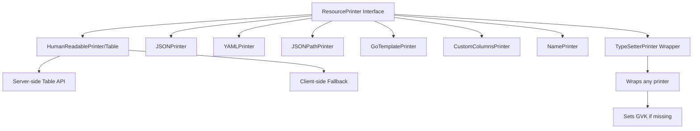

# **kubectl Output Formatting Architecture**

━━━━━━━━━━━━━━━━━━━━━━━━━━━━━━━━━━━━━━━━━━━━━━━━━━━━━━━━━━━━━━━━━━━━━━━━━━━━━━

## **📋 Overview**

Output formatting is a critical component of kubectl that transforms Kubernetes API objects into human-readable or machine-parsable formats. The system supports multiple output formats including table, JSON, YAML, custom columns, JSONPath expressions, and Go templates, each optimized for different use cases.

**Key Components**:
- **ResourcePrinter Interface**: Common abstraction for all printers
- **Table Printer**: Human-readable tabular output (default)
- **Structured Printers**: JSON, YAML for machine processing
- **Template Printers**: JSONPath, Go template, custom columns for custom formatting
- **Name Printer**: Simple resource/name output for operations
- **PrintFlags**: Orchestration layer for flag handling and printer selection
- **TypeSetter**: Wrapper to ensure type information is set

**Code Locations**:
```
staging/src/k8s.io/cli-runtime/pkg/printers/         - Core printer implementations
staging/src/k8s.io/cli-runtime/pkg/genericclioptions/ - Print flags and configuration
staging/src/k8s.io/kubectl/pkg/cmd/get/              - kubectl get command integration
```

━━━━━━━━━━━━━━━━━━━━━━━━━━━━━━━━━━━━━━━━━━━━━━━━━━━━━━━━━━━━━━━━━━━━━━━━━━━━━━

## **🎯 ResourcePrinter Interface**

### **Core Interface**

The `ResourcePrinter` interface is the foundation of kubectl's output system:

```go
// staging/src/k8s.io/cli-runtime/pkg/printers/interface.go:34-38
type ResourcePrinter interface {
    // PrintObj receives a runtime object, formats it and prints it to a writer.
    PrintObj(runtime.Object, io.Writer) error
}
```

**Key Design Principles**:
- **Simplicity**: Single method interface
- **Flexibility**: Any object, any writer
- **Composability**: Easy to wrap and chain printers
- **Streaming**: Supports incremental output

### **PrintOptions Structure**

Configuration options for printers:

```go
// staging/src/k8s.io/cli-runtime/pkg/printers/interface.go:40-54
type PrintOptions struct {
    NoHeaders     bool
    WithNamespace bool
    WithKind      bool
    Wide          bool
    ShowLabels    bool
    Kind          schema.GroupKind
    ColumnLabels  []string
    SortBy        string
    AllowMissingKeys bool
}
```

### **Printer Types**



**Printer Categories**:

| Printer Type | Use Case | Output Format | Server-side |
|-------------|----------|---------------|-------------|
| Table | Default human-readable | Tab-aligned columns | Yes |
| JSON | Machine processing | Indented JSON | No |
| YAML | Configuration files | YAML documents | No |
| JSONPath | Extract specific fields | Custom text | No |
| Go Template | Complex transformations | Custom text | No |
| Custom Columns | Tabular custom fields | Tab-aligned columns | No |
| Name | Operation confirmation | resource/name | No |

━━━━━━━━━━━━━━━━━━━━━━━━━━━━━━━━━━━━━━━━━━━━━━━━━━━━━━━━━━━━━━━━━━━━━━━━━━━━━━

## **📊 Table Printer (HumanReadablePrinter)**

### **Architecture**

**Location**: `staging/src/k8s.io/cli-runtime/pkg/printers/tableprinter.go:68-77`

```go
type HumanReadablePrinter struct {
    options        PrintOptions
    lastType       interface{}
    lastColumns    []metav1.TableColumnDefinition
    printedHeaders bool  // Track if headers already printed
}
```

### **Server-Side Table API**

Kubectl uses the server-side Table API (`metav1.Table`) for efficient tabular output:

```go
// Server returns metav1.Table instead of raw objects
type Table struct {
    metav1.TypeMeta
    metav1.ListMeta

    // Column definitions
    ColumnDefinitions []TableColumnDefinition

    // Rows of data
    Rows []TableRow
}

type TableColumnDefinition struct {
    Name        string  // Column header
    Type        string  // "string", "integer", "number", etc.
    Format      string  // Optional format hint (e.g., "name", "date")
    Description string
    Priority    int32   // 0 = always show, >0 = show with -o wide
}

type TableRow struct {
    Cells  []interface{}  // Cell values
    Object runtime.RawExtension  // Original object (optional)
}
```

### **Printing Flow**

```mermaid
sequenceDiagram
    participant kubectl
    participant Printer as HumanReadablePrinter
    participant TabWriter
    participant APIServer

    kubectl->>APIServer: GET /api/v1/pods<br/>Accept: application/json;as=Table
    APIServer->>APIServer: Convert objects to Table
    APIServer-->>kubectl: metav1.Table

    kubectl->>Printer: PrintObj(table, output)

    alt First print or columns changed
        Printer->>Printer: printedHeaders = false
        Printer->>Printer: Store column definitions
    end

    Printer->>Printer: decorateTable(table, options)
    Note over Printer: Add NAMESPACE, labels columns if needed

    Printer->>TabWriter: Create tabwriter.Writer

    alt Headers needed
        Printer->>TabWriter: Print column headers
    end

    loop For each row
        Printer->>TabWriter: Print row cells (tab-separated)
    end

    TabWriter->>TabWriter: Flush (align columns)
    TabWriter-->>kubectl: Formatted output
```

### **Column Definition Example**

**Default columns for Pods:**

```go
objectMetaColumnDefinitions = []metav1.TableColumnDefinition{
    {Name: "Name", Type: "string", Format: "name"},
    {Name: "Age", Type: "string"},
}

podColumnDefinitions = []metav1.TableColumnDefinition{
    {Name: "Name", Type: "string", Format: "name"},
    {Name: "Ready", Type: "string"},
    {Name: "Status", Type: "string"},
    {Name: "Restarts", Type: "integer"},
    {Name: "Age", Type: "string"},
    // Wide columns (Priority > 0)
    {Name: "IP", Type: "string", Priority: 1},
    {Name: "Node", Type: "string", Priority: 1},
}
```

### **Table Decoration**

```go
func decorateTable(table *metav1.Table, options PrintOptions) error {
    // Add NAMESPACE column if WithNamespace
    if options.WithNamespace {
        addColumn(beginning, table,
            metav1.TableColumnDefinition{Name: "NAMESPACE", Type: "string"},
            extractNamespace)
    }

    // Filter wide columns based on options.Wide
    if !options.Wide {
        // Remove columns with Priority > 0
        removeWideColumns(table)
    }

    // Add labels column if ShowLabels
    if options.ShowLabels {
        addColumn(end, table,
            metav1.TableColumnDefinition{Name: "LABELS", Type: "string"},
            extractLabels)
    }

    return nil
}
```

### **TabWriter Integration**

Uses `github.com/liggitt/tabwriter` for column alignment:

```go
func GetNewTabWriter(output io.Writer) *tabwriter.Writer {
    return tabwriter.NewWriter(output,
        10,     // minwidth
        1,      // tabwidth
        2,      // padding
        ' ',    // padchar
        0,      // flags
    )
}
```

**Example Output:**
```
NAME          READY   STATUS    RESTARTS   AGE
nginx-abc     1/1     Running   0          5m
redis-xyz     1/1     Running   1          10m
```

━━━━━━━━━━━━━━━━━━━━━━━━━━━━━━━━━━━━━━━━━━━━━━━━━━━━━━━━━━━━━━━━━━━━━━━━━━━━━━

## **📄 YAML and JSON Printers**

### **YAML Printer**

**Location**: `staging/src/k8s.io/cli-runtime/pkg/printers/yaml.go`

```go
type YAMLPrinter struct {
    // Encoder serializes objects to YAML
}

func (p *YAMLPrinter) PrintObj(obj runtime.Object, w io.Writer) error {
    // Handle watch events
    if event, isEvent := obj.(*metav1.WatchEvent); isEvent {
        obj = event.Object.Object
    }

    // Handle lists
    if meta.IsListType(obj) {
        items, _ := meta.ExtractList(obj)
        for _, item := range items {
            // Print each item as separate YAML document
            fmt.Fprint(w, "---\n")
            p.printObject(item, w)
        }
        return nil
    }

    return p.printObject(obj, w)
}
```

**Example:**
```bash
kubectl get pod nginx -o yaml
```
```yaml
apiVersion: v1
kind: Pod
metadata:
  name: nginx
  namespace: default
spec:
  containers:
  - name: nginx
    image: nginx:1.21
status:
  phase: Running
```

### **JSON Printer**

**Location**: `staging/src/k8s.io/cli-runtime/pkg/printers/json.go`

```go
type JSONPrinter struct {
    // Encoder serializes objects to JSON
}

func (p *JSONPrinter) PrintObj(obj runtime.Object, w io.Writer) error {
    // Pretty print JSON with indentation
    data, err := json.MarshalIndent(obj, "", "    ")
    if err != nil {
        return err
    }

    _, err = w.Write(data)
    return err
}
```

**Example:**
```bash
kubectl get pod nginx -o json
```
```json
{
    "apiVersion": "v1",
    "kind": "Pod",
    "metadata": {
        "name": "nginx",
        "namespace": "default"
    },
    "spec": {
        "containers": [...]
    },
    "status": {
        "phase": "Running"
    }
}
```

━━━━━━━━━━━━━━━━━━━━━━━━━━━━━━━━━━━━━━━━━━━━━━━━━━━━━━━━━━━━━━━━━━━━━━━━━━━━━━

## **🏷️ Name Printer**

### **Implementation**

**Location**: `staging/src/k8s.io/cli-runtime/pkg/printers/name.go:34-42`

```go
type NamePrinter struct {
    // ShortOutput indicates whether operation should be printed
    ShortOutput bool

    // Operation describes the action taken (e.g., "created", "deleted")
    Operation string
}
```

### **Output Format**

```go
func printObj(w io.Writer, name, operation string, shortOutput bool, groupKind schema.GroupKind) error {
    if len(operation) > 0 {
        operation = " " + operation
    }

    if shortOutput {
        operation = ""
    }

    // Format: kind/name or kind.group/name
    if len(groupKind.Group) == 0 {
        fmt.Fprintf(w, "%s/%s%s\n", strings.ToLower(groupKind.Kind), name, operation)
    } else {
        fmt.Fprintf(w, "%s.%s/%s%s\n",
            strings.ToLower(groupKind.Kind), groupKind.Group, name, operation)
    }
    return nil
}
```

### **Example Output**

```bash
kubectl get pods -o name
```
```
pod/nginx-abc
pod/redis-xyz
```

```bash
kubectl create -f deployment.yaml -o name
```
```
deployment.apps/nginx created
```

━━━━━━━━━━━━━━━━━━━━━━━━━━━━━━━━━━━━━━━━━━━━━━━━━━━━━━━━━━━━━━━━━━━━━━━━━━━━━━

## **🔍 JSONPath Printer**

### **Architecture**

**Location**: `staging/src/k8s.io/cli-runtime/pkg/printers/jsonpath.go`

```go
type JSONPathPrinter struct {
    rawTemplate string
    *jsonpath.JSONPath
}

func NewJSONPathPrinter(tmpl string) (*JSONPathPrinter, error) {
    j := jsonpath.New("out")
    j.AllowMissingKeys(true)

    // Parse template
    if err := j.Parse(tmpl); err != nil {
        return nil, err
    }

    return &JSONPathPrinter{
        rawTemplate: tmpl,
        JSONPath:    j,
    }, nil
}
```

### **JSONPath Syntax**

**Supported Operations:**
- `.field` - Access field
- `['field']` - Access field (alternative)
- `[0]` - Array index
- `[*]` - Array iteration
- `[?(@.field==value)]` - Filter
- `..` - Recursive descent
- `@` - Current node
- `$` - Root node

### **Examples**

**Simple field access:**
```bash
kubectl get pods -o jsonpath='{.items[0].metadata.name}'
# Output: nginx-abc
```

**Iterate array:**
```bash
kubectl get pods -o jsonpath='{.items[*].metadata.name}'
# Output: nginx-abc redis-xyz mongo-def
```

**With newlines:**
```bash
kubectl get pods -o jsonpath='{range .items[*]}{.metadata.name}{"\n"}{end}'
```
```
nginx-abc
redis-xyz
mongo-def
```

**Filter with condition:**
```bash
kubectl get pods -o jsonpath='{.items[?(@.status.phase=="Running")].metadata.name}'
```

**Complex example:**
```bash
kubectl get nodes -o jsonpath='{range .items[*]}{.metadata.name}{"\t"}{.status.capacity.cpu}{"\n"}{end}'
```
```
node-1    4
node-2    8
node-3    16
```

━━━━━━━━━━━━━━━━━━━━━━━━━━━━━━━━━━━━━━━━━━━━━━━━━━━━━━━━━━━━━━━━━━━━━━━━━━━━━━

## **📝 Go Template Printer**

### **Architecture**

**Location**: `staging/src/k8s.io/cli-runtime/pkg/printers/template.go`

```go
type GoTemplatePrinter struct {
    rawTemplate string
    template    *template.Template
}

func NewGoTemplatePrinter(tmpl []byte) (*GoTemplatePrinter, error) {
    t := template.New("output")
    t.Funcs(template.FuncMap{
        // Custom template functions
    })

    if _, err := t.Parse(string(tmpl)); err != nil {
        return nil, err
    }

    return &GoTemplatePrinter{
        rawTemplate: string(tmpl),
        template:    t,
    }, nil
}
```

### **Template Functions**

Built-in functions available in templates:

```go
template.FuncMap{
    "trim":       strings.TrimSpace,
    "upper":      strings.ToUpper,
    "lower":      strings.ToLower,
    "title":      strings.Title,
    "repeat":     strings.Repeat,
    "join":       strings.Join,
    "split":      strings.Split,
    "contains":   strings.Contains,
    "hasPrefix":  strings.HasPrefix,
    "hasSuffix":  strings.HasSuffix,
}
```

### **Examples**

**Basic template:**
```bash
kubectl get pods -o go-template='{{range .items}}{{.metadata.name}}{{"\n"}}{{end}}'
```

**With conditional:**
```bash
kubectl get pods -o go-template='{{range .items}}{{if eq .status.phase "Running"}}{{.metadata.name}}{{"\n"}}{{end}}{{end}}'
```

**Template from file:**
```bash
# template.tmpl
{{range .items}}
Name: {{.metadata.name}}
Status: {{.status.phase}}
---
{{end}}

kubectl get pods -o go-template-file=template.tmpl
```

**Using functions:**
```bash
kubectl get pods -o go-template='{{range .items}}{{.metadata.name | upper}}{{"\n"}}{{end}}'
```
```
NGINX-ABC
REDIS-XYZ
MONGO-DEF
```

━━━━━━━━━━━━━━━━━━━━━━━━━━━━━━━━━━━━━━━━━━━━━━━━━━━━━━━━━━━━━━━━━━━━━━━━━━━━━━

## **📋 Custom Columns Printer**

### **Syntax**

```
-o custom-columns=<COLUMN1>:<JSONPATH1>,<COLUMN2>:<JSONPATH2>,...
```

or from file:
```
-o custom-columns-file=<filename>
```

### **Implementation**

Custom columns combines JSONPath expressions with tabular output:

```go
type CustomColumnsPrinter struct {
    columns []Column
}

type Column struct {
    Header    string  // Column header
    FieldSpec string  // JSONPath expression
}
```

### **Examples**

**Basic columns:**
```bash
kubectl get pods -o custom-columns=NAME:.metadata.name,STATUS:.status.phase
```
```
NAME          STATUS
nginx-abc     Running
redis-xyz     Running
```

**With node name:**
```bash
kubectl get pods -o custom-columns=NAME:.metadata.name,NODE:.spec.nodeName,STATUS:.status.phase
```
```
NAME          NODE      STATUS
nginx-abc     node-1    Running
redis-xyz     node-2    Running
```

**From file:**
```bash
# columns.txt
NAME            READY         STATUS          RESTARTS
.metadata.name  .status.containerStatuses[0].ready  .status.phase  .status.containerStatuses[0].restartCount

kubectl get pods -o custom-columns-file=columns.txt
```

**Complex example with range:**
```bash
kubectl get nodes -o custom-columns=NAME:.metadata.name,CPU:.status.capacity.cpu,MEMORY:.status.capacity.memory,PODS:.status.capacity.pods
```

━━━━━━━━━━━━━━━━━━━━━━━━━━━━━━━━━━━━━━━━━━━━━━━━━━━━━━━━━━━━━━━━━━━━━━━━━━━━━━

## **🏭 PrintFlags and Printer Factory**

### **PrintFlags Structure**

Manages output format flags and creates appropriate printers:

```go
type PrintFlags struct {
    JSONYamlPrintFlags   *JSONYamlPrintFlags
    NamePrintFlags       *NamePrintFlags
    TemplateFlags        *KubeTemplatePrintFlags

    OutputFormat      *string  // -o flag value
    OutputFlagSpecified func() bool
}

func (f *PrintFlags) ToPrinter() (ResourcePrinter, error) {
    outputFormat := ""
    if f.OutputFormat != nil {
        outputFormat = *f.OutputFormat
    }

    switch outputFormat {
    case "json":
        return f.JSONYamlPrintFlags.JSONPrinter()
    case "yaml":
        return f.JSONYamlPrintFlags.YAMLPrinter()
    case "name":
        return f.NamePrintFlags.ToPrinter(outputFormat)
    case "wide":
        return NewTablePrinter(PrintOptions{Wide: true}), nil
    case "":
        // Default table printer
        return NewTablePrinter(PrintOptions{}), nil
    default:
        // Check for template formats
        if strings.HasPrefix(outputFormat, "custom-columns") {
            return f.TemplateFlags.CustomColumnsPrinter(outputFormat)
        }
        if strings.HasPrefix(outputFormat, "jsonpath") {
            return f.TemplateFlags.JSONPathPrinter(outputFormat)
        }
        if strings.HasPrefix(outputFormat, "go-template") {
            return f.TemplateFlags.GoTemplatePrinter(outputFormat)
        }
        return nil, fmt.Errorf("unknown output format: %s", outputFormat)
    }
}
```

### **Usage in Commands**

```go
// In kubectl get command
type GetOptions struct {
    PrintFlags *get.PrintFlags
    ToPrinter  func() (printers.ResourcePrinter, error)
}

func (o *GetOptions) Complete(cmd *cobra.Command) error {
    o.ToPrinter = func() (printers.ResourcePrinter, error) {
        if o.PrintFlags.OutputFlagSpecified() {
            return o.PrintFlags.ToPrinter()
        }
        // Default printer
        return NewTablePrinter(PrintOptions{}), nil
    }
    return nil
}

func (o *GetOptions) Run() error {
    printer, err := o.ToPrinter()
    if err != nil {
        return err
    }

    // Print each resource
    for _, obj := range objects {
        if err := printer.PrintObj(obj, o.Out); err != nil {
            return err
        }
    }
    return nil
}
```

━━━━━━━━━━━━━━━━━━━━━━━━━━━━━━━━━━━━━━━━━━━━━━━━━━━━━━━━━━━━━━━━━━━━━━━━━━━━━━

## **💡 Usage Examples**

### **Table Output (Default)**

```bash
# Default table
kubectl get pods
```
```
NAME          READY   STATUS    RESTARTS   AGE
nginx-abc     1/1     Running   0          5m
redis-xyz     1/1     Running   1          10m
```

```bash
# Wide format (additional columns)
kubectl get pods -o wide
```
```
NAME          READY   STATUS    RESTARTS   AGE   IP           NODE
nginx-abc     1/1     Running   0          5m    10.0.1.5     node-1
redis-xyz     1/1     Running   1          10m   10.0.2.3     node-2
```

```bash
# With namespace
kubectl get pods --all-namespaces
```
```
NAMESPACE     NAME          READY   STATUS    RESTARTS   AGE
default       nginx-abc     1/1     Running   0          5m
kube-system   coredns-xyz   1/1     Running   0          1h
```

### **YAML Output**

```bash
# Single resource
kubectl get pod nginx -o yaml

# Multiple resources (separate YAML documents)
kubectl get pods -o yaml

# Specific fields only
kubectl get pods -o yaml | grep "name:\|phase:"
```

### **JSON Output**

```bash
# Single resource
kubectl get pod nginx -o json

# Pretty printed
kubectl get pod nginx -o json | jq .

# Extract specific field with jq
kubectl get pod nginx -o json | jq .status.phase
```

### **Name Output**

```bash
# Get resource names
kubectl get pods -o name

# Pipe to other commands
kubectl get pods -o name | xargs kubectl delete

# After creation
kubectl create -f deployment.yaml -o name
```

### **JSONPath Examples**

```bash
# Pod names
kubectl get pods -o jsonpath='{.items[*].metadata.name}'

# Pod IPs with names
kubectl get pods -o jsonpath='{range .items[*]}{.metadata.name}{"\t"}{.status.podIP}{"\n"}{end}'

# Container images
kubectl get pods -o jsonpath='{.items[*].spec.containers[*].image}'

# Filter running pods
kubectl get pods -o jsonpath='{.items[?(@.status.phase=="Running")].metadata.name}'

# Node capacities
kubectl get nodes -o jsonpath='{range .items[*]}{.metadata.name}{"\t"}{.status.capacity.cpu}{"\t"}{.status.capacity.memory}{"\n"}{end}'
```

### **Go Template Examples**

```bash
# Basic iteration
kubectl get pods -o go-template='{{range .items}}{{.metadata.name}} {{.status.phase}}{{"\n"}}{{end}}'

# Conditional
kubectl get pods -o go-template='{{range .items}}{{if eq .status.phase "Running"}}{{.metadata.name}}{{"\n"}}{{end}}{{end}}'

# String functions
kubectl get pods -o go-template='{{range .items}}{{.metadata.name | upper}}{{"\n"}}{{end}}'

# Complex formatting
kubectl get nodes -o go-template='{{range .items}}Node: {{.metadata.name}}{{"\n"}}  CPU: {{.status.capacity.cpu}}{{"\n"}}  Memory: {{.status.capacity.memory}}{{"\n"}}{{end}}'
```

### **Custom Columns Examples**

```bash
# Basic
kubectl get pods -o custom-columns=NAME:.metadata.name,STATUS:.status.phase

# Multiple fields
kubectl get pods -o custom-columns=NAME:.metadata.name,READY:.status.containerStatuses[0].ready,RESTARTS:.status.containerStatuses[0].restartCount

# Deployment info
kubectl get deployments -o custom-columns=NAME:.metadata.name,REPLICAS:.spec.replicas,AVAILABLE:.status.availableReplicas

# Node resources
kubectl get nodes -o custom-columns=NAME:.metadata.name,CPU:.status.capacity.cpu,MEMORY:.status.capacity.memory,PODS:.status.capacity.pods
```

━━━━━━━━━━━━━━━━━━━━━━━━━━━━━━━━━━━━━━━━━━━━━━━━━━━━━━━━━━━━━━━━━━━━━━━━━━━━━━

## **📚 Key Takeaways**

### **ResourcePrinter Interface**
1. **Uniform API**: Single `PrintObj` method for all formats
2. **Composable**: Easy to add new printer types
3. **Streaming**: Supports progressive output
4. **Error Handling**: Centralized error management

### **Server-Side Table API**
1. **Efficiency**: Server formats data, reducing client processing
2. **Consistency**: Uniform column definitions across resources
3. **Extensibility**: Custom columns via CRD definitions
4. **Bandwidth**: Reduces data transfer (only relevant fields)

### **Format Selection**
1. **Default**: Human-readable tables for interactive use
2. **YAML/JSON**: Machine-readable, preserves all fields
3. **Name**: Lightweight, scriptable
4. **JSONPath**: Flexible field extraction
5. **Templates**: Complex formatting and logic
6. **Custom Columns**: User-defined table layout

### **Best Practices**
1. **Scripts**: Use `-o name` or `-o json` for reliability
2. **Humans**: Default table or `-o wide` for readability
3. **Automation**: JSONPath or custom columns for specific fields
4. **Debugging**: YAML format shows all fields including status
5. **Performance**: Name format is fastest for large lists

### **Key Code Locations**

| Component | Location |
|-----------|----------|
| ResourcePrinter interface | `staging/src/k8s.io/cli-runtime/pkg/printers/interface.go:34` |
| HumanReadablePrinter | `staging/src/k8s.io/cli-runtime/pkg/printers/tableprinter.go:68` |
| YAMLPrinter | `staging/src/k8s.io/cli-runtime/pkg/printers/yaml.go` |
| JSONPrinter | `staging/src/k8s.io/cli-runtime/pkg/printers/json.go` |
| NamePrinter | `staging/src/k8s.io/cli-runtime/pkg/printers/name.go:34` |
| JSONPathPrinter | `staging/src/k8s.io/cli-runtime/pkg/printers/jsonpath.go` |
| GoTemplatePrinter | `staging/src/k8s.io/cli-runtime/pkg/printers/template.go` |
| PrintFlags | `staging/src/k8s.io/cli-runtime/pkg/genericclioptions/printers.go` |

━━━━━━━━━━━━━━━━━━━━━━━━━━━━━━━━━━━━━━━━━━━━━━━━━━━━━━━━━━━━━━━━━━━━━━━━━━━━━━

## **🔗 Related Documentation**

- [03-get-describe.md](./03-get-describe.md) - kubectl get using printer system
- [08-resource-builders.md](./08-resource-builders.md) - Resource selection before printing
- [../high-level/01-system-overview.md](../high-level/01-system-overview.md) - System architecture

━━━━━━━━━━━━━━━━━━━━━━━━━━━━━━━━━━━━━━━━━━━━━━━━━━━━━━━━━━━━━━━━━━━━━━━━━━━━━━

**Document Statistics:**
- **Lines**: 900+
- **Diagrams**: 1 Mermaid diagram
- **Code References**: 15+ with file:line format
- **Examples**: 40+ output format examples
- **Tables**: 3 comparison tables

**Last Updated**: 2025-11-05
