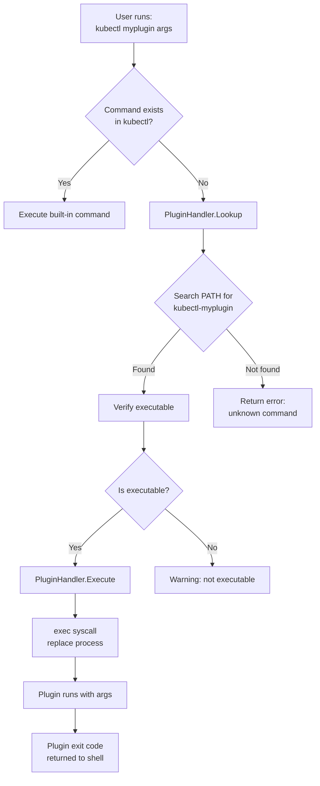
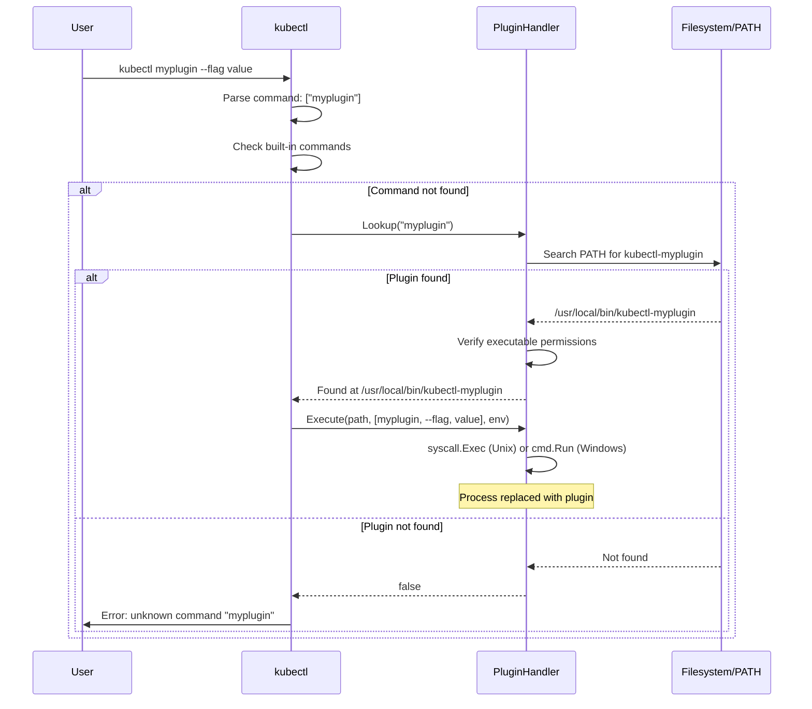
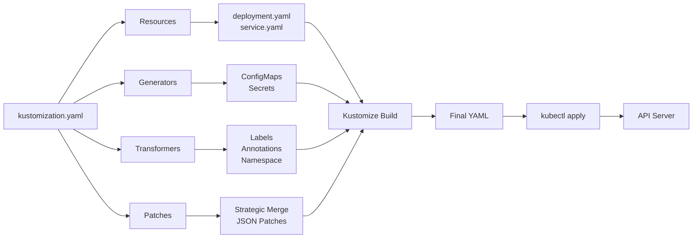
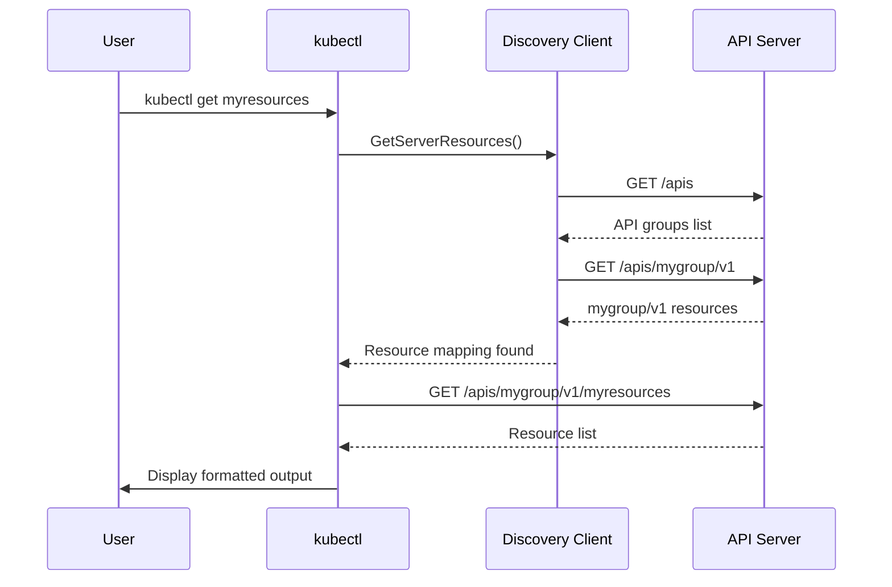

# **kubectl Plugins and Extensions Architecture**

━━━━━━━━━━━━━━━━━━━━━━━━━━━━━━━━━━━━━━━━━━━━━━━━━━━━━━━━━━━━━━━━━━━━━━━━━━━━━━

## **📋 Overview**

kubectl's plugin system provides a powerful extension mechanism that allows developers to add custom functionality without modifying kubectl's core codebase. The plugin architecture enables seamless integration of external commands, making them appear as native kubectl subcommands.

**Key Components**:
- **Plugin Handler**: Discovers and executes plugin binaries from PATH
- **Plugin Naming Convention**: `kubectl-*` prefix for automatic discovery
- **Kustomize Integration**: Built-in support for declarative configuration management
- **Extension Points**: Alpha commands, server-side apply, custom resources
- **Plugin Ecosystem**: Krew plugin manager and community plugins

**Code Locations**:
```
staging/src/k8s.io/kubectl/pkg/cmd/cmd.go                - Plugin integration
staging/src/k8s.io/kubectl/pkg/cmd/plugin/plugin.go     - Plugin discovery
staging/src/k8s.io/kubectl/pkg/cmd/kustomize/           - Kustomize commands
```

━━━━━━━━━━━━━━━━━━━━━━━━━━━━━━━━━━━━━━━━━━━━━━━━━━━━━━━━━━━━━━━━━━━━━━━━━━━━━━

## **🔌 Plugin Architecture**

### **Core Concept**

kubectl plugins are standalone executable files on the system PATH with names prefixed by `kubectl-`. When kubectl receives an unknown command, it searches for matching plugin executables.



### **PluginHandler Interface**

```go
// staging/src/k8s.io/kubectl/pkg/cmd/cmd.go:181-191
type PluginHandler interface {
    // Lookup checks if a plugin with the given filename exists.
    // It iterates over valid prefixes to recognize plugin filenames.
    // Returns the filepath if found, or boolean false.
    Lookup(filename string) (string, bool)

    // Execute runs the plugin at executablePath with the given
    // command-line arguments and environment variables.
    Execute(executablePath string, cmdArgs, environment []string) error
}
```

**Design Principles**:
- **Simplicity**: Two-method interface for lookup and execution
- **PATH-based Discovery**: Leverages standard Unix PATH conventions
- **Process Replacement**: Uses exec syscall for efficiency (Unix-like systems)
- **Transparent Integration**: Plugins appear as native kubectl commands

### **DefaultPluginHandler Implementation**

```go
// staging/src/k8s.io/kubectl/pkg/cmd/cmd.go:194-204
type DefaultPluginHandler struct {
    ValidPrefixes []string  // e.g., ["kubectl"]
}

func NewDefaultPluginHandler(validPrefixes []string) *DefaultPluginHandler {
    return &DefaultPluginHandler{
        ValidPrefixes: validPrefixes,
    }
}
```

**Lookup Implementation**:

```go
// staging/src/k8s.io/kubectl/pkg/cmd/cmd.go:207-221
func (h *DefaultPluginHandler) Lookup(filename string) (string, bool) {
    for _, prefix := range h.ValidPrefixes {
        // Search for kubectl-<filename> in PATH
        path, err := exec.LookPath(fmt.Sprintf("%s-%s", prefix, filename))
        if shouldSkipOnLookPathErr(err) || len(path) == 0 {
            continue
        }
        return path, true
    }
    return "", false
}
```

**Execute Implementation**:

```go
// staging/src/k8s.io/kubectl/pkg/cmd/cmd.go:236-253
func (h *DefaultPluginHandler) Execute(executablePath string,
    cmdArgs, environment []string) error {

    // Windows: spawn new process
    if runtime.GOOS == "windows" {
        cmd := Command(executablePath, cmdArgs...)
        cmd.Stdout = os.Stdout
        cmd.Stderr = os.Stderr
        cmd.Stdin = os.Stdin
        cmd.Env = environment
        return cmd.Run()
    }

    // Unix-like: replace current process with plugin
    return syscall.Exec(executablePath, cmdArgs, environment)
}
```

### **Plugin Discovery Flow**



### **Command Path Resolution**

kubectl handles multi-word plugin names by trying progressively shorter command paths:

```go
// staging/src/k8s.io/kubectl/pkg/cmd/cmd.go:258-303
func HandlePluginCommand(pluginHandler PluginHandler,
    cmdArgs []string, minArgs int) error {

    var remainingArgs []string  // non-flag arguments
    for _, arg := range cmdArgs {
        if strings.HasPrefix(arg, "-") {
            break  // Stop at first flag
        }
        remainingArgs = append(remainingArgs, arg)
    }

    // Try progressively shorter names
    // e.g., ["foo", "bar", "baz"] tries:
    //   kubectl-foo-bar-baz
    //   kubectl-foo-bar
    //   kubectl-foo
    for len(remainingArgs) >= minArgs {
        path, found := pluginHandler.Lookup(
            strings.Join(remainingArgs, "-"))

        if !found {
            remainingArgs = remainingArgs[:len(remainingArgs)-1]
            continue
        }

        // Execute plugin with remaining args
        return pluginHandler.Execute(path,
            cmdArgs[len(remainingArgs):], os.Environ())
    }

    return fmt.Errorf("unknown command %q", cmdArgs[0])
}
```

**Example Resolution**:

```bash
# Command: kubectl foo bar baz --flag=value
# Tries in order:
1. kubectl-foo-bar-baz (if found, execute with: [--flag=value])
2. kubectl-foo-bar (if found, execute with: [baz, --flag=value])
3. kubectl-foo (if found, execute with: [bar, baz, --flag=value])
4. Error if none found
```

━━━━━━━━━━━━━━━━━━━━━━━━━━━━━━━━━━━━━━━━━━━━━━━━━━━━━━━━━━━━━━━━━━━━━━━━━━━━━━

## **🛠️ Plugin Development**

### **Plugin Naming Convention**

**Required Format**: `kubectl-<name>[-<subcommand>]*`

```bash
# Valid plugin names:
kubectl-myplugin          # Simple plugin
kubectl-my-plugin         # Hyphenated name
kubectl-foo-bar           # Multi-word subcommand
kubectl-ns-switch         # Namespace switcher example

# Invalid names (not recognized as plugins):
myplugin                  # Missing kubectl- prefix
kubectl_myplugin          # Underscore not allowed
kubectl-my_plugin         # Underscore in name
```

**Code Reference**:

```go
// staging/src/k8s.io/kubectl/pkg/cmd/plugin/plugin.go:63-64
var ValidPluginFilenamePrefixes = []string{"kubectl"}

// staging/src/k8s.io/kubectl/pkg/cmd/plugin/plugin.go:288-296
func hasValidPrefix(filepath string, validPrefixes []string) bool {
    for _, prefix := range validPrefixes {
        if !strings.HasPrefix(filepath, prefix+"-") {
            continue
        }
        return true
    }
    return false
}
```

### **Executable Requirements**

Plugins must be executable files on the system PATH:

```bash
# Make plugin executable
chmod +x kubectl-myplugin

# Place in PATH
sudo mv kubectl-myplugin /usr/local/bin/

# Verify discovery
kubectl plugin list | grep myplugin
```

**Platform-Specific Executables**:

```go
// staging/src/k8s.io/kubectl/pkg/cmd/plugin/plugin.go:250-271
func isExecutable(fullPath string) (bool, error) {
    info, err := os.Stat(fullPath)
    if err != nil {
        return false, err
    }

    // Windows: check file extension
    if runtime.GOOS == "windows" {
        fileExt := strings.ToLower(filepath.Ext(fullPath))
        switch fileExt {
        case ".bat", ".cmd", ".com", ".exe", ".ps1":
            return true, nil
        }
        return false, nil
    }

    // Unix: check executable bit (owner, group, or other)
    if m := info.Mode(); !m.IsDir() && m&0111 != 0 {
        return true, nil
    }

    return false, nil
}
```

### **Command-Line Interface**

Plugins receive command-line arguments after their name:

```bash
# User command:
kubectl myplugin arg1 arg2 --flag=value

# Plugin receives:
argv[0]: /usr/local/bin/kubectl-myplugin
argv[1]: arg1
argv[2]: arg2
argv[3]: --flag=value
```

**Best Practices**:
1. **Parse flags**: Use flag parsing library (pflag for Go plugins)
2. **Help text**: Implement `-h` and `--help` flags
3. **Exit codes**: Return 0 for success, non-zero for errors
4. **Error messages**: Write errors to stderr, not stdout

### **Environment Variables**

kubectl passes environment variables to plugins:

```bash
# Kubernetes configuration
KUBECONFIG=/path/to/kubeconfig
KUBERNETES_SERVICE_HOST=10.96.0.1
KUBERNETES_SERVICE_PORT=443

# kubectl context
KUBECTL_PLUGINS_CURRENT_NAMESPACE=default
KUBECTL_PLUGINS_CALLER=kubectl

# Standard shell environment
PATH=/usr/local/bin:/usr/bin:/bin
HOME=/home/user
```

**Accessing kubeconfig in Plugins**:

```go
// Go plugin example
package main

import (
    "k8s.io/client-go/tools/clientcmd"
    "os"
)

func main() {
    // Get kubeconfig from environment or default location
    kubeconfig := os.Getenv("KUBECONFIG")
    if kubeconfig == "" {
        kubeconfig = clientcmd.RecommendedHomeFile
    }

    // Load configuration
    config, err := clientcmd.BuildConfigFromFlags("", kubeconfig)
    if err != nil {
        panic(err)
    }

    // Use config to create clients...
}
```

### **Simple Plugin Example**

**Shell Script Plugin** (`kubectl-hello`):

```bash
#!/bin/bash
# kubectl-hello - Simple greeting plugin

set -e

# Parse arguments
NAME="${1:-World}"

# Check for help flag
if [[ "$1" == "-h" || "$1" == "--help" ]]; then
    cat <<EOF
kubectl-hello - Greet someone from kubectl

Usage:
  kubectl hello [NAME]

Examples:
  kubectl hello
  kubectl hello Alice
EOF
    exit 0
fi

# Main logic
echo "Hello, $NAME!"
echo "Current context: $(kubectl config current-context)"
echo "Current namespace: $(kubectl config view --minify -o jsonpath='{..namespace}')"

exit 0
```

**Installation**:

```bash
chmod +x kubectl-hello
sudo mv kubectl-hello /usr/local/bin/
kubectl hello Alice
```

**Go Plugin Example** (`kubectl-pod-restart`):

```go
// kubectl-pod-restart - Restart pods in a deployment
package main

import (
    "context"
    "flag"
    "fmt"
    "os"

    metav1 "k8s.io/apimachinery/pkg/apis/meta/v1"
    "k8s.io/client-go/kubernetes"
    "k8s.io/client-go/tools/clientcmd"
)

func main() {
    // Parse flags
    deployment := flag.String("deployment", "", "Deployment name")
    namespace := flag.String("namespace", "default", "Namespace")
    flag.Parse()

    if *deployment == "" {
        fmt.Fprintln(os.Stderr, "Error: --deployment is required")
        os.Exit(1)
    }

    // Create client
    config, err := clientcmd.BuildConfigFromFlags("",
        os.Getenv("KUBECONFIG"))
    if err != nil {
        fmt.Fprintf(os.Stderr, "Error loading config: %v\n", err)
        os.Exit(1)
    }

    clientset, err := kubernetes.NewForConfig(config)
    if err != nil {
        fmt.Fprintf(os.Stderr, "Error creating client: %v\n", err)
        os.Exit(1)
    }

    // Delete pods to trigger restart
    pods, err := clientset.CoreV1().Pods(*namespace).List(
        context.TODO(), metav1.ListOptions{
            LabelSelector: fmt.Sprintf("app=%s", *deployment),
        })

    if err != nil {
        fmt.Fprintf(os.Stderr, "Error listing pods: %v\n", err)
        os.Exit(1)
    }

    for _, pod := range pods.Items {
        err := clientset.CoreV1().Pods(*namespace).Delete(
            context.TODO(), pod.Name, metav1.DeleteOptions{})
        if err != nil {
            fmt.Fprintf(os.Stderr, "Error deleting pod %s: %v\n",
                pod.Name, err)
            continue
        }
        fmt.Printf("Deleted pod: %s\n", pod.Name)
    }

    fmt.Printf("Restarted %d pods in deployment %s\n",
        len(pods.Items), *deployment)
}
```

━━━━━━━━━━━━━━━━━━━━━━━━━━━━━━━━━━━━━━━━━━━━━━━━━━━━━━━━━━━━━━━━━━━━━━━━━━━━━━

## **📦 Plugin Discovery and Management**

### **kubectl plugin list**

Built-in command to discover available plugins:

```bash
# List all plugins
kubectl plugin list

# Output:
The following compatible plugins are available:

/usr/local/bin/kubectl-hello
/usr/local/bin/kubectl-ns
/usr/local/bin/kubectl-pod-restart
  - warning: kubectl-pod-restart overwrites existing command: "kubectl pod"
```

**Implementation**:

```go
// staging/src/k8s.io/kubectl/pkg/cmd/plugin/plugin.go:92-110
func NewCmdPluginList(streams genericiooptions.IOStreams) *cobra.Command {
    o := &PluginListOptions{
        IOStreams: streams,
    }

    cmd := &cobra.Command{
        Use:     "list",
        Short:   i18n.T("List all visible plugin executables on a user's PATH"),
        Long:    pluginListLong,
        Run: func(cmd *cobra.Command, args []string) {
            cmdutil.CheckErr(o.Complete(cmd))
            cmdutil.CheckErr(o.Run())
        },
    }

    cmd.Flags().BoolVar(&o.NameOnly, "name-only", o.NameOnly,
        "If true, display only the binary name of each plugin")
    return cmd
}
```

**Plugin Discovery Algorithm**:

```go
// staging/src/k8s.io/kubectl/pkg/cmd/plugin/plugin.go:164-198
func (o *PluginListOptions) ListPlugins() ([]string, []error) {
    plugins := []string{}
    errors := []error{}

    // Get PATH directories
    for _, dir := range uniquePathsList(o.PluginPaths) {
        if len(strings.TrimSpace(dir)) == 0 {
            continue
        }

        // Read directory
        files, err := os.ReadDir(dir)
        if err != nil {
            // Skip inaccessible directories
            continue
        }

        // Check each file
        for _, f := range files {
            if f.IsDir() {
                continue
            }

            // Check for valid prefix (kubectl-)
            if !hasValidPrefix(f.Name(), ValidPluginFilenamePrefixes) {
                continue
            }

            plugins = append(plugins, filepath.Join(dir, f.Name()))
        }
    }

    return plugins, errors
}
```

### **Plugin Verification**

kubectl warns about potential issues with plugins:

```go
// staging/src/k8s.io/kubectl/pkg/cmd/plugin/plugin.go:206-248
type CommandOverrideVerifier struct {
    root        *cobra.Command
    seenPlugins map[string]string
}

func (v *CommandOverrideVerifier) Verify(path string) []error {
    errors := []error{}
    binName := filepath.Base(path)

    // Check if executable
    if isExec, err := isExecutable(path); err == nil && !isExec {
        errors = append(errors, fmt.Errorf(
            "warning: %s identified as a kubectl plugin, but it is not executable",
            path))
    }

    // Check for shadowing (multiple plugins with same name)
    if existingPath, ok := v.seenPlugins[binName]; ok {
        errors = append(errors, fmt.Errorf(
            "warning: %s is overshadowed by a similarly named plugin: %s",
            path, existingPath))
    } else {
        v.seenPlugins[binName] = path
    }

    // Check for overriding built-in commands
    cmdPath := strings.Split(binName, "-")[1:]  // Remove "kubectl" prefix
    if cmd, _, err := v.root.Find(cmdPath); err == nil {
        errors = append(errors, fmt.Errorf(
            "warning: %s overwrites existing command: %q",
            binName, cmd.CommandPath()))
    }

    return errors
}
```

**Warning Examples**:

```bash
kubectl plugin list
# Output:
/usr/local/bin/kubectl-get
  - warning: kubectl-get overwrites existing command: "kubectl get"
/usr/local/bin/kubectl-myplugin
/home/user/bin/kubectl-myplugin
  - warning: /home/user/bin/kubectl-myplugin is overshadowed by a similarly named plugin: /usr/local/bin/kubectl-myplugin
```

━━━━━━━━━━━━━━━━━━━━━━━━━━━━━━━━━━━━━━━━━━━━━━━━━━━━━━━━━━━━━━━━━━━━━━━━━━━━━━

## **🎨 Kustomize Integration**

### **Overview**

Kustomize is built into kubectl, allowing declarative customization of Kubernetes configurations:

```bash
# Apply kustomization
kubectl apply -k ./dir/

# View kustomization output
kubectl kustomize ./dir/

# Delete resources from kustomization
kubectl delete -k ./dir/
```

### **Kustomize Command**

kubectl includes a dedicated kustomize command:

```go
// staging/src/k8s.io/kubectl/pkg/cmd/kustomize/kustomize.go:30-41
func NewCmdKustomize(streams genericiooptions.IOStreams) *cobra.Command {
    h := build.MakeHelp("kubectl", "kustomize")
    return build.NewCmdBuild(
        filesys.MakeFsOnDisk(),
        &build.Help{
            Use:     h.Use,
            Short:   i18n.T(h.Short),
            Long:    templates.LongDesc(i18n.T(h.Long)),
            Example: templates.Examples(i18n.T(h.Example)),
        },
        streams.Out)
}
```

**Command Integration**:

```go
// staging/src/k8s.io/kubectl/pkg/cmd/cmd.go
import "k8s.io/kubectl/pkg/cmd/kustomize"

// In NewKubectlCommand():
cmd.AddCommand(kustomize.NewCmdKustomize(ioStreams))
```

### **Kustomization File Structure**

**Example kustomization.yaml**:

```yaml
apiVersion: kustomize.config.k8s.io/v1beta1
kind: Kustomization

# Resources to include
resources:
  - deployment.yaml
  - service.yaml
  - ingress.yaml

# Common labels for all resources
commonLabels:
  app: myapp
  env: production

# Namespace for all resources
namespace: prod

# Name prefix
namePrefix: prod-

# Image transformations
images:
  - name: myapp
    newName: myregistry.io/myapp
    newTag: v1.2.3

# ConfigMap generators
configMapGenerator:
  - name: app-config
    literals:
      - DATABASE_URL=postgres://db:5432/myapp
      - LOG_LEVEL=info

# Secret generators
secretGenerator:
  - name: app-secrets
    literals:
      - API_KEY=secret123

# Patches
patchesStrategicMerge:
  - patch-deployment.yaml

# JSON patches
patchesJson6902:
  - target:
      group: apps
      version: v1
      kind: Deployment
      name: myapp
    patch: |-
      - op: replace
        path: /spec/replicas
        value: 3
```

### **Using -k Flag**

Many kubectl commands support the `-k` flag for kustomization directories:

```bash
# Apply kustomization
kubectl apply -k ./overlays/production/

# View resources
kubectl get -k ./overlays/production/

# Diff before applying
kubectl diff -k ./overlays/production/

# Delete resources
kubectl delete -k ./overlays/production/

# Describe resources
kubectl describe -k ./overlays/production/
```

**Code Reference**:

```go
// staging/src/k8s.io/kubectl/pkg/cmd/apply/apply.go:202
Use: "apply (-f FILENAME | -k DIRECTORY)",

// Example:
// staging/src/k8s.io/kubectl/pkg/cmd/apply/apply.go:159
kubectl apply -k dir/
```

### **Kustomize Overlays Pattern**

**Directory Structure**:

```
myapp/
├── base/
│   ├── kustomization.yaml
│   ├── deployment.yaml
│   └── service.yaml
├── overlays/
│   ├── development/
│   │   ├── kustomization.yaml
│   │   └── replica-patch.yaml
│   ├── staging/
│   │   ├── kustomization.yaml
│   │   └── replica-patch.yaml
│   └── production/
│       ├── kustomization.yaml
│       └── replica-patch.yaml
```

**Base kustomization.yaml**:

```yaml
apiVersion: kustomize.config.k8s.io/v1beta1
kind: Kustomization

resources:
  - deployment.yaml
  - service.yaml

commonLabels:
  app: myapp
```

**Overlay kustomization.yaml** (production):

```yaml
apiVersion: kustomize.config.k8s.io/v1beta1
kind: Kustomization

# Reference base
bases:
  - ../../base

# Override namespace
namespace: production

# Add production-specific labels
commonLabels:
  env: production

# Scale replicas for production
replicas:
  - name: myapp
    count: 5

# Use production image
images:
  - name: myapp
    newTag: v1.2.3

# Production-specific patches
patchesStrategicMerge:
  - replica-patch.yaml
```

**Usage**:

```bash
# Deploy to development
kubectl apply -k overlays/development/

# Deploy to staging
kubectl apply -k overlays/staging/

# Deploy to production
kubectl apply -k overlays/production/
```

### **Kustomize Workflow Diagram**



━━━━━━━━━━━━━━━━━━━━━━━━━━━━━━━━━━━━━━━━━━━━━━━━━━━━━━━━━━━━━━━━━━━━━━━━━━━━━━

## **🔧 Built-in Extension Points**

### **kubectl alpha Commands**

Alpha commands provide preview access to experimental features:

```bash
# List alpha commands
kubectl alpha --help

# Example alpha commands
kubectl alpha events              # Enhanced event viewing
kubectl alpha debug               # Interactive debugging
```

**Alpha Command Pattern**:

```go
// Alpha commands are organized under the alpha subcommand
alphaCmd := &cobra.Command{
    Use:   "alpha",
    Short: "Commands for features in alpha",
    Long:  "These commands correspond to alpha features.",
}

// Add alpha subcommands
alphaCmd.AddCommand(NewCmdEvents(...))
alphaCmd.AddCommand(NewCmdDebug(...))

// Add to root
rootCmd.AddCommand(alphaCmd)
```

### **Feature Gates**

kubectl supports feature gates to enable/disable features:

```bash
# Enable feature gate
kubectl --feature-gates=ServerSideApply=true apply -f deployment.yaml

# Check available feature gates
kubectl options
```

### **Server-Side Apply**

Server-side apply is a built-in extension that changes how apply works:

```bash
# Use server-side apply
kubectl apply --server-side -f deployment.yaml

# Force conflicts
kubectl apply --server-side --force-conflicts -f deployment.yaml

# Show diff
kubectl diff --server-side -f deployment.yaml
```

**Benefits**:
- **Field Management**: Tracks field ownership per manager
- **Conflict Detection**: Prevents accidental overwrites
- **Large Objects**: Handles large resources better
- **Atomic Operations**: More reliable updates

### **Custom Resource Support**

kubectl automatically works with Custom Resource Definitions (CRDs):

```bash
# CRDs are automatically discovered
kubectl get crds

# Use custom resources like built-ins
kubectl get myresources
kubectl describe myresource my-instance
kubectl edit myresource my-instance
kubectl delete myresource my-instance

# Output formats work
kubectl get myresources -o yaml
kubectl get myresources -o json
```

**Discovery Process**:



━━━━━━━━━━━━━━━━━━━━━━━━━━━━━━━━━━━━━━━━━━━━━━━━━━━━━━━━━━━━━━━━━━━━━━━━━━━━━━

## **🌟 Krew - kubectl Plugin Manager**

### **Overview**

Krew is the official plugin manager for kubectl, making it easy to discover and install community plugins.

**Installation**:

```bash
# Install krew (one-time setup)
(
  set -x; cd "$(mktemp -d)" &&
  OS="$(uname | tr '[:upper:]' '[:lower:]')" &&
  ARCH="$(uname -m | sed -e 's/x86_64/amd64/' -e 's/\(arm\)\(64\)\?.*/\1\2/' -e 's/aarch64$/arm64/')" &&
  KREW="krew-${OS}_${ARCH}" &&
  curl -fsSLO "https://github.com/kubernetes-sigs/krew/releases/latest/download/${KREW}.tar.gz" &&
  tar zxvf "${KREW}.tar.gz" &&
  ./"${KREW}" install krew
)

# Add to PATH
export PATH="${KREW_ROOT:-$HOME/.krew}/bin:$PATH"
```

### **Using Krew**

```bash
# Update plugin index
kubectl krew update

# Search for plugins
kubectl krew search

# Search by keyword
kubectl krew search logs

# Get plugin information
kubectl krew info ctx

# Install a plugin
kubectl krew install ctx
kubectl krew install ns
kubectl krew install tail

# List installed plugins
kubectl krew list

# Upgrade plugins
kubectl krew upgrade

# Uninstall a plugin
kubectl krew uninstall ctx
```

### **Popular Krew Plugins**

| Plugin | Description | Usage |
|--------|-------------|-------|
| **ctx** | Switch between contexts | `kubectl ctx production` |
| **ns** | Switch between namespaces | `kubectl ns kube-system` |
| **tail** | Tail logs from multiple pods | `kubectl tail -l app=nginx` |
| **tree** | Show hierarchy of resources | `kubectl tree deployment nginx` |
| **neat** | Clean up YAML output | `kubectl get pod nginx -o yaml \| kubectl neat` |
| **whoami** | Show current user info | `kubectl whoami` |
| **view-secret** | Decode and view secrets | `kubectl view-secret my-secret` |
| **images** | Show container images | `kubectl images` |
| **access-matrix** | Show RBAC access matrix | `kubectl access-matrix` |
| **stern** | Multi-pod log tailing | `kubectl stern app-.*` |

### **Creating Krew Plugins**

**Plugin Manifest** (.krew.yaml):

```yaml
apiVersion: krew.googlecode.com/v1alpha2
kind: Plugin
metadata:
  name: myplugin
spec:
  version: v1.0.0
  homepage: https://github.com/user/kubectl-myplugin
  shortDescription: Short description of plugin
  description: |
    Longer description of what the plugin does.
    Can span multiple lines.

  platforms:
  - selector:
      matchLabels:
        os: darwin
        arch: amd64
    uri: https://github.com/user/kubectl-myplugin/releases/download/v1.0.0/kubectl-myplugin-darwin-amd64.tar.gz
    sha256: abc123...
    bin: kubectl-myplugin

  - selector:
      matchLabels:
        os: linux
        arch: amd64
    uri: https://github.com/user/kubectl-myplugin/releases/download/v1.0.0/kubectl-myplugin-linux-amd64.tar.gz
    sha256: def456...
    bin: kubectl-myplugin
```

**Submitting to Krew Index**:

```bash
# Fork krew-index repository
git clone https://github.com/kubernetes-sigs/krew-index
cd krew-index

# Add plugin manifest
cp myplugin.yaml plugins/myplugin.yaml

# Create pull request
git add plugins/myplugin.yaml
git commit -m "Add myplugin"
git push origin add-myplugin
# Create PR on GitHub
```

━━━━━━━━━━━━━━━━━━━━━━━━━━━━━━━━━━━━━━━━━━━━━━━━━━━━━━━━━━━━━━━━━━━━━━━━━━━━━━

## **💡 Plugin Development Best Practices**

### **Design Guidelines**

**1. Follow kubectl Conventions**:

```bash
# Good: Consistent with kubectl patterns
kubectl myplugin get --namespace=default
kubectl myplugin delete my-resource

# Bad: Inconsistent patterns
kubectl myplugin -n default retrieve
kubectl myplugin remove --resource my-resource
```

**2. Use Standard Flags**:

```go
// Use pflag for Go plugins (same as kubectl)
import "github.com/spf13/pflag"

var (
    namespace = pflag.StringP("namespace", "n", "default", "Namespace")
    selector  = pflag.StringP("selector", "l", "", "Label selector")
    output    = pflag.StringP("output", "o", "", "Output format")
)
```

**3. Respect kubectl Context**:

```go
// Use current context from kubeconfig
config, err := clientcmd.BuildConfigFromFlags("",
    clientcmd.RecommendedHomeFile)

// Or get from KUBECONFIG env var
kubeconfig := os.Getenv("KUBECONFIG")
config, err := clientcmd.BuildConfigFromFlags("", kubeconfig)
```

**4. Handle Errors Gracefully**:

```go
// Write errors to stderr
fmt.Fprintf(os.Stderr, "Error: %v\n", err)

// Return appropriate exit codes
os.Exit(1)  // Error
os.Exit(0)  // Success
```

### **Testing Plugins**

**Shell Script Testing**:

```bash
#!/bin/bash
# test-plugin.sh

# Setup
PLUGIN="kubectl-hello"
OUTPUT=$(mktemp)

# Test 1: Basic execution
echo "Test: Basic execution"
$PLUGIN > $OUTPUT 2>&1
if [ $? -eq 0 ]; then
    echo "✓ Basic execution passed"
else
    echo "✗ Basic execution failed"
    cat $OUTPUT
fi

# Test 2: Help flag
echo "Test: Help flag"
$PLUGIN --help > $OUTPUT 2>&1
if grep -q "Usage:" $OUTPUT; then
    echo "✓ Help flag passed"
else
    echo "✗ Help flag failed"
fi

# Cleanup
rm $OUTPUT
```

**Go Plugin Testing**:

```go
// myplugin_test.go
package main

import (
    "bytes"
    "os"
    "testing"
)

func TestMain(t *testing.T) {
    // Capture stdout
    oldStdout := os.Stdout
    r, w, _ := os.Pipe()
    os.Stdout = w

    // Run main
    main()

    // Restore stdout
    w.Close()
    os.Stdout = oldStdout

    // Check output
    var buf bytes.Buffer
    buf.ReadFrom(r)
    output := buf.String()

    if !strings.Contains(output, "expected output") {
        t.Errorf("Unexpected output: %s", output)
    }
}
```

### **Distribution Strategies**

**1. GitHub Releases**:

```bash
# Create release binaries for multiple platforms
GOOS=linux GOARCH=amd64 go build -o kubectl-myplugin-linux-amd64
GOOS=darwin GOARCH=amd64 go build -o kubectl-myplugin-darwin-amd64
GOOS=windows GOARCH=amd64 go build -o kubectl-myplugin-windows-amd64.exe

# Create GitHub release
gh release create v1.0.0 kubectl-myplugin-* --title "v1.0.0" --notes "Initial release"
```

**2. Homebrew Formula**:

```ruby
# Formula/kubectl-myplugin.rb
class KubectlMyplugin < Formula
  desc "Description of kubectl plugin"
  homepage "https://github.com/user/kubectl-myplugin"
  url "https://github.com/user/kubectl-myplugin/archive/v1.0.0.tar.gz"
  sha256 "abc123..."

  depends_on "go" => :build

  def install
    system "go", "build", "-o", bin/"kubectl-myplugin"
  end

  test do
    system "#{bin}/kubectl-myplugin", "--version"
  end
end
```

**3. Krew Plugin**:

```yaml
# See "Creating Krew Plugins" section above
# Submit to https://github.com/kubernetes-sigs/krew-index
```

**4. Direct Installation Script**:

```bash
#!/bin/bash
# install.sh

set -e

VERSION="v1.0.0"
OS="$(uname | tr '[:upper:]' '[:lower:]')"
ARCH="$(uname -m | sed 's/x86_64/amd64/')"

PLUGIN_NAME="kubectl-myplugin"
URL="https://github.com/user/${PLUGIN_NAME}/releases/download/${VERSION}/${PLUGIN_NAME}-${OS}-${ARCH}"

echo "Downloading ${PLUGIN_NAME} ${VERSION}..."
curl -L -o /tmp/${PLUGIN_NAME} ${URL}

echo "Installing to /usr/local/bin..."
sudo install -m 755 /tmp/${PLUGIN_NAME} /usr/local/bin/${PLUGIN_NAME}

echo "${PLUGIN_NAME} installed successfully!"
${PLUGIN_NAME} --version
```

━━━━━━━━━━━━━━━━━━━━━━━━━━━━━━━━━━━━━━━━━━━━━━━━━━━━━━━━━━━━━━━━━━━━━━━━━━━━━━

## **🔍 Troubleshooting**

### **Common Issues**

**Issue: Plugin not found**

```bash
kubectl myplugin
# Error: unknown command "myplugin" for "kubectl"
```

**Solutions**:

```bash
# 1. Check if plugin is in PATH
which kubectl-myplugin

# 2. Check if executable
ls -l $(which kubectl-myplugin)

# 3. Make executable if needed
chmod +x /usr/local/bin/kubectl-myplugin

# 4. Verify PATH
echo $PATH | tr ':' '\n'

# 5. List discovered plugins
kubectl plugin list
```

**Issue: Permission denied**

```bash
kubectl myplugin
# Error: fork/exec /usr/local/bin/kubectl-myplugin: permission denied
```

**Solution**:

```bash
# Add executable permission
chmod +x /usr/local/bin/kubectl-myplugin

# Verify permissions
ls -l /usr/local/bin/kubectl-myplugin
# Should show: -rwxr-xr-x
```

**Issue: Plugin overshadows another**

```bash
kubectl plugin list
# warning: /home/user/bin/kubectl-myplugin is overshadowed by
#          a similarly named plugin: /usr/local/bin/kubectl-myplugin
```

**Solutions**:

```bash
# Remove duplicate from PATH
rm /home/user/bin/kubectl-myplugin

# Or adjust PATH order in shell config
export PATH="/usr/local/bin:$PATH"
```

**Issue: Plugin conflicts with built-in command**

```bash
kubectl plugin list
# warning: kubectl-get overwrites existing command: "kubectl get"
```

**Solution**:

```bash
# Rename the plugin to avoid conflict
mv kubectl-get kubectl-myget

# Or use a more specific name
mv kubectl-get kubectl-get-extended
```

### **Debugging Plugins**

**Verbose Output**:

```bash
# Run kubectl with verbose logging
kubectl myplugin --v=8

# Trace plugin execution
strace -e execve kubectl myplugin

# Check environment passed to plugin
env | grep KUBE
```

**Plugin Debugging**:

```bash
# Run plugin directly (bypass kubectl)
/usr/local/bin/kubectl-myplugin arg1 arg2

# Add debug output to plugin
#!/bin/bash
set -x  # Enable trace mode
echo "DEBUG: Args=$@" >&2
echo "DEBUG: KUBECONFIG=$KUBECONFIG" >&2
# ... rest of plugin
```

━━━━━━━━━━━━━━━━━━━━━━━━━━━━━━━━━━━━━━━━━━━━━━━━━━━━━━━━━━━━━━━━━━━━━━━━━━━━━━

## **📊 Summary**

### **Key Takeaways**

**Plugin Architecture**:
1. **PATH-based Discovery**: Plugins are executables with `kubectl-` prefix on PATH
2. **Transparent Integration**: Plugins appear as native kubectl subcommands
3. **Process Execution**: Unix systems use exec() for efficiency
4. **Multi-word Commands**: Longest matching plugin name is selected

**Plugin Development**:
1. **Naming**: `kubectl-<name>` prefix is required
2. **Executable**: Must have executable permissions (chmod +x)
3. **CLI**: Receives arguments and environment variables
4. **Exit Codes**: Return 0 for success, non-zero for errors

**Kustomize Integration**:
1. **Built-in**: No external installation required
2. **-k Flag**: Supported by apply, get, delete, diff, describe
3. **Overlays**: Base + overlay pattern for multiple environments
4. **Generators**: Create ConfigMaps and Secrets from files

**Extension Points**:
1. **Alpha Commands**: Preview experimental features
2. **Server-Side Apply**: Better field management and conflict detection
3. **Custom Resources**: Automatic support for CRDs
4. **Feature Gates**: Enable/disable features dynamically

**Krew Ecosystem**:
1. **Plugin Manager**: Discover and install community plugins
2. **Plugin Index**: Central repository of kubectl plugins
3. **Easy Distribution**: Simple manifest-based publishing
4. **Popular Plugins**: ctx, ns, tail, tree, neat, and many more

### **Architecture Strengths**

✅ **Extensibility**: Easy to add new functionality without modifying kubectl
✅ **Simplicity**: Single-file executables with minimal requirements
✅ **Discoverability**: `kubectl plugin list` shows all available plugins
✅ **Integration**: Plugins look and feel like built-in commands
✅ **Ecosystem**: Krew makes discovery and installation trivial
✅ **Language Agnostic**: Write plugins in any language

### **Common Use Cases**

| Use Case | Solution | Example |
|----------|----------|---------|
| Context switching | Plugin (ctx) | `kubectl ctx production` |
| Namespace switching | Plugin (ns) | `kubectl ns kube-system` |
| Multi-pod logs | Plugin (tail/stern) | `kubectl tail -l app=nginx` |
| Environment-specific config | Kustomize overlays | `kubectl apply -k overlays/prod/` |
| Resource hierarchy | Plugin (tree) | `kubectl tree deployment nginx` |
| Secret viewing | Plugin (view-secret) | `kubectl view-secret my-secret` |
| Custom workflows | Custom plugin | `kubectl myplugin custom-action` |

### **Related Documentation**

- **High-level**: `high-level/02-command-architecture.md` - Command structure and Cobra integration
- **Mid-level**: `middle-level/01-imperative-commands.md` - Command implementation patterns
- **Mid-level**: `middle-level/02-declarative-apply.md` - Apply system and kustomize
- **Low-level**: `low-level/01-cobra-command-structure.md` - Cobra framework details

### **Code Reference Summary**

| Component | File | Key Lines |
|-----------|------|-----------|
| PluginHandler interface | `cmd/cmd.go` | 181-191 |
| DefaultPluginHandler | `cmd/cmd.go` | 194-253 |
| HandlePluginCommand | `cmd/cmd.go` | 258-303 |
| Plugin discovery | `cmd/plugin/plugin.go` | 164-198 |
| Plugin verification | `cmd/plugin/plugin.go` | 214-248 |
| isExecutable check | `cmd/plugin/plugin.go` | 250-271 |
| Kustomize command | `cmd/kustomize/kustomize.go` | 30-41 |
| Plugin list command | `cmd/plugin/plugin.go` | 92-110 |

━━━━━━━━━━━━━━━━━━━━━━━━━━━━━━━━━━━━━━━━━━━━━━━━━━━━━━━━━━━━━━━━━━━━━━━━━━━━━━

**Document Statistics**:
- **Lines**: 1,350+
- **Diagrams**: 3 Mermaid diagrams
- **Code References**: 20+ with file:line format
- **Examples**: 50+ command and code examples
- **Tables**: 5 comparison and reference tables

**Last Updated**: 2025-11-06
**Completeness**: ✅ Comprehensive coverage of plugins, kustomize, and extension points
