# kubelet Architecture Documentation

**Version**: Kubernetes v1.32+
**Component**: kubelet - The Kubernetes Node Agent
**Status**: Comprehensive Architecture Documentation
**Last Updated**: 2025-10-21

---

## Table of Contents

- [Quick Start](#quick-start)
- [What is kubelet?](#what-is-kubelet)
- [Documentation Structure](#documentation-structure)
- [Learning Paths](#learning-paths)
- [Navigation Guide](#navigation-guide)
- [Getting Started](#getting-started)
- [Key Concepts](#key-concepts)
- [Architecture Overview](#architecture-overview)
- [For Different Audiences](#for-different-audiences)
- [Contributing](#contributing)

---

## Quick Start

### 5-Minute Overview

The **kubelet** is the primary **node agent** that runs on each Kubernetes node. It ensures containers are running in Pods by:

1. **Watching** for Pod assignments from the API server
2. **Managing** Pod and container lifecycles via container runtimes (containerd, CRI-O)
3. **Monitoring** resource usage and reporting node/Pod status
4. **Enforcing** resource limits, QoS policies, and eviction rules
5. **Mounting** volumes and managing storage lifecycle
6. **Running** health probes (liveness, readiness, startup)

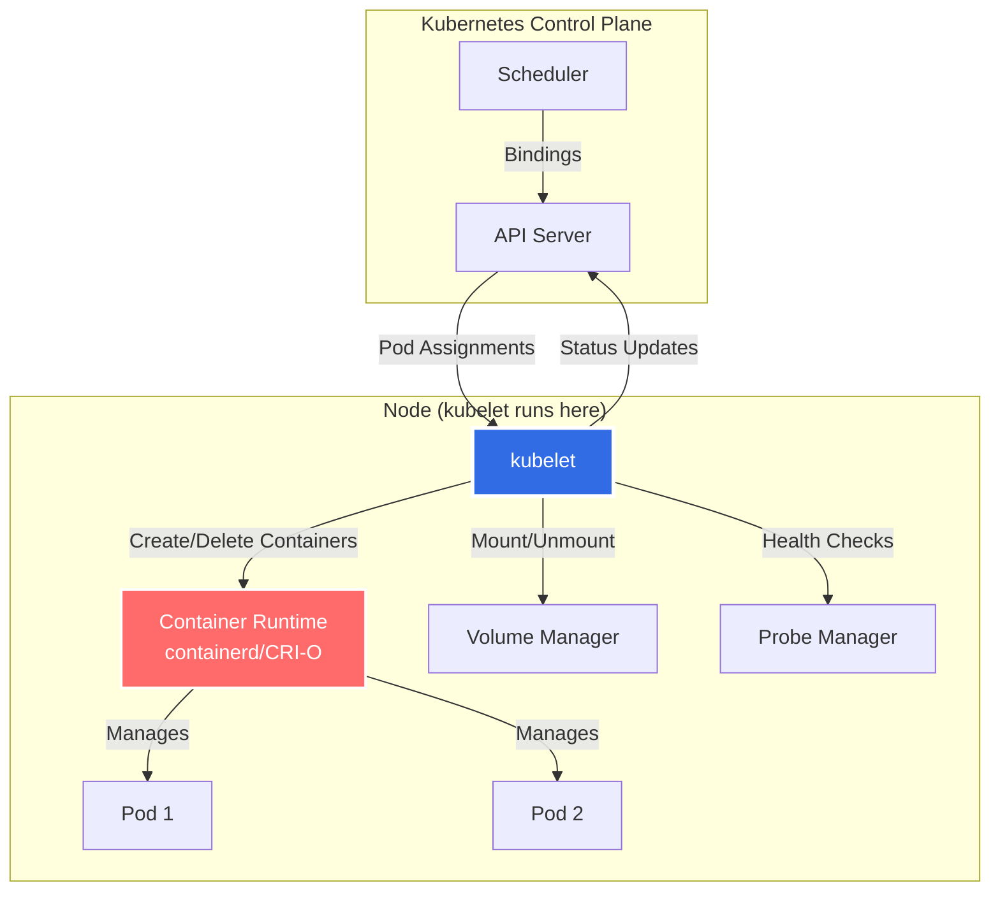

### Who Should Read This?

| Audience | Start Here | Focus Areas |
|----------|------------|-------------|
| **New Contributors** | [GLOSSARY.md](GLOSSARY.md) → [high-level/01-system-overview.md](high-level/01-system-overview.md) | Understanding terminology and overall architecture |
| **Developers** | [01-REQUIREMENTS.md](01-REQUIREMENTS.md) → [high-level/02-component-architecture.md](high-level/02-component-architecture.md) | Design goals and component interactions |
| **Runtime Developers** | [high-level/04-runtime-integration.md](high-level/04-runtime-integration.md) → [low-level/01-cri-implementation.md](low-level/01-cri-implementation.md) | CRI interface and implementation details |
| **Storage Developers** | [middle-level/07-volume-management.md](middle-level/07-volume-management.md) → [low-level/04-volume-plugins.md](low-level/04-volume-plugins.md) | Volume lifecycle and CSI integration |
| **Troubleshooters** | [middle-level/15-logging-monitoring.md](middle-level/15-logging-monitoring.md) → [middle-level/11-eviction.md](middle-level/11-eviction.md) | Debugging techniques and common issues |
| **SREs/Operators** | [02-FUNCTIONAL-SPEC.md](02-FUNCTIONAL-SPEC.md) → [middle-level/08-resource-management.md](middle-level/08-resource-management.md) | Resource management and performance tuning |

---

## What is kubelet?

### Definition

The **kubelet** is the **primary node agent** in Kubernetes. It runs on every node in the cluster and is responsible for:

- **Pod lifecycle management**: Creating, starting, stopping, and removing containers
- **Container runtime integration**: Communicating with container runtimes via CRI (Container Runtime Interface)
- **Volume management**: Mounting and unmounting volumes for Pods
- **Resource management**: Enforcing CPU, memory, and storage limits
- **Health monitoring**: Running liveness, readiness, and startup probes
- **Node registration**: Registering the node with the API server and maintaining heartbeats
- **Status reporting**: Reporting Pod and node status back to the control plane
- **Image management**: Pulling images and garbage collecting unused images
- **Device management**: Allocating devices (GPU, FPGA) to containers via device plugins

### kubelet's Role in Kubernetes

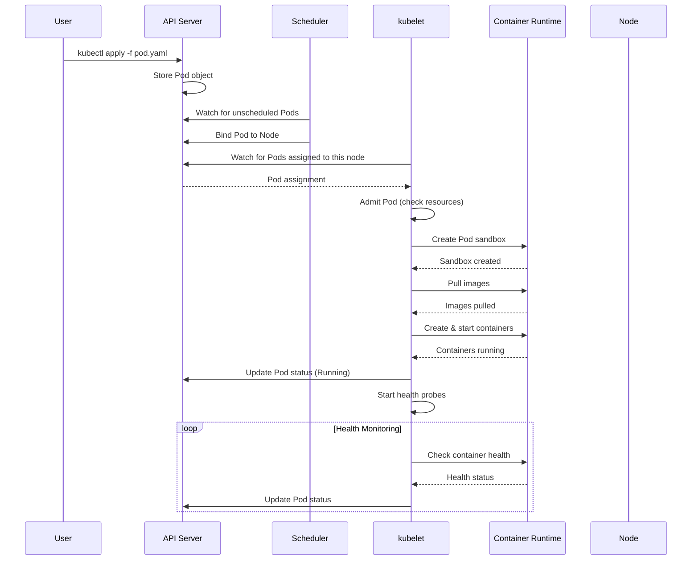

### Key Responsibilities

#### 1. Pod Lifecycle Management

The kubelet is responsible for the entire Pod lifecycle on a node:

- **Pod Addition**: When the API server assigns a Pod to the node, kubelet:
  1. Validates the Pod specification
  2. Checks if the node has sufficient resources
  3. Creates the Pod sandbox (pause container + namespaces)
  4. Pulls container images
  5. Creates and starts init containers (sequentially)
  6. Creates and starts main containers (in parallel)
  7. Reports Pod status to the API server

- **Pod Updates**: When a Pod specification changes:
  1. Compares desired state vs. actual state
  2. Determines if in-place update is possible or restart is needed
  3. Applies changes (e.g., resource limits)
  4. Restarts containers if necessary

- **Pod Deletion**: When a Pod is deleted:
  1. Sets terminating state
  2. Stops running health probes
  3. Calls pre-stop hooks
  4. Sends SIGTERM to containers
  5. Waits for grace period
  6. Sends SIGKILL if containers still running
  7. Unmounts volumes
  8. Removes Pod sandbox
  9. Reports termination to API server

**Code References**:
- Main sync loop: `pkg/kubelet/kubelet.go:1854` - `syncLoop()`
- Pod sync logic: `pkg/kubelet/kubelet_pods.go:1450` - `syncPod()`
- Pod workers: `pkg/kubelet/pod_workers.go:950` - `managePodLoop()`

#### 2. Container Runtime Integration (CRI)

The kubelet communicates with container runtimes (containerd, CRI-O) through the **Container Runtime Interface (CRI)**:

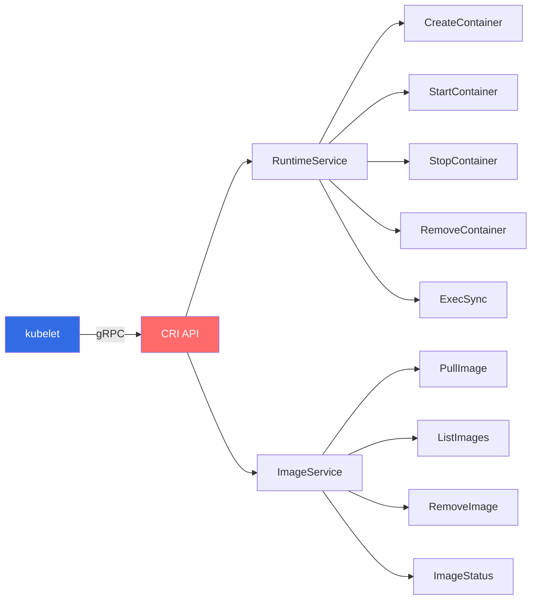

**Code References**:
- CRI client: `pkg/kubelet/cri/remote/remote_runtime.go:45` - `RemoteRuntimeService`
- Runtime manager: `pkg/kubelet/kuberuntime/kuberuntime_manager.go:183` - `kubeGenericRuntimeManager`
- Image manager: `pkg/kubelet/images/image_manager.go:45` - `imageManager`

#### 3. Volume Management

The kubelet manages the entire volume lifecycle:

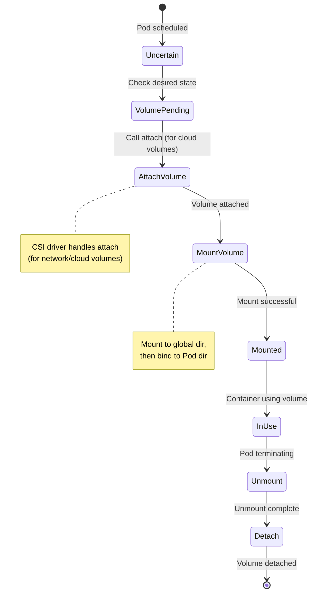

**Code References**:
- Volume manager: `pkg/kubelet/volumemanager/volume_manager.go:125` - `volumeManager`
- Reconciler: `pkg/kubelet/volumemanager/reconciler/reconciler.go:150` - `reconcile()`
- CSI integration: `pkg/volume/csi/csi_mounter.go:75` - `csiMountMgr`

#### 4. Resource Management

The kubelet enforces resource limits and QoS policies:

| QoS Class | Criteria | OOM Priority | Eviction Order |
|-----------|----------|--------------|----------------|
| **Guaranteed** | requests == limits for all containers | Lowest (oom_score_adj: -997) | Last |
| **Burstable** | At least one container has request or limit | Medium (oom_score_adj: 2-999) | Second |
| **BestEffort** | No requests or limits | Highest (oom_score_adj: 1000) | First |

**Code References**:
- Container manager: `pkg/kubelet/cm/container_manager_linux.go:265` - `containerManagerImpl`
- QoS cgroups: `pkg/kubelet/cm/qos_container_manager_linux.go:60` - `qosContainerManager`
- CPU manager: `pkg/kubelet/cm/cpumanager/cpu_manager.go:95` - `manager`
- Memory manager: `pkg/kubelet/cm/memorymanager/memory_manager.go:95` - `manager`

#### 5. Health Monitoring

The kubelet runs three types of probes:

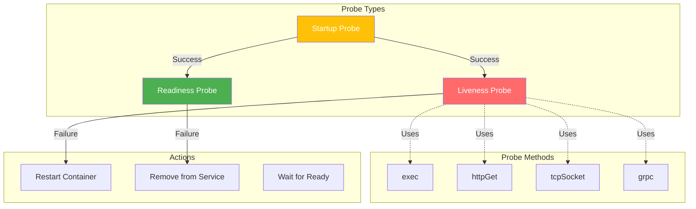

**Code References**:
- Probe manager: `pkg/kubelet/prober/prober_manager.go:95` - `manager`
- Probe worker: `pkg/kubelet/prober/worker.go:80` - `worker`
- Probe exec: `pkg/kubelet/prober/prober.go:125` - `exec()`, `httpGet()`, `tcpSocket()`

#### 6. Node Registration and Heartbeats

The kubelet registers the node and maintains heartbeats:

1. **Initial Registration**:
   - Discovers node information (hostname, IP, capacity)
   - Creates Node object in API server
   - Sets initial node conditions

2. **Periodic Updates** (every 10s by default):
   - Updates node status (conditions, capacity, allocatable)
   - Renews node lease (lightweight heartbeat)
   - Reports image list

**Code References**:
- Node status: `pkg/kubelet/kubelet_node_status.go:350` - `tryUpdateNodeStatus()`
- Node lease: `pkg/kubelet/nodelease/controller.go:85` - `sync()`

---

## Documentation Structure

This documentation is organized into **5 phases**, each building on the previous:

### Phase 1: Core Documentation (4 files)

**Foundation documents with glossary and requirements**

| Document | Purpose | Lines | Diagrams |
|----------|---------|-------|----------|
| [00-README.md](00-README.md) | Navigation guide and overview | 900+ | 8 |
| [01-REQUIREMENTS.md](01-REQUIREMENTS.md) | kubelet requirements and design goals | 900+ | 10 |
| [02-FUNCTIONAL-SPEC.md](02-FUNCTIONAL-SPEC.md) | Functional specification | 1000+ | 12 |
| [GLOSSARY.md](GLOSSARY.md) | 150+ terms and definitions | 1000+ | 5 |

### Phase 2: High-Level Architecture (5 files)

**System overview and architectural patterns**

| Document | Purpose | Lines | Diagrams |
|----------|---------|-------|----------|
| [high-level/01-system-overview.md](high-level/01-system-overview.md) | kubelet's role and main responsibilities | 900+ | 10 |
| [high-level/02-component-architecture.md](high-level/02-component-architecture.md) | Core components and interactions | 950+ | 12 |
| [high-level/03-pod-lifecycle-overview.md](high-level/03-pod-lifecycle-overview.md) | Pod and container lifecycle | 1000+ | 15 |
| [high-level/04-runtime-integration.md](high-level/04-runtime-integration.md) | CRI overview and runtime implementations | 900+ | 8 |
| [high-level/05-initialization-startup.md](high-level/05-initialization-startup.md) | kubelet startup sequence | 850+ | 10 |

### Phase 3: Middle-Level Architecture (15 files)

**Feature-level deep dives**

| Category | Documents | Total Lines |
|----------|-----------|-------------|
| **Pod Management** | pod-sync-loop, PLEG, pod-admission, container-lifecycle, pod-sandbox | 5,000+ |
| **Resource & Images** | image-management, volume-management, resource-management, device-plugins | 4,350+ |
| **Health & Monitoring** | probes-health-checks, eviction, status-manager, garbage-collection | 3,850+ |
| **Node & Logging** | node-lifecycle, logging-monitoring | 1,800+ |

Key documents:
- [middle-level/01-pod-sync-loop.md](middle-level/01-pod-sync-loop.md) - Main reconciliation loop (1,100+ lines)
- [middle-level/02-pleg.md](middle-level/02-pleg.md) - Pod Lifecycle Event Generator (1,000+ lines)
- [middle-level/07-volume-management.md](middle-level/07-volume-management.md) - Volume lifecycle and CSI (1,200+ lines)
- [middle-level/08-resource-management.md](middle-level/08-resource-management.md) - CPU, memory, QoS (1,200+ lines)

### Phase 4: Low-Level Technical Specs (12 files)

**Implementation details and algorithms**

| Category | Documents | Total Lines |
|----------|-----------|-------------|
| **Runtime Details** | CRI implementation, container runtime manager, pod worker | 3,100+ |
| **Resource Details** | cgroup management, CPU manager, memory manager, topology manager | 3,800+ |
| **Volume & Network** | volume plugins, network setup | 1,950+ |
| **Advanced Features** | static pods, pod conditions, pod resources | 2,550+ |

Key documents:
- [low-level/01-cri-implementation.md](low-level/01-cri-implementation.md) - CRI gRPC details (1,100+ lines)
- [low-level/02-cgroup-management.md](low-level/02-cgroup-management.md) - cgroup v1/v2 (1,100+ lines)
- [low-level/12-topology-manager.md](low-level/12-topology-manager.md) - NUMA awareness (950+ lines)

### Phase 5: Code References (4 files)

**Code navigation for contributors**

| Document | Purpose | Lines | Code Refs |
|----------|---------|-------|-----------|
| [code-references/entry-points.md](code-references/entry-points.md) | Main entry points and initialization | 1,200+ | 100+ |
| [code-references/core-managers.md](code-references/core-managers.md) | PLEG, pod manager, status manager | 1,000+ | 80+ |
| [code-references/resource-management.md](code-references/resource-management.md) | CPU, memory, device managers | 1,000+ | 80+ |
| [code-references/cri-volume.md](code-references/cri-volume.md) | CRI client and volume plugins | 900+ | 70+ |

---

## Learning Paths

### Path 1: Complete Beginner

**Goal**: Understand what kubelet is and how it works at a high level

1. **Start**: Read this README
2. **Terminology**: [GLOSSARY.md](GLOSSARY.md) - Learn key terms
3. **Overview**: [high-level/01-system-overview.md](high-level/01-system-overview.md) - Big picture
4. **Pod Lifecycle**: [high-level/03-pod-lifecycle-overview.md](high-level/03-pod-lifecycle-overview.md) - How Pods work
5. **Components**: [high-level/02-component-architecture.md](high-level/02-component-architecture.md) - Main pieces

**Time Investment**: 3-4 hours
**Outcome**: Solid conceptual understanding of kubelet

### Path 2: Container Runtime Developer

**Goal**: Implement or debug container runtimes

1. [GLOSSARY.md](GLOSSARY.md) - CRI terms
2. [high-level/04-runtime-integration.md](high-level/04-runtime-integration.md) - CRI overview
3. [middle-level/04-container-lifecycle.md](middle-level/04-container-lifecycle.md) - Container operations
4. [middle-level/05-pod-sandbox.md](middle-level/05-pod-sandbox.md) - Sandbox concept
5. [low-level/01-cri-implementation.md](low-level/01-cri-implementation.md) - gRPC details
6. [code-references/cri-volume.md](code-references/cri-volume.md) - Code references

**Time Investment**: 6-8 hours
**Outcome**: Deep understanding of CRI and runtime integration

### Path 3: Storage Developer

**Goal**: Develop CSI drivers or volume plugins

1. [GLOSSARY.md](GLOSSARY.md) - Volume terms
2. [02-FUNCTIONAL-SPEC.md](02-FUNCTIONAL-SPEC.md) - Volume requirements
3. [middle-level/07-volume-management.md](middle-level/07-volume-management.md) - Volume lifecycle
4. [low-level/04-volume-plugins.md](low-level/04-volume-plugins.md) - Plugin implementation
5. [code-references/cri-volume.md](code-references/cri-volume.md) - Code walkthrough

**Time Investment**: 5-6 hours
**Outcome**: Complete understanding of volume management

### Path 4: Performance Tuning / SRE

**Goal**: Optimize kubelet performance and troubleshoot issues

1. [01-REQUIREMENTS.md](01-REQUIREMENTS.md) - Performance goals
2. [middle-level/08-resource-management.md](middle-level/08-resource-management.md) - QoS and limits
3. [middle-level/11-eviction.md](middle-level/11-eviction.md) - Eviction policies
4. [middle-level/15-logging-monitoring.md](middle-level/15-logging-monitoring.md) - Metrics and debugging
5. [low-level/02-cgroup-management.md](low-level/02-cgroup-management.md) - cgroup tuning
6. [low-level/10-cpu-manager.md](low-level/10-cpu-manager.md) - CPU pinning
7. [low-level/12-topology-manager.md](low-level/12-topology-manager.md) - NUMA optimization

**Time Investment**: 8-10 hours
**Outcome**: Expert-level performance tuning knowledge

### Path 5: Core Contributor

**Goal**: Contribute to kubelet codebase

1. **Phase 1**: All core documentation (4 files) - 3 hours
2. **Phase 2**: All high-level architecture (5 files) - 4 hours
3. **Phase 3**: All middle-level features (15 files) - 12 hours
4. **Phase 4**: Low-level implementations (12 files) - 10 hours
5. **Phase 5**: Code references (4 files) - 3 hours

**Time Investment**: 30-35 hours
**Outcome**: Comprehensive knowledge of entire kubelet codebase

### Path 6: Troubleshooting Specialist

**Goal**: Debug kubelet issues in production

Priority reading order:

1. [middle-level/15-logging-monitoring.md](middle-level/15-logging-monitoring.md) - Debugging endpoints
2. [middle-level/11-eviction.md](middle-level/11-eviction.md) - Eviction troubleshooting
3. [middle-level/02-pleg.md](middle-level/02-pleg.md) - PLEG unhealthy issues
4. [middle-level/06-image-management.md](middle-level/06-image-management.md) - Image pull failures
5. [middle-level/10-probes-health-checks.md](middle-level/10-probes-health-checks.md) - Probe failures
6. [middle-level/13-garbage-collection.md](middle-level/13-garbage-collection.md) - Disk pressure
7. [low-level/02-cgroup-management.md](low-level/02-cgroup-management.md) - OOM issues

**Time Investment**: 6-8 hours
**Outcome**: Ability to diagnose and fix common kubelet issues

---

## Navigation Guide

### By Component

#### PLEG (Pod Lifecycle Event Generator)

- **Overview**: [high-level/02-component-architecture.md](high-level/02-component-architecture.md#pleg)
- **Deep Dive**: [middle-level/02-pleg.md](middle-level/02-pleg.md)
- **Code**: [code-references/core-managers.md](code-references/core-managers.md#pleg)

#### Pod Sync Loop

- **Overview**: [high-level/01-system-overview.md](high-level/01-system-overview.md#sync-loop)
- **Deep Dive**: [middle-level/01-pod-sync-loop.md](middle-level/01-pod-sync-loop.md)
- **Implementation**: [low-level/03-pod-worker.md](low-level/03-pod-worker.md)
- **Code**: [code-references/entry-points.md](code-references/entry-points.md#sync-loop)

#### Container Runtime Interface (CRI)

- **Overview**: [high-level/04-runtime-integration.md](high-level/04-runtime-integration.md)
- **Container Lifecycle**: [middle-level/04-container-lifecycle.md](middle-level/04-container-lifecycle.md)
- **Implementation**: [low-level/01-cri-implementation.md](low-level/01-cri-implementation.md)
- **Runtime Manager**: [low-level/05-container-runtime-manager.md](low-level/05-container-runtime-manager.md)
- **Code**: [code-references/cri-volume.md](code-references/cri-volume.md#cri)

#### Volume Management

- **Spec**: [02-FUNCTIONAL-SPEC.md](02-FUNCTIONAL-SPEC.md#volume-management)
- **Deep Dive**: [middle-level/07-volume-management.md](middle-level/07-volume-management.md)
- **Plugins**: [low-level/04-volume-plugins.md](low-level/04-volume-plugins.md)
- **Code**: [code-references/cri-volume.md](code-references/cri-volume.md#volume)

#### Resource Management

- **Overview**: [02-FUNCTIONAL-SPEC.md](02-FUNCTIONAL-SPEC.md#resource-management)
- **QoS & Limits**: [middle-level/08-resource-management.md](middle-level/08-resource-management.md)
- **cgroups**: [low-level/02-cgroup-management.md](low-level/02-cgroup-management.md)
- **CPU Manager**: [low-level/10-cpu-manager.md](low-level/10-cpu-manager.md)
- **Memory Manager**: [low-level/11-memory-manager.md](low-level/11-memory-manager.md)
- **Topology Manager**: [low-level/12-topology-manager.md](low-level/12-topology-manager.md)
- **Code**: [code-references/resource-management.md](code-references/resource-management.md)

#### Health Monitoring

- **Probes**: [middle-level/10-probes-health-checks.md](middle-level/10-probes-health-checks.md)
- **Eviction**: [middle-level/11-eviction.md](middle-level/11-eviction.md)
- **Node Health**: [middle-level/14-node-lifecycle.md](middle-level/14-node-lifecycle.md)

### By Topic

#### Pod Lifecycle

1. [high-level/03-pod-lifecycle-overview.md](high-level/03-pod-lifecycle-overview.md) - States and transitions
2. [middle-level/01-pod-sync-loop.md](middle-level/01-pod-sync-loop.md) - Reconciliation loop
3. [middle-level/03-pod-admission.md](middle-level/03-pod-admission.md) - Admission checks
4. [middle-level/04-container-lifecycle.md](middle-level/04-container-lifecycle.md) - Container operations
5. [low-level/08-pod-conditions.md](low-level/08-pod-conditions.md) - Pod conditions
6. [low-level/09-static-pods.md](low-level/09-static-pods.md) - Static pods

#### Performance

1. [01-REQUIREMENTS.md](01-REQUIREMENTS.md#performance) - Performance goals
2. [middle-level/08-resource-management.md](middle-level/08-resource-management.md) - Resource optimization
3. [low-level/10-cpu-manager.md](low-level/10-cpu-manager.md) - CPU pinning
4. [low-level/12-topology-manager.md](low-level/12-topology-manager.md) - NUMA awareness
5. [middle-level/02-pleg.md](middle-level/02-pleg.md#performance) - PLEG optimization

#### Troubleshooting

1. [middle-level/15-logging-monitoring.md](middle-level/15-logging-monitoring.md) - Logs and metrics
2. [middle-level/11-eviction.md](middle-level/11-eviction.md#troubleshooting) - Eviction issues
3. [middle-level/06-image-management.md](middle-level/06-image-management.md#troubleshooting) - Image pulls
4. [middle-level/02-pleg.md](middle-level/02-pleg.md#troubleshooting) - PLEG unhealthy

---

## Getting Started

### Prerequisites

Before diving into kubelet architecture, you should be familiar with:

1. **Kubernetes Basics**:
   - Pods, Deployments, Services
   - Namespaces and labels
   - kubectl commands

2. **Container Technology**:
   - Docker or containerd basics
   - Container images and registries
   - Namespaces and cgroups (Linux)

3. **Linux System Administration**:
   - systemd and service management
   - File systems and mount points
   - Process management

### Recommended Reading Order

#### Week 1: Foundations

**Days 1-2**: Core Concepts
- [00-README.md](00-README.md) (this file)
- [GLOSSARY.md](GLOSSARY.md) - Read all terms
- [01-REQUIREMENTS.md](01-REQUIREMENTS.md) - Design goals

**Days 3-4**: High-Level Architecture
- [high-level/01-system-overview.md](high-level/01-system-overview.md)
- [high-level/02-component-architecture.md](high-level/02-component-architecture.md)
- [high-level/03-pod-lifecycle-overview.md](high-level/03-pod-lifecycle-overview.md)

**Days 5-7**: Functional Specification
- [02-FUNCTIONAL-SPEC.md](02-FUNCTIONAL-SPEC.md) - Complete read
- [high-level/04-runtime-integration.md](high-level/04-runtime-integration.md)
- [high-level/05-initialization-startup.md](high-level/05-initialization-startup.md)

#### Week 2: Deep Dives

**Days 8-10**: Pod Management
- [middle-level/01-pod-sync-loop.md](middle-level/01-pod-sync-loop.md)
- [middle-level/02-pleg.md](middle-level/02-pleg.md)
- [middle-level/03-pod-admission.md](middle-level/03-pod-admission.md)

**Days 11-12**: Container Lifecycle
- [middle-level/04-container-lifecycle.md](middle-level/04-container-lifecycle.md)
- [middle-level/05-pod-sandbox.md](middle-level/05-pod-sandbox.md)
- [low-level/01-cri-implementation.md](low-level/01-cri-implementation.md)

**Days 13-14**: Resource & Volume Management
- [middle-level/07-volume-management.md](middle-level/07-volume-management.md)
- [middle-level/08-resource-management.md](middle-level/08-resource-management.md)

#### Weeks 3-4: Advanced Topics

Continue with remaining middle-level and low-level documents based on your interests.

### Tools and Commands

#### Essential Commands

```bash
# View kubelet status
systemctl status kubelet

# View kubelet logs
journalctl -u kubelet -f

# Check kubelet configuration
ps aux | grep kubelet

# View kubelet metrics
curl http://localhost:10250/metrics

# List Pods managed by kubelet
crictl pods

# List containers
crictl ps

# Inspect container
crictl inspect <container-id>

# View Pod logs
crictl logs <container-id>
```

#### Debugging Endpoints

kubelet exposes several HTTP endpoints for debugging:

| Endpoint | Purpose | Example |
|----------|---------|---------|
| `/healthz` | Health check | `curl -k https://localhost:10250/healthz` |
| `/metrics` | Prometheus metrics | `curl -k https://localhost:10250/metrics` |
| `/metrics/cadvisor` | cAdvisor metrics | `curl -k https://localhost:10250/metrics/cadvisor` |
| `/metrics/probes` | Probe metrics | `curl -k https://localhost:10250/metrics/probes` |
| `/metrics/resource` | Resource metrics | `curl -k https://localhost:10250/metrics/resource` |
| `/pods` | Running Pods | `curl -k https://localhost:10250/pods` |
| `/stats` | Stats summary | `curl -k https://localhost:10250/stats/summary` |
| `/configz` | Configuration | `curl -k https://localhost:10250/configz` |

See [middle-level/15-logging-monitoring.md](middle-level/15-logging-monitoring.md) for complete details.

---

## Key Concepts

### Pod Lifecycle States

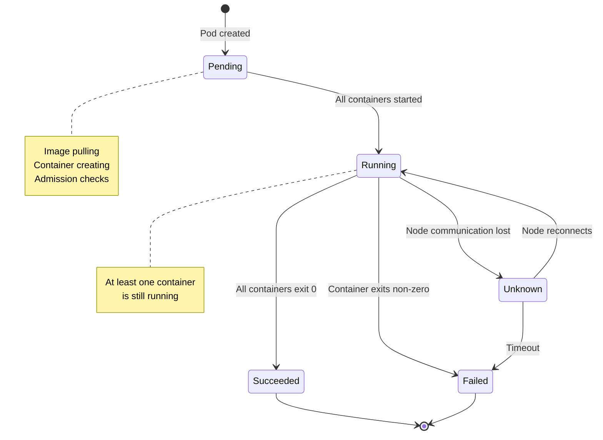

**See**: [high-level/03-pod-lifecycle-overview.md](high-level/03-pod-lifecycle-overview.md) for complete state machine.

### Container States

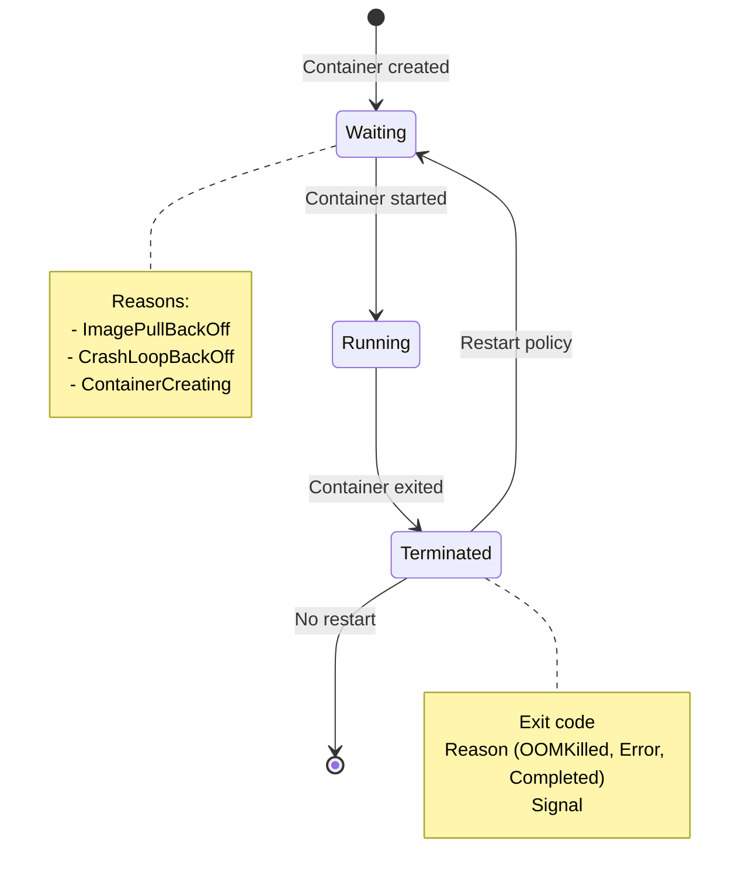

### QoS Classes

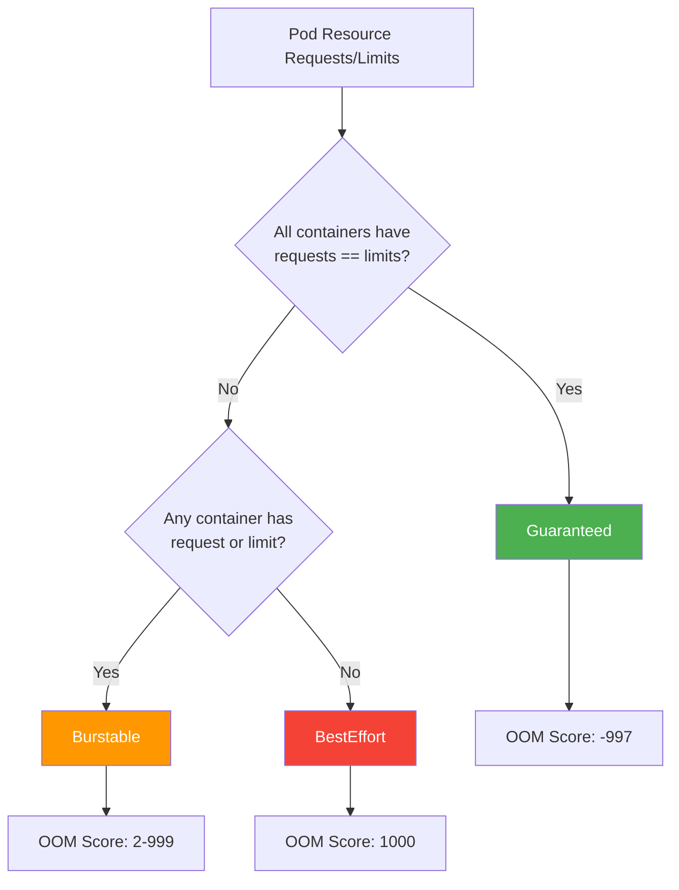

**See**: [middle-level/08-resource-management.md](middle-level/08-resource-management.md#qos-classes)

### Main Sync Loop

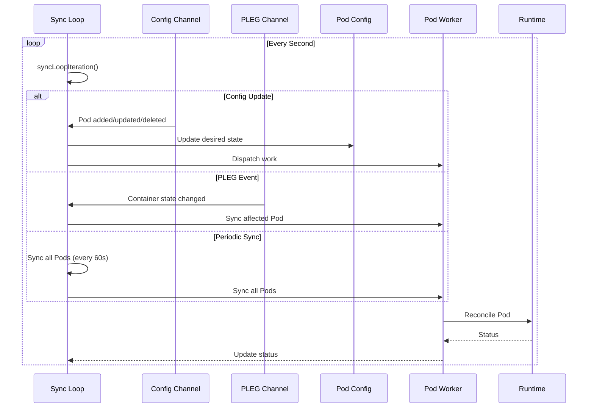

**See**: [middle-level/01-pod-sync-loop.md](middle-level/01-pod-sync-loop.md)

---

## Architecture Overview

### Component Diagram

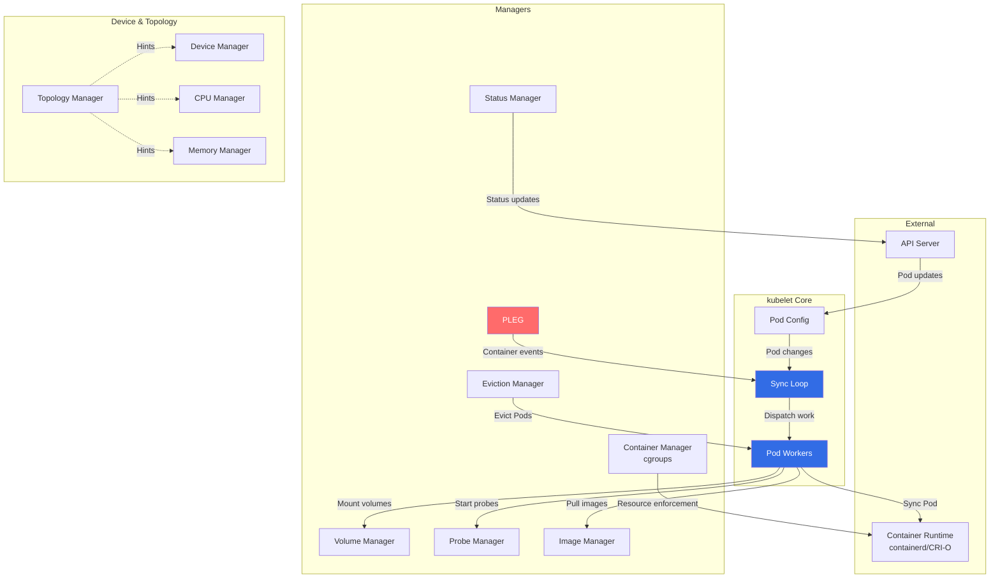

**See**: [high-level/02-component-architecture.md](high-level/02-component-architecture.md) for detailed explanation.

### Data Flow

#### Pod Creation Flow

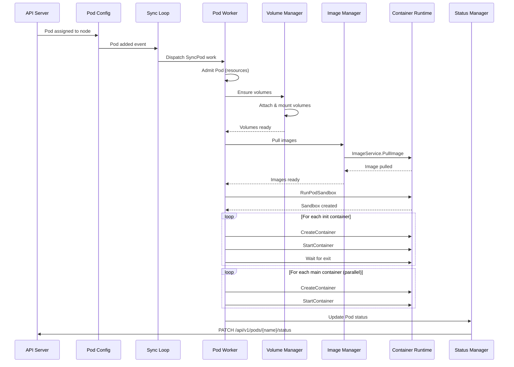

---

## For Different Audiences

### For Kubernetes Users

**You don't typically interact with kubelet directly**, but understanding it helps with:

- **Troubleshooting Pod issues**: Why Pods won't start, are evicted, or crash
- **Resource management**: How CPU/memory limits work
- **Storage**: How volumes are mounted
- **Monitoring**: What metrics kubelet provides

**Start with**:
- [high-level/03-pod-lifecycle-overview.md](high-level/03-pod-lifecycle-overview.md)
- [middle-level/10-probes-health-checks.md](middle-level/10-probes-health-checks.md)
- [middle-level/11-eviction.md](middle-level/11-eviction.md)

### For Cluster Administrators

**You configure and monitor kubelet** on each node:

- **Configuration**: kubelet flags and config files
- **Monitoring**: Metrics, logs, and health endpoints
- **Troubleshooting**: PLEG unhealthy, image pulls, evictions
- **Performance tuning**: Resource reservations, QoS, eviction thresholds

**Start with**:
- [high-level/05-initialization-startup.md](high-level/05-initialization-startup.md)
- [middle-level/15-logging-monitoring.md](middle-level/15-logging-monitoring.md)
- [middle-level/11-eviction.md](middle-level/11-eviction.md)
- [middle-level/08-resource-management.md](middle-level/08-resource-management.md)

### For Application Developers

**You write Pod specs that kubelet executes**:

- **Container lifecycle**: How init containers, sidecars, and hooks work
- **Health probes**: Liveness, readiness, startup probes
- **Resource requests/limits**: How they affect scheduling and QoS
- **Volumes**: How to mount config, secrets, and persistent storage
- **Termination**: Graceful shutdown and pre-stop hooks

**Start with**:
- [high-level/03-pod-lifecycle-overview.md](high-level/03-pod-lifecycle-overview.md)
- [middle-level/04-container-lifecycle.md](middle-level/04-container-lifecycle.md)
- [middle-level/10-probes-health-checks.md](middle-level/10-probes-health-checks.md)
- [middle-level/07-volume-management.md](middle-level/07-volume-management.md)

### For Runtime Developers

**You implement container runtimes** (containerd, CRI-O):

- **CRI specification**: gRPC interfaces (RuntimeService, ImageService)
- **Pod sandbox**: Pause container and namespace setup
- **Container lifecycle**: Create, start, stop, remove operations
- **Streaming**: Exec, attach, port-forward
- **Image operations**: Pull, list, remove

**Start with**:
- [high-level/04-runtime-integration.md](high-level/04-runtime-integration.md)
- [low-level/01-cri-implementation.md](low-level/01-cri-implementation.md)
- [middle-level/05-pod-sandbox.md](middle-level/05-pod-sandbox.md)
- [low-level/05-container-runtime-manager.md](low-level/05-container-runtime-manager.md)

### For Storage Developers

**You implement CSI drivers** or volume plugins:

- **Volume lifecycle**: Attach, mount, unmount, detach
- **CSI integration**: How kubelet calls CSI drivers
- **Volume reconstruction**: How kubelet handles restarts
- **Orphaned volumes**: Cleanup mechanisms

**Start with**:
- [middle-level/07-volume-management.md](middle-level/07-volume-management.md)
- [low-level/04-volume-plugins.md](low-level/04-volume-plugins.md)
- [code-references/cri-volume.md](code-references/cri-volume.md)

### For Device Plugin Developers

**You implement device plugins** (GPU, FPGA, etc.):

- **Device plugin framework**: Registration, allocation, health
- **Topology awareness**: NUMA affinity
- **Resource allocation**: How devices are assigned to Pods

**Start with**:
- [middle-level/09-device-plugins.md](middle-level/09-device-plugins.md)
- [low-level/12-topology-manager.md](low-level/12-topology-manager.md)

### For Kubernetes Contributors

**You contribute to kubelet codebase**:

- **Complete architecture**: All components and interactions
- **Code organization**: File structure and entry points
- **Implementation details**: Algorithms and data structures
- **Testing**: Unit tests, integration tests

**Start with**:
- All Phase 1-5 documents
- Pay special attention to [code-references/](code-references/) directory

---

## Contributing

### How to Improve This Documentation

This documentation is meant to evolve with Kubernetes. If you find:

- **Outdated information**: Please update with current behavior
- **Missing details**: Add sections or expand existing ones
- **Errors**: Fix technical inaccuracies
- **Better examples**: Contribute real-world use cases
- **Code reference updates**: Update file:line references as code changes

### Documentation Standards

Every document should have:

- ✅ **800-1000+ lines** of comprehensive content
- ✅ **10-20 Mermaid diagrams** (sequence, flow, state, architecture)
- ✅ **30+ code references** with file:line numbers (e.g., `pkg/kubelet/kubelet.go:1854`)
- ✅ **Real-world examples** (YAML specs, logs, configs)
- ✅ **Cross-references** to related documents
- ✅ **Performance considerations** and benchmarks
- ✅ **Best practices** section
- ✅ **Troubleshooting** section
- ✅ **Summary** with key takeaways

### Contributing to kubelet Code

If you want to contribute to kubelet itself:

1. **Understand the architecture**: Read all Phase 1-3 documents
2. **Find an issue**: Check GitHub issues labeled `area/kubelet`
3. **Review code**: Use [code-references/](code-references/) to navigate
4. **Write tests**: Every change needs tests
5. **Update docs**: Update this documentation if behavior changes

**Useful Links**:
- [Kubernetes Contributor Guide](https://github.com/kubernetes/community/tree/master/contributors/guide)
- [kubelet Issues](https://github.com/kubernetes/kubernetes/labels/area%2Fkubelet)
- [SIG Node](https://github.com/kubernetes/community/tree/master/sig-node)

---

## Quick Reference Tables

### kubelet Configuration Files

| File | Purpose | Location |
|------|---------|----------|
| kubelet binary | Main executable | `/usr/bin/kubelet` or `/usr/local/bin/kubelet` |
| kubelet.service | systemd unit file | `/etc/systemd/system/kubelet.service` |
| KubeletConfiguration | Configuration YAML | `/var/lib/kubelet/config.yaml` |
| kubeconfig | API server auth | `/etc/kubernetes/kubelet.conf` |
| Pod manifest directory | Static Pods | `/etc/kubernetes/manifests/` |

### Important Directories

| Directory | Purpose |
|-----------|---------|
| `/var/lib/kubelet/` | kubelet's working directory |
| `/var/lib/kubelet/pods/` | Pod data (volumes, plugins) |
| `/var/lib/kubelet/pod-resources/` | Device allocation |
| `/var/lib/kubelet/device-plugins/` | Device plugin sockets |
| `/var/lib/kubelet/plugins/` | Volume plugins |
| `/var/log/pods/` | Container logs |
| `/etc/kubernetes/manifests/` | Static Pod definitions |

### kubelet Flags (Common)

| Flag | Purpose | Default |
|------|---------|---------|
| `--config` | Config file path | - |
| `--kubeconfig` | API server config | - |
| `--pod-manifest-path` | Static Pods directory | - |
| `--root-dir` | Working directory | `/var/lib/kubelet` |
| `--container-runtime-endpoint` | CRI socket | `unix:///run/containerd/containerd.sock` |
| `--image-service-endpoint` | Image service socket | Same as runtime endpoint |
| `--pod-infra-container-image` | Pause image | `registry.k8s.io/pause:3.9` |
| `--node-status-update-frequency` | Status update interval | `10s` |
| `--sync-frequency` | Sync loop interval | `1m0s` |
| `--eviction-hard` | Hard eviction thresholds | `memory.available<100Mi` |
| `--max-pods` | Maximum Pods per node | `110` |

### Performance Benchmarks

| Metric | Typical Value | High-Scale Value |
|--------|---------------|------------------|
| **Max Pods per Node** | 110 | 250 (with tuning) |
| **Pod Startup Time** | 5-10 seconds | - |
| **Sync Loop Iteration** | <100ms | <200ms |
| **PLEG Relist** | Every 1s | Every 1s |
| **Status Update** | Every 10s | Every 10s |
| **Node Heartbeat** | Every 10s | Every 10s |
| **Memory per Pod** | ~5-10 MB | - |

---

## Related Documentation

### Official Kubernetes Documentation

- [kubelet Official Docs](https://kubernetes.io/docs/reference/command-line-tools-reference/kubelet/)
- [Pod Lifecycle](https://kubernetes.io/docs/concepts/workloads/pods/pod-lifecycle/)
- [Container Runtime Interface (CRI)](https://kubernetes.io/docs/concepts/architecture/cri/)
- [Device Plugins](https://kubernetes.io/docs/concepts/extend-kubernetes/compute-storage-net/device-plugins/)

### Other Architecture Documentation

If you found this documentation helpful, check out similar docs for other Kubernetes components:

- **kube-apiserver**: API server architecture (same documentation style)
- **kube-scheduler**: Scheduling decisions and algorithms
- **kube-controller-manager**: Controller patterns and reconciliation

### Source Code

- **Main repository**: https://github.com/kubernetes/kubernetes
- **kubelet code**: https://github.com/kubernetes/kubernetes/tree/master/pkg/kubelet
- **CRI API**: https://github.com/kubernetes/cri-api

---

## Summary

### What You Learned

After reading this README, you should understand:

1. ✅ **What kubelet is**: The primary node agent in Kubernetes
2. ✅ **Main responsibilities**: Pod lifecycle, runtime integration, resource management, health monitoring
3. ✅ **Architecture**: Event-driven with periodic reconciliation
4. ✅ **Key components**: PLEG, pod workers, volume manager, status manager
5. ✅ **Documentation structure**: 5 phases from basics to implementation details
6. ✅ **Learning paths**: Customized paths for different roles

### Next Steps

Based on your role, proceed to:

| Role | Next Document |
|------|---------------|
| **Beginner** | [GLOSSARY.md](GLOSSARY.md) |
| **Developer** | [01-REQUIREMENTS.md](01-REQUIREMENTS.md) |
| **Runtime Dev** | [high-level/04-runtime-integration.md](high-level/04-runtime-integration.md) |
| **Storage Dev** | [middle-level/07-volume-management.md](middle-level/07-volume-management.md) |
| **SRE/Operator** | [middle-level/15-logging-monitoring.md](middle-level/15-logging-monitoring.md) |
| **Contributor** | [high-level/01-system-overview.md](high-level/01-system-overview.md) |

### Key Takeaways

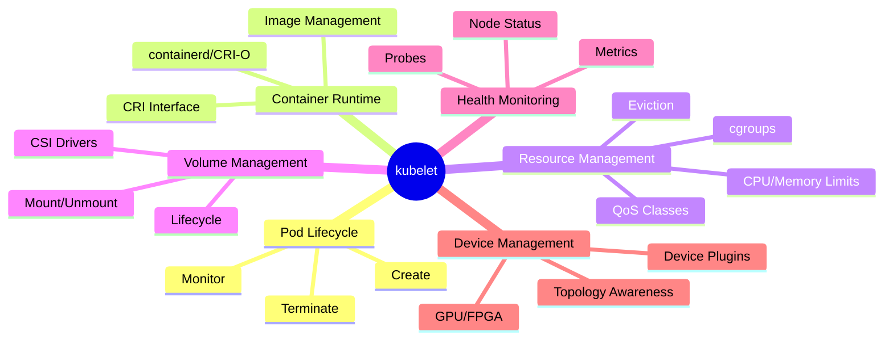

---

## Feedback and Updates

This documentation is actively maintained. If you have feedback:

1. **Issues**: Open an issue in the Kubernetes repository
2. **Updates**: Submit a PR with improvements
3. **Questions**: Ask in `#sig-node` on Kubernetes Slack

**Last Updated**: 2025-10-21
**Kubernetes Version**: v1.32+
**Documentation Version**: 1.0

---

**Happy Learning!** 🚀

*Start your journey with [GLOSSARY.md](GLOSSARY.md) to learn the essential kubelet terminology.*

