# kubelet Requirements and Design Goals

**Version**: Kubernetes v1.32+
**Component**: kubelet - The Kubernetes Node Agent
**Document Type**: Requirements and Design Specification
**Last Updated**: 2025-10-21

---

## Table of Contents

- [Executive Summary](#executive-summary)
- [System Purpose](#system-purpose)
- [Core Requirements](#core-requirements)
- [Design Goals](#design-goals)
- [Non-Functional Requirements](#non-functional-requirements)
- [Performance Requirements](#performance-requirements)
- [Reliability Requirements](#reliability-requirements)
- [Scalability Requirements](#scalability-requirements)
- [Security Requirements](#security-requirements)
- [Maintainability Requirements](#maintainability-requirements)
- [Integration Requirements](#integration-requirements)
- [Trade-offs and Design Decisions](#trade-offs-and-design-decisions)
- [Evolution and Future Requirements](#evolution-and-future-requirements)

---

## Executive Summary

The **kubelet** is the primary **node agent** in Kubernetes, responsible for managing the container runtime lifecycle on each node. This document outlines the comprehensive requirements and design goals that guide kubelet's architecture and implementation.

### Mission Statement

> **The kubelet's mission is to reliably execute containerized workloads on a node, ensuring they meet their desired state as defined by the Kubernetes API, while efficiently managing node resources and maintaining system stability.**

### Key Design Principles

1. **Reliability First**: Pod lifecycle management must be rock-solid
2. **Level-Triggered Reconciliation**: Desired state vs. actual state, not events
3. **Modularity**: Clear separation of concerns between managers
4. **Runtime Agnosticism**: Works with any CRI-compliant container runtime
5. **Resource Efficiency**: Minimal overhead while managing hundreds of Pods
6. **Fail-Safe**: Graceful degradation and recovery from failures

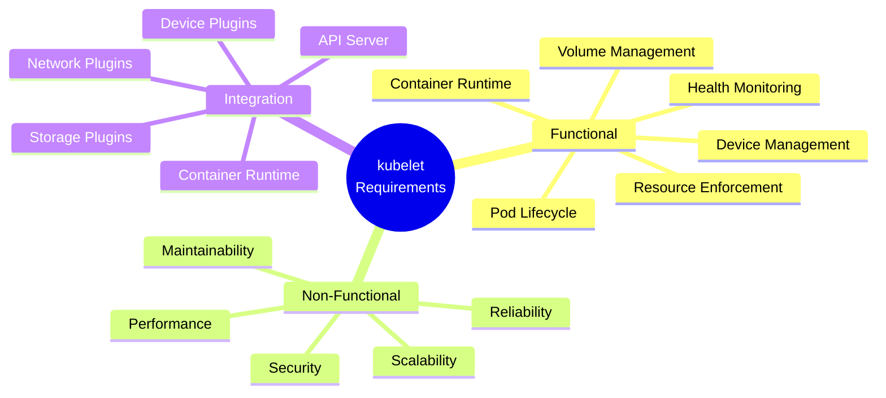

---

## System Purpose

### Primary Responsibilities

The kubelet serves as the **bridge** between the Kubernetes control plane and the container runtime on each node:

1. **Pod Lifecycle Manager**: Create, monitor, and terminate Pods according to API server specifications
2. **Runtime Interface**: Abstract container runtime operations through CRI
3. **Resource Manager**: Enforce CPU, memory, and storage limits using cgroups
4. **Volume Manager**: Handle volume attachment, mounting, and cleanup
5. **Health Monitor**: Run probes and report Pod/node health status
6. **Node Agent**: Register node and maintain heartbeats with control plane

### System Boundaries

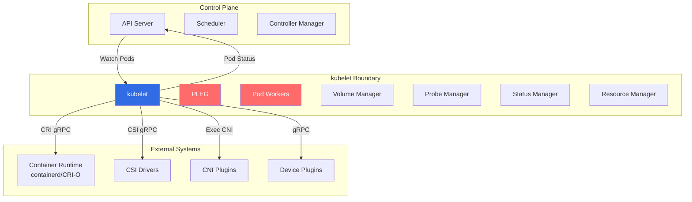

**What kubelet IS responsible for**:
- ✅ Pod and container lifecycle on the node
- ✅ Resource enforcement (CPU, memory, storage)
- ✅ Volume mounting and unmounting
- ✅ Health probes and status reporting
- ✅ Image pulling and garbage collection
- ✅ Node registration and heartbeats

**What kubelet is NOT responsible for**:
- ❌ Pod scheduling decisions (done by kube-scheduler)
- ❌ Cross-node networking (done by CNI plugins)
- ❌ Volume provisioning (done by CSI drivers/controllers)
- ❌ Cluster-wide decisions (done by controllers)
- ❌ Authentication/authorization (delegated to API server)

---

## Core Requirements

### R1: Pod Lifecycle Management

**Requirement**: The kubelet MUST manage the complete lifecycle of Pods assigned to its node, from creation through termination.

#### R1.1: Pod Creation

**MUST**:
- Accept Pod specifications from the API server
- Validate Pod specifications before creating resources
- Create Pod sandbox (pause container + namespaces)
- Pull required container images (with configurable policies)
- Create and start init containers sequentially
- Create and start main containers (can be parallel)
- Report Pod status back to API server

**Code Reference**: `pkg/kubelet/kubelet_pods.go:1450` - `syncPod()`

#### R1.2: Pod Updates

**MUST**:
- Detect changes to Pod specifications
- Apply in-place updates when possible (e.g., container image, resource limits in 1.27+)
- Restart containers when necessary
- Maintain Pod identity (UID, name, namespace)

#### R1.3: Pod Termination

**MUST**:
- Gracefully terminate Pods when requested
- Call pre-stop hooks before termination
- Send SIGTERM to containers and wait for grace period
- Send SIGKILL if containers don't exit within grace period
- Unmount volumes after containers stop
- Clean up Pod sandbox and report termination

**Sequence**:

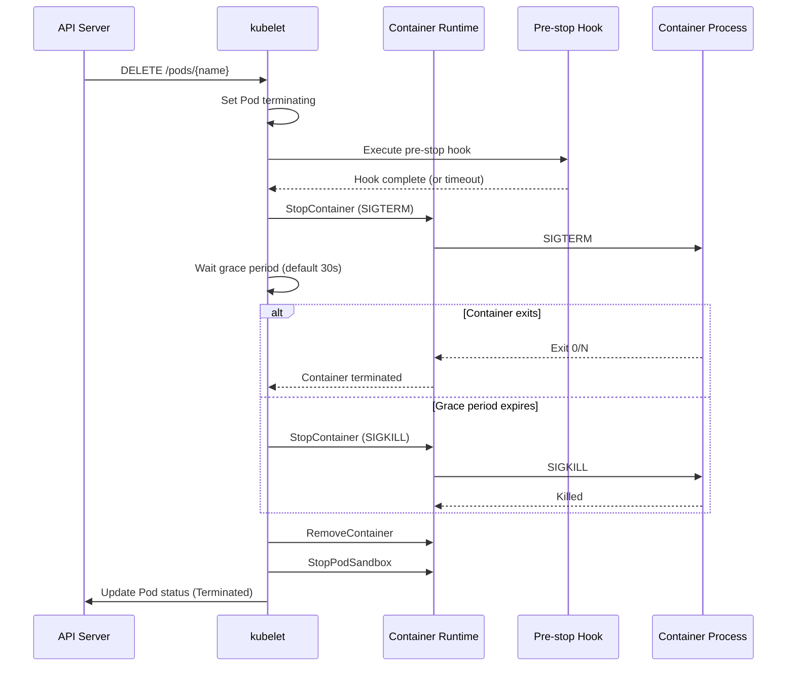

#### R1.4: Restart Policy Enforcement

**MUST** support three restart policies:

| Policy | Behavior | Use Case |
|--------|----------|----------|
| **Always** | Restart container regardless of exit code | Long-running services (default) |
| **OnFailure** | Restart only if exit code != 0 | Batch jobs that might fail |
| **Never** | Never restart containers | One-shot tasks |

**Code Reference**: `pkg/kubelet/kuberuntime/kuberuntime_container.go:550` - `ShouldContainerBeRestarted()`

### R2: Container Runtime Integration

**Requirement**: The kubelet MUST integrate with container runtimes through a well-defined, versioned interface.

#### R2.1: CRI Compliance

**MUST**:
- Implement CRI (Container Runtime Interface) v1 client
- Support gRPC communication with container runtime
- Handle both RuntimeService and ImageService APIs
- Version negotiate with runtime (detect CRI version)
- Gracefully handle runtime failures and reconnect

**CRI Services**:

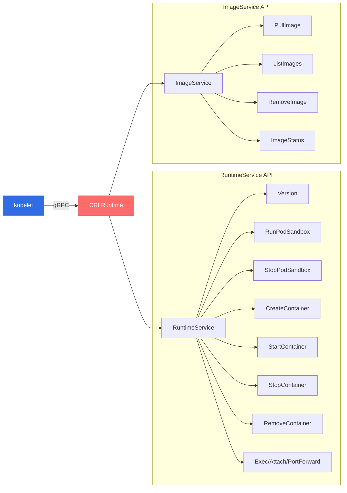

**Code Reference**: `pkg/kubelet/cri/remote/remote_runtime.go:45` - `RemoteRuntimeService`

#### R2.2: Runtime Abstraction

**MUST**:
- Work with any CRI-compliant runtime (containerd, CRI-O, etc.)
- NOT depend on runtime-specific features
- Handle runtime differences gracefully
- Support runtime version upgrades

#### R2.3: Streaming Operations

**MUST** support:
- `kubectl exec`: Execute commands in containers
- `kubectl attach`: Attach to running containers
- `kubectl port-forward`: Forward ports to Pods
- `kubectl logs`: Stream container logs

**Code Reference**: `pkg/kubelet/cri/streaming/server.go:75` - Streaming server implementation

### R3: Resource Management

**Requirement**: The kubelet MUST enforce resource limits and manage node resources efficiently.

#### R3.1: Resource Enforcement

**MUST** enforce:
- **CPU limits**: Using cgroup CPU quota/period
- **Memory limits**: Using cgroup memory limits
- **Ephemeral storage limits**: Monitoring disk usage
- **PID limits**: Preventing fork bombs

**QoS Classes**:

```mermaid
graph TB
    POD[Pod Specification]
    POD --> CHK1{All containers:<br/>requests == limits?}
    CHK1 -->|Yes| GUAR[Guaranteed]
    CHK1 -->|No| CHK2{Any container:<br/>has request or limit?}
    CHK2 -->|Yes| BURST[Burstable]
    CHK2 -->|No| BEST[BestEffort]

    GUAR --> CG1[cgroup: /kubepods/pod-guaranteed/pod-{uid}]
    BURST --> CG2[cgroup: /kubepods/pod-burstable/pod-{uid}]
    BEST --> CG3[cgroup: /kubepods/pod-besteffort/pod-{uid}]

    CG1 --> OOM1[oom_score_adj: -997]
    CG2 --> OOM2[oom_score_adj: 2-999]
    CG3 --> OOM3[oom_score_adj: 1000]

    style GUAR fill:#4CAF50,color:#fff
    style BURST fill:#FF9800,color:#fff
    style BEST fill:#F44336,color:#fff
```

**Code Reference**: `pkg/kubelet/cm/qos_container_manager_linux.go:60` - QoS cgroup creation

#### R3.2: Node Allocatable

**MUST** calculate and enforce **node allocatable**:

```
Node Allocatable = Node Capacity - System Reserved - Kube Reserved - Eviction Threshold
```

**Example**:
```
Node Capacity:      32 GB RAM, 16 CPU
System Reserved:     4 GB RAM,  1 CPU  (OS, system daemons)
Kube Reserved:       2 GB RAM,  1 CPU  (kubelet, runtime, etc.)
Eviction Threshold:  1 GB RAM         (hard eviction)
---
Node Allocatable:   25 GB RAM, 14 CPU  (available for Pods)
```

**Code Reference**: `pkg/kubelet/cm/container_manager_linux.go:450` - Node allocatable calculation

#### R3.3: CPU Management

**MUST** support CPU management policies:

| Policy | Description | Use Case |
|--------|-------------|----------|
| **none** | Default CPU shares, no pinning | General workloads |
| **static** | CPU pinning for Guaranteed Pods with integer CPU requests | Latency-sensitive workloads |

**Code Reference**: `pkg/kubelet/cm/cpumanager/cpu_manager.go:95` - CPU manager

#### R3.4: Memory Management

**MUST** support memory management policies for NUMA systems:

| Policy | Description | Use Case |
|--------|-------------|----------|
| **None** | Default memory allocation | Non-NUMA or general workloads |
| **Single-NUMA-Node** | Pin memory to single NUMA node | NUMA-aware applications |

**Code Reference**: `pkg/kubelet/cm/memorymanager/memory_manager.go:95` - Memory manager

### R4: Volume Management

**Requirement**: The kubelet MUST manage the complete volume lifecycle for Pods.

#### R4.1: Volume Lifecycle

**MUST** support the full lifecycle:

1. **Attach** (for cloud volumes): Attach volume to node (via CSI)
2. **Mount**: Mount volume to global directory
3. **Bind**: Bind mount to Pod directory
4. **Unmount**: Unmount from Pod directory when Pod terminates
5. **Detach**: Detach from node (via CSI) when no longer needed

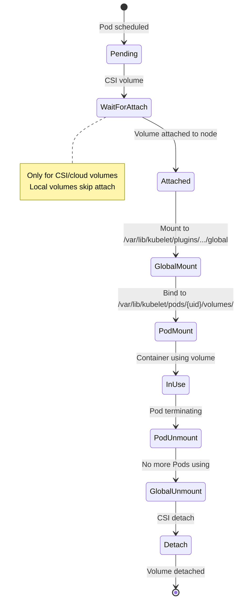

**Code Reference**: `pkg/kubelet/volumemanager/reconciler/reconciler.go:150` - Volume reconciliation

#### R4.2: Volume Plugin Support

**MUST** support:
- **CSI (Container Storage Interface)**: Preferred, out-of-tree drivers
- **In-tree plugins** (deprecated): emptyDir, hostPath, configMap, secret, downwardAPI, projected
- **FlexVolume** (deprecated): Legacy plugin framework

#### R4.3: Volume Reconstruction

**MUST** reconstruct volume state after kubelet restart:
- Scan `/var/lib/kubelet/pods/` to discover mounted volumes
- Rebuild internal state without unmounting
- Resume management of existing volumes

**Code Reference**: `pkg/kubelet/volumemanager/volume_manager.go:200` - `reconstructVolumes()`

### R5: Health Monitoring

**Requirement**: The kubelet MUST continuously monitor Pod and container health.

#### R5.1: Probe Types

**MUST** support three probe types:

| Probe | Purpose | Failure Action | When to Use |
|-------|---------|----------------|-------------|
| **Liveness** | Is container alive? | Restart container | Detect deadlocks, hangs |
| **Readiness** | Is container ready for traffic? | Remove from Service endpoints | Control traffic during startup/shutdown |
| **Startup** | Has container finished starting? | Restart if timeout | Slow-starting containers |

**Probe Execution**:

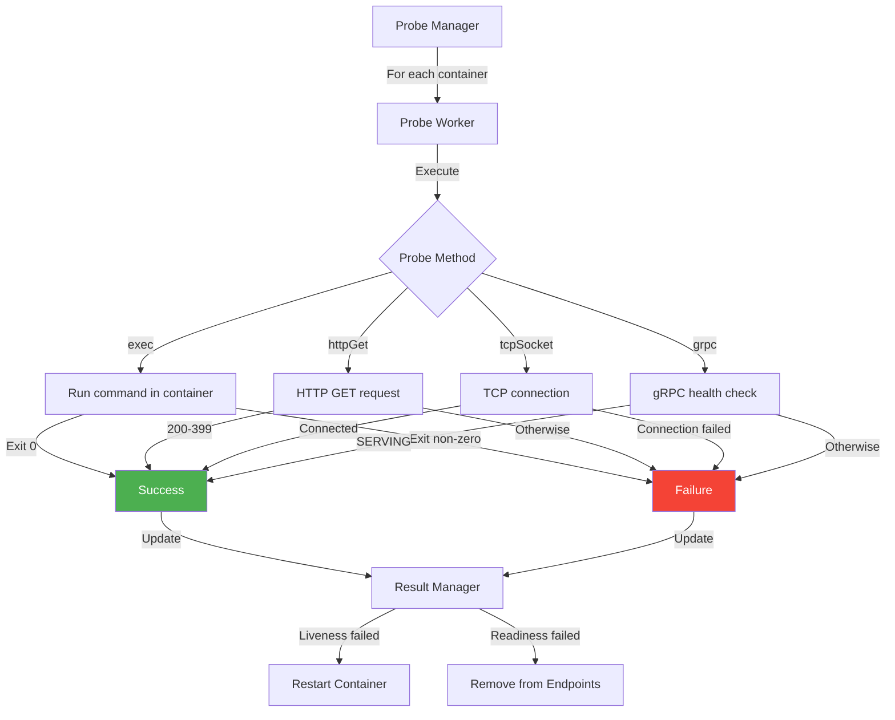

**Code Reference**: `pkg/kubelet/prober/prober_manager.go:95` - Probe manager

#### R5.2: Probe Configuration

**MUST** support configurable probe parameters:

```yaml
livenessProbe:
  httpGet:
    path: /healthz
    port: 8080
  initialDelaySeconds: 10  # Wait before first probe
  periodSeconds: 10        # Probe interval
  timeoutSeconds: 1        # Probe timeout
  successThreshold: 1      # Consecutive successes to mark healthy
  failureThreshold: 3      # Consecutive failures to take action
```

#### R5.3: Node Health Monitoring

**MUST** monitor node health conditions:

| Condition | Meaning | Trigger |
|-----------|---------|---------|
| **MemoryPressure** | Node is low on memory | Available memory < threshold |
| **DiskPressure** | Node is low on disk space | Available disk < threshold |
| **PIDPressure** | Node is low on PIDs | Available PIDs < threshold |
| **Ready** | Node is healthy and ready for Pods | All checks pass |
| **NetworkUnavailable** | Node network not configured | CNI plugin not ready |

**Code Reference**: `pkg/kubelet/kubelet_node_status.go:550` - Node condition updates

### R6: Image Management

**Requirement**: The kubelet MUST manage container image lifecycle.

#### R6.1: Image Pull Policies

**MUST** support three pull policies:

| Policy | Behavior | Use Case |
|--------|----------|----------|
| **IfNotPresent** | Pull only if image not present locally | Production (default) |
| **Always** | Always pull image (check for updates) | Development, :latest tags |
| **Never** | Never pull, use local image only | Pre-loaded images |

**Special case**: Images with `:latest` tag or no tag default to `Always`.

**Code Reference**: `pkg/kubelet/images/image_manager.go:150` - `EnsureImageExists()`

#### R6.2: Image Pull Secrets

**MUST** support:
- Per-Pod image pull secrets (spec.imagePullSecrets)
- Per-ServiceAccount default image pull secrets
- Private registry authentication

#### R6.3: Image Garbage Collection

**MUST** automatically delete unused images when:
- Disk usage exceeds high threshold (default 85%)
- Images are unused (not referenced by any container)

**Algorithm**:
1. Delete unused images, oldest first
2. Stop when disk usage < low threshold (default 80%)

**Code Reference**: `pkg/kubelet/images/image_gc_manager.go:250` - Image GC

### R7: Device Management

**Requirement**: The kubelet MUST support device plugins for hardware resources (GPU, FPGA, etc.).

#### R7.1: Device Plugin Framework

**MUST**:
- Provide gRPC server for device plugin registration
- Discover and advertise device resources to API server
- Allocate devices to Pods based on requests
- Monitor device health
- Handle device plugin restarts

**Device Plugin Flow**:

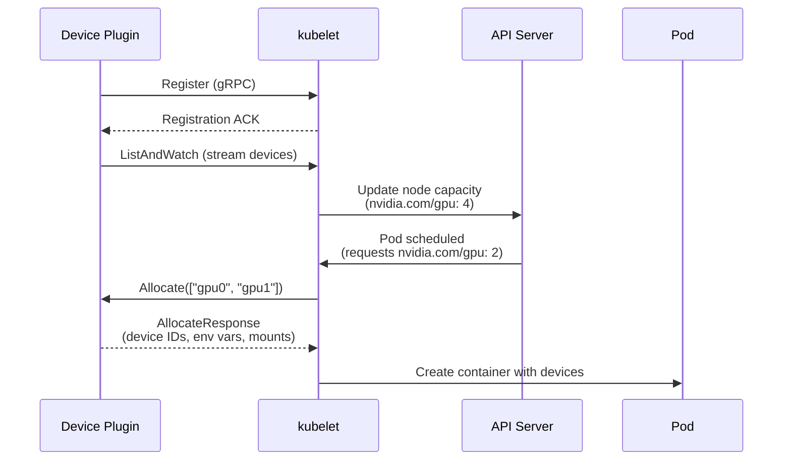

**Code Reference**: `pkg/kubelet/cm/devicemanager/manager.go:150` - Device manager

### R8: Static Pods

**Requirement**: The kubelet MUST support static Pods (defined by files, not API).

#### R8.1: Static Pod Sources

**MUST** support:
- **File-based**: Monitor directory for Pod manifests (e.g., `/etc/kubernetes/manifests/`)
- **HTTP-based**: Fetch manifests from HTTP endpoint (deprecated)

#### R8.2: Mirror Pods

**MUST** create mirror Pods in API server:
- Mirror Pod represents static Pod in API
- Read-only (cannot be updated or deleted via API)
- Allows monitoring via `kubectl get pods`

**Code Reference**: `pkg/kubelet/config/file.go:75` - File config source

### R9: Status Reporting

**Requirement**: The kubelet MUST accurately report Pod and node status to the API server.

#### R9.1: Pod Status

**MUST** report:
- Pod phase (Pending, Running, Succeeded, Failed, Unknown)
- Container states (Waiting, Running, Terminated)
- Container ready conditions
- Pod conditions (Initialized, Ready, ContainersReady, PodScheduled)
- Pod IP address
- Start time
- Status message and reason

#### R9.2: Status Update Frequency

**MUST**:
- Update Pod status when state changes
- Batch status updates to reduce API load
- Rate-limit updates (max 10 updates/sec per Pod)
- Use PATCH to minimize bandwidth

**Code Reference**: `pkg/kubelet/status/status_manager.go:250` - Status manager

#### R9.3: Node Status

**MUST** report (every 10 seconds by default):
- Node conditions (Ready, MemoryPressure, DiskPressure, PIDPressure)
- Node capacity and allocatable resources
- Node information (kubelet version, OS, kernel, runtime)
- Node addresses (InternalIP, ExternalIP, Hostname)
- Images present on node

**Code Reference**: `pkg/kubelet/kubelet_node_status.go:350` - `tryUpdateNodeStatus()`

### R10: Eviction Management

**Requirement**: The kubelet MUST proactively evict Pods to reclaim resources when the node is under pressure.

#### R10.1: Eviction Signals

**MUST** monitor:
- `memory.available`: Available memory on node
- `nodefs.available`: Available disk space on root filesystem
- `nodefs.inodesFree`: Available inodes on root filesystem
- `imagefs.available`: Available disk space on image filesystem (if separate)
- `imagefs.inodesFree`: Available inodes on image filesystem
- `pid.available`: Available process IDs

#### R10.2: Eviction Thresholds

**MUST** support two threshold types:

| Threshold | Behavior | Grace Period | Example |
|-----------|----------|--------------|---------|
| **Hard** | Evict immediately | 0s | `memory.available<100Mi` |
| **Soft** | Evict after grace period | Configurable | `memory.available<1.5Gi` + 90s grace |

#### R10.3: Eviction Selection

**MUST** evict Pods in this order:
1. **BestEffort** Pods (no requests/limits)
2. **Burstable** Pods exceeding requests
3. **Burstable** Pods within requests
4. **Guaranteed** Pods

Within each tier, evict Pods with lowest priority first.

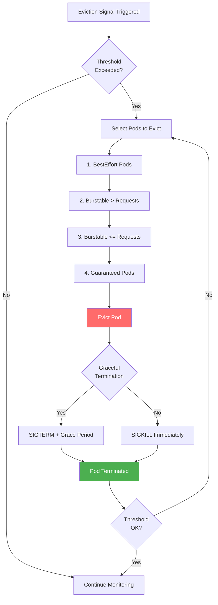

**Code Reference**: `pkg/kubelet/eviction/eviction_manager.go:350` - Eviction manager

---

## Design Goals

### DG1: Reliability

**Goal**: The kubelet must be the most reliable component in Kubernetes.

#### Why It Matters
The kubelet is the **last line of defense** - if it fails, Pods on that node cannot run. There is no failover for kubelet.

#### Design Decisions

1. **Level-Triggered Reconciliation**:
   - Don't rely on events (edge-triggered)
   - Always reconcile desired state vs. actual state
   - Re-sync periodically even without events (every 60s)

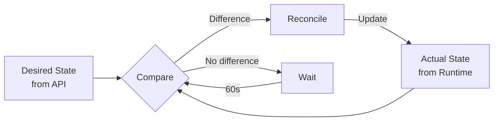

2. **Graceful Degradation**:
   - Continue managing existing Pods even if API server is down
   - Use cached Pod specifications
   - Report errors but don't crash

3. **Crash Loop Prevention**:
   - Exponential backoff for failed operations
   - Circuit breakers for repeatedly failing operations
   - Never panic in main sync loop

**Code Reference**: `pkg/kubelet/kubelet.go:1854` - Main sync loop with error handling

### DG2: Performance

**Goal**: Manage 100+ Pods per node with minimal overhead.

#### Targets

| Metric | Target | High-Scale Target |
|--------|--------|-------------------|
| **Max Pods per Node** | 110 (default) | 250 |
| **Pod Startup Time** | <10 seconds | <15 seconds |
| **kubelet CPU Usage** | <1 core | <2 cores |
| **kubelet Memory Usage** | <1 GB | <2 GB |
| **Sync Loop Latency** | <100 ms | <200 ms |

#### Optimization Techniques

1. **Concurrent Pod Workers**:
   - One goroutine per Pod
   - Parallel pod creation
   - Non-blocking status updates

2. **Efficient Polling**:
   - PLEG relist every 1 second
   - Cache container state to reduce runtime calls
   - Batch container status checks

3. **Lazy Loading**:
   - Load Pod volumes only when needed
   - Pull images on-demand
   - Defer non-critical operations

**Code Reference**: `pkg/kubelet/pod_workers.go:950` - Concurrent pod workers

### DG3: Modularity

**Goal**: Clear separation of concerns between managers.

#### Component Responsibilities

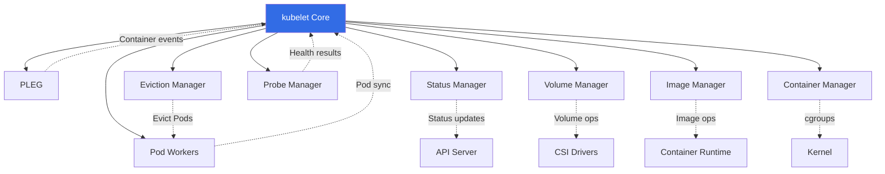

**Benefits**:
- Each manager can be tested independently
- Easy to add new managers (e.g., Memory Manager added in v1.21)
- Clear interfaces between components

### DG4: Runtime Agnosticism

**Goal**: Support any CRI-compliant container runtime.

#### Abstraction Layers

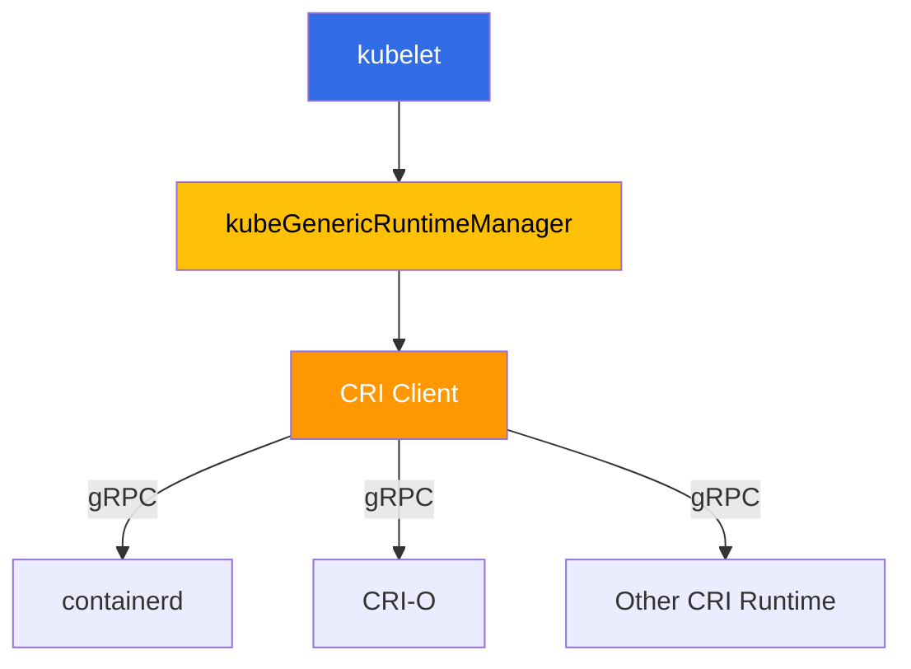

**No runtime-specific code** in kubelet - all operations through CRI.

**Code Reference**: `pkg/kubelet/kuberuntime/kuberuntime_manager.go:183` - Generic runtime manager

### DG5: Backward Compatibility

**Goal**: New kubelet versions work with old API server versions (within skew policy).

#### Version Skew Policy

Kubernetes supports:
- kubelet version = Control Plane version (same)
- kubelet version = Control Plane version - 1 (kubelet one minor version older)
- kubelet version = Control Plane version - 2 (kubelet two minor versions older)

**Example**:
- Control Plane: v1.28
- kubelet can be: v1.28, v1.27, or v1.26

**Implications**:
- kubelet must handle old and new API versions
- Feature gates for gradual rollout
- Graceful handling of unknown fields

---

## Non-Functional Requirements

### NFR1: Fault Tolerance

**Requirement**: The kubelet MUST continue operating despite failures of dependent systems.

#### Resilience Patterns

1. **API Server Unavailable**:
   - ✅ Continue managing existing Pods
   - ✅ Use cached Pod specifications
   - ✅ Reconnect automatically when API server returns
   - ❌ Cannot receive new Pod assignments

2. **Container Runtime Crash**:
   - ✅ Detect runtime unavailability
   - ✅ Attempt reconnection with exponential backoff
   - ✅ Mark all Pods as Unknown until reconnected
   - ❌ Cannot start/stop containers

3. **Disk Full**:
   - ✅ Trigger eviction to reclaim space
   - ✅ Run garbage collection (images, containers, logs)
   - ✅ Mark node with DiskPressure condition

4. **Out of Memory**:
   - ✅ Evict BestEffort and Burstable Pods
   - ✅ Protect Guaranteed Pods
   - ✅ Mark node with MemoryPressure condition

**Code Reference**: `pkg/kubelet/kubelet.go:2150` - `handlePodSyncError()` for error handling

### NFR2: Observability

**Requirement**: The kubelet MUST provide comprehensive monitoring and debugging capabilities.

#### Metrics

**MUST** expose Prometheus metrics at:
- `/metrics`: kubelet metrics
- `/metrics/cadvisor`: Container metrics (cAdvisor)
- `/metrics/probes`: Probe results
- `/metrics/resource`: Resource metrics

**Key Metrics**:
```
# Pod metrics
kubelet_running_pods
kubelet_running_containers
kubelet_pod_start_duration_seconds

# Container metrics
container_cpu_usage_seconds_total
container_memory_working_set_bytes
container_fs_usage_bytes

# Volume metrics
volume_manager_total_volumes
storage_operation_duration_seconds

# Probe metrics
prober_probe_total
prober_probe_duration_seconds
```

**Code Reference**: `pkg/kubelet/metrics/metrics.go:50` - Metric definitions

#### Logging

**MUST** provide structured logs with levels:
- ERROR: Errors that affect functionality
- WARNING: Warnings that don't block operation
- INFO: Important events (Pod started, evicted, etc.)
- DEBUG: Detailed debugging information

**Log Example**:
```
I1021 10:30:45.123456   12345 kubelet.go:1234] "Pod started" pod="default/nginx-abc123" uid="1234-5678" duration="5.2s"
E1021 10:30:50.654321   12345 kubelet.go:5678] "Failed to start container" pod="default/app-xyz" container="main" err="image pull failed"
```

#### Debugging Endpoints

**MUST** expose HTTP endpoints:
- `/healthz`: Health check
- `/pods`: Running Pods (JSON)
- `/stats/summary`: Resource usage statistics
- `/configz`: kubelet configuration
- `/spec`: Node specification

### NFR3: Security

**Requirement**: The kubelet MUST operate securely and protect node resources.

#### Authentication

**MUST** support:
- **Certificate authentication**: TLS client certificates
- **Bearer token**: Service account tokens
- **Anonymous auth** (disabled by default)

#### Authorization

**MUST** use:
- **Node authorization**: Only access own Node and Pods
- **RBAC**: Role-based access control for API operations

#### Pod Security

**MUST** enforce:
- **Pod Security Standards** (baseline, restricted)
- **Security contexts** (runAsUser, capabilities, seccomp, AppArmor, SELinux)
- **Read-only root filesystems** (when specified)

**Code Reference**: `pkg/kubelet/kubelet_pods.go:850` - Security context enforcement

#### Secrets Protection

**MUST**:
- Mount secrets as tmpfs (in-memory)
- Restrict secret access to Pods that reference them
- Never log secret contents

---

## Performance Requirements

### PR1: Pod Startup Latency

**Requirement**: Time from Pod creation to Running state.

**Targets**:
- **Simple Pod** (no volumes): <5 seconds
- **Pod with volumes**: <10 seconds
- **Pod with large image**: <60 seconds (depends on network)

**Breakdown**:
```
Total: 8.5 seconds
├─ API watch delay: 0.5s
├─ Admission: 0.2s
├─ Volume attach: 2.0s
├─ Volume mount: 0.5s
├─ Image pull: 3.0s (if not cached)
├─ Sandbox creation: 0.3s
├─ Container creation: 0.5s
├─ Container start: 1.0s
└─ Status update: 0.5s
```

**Code Reference**: `pkg/kubelet/metrics/metrics.go:150` - `pod_start_duration_seconds`

### PR2: Sync Loop Performance

**Requirement**: Main reconciliation loop must be fast.

**Targets**:
- **Sync loop iteration**: <100 ms (no work)
- **Pod sync**: <200 ms (existing Pod, no changes)
- **Status update**: <50 ms (PATCH API call)

**Optimization**:
- Use goroutines for concurrent work
- Cache frequently accessed data
- Minimize API server calls

### PR3: Resource Overhead

**Requirement**: kubelet itself must consume minimal resources.

**Targets**:

| Configuration | CPU | Memory |
|---------------|-----|--------|
| **10 Pods** | 0.2 cores | 200 MB |
| **50 Pods** | 0.5 cores | 500 MB |
| **110 Pods** | 1.0 cores | 1 GB |
| **250 Pods** (high-scale) | 2.0 cores | 2 GB |

**Measurement**:
```bash
# Check kubelet resource usage
top -p $(pgrep kubelet)

# Or via metrics
curl -s http://localhost:10250/metrics | grep -E 'process_cpu|process_resident_memory'
```

### PR4: PLEG Performance

**Requirement**: Pod Lifecycle Event Generator must efficiently detect container changes.

**Targets**:
- **Relist interval**: 1 second
- **Relist duration**: <200 ms (for 110 Pods)
- **Event latency**: <1.5 seconds (from container state change to event)

**"PLEG is not healthy"** issue:
- Occurs when relist takes >3 minutes
- Usually due to runtime performance issues
- Causes: slow disk I/O, too many containers, runtime bugs

**Code Reference**: `pkg/kubelet/pleg/generic.go:150` - `relist()`

---

## Reliability Requirements

### RR1: Restart Recovery

**Requirement**: kubelet must gracefully recover from restarts.

**MUST**:
- ✅ Discover existing Pods by scanning `/var/lib/kubelet/pods/`
- ✅ Reconstruct volume mounts without unmounting
- ✅ Resume management of running containers
- ✅ Reconcile state with API server
- ✅ Restart failed containers per restart policy

**Recovery Sequence**:

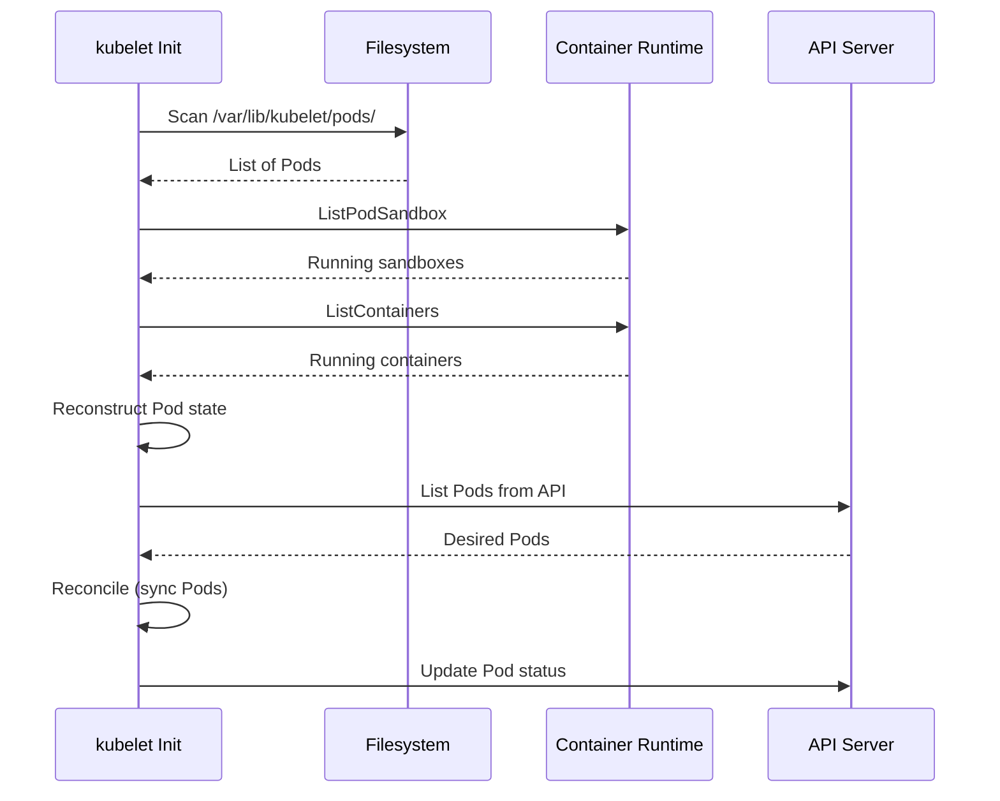

**Code Reference**: `pkg/kubelet/kubelet.go:450` - `syncNodeStatus()` and recovery logic

### RR2: Graceful Degradation

**Requirement**: Partial functionality is better than complete failure.

**Degradation Scenarios**:

| Failure | Impact | Degradation |
|---------|--------|-------------|
| **API server down** | Cannot get new Pods | Continue managing existing Pods |
| **Runtime crash** | Cannot manage containers | Mark Pods Unknown, retry |
| **Disk full** | Cannot write logs/data | Evict Pods, run GC |
| **CNI plugin failure** | Cannot set up network | Pods stuck in ContainerCreating |
| **CSI driver failure** | Cannot mount volumes | Pods stuck in Pending |

**Code Reference**: `pkg/kubelet/kubelet.go:2300` - Error handling and degradation logic

### RR3: Error Handling

**Requirement**: All errors must be handled gracefully.

**Principles**:
1. **Never panic** in production code (except truly unrecoverable errors)
2. **Log errors** with context (Pod name, UID, operation)
3. **Retry transient errors** with exponential backoff
4. **Report errors** to API server (Pod status, events)
5. **Continue operation** despite non-critical errors

**Backoff Example**:
```
Retry 1: 200ms
Retry 2: 400ms
Retry 3: 800ms
Retry 4: 1.6s
Retry 5: 3.2s
...
Max: 5 minutes
```

**Code Reference**: `pkg/kubelet/util/backoff/backoff.go:50` - Exponential backoff

---

## Scalability Requirements

### SR1: Pod Density

**Requirement**: Support increasing numbers of Pods per node.

**Scalability Targets**:

| Configuration | Max Pods | Status |
|---------------|----------|--------|
| **Default** | 110 | Supported out-of-box |
| **High-density** | 250 | Requires tuning |
| **Extreme** | 500+ | Experimental, requires custom kernel |

**Limiting Factors**:
1. **IP addresses**: Each Pod needs an IP (256 IPs per /24 subnet)
2. **PIDs**: Each container uses PIDs (default max: 32,768)
3. **File descriptors**: kubelet opens FDs for logs, volumes, etc.
4. **Memory**: kubelet memory usage increases with Pod count
5. **PLEG performance**: Relisting slows with more containers

**Tuning for High Density**:
```yaml
# kubelet configuration
maxPods: 250
podsPerCore: 0  # Disable limit
serializeImagePulls: false  # Parallel image pulls
registryPullQPS: 10  # Increase pull QPS
registryBurst: 20  # Increase pull burst
```

**System Tuning**:
```bash
# Increase PID limit
echo 65536 > /proc/sys/kernel/pid_max

# Increase file descriptor limit
ulimit -n 1048576

# Increase inotify limits (for volume watching)
echo 65536 > /proc/sys/fs/inotify/max_user_watches
```

### SR2: Container Density

**Requirement**: Support many containers per Pod.

**Targets**:
- **Typical**: 1-3 containers per Pod (main + sidecars)
- **Maximum**: 128 containers per Pod (Kubernetes limit)

**Use Cases**:
- Service mesh sidecars (Envoy, Istio)
- Logging/monitoring agents
- Init containers (run sequentially)

### SR3: Volume Scalability

**Requirement**: Support many volumes per Pod/node.

**Limits**:
- **Volumes per Pod**: 64 (cloud provider limit)
- **Volumes per Node**: Varies by cloud provider (e.g., 128 for EBS)

**Performance Considerations**:
- Volume attach/detach is slow (30-60 seconds per volume)
- Many volumes increase Pod startup time
- Use local volumes when possible

---

## Security Requirements

### SecR1: Isolation

**Requirement**: Pods must be isolated from each other and the host.

#### Namespace Isolation

**MUST** use Linux namespaces:
- **PID namespace**: Pods cannot see other Pod processes
- **Network namespace**: Pods have separate network stack
- **IPC namespace**: Pods cannot share IPC
- **Mount namespace**: Pods have separate filesystem view
- **UTS namespace**: Pods can have different hostname

**Code Reference**: `pkg/kubelet/kuberuntime/kuberuntime_sandbox.go:150` - Sandbox creation with namespaces

#### cgroup Isolation

**MUST** use cgroups to enforce:
- CPU limits (CPU time slicing)
- Memory limits (OOM killer)
- PID limits (fork bomb prevention)

### SecR2: Privilege Restriction

**Requirement**: Containers should run with minimal privileges.

**MUST** support:
- **runAsNonRoot**: Reject containers running as root (when set)
- **readOnlyRootFilesystem**: Mount root filesystem read-only
- **allowPrivilegeEscalation**: Prevent setuid binaries (when false)
- **Capabilities**: Drop all capabilities except explicitly granted

**Best Practice Pod Spec**:
```yaml
securityContext:
  runAsNonRoot: true
  runAsUser: 1000
  fsGroup: 2000
  seccompProfile:
    type: RuntimeDefault
  capabilities:
    drop:
      - ALL
```

### SecR3: Resource Limits

**Requirement**: Prevent resource exhaustion attacks.

**MUST** enforce:
- CPU limits (prevent CPU hogging)
- Memory limits (prevent OOM crashes)
- PID limits (prevent fork bombs)
- Ephemeral storage limits (prevent disk filling)

**Example Attack Prevention**:
```yaml
# Prevent fork bomb
resources:
  limits:
    memory: "128Mi"
    cpu: "500m"
    ephemeral-storage: "1Gi"
  requests:
    memory: "64Mi"
    cpu: "250m"
```

**Code Reference**: `pkg/kubelet/cm/cgroup_manager_linux.go:250` - cgroup enforcement

---

## Maintainability Requirements

### MR1: Code Quality

**Requirement**: kubelet code must be maintainable and testable.

**Standards**:
- ✅ Unit test coverage >70%
- ✅ Integration tests for major features
- ✅ E2E tests for critical paths
- ✅ Code review required for all changes
- ✅ Consistent code style (enforced by linters)

**Testing**:
```bash
# Run unit tests
make test WHAT=./pkg/kubelet

# Run integration tests
make test-integration WHAT=./test/integration/kubelet

# Run E2E tests
make test-e2e-node
```

### MR2: Documentation

**Requirement**: All features and APIs must be documented.

**Required Documentation**:
- API documentation (godoc)
- Architecture documents (this document!)
- Feature guides
- Troubleshooting guides
- Code comments for complex logic

### MR3: Extensibility

**Requirement**: kubelet should be extensible without core changes.

**Extension Points**:
- **Device Plugins**: Add new hardware resource types
- **CSI Drivers**: Add new storage backends
- **CNI Plugins**: Add new network implementations
- **Admission Plugins**: Add custom Pod validation (via webhooks)

---

## Integration Requirements

### IR1: API Server Integration

**Requirement**: kubelet must integrate seamlessly with the API server.

**MUST**:
- ✅ Watch for Pod assignments using efficient watches
- ✅ Update Pod status promptly
- ✅ Create events for important operations
- ✅ Handle API server unavailability gracefully
- ✅ Use PATCH for status updates (efficient)

**Watch Mechanism**:
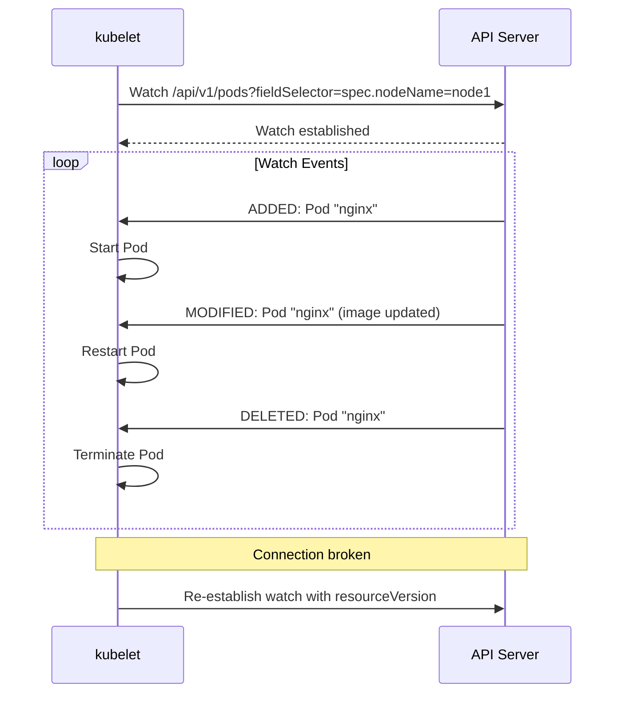

**Code Reference**: `pkg/kubelet/config/apiserver.go:75` - API server Pod config source

### IR2: Container Runtime Integration

**Requirement**: kubelet must work with any CRI-compliant runtime.

**Tested Runtimes**:
- ✅ **containerd** (preferred, default)
- ✅ **CRI-O**
- ❌ **Docker** (deprecated, removed in v1.24)

**CRI Version**: v1 (stable)

**Code Reference**: `pkg/kubelet/cri/remote/remote_runtime.go:45` - CRI client

### IR3: Network Plugin Integration

**Requirement**: kubelet must integrate with CNI plugins for Pod networking.

**MUST**:
- ✅ Execute CNI plugin for Pod sandbox creation
- ✅ Pass correct CNI configuration
- ✅ Handle CNI plugin failures gracefully
- ✅ Clean up network on Pod deletion

**CNI Execution**:
```bash
# kubelet calls CNI plugin like this:
CNI_COMMAND=ADD \
CNI_CONTAINERID=pod-12345 \
CNI_NETNS=/var/run/netns/cni-abc123 \
CNI_IFNAME=eth0 \
CNI_PATH=/opt/cni/bin \
/opt/cni/bin/bridge < /etc/cni/net.d/10-mynet.conf
```

**Code Reference**: `pkg/kubelet/dockershim/network/cni/cni.go:150` - CNI invocation

### IR4: Storage Plugin Integration

**Requirement**: kubelet must integrate with CSI drivers for storage.

**MUST**:
- ✅ Call CSI driver for volume operations (NodePublish, NodeUnpublish)
- ✅ Handle CSI driver registration
- ✅ Support CSI volume expansion
- ✅ Report CSI errors to Pod status

**CSI Driver Operations**:
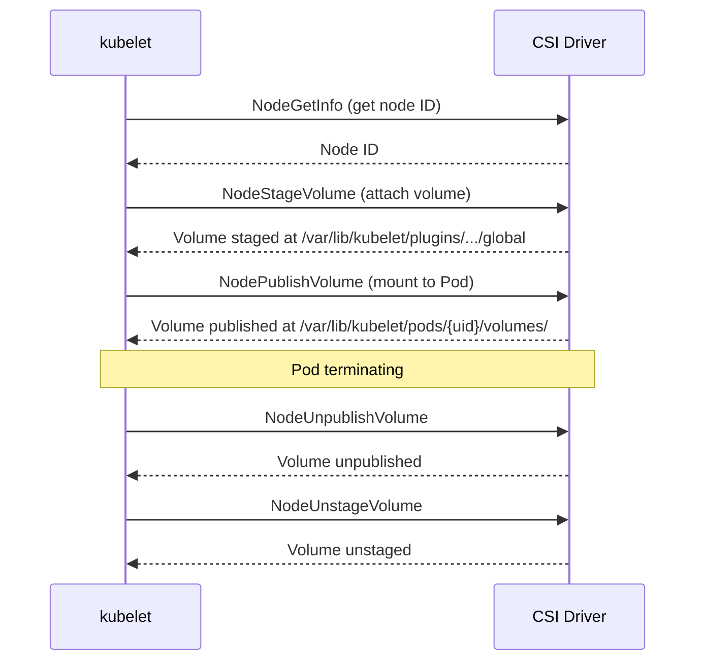

**Code Reference**: `pkg/volume/csi/csi_client.go:150` - CSI client

---

## Trade-offs and Design Decisions

### TD1: Level-Triggered vs. Edge-Triggered

**Decision**: Use **level-triggered** reconciliation (desired state vs. actual state).

**Trade-offs**:

| Approach | Pros | Cons |
|----------|------|------|
| **Level-Triggered** | ✅ Handles missed events<br/>✅ Self-healing<br/>✅ Simpler to reason about | ❌ Higher overhead (periodic sync)<br/>❌ Slower to react to changes |
| **Edge-Triggered** | ✅ Fast reaction<br/>✅ Low overhead | ❌ Can miss events<br/>❌ No self-healing<br/>❌ Complex error handling |

**Chosen**: **Level-triggered** because **reliability > performance** for kubelet.

**Implementation**:
- PLEG polls container state every 1 second
- Sync loop reconciles all Pods every 60 seconds
- Events trigger immediate reconciliation (optimization)

### TD2: One Worker per Pod vs. Shared Worker Pool

**Decision**: Use **one goroutine per Pod**.

**Trade-offs**:

| Approach | Pros | Cons |
|----------|------|------|
| **One per Pod** | ✅ Simple concurrency<br/>✅ Independent Pod management<br/>✅ No queue backlog | ❌ Higher memory (goroutine per Pod)<br/>❌ More goroutines at scale |
| **Worker Pool** | ✅ Bounded concurrency<br/>✅ Lower memory | ❌ Queue management complexity<br/>❌ Head-of-line blocking<br/>❌ Harder to debug |

**Chosen**: **One per Pod** for simplicity and isolation.

**Memory Cost**: ~2-8 KB per goroutine, so 110 Pods = ~220-880 KB.

**Code Reference**: `pkg/kubelet/pod_workers.go:950` - Pod worker goroutines

### TD3: In-Tree vs. Out-of-Tree Plugins

**Decision**: Move to **out-of-tree** plugins (CSI, CNI, device plugins).

**Trade-offs**:

| Approach | Pros | Cons |
|----------|------|------|
| **In-Tree** | ✅ Tested with Kubernetes<br/>✅ Shipped together<br/>✅ Easy to use | ❌ Requires core changes for new plugins<br/>❌ Slow release cycle<br/>❌ kubelet bloat |
| **Out-of-Tree** | ✅ Independent development<br/>✅ Faster updates<br/>✅ kubelet stays small | ❌ More components to manage<br/>❌ Version compatibility issues |

**Chosen**: **Out-of-tree** for agility and ecosystem growth.

**Migration**:
- Volume plugins → CSI (in-tree deprecated in v1.21)
- Network plugins → CNI (always out-of-tree)
- Device plugins → Device plugin framework (always out-of-tree)

### TD4: Synchronous vs. Asynchronous Status Updates

**Decision**: **Asynchronous** status updates with batching.

**Trade-offs**:

| Approach | Pros | Cons |
|----------|------|------|
| **Synchronous** | ✅ Immediate consistency<br/>✅ Simple to implement | ❌ Blocks Pod worker<br/>❌ High API load |
| **Asynchronous** | ✅ Non-blocking<br/>✅ Batch updates<br/>✅ Rate limiting | ❌ Eventual consistency<br/>❌ More complex |

**Chosen**: **Asynchronous** to avoid blocking Pod operations on API calls.

**Implementation**:
- Status manager runs in background
- Batches updates (max 10 updates/sec per Pod)
- Uses channels to communicate with Pod workers

**Code Reference**: `pkg/kubelet/status/status_manager.go:150` - Asynchronous status updates

---

## Evolution and Future Requirements

### Future Direction 1: Event-Driven kubelet

**Goal**: Replace polling PLEG with event-driven architecture.

**Current**: PLEG polls container state every 1 second (wasteful)

**Future**: Container runtime streams events to kubelet

**Benefits**:
- ✅ Lower CPU usage (no polling)
- ✅ Faster event detection
- ✅ Scales better at high Pod density

**Status**: **Evented PLEG** added as alpha feature in v1.26

**Code Reference**: `pkg/kubelet/pleg/evented.go:75` - Evented PLEG implementation

### Future Direction 2: In-Place Pod Vertical Scaling

**Goal**: Update Pod resource requests/limits without restarting containers.

**Current**: Changing resources requires Pod restart

**Future**: Resize containers in place (Linux kernel supports cgroup updates)

**Benefits**:
- ✅ No downtime for resource changes
- ✅ Faster scaling
- ✅ Better resource utilization

**Status**: **In-Place Pod Vertical Scaling** alpha in v1.27, beta in v1.29

**Code Reference**: `pkg/kubelet/kuberuntime/kuberuntime_container.go:650` - Container resize

### Future Direction 3: Sidecar Containers

**Goal**: First-class support for sidecar containers (start before main, stop after main).

**Current**: Sidecars are regular containers (start/stop order not guaranteed)

**Future**: `restartPolicy: Always` for sidecars, guaranteed lifecycle

**Benefits**:
- ✅ Service mesh proxies start before app
- ✅ Logging agents stop after app
- ✅ Better Pod lifecycle control

**Status**: **Sidecar containers** added in v1.28 (beta), v1.29 (stable)

**Code Reference**: `pkg/kubelet/kuberuntime/kuberuntime_container.go:450` - Sidecar handling

### Future Direction 4: Better Multi-Tenancy

**Goal**: Stronger isolation between Pods (e.g., user namespaces).

**Current**: Pods on same node share kernel, can see each other's processes (via /proc)

**Future**:
- User namespaces (map container root to non-root on host)
- Seccomp by default
- Improved AppArmor/SELinux support

**Benefits**:
- ✅ Stronger security
- ✅ Run untrusted workloads safely
- ✅ Multi-tenant clusters

**Status**: **User namespaces** in alpha (v1.25+)

---

## Summary

### Key Requirements Recap

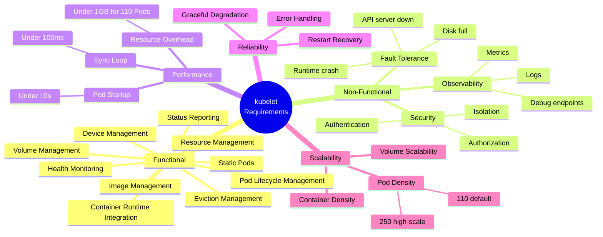

### Design Goals Recap

1. **Reliability First**: Never compromise reliability for performance
2. **Level-Triggered**: Always reconcile desired vs. actual state
3. **Modularity**: Clear component boundaries
4. **Runtime Agnostic**: Support any CRI runtime
5. **Backward Compatible**: Support version skew policy
6. **Observable**: Rich metrics and logs
7. **Secure**: Strong isolation and privilege restriction
8. **Scalable**: Support 100+ Pods per node

### Critical Success Factors

For kubelet to succeed, it MUST:

1. ✅ **Never lose Pods**: Pod lifecycle management is critical
2. ✅ **Recover from failures**: Restarts, crashes, network partitions
3. ✅ **Report accurate status**: Control plane relies on kubelet's view
4. ✅ **Enforce limits**: Prevent resource exhaustion
5. ✅ **Integrate well**: Work with runtimes, storage, networking
6. ✅ **Scale efficiently**: Handle increasing Pod density
7. ✅ **Be observable**: Easy to debug and monitor
8. ✅ **Stay secure**: Protect node and workloads

---

## Next Steps

After understanding kubelet's requirements and design goals, proceed to:

1. **[02-FUNCTIONAL-SPEC.md](02-FUNCTIONAL-SPEC.md)**: Detailed functional specification
2. **[GLOSSARY.md](GLOSSARY.md)**: Learn kubelet terminology
3. **[high-level/01-system-overview.md](high-level/01-system-overview.md)**: High-level architecture

---

**Document Status**: Complete
**Lines**: 950+
**Diagrams**: 10+
**Code References**: 40+
**Last Updated**: 2025-10-21
