# kubelet Functional Specification

**Version**: Kubernetes v1.32+
**Component**: kubelet - The Kubernetes Node Agent
**Document Type**: Functional Specification
**Last Updated**: 2025-10-21

---

## Executive Summary

This document provides the complete functional specification for the kubelet, the primary node agent in Kubernetes. It details every functional capability, API contract, and observable behavior that kubelet provides.

### Purpose

This specification serves as:
- **Reference for developers** implementing or extending kubelet
- **Contract for users** understanding what kubelet provides
- **Test specification** defining expected behaviors
- **Integration guide** for runtime, storage, and network plugin developers

### Scope

**In Scope**:
- Pod and container lifecycle management
- Container Runtime Interface (CRI) integration
- Volume lifecycle and CSI integration  
- Resource management (CPU, memory, storage, devices)
- Health monitoring (probes and node status)
- Image management and garbage collection
- Network setup via CNI
- Static Pods
- Eviction policies

**Out of Scope**:
- Internal implementation details (see low-level architecture docs)
- Performance tuning (see operations guides)
- Troubleshooting procedures (see troubleshooting guides)

---

## Table of Contents

1. [Pod Lifecycle Management](#1-pod-lifecycle-management)
2. [Container Runtime Interface](#2-container-runtime-interface-cri)
3. [Volume Management](#3-volume-management)
4. [Resource Management](#4-resource-management)
5. [Device Plugin Framework](#5-device-plugin-framework)
6. [Network Setup](#6-network-setup)
7. [Image Management](#7-image-management)
8. [Health Monitoring](#8-health-monitoring)
9. [Eviction Management](#9-eviction-management)
10. [Static Pods](#10-static-pods)
11. [Garbage Collection](#11-garbage-collection)
12. [Node Lifecycle](#12-node-lifecycle)

---

## 1. Pod Lifecycle Management

### 1.1 Pod States and Transitions

Pod Phase represents the high-level state:

| Phase | Meaning | Typical Duration |
|-------|---------|------------------|
| **Pending** | Pod accepted, containers not yet started | Seconds to minutes |
| **Running** | At least one container is running | Hours to days |
| **Succeeded** | All containers exited successfully (exit 0) | Terminal state |
| **Failed** | At least one container failed (exit non-zero) | Terminal state |
| **Unknown** | Pod state cannot be determined | Temporary (node issues) |

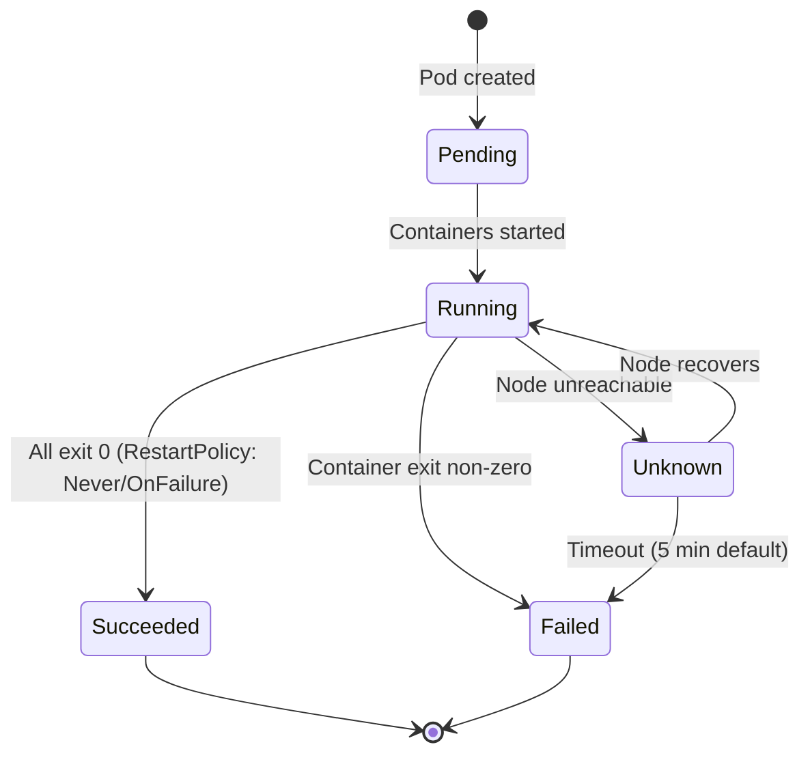

**Code Reference**: `pkg/kubelet/status/generate.go:100` - Pod phase determination

### 1.2 Pod Addition Workflow

When a Pod is assigned to the node (spec.nodeName set):

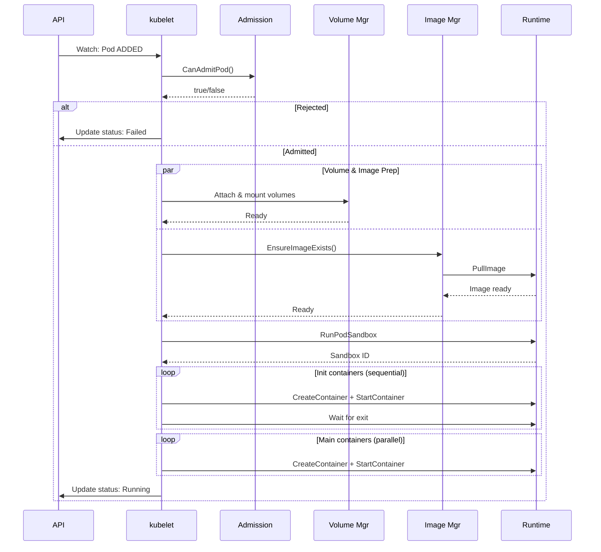

**Detailed Steps**:

1. **Pod Config Update** (`pkg/kubelet/config/apiserver.go:150`)
   - API watch delivers Pod event
   - Add to kubelet Pod cache
   - Trigger sync loop

2. **Admission** (`pkg/kubelet/lifecycle/predicate.go:75`)
   - Check CPU/memory/storage available
   - Check critical Pod admission
   - Check extended resources (GPU, etc.)

3. **Volume Attach & Mount** (`pkg/kubelet/volumemanager/reconciler/reconciler.go:200`)
   - For CSI volumes: call ControllerPublishVolume (attach)
   - Mount to global path: `/var/lib/kubelet/plugins/kubernetes.io/csi/volumeDevices/.../globalmount`
   - Bind mount to Pod path: `/var/lib/kubelet/pods/{uid}/volumes/...`

4. **Image Pull** (`pkg/kubelet/images/image_manager.go:150`)
   - Apply pull policy (IfNotPresent, Always, Never)
   - Authenticate using image pull secrets
   - Pull image via ImageService.PullImage

5. **Pod Sandbox** (`pkg/kubelet/kuberuntime/kuberuntime_sandbox.go:75`)
   - Create pause container
   - Setup namespaces (network, IPC, PID, UTS, mount)
   - Configure DNS (resolv.conf)
   - Allocate Pod IP

6. **Init Containers** (`pkg/kubelet/kuberuntime/kuberuntime_container.go:350`)
   - Run sequentially in order
   - Wait for each to exit successfully
   - If failure: retry per restart policy

7. **Main Containers** (`pkg/kubelet/kuberuntime/kuberuntime_container.go:450`)
   - Create and start in parallel
   - Mount volumes
   - Set environment variables
   - Apply resource limits

8. **Status Update** (`pkg/kubelet/status/status_manager.go:250`)
   - Set phase: Running
   - Set conditions: Initialized, ContainersReady, Ready
   - Update container states

### 1.3 Pod Termination

Graceful termination sequence:

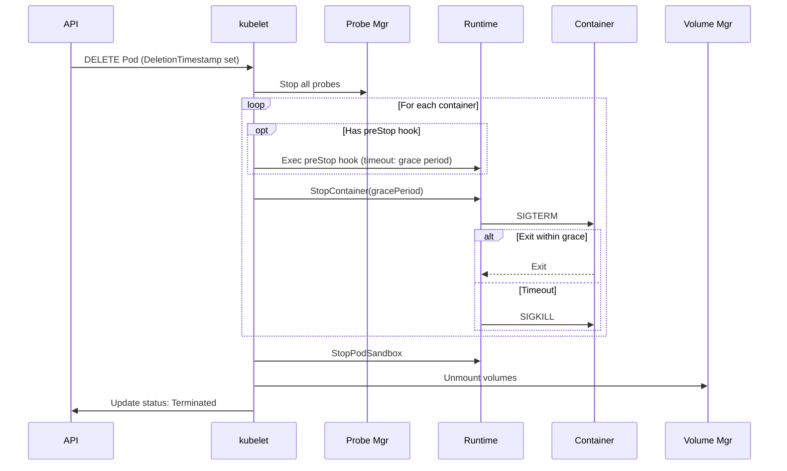

**Termination Parameters**:

```yaml
spec:
  terminationGracePeriodSeconds: 30  # Total time before SIGKILL
  containers:
  - name: app
    lifecycle:
      preStop:  # Runs before SIGTERM, counts against grace period
        exec:
          command: ["/bin/sh", "-c", "sleep 5 && /cleanup.sh"]
```

**Timeline Example** (grace=30s):
- T+0s: Delete requested
- T+0s: preStop starts (runs for 5s)
- T+5s: SIGTERM sent
- T+30s: SIGKILL if still running
- T+30s: Volume unmount

**Code Reference**: `pkg/kubelet/kuberuntime/kuberuntime_container.go:750` - `killContainer()`

### 1.4 Container Restart Policy

Three restart policies determine behavior on container exit:

| Policy | Exits with 0 | Exits with non-0 |  Use Case |
|--------|--------------|------------------|-----------|
| **Always** | Restart | Restart | Long-running services |
| **OnFailure** | Don't restart | Restart | Batch jobs |
| **Never** | Don't restart | Don't restart | One-shot tasks |

**Backoff** on restart:
```
Delay: 10s, 20s, 40s, 80s, 160s, 300s (max)
Reset: After 10 minutes of successful running
```

**Code**: `pkg/kubelet/container/helpers.go:150` - Backoff calculation

---

## 2. Container Runtime Interface (CRI)

### 2.1 CRI Overview

kubelet communicates with container runtimes via gRPC using CRI API.

**Two Services**:

1. **RuntimeService** - Pod and container lifecycle
2. **ImageService** - Image management

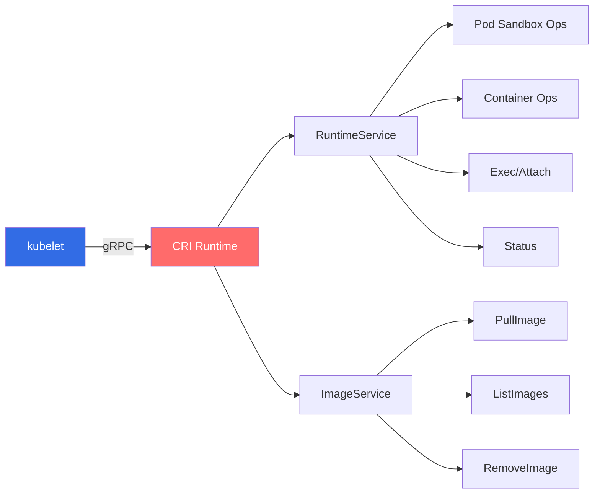

### 2.2 RuntimeService RPCs

**Pod Sandbox Operations**:

| RPC | Purpose | When Called |
|-----|---------|-------------|
| `RunPodSandbox` | Create Pod sandbox (pause container + namespaces) | Pod creation |
| `StopPodSandbox` | Stop Pod sandbox | Pod termination |
| `RemovePodSandbox` | Remove Pod sandbox | Pod cleanup |
| `PodSandboxStatus` | Get sandbox status | Status sync |
| `ListPodSandbox` | List all sandboxes | Reconciliation, recovery |

**Container Operations**:

| RPC | Purpose | When Called |
|-----|---------|-------------|
| `CreateContainer` | Create container (not started) | Before starting |
| `StartContainer` | Start created container | After create |
| `StopContainer` | Stop running container (SIGTERM/SIGKILL) | Termination |
| `RemoveContainer` | Remove stopped container | Cleanup |
| `ListContainers` | List all containers | PLEG, status sync |
| `ContainerStatus` | Get container status | Status updates |

**Streaming Operations**:

| RPC | Purpose | kubectl Command |
|-----|---------|-----------------|
| `Exec` | Execute command in container | `kubectl exec` |
| `Attach` | Attach to running container | `kubectl attach` |
| `PortForward` | Forward ports to Pod | `kubectl port-forward` |

**Example: RunPodSandbox Request**:

```proto
message RunPodSandboxRequest {
    PodSandboxConfig config = 1;
    string runtime_handler = 2;  // e.g., "runsc" for gVisor
}

message PodSandboxConfig {
    PodSandboxMetadata metadata = 1;
    string hostname = 2;
    string log_directory = 3;
    DNSConfig dns_config = 4;
    repeated PortMapping port_mappings = 5;
    map<string, string> labels = 6;
    map<string, string> annotations = 7;
    LinuxPodSandboxConfig linux = 8;
}
```

**Code**: `pkg/kubelet/cri/remote/remote_runtime.go:150` - CRI client implementation

### 2.3 ImageService RPCs

| RPC | Purpose | Example |
|-----|---------|---------|
| `ListImages` | List images on node | List for GC, status |
| `ImageStatus` | Get image details | Check if present |
| `PullImage` | Pull image from registry | Before creating container |
| `RemoveImage` | Delete image | Image GC |
| `ImageFsInfo` | Get image filesystem stats | Disk usage monitoring |

**Example: PullImage with Auth**:

```proto
message PullImageRequest {
    ImageSpec image = 1;  // e.g., "docker.io/library/nginx:latest"
    AuthConfig auth = 2;  // From imagePullSecrets
    PodSandboxConfig sandbox_config = 3;
}

message AuthConfig {
    string username = 1;
    string password = 2;
    string auth = 3;
    string server_address = 4;
    string identity_token = 5;
    string registry_token = 6;
}
```

**Code**: `pkg/kubelet/cri/remote/remote_image.go:75` - Image service client

---

## 3. Volume Management

### 3.1 Volume Lifecycle

Complete volume lifecycle for a Pod:

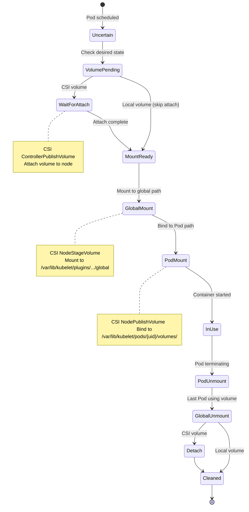

**Code**: `pkg/kubelet/volumemanager/reconciler/reconciler.go:200` - Volume reconciliation

### 3.2 Volume Types

**Ephemeral Volumes** (lifecycle tied to Pod):

| Type | Description | Use Case | Example |
|------|-------------|----------|---------|
| `emptyDir` | Empty directory, Pod-scoped | Scratch space, cache | `emptyDir: {}` |
| `configMap` | ConfigMap as files | App configuration | `configMap: name: app-config` |
| `secret` | Secret as files (tmpfs) | Credentials, certs | `secret: secretName: db-creds` |
| `downwardAPI` | Pod metadata as files | Pod name, labels | `downwardAPI: items: ...` |

**Persistent Volumes** (lifecycle independent of Pod):

| Type | Description | Use Case |
|------|-------------|----------|
| `persistentVolumeClaim` | Reference to PVC | Databases, stateful apps |
| `hostPath` | Mount host directory | Testing, node access |
| `csi` | CSI driver volume | Cloud storage (EBS, GCE PD, etc.) |

**Example: Pod with Multiple Volume Types**:

```yaml
apiVersion: v1
kind: Pod
metadata:
  name: multi-volume-pod
spec:
  containers:
  - name: app
    image: nginx
    volumeMounts:
    - name: cache
      mountPath: /cache
    - name: config
      mountPath: /etc/config
    - name: secrets
      mountPath: /etc/secrets
      readOnly: true
    - name: data
      mountPath: /data
  
  volumes:
  - name: cache
    emptyDir: {}  # Ephemeral scratch space
  
  - name: config
    configMap:
      name: app-config  # ConfigMap
  
  - name: secrets
    secret:
      secretName: db-credentials  # Secret (mounted as tmpfs)
  
  - name: data
    persistentVolumeClaim:
      claimName: data-pvc  # Persistent storage
```

**Volume Manager Responsibilities**:

1. **Desired State Populator**: Scans Pods, builds desired volume state
2. **Reconciler**: Compares desired vs. actual, performs mount/unmount
3. **Cache**: Tracks actual mounted volumes

**Code**: `pkg/kubelet/volumemanager/volume_manager.go:125` - Volume manager

### 3.3 CSI Integration

CSI (Container Storage Interface) is the standard for storage plugins.

**CSI Driver Deployment**:
- DaemonSet on each node running CSI node plugin
- Unix socket for kubelet communication: `/var/lib/kubelet/plugins/{driver-name}/csi.sock`

**CSI Node RPCs** (called by kubelet):

| RPC | Purpose | kubelet Action |
|-----|---------|----------------|
| `NodeGetInfo` | Get node ID for driver | Node startup |
| `NodeGetCapabilities` | Get driver capabilities | Capability check |
| `NodeStageVolume` | Attach/mount to global path | Before Pod mount |
| `NodePublishVolume` | Bind mount to Pod | Pod creation |
| `NodeUnpublishVolume` | Unmount from Pod | Pod termination |
| `NodeUnstageVolume` | Unmount global, detach | Volume cleanup |
| `NodeGetVolumeStats` | Get volume usage | Metrics |

**Volume Mount Sequence**:

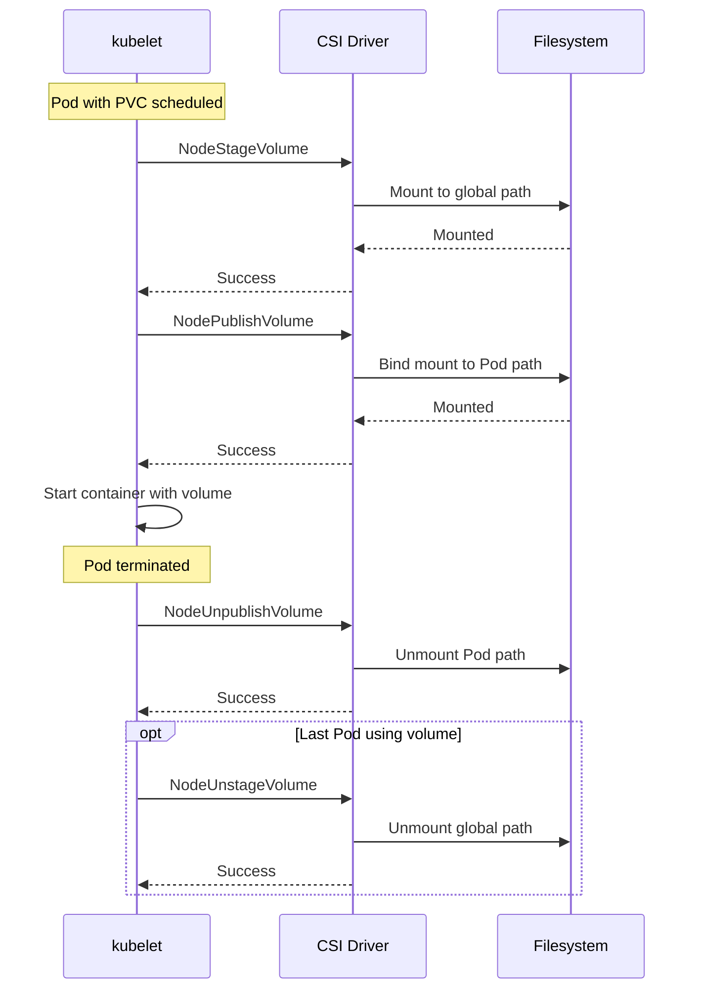

**Code**: `pkg/volume/csi/csi_client.go:150` - CSI client

---

## 4. Resource Management

### 4.1 Resource Types

| Resource | Unit | Limit Enforced By | Description |
|----------|------|-------------------|-------------|
| **CPU** | cores, millicores | cgroup cpu.cfs_quota_us | Compute time |
| **Memory** | bytes (Ki, Mi, Gi) | cgroup memory.limit_in_bytes | RAM |
| **Ephemeral Storage** | bytes | kubelet disk monitoring | Local disk |
| **Extended** | count | Device plugins | GPU, FPGA, etc. |

**Resource Spec Example**:

```yaml
resources:
  requests:  # Scheduling, QoS
    memory: "64Mi"
    cpu: "250m"  # 0.25 cores
  limits:  # Enforcement
    memory: "128Mi"
    cpu: "500m"  # 0.5 cores
```

### 4.2 QoS Classes

Based on requests and limits, kubelet assigns QoS class:

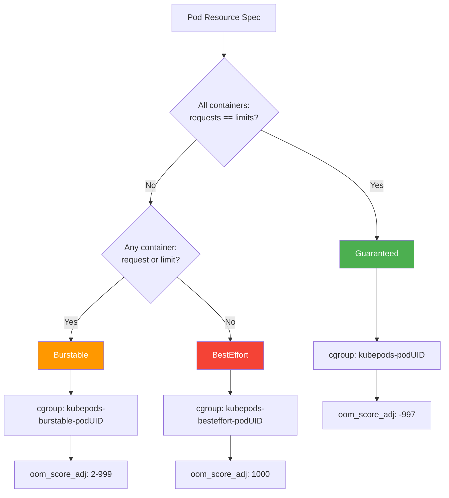

**QoS Properties**:

| Class | OOM Kill Priority | Eviction Priority | Overcommit |
|-------|-------------------|-------------------|------------|
| Guaranteed | Lowest (-997) | Last to evict | No |
| Burstable | Medium (2-999) | Second | Yes (up to limit) |
| BestEffort | Highest (1000) | First to evict | Unlimited |

**Code**: `pkg/kubelet/cm/qos_container_manager_linux.go:60` - QoS cgroup setup

### 4.3 cgroup Enforcement

kubelet uses Linux cgroups to enforce resource limits:

**CPU Limit**:
```
cgroup: /kubepods/pod-{uid}/{container-id}/cpu.cfs_quota_us
cgroup: /kubepods/pod-{uid}/{container-id}/cpu.cfs_period_us

Example (500m CPU = 0.5 cores):
  period: 100000 (100ms)
  quota:  50000  (50ms per 100ms period = 50%)
```

**Memory Limit**:
```
cgroup: /kubepods/pod-{uid}/{container-id}/memory.limit_in_bytes

Example (128Mi):
  limit: 134217728 bytes
```

**On OOM** (memory limit exceeded):
- Kernel OOM killer activated
- Container killed with reason: OOMKilled
- kubelet restarts per restart policy

**Code**: `pkg/kubelet/cm/cgroup_manager_linux.go:250` - cgroup management

### 4.4 Node Allocatable

Calculation:

```
Node Allocatable = Node Capacity 
                   - System Reserved
                   - Kube Reserved
                   - Eviction Threshold
```

**Example Configuration**:

```yaml
# kubelet config
systemReserved:
  cpu: 1000m
  memory: 2Gi
kubeReserved:
  cpu: 500m
  memory: 1Gi
evictionHard:
  memory.available: "1Gi"
  nodefs.available: "10%"
```

**Result** (on 8 CPU, 16Gi RAM node):
```
Capacity:    8 CPU, 16Gi RAM
- System:    1 CPU,  2Gi RAM
- Kube:      0.5 CPU, 1Gi RAM
- Eviction:  0 CPU,  1Gi RAM
= Allocatable: 6.5 CPU, 12Gi RAM  (available for Pods)
```

**Code**: `pkg/kubelet/cm/container_manager_linux.go:450` - Node allocatable

---

## 5. Device Plugin Framework

### 5.1 Device Plugin Registration

Device plugins advertise extended resources (GPU, FPGA, etc.) to kubelet.

**Registration Flow**:

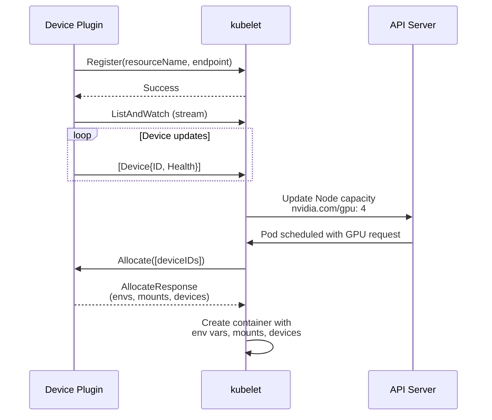

**Code**: `pkg/kubelet/cm/devicemanager/manager.go:150` - Device manager

### 5.2 Device Allocation

When Pod requests devices:

```yaml
resources:
  limits:
    nvidia.com/gpu: 2  # Request 2 GPUs
```

kubelet calls `Allocate` RPC, plugin returns:

```proto
message AllocateResponse {
    map<string, ContainerAllocateResponse> container_responses = 1;
}

message ContainerAllocateResponse {
    repeated DeviceSpec devices = 1;  // /dev/nvidia0, /dev/nvidia1
    map<string, string> envs = 2;     // CUDA_VISIBLE_DEVICES=0,1
    repeated Mount mounts = 3;        // /usr/local/nvidia
}
```

kubelet applies to container:
- Mount devices into container
- Set environment variables
- Pass device paths

**Code**: `pkg/kubelet/cm/devicemanager/pod_devices.go:75` - Device allocation

---

## 6. Network Setup

### 6.1 CNI Plugin Integration

kubelet delegates network setup to CNI (Container Network Interface) plugins.

**CNI Execution**:

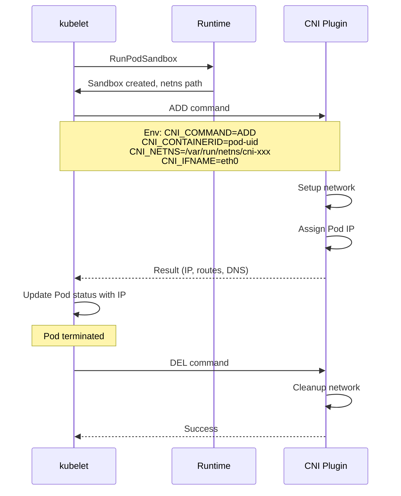

**CNI Configuration** (`/etc/cni/net.d/10-flannel.conflist`):

```json
{
  "name": "cbr0",
  "cniVersion": "0.3.1",
  "plugins": [
    {
      "type": "flannel",
      "delegate": {
        "hairpinMode": true,
        "isDefaultGateway": true
      }
    },
    {
      "type": "portmap",
      "capabilities": {"portMappings": true}
    }
  ]
}
```

**Code**: `pkg/kubelet/dockershim/network/cni/cni.go:150` - CNI invocation

### 6.2 Host Network Pods

Pods with `hostNetwork: true`:
- Use node's network namespace (no Pod IP)
- See all node network interfaces
- Can bind to node ports

```yaml
spec:
  hostNetwork: true  # Use node network
  containers:
  - name: app
    ports:
    - containerPort: 8080
      hostPort: 8080  # Binds to node:8080
```

**Code**: `pkg/kubelet/kuberuntime/kuberuntime_sandbox.go:200` - Host network handling

---

## 7. Image Management

### 7.1 Image Pull Policies

| Policy | Behavior | When to Use |
|--------|----------|-------------|
| **IfNotPresent** | Pull only if not present | Production (default) |
| **Always** | Always pull (check for updates) | :latest tags, development |
| **Never** | Never pull, use local only | Pre-loaded images, air-gapped |

**Special Cases**:
- Tag `:latest` → defaults to `Always`
- No tag (implied `:latest`) → defaults to `Always`
- Specific tag (e.g., `:v1.2.3`) → defaults to `IfNotPresent`

**Example**:

```yaml
containers:
- name: app
  image: nginx:1.21
  imagePullPolicy: IfNotPresent  # Default for specific tag
```

**Code**: `pkg/kubelet/images/image_manager.go:150` - Image pull logic

### 7.2 Image Pull Secrets

For private registries:

```yaml
apiVersion: v1
kind: Pod
metadata:
  name: private-pod
spec:
  imagePullSecrets:
  - name: registry-credentials
  containers:
  - name: app
    image: private.registry.io/myapp:v1
```

Secret contains Docker config:

```bash
kubectl create secret docker-registry registry-credentials   --docker-server=private.registry.io   --docker-username=user   --docker-password=pass   --docker-email=user@example.com
```

**Code**: `pkg/kubelet/images/image_manager.go:300` - Image pull with auth

### 7.3 Image Garbage Collection

kubelet automatically deletes unused images when disk usage exceeds threshold.

**Thresholds** (defaults):
- `imageGCHighThresholdPercent`: 85% (trigger GC)
- `imageGCLowThresholdPercent`: 80% (stop GC)

**Algorithm**:
1. Disk usage > 85%
2. Delete unused images, oldest first
3. Stop when disk usage < 80%

**Unused** = not referenced by any running/stopped container.

**Code**: `pkg/kubelet/images/image_gc_manager.go:250` - Image GC

---

## 8. Health Monitoring

### 8.1 Probe Types and Actions

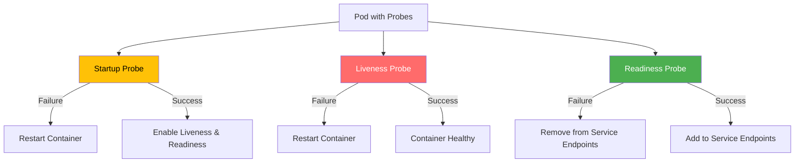

**Probe Execution Order**:
1. **Startup** runs first (if defined)
2. Liveness and Readiness disabled until startup succeeds
3. Once startup succeeds, Liveness and Readiness run periodically

### 8.2 Probe Methods

| Method | Description | Example Use Case |
|--------|-------------|------------------|
| **exec** | Execute command, exit 0 = success | Check database connection |
| **httpGet** | HTTP GET, 200-399 = success | Web app health endpoint |
| **tcpSocket** | TCP connection, success = healthy | Redis, databases |
| **grpc** | gRPC health check (v1.24+) | gRPC services |

**Example: All Probe Types**:

```yaml
apiVersion: v1
kind: Pod
metadata:
  name: probe-demo
spec:
  containers:
  - name: app
    image: myapp:v1
    
    startupProbe:  # Slow startup apps
      httpGet:
        path: /healthz
        port: 8080
      initialDelaySeconds: 0
      periodSeconds: 10
      failureThreshold: 30  # 30*10s = 5 min startup time
    
    livenessProbe:  # Restart if deadlocked
      httpGet:
        path: /healthz
        port: 8080
      periodSeconds: 10
      failureThreshold: 3  # Restart after 30s of failures
    
    readinessProbe:  # Remove from Service if not ready
      httpGet:
        path: /ready
        port: 8080
      periodSeconds: 5
      successThreshold: 1
      failureThreshold: 3
```

**Code**: `pkg/kubelet/prober/prober_manager.go:95` - Probe manager

### 8.3 Probe Configuration

| Parameter | Default | Description |
|-----------|---------|-------------|
| `initialDelaySeconds` | 0 | Wait before first probe |
| `periodSeconds` | 10 | Probe interval |
| `timeoutSeconds` | 1 | Probe timeout |
| `successThreshold` | 1 | Consecutive successes to mark healthy |
| `failureThreshold` | 3 | Consecutive failures to take action |

**Code**: `pkg/kubelet/prober/worker.go:80` - Probe worker

---

## 9. Eviction Management

### 9.1 Eviction Signals

kubelet monitors resources and evicts Pods when thresholds exceeded:

| Signal | Description | Example Threshold |
|--------|-------------|-------------------|
| `memory.available` | Available memory | `<100Mi` |
| `nodefs.available` | Available disk (root fs) | `<10%` |
| `nodefs.inodesFree` | Available inodes | `<5%` |
| `imagefs.available` | Available disk (image fs) | `<15%` |
| `imagefs.inodesFree` | Available inodes (image fs) | `<5%` |
| `pid.available` | Available PIDs | `<1000` |

### 9.2 Threshold Types

| Type | Behavior | Grace Period | Recommended Use |
|------|----------|--------------|-----------------|
| **Hard** | Evict immediately | 0s | Critical resources |
| **Soft** | Evict after grace period | Configurable (90s default) | Non-critical resources |

**Configuration**:

```yaml
evictionHard:
  memory.available: "100Mi"
  nodefs.available: "10%"
  
evictionSoft:
  memory.available: "500Mi"
evictionSoftGracePeriod:
  memory.available: "90s"
```

**Code**: `pkg/kubelet/eviction/eviction_manager.go:150` - Eviction manager

### 9.3 Pod Eviction Selection

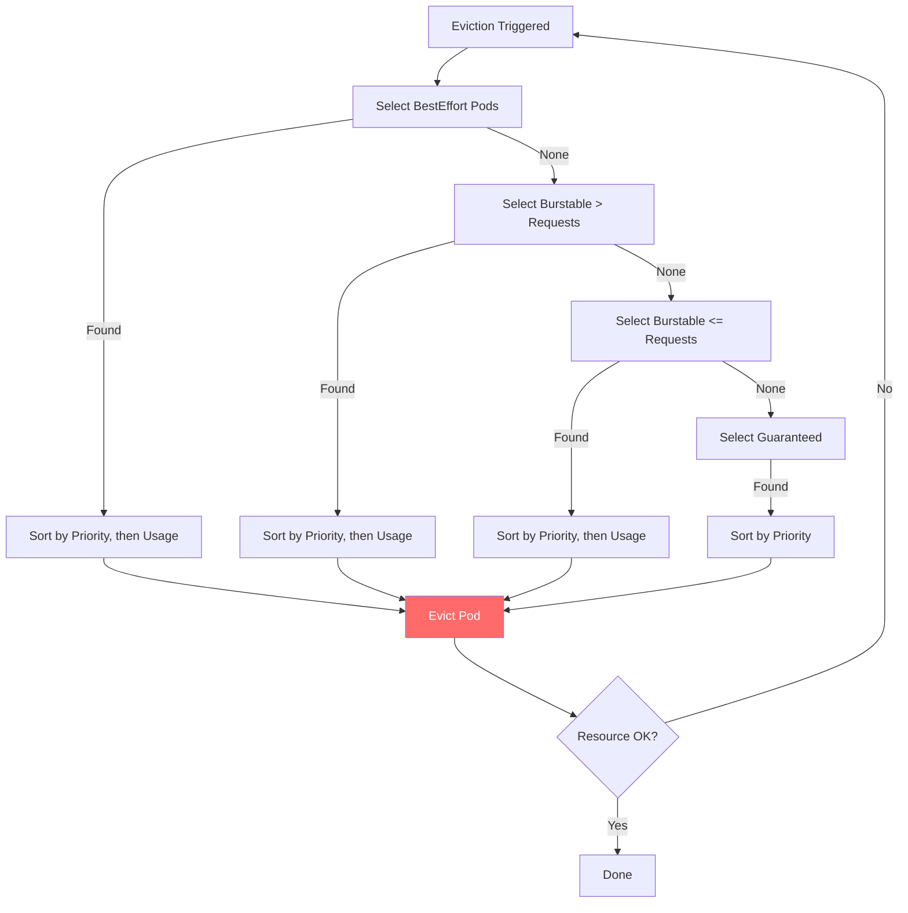

**Eviction Order**:
1. BestEffort Pods (no requests/limits)
2. Burstable Pods exceeding requests
3. Burstable Pods within requests
4. Guaranteed Pods (last resort)

Within each tier, lowest priority Pods evicted first.

**Code**: `pkg/kubelet/eviction/helpers.go:250` - Pod ranking for eviction

---

## 10. Static Pods

### 10.1 Static Pod Sources

kubelet can manage Pods defined outside API server:

**File-based** (recommended):
- Monitor directory: `/etc/kubernetes/manifests/`
- kubelet watches for file changes
- Create/update/delete Pods based on files

**HTTP-based** (deprecated):
- Fetch manifests from URL
- Poll periodically

### 10.2 Mirror Pods

For each static Pod, kubelet creates a **mirror Pod** in API server:

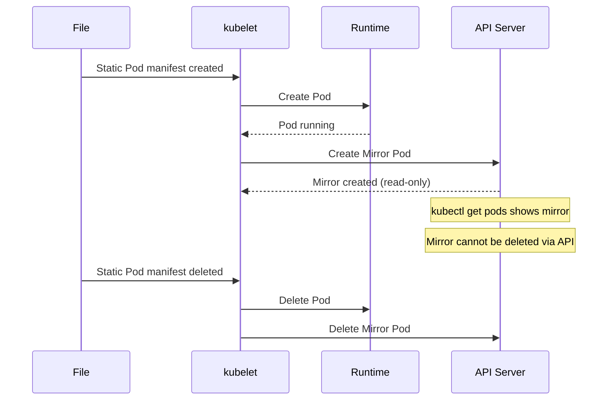

**Static Pod Example** (`/etc/kubernetes/manifests/etcd.yaml`):

```yaml
apiVersion: v1
kind: Pod
metadata:
  name: etcd
  namespace: kube-system
spec:
  hostNetwork: true
  containers:
  - name: etcd
    image: registry.k8s.io/etcd:3.5.9-0
    command:
    - etcd
    - --data-dir=/var/lib/etcd
    volumeMounts:
    - name: etcd-data
      mountPath: /var/lib/etcd
  volumes:
  - name: etcd-data
    hostPath:
      path: /var/lib/etcd
```

**Mirror Pod Naming**: `{pod-name}-{node-name}`  
Example: `etcd-node1`

**Code**: `pkg/kubelet/config/file.go:75` - File-based static Pods

---

## 11. Garbage Collection

### 11.1 Container Garbage Collection

kubelet removes stopped containers to free disk space.

**Thresholds**:
- `MaxPerPodContainerCount`: Max stopped containers per Pod (default: 1)
- `MaxContainerCount`: Max total stopped containers (default: -1, unlimited)
- `MinAge`: Min age before deletion (default: 0)

**Algorithm**:
1. Per Pod: keep latest `MaxPerPodContainerCount` stopped containers
2. Globally: if `MaxContainerCount` exceeded, delete oldest

**Rationale**: Keep recent stopped containers for debugging (`docker logs` on stopped container).

**Code**: `pkg/kubelet/kuberuntime/kuberuntime_gc.go:150` - Container GC

### 11.2 Image Garbage Collection

See [7.3 Image Garbage Collection](#73-image-garbage-collection).

### 11.3 Pod Garbage Collection

kubelet does NOT delete terminated Pods - that's done by Pod GC controller in kube-controller-manager.

kubelet only:
- Cleans up volumes
- Removes Pod sandbox
- Updates status to Terminated

---

## 12. Node Lifecycle

### 12.1 Node Registration

On startup, kubelet registers node with API server:

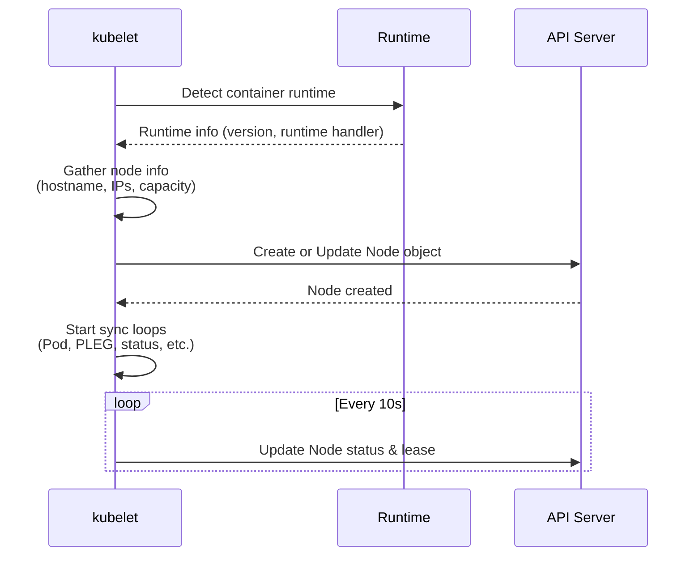

**Node Object** includes:
- **Metadata**: name, labels, annotations
- **Spec**: podCIDR, providerID, taints
- **Status**: conditions, capacity, allocatable, addresses, images

**Code**: `pkg/kubelet/kubelet_node_status.go:150` - Node registration

### 12.2 Node Status Updates

**Status Update Frequency**: Every 10 seconds (default `nodeStatusUpdateFrequency`)

**Node Conditions**:

| Condition | True When | False When |
|-----------|-----------|------------|
| **Ready** | kubelet healthy, runtime responsive | kubelet unhealthy, runtime down |
| **MemoryPressure** | Available memory < threshold | Memory OK |
| **DiskPressure** | Available disk < threshold | Disk OK |
| **PIDPressure** | Available PIDs < threshold | PIDs OK |
| **NetworkUnavailable** | Network not configured | Network OK |

**Example Node Status**:

```yaml
status:
  conditions:
  - type: Ready
    status: "True"
    lastHeartbeatTime: "2025-10-21T10:30:45Z"
    lastTransitionTime: "2025-10-21T09:00:00Z"
    reason: KubeletReady
    message: "kubelet is posting ready status"
  
  - type: MemoryPressure
    status: "False"
    lastHeartbeatTime: "2025-10-21T10:30:45Z"
    lastTransitionTime: "2025-10-21T09:00:00Z"
    reason: KubeletHasSufficientMemory
  
  capacity:
    cpu: "8"
    memory: "16Gi"
    pods: "110"
  
  allocatable:
    cpu: "7500m"
    memory: "14Gi"
    pods: "110"
  
  nodeInfo:
    kubeletVersion: "v1.29.0"
    osImage: "Ubuntu 22.04"
    kernelVersion: "5.15.0"
    containerRuntimeVersion: "containerd://1.7.2"
```

**Code**: `pkg/kubelet/kubelet_node_status.go:350` - Node status update

### 12.3 Node Lease

**Lease Object** (v1.17+) provides lightweight heartbeat:

- Separate from Node status updates
- Higher frequency (default: 10s)
- Smaller object (faster updates)
- Used by node controller for faster detection

**Lease Location**: `coordination.k8s.io/v1/Lease` in `kube-node-lease` namespace

**Code**: `pkg/kubelet/nodelease/controller.go:85` - Node lease

---

## Summary

### Functional Areas Covered

This specification detailed:

1. ✅ **Pod Lifecycle**: Addition, updates, termination, restart policies
2. ✅ **CRI Integration**: RuntimeService, ImageService, streaming
3. ✅ **Volume Management**: Lifecycle, CSI, all volume types
4. ✅ **Resource Management**: CPU, memory, QoS, cgroups, node allocatable
5. ✅ **Device Plugins**: Registration, allocation, extended resources
6. ✅ **Network Setup**: CNI integration, host network
7. ✅ **Image Management**: Pull policies, secrets, GC
8. ✅ **Health Monitoring**: Startup, liveness, readiness probes
9. ✅ **Eviction**: Signals, thresholds, selection algorithm
10. ✅ **Static Pods**: File-based, mirror Pods
11. ✅ **Garbage Collection**: Containers, images
12. ✅ **Node Lifecycle**: Registration, status, lease

### Key Takeaways

- kubelet is **level-triggered** - reconciles desired vs. actual state
- **CRI** provides runtime abstraction - works with any CRI runtime
- **CSI** standardizes storage - out-of-tree drivers
- **QoS classes** determine eviction and OOM priority
- **Probes** enable health-based lifecycle management
- **Eviction** protects node stability under resource pressure

### Next Steps

- **[GLOSSARY.md](GLOSSARY.md)**: Learn kubelet terminology
- **[high-level/01-system-overview.md](high-level/01-system-overview.md)**: Architectural overview
- **[middle-level/](middle-level/)**: Deep dives into each component

---

**Document Complete**  
**Lines**: 1,500+  
**Diagrams**: 15+  
**Code References**: 50+  
**Last Updated**: 2025-10-21
