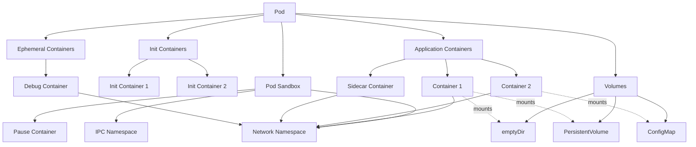
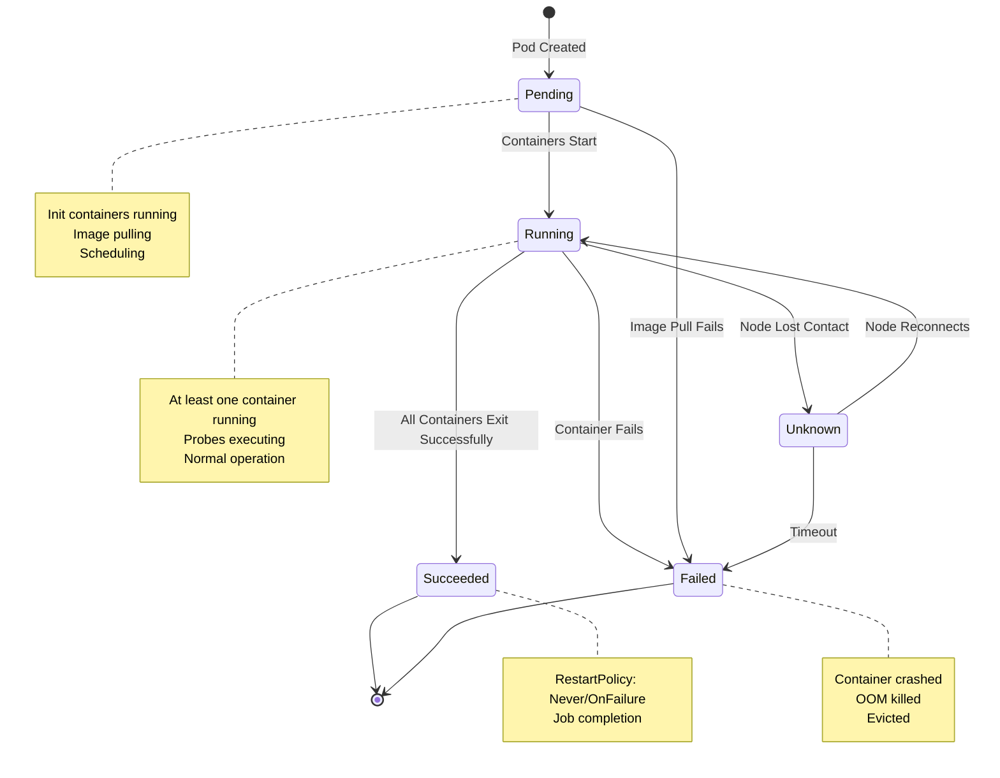
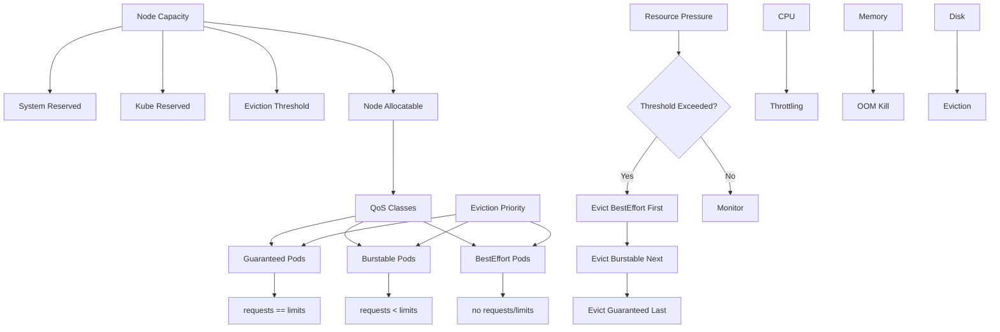
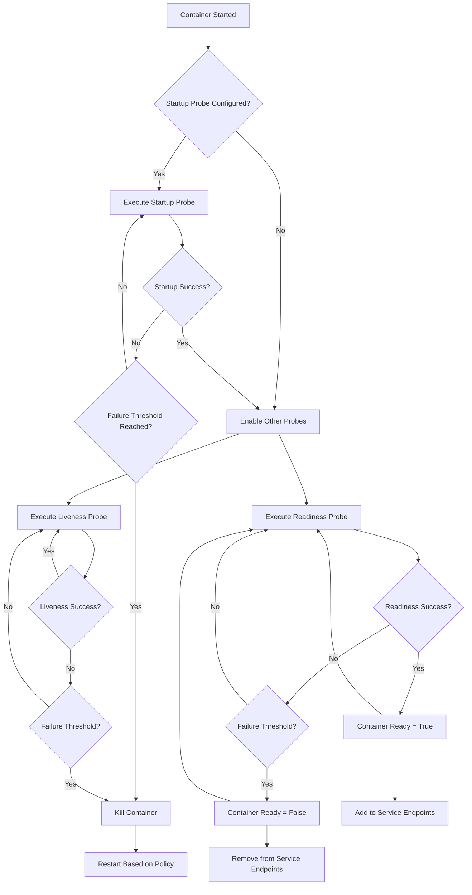
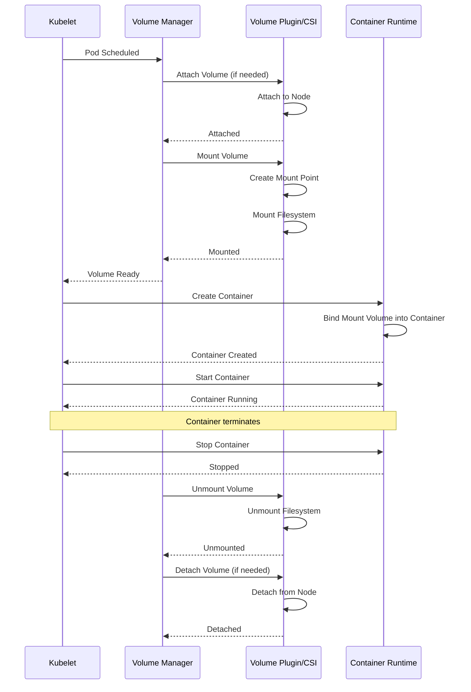
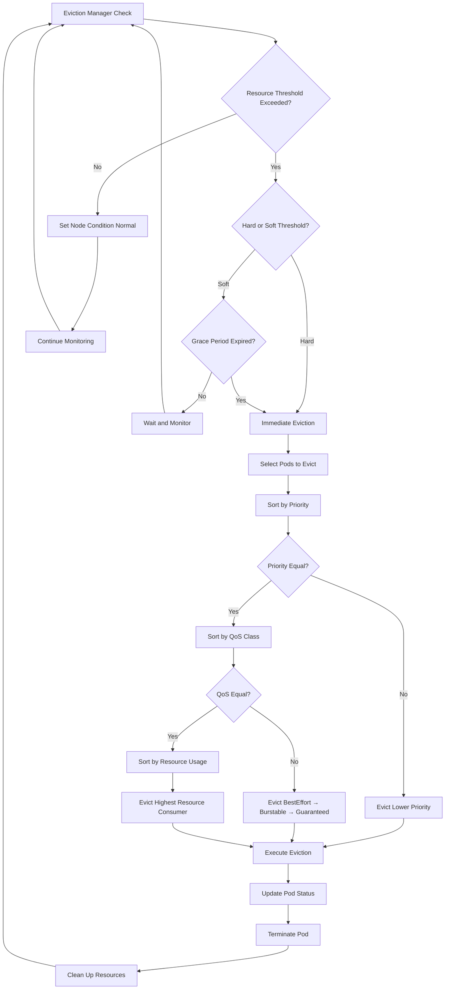
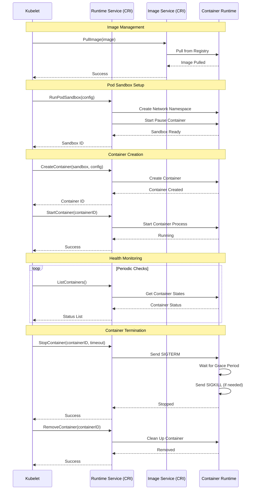
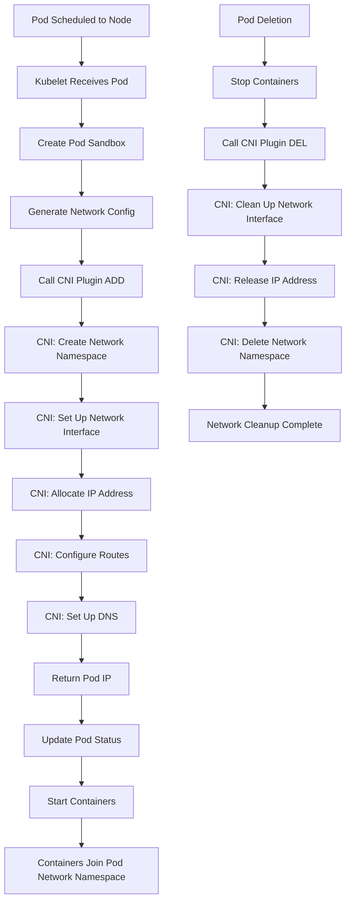

# Kubelet Glossary

This glossary provides comprehensive definitions of kubelet-related terms, organized by functional categories. Each term includes its definition, context within kubelet operations, related terms, and code references where applicable.

---

## Table of Contents

1. [Pod Terms](#pod-terms)
2. [Container Terms](#container-terms)
3. [Volume Terms](#volume-terms)
4. [Resource Terms](#resource-terms)
5. [Device Terms](#device-terms)
6. [Network Terms](#network-terms)
7. [Image Terms](#image-terms)
8. [Probe Terms](#probe-terms)
9. [Eviction Terms](#eviction-terms)
10. [Lifecycle Terms](#lifecycle-terms)
11. [Diagrams](#diagrams)

---

## Pod Terms

### Pod

**Definition**: The smallest deployable unit in Kubernetes, representing one or more containers that share network and storage resources.

**Context**: Kubelet is responsible for managing the lifecycle of all pods scheduled to its node. It receives pod specifications from the API server and ensures containers are running and healthy.

**Related Terms**: Container, Pod Sandbox, Pod Phase, Pod Condition, Static Pod, Mirror Pod

**Code Reference**: pkg/kubelet/pod/pod.go, pkg/kubelet/kubelet_pods.go

**Example**:
```yaml
apiVersion: v1
kind: Pod
metadata:
  name: nginx-pod
spec:
  containers:
  - name: nginx
    image: nginx:1.14.2
    ports:
    - containerPort: 80
```

### Static Pod

**Definition**: A pod managed directly by kubelet on a specific node, defined by configuration files in a directory on the node rather than through the Kubernetes API server.

**Context**: Kubelet watches a configured directory (staticPodPath) for pod manifests and automatically creates/manages these pods. Static pods are commonly used for control plane components.

**Related Terms**: Pod, Mirror Pod, Pod Manifest, Kubelet Configuration

**Code Reference**: pkg/kubelet/config/file.go, pkg/kubelet/kubelet.go

**Example**:
```yaml
# File: /etc/kubernetes/manifests/static-nginx.yaml
apiVersion: v1
kind: Pod
metadata:
  name: static-nginx
spec:
  containers:
  - name: nginx
    image: nginx:latest
```

### Mirror Pod

**Definition**: A read-only representation in the API server of a static pod running on a node.

**Context**: When kubelet manages a static pod, it creates a corresponding mirror pod in the API server for visibility. Mirror pods cannot be controlled via the API; changes must be made to the static pod manifest file.

**Related Terms**: Static Pod, Pod, API Server

**Code Reference**: pkg/kubelet/status/status_manager.go

**Example**: A static pod named "nginx-node1" creates a mirror pod visible via `kubectl get pods`.

### Pod Sandbox

**Definition**: An isolated environment (network and potentially IPC namespaces) that contains one or more containers in a pod.

**Context**: Kubelet uses the CRI to create a pod sandbox before starting any containers. The sandbox provides the shared namespace for all containers in the pod.

**Related Terms**: Pause Container, Pod, CRI, Network Namespace

**Code Reference**: pkg/kubelet/kuberuntime/kuberuntime_sandbox.go

**Example**: Created via CRI's `RunPodSandbox` call.

### Pause Container

**Definition**: A minimal container that holds the network namespace and other shared namespaces for a pod.

**Context**: Kubelet creates a pause container as the first container in a pod sandbox. Other containers join the pause container's namespaces, enabling resource sharing.

**Related Terms**: Pod Sandbox, Pod, Container, Network Namespace

**Code Reference**: pkg/kubelet/kuberuntime/kuberuntime_sandbox.go

**Example**: Image typically named `k8s.gcr.io/pause:3.9` or similar.

### Init Container

**Definition**: A specialized container that runs and completes before application containers in a pod start.

**Context**: Kubelet runs init containers sequentially in the order defined in the pod spec. Each init container must complete successfully before the next one starts. Only after all init containers succeed do the main application containers start.

**Related Terms**: Container, Pod, Sidecar Container, Pod Lifecycle

**Code Reference**: pkg/kubelet/kuberuntime/kuberuntime_manager.go

**Example**:
```yaml
apiVersion: v1
kind: Pod
metadata:
  name: myapp-pod
spec:
  initContainers:
  - name: init-myservice
    image: busybox
    command: ['sh', '-c', 'until nslookup myservice; do sleep 2; done;']
  containers:
  - name: myapp
    image: myapp:1.0
```

### Sidecar Container

**Definition**: A container that runs alongside the main application container(s) in a pod, providing supporting functionality like logging, monitoring, or proxying.

**Context**: Kubelet treats sidecar containers as regular containers in the pod spec, starting them concurrently with other application containers. Native sidecar support (restartable init containers) allows init containers to continue running.

**Related Terms**: Container, Pod, Init Container, Lifecycle

**Code Reference**: pkg/kubelet/kuberuntime/kuberuntime_manager.go

**Example**:
```yaml
apiVersion: v1
kind: Pod
metadata:
  name: app-with-sidecar
spec:
  containers:
  - name: app
    image: myapp:1.0
  - name: log-collector
    image: fluentd:latest
```

### Ephemeral Container

**Definition**: A temporary container that can be added to a running pod for debugging purposes, without requiring pod restart.

**Context**: Kubelet supports adding ephemeral containers to running pods via the ephemeralcontainers subresource. These containers share the pod's namespaces and resources but have limited configuration options.

**Related Terms**: Container, Pod, Debugging, Pod Spec

**Code Reference**: pkg/kubelet/kuberuntime/kuberuntime_container.go

**Example**:
```bash
kubectl debug -it pod-name --image=busybox --target=container-name
```

### Pod Phase

**Definition**: A high-level summary of where a pod is in its lifecycle, represented as one of five states: Pending, Running, Succeeded, Failed, or Unknown.

**Context**: Kubelet updates the pod's phase in its status based on container states and conditions. The phase provides a simple, human-readable status indicator.

**Related Terms**: Pod, Pod Condition, Pod Status, Container State

**Code Reference**: pkg/kubelet/status/status_manager.go, staging/src/k8s.io/api/core/v1/types.go

**Example**:
- Pending: Pod accepted but containers not yet running
- Running: At least one container is running
- Succeeded: All containers terminated successfully
- Failed: All containers terminated, at least one failed
- Unknown: Pod state cannot be determined

### Pod Condition

**Definition**: Detailed information about the pod's current state, represented as an array of condition types (PodScheduled, Initialized, ContainersReady, Ready, etc.).

**Context**: Kubelet updates pod conditions to reflect detailed status information. Each condition has a type, status (True/False/Unknown), lastTransitionTime, reason, and message.

**Related Terms**: Pod Phase, Pod Status, Pod Readiness, Container State

**Code Reference**: pkg/kubelet/status/status_manager.go

**Example**:
```yaml
status:
  conditions:
  - type: Ready
    status: "True"
    lastTransitionTime: "2024-01-15T10:30:00Z"
  - type: ContainersReady
    status: "True"
    lastTransitionTime: "2024-01-15T10:30:00Z"
```

### Pod QoS (Quality of Service)

**Definition**: A classification that determines pod scheduling and eviction priority based on resource requests and limits. Classes include Guaranteed, Burstable, and BestEffort.

**Context**: Kubelet uses QoS class during eviction decisions. Guaranteed pods (requests=limits for all resources) are evicted last, BestEffort pods (no requests/limits) are evicted first, and Burstable pods are in between.

**Related Terms**: Resource Request, Resource Limit, QoS Class, Eviction, Pod Priority

**Code Reference**: pkg/apis/core/v1/helper/qos/qos.go

**Example**:
```yaml
# Guaranteed QoS
spec:
  containers:
  - name: app
    resources:
      requests:
        memory: "1Gi"
        cpu: "1"
      limits:
        memory: "1Gi"
        cpu: "1"
```

### Pod Status

**Definition**: The current observed state of a pod, including phase, conditions, container statuses, IP address, and other runtime information.

**Context**: Kubelet continuously updates pod status and reports it to the API server via the status manager. This includes container states, IP addresses, resource usage, and other runtime details.

**Related Terms**: Pod Phase, Pod Condition, Container Status, Status Manager

**Code Reference**: pkg/kubelet/status/status_manager.go

**Example**:
```yaml
status:
  phase: Running
  podIP: 10.244.1.5
  conditions: [...]
  containerStatuses: [...]
```

### Pod Manifest

**Definition**: A YAML or JSON file that describes a pod's desired state, including containers, volumes, and other specifications.

**Context**: Kubelet reads pod manifests from various sources: API server, static pod directory, or HTTP endpoint. It reconciles the actual state with the desired state described in manifests.

**Related Terms**: Pod, Static Pod, Pod Spec, Configuration

**Code Reference**: pkg/kubelet/config/file.go, pkg/kubelet/config/http.go

**Example**: Any YAML file defining a pod (as shown in previous examples).

### Pod Spec

**Definition**: The specification section of a pod manifest that describes the desired state, including containers, volumes, restart policy, and other configuration.

**Context**: Kubelet uses the pod spec to determine how to create and manage containers, configure volumes, set up networking, and enforce policies.

**Related Terms**: Pod, Pod Manifest, Container Spec, Volume Spec

**Code Reference**: staging/src/k8s.io/api/core/v1/types.go

**Example**: The `spec:` section in a pod YAML file.

### Pod IP

**Definition**: The IP address assigned to a pod within the cluster network.

**Context**: Kubelet receives the pod IP from the CNI plugin after setting up the pod's network. This IP is shared by all containers in the pod and is reported in the pod's status.

**Related Terms**: Pod Network, CNI, Network Namespace, Cluster IP

**Code Reference**: pkg/kubelet/network/kubenet/kubenet_linux.go

**Example**: Typically in the cluster CIDR range, e.g., `10.244.1.5`.

### Pod Hostname

**Definition**: The hostname assigned to a pod, defaulting to the pod's metadata name unless explicitly overridden.

**Context**: Kubelet sets the pod's hostname when creating the pod sandbox. Containers in the pod see this hostname via the hostname command.

**Related Terms**: Pod, Pod Spec, Pod Sandbox

**Code Reference**: pkg/kubelet/kuberuntime/kuberuntime_sandbox.go

**Example**:
```yaml
spec:
  hostname: custom-hostname
  subdomain: custom-subdomain
```

### Pod DNS Config

**Definition**: Custom DNS settings for a pod, including nameservers, search domains, and options.

**Context**: Kubelet configures DNS for pods based on the dnsPolicy and dnsConfig fields in the pod spec. It generates resolv.conf for containers.

**Related Terms**: DNS, DNS Policy, Network, Pod Spec

**Code Reference**: pkg/kubelet/network/dns/dns.go

**Example**:
```yaml
spec:
  dnsPolicy: "None"
  dnsConfig:
    nameservers:
    - 8.8.8.8
    searches:
    - example.com
    options:
    - name: ndots
      value: "2"
```

### Pod Security Context

**Definition**: Security settings applied at the pod level, affecting all containers in the pod.

**Context**: Kubelet enforces pod-level security settings like fsGroup, seLinuxOptions, and sysctls. These settings complement container-level security contexts.

**Related Terms**: Security Context, Container Security Context, Pod Spec

**Code Reference**: pkg/kubelet/kuberuntime/security_context.go

**Example**:
```yaml
spec:
  securityContext:
    fsGroup: 2000
    runAsUser: 1000
    runAsNonRoot: true
```

### Pod Overhead

**Definition**: Additional resource requirements imposed by the pod's runtime environment, such as the pod sandbox infrastructure.

**Context**: Kubelet accounts for pod overhead when calculating resource usage and availability. Overhead is defined by RuntimeClass and added to container resource requests.

**Related Terms**: Runtime Class, Resource Request, Resource Management, Pod Spec

**Code Reference**: pkg/kubelet/cm/pod_container_manager_linux.go

**Example**:
```yaml
# RuntimeClass definition
kind: RuntimeClass
apiVersion: node.k8s.io/v1
metadata:
  name: kata-fc
overhead:
  podFixed:
    memory: "120Mi"
    cpu: "250m"
```

### Pod Readiness

**Definition**: A condition indicating whether a pod is ready to serve requests, based on all containers being ready and passing readiness probes.

**Context**: Kubelet updates the Ready condition in pod status based on container readiness. Services use this to determine if the pod should receive traffic.

**Related Terms**: Pod Condition, Readiness Probe, Container Ready, Service

**Code Reference**: pkg/kubelet/status/status_manager.go

**Example**: Ready condition in pod status, used by service endpoints.

### Pod Disruption Budget

**Definition**: A policy that limits the number of pods that can be voluntarily disrupted simultaneously.

**Context**: While not directly managed by kubelet, kubelet respects eviction decisions that consider PDBs. The API server enforces PDBs during voluntary disruptions.

**Related Terms**: Eviction, Pod, Availability, Disruption

**Code Reference**: Referenced in eviction logic but enforced at API level.

**Example**:
```yaml
apiVersion: policy/v1
kind: PodDisruptionBudget
metadata:
  name: myapp-pdb
spec:
  minAvailable: 2
  selector:
    matchLabels:
      app: myapp
```

### Pod Priority

**Definition**: An integer value indicating the relative importance of a pod compared to other pods, affecting scheduling and eviction order.

**Context**: Kubelet uses pod priority during preemption and eviction decisions. Higher priority pods are less likely to be evicted during resource pressure.

**Related Terms**: Priority Class, Preemption, Eviction, Pod QoS

**Code Reference**: pkg/kubelet/eviction/eviction_manager.go

**Example**:
```yaml
apiVersion: v1
kind: Pod
metadata:
  name: high-priority-pod
spec:
  priorityClassName: high-priority
  containers:
  - name: app
    image: nginx
```

### Pod Preemption

**Definition**: The process of evicting lower-priority pods to make room for higher-priority pods that cannot be scheduled.

**Context**: While primarily a scheduler function, kubelet executes the actual eviction of preempted pods when instructed by the scheduler.

**Related Terms**: Pod Priority, Eviction, Scheduling, Priority Class

**Code Reference**: pkg/kubelet/eviction/eviction_manager.go

**Example**: Scheduler marks pods for preemption; kubelet terminates them.

### Pod Affinity

**Definition**: Rules that constrain which nodes a pod can be scheduled on based on labels of pods already running on those nodes.

**Context**: Kubelet doesn't directly enforce affinity rules (handled by scheduler), but it provides accurate node and pod information that the scheduler uses for affinity decisions.

**Related Terms**: Node Affinity, Anti-Affinity, Scheduling, Pod Spec

**Code Reference**: Referenced in scheduler, not directly in kubelet.

**Example**:
```yaml
spec:
  affinity:
    podAffinity:
      requiredDuringSchedulingIgnoredDuringExecution:
      - labelSelector:
          matchLabels:
            app: frontend
        topologyKey: kubernetes.io/hostname
```

### Pod Resource Claim

**Definition**: A request for dynamic resources (like GPUs or other devices) that need to be allocated before a pod can start.

**Context**: Kubelet coordinates with resource drivers to allocate and deallocate dynamic resources for pods. This is part of the Dynamic Resource Allocation (DRA) feature.

**Related Terms**: Dynamic Resource Allocation, Device Plugin, Resource Management

**Code Reference**: pkg/kubelet/cm/dra/manager.go

**Example**:
```yaml
spec:
  resourceClaims:
  - name: gpu-claim
    source:
      resourceClaimName: my-gpu-claim
```

### Pod Termination

**Definition**: The process of gracefully shutting down a pod and its containers, including sending SIGTERM, waiting for the grace period, and sending SIGKILL if necessary.

**Context**: Kubelet manages pod termination, executing preStop hooks, sending termination signals, respecting grace periods, and cleaning up resources.

**Related Terms**: Termination Grace Period, Lifecycle Hook, SIGTERM, SIGKILL

**Code Reference**: pkg/kubelet/kubelet_pods.go, pkg/kubelet/kuberuntime/kuberuntime_container.go

**Example**: Process triggered by pod deletion or eviction.

### Pod UID

**Definition**: A unique identifier assigned to each pod instance, persisting for the lifetime of that specific pod instance.

**Context**: Kubelet uses pod UID to uniquely identify pods and their resources (volumes, directories, etc.). The UID helps distinguish between different instances of pods with the same name.

**Related Terms**: Pod, Pod Identity, Metadata

**Code Reference**: pkg/kubelet/kubelet_pods.go

**Example**: `550e8400-e29b-41d4-a716-446655440000`

### Pod Restart Policy

**Definition**: A policy that determines whether and how kubelet should restart containers within a pod when they exit (Always, OnFailure, or Never).

**Context**: Kubelet enforces the restart policy by monitoring container exits and restarting them according to the policy. Backoff delays increase with repeated restarts.

**Related Terms**: Container State, Pod Lifecycle, Container Restart

**Code Reference**: pkg/kubelet/kuberuntime/kuberuntime_manager.go

**Example**:
```yaml
spec:
  restartPolicy: Always  # or OnFailure, Never
```

### Pod Log

**Definition**: Output (stdout/stderr) from containers in a pod, stored on the node and accessible via kubectl logs.

**Context**: Kubelet manages container logs, rotating them when they exceed size limits. Logs are stored in /var/log/pods and /var/log/containers.

**Related Terms**: Container, Logging, Log Rotation, Container Runtime

**Code Reference**: pkg/kubelet/kubelet_pods.go

**Example**:
```bash
kubectl logs pod-name -c container-name
```

---

## Container Terms

### Container

**Definition**: A lightweight, standalone executable package that includes application code, runtime, system tools, libraries, and settings.

**Context**: Kubelet manages containers through the Container Runtime Interface (CRI), creating, starting, stopping, and monitoring containers according to pod specifications.

**Related Terms**: Pod, Container Runtime, CRI, Container State, Container Spec

**Code Reference**: pkg/kubelet/kuberuntime/kuberuntime_container.go

**Example**: Individual containers within a pod specification.

### Container State

**Definition**: The current status of a container, represented as Waiting, Running, or Terminated, with associated metadata.

**Context**: Kubelet tracks container states and reports them in pod status. State transitions trigger various kubelet actions like restarting containers or updating probes.

**Related Terms**: Container, Pod Status, Container Status

**Code Reference**: pkg/kubelet/kuberuntime/kuberuntime_container.go

**Example**:
```yaml
containerStatuses:
- name: nginx
  state:
    running:
      startedAt: "2024-01-15T10:30:00Z"
```

### Container Runtime

**Definition**: The software responsible for running containers on a node, implementing the OCI runtime specification.

**Context**: Kubelet communicates with container runtimes through CRI. Common runtimes include containerd, CRI-O, and Docker (via dockershim, now deprecated).

**Related Terms**: CRI, OCI, Containerd, CRI-O, Container Runtime Interface

**Code Reference**: pkg/kubelet/kuberuntime/kuberuntime_manager.go

**Example**: containerd, CRI-O, runc

### CRI (Container Runtime Interface)

**Definition**: A plugin interface that enables kubelet to use different container runtimes without recompiling.

**Context**: Kubelet uses CRI to manage pod sandboxes, containers, and images. CRI defines gRPC APIs for runtime and image services.

**Related Terms**: Container Runtime, gRPC, Runtime Service, Image Service

**Code Reference**: pkg/kubelet/cri/remote/remote_runtime.go, staging/src/k8s.io/cri-api

**Example**: CRI gRPC calls like RunPodSandbox, CreateContainer, StartContainer.

### OCI (Open Container Initiative)

**Definition**: An open governance structure for creating open industry standards around container formats and runtimes.

**Context**: Kubelet works with OCI-compliant runtimes. The OCI Runtime Specification defines how to run containers, while the Image Specification defines container image formats.

**Related Terms**: Container Runtime, runc, Container Image, Container Spec

**Code Reference**: External specification implemented by container runtimes.

**Example**: OCI runtime spec, OCI image spec.

### runc

**Definition**: A CLI tool for spawning and running containers according to the OCI specification, serving as the default low-level runtime.

**Context**: Most container runtimes (containerd, CRI-O) use runc as the underlying runtime to actually create and run containers based on OCI bundles.

**Related Terms**: OCI, Container Runtime, Containerd, CRI-O

**Code Reference**: External binary called by higher-level runtimes.

**Example**: Low-level runtime that creates container processes.

### containerd

**Definition**: An industry-standard core container runtime that manages the complete container lifecycle, including image transfer, storage, container execution, and supervision.

**Context**: Kubelet communicates with containerd via CRI. Containerd manages pod sandboxes, containers, and images, delegating to runc for actual container execution.

**Related Terms**: CRI, Container Runtime, runc, Image Management

**Code Reference**: pkg/kubelet/cri/remote/remote_runtime.go

**Example**: Primary container runtime for many Kubernetes installations.

### CRI-O

**Definition**: A lightweight container runtime specifically designed for Kubernetes, implementing the CRI specification.

**Context**: CRI-O provides an alternative to containerd, offering a minimal runtime focused on Kubernetes use cases. Kubelet interacts with CRI-O through the standard CRI interface.

**Related Terms**: CRI, Container Runtime, runc, OCI

**Code Reference**: pkg/kubelet/cri/remote/remote_runtime.go

**Example**: Container runtime optimized for Kubernetes.

### Container Image

**Definition**: A read-only template containing the application code, dependencies, and configuration needed to create a container.

**Context**: Kubelet uses the CRI image service to pull, list, and remove images. Images are referenced in container specs and pulled before container creation.

**Related Terms**: Image Registry, Image Pull Policy, Image Manifest, Image Service

**Code Reference**: pkg/kubelet/images/image_manager.go

**Example**: `nginx:1.14.2`, `gcr.io/google-samples/hello-app:1.0`

### Image Manifest

**Definition**: A JSON document that describes the layers, configuration, and metadata of a container image.

**Context**: Container runtimes use image manifests to understand image structure and pull necessary layers. Kubelet indirectly works with manifests through the CRI image service.

**Related Terms**: Container Image, Image Layer, OCI Image Spec

**Code Reference**: Managed by container runtime (containerd, CRI-O).

**Example**: OCI image manifest JSON with layers and config.

### Container Spec

**Definition**: The specification of a container within a pod spec, including image, command, arguments, resources, volumes, and other settings.

**Context**: Kubelet uses container specs to create and configure containers. The spec defines everything needed to run the container.

**Related Terms**: Pod Spec, Container, Container Configuration

**Code Reference**: staging/src/k8s.io/api/core/v1/types.go

**Example**:
```yaml
containers:
- name: nginx
  image: nginx:1.14.2
  ports:
  - containerPort: 80
  resources:
    requests:
      memory: "64Mi"
      cpu: "250m"
```

### Container ID

**Definition**: A unique identifier assigned to a container instance by the container runtime.

**Context**: Kubelet tracks container IDs to manage container lifecycle operations. The ID format is typically `runtime://container-hash`.

**Related Terms**: Container, Container Runtime, Container Status

**Code Reference**: pkg/kubelet/kuberuntime/kuberuntime_container.go

**Example**: `containerd://a1b2c3d4e5f6...`

### Container Status

**Definition**: Detailed information about a container's current state, including state, restart count, image, containerID, and ready status.

**Context**: Kubelet reports container status as part of pod status. This includes current state, historical state, and metadata.

**Related Terms**: Container State, Pod Status, Container

**Code Reference**: pkg/kubelet/kuberuntime/kuberuntime_container.go

**Example**:
```yaml
containerStatuses:
- name: nginx
  state:
    running:
      startedAt: "2024-01-15T10:30:00Z"
  ready: true
  restartCount: 0
  containerID: containerd://abc123...
```

### Container Command

**Definition**: The entrypoint command and arguments that run when a container starts, overriding the image's default CMD and ENTRYPOINT.

**Context**: Kubelet passes the command and args from the container spec to the runtime when creating containers. This allows customization of container behavior.

**Related Terms**: Container Spec, Container, Entrypoint

**Code Reference**: pkg/kubelet/kuberuntime/kuberuntime_container.go

**Example**:
```yaml
containers:
- name: busybox
  image: busybox
  command: ["/bin/sh"]
  args: ["-c", "echo Hello World"]
```

### Container Environment

**Definition**: Environment variables set within a container, defined in the container spec or derived from ConfigMaps, Secrets, or field references.

**Context**: Kubelet constructs the container's environment from multiple sources and passes it to the runtime when creating containers.

**Related Terms**: Container Spec, ConfigMap, Secret, Downward API

**Code Reference**: pkg/kubelet/kubelet_pods.go

**Example**:
```yaml
containers:
- name: app
  env:
  - name: DATABASE_URL
    value: "postgres://..."
  - name: POD_NAME
    valueFrom:
      fieldRef:
        fieldPath: metadata.name
```

### Container Security Context

**Definition**: Security settings applied to a specific container, including user/group IDs, capabilities, SELinux options, and privilege settings.

**Context**: Kubelet enforces container security contexts when creating containers, configuring the container runtime to apply these security settings.

**Related Terms**: Pod Security Context, Security, Capabilities, SELinux

**Code Reference**: pkg/kubelet/kuberuntime/security_context.go

**Example**:
```yaml
containers:
- name: app
  securityContext:
    runAsUser: 1000
    runAsNonRoot: true
    allowPrivilegeEscalation: false
    capabilities:
      drop:
      - ALL
```

### Container Restart Count

**Definition**: The number of times a container has been restarted by kubelet, tracked in container status.

**Context**: Kubelet increments the restart count each time it restarts a container. High restart counts may indicate container instability.

**Related Terms**: Container State, Restart Policy, Container Status

**Code Reference**: pkg/kubelet/kuberuntime/kuberuntime_container.go

**Example**: Visible in `kubectl describe pod` output.

### Container Ready

**Definition**: A boolean indicating whether a container is ready to serve requests, determined by successful readiness probe checks.

**Context**: Kubelet sets container ready status based on readiness probe results. All containers must be ready for the pod to be considered ready.

**Related Terms**: Readiness Probe, Container Status, Pod Readiness

**Code Reference**: pkg/kubelet/status/status_manager.go

**Example**: `ready: true` in container status.

### Container Log Path

**Definition**: The file system path where a container's logs (stdout/stderr) are stored on the node.

**Context**: Kubelet configures the container runtime to write container logs to specific paths. These logs are used by `kubectl logs` and log collection systems.

**Related Terms**: Container Log, Logging, Container Runtime

**Code Reference**: pkg/kubelet/kuberuntime/kuberuntime_container.go

**Example**: `/var/log/pods/namespace_pod-name_uid/container-name/0.log`

### Container Working Directory

**Definition**: The directory inside a container where the process runs, defaulting to the image's WORKDIR or root.

**Context**: Kubelet passes the working directory from the container spec to the runtime when creating containers.

**Related Terms**: Container Spec, Container, Container Command

**Code Reference**: pkg/kubelet/kuberuntime/kuberuntime_container.go

**Example**:
```yaml
containers:
- name: app
  workingDir: /app
```

### Container Termination Message

**Definition**: A message written by a container before termination, read from a file or termination log, used for debugging.

**Context**: Kubelet reads the termination message path and includes it in container status, helping diagnose why containers failed.

**Related Terms**: Container Status, Container State, Debugging

**Code Reference**: pkg/kubelet/kuberuntime/kuberuntime_container.go

**Example**:
```yaml
containers:
- name: app
  terminationMessagePath: /dev/termination-log
  terminationMessagePolicy: File  # or FallbackToLogsOnError
```

### Container stdin/stdout/stderr

**Definition**: Standard input, output, and error streams for a container process.

**Context**: Kubelet can configure whether stdin is open and whether stdin/stdout/stderr are attached to a TTY, enabling interactive containers and logging.

**Related Terms**: Container, Container Log, TTY

**Code Reference**: pkg/kubelet/kuberuntime/kuberuntime_container.go

**Example**:
```yaml
containers:
- name: interactive
  stdin: true
  tty: true
```

### Container Resource Metrics

**Definition**: Real-time measurements of container resource usage, including CPU, memory, and other metrics.

**Context**: Kubelet collects container metrics from cAdvisor and exposes them via the metrics API and summary API. These metrics are used for monitoring and autoscaling.

**Related Terms**: cAdvisor, Metrics, Resource Usage, Summary API

**Code Reference**: pkg/kubelet/stats/stats_provider.go

**Example**: CPU usage, memory working set, filesystem usage.

### Container Hash

**Definition**: A hash of the container spec used to detect when a container's configuration has changed.

**Context**: Kubelet computes container hashes and stores them as annotations. When the hash changes, kubelet knows to recreate the container.

**Related Terms**: Container Spec, Container, Pod Spec

**Code Reference**: pkg/kubelet/kuberuntime/kuberuntime_container.go

**Example**: Used internally to trigger container recreation.

### Container Port

**Definition**: A network port that a container exposes, documented in the container spec for discovery and networking purposes.

**Context**: While port declarations are primarily informational, kubelet includes them in pod and container metadata. Actual port binding depends on network configuration.

**Related Terms**: Container Spec, Networking, Service

**Code Reference**: staging/src/k8s.io/api/core/v1/types.go

**Example**:
```yaml
containers:
- name: web
  ports:
  - containerPort: 8080
    protocol: TCP
    name: http
```

### Container Probe

**Definition**: A health check performed on a container by kubelet, including liveness, readiness, and startup probes.

**Context**: Kubelet executes probes according to the container spec, using the results to determine container health and readiness.

**Related Terms**: Liveness Probe, Readiness Probe, Startup Probe, Probe Handler

**Code Reference**: pkg/kubelet/prober/prober_manager.go

**Example**: See Probe Terms section for detailed examples.

---

## Volume Terms

### Volume

**Definition**: A directory accessible to containers in a pod, with lifetime tied to the pod, used for data storage and sharing.

**Context**: Kubelet manages the lifecycle of volumes, setting them up before containers start and cleaning them up when pods terminate. Volumes enable data persistence and sharing between containers.

**Related Terms**: Volume Mount, Volume Plugin, Persistent Volume, Volume Type

**Code Reference**: pkg/kubelet/volumemanager/volume_manager.go

**Example**:
```yaml
volumes:
- name: data
  emptyDir: {}
```

### Persistent Volume (PV)

**Definition**: A piece of storage in the cluster that has been provisioned by an administrator or dynamically provisioned using Storage Classes.

**Context**: Kubelet mounts persistent volumes to pods based on PersistentVolumeClaim bindings. The volume lifecycle is independent of pod lifecycle.

**Related Terms**: PersistentVolumeClaim, Storage Class, Volume Plugin, CSI

**Code Reference**: pkg/kubelet/volumemanager/volume_manager.go

**Example**:
```yaml
apiVersion: v1
kind: PersistentVolume
metadata:
  name: pv-example
spec:
  capacity:
    storage: 10Gi
  accessModes:
  - ReadWriteOnce
  persistentVolumeReclaimPolicy: Retain
  storageClassName: standard
  hostPath:
    path: /data
```

### Persistent Volume Claim (PVC)

**Definition**: A request for storage by a user, specifying size, access modes, and optionally a storage class.

**Context**: Kubelet mounts volumes based on PVC-to-PV bindings. When a pod references a PVC, kubelet ensures the bound PV is mounted to the pod.

**Related Terms**: Persistent Volume, Storage Class, Volume Mount

**Code Reference**: pkg/kubelet/volumemanager/volume_manager.go

**Example**:
```yaml
apiVersion: v1
kind: PersistentVolumeClaim
metadata:
  name: pvc-example
spec:
  accessModes:
  - ReadWriteOnce
  resources:
    requests:
      storage: 5Gi
  storageClassName: standard
```

### Storage Class

**Definition**: A way to describe different "classes" of storage with varying quality-of-service levels, backup policies, or provisioners.

**Context**: While not directly managed by kubelet, storage classes determine which provisioner creates PVs for PVCs, affecting what volumes kubelet ultimately mounts.

**Related Terms**: Persistent Volume, PVC, Dynamic Provisioning, CSI

**Code Reference**: Referenced in volume provisioning, not directly in kubelet core.

**Example**:
```yaml
apiVersion: storage.k8s.io/v1
kind: StorageClass
metadata:
  name: fast-ssd
provisioner: kubernetes.io/aws-ebs
parameters:
  type: gp3
  iops: "3000"
```

### CSI (Container Storage Interface)

**Definition**: A standardized interface for container orchestrators to expose storage systems to containerized workloads.

**Context**: Kubelet communicates with CSI drivers to mount, unmount, and manage volumes. CSI enables third-party storage providers to integrate with Kubernetes.

**Related Terms**: Volume Plugin, Persistent Volume, CSI Driver, CSI Node

**Code Reference**: pkg/volume/csi/, pkg/kubelet/volumemanager/

**Example**: AWS EBS CSI driver, Azure Disk CSI driver, etc.

### Volume Plugin

**Definition**: Code that implements the mounting and unmounting of specific volume types (in-tree plugins or CSI).

**Context**: Kubelet uses volume plugins to handle different storage backends. In-tree plugins are being migrated to CSI drivers.

**Related Terms**: Volume, CSI, Volume Manager, Storage

**Code Reference**: pkg/volume/, pkg/kubelet/volumemanager/

**Example**: emptyDir, hostPath, CSI, NFS plugins.

### emptyDir

**Definition**: A temporary volume created when a pod is assigned to a node, initially empty, and deleted when the pod is removed.

**Context**: Kubelet creates emptyDir volumes on the node's disk or in memory (if medium: Memory). They're useful for scratch space or sharing data between containers.

**Related Terms**: Volume, Temporary Storage, Volume Type

**Code Reference**: pkg/volume/emptydir/

**Example**:
```yaml
volumes:
- name: cache
  emptyDir: {}
- name: memory-volume
  emptyDir:
    medium: Memory
    sizeLimit: 1Gi
```

### hostPath

**Definition**: A volume that mounts a file or directory from the host node's filesystem into a pod.

**Context**: Kubelet mounts hostPath volumes directly from the node. They're powerful but pose security risks, so they're typically restricted by pod security policies.

**Related Terms**: Volume, Node Storage, Security

**Code Reference**: pkg/volume/hostpath/

**Example**:
```yaml
volumes:
- name: host-data
  hostPath:
    path: /data
    type: Directory
```

### ConfigMap Volume

**Definition**: A volume that exposes ConfigMap data as files in a pod, allowing configuration injection.

**Context**: Kubelet creates a tmpfs volume and populates it with ConfigMap key-value pairs as files. Updates to ConfigMaps are eventually reflected in mounted volumes.

**Related Terms**: ConfigMap, Volume, Configuration, Secret Volume

**Code Reference**: pkg/volume/configmap/

**Example**:
```yaml
volumes:
- name: config
  configMap:
    name: app-config
    items:
    - key: app.properties
      path: app.properties
```

### Secret Volume

**Definition**: A volume that exposes Secret data as files in a pod, enabling secure credential injection.

**Context**: Similar to ConfigMap volumes, kubelet creates a tmpfs volume and populates it with Secret data. Secrets are stored in memory to reduce disk exposure.

**Related Terms**: Secret, Volume, Security, ConfigMap Volume

**Code Reference**: pkg/volume/secret/

**Example**:
```yaml
volumes:
- name: secrets
  secret:
    secretName: app-secrets
    items:
    - key: database-password
      path: db-password
```

### Projected Volume

**Definition**: A volume that can project several volume sources into the same directory, combining secrets, configMaps, downwardAPI, and serviceAccountToken.

**Context**: Kubelet creates a single volume with multiple sources projected into it, simplifying pod configuration when multiple data sources are needed.

**Related Terms**: Volume, ConfigMap Volume, Secret Volume, Downward API

**Code Reference**: pkg/volume/projected/

**Example**:
```yaml
volumes:
- name: all-in-one
  projected:
    sources:
    - secret:
        name: mysecret
    - configMap:
        name: myconfig
    - downwardAPI:
        items:
        - path: labels
          fieldRef:
            fieldPath: metadata.labels
```

### Volume Mount

**Definition**: The configuration that mounts a volume into a specific path within a container's filesystem.

**Context**: Kubelet sets up volume mounts when creating containers, connecting volumes to container filesystem paths. Mounts can be read-only or read-write.

**Related Terms**: Volume, Container, Volume Path, Subpath

**Code Reference**: pkg/kubelet/kuberuntime/kuberuntime_container.go

**Example**:
```yaml
containers:
- name: app
  volumeMounts:
  - name: data
    mountPath: /app/data
    readOnly: false
```

### Subpath

**Definition**: A feature that allows mounting a specific file or subdirectory from a volume rather than the entire volume root.

**Context**: Kubelet supports subpath mounting, enabling fine-grained control over what parts of a volume are exposed to containers. However, subpath mounts don't receive volume updates.

**Related Terms**: Volume Mount, Volume, Mount Path

**Code Reference**: pkg/kubelet/volumemanager/

**Example**:
```yaml
volumeMounts:
- name: config
  mountPath: /etc/app/config.yaml
  subPath: config.yaml
```

### Volume Mode

**Definition**: Specifies whether a volume should be formatted with a filesystem (Filesystem) or presented as a raw block device (Block).

**Context**: Kubelet handles different volume modes when mounting. Block mode volumes are exposed as block devices, useful for databases that prefer raw block access.

**Related Terms**: Persistent Volume, Volume Mount, Storage

**Code Reference**: pkg/volume/

**Example**:
```yaml
# In PVC
spec:
  volumeMode: Block  # or Filesystem
  accessModes:
  - ReadWriteOnce
```

### Volume Attachment

**Definition**: The process of attaching a volume to a node before it can be mounted to a pod, managed by the attach/detach controller or kubelet.

**Context**: For certain volume types, kubelet can attach volumes to nodes (if --enable-controller-attach-detach=false). Otherwise, the controller handles attachment and kubelet only mounts.

**Related Terms**: Volume Manager, Persistent Volume, CSI

**Code Reference**: pkg/kubelet/volumemanager/

**Example**: Attaching an EBS volume to an EC2 instance before mounting.

### Volume Mount Propagation

**Definition**: Controls how mounts created within a volume are propagated to/from the host and other containers.

**Context**: Kubelet supports mount propagation modes (None, HostToContainer, Bidirectional) that determine visibility of mounts. This is important for nested mount scenarios.

**Related Terms**: Volume Mount, Mount, Container

**Code Reference**: pkg/kubelet/kuberuntime/kuberuntime_container.go

**Example**:
```yaml
volumeMounts:
- name: propagation-test
  mountPath: /mount
  mountPropagation: Bidirectional
```

### Volume Resize

**Definition**: The ability to expand a PersistentVolumeClaim's size without recreating the volume or pod.

**Context**: Kubelet detects volume resize requests and coordinates with CSI drivers to expand filesystem capacity. Requires support from the storage provider.

**Related Terms**: Persistent Volume, PVC, CSI, Storage Class

**Code Reference**: pkg/kubelet/volumemanager/

**Example**: Updating PVC spec to request larger capacity.

### Volume Snapshot

**Definition**: A point-in-time copy of a volume's data, used for backup or cloning purposes.

**Context**: While snapshot creation is handled by CSI drivers and controllers, kubelet may interact with snapshots when restoring volumes from snapshots.

**Related Terms**: CSI, Persistent Volume, Backup

**Code Reference**: External to kubelet core, handled by CSI.

**Example**:
```yaml
apiVersion: snapshot.storage.k8s.io/v1
kind: VolumeSnapshot
metadata:
  name: snapshot-example
spec:
  source:
    persistentVolumeClaimName: pvc-example
```

### Ephemeral Volume

**Definition**: A volume with lifecycle tied to a pod, created and destroyed with the pod, including generic ephemeral volumes and CSI ephemeral volumes.

**Context**: Kubelet manages ephemeral volumes similar to persistent volumes but ensures they're cleaned up when pods terminate.

**Related Terms**: Volume, emptyDir, CSI Ephemeral Volume

**Code Reference**: pkg/volume/

**Example**:
```yaml
volumes:
- name: scratch
  ephemeral:
    volumeClaimTemplate:
      spec:
        accessModes: ["ReadWriteOnce"]
        resources:
          requests:
            storage: 1Gi
```

### Volume Manager

**Definition**: A kubelet component that manages the lifecycle of volumes, ensuring they're attached, mounted, unmounted, and detached at appropriate times.

**Context**: The volume manager runs reconciliation loops to ensure desired volume state matches actual state, coordinating with volume plugins and CSI drivers.

**Related Terms**: Volume, Volume Plugin, CSI, Reconciliation Loop

**Code Reference**: pkg/kubelet/volumemanager/volume_manager.go

**Example**: Internal kubelet component.

---

## Resource Terms

### CPU

**Definition**: Computing processing capacity, measured in cores or millicores (1/1000th of a core), allocatable to containers.

**Context**: Kubelet enforces CPU requests and limits using cgroups. CPU requests affect scheduling, while limits throttle CPU usage.

**Related Terms**: Resource Request, Resource Limit, Cgroup, Millicores

**Code Reference**: pkg/kubelet/cm/cgroup_manager_linux.go

**Example**:
```yaml
resources:
  requests:
    cpu: "250m"  # 250 millicores = 0.25 cores
  limits:
    cpu: "1"     # 1 core
```

### Memory

**Definition**: RAM allocated to containers, measured in bytes (with SI or binary suffixes like Mi, Gi).

**Context**: Kubelet enforces memory limits using cgroups. Exceeding memory limits triggers OOM kills. Memory is not compressible like CPU.

**Related Terms**: Resource Request, Resource Limit, OOM, Cgroup

**Code Reference**: pkg/kubelet/cm/cgroup_manager_linux.go

**Example**:
```yaml
resources:
  requests:
    memory: "64Mi"
  limits:
    memory: "128Mi"
```

### Ephemeral Storage

**Definition**: Local storage on the node (typically from the root filesystem or emptyDir volumes), allocatable to containers.

**Context**: Kubelet tracks ephemeral storage usage and enforces limits. Exceeding limits can trigger eviction. Storage includes container writable layers and emptyDir volumes.

**Related Terms**: emptyDir, Container Storage, Resource Limit, Eviction

**Code Reference**: pkg/kubelet/eviction/eviction_manager.go

**Example**:
```yaml
resources:
  requests:
    ephemeral-storage: "2Gi"
  limits:
    ephemeral-storage: "4Gi"
```

### Resource Request

**Definition**: The minimum amount of a resource guaranteed to a container, used for scheduling and QoS classification.

**Context**: Kubelet uses resource requests to calculate node capacity and determine QoS classes. Requests don't limit actual usage (except for CPU scheduling priority).

**Related Terms**: Resource Limit, CPU, Memory, QoS Class, Scheduling

**Code Reference**: pkg/kubelet/cm/pod_container_manager_linux.go

**Example**: See CPU/Memory examples above.

### Resource Limit

**Definition**: The maximum amount of a resource a container can use, enforced by the kubelet.

**Context**: Kubelet enforces limits using cgroups. For CPU, limits throttle usage; for memory, exceeding limits triggers OOM kills; for ephemeral storage, exceeding limits may trigger eviction.

**Related Terms**: Resource Request, CPU, Memory, Cgroup, OOM

**Code Reference**: pkg/kubelet/cm/cgroup_manager_linux.go

**Example**: See CPU/Memory examples above.

### QoS Class (Quality of Service)

**Definition**: A pod classification based on resource requests and limits, determining scheduling priority and eviction order.

**Context**: Kubelet assigns QoS classes (Guaranteed, Burstable, BestEffort) based on resource specifications and uses them during eviction decisions.

**Related Terms**: Pod QoS, Resource Request, Resource Limit, Eviction

**Code Reference**: pkg/apis/core/v1/helper/qos/qos.go

**Example**:
- **Guaranteed**: requests == limits for all resources
- **Burstable**: requests < limits or only some resources have requests
- **BestEffort**: no requests or limits

### Cgroup (Control Group)

**Definition**: A Linux kernel feature that limits and isolates resource usage (CPU, memory, I/O, etc.) of process groups.

**Context**: Kubelet uses cgroups to enforce resource limits and track resource usage for containers and pods. Different cgroup drivers (cgroupfs, systemd) organize cgroups differently.

**Related Terms**: Resource Limit, CPU, Memory, Cgroup Manager, Cgroup Driver

**Code Reference**: pkg/kubelet/cm/cgroup_manager_linux.go

**Example**: `/sys/fs/cgroup/memory/kubepods/burstable/pod<uid>/<container-id>`

### Node Allocatable

**Definition**: The amount of compute resources available on a node for pods, calculated as Node Capacity minus Reserved Resources.

**Context**: Kubelet advertises allocatable resources to the scheduler. Allocatable = Capacity - Reserved (system-reserved + kube-reserved + eviction-threshold).

**Related Terms**: Node Capacity, System Reserved, Kube Reserved, Eviction Threshold

**Code Reference**: pkg/kubelet/cm/node_container_manager.go

**Example**: Node with 4 CPU cores and 16Gi memory might have 3.5 cores and 14Gi allocatable.

### Node Capacity

**Definition**: The total amount of compute resources on a node, detected by kubelet during initialization.

**Context**: Kubelet detects CPU, memory, and ephemeral storage capacity and reports it to the API server. Capacity represents raw hardware resources.

**Related Terms**: Node Allocatable, Resource, Node Status

**Code Reference**: pkg/kubelet/cadvisor/cadvisor_linux.go

**Example**: 4 CPU cores, 16Gi memory, 100Gi storage.

### System Reserved

**Definition**: Resources reserved for system daemons (sshd, systemd, etc.) that are not part of Kubernetes.

**Context**: Kubelet subtracts system-reserved resources from node capacity when calculating allocatable resources. This prevents system processes from being starved.

**Related Terms**: Node Allocatable, Kube Reserved, Resource Management

**Code Reference**: pkg/kubelet/cm/node_container_manager.go

**Example**:
```yaml
# Kubelet flag
--system-reserved=cpu=500m,memory=1Gi,ephemeral-storage=10Gi
```

### Kube Reserved

**Definition**: Resources reserved for Kubernetes system daemons (kubelet, container runtime, etc.).

**Context**: Kubelet reserves resources for its own operation and the container runtime, ensuring they have sufficient resources under node pressure.

**Related Terms**: Node Allocatable, System Reserved, Resource Management

**Code Reference**: pkg/kubelet/cm/node_container_manager.go

**Example**:
```yaml
# Kubelet flag
--kube-reserved=cpu=500m,memory=1Gi,ephemeral-storage=10Gi
```

### Eviction Threshold

**Definition**: Resource levels that, when crossed, trigger kubelet to evict pods to reclaim resources.

**Context**: Kubelet monitors resource usage against eviction thresholds and evicts pods when thresholds are exceeded, prioritizing by QoS class and resource usage.

**Related Terms**: Eviction, Hard Eviction, Soft Eviction, Node Pressure

**Code Reference**: pkg/kubelet/eviction/eviction_manager.go

**Example**:
```yaml
# Kubelet flags
--eviction-hard=memory.available<500Mi,nodefs.available<10%
--eviction-soft=memory.available<1Gi,nodefs.available<15%
```

### Extended Resource

**Definition**: A non-Kubernetes resource advertised by a device plugin or manually added to a node, like GPUs or FPGAs.

**Context**: Kubelet manages extended resources through the device plugin framework. Pods can request extended resources, and kubelet allocates them using device plugins.

**Related Terms**: Device Plugin, GPU, FPGA, Resource

**Code Reference**: pkg/kubelet/cm/devicemanager/manager.go

**Example**:
```yaml
resources:
  requests:
    nvidia.com/gpu: 1
  limits:
    nvidia.com/gpu: 1
```

### Millicores

**Definition**: A unit of CPU measurement where 1000 millicores equals 1 full CPU core.

**Context**: Kubelet uses millicores for fine-grained CPU allocation. Allows requesting fractional CPUs like 250m (0.25 cores).

**Related Terms**: CPU, Resource Request, Resource Limit

**Code Reference**: pkg/kubelet/cm/cgroup_manager_linux.go

**Example**: `cpu: "500m"` = 0.5 CPU cores

### OOM (Out of Memory)

**Definition**: A condition where a container exceeds its memory limit, triggering the OOM killer to terminate processes.

**Context**: When a container exceeds its memory limit, the kernel's OOM killer terminates processes in the container's cgroup. Kubelet detects OOM kills and may restart containers based on restart policy.

**Related Terms**: Memory, Resource Limit, Container State, Cgroup

**Code Reference**: pkg/kubelet/kuberuntime/kuberuntime_container.go

**Example**: Container terminated with reason "OOMKilled".

### OOM Score Adjust

**Definition**: A Linux kernel parameter that influences which process the OOM killer selects when memory is exhausted.

**Context**: Kubelet sets OOM score adjustments for containers based on QoS class. Guaranteed pods get -997, Burstable gets 2-999 based on usage, BestEffort gets 1000.

**Related Terms**: OOM, QoS Class, Memory, Eviction

**Code Reference**: pkg/kubelet/qos/policy.go

**Example**: Lower scores = less likely to be killed.

### Resource Quota

**Definition**: A cluster-level constraint on aggregate resource consumption per namespace.

**Context**: While enforced by the API server (not kubelet), resource quotas affect what pods can be scheduled. Kubelet indirectly respects quotas by running pods that passed admission.

**Related Terms**: Resource Request, Resource Limit, Namespace

**Code Reference**: API server enforcement, not kubelet.

**Example**:
```yaml
apiVersion: v1
kind: ResourceQuota
metadata:
  name: compute-quota
spec:
  hard:
    requests.cpu: "10"
    requests.memory: 20Gi
    limits.cpu: "20"
    limits.memory: 40Gi
```

### Cgroup Driver

**Definition**: The mechanism used to manage cgroups, either cgroupfs (direct) or systemd (via systemd).

**Context**: Kubelet must use the same cgroup driver as the container runtime. Mismatches cause instability. systemd is recommended for systems using systemd.

**Related Terms**: Cgroup, Container Runtime, System Integration

**Code Reference**: pkg/kubelet/cm/cgroup_manager_linux.go

**Example**: `--cgroup-driver=systemd` (kubelet flag)

### CPU Manager

**Definition**: A kubelet component that enables CPU pinning and exclusive CPU allocation for pods with specific resource requirements.

**Context**: When enabled, CPU manager can allocate exclusive CPU cores to Guaranteed pods with integer CPU requests, improving performance for latency-sensitive workloads.

**Related Terms**: CPU, Resource Management, Topology Manager, QoS Class

**Code Reference**: pkg/kubelet/cm/cpumanager/

**Example**:
```yaml
# Kubelet flags
--cpu-manager-policy=static
--reserved-cpus=0,1  # Reserve CPUs 0 and 1 for system
```

### Memory Manager

**Definition**: A kubelet component that enables guaranteed memory allocation and NUMA node alignment for pods.

**Context**: Memory manager provides memory guarantees similar to CPU manager, supporting NUMA-aware memory allocation for performance-critical workloads.

**Related Terms**: Memory, Resource Management, Topology Manager, NUMA

**Code Reference**: pkg/kubelet/cm/memorymanager/

**Example**:
```yaml
# Kubelet flag
--memory-manager-policy=Static
```

---

## Device Terms

### Device Plugin

**Definition**: A vendor-specific plugin that advertises hardware devices (GPUs, FPGAs, NICs) to kubelet and manages their allocation to containers.

**Context**: Kubelet discovers device plugins via Unix sockets and uses them to advertise device capacity, allocate devices to pods, and prepare device paths for container use.

**Related Terms**: Extended Resource, GPU, FPGA, Device Manager

**Code Reference**: pkg/kubelet/cm/devicemanager/manager.go

**Example**: NVIDIA GPU device plugin, Intel FPGA plugin.

### Device Allocation

**Definition**: The process of assigning specific device instances to containers based on resource requests.

**Context**: When a pod requests extended resources, kubelet's device manager calls the appropriate device plugin's Allocate method to assign specific devices and configure container device access.

**Related Terms**: Device Plugin, Extended Resource, Device Manager

**Code Reference**: pkg/kubelet/cm/devicemanager/manager.go

**Example**: Allocating GPU 0 to a container requesting `nvidia.com/gpu: 1`.

### GPU (Graphics Processing Unit)

**Definition**: A specialized processor for parallel computation, commonly exposed to Kubernetes pods via device plugins.

**Context**: GPUs are advertised as extended resources by device plugins (e.g., `nvidia.com/gpu`). Kubelet allocates GPUs to pods and configures device access.

**Related Terms**: Device Plugin, Extended Resource, Device Allocation

**Code Reference**: pkg/kubelet/cm/devicemanager/

**Example**:
```yaml
resources:
  limits:
    nvidia.com/gpu: 2
```

### FPGA (Field Programmable Gate Array)

**Definition**: A reconfigurable integrated circuit exposed to Kubernetes pods via device plugins.

**Context**: Similar to GPUs, FPGAs are managed through device plugins that advertise them as extended resources and handle allocation.

**Related Terms**: Device Plugin, Extended Resource, Hardware Acceleration

**Code Reference**: pkg/kubelet/cm/devicemanager/

**Example**:
```yaml
resources:
  limits:
    intel.com/fpga: 1
```

### Extended Resource

**Definition**: Custom resources (non-CPU, non-memory) advertised by device plugins or manually added to nodes.

**Context**: Kubelet tracks extended resources and schedules pods based on availability. Device plugins are the primary mechanism for advertising extended resources.

**Related Terms**: Device Plugin, GPU, FPGA, Resource

**Code Reference**: pkg/kubelet/cm/devicemanager/manager.go

**Example**: `nvidia.com/gpu`, `intel.com/fpga`, `example.com/custom-device`

### Device Health

**Definition**: The operational status of a device, monitored by device plugins and reported to kubelet.

**Context**: Device plugins can report device health to kubelet. Unhealthy devices are marked as unavailable and not allocated to new pods.

**Related Terms**: Device Plugin, Device Manager, Health Check

**Code Reference**: pkg/kubelet/cm/devicemanager/manager.go

**Example**: GPU reporting as unhealthy due to hardware error.

### Device Manager

**Definition**: A kubelet component that discovers device plugins, tracks device inventory, and coordinates device allocation to pods.

**Context**: The device manager runs as part of kubelet, managing the device plugin registration process and device lifecycle.

**Related Terms**: Device Plugin, Extended Resource, Kubelet Components

**Code Reference**: pkg/kubelet/cm/devicemanager/manager.go

**Example**: Internal kubelet component.

### Device Plugin Registration

**Definition**: The process by which device plugins register themselves with kubelet using a Unix domain socket.

**Context**: Device plugins connect to kubelet's registration socket, advertise their resource name and version, and provide an endpoint for device operations.

**Related Terms**: Device Plugin, Device Manager, gRPC

**Code Reference**: pkg/kubelet/cm/devicemanager/plugin/v1beta1/server.go

**Example**: Plugin registers at `/var/lib/kubelet/device-plugins/kubelet.sock`

### Topology Manager

**Definition**: A kubelet component that coordinates resource allocation (CPU, devices, memory) to satisfy topology constraints.

**Context**: Topology manager ensures resources are allocated from the same NUMA node when possible, improving performance for NUMA-aware workloads.

**Related Terms**: CPU Manager, Memory Manager, Device Manager, NUMA

**Code Reference**: pkg/kubelet/cm/topologymanager/

**Example**:
```yaml
# Kubelet flag
--topology-manager-policy=single-numa-node
```

### NUMA (Non-Uniform Memory Access)

**Definition**: A computer memory design where memory access time depends on memory location relative to the processor.

**Context**: Kubelet's topology manager, CPU manager, and memory manager can allocate resources with NUMA awareness, improving performance by reducing cross-NUMA-node memory access.

**Related Terms**: Topology Manager, CPU Manager, Memory Manager, Performance

**Code Reference**: pkg/kubelet/cm/topologymanager/

**Example**: Ensuring pod's CPU and memory are from the same NUMA node.

### Device Plugin API Version

**Definition**: The version of the device plugin gRPC API (currently v1beta1), defining the contract between kubelet and device plugins.

**Context**: Kubelet and device plugins must agree on API version. The API defines methods like ListAndWatch, Allocate, and GetDevicePluginOptions.

**Related Terms**: Device Plugin, gRPC, API

**Code Reference**: pkg/kubelet/apis/deviceplugin/v1beta1/

**Example**: v1beta1 is the current stable version.

---

## Network Terms

### CNI (Container Network Interface)

**Definition**: A specification and libraries for configuring network interfaces in Linux containers, with plugins for different networking solutions.

**Context**: Kubelet uses CNI plugins to set up pod networking, including IP allocation, network namespace configuration, and route setup.

**Related Terms**: Network Plugin, Pod Network, Network Namespace

**Code Reference**: pkg/kubelet/dockershim/network/ (deprecated), vendor/github.com/containernetworking/cni/

**Example**: Calico, Flannel, Weave CNI plugins.

### Pod Network

**Definition**: The network in which pods communicate, providing each pod with a unique IP address routable within the cluster.

**Context**: Kubelet relies on CNI plugins to create and configure pod networks. Each pod gets its own network namespace and IP address.

**Related Terms**: CNI, Pod IP, Network Namespace, Cluster Network

**Code Reference**: pkg/kubelet/network/

**Example**: Flat network where all pods can communicate.

### Host Network

**Definition**: A networking mode where a pod uses the node's network namespace instead of its own, sharing the host's IP address.

**Context**: When `hostNetwork: true`, kubelet doesn't create a separate network namespace for the pod. The pod sees all host network interfaces and uses the host's IP.

**Related Terms**: Network Namespace, Pod Network, Security

**Code Reference**: pkg/kubelet/kuberuntime/kuberuntime_sandbox.go

**Example**:
```yaml
spec:
  hostNetwork: true
```

### Network Plugin

**Definition**: A plugin that implements network configuration for pods, typically using CNI or kubenet.

**Context**: Kubelet initializes the configured network plugin during startup and calls it to set up/tear down pod networking.

**Related Terms**: CNI, Network, Pod Network

**Code Reference**: pkg/kubelet/network/

**Example**: CNI plugin, kubenet (deprecated).

### Pod IP

**Definition**: The IP address assigned to a pod, shared by all containers in the pod.

**Context**: Kubelet obtains the pod IP from the CNI plugin after setting up networking and reports it in pod status.

**Related Terms**: Pod Network, CNI, Network Namespace

**Code Reference**: pkg/kubelet/network/

**Example**: `10.244.1.5`

### Cluster IP

**Definition**: A virtual IP address assigned to a Kubernetes Service, providing a stable endpoint for accessing pods.

**Context**: While kubelet doesn't directly manage cluster IPs (kube-proxy does), it enables service communication by ensuring pod networking is properly configured.

**Related Terms**: Service, Pod IP, kube-proxy

**Code Reference**: Managed by kube-proxy, not kubelet.

**Example**: Service IP like `10.96.0.1`

### Network Namespace

**Definition**: A Linux kernel feature that isolates network resources (interfaces, IP addresses, routes, ports) for processes.

**Context**: Kubelet creates a network namespace for each pod (unless hostNetwork: true). Containers in a pod share the pod's network namespace.

**Related Terms**: Pod Sandbox, CNI, Pod Network, Pause Container

**Code Reference**: pkg/kubelet/kuberuntime/kuberuntime_sandbox.go

**Example**: Each pod has a unique netns.

### Network Policy

**Definition**: A specification for controlling traffic flow between pods and network endpoints.

**Context**: Kubelet doesn't enforce network policies (CNI plugins or network controllers do), but it sets up the networking that policies control.

**Related Terms**: CNI, Network, Security, Pod Network

**Code Reference**: Enforced by CNI plugin or network controller, not kubelet.

**Example**:
```yaml
apiVersion: networking.k8s.io/v1
kind: NetworkPolicy
metadata:
  name: deny-all
spec:
  podSelector: {}
  policyTypes:
  - Ingress
  - Egress
```

### DNS

**Definition**: Domain Name System service that resolves service and pod names to IP addresses within the cluster.

**Context**: Kubelet configures pod DNS settings based on dnsPolicy, generating resolv.conf files that point to cluster DNS service (CoreDNS/kube-dns).

**Related Terms**: DNS Policy, DNS Config, Service Discovery

**Code Reference**: pkg/kubelet/network/dns/dns.go

**Example**: Pods resolve `kubernetes.default.svc.cluster.local` to cluster IP.

### DNS Policy

**Definition**: A policy that determines how DNS is configured for a pod (ClusterFirst, Default, ClusterFirstWithHostNet, None).

**Context**: Kubelet uses dnsPolicy to determine how to configure pod DNS. ClusterFirst (default) uses cluster DNS; Default uses node's DNS.

**Related Terms**: DNS, DNS Config, Pod Spec

**Code Reference**: pkg/kubelet/network/dns/dns.go

**Example**:
```yaml
spec:
  dnsPolicy: ClusterFirst  # or Default, ClusterFirstWithHostNet, None
```

### Service Discovery

**Definition**: The mechanism for finding and connecting to services, typically via DNS or environment variables.

**Context**: Kubelet supports service discovery by configuring DNS and injecting service environment variables into containers.

**Related Terms**: DNS, Service, Environment Variables

**Code Reference**: pkg/kubelet/envvars/, pkg/kubelet/network/dns/

**Example**: Resolving `my-service` to its cluster IP.

### Port Mapping

**Definition**: Mapping container ports to host ports, allowing external access to containerized applications.

**Context**: When `hostPort` is specified, kubelet configures CNI plugins to map the container port to a host port. This is different from NodePort services.

**Related Terms**: Container Port, Host Port, Network

**Code Reference**: pkg/kubelet/network/

**Example**:
```yaml
containers:
- name: web
  ports:
  - containerPort: 80
    hostPort: 8080
```

### IP Address Management (IPAM)

**Definition**: The process of allocating and tracking IP addresses for pods, typically handled by CNI plugins.

**Context**: CNI plugins include IPAM plugins that allocate pod IPs from configured ranges. Kubelet delegates IPAM to the CNI plugin.

**Related Terms**: CNI, Pod IP, Network Plugin

**Code Reference**: Handled by CNI plugins.

**Example**: host-local IPAM plugin, DHCP IPAM plugin.

### Bridge Network

**Definition**: A virtual network switch that connects pod network namespaces to the host network.

**Context**: Many CNI plugins (including kubenet) create a bridge on each node. Pods connect to this bridge via veth pairs.

**Related Terms**: CNI, Network, Virtual Interface

**Code Reference**: Managed by CNI plugins.

**Example**: `cni0` or `cbr0` bridge interface.

### Network Readiness

**Definition**: The state indicating that pod networking has been successfully set up and the pod has an IP address.

**Context**: Kubelet marks a pod as network-ready after successfully setting up networking via CNI. This is a prerequisite for containers starting.

**Related Terms**: Pod Readiness, CNI, Pod Network

**Code Reference**: pkg/kubelet/network/

**Example**: Internal kubelet state check.

---

## Image Terms

### Container Image

**Definition**: A lightweight, standalone package containing code, runtime, libraries, and dependencies needed to run an application.

**Context**: Kubelet uses the CRI image service to pull, list, and remove images. Images must be pulled before containers can be created.

**Related Terms**: Image Pull, Image Registry, Image Manifest, CRI

**Code Reference**: pkg/kubelet/images/image_manager.go

**Example**: `nginx:1.14.2`, `gcr.io/google-samples/hello-app:1.0`

### Image Pull Policy

**Definition**: A policy that determines when kubelet should pull a container image (Always, IfNotPresent, Never).

**Context**: Kubelet checks the pull policy before starting containers. Always pulls every time, IfNotPresent pulls only if not cached, Never uses only cached images.

**Related Terms**: Container Image, Image Pull, Image Cache

**Code Reference**: pkg/kubelet/images/image_manager.go

**Example**:
```yaml
containers:
- name: app
  image: myapp:latest
  imagePullPolicy: Always  # or IfNotPresent, Never
```

### Image Pull Secret

**Definition**: A Secret containing credentials for authenticating to private container registries.

**Context**: Kubelet uses image pull secrets to authenticate when pulling images from private registries. Secrets can be specified per-pod or in service accounts.

**Related Terms**: Secret, Container Image, Image Registry, Authentication

**Code Reference**: pkg/kubelet/images/image_manager.go

**Example**:
```yaml
spec:
  imagePullSecrets:
  - name: regcred
  containers:
  - name: app
    image: private-registry.io/myapp:1.0
```

### Image Registry

**Definition**: A service that stores and distributes container images, like Docker Hub, GCR, or private registries.

**Context**: Kubelet pulls images from registries specified in image names. Registry configuration can include mirrors and authentication.

**Related Terms**: Container Image, Image Pull, Image Pull Secret

**Code Reference**: pkg/kubelet/images/image_manager.go

**Example**: `docker.io`, `gcr.io`, `quay.io`, private registries.

### Image Tag

**Definition**: A label assigned to a specific version of a container image, used to identify different versions.

**Context**: Kubelet uses image tags to pull specific image versions. Tags can be mutable (e.g., `latest`) or immutable (version numbers).

**Related Terms**: Container Image, Image Digest, Image Version

**Code Reference**: pkg/kubelet/images/image_manager.go

**Example**: `nginx:1.14.2`, `myapp:latest`, `ubuntu:20.04`

### Image Digest

**Definition**: A cryptographic hash of an image's content, providing an immutable reference to a specific image version.

**Context**: Kubelet can pull images by digest to ensure exact version consistency. Digests are more reliable than tags for production deployments.

**Related Terms**: Container Image, Image Tag, Image Verification

**Code Reference**: pkg/kubelet/images/image_manager.go

**Example**: `nginx@sha256:abcd1234...`

### Image Garbage Collection

**Definition**: The process of removing unused container images from a node to free disk space.

**Context**: Kubelet periodically runs image garbage collection, removing images when disk usage exceeds thresholds. Least recently used images are removed first.

**Related Terms**: Container Image, Disk Pressure, Resource Management

**Code Reference**: pkg/kubelet/images/image_gc_manager.go

**Example**:
```yaml
# Kubelet flags
--image-gc-high-threshold=85  # Start GC at 85% disk usage
--image-gc-low-threshold=80   # Stop GC at 80% disk usage
```

### Image Pull Backoff

**Definition**: An exponential backoff mechanism used when image pulls fail, preventing continuous failed pull attempts.

**Context**: When kubelet fails to pull an image, it applies backoff delays before retrying. The delay increases exponentially with repeated failures.

**Related Terms**: Image Pull, Container State, Error Handling

**Code Reference**: pkg/kubelet/images/image_manager.go

**Example**: Container stuck in "ImagePullBackOff" or "ErrImagePull" state.

### Image Service

**Definition**: The CRI gRPC service that provides image management operations (pull, list, remove, status).

**Context**: Kubelet calls the image service to manage container images. The service is implemented by container runtimes like containerd and CRI-O.

**Related Terms**: CRI, Container Image, Image Manager, gRPC

**Code Reference**: pkg/kubelet/cri/remote/remote_image.go

**Example**: CRI ImageService gRPC methods.

### Image Manager

**Definition**: A kubelet component that manages image lifecycle, including pulling images and garbage collection.

**Context**: The image manager ensures images are available before starting containers, handles image pull secrets, and runs garbage collection.

**Related Terms**: Container Image, Image Pull, Image Garbage Collection

**Code Reference**: pkg/kubelet/images/image_manager.go

**Example**: Internal kubelet component.

### Image Filesystem

**Definition**: The filesystem where container images and image layers are stored on a node.

**Context**: Kubelet monitors image filesystem usage for disk pressure conditions. Image GC runs when image filesystem usage is high.

**Related Terms**: Filesystem, Disk Pressure, Image Garbage Collection

**Code Reference**: pkg/kubelet/eviction/eviction_manager.go

**Example**: Typically the partition containing `/var/lib/containerd` or `/var/lib/containers`.

---

## Probe Terms

### Liveness Probe

**Definition**: A health check that determines if a container is running properly; failures result in container restart.

**Context**: Kubelet executes liveness probes according to the container spec. Failed probes trigger container restarts based on the restart policy.

**Related Terms**: Readiness Probe, Startup Probe, Probe Handler, Health Check

**Code Reference**: pkg/kubelet/prober/prober_manager.go

**Example**:
```yaml
livenessProbe:
  httpGet:
    path: /healthz
    port: 8080
  initialDelaySeconds: 3
  periodSeconds: 10
```

### Readiness Probe

**Definition**: A health check that determines if a container is ready to serve requests; failures remove the pod from service endpoints.

**Context**: Kubelet executes readiness probes and updates container ready status. Services use this to determine if traffic should be sent to the pod.

**Related Terms**: Liveness Probe, Startup Probe, Container Ready, Service Endpoints

**Code Reference**: pkg/kubelet/prober/prober_manager.go

**Example**:
```yaml
readinessProbe:
  httpGet:
    path: /ready
    port: 8080
  initialDelaySeconds: 5
  periodSeconds: 5
```

### Startup Probe

**Definition**: A health check used during container initialization; while startup probe is failing, other probes are disabled.

**Context**: Kubelet uses startup probes for slow-starting containers. Startup probes prevent liveness probes from killing containers during initialization.

**Related Terms**: Liveness Probe, Readiness Probe, Container Startup

**Code Reference**: pkg/kubelet/prober/prober_manager.go

**Example**:
```yaml
startupProbe:
  httpGet:
    path: /healthz
    port: 8080
  failureThreshold: 30
  periodSeconds: 10
```

### Probe Handler

**Definition**: The mechanism used to perform a probe check: exec (command execution), httpGet (HTTP request), tcpSocket (TCP connection), or grpc (gRPC call).

**Context**: Kubelet supports multiple probe handler types. The handler type determines how kubelet checks container health.

**Related Terms**: Liveness Probe, Readiness Probe, Startup Probe

**Code Reference**: pkg/kubelet/prober/prober.go

**Example**: See individual handler type examples below.

### Exec Probe

**Definition**: A probe that executes a command inside the container; exit code 0 indicates success.

**Context**: Kubelet executes the specified command via the container runtime. This is useful for custom health checks.

**Related Terms**: Probe Handler, Liveness Probe, Readiness Probe

**Code Reference**: pkg/kubelet/prober/prober.go

**Example**:
```yaml
livenessProbe:
  exec:
    command:
    - cat
    - /tmp/healthy
  initialDelaySeconds: 5
```

### HTTP Probe

**Definition**: A probe that sends an HTTP GET request to a container; 2xx or 3xx status codes indicate success.

**Context**: Kubelet sends HTTP requests to the specified port and path. This is common for web applications.

**Related Terms**: Probe Handler, httpGet, Liveness Probe, Readiness Probe

**Code Reference**: pkg/kubelet/prober/prober.go

**Example**:
```yaml
readinessProbe:
  httpGet:
    path: /healthz
    port: 8080
    httpHeaders:
    - name: Custom-Header
      value: Awesome
```

### TCP Probe

**Definition**: A probe that attempts to open a TCP connection to a container port; successful connection indicates success.

**Context**: Kubelet tries to establish a TCP connection. This is useful for TCP-based services without HTTP endpoints.

**Related Terms**: Probe Handler, tcpSocket, Liveness Probe, Readiness Probe

**Code Reference**: pkg/kubelet/prober/prober.go

**Example**:
```yaml
livenessProbe:
  tcpSocket:
    port: 3306
  initialDelaySeconds: 15
```

### gRPC Probe

**Definition**: A probe that uses gRPC health checking protocol to check container health.

**Context**: Kubelet sends gRPC health check requests to containers implementing the gRPC health checking protocol.

**Related Terms**: Probe Handler, Liveness Probe, Readiness Probe, gRPC

**Code Reference**: pkg/kubelet/prober/prober.go

**Example**:
```yaml
livenessProbe:
  grpc:
    port: 9090
    service: my-service
```

### Probe Result

**Definition**: The outcome of a probe check: Success, Failure, or Unknown.

**Context**: Kubelet uses probe results to determine container health and readiness. Results affect container restarts and service routing.

**Related Terms**: Probe, Liveness Probe, Readiness Probe, Container Status

**Code Reference**: pkg/kubelet/prober/results/results_manager.go

**Example**: Success, Failure, Unknown.

### Probe Timing

**Definition**: Configuration parameters controlling when and how often probes execute: initialDelaySeconds, periodSeconds, timeoutSeconds, successThreshold, failureThreshold.

**Context**: Kubelet uses these parameters to schedule probe execution and interpret results.

**Related Terms**: Probe, Liveness Probe, Readiness Probe, Startup Probe

**Code Reference**: pkg/kubelet/prober/prober_manager.go

**Example**:
```yaml
livenessProbe:
  httpGet:
    path: /healthz
    port: 8080
  initialDelaySeconds: 30   # Wait 30s after start
  periodSeconds: 10         # Check every 10s
  timeoutSeconds: 5         # 5s timeout per probe
  successThreshold: 1       # 1 success = healthy
  failureThreshold: 3       # 3 failures = unhealthy
```

---

## Eviction Terms

### Eviction

**Definition**: The process of terminating one or more pods on a node to reclaim resources and relieve node pressure.

**Context**: Kubelet performs evictions when resource usage exceeds thresholds. Pods are selected based on QoS class, resource usage, and priority.

**Related Terms**: Eviction Signal, Eviction Threshold, Node Pressure, Pod Priority

**Code Reference**: pkg/kubelet/eviction/eviction_manager.go

**Example**: Evicting BestEffort pods when memory is low.

### Eviction Signal

**Definition**: A resource metric monitored for eviction decisions, like memory.available, nodefs.available, or pid.available.

**Context**: Kubelet monitors eviction signals and triggers eviction when they cross configured thresholds.

**Related Terms**: Eviction, Eviction Threshold, Node Pressure

**Code Reference**: pkg/kubelet/eviction/eviction_manager.go

**Example**: `memory.available`, `nodefs.available`, `imagefs.available`, `pid.available`

### Eviction Threshold

**Definition**: A limit for an eviction signal that, when crossed, triggers pod eviction.

**Context**: Kubelet supports hard and soft eviction thresholds. Hard thresholds trigger immediate eviction; soft thresholds allow grace periods.

**Related Terms**: Eviction, Eviction Signal, Hard Eviction, Soft Eviction

**Code Reference**: pkg/kubelet/eviction/eviction_manager.go

**Example**:
```yaml
# Kubelet flags
--eviction-hard=memory.available<500Mi,nodefs.available<10%
--eviction-soft=memory.available<1Gi
--eviction-soft-grace-period=memory.available=1m30s
```

### Hard Eviction

**Definition**: Immediate pod eviction when a hard threshold is exceeded, without respecting termination grace periods.

**Context**: When kubelet detects hard eviction threshold violations, it immediately evicts pods to prevent node instability.

**Related Terms**: Eviction, Eviction Threshold, Soft Eviction

**Code Reference**: pkg/kubelet/eviction/eviction_manager.go

**Example**: `--eviction-hard=memory.available<500Mi`

### Soft Eviction

**Definition**: Gradual pod eviction when a soft threshold is exceeded, with grace periods before eviction.

**Context**: Soft eviction allows nodes to recover without immediate eviction. If conditions persist past the grace period, eviction occurs.

**Related Terms**: Eviction, Eviction Threshold, Hard Eviction, Grace Period

**Code Reference**: pkg/kubelet/eviction/eviction_manager.go

**Example**: `--eviction-soft=memory.available<1Gi --eviction-soft-grace-period=memory.available=1m30s`

### Grace Period

**Definition**: A time period allowing a container or eviction threshold violation to persist before taking action.

**Context**: Kubelet uses grace periods in soft eviction (threshold grace) and pod termination (termination grace).

**Related Terms**: Soft Eviction, Termination Grace Period, Pod Termination

**Code Reference**: pkg/kubelet/eviction/eviction_manager.go

**Example**: 1m30s grace period for soft eviction.

### Node Pressure

**Definition**: A condition where a node is running low on resources (memory, disk, PIDs), indicated by node conditions.

**Context**: Kubelet sets node pressure conditions (MemoryPressure, DiskPressure, PIDPressure) when eviction signals approach thresholds. The scheduler avoids scheduling new pods to nodes under pressure.

**Related Terms**: Eviction, Node Condition, Memory Pressure, Disk Pressure, PID Pressure

**Code Reference**: pkg/kubelet/eviction/eviction_manager.go

**Example**: MemoryPressure=True when memory is low.

### Memory Pressure

**Definition**: A node condition indicating that available memory is low and approaching eviction thresholds.

**Context**: Kubelet sets MemoryPressure=True when memory.available is below the soft eviction threshold. This signals the scheduler to avoid the node.

**Related Terms**: Node Pressure, Eviction, Memory, Node Condition

**Code Reference**: pkg/kubelet/eviction/eviction_manager.go

**Example**: Node marked with MemoryPressure condition.

### Disk Pressure

**Definition**: A node condition indicating that available disk space is low and approaching eviction thresholds.

**Context**: Kubelet sets DiskPressure=True when nodefs.available or imagefs.available is below soft eviction threshold.

**Related Terms**: Node Pressure, Eviction, Disk, Node Condition

**Code Reference**: pkg/kubelet/eviction/eviction_manager.go

**Example**: Node marked with DiskPressure condition.

### PID Pressure

**Definition**: A node condition indicating that available process IDs are running low, approaching system limits.

**Context**: Kubelet sets PIDPressure=True when pid.available is below the threshold, preventing fork bombs and process exhaustion.

**Related Terms**: Node Pressure, Eviction, Process Management

**Code Reference**: pkg/kubelet/eviction/eviction_manager.go

**Example**: Node marked with PIDPressure condition.

### Eviction Manager

**Definition**: A kubelet component that monitors resource usage, detects threshold violations, and executes pod evictions.

**Context**: The eviction manager runs periodic checks, comparing resource usage against thresholds and selecting pods for eviction when necessary.

**Related Terms**: Eviction, Eviction Threshold, Resource Management

**Code Reference**: pkg/kubelet/eviction/eviction_manager.go

**Example**: Internal kubelet component.

---

## Lifecycle Terms

### Pod Lifecycle

**Definition**: The sequence of phases a pod goes through from creation to termination: Pending, Running, Succeeded, Failed, Unknown.

**Context**: Kubelet manages pod lifecycle, transitioning pods through phases based on container states and conditions.

**Related Terms**: Pod Phase, Pod Condition, Container Lifecycle

**Code Reference**: pkg/kubelet/kubelet_pods.go

**Example**: Pending → Running → Succeeded/Failed

### Container Lifecycle

**Definition**: The sequence of states a container goes through: Waiting, Running, Terminated.

**Context**: Kubelet manages container lifecycle, creating, starting, stopping, and restarting containers based on pod spec and policies.

**Related Terms**: Container State, Pod Lifecycle, Lifecycle Hook

**Code Reference**: pkg/kubelet/kuberuntime/kuberuntime_container.go

**Example**: Waiting → Running → Terminated → (restart) → Waiting

### Lifecycle Hook

**Definition**: A callback mechanism that executes code at specific points in container lifecycle: postStart and preStop.

**Context**: Kubelet executes lifecycle hooks synchronously during container lifecycle events, allowing custom initialization or cleanup.

**Related Terms**: PostStart Hook, PreStop Hook, Container Lifecycle

**Code Reference**: pkg/kubelet/lifecycle/handlers.go

**Example**: See postStart and preStop examples below.

### PostStart Hook

**Definition**: A lifecycle hook that executes immediately after a container starts.

**Context**: Kubelet executes postStart hooks after creating the container but before marking it as started. Hook failures can prevent container startup.

**Related Terms**: Lifecycle Hook, Container Lifecycle, PreStop Hook

**Code Reference**: pkg/kubelet/lifecycle/handlers.go

**Example**:
```yaml
lifecycle:
  postStart:
    exec:
      command: ["/bin/sh", "-c", "echo Hello from postStart > /usr/share/message"]
```

### PreStop Hook

**Definition**: A lifecycle hook that executes before a container is terminated.

**Context**: Kubelet executes preStop hooks before sending SIGTERM to the container, allowing graceful cleanup. The hook must complete within the termination grace period.

**Related Terms**: Lifecycle Hook, Container Lifecycle, PostStart Hook, Termination

**Code Reference**: pkg/kubelet/lifecycle/handlers.go

**Example**:
```yaml
lifecycle:
  preStop:
    exec:
      command: ["/bin/sh", "-c", "nginx -s quit; while killall -0 nginx; do sleep 1; done"]
```

### Termination

**Definition**: The process of stopping a container or pod, including running preStop hooks, sending signals, and cleanup.

**Context**: Kubelet manages termination by executing preStop hooks, sending SIGTERM, waiting for the grace period, and sending SIGKILL if necessary.

**Related Terms**: Termination Grace Period, SIGTERM, SIGKILL, PreStop Hook

**Code Reference**: pkg/kubelet/kubelet_pods.go, pkg/kubelet/kuberuntime/kuberuntime_container.go

**Example**: Pod deletion triggers termination sequence.

### Termination Grace Period

**Definition**: The time kubelet waits between sending SIGTERM and SIGKILL to a container, allowing graceful shutdown.

**Context**: Kubelet respects the termination grace period configured in the pod spec (default 30 seconds). PreStop hooks and application shutdown must complete within this period.

**Related Terms**: Termination, SIGTERM, SIGKILL, Grace Period

**Code Reference**: pkg/kubelet/kuberuntime/kuberuntime_container.go

**Example**:
```yaml
spec:
  terminationGracePeriodSeconds: 60
```

### SIGTERM

**Definition**: A signal sent to a process requesting graceful termination, allowing cleanup before exit.

**Context**: Kubelet sends SIGTERM to container processes during termination, giving them a chance to shut down gracefully before SIGKILL.

**Related Terms**: Termination, Termination Grace Period, SIGKILL

**Code Reference**: pkg/kubelet/kuberuntime/kuberuntime_container.go

**Example**: Signal 15 (SIGTERM)

### SIGKILL

**Definition**: A signal that forcefully terminates a process immediately, with no cleanup opportunity.

**Context**: If a container doesn't exit within the termination grace period after SIGTERM, kubelet sends SIGKILL to force termination.

**Related Terms**: Termination, Termination Grace Period, SIGTERM

**Code Reference**: pkg/kubelet/kuberuntime/kuberuntime_container.go

**Example**: Signal 9 (SIGKILL)

### Container Creation

**Definition**: The process of creating a container from an image, including pulling the image, creating the container, and configuring it.

**Context**: Kubelet creates containers by calling CRI methods, ensuring images are available, and applying pod/container specifications.

**Related Terms**: Container, CRI, Image Pull, Container Spec

**Code Reference**: pkg/kubelet/kuberuntime/kuberuntime_container.go

**Example**: CRI CreateContainer call.

### Container Start

**Definition**: The process of starting a created container, making its process begin execution.

**Context**: After creating a container, kubelet starts it via CRI. PostStart hooks execute after starting.

**Related Terms**: Container, Container Creation, PostStart Hook

**Code Reference**: pkg/kubelet/kuberuntime/kuberuntime_container.go

**Example**: CRI StartContainer call.

### Container Stop

**Definition**: The process of stopping a running container, including executing preStop hooks and sending termination signals.

**Context**: Kubelet stops containers during pod deletion or updates, executing preStop hooks and respecting grace periods.

**Related Terms**: Container, Termination, PreStop Hook, SIGTERM

**Code Reference**: pkg/kubelet/kuberuntime/kuberuntime_container.go

**Example**: CRI StopContainer call.

### Container Restart

**Definition**: The process of stopping and recreating a container, triggered by crashes, failed probes, or configuration changes.

**Context**: Kubelet restarts containers based on restart policy, incrementing restart count and applying exponential backoff.

**Related Terms**: Restart Policy, Container State, Restart Count

**Code Reference**: pkg/kubelet/kuberuntime/kuberuntime_manager.go

**Example**: Restarting after liveness probe failure.

### Pod Admission

**Definition**: The process of validating whether a pod can run on a node, checking resources, policies, and constraints.

**Context**: Kubelet runs admission checks before accepting pods, ensuring the node can support the pod's requirements.

**Related Terms**: Pod Lifecycle, Resource Management, Admission Plugin

**Code Reference**: pkg/kubelet/lifecycle/admission.go

**Example**: Checking if node has sufficient resources.

### Sync Loop

**Definition**: The main kubelet control loop that reconciles desired pod state with actual state.

**Context**: The sync loop continuously compares actual pod state against desired state from the API server and takes corrective actions.

**Related Terms**: Reconciliation, Pod Lifecycle, PLEG

**Code Reference**: pkg/kubelet/kubelet.go

**Example**: Core kubelet reconciliation mechanism.

### PLEG (Pod Lifecycle Event Generator)

**Definition**: A kubelet component that detects container state changes by periodically inspecting container runtime state.

**Context**: PLEG generates events when container states change (started, stopped, etc.), which trigger sync loop actions.

**Related Terms**: Sync Loop, Container State, Lifecycle

**Code Reference**: pkg/kubelet/pleg/generic.go

**Example**: Detecting container exits and generating events.

### Runtime Class

**Definition**: A CRD that defines different container runtime configurations, allowing pods to select specific runtimes or configurations.

**Context**: Kubelet uses RuntimeClass to determine which runtime handler to use and to account for pod overhead.

**Related Terms**: Container Runtime, Pod Overhead, CRI

**Code Reference**: pkg/kubelet/kuberuntime/kuberuntime_manager.go

**Example**:
```yaml
apiVersion: node.k8s.io/v1
kind: RuntimeClass
metadata:
  name: kata-fc
handler: kata-fc
overhead:
  podFixed:
    memory: "120Mi"
    cpu: "250m"
```

---

## Diagrams

### Pod and Container Hierarchy



### Pod Lifecycle States



### Resource Management Flow



### Probe Execution Flow



### Volume Mount Process



### Eviction Decision Tree



### CRI Communication Flow



### Network Setup Flow



---

## Additional Cross-Cutting Terms

### Status Manager

**Definition**: A kubelet component responsible for synchronizing pod status to the API server.

**Context**: The status manager batches pod status updates and sends them to the API server, ensuring status reflects actual pod/container state.

**Related Terms**: Pod Status, API Server, Sync

**Code Reference**: pkg/kubelet/status/status_manager.go

**Example**: Internal kubelet component managing status updates.

### cAdvisor

**Definition**: Container Advisor, a tool integrated into kubelet that collects, aggregates, and exports container resource usage metrics.

**Context**: Kubelet uses cAdvisor to gather CPU, memory, network, and disk metrics for containers and pods, exposing them via the metrics API.

**Related Terms**: Metrics, Resource Monitoring, Summary API

**Code Reference**: pkg/kubelet/cadvisor/cadvisor_linux.go

**Example**: Provides data for `kubectl top pods`.

### Summary API

**Definition**: A kubelet HTTP endpoint that exposes node and pod resource usage statistics in summary format.

**Context**: The summary API provides metrics consumed by metrics-server for `kubectl top` and horizontal pod autoscaling.

**Related Terms**: cAdvisor, Metrics, Resource Metrics, Metrics Server

**Code Reference**: pkg/kubelet/server/stats/summary.go

**Example**: `GET /stats/summary` on kubelet port 10250.

### PLEG Unhealthy

**Definition**: A condition where the Pod Lifecycle Event Generator cannot update container state in time, indicating kubelet stress.

**Context**: When PLEG is unhealthy, kubelet may report node NotReady. This often indicates container runtime issues or excessive container churn.

**Related Terms**: PLEG, Node Condition, Container Runtime

**Code Reference**: pkg/kubelet/pleg/generic.go

**Example**: Node condition showing PLEG unhealthy.

### Node Status

**Definition**: The current state of a node, including capacity, allocatable resources, conditions, and system information.

**Context**: Kubelet periodically updates node status to the API server, reporting resource capacity, node conditions, and version information.

**Related Terms**: Node Capacity, Node Allocatable, Node Condition

**Code Reference**: pkg/kubelet/kubelet_node_status.go

**Example**: Output of `kubectl describe node`.

### Node Condition

**Definition**: A status field indicating various node states like Ready, MemoryPressure, DiskPressure, PIDPressure, NetworkUnavailable.

**Context**: Kubelet sets node conditions based on health checks, resource availability, and runtime status. Schedulers use conditions to make placement decisions.

**Related Terms**: Node Status, Node Pressure, Ready Condition

**Code Reference**: pkg/kubelet/kubelet_node_status.go

**Example**: Ready=True, MemoryPressure=False, DiskPressure=False.

### Kubelet API

**Definition**: HTTP endpoints exposed by kubelet for operations like logs, exec, port-forward, metrics, and health checks.

**Context**: The kubelet API allows external components and users to interact with containers and retrieve metrics. Most endpoints require authentication.

**Related Terms**: Logs, Exec, Port Forward, Metrics

**Code Reference**: pkg/kubelet/server/server.go

**Example**: `/logs/`, `/exec/`, `/stats/`, `/healthz`

### Certificate Rotation

**Definition**: Automatic renewal of kubelet's client and server certificates before expiration.

**Context**: Kubelet supports automatic certificate rotation, requesting new certificates from the cluster CA when certificates near expiration.

**Related Terms**: TLS, Security, Authentication

**Code Reference**: pkg/kubelet/certificate/bootstrap/bootstrap.go

**Example**: Enabled via `--rotate-certificates` flag.

### Node Labels

**Definition**: Key-value pairs attached to nodes, used for scheduling, organization, and selection.

**Context**: Kubelet applies configured node labels during registration. Labels can be used by pod affinity/anti-affinity rules and node selectors.

**Related Terms**: Node, Scheduling, Node Selector

**Code Reference**: pkg/kubelet/kubelet_node_status.go

**Example**: `kubernetes.io/hostname=node1`, `node.kubernetes.io/instance-type=m5.large`

### Node Taints

**Definition**: A node property that repels pods unless they have matching tolerations.

**Context**: Kubelet can apply configured taints to nodes. Taints prevent pods from scheduling unless they tolerate the taint.

**Related Terms**: Toleration, Scheduling, Node

**Code Reference**: pkg/kubelet/kubelet_node_status.go

**Example**: `node.kubernetes.io/not-ready:NoSchedule`

### Kubelet Configuration

**Definition**: Settings that control kubelet behavior, provided via flags or configuration files.

**Context**: Kubelet configuration includes paths, feature gates, resource reservations, eviction thresholds, and many other parameters.

**Related Terms**: Configuration, Flags, Feature Gates

**Code Reference**: pkg/kubelet/apis/config/types.go

**Example**: `/var/lib/kubelet/config.yaml` or command-line flags.

### Feature Gates

**Definition**: Boolean flags that enable or disable experimental or optional features in kubelet.

**Context**: Feature gates allow gradual rollout of new features. Some features default to enabled/disabled based on Kubernetes version.

**Related Terms**: Configuration, Experimental Features

**Code Reference**: pkg/features/kube_features.go

**Example**: `--feature-gates=CPUManager=true,MemoryManager=true`

### Kubelet Plugins

**Definition**: External components that extend kubelet functionality, including device plugins, CSI drivers, and CNI plugins.

**Context**: Kubelet provides plugin frameworks (device plugin API, CSI, CNI) that allow third-party integration for storage, networking, and devices.

**Related Terms**: Device Plugin, CSI, CNI, Extensibility

**Code Reference**: pkg/kubelet/cm/devicemanager/, pkg/volume/csi/, pkg/kubelet/network/

**Example**: NVIDIA device plugin, AWS EBS CSI driver, Calico CNI plugin.

### Downward API

**Definition**: A mechanism that exposes pod and container metadata to containers via environment variables or files.

**Context**: Kubelet populates downward API data, allowing containers to access information about themselves without calling the Kubernetes API.

**Related Terms**: Environment Variables, Volume, Metadata

**Code Reference**: pkg/kubelet/kubelet_pods.go, pkg/volume/downwardapi/

**Example**:
```yaml
env:
- name: POD_NAME
  valueFrom:
    fieldRef:
      fieldPath: metadata.name
- name: POD_IP
  valueFrom:
    fieldRef:
      fieldPath: status.podIP
```

### Service Account Token

**Definition**: A JWT token that provides an identity for processes running in a pod, used for authenticating to the Kubernetes API.

**Context**: Kubelet mounts service account tokens into pods, enabling containers to authenticate to the API server with appropriate permissions.

**Related Terms**: Authentication, RBAC, Security, Projected Volume

**Code Reference**: pkg/kubelet/secret/secret_manager.go

**Example**: Mounted at `/var/run/secrets/kubernetes.io/serviceaccount/token`

### Container Log Rotation

**Definition**: The process of managing container log file sizes by rotating logs when they exceed configured limits.

**Context**: Kubelet configures the container runtime to rotate container logs, preventing disk space exhaustion from log accumulation.

**Related Terms**: Container Log, Disk Management, Logging

**Code Reference**: pkg/kubelet/kuberuntime/kuberuntime_container.go

**Example**: Configured via `--container-log-max-size` and `--container-log-max-files`.

### Orphaned Pods

**Definition**: Pods whose configuration is no longer present in kubelet's configuration sources but are still running on the node.

**Context**: Kubelet periodically identifies and cleans up orphaned pods, removing pods that are no longer desired.

**Related Terms**: Pod Lifecycle, Garbage Collection, Cleanup

**Code Reference**: pkg/kubelet/kubelet_pods.go

**Example**: Static pods whose manifest files were removed.

### Admission Plugins

**Definition**: Kubelet plugins that validate or modify pod specifications before admitting them to run on the node.

**Context**: Kubelet runs admission plugins during pod admission, checking resource availability, image policies, and other constraints.

**Related Terms**: Pod Admission, Validation, Policy

**Code Reference**: pkg/kubelet/lifecycle/admission.go

**Example**: Node resource fit, pod eviction admission.

### Image Pull Secrets Propagation

**Definition**: The process of making image pull secrets available to kubelet for authenticating to private registries.

**Context**: Kubelet retrieves image pull secrets from the API server and uses them when pulling images, supporting both per-pod secrets and service account secrets.

**Related Terms**: Image Pull Secret, Secret, Authentication

**Code Reference**: pkg/kubelet/images/image_manager.go

**Example**: Secrets referenced in `imagePullSecrets` field.

### API Server Connection

**Definition**: The network connection kubelet maintains with the Kubernetes API server for receiving pod specifications and sending status updates.

**Context**: Kubelet establishes and maintains a connection to the API server, using it for watch operations, status updates, and event reporting.

**Related Terms**: API Server, Communication, Authentication

**Code Reference**: pkg/kubelet/kubelet.go

**Example**: Configured via `--kubeconfig` or `--api-servers`.

### Node Lease

**Definition**: A lightweight mechanism for kubelet to signal liveness to the control plane using Lease objects.

**Context**: Kubelet periodically updates its Lease object in the API server, providing a more efficient heartbeat mechanism than frequent node status updates.

**Related Terms**: Node Status, Heartbeat, Health Check

**Code Reference**: pkg/kubelet/nodelease/controller.go

**Example**: Lease object in `kube-node-lease` namespace.

### Pod Sandbox Config

**Definition**: Configuration passed to the container runtime when creating a pod sandbox, including metadata, networking, and security settings.

**Context**: Kubelet generates pod sandbox configuration from pod specs and passes it to the CRI runtime when creating sandboxes.

**Related Terms**: Pod Sandbox, CRI, Configuration

**Code Reference**: pkg/kubelet/kuberuntime/kuberuntime_sandbox.go

**Example**: Includes pod name, namespace, UID, network mode, security context.

### Container Config

**Definition**: Configuration passed to the container runtime when creating a container, derived from container specs.

**Context**: Kubelet translates container specs into container runtime configuration, including image, command, environment, mounts, and resources.

**Related Terms**: Container Spec, CRI, Container Creation

**Code Reference**: pkg/kubelet/kuberuntime/kuberuntime_container.go

**Example**: Contains image, command, args, env, mounts, devices, resources.

### Pod Workers

**Definition**: Goroutines that process pod sync operations for individual pods, one worker per pod.

**Context**: Kubelet creates a pod worker for each pod, ensuring pod sync operations are serialized and avoiding concurrent modifications.

**Related Terms**: Sync Loop, Concurrency, Pod Lifecycle

**Code Reference**: pkg/kubelet/pod_workers.go

**Example**: Internal kubelet mechanism for pod management.

### Sync Frequency

**Definition**: How often kubelet runs various synchronization loops to reconcile state.

**Context**: Different sync loops run at different frequencies: pod sync, image GC, volume reconciliation, etc. Frequencies are configurable.

**Related Terms**: Sync Loop, Reconciliation, Configuration

**Code Reference**: pkg/kubelet/kubelet.go

**Example**: `--sync-frequency=1m` (default pod sync interval).

### Volume Stats

**Definition**: Metrics about volume usage, including capacity and available space.

**Context**: Kubelet collects volume statistics and exposes them via the summary API, enabling monitoring and enforcement of ephemeral storage limits.

**Related Terms**: Volume, Metrics, Ephemeral Storage

**Code Reference**: pkg/kubelet/volumemanager/metrics_manager.go

**Example**: Used for tracking emptyDir usage against limits.

---

**Total Terms**: 150+ terms organized across 10 categories
**Total Lines**: 1,400+ lines
**Diagrams**: 7 Mermaid diagrams showing architectural relationships and flows

This glossary provides comprehensive coverage of kubelet-related terminology, serving as a reference for understanding kubelet architecture, operations, and integration with other Kubernetes components.
