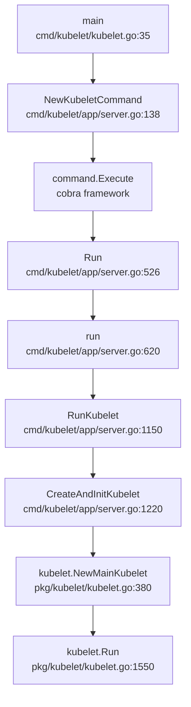
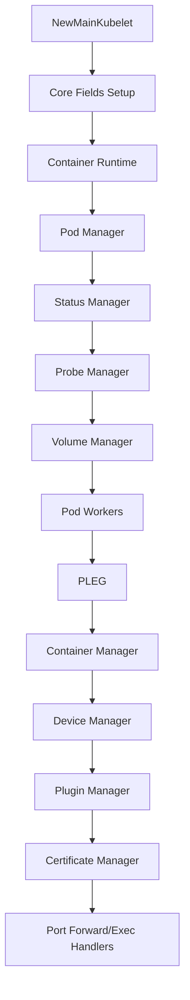
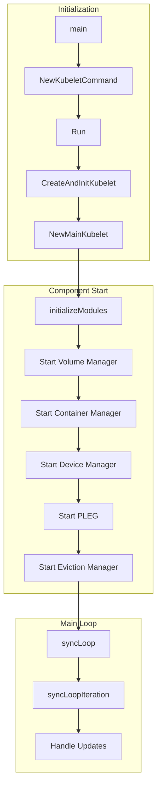
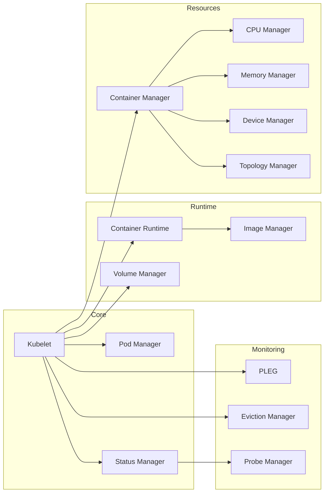

# kubelet Code Reference: Entry Points and Initialization

## Table of Contents
1. [Overview](#overview)
2. [Main Entry Point](#main-entry-point)
3. [Command Initialization](#command-initialization)
4. [Server Run Function](#server-run-function)
5. [Kubelet Creation](#kubelet-creation)
6. [Component Initialization Order](#component-initialization-order)
7. [Manager Start Sequence](#manager-start-sequence)
8. [Sync Loop Entry](#sync-loop-entry)
9. [HTTP Server Setup](#http-server-setup)
10. [Configuration Sources](#configuration-sources)
11. [Quick Reference Tables](#quick-reference-tables)
12. [Call Chain Diagrams](#call-chain-diagrams)

## Overview

This document provides a comprehensive map of kubelet entry points and initialization sequences, helping developers quickly navigate to key code locations.

### Key Files Structure

```
cmd/kubelet/
├── kubelet.go                 # Main entry point
└── app/
    ├── server.go              # Command setup and Run()
    └── options/
        └── options.go         # Flag definitions

pkg/kubelet/
├── kubelet.go                # Core kubelet implementation
├── kubelet_node_status.go    # Node registration
└── config/
    └── config.go             # Configuration management
```

## Main Entry Point

### Main Function
**File**: `cmd/kubelet/kubelet.go:35`

```go
func main() {
    ctx := context.Background()
    command := app.NewKubeletCommand(ctx)

    code := cli.Run(command)
    os.Exit(code)
}
```

### Entry Point Call Chain



## Command Initialization

### NewKubeletCommand
**File**: `cmd/kubelet/app/server.go:138`

Key responsibilities:
- Create cobra command
- Set up flags
- Configure feature gates
- Set up completion handlers

```go
func NewKubeletCommand(ctx context.Context) *cobra.Command {
    cleanFlagSet := pflag.NewFlagSet(componentKubelet, pflag.ContinueOnError)
    kubeletFlags := options.NewKubeletFlags()
    kubeletConfig := kubeletconfiginternal.NewKubeletConfiguration()

    cmd := &cobra.Command{
        Use: componentKubelet,
        RunE: func(cmd *cobra.Command, args []string) error {
            return Run(ctx, kubeletServer, kubeletDeps, utilfeature.DefaultFeatureGate)
        },
    }

    // Add flags
    options.AddKubeletConfigFlags(cleanFlagSet, kubeletConfig)
    options.AddGlobalFlags(cleanFlagSet)

    return cmd
}
```

### Flag Registration
**File**: `cmd/kubelet/app/options/options.go:140`

Important flags:
```go
// Core configuration
fs.StringVar(&f.KubeConfig, "kubeconfig", f.KubeConfig, "Path to kubeconfig file")
fs.StringVar(&f.BootstrapKubeconfig, "bootstrap-kubeconfig", "", "Path to bootstrap kubeconfig")

// Runtime configuration
fs.StringVar(&f.ContainerRuntimeEndpoint, "container-runtime-endpoint", "", "Container runtime endpoint")
fs.DurationVar(&f.ImageServiceEndpoint, "image-service-endpoint", "", "Image service endpoint")

// Feature flags
fs.StringVar(&f.PodManifestPath, "pod-manifest-path", "", "Path to static pod manifests")
fs.DurationVar(&f.SyncFrequency, "sync-frequency", 1*time.Minute, "Sync frequency")
```

## Server Run Function

### Run Function
**File**: `cmd/kubelet/app/server.go:526`

Main initialization sequence:

```go
func Run(ctx context.Context, s *options.KubeletServer, kubeDeps *kubelet.Dependencies, featureGate featuregate.FeatureGate) error {
    // 1. Set up signal handling
    ctx = context.Background()

    // 2. Validate flags
    if err := s.ValidateKubeletFlags(); err != nil {
        return err
    }

    // 3. Load kubelet configuration
    kubeletConfig, err := loadConfigFile(s.KubeletConfigFile)

    // 4. Validate configuration
    if err := validateKubeletConfiguration(kubeletConfig, featureGate); err != nil {
        return err
    }

    // 5. Build kubelet dependencies
    if kubeDeps == nil {
        kubeDeps, err = UnsecuredDependencies(s, featureGate)
    }

    // 6. Run kubelet
    if err := run(ctx, s, kubeletConfig, kubeDeps, featureGate); err != nil {
        return err
    }

    return nil
}
```

### Dependencies Building
**File**: `cmd/kubelet/app/server.go:750`

```go
func UnsecuredDependencies(s *options.KubeletServer, featureGate featuregate.FeatureGate) (*kubelet.Dependencies, error) {
    return &kubelet.Dependencies{
        Auth:               nil,  // Unsecured
        CAdvisorInterface:  nil,  // Will be created
        Cloud:              nil,  // Cloud provider
        ContainerManager:   nil,  // Will be created
        EventClient:        nil,  // Will be created
        HeartbeatClient:    nil,  // Will be created
        KubeClient:         nil,  // Will be created
        Mounter:            mount.New(),
        HostUtil:           hostutil.NewHostUtil(),
        OOMAdjuster:        oom.NewOOMAdjuster(),
        OSInterface:        kubecontainer.RealOS{},
        PodConfig:          nil,  // Will be created
        ProbeManager:       nil,  // Will be created
        Recorder:           nil,  // Will be created
        VolumePlugins:      nil,  // Will be created
    }, nil
}
```

## Kubelet Creation

### CreateAndInitKubelet
**File**: `cmd/kubelet/app/server.go:1220`

```go
func CreateAndInitKubelet(ctx context.Context,
    kubeCfg *kubeletconfiginternal.KubeletConfiguration,
    kubeDeps *kubelet.Dependencies,
    crOptions *config.ContainerRuntimeOptions,
    hostname string,
    nodeIP net.IP) (*kubelet.Kubelet, error) {

    // Create kubelet instance
    k, err := kubelet.NewMainKubelet(
        kubeCfg,
        kubeDeps,
        crOptions,
        hostname,
        nodeIP,
        /* many more parameters */
    )

    // Initialize modules that require the kubelet instance
    k.BirthCry()
    k.StartGarbageCollection()

    return k, nil
}
```

### NewMainKubelet
**File**: `pkg/kubelet/kubelet.go:380`

Core kubelet instantiation:

```go
func NewMainKubelet(
    kubeCfg *kubeletconfiginternal.KubeletConfiguration,
    kubeDeps *Dependencies,
    crOptions *config.ContainerRuntimeOptions,
    hostname string,
    nodeIP net.IP,
    /* ... */) (*Kubelet, error) {

    klet := &Kubelet{
        hostname:                       hostname,
        kubeClient:                    kubeDeps.KubeClient,
        heartbeatClient:               kubeDeps.HeartbeatClient,
        rootDirectory:                 kubeCfg.RootDirectory,
        podWorkers:                    nil,  // Created later
        resyncInterval:                kubeCfg.SyncFrequency.Duration,
        sourcesReady:                  config.NewSourcesReady(sourcesReadyFn),
        // ... many more fields
    }

    // Initialize container runtime
    runtime, err := kuberuntime.NewKubeGenericRuntimeManager(
        /* parameters */
    )
    klet.containerRuntime = runtime

    // Initialize pod manager
    klet.podManager = kubepod.NewBasicPodManager()

    // Initialize status manager
    klet.statusManager = status.NewManager(klet.kubeClient, klet.podManager)

    // Initialize probe manager
    klet.probeManager = prober.NewManager(
        klet.statusManager,
        klet.livenessManager,
        klet.readinessManager,
        klet.startupManager,
        klet.runner,
        klet.recorder,
    )

    // Initialize volume manager
    klet.volumeManager = volumemanager.NewVolumeManager(
        /* parameters */
    )

    // Initialize pod workers
    klet.podWorkers = newPodWorkers(
        klet.syncPod,
        klet.syncTerminatingPod,
        klet.syncTerminatedPod,
        /* parameters */
    )

    return klet, nil
}
```

## Component Initialization Order

### Initialization Sequence
**File**: `pkg/kubelet/kubelet.go:1350`



Detailed initialization order:

```go
// 1. Basic components (pkg/kubelet/kubelet.go:450)
klet.podManager = kubepod.NewBasicPodManager()

// 2. Mirror pod client (pkg/kubelet/kubelet.go:460)
klet.mirrorPodClient = kubepod.NewBasicMirrorClient(klet.kubeClient)

// 3. Secret/ConfigMap managers (pkg/kubelet/kubelet.go:470)
klet.secretManager = secret.NewWatchingSecretManager(klet.kubeClient)
klet.configMapManager = configmap.NewWatchingConfigMapManager(klet.kubeClient)

// 4. Status manager (pkg/kubelet/kubelet.go:490)
klet.statusManager = status.NewManager(klet.kubeClient, klet.podManager)

// 5. Resource analyzer (pkg/kubelet/kubelet.go:510)
klet.resourceAnalyzer = serverstats.NewResourceAnalyzer(klet)

// 6. Runtime manager (pkg/kubelet/kubelet.go:540)
runtime, err := kuberuntime.NewKubeGenericRuntimeManager(...)
klet.containerRuntime = runtime

// 7. PLEG (pkg/kubelet/kubelet.go:680)
klet.pleg = pleg.NewGenericPLEG(
    klet.containerRuntime,
    plegChannelCapacity,
    plegRelistPeriod,
    klet.podCache,
    time.Second,
)

// 8. Container manager (pkg/kubelet/kubelet.go:720)
klet.containerManager = cm.NewContainerManager(...)

// 9. Volume manager (pkg/kubelet/kubelet.go:850)
klet.volumeManager = volumemanager.NewVolumeManager(...)

// 10. Pod workers (pkg/kubelet/kubelet.go:950)
klet.podWorkers = newPodWorkers(...)

// 11. Eviction manager (pkg/kubelet/kubelet.go:1020)
klet.evictionManager = eviction.NewManager(...)

// 12. Image manager (pkg/kubelet/kubelet.go:1080)
klet.imageManager = imagemanager.NewImageManager(...)

// 13. Certificate manager (pkg/kubelet/kubelet.go:1150)
klet.serverCertificateManager = certificate.NewKubeletServerCertificateManager(...)

// 14. Device plugin manager (pkg/kubelet/kubelet.go:1200)
klet.deviceManager = devicemanager.NewManagerImpl(...)

// 15. Plugin manager (pkg/kubelet/kubelet.go:1250)
klet.pluginManager = pluginmanager.NewPluginManager(...)
```

## Manager Start Sequence

### Run Function
**File**: `pkg/kubelet/kubelet.go:1550`

```go
func (kl *Kubelet) Run(updates <-chan kubetypes.PodUpdate) {
    ctx := context.Background()

    // 1. Initialize modules requiring runtime
    if err := kl.initializeModules(); err != nil {
        klog.Fatal(err)
    }

    // 2. Start volume manager
    go kl.volumeManager.Run(kl.sourcesReady, wait.NeverStop)

    // 3. Start server certificate manager
    if kl.serverCertificateManager != nil {
        kl.serverCertificateManager.Start()
    }

    // 4. Start OOM watcher
    if kl.oomWatcher != nil {
        go kl.oomWatcher.Start(kl.nodeRef)
    }

    // 5. Start resource analyzer
    kl.resourceAnalyzer.Start()

    // 6. Start container manager
    if err := kl.containerManager.Start(
        kl.GetActivePods,
        kl.sourcesReady,
        kl.statusManager,
        kl.runtimeService,
        kl.containerMap,
    ); err != nil {
        klog.Fatal(err)
    }

    // 7. Start eviction manager
    kl.evictionManager.Start(kl.StatsProvider, kl.GetActivePods, evictionMonitoringPeriod)

    // 8. Start plugin manager
    kl.pluginManager.Run(kl.sourcesReady, wait.NeverStop)

    // 9. Start device manager
    if kl.deviceManager != nil {
        kl.deviceManager.Start()
    }

    // 10. Start container runtime
    kl.containerRuntime.Start()

    // 11. Start PLEG
    kl.pleg.Start()

    // 12. Start sync loop
    kl.syncLoop(ctx, updates, kl)
}
```

### InitializeModules
**File**: `pkg/kubelet/kubelet.go:1480`

```go
func (kl *Kubelet) initializeModules() error {
    // Create necessary directories
    if err := kl.setupDataDirs(); err != nil {
        return err
    }

    // Setup container logs
    kl.containerLogManager = logs.NewContainerLogManager(
        kl.runtimeService,
        kl.osInterface,
        kl.MaxContainerLogsPerPod,
    )

    // Setup image manager
    kl.imageManager.Start()

    // Setup certificate rotation
    kl.serverCertificateManager.Start()

    // Setup oom adjuster
    kl.oomAdjuster = kl.createOOMAdjuster()

    // Setup stats provider
    kl.StatsProvider = stats.NewCadvisorStatsProvider(
        kl.cadvisor,
        kl.resourceAnalyzer,
        kl.podManager,
        kl.runtimeCache,
        kl.imageService,
        kl.statusManager,
        kl.runtimeService,
    )

    return nil
}
```

## Sync Loop Entry

### Main Sync Loop
**File**: `pkg/kubelet/kubelet.go:2250`

```go
func (kl *Kubelet) syncLoop(ctx context.Context, updates <-chan kubetypes.PodUpdate, handler SyncHandler) {
    klog.Info("Starting kubelet main sync loop")

    // The sync ticker
    syncTicker := time.NewTicker(time.Second)
    defer syncTicker.Stop()

    // The housekeeping ticker
    housekeepingTicker := time.NewTicker(housekeepingPeriod)
    defer housekeepingTicker.Stop()

    // PLEG channel
    plegCh := kl.pleg.Watch()

    // Main loop
    for {
        if err := kl.runtimeState.runtimeErrors(); err != nil {
            klog.Error("Skipping pod synchronization - runtime errors")
            time.Sleep(5 * time.Second)
            continue
        }

        kl.syncLoopIteration(ctx, updates, handler, syncTicker.C, housekeepingTicker.C, plegCh)
    }
}
```

### syncLoopIteration
**File**: `pkg/kubelet/kubelet.go:2280`

```go
func (kl *Kubelet) syncLoopIteration(ctx context.Context,
    configCh <-chan kubetypes.PodUpdate,
    handler SyncHandler,
    syncCh <-chan time.Time,
    housekeepingCh <-chan time.Time,
    plegCh <-chan *pleg.PodLifecycleEvent) bool {

    select {
    case u, open := <-configCh:
        // Configuration change (ADD, UPDATE, DELETE, SET)
        if !open {
            return false
        }

        switch u.Op {
        case kubetypes.ADD:
            handler.HandlePodAdditions(u.Pods)
        case kubetypes.UPDATE:
            handler.HandlePodUpdates(u.Pods)
        case kubetypes.DELETE:
            handler.HandlePodRemoves(u.Pods)
        case kubetypes.SET:
            handler.HandlePodSyncs(u.Pods)
        }

    case e := <-plegCh:
        // PLEG event
        if e.Type == pleg.ContainerStarted {
            handler.HandlePodReconcile()
        }

    case <-syncCh:
        // Periodic sync
        handler.HandlePodSyncs(kl.getPodsToSync())

    case <-housekeepingCh:
        // Periodic housekeeping
        handler.HandlePodCleanups(ctx)

    case <-ctx.Done():
        return false
    }

    return true
}
```

## HTTP Server Setup

### ListenAndServe
**File**: `pkg/kubelet/server/server.go:180`

```go
func ListenAndServe(kl *Kubelet, resourceAnalyzer stats.ResourceAnalyzer,
    address net.IP, port uint, enableDebuggingHandlers bool) error {

    server := NewServer(kl, resourceAnalyzer, enableDebuggingHandlers)

    // Install handlers
    server.InstallDefaultHandlers()
    server.InstallDebuggingHandlers()
    server.InstallSystemHandlers()

    // Create HTTP server
    s := &http.Server{
        Addr:           net.JoinHostPort(address.String(), strconv.Itoa(int(port))),
        Handler:        server,
        MaxHeaderBytes: 1 << 20,
        IdleTimeout:    90 * time.Second,
    }

    return s.ListenAndServe()
}
```

### Handler Registration
**File**: `pkg/kubelet/server/server.go:250`

Key handlers:

```go
// Health endpoints
ws.Route(ws.GET("/healthz").To(s.getHealthz))
ws.Route(ws.GET("/healthz/{subpath:*}").To(s.getHealthz))

// Metrics endpoint
ws.Route(ws.GET("/metrics").To(s.getMetrics))
ws.Route(ws.GET("/metrics/cadvisor").To(s.getCAdvisorMetrics))
ws.Route(ws.GET("/metrics/resource").To(s.getResourceMetrics))
ws.Route(ws.GET("/metrics/probes").To(s.getProbesMetrics))

// Pod operations
ws.Route(ws.GET("/pods").To(s.getPods))
ws.Route(ws.GET("/runningpods").To(s.getRunningPods))

// Container logs
ws.Route(ws.GET("/containerLogs/{podNamespace}/{podID}/{containerName}").To(s.getContainerLogs))

// Exec/Attach/PortForward
ws.Route(ws.GET("/exec/{podNamespace}/{podID}/{containerName}").To(s.getExec))
ws.Route(ws.GET("/attach/{podNamespace}/{podID}/{containerName}").To(s.getAttach))
ws.Route(ws.GET("/portForward/{podNamespace}/{podID}").To(s.getPortForward))

// Debug endpoints (if enabled)
ws.Route(ws.GET("/debug/pprof").To(s.getProfile))
ws.Route(ws.GET("/debug/flags/v").To(s.getFlagz))
ws.Route(ws.GET("/debug/configz").To(s.getConfigz))
```

## Configuration Sources

### Pod Configuration Sources
**File**: `pkg/kubelet/config/config.go:75`

```go
func NewPodConfig(mode PodConfigNotificationMode, recorder record.EventRecorder, startupSLIObserver podStartupSLIObserver) *PodConfig {
    updates := make(chan kubetypes.PodUpdate, 50)
    storage := newPodStorage(updates, mode, recorder, startupSLIObserver)

    return &PodConfig{
        pods:    storage,
        mux:     newMux(storage),
        updates: updates,
        sources: sets.Set[string]{},
    }
}
```

### Source Types
**File**: `pkg/kubelet/kubelet.go:620`

```go
// API server source
cfg.Channel(ctx, kubetypes.ApiserverSource)

// File source (static pods)
config.NewSourceFile(
    cfg.Channel(ctx, kubetypes.FileSource),
    kubeCfg.StaticPodPath,
    hostname,
    kubeCfg.FileCheckFrequency,
)

// HTTP source (static pods)
config.NewSourceURL(
    cfg.Channel(ctx, kubetypes.HTTPSource),
    kubeCfg.StaticPodURL,
    hostname,
    kubeCfg.HTTPCheckFrequency,
)
```

## Quick Reference Tables

### Key Entry Points

| Function | File | Line | Purpose |
|----------|------|------|---------|
| `main()` | `cmd/kubelet/kubelet.go` | 35 | Program entry point |
| `NewKubeletCommand()` | `cmd/kubelet/app/server.go` | 138 | Command setup |
| `Run()` | `cmd/kubelet/app/server.go` | 526 | Server main run |
| `RunKubelet()` | `cmd/kubelet/app/server.go` | 1150 | Kubelet initialization |
| `NewMainKubelet()` | `pkg/kubelet/kubelet.go` | 380 | Kubelet creation |
| `Run()` | `pkg/kubelet/kubelet.go` | 1550 | Kubelet main loop |
| `syncLoop()` | `pkg/kubelet/kubelet.go` | 2250 | Sync loop entry |
| `syncLoopIteration()` | `pkg/kubelet/kubelet.go` | 2280 | Sync loop iteration |

### Component Initialization

| Component | Initialization Function | File | Line |
|-----------|------------------------|------|------|
| Pod Manager | `NewBasicPodManager()` | `pkg/kubelet/pod/pod_manager.go` | 110 |
| Status Manager | `NewManager()` | `pkg/kubelet/status/status_manager.go` | 165 |
| Probe Manager | `NewManager()` | `pkg/kubelet/prober/prober_manager.go` | 90 |
| Volume Manager | `NewVolumeManager()` | `pkg/kubelet/volumemanager/volume_manager.go` | 250 |
| Container Manager | `NewContainerManager()` | `pkg/kubelet/cm/container_manager_linux.go` | 180 |
| PLEG | `NewGenericPLEG()` | `pkg/kubelet/pleg/generic.go` | 80 |
| Eviction Manager | `NewManager()` | `pkg/kubelet/eviction/eviction_manager.go` | 120 |
| Image Manager | `NewImageManager()` | `pkg/kubelet/images/image_manager.go` | 110 |
| Device Manager | `NewManagerImpl()` | `pkg/kubelet/cm/devicemanager/manager.go` | 150 |

### HTTP Endpoints

| Endpoint | Handler | File | Line |
|----------|---------|------|------|
| `/healthz` | `getHealthz()` | `pkg/kubelet/server/server.go` | 340 |
| `/metrics` | `getMetrics()` | `pkg/kubelet/server/server.go` | 380 |
| `/pods` | `getPods()` | `pkg/kubelet/server/server.go` | 420 |
| `/logs` | `getContainerLogs()` | `pkg/kubelet/server/server.go` | 550 |
| `/exec` | `getExec()` | `pkg/kubelet/server/server.go` | 680 |
| `/stats` | `getStats()` | `pkg/kubelet/server/stats/handler.go` | 80 |
| `/configz` | `getConfigz()` | `pkg/kubelet/server/server.go` | 820 |

## Call Chain Diagrams

### Pod Addition Flow

```mermaid
sequenceDiagram
    participant Config as Pod Config
    participant Loop as Sync Loop
    participant Handler as Handler
    participant Workers as Pod Workers
    participant Runtime as Container Runtime

    Config->>Loop: PodUpdate{Op: ADD}
    Loop->>Handler: HandlePodAdditions()
    Handler->>Handler: filterOutInactivePods()
    Handler->>Workers: UpdatePod()
    Workers->>Workers: managePodLoop()
    Workers->>Runtime: SyncPod()
    Runtime->>Runtime: createPodSandbox()
    Runtime->>Runtime: createContainers()
    Runtime->>Runtime: startContainers()
```

### Startup Sequence



### Module Dependencies



## Summary

This code reference guide maps the critical entry points and initialization paths in the kubelet:

### Key Takeaways

1. **Entry Flow**: `main()` → `NewKubeletCommand()` → `Run()` → `NewMainKubelet()` → `syncLoop()`

2. **Initialization Order**: Core components → Runtime → Resource managers → Monitoring components

3. **Main Loop**: `syncLoop()` processes configuration updates, PLEG events, and periodic syncs

4. **HTTP Server**: Provides health, metrics, and debugging endpoints on port 10250/10248

5. **Configuration Sources**: API server, file-based (static pods), and HTTP sources

### Navigation Tips

- Start at `cmd/kubelet/kubelet.go:main()` for entry point
- Follow `cmd/kubelet/app/server.go:Run()` for initialization
- Core kubelet logic in `pkg/kubelet/kubelet.go`
- Component managers in `pkg/kubelet/cm/`
- HTTP handlers in `pkg/kubelet/server/`

Use this guide to quickly navigate to specific kubelet components and understand the initialization and runtime flow.