# Kubelet: System Overview

> **High-Level Architecture: Understanding the kubelet's role, responsibilities, and architecture**

---

## Table of Contents

- [Executive Summary](#executive-summary)
- [Kubelet in the Kubernetes Ecosystem](#kubelet-in-the-kubernetes-ecosystem)
- [Main Responsibilities](#main-responsibilities)
- [System Architecture](#system-architecture)
- [Communication Patterns](#communication-patterns)
- [Data Flow](#data-flow)
- [Event-Driven Architecture](#event-driven-architecture)
- [Concurrency Model](#concurrency-model)
- [State Management](#state-management)
- [Error Handling and Recovery](#error-handling-and-recovery)
- [Performance Characteristics](#performance-characteristics)
- [Summary and Key Takeaways](#summary-and-key-takeaways)

---

## Executive Summary

### What is Kubelet?

The **kubelet** is the **primary node agent** that runs on each worker node in a Kubernetes cluster. It is the component responsible for ensuring that containers are running in pods as specified by the Kubernetes control plane. The kubelet acts as the **bridge between the Kubernetes control plane and the container runtime**, translating desired state into actual running containers.

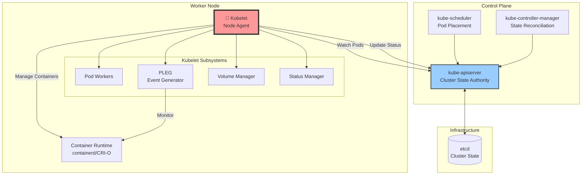
```mermaid
graph TB
    subgraph "Control Plane"
        API[kube-apiserver<br/>Cluster State Authority]
        Scheduler[kube-scheduler<br/>Pod Placement]
        Controller[kube-controller-manager<br/>State Reconciliation]
    end

    subgraph "Worker Node"
        direction TB
        Kubelet[🔧 Kubelet<br/>Node Agent]
        CRI[Container Runtime<br/>containerd/CRI-O]

        subgraph "Kubelet Subsystems"
            PodWorkers[Pod Workers]
            PLEG[PLEG<br/>Event Generator]
            VolumeManager[Volume Manager]
            StatusManager[Status Manager]
        end

        Kubelet --> PodWorkers
        Kubelet --> PLEG
        Kubelet --> VolumeManager
        Kubelet --> StatusManager
    end

    subgraph "Infrastructure"
        etcd[(etcd<br/>Cluster State)]
    end

    API <--> etcd
    Scheduler --> API
    Controller --> API

    Kubelet -->|Watch Pods| API
    Kubelet -->|Update Status| API
    Kubelet -->|Manage Containers| CRI
    PLEG -->|Monitor| CRI

    style Kubelet fill:#ff9999,stroke:#333,stroke-width:4px
    style API fill:#99ccff,stroke:#333,stroke-width:2px
```

**Key Characteristics:**

| Aspect | Description |
|--------|-------------|
| **Type** | Node-level daemon, runs on every worker node |
| **Primary Mission** | Ensure containers are running according to PodSpecs |
| **Communication** | Bidirectional with API server, unidirectional to container runtime |
| **Scope** | Single node (manages only pods scheduled to its node) |
| **State Authority** | Local executor (not authoritative for cluster state) |
| **Concurrency** | Highly concurrent (manages multiple pods simultaneously) |
| **Configuration Sources** | API server (primary), file, HTTP endpoint |

### Mission Statement

**The kubelet's mission is to:**

1. **Ensure Pod Reliability**: Keep containers running as specified in PodSpecs
2. **Report Node State**: Continuously report node and pod status to the control plane
3. **Execute Lifecycle Operations**: Handle pod creation, updates, and termination
4. **Manage Resources**: Coordinate volumes, secrets, configmaps, and device plugins
5. **Enforce Policies**: Apply resource limits, QoS classes, and eviction policies
6. **Monitor Health**: Execute liveness, readiness, and startup probes
7. **Maintain Node Health**: Report node conditions and trigger evictions when necessary

### Why Kubelet Exists

The kubelet solves critical problems in distributed container orchestration:

**1. Distributed Execution**
- Kubernetes control plane makes decisions; kubelet executes them on nodes
- Decentralizes container management to avoid single point of failure
- Enables horizontal scaling of cluster capacity

**2. Pod Lifecycle Management**
- Coordinates complex multi-container pod initialization sequences
- Manages container dependencies (init containers, sidecars)
- Handles graceful termination with configurable grace periods

**3. State Reconciliation**
- Continuously reconciles desired state (from API) with actual state (container runtime)
- Recovers from transient failures automatically
- Detects and reports permanent failures

**4. Resource Coordination**
- Manages volume attachment, mounting, and unmounting
- Coordinates secret and configmap distribution
- Integrates with device plugins for GPUs, FPGAs, etc.

**5. Health Monitoring**
- Executes periodic health checks (liveness, readiness, startup)
- Automatically restarts failed containers
- Reports container and pod status to control plane

**6. Node Management**
- Reports node capacity and allocatable resources
- Enforces node-level resource limits
- Triggers evictions to maintain node stability

---

## Kubelet in the Kubernetes Ecosystem

### Architectural Position

The kubelet occupies a unique position in the Kubernetes architecture as the **node-level execution agent**:

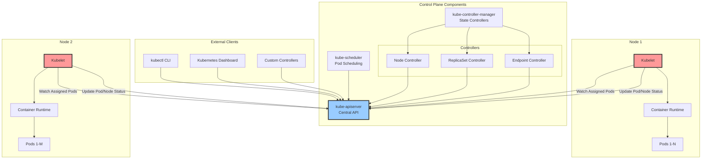
```mermaid
graph TB
    subgraph "External Clients"
        kubectl[kubectl CLI]
        Dashboard[Kubernetes Dashboard]
        CustomControllers[Custom Controllers]
    end

    subgraph "Control Plane Components"
        APIServer[kube-apiserver<br/>Central API]
        Scheduler[kube-scheduler<br/>Pod Scheduling]
        ControllerMgr[kube-controller-manager<br/>State Controllers]

        subgraph "Controllers"
            NodeController[Node Controller]
            ReplicaSet[ReplicaSet Controller]
            Endpoint[Endpoint Controller]
        end

        ControllerMgr --> NodeController
        ControllerMgr --> ReplicaSet
        ControllerMgr --> Endpoint
    end

    subgraph "Node 1"
        Kubelet1[Kubelet]
        Runtime1[Container Runtime]
        Pods1[Pods 1-N]

        Kubelet1 --> Runtime1
        Runtime1 --> Pods1
    end

    subgraph "Node 2"
        Kubelet2[Kubelet]
        Runtime2[Container Runtime]
        Pods2[Pods 1-M]

        Kubelet2 --> Runtime2
        Runtime2 --> Pods2
    end

    kubectl --> APIServer
    Dashboard --> APIServer
    CustomControllers --> APIServer

    Scheduler --> APIServer
    NodeController --> APIServer
    ReplicaSet --> APIServer
    Endpoint --> APIServer

    Kubelet1 -->|Watch Assigned Pods| APIServer
    Kubelet1 -->|Update Pod/Node Status| APIServer
    Kubelet2 -->|Watch Assigned Pods| APIServer
    Kubelet2 -->|Update Pod/Node Status| APIServer

    style Kubelet1 fill:#ff9999,stroke:#333,stroke-width:3px
    style Kubelet2 fill:#ff9999,stroke:#333,stroke-width:3px
    style APIServer fill:#99ccff,stroke:#333,stroke-width:3px
```

### Relationship with Core Components

#### 1. API Server Relationship

The kubelet has a **bidirectional relationship** with the API server:

**Inbound (API → Kubelet):**
- **Pod Assignments**: Watches for pods assigned to its node
- **ConfigMaps/Secrets**: Fetches configuration data for pods
- **Service Endpoints**: Retrieves service information for DNS

**Outbound (Kubelet → API):**
- **Node Status**: Registers node and updates node conditions
- **Pod Status**: Reports pod phase, container states, conditions
- **Events**: Generates events for pod lifecycle transitions
- **Node Lease**: Renews lease to indicate node health

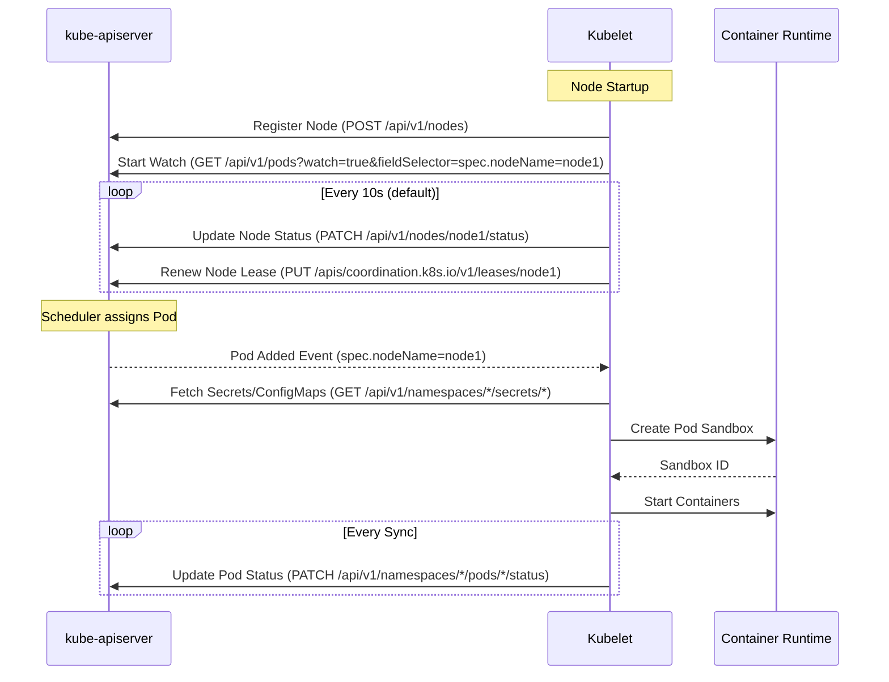
```mermaid
sequenceDiagram
    participant API as kube-apiserver
    participant Kubelet
    participant Runtime as Container Runtime

    Note over Kubelet: Node Startup
    Kubelet->>API: Register Node (POST /api/v1/nodes)
    Kubelet->>API: Start Watch (GET /api/v1/pods?watch=true&fieldSelector=spec.nodeName=node1)

    loop Every 10s (default)
        Kubelet->>API: Update Node Status (PATCH /api/v1/nodes/node1/status)
        Kubelet->>API: Renew Node Lease (PUT /apis/coordination.k8s.io/v1/leases/node1)
    end

    Note over API: Scheduler assigns Pod
    API-->>Kubelet: Pod Added Event (spec.nodeName=node1)

    Kubelet->>API: Fetch Secrets/ConfigMaps (GET /api/v1/namespaces/*/secrets/*)
    Kubelet->>Runtime: Create Pod Sandbox
    Runtime-->>Kubelet: Sandbox ID
    Kubelet->>Runtime: Start Containers

    loop Every Sync
        Kubelet->>API: Update Pod Status (PATCH /api/v1/namespaces/*/pods/*/status)
    end
```

**Code Reference**:
- Watch implementation: `pkg/kubelet/kubelet.go:1743` (`Run` method)
- Node status updates: `pkg/kubelet/kubelet_node_status.go`

#### 2. Scheduler Relationship

The kubelet has an **indirect relationship** with the scheduler:

**Scheduler → Kubelet:**
1. Scheduler watches unscheduled pods (no `spec.nodeName`)
2. Scheduler selects appropriate node based on predicates and priorities
3. Scheduler binds pod to node (sets `spec.nodeName`)
4. Kubelet watches for pods with `spec.nodeName` matching its node

**Kubelet → Scheduler:**
- Kubelet reports node capacity in node status
- Scheduler uses this information for scheduling decisions
- Kubelet's status updates influence future scheduling

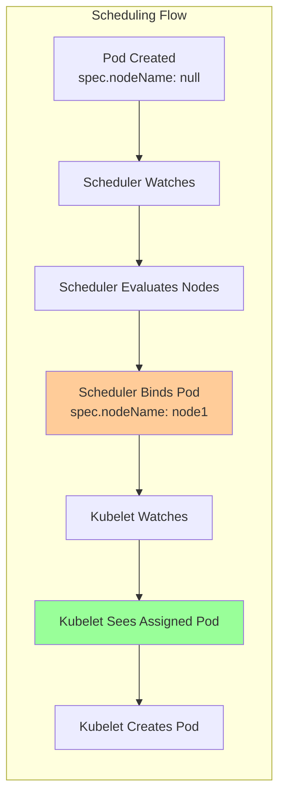
```mermaid
graph LR
    subgraph "Scheduling Flow"
        A[Pod Created<br/>spec.nodeName: null] --> B[Scheduler Watches]
        B --> C[Scheduler Evaluates Nodes]
        C --> D[Scheduler Binds Pod<br/>spec.nodeName: node1]
        D --> E[Kubelet Watches]
        E --> F[Kubelet Sees Assigned Pod]
        F --> G[Kubelet Creates Pod]
    end

    style D fill:#ffcc99
    style F fill:#99ff99
```

#### 3. Controller Manager Relationship

The kubelet interacts with various controllers:

**Node Controller:**
- Monitors node health via node status updates
- Sets node conditions (Ready, OutOfDisk, MemoryPressure, etc.)
- Taints nodes based on conditions

**Endpoint/EndpointSlice Controllers:**
- Use pod status (readiness) from kubelet to update endpoints
- Service traffic routing depends on kubelet's readiness checks

**ReplicaSet/Deployment Controllers:**
- Create pods that kubelet executes
- Rely on kubelet's pod status to determine replica health

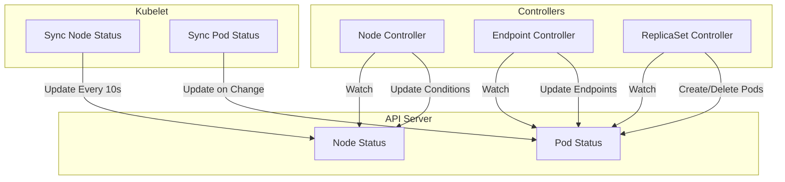
```mermaid
graph TB
    subgraph "Controllers"
        NC[Node Controller]
        EC[Endpoint Controller]
        RC[ReplicaSet Controller]
    end

    subgraph "API Server"
        NodeStatus[Node Status]
        PodStatus[Pod Status]
    end

    subgraph "Kubelet"
        SyncNode[Sync Node Status]
        SyncPod[Sync Pod Status]
    end

    SyncNode -->|Update Every 10s| NodeStatus
    SyncPod -->|Update on Change| PodStatus

    NC -->|Watch| NodeStatus
    EC -->|Watch| PodStatus
    RC -->|Watch| PodStatus

    NC -->|Update Conditions| NodeStatus
    EC -->|Update Endpoints| PodStatus
    RC -->|Create/Delete Pods| PodStatus
```

### Information Flow

The kubelet participates in multiple information flows:

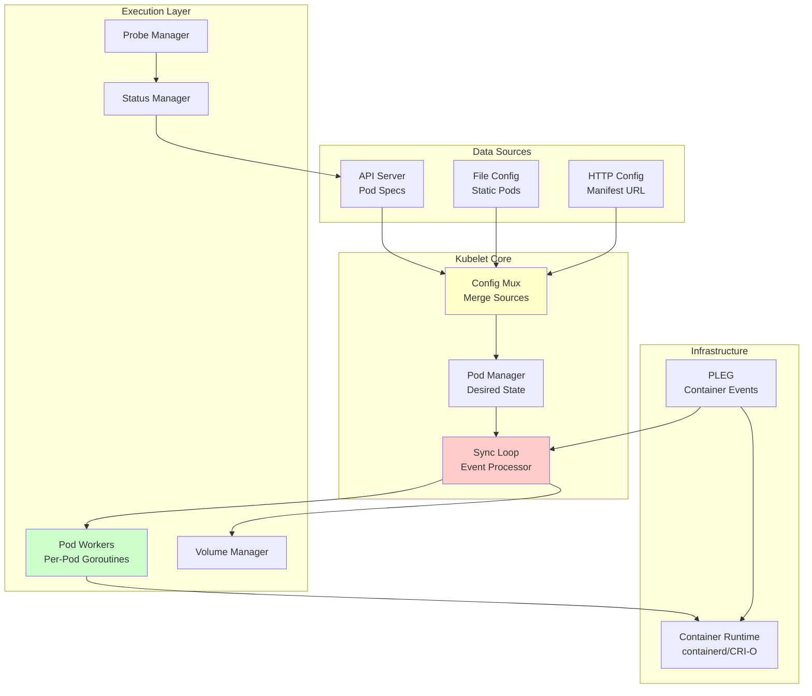
```mermaid
graph TB
    subgraph "Data Sources"
        APIServer[API Server<br/>Pod Specs]
        FileConfig[File Config<br/>Static Pods]
        HTTPConfig[HTTP Config<br/>Manifest URL]
    end

    subgraph "Kubelet Core"
        ConfigMux[Config Mux<br/>Merge Sources]
        PodManager[Pod Manager<br/>Desired State]
        SyncLoop[Sync Loop<br/>Event Processor]
    end

    subgraph "Execution Layer"
        PodWorkers[Pod Workers<br/>Per-Pod Goroutines]
        VolumeManager[Volume Manager]
        StatusManager[Status Manager]
        ProbeManager[Probe Manager]
    end

    subgraph "Infrastructure"
        CRI[Container Runtime<br/>containerd/CRI-O]
        PLEG[PLEG<br/>Container Events]
    end

    APIServer --> ConfigMux
    FileConfig --> ConfigMux
    HTTPConfig --> ConfigMux

    ConfigMux --> PodManager
    PodManager --> SyncLoop

    SyncLoop --> PodWorkers
    SyncLoop --> VolumeManager

    PodWorkers --> CRI
    PLEG --> CRI

    PLEG --> SyncLoop
    ProbeManager --> StatusManager
    StatusManager --> APIServer

    style ConfigMux fill:#ffffcc
    style SyncLoop fill:#ffcccc
    style PodWorkers fill:#ccffcc
```

**Key Flow Patterns:**

1. **Configuration Flow**: API Server → Config Mux → Pod Manager → Sync Loop
2. **Execution Flow**: Sync Loop → Pod Workers → Container Runtime
3. **Status Flow**: PLEG/Probes → Status Manager → API Server
4. **Volume Flow**: Pod Workers → Volume Manager → Mount/Unmount Operations

---

## Main Responsibilities

The kubelet has **seven primary responsibilities**, each implemented by specialized subsystems:

### 1. Pod Lifecycle Management

**Responsibility**: Create, update, and terminate pods according to PodSpecs.

**Key Operations:**
- **Pod Creation**: Initialize sandbox, pull images, create containers
- **Pod Updates**: Handle spec changes, restart containers as needed
- **Pod Termination**: Graceful shutdown with configurable grace periods
- **Init Container Sequencing**: Execute init containers in order before app containers

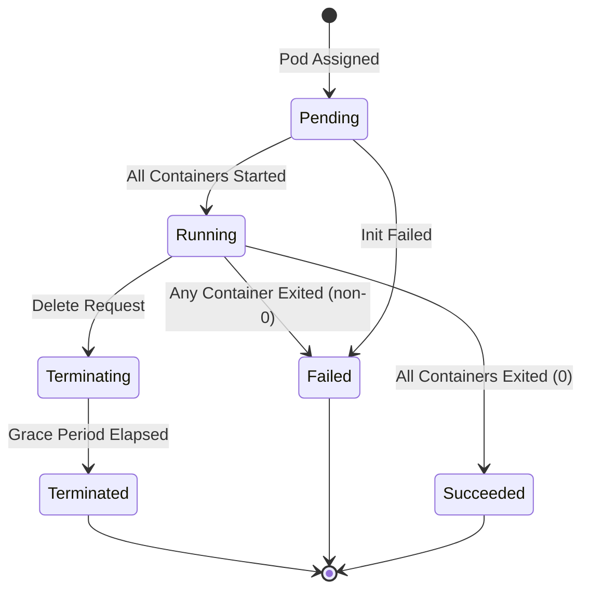
```mermaid
stateDiagram-v2
    [*] --> Pending: Pod Assigned
    Pending --> Running: All Containers Started
    Running --> Succeeded: All Containers Exited (0)
    Running --> Failed: Any Container Exited (non-0)
    Running --> Terminating: Delete Request
    Terminating --> Terminated: Grace Period Elapsed
    Terminated --> [*]

    Pending --> Failed: Init Failed
    Failed --> [*]
    Succeeded --> [*]
```

**Code References:**
- Main sync logic: `pkg/kubelet/kubelet.go:1910` (`SyncPod` method)
- Pod workers: `pkg/kubelet/pod_workers.go`
- Sync loop: `pkg/kubelet/kubelet.go:2528` (`syncLoopIteration`)

**Detailed Breakdown:**

| Phase | Operations | Components Involved |
|-------|-----------|---------------------|
| **Creation** | Admit pod, create data directories, attach volumes | Pod Workers, Volume Manager, Admission Handlers |
| **Initialization** | Pull images, start init containers sequentially | Image Manager, Container Runtime |
| **Running** | Start app containers, execute probes, monitor status | Probe Manager, PLEG, Status Manager |
| **Termination** | Stop containers gracefully, detach volumes, cleanup | Pod Workers, Volume Manager, Container GC |

### 2. Container Runtime Interface (CRI) Management

**Responsibility**: Abstract container runtime operations through CRI.

**CRI Operations:**
- **Sandbox Management**: Create/delete pod sandboxes (network namespaces)
- **Image Management**: Pull, list, remove container images
- **Container Management**: Create, start, stop, remove containers
- **Exec/Attach/Logs**: Interactive operations on running containers

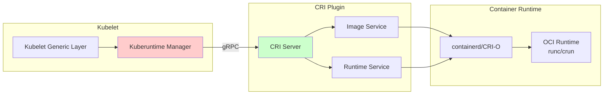
```mermaid
graph LR
    subgraph "Kubelet"
        KubeGeneric[Kubelet Generic Layer]
        KubeRuntime[Kuberuntime Manager]
    end

    subgraph "CRI Plugin"
        CRIServer[CRI Server]
        ImageService[Image Service]
        RuntimeService[Runtime Service]
    end

    subgraph "Container Runtime"
        Containerd[containerd/CRI-O]
        OCI[OCI Runtime<br/>runc/crun]
    end

    KubeGeneric --> KubeRuntime
    KubeRuntime -->|gRPC| CRIServer

    CRIServer --> ImageService
    CRIServer --> RuntimeService

    ImageService --> Containerd
    RuntimeService --> Containerd
    Containerd --> OCI

    style KubeRuntime fill:#ffcccc
    style CRIServer fill:#ccffcc
```

**Code References:**
- CRI interface: `pkg/kubelet/container/runtime.go:73` (`Runtime` interface)
- Kuberuntime manager: `pkg/kubelet/kuberuntime/kuberuntime_manager.go`
- Generic runtime: `pkg/kubelet/kuberuntime/kuberuntime_gc.go`

**CRI Method Categories:**

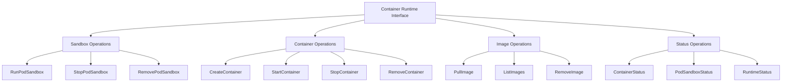
```mermaid
graph TB
    CRI[Container Runtime Interface]

    CRI --> Sandbox[Sandbox Operations]
    CRI --> Container[Container Operations]
    CRI --> Image[Image Operations]
    CRI --> Status[Status Operations]

    Sandbox --> RunPodSandbox[RunPodSandbox]
    Sandbox --> StopPodSandbox[StopPodSandbox]
    Sandbox --> RemovePodSandbox[RemovePodSandbox]

    Container --> CreateContainer[CreateContainer]
    Container --> StartContainer[StartContainer]
    Container --> StopContainer[StopContainer]
    Container --> RemoveContainer[RemoveContainer]

    Image --> PullImage[PullImage]
    Image --> ListImages[ListImages]
    Image --> RemoveImage[RemoveImage]

    Status --> ContainerStatus[ContainerStatus]
    Status --> PodSandboxStatus[PodSandboxStatus]
    Status --> RuntimeStatus[RuntimeStatus]
```

### 3. Volume Management

**Responsibility**: Attach, mount, unmount, and detach volumes for pods.

**Volume Operations:**
- **Attach**: Attach block devices to node (for cloud volumes)
- **Mount**: Mount volumes into pod directories
- **Unmount**: Unmount volumes when pod terminates
- **Detach**: Detach block devices from node

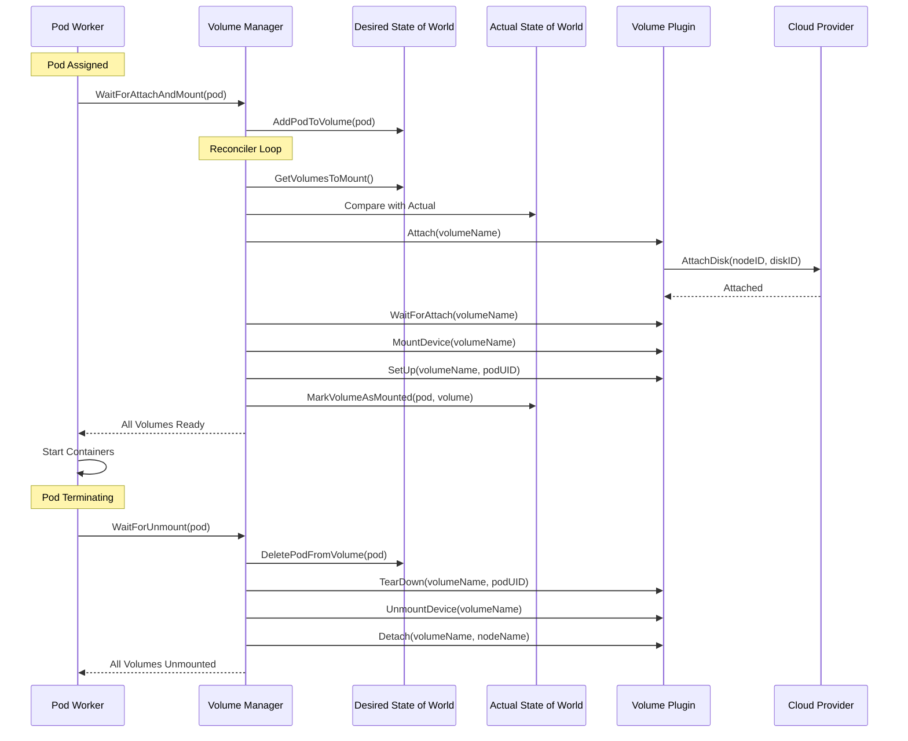
```mermaid
sequenceDiagram
    participant PW as Pod Worker
    participant VM as Volume Manager
    participant DSW as Desired State of World
    participant ASW as Actual State of World
    participant Plugin as Volume Plugin
    participant Cloud as Cloud Provider

    Note over PW: Pod Assigned
    PW->>VM: WaitForAttachAndMount(pod)
    VM->>DSW: AddPodToVolume(pod)

    Note over VM: Reconciler Loop
    VM->>DSW: GetVolumesToMount()
    VM->>ASW: Compare with Actual
    VM->>Plugin: Attach(volumeName)
    Plugin->>Cloud: AttachDisk(nodeID, diskID)
    Cloud-->>Plugin: Attached

    VM->>Plugin: WaitForAttach(volumeName)
    VM->>Plugin: MountDevice(volumeName)
    VM->>Plugin: SetUp(volumeName, podUID)
    VM->>ASW: MarkVolumeAsMounted(pod, volume)

    VM-->>PW: All Volumes Ready
    PW->>PW: Start Containers

    Note over PW: Pod Terminating
    PW->>VM: WaitForUnmount(pod)
    VM->>DSW: DeletePodFromVolume(pod)
    VM->>Plugin: TearDown(volumeName, podUID)
    VM->>Plugin: UnmountDevice(volumeName)
    VM->>Plugin: Detach(volumeName, nodeName)
    VM-->>PW: All Volumes Unmounted
```

**Code References:**
- Volume manager: `pkg/kubelet/volumemanager/volume_manager.go:98`
- Reconciler: `pkg/kubelet/volumemanager/reconciler/reconciler.go`
- State management: `pkg/kubelet/volumemanager/cache/`

**Volume Manager Architecture:**

| Component | Responsibility |
|-----------|----------------|
| **Desired State of World** | Tracks which volumes should be attached/mounted |
| **Actual State of World** | Tracks which volumes are actually attached/mounted |
| **Reconciler** | Continuously reconciles desired vs. actual state |
| **Volume Plugins** | Implement volume-specific attach/mount logic |
| **Operation Executor** | Executes volume operations with retry logic |

### 4. Status Management and Reporting

**Responsibility**: Report pod and node status to the API server.

**Status Types:**
- **Node Status**: Conditions (Ready, MemoryPressure, DiskPressure), capacity, allocatable
- **Pod Status**: Phase, conditions, container states, IP address
- **Container Status**: State (Waiting/Running/Terminated), restarts, exit codes

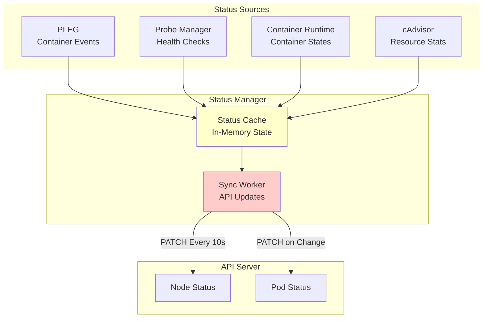
```mermaid
graph TB
    subgraph "Status Sources"
        PLEG[PLEG<br/>Container Events]
        Probes[Probe Manager<br/>Health Checks]
        Runtime[Container Runtime<br/>Container States]
        cAdvisor[cAdvisor<br/>Resource Stats]
    end

    subgraph "Status Manager"
        Cache[Status Cache<br/>In-Memory State]
        Sync[Sync Worker<br/>API Updates]
    end

    subgraph "API Server"
        NodeStatus[Node Status]
        PodStatus[Pod Status]
    end

    PLEG --> Cache
    Probes --> Cache
    Runtime --> Cache
    cAdvisor --> Cache

    Cache --> Sync
    Sync -->|PATCH Every 10s| NodeStatus
    Sync -->|PATCH on Change| PodStatus

    style Cache fill:#ffffcc
    style Sync fill:#ffcccc
```

**Code References:**
- Status manager: `pkg/kubelet/status/status_manager.go:130`
- Node status: `pkg/kubelet/kubelet_node_status.go`
- Pod status generation: `pkg/kubelet/kubelet_pods.go`

**Status Update Frequencies:**

| Status Type | Frequency | Trigger |
|------------|-----------|---------|
| **Node Status** | Every 10s (default) | Timer-based |
| **Node Lease** | Every 10s (default) | Timer-based |
| **Pod Status** | On change + periodic | Event-driven + timer |
| **Container Status** | On PLEG event | Event-driven |

### 5. Health Monitoring (Probes)

**Responsibility**: Execute liveness, readiness, and startup probes for containers.

**Probe Types:**
- **Liveness Probe**: Determines if container is alive (restart if fails)
- **Readiness Probe**: Determines if container is ready for traffic
- **Startup Probe**: Determines if container has started (delays other probes)

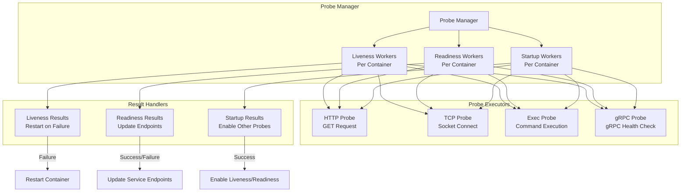
```mermaid
graph TB
    subgraph "Probe Manager"
        Manager[Probe Manager]
        LivenessWorker[Liveness Workers<br/>Per Container]
        ReadinessWorker[Readiness Workers<br/>Per Container]
        StartupWorker[Startup Workers<br/>Per Container]
    end

    subgraph "Probe Executors"
        HTTP[HTTP Probe<br/>GET Request]
        TCP[TCP Probe<br/>Socket Connect]
        Exec[Exec Probe<br/>Command Execution]
        GRPC[gRPC Probe<br/>gRPC Health Check]
    end

    subgraph "Result Handlers"
        LivenessResults[Liveness Results<br/>Restart on Failure]
        ReadinessResults[Readiness Results<br/>Update Endpoints]
        StartupResults[Startup Results<br/>Enable Other Probes]
    end

    Manager --> LivenessWorker
    Manager --> ReadinessWorker
    Manager --> StartupWorker

    LivenessWorker --> HTTP
    LivenessWorker --> TCP
    LivenessWorker --> Exec
    LivenessWorker --> GRPC

    ReadinessWorker --> HTTP
    ReadinessWorker --> TCP
    ReadinessWorker --> Exec
    ReadinessWorker --> GRPC

    StartupWorker --> HTTP
    StartupWorker --> TCP
    StartupWorker --> Exec
    StartupWorker --> GRPC

    LivenessWorker --> LivenessResults
    ReadinessWorker --> ReadinessResults
    StartupWorker --> StartupResults

    LivenessResults -->|Failure| Restart[Restart Container]
    ReadinessResults -->|Success/Failure| Endpoints[Update Service Endpoints]
    StartupResults -->|Success| Enable[Enable Liveness/Readiness]
```

**Code References:**
- Probe manager: `pkg/kubelet/prober/prober_manager.go:72`
- Probe implementations: `pkg/kubelet/prober/`
- Result manager: `pkg/kubelet/prober/results/results_manager.go`

**Probe Behavior:**

| Probe Type | Success Action | Failure Action | Default State |
|-----------|----------------|----------------|---------------|
| **Liveness** | Continue running | Restart container | Success (if not defined) |
| **Readiness** | Mark ready, add to endpoints | Mark not ready, remove from endpoints | Success (if not defined) |
| **Startup** | Enable other probes | Continue checking | Success (if not defined) |

### 6. Resource Management

**Responsibility**: Enforce resource limits, QoS classes, and node-level resource constraints.

**Resource Categories:**
- **CPU**: Shares, quotas, throttling via cgroups
- **Memory**: Limits, OOM behavior
- **Ephemeral Storage**: Disk usage monitoring and limits
- **Extended Resources**: GPUs, FPGAs via device plugins

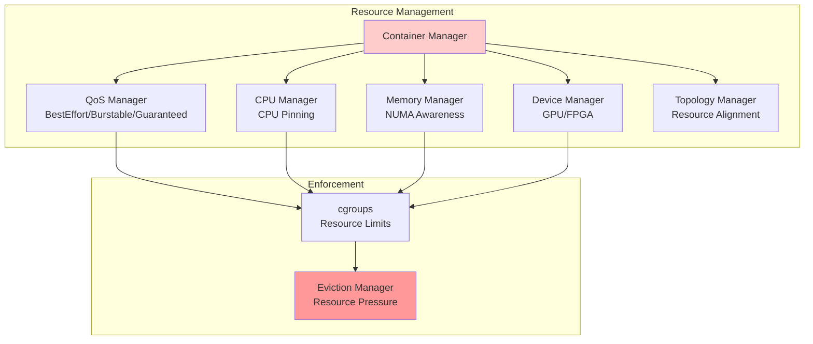
```mermaid
graph TB
    subgraph "Resource Management"
        CM[Container Manager]
        QOS[QoS Manager<br/>BestEffort/Burstable/Guaranteed]
        CPU[CPU Manager<br/>CPU Pinning]
        Memory[Memory Manager<br/>NUMA Awareness]
        Device[Device Manager<br/>GPU/FPGA]
        Topology[Topology Manager<br/>Resource Alignment]
    end

    subgraph "Enforcement"
        Cgroups[cgroups<br/>Resource Limits]
        Eviction[Eviction Manager<br/>Resource Pressure]
    end

    CM --> QOS
    CM --> CPU
    CM --> Memory
    CM --> Device
    CM --> Topology

    QOS --> Cgroups
    CPU --> Cgroups
    Memory --> Cgroups
    Device --> Cgroups

    Cgroups --> Eviction

    style CM fill:#ffcccc
    style Eviction fill:#ff9999
```

**Code References:**
- Container manager: `pkg/kubelet/cm/container_manager.go`
- QoS manager: `pkg/kubelet/qos/`
- CPU manager: `pkg/kubelet/cm/cpumanager/`
- Eviction manager: `pkg/kubelet/eviction/`

**QoS Classes:**

| QoS Class | Characteristics | Eviction Priority |
|-----------|-----------------|-------------------|
| **Guaranteed** | requests == limits for all resources | Lowest (evicted last) |
| **Burstable** | requests < limits or only requests set | Medium |
| **BestEffort** | No requests or limits set | Highest (evicted first) |

### 7. Eviction Management

**Responsibility**: Evict pods when node resources are exhausted.

**Eviction Triggers:**
- **Memory Pressure**: Available memory below threshold
- **Disk Pressure**: Available disk space below threshold
- **PID Pressure**: Available PIDs below threshold
- **Imagefs Pressure**: Image filesystem usage above threshold

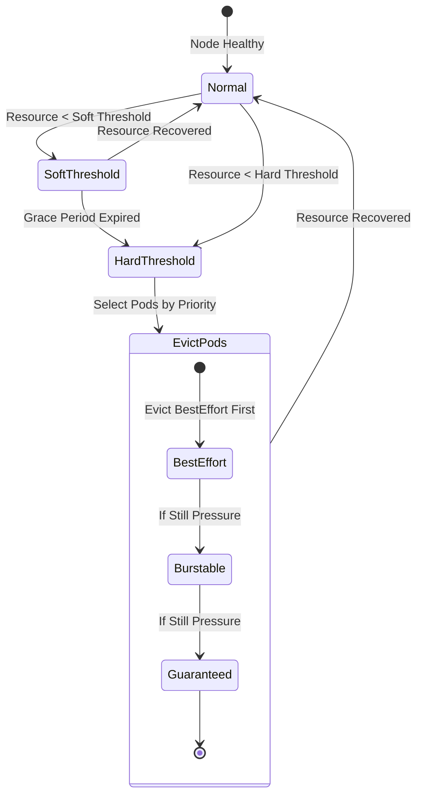
```mermaid
stateDiagram-v2
    [*] --> Normal: Node Healthy
    Normal --> SoftThreshold: Resource < Soft Threshold
    SoftThreshold --> Normal: Resource Recovered
    SoftThreshold --> HardThreshold: Grace Period Expired
    Normal --> HardThreshold: Resource < Hard Threshold

    HardThreshold --> EvictPods: Select Pods by Priority
    EvictPods --> Normal: Resource Recovered

    state EvictPods {
        [*] --> BestEffort: Evict BestEffort First
        BestEffort --> Burstable: If Still Pressure
        Burstable --> Guaranteed: If Still Pressure
        Guaranteed --> [*]
    }
```

**Code References:**
- Eviction manager: `pkg/kubelet/eviction/eviction_manager.go`
- Threshold monitoring: `pkg/kubelet/eviction/threshold_notifier.go`

**Eviction Thresholds:**

| Signal | Description | Soft Default | Hard Default |
|--------|-------------|--------------|--------------|
| **memory.available** | Available memory | <1.5Gi | <100Mi |
| **nodefs.available** | Root filesystem available | <10% | <5% |
| **nodefs.inodesFree** | Root filesystem inodes | <5% | <5% |
| **imagefs.available** | Image filesystem available | <15% | <15% |

---

## System Architecture

### High-Level Component Diagram

The kubelet is composed of multiple cooperating subsystems, each with specific responsibilities:

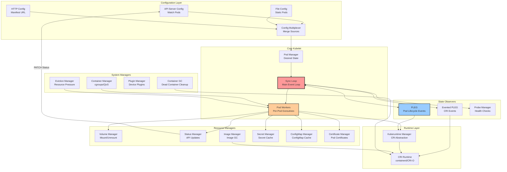
```mermaid
graph TB
    subgraph "Configuration Layer"
        APIConfig[API Server Config<br/>Watch Pods]
        FileConfig[File Config<br/>Static Pods]
        HTTPConfig[HTTP Config<br/>Manifest URL]

        ConfigMux[Config Multiplexer<br/>Merge Sources]

        APIConfig --> ConfigMux
        FileConfig --> ConfigMux
        HTTPConfig --> ConfigMux
    end

    subgraph "Core Kubelet"
        PodManager[Pod Manager<br/>Desired State]
        SyncLoop[Sync Loop<br/>Main Event Loop]
        PodWorkers[Pod Workers<br/>Per-Pod Goroutines]
    end

    subgraph "State Observers"
        PLEG[PLEG<br/>Pod Lifecycle Events]
        EventedPLEG[Evented PLEG<br/>CRI Events]
        ProbeManager[Probe Manager<br/>Health Checks]
    end

    subgraph "Resource Managers"
        VolumeManager[Volume Manager<br/>Mount/Unmount]
        StatusManager[Status Manager<br/>API Updates]
        ImageManager[Image Manager<br/>Image GC]
        SecretManager[Secret Manager<br/>Secret Cache]
        ConfigMapManager[ConfigMap Manager<br/>ConfigMap Cache]
        CertManager[Certificate Manager<br/>Pod Certificates]
    end

    subgraph "System Managers"
        ContainerManager[Container Manager<br/>cgroups/QoS]
        EvictionManager[Eviction Manager<br/>Resource Pressure]
        PluginManager[Plugin Manager<br/>Device Plugins]
        ContainerGC[Container GC<br/>Dead Container Cleanup]
    end

    subgraph "Runtime Layer"
        KubeRuntimeManager[Kuberuntime Manager<br/>CRI Abstraction]
        CRIRuntime[CRI Runtime<br/>containerd/CRI-O]
    end

    ConfigMux --> PodManager
    PodManager --> SyncLoop

    SyncLoop --> PodWorkers
    SyncLoop <--> PLEG
    SyncLoop <--> EventedPLEG
    SyncLoop <--> ProbeManager

    PodWorkers --> VolumeManager
    PodWorkers --> StatusManager
    PodWorkers --> SecretManager
    PodWorkers --> ConfigMapManager
    PodWorkers --> CertManager
    PodWorkers --> KubeRuntimeManager

    PLEG --> KubeRuntimeManager
    EventedPLEG --> CRIRuntime

    ContainerManager --> PodWorkers
    EvictionManager --> PodWorkers

    KubeRuntimeManager --> CRIRuntime
    ImageManager --> CRIRuntime
    ContainerGC --> CRIRuntime

    StatusManager -->|PATCH Status| APIConfig

    style SyncLoop fill:#ff9999,stroke:#333,stroke-width:3px
    style PodWorkers fill:#ffcc99,stroke:#333,stroke-width:2px
    style PLEG fill:#99ccff,stroke:#333,stroke-width:2px
```

**Code References:**
- Main kubelet struct: `pkg/kubelet/kubelet.go:1107`
- Pod manager: `pkg/kubelet/pod/pod_manager.go`
- Sync loop: `pkg/kubelet/kubelet.go:2454`

### Component Responsibilities

| Component | File Location | Primary Responsibility |
|-----------|---------------|------------------------|
| **Kubelet Core** | `pkg/kubelet/kubelet.go` | Main coordinator, sync loop, pod lifecycle |
| **Pod Manager** | `pkg/kubelet/pod/pod_manager.go` | Track desired pods (API + static) |
| **Pod Workers** | `pkg/kubelet/pod_workers.go` | Per-pod goroutines, state machine execution |
| **PLEG** | `pkg/kubelet/pleg/generic.go` | Poll container runtime for changes |
| **Evented PLEG** | `pkg/kubelet/pleg/evented.go` | Subscribe to CRI events (low latency) |
| **Sync Loop** | `pkg/kubelet/kubelet.go:2454` | Main event loop, dispatch updates |
| **Status Manager** | `pkg/kubelet/status/status_manager.go` | Cache and sync pod/node status to API |
| **Volume Manager** | `pkg/kubelet/volumemanager/volume_manager.go` | Attach/mount/unmount volumes |
| **Probe Manager** | `pkg/kubelet/prober/prober_manager.go` | Execute health probes |
| **Container Manager** | `pkg/kubelet/cm/container_manager.go` | Manage cgroups, QoS, resources |
| **Eviction Manager** | `pkg/kubelet/eviction/eviction_manager.go` | Monitor and respond to resource pressure |
| **Image Manager** | `pkg/kubelet/images/image_gc_manager.go` | Garbage collect unused images |
| **Secret Manager** | `pkg/kubelet/secret/secret_manager.go` | Cache secrets for pods |
| **ConfigMap Manager** | `pkg/kubelet/configmap/configmap_manager.go` | Cache configmaps for pods |

### Core Data Structures

The kubelet maintains several critical data structures:

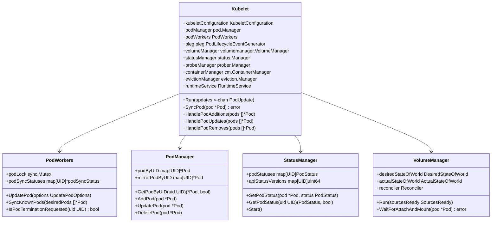
```mermaid
classDiagram
    class Kubelet {
        +kubeletConfiguration KubeletConfiguration
        +podManager pod.Manager
        +podWorkers PodWorkers
        +pleg pleg.PodLifecycleEventGenerator
        +volumeManager volumemanager.VolumeManager
        +statusManager status.Manager
        +probeManager prober.Manager
        +containerManager cm.ContainerManager
        +evictionManager eviction.Manager
        +runtimeService RuntimeService
        +Run(updates <-chan PodUpdate)
        +SyncPod(pod *Pod) error
        +HandlePodAdditions(pods []*Pod)
        +HandlePodUpdates(pods []*Pod)
        +HandlePodRemoves(pods []*Pod)
    }

    class PodWorkers {
        +podLock sync.Mutex
        +podSyncStatuses map[UID]*podSyncStatus
        +UpdatePod(options UpdatePodOptions)
        +SyncKnownPods(desiredPods []*Pod)
        +IsPodTerminationRequested(uid UID) bool
    }

    class PodManager {
        +podByUID map[UID]*Pod
        +mirrorPodByUID map[UID]*Pod
        +GetPodByUID(uid UID) (*Pod, bool)
        +AddPod(pod *Pod)
        +UpdatePod(pod *Pod)
        +DeletePod(pod *Pod)
    }

    class StatusManager {
        +podStatuses map[UID]PodStatus
        +apiStatusVersions map[UID]uint64
        +SetPodStatus(pod *Pod, status PodStatus)
        +GetPodStatus(uid UID) (PodStatus, bool)
        +Start()
    }

    class VolumeManager {
        +desiredStateOfWorld DesiredStateOfWorld
        +actualStateOfWorld ActualStateOfWorld
        +reconciler Reconciler
        +Run(sourcesReady SourcesReady)
        +WaitForAttachAndMount(pod *Pod) error
    }

    Kubelet --> PodWorkers
    Kubelet --> PodManager
    Kubelet --> StatusManager
    Kubelet --> VolumeManager
```

**Code References:**
- Kubelet struct: `pkg/kubelet/kubelet.go:1107-1400`
- Pod workers: `pkg/kubelet/pod_workers.go:147-200`
- Pod manager: `pkg/kubelet/pod/pod_manager.go:45-80`

---

## Communication Patterns

The kubelet employs several communication patterns to coordinate operations:

### 1. Watch Pattern (API Server)

The kubelet uses Kubernetes watch mechanism to receive pod updates:

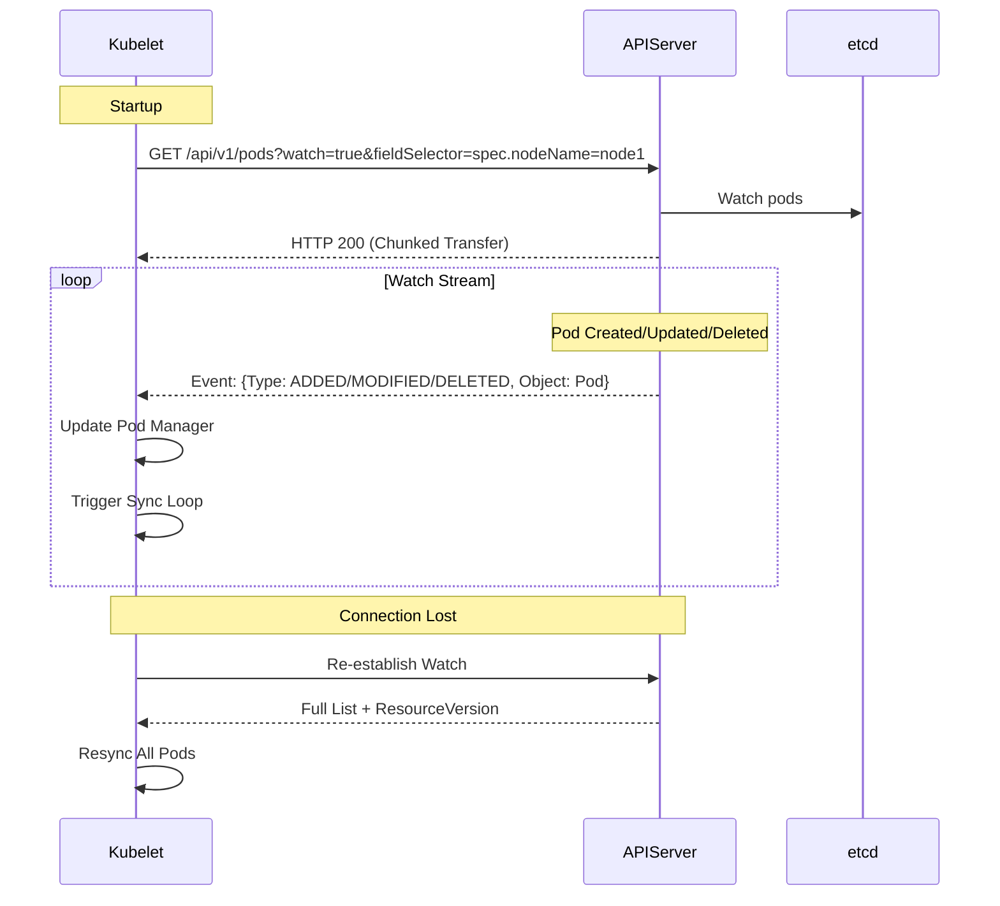
```mermaid
sequenceDiagram
    participant Kubelet
    participant APIServer
    participant etcd

    Note over Kubelet: Startup
    Kubelet->>APIServer: GET /api/v1/pods?watch=true&fieldSelector=spec.nodeName=node1
    APIServer->>etcd: Watch pods
    APIServer-->>Kubelet: HTTP 200 (Chunked Transfer)

    loop Watch Stream
        Note over APIServer: Pod Created/Updated/Deleted
        APIServer-->>Kubelet: Event: {Type: ADDED/MODIFIED/DELETED, Object: Pod}
        Kubelet->>Kubelet: Update Pod Manager
        Kubelet->>Kubelet: Trigger Sync Loop
    end

    Note over Kubelet,APIServer: Connection Lost
    Kubelet->>APIServer: Re-establish Watch
    APIServer-->>Kubelet: Full List + ResourceVersion
    Kubelet->>Kubelet: Resync All Pods
```

**Benefits:**
- **Low Latency**: Immediate notification of changes
- **Efficient**: Single long-lived HTTP connection
- **Reliable**: Automatic reconnection with resync

**Code References:**
- List-watch: Client-go library (`client-go/tools/cache/reflector.go`)
- Pod config: `pkg/kubelet/config/apiserver.go`

### 2. Polling Pattern (PLEG)

The traditional PLEG polls the container runtime periodically:

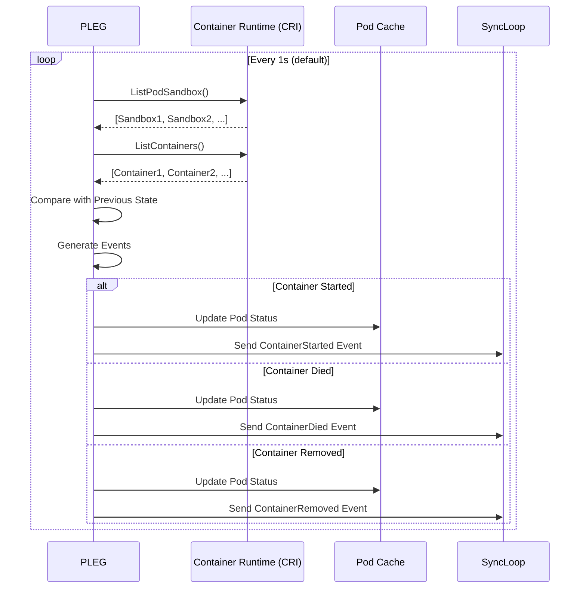
```mermaid
sequenceDiagram
    participant PLEG
    participant CRI as Container Runtime (CRI)
    participant Cache as Pod Cache
    participant SyncLoop

    loop Every 1s (default)
        PLEG->>CRI: ListPodSandbox()
        CRI-->>PLEG: [Sandbox1, Sandbox2, ...]

        PLEG->>CRI: ListContainers()
        CRI-->>PLEG: [Container1, Container2, ...]

        PLEG->>PLEG: Compare with Previous State
        PLEG->>PLEG: Generate Events

        alt Container Started
            PLEG->>Cache: Update Pod Status
            PLEG->>SyncLoop: Send ContainerStarted Event
        else Container Died
            PLEG->>Cache: Update Pod Status
            PLEG->>SyncLoop: Send ContainerDied Event
        else Container Removed
            PLEG->>Cache: Update Pod Status
            PLEG->>SyncLoop: Send ContainerRemoved Event
        end
    end
```

**Characteristics:**
- **Reliability**: Detects all state changes eventually
- **Simplicity**: Easy to understand and debug
- **Overhead**: Periodic polling adds latency and CPU usage

**Code References:**
- PLEG implementation: `pkg/kubelet/pleg/generic.go`
- Relist method: `pkg/kubelet/pleg/generic.go` (Relist function)

### 3. Event-Driven Pattern (Evented PLEG)

The evented PLEG subscribes to CRI events for low-latency updates:

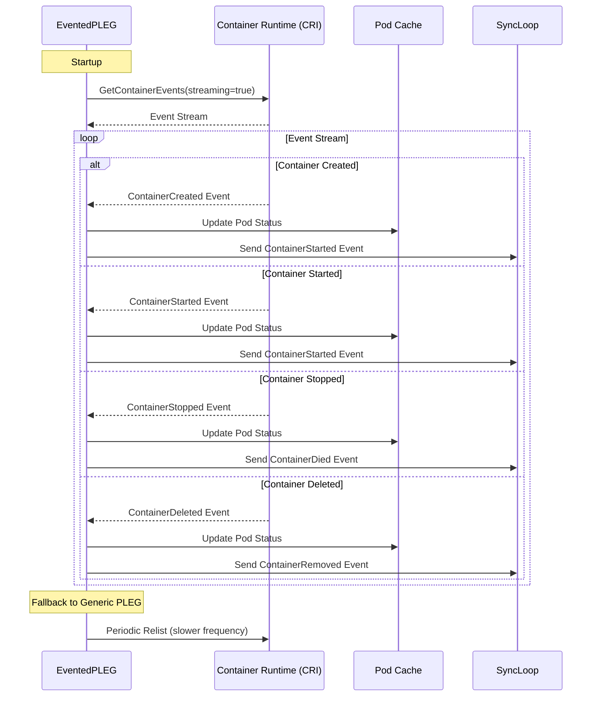
```mermaid
sequenceDiagram
    participant EventedPLEG
    participant CRI as Container Runtime (CRI)
    participant Cache as Pod Cache
    participant SyncLoop

    Note over EventedPLEG: Startup
    EventedPLEG->>CRI: GetContainerEvents(streaming=true)
    CRI-->>EventedPLEG: Event Stream

    loop Event Stream
        alt Container Created
            CRI-->>EventedPLEG: ContainerCreated Event
            EventedPLEG->>Cache: Update Pod Status
            EventedPLEG->>SyncLoop: Send ContainerStarted Event
        else Container Started
            CRI-->>EventedPLEG: ContainerStarted Event
            EventedPLEG->>Cache: Update Pod Status
            EventedPLEG->>SyncLoop: Send ContainerStarted Event
        else Container Stopped
            CRI-->>EventedPLEG: ContainerStopped Event
            EventedPLEG->>Cache: Update Pod Status
            EventedPLEG->>SyncLoop: Send ContainerDied Event
        else Container Deleted
            CRI-->>EventedPLEG: ContainerDeleted Event
            EventedPLEG->>Cache: Update Pod Status
            EventedPLEG->>SyncLoop: Send ContainerRemoved Event
        end
    end

    Note over EventedPLEG: Fallback to Generic PLEG
    EventedPLEG->>CRI: Periodic Relist (slower frequency)
```

**Benefits:**
- **Low Latency**: Immediate event notification
- **Lower CPU**: No periodic polling
- **Hybrid Approach**: Falls back to generic PLEG if events are lost

**Code References:**
- Evented PLEG: `pkg/kubelet/pleg/evented.go`
- Feature gate: Enabled via `EventedPLEG` feature gate

### 4. Push Pattern (Status Updates)

The status manager pushes updates to the API server:

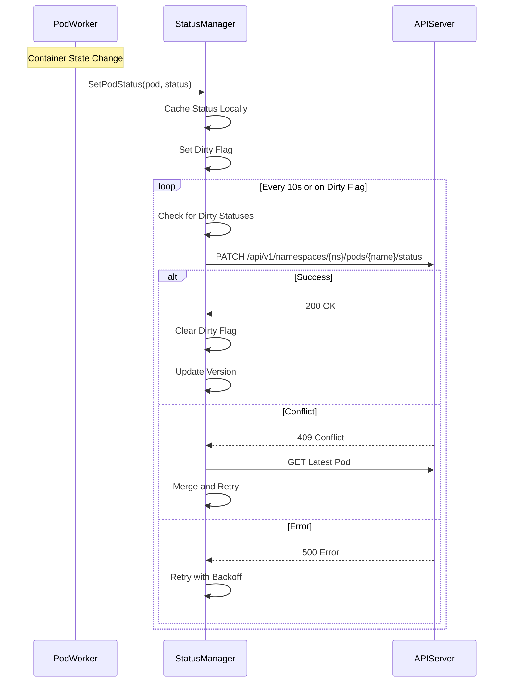
```mermaid
sequenceDiagram
    participant PodWorker
    participant StatusManager
    participant APIServer

    Note over PodWorker: Container State Change
    PodWorker->>StatusManager: SetPodStatus(pod, status)
    StatusManager->>StatusManager: Cache Status Locally
    StatusManager->>StatusManager: Set Dirty Flag

    loop Every 10s or on Dirty Flag
        StatusManager->>StatusManager: Check for Dirty Statuses
        StatusManager->>APIServer: PATCH /api/v1/namespaces/{ns}/pods/{name}/status

        alt Success
            APIServer-->>StatusManager: 200 OK
            StatusManager->>StatusManager: Clear Dirty Flag
            StatusManager->>StatusManager: Update Version
        else Conflict
            APIServer-->>StatusManager: 409 Conflict
            StatusManager->>APIServer: GET Latest Pod
            StatusManager->>StatusManager: Merge and Retry
        else Error
            APIServer-->>StatusManager: 500 Error
            StatusManager->>StatusManager: Retry with Backoff
        end
    end
```

**Characteristics:**
- **Batching**: Multiple status changes batched into single update
- **Conflict Resolution**: Automatic retry on version conflicts
- **Resilience**: Continues on API server failures

**Code References:**
- Status manager: `pkg/kubelet/status/status_manager.go`
- Sync worker: `pkg/kubelet/status/status_manager.go` (syncPod method)

### 5. Request-Response Pattern (CRI Calls)

Container runtime operations use synchronous gRPC calls:

```mermaid
sequenceDiagram
    participant PodWorker
    participant KubeRuntime
    participant CRIClient
    participant Runtime as containerd/CRI-O

    Note over PodWorker: Create Pod
    PodWorker->>KubeRuntime: SyncPod(pod)

    KubeRuntime->>CRIClient: RunPodSandbox(config)
    CRIClient->>Runtime: gRPC RunPodSandbox
    Runtime-->>CRIClient: SandboxID
    CRIClient-->>KubeRuntime: SandboxID

    loop For Each Container
        KubeRuntime->>CRIClient: CreateContainer(sandboxID, config)
        CRIClient->>Runtime: gRPC CreateContainer
        Runtime-->>CRIClient: ContainerID
        CRIClient-->>KubeRuntime: ContainerID

        KubeRuntime->>CRIClient: StartContainer(containerID)
        CRIClient->>Runtime: gRPC StartContainer
        Runtime-->>CRIClient: Success
        CRIClient-->>KubeRuntime: Success
    end

    KubeRuntime-->>PodWorker: Pod Started
```

**Characteristics:**
- **Synchronous**: Blocking calls with timeout
- **Idempotent**: Safe to retry on failures
- **Stateless**: Each call is independent

---

## Data Flow

### Pod Creation Flow

The complete flow from pod assignment to running containers:

```mermaid
graph TB
    A[Pod Assigned to Node] --> B[API Server Watch Event]
    B --> C[Config Mux Receives Update]
    C --> D[Pod Manager Stores Pod]
    D --> E[Sync Loop ADD Event]
    E --> F[Pod Admission]

    F --> G{Admission OK?}
    G -->|Yes| H[Pod Worker Created]
    G -->|No| Z[Reject Pod]

    H --> I[Volume Manager: Add Pod]
    I --> J[Wait for Volumes Attached/Mounted]
    J --> K[Create Pod Data Directories]
    K --> L[Fetch Secrets/ConfigMaps]
    L --> M[Pull Container Images]

    M --> N[Create Pod Sandbox]
    N --> O{Init Containers?}
    O -->|Yes| P[Start Init Containers Sequentially]
    O -->|No| Q[Start App Containers]
    P --> Q

    Q --> R[Start Probe Manager Workers]
    R --> S[Update Pod Status: Running]
    S --> T[Report Status to API Server]

    style A fill:#e1f5ff
    style G fill:#fff3cd
    style Z fill:#f8d7da
    style T fill:#d4edda
```

**Detailed Steps:**

1. **Pod Assignment** (API Server)
   - Scheduler binds pod to node (sets `spec.nodeName`)
   - API server stores binding in etcd
   - Watch stream notifies kubelet

2. **Configuration** (Config Layer)
   - Config mux receives pod update
   - Pod manager adds pod to desired state
   - Sync loop receives ADD event

3. **Admission** (Admission Handlers)
   - Check node resources (CPU, memory)
   - Check volume limits
   - Execute admission plugins
   - Reject if constraints violated

4. **Volume Preparation** (Volume Manager)
   - Add pod volumes to desired state
   - Reconciler attaches cloud volumes
   - Reconciler mounts volumes to node
   - Pod worker waits for all volumes ready

5. **Data Preparation** (Pod Worker)
   - Create pod directory structure
   - Fetch secrets from API server
   - Fetch configmaps from API server
   - Pull container images if not present

6. **Sandbox Creation** (Container Runtime)
   - Create network namespace
   - Set up pod networking (CNI plugins)
   - Create IPC and UTS namespaces
   - Return sandbox ID

7. **Init Container Execution** (Container Runtime)
   - Start init containers sequentially
   - Wait for each to complete successfully
   - Fail pod if any init container fails
   - Proceed to app containers when all succeed

8. **App Container Execution** (Container Runtime)
   - Create containers in sandbox
   - Start containers (may be parallel)
   - Set up container logs
   - Apply resource limits via cgroups

9. **Monitoring Setup** (Probe Manager)
   - Create liveness probe workers
   - Create readiness probe workers
   - Create startup probe workers
   - Start periodic health checks

10. **Status Reporting** (Status Manager)
    - Generate pod status
    - Update status in local cache
    - PATCH status to API server
    - Update service endpoints (if readiness succeeds)

**Code References:**
- Pod addition handler: `pkg/kubelet/kubelet.go:2667` (`HandlePodAdditions`)
- Main sync pod: `pkg/kubelet/kubelet.go:1910` (`SyncPod`)
- Runtime sync: `pkg/kubelet/kuberuntime/kuberuntime_manager.go` (`SyncPod`)

### Status Update Flow

How status information flows from containers to the API server:

```mermaid
graph TB
    subgraph "State Sources"
        A[Container Runtime<br/>Container States]
        B[PLEG<br/>Container Events]
        C[Probe Manager<br/>Health Results]
        D[cAdvisor<br/>Resource Usage]
    end

    subgraph "Status Generation"
        E[Generate Container Status]
        F[Generate Pod Conditions]
        G[Generate Pod Status]
    end

    subgraph "Status Manager"
        H[Status Cache<br/>In-Memory]
        I[Version Tracking]
        J[Sync Worker]
    end

    subgraph "API Server"
        K[Pod Status Subresource]
        L[Service Controller<br/>Endpoint Updates]
    end

    A --> E
    B --> E
    C --> F
    D --> E

    E --> G
    F --> G

    G --> H
    H --> I
    I --> J

    J -->|PATCH .../status| K
    K --> L

    style H fill:#ffffcc
    style K fill:#ccffcc
```

**Status Update Triggers:**

| Trigger | Source | Action |
|---------|--------|--------|
| **Container State Change** | PLEG Event | Immediate status update |
| **Probe Result Change** | Probe Manager | Update readiness/liveness conditions |
| **Resource Change** | cAdvisor | Update resource usage in status |
| **Periodic Sync** | Timer (10s default) | Sync all pod statuses |
| **Pod Phase Change** | Pod Worker | Update pod phase field |

### Volume Lifecycle Flow

How volumes are managed throughout pod lifecycle:

```mermaid
graph TB
    A[Pod Scheduled] --> B[Volume Manager: Add Pod to Desired State]

    B --> C{Volume Type}
    C -->|Cloud Volume| D[Call Cloud Provider: Attach Disk]
    C -->|ConfigMap/Secret| E[Fetch from API Server]
    C -->|EmptyDir| F[Create Directory]
    C -->|HostPath| G[Validate Host Path]

    D --> H[Wait for Attach Complete]
    E --> I[Mount Point Ready]
    F --> I
    G --> I
    H --> J[Mount Block Device to Node]

    J --> I
    I --> K[Set Up Volume for Pod]
    K --> L[Volume Ready]
    L --> M[Pod Worker Starts Containers]

    M --> N[Containers Running with Volumes]

    N --> O[Pod Terminating]
    O --> P[Tear Down Volume for Pod]
    P --> Q{Other Pods Using Volume?}

    Q -->|Yes| R[Keep Volume Mounted]
    Q -->|No| S[Unmount from Node]

    S --> T{Cloud Volume?}
    T -->|Yes| U[Detach from Node]
    T -->|No| V[Cleanup Complete]
    U --> V
    R --> V

    style L fill:#d4edda
    style O fill:#fff3cd
    style V fill:#e1f5ff
```

**Volume Manager States:**

| State | Desired State of World | Actual State of World | Reconciler Action |
|-------|------------------------|----------------------|-------------------|
| **Attach Needed** | Volume present | Volume absent | Call Attach() |
| **Mount Needed** | Volume present | Attached but not mounted | Call Mount() |
| **Ready** | Volume present | Attached and mounted | No action |
| **Unmount Needed** | Volume absent | Mounted | Call Unmount() |
| **Detach Needed** | Volume absent | Attached | Call Detach() |

**Code References:**
- Volume manager: `pkg/kubelet/volumemanager/volume_manager.go`
- Desired state populator: `pkg/kubelet/volumemanager/populator/desired_state_of_world_populator.go`
- Reconciler: `pkg/kubelet/volumemanager/reconciler/reconciler.go`

---

## Event-Driven Architecture

The kubelet is fundamentally **event-driven**, responding to various event sources through a central sync loop.

### Sync Loop Architecture

The sync loop is the heart of the kubelet, multiplexing events from multiple sources:

```mermaid
graph TB
    subgraph "Event Sources"
        ConfigCh[Config Channel<br/>Pod Updates]
        PLEGCh[PLEG Channel<br/>Container Events]
        SyncCh[Sync Channel<br/>Periodic Timer]
        HousekeepingCh[Housekeeping Channel<br/>Cleanup Timer]
        LivenessCh[Liveness Channel<br/>Probe Results]
        ReadinessCh[Readiness Channel<br/>Probe Results]
        StartupCh[Startup Channel<br/>Probe Results]
    end

    subgraph "Sync Loop"
        Select[Select Statement<br/>Multiplexer]
    end

    subgraph "Event Handlers"
        AddHandler[HandlePodAdditions]
        UpdateHandler[HandlePodUpdates]
        RemoveHandler[HandlePodRemoves]
        SyncHandler[HandlePodSyncs]
        CleanupHandler[HandlePodCleanups]
        ProbeHandler[HandleProbeSync]
    end

    ConfigCh --> Select
    PLEGCh --> Select
    SyncCh --> Select
    HousekeepingCh --> Select
    LivenessCh --> Select
    ReadinessCh --> Select
    StartupCh --> Select

    Select -->|ADD| AddHandler
    Select -->|UPDATE| UpdateHandler
    Select -->|REMOVE| RemoveHandler
    Select -->|DELETE| UpdateHandler
    Select -->|PLEG Event| SyncHandler
    Select -->|Sync Timer| SyncHandler
    Select -->|Housekeeping| CleanupHandler
    Select -->|Probe Result| ProbeHandler

    AddHandler --> PodWorkers[Pod Workers]
    UpdateHandler --> PodWorkers
    RemoveHandler --> PodWorkers
    SyncHandler --> PodWorkers

    style Select fill:#ff9999,stroke:#333,stroke-width:3px
```

**Code Reference:**
- Sync loop iteration: `pkg/kubelet/kubelet.go:2528` (`syncLoopIteration`)

**Event Types and Handlers:**

| Event Source | Event Types | Handler Method | Frequency/Trigger |
|--------------|-------------|----------------|-------------------|
| **Config Channel** | ADD, UPDATE, DELETE, REMOVE, RECONCILE | HandlePodAdditions, HandlePodUpdates, HandlePodRemoves, HandlePodReconcile | On API/file/HTTP change |
| **PLEG Channel** | ContainerStarted, ContainerDied, ContainerRemoved, ContainerChanged, PodSync | HandlePodSyncs | On container state change |
| **Sync Channel** | Timer tick | HandlePodSyncs | Every 1s (default) |
| **Housekeeping Channel** | Timer tick | HandlePodCleanups | Every 2s (default) |
| **Liveness Channel** | Probe failure | HandlePodSyncs (restart container) | On probe failure |
| **Readiness Channel** | Probe success/failure | SetContainerReadiness | On probe result change |
| **Startup Channel** | Probe success/failure | SetContainerStartup | On probe result change |

### PLEG: Pod Lifecycle Event Generator

PLEG is responsible for detecting container state changes and generating events:

```mermaid
stateDiagram-v2
    [*] --> Relist: PLEG Starts

    Relist --> List: Every 1s
    List --> Compare: List All Pods/Containers
    Compare --> GenerateEvents: Detect Changes
    GenerateEvents --> UpdateCache: Create Events
    UpdateCache --> SendEvents: Update Pod Cache
    SendEvents --> Relist: Send to Sync Loop

    state Compare {
        [*] --> CheckPods: Compare with Previous
        CheckPods --> CheckContainers
        CheckContainers --> [*]
    }

    state GenerateEvents {
        [*] --> ContainerStarted: New Running Container
        [*] --> ContainerDied: Exited Container
        [*] --> ContainerRemoved: Removed Container
        [*] --> PodSync: Other Changes
        ContainerStarted --> [*]
        ContainerDied --> [*]
        ContainerRemoved --> [*]
        PodSync --> [*]
    }
```

**PLEG Event Types:**

```go
// From pkg/kubelet/pleg/pleg.go

const (
    ContainerStarted  PodLifeCycleEventType = "ContainerStarted"  // Container is now running
    ContainerDied     PodLifeCycleEventType = "ContainerDied"     // Container exited
    ContainerRemoved  PodLifeCycleEventType = "ContainerRemoved"  // Container was removed
    ContainerChanged  PodLifeCycleEventType = "ContainerChanged"  // Container state unknown
    PodSync           PodLifeCycleEventType = "PodSync"           // Catch-all for other changes
)
```

**PLEG Health:**

The kubelet monitors PLEG health and reports unhealthy if:
- Relist takes longer than 3 minutes (default)
- Indicates container runtime issues
- Causes node to be marked NotReady

**Code References:**
- PLEG interface: `pkg/kubelet/pleg/pleg.go:67`
- Generic PLEG: `pkg/kubelet/pleg/generic.go`
- Evented PLEG: `pkg/kubelet/pleg/evented.go`

### Pod Workers State Machine

Each pod has a dedicated worker goroutine that manages its lifecycle through a state machine:

```mermaid
stateDiagram-v2
    [*] --> Syncing: UpdatePod(create)

    Syncing --> Syncing: Container Restart
    Syncing --> Syncing: Probe Failure
    Syncing --> Syncing: Image Pull Retry

    Syncing --> Terminating: UpdatePod(kill)
    Syncing --> Terminating: Eviction
    Syncing --> Terminating: Failed Admission

    Terminating --> Terminating: Wait for Grace Period
    Terminating --> Terminating: Kill Containers

    Terminating --> Terminated: All Containers Stopped

    Terminated --> Terminated: Cleanup Volumes
    Terminated --> Terminated: Remove Pod Sandbox
    Terminated --> Terminated: Update Status

    Terminated --> [*]: Pod Removed from Desired State

    note right of Syncing
        syncPod()
        - Create containers
        - Start containers
        - Run probes
    end note

    note right of Terminating
        syncTerminatingPod()
        - Stop containers
        - Wait for grace period
        - Force kill if timeout
    end note

    note right of Terminated
        syncTerminatedPod()
        - Unmount volumes
        - Remove pod sandbox
        - Clean up resources
    end note
```

**Pod Worker States:**

| State | Method Called | Operations | Transitions |
|-------|---------------|------------|-------------|
| **Syncing** | `syncPod()` | Create/start containers, run probes, update status | → Terminating (on delete) |
| **Terminating** | `syncTerminatingPod()` | Stop containers, wait for grace period, force kill | → Terminated (when stopped) |
| **Terminated** | `syncTerminatedPod()` | Unmount volumes, remove sandbox, final cleanup | → (removed) |

**Code References:**
- Pod worker state machine: `pkg/kubelet/pod_workers.go:107-130`
- Sync pod: `pkg/kubelet/kubelet.go:1910`
- Sync terminating pod: `pkg/kubelet/kubelet_pods.go` (syncTerminatingPod)
- Sync terminated pod: `pkg/kubelet/kubelet_pods.go` (syncTerminatedPod)

### Reconciliation Loops

The kubelet runs several reconciliation loops to ensure desired state matches actual state:

```mermaid
graph TB
    subgraph "Periodic Reconcilers"
        A[Pod Sync Loop<br/>Every 1s]
        B[Housekeeping Loop<br/>Every 2s]
        C[Volume Reconciler<br/>Every 100ms]
        D[Status Sync Loop<br/>Every 10s]
        E[Node Status Loop<br/>Every 10s]
        F[Image GC Loop<br/>Every 5m]
        G[Container GC Loop<br/>Every 1m]
    end

    A --> H{Pods Needing Sync?}
    H -->|Yes| I[Dispatch to Pod Workers]

    B --> J{Dead Containers?}
    J -->|Yes| K[Cleanup Dead Containers]

    C --> L{Volume State Mismatch?}
    L -->|Yes| M[Attach/Mount/Unmount/Detach]

    D --> N{Status Changed?}
    N -->|Yes| O[Update API Server]

    E --> P[Collect Node Info]
    P --> Q[Update Node Status in API]

    F --> R{Disk Usage > Threshold?}
    R -->|Yes| S[Remove Unused Images]

    G --> T{Dead Containers Exist?}
    T -->|Yes| U[Remove Dead Containers]
```

**Reconciliation Characteristics:**

| Loop | Period | Purpose | Failure Handling |
|------|--------|---------|------------------|
| **Pod Sync** | 1s | Ensure all pods converge to desired state | Retry indefinitely |
| **Housekeeping** | 2s | Clean up resources, garbage collection | Log errors, continue |
| **Volume Reconciler** | 100ms | Ensure volumes match desired state | Retry with exponential backoff |
| **Status Sync** | 10s | Push status updates to API | Retry with backoff, cache locally |
| **Node Status** | 10s | Update node conditions and capacity | Retry with backoff |
| **Image GC** | 5m | Free disk space by removing images | Best effort, log failures |
| **Container GC** | 1m | Remove stopped containers | Best effort, log failures |

---

## Concurrency Model

The kubelet is highly concurrent, using goroutines and channels to manage parallelism:

### Concurrency Architecture

```mermaid
graph TB
    subgraph "Main Goroutines"
        Main[Main Goroutine<br/>Sync Loop]
        PLEG[PLEG Goroutine<br/>Relist Loop]
        StatusSync[Status Sync Goroutine<br/>API Updates]
        NodeStatus[Node Status Goroutine<br/>Node Updates]
        NodeLease[Node Lease Goroutine<br/>Lease Renewal]
    end

    subgraph "Per-Pod Goroutines"
        PW1[Pod Worker 1]
        PW2[Pod Worker 2]
        PWN[Pod Worker N]
    end

    subgraph "Per-Container Goroutines"
        LP1[Liveness Probe 1]
        LP2[Liveness Probe 2]
        RP1[Readiness Probe 1]
        RP2[Readiness Probe 2]
        SP1[Startup Probe 1]
    end

    subgraph "Manager Goroutines"
        VolumeLoop[Volume Reconciler]
        ImageGC[Image GC Loop]
        ContainerGC[Container GC Loop]
        EvictionLoop[Eviction Monitor]
    end

    Main --> PW1
    Main --> PW2
    Main --> PWN

    PW1 --> LP1
    PW1 --> RP1
    PW2 --> LP2
    PW2 --> RP2
    PWN --> SP1

    style Main fill:#ff9999,stroke:#333,stroke-width:3px
    style PW1 fill:#ffcc99
    style PW2 fill:#ffcc99
    style PWN fill:#ffcc99
```

**Concurrency Levels:**

| Component | Goroutines | Scaling Factor |
|-----------|-----------|----------------|
| **Sync Loop** | 1 | Fixed |
| **PLEG** | 1-2 | Fixed (generic + evented) |
| **Status Sync** | 1 | Fixed |
| **Node Status** | 2 | Fixed (status + lease) |
| **Pod Workers** | N | Number of pods |
| **Liveness Probes** | M | Number of containers with liveness probes |
| **Readiness Probes** | M | Number of containers with readiness probes |
| **Startup Probes** | M | Number of containers with startup probes |
| **Volume Manager** | 1 | Fixed (reconciler) |
| **Image GC** | 1 | Fixed |
| **Container GC** | 1 | Fixed |

**Total Goroutines**: ~10 fixed + (1 * number of pods) + (3 * number of containers with probes)

### Synchronization Mechanisms

The kubelet uses various synchronization primitives:

```mermaid
graph TB
    subgraph "Synchronization Primitives"
        A[Channels<br/>Event Communication]
        B[Mutexes<br/>Shared State Protection]
        C[RWMutexes<br/>Read-Heavy Data]
        D[WaitGroups<br/>Goroutine Coordination]
        E[Context<br/>Cancellation Propagation]
    end

    subgraph "Usage Examples"
        A --> F[PLEG → Sync Loop]
        A --> G[Probe Results → Status Manager]

        B --> H[Pod Manager State]
        B --> I[Status Manager Cache]

        C --> J[Pod Workers Map]
        C --> K[Runtime Cache]

        D --> L[Pod Worker Shutdown]
        D --> M[Manager Shutdown]

        E --> N[Pod Termination]
        E --> O[Graceful Shutdown]
    end
```

**Synchronization Patterns:**

1. **Channels for Event Flow**
   ```go
   // Example from pkg/kubelet/kubelet.go
   configCh := make(chan kubetypes.PodUpdate)
   plegCh := make(chan *pleg.PodLifecycleEvent)

   // Select multiplexing
   select {
   case u := <-configCh:
       handler.HandlePodAdditions(u.Pods)
   case e := <-plegCh:
       handler.HandlePodSyncs([]*v1.Pod{pod})
   }
   ```

2. **Mutexes for Shared State**
   ```go
   // Example from pkg/kubelet/pod_workers.go
   type podWorkers struct {
       podLock       sync.Mutex
       podSyncStatuses map[types.UID]*podSyncStatus
   }

   func (p *podWorkers) UpdatePod(options *UpdatePodOptions) {
       p.podLock.Lock()
       defer p.podLock.Unlock()
       // Access podSyncStatuses safely
   }
   ```

3. **RWMutexes for Read-Heavy Data**
   ```go
   // Example from pkg/kubelet/pod/pod_manager.go
   type basicManager struct {
       lock           sync.RWMutex
       podByUID       map[types.UID]*v1.Pod
   }

   func (pm *basicManager) GetPodByUID(uid types.UID) (*v1.Pod, bool) {
       pm.lock.RLock()
       defer pm.lock.RUnlock()
       pod, ok := pm.podByUID[uid]
       return pod, ok
   }
   ```

4. **Context for Cancellation**
   ```go
   // Example from pkg/kubelet/kubelet.go
   func (kl *Kubelet) SyncPod(ctx context.Context, ...) error {
       select {
       case <-ctx.Done():
           return fmt.Errorf("pod sync cancelled: %w", ctx.Err())
       default:
           // Continue syncing
       }
   }
   ```

### Pod Worker Parallelism

Each pod worker operates independently, allowing parallel pod operations:

```mermaid
sequenceDiagram
    participant SyncLoop
    participant PW1 as Pod Worker 1
    participant PW2 as Pod Worker 2
    participant PW3 as Pod Worker 3
    participant CRI as Container Runtime

    Note over SyncLoop: Multiple Pods Assigned
    SyncLoop->>PW1: UpdatePod(pod1)
    SyncLoop->>PW2: UpdatePod(pod2)
    SyncLoop->>PW3: UpdatePod(pod3)

    par Parallel Pod Operations
        PW1->>CRI: RunPodSandbox(pod1)
        CRI-->>PW1: Sandbox Created
        PW1->>CRI: StartContainer(pod1-container1)
    and
        PW2->>CRI: RunPodSandbox(pod2)
        CRI-->>PW2: Sandbox Created
        PW2->>CRI: StartContainer(pod2-container1)
    and
        PW3->>CRI: RunPodSandbox(pod3)
        CRI-->>PW3: Sandbox Created
        PW3->>CRI: StartContainer(pod3-container1)
    end

    Note over PW1,PW3: All Pods Starting Concurrently
```

**Pod Worker Guarantees:**

1. **Per-Pod Serialization**: Operations on a single pod are serialized
2. **Cross-Pod Parallelism**: Different pods can be processed simultaneously
3. **State Isolation**: Each pod worker has isolated state
4. **Ordered Updates**: Pod updates for the same pod are processed in order

**Code References:**
- Pod workers: `pkg/kubelet/pod_workers.go:147-200`
- Worker goroutine: `pkg/kubelet/pod_workers.go` (podWorkerLoop)

---

## State Management

The kubelet maintains multiple state representations and continuously reconciles them:

### Desired vs. Actual State

```mermaid
graph TB
    subgraph "Desired State (What Should Be)"
        DS1[Pod Manager<br/>API + Static Pods]
        DS2[Volume Manager DSW<br/>Volumes to Mount]
        DS3[Secret/ConfigMap Manager<br/>Data to Cache]
    end

    subgraph "Actual State (What Is)"
        AS1[Pod Workers<br/>Running Pods]
        AS2[Volume Manager ASW<br/>Mounted Volumes]
        AS3[Container Runtime<br/>Running Containers]
        AS4[Pod Cache<br/>Container States]
    end

    subgraph "Reconcilers"
        R1[Sync Loop<br/>Pod Reconciliation]
        R2[Volume Reconciler<br/>Volume Reconciliation]
        R3[Garbage Collector<br/>Resource Cleanup]
    end

    DS1 -->|Compare| R1
    AS1 -->|Compare| R1

    DS2 -->|Compare| R2
    AS2 -->|Compare| R2

    AS3 -->|Cleanup Orphans| R3
    AS4 -->|Cleanup Orphans| R3

    R1 -->|Create/Update/Delete| AS1
    R2 -->|Mount/Unmount| AS2
    R3 -->|Remove Containers| AS3

    style DS1 fill:#e1f5ff
    style AS1 fill:#fff3cd
    style R1 fill:#d4edda
```

**State Sources:**

| State Type | Source | Update Frequency | Persistence |
|------------|--------|------------------|-------------|
| **Desired Pod State** | API server watch, file config | On change | API server (etcd) |
| **Actual Pod State** | Pod workers, PLEG | On change + periodic | In-memory only |
| **Desired Volume State** | Pod specs | On pod change | Derived from pods |
| **Actual Volume State** | Mount table, volume plugins | Periodic scan | Filesystem |
| **Container State** | Container runtime via CRI | PLEG relist (1s) | Container runtime |
| **Pod Status** | Status manager cache | On change | API server (synced) |

### State Reconciliation

The kubelet continuously reconciles state through multiple loops:

```mermaid
sequenceDiagram
    participant PM as Pod Manager<br/>(Desired)
    participant PW as Pod Workers<br/>(Actual)
    participant SyncLoop
    participant CRI as Container Runtime

    loop Every 1s
        SyncLoop->>PM: Get All Desired Pods
        SyncLoop->>PW: Get All Running Pods
        SyncLoop->>SyncLoop: Compare Desired vs Actual

        alt New Pod in Desired
            SyncLoop->>PW: UpdatePod(pod, create)
            PW->>CRI: Create and Start Containers
        else Pod Removed from Desired
            SyncLoop->>PW: UpdatePod(pod, kill)
            PW->>CRI: Stop and Remove Containers
        else Pod Changed in Desired
            SyncLoop->>PW: UpdatePod(pod, update)
            PW->>CRI: Restart Affected Containers
        else PLEG Event Received
            SyncLoop->>PW: UpdatePod(pod, sync)
            PW->>CRI: Verify State and Reconcile
        end
    end
```

**Reconciliation Triggers:**

1. **Timer-Based** (Every 1s)
   - Scan all pods in pod manager
   - Dispatch syncs for pods needing reconciliation
   - Ensures eventual consistency

2. **Event-Based**
   - PLEG events trigger immediate reconciliation
   - Pod updates from API trigger immediate reconciliation
   - Probe failures trigger immediate reconciliation

3. **Probe-Based**
   - Liveness failure triggers container restart
   - Readiness change updates endpoint status
   - Startup success enables other probes

**Code References:**
- Sync loop: `pkg/kubelet/kubelet.go:2454`
- Pod sync logic: `pkg/kubelet/kubelet.go:2586-2593`

### State Caching

The kubelet caches state to reduce API server load and improve performance:

```mermaid
graph TB
    subgraph "Cache Layers"
        L1[Pod Manager Cache<br/>Desired Pods]
        L2[Pod Workers Cache<br/>Running Pods]
        L3[Runtime Cache<br/>Container States]
        L4[Status Manager Cache<br/>Pod Statuses]
        L5[Secret/ConfigMap Cache<br/>Configuration Data]
    end

    subgraph "Update Sources"
        API[API Server]
        PLEG[PLEG Events]
        Probes[Probe Results]
    end

    subgraph "Consumers"
        SyncLoop[Sync Loop]
        PodWorkers[Pod Workers]
        StatusMgr[Status Manager]
    end

    API -->|Watch Events| L1
    PLEG -->|Container Events| L3
    Probes -->|Health Results| L4

    L1 --> SyncLoop
    L2 --> SyncLoop
    L3 --> SyncLoop
    L4 --> StatusMgr
    L5 --> PodWorkers

    style L1 fill:#ffffcc
    style L3 fill:#ffffcc
    style L4 fill:#ffffcc
```

**Cache Characteristics:**

| Cache | TTL | Invalidation | Refresh Strategy |
|-------|-----|--------------|------------------|
| **Pod Manager** | Until pod deleted | On pod update/delete | Immediate (watch) |
| **Runtime Cache** | 2s (default) | On PLEG event | Periodic + event |
| **Status Manager** | Until pod deleted | On status change | Event-driven |
| **Secret Manager** | Configurable (default: watch) | On secret update | Watch or TTL |
| **ConfigMap Manager** | Configurable (default: watch) | On configmap update | Watch or TTL |

**Code References:**
- Pod manager: `pkg/kubelet/pod/pod_manager.go`
- Runtime cache: `pkg/kubelet/container/cache.go`
- Status cache: `pkg/kubelet/status/status_manager.go`

---

## Error Handling and Recovery

The kubelet implements comprehensive error handling and recovery mechanisms:

### Error Categories

```mermaid
graph TB
    A[Kubelet Errors] --> B[Transient Errors]
    A --> C[Permanent Errors]
    A --> D[Configuration Errors]
    A --> E[Resource Errors]

    B --> B1[Network Timeout]
    B --> B2[Image Pull Backoff]
    B --> B3[Runtime Unavailable]
    B --> B4[API Server Unreachable]

    C --> C1[Invalid Pod Spec]
    C --> C2[Container Exit Code != 0]
    C --> C3[Init Container Failed]
    C --> C4[Failed Admission]

    D --> D1[Invalid Secret Reference]
    D --> D2[Invalid ConfigMap Reference]
    D --> D3[Invalid Volume Spec]

    E --> E1[Out of CPU]
    E --> E2[Out of Memory]
    E --> E3[Out of Disk Space]
    E --> E4[Volume Attach Limit]

    B1 --> Retry[Retry with Backoff]
    B2 --> Retry
    B3 --> Retry
    B4 --> Retry

    C1 --> Fail[Mark Pod Failed]
    C2 --> Restart[Restart Container]
    C3 --> Fail
    C4 --> Fail

    D1 --> Event[Generate Event + Wait]
    D2 --> Event
    D3 --> Fail

    E1 --> Evict[Evict Pods]
    E2 --> Evict
    E3 --> Evict
    E4 --> Fail

    style Retry fill:#fff3cd
    style Fail fill:#f8d7da
    style Restart fill:#d4edda
    style Evict fill:#f8d7da
```

### Retry Strategies

The kubelet employs different retry strategies based on error type:

**1. Exponential Backoff (Image Pull)**

```mermaid
graph LR
    A[Pull Failed] --> B[Wait 10s]
    B --> C[Retry]
    C -->|Failed| D[Wait 20s]
    D --> E[Retry]
    E -->|Failed| F[Wait 40s]
    F --> G[Retry]
    G -->|Failed| H[Wait 80s]
    H --> I[Retry]
    I -->|Failed| J[Wait 160s<br/>Max: 5m]
    J --> K[Retry]

    C -->|Success| Success[Image Pulled]
    E -->|Success| Success
    G -->|Success| Success
    I -->|Success| Success
    K -->|Success| Success

    style Success fill:#d4edda
```

**Code Reference:**
- Image pull backoff: `pkg/kubelet/images/image_manager.go`

**2. Container Restart Backoff**

```mermaid
graph TB
    A[Container Exited] --> B{Restart Policy?}

    B -->|Always| C[Calculate Backoff]
    B -->|OnFailure| D{Exit Code?}
    B -->|Never| E[No Restart]

    D -->|0| E
    D -->|Non-0| C

    C --> F[Wait Backoff Duration]
    F --> G[Restart Container]

    G --> H{Success?}
    H -->|Yes| I[Reset Backoff]
    H -->|No| J[Double Backoff<br/>Max: 5m]
    J --> F

    style E fill:#f8d7da
    style I fill:#d4edda
```

**Backoff Formula:**
```
backoff = min(2^restartCount * 10s, 5m)
```

**Code Reference:**
- Container backoff: `pkg/kubelet/kubelet.go` (ReasonCache)
- Restart logic: `pkg/kubelet/kuberuntime/kuberuntime_container.go`

**3. API Server Retry**

```mermaid
sequenceDiagram
    participant Kubelet
    participant APIServer

    Kubelet->>APIServer: PATCH /pods/{name}/status

    alt Success
        APIServer-->>Kubelet: 200 OK
        Kubelet->>Kubelet: Clear Retry State
    else Conflict (409)
        APIServer-->>Kubelet: 409 Conflict
        Kubelet->>APIServer: GET /pods/{name}
        APIServer-->>Kubelet: Latest Pod
        Kubelet->>Kubelet: Merge Status
        Kubelet->>APIServer: PATCH /pods/{name}/status (retry)
    else Transient Error (5xx)
        APIServer-->>Kubelet: 500/503 Error
        Kubelet->>Kubelet: Exponential Backoff
        Kubelet->>APIServer: PATCH /pods/{name}/status (retry)
    else Permanent Error (4xx)
        APIServer-->>Kubelet: 400/403/404
        Kubelet->>Kubelet: Log Error + Stop Retrying
    end
```

**Code Reference:**
- Status sync: `pkg/kubelet/status/status_manager.go` (syncPod method)

### Failure Detection

The kubelet detects failures through multiple mechanisms:

```mermaid
graph TB
    subgraph "Detection Mechanisms"
        A[Liveness Probes<br/>Container Health]
        B[PLEG Health<br/>Runtime Connectivity]
        C[Runtime Status<br/>Runtime Ready]
        D[Node Conditions<br/>Resource Availability]
        E[Probe Failures<br/>Application Health]
    end

    subgraph "Failure Actions"
        F[Restart Container]
        G[Mark Node NotReady]
        H[Evict Pods]
        I[Update Service Endpoints]
        J[Generate Events]
    end

    A -->|Failure| F
    B -->|Unhealthy| G
    C -->|Not Ready| G
    D -->|Pressure| H
    E -->|Readiness Failure| I

    F --> J
    G --> J
    H --> J
    I --> J

    style F fill:#f8d7da
    style G fill:#f8d7da
    style H fill:#f8d7da
```

**Detection Thresholds:**

| Mechanism | Threshold | Action | Recovery |
|-----------|-----------|--------|----------|
| **Liveness Probe** | 3 consecutive failures | Restart container | Automatic on success |
| **PLEG Health** | Relist > 3m | Mark node NotReady | Automatic on recovery |
| **Runtime Status** | Runtime not ready | Mark node NotReady | Automatic on recovery |
| **Memory Pressure** | Available < threshold | Evict BestEffort pods | Manual (add resources) |
| **Disk Pressure** | Available < threshold | Evict pods, GC images | Automatic on cleanup |

### Graceful Degradation

The kubelet degrades gracefully under various failure conditions:

**1. API Server Unavailable**
- Continue running existing pods
- Use cached secrets/configmaps
- Stop accepting new pods
- Cannot update pod status
- Node eventually marked NotReady (after lease expires)

**2. Container Runtime Unavailable**
- Mark node NotReady immediately
- Stop accepting new pods
- Cannot restart failed containers
- PLEG becomes unhealthy
- Pods continue running (if already started)

**3. Volume Plugin Failure**
- Affected pods stuck in ContainerCreating
- Other pods continue normally
- Retry volume operations with backoff
- Generate events for debugging

**4. Out of Resources**
- Trigger evictions based on QoS
- Stop accepting new pods
- Mark node with pressure condition
- Garbage collect to free resources

**Code References:**
- Error handling: Throughout `pkg/kubelet/kubelet.go`
- Backoff: `pkg/kubelet/util/backoff/`
- Graceful shutdown: `pkg/kubelet/kubelet.go` (shutdown handlers)

---

## Performance Characteristics

### Key Performance Metrics

The kubelet is designed for high performance and efficiency:

```mermaid
graph TB
    subgraph "Performance Dimensions"
        A[Pod Startup Latency]
        B[Status Update Latency]
        C[Resource Efficiency]
        D[Scalability]
    end

    subgraph "Optimization Techniques"
        E[Parallel Pod Operations]
        F[Event-Driven Architecture]
        G[Local Caching]
        H[Efficient Reconciliation]
    end

    A --> E
    A --> G

    B --> F
    B --> H

    C --> G
    C --> H

    D --> E
    D --> F

    style A fill:#ffffcc
    style B fill:#ffffcc
    style C fill:#ffffcc
    style D fill:#ffffcc
```

**Performance Benchmarks:**

| Metric | Typical Value | Influencing Factors |
|--------|---------------|---------------------|
| **Pod Startup Latency** | 1-5s (without image pull) | Image pull time, volume attach time, network setup |
| **Image Pull Latency** | 10s-5m | Image size, registry speed, network bandwidth |
| **Status Update Latency** | <1s (event-driven), 10s (periodic) | API server responsiveness, network latency |
| **PLEG Relist Duration** | <100ms | Number of pods, container runtime performance |
| **Container Restart Latency** | 1-2s | Runtime speed, container startup time |
| **Volume Mount Latency** | 5-30s | Cloud provider speed, volume type |
| **Pod Termination Latency** | Grace period (default 30s) | Application shutdown time |

### Scalability Limits

**Node-Level Limits:**

| Resource | Recommended Limit | Maximum Tested | Limiting Factor |
|----------|------------------|----------------|-----------------|
| **Pods per Node** | 110 (default) | 500+ | IP addresses, file descriptors, CPU for kubelet |
| **Containers per Pod** | 10-20 | 100+ | PLEG relist duration, resource overhead |
| **Volumes per Pod** | 10-20 | No hard limit | Volume attach time, mount points |
| **Secrets per Pod** | 10-20 | No hard limit | API server load, cache size |
| **ConfigMaps per Pod** | 10-20 | No hard limit | API server load, cache size |

**Performance Tuning:**

```yaml
# Example kubelet configuration for high-density nodes
apiVersion: kubelet.config.k8s.io/v1beta1
kind: KubeletConfiguration
maxPods: 250                          # Increase from default 110
podsPerCore: 10                       # Limit based on CPU cores
syncFrequency: 1m                     # Reduce sync frequency for large nodes
nodeStatusUpdateFrequency: 10s        # Default
imageGCHighThresholdPercent: 85       # Trigger GC earlier
imageGCLowThresholdPercent: 80        # GC target
evictionHard:
  memory.available: "100Mi"
  nodefs.available: "10%"
```

**Code References:**
- Default limits: `pkg/kubelet/apis/config/v1beta1/defaults.go`
- Performance constants: `pkg/kubelet/kubelet.go`

### Resource Efficiency

**Memory Usage:**

| Component | Typical Memory | Scaling Factor |
|-----------|---------------|----------------|
| **Kubelet Base** | ~100 MB | Fixed |
| **Per Pod** | ~10-20 KB | Linear |
| **Per Container** | ~5-10 KB | Linear |
| **Runtime Cache** | ~1-5 MB | Based on pod count |
| **Status Cache** | ~1-5 MB | Based on pod count |

**Total Memory**: ~100 MB + (pods × 20 KB) + (containers × 10 KB)

**Example**: For 100 pods with 2 containers each:
- Base: 100 MB
- Pods: 100 × 20 KB = 2 MB
- Containers: 200 × 10 KB = 2 MB
- **Total: ~104 MB**

**CPU Usage:**

| Operation | CPU Impact | Frequency |
|-----------|-----------|-----------|
| **Sync Loop** | Low (1-2%) | Continuous |
| **PLEG Relist** | Medium (5-10%) | Every 1s |
| **Status Updates** | Low (1-2%) | Every 10s |
| **Container Creation** | High (20-50%) | On demand |
| **Image Pull** | Medium (10-20%) | On demand |

**Optimization Strategies:**

1. **Parallel Operations**: Pod workers run concurrently
2. **Caching**: Minimize API server requests
3. **Event-Driven**: Avoid unnecessary polling
4. **Batching**: Batch status updates when possible
5. **Lazy Loading**: Load secrets/configmaps only when needed

### Bottlenecks and Mitigation

```mermaid
graph TB
    subgraph "Potential Bottlenecks"
        A[PLEG Relist Duration]
        B[Container Runtime Performance]
        C[Volume Attach/Mount Latency]
        D[API Server Responsiveness]
        E[Image Pull Speed]
    end

    subgraph "Mitigation Strategies"
        A --> F[Use Evented PLEG]
        A --> G[Reduce Pod Count per Node]

        B --> H[Use Faster Runtime]
        B --> I[Enable RuntimeClass]

        C --> J[Use Local Volumes]
        C --> K[Parallelize Attach Operations]

        D --> L[Increase API Server Capacity]
        D --> M[Use Local Status Cache]

        E --> N[Use Image Pull Secrets]
        E --> O[Pre-pull Common Images]
        E --> P[Use Local Registry]
    end

    style A fill:#f8d7da
    style B fill:#f8d7da
    style C fill:#f8d7da
```

**Performance Monitoring:**

Key metrics to monitor:

```go
// From pkg/kubelet/metrics/metrics.go

// PLEG relist latency
kubelet_pleg_relist_duration_seconds

// Pod worker latency
kubelet_pod_worker_duration_seconds

// Pod start latency
kubelet_pod_start_duration_seconds

// Runtime operations latency
kubelet_runtime_operations_duration_seconds

// Volume operations latency
storage_operation_duration_seconds
```

**Code References:**
- Metrics: `pkg/kubelet/metrics/metrics.go`
- Performance constants: `pkg/kubelet/kubelet.go`

---

## Summary and Key Takeaways

### Kubelet in a Nutshell

The kubelet is the **node agent** responsible for:

1. **Pod Lifecycle Management**: Creating, updating, and terminating pods
2. **Container Runtime Integration**: Abstracting container operations through CRI
3. **Volume Management**: Coordinating volume attachment, mounting, and cleanup
4. **Health Monitoring**: Executing probes and restarting failed containers
5. **Status Reporting**: Keeping API server informed of pod and node state
6. **Resource Management**: Enforcing limits and triggering evictions
7. **Node Registration**: Reporting node capacity and conditions

### Architectural Principles

**1. Event-Driven Design**
- Central sync loop multiplexes events from multiple sources
- PLEG generates container lifecycle events
- Probes trigger reconciliation on health changes
- Minimizes latency through reactive processing

**2. Reconciliation-Based**
- Continuously reconciles desired state (API) with actual state (runtime)
- Multiple reconciliation loops (pods, volumes, status)
- Ensures eventual consistency despite transient failures

**3. Highly Concurrent**
- Per-pod workers enable parallel pod operations
- Per-container probe workers for independent health checks
- Manager goroutines for independent subsystems
- Efficient use of multi-core nodes

**4. Layered Architecture**
- Configuration layer (API, file, HTTP)
- Core layer (sync loop, pod manager, workers)
- Manager layer (volume, status, probe, etc.)
- Runtime layer (CRI abstraction)

**5. Fault Tolerant**
- Retry with exponential backoff for transient errors
- Graceful degradation on component failures
- Local caching reduces API server dependency
- Automatic recovery on error resolution

### Critical Components

| Component | Role | Impact if Failed |
|-----------|------|------------------|
| **Sync Loop** | Event multiplexing and dispatching | No pod updates processed |
| **Pod Workers** | Per-pod lifecycle management | Affected pods stuck in current state |
| **PLEG** | Container event generation | No detection of runtime changes, node NotReady |
| **Volume Manager** | Volume lifecycle | Pods stuck in ContainerCreating |
| **Status Manager** | Status reporting | Control plane unaware of node/pod state |
| **Container Runtime** | Container execution | Node NotReady, pods cannot start |
| **Probe Manager** | Health checking | No automatic restarts, endpoints not updated |
| **Eviction Manager** | Resource pressure handling | Node may run out of resources |

### Best Practices

**For Operators:**

1. **Monitor PLEG Health**: Relist duration is critical metric
2. **Size Nodes Appropriately**: Stay within recommended pod limits
3. **Use Evented PLEG**: Reduce latency and CPU overhead
4. **Configure Resource Limits**: Prevent resource exhaustion
5. **Set Appropriate Probes**: Balance health checking with overhead
6. **Monitor Kubelet Logs**: Early warning of issues
7. **Use Local Storage When Possible**: Reduce volume attach latency

**For Developers:**

1. **Implement Health Probes**: Liveness, readiness, startup
2. **Handle SIGTERM Gracefully**: Respect termination grace period
3. **Minimize Image Sizes**: Reduce pull latency
4. **Avoid Tight Liveness Probes**: Prevent restart loops
5. **Use Init Containers**: For initialization dependencies
6. **Limit Secrets/ConfigMaps**: Reduce API server load
7. **Design for Restarts**: Containers should be ephemeral

### Key Metrics to Monitor

```mermaid
graph TB
    subgraph "Health Metrics"
        A[PLEG Relist Duration<br/>< 1s healthy]
        B[Pod Start Duration<br/>< 5s typical]
        C[Runtime Operations Latency<br/>< 1s healthy]
    end

    subgraph "Resource Metrics"
        D[Memory Usage<br/>< 500 MB typical]
        E[CPU Usage<br/>< 10% idle]
        F[Goroutine Count<br/>< 1000 typical]
    end

    subgraph "Operational Metrics"
        G[Running Pods<br/>vs Desired]
        H[Pod Worker Latency<br/>< 5s typical]
        I[Status Update Errors<br/>0 ideal]
    end

    style A fill:#d4edda
    style B fill:#d4edda
    style C fill:#d4edda
```

### Future Evolution

**Ongoing Improvements:**

1. **Evented PLEG**: Moving from polling to event-driven
2. **In-Place Pod Updates**: Update resources without restart
3. **CRI v2**: Enhanced container runtime interface
4. **Pod-Level cgroups**: Better resource isolation
5. **Sidecar Containers**: Native support for sidecar lifecycle
6. **Dynamic Resource Allocation**: Support for DRA framework

### Final Thoughts

The kubelet is the **most critical component** on each Kubernetes node. Understanding its:

- **Event-driven architecture** helps debug pod lifecycle issues
- **Reconciliation patterns** explains why eventual consistency works
- **Concurrency model** clarifies performance characteristics
- **State management** reveals how desired and actual state sync
- **Error handling** shows resilience mechanisms

**Key Insight**: The kubelet is a **state reconciliation engine** that continuously drives the node's actual state toward the desired state specified by the API server, using event-driven triggers and periodic reconciliation to achieve reliability and performance.

---

## Cross-References

This document is part of the Kubelet Architecture Documentation:

**Related Documents:**
- [Kubelet File Structure](../FILE_STRUCTURE.md) - Code organization
- [Kubelet Architecture Overview](../KUBELET_ARCHITECTURE.md) - Detailed architecture
- [Quick Reference](../QUICK_REFERENCE.md) - API and command reference

**Control Plane Context:**
- [API Server System Overview](../../apiserver/high-level/01-system-overview.md)
- [Controller Manager Overview](../../controller-manager/02-executive-summary.md)
- [Scheduler Overview](../../scheduler/01-overview-and-introduction.md)

**Lower-Level Details:**
- Pod Workers: `pkg/kubelet/pod_workers.go`
- PLEG: `pkg/kubelet/pleg/`
- Volume Manager: `pkg/kubelet/volumemanager/`
- Status Manager: `pkg/kubelet/status/`

---

**Document Metadata:**
- **Created**: 2024
- **Component**: kubelet
- **Level**: High-Level Architecture
- **Audience**: Platform Engineers, SREs, Advanced Kubernetes Users
- **Prerequisite Knowledge**: Basic Kubernetes concepts, container runtimes
- **Related Components**: kube-apiserver, container runtime (containerd/CRI-O), etcd
