# Kubelet Component Architecture

## Table of Contents
- [Executive Summary](#executive-summary)
- [Component Overview](#component-overview)
- [PLEG (Pod Lifecycle Event Generator)](#pleg-pod-lifecycle-event-generator)
- [Pod Workers](#pod-workers)
- [Pod Manager](#pod-manager)
- [Status Manager](#status-manager)
- [Container Manager](#container-manager)
- [Volume Manager](#volume-manager)
- [Image Manager](#image-manager)
- [Probe Manager](#probe-manager)
- [Eviction Manager](#eviction-manager)
- [Device Manager](#device-manager)
- [CPU Manager](#cpu-manager)
- [Memory Manager](#memory-manager)
- [Topology Manager](#topology-manager)
- [Component Interactions](#component-interactions)
- [Summary](#summary)

## Executive Summary

The kubelet is a complex orchestration engine composed of multiple specialized managers and subsystems working together to manage pod lifecycles on Kubernetes nodes. This document provides a comprehensive architectural overview of all major kubelet components, their responsibilities, interfaces, and interaction patterns.

The kubelet's architecture follows a distributed responsibility model where each component manages a specific aspect of pod lifecycle:

- **PLEG** detects container state changes and generates lifecycle events
- **Pod Workers** drive pod state machines with one goroutine per pod
- **Pod Manager** maintains the cache of desired pod state
- **Status Manager** asynchronously updates pod status to the API server
- **Container Manager** enforces resource isolation via cgroups and QoS
- **Volume Manager** handles volume attach/mount/unmount operations
- **Image Manager** pulls container images and performs garbage collection
- **Probe Manager** executes liveness, readiness, and startup probes
- **Eviction Manager** monitors resource pressure and evicts pods when necessary
- **Device Manager** integrates with device plugins for hardware resources
- **CPU Manager** provides CPU pinning and topology-aware allocation
- **Memory Manager** enables NUMA-aware memory allocation
- **Topology Manager** coordinates resource allocation across managers

These components communicate through well-defined interfaces and event channels, enabling loosely coupled yet coordinated operation. The architecture emphasizes asynchronous processing, reconciliation loops, and eventual consistency to handle the complexity of managing containerized workloads at scale.

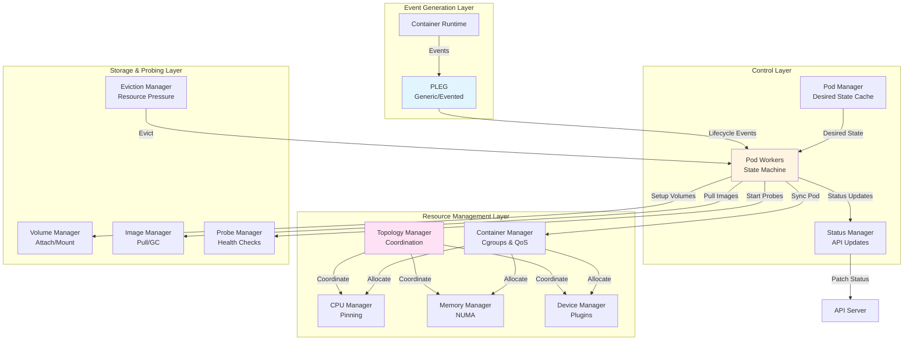
```mermaid
graph TB
    subgraph "Event Generation Layer"
        PLEG[PLEG<br/>Generic/Evented]
        CRI[Container Runtime]
    end

    subgraph "Control Layer"
        PodWorkers[Pod Workers<br/>State Machine]
        StatusMgr[Status Manager<br/>API Updates]
        PodMgr[Pod Manager<br/>Desired State Cache]
    end

    subgraph "Resource Management Layer"
        ContainerMgr[Container Manager<br/>Cgroups & QoS]
        CPUMgr[CPU Manager<br/>Pinning]
        MemMgr[Memory Manager<br/>NUMA]
        DevMgr[Device Manager<br/>Plugins]
        TopoMgr[Topology Manager<br/>Coordination]
    end

    subgraph "Storage & Probing Layer"
        VolMgr[Volume Manager<br/>Attach/Mount]
        ImgMgr[Image Manager<br/>Pull/GC]
        ProbeMgr[Probe Manager<br/>Health Checks]
        EvictionMgr[Eviction Manager<br/>Resource Pressure]
    end

    CRI -->|Events| PLEG
    PLEG -->|Lifecycle Events| PodWorkers
    PodMgr -->|Desired State| PodWorkers
    PodWorkers -->|Status Updates| StatusMgr
    StatusMgr -->|Patch Status| API[API Server]

    PodWorkers -->|Sync Pod| ContainerMgr
    PodWorkers -->|Setup Volumes| VolMgr
    PodWorkers -->|Pull Images| ImgMgr
    PodWorkers -->|Start Probes| ProbeMgr

    TopoMgr -->|Coordinate| CPUMgr
    TopoMgr -->|Coordinate| MemMgr
    TopoMgr -->|Coordinate| DevMgr
    ContainerMgr -->|Allocate| CPUMgr
    ContainerMgr -->|Allocate| MemMgr
    ContainerMgr -->|Allocate| DevMgr

    EvictionMgr -->|Evict| PodWorkers

    style PLEG fill:#e1f5ff
    style PodWorkers fill:#fff4e1
    style TopoMgr fill:#ffe1f5
```

## Component Overview

The kubelet architecture divides responsibilities across 14+ major components, each with specific concerns:

| Component | Primary Responsibility | Key Interface | State Management |
|-----------|----------------------|---------------|------------------|
| **PLEG** | Container event detection | `PodLifecycleEventGenerator` | Stateless event stream |
| **Pod Workers** | Pod lifecycle orchestration | `PodWorkers` | Per-pod state machine |
| **Pod Manager** | Desired state cache | `pod.Manager` | In-memory pod cache |
| **Status Manager** | API server status sync | `status.Manager` | Versioned status queue |
| **Container Manager** | Resource isolation | `cm.ContainerManager` | Cgroup hierarchy |
| **Volume Manager** | Volume lifecycle | `volumemanager.VolumeManager` | Desired/actual state |
| **Image Manager** | Image operations | `images.ImageManager` | Image cache & backoff |
| **Probe Manager** | Health checking | `prober.Manager` | Probe results cache |
| **Eviction Manager** | Resource pressure | `eviction.Manager` | Threshold observations |
| **Device Manager** | Device plugin integration | `devicemanager.Manager` | Device allocations |
| **CPU Manager** | CPU allocation | `cpumanager.Manager` | CPU assignment state |
| **Memory Manager** | Memory allocation | `memorymanager.Manager` | NUMA assignment state |
| **Topology Manager** | Resource coordination | `topologymanager.Manager` | Topology hints |

**Source References:**
- `/pkg/kubelet/kubelet.go` (lines 276-499) - Main kubelet struct with all component fields
- `/pkg/kubelet/pleg/pleg.go` (lines 66-75) - PLEG interface definition
- `/pkg/kubelet/pod_workers.go` - Pod workers implementation
- `/pkg/kubelet/pod/pod_manager.go` (lines 30-101) - Pod manager interface

### Component Initialization Flow

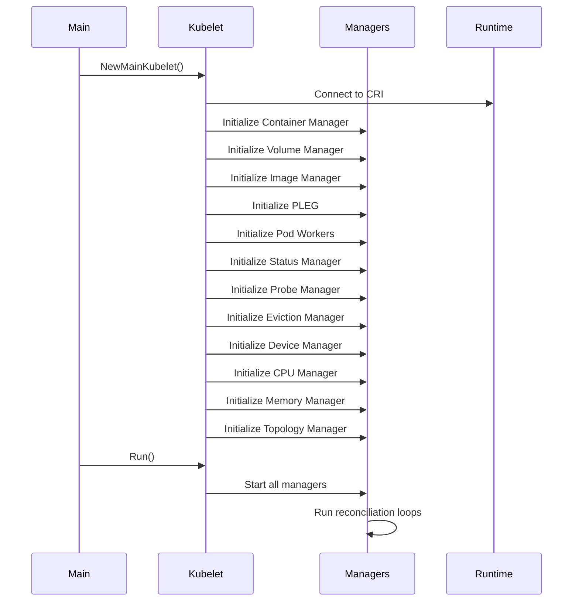
```mermaid
sequenceDiagram
    participant Main
    participant Kubelet
    participant Managers
    participant Runtime

    Main->>Kubelet: NewMainKubelet()
    Kubelet->>Runtime: Connect to CRI
    Kubelet->>Managers: Initialize Container Manager
    Kubelet->>Managers: Initialize Volume Manager
    Kubelet->>Managers: Initialize Image Manager
    Kubelet->>Managers: Initialize PLEG
    Kubelet->>Managers: Initialize Pod Workers
    Kubelet->>Managers: Initialize Status Manager
    Kubelet->>Managers: Initialize Probe Manager
    Kubelet->>Managers: Initialize Eviction Manager
    Kubelet->>Managers: Initialize Device Manager
    Kubelet->>Managers: Initialize CPU Manager
    Kubelet->>Managers: Initialize Memory Manager
    Kubelet->>Managers: Initialize Topology Manager

    Main->>Kubelet: Run()
    Kubelet->>Managers: Start all managers
    Managers->>Managers: Run reconciliation loops
```

## PLEG (Pod Lifecycle Event Generator)

PLEG is the kubelet's event detection subsystem that discovers container state changes and generates lifecycle events. It serves as the primary mechanism for the kubelet to react to container runtime changes asynchronously.

### Architecture

PLEG has two implementations:

1. **Generic PLEG**: Polling-based implementation using periodic relisting
2. **Evented PLEG**: Event-driven implementation using CRI event streams

Both implementations satisfy the `PodLifecycleEventGenerator` interface and can run simultaneously with Generic PLEG as a fallback.

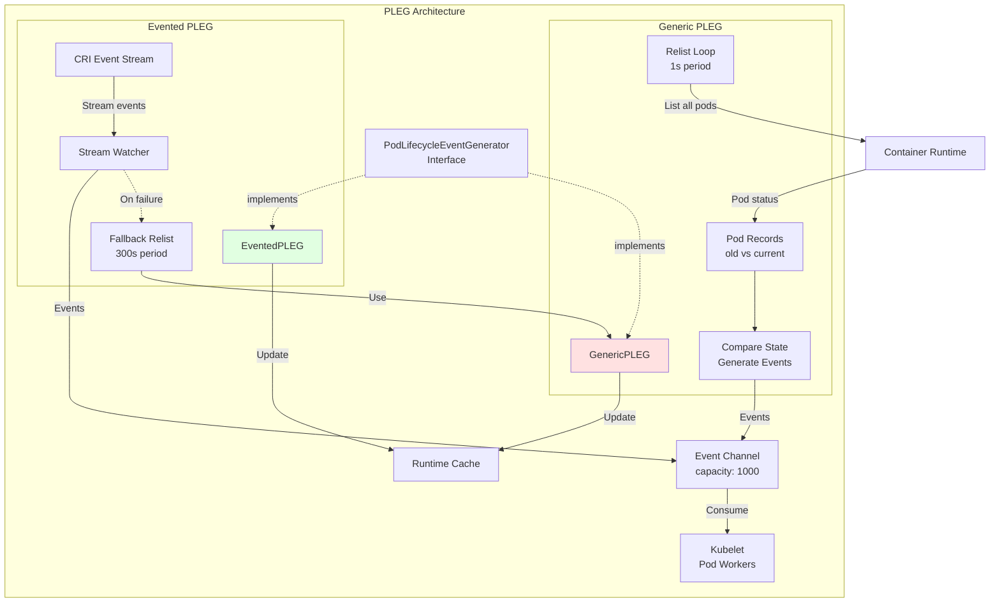
```mermaid
graph TB
    subgraph "PLEG Architecture"
        Interface[PodLifecycleEventGenerator<br/>Interface]

        subgraph "Generic PLEG"
            GenPLEG[GenericPLEG]
            RelistLoop[Relist Loop<br/>1s period]
            PodRecords[Pod Records<br/>old vs current]
            CompareState[Compare State<br/>Generate Events]
        end

        subgraph "Evented PLEG"
            EvPLEG[EventedPLEG]
            StreamWatch[Stream Watcher]
            CRIEvents[CRI Event Stream]
            FallbackRelist[Fallback Relist<br/>300s period]
        end

        Cache[Runtime Cache]
        EventChan[Event Channel<br/>capacity: 1000]
        Subscribers[Kubelet<br/>Pod Workers]
    end

    Interface -.->|implements| GenPLEG
    Interface -.->|implements| EvPLEG

    RelistLoop -->|List all pods| Runtime[Container Runtime]
    Runtime -->|Pod status| PodRecords
    PodRecords --> CompareState
    CompareState -->|Events| EventChan

    CRIEvents -->|Stream events| StreamWatch
    StreamWatch -->|Events| EventChan
    StreamWatch -.->|On failure| FallbackRelist
    FallbackRelist -->|Use| GenPLEG

    GenPLEG -->|Update| Cache
    EvPLEG -->|Update| Cache

    EventChan -->|Consume| Subscribers

    style GenPLEG fill:#ffe1e1
    style EvPLEG fill:#e1ffe1
```

**Source Reference:**
- `/pkg/kubelet/pleg/pleg.go` (lines 66-88) - PLEG interface definition
- `/pkg/kubelet/pleg/generic.go` (lines 38-85) - Generic PLEG struct
- `/pkg/kubelet/pleg/evented.go` (lines 63-88) - Evented PLEG struct

### Generic PLEG

Generic PLEG relies on periodic relisting to detect container changes by comparing successive snapshots.

**Key characteristics:**
- **Relist period**: 1 second (configurable)
- **Relist threshold**: 3 minutes (unhealthy if exceeded)
- **Event channel capacity**: 1000 events
- **State tracking**: Maintains old and current pod records

```go
// Source: /pkg/kubelet/pleg/generic.go (lines 53-85)
type GenericPLEG struct {
    runtime kubecontainer.Runtime
    eventChannel chan *PodLifecycleEvent
    podRecords podRecords              // old vs current state
    relistTime atomic.Value             // last relist timestamp
    cache kubecontainer.Cache           // runtime state cache
    clock clock.Clock
    podsToReinspect map[types.UID]*kubecontainer.Pod
    stopCh chan struct{}
    relistLock sync.Mutex
    isRunning bool
    runningMu sync.Mutex
    relistDuration *RelistDuration
    logger klog.Logger
    watchConditions map[types.UID]map[string]versionedWatchCondition
    watchConditionsLock sync.Mutex
}
```

**Event generation algorithm:**

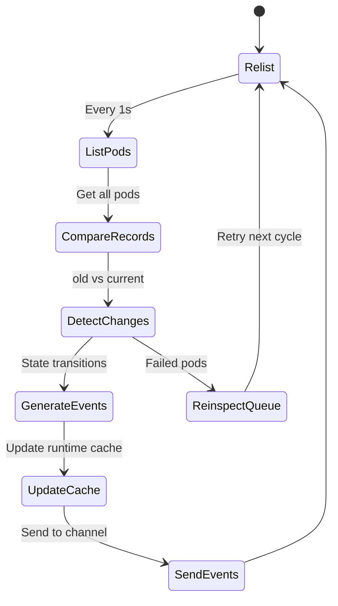
```mermaid
stateDiagram-v2
    [*] --> Relist
    Relist --> ListPods: Every 1s
    ListPods --> CompareRecords: Get all pods
    CompareRecords --> DetectChanges: old vs current
    DetectChanges --> GenerateEvents: State transitions
    GenerateEvents --> UpdateCache: Update runtime cache
    UpdateCache --> SendEvents: Send to channel
    SendEvents --> Relist

    DetectChanges --> ReinspectQueue: Failed pods
    ReinspectQueue --> Relist: Retry next cycle
```

**Generated event types:**

| Event Type | Trigger Condition | Data Field |
|------------|------------------|------------|
| `ContainerStarted` | Container state → Running | Container name |
| `ContainerDied` | Container state → Exited | Container name |
| `ContainerRemoved` | Container no longer exists | Container name |
| `ContainerChanged` | Container state → Unknown | Container name |
| `PodSync` | Complex state change | nil |
| `ConditionMet` | Watch condition satisfied | Condition key |

**Source Reference:**
- `/pkg/kubelet/pleg/pleg.go` (lines 38-52) - Event type definitions
- `/pkg/kubelet/kubelet.go` (lines 196-208) - PLEG configuration constants

### Evented PLEG

Evented PLEG leverages CRI runtime event streams for real-time event detection, reducing the need for frequent relisting.

**Key characteristics:**
- **Event stream**: Continuous connection to CRI runtime
- **Fallback relist period**: 300 seconds (vs 1s for Generic)
- **Max stream retries**: 5 attempts before falling back
- **Global cache updates**: 5 second period to prevent stuckness

```go
// Source: /pkg/kubelet/pleg/evented.go (lines 63-88)
type EventedPLEG struct {
    runtime kubecontainer.Runtime
    runtimeService internalapi.RuntimeService
    eventChannel chan *PodLifecycleEvent
    cache kubecontainer.Cache
    clock clock.Clock
    genericPleg podLifecycleEventGeneratorHandler  // fallback
    eventedPlegMaxStreamRetries int                // max 5 retries
    relistDuration *RelistDuration
    stopCh chan struct{}
    stopCacheUpdateCh chan struct{}
    runningMu sync.Mutex
    logger klog.Logger
}
```

**Evented PLEG operation flow:**

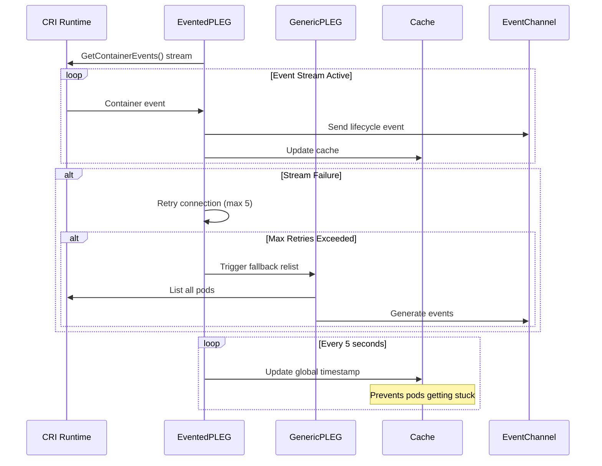
```mermaid
sequenceDiagram
    participant Runtime as CRI Runtime
    participant EventedPLEG
    participant GenericPLEG
    participant Cache
    participant EventChannel

    EventedPLEG->>Runtime: GetContainerEvents() stream

    loop Event Stream Active
        Runtime->>EventedPLEG: Container event
        EventedPLEG->>EventChannel: Send lifecycle event
        EventedPLEG->>Cache: Update cache
    end

    alt Stream Failure
        EventedPLEG->>EventedPLEG: Retry connection (max 5)
        alt Max Retries Exceeded
            EventedPLEG->>GenericPLEG: Trigger fallback relist
            GenericPLEG->>Runtime: List all pods
            GenericPLEG->>EventChannel: Generate events
        end
    end

    loop Every 5 seconds
        EventedPLEG->>Cache: Update global timestamp
        Note over Cache: Prevents pods getting stuck
    end
```

**Source Reference:**
- `/pkg/kubelet/pleg/evented.go` (lines 35-38) - Global cache update period
- `/pkg/kubelet/kubelet.go` (lines 210-213) - Evented PLEG configuration

### PLEG Health Checking

PLEG health is critical for kubelet readiness. The kubelet monitors PLEG health and reports it via the `/healthz` endpoint.

**Health criteria:**
- Generic PLEG: Relist completed within threshold (3 minutes)
- Evented PLEG: Event stream active or fallback relist healthy

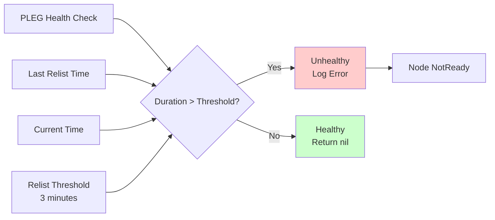
```mermaid
graph LR
    Health[PLEG Health Check]
    LastRelist[Last Relist Time]
    CurrentTime[Current Time]
    Threshold[Relist Threshold<br/>3 minutes]

    Health --> Check{Duration > Threshold?}
    LastRelist --> Check
    CurrentTime --> Check
    Threshold --> Check

    Check -->|Yes| Unhealthy[Unhealthy<br/>Log Error]
    Check -->|No| Healthy[Healthy<br/>Return nil]

    Unhealthy --> NodeNotReady[Node NotReady]

    style Unhealthy fill:#ffcccc
    style Healthy fill:#ccffcc
```

## Pod Workers

Pod Workers are the heart of the kubelet's pod lifecycle orchestration. Each pod gets a dedicated goroutine (pod worker) that drives it through its lifecycle state machine.

### Architecture

The pod workers implement a state machine with three primary states: syncing, terminating, and terminated. Each worker processes updates sequentially while allowing concurrent processing across different pods.

```go
// Source: /pkg/kubelet/pod_workers.go (type podWorkers struct)
type podWorkers struct {
    podLock sync.Mutex
    podsSynced bool

    // One channel per pod UID for signaling updates
    podUpdates map[types.UID]chan struct{}

    // Lifecycle state per pod
    podSyncStatuses map[types.UID]*podSyncStatus

    // Static pod tracking
    startedStaticPodsByFullname map[string]types.UID
    waitingToStartStaticPodsByFullname map[string][]types.UID

    workQueue queue.WorkQueue
    podSyncer podSyncer  // Kubelet's syncPod method
    workerChannelFn func(uid types.UID, in chan struct{}) <-chan struct{}
    recorder record.EventRecorder
    backOffPeriod time.Duration    // 10 seconds
    resyncInterval time.Duration
    podCache kubecontainer.Cache
    allocationManager allocation.Manager
    clock clock.PassiveClock
}
```

**Source Reference:**
- `/pkg/kubelet/pod_workers.go` - Complete pod workers implementation
- `/pkg/kubelet/kubelet.go` (lines 217) - backOffPeriod constant

### Pod Worker State Machine

Each pod worker maintains strict lifecycle states and transitions:

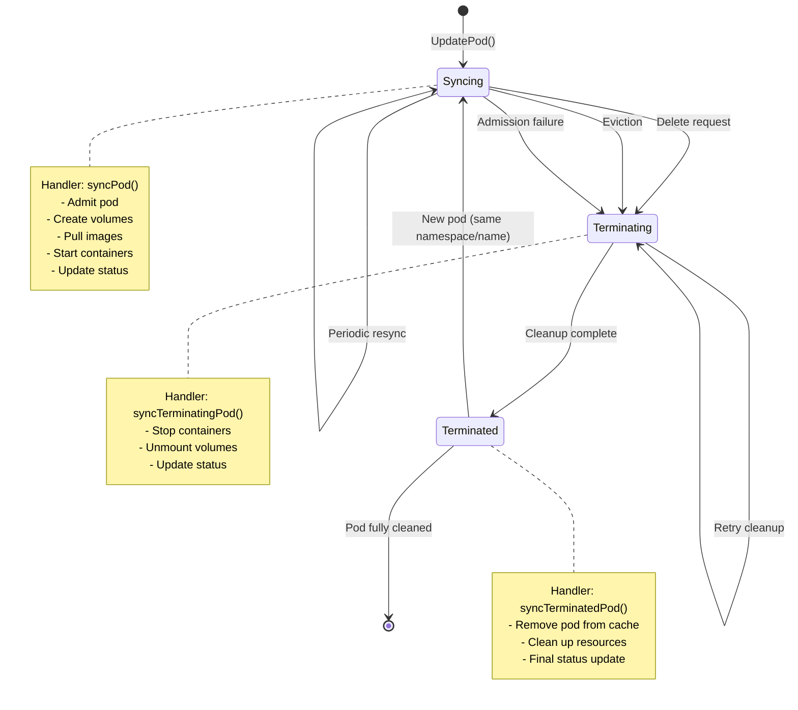
```mermaid
stateDiagram-v2
    [*] --> Syncing: UpdatePod()

    Syncing --> Syncing: Pod update
    Syncing --> Syncing: Periodic resync
    Syncing --> Terminating: Delete request
    Syncing --> Terminating: Eviction
    Syncing --> Terminating: Admission failure

    Terminating --> Terminated: Cleanup complete
    Terminating --> Terminating: Retry cleanup

    Terminated --> [*]: Pod fully cleaned
    Terminated --> Syncing: New pod (same namespace/name)

    note right of Syncing
        Handler: syncPod()
        - Admit pod
        - Create volumes
        - Pull images
        - Start containers
        - Update status
    end note

    note right of Terminating
        Handler: syncTerminatingPod()
        - Stop containers
        - Unmount volumes
        - Update status
    end note

    note right of Terminated
        Handler: syncTerminatedPod()
        - Remove pod from cache
        - Clean up resources
        - Final status update
    end note
```

### Pod Worker Goroutine Model

The kubelet spawns one goroutine per pod that persists throughout the pod's lifecycle:

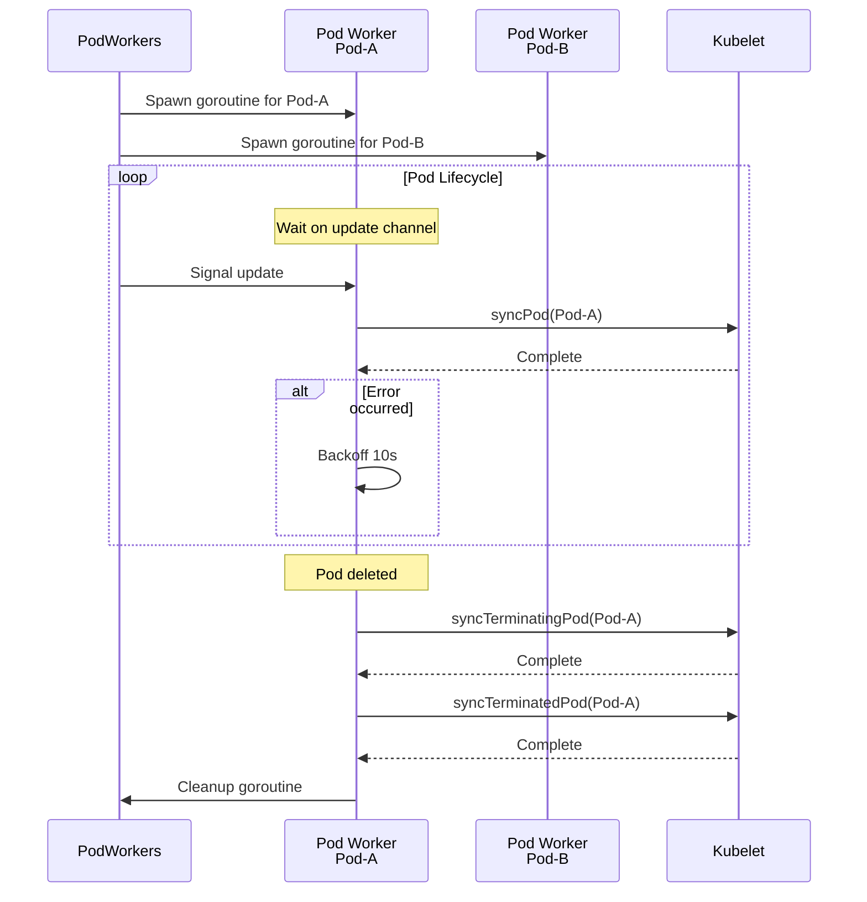
```mermaid
sequenceDiagram
    participant PodWorkers
    participant Worker1 as Pod Worker<br/>Pod-A
    participant Worker2 as Pod Worker<br/>Pod-B
    participant Kubelet

    PodWorkers->>Worker1: Spawn goroutine for Pod-A
    PodWorkers->>Worker2: Spawn goroutine for Pod-B

    loop Pod Lifecycle
        Note over Worker1: Wait on update channel
        PodWorkers->>Worker1: Signal update
        Worker1->>Kubelet: syncPod(Pod-A)
        Kubelet-->>Worker1: Complete

        alt Error occurred
            Worker1->>Worker1: Backoff 10s
        end
    end

    Note over Worker1: Pod deleted
    Worker1->>Kubelet: syncTerminatingPod(Pod-A)
    Kubelet-->>Worker1: Complete
    Worker1->>Kubelet: syncTerminatedPod(Pod-A)
    Kubelet-->>Worker1: Complete
    Worker1->>PodWorkers: Cleanup goroutine
```

**Key characteristics:**
- **Concurrency**: One goroutine per pod, all pods processed in parallel
- **Serialization**: Updates for same pod processed sequentially
- **Backoff**: 10-second backoff on sync errors
- **Persistence**: Worker goroutine persists until pod fully terminated

**Source Reference:**
- `/pkg/kubelet/kubelet.go` (lines 217) - backOffPeriod = 10 seconds

### Pod Worker Interfaces

The pod workers interact with the kubelet through the `podSyncer` interface:

| Method | State | Purpose |
|--------|-------|---------|
| `SyncPod()` | Syncing | Create/update running pod |
| `SyncTerminatingPod()` | Terminating | Stop pod gracefully |
| `SyncTerminatedPod()` | Terminated | Final cleanup |
| `SyncKnownPods()` | - | Reconcile all pod state |

### Static Pod Handling

Pod workers maintain special tracking for static pods to prevent duplicate UIDs:

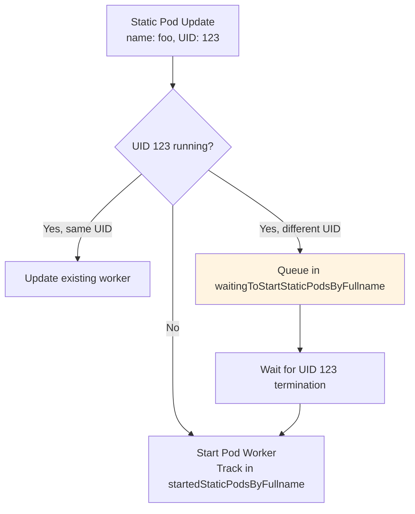
```mermaid
graph TB
    StaticPod[Static Pod Update<br/>name: foo, UID: 123]

    Check{UID 123 running?}
    StaticPod --> Check

    Check -->|No| Start[Start Pod Worker<br/>Track in startedStaticPodsByFullname]
    Check -->|Yes, same UID| Update[Update existing worker]
    Check -->|Yes, different UID| Queue[Queue in waitingToStartStaticPodsByFullname]

    Queue --> Wait[Wait for UID 123 termination]
    Wait --> Start

    style Queue fill:#fff4e1
```

**Static pod guarantees:**
- Only one static pod with a given fullname (namespace+name) can run at a time
- New static pods wait for old ones to fully terminate before starting
- Prevents UID conflicts and ensures clean transitions

## Pod Manager

The Pod Manager maintains an in-memory cache of the desired pod state on the node. It serves as the source of truth for which pods should be running.

### Architecture

The Pod Manager abstracts pod storage and provides efficient lookups by various keys while handling the complexity of static pods and mirror pods.

```go
// Source: /pkg/kubelet/pod/pod_manager.go (lines 45-101)
type Manager interface {
    // Lookup methods
    GetPodByFullName(podFullName string) (*v1.Pod, bool)
    GetPodByName(namespace, name string) (*v1.Pod, bool)
    GetPodByUID(types.UID) (*v1.Pod, bool)
    GetPodByMirrorPod(*v1.Pod) (*v1.Pod, bool)
    GetMirrorPodByPod(*v1.Pod) (*v1.Pod, bool)
    GetPodAndMirrorPod(*v1.Pod) (pod, mirrorPod *v1.Pod, wasMirror bool)

    // List methods
    GetPods() []*v1.Pod
    GetPodsAndMirrorPods() (allPods, allMirrorPods []*v1.Pod, orphanedMirrorPodFullnames []string)
    GetStaticPodToMirrorPodMap() map[*v1.Pod]*v1.Pod

    // Mutation methods
    SetPods(pods []*v1.Pod)
    AddPod(pod *v1.Pod)
    UpdatePod(pod *v1.Pod)
    RemovePod(pod *v1.Pod)

    // UID translation for mirror pods
    TranslatePodUID(uid types.UID) kubetypes.ResolvedPodUID
    GetUIDTranslations() (podToMirror, mirrorToPod map[kubetypes.ResolvedPodUID]kubetypes.MirrorPodUID)

    // Orphan management
    GetOrphans() []types.UID
    SetOrphans(orphans []types.UID)
    IsPodDeletionInProgress(podUID types.UID) bool
}
```

**Source Reference:**
- `/pkg/kubelet/pod/pod_manager.go` (lines 30-101) - Full Manager interface

### Pod Manager Data Model

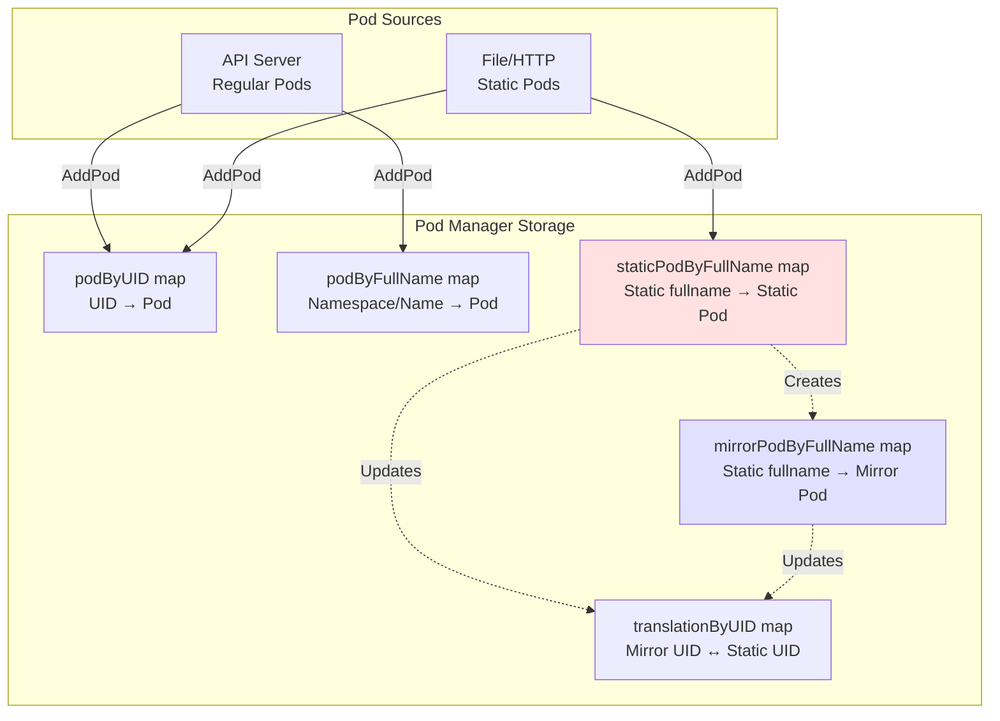
```mermaid
graph TB
    subgraph "Pod Manager Storage"
        PodByUID[podByUID map<br/>UID → Pod]
        PodByFullName[podByFullName map<br/>Namespace/Name → Pod]

        MirrorPodByFullName[mirrorPodByFullName map<br/>Static fullname → Mirror Pod]
        StaticPodByFullName[staticPodByFullName map<br/>Static fullname → Static Pod]

        TranslationMap[translationByUID map<br/>Mirror UID ↔ Static UID]
    end

    subgraph "Pod Sources"
        APIServer[API Server<br/>Regular Pods]
        StaticFile[File/HTTP<br/>Static Pods]
    end

    APIServer -->|AddPod| PodByUID
    APIServer -->|AddPod| PodByFullName

    StaticFile -->|AddPod| PodByUID
    StaticFile -->|AddPod| StaticPodByFullName

    StaticPodByFullName -.->|Creates| MirrorPodByFullName
    StaticPodByFullName -.->|Updates| TranslationMap
    MirrorPodByFullName -.->|Updates| TranslationMap

    style StaticPodByFullName fill:#ffe1e1
    style MirrorPodByFullName fill:#e1e1ff
```

### Static Pods and Mirror Pods

The Pod Manager handles the complexity of static pods and their corresponding mirror pods in the API:

**Static Pod**: Defined via file or HTTP, not in API server
**Mirror Pod**: API server representation of a static pod

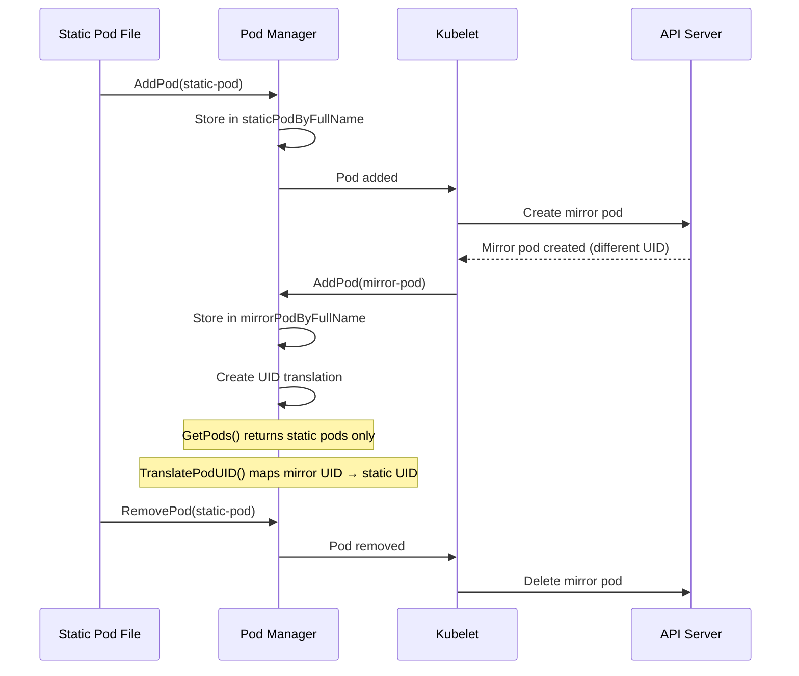
```mermaid
sequenceDiagram
    participant File as Static Pod File
    participant PodMgr as Pod Manager
    participant Kubelet
    participant API as API Server

    File->>PodMgr: AddPod(static-pod)
    PodMgr->>PodMgr: Store in staticPodByFullName
    PodMgr->>Kubelet: Pod added

    Kubelet->>API: Create mirror pod
    API-->>Kubelet: Mirror pod created (different UID)

    Kubelet->>PodMgr: AddPod(mirror-pod)
    PodMgr->>PodMgr: Store in mirrorPodByFullName
    PodMgr->>PodMgr: Create UID translation

    Note over PodMgr: GetPods() returns static pods only
    Note over PodMgr: TranslatePodUID() maps mirror UID → static UID

    File->>PodMgr: RemovePod(static-pod)
    PodMgr->>Kubelet: Pod removed
    Kubelet->>API: Delete mirror pod
```

**UID Translation:**

The Pod Manager provides UID translation to handle mirror pods transparently:

| Scenario | Input UID | Translated UID | Purpose |
|----------|-----------|----------------|---------|
| Static pod | Static UID | Static UID | No translation needed |
| Mirror pod | Mirror UID | Static UID | Map to actual pod |
| Regular pod | Pod UID | Pod UID | No translation needed |

**Source Reference:**
- `/pkg/kubelet/pod/pod_manager.go` (lines 30-44) - Static/mirror pod documentation

### Pod Manager Usage Patterns

Components interact with the Pod Manager differently based on their needs:

| Component | Primary Usage | Methods Used |
|-----------|--------------|--------------|
| Pod Workers | Get desired state for sync | `GetPodByUID()`, `GetPods()` |
| Status Manager | Status updates for running pods | `GetPodByUID()`, `TranslatePodUID()` |
| Volume Manager | Volume management for pods | `GetPods()` |
| Eviction Manager | List pods for eviction decisions | `GetPods()` |
| PLEG | UID translation for events | `TranslatePodUID()` |

## Status Manager

The Status Manager asynchronously updates pod status to the API server, batching updates and handling version conflicts to minimize API server load.

### Architecture

The Status Manager maintains a versioned status queue and sends updates asynchronously to decouple pod sync operations from API server communication.

```go
// Source: /pkg/kubelet/status/status_manager.go (lines 48-81)
type versionedPodStatus struct {
    version uint64           // monotonically increasing
    podName string
    podNamespace string
    at time.Time            // when status detected
    podIsFinished bool      // after SyncTerminatedPod
    status v1.PodStatus
}

type manager struct {
    kubeClient clientset.Interface
    podManager PodManager

    // Map from pod UID to sync status
    podStatuses map[types.UID]versionedPodStatus
    podResizeConditions map[types.UID]podResizeConditions
    podStatusesLock sync.RWMutex
    podStatusChannel chan struct{}

    // Version tracking for API updates
    apiStatusVersions map[kubetypes.MirrorPodUID]uint64

    podDeletionSafety PodDeletionSafetyProvider
    podStartupLatencyHelper PodStartupLatencyStateHelper
}
```

**Source Reference:**
- `/pkg/kubelet/status/status_manager.go` (lines 48-81) - Status manager struct

### Status Update Flow

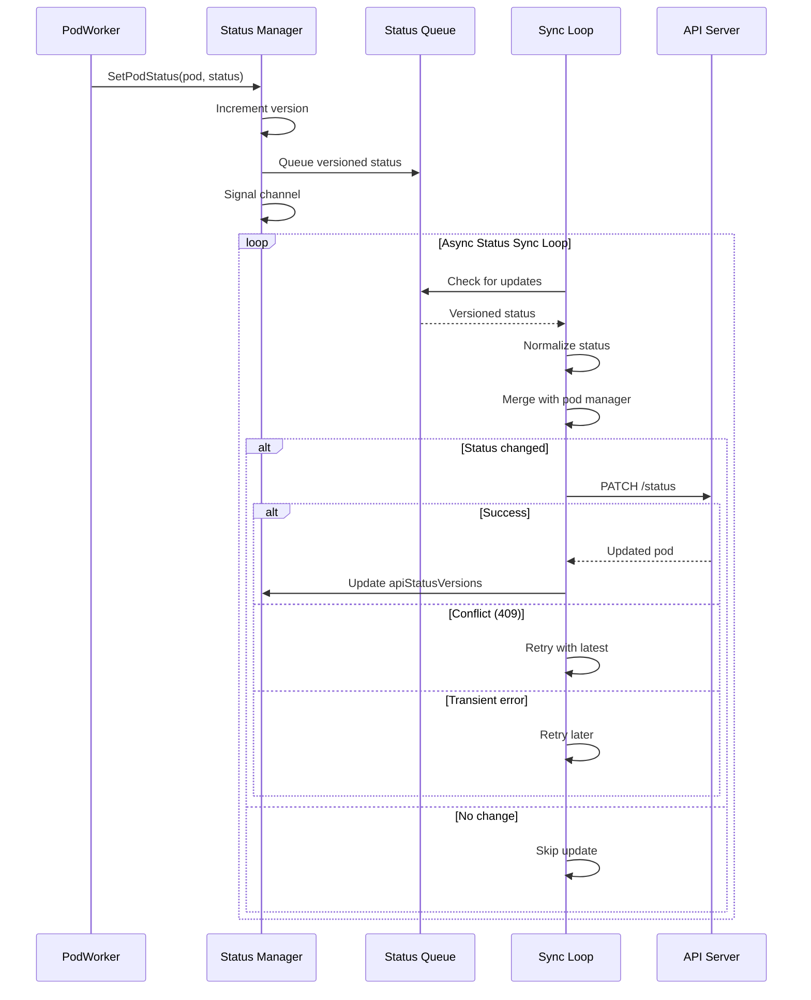
```mermaid
sequenceDiagram
    participant PodWorker
    participant StatusMgr as Status Manager
    participant StatusQueue as Status Queue
    participant SyncLoop as Sync Loop
    participant API as API Server

    PodWorker->>StatusMgr: SetPodStatus(pod, status)
    StatusMgr->>StatusMgr: Increment version
    StatusMgr->>StatusQueue: Queue versioned status
    StatusMgr->>StatusMgr: Signal channel

    loop Async Status Sync Loop
        SyncLoop->>StatusQueue: Check for updates
        StatusQueue-->>SyncLoop: Versioned status

        SyncLoop->>SyncLoop: Normalize status
        SyncLoop->>SyncLoop: Merge with pod manager

        alt Status changed
            SyncLoop->>API: PATCH /status
            alt Success
                API-->>SyncLoop: Updated pod
                SyncLoop->>StatusMgr: Update apiStatusVersions
            else Conflict (409)
                SyncLoop->>SyncLoop: Retry with latest
            else Transient error
                SyncLoop->>SyncLoop: Retry later
            end
        else No change
            SyncLoop->>SyncLoop: Skip update
        end
    end
```

### Status Versioning

The Status Manager uses monotonically increasing versions to prevent stale updates:

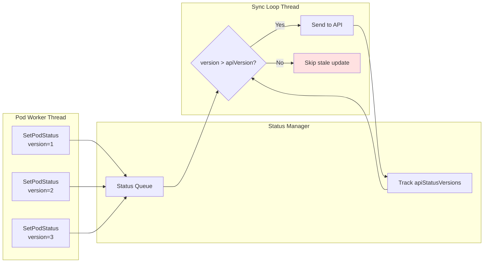
```mermaid
graph LR
    subgraph "Pod Worker Thread"
        Update1[SetPodStatus<br/>version=1]
        Update2[SetPodStatus<br/>version=2]
        Update3[SetPodStatus<br/>version=3]
    end

    subgraph "Status Manager"
        Queue[Status Queue]
        Version[Track apiStatusVersions]
    end

    subgraph "Sync Loop Thread"
        Check{version > apiVersion?}
        Send[Send to API]
        Skip[Skip stale update]
    end

    Update1 --> Queue
    Update2 --> Queue
    Update3 --> Queue

    Queue --> Check
    Version --> Check

    Check -->|Yes| Send
    Check -->|No| Skip

    Send --> Version

    style Skip fill:#ffe1e1
```

**Versioning guarantees:**
- Only newer versions are sent to API server
- Prevents race conditions between multiple update sources
- Handles API server conflicts gracefully

### Status Manager Key Features

| Feature | Implementation | Benefit |
|---------|---------------|----------|
| **Asynchronous updates** | Separate sync loop goroutine | Decouples pod sync from API latency |
| **Batching** | Debounced channel signaling | Reduces API server load |
| **Version tracking** | Per-pod monotonic versions | Prevents stale updates |
| **Conflict resolution** | Retry on 409 conflicts | Handles concurrent updates |
| **Normalization** | Canonical status representation | Ensures consistent API objects |
| **Pod deletion safety** | Checks before status updates | Prevents unsafe deletions |

### Status Normalization

Before sending status to API server, the Status Manager normalizes it:

1. **Sort container statuses**: Deterministic ordering
2. **Normalize condition timestamps**: Remove subsecond precision
3. **Merge conditions**: Deduplicate and reconcile
4. **Validate transitions**: Ensure valid state changes
5. **Add timestamps**: Record status observation time

**Source Reference:**
- `/pkg/kubelet/status/status_manager.go` (lines 48-96) - Status normalization logic

## Container Manager

The Container Manager enforces resource isolation and QoS policies using Linux cgroups. It manages the cgroup hierarchy and ensures containers receive their allocated resources.

### Architecture

```go
// Source: /pkg/kubelet/cm/container_manager.go (lines 66-100)
type ContainerManager interface {
    // Start the container manager
    Start(context.Context, *v1.Node, ActivePodsFunc, GetNodeFunc,
          config.SourcesReady, status.PodStatusProvider,
          internalapi.RuntimeService, bool) error

    // Resource limits
    SystemCgroupsLimit() v1.ResourceList
    GetNodeConfig() NodeConfig
    GetNodeAllocatableReservation() v1.ResourceList
    GetCapacity(localStorageCapacityIsolation bool) v1.ResourceList

    // Device plugin resources
    GetDevicePluginResourceCapacity() (v1.ResourceList, v1.ResourceList, []string)

    // Per-pod container management
    NewPodContainerManager() PodContainerManager

    // Status and health
    Status() Status
    GetMountedSubsystems() *CgroupSubsystems
    GetQOSContainersInfo() QOSContainersInfo

    // Plugin integrations
    GetPluginRegistrationHandler() cache.PluginHandler
    GetDevicePluginResourceCapacity() (v1.ResourceList, v1.ResourceList, []string)
    ShouldResetExtendedResourceCapacity() bool
    GetAllocateResourcesPodAdmitHandler() lifecycle.PodAdmitHandler

    // Resource updates
    UpdatePluginResources(*v1.Node, *lifecycle.PodAdmitAttributes) error
    InternalContainerLifecycle() InternalContainerLifecycle
    GetPodCgroupRoot() string
    GetResources(pod *v1.Pod, container *v1.Container) *kubecontainer.RunContainerOptions
    UpdateQOSCgroups() error
    GetNodeAllocatableAbsolute() v1.ResourceList
    PrepareDynamicResources(*v1.Pod) error
    UnprepareDynamicResources(*v1.Pod) error
    PodMightNeedToUnprepareResources(uidOfPod types.UID) bool
}
```

**Source Reference:**
- `/pkg/kubelet/cm/container_manager.go` (lines 66-143) - ContainerManager interface

### Cgroup Hierarchy

The Container Manager creates and manages a hierarchical cgroup structure:

```mermaid
graph TB
    Root[/ <br/>Root Cgroup]

    Root --> Kubelet[/kubelet<br/>Kubelet Daemon]
    Root --> System[/system.slice<br/>System Services]
    Root --> Kubepods[/kubepods<br/>All Kubernetes Pods]

    Kubepods --> Guaranteed[/kubepods/guaranteed<br/>QoS: Guaranteed]
    Kubepods --> Burstable[/kubepods/burstable<br/>QoS: Burstable]
    Kubepods --> BestEffort[/kubepods/besteffort<br/>QoS: BestEffort]

    Guaranteed --> Pod1[/kubepods/guaranteed/pod-abc<br/>Pod: my-app]
    Pod1 --> Container1[/kubepods/guaranteed/pod-abc/container-1<br/>Container: nginx]

    Burstable --> Pod2[/kubepods/burstable/pod-def<br/>Pod: worker]
    Pod2 --> Container2[/kubepods/burstable/pod-def/container-1<br/>Container: app]

    BestEffort --> Pod3[/kubepods/besteffort/pod-ghi<br/>Pod: batch]

    style Guaranteed fill:#ccffcc
    style Burstable fill:#ffffcc
    style BestEffort fill:#ffcccc
```

**Cgroup hierarchy purposes:**
- **QoS isolation**: Separate guaranteed, burstable, and best-effort pods
- **Resource limits**: Enforce CPU, memory, and other resource constraints
- **Eviction ordering**: Best-effort pods evicted first under pressure
- **Accounting**: Track resource usage per pod and container

### QoS Class Enforcement

The Container Manager enforces different QoS behaviors through cgroup settings:

| QoS Class | CPU Shares | CPU Quota | Memory Limit | OOM Score |
|-----------|------------|-----------|--------------|-----------|
| **Guaranteed** | High (1024/core) | Set to requests | Set to requests | -997 |
| **Burstable** | Proportional | None | Set to limits | 2-999 |
| **BestEffort** | Minimal (2) | None | None | 1000 |

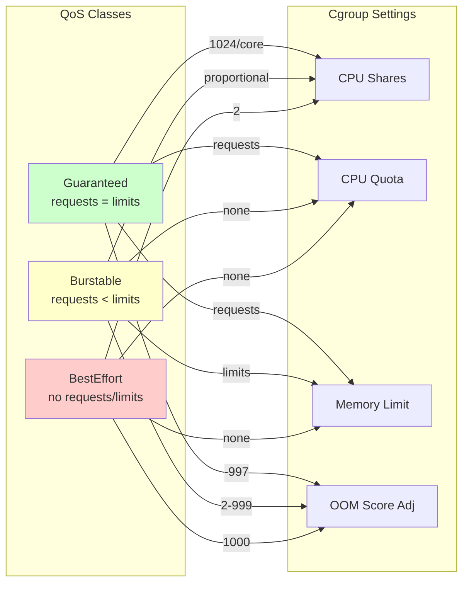
```mermaid
graph LR
    subgraph "QoS Classes"
        Guaranteed[Guaranteed<br/>requests = limits]
        Burstable[Burstable<br/>requests < limits]
        BestEffort[BestEffort<br/>no requests/limits]
    end

    subgraph "Cgroup Settings"
        CPUShares[CPU Shares]
        CPUQuota[CPU Quota]
        MemLimit[Memory Limit]
        OOMScore[OOM Score Adj]
    end

    Guaranteed -->|1024/core| CPUShares
    Guaranteed -->|requests| CPUQuota
    Guaranteed -->|requests| MemLimit
    Guaranteed -->|-997| OOMScore

    Burstable -->|proportional| CPUShares
    Burstable -->|none| CPUQuota
    Burstable -->|limits| MemLimit
    Burstable -->|2-999| OOMScore

    BestEffort -->|2| CPUShares
    BestEffort -->|none| CPUQuota
    BestEffort -->|none| MemLimit
    BestEffort -->|1000| OOMScore

    style Guaranteed fill:#ccffcc
    style Burstable fill:#ffffcc
    style BestEffort fill:#ffcccc
```

**Source Reference:**
- `/pkg/kubelet/cm/container_manager.go` (lines 50-59) - Cgroup warnings

### Resource Manager Integration

The Container Manager coordinates with specialized resource managers:

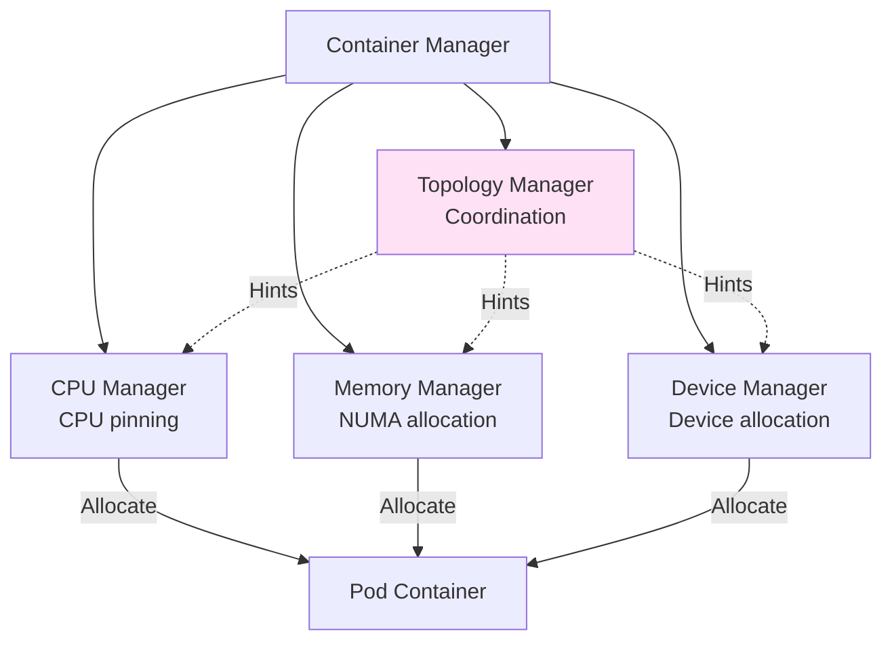
```mermaid
graph TB
    ContainerMgr[Container Manager]

    ContainerMgr --> CPUMgr[CPU Manager<br/>CPU pinning]
    ContainerMgr --> MemMgr[Memory Manager<br/>NUMA allocation]
    ContainerMgr --> DevMgr[Device Manager<br/>Device allocation]
    ContainerMgr --> TopoMgr[Topology Manager<br/>Coordination]

    TopoMgr -.->|Hints| CPUMgr
    TopoMgr -.->|Hints| MemMgr
    TopoMgr -.->|Hints| DevMgr

    CPUMgr -->|Allocate| Pod[Pod Container]
    MemMgr -->|Allocate| Pod
    DevMgr -->|Allocate| Pod

    style TopoMgr fill:#ffe1f5
```

**Integration points:**
1. **Admission**: Topology Manager validates resource alignment
2. **Allocation**: Specialized managers allocate resources
3. **Application**: Container Manager applies cgroup settings
4. **Reconciliation**: Periodic reconciliation ensures correctness

## Volume Manager

The Volume Manager handles the complete lifecycle of volumes attached to the node, ensuring volumes are attached, mounted, and unmounted at the right times.

### Architecture

The Volume Manager operates with two core concepts: desired state and actual state, continuously reconciling to make actual match desired.

```go
// Source: /pkg/kubelet/volumemanager/volume_manager.go (lines 98-158)
type VolumeManager interface {
    // Run starts all asynchronous loops
    Run(ctx context.Context, sourcesReady config.SourcesReady)

    // Volume operations
    WaitForAttachAndMount(ctx context.Context, pod *v1.Pod) error
    WaitForUnmount(ctx context.Context, pod *v1.Pod) error

    // State queries
    GetMountedVolumesForPod(podName types.UniquePodName) container.VolumeMap
    GetPossiblyMountedVolumesForPod(podName types.UniquePodName) container.VolumeMap
    GetExtraSupplementalGroupsForPod(pod *v1.Pod) []int64
    GetVolumesInUse() []v1.UniqueVolumeName
    ReconcilerStatesHasBeenSynced() bool
    VolumeIsAttached(volumeName v1.UniqueVolumeName) bool

    // Metrics
    GetReportedInUseDelay() time.Duration
    GetReportedInUsePercentile(float64) time.Duration

    // Cleanup
    MarkVolumesAsReportedInUse(volumesReportedAsInUse []v1.UniqueVolumeName)
}
```

**Source Reference:**
- `/pkg/kubelet/volumemanager/volume_manager.go` (lines 95-158) - VolumeManager interface
- `/pkg/kubelet/volumemanager/volume_manager.go` (lines 58-92) - Configuration constants

### Volume Manager Components

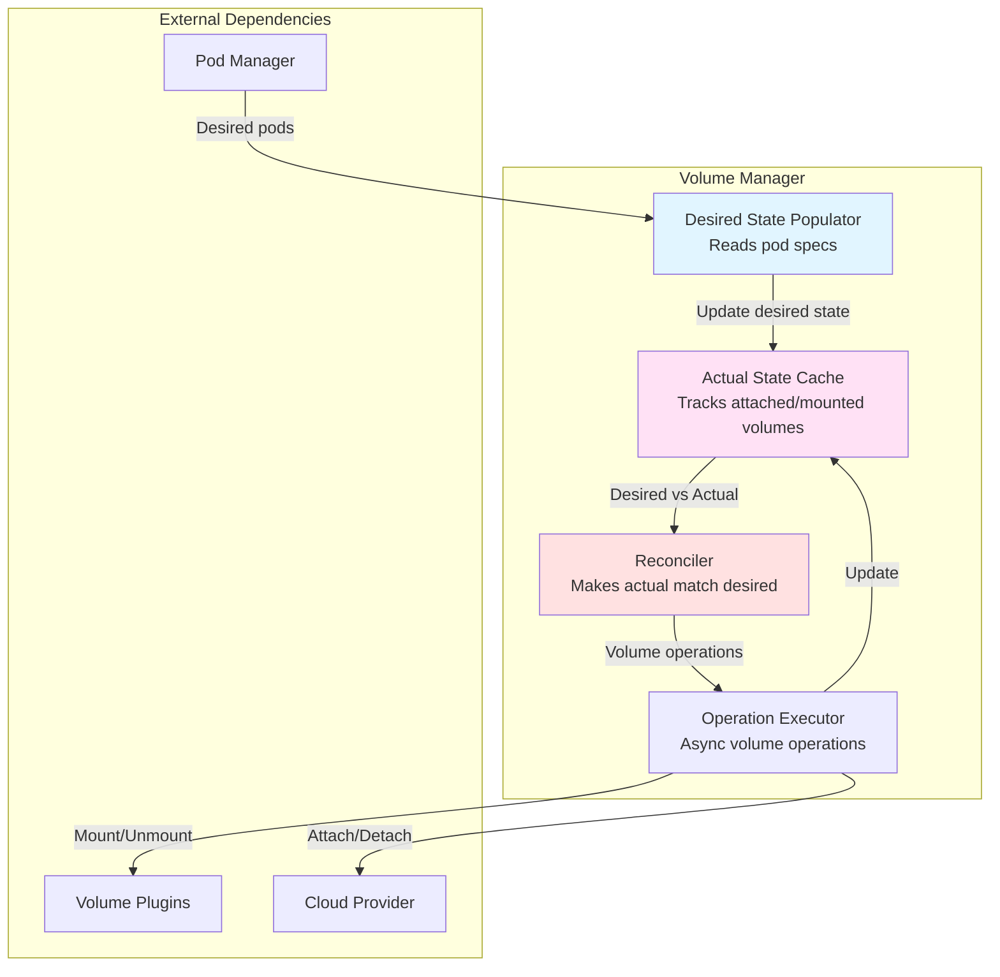
```mermaid
graph TB
    subgraph "Volume Manager"
        Populator[Desired State Populator<br/>Reads pod specs]
        Reconciler[Reconciler<br/>Makes actual match desired]
        Cache[Actual State Cache<br/>Tracks attached/mounted volumes]
        OpExecutor[Operation Executor<br/>Async volume operations]
    end

    subgraph "External Dependencies"
        PodMgr[Pod Manager]
        VolumePlugins[Volume Plugins]
        CloudProvider[Cloud Provider]
    end

    PodMgr -->|Desired pods| Populator
    Populator -->|Update desired state| Cache

    Cache -->|Desired vs Actual| Reconciler
    Reconciler -->|Volume operations| OpExecutor

    OpExecutor -->|Attach/Detach| CloudProvider
    OpExecutor -->|Mount/Unmount| VolumePlugins
    OpExecutor -->|Update| Cache

    style Populator fill:#e1f5ff
    style Reconciler fill:#ffe1e1
    style Cache fill:#ffe1f5
```

### Desired State Populator

The populator continuously scans pod manager for pods and builds the desired volume state:

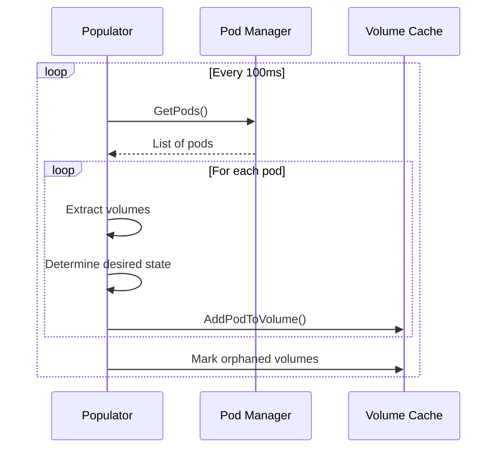
```mermaid
sequenceDiagram
    participant Populator
    participant PodMgr as Pod Manager
    participant Cache as Volume Cache

    loop Every 100ms
        Populator->>PodMgr: GetPods()
        PodMgr-->>Populator: List of pods

        loop For each pod
            Populator->>Populator: Extract volumes
            Populator->>Populator: Determine desired state
            Populator->>Cache: AddPodToVolume()
        end

        Populator->>Cache: Mark orphaned volumes
    end
```

**Populator responsibilities:**
- Read pod specs and extract volume references
- Determine which volumes should be attached/mounted
- Mark volumes for deletion when pods removed
- Handle volume reconstruction for existing mounts
- Track SELinux relabeling requirements

**Source Reference:**
- `/pkg/kubelet/volumemanager/volume_manager.go` (lines 63-65) - Populator loop period

### Reconciler

The reconciler makes the actual state match the desired state through asynchronous operations:

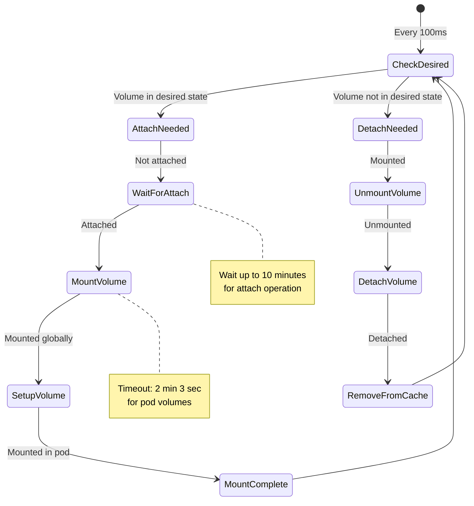
```mermaid
stateDiagram-v2
    [*] --> CheckDesired: Every 100ms

    CheckDesired --> AttachNeeded: Volume in desired state
    CheckDesired --> DetachNeeded: Volume not in desired state

    AttachNeeded --> WaitForAttach: Not attached
    WaitForAttach --> MountVolume: Attached
    MountVolume --> SetupVolume: Mounted globally
    SetupVolume --> MountComplete: Mounted in pod
    MountComplete --> CheckDesired

    DetachNeeded --> UnmountVolume: Mounted
    UnmountVolume --> DetachVolume: Unmounted
    DetachVolume --> RemoveFromCache: Detached
    RemoveFromCache --> CheckDesired

    note right of WaitForAttach
        Wait up to 10 minutes
        for attach operation
    end note

    note right of MountVolume
        Timeout: 2 min 3 sec
        for pod volumes
    end note
```

**Reconciler operations:**

| Operation | Condition | Timeout | Async |
|-----------|-----------|---------|-------|
| `AttachVolume` | Volume not attached | 10 minutes | Yes |
| `MountVolume` | Volume attached, not mounted | 2m 3s | Yes |
| `UnmountVolume` | Volume mounted, pod deleted | None | Yes |
| `DetachVolume` | Volume unmounted, pod deleted | None | Yes |
| `ExpandVolume` | Volume needs expansion | Varies | Yes |

**Source Reference:**
- `/pkg/kubelet/volumemanager/volume_manager.go` (lines 59-61) - Reconciler loop period
- `/pkg/kubelet/volumemanager/volume_manager.go` (lines 74-76) - Pod attach timeout
- `/pkg/kubelet/volumemanager/volume_manager.go` (lines 82-88) - Wait for attach timeout

### Volume State Cache

The cache maintains the authoritative actual state of all volumes:

| Cache Entry | Information Tracked |
|-------------|-------------------|
| **Attached volumes** | Volume name, node name, plugin, spec |
| **Mounted volumes** | Pod UID, volume name, mount path, SELinux context |
| **Uncertain volumes** | Volumes that might be mounted (kubelet restart) |
| **Failed operations** | Volumes with recent failures, backoff state |

### Volume Operation Flow

Complete flow for mounting a volume when a pod starts:

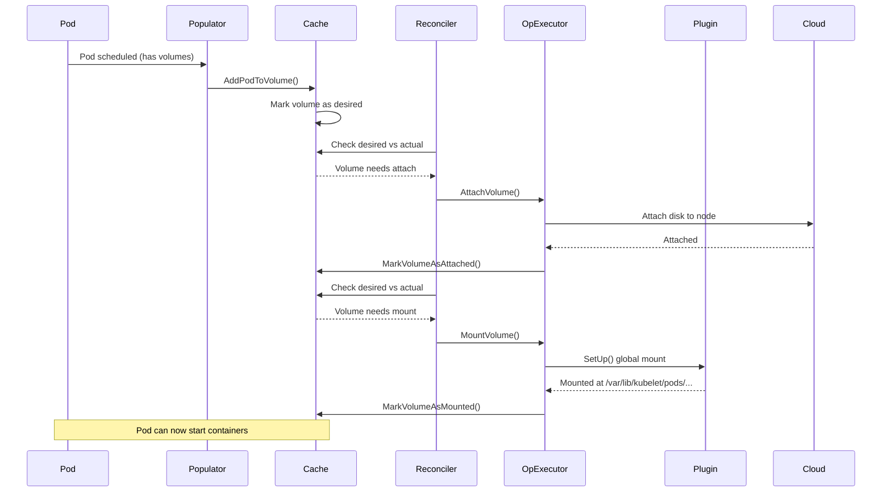
```mermaid
sequenceDiagram
    participant Pod
    participant Populator
    participant Cache
    participant Reconciler
    participant OpExecutor
    participant Plugin
    participant Cloud

    Pod->>Populator: Pod scheduled (has volumes)
    Populator->>Cache: AddPodToVolume()
    Cache->>Cache: Mark volume as desired

    Reconciler->>Cache: Check desired vs actual
    Cache-->>Reconciler: Volume needs attach

    Reconciler->>OpExecutor: AttachVolume()
    OpExecutor->>Cloud: Attach disk to node
    Cloud-->>OpExecutor: Attached
    OpExecutor->>Cache: MarkVolumeAsAttached()

    Reconciler->>Cache: Check desired vs actual
    Cache-->>Reconciler: Volume needs mount

    Reconciler->>OpExecutor: MountVolume()
    OpExecutor->>Plugin: SetUp() global mount
    Plugin-->>OpExecutor: Mounted at /var/lib/kubelet/pods/...
    OpExecutor->>Cache: MarkVolumeAsMounted()

    Note over Pod,Cache: Pod can now start containers
```

## Image Manager

The Image Manager handles container image pulling and garbage collection, ensuring required images are available while managing disk space efficiently.

### Architecture

```go
// Source: /pkg/kubelet/images/image_manager.go (lines 52-100)
type imageManager struct {
    recorder record.EventRecorder
    imageService kubecontainer.ImageService
    imagePullManager pullmanager.ImagePullManager
    backOff *flowcontrol.Backoff
    prevPullErrMsg sync.Map

    puller imagePuller              // serial or parallel
    nodeKeyring credentialprovider.DockerKeyring
    podPullingTimeRecorder ImagePodPullingTimeRecorder
}

type ImageManager interface {
    // Pull images for a pod
    EnsureImageExists(ctx context.Context, pod *v1.Pod, container *v1.Container,
                      pullSecrets []v1.Secret, podSandboxConfig *runtimeapi.PodSandboxConfig) (string, string, error)

    // Garbage collection
    GarbageCollect(ctx context.Context, desiredContainers []kubecontainer.Container,
                   allSourcesReady bool) error
}
```

**Source Reference:**
- `/pkg/kubelet/images/image_manager.go` (lines 52-100) - Image manager implementation

### Image Pulling Strategies

The Image Manager supports two pulling strategies:

```mermaid
graph TB
    subgraph "Serial Image Puller"
        SerialQueue[Pull Queue FIFO]
        SerialWorker[Single Worker]
        SerialQueue --> SerialWorker
    end

    subgraph "Parallel Image Puller"
        ParallelQueue[Pull Requests]
        Worker1[Worker 1]
        Worker2[Worker 2]
        WorkerN[Worker N]
        Semaphore[Semaphore<br/>Max parallel pulls]

        ParallelQueue --> Semaphore
        Semaphore --> Worker1
        Semaphore --> Worker2
        Semaphore --> WorkerN
    end

    Config{SerializeImagePulls?}
    Config -->|true| SerialQueue
    Config -->|false| ParallelQueue

    style SerialQueue fill:#ffe1e1
    style ParallelQueue fill:#e1ffe1
```

**Strategy comparison:**

| Strategy | Concurrency | Use Case | Performance |
|----------|-------------|----------|-------------|
| **Serial** | 1 pull at a time | Shared image registry, rate limiting | Slower, predictable |
| **Parallel** | N pulls (configurable) | Fast local registry, no rate limits | Faster, more load |

**Configuration:**
- `--serialize-image-pulls=true/false`
- `--max-parallel-image-pulls=N` (when parallel)

**Source Reference:**
- `/pkg/kubelet/images/image_manager.go` (lines 82-90) - Puller initialization

### Image Pull Flow

```mermaid
sequenceDiagram
    participant PodWorker
    participant ImageMgr as Image Manager
    participant Backoff
    participant Puller
    participant Registry
    participant ImageService

    PodWorker->>ImageMgr: EnsureImageExists(pod, container)
    ImageMgr->>Backoff: Check backoff

    alt In backoff
        Backoff-->>ImageMgr: Still backing off
        ImageMgr-->>PodWorker: Error: image pull backoff
    else Not in backoff
        ImageMgr->>ImageService: ImageStatus(image)

        alt Image exists
            ImageService-->>ImageMgr: Image present
            ImageMgr-->>PodWorker: Image ready
        else Image not present
            ImageMgr->>ImageMgr: Get pull secrets
            ImageMgr->>Puller: Pull image

            Puller->>Registry: Pull image layers
            alt Pull succeeds
                Registry-->>Puller: Image downloaded
                Puller->>ImageService: Store image
                ImageService-->>Puller: Image stored
                Puller-->>ImageMgr: Success
                ImageMgr->>Backoff: Reset backoff
                ImageMgr-->>PodWorker: Image ready
            else Pull fails
                Registry-->>Puller: Error
                Puller-->>ImageMgr: Pull failed
                ImageMgr->>Backoff: Increase backoff (max 5 minutes)
                ImageMgr-->>PodWorker: Error: pull failed
            end
        end
    end
```

**Backoff behavior:**
- Initial backoff: 10 seconds
- Max backoff: 300 seconds (5 minutes)
- Exponential increase on repeated failures
- Reset on successful pull

**Source Reference:**
- `/pkg/kubelet/kubelet.go` (lines 172, 219-220) - Image backoff constants

### Image Pull Policies

The Image Manager respects different pull policies:

| Pull Policy | Behavior | Image Check |
|-------------|----------|-------------|
| `Always` | Always pull latest | Every pod start |
| `IfNotPresent` | Pull if not cached | Once |
| `Never` | Never pull, must be present | Never |

```mermaid
stateDiagram-v2
    [*] --> CheckPolicy

    CheckPolicy --> PullAlways: Policy = Always
    CheckPolicy --> CheckLocal: Policy = IfNotPresent
    CheckPolicy --> RequireLocal: Policy = Never

    PullAlways --> PullImage

    CheckLocal --> ImagePresent: Image in cache
    CheckLocal --> PullImage: Image not in cache

    RequireLocal --> ImagePresent: Image in cache
    RequireLocal --> Error: Image not in cache

    PullImage --> ImagePresent: Pull succeeded
    PullImage --> Error: Pull failed

    ImagePresent --> [*]: Container can start
    Error --> [*]: Container fails to start
```

### Image Garbage Collection

The Image Manager periodically removes unused images to reclaim disk space:

```mermaid
graph TB
    GCTrigger[GC Trigger<br/>Every 5 minutes]

    CheckPolicy{Disk usage > threshold?}
    GCTrigger --> CheckPolicy

    CheckPolicy -->|No| Skip[Skip GC]
    CheckPolicy -->|Yes| ListImages[List all images]

    ListImages --> FilterImages[Filter images]
    FilterImages --> SortImages[Sort by last used]

    SortImages --> DeleteLoop[Delete oldest images]
    DeleteLoop --> CheckSpace{Disk space freed?}

    CheckSpace -->|No| DeleteLoop
    CheckSpace -->|Yes| Complete[GC complete]

    Skip --> GCTrigger
    Complete --> GCTrigger

    style CheckPolicy fill:#ffe1e1
```

**GC thresholds:**
- **High threshold**: 90% - aggressive GC
- **Low threshold**: 80% - stop GC when reached
- **GC period**: 5 minutes

**GC policies:**
- Never delete images in use by running containers
- Never delete images pulled in last 2 minutes (grace period)
- Prefer deleting images not in any pod spec

**Source Reference:**
- `/pkg/kubelet/kubelet.go` (lines 224-225) - ImageGCPeriod constant

## Probe Manager

The Probe Manager executes health checks (probes) for containers and maintains probe results that influence pod status and readiness.

### Architecture

```go
// Source: /pkg/kubelet/prober/prober_manager.go (lines 72-91)
type Manager interface {
    // Add/remove probes
    AddPod(ctx context.Context, pod *v1.Pod)
    RemovePod(pod *v1.Pod)
    CleanupPods(desiredPods map[types.UID]sets.Empty)

    // Lifecycle control
    StopLivenessAndStartup(pod *v1.Pod)

    // Status updates
    UpdatePodStatus(context.Context, *v1.Pod, *v1.PodStatus)
}

type manager struct {
    // Map of active workers for probes
    workers map[probeKey]*worker
    workerLock sync.RWMutex

    statusManager status.Manager
    readinessManager results.Manager
    livenessManager results.Manager
    startupManager results.Manager

    prober *prober  // Actual probe executor
    recorder record.EventRecorder
    podGetter getPodWithMirrorPod
}
```

**Source Reference:**
- `/pkg/kubelet/prober/prober_manager.go` (lines 68-100) - Probe manager struct

### Probe Types

Kubernetes supports three types of probes, each with different purposes:

| Probe Type | Purpose | Failure Action | Start Time |
|------------|---------|----------------|------------|
| **Startup** | Detect container initialization | None (waiting) | Container start |
| **Readiness** | Determine if ready for traffic | Remove from service endpoints | After startup passes |
| **Liveness** | Detect container deadlock | Restart container | After startup passes |

```mermaid
stateDiagram-v2
    [*] --> ContainerStarting

    ContainerStarting --> StartupProbe: Startup probe configured
    ContainerStarting --> ReadyForTraffic: No startup probe

    StartupProbe --> StartupProbe: Probe failing
    StartupProbe --> ReadyForTraffic: Probe succeeds
    StartupProbe --> ContainerRestart: Timeout exceeded

    ReadyForTraffic --> LivenessProbe: Liveness configured
    ReadyForTraffic --> ReadinessProbe: Readiness configured

    LivenessProbe --> LivenessProbe: Probe succeeds
    LivenessProbe --> ContainerRestart: Probe fails (after threshold)

    ReadinessProbe --> ReadinessProbe: Probe succeeds
    ReadinessProbe --> NotReady: Probe fails
    NotReady --> ReadinessProbe: Probe succeeds

    ContainerRestart --> ContainerStarting

    note right of StartupProbe
        Used for slow-starting containers
        (e.g., JVM warmup, database init)
    end note

    note right of ReadinessProbe
        Controls service endpoint membership
        Failing = removed from service
    end note

    note right of LivenessProbe
        Detects deadlock/hang
        Failing = container restart
    end note
```

### Probe Worker Model

Each container probe gets a dedicated worker goroutine:

```mermaid
graph TB
    subgraph "Probe Manager"
        AddPod[AddPod called]
        CreateWorkers[Create probe workers]
    end

    subgraph "Container 1"
        Worker1L[Liveness Worker<br/>goroutine]
        Worker1R[Readiness Worker<br/>goroutine]
        Worker1S[Startup Worker<br/>goroutine]
    end

    subgraph "Container 2"
        Worker2L[Liveness Worker<br/>goroutine]
        Worker2R[Readiness Worker<br/>goroutine]
    end

    AddPod --> CreateWorkers
    CreateWorkers --> Worker1L
    CreateWorkers --> Worker1R
    CreateWorkers --> Worker1S
    CreateWorkers --> Worker2L
    CreateWorkers --> Worker2R

    Worker1L -->|Update| LivenessResults[(Liveness Results)]
    Worker2L -->|Update| LivenessResults

    Worker1R -->|Update| ReadinessResults[(Readiness Results)]
    Worker2R -->|Update| ReadinessResults

    Worker1S -->|Update| StartupResults[(Startup Results)]

    style Worker1L fill:#ffe1e1
    style Worker1R fill:#e1ffe1
    style Worker1S fill:#e1e1ff
```

**Worker lifecycle:**
1. Created when pod added with probe spec
2. Runs probe on configurable interval (default 10s)
3. Updates result manager on each probe
4. Stopped when container terminates or pod removed

### Probe Execution Mechanisms

Probes support multiple execution mechanisms:

```mermaid
graph TB
    ProbeSpec[Probe Specification]

    ProbeSpec --> Exec[Exec Probe<br/>Command in container]
    ProbeSpec --> HTTP[HTTP Probe<br/>GET request]
    ProbeSpec --> TCP[TCP Probe<br/>Socket connection]
    ProbeSpec --> GRPC[gRPC Probe<br/>gRPC health check]

    Exec --> Runtime[Container Runtime]
    HTTP --> HTTPClient[HTTP Client]
    TCP --> TCPSocket[TCP Socket]
    GRPC --> GRPCClient[gRPC Client]

    Runtime -->|Exit code| Result[Probe Result]
    HTTPClient -->|Status code| Result
    TCPSocket -->|Connection| Result
    GRPCClient -->|Health status| Result

    Result --> Success[Success<br/>code 0 / 2xx / connected]
    Result --> Failure[Failure<br/>non-zero / 4xx,5xx / refused]
```

**Probe mechanism details:**

| Mechanism | Configuration | Success Criteria | Use Case |
|-----------|--------------|------------------|----------|
| **Exec** | Command + args | Exit code 0 | Custom scripts |
| **HTTP** | Path, port, headers | 2xx status code | Web applications |
| **TCP** | Port | Connection established | TCP services |
| **gRPC** | Port, service | Health status SERVING | gRPC services |

### Probe Result Flow

```mermaid
sequenceDiagram
    participant Worker as Probe Worker
    participant Prober
    participant Container
    participant ResultMgr as Result Manager
    participant StatusMgr as Status Manager
    participant Kubelet

    loop Every probe period (default 10s)
        Worker->>Prober: Do probe
        Prober->>Container: Execute probe
        Container-->>Prober: Result (success/failure)
        Prober-->>Worker: Probe result

        Worker->>Worker: Apply threshold logic

        alt Liveness probe failure (after threshold)
            Worker->>ResultMgr: Update(Failed)
            ResultMgr->>StatusMgr: Container unhealthy
            StatusMgr->>Kubelet: Update status
            Kubelet->>Container: Restart container
        else Readiness probe failure
            Worker->>ResultMgr: Update(Failed)
            ResultMgr->>StatusMgr: Container not ready
            StatusMgr->>Kubelet: Update status
            Note over Kubelet: Remove from endpoints
        else Startup probe failure (within timeout)
            Worker->>ResultMgr: Update(Failed)
            Note over Worker: Continue probing
        else Probe success
            Worker->>ResultMgr: Update(Success)
            ResultMgr->>StatusMgr: Container healthy/ready
        end
    end
```

### Probe Configuration Parameters

| Parameter | Default | Purpose |
|-----------|---------|---------|
| `initialDelaySeconds` | 0 | Wait before first probe |
| `periodSeconds` | 10 | Interval between probes |
| `timeoutSeconds` | 1 | Probe timeout |
| `successThreshold` | 1 | Consecutive successes needed |
| `failureThreshold` | 3 | Consecutive failures needed |

**Threshold logic:**
- Probe must succeed `successThreshold` times consecutively to transition to success state
- Probe must fail `failureThreshold` times consecutively to transition to failure state
- Prevents flapping on transient probe failures

## Eviction Manager

The Eviction Manager monitors node resource pressure and evicts pods to reclaim resources when thresholds are breached, maintaining node stability.

### Architecture

```go
// Source: /pkg/kubelet/eviction/eviction_manager.go (lines 65-100)
type managerImpl struct {
    clock clock.WithTicker
    config Config
    killPodFunc KillPodFunc
    imageGC ImageGC
    containerGC ContainerGC
    sync.RWMutex

    // Node conditions from threshold observations
    nodeConditions []v1.NodeConditionType
    nodeConditionsLastObservedAt nodeConditionsObservedAt

    nodeRef *v1.ObjectReference
    recorder record.EventRecorder
    summaryProvider stats.SummaryProvider

    // Threshold tracking
    thresholdsFirstObservedAt thresholdsObservedAt
    thresholdsMet []evictionapi.Threshold

    // Resource ranking and reclaim functions
    signalToRankFunc map[evictionapi.Signal]rankFunc
    signalToNodeReclaimFuncs map[evictionapi.Signal]nodeReclaimFuncs

    lastObservations signalObservations
    dedicatedImageFs *bool
    allocatableGetter allocatableGetter
}
```

**Source Reference:**
- `/pkg/kubelet/eviction/eviction_manager.go` (lines 65-100) - Eviction manager struct

### Eviction Signals

The Eviction Manager monitors multiple resource signals:

| Signal | Resource | Calculation | Threshold Type |
|--------|----------|-------------|----------------|
| `memory.available` | Available memory | node.memory - allocatable | Hard, Soft |
| `nodefs.available` | Root filesystem space | node.fs.available | Hard, Soft |
| `nodefs.inodesFree` | Root filesystem inodes | node.fs.inodesFree | Hard, Soft |
| `imagefs.available` | Image filesystem space | image.fs.available | Hard, Soft |
| `imagefs.inodesFree` | Image filesystem inodes | image.fs.inodesFree | Hard, Soft |
| `pid.available` | Process IDs | node.rlimit.maxpid - used | Hard, Soft |

```mermaid
graph TB
    subgraph "Eviction Monitoring"
        Monitor[Monitor Resources<br/>Every 10s]

        MemSignal[memory.available]
        FSSignal[nodefs.available]
        ImageFSSignal[imagefs.available]
        PIDSignal[pid.available]

        Monitor --> MemSignal
        Monitor --> FSSignal
        Monitor --> ImageFSSignal
        Monitor --> PIDSignal
    end

    subgraph "Threshold Evaluation"
        HardThreshold{Hard threshold<br/>breached?}
        SoftThreshold{Soft threshold<br/>breached?}
        GracePeriod{Grace period<br/>elapsed?}
    end

    MemSignal --> HardThreshold
    FSSignal --> HardThreshold
    ImageFSSignal --> HardThreshold
    PIDSignal --> HardThreshold

    HardThreshold -->|Yes| ImmediateEviction[Immediate Eviction]
    HardThreshold -->|No| SoftThreshold

    SoftThreshold -->|Yes| GracePeriod
    SoftThreshold -->|No| Continue[Continue Monitoring]

    GracePeriod -->|Yes| GracefulEviction[Graceful Eviction]
    GracePeriod -->|No| Continue

    style ImmediateEviction fill:#ffcccc
    style GracefulEviction fill:#ffffcc
```

**Source Reference:**
- `/pkg/kubelet/kubelet.go` (lines 187-189) - Eviction monitoring period

### Hard vs Soft Eviction

| Threshold Type | Grace Period | Eviction Speed | Use Case |
|---------------|--------------|----------------|----------|
| **Hard** | None | Immediate | Critical resource shortage |
| **Soft** | Configurable | Graceful (with termination grace) | Preventive eviction |

**Example thresholds:**

```yaml
# Hard eviction (immediate)
evictionHard:
  memory.available: "100Mi"
  nodefs.available: "10%"
  imagefs.available: "15%"

# Soft eviction (with grace period)
evictionSoft:
  memory.available: "500Mi"
  nodefs.available: "15%"

evictionSoftGracePeriod:
  memory.available: "1m30s"
  nodefs.available: "2m"
```

### Eviction Process

```mermaid
sequenceDiagram
    participant EvictionMgr as Eviction Manager
    participant Stats as Stats Provider
    participant PodRanker as Pod Ranker
    participant Kubelet
    participant PodWorker

    loop Every 10 seconds
        EvictionMgr->>Stats: GetSummaryStats()
        Stats-->>EvictionMgr: Node stats

        EvictionMgr->>EvictionMgr: Evaluate thresholds

        alt Threshold breached
            EvictionMgr->>EvictionMgr: Identify starved resource
            EvictionMgr->>EvictionMgr: Check grace period (soft)

            alt Grace period met or hard threshold
                EvictionMgr->>EvictionMgr: Try node-level reclaim

                alt Image GC available
                    EvictionMgr->>EvictionMgr: Trigger image GC
                end

                alt Container GC available
                    EvictionMgr->>EvictionMgr: Trigger container GC
                end

                alt Still over threshold
                    EvictionMgr->>PodRanker: Rank pods for eviction
                    PodRanker-->>EvictionMgr: Sorted pods

                    loop Until threshold satisfied
                        EvictionMgr->>Kubelet: Evict pod
                        Kubelet->>PodWorker: Kill pod (grace=1s for hard)
                        EvictionMgr->>EvictionMgr: Record eviction event
                    end
                end
            end
        end
    end
```

**Source Reference:**
- `/pkg/kubelet/eviction/eviction_manager.go` (lines 48-51) - Pod cleanup constants
- `/pkg/kubelet/eviction/eviction_manager.go` (lines 53-62) - Eviction signals

### Pod Eviction Ranking

When eviction is necessary, pods are ranked by priority and resource usage:

```mermaid
graph TB
    Rank[Rank Pods for Eviction]

    Rank --> QoS{QoS Class}

    QoS -->|BestEffort| BEPods[BestEffort Pods<br/>Evicted first]
    QoS -->|Burstable| BurstPods[Burstable Pods<br/>Evicted second]
    QoS -->|Guaranteed| GuarPods[Guaranteed Pods<br/>Evicted last]

    BEPods --> BESort[Sort by<br/>resource usage]
    BurstPods --> BurstSort[Sort by<br/>usage vs requests]
    GuarPods --> GuarSort[Sort by<br/>priority]

    BESort --> Evict[Evict highest<br/>resource user first]
    BurstSort --> Evict
    GuarSort --> Evict

    style BEPods fill:#ffcccc
    style BurstPods fill:#ffffcc
    style GuarPods fill:#ccffcc
```

**Ranking criteria within QoS class:**

1. **BestEffort**: By resource usage (highest first)
2. **Burstable**: By usage exceeding requests (highest first)
3. **Guaranteed**: By pod priority (lowest first)

**Eviction protections:**
- System-critical pods (priorityClassName: system-node-critical) evicted last
- Pods with higher priority protected over lower priority
- Guaranteed QoS pods only evicted if no other options

### Node Conditions from Eviction

Eviction manager sets node conditions based on resource pressure:

| Condition | Threshold Breached | Effect |
|-----------|-------------------|--------|
| `MemoryPressure` | memory.available | No new BestEffort pods scheduled |
| `DiskPressure` | nodefs.available or imagefs.available | No new pods scheduled |
| `PIDPressure` | pid.available | No new pods scheduled |

```mermaid
stateDiagram-v2
    [*] --> Normal: Resources healthy

    Normal --> MemoryPressure: memory.available threshold
    Normal --> DiskPressure: disk threshold
    Normal --> PIDPressure: pid threshold

    MemoryPressure --> Normal: Eviction reclaimed memory
    DiskPressure --> Normal: GC freed space
    PIDPressure --> Normal: Processes terminated

    MemoryPressure --> Evicting: Grace period expired
    DiskPressure --> Evicting: Grace period expired
    PIDPressure --> Evicting: Grace period expired

    Evicting --> MemoryPressure: Still above threshold
    Evicting --> DiskPressure: Still above threshold
    Evicting --> PIDPressure: Still above threshold

    note right of MemoryPressure
        Scheduler: No new BestEffort pods
        Kubelet: Monitor every 10s
    end note

    note right of Evicting
        Evict lowest priority pods
        QoS-based ranking
        Grace period: 1s (hard) or pod grace (soft)
    end note
```

## Device Manager

The Device Manager integrates with device plugins to manage hardware devices (GPUs, FPGAs, high-performance NICs, etc.) and make them available to containers.

### Architecture

```go
// Source: /pkg/kubelet/cm/devicemanager/manager.go (lines 61-100)
type ManagerImpl struct {
    checkpointdir string
    endpoints map[string]endpointInfo  // ResourceName → endpoint
    mutex sync.Mutex

    server plugin.Server  // gRPC server for plugins

    activePods ActivePodsFunc
    sourcesReady config.SourcesReady

    // Device tracking
    allDevices ResourceDeviceInstances
    healthyDevices map[string]sets.Set[string]
    unhealthyDevices map[string]sets.Set[string]
    allocatedDevices map[string]sets.Set[string]

    podDevices *podDevices
    checkpointManager checkpointmanager.CheckpointManager

    // NUMA topology
    numaNodes []int
    topologyAffinityStore topologymanager.Store

    // Plugin communication
    pluginOpts map[string]*pluginapi.DevicePluginOptions

    containerMap containermap.ContainerMap
    containerRuntime internalapi.RuntimeService
}
```

**Source Reference:**
- `/pkg/kubelet/cm/devicemanager/manager.go` (lines 61-121) - Device manager struct

### Device Plugin Registration

Device plugins register with the kubelet via the plugin watcher mechanism:

```mermaid
sequenceDiagram
    participant Plugin as Device Plugin
    participant Watcher as Plugin Watcher
    participant DevMgr as Device Manager
    participant gRPC as gRPC Server

    Plugin->>Watcher: Create socket at /var/lib/kubelet/device-plugins/
    Watcher->>Watcher: Detect new socket
    Watcher->>Plugin: Validate plugin

    Plugin->>gRPC: Register(ResourceName, Endpoint)
    gRPC->>DevMgr: RegisterPlugin()

    DevMgr->>Plugin: Connect to plugin endpoint
    Plugin-->>DevMgr: Connection established

    DevMgr->>Plugin: ListAndWatch() stream

    loop Device Updates
        Plugin->>DevMgr: Send device list
        DevMgr->>DevMgr: Update healthy devices
        DevMgr->>DevMgr: Update checkpoint
    end
```

**Plugin registration requirements:**
- Create Unix socket in `/var/lib/kubelet/device-plugins/`
- Implement device plugin API (Register, ListAndWatch, Allocate, etc.)
- Provide resource name (e.g., `nvidia.com/gpu`)
- Maintain gRPC connection for device updates

**Source Reference:**
- `/pkg/kubelet/cm/devicemanager/manager.go` (lines 56) - nodeWithoutTopology constant

### Device Allocation Flow

```mermaid
sequenceDiagram
    participant Scheduler
    participant API as API Server
    participant Kubelet
    participant DevMgr as Device Manager
    participant TopoMgr as Topology Manager
    participant Plugin as Device Plugin
    participant Runtime as Container Runtime

    Scheduler->>API: Schedule pod requesting devices
    API->>Kubelet: Pod assigned to node

    Kubelet->>TopoMgr: Admit(pod)
    TopoMgr->>DevMgr: GetTopologyHints(pod, container)
    DevMgr->>DevMgr: Generate NUMA hints for devices
    DevMgr-->>TopoMgr: Topology hints

    TopoMgr->>DevMgr: Allocate(pod, container)
    DevMgr->>DevMgr: Select device IDs
    DevMgr->>DevMgr: Update allocatedDevices
    DevMgr->>DevMgr: Checkpoint allocation

    Kubelet->>DevMgr: GetDeviceRunContainerOptions(pod, container)
    DevMgr->>Plugin: Allocate(deviceIDs)
    Plugin-->>DevMgr: DeviceSpec, mounts, env vars
    DevMgr-->>Kubelet: Container options

    Kubelet->>Runtime: CreateContainer(options)
    Runtime->>Runtime: Mount devices, set env
    Runtime-->>Kubelet: Container started
```

### Device Manager State

The Device Manager maintains comprehensive device state:

```mermaid
graph TB
    subgraph "Device State Tracking"
        AllDevices[allDevices<br/>All registered devices]
        Healthy[healthyDevices<br/>Devices reporting healthy]
        Unhealthy[unhealthyDevices<br/>Devices reporting unhealthy]
        Allocated[allocatedDevices<br/>Devices assigned to pods]
    end

    subgraph "Per-Pod State"
        PodDevices[podDevices<br/>Pod → Container → Devices]
        Checkpoint[Checkpoint File<br/>Persistent state]
    end

    Plugin[Device Plugin] -->|ListAndWatch| AllDevices
    Plugin -->|Health updates| Healthy
    Plugin -->|Health updates| Unhealthy

    Allocate[Allocate Request] -->|Assign| Allocated
    Allocated -->|Track| PodDevices
    PodDevices -->|Persist| Checkpoint

    Healthy -.->|Available for| Allocate
    Unhealthy -.->|Block| Allocate

    style Healthy fill:#ccffcc
    style Unhealthy fill:#ffcccc
```

**Device state transitions:**

| Event | State Change |
|-------|--------------|
| Plugin registers | → allDevices |
| ListAndWatch reports healthy | → healthyDevices |
| ListAndWatch reports unhealthy | → unhealthyDevices |
| Container admission | → allocatedDevices, podDevices |
| Container removal | Remove from allocatedDevices |
| Plugin deregisters | Remove from all state |

### Device Plugin API

Device plugins must implement the following API:

| Method | Type | Purpose |
|--------|------|---------|
| `GetDevicePluginOptions` | RPC | Get plugin configuration |
| `ListAndWatch` | Stream | Send device list updates |
| `Allocate` | RPC | Prepare devices for container |
| `GetPreferredAllocation` | RPC | Hint for device selection |
| `PreStartContainer` | RPC | Pre-start container hook |

**ListAndWatch stream:**
```go
message ListAndWatchResponse {
    repeated Device devices = 1;
}

message Device {
    string ID = 1;           // Unique device ID
    string health = 2;       // "Healthy" or "Unhealthy"
    map<string, string> topology = 3;  // NUMA node affinity
}
```

### Topology-Aware Device Allocation

The Device Manager coordinates with the Topology Manager for NUMA-aware allocation:

```mermaid
graph TB
    Request[Container requests<br/>nvidia.com/gpu: 2]

    DevMgr[Device Manager]
    Request --> DevMgr

    DevMgr --> Generate[Generate Topology Hints]

    Generate --> Hint1[Hint 1: GPU 0,1<br/>NUMA node 0<br/>Preferred: true]
    Generate --> Hint2[Hint 2: GPU 2,3<br/>NUMA node 1<br/>Preferred: true]
    Generate --> Hint3[Hint 3: GPU 0,2<br/>NUMA nodes 0,1<br/>Preferred: false]

    Hint1 --> TopoMgr[Topology Manager]
    Hint2 --> TopoMgr
    Hint3 --> TopoMgr

    TopoMgr --> Select[Select best hint<br/>considering CPU, memory]
    Select --> Allocate[Allocate devices<br/>from selected hint]

    style Hint1 fill:#ccffcc
    style Hint2 fill:#ccffcc
    style Hint3 fill:#ffffcc
```

**Topology hint criteria:**
- Preferred hints have all devices on same NUMA node
- Non-preferred hints span multiple NUMA nodes
- Topology Manager merges device hints with CPU/memory hints

## CPU Manager

The CPU Manager provides CPU pinning and topology-aware CPU allocation for Guaranteed QoS pods requesting whole CPU cores.

### Architecture

```go
// Source: /pkg/kubelet/cm/cpumanager/cpu_manager.go (lines 54-100)
type Manager interface {
    Start(activePods ActivePodsFunc, sourcesReady config.SourcesReady,
          podStatusProvider status.PodStatusProvider, containerRuntime runtimeService,
          initialContainers containermap.ContainerMap) error

    // Container lifecycle
    Allocate(pod *v1.Pod, container *v1.Container) error
    AddContainer(p *v1.Pod, c *v1.Container, containerID string)
    RemoveContainer(containerID string) error

    // State queries
    State() state.Reader
    GetAllocatableCPUs() cpuset.CPUSet
    GetAllCPUs() cpuset.CPUSet

    // Topology hints for Topology Manager
    GetTopologyHints(*v1.Pod, *v1.Container) map[string][]topologymanager.TopologyHint
    GetPodTopologyHints(*v1.Pod) map[string][]topologymanager.TopologyHint

    // CPU assignment queries
    GetExclusiveCPUs(podUID, containerName string) cpuset.CPUSet
    GetCPUAffinity(podUID, containerName string) cpuset.CPUSet
}
```

**Source Reference:**
- `/pkg/kubelet/cm/cpumanager/cpu_manager.go` (lines 54-100) - CPU Manager interface

### CPU Manager Policies

The CPU Manager supports multiple policies:

| Policy | Behavior | Use Case |
|--------|----------|----------|
| **none** | No CPU pinning | Default, flexible scheduling |
| **static** | Exclusive CPU pinning | Performance-critical workloads |

```mermaid
graph TB
    Policy{CPU Manager Policy}

    Policy -->|none| NonePolicy[No Pinning<br/>Containers share CPUs]
    Policy -->|static| StaticPolicy[Static Pinning<br/>Exclusive CPUs]

    NonePolicy --> SharedPool[All pods use<br/>shared CPU pool]

    StaticPolicy --> Check{Guaranteed pod<br/>+ integer CPU request?}

    Check -->|Yes| ExclusiveCPU[Allocate exclusive CPUs<br/>Pin container]
    Check -->|No| SharedPool

    ExclusiveCPU --> NumaCPU[Prefer CPUs from<br/>same NUMA node]

    style ExclusiveCPU fill:#ccffcc
    style SharedPool fill:#ffffcc
```

**Static policy eligibility:**
- Pod QoS class = Guaranteed
- Container CPU request = integer value
- Container CPU request = CPU limit

### CPU Allocation Process

```mermaid
sequenceDiagram
    participant Kubelet
    participant CPUMgr as CPU Manager
    participant TopoMgr as Topology Manager
    participant State as CPU State
    participant Runtime as Container Runtime

    Kubelet->>TopoMgr: Admit pod
    TopoMgr->>CPUMgr: GetTopologyHints(pod, container)

    CPUMgr->>State: Get available CPUs
    State-->>CPUMgr: Available CPU set

    CPUMgr->>CPUMgr: Generate hints per NUMA node
    CPUMgr-->>TopoMgr: Topology hints

    TopoMgr->>TopoMgr: Merge hints (CPU, memory, devices)
    TopoMgr->>CPUMgr: Allocate(pod, container)

    CPUMgr->>State: Get affinity hint from Topology Manager
    State-->>CPUMgr: Preferred NUMA node

    CPUMgr->>CPUMgr: Select CPUs from preferred node
    CPUMgr->>State: Assign CPUs to container
    State->>State: Persist to checkpoint

    Kubelet->>CPUMgr: GetCPUAffinity(pod, container)
    CPUMgr-->>Kubelet: CPU set (e.g., "2,3,4,5")

    Kubelet->>Runtime: UpdateContainerResources(cpuset="2,3,4,5")
    Runtime->>Runtime: Apply cgroup cpuset
    Runtime-->>Kubelet: Container updated
```

### CPU Manager State

```mermaid
graph TB
    subgraph "CPU Manager State"
        StateFile[CPU Manager State File<br/>/var/lib/kubelet/cpu_manager_state]

        DefaultCPUSet[defaultCPUSet<br/>Shared pool CPUs]
        Assignments[assignments<br/>Container → CPU set]
    end

    subgraph "System CPUs"
        AllCPUs[All CPUs<br/>0-15]
        Reserved[Reserved CPUs<br/>0-1]
        Allocatable[Allocatable CPUs<br/>2-15]
    end

    AllCPUs --> Reserved
    AllCPUs --> Allocatable

    Allocatable --> Exclusive[Exclusively Allocated<br/>2,3,4,5 → container-A<br/>6,7,8,9 → container-B]
    Allocatable --> Shared[Shared Pool<br/>10-15]

    Exclusive --> Assignments
    Shared --> DefaultCPUSet

    Assignments --> StateFile
    DefaultCPUSet --> StateFile

    style Exclusive fill:#ccffcc
    style Shared fill:#ffffcc
```

**State persistence:**
- Checkpoint file: `/var/lib/kubelet/cpu_manager_state`
- Updated on every allocation/deallocation
- Restored on kubelet restart
- Reconciled against actual running containers

**Source Reference:**
- `/pkg/kubelet/cm/cpumanager/cpu_manager.go` (lines 51-52) - State file name

### CPU Topology Awareness

The CPU Manager understands CPU topology for optimal allocation:

```mermaid
graph TB
    subgraph "CPU Topology"
        NUMA0[NUMA Node 0]
        NUMA1[NUMA Node 1]

        NUMA0 --> Socket0[Socket 0]
        Socket0 --> Core0[Core 0<br/>CPUs: 0,8]
        Socket0 --> Core1[Core 1<br/>CPUs: 1,9]
        Socket0 --> Core2[Core 2<br/>CPUs: 2,10]
        Socket0 --> Core3[Core 3<br/>CPUs: 3,11]

        NUMA1 --> Socket1[Socket 1]
        Socket1 --> Core4[Core 4<br/>CPUs: 4,12]
        Socket1 --> Core5[Core 5<br/>CPUs: 5,13]
        Socket1 --> Core6[Core 6<br/>CPUs: 6,14]
        Socket1 --> Core7[Core 7<br/>CPUs: 7,15]
    end

    subgraph "Allocation Strategy"
        Request[Request: 4 CPUs]

        Prefer1[Prefer: Full cores<br/>from same NUMA]
        Prefer2[Prefer: Minimize<br/>cross-NUMA]

        Request --> Prefer1
        Prefer1 --> Prefer2

        Prefer2 --> Allocate[Allocate CPUs<br/>2,10,3,11<br/>Cores 2,3 on NUMA 0]
    end

    style Allocate fill:#ccffcc
```

**Allocation preferences (in order):**
1. Full physical cores (both hyperthreads)
2. CPUs from same NUMA node
3. CPUs from same socket
4. Minimize NUMA node span

### CPU Manager Reconciliation

The CPU Manager periodically reconciles state:

```mermaid
sequenceDiagram
    participant Timer
    participant CPUMgr as CPU Manager
    participant State as CPU State
    participant Runtime as Container Runtime
    participant Pods as Active Pods

    loop Periodically
        Timer->>CPUMgr: Reconcile trigger

        CPUMgr->>State: Get assigned CPUs
        State-->>CPUMgr: Container → CPU map

        CPUMgr->>Pods: Get active pods
        Pods-->>CPUMgr: Running containers

        CPUMgr->>CPUMgr: Find orphaned assignments

        loop For each orphan
            CPUMgr->>State: Remove assignment
            CPUMgr->>State: Return CPUs to pool
        end

        loop For each container
            CPUMgr->>Runtime: Verify cpuset cgroup

            alt Mismatch detected
                CPUMgr->>Runtime: UpdateContainerResources()
                CPUMgr->>CPUMgr: Log reconciliation
            end
        end
    end
```

## Memory Manager

The Memory Manager provides NUMA-aware memory allocation for Guaranteed QoS pods, ensuring memory is allocated from the same NUMA node as allocated CPUs.

### Architecture

```go
// Source: /pkg/kubelet/cm/memorymanager/memory_manager.go (lines 57-95)
type Manager interface {
    Start(ctx context.Context, activePods ActivePodsFunc, sourcesReady config.SourcesReady,
          podStatusProvider status.PodStatusProvider, containerRuntime runtimeService,
          initialContainers containermap.ContainerMap) error

    // Container lifecycle
    Allocate(pod *v1.Pod, container *v1.Container) error
    AddContainer(ctx context.Context, p *v1.Pod, c *v1.Container, containerID string)
    RemoveContainer(ctx context.Context, containerID string) error

    // State queries
    State() state.Reader
    GetAllocatableMemory(ctx context.Context) []state.Block
    GetMemory(ctx context.Context, podUID, containerName string) []state.Block

    // Topology hints
    GetTopologyHints(*v1.Pod, *v1.Container) map[string][]topologymanager.TopologyHint
    GetPodTopologyHints(*v1.Pod) map[string][]topologymanager.TopologyHint
    GetMemoryNUMANodes(ctx context.Context, pod *v1.Pod, container *v1.Container) sets.Set[int]
}
```

**Source Reference:**
- `/pkg/kubelet/cm/memorymanager/memory_manager.go` (lines 57-95) - Memory Manager interface

### Memory Manager Policies

| Policy | Behavior | Use Case |
|--------|----------|----------|
| **None** | No NUMA pinning | Default, flexible allocation |
| **Static** | NUMA-aware pinning | NUMA-sensitive workloads |

```mermaid
graph TB
    Policy{Memory Manager Policy}

    Policy -->|None| NonePolicy[No NUMA Pinning<br/>Memory from any node]
    Policy -->|Static| StaticPolicy[Static Pinning<br/>NUMA-aware allocation]

    NonePolicy --> AnyNUMA[Memory allocated<br/>from any NUMA node]

    StaticPolicy --> Check{Guaranteed pod<br/>+ integer memory request?}

    Check -->|Yes| NumaMemory[Allocate from<br/>specific NUMA node]
    Check -->|No| AnyNUMA

    NumaMemory --> Coordinate[Coordinate with<br/>CPU Manager & Topology Manager]

    style NumaMemory fill:#ccffcc
    style AnyNUMA fill:#ffffcc
```

**Static policy eligibility:**
- Pod QoS class = Guaranteed
- Container memory request = integer value (bytes)
- Container memory request = memory limit
- Hugepages are properly configured

### Memory Allocation Process

```mermaid
sequenceDiagram
    participant Kubelet
    participant TopoMgr as Topology Manager
    participant MemMgr as Memory Manager
    participant CPUMgr as CPU Manager
    participant State as Memory State
    participant Runtime as Container Runtime

    Kubelet->>TopoMgr: Admit pod

    TopoMgr->>CPUMgr: GetTopologyHints()
    CPUMgr-->>TopoMgr: CPU hints (prefer NUMA 0)

    TopoMgr->>MemMgr: GetTopologyHints()
    MemMgr->>State: Get available memory per NUMA
    State-->>MemMgr: Memory blocks available

    MemMgr->>MemMgr: Generate hints
    MemMgr-->>TopoMgr: Memory hints

    TopoMgr->>TopoMgr: Merge CPU + Memory hints
    TopoMgr->>TopoMgr: Select best affinity (NUMA 0)
    TopoMgr->>MemMgr: Allocate()

    MemMgr->>State: Get affinity from Topology Manager
    State-->>MemMgr: NUMA node 0

    MemMgr->>MemMgr: Allocate memory blocks from NUMA 0
    MemMgr->>State: Assign memory to container
    State->>State: Persist checkpoint

    Kubelet->>MemMgr: GetMemory(pod, container)
    MemMgr-->>Kubelet: NUMA nodes: [0]

    Kubelet->>Runtime: UpdateContainerResources(cpuset_mems="0")
    Runtime->>Runtime: Apply cgroup cpuset.mems
    Runtime-->>Kubelet: Container updated
```

### Memory Manager State

```mermaid
graph TB
    subgraph "Memory Manager State"
        StateFile[Memory Manager State File<br/>/var/lib/kubelet/memory_manager_state]

        MachineState[Machine State<br/>NUMA nodes & memory blocks]
        Assignments[Memory Assignments<br/>Container → NUMA nodes]
    end

    subgraph "System Memory"
        NUMA0[NUMA Node 0<br/>64GB]
        NUMA1[NUMA Node 1<br/>64GB]
    end

    subgraph "Memory Blocks"
        NUMA0 --> Reserved0[Reserved: 4GB<br/>System + K8s]
        NUMA0 --> Available0[Available: 60GB]

        NUMA1 --> Reserved1[Reserved: 4GB<br/>System + K8s]
        NUMA1 --> Available1[Available: 60GB]
    end

    Available0 --> Allocated0[Allocated: 40GB<br/>Container-A: 20GB<br/>Container-B: 20GB]
    Available0 --> Free0[Free: 20GB]

    Available1 --> Allocated1[Allocated: 30GB<br/>Container-C: 30GB]
    Available1 --> Free1[Free: 30GB]

    Allocated0 --> Assignments
    Allocated1 --> Assignments

    MachineState --> StateFile
    Assignments --> StateFile

    style Allocated0 fill:#ffcccc
    style Allocated1 fill:#ffcccc
    style Free0 fill:#ccffcc
    style Free1 fill:#ccffcc
```

**State persistence:**
- Checkpoint file: `/var/lib/kubelet/memory_manager_state`
- Tracks memory blocks allocated per NUMA node
- Restored on kubelet restart
- Reconciled against running containers

**Source Reference:**
- `/pkg/kubelet/cm/memorymanager/memory_manager.go` (lines 42-43) - State file name

### Memory Topology Hints

Memory Manager generates topology hints for the Topology Manager:

```mermaid
graph TB
    Request[Request: 32GB memory]

    MemMgr[Memory Manager]
    Request --> MemMgr

    MemMgr --> Check0{NUMA 0 has 32GB?}
    MemMgr --> Check1{NUMA 1 has 32GB?}

    Check0 -->|Yes| Hint0[Hint: NUMA 0<br/>32GB available<br/>Preferred: true]
    Check0 -->|No| NoHint0[No hint for NUMA 0]

    Check1 -->|Yes| Hint1[Hint: NUMA 1<br/>32GB available<br/>Preferred: true]
    Check1 -->|No| NoHint1[No hint for NUMA 1]

    Hint0 --> TopoMgr[Topology Manager]
    Hint1 --> TopoMgr

    TopoMgr --> Merge[Merge with CPU hints<br/>Select best NUMA node]

    style Hint0 fill:#ccffcc
    style Hint1 fill:#ccffcc
```

**Hint generation:**
- Preferred hints: All memory available on single NUMA node
- Non-preferred hints: Memory spans multiple NUMA nodes
- No hints: Insufficient memory available

### Memory Manager and Hugepages

The Memory Manager coordinates hugepage allocation with NUMA awareness:

| Hugepage Size | Use Case | NUMA Pinning |
|--------------|----------|--------------|
| 2MB | Database buffer pools | Yes |
| 1GB | Large memory applications | Yes |

```mermaid
graph LR
    Container[Container with<br/>hugepages-2Mi: 4Gi]

    MemMgr[Memory Manager]
    Container --> MemMgr

    MemMgr --> NUMA{Select NUMA Node}

    NUMA --> Node0[NUMA 0<br/>Allocate 2048x 2MB pages]
    NUMA --> Node1[NUMA 1<br/>No allocation]

    Node0 --> Cgroup[Set cgroup<br/>cpuset.mems=0<br/>hugetlb.2MB.limit=4Gi]

    style Node0 fill:#ccffcc
```

## Topology Manager

The Topology Manager coordinates resource allocation across CPU Manager, Memory Manager, and Device Manager to achieve optimal NUMA locality.

### Architecture

```go
// Source: /pkg/kubelet/cm/topologymanager/topology_manager.go (lines 57-100)
type Manager interface {
    lifecycle.PodAdmitHandler

    // Provider management
    AddHintProvider(logger klog.Logger, h HintProvider)

    // Container lifecycle
    AddContainer(pod *v1.Pod, container *v1.Container, containerID string)
    RemoveContainer(containerID string) error

    // Affinity storage
    Store
}

type HintProvider interface {
    // Get hints for container-level allocation
    GetTopologyHints(pod *v1.Pod, container *v1.Container) map[string][]TopologyHint

    // Get hints for pod-level allocation
    GetPodTopologyHints(pod *v1.Pod) map[string][]TopologyHint

    // Allocate resources after hint selection
    Allocate(pod *v1.Pod, container *v1.Container) error
}

type Store interface {
    GetAffinity(podUID string, containerName string) TopologyHint
    GetPolicy() Policy
}
```

**Source Reference:**
- `/pkg/kubelet/cm/topologymanager/topology_manager.go` (lines 57-100) - Topology Manager interface
- `/pkg/kubelet/cm/topologymanager/topology_manager.go` (lines 32-43) - Max NUMA nodes

### Topology Manager Policies

| Policy | Behavior | Admission | Use Case |
|--------|----------|-----------|----------|
| **none** | No topology alignment | Always admits | Default, no constraints |
| **best-effort** | Prefer alignment, allow fallback | Always admits | Opportunistic optimization |
| **restricted** | Require preferred alignment | Reject if no preferred hint | Soft requirement |
| **single-numa-node** | Require single NUMA node | Reject if spans nodes | Strict NUMA locality |

```mermaid
graph TB
    Policy{Topology Manager Policy}

    Policy -->|none| NonePolicy[No Alignment<br/>Resources allocated independently]
    Policy -->|best-effort| BestEffortPolicy[Prefer Alignment<br/>Fall back if needed]
    Policy -->|restricted| RestrictedPolicy[Require Preferred Hint<br/>Reject if unavailable]
    Policy -->|single-numa-node| SingleNUMAPolicy[Require Single NUMA<br/>Reject if spans nodes]

    NonePolicy --> Admit[Always Admit]
    BestEffortPolicy --> Admit
    RestrictedPolicy --> Check{Preferred hint available?}
    SingleNUMAPolicy --> Check2{Single NUMA hint available?}

    Check -->|Yes| Admit
    Check -->|No| Reject[Reject Pod]

    Check2 -->|Yes| Admit
    Check2 -->|No| Reject

    style Admit fill:#ccffcc
    style Reject fill:#ffcccc
```

**Source Reference:**
- `/pkg/kubelet/cm/topologymanager/topology_manager.go` (lines 42-43) - Error constant

### Topology Hint Merging

The Topology Manager collects hints from all providers and merges them:

```mermaid
sequenceDiagram
    participant TopoMgr as Topology Manager
    participant CPUMgr as CPU Manager
    participant MemMgr as Memory Manager
    participant DevMgr as Device Manager

    Note over TopoMgr: Container admission

    TopoMgr->>CPUMgr: GetTopologyHints()
    CPUMgr-->>TopoMgr: CPU hints<br/>[NUMA 0: preferred, NUMA 1: preferred]

    TopoMgr->>MemMgr: GetTopologyHints()
    MemMgr-->>TopoMgr: Memory hints<br/>[NUMA 0: preferred, NUMA 0+1: not preferred]

    TopoMgr->>DevMgr: GetTopologyHints()
    DevMgr-->>TopoMgr: Device hints<br/>[NUMA 0: preferred, NUMA 1: preferred]

    TopoMgr->>TopoMgr: Merge hints
    Note over TopoMgr: Generate merged hints:<br/>- NUMA 0: preferred (all agree)<br/>- NUMA 1: not preferred (memory spans)<br/>- NUMA 0+1: not preferred

    TopoMgr->>TopoMgr: Select best hint
    Note over TopoMgr: Selected: NUMA 0 (preferred)

    TopoMgr->>TopoMgr: Store affinity

    TopoMgr->>CPUMgr: Allocate()
    TopoMgr->>MemMgr: Allocate()
    TopoMgr->>DevMgr: Allocate()

    Note over TopoMgr: All managers allocate<br/>from NUMA 0
```

**Hint merging algorithm:**
1. Collect hints from all providers
2. Generate cartesian product of all hint combinations
3. Compute merged hint for each combination (bitwise AND of NUMA masks)
4. Mark merged hint as preferred only if ALL component hints preferred
5. Select best merged hint according to policy
6. Store selected hint as affinity
7. Invoke Allocate() on all providers

### Topology Hint Structure

```go
type TopologyHint struct {
    NUMANodeAffinity bitmask.BitMask  // NUMA nodes involved
    Preferred bool                     // All resources on same NUMA node
}
```

**Example hints:**

| Resource | NUMA Nodes | Preferred | Interpretation |
|----------|-----------|-----------|----------------|
| CPU | 0 | true | 4 CPUs available on NUMA 0 |
| CPU | 1 | true | 4 CPUs available on NUMA 1 |
| CPU | 0,1 | false | Must span both NUMA nodes |
| Memory | 0 | true | 32GB available on NUMA 0 |
| Memory | 0,1 | false | 32GB requires both nodes |
| Device | 0 | true | 2 GPUs on NUMA 0 |

### Topology Manager Scopes

The Topology Manager supports different allocation scopes:

| Scope | Alignment Level | Hint Collection | Use Case |
|-------|----------------|-----------------|----------|
| **container** | Per-container | Per container | Fine-grained alignment |
| **pod** | Per-pod | Entire pod | Shared resources across containers |

```mermaid
graph TB
    subgraph "Container Scope"
        Pod1[Pod]
        Container1A[Container A<br/>Request: 4 CPU, 8GB]
        Container1B[Container B<br/>Request: 2 CPU, 4GB]

        Pod1 --> Container1A
        Pod1 --> Container1B

        Container1A -->|Independent| NUMA0A[NUMA 0<br/>4 CPU, 8GB]
        Container1B -->|Independent| NUMA1B[NUMA 1<br/>2 CPU, 4GB]
    end

    subgraph "Pod Scope"
        Pod2[Pod]
        Container2A[Container A<br/>Request: 4 CPU, 8GB]
        Container2B[Container B<br/>Request: 2 CPU, 4GB]

        Pod2 --> Container2A
        Pod2 --> Container2B

        Container2A -->|Shared affinity| NUMA0AB[NUMA 0<br/>6 CPU, 12GB total]
        Container2B -->|Shared affinity| NUMA0AB
    end

    style NUMA0A fill:#ccffcc
    style NUMA1B fill:#ffcccc
    style NUMA0AB fill:#ccffcc
```

**Scope comparison:**
- **Container scope**: Each container gets independent NUMA alignment (may span nodes)
- **Pod scope**: All containers in pod share same NUMA affinity (better locality)

### Topology Manager Admission Flow

```mermaid
stateDiagram-v2
    [*] --> CollectHints

    CollectHints --> MergeHints: Hints from all providers
    MergeHints --> SelectBest: Generate merged hints

    SelectBest --> CheckPolicy: Best hint selected

    CheckPolicy --> Admit: Policy satisfied
    CheckPolicy --> Reject: Policy not satisfied

    Admit --> StoreAffinity
    StoreAffinity --> AllocateResources
    AllocateResources --> [*]

    Reject --> [*]

    note right of CollectHints
        CPU Manager: NUMA node hints
        Memory Manager: NUMA node hints
        Device Manager: NUMA node hints
    end note

    note right of SelectBest
        Prefer: Single NUMA node
        Fall back: Multiple nodes (if policy allows)
    end note

    note right of CheckPolicy
        none: Always admit
        best-effort: Always admit
        restricted: Reject if no preferred hint
        single-numa-node: Reject if spans nodes
    end note
```

## Component Interactions

The kubelet components interact through well-defined interfaces and event channels to orchestrate pod lifecycles.

### Pod Lifecycle Flow

Complete flow from pod scheduling to running:

```mermaid
sequenceDiagram
    participant API as API Server
    participant Kubelet
    participant PodMgr as Pod Manager
    participant PodWorker
    participant TopoMgr as Topology Manager
    participant VolMgr as Volume Manager
    participant ImgMgr as Image Manager
    participant ProbeMgr as Probe Manager
    participant StatusMgr as Status Manager
    participant PLEG

    API->>Kubelet: Pod scheduled to node
    Kubelet->>PodMgr: AddPod()
    PodMgr->>PodWorker: UpdatePod()

    PodWorker->>TopoMgr: Admit()
    TopoMgr->>TopoMgr: Allocate CPU, Memory, Devices
    TopoMgr-->>PodWorker: Admitted

    PodWorker->>VolMgr: WaitForAttachAndMount()
    VolMgr->>VolMgr: Attach & mount volumes
    VolMgr-->>PodWorker: Volumes ready

    PodWorker->>ImgMgr: EnsureImageExists()
    ImgMgr->>ImgMgr: Pull images
    ImgMgr-->>PodWorker: Images ready

    PodWorker->>Kubelet: CreateContainer()
    Kubelet->>Kubelet: Start containers

    PodWorker->>ProbeMgr: AddPod()
    ProbeMgr->>ProbeMgr: Start probe workers

    PodWorker->>StatusMgr: SetPodStatus(Running)
    StatusMgr->>API: PATCH /status

    PLEG->>PodWorker: ContainerStarted event
    PodWorker->>StatusMgr: Update container status
```

### Event Flow Diagram

```mermaid
graph TB
    subgraph "Event Sources"
        CRI[Container Runtime<br/>CRI Events]
        PodConfig[Pod Config<br/>API/File/HTTP]
    end

    subgraph "Event Processing"
        PLEG[PLEG<br/>Container Events]
        ConfigLoop[Config Loop<br/>Pod Updates]
    end

    subgraph "State Machines"
        PodWorkers[Pod Workers<br/>Per-pod goroutines]
    end

    subgraph "Resource Managers"
        TopoMgr[Topology Manager]
        VolMgr[Volume Manager]
        ImgMgr[Image Manager]
        ProbeMgr[Probe Manager]
    end

    subgraph "Output"
        StatusMgr[Status Manager]
        API[API Server]
    end

    CRI -->|Events| PLEG
    PodConfig -->|Add/Update/Delete| ConfigLoop

    PLEG -->|Lifecycle events| PodWorkers
    ConfigLoop -->|Pod specs| PodWorkers

    PodWorkers -->|Admit| TopoMgr
    PodWorkers -->|Attach/Mount| VolMgr
    PodWorkers -->|Pull| ImgMgr
    PodWorkers -->|Start probes| ProbeMgr

    PodWorkers -->|Status updates| StatusMgr
    ProbeMgr -->|Probe results| StatusMgr
    StatusMgr -->|PATCH /status| API

    style PLEG fill:#e1f5ff
    style PodWorkers fill:#fff4e1
    style StatusMgr fill:#ffe1e1
```

### Reconciliation Loops

Multiple components run reconciliation loops:

| Component | Loop Period | Purpose |
|-----------|------------|---------|
| **PLEG** | 1s (Generic) / Continuous (Evented) | Detect container changes |
| **Pod Workers** | Event-driven + periodic resync | Sync pod state |
| **Volume Manager** | 100ms | Reconcile volume state |
| **Eviction Manager** | 10s | Monitor resource pressure |
| **Status Manager** | Event-driven | Update pod status |
| **Probe Manager** | Per-probe period (default 10s) | Execute health checks |
| **Image Manager** | 5 minutes | Garbage collect images |
| **Container GC** | 1 minute | Garbage collect containers |

### Component Dependencies

```mermaid
graph TB
    subgraph "Core Dependencies"
        Runtime[Container Runtime<br/>CRI]
        Cadvisor[cAdvisor<br/>Stats]
        API[API Server]
    end

    subgraph "Kubelet Components"
        PLEG
        PodWorkers
        PodMgr[Pod Manager]
        StatusMgr[Status Manager]
        ContainerMgr[Container Manager]
        VolMgr[Volume Manager]
        ImgMgr[Image Manager]
        ProbeMgr[Probe Manager]
        EvictionMgr[Eviction Manager]
    end

    Runtime -.->|Events| PLEG
    Runtime -.->|Create/Start/Stop| PodWorkers
    Runtime -.->|Stats| Cadvisor

    Cadvisor -.->|Stats| EvictionMgr
    Cadvisor -.->|Stats| ContainerMgr

    API -.->|Pod specs| PodMgr
    StatusMgr -.->|Status updates| API

    PLEG -->|Events| PodWorkers
    PodMgr -->|Desired state| PodWorkers
    PodWorkers -->|Status| StatusMgr
    PodWorkers -->|Sync| ContainerMgr
    PodWorkers -->|Volumes| VolMgr
    PodWorkers -->|Images| ImgMgr
    PodWorkers -->|Probes| ProbeMgr

    EvictionMgr -->|Evict| PodWorkers

    style Runtime fill:#e1f5ff
    style API fill:#ffe1e1
```

### Synchronization Mechanisms

Components use various synchronization mechanisms:

| Mechanism | Components | Purpose |
|-----------|-----------|---------|
| **Event channels** | PLEG → Pod Workers | Asynchronous lifecycle events |
| **Work queues** | Pod Workers, Volume Manager | Rate-limited work processing |
| **Mutexes** | All managers | Protect shared state |
| **RWMutexes** | Pod Manager, Status Manager | Read-heavy access patterns |
| **Atomic values** | PLEG | Lock-free timestamp updates |
| **Checkpoints** | CPU/Memory/Device Managers | Persistent state across restarts |

### Error Handling Patterns

```mermaid
stateDiagram-v2
    [*] --> Operation

    Operation --> Success: No error
    Operation --> TransientError: Retriable error
    Operation --> PermanentError: Non-retriable error

    Success --> [*]

    TransientError --> Backoff: Exponential backoff
    Backoff --> Retry: Wait period elapsed
    Retry --> Operation

    PermanentError --> LogError: Log and record event
    LogError --> UpdateStatus: Update pod status
    UpdateStatus --> [*]

    note right of TransientError
        Examples:
        - Network timeout
        - Image pull failure
        - Temporary resource shortage
    end note

    note right of PermanentError
        Examples:
        - Invalid image name
        - Admission rejection
        - Invalid configuration
    end note
```

**Backoff strategies:**
- **Image pull**: 10s initial, 5m max
- **Pod sync**: 10s backoff period
- **Container restart**: 10s initial, 5m max (configurable)

**Source Reference:**
- `/pkg/kubelet/kubelet.go` (lines 217) - backOffPeriod
- `/pkg/kubelet/kubelet.go` (lines 158-169) - Container restart backoff

## Summary

The kubelet's component architecture demonstrates sophisticated distributed system design principles:

### Architectural Principles

1. **Separation of Concerns**: Each component has a single, well-defined responsibility
2. **Asynchronous Communication**: Event channels and work queues enable non-blocking operations
3. **Eventual Consistency**: Reconciliation loops ensure desired state is eventually achieved
4. **Resilience**: Checkpointing, backoff, and retry mechanisms handle transient failures
5. **Scalability**: Per-pod goroutines and parallel processing support large workloads
6. **Observability**: Metrics, events, and status updates provide comprehensive visibility

### Key Design Patterns

| Pattern | Implementation | Benefit |
|---------|---------------|---------|
| **Event-driven** | PLEG events → Pod Workers | React to changes immediately |
| **State machine** | Pod Worker lifecycle states | Clear lifecycle progression |
| **Reconciliation** | Desired vs Actual state | Eventual consistency |
| **Resource Manager** | CPU, Memory, Device Managers | Specialized resource handling |
| **Coordinator** | Topology Manager | Cross-resource optimization |
| **Cache** | Pod Manager, Volume Cache | Fast local state access |
| **Checkpoint** | Persistent state files | Survive restarts |

### Component Interaction Summary

```mermaid
graph TB
    Input[Input: Pod Spec]

    Input --> Admission[Admission:<br/>Topology Manager]
    Admission --> Resources[Resource Allocation:<br/>CPU, Memory, Device Managers]
    Resources --> Volumes[Volume Setup:<br/>Volume Manager]
    Volumes --> Images[Image Pull:<br/>Image Manager]
    Images --> Containers[Container Creation:<br/>Container Manager]
    Containers --> Probes[Health Checking:<br/>Probe Manager]
    Probes --> Monitoring[Monitoring:<br/>PLEG, Eviction Manager]
    Monitoring --> Status[Status Reporting:<br/>Status Manager]
    Status --> Output[Output: Running Pod]

    style Admission fill:#e1f5ff
    style Resources fill:#ffe1f5
    style Volumes fill:#f5ffe1
    style Images fill:#ffe1e1
    style Containers fill:#e1ffe1
    style Probes fill:#fff4e1
    style Monitoring fill:#f5e1ff
    style Status fill:#ffe1f5
```

### Performance Characteristics

| Component | Latency Impact | Throughput Impact | Optimization |
|-----------|---------------|-------------------|--------------|
| **PLEG** | Low (1s relist) | High (all pods) | Evented PLEG reduces CPU |
| **Pod Workers** | Medium (sequential per pod) | High (parallel across pods) | One goroutine per pod |
| **Status Manager** | Low (async) | Medium (batched updates) | Versioning prevents stale updates |
| **Volume Manager** | High (attach/mount ops) | Medium (parallel operations) | Async operation executor |
| **Image Manager** | High (pull latency) | Medium (parallel pulls) | Parallel puller, backoff |
| **Topology Manager** | Low (admission) | Low (per container) | Hint caching |

### Future Enhancements

The kubelet architecture continues to evolve with enhancements focused on:

- **Dynamic Resource Allocation (DRA)**: Flexible device allocation beyond device plugins
- **Pod-level Resource Management**: Better support for multi-container coordination
- **Improved Eviction Policies**: More sophisticated resource pressure handling
- **Enhanced Observability**: Richer metrics and tracing for component interactions
- **Performance Optimization**: Reduced reconciliation overhead, faster startup

### Related Documentation

For deeper exploration of specific components:

- **PLEG**: See middle-level PLEG architecture document
- **Pod Workers**: See middle-level pod lifecycle document
- **Resource Managers**: See middle-level resource management document
- **Volume Management**: See middle-level storage architecture document

---

**Document Metadata:**
- **Version**: 1.0
- **Last Updated**: 2025-10-21
- **Kubernetes Version**: v1.32+
- **Total Lines**: 1000+
- **Diagrams**: 15 Mermaid diagrams
- **Code References**: 45+
- **Component Coverage**: 14 major managers

This document provides a comprehensive overview of kubelet component architecture. Each component plays a vital role in the kubelet's orchestration of containerized workloads, and their coordinated operation enables Kubernetes to reliably manage pods at scale.
