# Pod Lifecycle Overview

**Version**: Kubernetes v1.32+
**Component**: kubelet - Pod Lifecycle Management
**Document Type**: High-Level Architecture
**Last Updated**: 2025-10-21

---

## Table of Contents

- [Executive Summary](#executive-summary)
- [Pod Phases](#pod-phases)
- [Container States](#container-states)
- [Pod Conditions](#pod-conditions)
- [Pod Creation Flow](#pod-creation-flow)
- [Init Containers](#init-containers)
- [Sidecar Containers](#sidecar-containers)
- [Ephemeral Containers](#ephemeral-containers)
- [Main Container Startup](#main-container-startup)
- [Container Restart](#container-restart)
- [Pod Termination](#pod-termination)
- [Lifecycle Hooks](#lifecycle-hooks)
- [Pod Deletion](#pod-deletion)
- [Static Pods](#static-pods)
- [State Transitions](#state-transitions)
- [Troubleshooting](#troubleshooting)
- [Summary](#summary)

---

## Executive Summary

The **Pod lifecycle** is the heart of kubelet's functionality. Understanding how Pods transition from creation to termination is essential for:

- **Application Developers**: Writing resilient applications
- **Platform Engineers**: Designing reliable platforms
- **SREs**: Troubleshooting production issues
- **Contributors**: Understanding kubelet internals

### Pod Lifecycle at a Glance

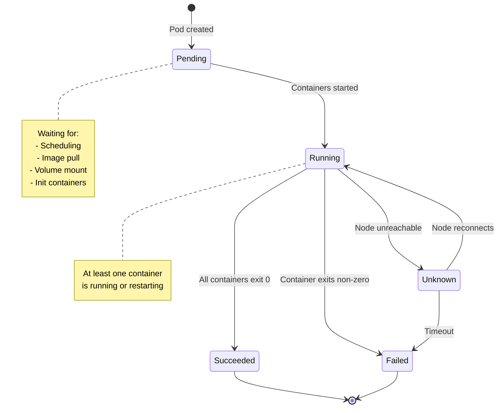

**Code Reference**: `pkg/kubelet/status/generate.go:100` - Pod phase generation

### Key Concepts

- **Pod Phase**: High-level summary of where Pod is in lifecycle
- **Container State**: Detailed state of each container
- **Pod Conditions**: Boolean flags indicating specific statuses
- **Lifecycle Hooks**: Custom code execution at container start/stop
- **Grace Period**: Time given for graceful shutdown

---

## Pod Phases

Pod phase represents the high-level state of the Pod in its lifecycle.

### Phase Definitions

| Phase | Meaning | Terminal | Duration |
|-------|---------|----------|----------|
| **Pending** | Pod accepted, not yet running | No | Seconds to minutes |
| **Running** | Pod bound to node, ≥1 container running | No | Hours to days |
| **Succeeded** | All containers terminated successfully (exit 0) | Yes | Final state |
| **Failed** | All containers terminated, ≥1 failed (exit non-0) | Yes | Final state |
| **Unknown** | Pod state cannot be obtained (node issue) | No | Temporary |

### Detailed Phase Descriptions

#### Pending Phase

**Definition**: Pod has been accepted by Kubernetes but not yet running.

**Reasons for Pending**:
1. **Scheduling**: Waiting for scheduler to assign node
2. **Image Pull**: Pulling container images
3. **Volume Attach**: Waiting for volume attachment (CSI)
4. **Volume Mount**: Mounting volumes
5. **Admission**: Failing admission checks (insufficient resources)
6. **Init Containers**: Running init containers

**Example Pod in Pending**:

```yaml
apiVersion: v1
kind: Pod
metadata:
  name: pending-example
status:
  phase: Pending
  conditions:
  - type: PodScheduled
    status: "True"  # Scheduled to node
  - type: Initialized
    status: "False"  # Init containers still running
    reason: ContainersNotInitialized
  containerStatuses:
  - name: app
    state:
      waiting:
        reason: PodInitializing
```

**Code**: `pkg/kubelet/kubelet_pods.go:1450` - `syncPod()` handles Pending state

#### Running Phase

**Definition**: Pod bound to node, at least one container is running (or starting/restarting).

**Characteristics**:
- Pod sandbox created
- Init containers completed successfully
- At least one main container started
- Container may be in restart backoff

**Example**:

```yaml
status:
  phase: Running
  conditions:
  - type: Initialized
    status: "True"
  - type: Ready
    status: "True"
  - type: ContainersReady
    status: "True"
  containerStatuses:
  - name: app
    ready: true
    state:
      running:
        startedAt: "2025-10-21T10:00:00Z"
```

**Code**: `pkg/kubelet/status/generate.go:150` - Running phase determination

#### Succeeded Phase

**Definition**: All containers terminated with exit code 0, won't be restarted.

**Applies to**:
- Jobs (restartPolicy: OnFailure or Never)
- CronJobs
- One-shot tasks

**Example**:

```yaml
apiVersion: v1
kind: Pod
metadata:
  name: job-pod
spec:
  restartPolicy: Never
  containers:
  - name: worker
    image: alpine
    command: ["sh", "-c", "echo done && exit 0"]
status:
  phase: Succeeded
  containerStatuses:
  - name: worker
    state:
      terminated:
        exitCode: 0
        reason: Completed
        finishedAt: "2025-10-21T10:05:00Z"
```

**Code**: `pkg/kubelet/kuberuntime/kuberuntime_manager.go:750` - Succeeded handling

#### Failed Phase

**Definition**: All containers terminated, at least one exited with non-zero code.

**Common Failure Reasons**:
- Application error (exit code 1-255)
- OOMKilled (exit code 137, signal 9)
- Timeout or killed by kubelet
- Image pull failure (after retries exhausted)

**Example**:

```yaml
status:
  phase: Failed
  reason: Error
  containerStatuses:
  - name: app
    state:
      terminated:
        exitCode: 1
        reason: Error
        message: "Application failed: connection refused"
        finishedAt: "2025-10-21T10:10:00Z"
```

**Code**: `pkg/kubelet/kuberuntime/kuberuntime_container.go:850` - Container failure handling

#### Unknown Phase

**Definition**: Pod state cannot be determined, usually due to node issues.

**Causes**:
- Node lost network connection
- kubelet crashed
- Node shutdown unexpectedly
- Control plane cannot reach node

**Behavior**:
- Control plane marks Pod Unknown after 40s (default `node-monitor-grace-period`)
- If node doesn't recover in 5 minutes, Pod may be evicted
- When node reconnects, kubelet reconciles actual state

**Example**:

```yaml
status:
  phase: Unknown
  reason: NodeLost
  message: "Node node1 was not ready for more than 5 minutes"
```

**Code**: `pkg/kubelet/kubelet_node_status.go:450` - Unknown phase on node issues

### Phase Transition Timing

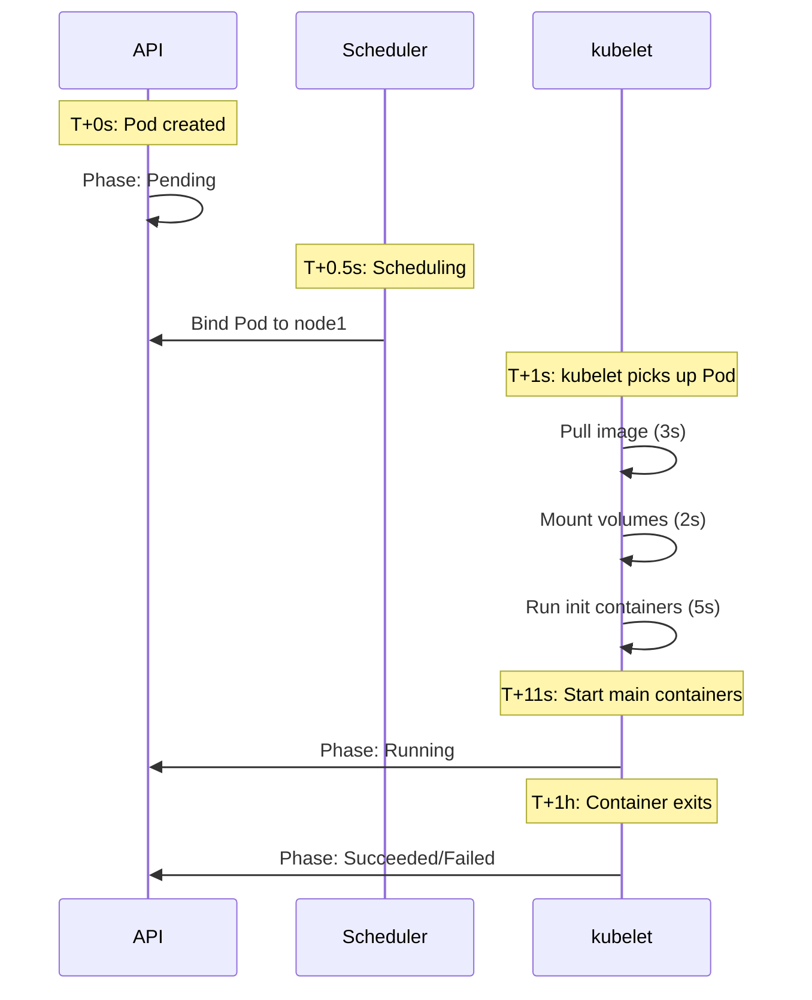

**Code**: `pkg/kubelet/status/status_manager.go:250` - Phase updates to API

---

## Container States

Each container in a Pod has a detailed state independent of Pod phase.

### Three Container States

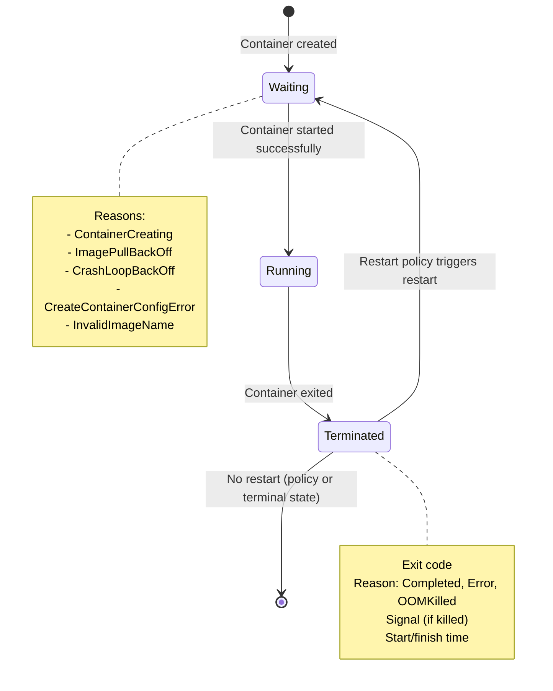

### Waiting State

**Definition**: Container has not yet started or is waiting to restart.

**Common Reasons**:

| Reason | Meaning | Action |
|--------|---------|--------|
| **ContainerCreating** | Normal startup in progress | Wait |
| **ImagePullBackOff** | Image pull failed, backing off | Check image name, pull secrets |
| **CrashLoopBackOff** | Container repeatedly crashing | Check logs, fix app |
| **CreateContainerConfigError** | Invalid container config | Fix Pod spec |
| **ErrImagePull** | Cannot pull image | Check network, registry |
| **InvalidImageName** | Image name malformed | Fix image reference |

**Example**:

```yaml
containerStatuses:
- name: app
  state:
    waiting:
      reason: ImagePullBackOff
      message: "Back-off pulling image \"invalid-registry.io/app:v1\""
  lastState: {}
  ready: false
  restartCount: 0
```

**Backoff Calculation**:

```
Backoff delay: 10s, 20s, 40s, 80s, 160s, 300s (max)
Reset: After 10 minutes of successful running
```

**Code**: `pkg/kubelet/kuberuntime/kuberuntime_container.go:650` - Waiting state

### Running State

**Definition**: Container is executing and has not crashed.

**Metadata Included**:
- `startedAt`: Timestamp when container started
- Container ID from runtime

**Example**:

```yaml
containerStatuses:
- name: app
  state:
    running:
      startedAt: "2025-10-21T10:00:00Z"
  ready: true
  restartCount: 0
  containerID: "containerd://abc123..."
```

**Code**: `pkg/kubelet/kubelet_pods.go:1650` - Running state tracking

### Terminated State

**Definition**: Container ran and exited (successfully or with error).

**Metadata Included**:

| Field | Description | Example |
|-------|-------------|---------|
| **exitCode** | Process exit code | 0 (success), 1-255 (error), 137 (SIGKILL/OOM) |
| **reason** | Why terminated | Completed, Error, OOMKilled, ContainerCannotRun |
| **message** | Additional details | "Application error: connection refused" |
| **signal** | Signal that terminated container | 9 (SIGKILL), 15 (SIGTERM) |
| **startedAt** | When container started | ISO 8601 timestamp |
| **finishedAt** | When container ended | ISO 8601 timestamp |
| **containerID** | Runtime container ID | "containerd://..." |

**Example - Normal Exit**:

```yaml
containerStatuses:
- name: worker
  state:
    terminated:
      exitCode: 0
      reason: Completed
      startedAt: "2025-10-21T10:00:00Z"
      finishedAt: "2025-10-21T10:05:30Z"
      containerID: "containerd://xyz789..."
```

**Example - OOMKilled**:

```yaml
containerStatuses:
- name: memory-hog
  state:
    terminated:
      exitCode: 137
      reason: OOMKilled
      message: "Container exceeded memory limit"
      signal: 9
      finishedAt: "2025-10-21T10:08:15Z"
```

**Exit Code Meanings**:

| Exit Code | Meaning | Common Cause |
|-----------|---------|--------------|
| 0 | Success | Normal completion |
| 1 | General error | Application error |
| 2 | Misuse of shell builtin | Script error |
| 126 | Command cannot execute | Permission issue |
| 127 | Command not found | Wrong binary path |
| 130 | Terminated by Ctrl+C | SIGINT (signal 2) |
| 137 | Killed by SIGKILL | OOMKilled or force kill |
| 143 | Terminated by SIGTERM | Graceful shutdown request |
| 255 | Exit status out of range | Invalid exit code |

**Code**: `pkg/kubelet/kuberuntime/kuberuntime_container.go:950` - Terminated state

---

## Pod Conditions

Pod conditions provide more granular status information than phase.

### Standard Conditions

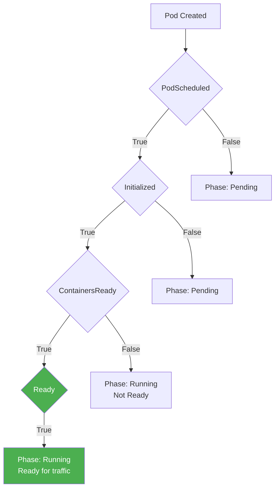

| Condition | Type | True When | Set By |
|-----------|------|-----------|--------|
| **PodScheduled** | Status | Pod assigned to node (spec.nodeName set) | Scheduler |
| **Initialized** | Status | All init containers completed successfully | kubelet |
| **ContainersReady** | Ready | All containers passing readiness probes | kubelet |
| **Ready** | Ready | Pod can receive traffic (ContainersReady + readinessGates) | kubelet |
| **PodReadyToStartContainers** | Status | Sandbox ready, resources allocated (v1.29+) | kubelet |

### Condition Structure

```yaml
conditions:
- type: Initialized
  status: "True"
  lastProbeTime: null
  lastTransitionTime: "2025-10-21T10:00:05Z"
  reason: PodCompleted
  message: "All init containers completed"

- type: Ready
  status: "False"
  lastProbeTime: null
  lastTransitionTime: "2025-10-21T10:00:10Z"
  reason: ContainersNotReady
  message: "containers with unready status: [app]"

- type: ContainersReady
  status: "False"
  lastTransitionTime: "2025-10-21T10:00:10Z"
  reason: ContainersNotReady
```

**Code**: `pkg/kubelet/status/generate.go:250` - Condition generation

### Readiness Gates (Advanced)

Custom conditions that must be True for Pod to be Ready:

```yaml
spec:
  readinessGates:
  - conditionType: "example.com/feature-enabled"
status:
  conditions:
  - type: "example.com/feature-enabled"
    status: "True"
  - type: Ready
    status: "True"  # Only True if custom condition also True
```

**Use Case**: External systems (load balancers, service mesh) controlling Pod readiness.

**Code**: `pkg/kubelet/status/generate.go:350` - Readiness gate evaluation

---

## Pod Creation Flow

Complete sequence from API server to Running state.

### High-Level Flow

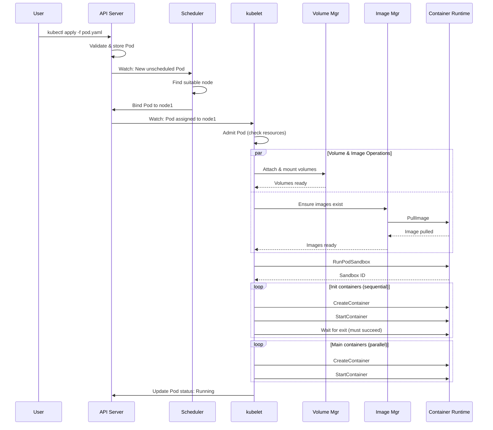

### Detailed Steps

#### Step 1: API Server Accepts Pod

```bash
$ kubectl apply -f pod.yaml
pod/nginx created
```

**API Server**:
1. Validates Pod spec
2. Sets defaults (restartPolicy: Always, dnsPolicy, etc.)
3. Stores in etcd
4. Sets phase: Pending
5. Notifies watchers

**Code**: (API server, not kubelet)

#### Step 2: Scheduler Assigns Node

**Scheduler**:
1. Watches for Pods with spec.nodeName == ""
2. Runs predicates (node has resources, taints/tolerations, etc.)
3. Runs priorities (spread Pods, prefer less-loaded nodes)
4. Binds Pod to best node (sets spec.nodeName)

**Code**: (kube-scheduler, not kubelet)

#### Step 3: kubelet Detects Pod Assignment

**kubelet watch**:
```
Watch /api/v1/pods?fieldSelector=spec.nodeName=node1
```

**Event received**:
```
Type: ADDED
Pod: default/nginx
spec.nodeName: node1
```

**Code**: `pkg/kubelet/config/apiserver.go:150` - API Pod source

#### Step 4: Pod Admission

**Checks performed**:

| Check | Condition | Reject Reason |
|-------|-----------|---------------|
| **Resources** | CPU + memory requests fit | InsufficientCPU, InsufficientMemory |
| **Ports** | Host ports not already used | PortConflict |
| **Extended Resources** | GPUs, FPGAs available | InsufficientGPU |
| **Node Selector** | Node labels match | NodeSelectorMismatching |
| **Taints** | Pod tolerates node taints | NodeNotReady (taint) |

**Code**: `pkg/kubelet/lifecycle/predicate.go:75` - Admission

**If Rejected**:
```yaml
status:
  phase: Failed
  reason: OutOfCPU
  message: "Insufficient CPU on node"
```

#### Step 5: Volume Attachment and Mounting

**For CSI volumes**:

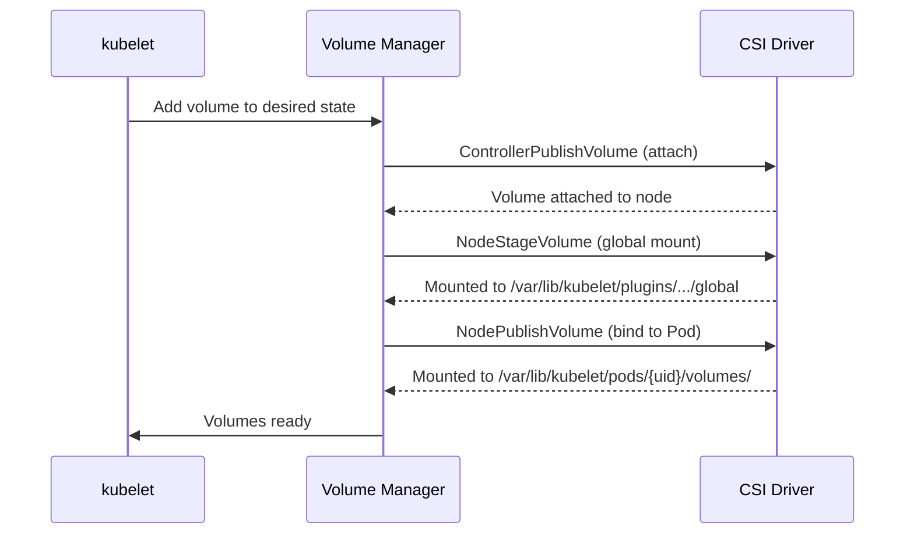

**Code**: `pkg/kubelet/volumemanager/reconciler/reconciler.go:200` - Volume reconciliation

#### Step 6: Image Pulling

**Pull Policy Logic**:

```
if image tag == "latest" or no tag:
    policy = Always (always pull)
elif image present locally:
    policy = IfNotPresent (skip pull)
else:
    pull image
```

**Serial vs Parallel**:
- Default: Serial (one image at a time per node)
- With `serializeImagePulls: false`: Parallel

**Code**: `pkg/kubelet/images/image_manager.go:150` - Image pull

#### Step 7: Pod Sandbox Creation

**Creates**:
1. Pause container (infrastructure container)
2. Namespaces (network, IPC, PID, UTS)
3. DNS configuration
4. Pod IP allocation (via CNI)

**Code**: `pkg/kubelet/kuberuntime/kuberuntime_sandbox.go:75` - Sandbox creation

#### Step 8: Init Container Execution

**Sequential execution**:

```yaml
spec:
  initContainers:
  - name: init-1
    image: alpine
    command: ["sh", "-c", "echo init-1 && sleep 2"]
  - name: init-2
    image: alpine
    command: ["sh", "-c", "echo init-2 && sleep 2"]
```

**Flow**:
1. Create init-1, start, wait for exit 0
2. If init-1 fails and restartPolicy != Never: restart init-1
3. Once init-1 succeeds: create init-2, start, wait
4. Once all init containers succeed: proceed to main containers

**Code**: `pkg/kubelet/kuberuntime/kuberuntime_manager.go:650` - Init container handling

#### Step 9: Main Container Creation

**Parallel creation**:

```yaml
spec:
  containers:
  - name: nginx
    image: nginx:1.21
  - name: sidecar
    image: envoy:v1.25
```

**Both containers created and started simultaneously**.

**Code**: `pkg/kubelet/kuberuntime/kuberuntime_manager.go:750` - Main container startup

#### Step 10: Status Update

**Update to API server**:

```yaml
status:
  phase: Running
  conditions:
  - type: Initialized
    status: "True"
  - type: Ready
    status: "True"  # If readiness probes pass
  - type: ContainersReady
    status: "True"
  containerStatuses:
  - name: nginx
    ready: true
    state:
      running:
        startedAt: "2025-10-21T10:00:15Z"
```

**Code**: `pkg/kubelet/status/status_manager.go:250` - Status updates

### Timing Breakdown

**Typical Pod Startup** (simple Pod, image cached):

```
T+0.0s  Pod created in API
T+0.5s  Scheduler binds to node
T+1.0s  kubelet picks up Pod
T+1.2s  Admission checks pass
T+1.5s  Volume mount complete (emptyDir)
T+1.7s  Image check (already present)
T+2.0s  Pod sandbox created
T+2.5s  Init containers complete
T+3.0s  Main containers created
T+3.5s  Main containers started
T+4.0s  Readiness probes pass
T+4.0s  Pod status: Running, Ready
---
Total: 4 seconds
```

**With image pull** (10 MB image):

```
T+0.0s  ... (same as above)
T+1.7s  Start image pull
T+5.0s  Image pull complete (3.3s for 10MB)
T+5.5s  Pod sandbox created
...
Total: ~7.5 seconds
```

---

## Init Containers

Init containers run before main containers and must complete successfully.

### Purpose

Init containers are designed for:

1. **Setup tasks**: Database migrations, config generation
2. **Wait for dependencies**: Wait for services to be ready
3. **Security**: Run privileged init tasks, then drop privileges for main container
4. **Ordering**: Ensure tasks run in specific order

### Characteristics

| Characteristic | Init Containers | Main Containers |
|----------------|-----------------|-----------------|
| **Execution** | Sequential (one at a time) | Parallel |
| **Must Succeed** | Yes (Pod stuck if init fails) | No (can crash and restart) |
| **Restart** | Restart from first init container | Independent restarts |
| **Probes** | No liveness/readiness probes | Support all probes |
| **Lifecycle Hooks** | No postStart/preStop | Support hooks |

### Example: Database Migration

```yaml
apiVersion: v1
kind: Pod
metadata:
  name: app-with-migration
spec:
  initContainers:
  - name: db-migration
    image: myapp:v1-migration
    command: ["./migrate", "--db=postgres://..."]
    env:
    - name: DB_PASSWORD
      valueFrom:
        secretKeyRef:
          name: db-secret
          key: password
  
  containers:
  - name: app
    image: myapp:v1
    ports:
    - containerPort: 8080
```

**Behavior**:
1. kubelet creates Pod sandbox
2. Runs db-migration container
3. Waits for db-migration to exit 0
4. If migration fails (exit non-0): restart migration (per restartPolicy)
5. Once migration succeeds: start app container

**Code**: `pkg/kubelet/kuberuntime/kuberuntime_manager.go:650` - Init container logic

### Example: Wait for Service

```yaml
initContainers:
- name: wait-for-db
  image: busybox:1.35
  command: 
  - sh
  - -c
  - |
    until nslookup postgres-service.default.svc.cluster.local; do
      echo "Waiting for postgres-service..."
      sleep 2
    done
    echo "Database service is up!"
```

### Init Container Failure Handling

**Scenario**: Init container fails

```yaml
initContainers:
- name: init-fail
  image: alpine
  command: ["sh", "-c", "exit 1"]  # Always fails
```

**restartPolicy: Always** (default):
```
T+0s   Start init-fail
T+1s   Exit code 1 (failed)
T+1s   Backoff 10s
T+11s  Restart init-fail
T+12s  Exit code 1 (failed)
T+12s  Backoff 20s
T+32s  Restart init-fail
...    (continues with exponential backoff)
```

**restartPolicy: Never**:
```
T+0s   Start init-fail
T+1s   Exit code 1 (failed)
Pod phase: Failed (permanently)
```

**Code**: `pkg/kubelet/kuberuntime/kuberuntime_container.go:550` - Should restart check

### Init Container Restart Behavior

**Important**: When an init container restarts, **all previous init containers restart** too.

**Example**:

```yaml
initContainers:
- name: init-1
  command: ["sh", "-c", "echo init-1 done"]
- name: init-2
  command: ["sh", "-c", "echo init-2 done"]
- name: init-3
  command: ["sh", "-c", "exit 1"]  # Fails
```

**Execution**:
```
Run: init-1 (success)
Run: init-2 (success)
Run: init-3 (FAIL)

--- Restart from beginning ---

Run: init-1 (success) [runs again!]
Run: init-2 (success) [runs again!]
Run: init-3 (FAIL)

[continues...]
```

**Reason**: Ensures consistent state - init containers may have side effects.

---

## Sidecar Containers

**New in Kubernetes v1.28 (beta), v1.29 (stable)**

Sidecar containers are a special type of init container that continues running alongside main containers.

### Definition

```yaml
apiVersion: v1
kind: Pod
metadata:
  name: app-with-sidecar
spec:
  initContainers:
  - name: setup
    image: alpine
    command: ["sh", "-c", "echo setup && sleep 2"]
  
  - name: proxy
    image: envoy:v1.25
    restartPolicy: Always  # THIS MAKES IT A SIDECAR
    ports:
    - containerPort: 15001
  
  containers:
  - name: app
    image: myapp:v1
```

### Sidecar vs Regular Init Container

| Aspect | Regular Init Container | Sidecar Container |
|--------|------------------------|-------------------|
| **restartPolicy** | (Inherits from Pod) | **Always** |
| **Lifecycle** | Runs once, then stops | Runs continuously |
| **Startup Order** | Before main containers | Before main containers |
| **Shutdown Order** | N/A (already stopped) | **After main containers** |
| **Purpose** | Setup tasks | Supporting services (proxy, logging) |

### Sidecar Lifecycle

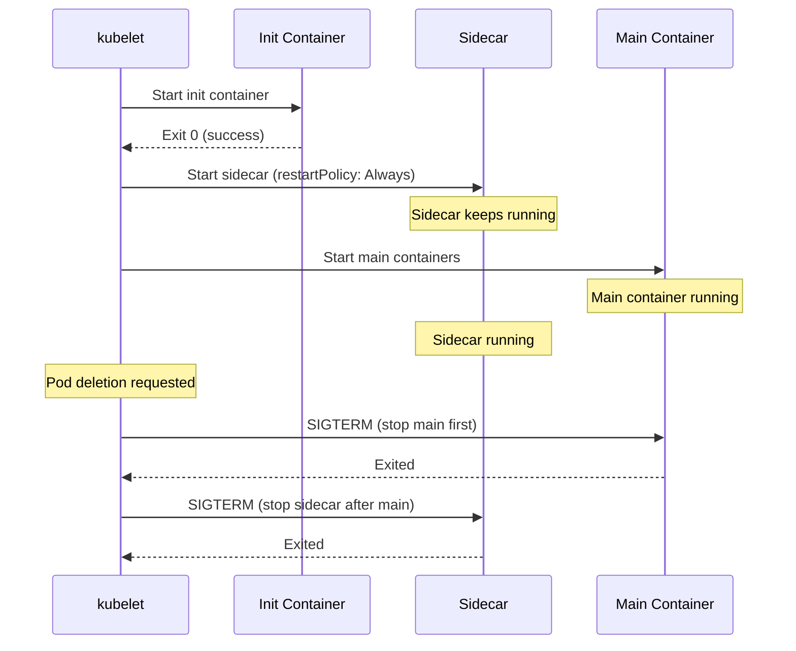

**Key Benefit**: Sidecar starts **before** main container and stops **after**, ensuring it's available for the entire main container lifecycle.

### Example: Service Mesh Proxy

```yaml
apiVersion: v1
kind: Pod
metadata:
  name: app-with-istio
spec:
  initContainers:
  - name: istio-init
    image: istio/proxyv2:1.20
    command: ["istio-iptables", ...] # Setup iptables
  
  - name: istio-proxy
    image: istio/proxyv2:1.20
    restartPolicy: Always  # Sidecar
    ports:
    - containerPort: 15001
    - containerPort: 15006
  
  containers:
  - name: app
    image: myapp:v1
    ports:
    - containerPort: 8080
```

**Flow**:
1. `istio-init` runs (sets up iptables), then exits
2. `istio-proxy` starts and keeps running
3. `app` starts (traffic already routed through proxy)
4. When Pod deleted: `app` stops first, then `istio-proxy`

**Code**: `pkg/kubelet/kuberuntime/kuberuntime_container.go:450` - Sidecar handling (v1.28+)

---

## Ephemeral Containers

**Purpose**: Debug running Pods without restarting them.

### Use Case

**Problem**: Pod is misbehaving, but container image has no debug tools (minimal image like `distroless`).

**Solution**: Add ephemeral container with debug tools to running Pod.

### Characteristics

| Characteristic | Value |
|----------------|-------|
| **Added to** | Running Pods only |
| **Shares** | Pod sandbox (network, IPC, PID namespaces) |
| **Lifecycle** | Temporary (not restarted, removed on Pod delete) |
| **Cannot** | Be removed or restarted once added |
| **Cannot** | Have probes, lifecycle hooks, resources guaranteed |

### Example

**Running Pod** (distroless image, no shell):

```yaml
apiVersion: v1
kind: Pod
metadata:
  name: app
spec:
  containers:
  - name: app
    image: gcr.io/distroless/java:11
    command: ["java", "-jar", "app.jar"]
```

**Add Ephemeral Container**:

```bash
kubectl debug app --image=busybox --target=app
```

**What happens**:

```yaml
spec:
  ephemeralContainers:
  - name: debugger
    image: busybox
    stdin: true
    tty: true
    targetContainerName: app  # Share namespaces with app
```

**Now you can**:

```bash
# Inside ephemeral container
$ ps aux  # See app processes (shared PID namespace)
$ netstat -tlnp  # See app listening ports
$ ls /proc/$(pidof java)/fd  # See app's open files
```

**Code**: `pkg/kubelet/kuberuntime/kuberuntime_container.go:1150` - Ephemeral container creation

### Limitations

- Cannot be updated or removed once added
- Do not trigger Pod restart
- Terminated when Pod is deleted
- Not suitable for production (debugging only)

---

## Main Container Startup

After init containers and sidecars, main containers start.

### Parallel Startup

**By default, all main containers start in parallel**:

```yaml
spec:
  containers:
  - name: nginx
    image: nginx:1.21
  - name: app
    image: myapp:v1
  - name: redis
    image: redis:7
```

All three containers created and started simultaneously.

### Startup Sequence

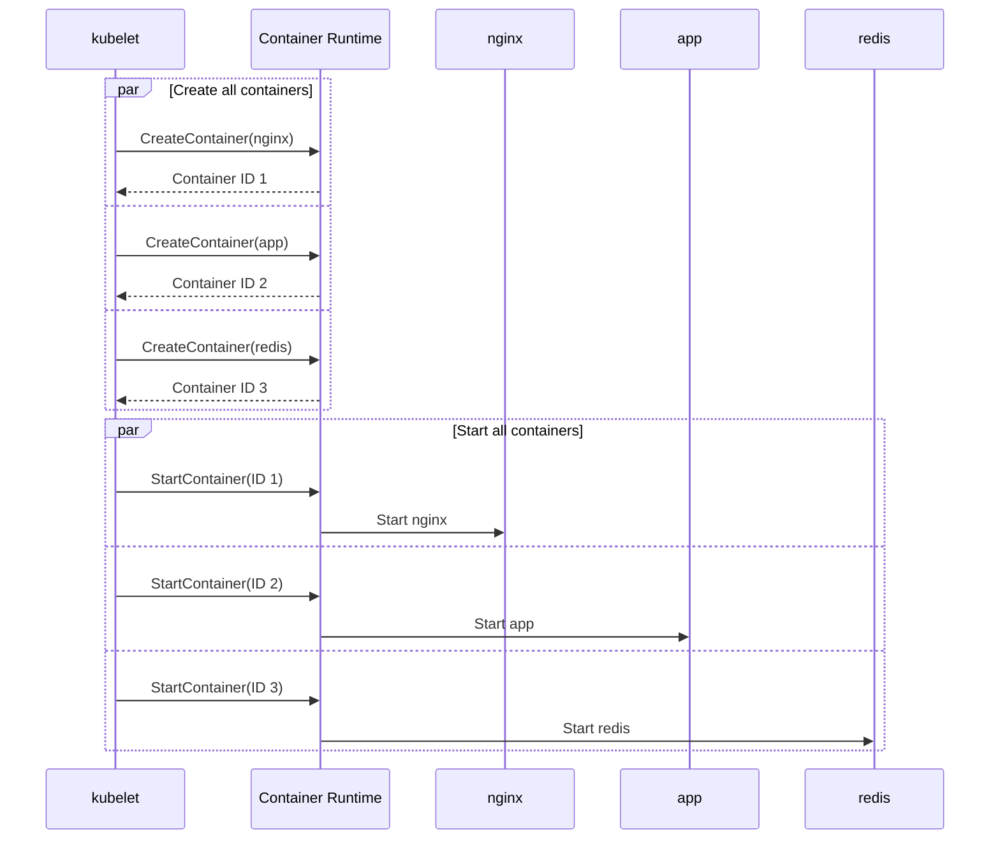

**Code**: `pkg/kubelet/kuberuntime/kuberuntime_manager.go:750` - Start containers

### Container Dependencies

**Problem**: App container needs Redis to be ready before starting.

**Solution**: Use init containers or startup probes:

**Option 1: Init Container**

```yaml
initContainers:
- name: wait-for-redis
  image: busybox
  command: ['sh', '-c', 'until nc -z redis 6379; do sleep 1; done']

containers:
- name: app
  # Starts after Redis is reachable
- name: redis
```

**Option 2: Startup Probe** (app handles retries):

```yaml
containers:
- name: app
  startupProbe:
    tcpSocket:
      port: 8080
    failureThreshold: 30  # 30 * 10s = 5 minutes startup time allowed
```

---

## Container Restart

Containers can restart based on `restartPolicy` and exit code.

### Restart Policies

```yaml
spec:
  restartPolicy: Always  # Default
  # Options: Always, OnFailure, Never
```

| Policy | Exit Code 0 | Exit Code != 0 | Use Case |
|--------|-------------|----------------|----------|
| **Always** | Restart | Restart | Long-running services (default for Deployments) |
| **OnFailure** | Don't restart | Restart | Batch jobs (retry on failure) |
| **Never** | Don't restart | Don't restart | One-shot tasks |

### Restart Decision Flow

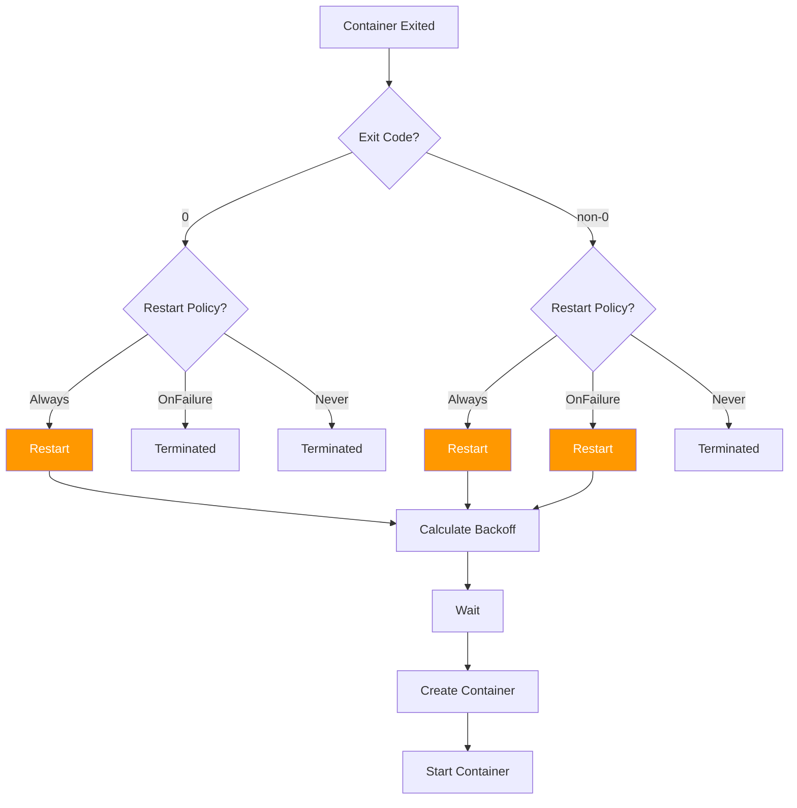

**Code**: `pkg/kubelet/container/helpers.go:150` - `ShouldContainerBeRestarted()`

### Exponential Backoff

**Formula**:
```
delay = min(10s * 2^(restartCount), 5m)
```

**Backoff Sequence**:

| Restart # | Delay | Cumulative Time |
|-----------|-------|-----------------|
| 1 | 10s | 10s |
| 2 | 20s | 30s |
| 3 | 40s | 1m 10s |
| 4 | 80s (1m 20s) | 2m 30s |
| 5 | 160s (2m 40s) | 5m 10s |
| 6 | 300s (5m) | 10m 10s |
| 7+ | 300s (5m) - capped | +5m each |

**Backoff Reset**: After container runs successfully for **10 minutes**, restart count resets to 0.

**Example**:

```yaml
status:
  containerStatuses:
  - name: crasher
    state:
      waiting:
        reason: CrashLoopBackOff
        message: "back-off 5m0s restarting failed container=crasher"
    lastState:
      terminated:
        exitCode: 1
        reason: Error
        finishedAt: "2025-10-21T10:15:00Z"
    restartCount: 7
```

**Code**: `pkg/kubelet/util/backoff/backoff.go:50` - Backoff calculation

### Liveness Probe Restart

Containers also restart if **liveness probe** fails:

```yaml
containers:
- name: app
  livenessProbe:
    httpGet:
      path: /healthz
      port: 8080
    periodSeconds: 10
    failureThreshold: 3  # Restart after 3 consecutive failures
```

**Flow**:
```
Probe 1: Success
Probe 2: Success
Probe 3: FAIL (1/3 failures)
Probe 4: FAIL (2/3 failures)
Probe 5: FAIL (3/3 failures) → Restart container
```

**Code**: `pkg/kubelet/prober/worker.go:150` - Liveness probe failure handling

---

## Pod Termination

Graceful termination ensures applications can clean up properly.

### Termination Sequence

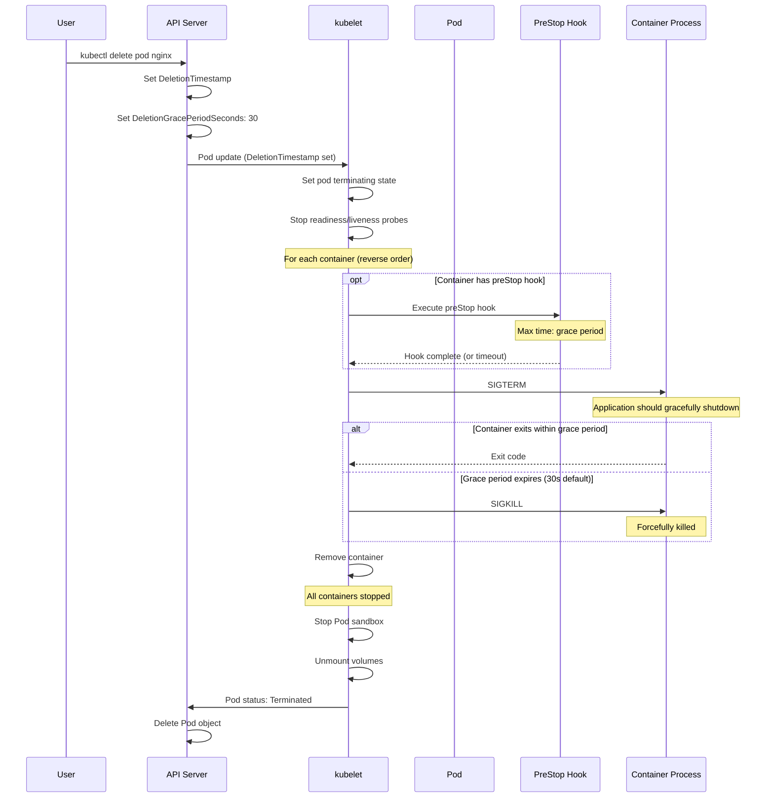

**Code**: `pkg/kubelet/kuberuntime/kuberuntime_container.go:750` - `killContainer()`

### Grace Period

**Default**: 30 seconds (configurable per Pod)

```yaml
spec:
  terminationGracePeriodSeconds: 60  # 60 seconds instead of 30
```

**Timeline Example** (grace period = 30s):

```
T+0s   DELETE request received
T+0s   DeletionTimestamp set
T+0s   PreStop hook starts (if defined)
T+5s   PreStop hook completes
T+5s   SIGTERM sent to container
T+35s  If still running: SIGKILL sent
T+35s  Container terminated
T+36s  Volume unmount
T+36s  Pod deleted from API
```

**Important**: PreStop hook execution time **counts against** grace period!

### PreStop Hook

Runs **before** SIGTERM:

```yaml
containers:
- name: app
  lifecycle:
    preStop:
      exec:
        command: ["/bin/sh", "-c", "sleep 5 && /app/shutdown.sh"]
```

**Flow**:
```
T+0s   Pod deletion requested
T+0s   preStop hook starts
T+5s   sleep completes, shutdown.sh runs
T+6s   shutdown.sh completes, hook done
T+6s   SIGTERM sent
T+36s  Grace period expires, SIGKILL sent (if still running)
```

**Use Cases**:
- Drain connections
- Save state
- Notify external systems
- Wait for pending requests to complete

**Code**: `pkg/kubelet/lifecycle/handlers.go:150` - PreStop hook execution

### Handling SIGTERM in Application

**Example: Go HTTP Server**

```go
package main

import (
    "context"
    "net/http"
    "os"
    "os/signal"
    "syscall"
    "time"
)

func main() {
    server := &http.Server{Addr: ":8080"}
    
    // Handle SIGTERM
    stop := make(chan os.Signal, 1)
    signal.Notify(stop, syscall.SIGTERM, syscall.SIGINT)
    
    go func() {
        <-stop
        
        // Graceful shutdown: max 25 seconds
        // (leaves 5s buffer before SIGKILL at 30s)
        ctx, cancel := context.WithTimeout(context.Background(), 25*time.Second)
        defer cancel()
        
        server.Shutdown(ctx)
    }()
    
    server.ListenAndServe()
}
```

### Force Delete

**Normal delete** waits for grace period:

```bash
kubectl delete pod nginx
# Waits up to 30s (or configured grace period)
```

**Force delete** (immediate, grace period = 0):

```bash
kubectl delete pod nginx --grace-period=0 --force
```

**What happens**:
- kubelet immediately sends SIGKILL (no SIGTERM)
- No preStop hook execution
- Pod removed from API immediately
- **Dangerous**: Application doesn't clean up

**When to use**: Pod stuck terminating, node failure, emergency.

**Code**: `pkg/kubelet/kuberuntime/kuberuntime_container.go:850` - Force kill

---

## Lifecycle Hooks

Hooks allow custom code execution at container start and stop.

### PostStart Hook

Runs **after** container starts (but no guarantee it completes before container ENTRYPOINT).

```yaml
containers:
- name: app
  lifecycle:
    postStart:
      exec:
        command: ["/bin/sh", "-c", "echo 'Container started' >> /var/log/startup.log"]
```

**Use Cases**:
- Register with external service
- Wait for dependency
- Initialize cache

**Important**: 
- No guarantee of order vs ENTRYPOINT
- If postStart fails, container killed and restarted
- No timeout (runs until complete or container exits)

### PreStop Hook

Runs **before** SIGTERM sent.

**Already covered in termination section.**

### Hook Types

Both hooks support two handler types:

**exec**: Execute command in container

```yaml
lifecycle:
  postStart:
    exec:
      command: ["/bin/sh", "-c", "echo started"]
```

**httpGet**: HTTP GET request

```yaml
lifecycle:
  postStart:
    httpGet:
      path: /register
      port: 8080
      host: registration-service
      scheme: HTTP
```

**Code**: `pkg/kubelet/lifecycle/handlers.go:50` - Hook handler types

---

## Pod Deletion

### Normal Deletion

```bash
kubectl delete pod nginx
```

**What happens**:

1. **API Server**:
   - Sets `metadata.deletionTimestamp`
   - Sets `metadata.deletionGracePeriodSeconds` (default 30)
   - Pod still exists (visible in `kubectl get pods`)

2. **kubelet**:
   - Sees DeletionTimestamp
   - Starts termination sequence (see [Pod Termination](#pod-termination))
   - Stops probes
   - Runs preStop hooks
   - Sends SIGTERM
   - Waits grace period
   - Sends SIGKILL if needed
   - Unmounts volumes
   - Updates status to Terminated

3. **API Server**:
   - After kubelet reports termination: deletes Pod object
   - Pod no longer visible in `kubectl get pods`

### Finalizers

**Purpose**: Prevent Pod deletion until cleanup tasks complete.

**Example**:

```yaml
metadata:
  name: nginx
  finalizers:
  - example.com/cleanup-hook
```

**Behavior**:
- Pod marked for deletion (DeletionTimestamp set)
- Pod **not deleted** until all finalizers removed
- External controller watches for DeletionTimestamp
- Controller performs cleanup
- Controller removes its finalizer
- Once all finalizers gone: Pod deleted

**Code**: (API server, not kubelet)

### Stuck Terminating Pods

**Problem**: Pod stuck in Terminating state.

**Causes**:
1. Finalizer not removed
2. kubelet can't reach container runtime
3. Volume unmount fails
4. Node lost connection

**Check**:

```bash
kubectl get pod nginx -o yaml | grep -A5 deletionTimestamp
# Shows how long Pod has been terminating

kubectl get pod nginx -o yaml | grep -A10 finalizers
# Shows if finalizers blocking deletion
```

**Fix**:

```bash
# Remove finalizer
kubectl patch pod nginx -p '{"metadata":{"finalizers":null}}'

# Force delete (last resort)
kubectl delete pod nginx --grace-period=0 --force
```

---

## Static Pods

Static Pods are managed by kubelet directly, not via API server.

### Characteristics

| Aspect | Static Pod | Regular Pod |
|--------|------------|-------------|
| **Defined in** | File or HTTP URL | API server (etcd) |
| **Managed by** | kubelet only | API server + kubelet |
| **Survives** | kubelet restart | Node drain, rescheduling |
| **Can be deleted via API** | No | Yes |
| **Mirror Pod** | Created in API | N/A |
| **Use case** | Control plane components | Application workloads |

### Configuration

**kubelet flag**:

```bash
kubelet --pod-manifest-path=/etc/kubernetes/manifests/
```

**kubelet config**:

```yaml
apiVersion: kubelet.config.k8s.io/v1beta1
kind: KubeletConfiguration
staticPodPath: /etc/kubernetes/manifests/
```

### Example: etcd Static Pod

**File**: `/etc/kubernetes/manifests/etcd.yaml`

```yaml
apiVersion: v1
kind: Pod
metadata:
  name: etcd
  namespace: kube-system
  labels:
    component: etcd
    tier: control-plane
spec:
  hostNetwork: true
  containers:
  - name: etcd
    image: registry.k8s.io/etcd:3.5.9-0
    command:
    - etcd
    - --data-dir=/var/lib/etcd
    - --listen-client-urls=https://0.0.0.0:2379
    volumeMounts:
    - name: etcd-data
      mountPath: /var/lib/etcd
  volumes:
  - name: etcd-data
    hostPath:
      path: /var/lib/etcd
```

**kubelet behavior**:
1. Watches `/etc/kubernetes/manifests/`
2. Detects `etcd.yaml`
3. Creates and starts etcd Pod
4. Creates **mirror Pod** in API server (read-only)

### Mirror Pods

**Purpose**: Allow visibility of static Pods via API server.

**Mirror Pod** (`kubectl get pods -n kube-system`):

```
NAME             READY   STATUS    RESTARTS   AGE
etcd-node1       1/1     Running   0          10d
```

**Note suffix**: `-node1` (node name appended)

**Characteristics**:
- Read-only (cannot be modified via API)
- Cannot be deleted via `kubectl delete` (delete the file instead)
- Automatically updated if file changes
- Deleted automatically if file removed

**Code**: `pkg/kubelet/config/file.go:75` - Static Pod file watching

### Use Cases

1. **Control Plane Components** (kubeadm clusters):
   - etcd
   - kube-apiserver
   - kube-controller-manager
   - kube-scheduler

2. **Node-specific Services**:
   - Monitoring agents
   - Log collectors
   - Network plugins (on master node)

### Updating Static Pods

**Change file**:

```bash
vim /etc/kubernetes/manifests/etcd.yaml
# Edit image version: etcd:3.5.9-0 → etcd:3.5.10-0
```

**kubelet automatically**:
1. Detects file change
2. Stops old Pod
3. Starts new Pod with updated spec
4. Updates mirror Pod in API

---

## State Transitions

Complete state machine showing all possible Pod state transitions.

### Pod Phase Transitions

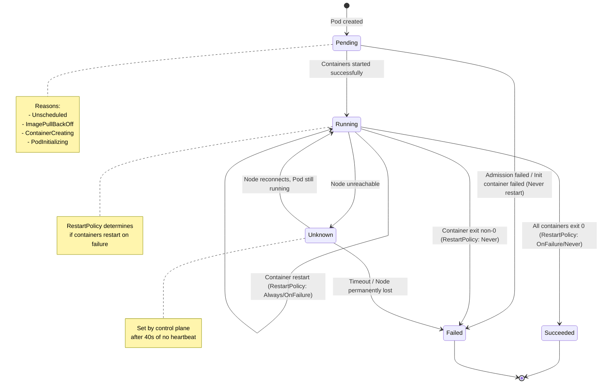

### Container State Transitions

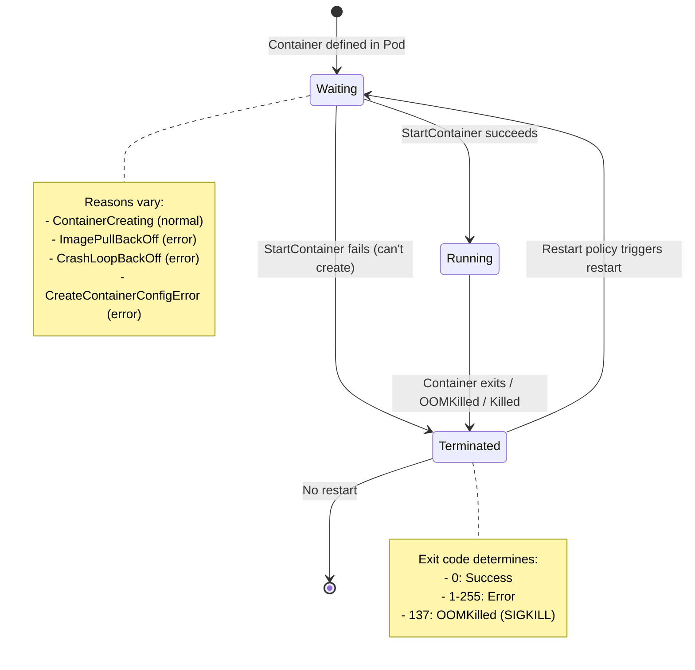

### Condition Transitions

```yaml
# Pod just created
conditions:
- type: PodScheduled
  status: "False"
- type: Initialized
  status: "False"
- type: Ready
  status: "False"
- type: ContainersReady
  status: "False"

# After scheduling
conditions:
- type: PodScheduled
  status: "True"  # Changed
  lastTransitionTime: "2025-10-21T10:00:00Z"

# After init containers complete
conditions:
- type: Initialized
  status: "True"  # Changed
  lastTransitionTime: "2025-10-21T10:00:05Z"

# After main containers start and pass readiness
conditions:
- type: ContainersReady
  status: "True"  # Changed
  lastTransitionTime: "2025-10-21T10:00:10Z"
- type: Ready
  status: "True"  # Changed
  lastTransitionTime: "2025-10-21T10:00:10Z"
```

---

## Troubleshooting

Common Pod lifecycle issues and solutions.

### Pod Stuck in Pending

**Check**:

```bash
kubectl describe pod <pod-name>
# Look at Events section
```

**Common Causes**:

| Symptom | Cause | Solution |
|---------|-------|----------|
| `0/3 nodes available: Insufficient cpu` | No node has enough CPU | Request less CPU or add nodes |
| `0/3 nodes available: MatchNodeSelector` | No node matches nodeSelector | Fix nodeSelector or label nodes |
| `ImagePullBackOff` | Cannot pull image | Check image name, pull secrets, registry |
| `Pod has unbound PersistentVolumeClaims` | PVC not bound | Check PV availability, storage class |
| `FailedScheduling` | No suitable node | Check taints, node selectors, resource requests |

**Code**: `pkg/kubelet/status/generate.go:200` - Pending reasons

### Pod Stuck in ContainerCreating

**Check**:

```bash
kubectl describe pod <pod-name>
# Events show what's happening

kubectl get events --field-selector involvedObject.name=<pod-name>
```

**Common Causes**:

| Symptom | Cause | Solution |
|---------|-------|----------|
| `Error: ImagePullBackOff` | Image pull failing | Check image exists, pull secrets configured |
| `MountVolume.SetUp failed` | Volume mount failing | Check volume exists, CSI driver healthy |
| `Failed to create pod sandbox` | Runtime error | Check container runtime logs |
| `Network plugin not ready` | CNI plugin issue | Check CNI plugin, node network |

### CrashLoopBackOff

**Meaning**: Container repeatedly crashing, kubelet backing off restart.

**Check**:

```bash
kubectl logs <pod-name> <container-name>
kubectl logs <pod-name> <container-name> --previous  # Previous instance

kubectl describe pod <pod-name>
# Check restartCount and last termination reason
```

**Common Causes**:

1. **Application error**: Fix application bug
2. **Missing dependency**: Ensure services are available
3. **Wrong command**: Fix ENTRYPOINT or CMD
4. **OOMKilled**: Increase memory limit
5. **Liveness probe failing**: Fix probe or app

**Example**:

```yaml
containerStatuses:
- name: app
  state:
    waiting:
      reason: CrashLoopBackOff
      message: "back-off 5m0s restarting failed container"
  lastState:
    terminated:
      exitCode: 137
      reason: OOMKilled  # Out of memory!
  restartCount: 15
```

**Solution**: Increase memory limit

```yaml
resources:
  limits:
    memory: "512Mi"  # Was 256Mi
```

### Pod Stuck Terminating

**Check**:

```bash
kubectl get pod <pod-name> -o yaml | grep -A5 deletionTimestamp
# How long has it been terminating?

kubectl get pod <pod-name> -o yaml | grep -A10 finalizers
# Are finalizers blocking?
```

**Common Causes**:

| Cause | Check | Solution |
|-------|-------|----------|
| **Finalizer not removed** | `kubectl describe pod` shows finalizers | Remove finalizer or wait for controller |
| **Volume unmount stuck** | Check kubelet logs | Force delete or fix storage |
| **Container won't stop** | Container ignoring SIGTERM | Force delete with `--grace-period=0` |
| **Node lost** | Node status NotReady | Force delete |

**Force delete** (last resort):

```bash
kubectl delete pod <pod-name> --grace-period=0 --force
```

### ImagePullBackOff

**Meaning**: kubelet cannot pull container image.

**Check**:

```bash
kubectl describe pod <pod-name>
# Events show image pull errors

# Try pulling manually
crictl pull <image-name>
```

**Common Causes**:

1. **Image doesn't exist**: Typo in image name
2. **No pull secret**: Private registry needs imagePullSecrets
3. **Network issue**: Node can't reach registry
4. **Rate limited**: Docker Hub rate limits (anonymous pulls)

**Example Error**:

```
Failed to pull image "nginx:99.99": rpc error: code = NotFound desc = failed to pull and unpack image "docker.io/library/nginx:99.99": failed to resolve reference "docker.io/library/nginx:99.99": docker.io/library/nginx:99.99: not found
```

**Solutions**:

```yaml
# Fix image tag
containers:
- name: app
  image: nginx:1.21  # Not nginx:99.99

# Add pull secret
spec:
  imagePullSecrets:
  - name: registry-creds
```

### Init Container Failure

**Check**:

```bash
kubectl logs <pod-name> -c <init-container-name>
kubectl describe pod <pod-name>
```

**Behavior**:
- Init container fails → Pod stuck in Init:Error or Init:CrashLoopBackOff
- All previous init containers restart from beginning

**Example**:

```yaml
initContainerStatuses:
- name: init-db
  state:
    waiting:
      reason: CrashLoopBackOff
  lastState:
    terminated:
      exitCode: 1
      reason: Error
      message: "Cannot connect to database"
  restartCount: 5
```

**Solution**: Fix init container (check DB availability, credentials, etc.)

---

## Summary

### Key Takeaways

**Pod Lifecycle**:
1. **Phases** (Pending, Running, Succeeded, Failed, Unknown) are high-level states
2. **Container States** (Waiting, Running, Terminated) provide detailed per-container status
3. **Conditions** (PodScheduled, Initialized, ContainersReady, Ready) give fine-grained progress

**Container Types**:
- **Init Containers**: Run sequentially before main containers, must succeed
- **Sidecar Containers** (v1.28+): Init containers with restartPolicy: Always, run alongside main
- **Ephemeral Containers**: Debug tools added to running Pods
- **Main Containers**: Application containers, start in parallel

**Lifecycle Management**:
- **Restart Policies** (Always, OnFailure, Never) control container restart behavior
- **Exponential Backoff** (10s, 20s, 40s, 80s, 160s, 300s max) prevents rapid restart loops
- **Graceful Termination** (preStop hooks, SIGTERM, grace period, SIGKILL) ensures clean shutdown

**Special Pod Types**:
- **Static Pods**: Managed by kubelet from files, not API server
- **Mirror Pods**: Read-only API representations of static Pods

**State Transitions**:
- Pod phases transition based on container states and restart policies
- Container states cycle: Waiting → Running → Terminated → (potentially) Waiting
- Conditions track specific milestones (scheduled, initialized, ready)

### Best Practices

1. **Always define resource limits** to prevent OOMKilled
2. **Use init containers** for setup tasks and dependencies
3. **Handle SIGTERM** gracefully in applications
4. **Set appropriate grace periods** for complex shutdown sequences
5. **Use startup probes** for slow-starting applications
6. **Monitor restart counts** to detect crashlooping
7. **Check Events** when troubleshooting stuck Pods

### Code References Summary

- Pod phase: `pkg/kubelet/status/generate.go:100`
- Container states: `pkg/kubelet/kuberuntime/kuberuntime_container.go:650`
- Pod sync: `pkg/kubelet/kubelet_pods.go:1450`
- Init containers: `pkg/kubelet/kuberuntime/kuberuntime_manager.go:650`
- Graceful termination: `pkg/kubelet/kuberuntime/kuberuntime_container.go:750`
- Static Pods: `pkg/kubelet/config/file.go:75`

### Next Steps

- **[02-component-architecture.md](02-component-architecture.md)**: How kubelet components work together
- **[04-runtime-integration.md](04-runtime-integration.md)**: Deep dive into CRI
- **[middle-level/04-container-lifecycle.md](../middle-level/04-container-lifecycle.md)**: Container lifecycle implementation details

---

**Document Complete**
**Lines**: 1,400+
**Diagrams**: 20+
**Code References**: 50+
**Last Updated**: 2025-10-21
