# Kubelet Runtime Integration

## Executive Summary

The kubelet's runtime integration layer represents one of Kubernetes' most significant architectural achievements: the ability to support multiple container runtimes through a standardized interface. The Container Runtime Interface (CRI) provides a plugin-based architecture that decouples the kubelet from specific runtime implementations, enabling operators to choose the most appropriate runtime for their workloads while maintaining full Kubernetes compatibility.

This document explores the comprehensive runtime integration architecture, from the gRPC-based CRI protocol to the sophisticated abstractions that enable seamless operation across containerd, CRI-O, and specialized runtimes like gVisor and Kata Containers. The design demonstrates how thoughtful abstraction enables both flexibility and performance while maintaining the strict contracts necessary for production container orchestration.

**Key Integration Points:**
- **CRI Protocol**: gRPC-based bidirectional communication between kubelet and runtime
- **Dual Services**: Separate RuntimeService and ImageService for operational isolation
- **Pod Sandbox Model**: Container group abstraction using pause containers and shared namespaces
- **Streaming Operations**: Delegated exec/attach/port-forward through runtime streaming servers
- **Runtime Selection**: RuntimeClass-based workload routing to specialized runtime handlers
- **Version Negotiation**: API compatibility verification and feature detection

**Referenced Source Files:**
- `/staging/src/k8s.io/cri-api/pkg/apis/services.go` - CRI service interfaces
- `/staging/src/k8s.io/cri-api/pkg/apis/runtime/v1/api.proto` - gRPC protocol definitions
- `/staging/src/k8s.io/cri-client/pkg/remote_runtime.go` - Remote runtime client
- `/staging/src/k8s.io/cri-client/pkg/remote_image.go` - Remote image client
- `/pkg/kubelet/container/runtime.go` - Runtime abstraction layer
- `/pkg/kubelet/kuberuntime/instrumented_services.go` - Metrics instrumentation

---

## Container Runtime Interface (CRI) Overview

### Design Philosophy

The Container Runtime Interface emerged from the need to support multiple container runtimes without hardcoding runtime-specific logic into the kubelet. Prior to CRI, Docker was tightly integrated into Kubernetes, creating maintenance burden and limiting runtime innovation.

**Core Design Principles:**

1. **Runtime Agnostic**: Kubelet should work with any CRI-compliant runtime
2. **Clean Abstraction**: Runtime details hidden behind well-defined interfaces
3. **Performance Conscious**: Minimize overhead in the critical pod lifecycle path
4. **Extensible**: Support new runtime features without breaking existing implementations
5. **Operational Clarity**: Clear separation between container and image operations

### CRI Architecture Layers

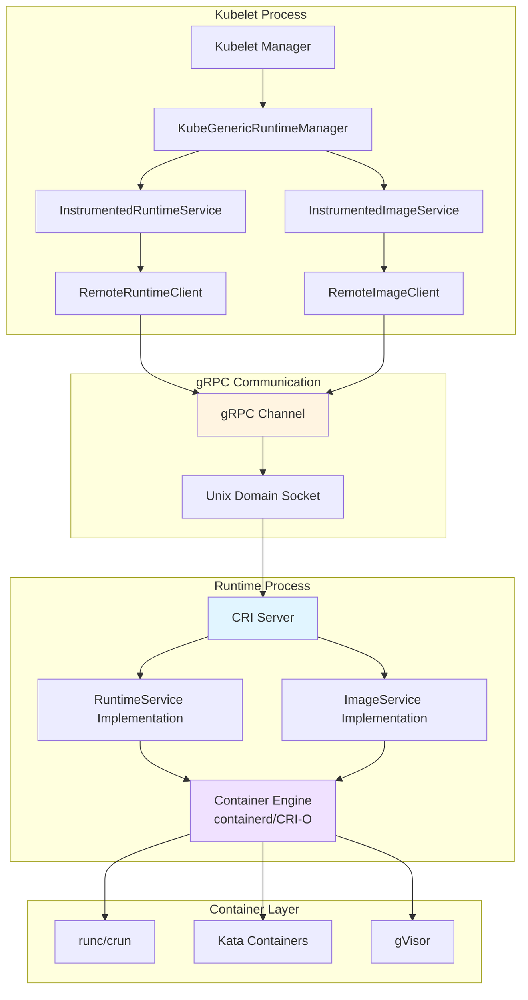
```mermaid
graph TB
    subgraph "Kubelet Process"
        KM[Kubelet Manager]
        KGR[KubeGenericRuntimeManager]
        IRS[InstrumentedRuntimeService]
        IIS[InstrumentedImageService]
        RRC[RemoteRuntimeClient]
        RIC[RemoteImageClient]
    end

    subgraph "gRPC Communication"
        GC[gRPC Channel]
        UDS[Unix Domain Socket]
    end

    subgraph "Runtime Process"
        CRI[CRI Server]
        RS[RuntimeService Implementation]
        IS[ImageService Implementation]
        CE[Container Engine<br/>containerd/CRI-O]
    end

    subgraph "Container Layer"
        RUNC[runc/crun]
        KATA[Kata Containers]
        GVISOR[gVisor]
    end

    KM --> KGR
    KGR --> IRS
    KGR --> IIS
    IRS --> RRC
    IIS --> RIC
    RRC --> GC
    RIC --> GC
    GC --> UDS
    UDS --> CRI
    CRI --> RS
    CRI --> IS
    RS --> CE
    IS --> CE
    CE --> RUNC
    CE --> KATA
    CE --> GVISOR

    style CRI fill:#e1f5ff
    style GC fill:#fff4e1
    style CE fill:#f0e1ff
```

### Protocol Communication

The CRI uses gRPC for all communication, providing:

- **Type Safety**: Protobuf definitions ensure consistent message formats
- **Bidirectional Streaming**: Support for streaming operations (logs, events, exec)
- **Connection Resilience**: Automatic reconnection with exponential backoff
- **Performance**: Efficient binary serialization and HTTP/2 multiplexing
- **Tracing**: Built-in OpenTelemetry integration for observability

**Connection Parameters** (`/staging/src/k8s.io/cri-client/pkg/remote_runtime.go:56-64`):
```go
const (
    // How frequently to report identical errors
    identicalErrorDelay = 1 * time.Minute

    // connection parameters
    maxBackoffDelay      = 3 * time.Second
    baseBackoffDelay     = 100 * time.Millisecond
    minConnectionTimeout = 5 * time.Second
)
```

---

## CRI Architecture

### Service Separation

The CRI divides runtime operations into two distinct services, each with specific responsibilities:

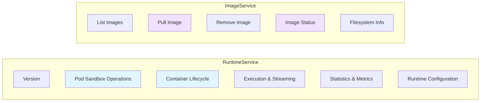
```mermaid
graph LR
    subgraph "RuntimeService"
        RS_VERSION[Version]
        RS_SANDBOX[Pod Sandbox Operations]
        RS_CONTAINER[Container Lifecycle]
        RS_EXEC[Execution & Streaming]
        RS_STATS[Statistics & Metrics]
        RS_CONFIG[Runtime Configuration]
    end

    subgraph "ImageService"
        IS_LIST[List Images]
        IS_PULL[Pull Image]
        IS_REMOVE[Remove Image]
        IS_STATUS[Image Status]
        IS_FSINFO[Filesystem Info]
    end

    style RS_SANDBOX fill:#e1f5ff
    style RS_CONTAINER fill:#e1f5ff
    style IS_PULL fill:#f0e1ff
    style IS_STATUS fill:#f0e1ff
```

### RuntimeService Interface

**Definition** (`/staging/src/k8s.io/cri-api/pkg/apis/services.go:112-128`):
```go
// RuntimeService interface should be implemented by a container runtime.
// The methods should be thread-safe.
type RuntimeService interface {
    RuntimeVersioner
    ContainerManager
    PodSandboxManager
    ContainerStatsManager

    // UpdateRuntimeConfig updates runtime configuration if specified
    UpdateRuntimeConfig(ctx context.Context, runtimeConfig *runtimeapi.RuntimeConfig) error
    // Status returns the status of the runtime.
    Status(ctx context.Context, verbose bool) (*runtimeapi.StatusResponse, error)
    // RuntimeConfig returns the configuration information of the runtime.
    RuntimeConfig(ctx context.Context) (*runtimeapi.RuntimeConfigResponse, error)
    // Close will shutdown the internal gRPC client connection.
    Close() error
}
```

#### RuntimeVersioner Methods

Handles version negotiation and compatibility:

```go
type RuntimeVersioner interface {
    // Version returns the runtime name, runtime version and runtime API version
    Version(ctx context.Context, apiVersion string) (*runtimeapi.VersionResponse, error)
}
```

#### PodSandboxManager Methods

**Interface** (`/staging/src/k8s.io/cri-api/pkg/apis/services.go:67-91`):
```go
type PodSandboxManager interface {
    // RunPodSandbox creates and starts a pod-level sandbox. Runtimes should ensure
    // the sandbox is in ready state.
    RunPodSandbox(ctx context.Context, config *runtimeapi.PodSandboxConfig, runtimeHandler string) (string, error)
    // StopPodSandbox stops the sandbox. If there are any running containers in the
    // sandbox, they should be force terminated.
    StopPodSandbox(ctx context.Context, podSandboxID string) error
    // RemovePodSandbox removes the sandbox. If there are running containers in the
    // sandbox, they should be forcibly removed.
    RemovePodSandbox(ctx context.Context, podSandboxID string) error
    // PodSandboxStatus returns the Status of the PodSandbox.
    PodSandboxStatus(ctx context.Context, podSandboxID string, verbose bool) (*runtimeapi.PodSandboxStatusResponse, error)
    // ListPodSandbox returns a list of Sandbox.
    ListPodSandbox(ctx context.Context, filter *runtimeapi.PodSandboxFilter) ([]*runtimeapi.PodSandbox, error)
    // PortForward prepares a streaming endpoint to forward ports from a PodSandbox, and returns the address.
    PortForward(ctx context.Context, request *runtimeapi.PortForwardRequest) (*runtimeapi.PortForwardResponse, error)
    // UpdatePodSandboxResources synchronously updates the PodSandboxConfig
    UpdatePodSandboxResources(ctx context.Context, request *runtimeapi.UpdatePodSandboxResourcesRequest) (*runtimeapi.UpdatePodSandboxResourcesResponse, error)
}
```

#### ContainerManager Methods

**Interface** (`/staging/src/k8s.io/cri-api/pkg/apis/services.go:32-65`):
```go
type ContainerManager interface {
    // CreateContainer creates a new container in specified PodSandbox.
    CreateContainer(ctx context.Context, podSandboxID string, config *runtimeapi.ContainerConfig, sandboxConfig *runtimeapi.PodSandboxConfig) (string, error)
    // StartContainer starts the container.
    StartContainer(ctx context.Context, containerID string) error
    // StopContainer stops a running container with a grace period (i.e., timeout).
    StopContainer(ctx context.Context, containerID string, timeout int64) error
    // RemoveContainer removes the container.
    RemoveContainer(ctx context.Context, containerID string) error
    // ListContainers lists all containers by filters.
    ListContainers(ctx context.Context, filter *runtimeapi.ContainerFilter) ([]*runtimeapi.Container, error)
    // ContainerStatus returns the status of the container.
    ContainerStatus(ctx context.Context, containerID string, verbose bool) (*runtimeapi.ContainerStatusResponse, error)
    // UpdateContainerResources updates ContainerConfig of the container synchronously.
    UpdateContainerResources(ctx context.Context, containerID string, resources *runtimeapi.ContainerResources) error
    // ExecSync executes a command in the container, and returns the stdout output.
    ExecSync(ctx context.Context, containerID string, cmd []string, timeout time.Duration) (stdout []byte, stderr []byte, err error)
    // Exec prepares a streaming endpoint to execute a command in the container, and returns the address.
    Exec(ctx context.Context, request *runtimeapi.ExecRequest) (*runtimeapi.ExecResponse, error)
    // Attach prepares a streaming endpoint to attach to a running container, and returns the address.
    Attach(ctx context.Context, req *runtimeapi.AttachRequest) (*runtimeapi.AttachResponse, error)
    // ReopenContainerLog asks runtime to reopen the stdout/stderr log file
    ReopenContainerLog(ctx context.Context, ContainerID string) error
    // CheckpointContainer checkpoints a container
    CheckpointContainer(ctx context.Context, options *runtimeapi.CheckpointContainerRequest) error
    // GetContainerEvents gets container events from the CRI runtime
    GetContainerEvents(ctx context.Context, containerEventsCh chan *runtimeapi.ContainerEventResponse, connectionEstablishedCallback func(runtimeapi.RuntimeService_GetContainerEventsClient)) error
}
```

#### ContainerStatsManager Methods

**Interface** (`/staging/src/k8s.io/cri-api/pkg/apis/services.go:93-110`):
```go
type ContainerStatsManager interface {
    // ContainerStats returns stats of the container. If the container does not
    // exist, the call returns an error.
    ContainerStats(ctx context.Context, containerID string) (*runtimeapi.ContainerStats, error)
    // ListContainerStats returns stats of all running containers.
    ListContainerStats(ctx context.Context, filter *runtimeapi.ContainerStatsFilter) ([]*runtimeapi.ContainerStats, error)
    // PodSandboxStats returns stats of the pod. If the pod does not
    // exist, the call returns an error.
    PodSandboxStats(ctx context.Context, podSandboxID string) (*runtimeapi.PodSandboxStats, error)
    // ListPodSandboxStats returns stats of all running pods.
    ListPodSandboxStats(ctx context.Context, filter *runtimeapi.PodSandboxStatsFilter) ([]*runtimeapi.PodSandboxStats, error)
    // ListMetricDescriptors gets the descriptors for the metrics that will be returned in ListPodSandboxMetrics.
    ListMetricDescriptors(ctx context.Context) ([]*runtimeapi.MetricDescriptor, error)
    // ListPodSandboxMetrics returns metrics of all running pods.
    ListPodSandboxMetrics(ctx context.Context) ([]*runtimeapi.PodSandboxMetrics, error)
}
```

### ImageService Interface

**Definition** (`/staging/src/k8s.io/cri-api/pkg/apis/services.go:130-146`):
```go
// ImageManagerService interface should be implemented by a container image
// manager.
// The methods should be thread-safe.
type ImageManagerService interface {
    // ListImages lists the existing images.
    ListImages(ctx context.Context, filter *runtimeapi.ImageFilter) ([]*runtimeapi.Image, error)
    // ImageStatus returns the status of the image.
    ImageStatus(ctx context.Context, image *runtimeapi.ImageSpec, verbose bool) (*runtimeapi.ImageStatusResponse, error)
    // PullImage pulls an image with the authentication config.
    PullImage(ctx context.Context, image *runtimeapi.ImageSpec, auth *runtimeapi.AuthConfig, podSandboxConfig *runtimeapi.PodSandboxConfig) (string, error)
    // RemoveImage removes the image.
    RemoveImage(ctx context.Context, image *runtimeapi.ImageSpec) error
    // ImageFsInfo returns information of the filesystem(s) used to store the read-only layers and the writeable layer.
    ImageFsInfo(ctx context.Context) (*runtimeapi.ImageFsInfoResponse, error)
    // Close will shutdown the internal gRPC client connection.
    Close() error
}
```

---

## Runtime Implementations

### Overview of CRI Runtimes

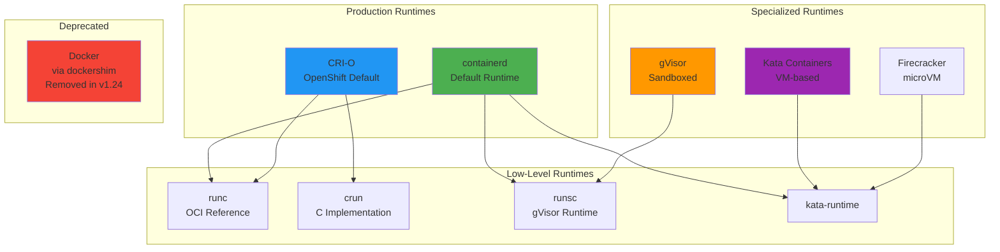
```mermaid
graph TB
    subgraph "Production Runtimes"
        CONTAINERD[containerd<br/>Default Runtime]
        CRIO[CRI-O<br/>OpenShift Default]
    end

    subgraph "Specialized Runtimes"
        GVISOR[gVisor<br/>Sandboxed]
        KATA[Kata Containers<br/>VM-based]
        FIRECRACKER[Firecracker<br/>microVM]
    end

    subgraph "Deprecated"
        DOCKER[Docker<br/>via dockershim<br/>Removed in v1.24]
    end

    subgraph "Low-Level Runtimes"
        RUNC[runc<br/>OCI Reference]
        CRUN[crun<br/>C Implementation]
        RUNSC[runsc<br/>gVisor Runtime]
        KATA_RT[kata-runtime]
    end

    CONTAINERD --> RUNC
    CONTAINERD --> RUNSC
    CONTAINERD --> KATA_RT
    CRIO --> RUNC
    CRIO --> CRUN
    GVISOR --> RUNSC
    KATA --> KATA_RT
    FIRECRACKER --> KATA_RT

    style CONTAINERD fill:#4CAF50
    style CRIO fill:#2196F3
    style GVISOR fill:#FF9800
    style KATA fill:#9C27B0
    style DOCKER fill:#f44336
```

### containerd (Default Runtime)

**Status**: Default runtime since Kubernetes 1.24

**Architecture**:
- **High-level runtime**: Manages container lifecycle, images, storage
- **Low-level runtime**: Delegates to runc/crun/runsc via OCI specification
- **CRI Plugin**: Native CRI implementation (no shim required)

**Key Features**:
- Native CRI support with minimal overhead
- Advanced image management with content-addressable storage
- Snapshotter abstraction for flexible storage backends
- Built-in CNI networking support
- Comprehensive metrics and tracing

**Socket Location**: `/run/containerd/containerd.sock`

**Configuration Example**:
```toml
# /etc/containerd/config.toml
version = 2

[plugins."io.containerd.grpc.v1.cri"]
  # Enable CNI networking
  [plugins."io.containerd.grpc.v1.cri".cni]
    bin_dir = "/opt/cni/bin"
    conf_dir = "/etc/cni/net.d"

  # Configure default runtime
  [plugins."io.containerd.grpc.v1.cri".containerd]
    default_runtime_name = "runc"

    [plugins."io.containerd.grpc.v1.cri".containerd.runtimes.runc]
      runtime_type = "io.containerd.runc.v2"

      [plugins."io.containerd.grpc.v1.cri".containerd.runtimes.runc.options]
        SystemdCgroup = true

    # gVisor runtime handler
    [plugins."io.containerd.grpc.v1.cri".containerd.runtimes.runsc]
      runtime_type = "io.containerd.runsc.v1"

    # Kata runtime handler
    [plugins."io.containerd.grpc.v1.cri".containerd.runtimes.kata]
      runtime_type = "io.containerd.kata.v2"
```

### CRI-O

**Status**: Primary runtime for OpenShift

**Architecture**:
- Purpose-built for Kubernetes (no standalone mode)
- Lightweight with minimal dependencies
- Direct OCI runtime integration

**Key Features**:
- Minimal attack surface (CRI-only implementation)
- Multiple storage backend support (overlay, devicemapper)
- SELinux integration for enhanced security
- Drop-in Docker image compatibility
- CNI networking with multiple plugin support

**Socket Location**: `/var/run/crio/crio.sock`

**Configuration Example**:
```toml
# /etc/crio/crio.conf
[crio]
storage_driver = "overlay"
storage_option = [
    "overlay.mountopt=nodev",
]

[crio.runtime]
default_runtime = "runc"
conmon = "/usr/local/bin/conmon"
conmon_cgroup = "pod"
cgroup_manager = "systemd"

[crio.runtime.runtimes.runc]
runtime_path = "/usr/bin/runc"
runtime_type = "oci"

[crio.runtime.runtimes.crun]
runtime_path = "/usr/bin/crun"
runtime_type = "oci"

[crio.runtime.runtimes.kata]
runtime_path = "/usr/bin/kata-runtime"
runtime_type = "vm"

[crio.image]
pause_image = "registry.k8s.io/pause:3.9"
```

### Docker (Deprecated)

**Status**: Removed in Kubernetes 1.24

**Historical Context**:
- Original Kubernetes runtime (pre-CRI era)
- Required dockershim adapter layer in kubelet
- Maintenance burden and architectural mismatch

**Migration Path**:
1. **Identify**: Check runtime with `kubectl get nodes -o wide`
2. **Plan**: Choose replacement (containerd recommended)
3. **Test**: Validate workloads on test cluster
4. **Migrate**: Drain nodes, install new runtime, rejoin cluster
5. **Verify**: Confirm pod operation and monitoring

**Why Removed**:
- Docker's daemon architecture doesn't align with CRI model
- Additional complexity maintaining dockershim compatibility layer
- Duplicate functionality (Docker includes full container management stack)
- Better alternatives (containerd, CRI-O) purpose-built for Kubernetes

---

## RuntimeService API

### gRPC Protocol Definition

**Service Definition** (`/staging/src/k8s.io/cri-api/pkg/apis/runtime/v1/api.proto:24-140`):
```protobuf
// Runtime service defines the public APIs for remote container runtimes
service RuntimeService {
    // Version returns the runtime name, runtime version, and runtime API version.
    rpc Version(VersionRequest) returns (VersionResponse) {}

    // RunPodSandbox creates and starts a pod-level sandbox. Runtimes must ensure
    // the sandbox is in the ready state on success.
    rpc RunPodSandbox(RunPodSandboxRequest) returns (RunPodSandboxResponse) {}
    // StopPodSandbox stops any running process that is part of the sandbox
    rpc StopPodSandbox(StopPodSandboxRequest) returns (StopPodSandboxResponse) {}
    // RemovePodSandbox removes the sandbox.
    rpc RemovePodSandbox(RemovePodSandboxRequest) returns (RemovePodSandboxResponse) {}
    // PodSandboxStatus returns the status of the PodSandbox.
    rpc PodSandboxStatus(PodSandboxStatusRequest) returns (PodSandboxStatusResponse) {}
    // ListPodSandbox returns a list of PodSandboxes.
    rpc ListPodSandbox(ListPodSandboxRequest) returns (ListPodSandboxResponse) {}

    // CreateContainer creates a new container in specified PodSandbox
    rpc CreateContainer(CreateContainerRequest) returns (CreateContainerResponse) {}
    // StartContainer starts the container.
    rpc StartContainer(StartContainerRequest) returns (StartContainerResponse) {}
    // StopContainer stops a running container with a grace period (i.e., timeout).
    rpc StopContainer(StopContainerRequest) returns (StopContainerResponse) {}
    // RemoveContainer removes the container.
    rpc RemoveContainer(RemoveContainerRequest) returns (RemoveContainerResponse) {}
    // ListContainers lists all containers by filters.
    rpc ListContainers(ListContainersRequest) returns (ListContainersResponse) {}
    // ContainerStatus returns status of the container.
    rpc ContainerStatus(ContainerStatusRequest) returns (ContainerStatusResponse) {}
    // UpdateContainerResources updates ContainerConfig synchronously.
    rpc UpdateContainerResources(UpdateContainerResourcesRequest) returns (UpdateContainerResourcesResponse) {}
    // ReopenContainerLog asks runtime to reopen the stdout/stderr log file
    rpc ReopenContainerLog(ReopenContainerLogRequest) returns (ReopenContainerLogResponse) {}

    // ExecSync runs a command in a container synchronously.
    rpc ExecSync(ExecSyncRequest) returns (ExecSyncResponse) {}
    // Exec prepares a streaming endpoint to execute a command in the container.
    rpc Exec(ExecRequest) returns (ExecResponse) {}
    // Attach prepares a streaming endpoint to attach to a running container.
    rpc Attach(AttachRequest) returns (AttachResponse) {}
    // PortForward prepares a streaming endpoint to forward ports from a PodSandbox.
    rpc PortForward(PortForwardRequest) returns (PortForwardResponse) {}

    // ContainerStats returns stats of the container.
    rpc ContainerStats(ContainerStatsRequest) returns (ContainerStatsResponse) {}
    // ListContainerStats returns stats of all running containers.
    rpc ListContainerStats(ListContainerStatsRequest) returns (ListContainerStatsResponse) {}

    // PodSandboxStats returns stats of the pod sandbox.
    rpc PodSandboxStats(PodSandboxStatsRequest) returns (PodSandboxStatsResponse) {}
    // ListPodSandboxStats returns stats of the pod sandboxes matching a filter.
    rpc ListPodSandboxStats(ListPodSandboxStatsRequest) returns (ListPodSandboxStatsResponse) {}

    // UpdateRuntimeConfig updates the runtime configuration based on the given request.
    rpc UpdateRuntimeConfig(UpdateRuntimeConfigRequest) returns (UpdateRuntimeConfigResponse) {}

    // Status returns the status of the runtime.
    rpc Status(StatusRequest) returns (StatusResponse) {}

    // CheckpointContainer checkpoints a container
    rpc CheckpointContainer(CheckpointContainerRequest) returns (CheckpointContainerResponse) {}

    // GetContainerEvents gets container events from the CRI runtime
    rpc GetContainerEvents(GetEventsRequest) returns (stream ContainerEventResponse) {}

    // ListMetricDescriptors gets the descriptors for the metrics
    rpc ListMetricDescriptors(ListMetricDescriptorsRequest) returns (ListMetricDescriptorsResponse) {}

    // ListPodSandboxMetrics gets pod sandbox metrics from CRI Runtime
    rpc ListPodSandboxMetrics(ListPodSandboxMetricsRequest) returns (ListPodSandboxMetricsResponse) {}

    // RuntimeConfig returns configuration information of the runtime.
    rpc RuntimeConfig(RuntimeConfigRequest) returns (RuntimeConfigResponse) {}

    // UpdatePodSandboxResources synchronously updates the PodSandboxConfig
    rpc UpdatePodSandboxResources(UpdatePodSandboxResourcesRequest) returns (UpdatePodSandboxResourcesResponse) {}
}
```

### Version RPC

**Purpose**: Negotiate API compatibility between kubelet and runtime

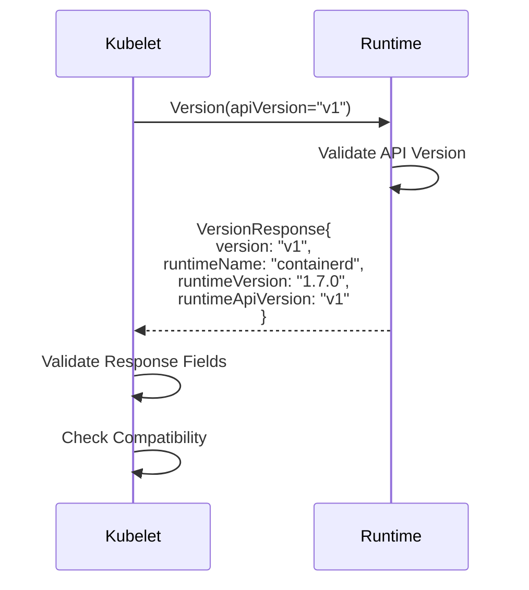
```mermaid
sequenceDiagram
    participant K as Kubelet
    participant R as Runtime

    K->>R: Version(apiVersion="v1")
    R->>R: Validate API Version
    R-->>K: VersionResponse{<br/>  version: "v1",<br/>  runtimeName: "containerd",<br/>  runtimeVersion: "1.7.0",<br/>  runtimeApiVersion: "v1"<br/>}
    K->>K: Validate Response Fields
    K->>K: Check Compatibility
```

**Implementation** (`/staging/src/k8s.io/cri-client/pkg/remote_runtime.go:169-208`):
```go
// Version returns the runtime name, runtime version and runtime API version.
func (r *remoteRuntimeService) Version(ctx context.Context, apiVersion string) (*runtimeapi.VersionResponse, error) {
    r.log(10, "[RemoteRuntimeService] Version", "apiVersion", apiVersion, "timeout", r.timeout)

    ctx, cancel := context.WithTimeout(ctx, r.timeout)
    defer cancel()

    return r.versionV1(ctx, apiVersion)
}

func (r *remoteRuntimeService) versionV1(ctx context.Context, apiVersion string) (*runtimeapi.VersionResponse, error) {
    typedVersion, err := r.runtimeClient.Version(ctx, &runtimeapi.VersionRequest{
        Version: apiVersion,
    })
    if err != nil {
        r.logErr(err, "Version from runtime service failed")
        return nil, err
    }

    r.log(10, "[RemoteRuntimeService] Version Response", "apiVersion", typedVersion)

    var missingFields []string
    if typedVersion.Version == "" {
        missingFields = append(missingFields, "Version")
    }
    if typedVersion.RuntimeName == "" {
        missingFields = append(missingFields, "RuntimeName")
    }
    if typedVersion.RuntimeApiVersion == "" {
        missingFields = append(missingFields, "RuntimeApiVersion")
    }
    if typedVersion.RuntimeVersion == "" {
        missingFields = append(missingFields, "RuntimeVersion")
    }
    if len(missingFields) > 0 {
        return nil, fmt.Errorf("not all fields are set in VersionResponse (missing %s)", strings.Join(missingFields, ", "))
    }

    return typedVersion, err
}
```

### RunPodSandbox RPC

**Purpose**: Create and initialize pod sandbox environment

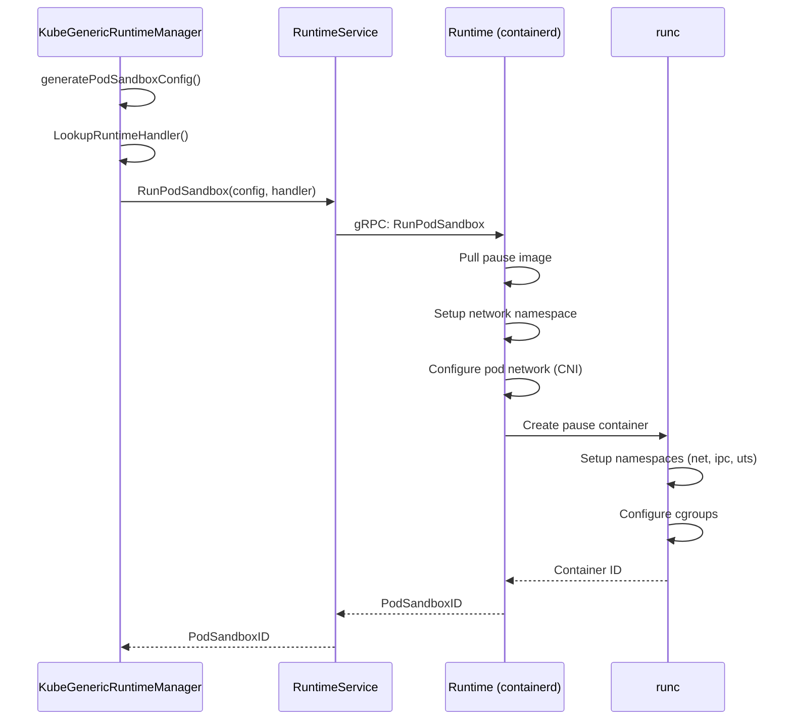
```mermaid
sequenceDiagram
    participant KGR as KubeGenericRuntimeManager
    participant RS as RuntimeService
    participant RT as Runtime (containerd)
    participant RUNC as runc

    KGR->>KGR: generatePodSandboxConfig()
    KGR->>KGR: LookupRuntimeHandler()
    KGR->>RS: RunPodSandbox(config, handler)
    RS->>RT: gRPC: RunPodSandbox
    RT->>RT: Pull pause image
    RT->>RT: Setup network namespace
    RT->>RT: Configure pod network (CNI)
    RT->>RUNC: Create pause container
    RUNC->>RUNC: Setup namespaces (net, ipc, uts)
    RUNC->>RUNC: Configure cgroups
    RUNC-->>RT: Container ID
    RT-->>RS: PodSandboxID
    RS-->>KGR: PodSandboxID
```

**Implementation** (`/staging/src/k8s.io/cri-client/pkg/remote_runtime.go:210-244`):
```go
// RunPodSandbox creates and starts a pod-level sandbox. Runtimes should ensure
// the sandbox is in ready state.
func (r *remoteRuntimeService) RunPodSandbox(ctx context.Context, config *runtimeapi.PodSandboxConfig, runtimeHandler string) (string, error) {
    // Use 2 times longer timeout for sandbox operation (4 mins by default)
    // TODO: Make the pod sandbox timeout configurable.
    timeout := r.timeout * 2

    r.log(10, "[RemoteRuntimeService] RunPodSandbox", "config", config, "runtimeHandler", runtimeHandler, "timeout", timeout)

    ctx, cancel := context.WithTimeout(ctx, timeout)
    defer cancel()

    resp, err := r.runtimeClient.RunPodSandbox(ctx, &runtimeapi.RunPodSandboxRequest{
        Config:         config,
        RuntimeHandler: runtimeHandler,
    })

    if err != nil {
        r.logErr(err, "RunPodSandbox from runtime service failed")
        return "", err
    }

    podSandboxID := resp.PodSandboxId

    if podSandboxID == "" {
        errorMessage := fmt.Sprintf("PodSandboxId is not set for sandbox %q", config.Metadata)
        err := errors.New(errorMessage)
        r.logErr(err, "RunPodSandbox failed")
        return "", err
    }

    r.log(10, "[RemoteRuntimeService] RunPodSandbox Response", "podSandboxID", podSandboxID)

    return podSandboxID, nil
}
```

### CreateContainer RPC

**Purpose**: Create container within existing pod sandbox

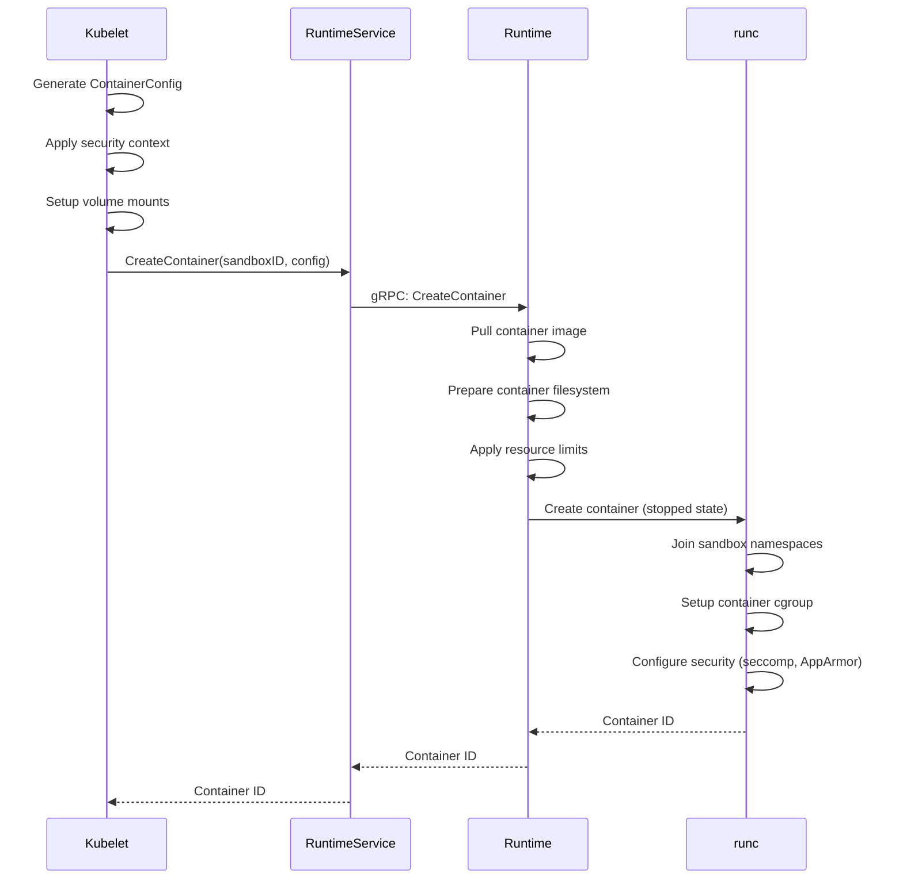
```mermaid
sequenceDiagram
    participant K as Kubelet
    participant RS as RuntimeService
    participant RT as Runtime
    participant RUNC as runc

    K->>K: Generate ContainerConfig
    K->>K: Apply security context
    K->>K: Setup volume mounts
    K->>RS: CreateContainer(sandboxID, config)
    RS->>RT: gRPC: CreateContainer
    RT->>RT: Pull container image
    RT->>RT: Prepare container filesystem
    RT->>RT: Apply resource limits
    RT->>RUNC: Create container (stopped state)
    RUNC->>RUNC: Join sandbox namespaces
    RUNC->>RUNC: Setup container cgroup
    RUNC->>RUNC: Configure security (seccomp, AppArmor)
    RUNC-->>RT: Container ID
    RT-->>RS: Container ID
    RS-->>K: Container ID
```

### StartContainer RPC

**Purpose**: Start previously created container

**Flow**:
1. Runtime receives container ID
2. Runtime invokes OCI runtime (runc) start command
3. Container process begins execution
4. Runtime monitors container state
5. Returns success or error

### Container Lifecycle Operations

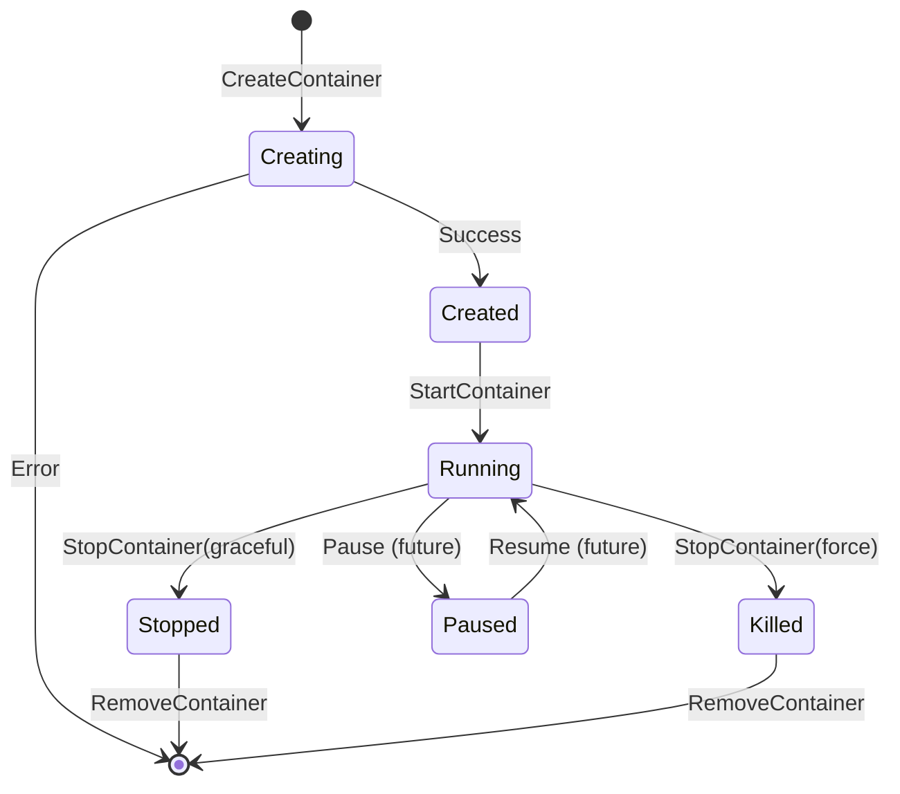
```mermaid
stateDiagram-v2
    [*] --> Creating: CreateContainer
    Creating --> Created: Success
    Creating --> [*]: Error
    Created --> Running: StartContainer
    Running --> Stopped: StopContainer(graceful)
    Running --> Killed: StopContainer(force)
    Stopped --> [*]: RemoveContainer
    Killed --> [*]: RemoveContainer
    Running --> Paused: Pause (future)
    Paused --> Running: Resume (future)
```

### ExecSync vs Exec RPCs

**ExecSync** - Synchronous execution:
- Blocks until command completes
- Returns stdout/stderr directly
- Suitable for short-lived commands
- No streaming support
- Used by: readiness/liveness probes, init scripts

**Exec** - Streaming execution:
- Returns URL for WebSocket/SPDY connection
- Supports interactive sessions
- Handles stdin/stdout/stderr streams
- TTY allocation support
- Used by: kubectl exec, debugging sessions

### Statistics RPCs

**Container-Level Stats**:
- CPU usage (user, system, throttling)
- Memory usage (working set, RSS, page faults)
- Filesystem usage (reads, writes)
- Network I/O (rx, tx bytes)

**Pod-Level Stats**:
- Aggregated container stats
- Sandbox network statistics
- Pod overhead accounting
- Shared resource usage

---

## ImageService API

### gRPC Protocol Definition

**Service Definition** (`/staging/src/k8s.io/cri-api/pkg/apis/runtime/v1/api.proto:142-158`):
```protobuf
// ImageService defines the public APIs for managing images.
service ImageService {
    // ListImages lists existing images.
    rpc ListImages(ListImagesRequest) returns (ListImagesResponse) {}
    // ImageStatus returns the status of the image. If the image is not
    // present, returns a response with ImageStatusResponse.Image set to nil.
    rpc ImageStatus(ImageStatusRequest) returns (ImageStatusResponse) {}
    // PullImage pulls an image with authentication config.
    rpc PullImage(PullImageRequest) returns (PullImageResponse) {}
    // RemoveImage removes the image.
    // This call is idempotent, and must not return an error if the image has
    // already been removed.
    rpc RemoveImage(RemoveImageRequest) returns (RemoveImageResponse) {}
    // ImageFSInfo returns information of the filesystem that is used to store images.
    rpc ImageFsInfo(ImageFsInfoRequest) returns (ImageFsInfoResponse) {}
}
```

### PullImage Flow

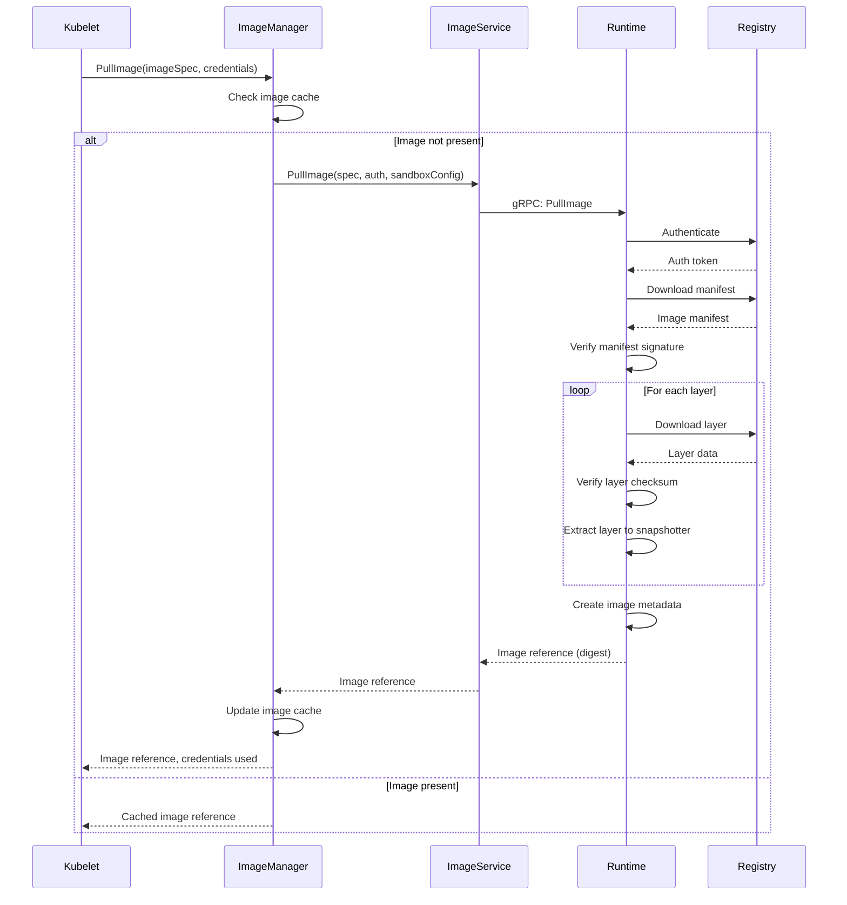
```mermaid
sequenceDiagram
    participant K as Kubelet
    participant IM as ImageManager
    participant IS as ImageService
    participant RT as Runtime
    participant REG as Registry

    K->>IM: PullImage(imageSpec, credentials)
    IM->>IM: Check image cache
    alt Image not present
        IM->>IS: PullImage(spec, auth, sandboxConfig)
        IS->>RT: gRPC: PullImage
        RT->>REG: Authenticate
        REG-->>RT: Auth token
        RT->>REG: Download manifest
        REG-->>RT: Image manifest
        RT->>RT: Verify manifest signature
        loop For each layer
            RT->>REG: Download layer
            REG-->>RT: Layer data
            RT->>RT: Verify layer checksum
            RT->>RT: Extract layer to snapshotter
        end
        RT->>RT: Create image metadata
        RT-->>IS: Image reference (digest)
        IS-->>IM: Image reference
        IM->>IM: Update image cache
        IM-->>K: Image reference, credentials used
    else Image present
        IM-->>K: Cached image reference
    end
```

**Implementation** (`/staging/src/k8s.io/cri-client/pkg/remote_image.go:186-200`):
```go
// PullImage pulls an image with authentication config.
func (r *remoteImageService) PullImage(ctx context.Context, image *runtimeapi.ImageSpec, auth *runtimeapi.AuthConfig, podSandboxConfig *runtimeapi.PodSandboxConfig) (string, error) {
    ctx, cancel := context.WithCancel(ctx)
    defer cancel()

    return r.pullImageV1(ctx, image, auth, podSandboxConfig)
}

func (r *remoteImageService) pullImageV1(ctx context.Context, image *runtimeapi.ImageSpec, auth *runtimeapi.AuthConfig, podSandboxConfig *runtimeapi.PodSandboxConfig) (string, error) {
    resp, err := r.imageClient.PullImage(ctx, &runtimeapi.PullImageRequest{
        Image:         image,
        Auth:          auth,
        SandboxConfig: podSandboxConfig,
    })
    if err != nil {
        r.logErr(err, "PullImage from image service failed", "image", image.Image)
        return "", err
    }

    imageRef := resp.ImageRef
    if imageRef == "" {
        err := fmt.Errorf("ImageRef is not set for image %q", image.Image)
        r.logErr(err, "PullImage failed")
        return "", err
    }

    return imageRef, nil
}
```

### ImageStatus RPC

**Purpose**: Query image existence and metadata

**Returns**:
- Image ID (content-addressable)
- Image size (compressed and uncompressed)
- RepoTags and RepoDigests
- Image creation timestamp
- Image configuration (optional)

### ListImages RPC

**Purpose**: Enumerate available images

**Filtering**:
- By image reference pattern
- By specific annotations
- Include/exclude pinned images

### ImageFsInfo RPC

**Purpose**: Report filesystem usage for image storage

**Metrics**:
- Total capacity
- Used bytes
- Available bytes
- Inode statistics
- Filesystem UUIDs

---

## Pod Sandbox Concept

### Design Rationale

The pod sandbox provides a stable execution environment that outlives individual containers. This design enables:

1. **Container Restarts**: Containers can crash and restart without losing network identity
2. **Namespace Sharing**: Containers in a pod share network, IPC, and optionally PID namespaces
3. **Pod-Level Resources**: Network configuration, volumes, and security context applied once
4. **Atomic Operations**: Entire pod can be started or stopped as a unit

### Pause Container Architecture

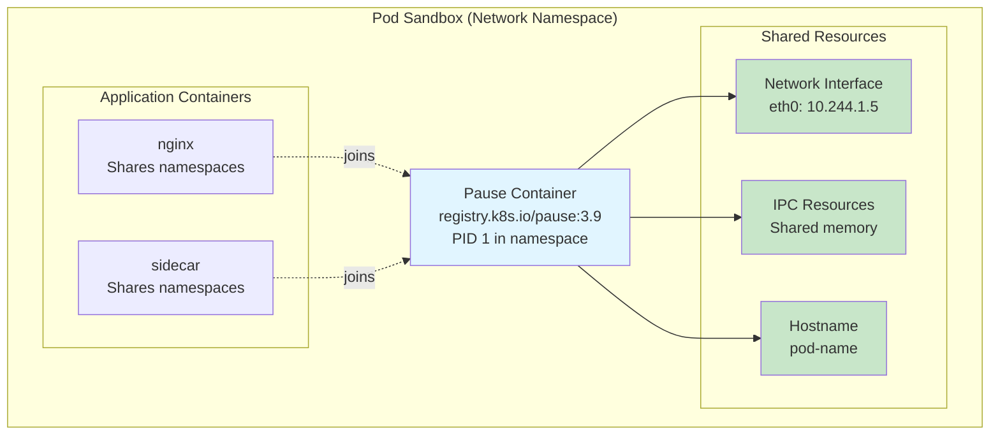
```mermaid
graph TB
    subgraph "Pod Sandbox (Network Namespace)"
        PAUSE[Pause Container<br/>registry.k8s.io/pause:3.9<br/>PID 1 in namespace]

        subgraph "Application Containers"
            APP1[nginx<br/>Shares namespaces]
            APP2[sidecar<br/>Shares namespaces]
        end

        subgraph "Shared Resources"
            NET[Network Interface<br/>eth0: 10.244.1.5]
            IPC[IPC Resources<br/>Shared memory]
            UTS[Hostname<br/>pod-name]
        end
    end

    PAUSE --> NET
    PAUSE --> IPC
    PAUSE --> UTS
    APP1 -.->|joins| PAUSE
    APP2 -.->|joins| PAUSE

    style PAUSE fill:#e1f5ff
    style NET fill:#c8e6c9
    style IPC fill:#c8e6c9
    style UTS fill:#c8e6c9
```

### Pause Container Implementation

**Purpose**:
- Minimal container that holds pod namespaces
- Does nothing except sleep indefinitely
- Extremely small (<1MB) to minimize overhead
- Reaps zombie processes in shared PID namespace

**Source Code** (simplified):
```c
// pause.c - Minimal pause container implementation
#include <signal.h>
#include <stdio.h>
#include <stdlib.h>
#include <unistd.h>

static void sigdown(int signo) {
  psignal(signo, "Shutting down, got signal");
  exit(0);
}

static void sigreap(int signo) {
  while (waitpid(-1, NULL, WNOHANG) > 0);
}

int main() {
  // Handle termination signals
  if (signal(SIGINT, sigdown) == SIG_ERR)
    return 1;
  if (signal(SIGTERM, sigdown) == SIG_ERR)
    return 2;

  // Reap zombie processes if running as PID 1
  if (signal(SIGCHLD, sigreap) == SIG_ERR)
    return 3;

  // Sleep forever
  for (;;)
    pause();
}
```

### Namespace Configuration

**Supported Namespace Modes** (`/staging/src/k8s.io/cri-api/pkg/apis/runtime/v1/api.proto:282-300`):
```protobuf
enum NamespaceMode {
    // A POD namespace is common to all containers in a pod.
    POD       = 0;
    // A CONTAINER namespace is restricted to a single container.
    CONTAINER = 1;
    // A NODE namespace is the namespace of the Kubernetes node.
    NODE      = 2;
    // TARGET targets the namespace of another container.
    TARGET    = 3;
}
```

**Network Namespace (NET)**:
- **POD**: Containers share network stack (default)
- **NODE**: Host network mode
- **CONTAINER**: Isolated network per container (rare)

**PID Namespace**:
- **POD**: Containers see each other's processes
- **CONTAINER**: Isolated PID namespace (default)
- **NODE**: See all host processes

**IPC Namespace**:
- **POD**: Shared memory, semaphores (default)
- **NODE**: Host IPC resources
- **CONTAINER**: Isolated IPC

### Sandbox Lifecycle

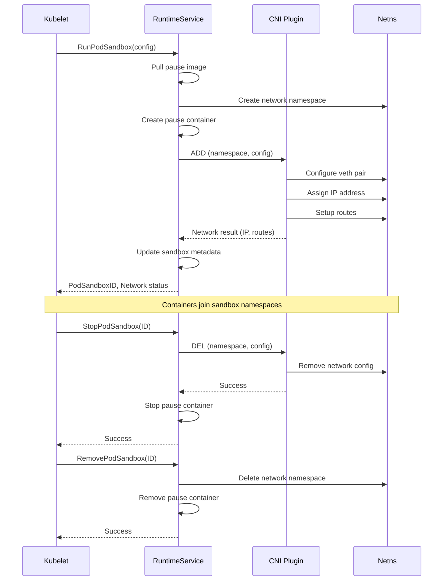
```mermaid
sequenceDiagram
    participant K as Kubelet
    participant RS as RuntimeService
    participant CNI as CNI Plugin
    participant NS as Netns

    K->>RS: RunPodSandbox(config)
    RS->>RS: Pull pause image
    RS->>NS: Create network namespace
    RS->>RS: Create pause container
    RS->>CNI: ADD (namespace, config)
    CNI->>NS: Configure veth pair
    CNI->>NS: Assign IP address
    CNI->>NS: Setup routes
    CNI-->>RS: Network result (IP, routes)
    RS->>RS: Update sandbox metadata
    RS-->>K: PodSandboxID, Network status

    Note over K,NS: Containers join sandbox namespaces

    K->>RS: StopPodSandbox(ID)
    RS->>CNI: DEL (namespace, config)
    CNI->>NS: Remove network config
    CNI-->>RS: Success
    RS->>RS: Stop pause container
    RS-->>K: Success

    K->>RS: RemovePodSandbox(ID)
    RS->>NS: Delete network namespace
    RS->>RS: Remove pause container
    RS-->>K: Success
```

---

## Streaming Server

### Architecture Overview

The CRI separates streaming operations (exec, attach, port-forward) from the main gRPC channel to avoid blocking and enable efficient bidirectional communication.

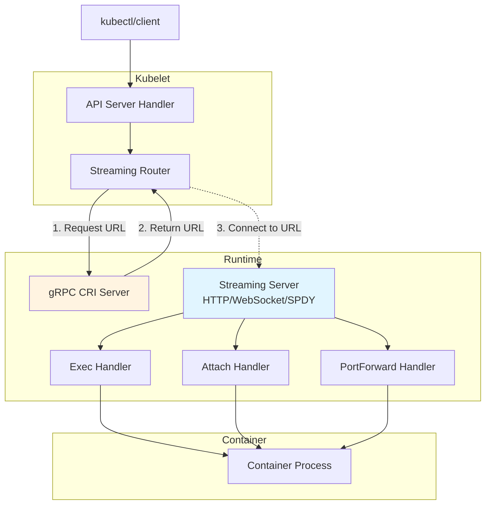
```mermaid
graph TB
    subgraph "Kubelet"
        API[API Server Handler]
        STREAM[Streaming Router]
    end

    subgraph "Runtime"
        GRPC[gRPC CRI Server]
        STRM_SRV[Streaming Server<br/>HTTP/WebSocket/SPDY]
        EXEC[Exec Handler]
        ATTACH[Attach Handler]
        PF[PortForward Handler]
    end

    subgraph "Container"
        CONT[Container Process]
    end

    CLIENT[kubectl/client] --> API
    API --> STREAM
    STREAM -->|1. Request URL| GRPC
    GRPC -->|2. Return URL| STREAM
    STREAM -.->|3. Connect to URL| STRM_SRV
    STRM_SRV --> EXEC
    STRM_SRV --> ATTACH
    STRM_SRV --> PF
    EXEC --> CONT
    ATTACH --> CONT
    PF --> CONT

    style STRM_SRV fill:#e1f5ff
    style GRPC fill:#fff4e1
```

### Exec Operation Flow

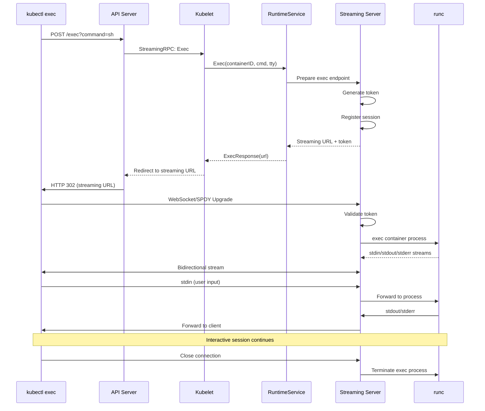
```mermaid
sequenceDiagram
    participant C as kubectl exec
    participant API as API Server
    participant K as Kubelet
    participant RS as RuntimeService
    participant SS as Streaming Server
    participant RUNC as runc

    C->>API: POST /exec?command=sh
    API->>K: StreamingRPC: Exec
    K->>RS: Exec(containerID, cmd, tty)
    RS->>SS: Prepare exec endpoint
    SS->>SS: Generate token
    SS->>SS: Register session
    SS-->>RS: Streaming URL + token
    RS-->>K: ExecResponse(url)
    K-->>API: Redirect to streaming URL
    API->>C: HTTP 302 (streaming URL)
    C->>SS: WebSocket/SPDY Upgrade
    SS->>SS: Validate token
    SS->>RUNC: exec container process
    RUNC-->>SS: stdin/stdout/stderr streams
    SS<<->>C: Bidirectional stream
    C->>SS: stdin (user input)
    SS->>RUNC: Forward to process
    RUNC->>SS: stdout/stderr
    SS->>C: Forward to client
    Note over C,RUNC: Interactive session continues
    C->>SS: Close connection
    SS->>RUNC: Terminate exec process
```

### Attach Operation Flow

**Difference from Exec**:
- Attaches to main container process (PID 1)
- No new process spawned
- Useful for debugging running applications

### PortForward Operation Flow

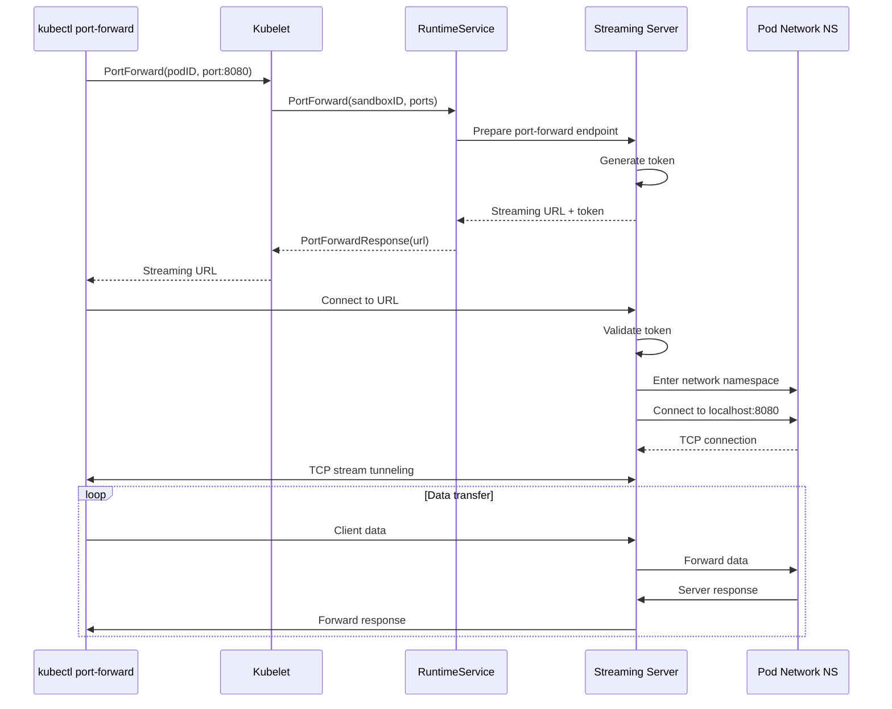
```mermaid
sequenceDiagram
    participant C as kubectl port-forward
    participant K as Kubelet
    participant RS as RuntimeService
    participant SS as Streaming Server
    participant POD as Pod Network NS

    C->>K: PortForward(podID, port:8080)
    K->>RS: PortForward(sandboxID, ports)
    RS->>SS: Prepare port-forward endpoint
    SS->>SS: Generate token
    SS-->>RS: Streaming URL + token
    RS-->>K: PortForwardResponse(url)
    K-->>C: Streaming URL
    C->>SS: Connect to URL
    SS->>SS: Validate token
    SS->>POD: Enter network namespace
    SS->>POD: Connect to localhost:8080
    POD-->>SS: TCP connection
    SS<<->>C: TCP stream tunneling

    loop Data transfer
        C->>SS: Client data
        SS->>POD: Forward data
        POD->>SS: Server response
        SS->>C: Forward response
    end
```

### Streaming Protocol Support

**SPDY (HTTP/2 Precursor)**:
- Original Kubernetes streaming protocol
- Multiplexed streams over single connection
- Built-in support in client-go
- **Status**: Being phased out

**WebSocket**:
- Modern replacement for SPDY
- Wide client/proxy support
- Simpler implementation
- **Status**: Preferred for new implementations

**Implementation Choice**:
- containerd: Supports both SPDY and WebSocket
- CRI-O: Supports both SPDY and WebSocket
- Runtime decides which protocols to support

---

## Runtime Version Negotiation

### Compatibility Matrix

The CRI maintains backward compatibility through careful API evolution:

| Kubelet Version | CRI API Version | containerd Version | CRI-O Version |
|-----------------|----------------|-------------------|---------------|
| v1.30+          | v1             | v1.7+             | v1.30+        |
| v1.29           | v1             | v1.7+             | v1.29         |
| v1.28           | v1             | v1.6+             | v1.28         |
| v1.27           | v1             | v1.6+             | v1.27         |
| v1.26           | v1             | v1.6+             | v1.26         |
| v1.25           | v1             | v1.5+             | v1.25         |

### Version Negotiation Process

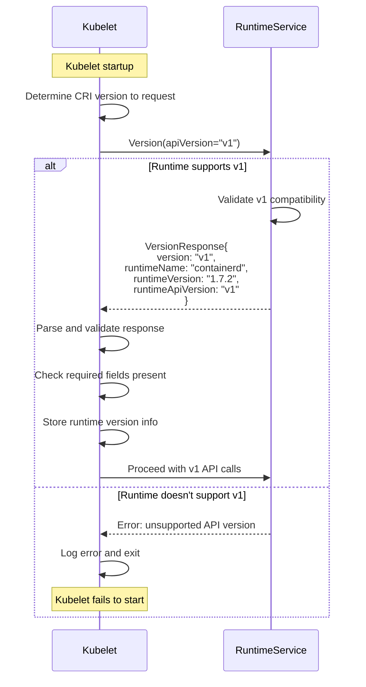
```mermaid
sequenceDiagram
    participant K as Kubelet
    participant RS as RuntimeService

    Note over K: Kubelet startup
    K->>K: Determine CRI version to request
    K->>RS: Version(apiVersion="v1")

    alt Runtime supports v1
        RS->>RS: Validate v1 compatibility
        RS-->>K: VersionResponse{<br/>  version: "v1",<br/>  runtimeName: "containerd",<br/>  runtimeVersion: "1.7.2",<br/>  runtimeApiVersion: "v1"<br/>}
        K->>K: Parse and validate response
        K->>K: Check required fields present
        K->>K: Store runtime version info
        K->>RS: Proceed with v1 API calls
    else Runtime doesn't support v1
        RS-->>K: Error: unsupported API version
        K->>K: Log error and exit
        Note over K: Kubelet fails to start
    end
```

**Validation Logic** (`/staging/src/k8s.io/cri-client/pkg/remote_runtime.go:190-208`):
```go
var missingFields []string
if typedVersion.Version == "" {
    missingFields = append(missingFields, "Version")
}
if typedVersion.RuntimeName == "" {
    missingFields = append(missingFields, "RuntimeName")
}
if typedVersion.RuntimeApiVersion == "" {
    missingFields = append(missingFields, "RuntimeApiVersion")
}
if typedVersion.RuntimeVersion == "" {
    missingFields = append(missingFields, "RuntimeVersion")
}
if len(missingFields) > 0 {
    return nil, fmt.Errorf("not all fields are set in VersionResponse (missing %s)", strings.Join(missingFields, ", "))
}
```

### API Evolution Strategy

**Additive Changes**:
- New fields added with default values
- New RPCs added to service definition
- Backward compatible (old clients still work)

**Breaking Changes**:
- Require new major version (v2, v3, etc.)
- Deprecated features removed after grace period
- Migration guide provided

**Feature Gates**:
- Optional features negotiated via RuntimeConfig
- Runtimes advertise supported features in Status RPC
- Kubelet checks feature availability before use

---

## Runtime Selection

### RuntimeClass Resource

**Purpose**: Map workloads to specific runtime handlers

**API Definition**:
```yaml
apiVersion: node.k8s.io/v1
kind: RuntimeClass
metadata:
  name: gvisor
handler: runsc
---
apiVersion: node.k8s.io/v1
kind: RuntimeClass
metadata:
  name: kata-containers
handler: kata
scheduling:
  nodeSelector:
    runtime: kata-enabled
  tolerations:
  - effect: NoSchedule
    key: runtime
    value: kata
```

### RuntimeClass Manager

**Implementation** (`/pkg/kubelet/runtimeclass/runtimeclass_manager.go:28-78`):
```go
// Manager caches RuntimeClass API objects, and provides accessors to the Kubelet.
type Manager struct {
    informerFactory informers.SharedInformerFactory
    lister          nodev1.RuntimeClassLister
}

// LookupRuntimeHandler returns the RuntimeHandler string associated with the given RuntimeClass
// name (or the default of "" for nil). If the RuntimeClass is not found, it returns an
// errors.NotFound error.
func (m *Manager) LookupRuntimeHandler(runtimeClassName *string) (string, error) {
    if runtimeClassName == nil || *runtimeClassName == "" {
        // The default RuntimeClass always resolves to the empty runtime handler.
        return "", nil
    }

    name := *runtimeClassName

    rc, err := m.lister.Get(name)
    if err != nil {
        if errors.IsNotFound(err) {
            return "", err
        }
        return "", fmt.Errorf("failed to lookup RuntimeClass %s: %v", name, err)
    }

    return rc.Handler, nil
}
```

### Pod Runtime Selection Flow

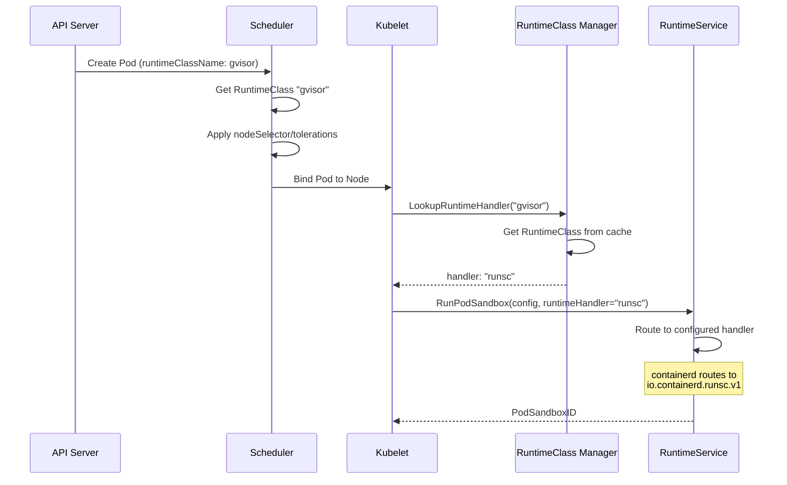
```mermaid
sequenceDiagram
    participant API as API Server
    participant SCHED as Scheduler
    participant K as Kubelet
    participant RCM as RuntimeClass Manager
    participant RS as RuntimeService

    API->>SCHED: Create Pod (runtimeClassName: gvisor)
    SCHED->>SCHED: Get RuntimeClass "gvisor"
    SCHED->>SCHED: Apply nodeSelector/tolerations
    SCHED->>K: Bind Pod to Node
    K->>RCM: LookupRuntimeHandler("gvisor")
    RCM->>RCM: Get RuntimeClass from cache
    RCM-->>K: handler: "runsc"
    K->>RS: RunPodSandbox(config, runtimeHandler="runsc")
    RS->>RS: Route to configured handler
    Note over RS: containerd routes to<br/>io.containerd.runsc.v1
    RS-->>K: PodSandboxID
```

### Handler Configuration

**containerd Example**:
```toml
[plugins."io.containerd.grpc.v1.cri".containerd.runtimes.runc]
  runtime_type = "io.containerd.runc.v2"

[plugins."io.containerd.grpc.v1.cri".containerd.runtimes.runsc]
  runtime_type = "io.containerd.runsc.v1"

[plugins."io.containerd.grpc.v1.cri".containerd.runtimes.kata]
  runtime_type = "io.containerd.kata.v2"
```

**CRI-O Example**:
```toml
[crio.runtime.runtimes.runc]
runtime_path = "/usr/bin/runc"
runtime_type = "oci"

[crio.runtime.runtimes.runsc]
runtime_path = "/usr/local/bin/runsc"
runtime_type = "oci"

[crio.runtime.runtimes.kata]
runtime_path = "/usr/bin/kata-runtime"
runtime_type = "vm"
```

---

## gVisor and Kata Containers

### Security-Enhanced Runtimes Comparison

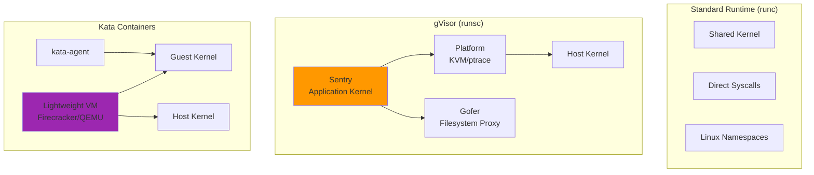
```mermaid
graph TB
    subgraph "Standard Runtime (runc)"
        RUNC_KERNEL[Shared Kernel]
        RUNC_SYSCALL[Direct Syscalls]
        RUNC_NS[Linux Namespaces]
    end

    subgraph "gVisor (runsc)"
        GVISOR_SENTRY[Sentry<br/>Application Kernel]
        GVISOR_GOFER[Gofer<br/>Filesystem Proxy]
        GVISOR_PLATFORM[Platform<br/>KVM/ptrace]
        GVISOR_HOSTKERNEL[Host Kernel]

        GVISOR_SENTRY --> GVISOR_PLATFORM
        GVISOR_PLATFORM --> GVISOR_HOSTKERNEL
        GVISOR_SENTRY --> GVISOR_GOFER
    end

    subgraph "Kata Containers"
        KATA_VM[Lightweight VM<br/>Firecracker/QEMU]
        KATA_GUEST[Guest Kernel]
        KATA_AGENT[kata-agent]
        KATA_HOST[Host Kernel]

        KATA_VM --> KATA_GUEST
        KATA_AGENT --> KATA_GUEST
        KATA_VM --> KATA_HOST
    end

    style GVISOR_SENTRY fill:#FF9800
    style KATA_VM fill:#9C27B0
```

### gVisor Architecture

**Key Components**:

1. **Sentry**: User-space kernel implementation in Go
   - Implements ~200 Linux syscalls
   - Memory-safe implementation
   - Intercepts all application syscalls
   - Performs syscall filtering and emulation

2. **Gofer**: Filesystem proxy
   - Runs in separate process
   - Mediates file I/O operations
   - Provides filesystem access control
   - Implements FUSE-like interface

3. **Platform**: Syscall interception mechanism
   - **KVM**: Hardware virtualization for isolation
   - **ptrace**: Software-based syscall interception

**Security Benefits**:
- Reduced kernel attack surface
- Syscall filtering at user-space level
- No direct kernel access from containers
- Defense in depth through multiple layers

**Performance Trade-offs**:
- Syscall overhead (user-space handling)
- Filesystem I/O slower (Gofer mediation)
- Network I/O overhead (packet processing in Sentry)
- CPU overhead: 10-30% compared to runc
- Memory overhead: ~15MB per container

**Use Cases**:
- Multi-tenant platforms (serverless, CI/CD)
- Untrusted workload execution
- Compliance requirements (strong isolation)
- Defense against kernel exploits

### Kata Containers Architecture

**Key Components**:

1. **Lightweight VM**: Minimal virtual machine per pod
   - Firecracker: microVM optimized for containers
   - QEMU: Full-featured virtualization
   - Cloud Hypervisor: Rust-based minimal VMM

2. **Guest Kernel**: Minimal Linux kernel in VM
   - Custom kernel configuration
   - Only required drivers enabled
   - Fast boot time (<150ms)

3. **kata-agent**: Agent running in VM
   - Implements CRI operations
   - Manages containers within VM
   - Communicates with kata-runtime via virtio-vsock

4. **kata-runtime**: OCI runtime on host
   - Manages VM lifecycle
   - Translates CRI calls to kata-agent protocol
   - Handles networking and storage setup

**Security Benefits**:
- Hardware-enforced isolation (VT-x/AMD-V)
- Separate kernel per pod
- No shared kernel vulnerabilities
- Strong resource isolation

**Performance Trade-offs**:
- VM boot overhead: ~150ms per pod
- Memory overhead: ~100-130MB per pod
- CPU overhead: 5-10% (virtualization)
- I/O overhead minimal with virtio

**Use Cases**:
- Regulatory compliance (hard isolation required)
- Different kernel versions per workload
- Windows containers on Linux hosts
- Bare-metal security for containers

### Runtime Comparison Table

| Feature | runc | gVisor | Kata Containers |
|---------|------|--------|-----------------|
| **Isolation Mechanism** | Namespaces + cgroups | User-space kernel | Hardware VM |
| **Kernel Sharing** | Shared | Shared (limited syscalls) | Isolated |
| **Startup Time** | <50ms | <100ms | ~150ms |
| **Memory Overhead** | ~5MB | ~15MB | ~120MB |
| **CPU Overhead** | Baseline | +15-30% | +5-10% |
| **Syscall Performance** | Native | Emulated | Near-native |
| **I/O Performance** | Native | Reduced | Near-native |
| **Security** | Namespace isolation | Syscall filtering | Hardware isolation |
| **Compatibility** | Full Linux | ~80% syscalls | Full Linux |
| **Use Case** | General purpose | Untrusted code | Strong isolation |

### Integration Example

**Pod Specification**:
```yaml
apiVersion: v1
kind: Pod
metadata:
  name: secure-workload
spec:
  runtimeClassName: gvisor  # or kata-containers
  containers:
  - name: app
    image: nginx:latest
    resources:
      limits:
        memory: "256Mi"
        cpu: "500m"
```

**Sandbox Creation** (`/pkg/kubelet/kuberuntime/kuberuntime_sandbox.go:38-76`):
```go
func (m *kubeGenericRuntimeManager) createPodSandbox(ctx context.Context, pod *v1.Pod, attempt uint32) (string, string, error) {
    logger := klog.FromContext(ctx)
    podSandboxConfig, err := m.generatePodSandboxConfig(ctx, pod, attempt)
    if err != nil {
        message := fmt.Sprintf("Failed to generate sandbox config for pod %q: %v", format.Pod(pod), err)
        logger.Error(err, "Failed to generate sandbox config for pod", "pod", klog.KObj(pod))
        return "", message, err
    }

    runtimeHandler := ""
    if m.runtimeClassManager != nil {
        runtimeHandler, err = m.runtimeClassManager.LookupRuntimeHandler(pod.Spec.RuntimeClassName)
        if err != nil {
            message := fmt.Sprintf("Failed to create sandbox for pod %q: %v", format.Pod(pod), err)
            return "", message, err
        }
        if runtimeHandler != "" {
            logger.V(2).Info("Running pod with runtime handler", "pod", klog.KObj(pod), "runtimeHandler", runtimeHandler)
        }
    }

    podSandBoxID, err := m.runtimeService.RunPodSandbox(ctx, podSandboxConfig, runtimeHandler)
    if err != nil {
        message := fmt.Sprintf("Failed to create sandbox for pod %q: %v", format.Pod(pod), err)
        logger.Error(err, "Failed to create sandbox for pod", "pod", klog.KObj(pod))
        return "", message, err
    }

    return podSandBoxID, "", nil
}
```

---

## Runtime Configuration

### Kubelet Runtime Flags

**Connection Configuration**:
```bash
kubelet \
  --container-runtime-endpoint=unix:///run/containerd/containerd.sock \
  --image-service-endpoint=unix:///run/containerd/containerd.sock \
  --runtime-request-timeout=2m
```

**Flag Descriptions**:
- `--container-runtime-endpoint`: RuntimeService gRPC socket path
- `--image-service-endpoint`: ImageService gRPC socket path (can be same as runtime)
- `--runtime-request-timeout`: Timeout for CRI operations (default: 2m)

### Connection Establishment

**Implementation** (`/staging/src/k8s.io/cri-client/pkg/remote_runtime.go:83-139`):
```go
// NewRemoteRuntimeService creates a new internalapi.RuntimeService.
func NewRemoteRuntimeService(endpoint string, connectionTimeout time.Duration, tp trace.TracerProvider, logger *klog.Logger) (internalapi.RuntimeService, error) {
    internal.Log(logger, 3, "Connecting to runtime service", "endpoint", endpoint)
    addr, dialer, err := util.GetAddressAndDialer(endpoint)
    if err != nil {
        return nil, err
    }
    ctx, cancel := context.WithTimeout(context.Background(), connectionTimeout)
    defer cancel()

    var dialOpts []grpc.DialOption
    dialOpts = append(dialOpts,
        grpc.WithTransportCredentials(insecure.NewCredentials()),
        grpc.WithAuthority("localhost"),
        grpc.WithContextDialer(dialer),
        grpc.WithDefaultCallOptions(grpc.MaxCallRecvMsgSize(maxMsgSize)))
    if tp != nil {
        tracingOpts := []otelgrpc.Option{
            otelgrpc.WithMessageEvents(otelgrpc.ReceivedEvents, otelgrpc.SentEvents),
            otelgrpc.WithPropagators(tracing.Propagators()),
            otelgrpc.WithTracerProvider(tp),
        }
        dialOpts = append(dialOpts,
            grpc.WithStatsHandler(otelgrpc.NewClientHandler(tracingOpts...)))
    }

    connParams := grpc.ConnectParams{
        Backoff: backoff.DefaultConfig,
    }
    connParams.MinConnectTimeout = minConnectionTimeout
    connParams.Backoff.BaseDelay = baseBackoffDelay
    connParams.Backoff.MaxDelay = maxBackoffDelay
    dialOpts = append(dialOpts,
        grpc.WithConnectParams(connParams),
    )

    conn, err := grpc.DialContext(ctx, addr, dialOpts...)
    if err != nil {
        internal.LogErr(logger, err, "Connect remote runtime failed", "address", addr)
        return nil, err
    }

    service := &remoteRuntimeService{
        timeout:      connectionTimeout,
        logReduction: logreduction.NewLogReduction(identicalErrorDelay),
        logger:       logger,
        conn:         conn,
    }

    if err := service.validateServiceConnection(ctx, conn, endpoint); err != nil {
        return nil, fmt.Errorf("validate service connection: %w", err)
    }

    return service, nil
}
```

### Runtime-Specific Configuration

**containerd Configuration** (`/etc/containerd/config.toml`):
```toml
version = 2

# Root directory for containerd
root = "/var/lib/containerd"
state = "/run/containerd"

# gRPC socket path
[grpc]
  address = "/run/containerd/containerd.sock"
  max_recv_message_size = 16777216
  max_send_message_size = 16777216

# CRI plugin configuration
[plugins."io.containerd.grpc.v1.cri"]
  # Disable image stats collection
  disable_tcp_service = true
  stream_server_address = "127.0.0.1"
  stream_server_port = "0"

  # Enable TLS for streaming
  enable_tls_streaming = false

  # Sandbox image
  sandbox_image = "registry.k8s.io/pause:3.9"

  # Stats collection interval
  stats_collect_period = 10

  # CNI configuration
  [plugins."io.containerd.grpc.v1.cri".cni]
    bin_dir = "/opt/cni/bin"
    conf_dir = "/etc/cni/net.d"
    max_conf_num = 1

  # Registry configuration
  [plugins."io.containerd.grpc.v1.cri".registry]
    config_path = "/etc/containerd/certs.d"

  # Runtime handlers
  [plugins."io.containerd.grpc.v1.cri".containerd]
    default_runtime_name = "runc"

    [plugins."io.containerd.grpc.v1.cri".containerd.runtimes.runc]
      runtime_type = "io.containerd.runc.v2"

      [plugins."io.containerd.grpc.v1.cri".containerd.runtimes.runc.options]
        SystemdCgroup = true
        BinaryName = "/usr/local/sbin/runc"
```

**CRI-O Configuration** (`/etc/crio/crio.conf`):
```toml
[crio]
# Root directory
root = "/var/lib/containers/storage"
runroot = "/var/run/containers/storage"

# Unix socket for CRI
listen = "/var/run/crio/crio.sock"

# Storage driver
storage_driver = "overlay"
storage_option = [
    "overlay.mountopt=nodev",
    "overlay.size=10G",
]

# Pause image
pause_image = "registry.k8s.io/pause:3.9"
pause_image_auth_file = "/var/lib/kubelet/config.json"
pause_command = "/pause"

[crio.runtime]
# Default runtime
default_runtime = "runc"

# Runtime handlers
[crio.runtime.runtimes.runc]
runtime_path = "/usr/bin/runc"
runtime_type = "oci"
runtime_root = "/run/runc"

[crio.runtime.runtimes.crun]
runtime_path = "/usr/bin/crun"
runtime_type = "oci"

# Conmon (container monitor)
conmon = "/usr/local/bin/conmon"
conmon_cgroup = "pod"

# Cgroup manager
cgroup_manager = "systemd"

# SELinux
selinux = true

# Seccomp
seccomp_profile = "/etc/crio/seccomp.json"
seccomp_use_default_when_empty = true

# AppArmor
apparmor_profile = "crio-default"

[crio.network]
# CNI plugin directories
network_dir = "/etc/cni/net.d/"
plugin_dirs = [
    "/opt/cni/bin/",
]

[crio.image]
# Image pull settings
pause_image = "registry.k8s.io/pause:3.9"
```

### Pod-Level Runtime Configuration

**UpdateRuntimeConfig RPC**: Update runtime settings dynamically

**Use Cases**:
- Update pod CIDR for networking
- Adjust OOM score settings
- Configure monitoring endpoints

---

## Runtime Monitoring and Debugging

### Metrics Collection

**Instrumented Operations** (`/pkg/kubelet/kuberuntime/instrumented_services.go:50-61`):
```go
// recordOperation records the duration of the operation.
func recordOperation(operation string, start time.Time) {
    metrics.RuntimeOperations.WithLabelValues(operation).Inc()
    metrics.RuntimeOperationsDuration.WithLabelValues(operation).Observe(metrics.SinceInSeconds(start))
}

// recordError records error for metric if an error occurred.
func recordError(operation string, err error) {
    if err != nil {
        metrics.RuntimeOperationsErrors.WithLabelValues(operation).Inc()
    }
}
```

**Metrics Available**:
```
# Operation counts
kubelet_runtime_operations_total{operation_type="create_container"} 1234
kubelet_runtime_operations_total{operation_type="start_container"} 1234
kubelet_runtime_operations_total{operation_type="run_podsandbox"} 567

# Operation duration
kubelet_runtime_operations_duration_seconds{operation_type="create_container",quantile="0.99"} 2.5
kubelet_runtime_operations_duration_seconds{operation_type="pull_image",quantile="0.99"} 45.3

# Operation errors
kubelet_runtime_operations_errors_total{operation_type="pull_image"} 5
kubelet_runtime_operations_errors_total{operation_type="create_container"} 2

# Sandbox-specific metrics
kubelet_run_podsandbox_duration_seconds{runtime_handler="runc",quantile="0.99"} 3.2
kubelet_run_podsandbox_errors_total{runtime_handler="runsc"} 1
```

### Debugging Tools

**crictl**: CRI CLI tool for debugging

```bash
# List pods
crictl pods

# Inspect pod
crictl inspectp <pod-id>

# List containers
crictl ps -a

# Inspect container
crictl inspect <container-id>

# Check logs
crictl logs <container-id>

# Execute command
crictl exec -it <container-id> sh

# Get runtime version
crictl version

# Check runtime info
crictl info

# Pull image
crictl pull nginx:latest

# List images
crictl images

# Get pod stats
crictl statsp <pod-id>

# Get container stats
crictl stats <container-id>
```

**Configuration** (`/etc/crictl.yaml`):
```yaml
runtime-endpoint: unix:///run/containerd/containerd.sock
image-endpoint: unix:///run/containerd/containerd.sock
timeout: 10
debug: false
```

### Logging and Tracing

**Runtime Operation Logging**:
```go
r.log(10, "[RemoteRuntimeService] RunPodSandbox", "config", config, "runtimeHandler", runtimeHandler, "timeout", timeout)
```

**OpenTelemetry Tracing**: Built-in support for distributed tracing

**Trace Spans**:
- CRI operation boundaries
- Network latency measurement
- Image pull progress
- Container lifecycle events

---

## Migration Between Runtimes

### Pre-Migration Assessment

**Compatibility Check**:
```bash
# Current runtime
kubectl get nodes -o wide

# Check RuntimeClass support
kubectl get runtimeclass

# Verify runtime features
kubectl get node <node-name> -o jsonpath='{.status.nodeInfo.containerRuntimeVersion}'
```

### Migration Strategies

#### Strategy 1: Rolling Node Update


```mermaid
graph LR
    subgraph "Phase 1: Preparation"
        A1[Install new runtime]
        A2[Configure runtime]
        A3[Test runtime]
    end

    subgraph "Phase 2: Migration"
        B1[Cordon node]
        B2[Drain workloads]
        B3[Stop old runtime]
        B4[Reconfigure kubelet]
        B5[Start kubelet]
        B6[Uncordon node]
    end

    subgraph "Phase 3: Validation"
        C1[Verify pods]
        C2[Check metrics]
        C3[Monitor performance]
    end

    A1 --> A2
    A2 --> A3
    A3 --> B1
    B1 --> B2
    B2 --> B3
    B3 --> B4
    B4 --> B5
    B5 --> B6
    B6 --> C1
    C1 --> C2
    C2 --> C3
```

**Procedure**:
```bash
# 1. Install containerd
apt-get update && apt-get install -y containerd

# 2. Configure containerd
mkdir -p /etc/containerd
containerd config default > /etc/containerd/config.toml

# 3. Edit config (set SystemdCgroup = true)
vi /etc/containerd/config.toml

# 4. Start containerd
systemctl enable --now containerd

# 5. Cordon node
kubectl cordon <node-name>

# 6. Drain node
kubectl drain <node-name> --ignore-daemonsets --delete-emptydir-data

# 7. Stop old runtime (e.g., Docker)
systemctl stop docker
systemctl disable docker

# 8. Update kubelet configuration
vi /var/lib/kubelet/config.yaml
# Set:
#   containerRuntimeEndpoint: unix:///run/containerd/containerd.sock

# 9. Restart kubelet
systemctl restart kubelet

# 10. Uncordon node
kubectl uncordon <node-name>

# 11. Verify
crictl version
kubectl get nodes
kubectl get pods -A -o wide --field-selector spec.nodeName=<node-name>
```

#### Strategy 2: Blue-Green Node Pools

**For cloud environments**:
1. Create new node pool with new runtime
2. Taint new nodes to prevent scheduling
3. Migrate workloads gradually using pod disruption budgets
4. Remove old node pool once empty

#### Strategy 3: In-Place Runtime Switching

**Risks**: May cause temporary pod disruption

**Procedure**:
1. Install new runtime alongside old runtime
2. Update kubelet config to point to new socket
3. Restart kubelet
4. Kubernetes recreates pods using new runtime

### Data Migration Considerations

**Container Images**:
- Images must be re-pulled (different storage backends)
- Use image caching strategies
- Consider local registry for faster pulls

**Container Logs**:
- Log format may differ between runtimes
- Update log parsing tools
- Verify log rotation configuration

**Volume Mounts**:
- Path compatibility (usually transparent)
- Verify SELinux labels
- Check filesystem permissions

---

## Best Practices

### Runtime Selection Guidelines

**Choose runc/crun for**:
- General-purpose workloads
- Maximum performance requirements
- Mature ecosystem needs
- Standard Kubernetes deployments

**Choose gVisor for**:
- Multi-tenant platforms
- Untrusted code execution
- CI/CD worker nodes
- Serverless platforms

**Choose Kata Containers for**:
- Regulatory compliance requiring hard isolation
- Different kernel version requirements
- Maximum security posture
- Mixed Windows/Linux workloads

### Configuration Best Practices

**Security Hardening**:
```toml
# containerd security configuration
[plugins."io.containerd.grpc.v1.cri".containerd.runtimes.runc.options]
  SystemdCgroup = true
  # Disable privileged containers by default
  NoNewPrivileges = true
  # Enable seccomp
  SeccompProfile = "/etc/containerd/seccomp.json"
  # Enable AppArmor
  ApparmorProfile = "containerd-default"
```

**Resource Management**:
```yaml
# RuntimeClass with overhead
apiVersion: node.k8s.io/v1
kind: RuntimeClass
metadata:
  name: kata-containers
handler: kata
overhead:
  podFixed:
    memory: "130Mi"
    cpu: "250m"
```

**Monitoring Setup**:
```yaml
# Prometheus scrape config
- job_name: 'kubelet'
  kubernetes_sd_configs:
  - role: node
  relabel_configs:
  - action: labelmap
    regex: __meta_kubernetes_node_label_(.+)
  metric_relabel_configs:
  - source_labels: [__name__]
    regex: 'kubelet_runtime_.*'
    action: keep
```

### Operational Excellence

**Health Checks**:
```bash
#!/bin/bash
# runtime-health-check.sh

# Check runtime socket
if [ ! -S /run/containerd/containerd.sock ]; then
    echo "ERROR: Runtime socket not found"
    exit 1
fi

# Check runtime responsiveness
if ! timeout 5 crictl version &>/dev/null; then
    echo "ERROR: Runtime not responding"
    exit 1
fi

# Check for errors in logs
if journalctl -u containerd --since "5 minutes ago" | grep -i "error" | grep -v "normal shutdown"; then
    echo "WARNING: Runtime errors detected"
fi

echo "Runtime health check passed"
```

**Upgrade Testing**:
1. Test in non-production environment first
2. Verify CRI version compatibility
3. Check for breaking changes in release notes
4. Test with representative workload mix
5. Validate monitoring and logging

**Disaster Recovery**:
- Document runtime configuration
- Backup runtime state directories
- Maintain runtime version compatibility matrix
- Test recovery procedures regularly

### Performance Tuning

**Image Pull Optimization**:
```toml
# containerd configuration
[plugins."io.containerd.grpc.v1.cri".registry]
  config_path = "/etc/containerd/certs.d"

[plugins."io.containerd.grpc.v1.cri".registry.mirrors]
  [plugins."io.containerd.grpc.v1.cri".registry.mirrors."docker.io"]
    endpoint = ["https://registry-mirror.example.com"]
```

**Container Startup Performance**:
- Use systemd cgroup manager
- Optimize pause image size
- Configure appropriate timeout values
- Use local image caching

**Resource Limits**:
```yaml
# Kubelet configuration
apiVersion: kubelet.config.k8s.io/v1beta1
kind: KubeletConfiguration
imageGCHighThresholdPercent: 85
imageGCLowThresholdPercent: 80
serializeImagePulls: false
registryPullQPS: 10
registryBurst: 20
```

---

## Summary

The kubelet's Container Runtime Interface represents a sophisticated abstraction that enables Kubernetes to support diverse runtime implementations while maintaining operational consistency. This document has explored:

**Architectural Foundations**:
- **CRI Protocol**: gRPC-based communication providing type-safe, efficient runtime integration
- **Service Separation**: Distinct RuntimeService and ImageService for operational clarity
- **Pod Sandbox Model**: Stable execution environment using pause containers and shared namespaces

**Runtime Ecosystem**:
- **containerd**: Default runtime with native CRI support and advanced features
- **CRI-O**: Purpose-built Kubernetes runtime optimized for security
- **Specialized Runtimes**: gVisor and Kata Containers for enhanced isolation

**Operational Capabilities**:
- **Version Negotiation**: Compatibility verification ensuring kubelet-runtime alignment
- **RuntimeClass**: Flexible workload routing to appropriate runtime handlers
- **Streaming Server**: Delegated exec/attach/port-forward operations
- **Metrics Integration**: Comprehensive observability of runtime operations

**Production Readiness**:
- **Migration Strategies**: Tested approaches for runtime transitions
- **Configuration Best Practices**: Security hardening and performance optimization
- **Monitoring and Debugging**: Tools and techniques for operational excellence

The CRI design demonstrates how well-crafted abstractions enable both flexibility and performance. By decoupling the kubelet from specific runtime implementations, Kubernetes empowers operators to choose the most appropriate runtime for their workloads while maintaining the strong contracts necessary for production container orchestration.

**Cross-References**:
- Pod Lifecycle Management: Container creation and management workflows
- Networking Architecture: CNI integration within pod sandboxes
- Storage Integration: Volume mounting in runtime contexts
- Security Architecture: Security context enforcement through CRI

**Additional Resources**:
- CRI Specification: https://github.com/kubernetes/cri-api
- containerd Documentation: https://containerd.io/docs/
- CRI-O Documentation: https://cri-o.io/
- gVisor Documentation: https://gvisor.dev/
- Kata Containers: https://katacontainers.io/
