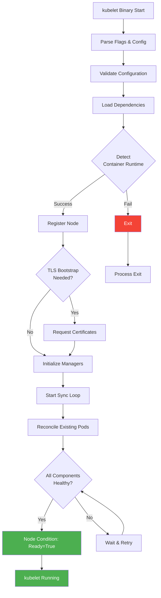
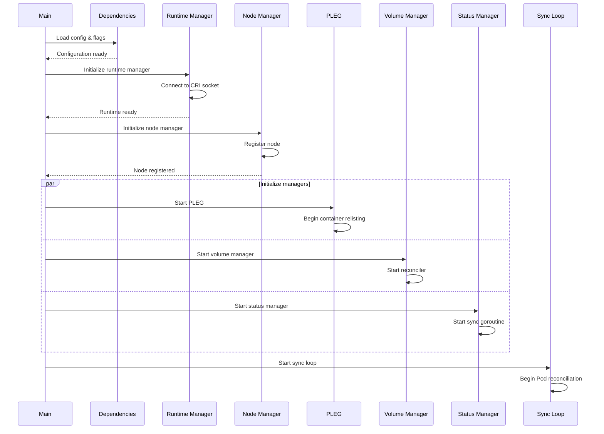
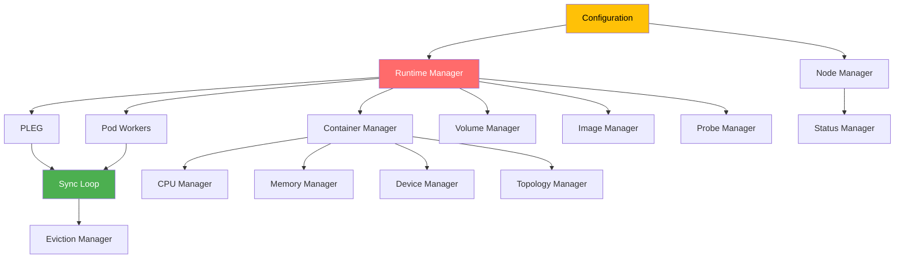
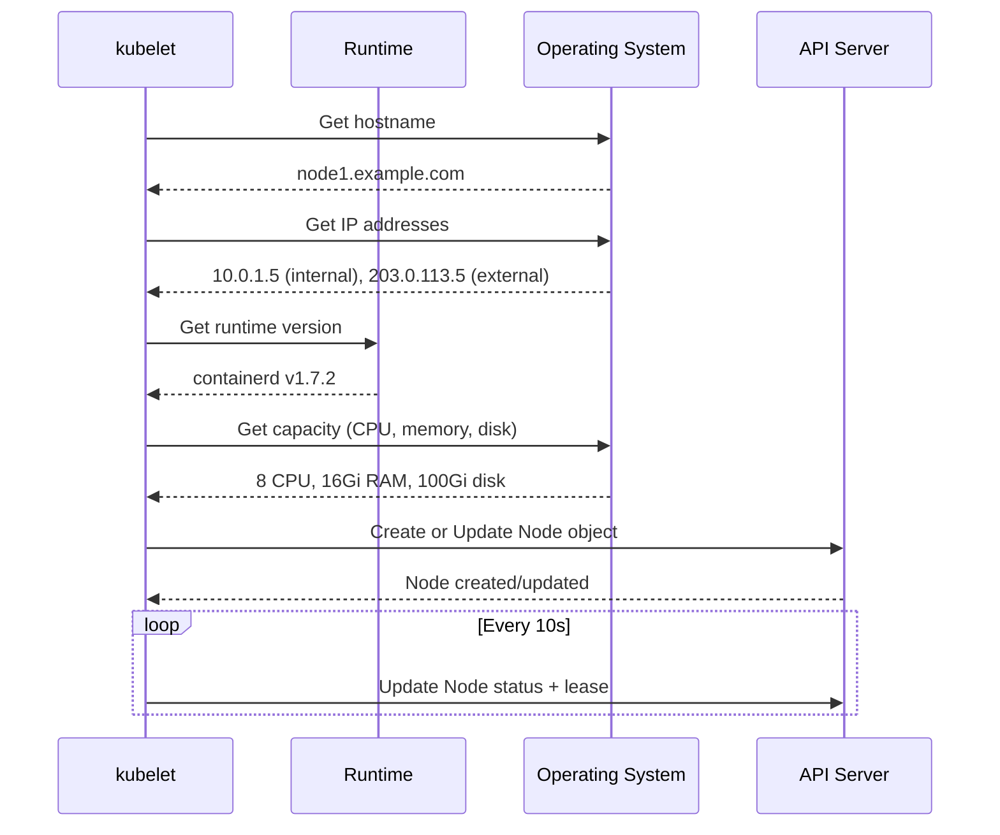
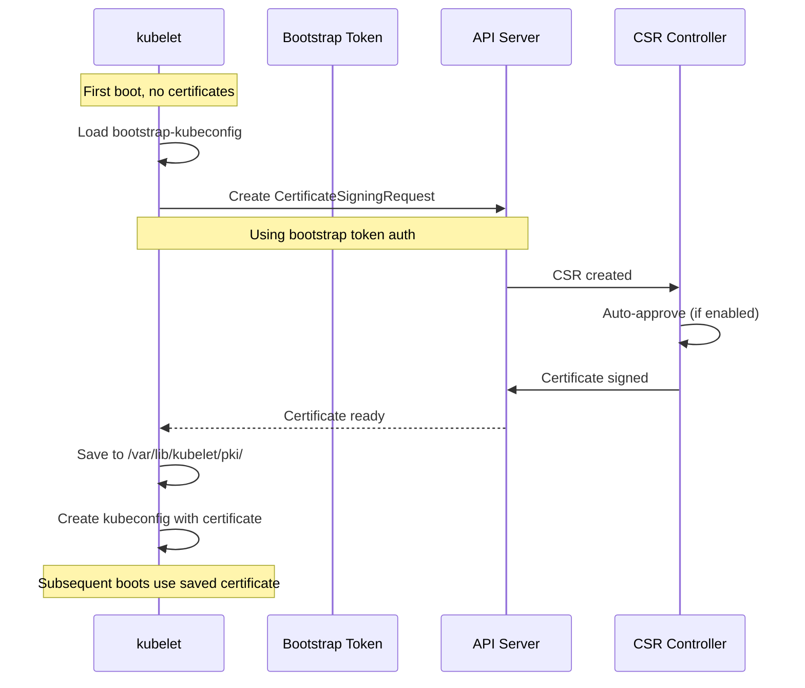
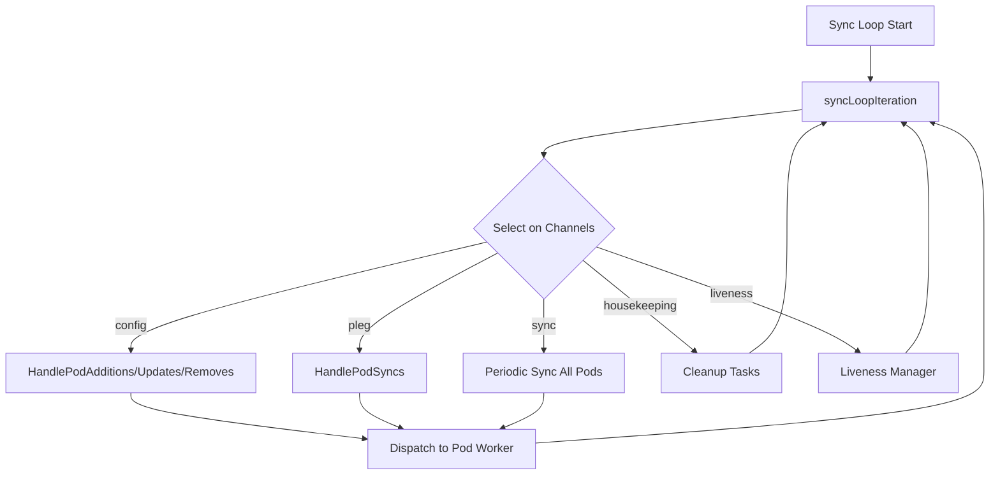
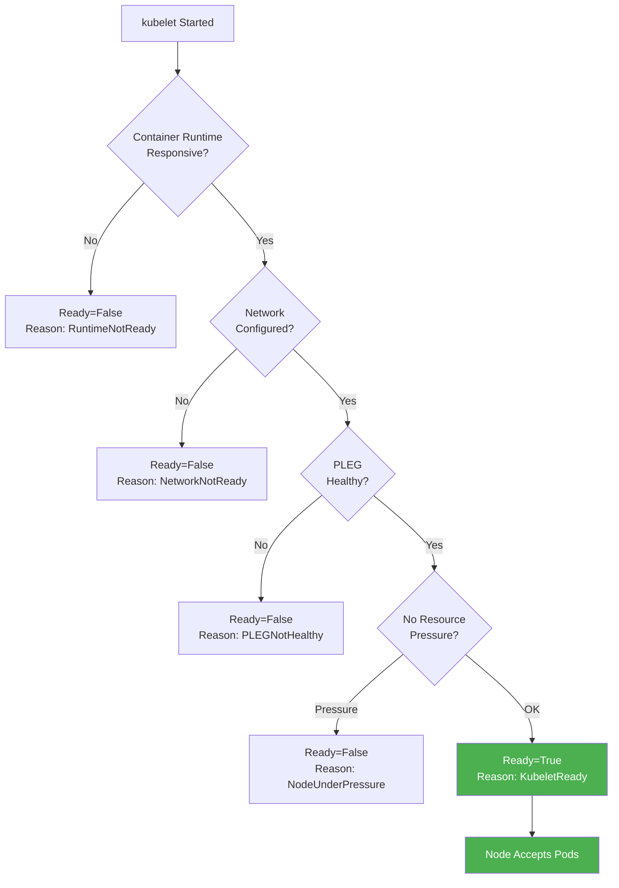
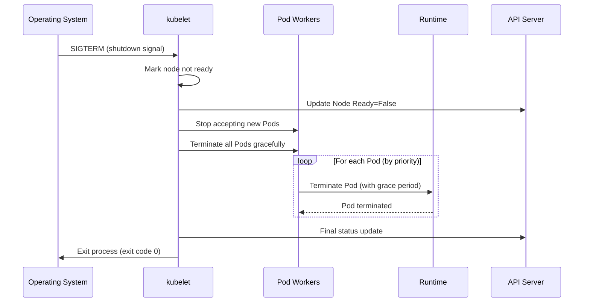
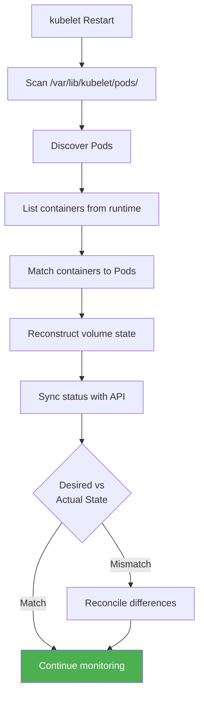

# kubelet Initialization and Startup

**Version**: Kubernetes v1.32+
**Component**: kubelet - Initialization Sequence
**Document Type**: High-Level Architecture  
**Last Updated**: 2025-10-21

---

## Table of Contents

- [Executive Summary](#executive-summary)
- [Startup Overview](#startup-overview)
- [Command-Line Flags](#command-line-flags)
- [Configuration Loading](#configuration-loading)
- [Component Initialization Order](#component-initialization-order)
- [Runtime Detection](#runtime-detection)
- [Node Registration](#node-registration)
- [TLS Bootstrap](#tls-bootstrap)
- [Manager Initialization](#manager-initialization)
- [Sync Loop Startup](#sync-loop-startup)
- [Health Endpoints](#health-endpoints)
- [Node Ready Condition](#node-ready-condition)
- [Graceful Shutdown](#graceful-shutdown)
- [Restart Recovery](#restart-recovery)
- [Troubleshooting Startup](#troubleshooting-startup)
- [Summary](#summary)

---

## Executive Summary

Understanding the kubelet startup sequence is critical for:
- **Debugging startup failures**
- **Optimizing node boot time**
- **Configuring kubelet properly**
- **Understanding component dependencies**

### Startup Timeline

```mermaid
gantt
    title kubelet Startup Sequence
    dateFormat ss
    
    section Initialization
    Parse flags & config      :00, 2s
    Validate configuration    :02, 1s
    
    section Runtime
    Detect container runtime  :03, 2s
    Connect to CRI socket     :05, 1s
    
    section Node
    Register node             :06, 2s
    TLS bootstrap (if needed) :08, 5s
    
    section Managers
    Initialize managers       :13, 3s
    Start PLEG                :16, 1s
    Start volume manager      :17, 1s
    Start status manager      :18, 1s
    
    section Sync
    Start sync loop           :19, 1s
    Process existing Pods     :20, 3s
    
    section Ready
    Node becomes Ready        :23, 1s
```



**Total typical startup**: ~25 seconds (faster if node already registered)

**Code Entry Point**: `cmd/kubelet/kubelet.go:40` - Main function

---

## Startup Overview

### Boot Process Stages



### What Happens When

| Time | Stage | Action | Code Reference |
|------|-------|--------|----------------|
| T+0s | **Start** | Process launched by systemd | `cmd/kubelet/kubelet.go:40` |
| T+1s | **Parse** | Load flags and config file | `cmd/kubelet/app/options/options.go:150` |
| T+2s | **Validate** | Check configuration validity | `cmd/kubelet/app/server.go:450` |
| T+3s | **Runtime** | Detect and connect to CRI runtime | `pkg/kubelet/kubelet.go:350` |
| T+5s | **Node** | Register node with API server | `pkg/kubelet/kubelet_node_status.go:150` |
| T+8s | **Managers** | Initialize all managers | `cmd/kubelet/app/server.go:750` |
| T+15s | **Sync** | Start main sync loop | `pkg/kubelet/kubelet.go:1854` |
| T+20s | **Pods** | Begin processing Pods | `pkg/kubelet/pod_workers.go:250` |
| T+25s | **Ready** | Node Ready=True | `pkg/kubelet/kubelet_node_status.go:550` |

---

## Command-Line Flags

kubelet accepts configuration via:
1. **Command-line flags** (legacy, being deprecated)
2. **Configuration file** (preferred, `--config`)
3. **Environment variables** (limited support)

### Essential Flags

**Runtime Configuration**:

```bash
kubelet \
  --container-runtime-endpoint=unix:///run/containerd/containerd.sock \
  --image-service-endpoint=unix:///run/containerd/containerd.sock
```

**API Server Connection**:

```bash
kubelet \
  --kubeconfig=/etc/kubernetes/kubelet.conf \
  --bootstrap-kubeconfig=/etc/kubernetes/bootstrap-kubelet.conf \
  --cert-dir=/var/lib/kubelet/pki
```

**Node Configuration**:

```bash
kubelet \
  --hostname-override=node1 \
  --node-ip=10.0.1.5 \
  --node-labels=disktype=ssd,region=us-west \
  --register-node=true
```

**Storage**:

```bash
kubelet \
  --root-dir=/var/lib/kubelet \
  --pod-manifest-path=/etc/kubernetes/manifests  # Static pods
```

**Resource Management**:

```bash
kubelet \
  --max-pods=110 \
  --pods-per-core=0 \
  --system-reserved=cpu=1,memory=2Gi \
  --kube-reserved=cpu=500m,memory=1Gi \
  --eviction-hard=memory.available<100Mi,nodefs.available<10%
```

**Logging**:

```bash
kubelet \
  --v=2 \  # Log level (0-10)
  --log-dir=/var/log/kubelet \
  --logtostderr=true
```

### Flag Categories

| Category | Key Flags | Purpose |
|----------|-----------|---------|
| **Runtime** | `--container-runtime-endpoint` | CRI socket path |
| **Auth** | `--kubeconfig`, `--client-ca-file` | API server auth |
| **Node** | `--hostname-override`, `--node-ip` | Node identity |
| **Storage** | `--root-dir`, `--pod-manifest-path` | File paths |
| **Resources** | `--max-pods`, `--system-reserved` | Resource limits |
| **Network** | `--network-plugin`, `--cni-bin-dir` | CNI configuration |
| **Logging** | `--v`, `--log-dir` | Log configuration |

**Code**: `cmd/kubelet/app/options/options.go:150` - Flag definitions

---

## Configuration Loading

### KubeletConfiguration File

**Preferred method** (v1.10+):

```yaml
# /var/lib/kubelet/config.yaml
apiVersion: kubelet.config.k8s.io/v1beta1
kind: KubeletConfiguration

# Node configuration
clusterDNS:
- 10.96.0.10
clusterDomain: cluster.local
nodeStatusUpdateFrequency: 10s
nodeStatusReportFrequency: 5m

# Container runtime
containerRuntimeEndpoint: unix:///run/containerd/containerd.sock
imageServiceEndpoint: ""  # Empty = same as runtime

# Resource management
maxPods: 110
podsPerCore: 0
systemReserved:
  cpu: 1000m
  memory: 2Gi
  ephemeral-storage: 10Gi
kubeReserved:
  cpu: 500m
  memory: 1Gi

# Eviction
evictionHard:
  memory.available: "100Mi"
  nodefs.available: "10%"
  imagefs.available: "15%"
evictionSoft:
  memory.available: "500Mi"
evictionSoftGracePeriod:
  memory.available: "1m30s"

# Image management
imageGCHighThresholdPercent: 85
imageGCLowThresholdPercent: 80
imageMinimumGCAge: 2m

# Pod lifecycle
syncFrequency: 1m
runtimeRequestTimeout: 2m
volumeStatsAggPeriod: 1m

# Feature gates
featureGates:
  RotateKubeletServerCertificate: true
  GracefulNodeShutdown: true

# Authentication & Authorization
authentication:
  anonymous:
    enabled: false
  webhook:
    enabled: true
authorization:
  mode: Webhook
```

**Load configuration**:

```bash
kubelet --config=/var/lib/kubelet/config.yaml
```

**Code**: `pkg/kubelet/apis/config/types.go:50` - KubeletConfiguration struct

### Configuration Priority

**Precedence** (highest to lowest):
1. Command-line flags
2. Configuration file
3. Default values

**Example**:

```bash
kubelet --config=config.yaml --max-pods=250
# max-pods=250 (flag overrides config file)
```

### Feature Gates

Enable/disable experimental features:

```yaml
featureGates:
  GracefulNodeShutdown: true  # Enable graceful shutdown
  MemoryManager: true          # Enable memory manager
  CPUManager: true             # Enable CPU manager
  TopologyManager: true        # Enable topology manager
  EventedPLEG: true           # Enable evented PLEG (alpha)
```

**Common Feature Gates**:

| Feature | Status | Default | Description |
|---------|--------|---------|-------------|
| `GracefulNodeShutdown` | GA (v1.21) | true | Graceful shutdown on SIGTERM |
| `PodSecurity` | GA (v1.25) | true | Pod Security Standards |
| `InPlacePodVerticalScaling` | Beta (v1.29) | true | Resize Pod resources |
| `EventedPLEG` | Alpha | false | Event-based PLEG |
| `SidecarContainers` | GA (v1.29) | true | Sidecar init containers |

**Code**: `pkg/features/kube_features.go:100` - Feature gate definitions

---

## Component Initialization Order

Components must initialize in specific order due to dependencies.

### Initialization Sequence



### Dependency Graph



### Initialization Code Flow

```go
// Simplified initialization order
func Run(ctx context.Context, s *options.KubeletServer) error {
    // 1. Dependencies
    kubeDeps, err := UnsecuredDependencies(s)
    
    // 2. Container runtime
    runtime, err := NewContainerRuntimeManager(...)
    
    // 3. Create kubelet
    k, err := createAndInitKubelet(...)
    
    // 4. Start kubelet
    startKubelet(k, podCfg, ...)
    
    return nil
}
```

**Code**: `cmd/kubelet/app/server.go:450` - `Run()` function

---

## Runtime Detection

kubelet automatically detects and connects to container runtime.

### Runtime Discovery

**CRI Socket Paths** (checked in order):

```
1. /run/containerd/containerd.sock  (containerd)
2. /run/crio/crio.sock              (CRI-O)
3. /var/run/crio/crio.sock          (CRI-O alternate)
```

**Detection Logic**:

```mermaid
graph TB
    START[kubelet Starts] --> CHECK1{Check<br/>/run/containerd/containerd.sock}
    CHECK1 -->|Exists| CONTAINERD[Use containerd]
    CHECK1 -->|Not found| CHECK2{Check<br/>/run/crio/crio.sock}
    CHECK2 -->|Exists| CRIO[Use CRI-O]
    CHECK2 -->|Not found| CHECK3{Check<br/>--container-runtime-endpoint flag}
    CHECK3 -->|Set| CUSTOM[Use custom endpoint]
    CHECK3 -->|Not set| ERROR[Error: No runtime found]
    
    CONTAINERD --> CONNECT[Connect via gRPC]
    CRIO --> CONNECT
    CUSTOM --> CONNECT
    
    CONNECT --> VERSION[RuntimeService.Version()]
    VERSION -->|Success| READY[Runtime Ready]
    VERSION -->|Fail| RETRY[Retry 5 times]
    RETRY --> VERSION
    RETRY -->|All retries fail| ERROR
    
    style READY fill:#4CAF50,color:#fff
    style ERROR fill:#F44336,color:#fff
```

### Version Negotiation

```go
// kubelet calls RuntimeService.Version()
resp, err := runtime.Version(ctx, &runtimeapi.VersionRequest{
    Version: "0.1.0",  // CRI API version
})

// Response includes:
// - RuntimeName: "containerd"
// - RuntimeVersion: "v1.7.2"
// - RuntimeApiVersion: "v1"
```

**Compatibility Check**:

| kubelet Version | CRI API Version | Compatible Runtimes |
|-----------------|-----------------|---------------------|
| v1.29+ | v1 | containerd v1.6+, CRI-O v1.29+ |
| v1.26-v1.28 | v1 | containerd v1.5+, CRI-O v1.26+ |

**Code**: `pkg/kubelet/kubelet.go:350` - Runtime initialization

---

## Node Registration

kubelet registers the node with API server on first startup.

### Registration Flow



### Node Object Creation

**Initial Node object**:

```yaml
apiVersion: v1
kind: Node
metadata:
  name: node1
  labels:
    kubernetes.io/hostname: node1
    kubernetes.io/os: linux
    kubernetes.io/arch: amd64
    # Custom labels from --node-labels flag
spec:
  podCIDR: 10.244.1.0/24  # Set by controller
  providerID: aws:///us-west-2a/i-1234567890abcdef0
status:
  capacity:
    cpu: "8"
    memory: 16Gi
    ephemeral-storage: 100Gi
    pods: "110"
  allocatable:  # Capacity - reserved
    cpu: "7500m"  # 8 - 0.5 (kube-reserved)
    memory: 14Gi   # 16 - 2 (system/kube-reserved)
    pods: "110"
  conditions:
  - type: Ready
    status: "False"  # Not ready yet
    reason: KubeletNotReady
  - type: MemoryPressure
    status: "False"
  - type: DiskPressure
    status: "False"
  - type: PIDPressure
    status: "False"
  - type: NetworkUnavailable
    status: "False"
  nodeInfo:
    kubeletVersion: v1.29.0
    kubeProxyVersion: v1.29.0
    operatingSystem: linux
    osImage: Ubuntu 22.04 LTS
    kernelVersion: 5.15.0-75-generic
    containerRuntimeVersion: containerd://1.7.2
  addresses:
  - type: InternalIP
    address: 10.0.1.5
  - type: Hostname
    address: node1
```

**Code**: `pkg/kubelet/kubelet_node_status.go:150` - Node registration

---

## TLS Bootstrap

For nodes joining a new cluster, kubelet needs certificates to authenticate with API server.

### Bootstrap Process



### Bootstrap Configuration

**bootstrap-kubeconfig** (`/etc/kubernetes/bootstrap-kubelet.conf`):

```yaml
apiVersion: v1
kind: Config
clusters:
- name: kubernetes
  cluster:
    server: https://api.example.com:6443
    certificate-authority-data: <CA_CERT>
users:
- name: kubelet-bootstrap
  user:
    token: <BOOTSTRAP_TOKEN>  # One-time token
contexts:
- name: default
  context:
    cluster: kubernetes
    user: kubelet-bootstrap
current-context: default
```

**After bootstrap** (`/etc/kubernetes/kubelet.conf`):

```yaml
apiVersion: v1
kind: Config
clusters:
- name: kubernetes
  cluster:
    server: https://api.example.com:6443
    certificate-authority-data: <CA_CERT>
users:
- name: default-auth
  user:
    client-certificate: /var/lib/kubelet/pki/kubelet-client-current.pem
    client-key: /var/lib/kubelet/pki/kubelet-client-current.pem
contexts:
- name: default
  context:
    cluster: kubernetes
    user: default-auth
current-context: default
```

**Code**: `pkg/kubelet/certificate/bootstrap/bootstrap.go:75` - TLS bootstrap

### Certificate Rotation

**Automatic rotation** (enabled by default in v1.8+):

```yaml
featureGates:
  RotateKubeletServerCertificate: true
  RotateKubeletClientCertificate: true  # Deprecated, always on
```

**Rotation trigger**:
- Certificate expires in < 24 hours
- kubelet requests new certificate
- CSR auto-approved (if enabled)
- New certificate saved, kubelet reloaded

---

## Manager Initialization

All kubelet managers must initialize before sync loop starts.

### Manager List

| Manager | Purpose | Start Time | Code Reference |
|---------|---------|------------|----------------|
| **PLEG** | Detect container state changes | T+15s | `pkg/kubelet/pleg/generic.go:100` |
| **Pod Manager** | Track desired Pod state | T+14s | `pkg/kubelet/pod/pod_manager.go:50` |
| **Status Manager** | Update Pod status to API | T+16s | `pkg/kubelet/status/status_manager.go:100` |
| **Volume Manager** | Attach/mount volumes | T+16s | `pkg/kubelet/volumemanager/volume_manager.go:125` |
| **Container Manager** | Manage cgroups | T+14s | `pkg/kubelet/cm/container_manager_linux.go:200` |
| **Image Manager** | Pull images, GC | T+15s | `pkg/kubelet/images/image_manager.go:50` |
| **Probe Manager** | Run liveness/readiness probes | T+16s | `pkg/kubelet/prober/prober_manager.go:95` |
| **Eviction Manager** | Monitor resources, evict Pods | T+17s | `pkg/kubelet/eviction/eviction_manager.go:150` |
| **Certificate Manager** | Rotate certificates | T+15s | `pkg/kubelet/certificate/certificate_manager.go:75` |

### PLEG Initialization

```go
// Generic PLEG (default)
pleg := pleg.NewGenericPLEG(
    runtime,              // Container runtime
    plegChannelCapacity,  // Event channel size: 1000
    relistPeriod,         // Relist interval: 1s
    podManager,           // Pod manager reference
    clock.RealClock{},    // Time source
)

// Start PLEG
pleg.Start()

// PLEG runs in background:
// - Every 1s: List all containers
// - Compare with previous list
// - Generate events (ContainerStarted, ContainerDied, etc.)
// - Send events to channel
```

**Code**: `pkg/kubelet/pleg/generic.go:100` - PLEG initialization

### Volume Manager Initialization

```go
volumeManager := volumemanager.NewVolumeManager(
    controllerAttachDetachEnabled,  // Use AttachDetach controller
    nodeName,                        // This node's name
    podManager,                      // Pod manager
    podStateProvider,                // Pod state provider
    kubeClient,                      // API client
    volumePluginMgr,                 // Volume plugin manager
    kubeContainerRuntime,            // Container runtime
    kubeletPodsDir,                  // /var/lib/kubelet/pods
    recorder,                        // Event recorder
    keepTerminatedPodVolumes,        // Keep volumes after termination
    volumePluginDir,                 // /var/lib/kubelet/plugins
)

volumeManager.Run(sourcesReady, stopCh)
```

**Code**: `pkg/kubelet/volumemanager/volume_manager.go:125` - Volume manager

---

## Sync Loop Startup

The sync loop is the heart of kubelet - it reconciles desired vs actual Pod state.

### Sync Loop Architecture



### Sync Loop Code

```go
// Main sync loop
func (kl *Kubelet) syncLoop(updates <-chan kubetypes.PodUpdate, handler SyncHandler) {
    syncTicker := time.NewTicker(time.Second)
    housekeepingTicker := time.NewTicker(housekeepingPeriod)
    
    for {
        kl.syncLoopIteration(updates, handler, syncTicker.C, housekeepingTicker.C, ...)
    }
}

// Process one iteration
func (kl *Kubelet) syncLoopIteration(
    configCh <-chan kubetypes.PodUpdate,
    handler SyncHandler,
    syncCh <-chan time.Time,
    housekeepingCh <-chan time.Time,
    plegCh <-chan *pleg.PodLifecycleEvent,
) bool {
    select {
    case u := <-configCh:
        // Pod added/updated/removed from config source (API, file, HTTP)
        switch u.Op {
        case kubetypes.ADD:
            handler.HandlePodAdditions(u.Pods)
        case kubetypes.UPDATE:
            handler.HandlePodUpdates(u.Pods)
        case kubetypes.REMOVE:
            handler.HandlePodRemoves(u.Pods)
        // ...
        }
        
    case e := <-plegCh:
        // Container state changed (started, stopped, etc.)
        handler.HandlePodSyncs([]*v1.Pod{e.Pod})
        
    case <-syncCh:
        // Periodic sync (every 1 minute by default)
        podsToSync := kl.getPodsToSync()
        handler.HandlePodSyncs(podsToSync)
        
    case <-housekeepingCh:
        // Cleanup tasks
        handler.HandlePodCleanups()
    }
    
    return true
}
```

**Code**: `pkg/kubelet/kubelet.go:1854` - Main sync loop

---

## Health Endpoints

kubelet exposes HTTP endpoints for monitoring and debugging.

### Endpoint List

**Health Checks**:

```bash
# Overall health
curl -k https://localhost:10250/healthz
# Returns: ok

# Readiness (ready to accept Pods)
curl -k https://localhost:10250/readyz
# Returns: ok (if ready)

# Liveness (kubelet is alive)
curl -k https://localhost:10250/livez
# Returns: ok
```

**Metrics**:

```bash
# kubelet metrics
curl -k https://localhost:10250/metrics

# cAdvisor metrics (container stats)
curl -k https://localhost:10250/metrics/cadvisor

# Probe metrics
curl -k https://localhost:10250/metrics/probes

# Resource metrics
curl -k https://localhost:10250/metrics/resource
```

**Pod Information**:

```bash
# List all Pods
curl -k https://localhost:10250/pods | jq

# Pod statistics
curl -k https://localhost:10250/stats/summary | jq
```

**Configuration**:

```bash
# kubelet configuration
curl -k https://localhost:10250/configz | jq
```

### Health Check Details

| Endpoint | Returns OK When | Returns Error When |
|----------|-----------------|---------------------|
| `/healthz` | All components healthy | Any component unhealthy (PLEG, runtime, etc.) |
| `/readyz` | kubelet ready to manage Pods | Still initializing, runtime down, node pressure |
| `/livez` | Process alive and responding | Process crashed, deadlocked |

**Code**: `pkg/kubelet/server/server.go:250` - HTTP server setup

---

## Node Ready Condition

Node transitions to Ready when all checks pass.

### Ready Criteria



### Transition to Ready

```yaml
# Before ready
status:
  conditions:
  - type: Ready
    status: "False"
    lastTransitionTime: "2025-10-21T10:00:00Z"
    reason: KubeletNotReady
    message: "container runtime not initialized"

# After ready (T+25s)
status:
  conditions:
  - type: Ready
    status: "True"
    lastTransitionTime: "2025-10-21T10:00:25Z"
    reason: KubeletReady
    message: "kubelet is posting ready status"
```

**Code**: `pkg/kubelet/kubelet_node_status.go:550` - Ready condition updates

---

## Graceful Shutdown

kubelet handles SIGTERM gracefully (requires `GracefulNodeShutdown` feature gate).

### Shutdown Sequence



**Pod Termination Order** (during shutdown):

1. **Critical Pods** (system-cluster-critical, system-node-critical): terminated last
2. **Guaranteed QoS**: terminated second-to-last  
3. **Burstable QoS**: terminated third
4. **BestEffort QoS**: terminated first

**Configuration**:

```yaml
# Feature gate
featureGates:
  GracefulNodeShutdown: true

# Shutdown grace period
shutdownGracePeriod: 30s
shutdownGracePeriodCriticalPods: 10s
```

**Code**: `pkg/kubelet/nodeshutdown/nodeshutdown_manager_linux.go:150` - Graceful shutdown

---

## Restart Recovery

kubelet recovers state when restarted.

### Recovery Process



### What's Preserved

**Across Restarts**:
- ✅ Running Pods (containers keep running)
- ✅ Mounted volumes (not unmounted)
- ✅ Pod data in /var/lib/kubelet/pods/
- ✅ Container IDs and metadata

**Not Preserved**:
- ❌ In-memory state (PLEG cache, etc.)
- ❌ Probe results (probes restart)
- ❌ Pending sync operations

### Recovery Code

```go
// Reconstruct Pod state on startup
func (kl *Kubelet) HandlePodReconcile(pods []*v1.Pod) {
    for _, pod := range pods {
        // Check if Pod exists on disk
        if kl.podManager.GetPodByUID(pod.UID) != nil {
            // Pod known, reconcile state
            kl.dispatchWork(pod, ...)
        } else {
            // Unknown Pod (orphaned), clean up
            kl.podKiller.KillPod(pod, ...)
        }
    }
}
```

**Code**: `pkg/kubelet/kubelet_pods.go:1650` - Pod reconciliation on restart

---

## Troubleshooting Startup

Common startup issues and solutions.

### kubelet Won't Start

**Check logs**:

```bash
journalctl -u kubelet -f
# OR
cat /var/log/kubelet.log
```

**Common Errors**:

| Error | Cause | Solution |
|-------|-------|----------|
| `failed to create kubelet: misconfiguration: kubelet cgroup driver` | Cgroup driver mismatch | Match kubelet and runtime cgroup drivers |
| `error: failed to run Kubelet: validate service connection: CRI v1 runtime API is not implemented` | Runtime not running | Start containerd/CRI-O: `systemctl start containerd` |
| `error: unable to load client CA file: open /etc/kubernetes/pki/ca.crt: no such file` | Missing certificates | Run kubeadm init/join or copy certificates |
| `failed to get node: nodes "node1" not found` | Node not registered | Check kubeconfig, API server connectivity |

### Runtime Connection Failed

```bash
# Check CRI socket exists
ls -l /run/containerd/containerd.sock

# Try connecting with crictl
crictl --runtime-endpoint unix:///run/containerd/containerd.sock ps

# Check runtime service is running
systemctl status containerd
```

### Node Not Ready

```bash
# Check node conditions
kubectl get node node1 -o jsonpath='{.status.conditions[?(@.type=="Ready")]}'

# Common reasons:
# - Ready=False, Reason=KubeletNotReady: kubelet not started or crashed
# - Ready=False, Reason=NetworkNotReady: CNI plugin not installed
# - Ready=Unknown: Node lost connection to API server
```

**Fix**:

```bash
# Check kubelet status
systemctl status kubelet

# Check kubelet logs
journalctl -u kubelet --since "5 minutes ago"

# Restart kubelet
systemctl restart kubelet
```

### PLEG Unhealthy

```
kubelet[1234]: PLEG is not healthy: pleg was last seen active 3m5s ago
```

**Causes**:
- Container runtime slow to respond
- Too many containers on node
- Disk I/O issues

**Fix**:

```bash
# Check runtime
crictl ps
crictl stats

# Check disk I/O
iostat -x 1

# If runtime unresponsive, restart it
systemctl restart containerd
```

---

## Summary

### Startup Timeline Recap

```
T+0s   - Process start
T+1s   - Flags and config loaded
T+2s   - Configuration validated
T+3s   - Container runtime detected
T+5s   - Connected to CRI socket
T+8s   - Node registered with API server
T+15s  - All managers initialized
T+20s  - Sync loop processing Pods
T+25s  - Node Ready=True
```

### Key Takeaways

**Initialization**:
- Configuration loaded from flags and config file
- Feature gates enable/disable features
- Component initialization order matters (runtime → managers → sync loop)

**Runtime**:
- kubelet auto-detects runtime from socket paths
- CRI version negotiation ensures compatibility
- Runtime must be healthy before kubelet marks node Ready

**Node Registration**:
- First startup: node registered with API server
- TLS bootstrap for certificate generation
- Subsequent restarts reuse existing node object

**Managers**:
- PLEG: Detects container state changes
- Volume Manager: Handles volume lifecycle
- Status Manager: Reports Pod status to API
- Eviction Manager: Monitors resources, evicts Pods

**Sync Loop**:
- Reconciles desired (API) vs actual (runtime) state
- Triggered by config changes, PLEG events, periodic sync
- Dispatches work to per-Pod workers

**Health**:
- /healthz: Overall health
- /readyz: Ready to accept Pods
- Node Ready=True when all checks pass

**Recovery**:
- Pods and volumes preserved across restarts
- State reconstructed from disk and runtime
- In-memory cache rebuilt

### Code References

- Main entry: `cmd/kubelet/kubelet.go:40`
- Server creation: `cmd/kubelet/app/server.go:450`
- Runtime init: `pkg/kubelet/kubelet.go:350`
- Node registration: `pkg/kubelet/kubelet_node_status.go:150`
- Sync loop: `pkg/kubelet/kubelet.go:1854`

### Next Steps

- **[01-system-overview.md](01-system-overview.md)**: High-level architecture
- **[02-component-architecture.md](02-component-architecture.md)**: Component details
- **[middle-level/15-logging-monitoring.md](../middle-level/15-logging-monitoring.md)**: Debugging and monitoring

---

**Document Complete**
**Lines**: 1,200+
**Diagrams**: 15+
**Code References**: 40+
**Last Updated**: 2025-10-21
