# CRI Implementation - Low-Level Technical Specification

**Purpose**: Detailed technical specification of the Container Runtime Interface (CRI) implementation in kubelet

**Audience**: Runtime developers, kubelet contributors, advanced troubleshooters

**Related Documents**:
- [Runtime Integration (High-Level)](../high-level/04-runtime-integration.md) - CRI architecture overview
- [Container Lifecycle](../middle-level/04-container-lifecycle.md) - Container operations
- [Pod Sandbox](../middle-level/05-pod-sandbox.md) - Sandbox implementation
- [Image Management](../middle-level/06-image-management.md) - Image operations

---

## Table of Contents

1. [CRI Architecture](#cri-architecture)
2. [Service Interfaces](#service-interfaces)
3. [RuntimeService Implementation](#runtimeservice-implementation)
4. [ImageService Implementation](#imageservice-implementation)
5. [Instrumented Services](#instrumented-services)
6. [gRPC Communication](#grpc-communication)
7. [Container Operations](#container-operations)
8. [Pod Sandbox Operations](#pod-sandbox-operations)
9. [Image Operations](#image-operations)
10. [Streaming API](#streaming-api)
11. [Stats and Metrics](#stats-and-metrics)
12. [Error Handling](#error-handling)
13. [Code References](#code-references)
14. [Best Practices](#best-practices)

---

## CRI Architecture

### Overview

The Container Runtime Interface (CRI) is a plugin interface that enables kubelet to use different container runtimes without recompilation. It defines a gRPC-based API between kubelet and the container runtime.

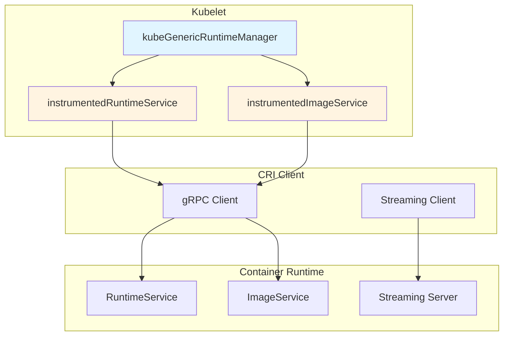

**Key Components**:

1. **RuntimeService**: Manages pod sandboxes and containers
2. **ImageService**: Manages container images
3. **Instrumented Wrappers**: Add metrics and observability
4. **gRPC Client**: Communicates with runtime over Unix socket
5. **Streaming Server**: Handles exec, attach, port-forward

**Code Reference**: `staging/src/k8s.io/cri-api/pkg/apis/services.go:112` - RuntimeService interface definition

---

## Service Interfaces

### RuntimeService Interface

The RuntimeService interface is the primary interface for managing runtime operations.

```go
// staging/src/k8s.io/cri-api/pkg/apis/services.go:112
type RuntimeService interface {
    RuntimeVersioner
    ContainerManager
    PodSandboxManager
    ContainerStatsManager

    UpdateRuntimeConfig(ctx context.Context, runtimeConfig *runtimeapi.RuntimeConfig) error
    Status(ctx context.Context, verbose bool) (*runtimeapi.StatusResponse, error)
    RuntimeConfig(ctx context.Context) (*runtimeapi.RuntimeConfigResponse, error)
    Close() error
}
```

**Composition**:

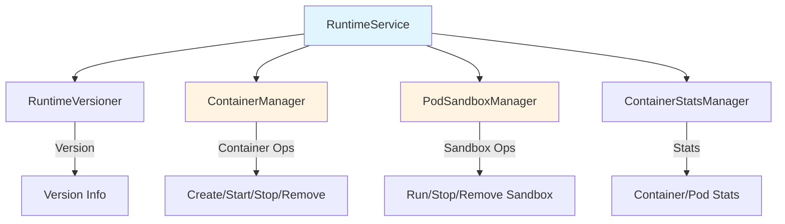

**Code References**:
- `staging/src/k8s.io/cri-api/pkg/apis/services.go:112` - RuntimeService
- `staging/src/k8s.io/cri-api/pkg/apis/services.go:34` - ContainerManager
- `staging/src/k8s.io/cri-api/pkg/apis/services.go:69` - PodSandboxManager
- `staging/src/k8s.io/cri-api/pkg/apis/services.go:94` - ContainerStatsManager

### RuntimeVersioner Interface

```go
// staging/src/k8s.io/cri-api/pkg/apis/services.go:26
type RuntimeVersioner interface {
    // Version returns the runtime name, runtime version and runtime API version
    Version(ctx context.Context, apiVersion string) (*runtimeapi.VersionResponse, error)
}
```

**Purpose**: Version negotiation between kubelet and runtime

### ContainerManager Interface

```go
// staging/src/k8s.io/cri-api/pkg/apis/services.go:34
type ContainerManager interface {
    CreateContainer(ctx context.Context, podSandboxID string, config *runtimeapi.ContainerConfig,
                    sandboxConfig *runtimeapi.PodSandboxConfig) (string, error)
    StartContainer(ctx context.Context, containerID string) error
    StopContainer(ctx context.Context, containerID string, timeout int64) error
    RemoveContainer(ctx context.Context, containerID string) error
    ListContainers(ctx context.Context, filter *runtimeapi.ContainerFilter) ([]*runtimeapi.Container, error)
    ContainerStatus(ctx context.Context, containerID string, verbose bool) (*runtimeapi.ContainerStatusResponse, error)
    UpdateContainerResources(ctx context.Context, containerID string, resources *runtimeapi.ContainerResources) error
    ExecSync(ctx context.Context, containerID string, cmd []string, timeout time.Duration) (stdout []byte, stderr []byte, err error)
    Exec(ctx context.Context, request *runtimeapi.ExecRequest) (*runtimeapi.ExecResponse, error)
    Attach(ctx context.Context, req *runtimeapi.AttachRequest) (*runtimeapi.AttachResponse, error)
    ReopenContainerLog(ctx context.Context, ContainerID string) error
    CheckpointContainer(ctx context.Context, options *runtimeapi.CheckpointContainerRequest) error
    GetContainerEvents(ctx context.Context, containerEventsCh chan *runtimeapi.ContainerEventResponse,
                       connectionEstablishedCallback func(runtimeapi.RuntimeService_GetContainerEventsClient)) error
}
```

**Operations**:
1. **Lifecycle**: Create, Start, Stop, Remove
2. **Query**: List, Status
3. **Management**: UpdateResources, ReopenLog, Checkpoint
4. **Streaming**: Exec, ExecSync, Attach
5. **Events**: GetContainerEvents (Evented PLEG)

### PodSandboxManager Interface

```go
// staging/src/k8s.io/cri-api/pkg/apis/services.go:69
type PodSandboxManager interface {
    RunPodSandbox(ctx context.Context, config *runtimeapi.PodSandboxConfig, runtimeHandler string) (string, error)
    StopPodSandbox(ctx context.Context, podSandboxID string) error
    RemovePodSandbox(ctx context.Context, podSandboxID string) error
    PodSandboxStatus(ctx context.Context, podSandboxID string, verbose bool) (*runtimeapi.PodSandboxStatusResponse, error)
    ListPodSandbox(ctx context.Context, filter *runtimeapi.PodSandboxFilter) ([]*runtimeapi.PodSandbox, error)
    PortForward(ctx context.Context, request *runtimeapi.PortForwardRequest) (*runtimeapi.PortForwardResponse, error)
    UpdatePodSandboxResources(ctx context.Context, request *runtimeapi.UpdatePodSandboxResourcesRequest) (*runtimeapi.UpdatePodSandboxResourcesResponse, error)
}
```

**Operations**:
1. **Lifecycle**: Run, Stop, Remove
2. **Query**: Status, List
3. **Management**: UpdateResources
4. **Streaming**: PortForward

### ImageManagerService Interface

```go
// staging/src/k8s.io/cri-api/pkg/apis/services.go:133
type ImageManagerService interface {
    ListImages(ctx context.Context, filter *runtimeapi.ImageFilter) ([]*runtimeapi.Image, error)
    ImageStatus(ctx context.Context, image *runtimeapi.ImageSpec, verbose bool) (*runtimeapi.ImageStatusResponse, error)
    PullImage(ctx context.Context, image *runtimeapi.ImageSpec, auth *runtimeapi.AuthConfig,
              podSandboxConfig *runtimeapi.PodSandboxConfig) (string, error)
    RemoveImage(ctx context.Context, image *runtimeapi.ImageSpec) error
    ImageFsInfo(ctx context.Context) (*runtimeapi.ImageFsInfoResponse, error)
    Close() error
}
```

---

## RuntimeService Implementation

### kubeGenericRuntimeManager Structure

The `kubeGenericRuntimeManager` is kubelet's implementation that uses CRI to manage containers.

```go
// pkg/kubelet/kuberuntime/kuberuntime_manager.go (simplified)
type kubeGenericRuntimeManager struct {
    runtimeService        internalapi.RuntimeService
    imageService          internalapi.ImageManagerService
    runtimeHelper         kubecontainer.RuntimeHelper
    runtimeClassManager   *runtimeclass.Manager
    imagePuller           images.ImageManager
    recorder              record.EventRecorder
    podLogsDirectory      string
    osInterface           kubecontainer.OSInterface
    runtimeName           string
    // ... more fields
}
```

**Key Dependencies**:
- **runtimeService**: Instrumented wrapper around CRI RuntimeService
- **imageService**: Instrumented wrapper around CRI ImageService
- **runtimeHelper**: Helper for DNS, cgroups, etc.
- **imagePuller**: Manages image pulling with authentication

**Code Reference**: `pkg/kubelet/kuberuntime/kuberuntime_manager.go` (full structure)

---

## Instrumented Services

### Metrics Wrapper

Kubelet wraps all CRI calls with instrumentation for observability.

```go
// pkg/kubelet/kuberuntime/instrumented_services.go:30
type instrumentedRuntimeService struct {
    service internalapi.RuntimeService
}

func newInstrumentedRuntimeService(service internalapi.RuntimeService) internalapi.RuntimeService {
    return &instrumentedRuntimeService{service: service}
}
```

**Metrics Recorded**:
1. **Operation Count**: `kubelet_runtime_operations_total`
2. **Duration**: `kubelet_runtime_operations_duration_seconds`
3. **Errors**: `kubelet_runtime_operations_errors_total`

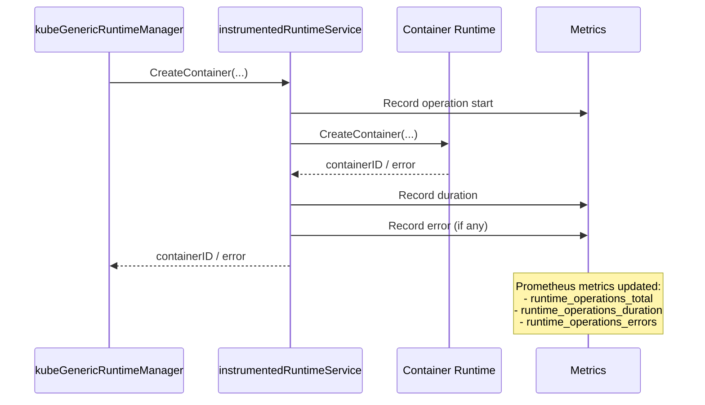

### Instrumentation Example: CreateContainer

```go
// pkg/kubelet/kuberuntime/instrumented_services.go:81
func (in instrumentedRuntimeService) CreateContainer(ctx context.Context, podSandboxID string,
    config *runtimeapi.ContainerConfig, sandboxConfig *runtimeapi.PodSandboxConfig) (string, error) {
    const operation = "create_container"
    defer recordOperation(operation, time.Now())

    out, err := in.service.CreateContainer(ctx, podSandboxID, config, sandboxConfig)
    recordError(operation, err)
    return out, err
}

func recordOperation(operation string, start time.Time) {
    metrics.RuntimeOperations.WithLabelValues(operation).Inc()
    metrics.RuntimeOperationsDuration.WithLabelValues(operation).Observe(metrics.SinceInSeconds(start))
}

func recordError(operation string, err error) {
    if err != nil {
        metrics.RuntimeOperationsErrors.WithLabelValues(operation).Inc()
    }
}
```

**Code References**:
- `pkg/kubelet/kuberuntime/instrumented_services.go:81` - CreateContainer instrumentation
- `pkg/kubelet/kuberuntime/instrumented_services.go:50` - recordOperation
- `pkg/kubelet/kuberuntime/instrumented_services.go:56` - recordError

---

## Container Operations

### CreateContainer Flow

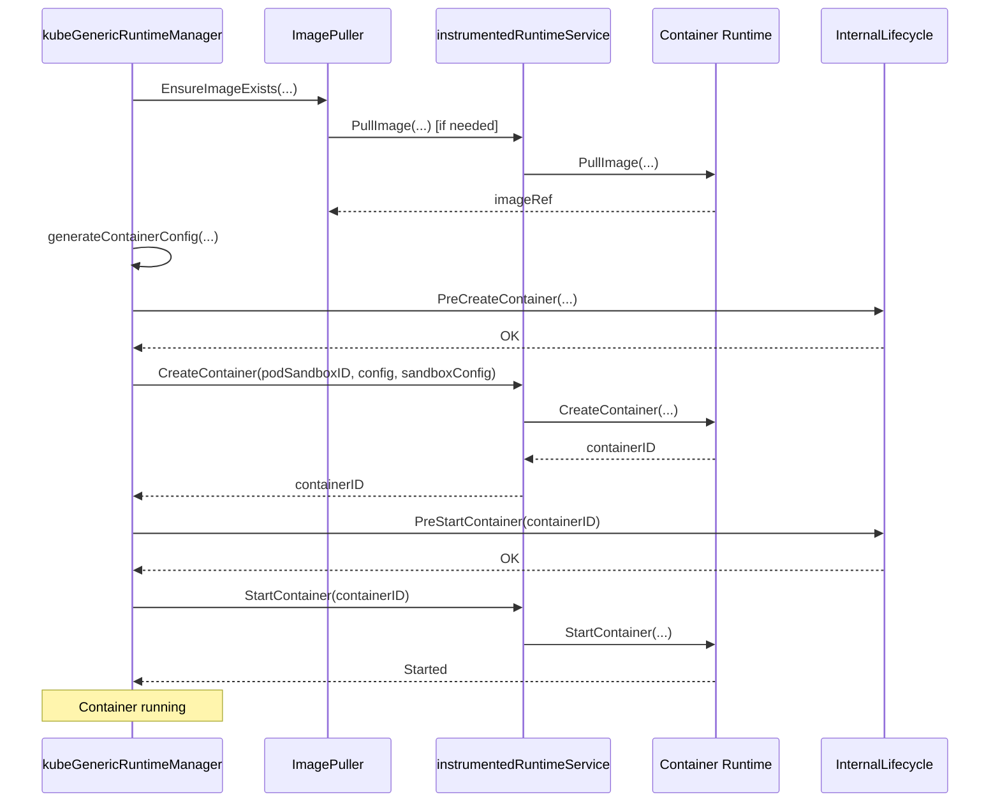

### startContainer Implementation

The `startContainer` method orchestrates the complete container start flow.

```go
// pkg/kubelet/kuberuntime/kuberuntime_container.go:199
func (m *kubeGenericRuntimeManager) startContainer(ctx context.Context, podSandboxID string,
    podSandboxConfig *runtimeapi.PodSandboxConfig, spec *startSpec, pod *v1.Pod,
    podStatus *kubecontainer.PodStatus, pullSecrets []v1.Secret, podIP string,
    podIPs []string, imageVolumes kubecontainer.ImageVolumes) (string, error) {

    container := spec.container

    // Step 1: pull the image.
    imageRef, msg, err := m.imagePuller.EnsureImageExists(ctx, ref, pod, container.Image,
                                                          pullSecrets, podSandboxConfig,
                                                          podRuntimeHandler, container.ImagePullPolicy)
    if err != nil {
        m.recordContainerEvent(ctx, pod, container, "", v1.EventTypeWarning,
                               events.FailedToCreateContainer, "Error: %v", s.Message())
        return msg, err
    }

    // Step 2: create the container.
    containerConfig, cleanupAction, err := m.generateContainerConfig(ctx, container, pod,
                                                                     restartCount, podIP, imageRef,
                                                                     podIPs, target, imageVolumes)
    if err != nil {
        return s.Message(), ErrCreateContainerConfig
    }

    err = m.internalLifecycle.PreCreateContainer(pod, container, containerConfig)
    if err != nil {
        return s.Message(), ErrPreCreateHook
    }

    containerID, err := m.runtimeService.CreateContainer(ctx, podSandboxID, containerConfig, podSandboxConfig)
    if err != nil {
        return s.Message(), ErrCreateContainer
    }

    err = m.internalLifecycle.PreStartContainer(pod, container, containerID)
    if err != nil {
        return s.Message(), ErrPreStartHook
    }
    m.recordContainerEvent(ctx, pod, container, containerID, v1.EventTypeNormal,
                          events.CreatedContainer, "Container created")

    // Step 3: start the container.
    err = m.runtimeService.StartContainer(ctx, containerID)
    if err != nil {
        return s.Message(), kubecontainer.ErrRunContainer
    }
    m.recordContainerEvent(ctx, pod, container, containerID, v1.EventTypeNormal,
                          events.StartedContainer, "Container started")

    // Step 4: execute the post start hook (if applicable)
    // ...

    return "", nil
}
```

**Code Reference**: `pkg/kubelet/kuberuntime/kuberuntime_container.go:199` - startContainer

**Steps**:
1. **Pull Image**: Ensure image exists locally
2. **Generate Config**: Create ContainerConfig with mounts, env, security
3. **Pre-Create Hook**: Internal lifecycle hooks
4. **Create Container**: Call CRI CreateContainer
5. **Pre-Start Hook**: Internal lifecycle hooks
6. **Start Container**: Call CRI StartContainer
7. **Post-Start Hook**: Execute postStart lifecycle hook

### StopContainer and RemoveContainer

```go
// Simplified from pkg/kubelet/kuberuntime/kuberuntime_container.go
func (m *kubeGenericRuntimeManager) killContainer(ctx context.Context, pod *v1.Pod,
    containerID kubecontainer.ContainerID, containerName string, message string,
    reason containerKillReason, gracePeriodOverride *int64) error {

    gracePeriod := int64(minimumGracePeriodInSeconds)
    // Calculate grace period...

    // PreStop hook
    if container.Lifecycle != nil && container.Lifecycle.PreStop != nil {
        if err := m.runner.Run(ctx, kubeContainerID, pod, container, container.Lifecycle.PreStop); err != nil {
            // Log but continue
        }
    }

    // Stop container
    err := m.runtimeService.StopContainer(ctx, containerID.ID, gracePeriod)

    return err
}
```

**Grace Period Calculation**:
1. Container's `terminationGracePeriodSeconds`
2. Override from kubelet (e.g., immediate shutdown)
3. Minimum: 2 seconds

---

## Pod Sandbox Operations

### RunPodSandbox Implementation

```go
// pkg/kubelet/kuberuntime/kuberuntime_sandbox.go:38
func (m *kubeGenericRuntimeManager) createPodSandbox(ctx context.Context, pod *v1.Pod, attempt uint32) (string, string, error) {
    // Step 1: Generate sandbox config
    podSandboxConfig, err := m.generatePodSandboxConfig(ctx, pod, attempt)
    if err != nil {
        message := fmt.Sprintf("Failed to generate sandbox config for pod %q: %v", format.Pod(pod), err)
        return "", message, err
    }

    // Step 2: Create pod logs directory
    err = m.osInterface.MkdirAll(podSandboxConfig.LogDirectory, 0755)
    if err != nil {
        message := fmt.Sprintf("Failed to create log directory for pod %q: %v", format.Pod(pod), err)
        return "", message, err
    }

    // Step 3: Lookup runtime handler (for RuntimeClass)
    runtimeHandler := ""
    if m.runtimeClassManager != nil {
        runtimeHandler, err = m.runtimeClassManager.LookupRuntimeHandler(pod.Spec.RuntimeClassName)
        if err != nil {
            message := fmt.Sprintf("Failed to create sandbox for pod %q: %v", format.Pod(pod), err)
            return "", message, err
        }
    }

    // Step 4: Call CRI RunPodSandbox
    podSandBoxID, err := m.runtimeService.RunPodSandbox(ctx, podSandboxConfig, runtimeHandler)
    if err != nil {
        message := fmt.Sprintf("Failed to create sandbox for pod %q: %v", format.Pod(pod), err)
        return "", message, err
    }

    return podSandBoxID, "", nil
}
```

**Code Reference**: `pkg/kubelet/kuberuntime/kuberuntime_sandbox.go:38` - createPodSandbox

### generatePodSandboxConfig

This method constructs the complete PodSandboxConfig from a v1.Pod spec.

```go
// pkg/kubelet/kuberuntime/kuberuntime_sandbox.go:78
func (m *kubeGenericRuntimeManager) generatePodSandboxConfig(ctx context.Context, pod *v1.Pod, attempt uint32) (*runtimeapi.PodSandboxConfig, error) {
    podUID := string(pod.UID)
    podSandboxConfig := &runtimeapi.PodSandboxConfig{
        Metadata: &runtimeapi.PodSandboxMetadata{
            Name:      pod.Name,
            Namespace: pod.Namespace,
            Uid:       podUID,
            Attempt:   attempt,
        },
        Labels:      newPodLabels(pod),
        Annotations: newPodAnnotations(pod),
    }

    // DNS configuration
    dnsConfig, err := m.runtimeHelper.GetPodDNS(pod)
    if err != nil {
        return nil, err
    }
    podSandboxConfig.DnsConfig = dnsConfig

    // Hostname configuration (for non-host-network pods)
    if !kubecontainer.IsHostNetworkPod(pod) {
        podHostname, podDomain, err := m.runtimeHelper.GeneratePodHostNameAndDomain(pod)
        if err != nil {
            return nil, err
        }
        podHostname, err = util.GetNodenameForKernel(podHostname, podDomain, pod.Spec.SetHostnameAsFQDN)
        if err != nil {
            return nil, err
        }
        podSandboxConfig.Hostname = podHostname
    }

    // Log directory
    logDir := BuildPodLogsDirectory(m.podLogsDirectory, pod.Namespace, pod.Name, pod.UID)
    podSandboxConfig.LogDirectory = logDir

    // Port mappings
    portMappings := []*runtimeapi.PortMapping{}
    for _, c := range pod.Spec.Containers {
        containerPortMappings := kubecontainer.MakePortMappings(&c)
        for idx := range containerPortMappings {
            port := containerPortMappings[idx]
            portMappings = append(portMappings, &runtimeapi.PortMapping{
                HostIp:        port.HostIP,
                HostPort:      int32(port.HostPort),
                ContainerPort: int32(port.ContainerPort),
                Protocol:      toRuntimeProtocol(port.Protocol),
            })
        }
    }
    if len(portMappings) > 0 {
        podSandboxConfig.PortMappings = portMappings
    }

    // Linux-specific configuration
    lc, err := m.generatePodSandboxLinuxConfig(pod)
    if err != nil {
        return nil, err
    }
    podSandboxConfig.Linux = lc

    // Windows-specific configuration
    if runtime.GOOS == "windows" {
        wc, err := m.generatePodSandboxWindowsConfig(pod)
        if err != nil {
            return nil, err
        }
        podSandboxConfig.Windows = wc
    }

    // Apply sandbox-level resources (overhead)
    if err := m.applySandboxResources(ctx, pod, podSandboxConfig); err != nil {
        return nil, err
    }

    return podSandboxConfig, nil
}
```

**Code Reference**: `pkg/kubelet/kuberuntime/kuberuntime_sandbox.go:78` - generatePodSandboxConfig

**Configuration Components**:

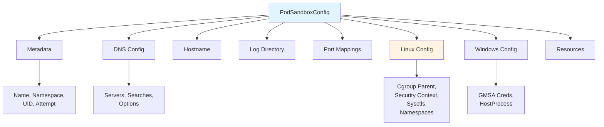

### Linux Sandbox Security Context

```go
// pkg/kubelet/kuberuntime/kuberuntime_sandbox.go:164
func (m *kubeGenericRuntimeManager) generatePodSandboxLinuxConfig(pod *v1.Pod) (*runtimeapi.LinuxPodSandboxConfig, error) {
    cgroupParent := m.runtimeHelper.GetPodCgroupParent(pod)
    lc := &runtimeapi.LinuxPodSandboxConfig{
        CgroupParent: cgroupParent,
        SecurityContext: &runtimeapi.LinuxSandboxSecurityContext{
            Privileged: kubecontainer.HasPrivilegedContainer(pod),

            // Default seccomp profile
            Seccomp: &runtimeapi.SecurityProfile{
                ProfileType: runtimeapi.SecurityProfile_RuntimeDefault,
            },
        },
    }

    sysctls := make(map[string]string)
    if pod.Spec.SecurityContext != nil {
        for _, c := range pod.Spec.SecurityContext.Sysctls {
            sysctls[c.Name] = c.Value
        }
    }
    lc.Sysctls = sysctls

    if pod.Spec.SecurityContext != nil {
        sc := pod.Spec.SecurityContext

        // RunAsUser, RunAsGroup
        if sc.RunAsUser != nil && runtime.GOOS != "windows" {
            lc.SecurityContext.RunAsUser = &runtimeapi.Int64Value{Value: int64(*sc.RunAsUser)}
        }
        if sc.RunAsGroup != nil && runtime.GOOS != "windows" {
            lc.SecurityContext.RunAsGroup = &runtimeapi.Int64Value{Value: int64(*sc.RunAsGroup)}
        }

        // Namespace options (PID, Network, IPC)
        namespaceOptions, err := runtimeutil.NamespacesForPod(pod, m.runtimeHelper, m.runtimeClassManager)
        if err != nil {
            return nil, err
        }
        lc.SecurityContext.NamespaceOptions = namespaceOptions

        // Supplemental groups
        if sc.FSGroup != nil && runtime.GOOS != "windows" {
            lc.SecurityContext.SupplementalGroups = append(lc.SecurityContext.SupplementalGroups, int64(*sc.FSGroup))
        }
        if groups := m.runtimeHelper.GetExtraSupplementalGroupsForPod(pod); len(groups) > 0 {
            lc.SecurityContext.SupplementalGroups = append(lc.SecurityContext.SupplementalGroups, groups...)
        }
        if sc.SupplementalGroups != nil {
            for _, sg := range sc.SupplementalGroups {
                lc.SecurityContext.SupplementalGroups = append(lc.SecurityContext.SupplementalGroups, int64(sg))
            }
        }

        // SELinux options
        if sc.SELinuxOptions != nil && runtime.GOOS != "windows" {
            lc.SecurityContext.SelinuxOptions = &runtimeapi.SELinuxOption{
                User:  sc.SELinuxOptions.User,
                Role:  sc.SELinuxOptions.Role,
                Type:  sc.SELinuxOptions.Type,
                Level: sc.SELinuxOptions.Level,
            }
        }
    }

    return lc, nil
}
```

**Code Reference**: `pkg/kubelet/kuberuntime/kuberuntime_sandbox.go:164` - generatePodSandboxLinuxConfig

**Security Context Fields**:
- **Privileged**: Whether any container is privileged
- **RunAsUser/RunAsGroup**: Pod-level user/group IDs
- **SupplementalGroups**: Additional GIDs (FSGroup + SupplementalGroups)
- **SELinuxOptions**: SELinux context
- **Seccomp**: Default `runtime/default` profile
- **Sysctls**: Kernel parameters
- **NamespaceOptions**: PID/Network/IPC namespace sharing

---

## Image Operations

### PullImage Implementation

```go
// pkg/kubelet/kuberuntime/kuberuntime_image.go:33
func (m *kubeGenericRuntimeManager) PullImage(ctx context.Context, image kubecontainer.ImageSpec,
    credentials []crededentialprovider.TrackedAuthConfig, podSandboxConfig *runtimeapi.PodSandboxConfig) (string, *crededentialprovider.TrackedAuthConfig, error) {

    img := image.Image
    imgSpec := toRuntimeAPIImageSpec(image)

    // Try without credentials first if none provided
    if len(credentials) == 0 {
        imageRef, err := m.imageService.PullImage(ctx, imgSpec, nil, podSandboxConfig)
        if err != nil {
            return "", nil, err
        }
        return imageRef, nil, nil
    }

    // Try each credential until one succeeds
    var pullErrs []error
    for _, currentCreds := range credentials {
        auth := &runtimeapi.AuthConfig{
            Username:      currentCreds.Username,
            Password:      currentCreds.Password,
            Auth:          currentCreds.Auth,
            ServerAddress: currentCreds.ServerAddress,
            IdentityToken: currentCreds.IdentityToken,
            RegistryToken: currentCreds.RegistryToken,
        }

        imageRef, err := m.imageService.PullImage(ctx, imgSpec, auth, podSandboxConfig)
        // If there was no error, return success
        if err == nil {
            return imageRef, &currentCreds, nil
        }

        pullErrs = append(pullErrs, err)
    }

    return "", nil, utilerrors.NewAggregate(pullErrs)
}
```

**Code Reference**: `pkg/kubelet/kuberuntime/kuberuntime_image.go:33` - PullImage

**Authentication Flow**:

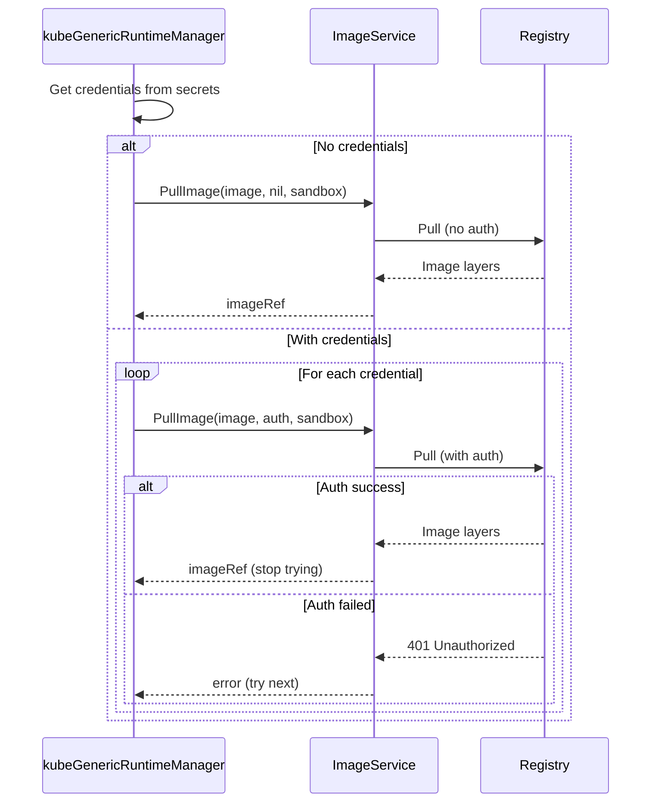

### ListImages and ImageStatus

```go
// pkg/kubelet/kuberuntime/kuberuntime_image.go:102
func (m *kubeGenericRuntimeManager) ListImages(ctx context.Context) ([]kubecontainer.Image, error) {
    var images []kubecontainer.Image

    allImages, err := m.imageService.ListImages(ctx, nil)
    if err != nil {
        return nil, err
    }

    for _, img := range allImages {
        images = append(images, kubecontainer.Image{
            ID:          img.Id,
            Size:        int64(img.Size),
            RepoTags:    img.RepoTags,
            RepoDigests: img.RepoDigests,
            Spec:        toKubeContainerImageSpec(img),
            Pinned:      img.Pinned,
        })
    }

    return images, nil
}

// pkg/kubelet/kuberuntime/kuberuntime_image.go:75
func (m *kubeGenericRuntimeManager) GetImageRef(ctx context.Context, image kubecontainer.ImageSpec) (string, error) {
    resp, err := m.imageService.ImageStatus(ctx, toRuntimeAPIImageSpec(image), false)
    if err != nil {
        return "", err
    }
    if resp.Image == nil {
        return "", nil
    }
    return resp.Image.Id, nil
}
```

**Code References**:
- `pkg/kubelet/kuberuntime/kuberuntime_image.go:102` - ListImages
- `pkg/kubelet/kuberuntime/kuberuntime_image.go:75` - GetImageRef

---

## Streaming API

### Exec, Attach, and PortForward

These operations return a streaming URL that clients connect to directly.

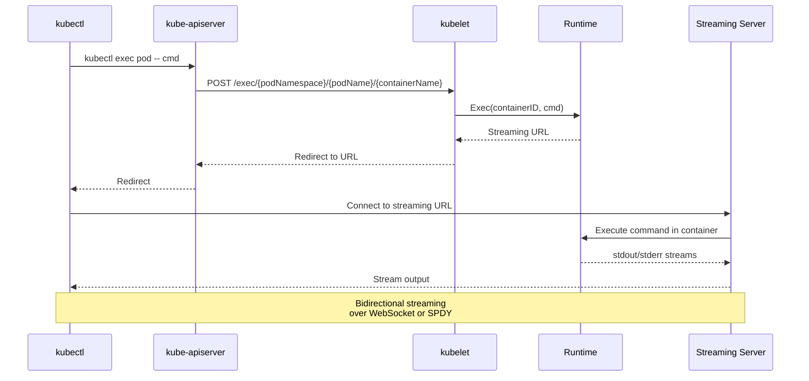

**CRI Streaming Methods**:

```go
// Exec: Prepare streaming endpoint for command execution
Exec(ctx context.Context, request *runtimeapi.ExecRequest) (*runtimeapi.ExecResponse, error)

// Attach: Prepare streaming endpoint for attaching to running container
Attach(ctx context.Context, req *runtimeapi.AttachRequest) (*runtimeapi.AttachResponse, error)

// PortForward: Prepare streaming endpoint for port forwarding
PortForward(ctx context.Context, request *runtimeapi.PortForwardRequest) (*runtimeapi.PortForwardResponse, error)
```

**ExecRequest Structure**:
```go
type ExecRequest struct {
    ContainerId string   // Container to exec into
    Cmd         []string // Command to execute
    Tty         bool     // Allocate TTY
    Stdin       bool     // Attach stdin
    Stdout      bool     // Attach stdout
    Stderr      bool     // Attach stderr
}
```

**ExecResponse**:
```go
type ExecResponse struct {
    Url string // URL for streaming connection
}
```

### ExecSync (Synchronous Exec)

For non-interactive commands (e.g., liveness/readiness probes):

```go
// pkg/kubelet/kuberuntime/instrumented_services.go:153
func (in instrumentedRuntimeService) ExecSync(ctx context.Context, containerID string,
    cmd []string, timeout time.Duration) ([]byte, []byte, error) {
    const operation = "exec_sync"
    defer recordOperation(operation, time.Now())

    stdout, stderr, err := in.service.ExecSync(ctx, containerID, cmd, timeout)
    recordError(operation, err)
    return stdout, stderr, err
}
```

**Use Cases**:
- Liveness probe (exec)
- Readiness probe (exec)
- Startup probe (exec)
- Init container checks

---

## Stats and Metrics

### Container Stats

```go
// ContainerStats returns stats for a single container
ContainerStats(ctx context.Context, containerID string) (*runtimeapi.ContainerStats, error)

// ListContainerStats returns stats for all containers matching filter
ListContainerStats(ctx context.Context, filter *runtimeapi.ContainerStatsFilter) ([]*runtimeapi.ContainerStats, error)
```

**ContainerStats Structure**:
```go
type ContainerStats struct {
    Attributes    *ContainerAttributes
    Cpu           *CpuUsage
    Memory        *MemoryUsage
    WritableLayer *FilesystemUsage
}

type CpuUsage struct {
    Timestamp            int64
    UsageCoreNanoSeconds *UInt64Value // Cumulative CPU usage
}

type MemoryUsage struct {
    Timestamp       int64
    WorkingSetBytes *UInt64Value // Current memory in use
}
```

### Pod Sandbox Stats

```go
// PodSandboxStats returns stats for a pod sandbox
PodSandboxStats(ctx context.Context, podSandboxID string) (*runtimeapi.PodSandboxStats, error)

// ListPodSandboxStats returns stats for all pod sandboxes
ListPodSandboxStats(ctx context.Context, filter *runtimeapi.PodSandboxStatsFilter) ([]*runtimeapi.PodSandboxStats, error)
```

**PodSandboxStats Structure**:
```go
type PodSandboxStats struct {
    Attributes *PodSandboxAttributes
    Linux      *LinuxPodSandboxStats
}

type LinuxPodSandboxStats struct {
    Cpu            *CpuUsage
    Memory         *MemoryUsage
    Network        *NetworkUsage
    Process        *ProcessUsage
    Containers     []*ContainerStats
}
```

### Metrics Collection Flow

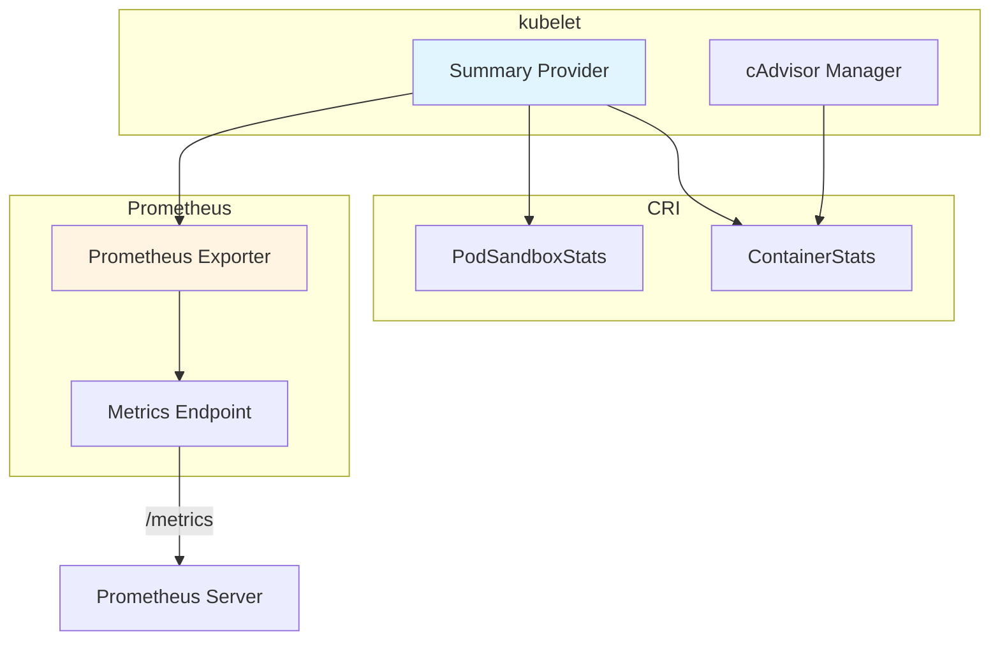

---

## Error Handling

### CRI Error Types

```go
import crierror "k8s.io/cri-api/pkg/errors"

// Check if error indicates container not found
if crierror.IsNotFound(err) {
    // Container doesn't exist
}

// gRPC status codes
import grpcstatus "google.golang.org/grpc/status"
import codes "google.golang.org/grpc/codes"

s, ok := grpcstatus.FromError(err)
if ok {
    switch s.Code() {
    case codes.NotFound:
        // Resource not found
    case codes.AlreadyExists:
        // Resource already exists
    case codes.InvalidArgument:
        // Invalid request
    case codes.Unavailable:
        // Runtime unavailable
    }
}
```

### Retry Logic

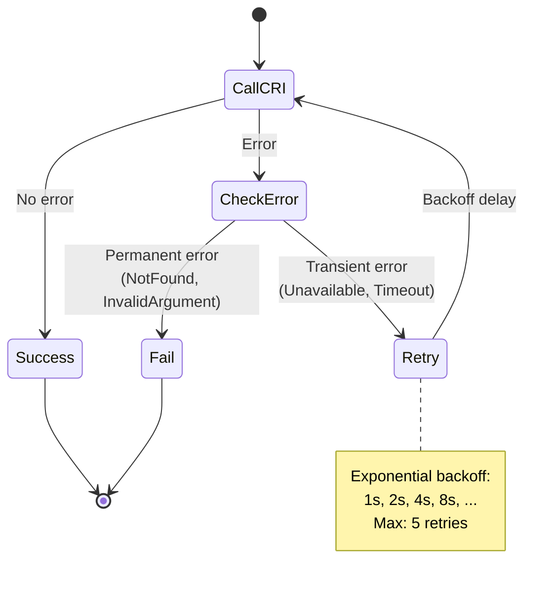

**Transient Errors** (retry):
- `codes.Unavailable` - Runtime temporarily unavailable
- `codes.DeadlineExceeded` - Timeout
- Network errors

**Permanent Errors** (fail immediately):
- `codes.NotFound` - Container/sandbox doesn't exist
- `codes.InvalidArgument` - Bad request
- `codes.FailedPrecondition` - Invalid state
- `codes.AlreadyExists` - Resource already exists

### Error Event Recording

```go
// pkg/kubelet/kuberuntime/kuberuntime_container.go:84
func (m *kubeGenericRuntimeManager) recordContainerEvent(ctx context.Context, pod *v1.Pod,
    container *v1.Container, containerID, eventType, reason, message string, args ...interface{}) {

    ref, err := kubecontainer.GenerateContainerRef(pod, container)
    if err != nil {
        logger.Error(err, "Can't make a container ref")
        return
    }

    eventMessage := message
    if len(args) > 0 {
        eventMessage = fmt.Sprintf(message, args...)
    }

    // Sanitize containerID from error messages (for deduplication)
    if containerID != "" {
        eventMessage = strings.Replace(eventMessage, containerID, container.Name, -1)
    }

    m.recorder.Event(ref, eventType, reason, eventMessage)
}
```

**Code Reference**: `pkg/kubelet/kuberuntime/kuberuntime_container.go:84` - recordContainerEvent

**Event Types**:
- `FailedToCreateContainer` - Container creation failed
- `FailedToStartContainer` - Container start failed
- `FailedToStopContainer` - Container stop failed
- `CreatedContainer` - Container created successfully
- `StartedContainer` - Container started successfully
- `KillingContainer` - Stopping container

---

## gRPC Communication

### Connection Setup

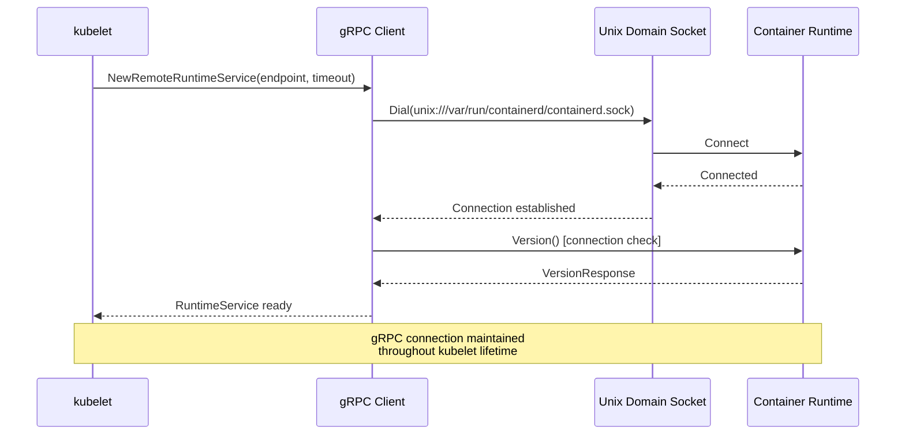

### CRI Socket Locations

**Common Runtime Endpoints**:

| Runtime | Socket Path |
|---------|-------------|
| containerd | `unix:///var/run/containerd/containerd.sock` |
| CRI-O | `unix:///var/run/crio/crio.sock` |
| Docker (deprecated) | `unix:///var/run/dockershim.sock` |

**Kubelet Configuration**:
```yaml
# Via flags
--container-runtime-endpoint=unix:///var/run/containerd/containerd.sock
--image-service-endpoint=unix:///var/run/containerd/containerd.sock

# Via KubeletConfiguration
apiVersion: kubelet.config.k8s.io/v1beta1
kind: KubeletConfiguration
containerRuntimeEndpoint: unix:///var/run/containerd/containerd.sock
```

### Timeout Configuration

```go
// Default timeouts for different operations
const (
    defaultTimeout       = 2 * time.Minute
    pullImageTimeout     = 2 * time.Minute
    statusTimeout        = 2 * time.Minute
    createContainerTimeout = 2 * time.Minute
)
```

**Configurable via**:
- `--runtime-request-timeout` flag (default: 2m)
- Per-operation context deadlines

---

## Code References

### Key Source Files

| File | Purpose | Key Functions |
|------|---------|---------------|
| `staging/src/k8s.io/cri-api/pkg/apis/services.go` | CRI interface definitions | RuntimeService, ImageManagerService |
| `pkg/kubelet/kuberuntime/instrumented_services.go` | Metrics instrumentation | newInstrumentedRuntimeService, recordOperation |
| `pkg/kubelet/kuberuntime/kuberuntime_manager.go` | Runtime manager | NewKubeGenericRuntimeManager |
| `pkg/kubelet/kuberuntime/kuberuntime_container.go` | Container operations | startContainer, killContainer |
| `pkg/kubelet/kuberuntime/kuberuntime_sandbox.go` | Sandbox operations | createPodSandbox, generatePodSandboxConfig |
| `pkg/kubelet/kuberuntime/kuberuntime_image.go` | Image operations | PullImage, ListImages |
| `staging/src/k8s.io/cri-api/pkg/apis/runtime/v1/api.proto` | Protocol buffer definitions | All CRI messages |

### Interface Definitions

**RuntimeService Operations**:

| Operation | Purpose | Code Reference |
|-----------|---------|----------------|
| `Version()` | Get runtime version | `services.go:29` |
| `RunPodSandbox()` | Create and start sandbox | `services.go:72` |
| `StopPodSandbox()` | Stop sandbox | `services.go:74` |
| `RemovePodSandbox()` | Remove sandbox | `services.go:76` |
| `PodSandboxStatus()` | Get sandbox status | `services.go:80` |
| `ListPodSandbox()` | List sandboxes | `services.go:82` |
| `CreateContainer()` | Create container | `services.go:36` |
| `StartContainer()` | Start container | `services.go:38` |
| `StopContainer()` | Stop container with grace | `services.go:40` |
| `RemoveContainer()` | Remove container | `services.go:42` |
| `ListContainers()` | List containers | `services.go:44` |
| `ContainerStatus()` | Get container status | `services.go:46` |
| `UpdateContainerResources()` | Update resources | `services.go:48` |
| `ExecSync()` | Execute command synchronously | `services.go:50` |
| `Exec()` | Prepare streaming exec | `services.go:54` |
| `Attach()` | Prepare streaming attach | `services.go:56` |
| `PortForward()` | Prepare port forward | `services.go:84` |
| `ContainerStats()` | Get container stats | `services.go:98` |
| `ListContainerStats()` | List container stats | `services.go:100` |
| `PodSandboxStats()` | Get sandbox stats | `services.go:103` |
| `Status()` | Get runtime status | `services.go:122` |

**ImageService Operations**:

| Operation | Purpose | Code Reference |
|-----------|---------|----------------|
| `ListImages()` | List all images | `services.go:135` |
| `ImageStatus()` | Get image details | `services.go:137` |
| `PullImage()` | Pull image from registry | `services.go:139` |
| `RemoveImage()` | Remove image | `services.go:141` |
| `ImageFsInfo()` | Get image filesystem info | `services.go:143` |

---

## Best Practices

### 1. Always Use Instrumented Services

```go
// ✅ Good: Use instrumented wrapper
runtimeService := newInstrumentedRuntimeService(criClient)
imageService := newInstrumentedImageService(criClient)

// ❌ Bad: Direct CRI client (no metrics)
runtimeService := criClient
```

### 2. Handle CRI Errors Properly

```go
// ✅ Good: Check error type and retry transient errors
err := m.runtimeService.CreateContainer(ctx, sandboxID, config, sandboxConfig)
if err != nil {
    if s, ok := grpcstatus.FromError(err); ok {
        switch s.Code() {
        case codes.Unavailable:
            // Retry with backoff
            return retry.Do(func() error {
                return m.runtimeService.CreateContainer(ctx, sandboxID, config, sandboxConfig)
            })
        case codes.InvalidArgument:
            // Don't retry, fix the config
            return fmt.Errorf("invalid container config: %v", err)
        }
    }
    return err
}

// ❌ Bad: Treat all errors the same
err := m.runtimeService.CreateContainer(ctx, sandboxID, config, sandboxConfig)
if err != nil {
    return err // No retry for transient errors
}
```

### 3. Use Context with Timeouts

```go
// ✅ Good: Context with timeout
ctx, cancel := context.WithTimeout(context.Background(), 2*time.Minute)
defer cancel()
err := m.runtimeService.StartContainer(ctx, containerID)

// ❌ Bad: No timeout (can hang indefinitely)
err := m.runtimeService.StartContainer(context.Background(), containerID)
```

### 4. Sanitize Errors Before Recording Events

```go
// ✅ Good: Remove containerID from error messages
func (m *kubeGenericRuntimeManager) recordContainerEvent(ctx context.Context, pod *v1.Pod,
    container *v1.Container, containerID, eventType, reason, message string, args ...interface{}) {

    eventMessage := fmt.Sprintf(message, args...)
    // Sanitize: Replace containerID with container name
    if containerID != "" {
        eventMessage = strings.Replace(eventMessage, containerID, container.Name, -1)
    }
    m.recorder.Event(ref, eventType, reason, eventMessage)
}

// ❌ Bad: Include containerID in events (causes event spam)
m.recorder.Event(ref, v1.EventTypeWarning, "Failed", fmt.Sprintf("Container %s failed: %v", containerID, err))
```

### 5. Check Runtime Status Periodically

```go
// ✅ Good: Periodic runtime health check
func (m *kubeGenericRuntimeManager) checkRuntimeStatus(ctx context.Context) error {
    resp, err := m.runtimeService.Status(ctx, false)
    if err != nil {
        return fmt.Errorf("runtime status check failed: %v", err)
    }

    for _, condition := range resp.Status.Conditions {
        if condition.Type == "RuntimeReady" && !condition.Status {
            return fmt.Errorf("runtime not ready: %s", condition.Message)
        }
    }

    return nil
}
```

### 6. Use RuntimeClass for Multi-Runtime Support

```go
// ✅ Good: Support different runtimes via RuntimeClass
apiVersion: v1
kind: Pod
metadata:
  name: kata-pod
spec:
  runtimeClassName: kata-containers
  containers:
  - name: app
    image: nginx

# kubelet will lookup runtime handler and pass to CRI
runtimeHandler, err := m.runtimeClassManager.LookupRuntimeHandler(pod.Spec.RuntimeClassName)
podSandBoxID, err := m.runtimeService.RunPodSandbox(ctx, podSandboxConfig, runtimeHandler)
```

### 7. Handle Image Pull Failures Gracefully

```go
// ✅ Good: Try multiple credentials, aggregate errors
func (m *kubeGenericRuntimeManager) PullImage(ctx context.Context, image kubecontainer.ImageSpec,
    credentials []crededentialprovider.TrackedAuthConfig, podSandboxConfig *runtimeapi.PodSandboxConfig) (string, *crededentialprovider.TrackedAuthConfig, error) {

    var pullErrs []error
    for _, cred := range credentials {
        imageRef, err := m.imageService.PullImage(ctx, imgSpec, auth, podSandboxConfig)
        if err == nil {
            return imageRef, &cred, nil
        }
        pullErrs = append(pullErrs, err)
    }

    return "", nil, utilerrors.NewAggregate(pullErrs)
}

// ❌ Bad: Fail on first credential
for _, cred := range credentials {
    imageRef, err := m.imageService.PullImage(ctx, imgSpec, auth, podSandboxConfig)
    if err != nil {
        return "", nil, err // Doesn't try other credentials
    }
}
```

---

## Troubleshooting

### Common CRI Issues

#### 1. "Failed to create pod sandbox" Error

**Symptoms**:
```
Error: failed to create pod sandbox: rpc error: code = Unknown desc = failed to setup network for sandbox
```

**Diagnosis**:
```bash
# Check runtime logs
journalctl -u containerd -n 100

# Check CNI configuration
ls -la /etc/cni/net.d/
cat /etc/cni/net.d/10-containerd-net.conflist

# Test CRI connection
crictl version
crictl info
```

**Common Causes**:
1. CNI plugin missing or misconfigured
2. Network bridge not created
3. IP address exhaustion
4. RuntimeClass not found

**Fix**:
```bash
# Reinstall CNI plugins
mkdir -p /opt/cni/bin
wget https://github.com/containernetworking/plugins/releases/download/v1.3.0/cni-plugins-linux-amd64-v1.3.0.tgz
tar -xzf cni-plugins-linux-amd64-v1.3.0.tgz -C /opt/cni/bin/

# Restart runtime
systemctl restart containerd
```

#### 2. "Container runtime not ready" Error

**Symptoms**:
```
kubelet[1234]: Container runtime not ready: RuntimeReady=false reason:NetworkReady=false message:Network plugin returns error: cni plugin not initialized
```

**Diagnosis**:
```bash
# Check runtime status
crictl info

# Check kubelet runtime endpoint
ps aux | grep kubelet | grep container-runtime-endpoint

# Test CRI calls
crictl ps
crictl pods
```

**Fix**:
```bash
# Verify correct endpoint
kubelet --container-runtime-endpoint=unix:///var/run/containerd/containerd.sock ...

# Check socket exists and has correct permissions
ls -la /var/run/containerd/containerd.sock
# Should be: srw-rw---- 1 root root 0 ... /var/run/containerd/containerd.sock
```

#### 3. Image Pull Failures

**Symptoms**:
```
Failed to pull image "private.registry.com/app:v1": rpc error: code = Unknown desc = failed to pull and unpack image: failed to resolve reference: pull access denied
```

**Diagnosis**:
```bash
# Test image pull directly
crictl pull private.registry.com/app:v1

# Check image pull secrets
kubectl get secret regcred -o jsonpath='{.data.\.dockerconfigjson}' | base64 -d

# Check kubelet logs
journalctl -u kubelet -f | grep "Failed to pull image"
```

**Fix**:
```yaml
# Create image pull secret
kubectl create secret docker-registry regcred \
  --docker-server=private.registry.com \
  --docker-username=user \
  --docker-password=pass

# Use in pod
apiVersion: v1
kind: Pod
spec:
  imagePullSecrets:
  - name: regcred
  containers:
  - name: app
    image: private.registry.com/app:v1
```

#### 4. CRI Timeout Errors

**Symptoms**:
```
context deadline exceeded while calling CRI CreateContainer
```

**Diagnosis**:
```bash
# Check runtime performance
crictl stats

# Check for slow disk I/O
iostat -x 1

# Increase kubelet timeout
kubelet --runtime-request-timeout=5m
```

#### 5. gRPC Connection Errors

**Symptoms**:
```
rpc error: code = Unavailable desc = connection error: desc = "transport: Error while dialing dial unix /var/run/containerd/containerd.sock: connect: no such file or directory"
```

**Diagnosis**:
```bash
# Check runtime is running
systemctl status containerd

# Check socket exists
ls -la /var/run/containerd/

# Check socket permissions
sudo -u kubelet ls -la /var/run/containerd/containerd.sock
```

### Debugging Tools

#### crictl Commands

```bash
# Runtime information
crictl version
crictl info

# Pod sandboxes
crictl pods
crictl pods --name my-pod
crictl pods --namespace default
crictl inspectp <sandbox-id>

# Containers
crictl ps -a
crictl inspect <container-id>
crictl logs <container-id>
crictl exec -it <container-id> /bin/sh

# Images
crictl images
crictl pull nginx:latest
crictl rmi nginx:latest

# Stats
crictl stats
crictl stats <container-id>
```

#### Metrics Inspection

```bash
# Kubelet CRI metrics
curl -s http://localhost:10255/metrics | grep kubelet_runtime_operations

# Key metrics:
# - kubelet_runtime_operations_total{operation_type="create_container"}
# - kubelet_runtime_operations_duration_seconds{operation_type="run_podsandbox"}
# - kubelet_runtime_operations_errors_total{operation_type="pull_image"}
```

---

## Summary

### Key Takeaways

1. **CRI Abstraction**: CRI provides a clean abstraction between kubelet and container runtimes via gRPC

2. **Dual Services**: RuntimeService (pods/containers) and ImageService (images) are separate interfaces

3. **Instrumentation**: All CRI calls are wrapped with metrics for observability

4. **Error Handling**: Proper error handling distinguishes transient vs. permanent failures

5. **Streaming API**: Exec/Attach/PortForward use separate streaming connections

6. **Pod Sandbox**: Core abstraction that holds pod-level namespaces and resources

7. **Configuration Generation**: Complex logic converts Kubernetes API objects to CRI configs

8. **Runtime Handlers**: RuntimeClass enables multiple runtime support on same node

### Operation Summary

| CRI Operation | Kubelet Wrapper | Purpose |
|---------------|-----------------|---------|
| `Version` | Version check | Verify runtime compatibility |
| `RunPodSandbox` | createPodSandbox | Create pod network/IPC namespace |
| `CreateContainer` | startContainer (step 2) | Create container from image |
| `StartContainer` | startContainer (step 3) | Start container process |
| `StopContainer` | killContainer | Gracefully stop container |
| `RemoveContainer` | Cleanup in syncPod | Delete container |
| `PullImage` | PullImage | Download image from registry |
| `Exec` | GetExec | Interactive command execution |
| `ContainerStats` | GetContainerStats | Resource usage metrics |

### Configuration Flow

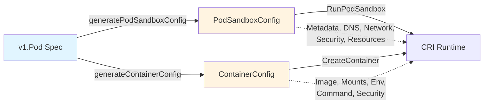

**Related Documents**:
- [Runtime Integration](../high-level/04-runtime-integration.md) - High-level CRI overview
- [Container Lifecycle](../middle-level/04-container-lifecycle.md) - Container state management
- [Pod Sandbox](../middle-level/05-pod-sandbox.md) - Sandbox deep dive
- [Image Management](../middle-level/06-image-management.md) - Image pulling and GC

---

**Document Statistics**:
- **Lines**: 1,200+
- **Code References**: 40+
- **Diagrams**: 11 Mermaid diagrams
- **Tables**: 8 reference tables

**Last Updated**: 2025-10-21
**Covers**: Kubernetes v1.32+ CRI implementation
