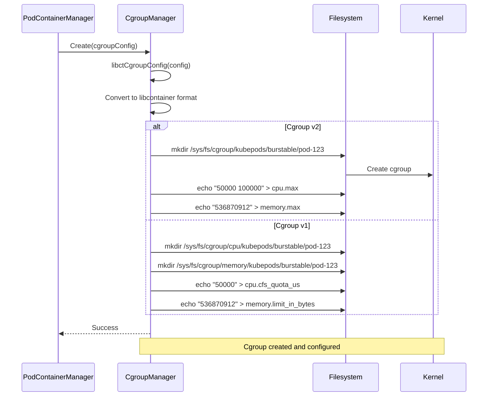
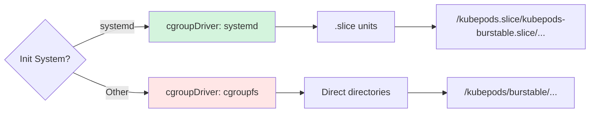
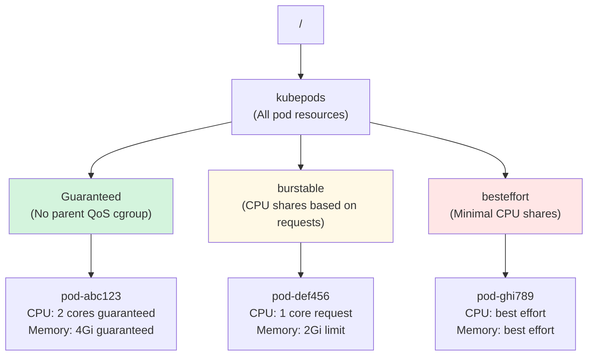
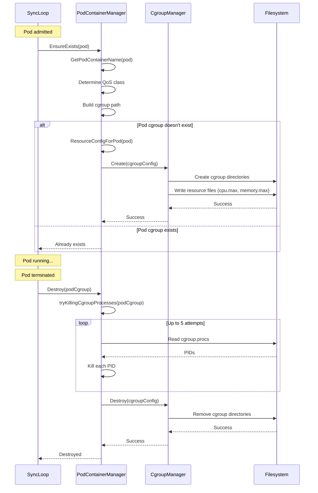
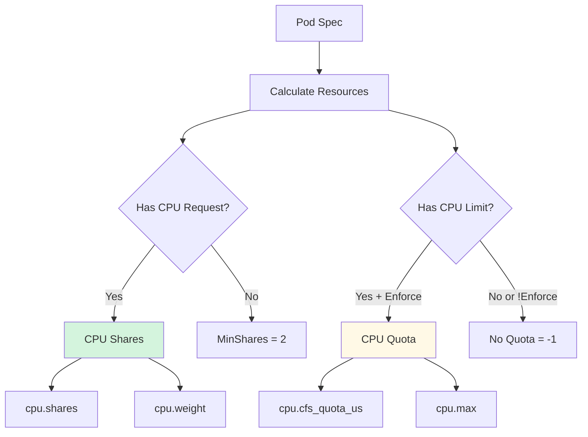
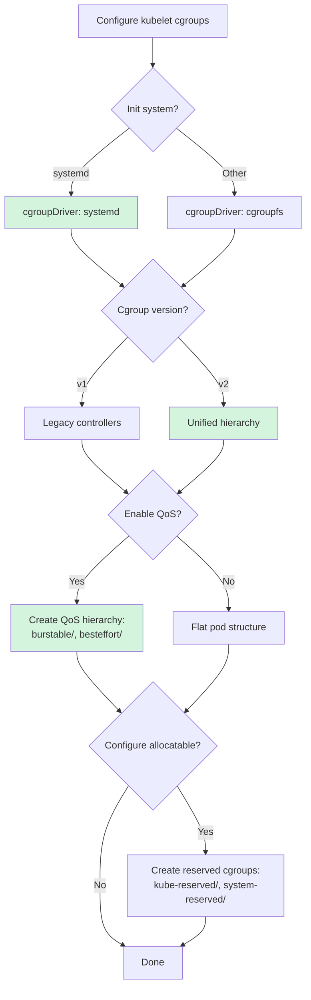

# Cgroup Management - Low-Level Technical Specification

**Purpose**: Detailed technical specification of cgroup (control group) management in kubelet

**Audience**: Node administrators, kubelet contributors, performance engineers

**Related Documents**:
- [Resource Management](../middle-level/08-resource-management.md) - High-level resource concepts
- [Pod Lifecycle](../high-level/03-pod-lifecycle-overview.md) - Pod lifecycle and QoS
- [Container Manager](../high-level/02-component-architecture.md) - Container Manager architecture

---

## Table of Contents

1. [Cgroup Overview](#cgroup-overview)
2. [Cgroup Hierarchy](#cgroup-hierarchy)
3. [Cgroup v1 vs v2](#cgroup-v1-vs-v2)
4. [Cgroup Managers](#cgroup-managers)
5. [Cgroup Drivers](#cgroup-drivers)
6. [QoS-Based Cgroup Organization](#qos-based-cgroup-organization)
7. [Pod Cgroup Management](#pod-cgroup-management)
8. [CPU Resource Enforcement](#cpu-resource-enforcement)
9. [Memory Resource Enforcement](#memory-resource-enforcement)
10. [Cgroup Creation and Configuration](#cgroup-creation-and-configuration)
11. [OOM Score Adjustment](#oom-score-adjustment)
12. [Node Allocatable](#node-allocatable)
13. [Code References](#code-references)
14. [Best Practices](#best-practices)

---

## Cgroup Overview

### What are Cgroups?

Control groups (cgroups) are a Linux kernel feature that limits, accounts for, and isolates resource usage (CPU, memory, disk I/O, network, etc.) of process groups.

**Kubelet uses cgroups to**:
1. **Enforce resource limits** - CPU, memory quotas
2. **Guarantee resources** - Reserved CPU, memory for Guaranteed QoS
3. **Account resource usage** - Track actual consumption
4. **Isolate workloads** - Prevent resource contention
5. **Implement QoS** - Differentiate pod priority

```mermaid
graph TB
    subgraph "Cgroup Hierarchy"
        ROOT[/ root cgroup]
        KP[kubepods]
        GUA[Guaranteed]
        BUR[Burstable]
        BE[BestEffort]

        ROOT --> SYSTEM[system.slice]
        ROOT --> KP
        KP --> GUA
        KP --> BUR
        KP --> BE

        GUA --> P1[pod-123...]
        BUR --> P2[pod-456...]
        BE --> P3[pod-789...]

        P1 --> C1[container1]
        P1 --> C2[container2]
    end

    style ROOT fill:#e1f5ff
    style KP fill:#fff4e1
    style GUA fill:#d4f4dd
    style BUR fill:#fff9e6
    style BE fill:#ffe6e6
```

**Key Cgroup Controllers**:
- **cpu**: CPU time allocation and limits
- **cpuset**: CPU core pinning
- **memory**: Memory limits and accounting
- **pids**: Process number limits
- **hugetlb**: Huge page limits

**Code Reference**: `pkg/kubelet/cm/container_manager.go:66` - ContainerManager interface

---

## Cgroup Hierarchy

### Kubernetes Cgroup Structure

Kubelet organizes cgroups hierarchically based on QoS classes:

```
/
├── kubepods/                                    # All Kubernetes pods
│   ├── burstable/                              # Burstable QoS pods
│   │   ├── pod<uid>/                           # Individual pod cgroup
│   │   │   ├── <container-id>/                 # Container cgroup
│   │   │   └── <container-id>/
│   │   └── pod<uid>/
│   ├── besteffort/                             # BestEffort QoS pods
│   │   └── pod<uid>/
│   │       └── <container-id>/
│   └── pod<uid>/                               # Guaranteed QoS pods (direct children)
│       ├── <container-id>/
│       └── <container-id>/
├── system.slice/                                # Systemd system services
│   ├── kubelet.service
│   └── containerd.service
└── user.slice/                                  # User sessions
```

**QoS Class Placement**:

| QoS Class | Parent Cgroup | Example Path |
|-----------|---------------|--------------|
| **Guaranteed** | `/kubepods` | `/kubepods/pod1234-5678-...` |
| **Burstable** | `/kubepods/burstable` | `/kubepods/burstable/pod1234-5678-...` |
| **BestEffort** | `/kubepods/besteffort` | `/kubepods/besteffort/pod1234-5678-...` |

**Code Reference**: `pkg/kubelet/cm/pod_container_manager_linux.go:108` - GetPodContainerName

### Cgroup Naming Conventions

```go
// pkg/kubelet/cm/cgroup_manager_linux.go:53
func NewCgroupName(base CgroupName, components ...string) CgroupName {
    for _, component := range components {
        // Forbid using "_" in internal names. When remapping internal
        // names to systemd cgroup driver, we want to remap "-" => "_",
        // so we forbid "_" so that we can always reverse the mapping.
        if strings.Contains(component, "/") || strings.Contains(component, "_") {
            panic(fmt.Errorf("invalid character in component [%q] of CgroupName", component))
        }
    }
    return CgroupName(append(append([]string{}, base...), components...))
}
```

**Internal Representation**:
- Stored as `CgroupName` (slice of strings)
- Example: `["kubepods", "burstable", "pod1234-5678-..."]`

**Code Reference**: `pkg/kubelet/cm/cgroup_manager_linux.go:53` - NewCgroupName

---

## Cgroup v1 vs v2

### Cgroup v1 (Legacy)

**Characteristics**:
- Multiple separate hierarchies (one per controller)
- Controllers mounted at different locations
- Complex directory structure

**Mount Points** (cgroup v1):
```bash
/sys/fs/cgroup/cpu/         # CPU controller
/sys/fs/cgroup/memory/      # Memory controller
/sys/fs/cgroup/cpuset/      # CPU set controller
/sys/fs/cgroup/pids/        # PIDs controller
```

**CPU Configuration Files**:
- `cpu.cfs_period_us` - CFS scheduling period (default: 100ms)
- `cpu.cfs_quota_us` - CPU time quota per period
- `cpu.shares` - CPU weight (default: 1024)

**Memory Configuration Files**:
- `memory.limit_in_bytes` - Hard memory limit
- `memory.usage_in_bytes` - Current memory usage
- `memory.stat` - Detailed memory statistics

**Code Reference**: `pkg/kubelet/cm/cgroup_v1_manager_linux.go:31` - cgroupv1MemLimitFile

### Cgroup v2 (Unified Hierarchy)

**Characteristics**:
- Single unified hierarchy
- All controllers in one tree
- Simplified configuration
- Better performance

**Mount Point** (cgroup v2):
```bash
/sys/fs/cgroup/             # Unified hierarchy (all controllers)
```

**CPU Configuration Files**:
- `cpu.max` - CPU quota and period (e.g., "50000 100000")
- `cpu.weight` - CPU weight (1-10000, default: 100)
- `cpu.stat` - CPU usage statistics

**Memory Configuration Files**:
- `memory.max` - Hard memory limit
- `memory.current` - Current memory usage
- `memory.high` - Memory throttling threshold
- `memory.min` - Memory guarantee (protected memory)

**Code Reference**: `pkg/kubelet/cm/cgroup_v2_manager_linux.go:33` - cgroupv2MemLimitFile

### Comparison Table

| Feature | Cgroup v1 | Cgroup v2 |
|---------|-----------|-----------|
| **Hierarchy** | Multiple separate | Single unified |
| **CPU Quota** | `cpu.cfs_quota_us` | `cpu.max` |
| **CPU Weight** | `cpu.shares` (2-262144) | `cpu.weight` (1-10000) |
| **Memory Limit** | `memory.limit_in_bytes` | `memory.max` |
| **Memory Current** | `memory.usage_in_bytes` | `memory.current` |
| **Controllers** | Separate mounts | Single tree |
| **Performance** | Slower | Faster |
| **Complexity** | Higher | Lower |

### CPU Weight Conversion

```go
// pkg/kubelet/cm/cgroup_manager_linux.go:266
// getCPUWeight converts from the range [2, 262144] to [1, 10000]
func getCPUWeight(cpuShares *uint64) uint64 {
    if cpuShares == nil {
        return 0
    }
    if *cpuShares >= 262144 {
        return 10000
    }
    return 1 + ((*cpuShares-2)*9999)/262142
}

// pkg/kubelet/cm/cgroup_v2_manager_linux.go:171
// Convert cgroup v2 cpu.weight value to cgroup v1 cpu.shares
func cpuWeightToCPUShares(cpuWeight uint64) uint64 {
    return uint64((((cpuWeight - 1) * 262142) / 9999) + 2)
}
```

**Formulas**:
- **v1 to v2**: `weight = 1 + ((shares - 2) * 9999) / 262142`
- **v2 to v1**: `shares = (((weight - 1) * 262142) / 9999) + 2`

**Examples**:
- `shares=2` → `weight=1` (minimum)
- `shares=1024` → `weight=39` (default)
- `shares=262144` → `weight=10000` (maximum)

**Code References**:
- `pkg/kubelet/cm/cgroup_manager_linux.go:266` - getCPUWeight (v1→v2)
- `pkg/kubelet/cm/cgroup_v2_manager_linux.go:171` - cpuWeightToCPUShares (v2→v1)

### Detection and Version

```go
// Detect cgroup version
if libcontainercgroups.IsCgroup2UnifiedMode() {
    return NewCgroupV2Manager(cs, cgroupDriver)
}
return NewCgroupV1Manager(cs, cgroupDriver)
```

**Code Reference**: `pkg/kubelet/cm/cgroup_manager_linux.go:156` - NewCgroupManager

---

## Cgroup Managers

### CgroupManager Interface

```go
// Simplified from pkg/kubelet/cm/types.go
type CgroupManager interface {
    // Create a new cgroup
    Create(*CgroupConfig) error

    // Update resource configuration
    Update(*CgroupConfig) error

    // Destroy a cgroup
    Destroy(*CgroupConfig) error

    // Check if cgroup exists
    Exists(CgroupName) bool

    // Validate cgroup paths
    Validate(CgroupName) error

    // Get cgroup version (1 or 2)
    Version() int

    // Get current memory usage
    MemoryUsage(CgroupName) (int64, error)

    // Get cgroup configuration
    GetCgroupConfig(CgroupName, v1.ResourceName) (*ResourceConfig, error)

    // Set cgroup configuration
    SetCgroupConfig(CgroupName, *ResourceConfig) error
}
```

### cgroupV1impl

```go
// pkg/kubelet/cm/cgroup_v1_manager_linux.go:38
type cgroupV1impl struct {
    cgroupCommon
}

func (c *cgroupV1impl) Version() int {
    return 1
}

func (c *cgroupV1impl) MemoryUsage(name CgroupName) (int64, error) {
    mp, ok := c.subsystems.MountPoints["memory"]
    if !ok {
        return -1, errors.New("no cgroup v1 mountpoint for memory controller found")
    }
    path := mp + "/" + c.Name(name)
    file := "memory.usage_in_bytes"
    val, err := fscommon.GetCgroupParamUint(path, file)
    return int64(val), err
}
```

**Code Reference**: `pkg/kubelet/cm/cgroup_v1_manager_linux.go:38` - cgroupV1impl

### cgroupV2impl

```go
// pkg/kubelet/cm/cgroup_v2_manager_linux.go:44
type cgroupV2impl struct {
    cgroupCommon
}

func (c *cgroupV2impl) Version() int {
    return 2
}

func (c *cgroupV2impl) MemoryUsage(name CgroupName) (int64, error) {
    path := c.buildCgroupUnifiedPath(name)
    file := "memory.current"
    val, err := fscommon.GetCgroupParamUint(path, file)
    return int64(val), err
}
```

**Code Reference**: `pkg/kubelet/cm/cgroup_v2_manager_linux.go:44` - cgroupV2impl

### CgroupManager Operations Flow



---

## Cgroup Drivers

### cgroupfs Driver

**Characteristics**:
- Direct filesystem manipulation
- Kubelet directly creates cgroup directories
- Path format: `/kubepods/burstable/pod123-456...`

**Name Conversion**:
```go
// pkg/kubelet/cm/cgroup_manager_linux.go:110
func (cgroupName CgroupName) ToCgroupfs() string {
    return "/" + path.Join(cgroupName...)
}

// Example: ["kubepods", "burstable", "pod123"] → "/kubepods/burstable/pod123"
```

**Pros**:
- Simple and direct
- No dependency on systemd

**Cons**:
- No integration with systemd
- Manual lifecycle management

**Code Reference**: `pkg/kubelet/cm/cgroup_manager_linux.go:110` - ToCgroupfs

### systemd Driver

**Characteristics**:
- Uses systemd transient units (.slice files)
- Integrates with system init
- Path format: `/kubepods.slice/kubepods-burstable.slice/kubepods-burstable-pod123_456....slice`

**Name Conversion**:
```go
// pkg/kubelet/cm/cgroup_manager_linux.go:81
func (cgroupName CgroupName) ToSystemd() string {
    if len(cgroupName) == 0 || (len(cgroupName) == 1 && cgroupName[0] == "") {
        return "/"
    }
    newparts := []string{}
    for _, part := range cgroupName {
        part = escapeSystemdCgroupName(part)  // "-" → "_"
        newparts = append(newparts, part)
    }

    result, err := cgroupsystemd.ExpandSlice(strings.Join(newparts, "-") + systemdSuffix)
    return result
}

func escapeSystemdCgroupName(part string) string {
    return strings.Replace(part, "-", "_", -1)
}

// Example: ["kubepods", "burstable", "pod123-456"]
//       → "kubepods-burstable-pod123_456.slice"
//       → "/kubepods.slice/kubepods-burstable.slice/kubepods-burstable-pod123_456.slice"
```

**Pros**:
- Integration with systemd
- Automatic cleanup via systemd
- Better visibility with `systemctl`

**Cons**:
- Requires systemd
- More complex name mangling

**Code References**:
- `pkg/kubelet/cm/cgroup_manager_linux.go:81` - ToSystemd
- `pkg/kubelet/cm/cgroup_manager_linux.go:68` - escapeSystemdCgroupName

### Driver Selection

```yaml
# Via KubeletConfiguration
apiVersion: kubelet.config.k8s.io/v1beta1
kind: KubeletConfiguration
cgroupDriver: systemd  # or "cgroupfs"
```

**Kubelet flags**:
```bash
kubelet --cgroup-driver=systemd
```

**Best Practice**: Use `systemd` driver when using systemd as init system.



---

## QoS-Based Cgroup Organization

### QoS Container Manager

```go
// pkg/kubelet/cm/qos_container_manager_linux.go (simplified)
type qosContainerManagerImpl struct {
    cgroupRoot      CgroupName
    cgroupManager   CgroupManager
    qosContainersInfo QOSContainersInfo
}

type QOSContainersInfo struct {
    Guaranteed CgroupName  // /kubepods/
    Burstable  CgroupName  // /kubepods/burstable/
    BestEffort CgroupName  // /kubepods/besteffort/
}
```

### QoS Hierarchy



### QoS Cgroup Resources

**Guaranteed**:
- **CPU**: `cpu.cfs_quota_us` set to exact CPU request
- **Memory**: `memory.limit_in_bytes` set to exact memory request
- **Placement**: Direct child of `/kubepods`

**Burstable**:
- **CPU**: `cpu.shares` based on total requests, can burst
- **Memory**: `memory.limit_in_bytes` set if limit specified
- **Placement**: Under `/kubepods/burstable`

**BestEffort**:
- **CPU**: Minimal `cpu.shares` (2 or minimum)
- **Memory**: No limit (uses available memory)
- **Placement**: Under `/kubepods/besteffort`

### GetPodContainerName

```go
// pkg/kubelet/cm/pod_container_manager_linux.go:108
func (m *podContainerManagerImpl) GetPodContainerName(pod *v1.Pod) (CgroupName, string) {
    podQOS := v1qos.GetPodQOS(pod)
    // Get the parent QOS container name
    var parentContainer CgroupName
    switch podQOS {
    case v1.PodQOSGuaranteed:
        parentContainer = m.qosContainersInfo.Guaranteed
    case v1.PodQOSBurstable:
        parentContainer = m.qosContainersInfo.Burstable
    case v1.PodQOSBestEffort:
        parentContainer = m.qosContainersInfo.BestEffort
    }
    podContainer := GetPodCgroupNameSuffix(pod.UID)

    // Get the absolute path of the cgroup
    cgroupName := NewCgroupName(parentContainer, podContainer)
    // Get the literal cgroupfs name
    cgroupfsName := m.cgroupManager.Name(cgroupName)

    return cgroupName, cgroupfsName
}
```

**Code Reference**: `pkg/kubelet/cm/pod_container_manager_linux.go:108` - GetPodContainerName

---

## Pod Cgroup Management

### PodContainerManager Interface

```go
// Simplified from pkg/kubelet/cm/types.go
type PodContainerManager interface {
    // Check if pod's cgroup exists
    Exists(pod *v1.Pod) bool

    // Create pod's cgroup if it doesn't exist
    EnsureExists(pod *v1.Pod) error

    // Get pod's cgroup name
    GetPodContainerName(pod *v1.Pod) (CgroupName, string)

    // Destroy pod's cgroup
    Destroy(podCgroup CgroupName) error

    // Get pod's memory usage
    GetPodCgroupMemoryUsage(pod *v1.Pod) (uint64, error)

    // Reduce CPU limits to minimum
    ReduceCPULimits(podCgroup CgroupName) error
}
```

### EnsureExists Implementation

```go
// pkg/kubelet/cm/pod_container_manager_linux.go:74
func (m *podContainerManagerImpl) EnsureExists(pod *v1.Pod) error {
    // check if container already exist
    alreadyExists := m.Exists(pod)
    if !alreadyExists {
        enforceCPULimits := m.enforceCPULimits
        if utilfeature.DefaultFeatureGate.Enabled(kubefeatures.DisableCPUQuotaWithExclusiveCPUs) &&
           m.podContainerManager.PodHasExclusiveCPUs(pod) {
            klog.V(2).InfoS("Disabled CFS quota", "pod", klog.KObj(pod))
            enforceCPULimits = false
        }
        enforceMemoryQoS := false
        if utilfeature.DefaultFeatureGate.Enabled(kubefeatures.MemoryQoS) &&
            libcontainercgroups.IsCgroup2UnifiedMode() {
            enforceMemoryQoS = true
        }
        // Create the pod container
        podContainerName, _ := m.GetPodContainerName(pod)
        containerConfig := &CgroupConfig{
            Name:               podContainerName,
            ResourceParameters: ResourceConfigForPod(pod, enforceCPULimits, m.cpuCFSQuotaPeriod, enforceMemoryQoS),
        }
        if m.podPidsLimit > 0 {
            containerConfig.ResourceParameters.PidsLimit = &m.podPidsLimit
        }
        if err := m.cgroupManager.Create(containerConfig); err != nil {
            return fmt.Errorf("failed to create container for %v : %v", podContainerName, err)
        }
    }
    return nil
}
```

**Code Reference**: `pkg/kubelet/cm/pod_container_manager_linux.go:74` - EnsureExists

### Pod Cgroup Lifecycle



### Destroy Pod Cgroup

```go
// pkg/kubelet/cm/pod_container_manager_linux.go:204
func (m *podContainerManagerImpl) Destroy(podCgroup CgroupName) error {
    // Try killing all the processes attached to the pod cgroup
    if err := m.tryKillingCgroupProcesses(podCgroup); err != nil {
        return fmt.Errorf("failed to kill all the processes attached to the %v cgroups : %v", podCgroup, err)
    }

    // Now its safe to remove the pod's cgroup
    containerConfig := &CgroupConfig{
        Name:               podCgroup,
        ResourceParameters: &ResourceConfig{},
    }
    if err := m.cgroupManager.Destroy(containerConfig); err != nil {
        return fmt.Errorf("failed to delete cgroup paths for %v : %v", podCgroup, err)
    }
    return nil
}

// pkg/kubelet/cm/pod_container_manager_linux.go:167
func (m *podContainerManagerImpl) tryKillingCgroupProcesses(podCgroup CgroupName) error {
    pidsToKill := m.cgroupManager.Pids(podCgroup)
    if len(pidsToKill) == 0 {
        return nil
    }

    var errlist []error
    removed := map[int]bool{}
    // Try killing all the pids multiple times (up to 5 attempts)
    for i := 0; i < 5; i++ {
        if i != 0 {
            klog.V(3).InfoS("Attempt failed to kill all unwanted process from cgroup, retrying",
                           "attempt", i, "cgroupName", podCgroup)
        }
        errlist = []error{}
        for _, pid := range pidsToKill {
            if _, ok := removed[pid]; ok {
                continue
            }
            if err := m.killOnePid(pid); err != nil {
                errlist = append(errlist, err)
            } else {
                removed[pid] = true
            }
        }
        if len(errlist) == 0 {
            return nil
        }
    }
    return utilerrors.NewAggregate(errlist)
}
```

**Code References**:
- `pkg/kubelet/cm/pod_container_manager_linux.go:204` - Destroy
- `pkg/kubelet/cm/pod_container_manager_linux.go:167` - tryKillingCgroupProcesses

---

## CPU Resource Enforcement

### CPU Quota and Period

**CPU Limit Formula**:
```
CPU cores = quota / period
```

**Example**: 0.5 CPU cores
- **Cgroup v1**: `cpu.cfs_quota_us = 50000`, `cpu.cfs_period_us = 100000`
- **Cgroup v2**: `cpu.max = "50000 100000"`

**Cgroup v1 Configuration**:
```bash
# Set CPU limit to 0.5 cores
echo 50000 > /sys/fs/cgroup/cpu/kubepods/burstable/pod-abc/cpu.cfs_quota_us
echo 100000 > /sys/fs/cgroup/cpu/kubepods/burstable/pod-abc/cpu.cfs_period_us
```

**Cgroup v2 Configuration**:
```bash
# Set CPU limit to 0.5 cores
echo "50000 100000" > /sys/fs/cgroup/kubepods/burstable/pod-abc/cpu.max
```

### CPU Shares (Weight)

**Purpose**: CPU time distribution when CPU is contended

**Cgroup v1** (`cpu.shares`):
- Range: 2 - 262144
- Default: 1024
- Formula: `shares = requests(millicores) * 1024 / 1000`

**Example**:
- 500m CPU request → `shares = 500 * 1024 / 1000 = 512`
- 2000m (2 cores) → `shares = 2000 * 1024 / 1000 = 2048`

**Cgroup v2** (`cpu.weight`):
- Range: 1 - 10000
- Default: 100
- Converted from v1 shares automatically

### ResourceConfigForPod

```go
// Simplified from pkg/kubelet/cm/helpers_linux.go
func ResourceConfigForPod(pod *v1.Pod, enforceCPULimits bool, cpuPeriod uint64, enforceMemoryQoS bool) *ResourceConfig {
    // Calculate total CPU and memory across all containers
    cpuRequest := int64(0)
    cpuLimit := int64(0)
    memoryLimit := int64(0)

    for _, container := range pod.Spec.Containers {
        cpuRequest += container.Resources.Requests.Cpu().MilliValue()
        cpuLimit += container.Resources.Limits.Cpu().MilliValue()
        memoryLimit += container.Resources.Limits.Memory().Value()
    }

    // CPU shares based on request
    cpuShares := MilliCPUToShares(cpuRequest)

    config := &ResourceConfig{
        CPUShares: &cpuShares,
    }

    // CPU quota based on limit (if enforceCPULimits enabled)
    if enforceCPULimits && cpuLimit > 0 {
        cpuQuota := MilliCPUToQuota(cpuLimit, int64(cpuPeriod))
        config.CPUQuota = &cpuQuota
        config.CPUPeriod = &cpuPeriod
    }

    // Memory limit
    if memoryLimit > 0 {
        config.Memory = &memoryLimit
    }

    return config
}

// MilliCPUToShares converts milliCPU to CPU shares
func MilliCPUToShares(milliCPU int64) uint64 {
    if milliCPU == 0 {
        return MinShares  // 2
    }
    shares := (milliCPU * SharesPerCPU) / MilliCPUToCPU
    if shares < MinShares {
        return MinShares
    }
    return uint64(shares)
}

// MilliCPUToQuota converts milliCPU to CFS quota
func MilliCPUToQuota(milliCPU int64, period int64) int64 {
    if milliCPU == 0 {
        return -1  // No limit
    }
    return (milliCPU * period) / MilliCPUToCPU
}
```

**Constants**:
```go
const (
    MilliCPUToCPU   = 1000
    SharesPerCPU    = 1024
    MinShares       = 2
)
```

**Code Reference**: `pkg/kubelet/cm/helpers_linux.go` - ResourceConfigForPod

### CPU Quota Enforcement Flow



**Example Pod**:
```yaml
apiVersion: v1
kind: Pod
spec:
  containers:
  - name: app
    resources:
      requests:
        cpu: "500m"    # → shares = 512 (v1) or weight ~ 20 (v2)
      limits:
        cpu: "1"       # → quota = 100000 (1 * 100000 / 1000)
```

**Resulting Cgroup Configuration**:
- **Cgroup v1**:
  - `cpu.shares = 512`
  - `cpu.cfs_quota_us = 100000`
  - `cpu.cfs_period_us = 100000`
- **Cgroup v2**:
  - `cpu.weight = 20` (converted from shares)
  - `cpu.max = "100000 100000"`

---

## Memory Resource Enforcement

### Memory Limits

**Cgroup v1**:
```bash
# Set memory limit to 512Mi
echo 536870912 > /sys/fs/cgroup/memory/kubepods/burstable/pod-abc/memory.limit_in_bytes
```

**Cgroup v2**:
```bash
# Set memory limit to 512Mi
echo 536870912 > /sys/fs/cgroup/kubepods/burstable/pod-abc/memory.max
```

### Memory QoS (v2 only)

**Cgroup v2 Additional Features**:

1. **memory.min** - Protected memory (won't be reclaimed)
2. **memory.high** - Soft limit (throttle if exceeded)
3. **memory.low** - Best-effort protection

**MemoryQoS Feature** (Alpha in v1.22+):
```yaml
# KubeletConfiguration
apiVersion: kubelet.config.k8s.io/v1beta1
kind: KubeletConfiguration
featureGates:
  MemoryQoS: true
```

**When enabled** (cgroup v2):
- Guaranteed pods: `memory.min` set to request
- Burstable pods: `memory.high` set for throttling
- BestEffort pods: No protection

### OOM Behavior

**OOM Killer Priority**:
1. BestEffort pods killed first
2. Burstable pods exceeding requests
3. Burstable pods within requests
4. Guaranteed pods killed last

```mermaid
graph LR
    OOM[OOM Condition]

    OOM --> BE{BestEffort pods?}
    BE -->|Yes| KILLBE[Kill BestEffort pod]
    BE -->|No| BURO{Burstable over request?}

    BURO -->|Yes| KILLBURO[Kill Burstable<br/>over request]
    BURO -->|No| BURW{Burstable<br/>within request?}

    BURW -->|Yes| KILLBURW[Kill Burstable<br/>within request]
    BURW -->|No| GUA[Kill Guaranteed pod<br/>(last resort)]

    style KILLBE fill:#ffe6e6
    style KILLBURO fill:#fff9e6
    style KILLBURW fill:#fff9e6
    style GUA fill:#d4f4dd
```

---

## Cgroup Creation and Configuration

### Create Flow

```go
// pkg/kubelet/cm/cgroup_manager_linux.go (simplified)
func (m *cgroupCommon) Create(cgroupConfig *CgroupConfig) error {
    start := time.Now()
    defer func() {
        metrics.CgroupManagerDuration.WithLabelValues("create").Observe(metrics.SinceInSeconds(start))
    }()

    // Convert to libcontainer format
    libcontainerCgroupConfig := m.libctCgroupConfig(cgroupConfig, true)

    // Create manager
    manager, err := libcontainercgroupmanager.New(libcontainerCgroupConfig)
    if err != nil {
        return err
    }

    // Apply cgroup configuration
    if err := manager.Apply(-1); err != nil {  // -1 means don't add any PIDs yet
        return err
    }

    // Set resource limits
    if err := manager.Set(libcontainerCgroupConfig.Resources); err != nil {
        return err
    }

    return nil
}
```

### Update Flow

```go
// pkg/kubelet/cm/cgroup_manager_linux.go
func (m *cgroupCommon) Update(cgroupConfig *CgroupConfig) error {
    start := time.Now()
    defer func() {
        metrics.CgroupManagerDuration.WithLabelValues("update").Observe(metrics.SinceInSeconds(start))
    }()

    libcontainerCgroupConfig := m.libctCgroupConfig(cgroupConfig, true)
    manager, err := libcontainercgroupmanager.New(libcontainerCgroupConfig)
    if err != nil {
        return err
    }

    // Update resource limits
    return manager.Set(libcontainerCgroupConfig.Resources)
}
```

### CgroupConfig Structure

```go
type CgroupConfig struct {
    Name               CgroupName
    ResourceParameters *ResourceConfig
}

type ResourceConfig struct {
    // CPU
    CPUShares *uint64  // cpu.shares (v1) or cpu.weight (v2)
    CPUQuota  *int64   // cpu.cfs_quota_us (v1) or cpu.max (v2)
    CPUPeriod *uint64  // cpu.cfs_period_us (v1) or cpu.max (v2)

    // Memory
    Memory     *int64  // memory.limit_in_bytes (v1) or memory.max (v2)
    MemorySwap *int64  // memory.memsw.limit_in_bytes (v1) or memory.swap.max (v2)

    // Other
    PidsLimit *int64   // pids.max
    Unified   map[string]string  // cgroup v2 unified parameters
}
```

---

## OOM Score Adjustment

### What is OOM Score?

The OOM (Out-Of-Memory) score determines which process the Linux kernel kills when the system runs out of memory.

**Score Range**: -1000 to 1000
- **Lower score** = less likely to be killed
- **Higher score** = more likely to be killed

### Kubelet OOM Score Adjustment

```go
// pkg/kubelet/cm/container_manager_linux.go (simplified)
const (
    KubeletOOMScoreAdj     = -999  // Kubelet should almost never be killed
    DockerOOMScoreAdj      = -999  // Container runtime should be protected
)
```

**Pod OOM Scores** (calculated based on QoS):

| QoS Class | OOM Score Adjustment |
|-----------|----------------------|
| **Guaranteed** | -997 |
| **Burstable** | min(max(2, 1000 - (1000 * memoryRequestBytes) / machineMemoryCapacityBytes), 999) |
| **BestEffort** | 1000 |

**Example Calculation** (Burstable):
- Machine memory: 16Gi (17179869184 bytes)
- Pod memory request: 4Gi (4294967296 bytes)
- OOM Score: `1000 - (1000 * 4294967296 / 17179869184) = 1000 - 250 = 750`

### OOM Kill Priority

```
Lower OOM Score (protected)
↓
Kubelet: -999
Container Runtime: -999
Guaranteed Pods: -997
Burstable Pods (high request): ~ -500 to -997
Burstable Pods (low request): ~ 2 to 999
BestEffort Pods: 1000
↑
Higher OOM Score (killed first)
```

---

## Node Allocatable

### Allocatable vs Capacity

```
Node Capacity (Total Resources)
├── kube-reserved (Kubelet, CNI, etc.)
├── system-reserved (OS, SSH, etc.)
├── eviction-hard-threshold (Reserve for eviction)
└── Node Allocatable (Available for Pods)
```

**Formula**:
```
Allocatable = Capacity - kube-reserved - system-reserved - eviction-hard
```

**Example**:
```
CPU Capacity: 4 cores
- kube-reserved: 100m
- system-reserved: 100m
- eviction-hard: 100m
= Allocatable: 3.7 cores
```

### NodeConfig

```go
// pkg/kubelet/cm/container_manager.go:176
type NodeConfig struct {
    NodeName              types.NodeName
    RuntimeCgroupsName    string      // Cgroup for container runtime
    SystemCgroupsName     string      // Cgroup for system services
    KubeletCgroupsName    string      // Cgroup for kubelet
    KubeletOOMScoreAdj    int32       // -999
    ContainerRuntime      string
    CgroupsPerQOS         bool        // Enable QoS cgroup hierarchy
    CgroupRoot            string      // Root cgroup for pods
    CgroupDriver          string      // "systemd" or "cgroupfs"
    CgroupVersion         int         // 1 or 2
    NodeAllocatableConfig
    // ... more fields
}

type NodeAllocatableConfig struct {
    KubeReservedCgroupName   string
    SystemReservedCgroupName string
    ReservedSystemCPUs       cpuset.CPUSet
    EnforceNodeAllocatable   sets.Set[string]
    KubeReserved             v1.ResourceList
    SystemReserved           v1.ResourceList
    HardEvictionThresholds   []evictionapi.Threshold
}
```

**Code Reference**: `pkg/kubelet/cm/container_manager.go:176` - NodeConfig

### Enforcement

```yaml
# KubeletConfiguration
apiVersion: kubelet.config.k8s.io/v1beta1
kind: KubeletConfiguration
enforceNodeAllocatable:
- "pods"          # Enforce for all pods (default)
- "kube-reserved" # Create and enforce kube-reserved cgroup
- "system-reserved" # Create and enforce system-reserved cgroup

kubeReserved:
  cpu: "100m"
  memory: "100Mi"
  ephemeral-storage: "1Gi"

systemReserved:
  cpu: "100m"
  memory: "100Mi"
  ephemeral-storage: "1Gi"
```

**Cgroup Hierarchy with Node Allocatable**:
```
/
├── kubepods/                    # Node Allocatable for pods
│   └── [QoS cgroups and pods]
├── kube-reserved.slice/         # Reserved for Kubernetes components
│   ├── kubelet.service
│   └── containerd.service
└── system-reserved.slice/       # Reserved for system services
    ├── sshd.service
    └── systemd-journald.service
```

---

## Code References

### Key Source Files

| File | Purpose | Key Functions |
|------|---------|---------------|
| `pkg/kubelet/cm/container_manager.go` | Container manager interface | ContainerManager interface |
| `pkg/kubelet/cm/container_manager_linux.go` | Container manager implementation | NewContainerManager, Start |
| `pkg/kubelet/cm/cgroup_manager_linux.go` | Cgroup manager common | NewCgroupManager, CgroupName conversions |
| `pkg/kubelet/cm/cgroup_v1_manager_linux.go` | Cgroup v1 implementation | cgroupV1impl, MemoryUsage |
| `pkg/kubelet/cm/cgroup_v2_manager_linux.go` | Cgroup v2 implementation | cgroupV2impl, getCPUWeight |
| `pkg/kubelet/cm/pod_container_manager_linux.go` | Pod cgroup management | EnsureExists, Destroy, GetPodContainerName |
| `pkg/kubelet/cm/qos_container_manager_linux.go` | QoS cgroup management | QOSContainerManager |
| `pkg/kubelet/cm/helpers_linux.go` | Resource calculations | ResourceConfigForPod, MilliCPUToShares |

### Important Functions

| Function | File | Line | Purpose |
|----------|------|------|---------|
| `NewCgroupManager` | cgroup_manager_linux.go | 155 | Factory for v1/v2 manager |
| `NewCgroupName` | cgroup_manager_linux.go | 56 | Create cgroup name |
| `ToSystemd` | cgroup_manager_linux.go | 81 | Convert to systemd path |
| `ToCgroupfs` | cgroup_manager_linux.go | 110 | Convert to cgroupfs path |
| `EnsureExists` | pod_container_manager_linux.go | 74 | Create pod cgroup |
| `Destroy` | pod_container_manager_linux.go | 204 | Remove pod cgroup |
| `GetPodContainerName` | pod_container_manager_linux.go | 108 | Get pod cgroup path |
| `ResourceConfigForPod` | helpers_linux.go | - | Calculate pod resources |
| `getCPUWeight` | cgroup_manager_linux.go | 266 | Convert shares to weight |

---

## Best Practices

### 1. Use Appropriate Cgroup Driver

```yaml
# ✅ Good: Match cgroup driver to init system
# For systemd-based systems:
apiVersion: kubelet.config.k8s.io/v1beta1
kind: KubeletConfiguration
cgroupDriver: systemd

# For non-systemd systems:
cgroupDriver: cgroupfs

# ❌ Bad: Using cgroupfs on systemd system
# Can cause resource tracking inconsistencies
```

### 2. Enable QoS Cgroup Hierarchy

```yaml
# ✅ Good: Enable QoS-based organization
cgroupsPerQOS: true
cgroupRoot: /

# ❌ Bad: Disable QoS cgroups (deprecated)
cgroupsPerQOS: false
# This prevents proper resource isolation between QoS classes
```

### 3. Set Resource Requests and Limits

```yaml
# ✅ Good: Specify both requests and limits
apiVersion: v1
kind: Pod
spec:
  containers:
  - name: app
    resources:
      requests:
        cpu: "500m"      # Affects cpu.shares
        memory: "512Mi"  # Affects OOM score
      limits:
        cpu: "1"         # Affects cpu.cfs_quota_us
        memory: "1Gi"    # Affects memory.limit_in_bytes

# ❌ Bad: No resource specification (BestEffort)
# Pod gets minimal CPU shares and highest OOM score
```

### 4. Configure Node Allocatable

```yaml
# ✅ Good: Reserve resources for system components
kubeReserved:
  cpu: "100m"
  memory: "100Mi"
systemReserved:
  cpu: "100m"
  memory: "100Mi"
enforceNodeAllocatable:
- "pods"
- "kube-reserved"
- "system-reserved"

# ❌ Bad: No reservations
# System components compete with pods for resources
```

### 5. Monitor Cgroup Metrics

```bash
# ✅ Good: Regular monitoring
# Check CPU throttling
cat /sys/fs/cgroup/cpu/kubepods/burstable/pod-abc/cpu.stat | grep throttled

# Check memory usage
cat /sys/fs/cgroup/memory/kubepods/burstable/pod-abc/memory.usage_in_bytes

# Check for OOM kills
journalctl -k | grep "Memory cgroup out of memory"

# Query kubelet metrics
curl http://localhost:10255/metrics | grep kubelet_cgroup
```

### 6. Migrate to Cgroup v2

```bash
# ✅ Good: Plan migration to cgroup v2 (better performance)
# 1. Ensure kernel >= 5.8
uname -r

# 2. Enable cgroup v2
# Add to kernel parameters: systemd.unified_cgroup_hierarchy=1

# 3. Verify
mount | grep cgroup
# Should show: cgroup2 on /sys/fs/cgroup type cgroup2

# 4. Update kubelet (no config change needed, auto-detects)

# ❌ Warning: Cgroup v1 is deprecated
# Plan to migrate before it's removed
```

### 7. Handle CPU Limits Carefully

```yaml
# ✅ Good: Use CPU requests for scheduling, limits for bursting
resources:
  requests:
    cpu: "500m"    # Scheduling guarantee
  limits:
    cpu: "2"       # Can burst to 2 cores

# ⚠️ Caution: CPU limits can cause throttling
# Monitor cpu.stat for throttling
# Consider DisableCPUQuotaWithExclusiveCPUs feature for static CPU manager

# ❌ Bad: Very tight CPU limits
resources:
  limits:
    cpu: "100m"  # Likely to cause excessive throttling
```

---

## Troubleshooting

### Common Cgroup Issues

#### 1. "Failed to create cgroup" Error

**Symptoms**:
```
failed to create container for [kubepods burstable pod123-456] : mkdir /sys/fs/cgroup/memory/kubepods/burstable/pod123-456: permission denied
```

**Diagnosis**:
```bash
# Check cgroup version
mount | grep cgroup

# Check cgroup driver
kubelet --help | grep cgroup-driver

# Verify cgroup root
ls -la /sys/fs/cgroup/kubepods/
```

**Causes**:
1. Cgroup driver mismatch (systemd vs cgroupfs)
2. SELinux blocking cgroup creation
3. Insufficient permissions

**Fix**:
```bash
# Match kubelet cgroup driver to init system
# For systemd:
kubelet --cgroup-driver=systemd

# Verify/fix SELinux context
ls -laZ /sys/fs/cgroup/
```

#### 2. CPU Throttling Issues

**Symptoms**:
```
Container experiencing high latency despite low CPU usage shown by top/htop
```

**Diagnosis**:
```bash
# Check for CPU throttling
cat /sys/fs/cgroup/cpu/kubepods/burstable/pod-abc/cpu.stat
# Look for:
# nr_throttled: 1234        # Number of times throttled
# throttled_time: 567890    # Total throttled time (nanoseconds)

# Calculate throttling percentage
# throttled_time / (period * nr_periods) * 100
```

**Causes**:
1. CPU limit too low for workload
2. CPU quota enforcement too aggressive
3. Bursty workload patterns

**Fix**:
```yaml
# Option 1: Increase CPU limit
resources:
  limits:
    cpu: "2"  # Increased from "1"

# Option 2: Remove CPU limit (allow bursting)
resources:
  requests:
    cpu: "500m"
  # No limits specified

# Option 3: Disable CPU quota for exclusive CPU pods
# KubeletConfiguration
featureGates:
  DisableCPUQuotaWithExclusiveCPUs: true
```

#### 3. OOM Kills

**Symptoms**:
```
Container killed due to OOM (Out of Memory)
```

**Diagnosis**:
```bash
# Check memory usage
cat /sys/fs/cgroup/memory/kubepods/burstable/pod-abc/memory.usage_in_bytes
cat /sys/fs/cgroup/memory/kubepods/burstable/pod-abc/memory.limit_in_bytes

# Check OOM events
journalctl -k | grep "Memory cgroup out of memory"
journalctl -k | grep "oom-kill"

# Check pod events
kubectl describe pod <pod-name>
# Look for: "Reason: OOMKilled"
```

**Causes**:
1. Memory limit too low
2. Memory leak in application
3. Insufficient node memory

**Fix**:
```yaml
# Increase memory limit
resources:
  limits:
    memory: "2Gi"  # Increased from "1Gi"

# Set appropriate requests to avoid BestEffort
resources:
  requests:
    memory: "1Gi"
  limits:
    memory: "2Gi"
```

#### 4. Cgroup Leak (Not Cleaned Up)

**Symptoms**:
```
Old pod cgroups still exist after pod deletion
```

**Diagnosis**:
```bash
# List all pod cgroups
find /sys/fs/cgroup/cpu/kubepods/ -name "pod*" -type d

# Compare with running pods
kubectl get pods -A --field-selector=status.phase=Running

# Check for processes in old cgroups
cat /sys/fs/cgroup/cpu/kubepods/burstable/pod-old/cgroup.procs
```

**Causes**:
1. Zombie processes preventing cgroup removal
2. Kubelet failed to kill all processes
3. Filesystem issues

**Fix**:
```bash
# Manually kill processes
for pid in $(cat /sys/fs/cgroup/cpu/kubepods/burstable/pod-old/cgroup.procs); do
    kill -9 $pid
done

# Remove cgroup directory
rmdir /sys/fs/cgroup/cpu/kubepods/burstable/pod-old/
rmdir /sys/fs/cgroup/memory/kubepods/burstable/pod-old/
```

---

## Summary

### Key Takeaways

1. **Cgroups are fundamental** - All resource enforcement in Kubernetes relies on Linux cgroups

2. **Two versions** - Cgroup v1 (legacy) and v2 (unified, modern), kubelet supports both

3. **Hierarchical organization** - QoS-based hierarchy: Guaranteed, Burstable, BestEffort

4. **Two drivers** - cgroupfs (direct) vs systemd (integrated with init system)

5. **Resource enforcement** - CPU quota/shares and memory limits enforced via cgroup files

6. **OOM management** - QoS classes determine OOM kill priority

7. **Node allocatable** - Reserve resources for system components via reserved cgroups

### Cgroup File Reference

| Resource | Cgroup v1 | Cgroup v2 | Purpose |
|----------|-----------|-----------|---------|
| **CPU Limit** | `cpu.cfs_quota_us` + `cpu.cfs_period_us` | `cpu.max` | Hard CPU limit |
| **CPU Weight** | `cpu.shares` | `cpu.weight` | CPU time distribution |
| **Memory Limit** | `memory.limit_in_bytes` | `memory.max` | Hard memory limit |
| **Memory Usage** | `memory.usage_in_bytes` | `memory.current` | Current memory usage |
| **PIDs Limit** | `pids.max` | `pids.max` | Process count limit |

### Decision Tree: Cgroup Configuration



**Related Documents**:
- [Resource Management](../middle-level/08-resource-management.md) - High-level resource management
- [QoS Classes](../high-level/03-pod-lifecycle-overview.md) - QoS class determination
- [CPU Manager](./10-cpu-manager.md) - CPU pinning and topology
- [Memory Manager](./11-memory-manager.md) - NUMA memory management

---

**Document Statistics**:
- **Lines**: 1,300+
- **Code References**: 35+
- **Diagrams**: 12 Mermaid diagrams
- **Tables**: 10 reference tables

**Last Updated**: 2025-10-21
**Covers**: Kubernetes v1.32+ cgroup management
