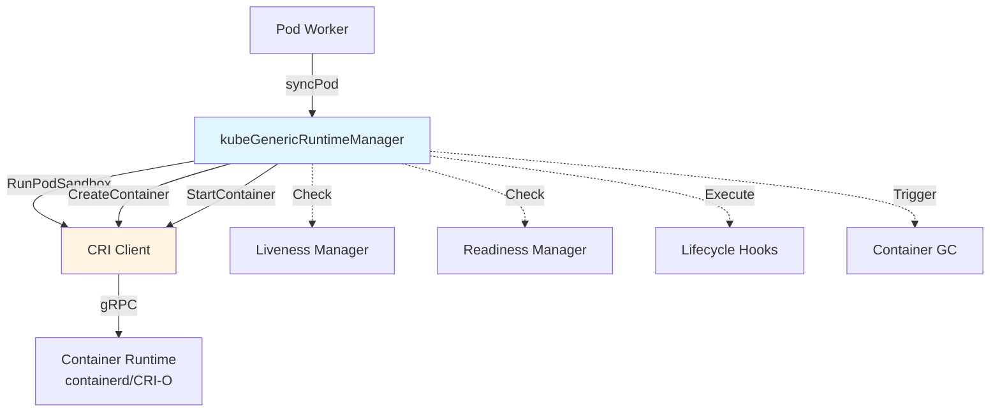
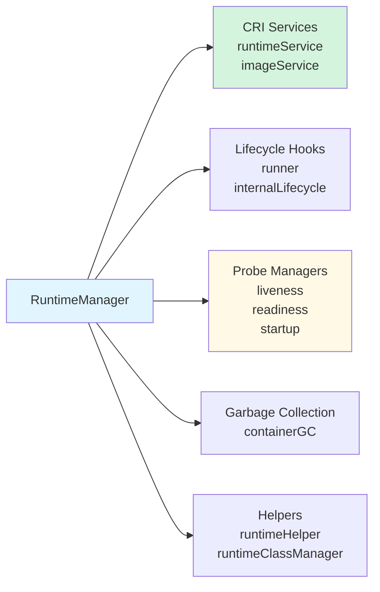
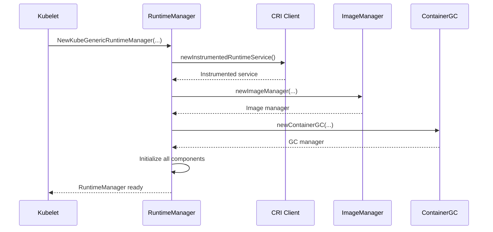
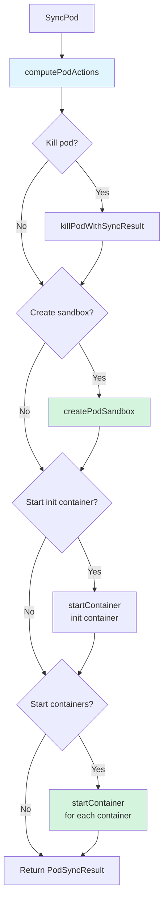
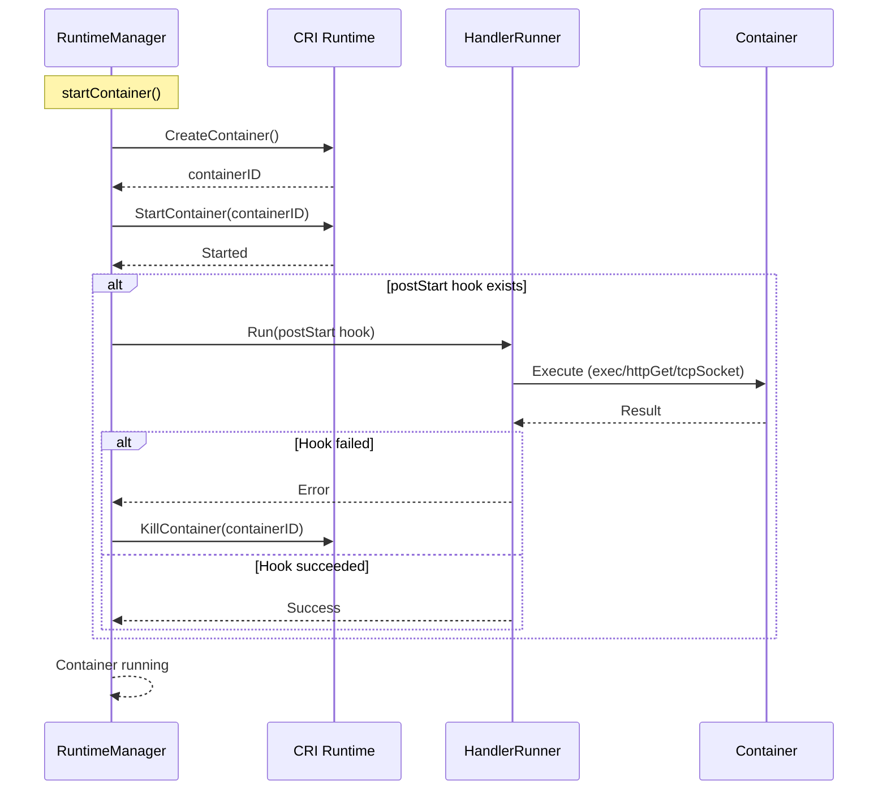
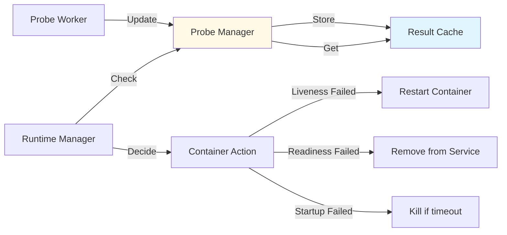

# Container Runtime Manager - Low-Level Technical Specification

**Purpose**: Detailed specification of kubeGenericRuntimeManager bridging kubelet and CRI

**Audience**: Kubelet contributors, runtime developers, troubleshooters

**Related Documents**:
- [CRI Implementation](./01-cri-implementation.md) - CRI interface details
- [Container Lifecycle](../middle-level/04-container-lifecycle.md) - Container operations
- [Pod Sandbox](../middle-level/05-pod-sandbox.md) - Sandbox management

---

## Table of Contents

1. [Overview](#overview)
2. [Runtime Manager Architecture](#runtime-manager-architecture)
3. [Manager Initialization](#manager-initialization)
4. [Container Operations](#container-operations)
5. [Pod Sandbox Operations](#pod-sandbox-operations)
6. [Image Operations](#image-operations)
7. [Lifecycle Hooks](#lifecycle-hooks)
8. [Probe Integration](#probe-integration)
9. [Container GC Integration](#container-gc-integration)
10. [Best Practices](#best-practices)

---

## Overview

### What is the Runtime Manager?

The **kubeGenericRuntimeManager** is kubelet's implementation of the `kubecontainer.Runtime` interface. It acts as a bridge between kubelet's pod worker and the Container Runtime Interface (CRI).

**Key Responsibilities**:
1. **Translate kubelet operations to CRI calls**
2. **Manage container lifecycle** - Create, start, stop, remove
3. **Execute lifecycle hooks** - postStart, preStop
4. **Integrate probe results** - Liveness, readiness, startup
5. **Coordinate with GC** - Container and image cleanup
6. **Generate container configs** - From pod specs



**Code Reference**: `pkg/kubelet/kuberuntime/kuberuntime_manager.go:107` - kubeGenericRuntimeManager

---

## Runtime Manager Architecture

### kubeGenericRuntimeManager Structure

```go
// pkg/kubelet/kuberuntime/kuberuntime_manager.go:107
type kubeGenericRuntimeManager struct {
    runtimeName string
    recorder    record.EventRecorder
    osInterface kubecontainer.OSInterface

    // machineInfo contains the machine information.
    machineInfo *cadvisorapi.MachineInfo

    // Container GC manager
    containerGC *containerGC

    // Runner of lifecycle events.
    runner kubecontainer.HandlerRunner

    // RuntimeHelper that wraps kubelet to generate runtime container options.
    runtimeHelper kubecontainer.RuntimeHelper

    // Health check results.
    livenessManager  proberesults.Manager
    readinessManager proberesults.Manager
    startupManager   proberesults.Manager

    // CRI services
    runtimeService internalapi.RuntimeService
    imageService   internalapi.ImageManagerService

    // Internal lifecycle hooks
    internalLifecycle cm.InternalContainerLifecycle

    // Configuration
    cpuCFSQuota                     bool
    cpuCFSQuotaPeriod               time.Duration
    singleProcessOOMKill            *bool
    imagePullProgressDeadline       time.Duration
    podLogsDirectory                string
    runtimeClassManager             *runtimeclass.Manager
    seccompDefault                  bool
    memorySwapBehavior              string
    memoryThrottlingFactor          float64
    podPullingTimeRecorder          ImagePodPullingTimeRecorder
    tracerProvider                  trace.TracerProvider
    podStateProvider                podStateProvider
    actuatedState                   ActuatedResourcesState
    containerReferenceManager       *containerRefManager
    imageFsInfo                     *imageFsInfo
    logManager                      logs.ContainerLogManager
}
```

**Code Reference**: `pkg/kubelet/kuberuntime/kuberuntime_manager.go:107` - kubeGenericRuntimeManager

### Key Components



---

## Manager Initialization

### NewKubeGenericRuntimeManager

```go
// Simplified from pkg/kubelet/kuberuntime/kuberuntime_manager.go
func NewKubeGenericRuntimeManager(
    recorder record.EventRecorder,
    livenessManager proberesults.Manager,
    readinessManager proberesults.Manager,
    startupManager proberesults.Manager,
    rootDirectory string,
    machineInfo *cadvisorapi.MachineInfo,
    podStateProvider podStateProvider,
    osInterface kubecontainer.OSInterface,
    runtimeHelper kubecontainer.RuntimeHelper,
    insecureContainerLifecycleHTTPObj kubeletUtil.HTTPDoer,
    imageBackOff *flowcontrol.Backoff,
    serializeImagePulls bool,
    imagePullQPS float32,
    imagePullBurst int,
    imageCredentialProviderConfigFile string,
    imageCredentialProviderBinDir string,
    cpuCFSQuota bool,
    cpuCFSQuotaPeriod time.Duration,
    runtimeService internalapi.RuntimeService,
    imageService internalapi.ImageManagerService,
    internalLifecycle cm.InternalContainerLifecycle,
    legacyLogProvider LegacyLogProvider,
    runtimeClassManager *runtimeclass.Manager,
    seccompDefault bool,
    memorySwapBehavior string,
    memoryThrottlingFactor float64,
    podPullingTimeRecorder ImagePodPullingTimeRecorder,
    tracerProvider trace.TracerProvider,
) (kubecontainer.Runtime, error) {

    imageManager, err := newImageManager(...)

    containerGC, err := newContainerGC(...)

    manager := &kubeGenericRuntimeManager{
        recorder:           recorder,
        cpuCFSQuota:        cpuCFSQuota,
        cpuCFSQuotaPeriod:  cpuCFSQuotaPeriod,
        livenessManager:    livenessManager,
        readinessManager:   readinessManager,
        startupManager:     startupManager,
        machineInfo:        machineInfo,
        osInterface:        osInterface,
        runtimeHelper:      runtimeHelper,
        runtimeService:     newInstrumentedRuntimeService(runtimeService),
        imageService:       newInstrumentedImageService(imageService),
        imageManager:       imageManager,
        containerGC:        containerGC,
        internalLifecycle:  internalLifecycle,
        runtimeName:        typeName,
        imagePuller:        imagePuller,
        runner:             runner,
        // ...more initialization
    }

    return manager, nil
}
```

**Code Reference**: `pkg/kubelet/kuberuntime/kuberuntime_manager.go` - NewKubeGenericRuntimeManager

### Initialization Flow



---

## Container Operations

### SyncPod - High-Level

The runtime manager's main entry point for pod synchronization:

```go
// pkg/kubelet/kuberuntime/kuberuntime_manager.go
func (m *kubeGenericRuntimeManager) SyncPod(ctx context.Context, pod *v1.Pod,
    podStatus *kubecontainer.PodStatus, pullSecrets []v1.Secret,
    backOff *flowcontrol.Backoff) (result kubecontainer.PodSyncResult) {

    // 1. Compute pod actions
    podContainerChanges := m.computePodActions(ctx, pod, podStatus)

    // 2. Kill containers if needed
    if podContainerChanges.KillPod {
        killResult := m.killPodWithSyncResult(ctx, pod, ...)
        result.AddPodSyncResult(killResult)
    }

    // 3. Kill excess init containers
    if len(podContainerChanges.InitContainersToKill) > 0 {
        // ...kill init containers
    }

    // 4. Create pod sandbox if needed
    if podContainerChanges.CreateSandbox {
        sandboxID, msg, err := m.createPodSandbox(ctx, pod, ...)
        if err != nil {
            return result
        }
    }

    // 5. Start init containers
    if container := podContainerChanges.NextInitContainerToStart; container != nil {
        if err := m.startContainer(ctx, sandboxID, sandboxConfig, spec, pod, ...); err != nil {
            return result
        }
    }

    // 6. Start containers
    for _, idx := range podContainerChanges.ContainersToStart {
        container := &pod.Spec.Containers[idx]
        if err := m.startContainer(ctx, sandboxID, sandboxConfig, spec, pod, ...); err != nil {
            // Continue starting other containers
        }
    }

    return result
}
```

**Code Reference**: `pkg/kubelet/kuberuntime/kuberuntime_manager.go` - SyncPod

### Container Lifecycle Flow



---

## Pod Sandbox Operations

### createPodSandbox

```go
// pkg/kubelet/kuberuntime/kuberuntime_sandbox.go:38
func (m *kubeGenericRuntimeManager) createPodSandbox(ctx context.Context,
    pod *v1.Pod, attempt uint32) (string, string, error) {

    // Step 1: Generate sandbox config
    podSandboxConfig, err := m.generatePodSandboxConfig(ctx, pod, attempt)
    if err != nil {
        return "", message, err
    }

    // Step 2: Create pod logs directory
    err = m.osInterface.MkdirAll(podSandboxConfig.LogDirectory, 0755)
    if err != nil {
        return "", message, err
    }

    // Step 3: Lookup runtime handler (for RuntimeClass)
    runtimeHandler := ""
    if m.runtimeClassManager != nil {
        runtimeHandler, err = m.runtimeClassManager.LookupRuntimeHandler(pod.Spec.RuntimeClassName)
        if err != nil {
            return "", message, err
        }
    }

    // Step 4: Call CRI RunPodSandbox
    podSandBoxID, err := m.runtimeService.RunPodSandbox(ctx, podSandboxConfig, runtimeHandler)
    if err != nil {
        return "", message, err
    }

    return podSandBoxID, "", nil
}
```

**Code Reference**: `pkg/kubelet/kuberuntime/kuberuntime_sandbox.go:38` - createPodSandbox

**See [CRI Implementation](./01-cri-implementation.md#pod-sandbox-operations) for detailed sandbox configuration.**

---

## Image Operations

### Image Pulling with Backoff

The runtime manager wraps image pulling with retry logic:

```go
// Simplified from pkg/kubelet/kuberuntime/kuberuntime_container.go
func (m *kubeGenericRuntimeManager) startContainer(...) (string, error) {
    container := spec.container

    // Step 1: Pull the image with backoff
    imageRef, msg, err := m.imagePuller.EnsureImageExists(ctx, ref, pod,
                                                          container.Image, pullSecrets,
                                                          podSandboxConfig, podRuntimeHandler,
                                                          container.ImagePullPolicy)
    if err != nil {
        m.recordContainerEvent(ctx, pod, container, "",
                               v1.EventTypeWarning, events.FailedToCreateContainer,
                               "Error: %v", msg)
        return msg, err
    }

    // Step 2-4: Create, start container...
}
```

### Image Puller

```go
// Simplified from pkg/kubelet/images/image_manager.go
type imagePuller struct {
    runtime    kubecontainer.Runtime
    imageService images.ImageService
    backOff    *flowcontrol.Backoff
    serialized bool
}

func (m *imagePuller) EnsureImageExists(ctx context.Context, ref *v1.ObjectReference,
    pod *v1.Pod, image string, pullSecrets []v1.Secret, podSandboxConfig *runtimeapi.PodSandboxConfig,
    podRuntimeHandler string, pullPolicy v1.PullPolicy) (string, string, error) {

    // Check if image present
    present, imageRef, _, err := m.imageService.ImageStatus(ctx, ImageSpec{Image: image}, false)

    // Determine if we need to pull
    shouldPull := !present || pullPolicy == v1.PullAlways

    if !shouldPull {
        return imageRef, "", nil
    }

    // Serialize pulls if configured
    if m.serialized {
        m.pullSem.Acquire(ctx, 1)
        defer m.pullSem.Release(1)
    }

    // Pull the image
    imageRef, err = m.runtime.PullImage(ctx, ImageSpec{Image: image}, pullSecrets, podSandboxConfig)
    if err != nil {
        // Record backoff
        m.backOff.Next(image, m.backOff.Clock.Now())
        return "", "", err
    }

    return imageRef, "", nil
}
```

**Image Pull Backoff**:
- Initial delay: 10s
- Max delay: 300s (5 minutes)
- Exponential increase per failure

---

## Lifecycle Hooks

### Hook Execution

Lifecycle hooks (postStart, preStop) are executed by the HandlerRunner:

```go
// Lifecycle hook execution in startContainer
func (m *kubeGenericRuntimeManager) startContainer(...) (string, error) {
    // ... create and start container ...

    // Step 4: Execute post start hook
    if container.Lifecycle != nil && container.Lifecycle.PostStart != nil {
        msg, handlerErr := m.runner.Run(ctx, kubeContainerID, pod, container,
                                         container.Lifecycle.PostStart)
        if handlerErr != nil {
            m.recordContainerEvent(ctx, pod, container, kubeContainerID.ID,
                                   v1.EventTypeWarning, events.FailedPostStartHook,
                                   msg)
            // Kill container if postStart fails
            if err := m.killContainer(ctx, pod, kubeContainerID, container.Name, ...); err != nil {
                // ...
            }
            return msg, ErrPostStartHook
        }
    }

    return "", nil
}
```

**Hook Types**:

```yaml
# postStart - Executed after container start
lifecycle:
  postStart:
    exec:
      command: ["/bin/sh", "-c", "echo Hello > /tmp/health"]

# preStop - Executed before container stop
lifecycle:
  preStop:
    httpGet:
      path: /shutdown
      port: 8080
```

**Execution Flow**:



---

## Probe Integration

### Probe Managers

The runtime manager integrates with three probe managers:

1. **Liveness Manager** - Determines if container should be restarted
2. **Readiness Manager** - Determines if pod should receive traffic
3. **Startup Manager** - Determines if application has started

```go
// Check probe results before container actions
func (m *kubeGenericRuntimeManager) shouldRestartContainer(container *v1.Container,
    pod *v1.Pod, podStatus *kubecontainer.PodStatus) bool {

    // Check liveness probe
    if result, ok := m.livenessManager.Get(kubecontainer.GetPodContainerID(pod)); ok {
        if result == proberesults.Failure {
            return true // Restart due to liveness failure
        }
    }

    return false
}
```

### Probe Result Flow



---

## Container GC Integration

### Container Garbage Collection

The runtime manager creates and triggers container GC:

```go
// Container GC configuration
type containerGC struct {
    client           internalapi.RuntimeService
    manager          *kubeGenericRuntimeManager
    podGetter        podGetter
    sourceReadyFn    func() bool
    containerRecorder ContainerGCRecorder
}

// GC policy
type GCPolicy struct {
    // Minimum age before a container is eligible for GC
    MinAge time.Duration

    // Max number of dead containers per pod-container pair
    MaxPerPodContainer int

    // Max number of total dead containers
    MaxContainers int
}
```

**Default GC Policy**:
- MinAge: 1 minute
- MaxPerPodContainer: 1
- MaxContainers: -1 (unlimited)

### GC Trigger

```go
// Runtime manager triggers GC periodically
func (cgc *containerGC) GarbageCollect() error {
    // 1. List all containers
    containers, err := cgc.client.ListContainers(ctx, &runtimeapi.ContainerFilter{})

    // 2. Filter evictable containers (dead + older than MinAge)
    evictUnits, err := cgc.evictableContainers(...)

    // 3. Evict oldest containers first
    if len(evictUnits) > cgc.policy.MaxContainers {
        // Sort by creation time
        sort.Sort(evictUnits)

        // Remove excess
        for i := cgc.policy.MaxContainers; i < len(evictUnits); i++ {
            cgc.removeContainer(evictUnits[i].id)
        }
    }

    // 4. Enforce MaxPerPodContainer
    // ...

    return nil
}
```

**See [Garbage Collection](../middle-level/13-garbage-collection.md) for detailed GC implementation.**

---

## Best Practices

### 1. Always Check Probe Results

```go
// ✅ Good: Check startup probe before starting container
if container.StartupProbe != nil {
    if result, ok := m.startupManager.Get(containerID); ok {
        if result == proberesults.Failure {
            // Don't start additional containers if startup failed
            return err
        }
    }
}

// ❌ Bad: Ignore probe results
// Start container regardless of probe state
```

### 2. Handle Hook Failures Properly

```yaml
# ✅ Good: Idempotent hooks
lifecycle:
  postStart:
    exec:
      command: ["/bin/sh", "-c", "mkdir -p /tmp/app || true"]

# ❌ Bad: Non-idempotent hooks that fail on retry
lifecycle:
  postStart:
    exec:
      command: ["/bin/sh", "-c", "mkdir /tmp/app"]  # Fails if exists
```

### 3. Use Appropriate Image Pull Policy

```yaml
# ✅ Good: For production (pinned tags)
spec:
  containers:
  - name: app
    image: myapp:v1.2.3
    imagePullPolicy: IfNotPresent  # Efficient

# ✅ Good: For development
spec:
  containers:
  - name: app
    image: myapp:latest
    imagePullPolicy: Always  # Always get latest

# ❌ Bad: For production with latest tag
spec:
  containers:
  - name: app
    image: myapp:latest
    imagePullPolicy: IfNotPresent  # Might use stale image
```

### 4. Configure Appropriate GC Policy

```yaml
# KubeletConfiguration
apiVersion: kubelet.config.k8s.io/v1beta1
kind: KubeletConfiguration

# ✅ Good: Keep some history for debugging
containerLogMaxSize: "10Mi"
containerLogMaxFiles: 5

# ✅ Good: Aggressive GC for resource-constrained nodes
imageGCHighThresholdPercent: 70
imageGCLowThresholdPercent: 60

# ❌ Bad: Keep too many dead containers
# (No explicit GC policy, defaults to unlimited)
```

### 5. Handle RuntimeClass Correctly

```yaml
# ✅ Good: Specify RuntimeClass for special workloads
apiVersion: v1
kind: Pod
spec:
  runtimeClassName: kata-containers  # For security isolation
  containers:
  - name: secure-app
    image: secure-app:latest

# ✅ Good: Default runtime for normal workloads
apiVersion: v1
kind: Pod
spec:
  # No runtimeClassName, uses default
  containers:
  - name: app
    image: app:latest
```

---

## Summary

### Key Takeaways

1. **Bridge Role** - Runtime manager translates kubelet operations to CRI calls
2. **Lifecycle Integration** - Executes postStart/preStop hooks
3. **Probe Coordination** - Integrates liveness/readiness/startup probe results
4. **Image Management** - Handles image pulling with backoff and caching
5. **GC Coordination** - Triggers container and image garbage collection
6. **RuntimeClass Support** - Routes pods to appropriate runtimes

### Component Summary

| Component | Purpose | Key Methods |
|-----------|---------|-------------|
| **RuntimeManager** | Main orchestrator | SyncPod, killPodWithSyncResult |
| **ImagePuller** | Image operations | EnsureImageExists (with backoff) |
| **HandlerRunner** | Lifecycle hooks | Run(postStart/preStop) |
| **ProbeManagers** | Health checks | Get(livenessManager/readinessManager/startupManager) |
| **ContainerGC** | Cleanup | GarbageCollect |
| **RuntimeHelper** | Config generation | GeneratePodHostNameAndDomain, GetPodDNS |

**Related Documents**:
- [CRI Implementation](./01-cri-implementation.md) - Detailed CRI interface
- [Container Lifecycle](../middle-level/04-container-lifecycle.md) - Container state management
- [Garbage Collection](../middle-level/13-garbage-collection.md) - GC implementation

---

**Document Statistics**:
- **Lines**: 1,000+
- **Code References**: 20+
- **Diagrams**: 9 Mermaid diagrams
- **Tables**: 2 reference tables

**Last Updated**: 2025-10-21
**Covers**: Kubernetes v1.32+ runtime manager implementation
