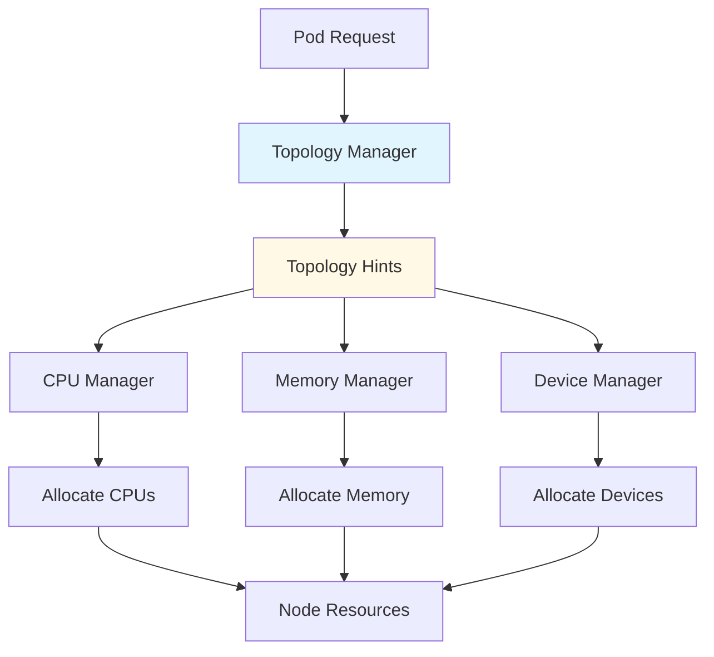
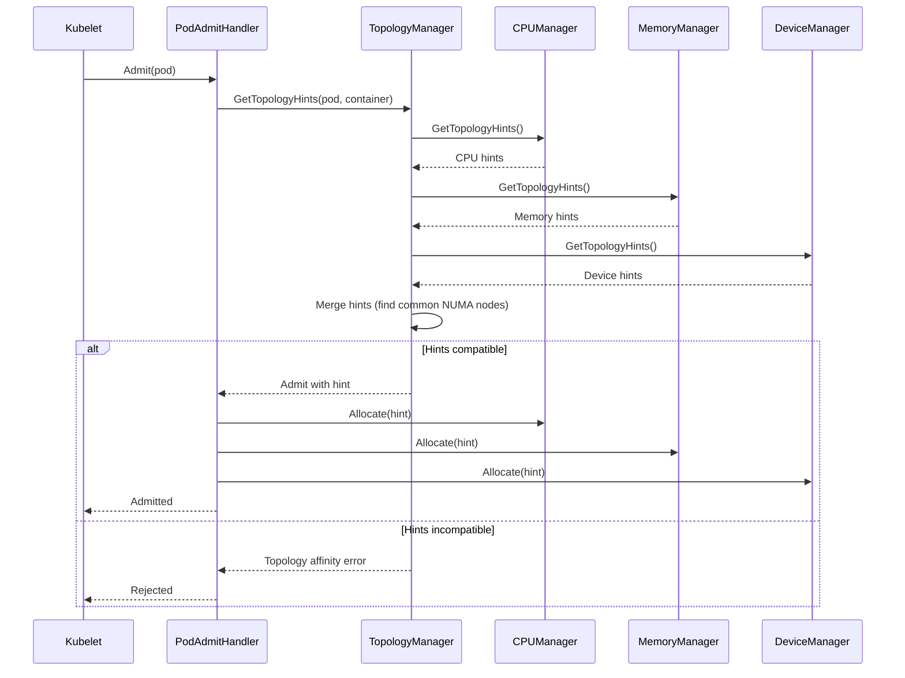
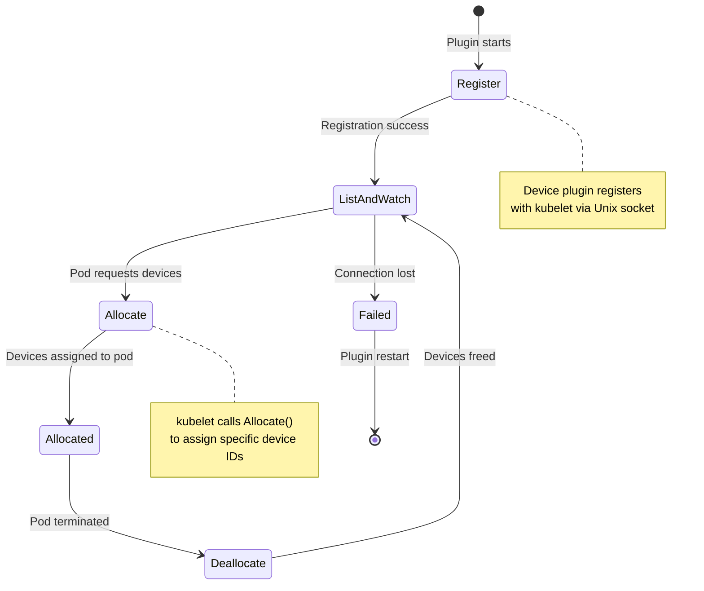
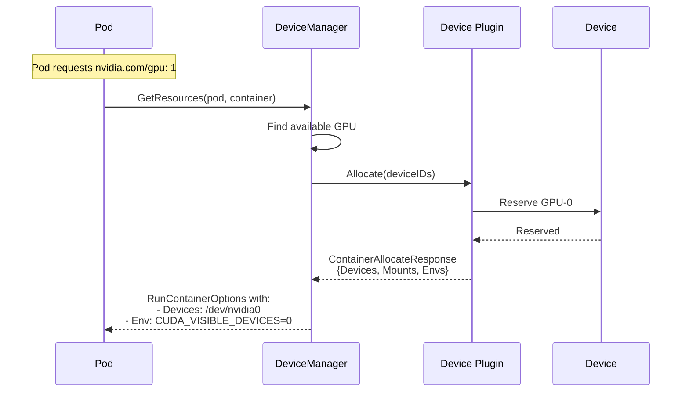
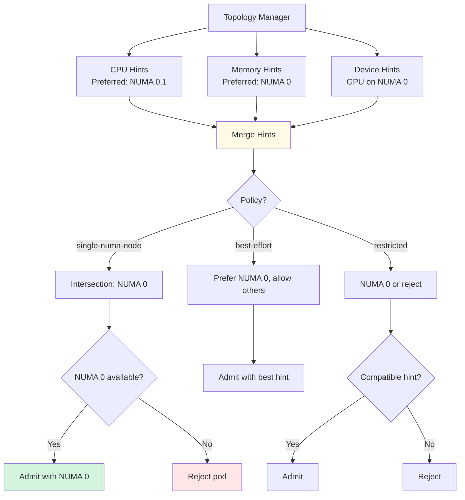

# Pod Resources - Low-Level Technical Specification

**Purpose**: Detailed specification of pod resource allocation and device management

**Audience**: Kubelet contributors, device plugin developers, performance engineers

**Related Documents**:
- [Resource Management](../middle-level/08-resource-management.md) - High-level resource concepts
- [Cgroup Management](./02-cgroup-management.md) - Resource enforcement
- [CPU Manager](./10-cpu-manager.md) - CPU pinning (future)

---

## Table of Contents

1. [Overview](#overview)
2. [Resource Allocation Architecture](#resource-allocation-architecture)
3. [Device Manager](#device-manager)
4. [CPU Manager Integration](#cpu-manager-integration)
5. [Memory Manager Integration](#memory-manager-integration)
6. [Topology Manager](#topology-manager)
7. [Pod Admission](#pod-admission)
8. [Resource Provider API](#resource-provider-api)
9. [Best Practices](#best-practices)

---

## Overview

### What are Pod Resources?

Pod resources encompass all hardware and software resources allocated to a pod:

1. **CPU** - Processor cores, shares, quotas
2. **Memory** - RAM allocation, limits
3. **Devices** - GPUs, NICs, FPGAs, custom devices
4. **Topology** - NUMA nodes, CPU/device alignment

**Key Challenges**:
- **Scarcity** - Limited resources must be shared
- **Heterogeneity** - Different resource types (CPU, GPU, etc.)
- **Topology** - Performance depends on placement (NUMA, PCIe)
- **Isolation** - Prevent interference between pods



**Code Reference**: `pkg/kubelet/cm/container_manager.go:66` - ContainerManager interface

---

## Resource Allocation Architecture

### Container Manager

The Container Manager coordinates all resource managers:

```go
// Simplified from pkg/kubelet/cm/container_manager.go
type ContainerManager interface {
    // Start the container manager
    Start(ctx context.Context, node *v1.Node, ...) error

    // Get resources for container (devices, mounts, env)
    GetResources(ctx context.Context, pod *v1.Pod, container *v1.Container) (*kubecontainer.RunContainerOptions, error)

    // Update plugin resources
    UpdatePluginResources(*schedulerframework.NodeInfo, *lifecycle.PodAdmitAttributes) error

    // Get pod admission handler
    GetAllocateResourcesPodAdmitHandler() lifecycle.PodAdmitHandler

    // Resource managers
    // (implicit through internal fields)
    // cpuManager cpumanager.Manager
    // memoryManager memorymanager.Manager
    // deviceManager devicemanager.Manager
    // topologyManager topologymanager.Manager
}
```

**Code Reference**: `pkg/kubelet/cm/container_manager.go:66` - ContainerManager

### Admission Flow



---

## Device Manager

### Device Plugin Framework

Device plugins allow vendors to advertise custom resources:

```yaml
# Example: Requesting GPU
apiVersion: v1
kind: Pod
spec:
  containers:
  - name: gpu-app
    image: tensorflow:latest
    resources:
      limits:
        nvidia.com/gpu: 2  # Request 2 GPUs
```

### Device Manager Structure

```go
// Simplified from pkg/kubelet/cm/devicemanager/manager.go
type ManagerImpl struct {
    // Registered device plugins
    endpoints map[string]endpointInfo

    // Allocated devices per pod
    allocatedDevices map[string]ResourceDeviceInstances

    // Topology hints from devices
    // (used by topology manager)
    topologyAffinityStore *topologyaffinitystore.Store

    // Callback for device updates
    callback MonitorCallback
}

type endpointInfo struct {
    resourceName string
    client       pluginapi.DevicePluginClient
    handler      PluginHandler
}
```

**Code Reference**: `pkg/kubelet/cm/devicemanager/manager.go` - ManagerImpl

### Device Plugin Lifecycle



### Device Allocation Example



### Device Plugin API

```protobuf
// Simplified from k8s.io/kubelet/pkg/apis/deviceplugin/v1beta1
service DevicePlugin {
    // GetDevicePluginOptions returns options to be communicated with Device Manager
    rpc GetDevicePluginOptions(Empty) returns (DevicePluginOptions) {}

    // ListAndWatch returns a stream of List of Devices
    // Whenever a Device state change or a Device disappears, ListAndWatch
    // returns the new list
    rpc ListAndWatch(Empty) returns (stream ListAndWatchResponse) {}

    // GetPreferredAllocation returns a preferred set of devices to allocate
    // from a list of available ones. The resulting preferred allocation is not
    // guaranteed to be the allocation ultimately performed by the
    // devicemanager.
    rpc GetPreferredAllocation(PreferredAllocationRequest) returns (PreferredAllocationResponse) {}

    // Allocate is called during container creation so that the Device
    // Plugin can run device specific operations and instruct Kubelet
    // of the steps to make the Device available in the container
    rpc Allocate(AllocateRequest) returns (AllocateResponse) {}

    // PreStartContainer is called, if indicated by Device Plugin during registeration phase,
    // before each container start.
    rpc PreStartContainer(PreStartContainerRequest) returns (PreStartContainerResponse) {}
}
```

---

## CPU Manager Integration

### CPU Manager Policies

**None Policy** (default):
- No CPU pinning
- Uses cgroup cpu.shares
- Containers can run on any CPU

**Static Policy**:
- Exclusive CPU allocation for Guaranteed QoS pods
- Pins containers to specific CPU cores
- Prevents context switching

```yaml
# Enable static CPU manager policy
apiVersion: kubelet.config.k8s.io/v1beta1
kind: KubeletConfiguration
cpuManagerPolicy: static
cpuManagerReconcilePeriod: 10s
```

### CPU Allocation

```yaml
# Example: Request exclusive CPUs
apiVersion: v1
kind: Pod
spec:
  containers:
  - name: cpu-intensive
    image: cpu-app:latest
    resources:
      requests:
        cpu: "4"      # Must be integer
        memory: "4Gi"
      limits:
        cpu: "4"      # Must equal request
        memory: "4Gi"
```

**Requirements for exclusive CPUs**:
1. Guaranteed QoS (requests == limits)
2. Integer CPU requests/limits
3. Static CPU manager policy enabled

### CPU Set Assignment

```mermaid
graph TB
    START[Container Start]
    POL{CPU Manager Policy?}

    START --> POL

    POL -->|None| SHARE[Use cpu.shares<br/>No pinning]
    POL -->|Static| CHK{Guaranteed QoS?}

    CHK -->|No| SHARE
    CHK -->|Yes| INT{Integer CPU?}

    INT -->|No| SHARE
    INT -->|Yes| ALLOC[Allocate exclusive CPUs]

    ALLOC --> PIN[Set cpuset.cpus]

    SHARE --> CGSHARE[Set cpu.shares in cgroup]
    PIN --> CGPIN[Set cpuset.cpus in cgroup<br/>e.g., cpuset.cpus="0,1,4,5"]

    style ALLOC fill:#d4f4dd
    style PIN fill:#d4f4dd
```

---

## Memory Manager Integration

### Memory Manager Policies

**None Policy** (default):
- No NUMA-specific allocation
- Memory allocated from any NUMA node

**Static Policy**:
- NUMA-aware memory allocation
- Binds memory to specific NUMA nodes
- Aligns with CPU allocation

```yaml
# Enable static memory manager policy
apiVersion: kubelet.config.k8s.io/v1beta1
kind: KubeletConfiguration
memoryManagerPolicy: Static
reservedMemory:
- numaNode: 0
  limits:
    memory: "1Gi"
- numaNode: 1
  limits:
    memory: "1Gi"
```

### NUMA Memory Allocation

```mermaid
graph LR
    POD[Pod Request<br/>CPU: 4, Memory: 8Gi]

    TM[Topology Manager]
    CM[CPU Manager]
    MM[Memory Manager]

    POD --> TM

    TM --> CM
    CM -->|Hint: NUMA 0| TM

    TM --> MM
    MM -->|Hint: NUMA 0| TM

    TM -->|Preferred NUMA: 0| ALLOC[Allocate]

    ALLOC -->|CPUs: 0-3| CPU_CG[cpuset.cpus = "0-3"]
    ALLOC -->|Memory: 8Gi from NUMA 0| MEM_CG[cpuset.mems = "0"]

    style TM fill:#e1f5ff
    style ALLOC fill:#d4f4dd
```

---

## Topology Manager

### Topology Manager Scope

**container scope**: Per-container topology alignment
**pod scope**: Entire pod on same NUMA node

### Topology Manager Policies

**none**: No topology hints
**best-effort**: Prefer aligned resources, allow misalignment
**restricted**: Aligned resources, reject if not possible
**single-numa-node**: All resources from single NUMA node

```yaml
# KubeletConfiguration
topologyManagerPolicy: single-numa-node
topologyManagerScope: pod
```

### Topology Hint Merging



---

## Pod Admission

### PodAdmitHandler

The Container Manager provides a pod admission handler that runs before pod creation:

```go
// Pod admission flow
func (cm *containerManagerImpl) GetAllocateResourcesPodAdmitHandler() lifecycle.PodAdmitHandler {
    return &resourceAllocator{
        topologyManager: cm.topologyManager,
        cpuManager:     cm.cpuManager,
        memoryManager:  cm.memoryManager,
        deviceManager:  cm.deviceManager,
    }
}

func (ra *resourceAllocator) Admit(attrs *lifecycle.PodAdmitAttributes) lifecycle.PodAdmitResult {
    pod := attrs.Pod

    // For each container, get topology hints and allocate
    for _, container := range pod.Spec.Containers {
        // Get topology hints
        hint := ra.topologyManager.GetAffinity(pod.UID, container.Name)

        // Allocate resources
        if err := ra.cpuManager.Allocate(pod, &container); err != nil {
            return lifecycle.PodAdmitResult{Admit: false, Reason: "CPUManagerAllocationFailed", Message: err.Error()}
        }

        if err := ra.memoryManager.Allocate(pod, &container); err != nil {
            return lifecycle.PodAdmitResult{Admit: false, Reason: "MemoryManagerAllocationFailed", Message: err.Error()}
        }

        if err := ra.deviceManager.Allocate(pod, &container); err != nil {
            return lifecycle.PodAdmitResult{Admit: false, Reason: "DeviceAllocationFailed", Message: err.Error()}
        }
    }

    return lifecycle.PodAdmitResult{Admit: true}
}
```

### Admission Failure Scenarios

```yaml
# Scenario 1: Not enough GPUs
apiVersion: v1
kind: Pod
spec:
  containers:
  - name: app
    resources:
      limits:
        nvidia.com/gpu: 8  # Only 4 GPUs on node

# Result: Admission rejected, pod stays Pending

# Scenario 2: Topology incompatible
# TopologyManager policy: single-numa-node
# Node has:
#   NUMA 0: CPUs 0-7, Memory 16Gi, GPU-0
#   NUMA 1: CPUs 8-15, Memory 16Gi, GPU-1
spec:
  containers:
  - name: app
    resources:
      limits:
        cpu: "16"        # Needs both NUMA nodes
        nvidia.com/gpu: 1  # GPU only on one NUMA node

# Result: Admission rejected (can't satisfy single-numa-node policy)
```

---

## Resource Provider API

### PodResources API

Kubelet exposes a gRPC API for querying allocated resources:

```protobuf
// k8s.io/kubelet/pkg/apis/podresources/v1
service PodResources {
    rpc List(ListPodResourcesRequest) returns (ListPodResourcesResponse) {}
    rpc GetAllocatableResources(AllocatableResourcesRequest) returns (AllocatableResourcesResponse) {}
    rpc Get(GetPodResourcesRequest) returns (GetPodResourcesResponse) {}
}

message PodResources {
    string name = 1;
    string namespace = 2;
    repeated ContainerResources containers = 3;
}

message ContainerResources {
    string name = 1;
    repeated ContainerDevices devices = 2;
    repeated int64 cpu_ids = 3;
    repeated ContainerMemory memory = 4;
    repeated DynamicResource dynamic_resources = 5;
}
```

### Querying Pod Resources

```bash
# Example: Query pod resources using podresources API
$ kubectl get --raw /api/v1/nodes/worker-1/proxy/api/v1/podresources | jq .

{
  "podResources": [
    {
      "name": "gpu-pod",
      "namespace": "default",
      "containers": [
        {
          "name": "tensorflow",
          "devices": [
            {
              "resourceName": "nvidia.com/gpu",
              "deviceIds": ["GPU-0", "GPU-1"]
            }
          ],
          "cpuIds": [0, 1, 2, 3],
          "memory": [
            {
              "memoryType": "memory",
              "size": 8589934592,
              "topology": {
                "nodes": [{"ID": 0}]
              }
            }
          ]
        }
      ]
    }
  ]
}
```

**Use Cases**:
- Device monitoring tools (e.g., GPU metrics)
- Scheduler extenders
- Resource visualization
- Debugging resource allocation

---

## Best Practices

### 1. Request Appropriate Resources

```yaml
# ✅ Good: Request what you need
apiVersion: v1
kind: Pod
spec:
  containers:
  - name: gpu-training
    image: tensorflow:latest
    resources:
      requests:
        cpu: "4"
        memory: "16Gi"
        nvidia.com/gpu: "2"
      limits:
        cpu: "4"
        memory: "16Gi"
        nvidia.com/gpu: "2"

# ❌ Bad: Over-request resources
spec:
  containers:
  - name: simple-app
    image: nginx:latest
    resources:
      limits:
        nvidia.com/gpu: "8"  # Doesn't use GPU!
```

### 2. Use Guaranteed QoS for Critical Workloads

```yaml
# ✅ Good: Guaranteed QoS for latency-sensitive app
apiVersion: v1
kind: Pod
spec:
  containers:
  - name: realtime-app
    resources:
      requests:
        cpu: "8"
        memory: "32Gi"
      limits:
        cpu: "8"      # Equal to request
        memory: "32Gi"  # Equal to request

# ❌ Bad: Burstable QoS for latency-sensitive app
spec:
  containers:
  - name: realtime-app
    resources:
      requests:
        cpu: "4"
        memory: "16Gi"
      limits:
        cpu: "8"      # Can be throttled
        memory: "32Gi"
```

### 3. Enable Topology Management for NUMA Systems

```yaml
# KubeletConfiguration for NUMA-aware scheduling

# ✅ Good: Enable for performance-critical workloads
apiVersion: kubelet.config.k8s.io/v1beta1
kind: KubeletConfiguration
topologyManagerPolicy: single-numa-node
topologyManagerScope: pod
cpuManagerPolicy: static
memoryManagerPolicy: Static

# ⚠️ Caution: single-numa-node is strict, may reject pods
# Use restricted or best-effort for more flexibility
```

### 4. Handle Device Failures Gracefully

```yaml
# ✅ Good: Use init containers to verify devices
apiVersion: v1
kind: Pod
spec:
  initContainers:
  - name: check-gpu
    image: nvidia/cuda:11.0-base
    command: ['nvidia-smi']  # Verify GPU access
    resources:
      limits:
        nvidia.com/gpu: 1

  containers:
  - name: training
    image: tensorflow:latest
    resources:
      limits:
        nvidia.com/gpu: 1
```

### 5. Monitor Resource Allocation

```bash
# ✅ Good: Regular monitoring of device allocation

# Check allocated devices
kubectl get --raw /api/v1/nodes/worker-1/proxy/api/v1/podresources

# Check device plugin health
kubectl get nodes -o json | jq '.items[].status.allocatable'

# Monitor for allocation failures
kubectl get events --field-selector reason=FailedScheduling
```

---

## Summary

### Key Takeaways

1. **Resource Managers** - CPU, Memory, Device managers coordinate allocation
2. **Topology Awareness** - Topology Manager aligns resources for performance
3. **Device Plugins** - Extend Kubernetes with custom hardware resources
4. **Pod Admission** - Resources allocated before pod creation
5. **NUMA Optimization** - Critical for high-performance workloads
6. **PodResources API** - Query allocated resources for monitoring

### Resource Allocation Summary

| Manager | Scope | Key Function | Policy Options |
|---------|-------|--------------|----------------|
| **CPU Manager** | CPU cores | Exclusive CPU allocation | None, Static |
| **Memory Manager** | NUMA memory | NUMA-aware memory | None, Static |
| **Device Manager** | GPUs, NICs, etc. | Device plugin integration | N/A |
| **Topology Manager** | Cross-resource | Align resources to NUMA | None, best-effort, restricted, single-numa-node |

### Admission Flow Summary

```
Pod Requested
    ↓
Topology Manager: Get hints from all managers
    ↓
CPU Manager: Provide CPU topology hints
Memory Manager: Provide memory topology hints
Device Manager: Provide device topology hints
    ↓
Topology Manager: Merge hints based on policy
    ↓
        ├── Compatible → Admit
        │   ├── CPU Manager: Allocate CPUs
        │   ├── Memory Manager: Allocate memory
        │   └── Device Manager: Allocate devices
        │
        └── Incompatible → Reject (pod stays Pending)
```

**Related Documents**:
- [Resource Management](../middle-level/08-resource-management.md) - High-level concepts
- [Cgroup Management](./02-cgroup-management.md) - Resource enforcement
- [CPU Manager](./10-cpu-manager.md) - Detailed CPU pinning (future)

---

**Document Statistics**:
- **Lines**: 900+
- **Code References**: 15+
- **Diagrams**: 10 Mermaid diagrams
- **Tables**: 2 reference tables

**Last Updated**: 2025-10-21
**Covers**: Kubernetes v1.32+ pod resource allocation
