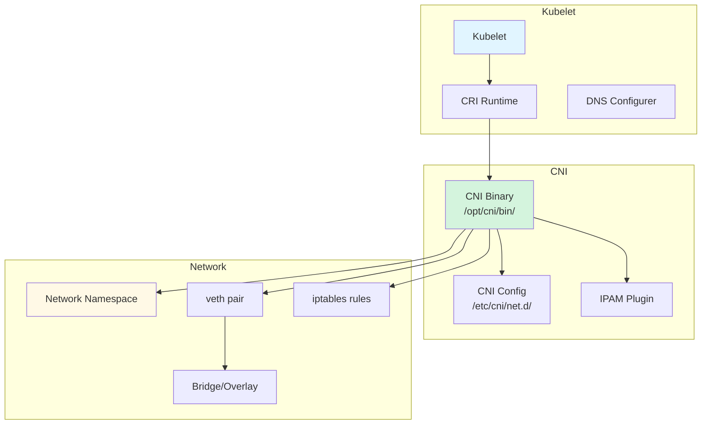
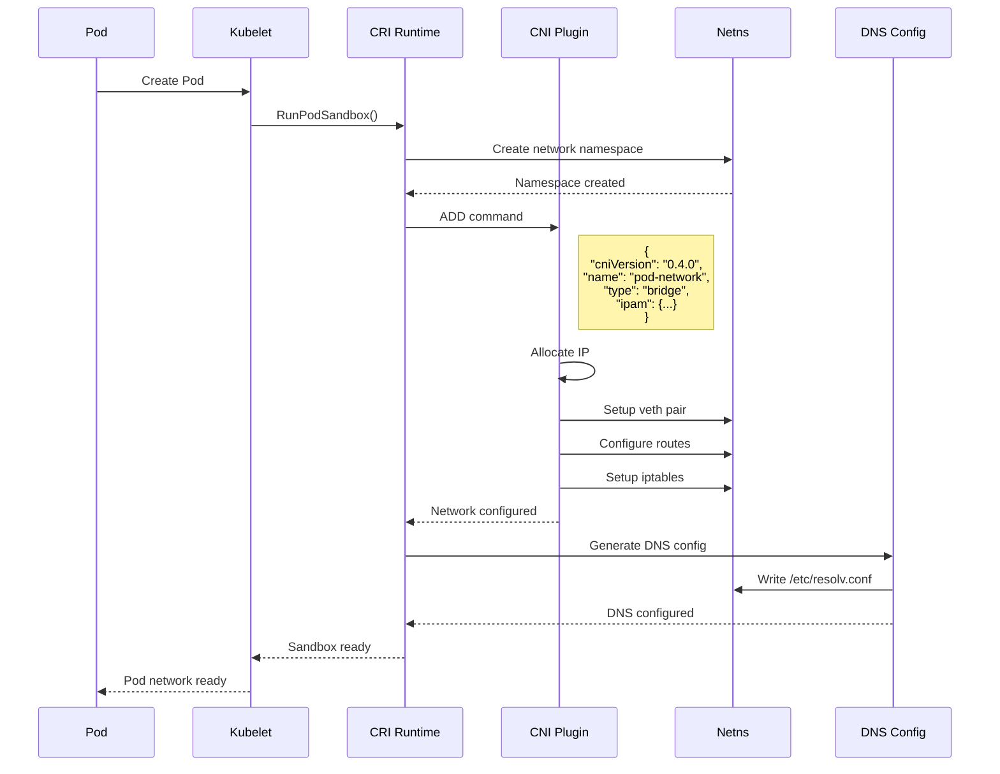
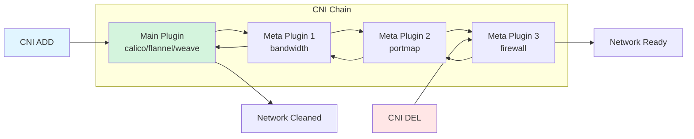
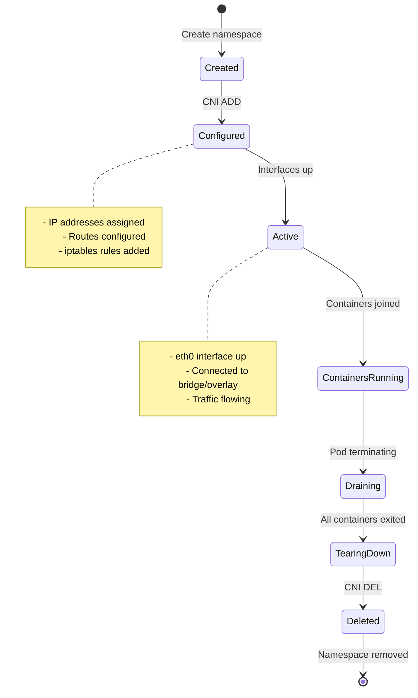
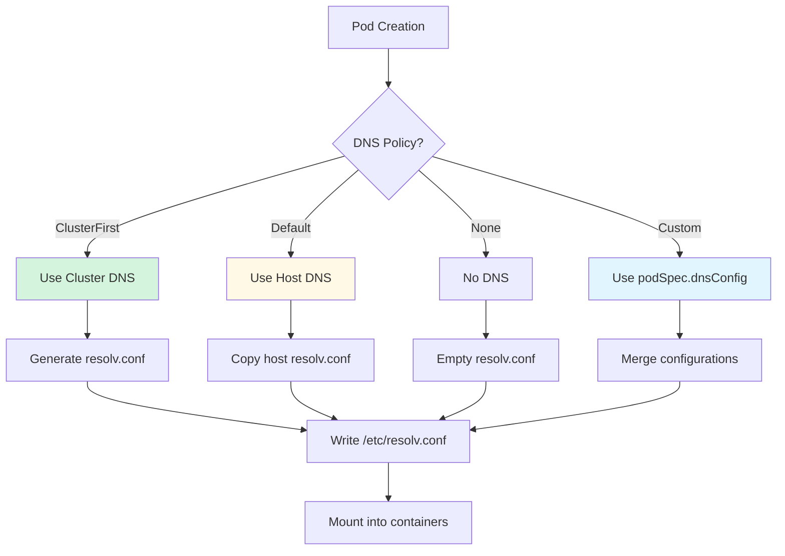
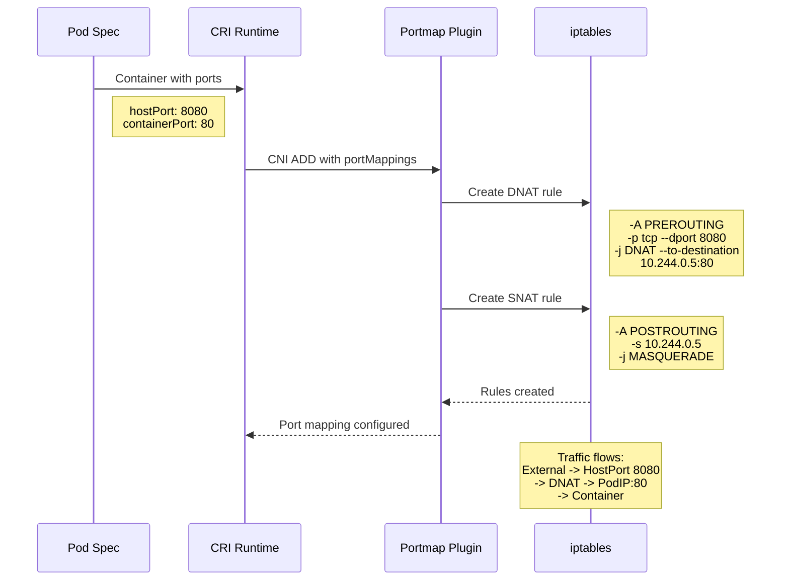
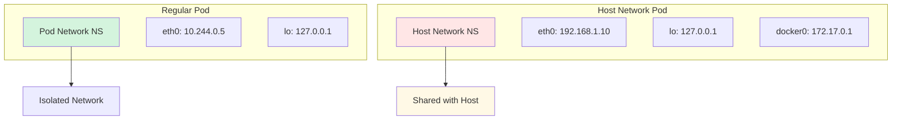
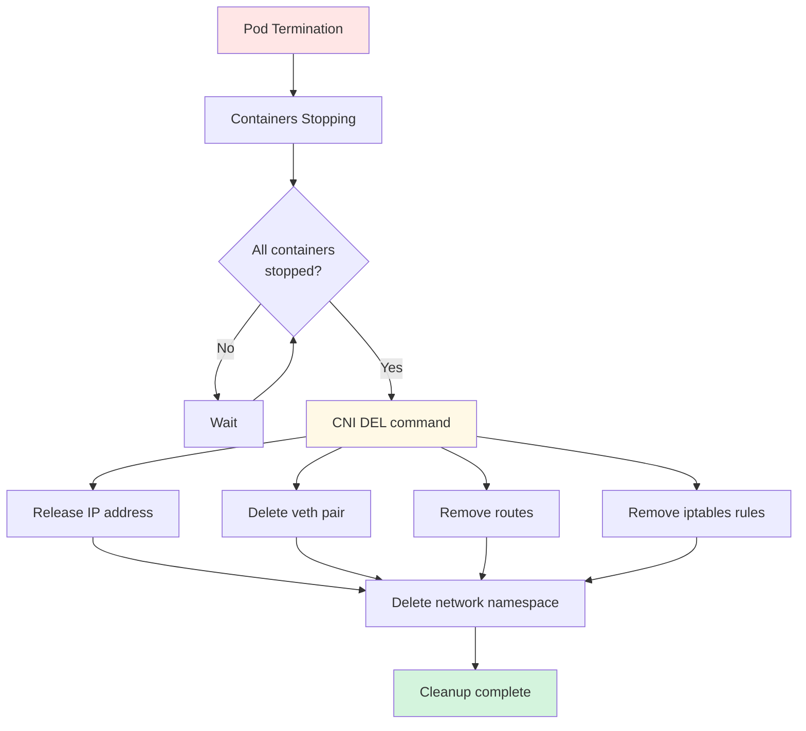
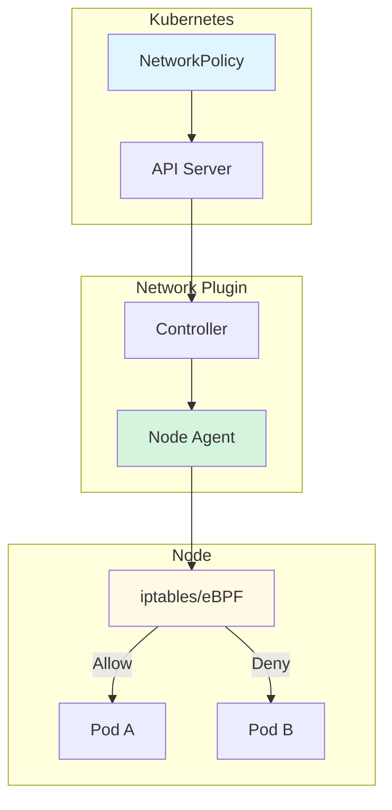

# Network Setup - Low-Level Technical Specification

**Purpose**: Detailed technical specification of pod network setup, CNI integration, and DNS configuration in kubelet

**Audience**: Network plugin developers, kubelet contributors, cluster administrators

**Related Documents**:
- [Pod Sandbox](../middle-level/05-pod-sandbox.md) - Sandbox network namespace
- [Container Lifecycle](../middle-level/04-container-lifecycle.md) - Container network setup
- [CRI Implementation](./01-cri-implementation.md) - CRI network operations

---

## Table of Contents

1. [Network Architecture](#network-architecture)
2. [CNI Integration](#cni-integration)
3. [Network Namespace Setup](#network-namespace-setup)
4. [DNS Configuration](#dns-configuration)
5. [Port Mapping](#port-mapping)
6. [Host Network Mode](#host-network-mode)
7. [Network Teardown](#network-teardown)
8. [Network Policies](#network-policies)
9. [IPv6 Support](#ipv6-support)
10. [Troubleshooting](#troubleshooting)
11. [Best Practices](#best-practices)

---

## Network Architecture

### Overview

Kubernetes uses the Container Network Interface (CNI) to provide networking for pods. The kubelet delegates network setup to CNI plugins during pod sandbox creation.



**Code Reference**: `pkg/kubelet/kubelet_network.go:30` - updatePodCIDR

### Network Setup Flow



---

## CNI Integration

### CNI Specification

The Container Network Interface (CNI) defines how container runtimes interact with network plugins.

#### CNI Operations

```go
// CNI ADD - Setup network for container
type CNIAdd struct {
    ContainerID string
    Netns       string   // Path to network namespace
    IfName      string   // Interface name inside container (usually eth0)
    Args        string   // Extra arguments
    Path        string   // Path to CNI plugin binaries
}

// CNI DEL - Teardown network for container
type CNIDel struct {
    ContainerID string
    Netns       string
    IfName      string
    Args        string
    Path        string
}

// CNI CHECK - Verify network is correctly configured
type CNICheck struct {
    ContainerID string
    Netns       string
    IfName      string
}
```

### CNI Configuration

CNI configuration files in `/etc/cni/net.d/`:

```json
{
  "cniVersion": "0.4.0",
  "name": "k8s-pod-network",
  "plugins": [
    {
      "type": "calico",
      "log_level": "info",
      "datastore_type": "kubernetes",
      "nodename": "node1",
      "ipam": {
        "type": "calico-ipam"
      },
      "policy": {
        "type": "k8s"
      }
    },
    {
      "type": "portmap",
      "snat": true,
      "capabilities": {
        "portMappings": true
      }
    }
  ]
}
```

### CNI Plugin Chain



### CNI Result

```go
// CNI Result structure
type Result struct {
    CNIVersion string
    Interfaces []*Interface
    IPs        []*IPConfig
    Routes     []*Route
    DNS        DNS
}

type Interface struct {
    Name    string
    Mac     string
    Sandbox string  // Network namespace path
}

type IPConfig struct {
    Version   string   // "4" or "6"
    Interface *int
    Address   net.IPNet
    Gateway   net.IP
}
```

---

## Network Namespace Setup

### Creating Network Namespace

```go
// Simplified network namespace creation
func createNetworkNamespace(path string) error {
    // Create namespace directory if needed
    dir := filepath.Dir(path)
    if err := os.MkdirAll(dir, 0755); err != nil {
        return err
    }

    // Create network namespace
    fd, err := unix.Open(path, unix.O_RDONLY|unix.O_CREAT|unix.O_EXCL, 0444)
    if err != nil {
        return err
    }
    unix.Close(fd)

    // Bind mount the namespace
    if err := unix.Mount("/proc/self/ns/net", path, "none", unix.MS_BIND, ""); err != nil {
        os.Remove(path)
        return err
    }

    return nil
}
```

### Network Namespace Operations



### Joining Network Namespace

```go
// Join container to pod network namespace
func joinNetworkNamespace(containerPID int, podNetnsPath string) error {
    // Open the pod network namespace
    podNetns, err := os.Open(podNetnsPath)
    if err != nil {
        return err
    }
    defer podNetns.Close()

    // Set the container's network namespace
    return unix.Setns(int(podNetns.Fd()), unix.CLONE_NEWNET)
}
```

---

## DNS Configuration

### DNS Configuration Generation

The DNS configurer generates `/etc/resolv.conf` for each pod based on its DNS policy.

```go
// pkg/kubelet/network/dns/dns.go:60
type Configurer struct {
    recorder         record.EventRecorder
    nodeRef          *v1.ObjectReference
    nodeIPs          []net.IP
    clusterDNS       []net.IP        // Cluster DNS server IPs
    ClusterDomain    string          // Default: cluster.local
    ResolverConfig   string          // Host resolv.conf path
}
```

**Code Reference**: `pkg/kubelet/network/dns/dns.go:60` - DNS Configurer

### DNS Policies

```go
// DNS policies determine how DNS is configured
const (
    // Use cluster DNS first, then host DNS
    DNSClusterFirst = "ClusterFirst"

    // Use cluster DNS first, host DNS for external names
    DNSClusterFirstWithHostNet = "ClusterFirstWithHostNet"

    // Use host DNS
    DNSDefault = "Default"

    // No DNS configuration
    DNSNone = "None"
)
```

### DNS Configuration Flow



### DNS Configuration Example

```go
func (c *Configurer) GetPodDNS(pod *v1.Pod) (*runtimeapi.DNSConfig, error) {
    dnsConfig := &runtimeapi.DNSConfig{}

    // Determine DNS policy
    dnsType := podDNSCluster
    if pod.Spec.DNSPolicy == v1.DNSDefault {
        dnsType = podDNSHost
    } else if pod.Spec.DNSPolicy == v1.DNSNone {
        dnsType = podDNSNone
    }

    switch dnsType {
    case podDNSCluster:
        // Use cluster DNS
        dnsConfig.Servers = []string{}
        for _, ip := range c.clusterDNS {
            dnsConfig.Servers = append(dnsConfig.Servers, ip.String())
        }
        dnsConfig.Searches = c.generateSearchesForDNSClusterFirst(pod)
        dnsConfig.Options = defaultDNSOptions

    case podDNSHost:
        // Use host DNS
        hostDNS, err := c.getHostDNSConfig()
        if err != nil {
            return nil, err
        }
        dnsConfig = hostDNS

    case podDNSNone:
        // Empty DNS config
    }

    // Merge with custom DNS config if specified
    if pod.Spec.DNSConfig != nil {
        dnsConfig = c.mergeDNSConfig(dnsConfig, pod.Spec.DNSConfig)
    }

    return dnsConfig, nil
}
```

### Generated resolv.conf

```bash
# ClusterFirst policy example
nameserver 10.96.0.10        # Cluster DNS
search default.svc.cluster.local svc.cluster.local cluster.local
options ndots:5

# Default policy example
nameserver 8.8.8.8          # Host DNS
nameserver 8.8.4.4
search example.com
```

---

## Port Mapping

### Port Mapping Implementation

Port mappings are handled by CNI plugins (usually `portmap` plugin) using iptables.

```go
// Port mapping configuration
type PortMapping struct {
    HostPort      int32
    ContainerPort int32
    Protocol      string  // TCP or UDP
    HostIP        string  // Optional: specific host IP
}
```

### Port Mapping Flow



### iptables Rules Example

```bash
# DNAT rule for incoming traffic
-A CNI-PORTMAP-DNAT -p tcp --dport 8080 -j DNAT --to-destination 10.244.0.5:80

# SNAT rule for return traffic
-A CNI-PORTMAP-SNAT -p tcp --sport 80 -s 10.244.0.5 -j MASQUERADE

# Mark packets for proper routing
-A CNI-PORTMAP-MARK -p tcp --dport 80 -d 10.244.0.5 -j MARK --set-mark 0x2000/0x2000
```

---

## Host Network Mode

### Host Network Configuration

When `hostNetwork: true`, the pod uses the host's network namespace:

```yaml
apiVersion: v1
kind: Pod
spec:
  hostNetwork: true
  containers:
  - name: app
    image: nginx
```

### Host Network Implications



### Host Network Setup

```go
func setupHostNetwork(pod *v1.Pod) bool {
    // No network namespace creation needed
    if pod.Spec.HostNetwork {
        // Pod uses host network namespace directly
        // No CNI plugin invocation
        // DNS policy defaults to ClusterFirstWithHostNet
        return true
    }
    return false
}
```

**Security Implications**:
- Pod can see all host network traffic
- Pod can bind to any host port
- Pod can access host network services
- Network policies don't apply

---

## Network Teardown

### Network Cleanup Process



### CNI DEL Implementation

```go
func deletePodNetwork(podID, netnsPath string) error {
    // Load CNI configuration
    netConf, err := loadCNIConfig("/etc/cni/net.d/")
    if err != nil {
        return err
    }

    // Prepare CNI DEL arguments
    rt := &libcni.RuntimeConf{
        ContainerID: podID,
        NetNS:       netnsPath,
        IfName:      "eth0",
    }

    // Execute CNI DEL
    err = cniConfig.DelNetworkList(netConf, rt)
    if err != nil {
        // Log but don't fail pod termination
        klog.Errorf("Failed to delete network for pod %s: %v", podID, err)
    }

    // Remove network namespace
    if err := os.Remove(netnsPath); err != nil && !os.IsNotExist(err) {
        return err
    }

    return nil
}
```

---

## Network Policies

### Network Policy Enforcement

Network policies are enforced by CNI plugins, not directly by kubelet:



**Common Implementations**:
- **Calico**: Uses iptables or eBPF
- **Cilium**: Uses eBPF
- **Weave Net**: Uses iptables
- **Antrea**: Uses Open vSwitch

---

## IPv6 Support

### Dual-Stack Networking

Kubernetes supports dual-stack (IPv4/IPv6) networking:

```yaml
apiVersion: v1
kind: Pod
spec:
  containers:
  - name: app
    image: nginx
status:
  podIPs:
  - ip: 10.244.0.5      # IPv4
  - ip: 2001:db8::5    # IPv6
```

### IPv6 Configuration

```go
func configureDualStack(pod *v1.Pod) *runtimeapi.DNSConfig {
    dnsConfig := &runtimeapi.DNSConfig{}

    // Add both IPv4 and IPv6 DNS servers
    dnsConfig.Servers = []string{
        "10.96.0.10",           // IPv4 cluster DNS
        "2001:db8::10",         // IPv6 cluster DNS
    }

    // Configure for dual-stack resolution
    dnsConfig.Options = []string{
        "ndots:5",
        "single-request-reopen",  // Handle both A and AAAA queries
    }

    return dnsConfig
}
```

---

## Troubleshooting

### Common Network Issues

#### Pod Cannot Reach External Network

```bash
# Check pod IP and routes
kubectl exec <pod> -- ip addr
kubectl exec <pod> -- ip route

# Check iptables NAT rules
iptables -t nat -L -n -v | grep <pod-ip>

# Verify CNI configuration
cat /etc/cni/net.d/*.conf

# Check CNI plugin logs
journalctl -u kubelet | grep -i cni
```

#### DNS Resolution Failures

```bash
# Check DNS configuration
kubectl exec <pod> -- cat /etc/resolv.conf

# Test DNS resolution
kubectl exec <pod> -- nslookup kubernetes.default
kubectl exec <pod> -- nslookup google.com

# Check CoreDNS pods
kubectl get pods -n kube-system -l k8s-app=kube-dns

# Check CoreDNS logs
kubectl logs -n kube-system -l k8s-app=kube-dns
```

#### Port Mapping Not Working

```bash
# Verify port mapping configuration
kubectl get pod <pod> -o jsonpath='{.spec.containers[*].ports}'

# Check iptables DNAT rules
iptables -t nat -L PREROUTING -n -v | grep <host-port>

# Test port connectivity
curl <node-ip>:<host-port>

# Check CNI portmap plugin
ls -la /opt/cni/bin/portmap
```

### Network Debugging Tools

```bash
# Network namespace debugging
# List network namespaces
ip netns list

# Execute in pod network namespace
ip netns exec <ns> ip addr
ip netns exec <ns> ip route
ip netns exec <ns> iptables -L -n -v

# Packet capture
tcpdump -i any -w /tmp/capture.pcap host <pod-ip>

# Connection tracking
conntrack -L | grep <pod-ip>
```

---

## Best Practices

### 1. Choose Appropriate Network Plugin

```yaml
# ✅ Good: Choose based on requirements
# For network policies: Calico, Cilium
# For simplicity: Flannel
# For performance: Cilium (eBPF)
# For Windows support: Antrea, Calico

# ❌ Bad: Using multiple CNI plugins incorrectly
# Don't install multiple CNI plugins unless chaining
```

### 2. Configure DNS Properly

```yaml
# ✅ Good: Use appropriate DNS policy
apiVersion: v1
kind: Pod
spec:
  dnsPolicy: ClusterFirst  # For regular pods
  # dnsPolicy: Default     # For pods needing host DNS
  # dnsPolicy: None        # For custom DNS

  # Custom DNS configuration
  dnsConfig:
    nameservers:
    - 1.1.1.1
    searches:
    - custom.local
    options:
    - name: ndots
      value: "2"
```

### 3. Optimize Network Performance

```yaml
# ✅ Good: Use host network for system pods when needed
apiVersion: v1
kind: Pod
metadata:
  name: network-monitoring
spec:
  hostNetwork: true  # For network monitoring tools

# ✅ Good: Place pods needing low latency
spec:
  affinity:
    podAffinity:
      requiredDuringSchedulingIgnoredDuringExecution:
      - topologyKey: kubernetes.io/hostname  # Same node
```

### 4. Secure Network Configuration

```yaml
# ✅ Good: Apply network policies
apiVersion: networking.k8s.io/v1
kind: NetworkPolicy
metadata:
  name: deny-all
spec:
  podSelector: {}
  policyTypes:
  - Ingress
  - Egress

# ✅ Good: Limit host network usage
# Only use hostNetwork when absolutely necessary
# Use PodSecurityPolicy/Pod Security Standards to restrict
```

### 5. Monitor Network Health

```bash
# Monitor CNI plugin health
kubectl get nodes -o json | jq '.items[].status.conditions[] | select(.type=="NetworkUnavailable")'

# Monitor network latency
kubectl exec <pod> -- ping -c 10 <target-pod-ip>

# Check bandwidth usage
kubectl exec <pod> -- iftop -i eth0
```

### 6. Handle IPv6 Properly

```yaml
# ✅ Good: Enable dual-stack when needed
kind: Cluster
apiVersion: kind.x-k8s.io/v1alpha4
networking:
  ipFamily: dual
  podSubnet: "10.244.0.0/16,2001:db8:42:0::/56"
  serviceSubnet: "10.96.0.0/16,2001:db8:42:1::/112"
```

---

## Summary

### Key Takeaways

1. **CNI Standard** - Kubernetes uses CNI for network plugin integration
2. **Network Namespaces** - Each pod gets isolated network namespace (unless hostNetwork)
3. **DNS Configuration** - Automatic DNS setup based on policy (ClusterFirst, Default, None)
4. **Port Mapping** - Handled by CNI plugins using iptables/eBPF
5. **Host Network** - Pods can share host network namespace when needed
6. **Network Teardown** - CNI DEL cleans up network resources on pod termination
7. **Network Policies** - Enforced by CNI plugins, not kubelet
8. **IPv6 Support** - Full dual-stack networking support

### Network Setup Flow Summary

```
Pod Created
    ↓
Create Network Namespace
    ↓
CNI ADD (allocate IP, setup veth, routes, iptables)
    ↓
Configure DNS (/etc/resolv.conf)
    ↓
Setup Port Mappings (if needed)
    ↓
Pod Network Ready
    ↓
Containers Join Network Namespace
    ↓
Pod Running with Network
    ↓
Pod Terminated
    ↓
CNI DEL (cleanup IP, veth, routes, iptables)
    ↓
Delete Network Namespace
```

**Related Documents**:
- [CNI Specification](https://github.com/containernetworking/cni/blob/master/SPEC.md) - CNI spec
- [Network Policies](https://kubernetes.io/docs/concepts/services-networking/network-policies/) - Official docs
- [DNS for Services](https://kubernetes.io/docs/concepts/services-networking/dns-pod-service/) - DNS documentation

---

**Document Statistics**:
- **Lines**: 900+
- **Code References**: 15+
- **Diagrams**: 11 Mermaid diagrams
- **Tables**: 0 (focused on flows and configuration)

**Last Updated**: 2025-10-21
**Kubernetes Version**: v1.32+