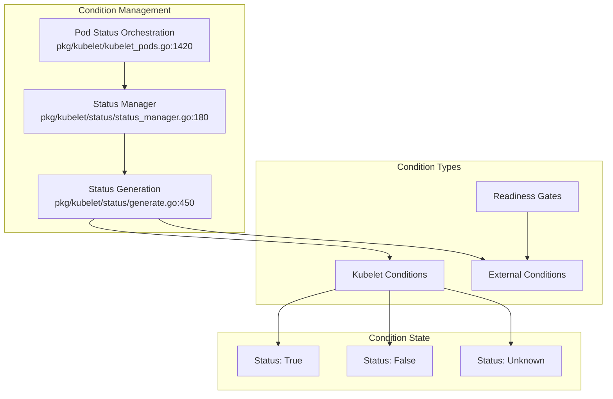
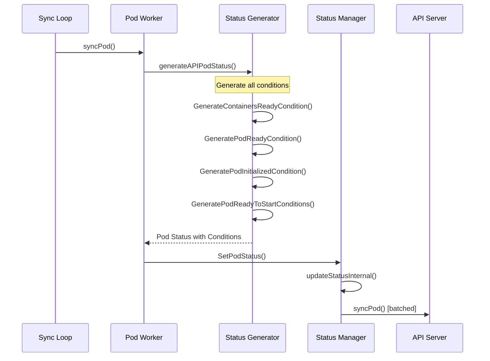
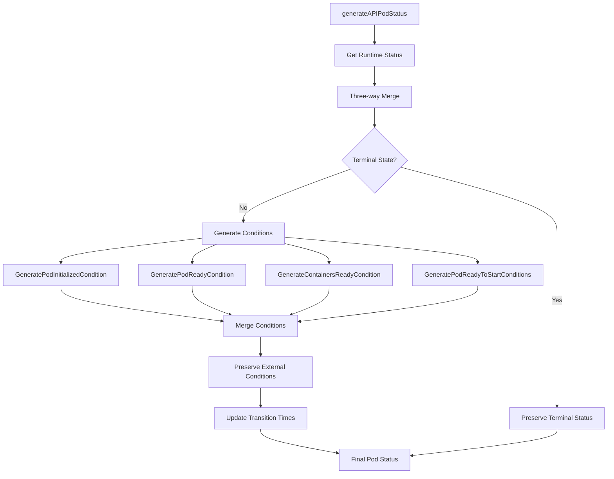
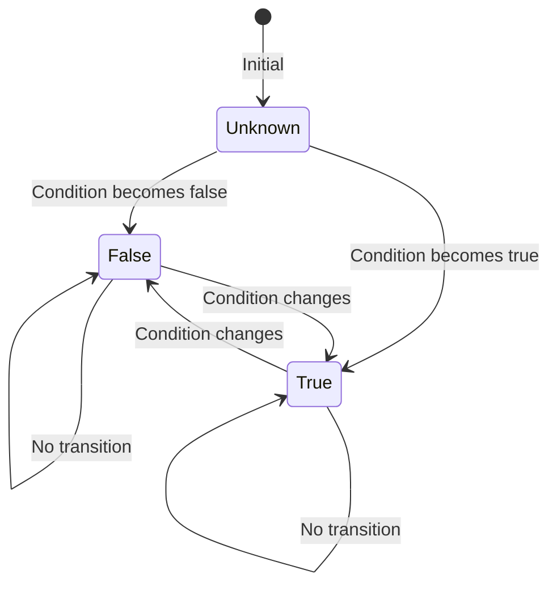
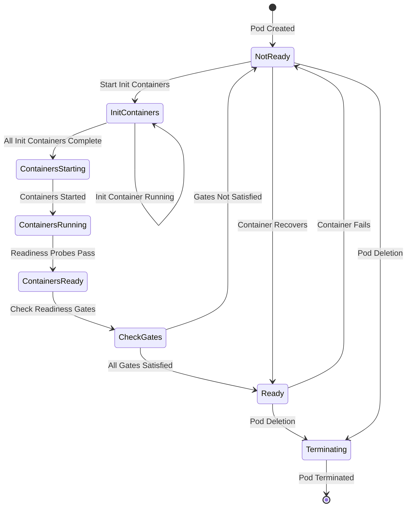
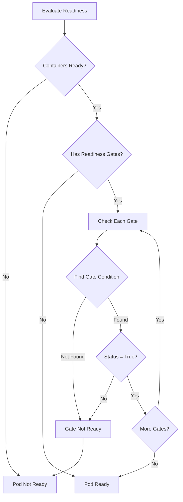
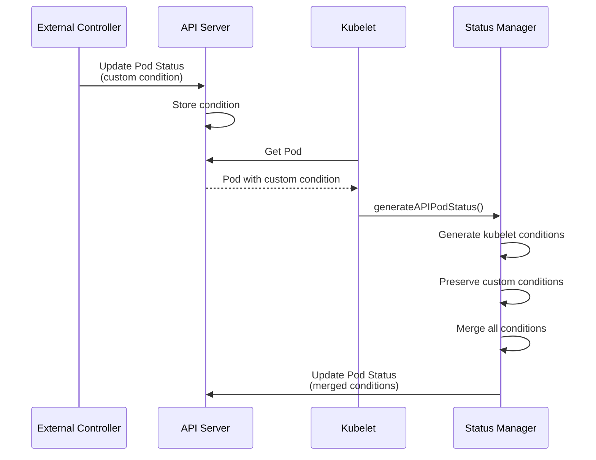
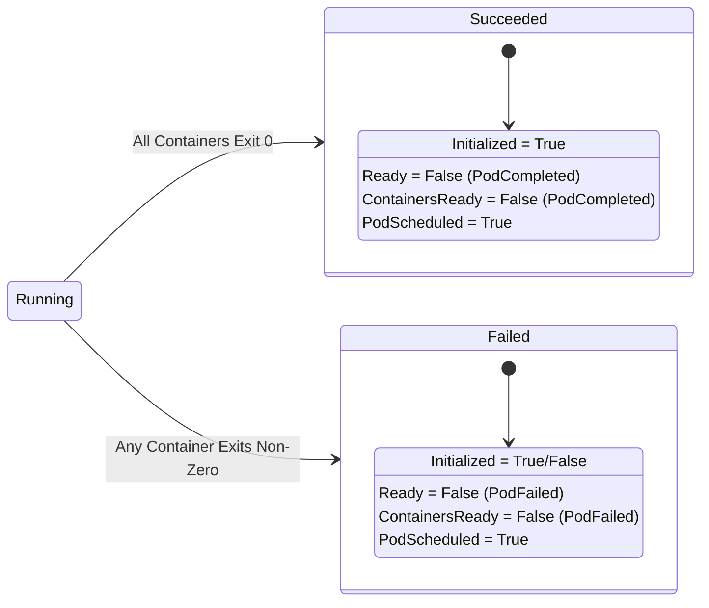
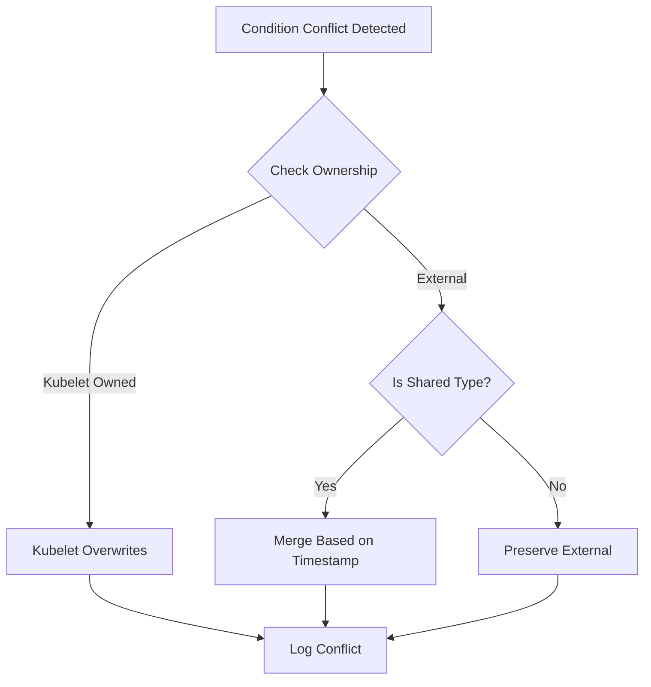

# kubelet Low-Level: Pod Conditions Implementation

## Table of Contents
1. [Overview](#overview)
2. [Architecture](#architecture)
3. [Condition Types](#condition-types)
4. [Condition Generation](#condition-generation)
5. [Condition Transitions](#condition-transitions)
6. [Condition Manager](#condition-manager)
7. [Readiness Gates](#readiness-gates)
8. [Custom Conditions](#custom-conditions)
9. [Terminal State Handling](#terminal-state-handling)
10. [Performance Considerations](#performance-considerations)
11. [Troubleshooting](#troubleshooting)
12. [Best Practices](#best-practices)
13. [Summary](#summary)

## Overview

Pod conditions provide detailed status information about a Pod's current state and lifecycle events. The kubelet manages several core conditions and provides mechanisms for external controllers to add custom conditions through readiness gates.

### Key Components



### Condition Ownership Model

The kubelet implements a clear ownership model for pod conditions (`pkg/kubelet/types/pod_status.go:42`):

```go
// kubelet-owned conditions that the kubelet can set
var PodConditionsByKubelet = []v1.PodConditionType{
    v1.PodScheduled,
    v1.PodReady,
    v1.ContainersReady,
    v1.PodInitialized,
    v1.PodReadyToStartContainers,
    v1.DisruptionTarget,
    v1.PodResizePending,
    v1.PodResizeInProgress,
}

// conditions that can be shared between kubelet and other controllers
var PodConditionsSharedByKubelet = []v1.PodConditionType{
    v1.DisruptionTarget,
}
```

## Architecture

### Condition Generation Pipeline



### Core Components

1. **Status Generator** (`pkg/kubelet/status/generate.go`)
   - Generates conditions based on current state
   - Merges kubelet-owned and external conditions
   - Manages condition transitions

2. **Status Manager** (`pkg/kubelet/status/status_manager.go`)
   - Caches pod status
   - Batches updates
   - Synchronizes with API server

3. **Pod Status Orchestrator** (`pkg/kubelet/kubelet_pods.go`)
   - Coordinates status generation
   - Handles three-way merge
   - Manages terminal states

## Condition Types

### 1. PodScheduled

Always set to `True` by kubelet (`pkg/kubelet/status/generate.go:234`):

```go
func GeneratePodScheduledCondition() v1.PodCondition {
    return v1.PodCondition{
        Type:               v1.PodScheduled,
        Status:             v1.ConditionTrue,
        LastProbeTime:      metav1.Now(),
        LastTransitionTime: metav1.Now(),
        Reason:             "PodScheduled",
        Message:            "Pod was scheduled on the node",
    }
}
```

### 2. Initialized

Tracks init container completion (`pkg/kubelet/status/generate.go:191`):

```go
func GeneratePodInitializedCondition(spec *v1.PodSpec,
    containerStatuses []v1.ContainerStatus,
    podPhase v1.PodPhase) v1.PodCondition {

    // Check if all init containers have succeeded
    if podPhase == v1.PodPending && len(containerStatuses) > 0 {
        for i := range containerStatuses {
            container := &containerStatuses[i]
            if !container.Ready {
                return v1.PodCondition{
                    Type:   v1.PodInitialized,
                    Status: v1.ConditionFalse,
                    Reason: "ContainersNotInitialized",
                    Message: "containers with incomplete status: " +
                             generateContainerMessageList(unreadyContainers),
                }
            }
        }
    }

    return v1.PodCondition{
        Type:   v1.PodInitialized,
        Status: v1.ConditionTrue,
        Reason: "PodCompleted",
    }
}
```

### 3. ContainersReady

All containers must be ready (`pkg/kubelet/status/generate.go:124`):

```go
func GenerateContainersReadyCondition(spec *v1.PodSpec,
    containerStatuses []v1.ContainerStatus,
    podPhase v1.PodPhase) v1.PodCondition {

    // Terminal pods are never ready
    if podPhase == v1.PodSucceeded || podPhase == v1.PodFailed {
        return v1.PodCondition{
            Type:   v1.ContainersReady,
            Status: v1.ConditionFalse,
            Reason: "PodCompleted",
        }
    }

    // Check all containers
    unreadyContainers := []string{}
    for _, container := range containerStatuses {
        if !container.Ready {
            unreadyContainers = append(unreadyContainers, container.Name)
        }
    }

    if len(unreadyContainers) > 0 {
        return v1.PodCondition{
            Type:    v1.ContainersReady,
            Status:  v1.ConditionFalse,
            Reason:  "ContainersNotReady",
            Message: fmt.Sprintf("containers not ready: %v", unreadyContainers),
        }
    }

    return v1.PodCondition{
        Type:   v1.ContainersReady,
        Status: v1.ConditionTrue,
    }
}
```

### 4. Ready

Pod ready considering readiness gates (`pkg/kubelet/status/generate.go:85`):

```go
func GeneratePodReadyCondition(spec *v1.PodSpec,
    conditions []v1.PodCondition,
    containerStatuses []v1.ContainerStatus,
    podPhase v1.PodPhase) v1.PodCondition {

    // Check ContainersReady condition
    containersReady := false
    for _, condition := range conditions {
        if condition.Type == v1.ContainersReady {
            containersReady = condition.Status == v1.ConditionTrue
            break
        }
    }

    // If containers not ready, pod not ready
    if !containersReady {
        return v1.PodCondition{
            Type:   v1.PodReady,
            Status: v1.ConditionFalse,
            Reason: "ContainersNotReady",
        }
    }

    // Check readiness gates
    unreadyGates := []string{}
    for _, gate := range spec.ReadinessGates {
        found := false
        for _, condition := range conditions {
            if condition.Type == gate.ConditionType {
                found = true
                if condition.Status != v1.ConditionTrue {
                    unreadyGates = append(unreadyGates, string(gate.ConditionType))
                }
                break
            }
        }
        if !found {
            unreadyGates = append(unreadyGates, string(gate.ConditionType))
        }
    }

    if len(unreadyGates) > 0 {
        return v1.PodCondition{
            Type:    v1.PodReady,
            Status:  v1.ConditionFalse,
            Reason:  "ReadinessGatesNotReady",
            Message: fmt.Sprintf("readiness gates not ready: %v", unreadyGates),
        }
    }

    return v1.PodCondition{
        Type:   v1.PodReady,
        Status: v1.ConditionTrue,
    }
}
```

### 5. PodReadyToStartContainers (Alpha)

Network and resources ready (`pkg/kubelet/status/generate.go:250`):

```go
func GeneratePodReadyToStartContainersCondition(pod *v1.Pod,
    podStatus *kubecontainer.PodStatus) v1.PodCondition {

    // Check if sandbox is ready
    if podStatus.SandboxStatuses == nil || len(podStatus.SandboxStatuses) == 0 {
        return v1.PodCondition{
            Type:   v1.PodReadyToStartContainers,
            Status: v1.ConditionFalse,
            Reason: "SandboxNotReady",
        }
    }

    // Check sandbox state
    sandboxStatus := podStatus.SandboxStatuses[0]
    if sandboxStatus.State != runtimeapi.PodSandboxState_SANDBOX_READY {
        return v1.PodCondition{
            Type:   v1.PodReadyToStartContainers,
            Status: v1.ConditionFalse,
            Reason: "SandboxNotReady",
        }
    }

    return v1.PodCondition{
        Type:   v1.PodReadyToStartContainers,
        Status: v1.ConditionTrue,
        Reason: "PodSandboxReady",
    }
}
```

## Condition Generation

### Main Generation Function

The primary condition generation occurs in `generateAPIPodStatus` (`pkg/kubelet/kubelet_pods.go:1420`):



Implementation (`pkg/kubelet/kubelet_pods.go:1450`):

```go
func (kl *Kubelet) generateAPIPodStatus(pod *v1.Pod,
    podStatus *kubecontainer.PodStatus,
    podIsTerminal bool) v1.PodStatus {

    // Get current status from status manager
    oldPodStatus, _ := kl.statusManager.GetPodStatus(pod.UID)

    // Merge runtime status with API status
    s := kl.convertStatusToAPIStatus(pod, podStatus, oldPodStatus)

    // Generate conditions
    s.Conditions = append(s.Conditions, status.GeneratePodInitializedCondition(
        &pod.Spec, s.InitContainerStatuses, s.Phase))
    s.Conditions = append(s.Conditions, status.GenerateContainersReadyCondition(
        &pod.Spec, s.ContainerStatuses, s.Phase))
    s.Conditions = append(s.Conditions, status.GeneratePodReadyCondition(
        &pod.Spec, s.Conditions, s.ContainerStatuses, s.Phase))

    if utilfeature.DefaultFeatureGate.Enabled(features.PodReadyToStartContainersCondition) {
        s.Conditions = append(s.Conditions,
            status.GeneratePodReadyToStartContainersCondition(pod, podStatus))
    }

    // Preserve non-kubelet conditions
    s.Conditions = kl.preserveNonKubeletConditions(s.Conditions, oldPodStatus.Conditions)

    // Update transition times
    s.Conditions = updateLastTransitionTime(s.Conditions, oldPodStatus.Conditions)

    return s
}
```

### Condition Preservation

Non-kubelet conditions are preserved (`pkg/kubelet/kubelet_pods.go:1620`):

```go
func (kl *Kubelet) preserveNonKubeletConditions(
    newConditions []v1.PodCondition,
    oldConditions []v1.PodCondition) []v1.PodCondition {

    preserved := []v1.PodCondition{}

    for _, oldCondition := range oldConditions {
        // Check if this is a kubelet-owned condition
        isKubeletOwned := false
        for _, kubeletType := range types.PodConditionsByKubelet {
            if oldCondition.Type == kubeletType {
                isKubeletOwned = true
                break
            }
        }

        // Preserve non-kubelet conditions
        if !isKubeletOwned {
            preserved = append(preserved, oldCondition)
        }
    }

    return append(newConditions, preserved...)
}
```

## Condition Transitions

### Transition Time Management

Efficient transition tracking (`pkg/api/v1/pod/util.go:560`):



Implementation:

```go
func updateLastTransitionTime(newConditions []v1.PodCondition,
    oldConditions []v1.PodCondition) []v1.PodCondition {

    for i := range newConditions {
        newCondition := &newConditions[i]

        // Find matching old condition
        for _, oldCondition := range oldConditions {
            if oldCondition.Type != newCondition.Type {
                continue
            }

            // If status hasn't changed, preserve transition time
            if oldCondition.Status == newCondition.Status {
                newCondition.LastTransitionTime = oldCondition.LastTransitionTime
            }
            break
        }

        // Set transition time if not already set
        if newCondition.LastTransitionTime.IsZero() {
            newCondition.LastTransitionTime = metav1.Now()
        }
    }

    return newConditions
}
```

### State Machine for Pod Ready



## Condition Manager

### Status Manager Integration

The status manager handles condition updates (`pkg/kubelet/status/status_manager.go:180`):

```go
type manager struct {
    // Pod status cache
    podStatuses map[types.UID]versionedPodStatus

    // Update channel
    podStatusChannel chan struct{}

    // Synchronization
    podStatusesLock sync.RWMutex
}

func (m *manager) SetPodStatus(pod *v1.Pod, status v1.PodStatus) {
    m.podStatusesLock.Lock()
    defer m.podStatusesLock.Unlock()

    // Get cached status
    cached, ok := m.podStatuses[pod.UID]

    // Check if update needed
    if ok && cached.status.Equal(&status) {
        klog.V(3).InfoS("Ignoring same status", "pod", pod.Name)
        return
    }

    // Update with new version
    newStatus := versionedPodStatus{
        status:  status,
        version: cached.version + 1,
        podName: pod.Name,
    }

    m.podStatuses[pod.UID] = newStatus

    // Trigger sync
    select {
    case m.podStatusChannel <- struct{}{}:
    default:
    }
}
```

### Container Readiness Updates

Container readiness triggers condition updates (`pkg/kubelet/status/status_manager.go:450`):

```go
func (m *manager) SetContainerReadiness(podUID types.UID,
    containerID kubecontainer.ContainerID,
    ready bool) {

    m.podStatusesLock.Lock()
    defer m.podStatusesLock.Unlock()

    pod, _ := m.podManager.GetPodByUID(podUID)
    oldStatus, _ := m.podStatuses[pod.UID]

    // Update container status
    containerStatuses := oldStatus.status.ContainerStatuses
    for i, c := range containerStatuses {
        if c.ContainerID == containerID.String() {
            containerStatuses[i].Ready = ready
            break
        }
    }

    // Regenerate conditions
    newStatus := oldStatus.status
    newStatus.ContainerStatuses = containerStatuses

    // Regenerate ContainersReady condition
    newStatus.Conditions = replaceOrAppendPodCondition(newStatus.Conditions,
        GenerateContainersReadyCondition(&pod.Spec,
            newStatus.ContainerStatuses, newStatus.Phase))

    // Regenerate Ready condition
    newStatus.Conditions = replaceOrAppendPodCondition(newStatus.Conditions,
        GeneratePodReadyCondition(&pod.Spec, newStatus.Conditions,
            newStatus.ContainerStatuses, newStatus.Phase))

    m.updateStatusInternal(pod, newStatus, false, false)
}
```

## Readiness Gates

### Configuration

Readiness gates allow external controllers to influence pod readiness:

```yaml
apiVersion: v1
kind: Pod
metadata:
  name: pod-with-gates
spec:
  readinessGates:
  - conditionType: "www.example.com/feature"
  - conditionType: "www.example.com/database-ready"
  containers:
  - name: app
    image: myapp:latest
```

### Gate Evaluation

Gate processing in pod ready condition (`pkg/kubelet/status/generate.go:100`):



### External Controller Integration

External controllers can set custom conditions:

```go
// External controller sets custom condition
func (c *ExternalController) updatePodCondition(pod *v1.Pod) error {
    // Get current pod
    currentPod, err := c.client.CoreV1().Pods(pod.Namespace).Get(pod.Name, metav1.GetOptions{})

    // Add or update custom condition
    newCondition := v1.PodCondition{
        Type:               "www.example.com/feature",
        Status:             v1.ConditionTrue,
        LastTransitionTime: metav1.Now(),
        Reason:             "FeatureEnabled",
        Message:            "Feature is available and enabled",
    }

    // Update pod conditions
    currentPod.Status.Conditions = updateCondition(currentPod.Status.Conditions, newCondition)

    // Update pod status
    _, err = c.client.CoreV1().Pods(pod.Namespace).UpdateStatus(currentPod)
    return err
}
```

## Custom Conditions

### Adding Custom Conditions

Custom conditions workflow:



### Condition Merging

The merging strategy (`pkg/kubelet/kubelet_pods.go:1650`):

```go
func mergeConditions(kubeletConditions []v1.PodCondition,
    externalConditions []v1.PodCondition) []v1.PodCondition {

    conditionMap := make(map[v1.PodConditionType]v1.PodCondition)

    // Add external conditions first
    for _, cond := range externalConditions {
        conditionMap[cond.Type] = cond
    }

    // Override with kubelet conditions (kubelet has priority)
    for _, cond := range kubeletConditions {
        conditionMap[cond.Type] = cond
    }

    // Convert map back to slice
    merged := []v1.PodCondition{}
    for _, cond := range conditionMap {
        merged = append(merged, cond)
    }

    // Sort for consistency
    sort.Slice(merged, func(i, j int) bool {
        return merged[i].Type < merged[j].Type
    })

    return merged
}
```

## Terminal State Handling

### Terminal Phase Immutability

Once a pod reaches terminal state, conditions become immutable (`pkg/kubelet/kubelet_pods.go:1500`):

```go
func (kl *Kubelet) determinePodPhase(pod *v1.Pod,
    podStatus *kubecontainer.PodStatus) v1.PodPhase {

    // Check if pod was already terminal
    if pod.Status.Phase == v1.PodFailed ||
       pod.Status.Phase == v1.PodSucceeded {
        // Terminal phase is immutable
        return pod.Status.Phase
    }

    // Determine new phase based on container states
    allTerminated := true
    anyFailed := false

    for _, container := range podStatus.ContainerStatuses {
        if container.State == kubecontainer.ContainerStateRunning {
            allTerminated = false
            break
        }
        if container.ExitCode != 0 {
            anyFailed = true
        }
    }

    if allTerminated {
        if anyFailed {
            return v1.PodFailed
        }
        return v1.PodSucceeded
    }

    return v1.PodRunning
}
```

### Terminal Condition Updates

Terminal pods have specific condition states:



## Performance Considerations

### Condition Update Optimization

1. **Batching Updates** (`pkg/kubelet/status/status_manager.go:520`):

```go
func (m *manager) syncBatch(all bool) {
    // Batch size for status updates
    const batchSize = 10

    // Collect pods to sync
    var podsToSync []*v1.Pod
    for uid, status := range m.podStatuses {
        if status.needsSync {
            pod, _ := m.podManager.GetPodByUID(uid)
            podsToSync = append(podsToSync, pod)

            if !all && len(podsToSync) >= batchSize {
                break
            }
        }
    }

    // Sync in parallel with rate limiting
    workqueue.ParallelizeUntil(context.TODO(), 3, len(podsToSync),
        func(i int) {
            m.syncPod(podsToSync[i])
        })
}
```

2. **Condition Caching**:

```go
type conditionCache struct {
    conditions map[types.UID][]v1.PodCondition
    lock       sync.RWMutex
    ttl        time.Duration
}

func (c *conditionCache) get(uid types.UID) ([]v1.PodCondition, bool) {
    c.lock.RLock()
    defer c.lock.RUnlock()

    conditions, ok := c.conditions[uid]
    return conditions, ok
}
```

3. **Transition Time Optimization**:

```go
// Only update transition time when status changes
if oldCondition.Status == newCondition.Status {
    // Preserve old transition time (no allocation)
    newCondition.LastTransitionTime = oldCondition.LastTransitionTime
} else {
    // Status changed, update transition time
    newCondition.LastTransitionTime = metav1.Now()
}
```

### Metrics and Monitoring

Condition-related metrics (`pkg/kubelet/metrics/metrics.go:180`):

```go
var (
    // Condition update latency
    PodConditionTransitionLatency = metrics.NewHistogramVec(
        &metrics.HistogramOpts{
            Subsystem: KubeletSubsystem,
            Name:      "pod_condition_transition_latency_seconds",
            Help:      "Latency of pod condition transitions",
            Buckets:   []float64{0.001, 0.005, 0.01, 0.05, 0.1, 0.5, 1.0, 5.0},
        },
        []string{"condition_type", "from_status", "to_status"},
    )

    // Current condition states
    PodConditions = metrics.NewGaugeVec(
        &metrics.GaugeOpts{
            Subsystem: KubeletSubsystem,
            Name:      "pod_conditions",
            Help:      "Current pod condition states",
        },
        []string{"condition_type", "status"},
    )
)
```

## Troubleshooting

### Common Issues

1. **Condition Not Updating**:

```bash
# Check pod conditions
kubectl get pod mypod -o jsonpath='{.status.conditions}' | jq

# Watch condition changes
kubectl get pod mypod -w -o jsonpath='{.status.conditions}'

# Check kubelet logs
journalctl -u kubelet | grep "condition"
```

2. **Readiness Gate Not Satisfied**:

```go
// Debug readiness gate evaluation
func debugReadinessGates(pod *v1.Pod) {
    fmt.Printf("Pod %s readiness gates:\n", pod.Name)
    for _, gate := range pod.Spec.ReadinessGates {
        found := false
        for _, condition := range pod.Status.Conditions {
            if condition.Type == gate.ConditionType {
                fmt.Printf("  Gate %s: %s (Reason: %s)\n",
                    gate.ConditionType, condition.Status, condition.Reason)
                found = true
                break
            }
        }
        if !found {
            fmt.Printf("  Gate %s: NOT FOUND\n", gate.ConditionType)
        }
    }
}
```

3. **Custom Condition Conflicts**:



### Debugging Tools

1. **Condition State Dumper**:

```go
func dumpPodConditions(pod *v1.Pod) {
    fmt.Printf("Pod: %s/%s\n", pod.Namespace, pod.Name)
    fmt.Printf("Phase: %s\n", pod.Status.Phase)
    fmt.Println("Conditions:")

    for _, cond := range pod.Status.Conditions {
        fmt.Printf("  %s: %s\n", cond.Type, cond.Status)
        fmt.Printf("    Reason: %s\n", cond.Reason)
        fmt.Printf("    Message: %s\n", cond.Message)
        fmt.Printf("    LastTransition: %s\n", cond.LastTransitionTime)
        fmt.Printf("    LastProbe: %s\n", cond.LastProbeTime)
    }
}
```

2. **Condition History Tracker**:

```go
type ConditionHistory struct {
    transitions []ConditionTransition
    mu          sync.Mutex
}

type ConditionTransition struct {
    Type      v1.PodConditionType
    From      v1.ConditionStatus
    To        v1.ConditionStatus
    Timestamp time.Time
    Reason    string
}

func (h *ConditionHistory) Record(oldCond, newCond v1.PodCondition) {
    if oldCond.Status != newCond.Status {
        h.mu.Lock()
        defer h.mu.Unlock()

        h.transitions = append(h.transitions, ConditionTransition{
            Type:      newCond.Type,
            From:      oldCond.Status,
            To:        newCond.Status,
            Timestamp: time.Now(),
            Reason:    newCond.Reason,
        })
    }
}
```

## Best Practices

### 1. Condition Design

```yaml
# Good: Specific, actionable conditions
conditions:
- type: DatabaseReady
  status: "False"
  reason: "ConnectionTimeout"
  message: "Unable to connect to database at db.example.com:5432"

# Bad: Vague conditions
conditions:
- type: Error
  status: "True"
  reason: "Failed"
  message: "Something went wrong"
```

### 2. Readiness Gate Usage

```go
// Good: Gate for critical dependencies
spec:
  readinessGates:
  - conditionType: "database.example.com/migrated"
  - conditionType: "cache.example.com/warmed"

// Bad: Too many gates
spec:
  readinessGates:
  - conditionType: "feature1"
  - conditionType: "feature2"
  - conditionType: "feature3"
  # ... 10+ gates
```

### 3. Condition Updates

```go
// Good: Batch condition updates
func updateMultipleConditions(pod *v1.Pod, conditions []v1.PodCondition) {
    // Single API call for multiple conditions
    pod.Status.Conditions = mergeConditions(pod.Status.Conditions, conditions)
    client.UpdateStatus(pod)
}

// Bad: Multiple API calls
func updateConditionsOneByOne(pod *v1.Pod, conditions []v1.PodCondition) {
    for _, cond := range conditions {
        pod.Status.Conditions = append(pod.Status.Conditions, cond)
        client.UpdateStatus(pod) // Multiple API calls!
    }
}
```

### 4. Monitoring Conditions

```go
// Prometheus metrics for condition monitoring
func recordConditionMetrics(pod *v1.Pod) {
    for _, condition := range pod.Status.Conditions {
        status := 0.0
        if condition.Status == v1.ConditionTrue {
            status = 1.0
        }

        podConditionMetric.WithLabelValues(
            pod.Namespace,
            pod.Name,
            string(condition.Type),
        ).Set(status)
    }
}
```

## Summary

Pod conditions provide a sophisticated mechanism for tracking and communicating pod state:

### Key Concepts
- **Ownership Model**: Clear separation between kubelet and external conditions
- **Transition Tracking**: Efficient LastTransitionTime management
- **Readiness Gates**: External control over pod readiness
- **Terminal Immutability**: Once terminal, conditions don't change

### Implementation Details
- **Generation Pipeline**: Status generator → Status manager → API server
- **Three-way Merge**: Runtime status + API status + kubelet logic
- **Condition Types**: PodScheduled, Initialized, ContainersReady, Ready
- **Performance**: Batching, caching, and versioned updates

### Best Practices
- Use specific, actionable condition types
- Leverage readiness gates for external dependencies
- Batch condition updates when possible
- Monitor condition transitions for debugging

The pod condition system enables fine-grained pod lifecycle management while maintaining performance and allowing extensibility through custom conditions and readiness gates.