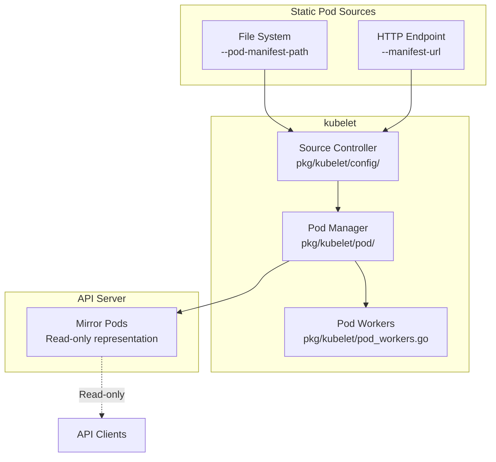
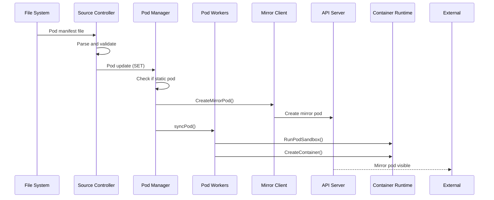
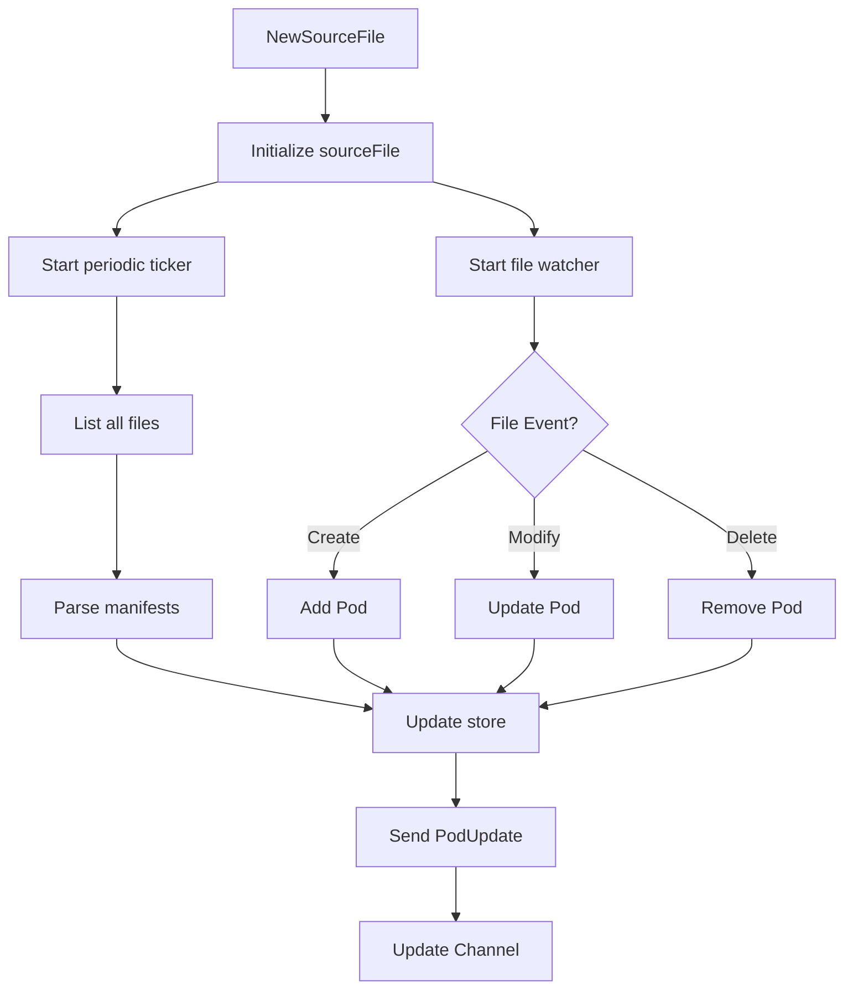
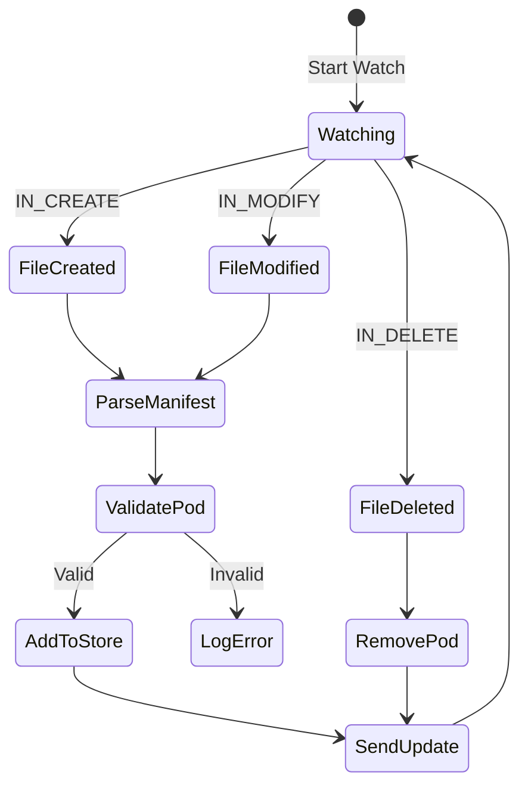
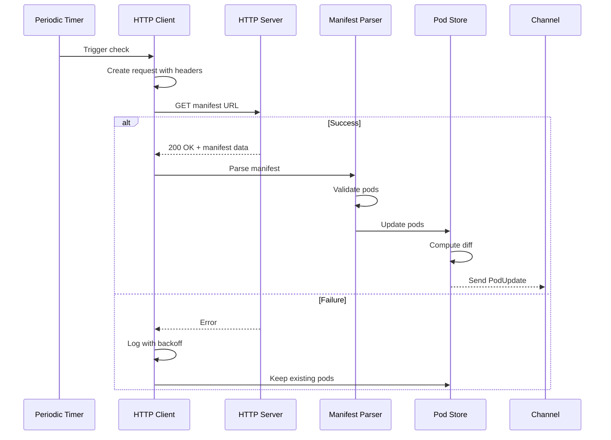
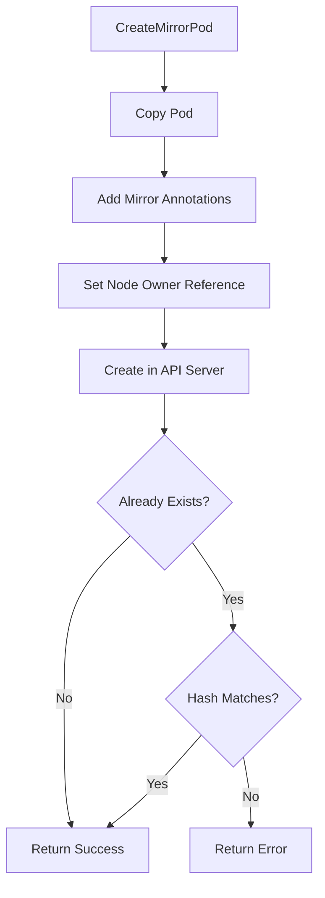
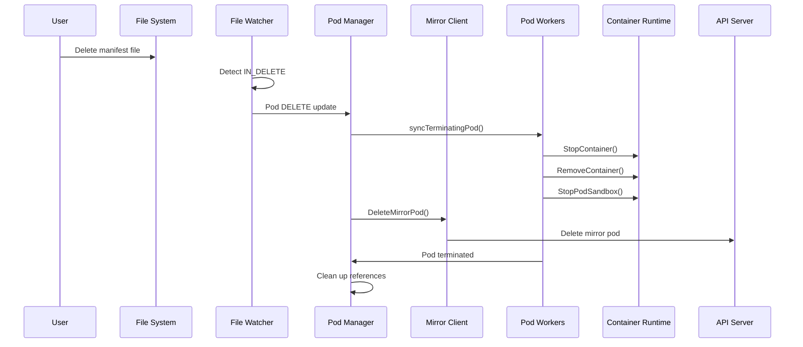
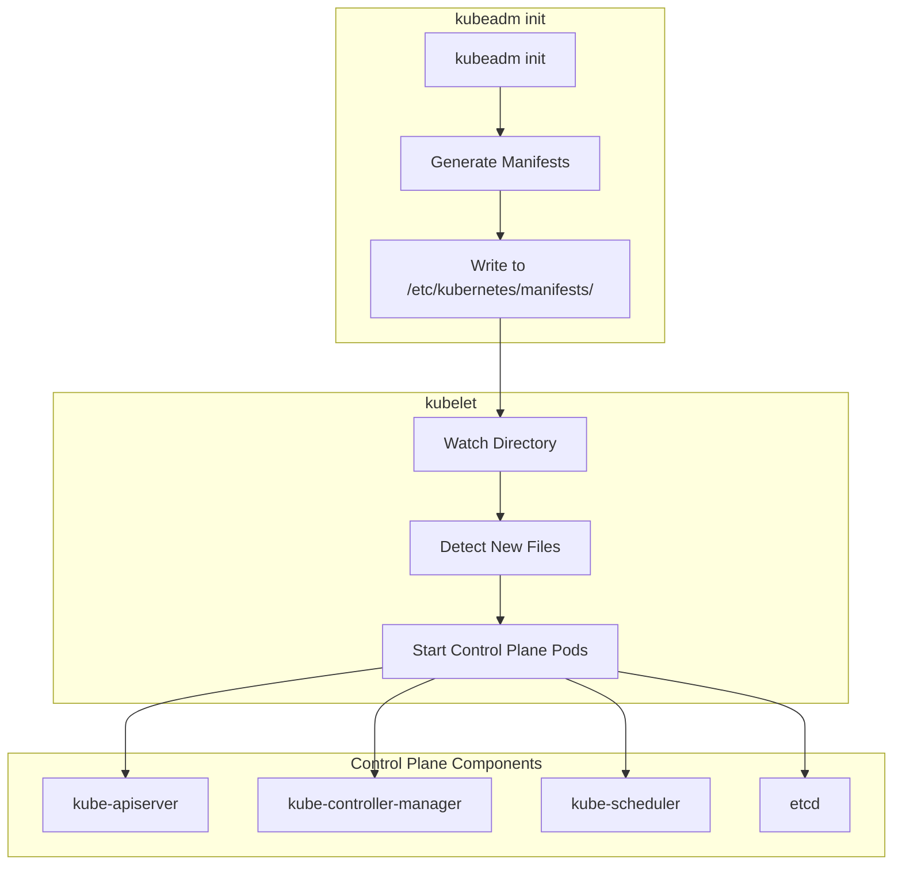
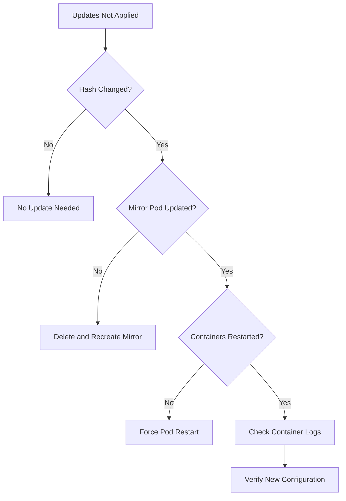

# kubelet Low-Level: Static Pods Implementation

## Table of Contents
1. [Overview](#overview)
2. [Architecture](#architecture)
3. [Configuration Sources](#configuration-sources)
4. [File Source Implementation](#file-source-implementation)
5. [HTTP Source Implementation](#http-source-implementation)
6. [Static Pod Processing](#static-pod-processing)
7. [Mirror Pod Management](#mirror-pod-management)
8. [Static Pod Updates](#static-pod-updates)
9. [Static Pod Deletion](#static-pod-deletion)
10. [Control Plane Components](#control-plane-components)
11. [Performance and Monitoring](#performance-and-monitoring)
12. [Troubleshooting](#troubleshooting)
13. [Best Practices](#best-practices)
14. [Summary](#summary)

## Overview

Static pods are pod manifests that are directly managed by the kubelet on a specific node, without the API server managing them. The kubelet watches a given location (filesystem directory or HTTP endpoint) and ensures that the pods defined there are running.

### Key Characteristics



### Static vs Regular Pods

| Aspect | Static Pods | Regular Pods |
|--------|------------|--------------|
| **Source** | Local files or HTTP | API server |
| **Management** | kubelet directly | Controller manager |
| **Updates** | File changes | API updates |
| **Deletion** | Remove file | API delete |
| **Visibility** | Mirror pod in API | Full API object |
| **Scheduling** | Pre-assigned to node | Scheduler assigns |
| **Use Cases** | Control plane components | Workloads |

## Architecture

### Component Interaction



### Key Components

1. **Source Controller** (`pkg/kubelet/config/`)
   - Watches file/HTTP sources
   - Parses pod manifests
   - Sends updates to pod manager

2. **Pod Manager** (`pkg/kubelet/pod/pod_manager.go`)
   - Tracks static pods
   - Manages pod lifecycle
   - Handles mirror pod creation

3. **Mirror Client** (`pkg/kubelet/pod/mirror_client.go`)
   - Creates mirror pods in API server
   - Manages mirror pod lifecycle
   - Handles owner references

## Configuration Sources

### Configuration Options

kubelet accepts static pod sources via (`cmd/kubelet/app/options/options.go:140`):

```go
// Static pod configuration
type KubeletFlags struct {
    // File-based static pods
    PodManifestPath string

    // HTTP-based static pods
    ManifestURL string
    ManifestURLHeader map[string][]string

    // Check interval
    FileCheckFrequency time.Duration
    HTTPCheckFrequency time.Duration
}
```

### Source Registration

Source initialization (`pkg/kubelet/kubelet.go:580`):

```go
func (kl *Kubelet) initializeStaticPodSources(kubeCfg *kubeletconfiginternal.KubeletConfiguration) {
    // File source
    if kubeCfg.StaticPodPath != "" {
        config.NewSourceFile(
            klog.TODO(),
            kubeCfg.StaticPodPath,
            types.NodeName(kl.nodeName),
            kubeCfg.FileCheckFrequency,
            kl.podManager.Channel(ctx, kubetypes.FileSource),
        )
    }

    // HTTP source
    if kubeCfg.StaticPodURL != "" {
        config.NewSourceURL(
            klog.TODO(),
            kubeCfg.StaticPodURL,
            http.Header(kubeCfg.StaticPodURLHeader),
            types.NodeName(kl.nodeName),
            kubeCfg.HTTPCheckFrequency,
            kl.podManager.Channel(ctx, kubetypes.HTTPSource),
        )
    }
}
```

## File Source Implementation

### File Watcher

The file source watches a directory or file (`pkg/kubelet/config/file.go:63`):



Implementation (`pkg/kubelet/config/file.go:92`):

```go
func (s *sourceFile) run(logger klog.Logger) {
    listTicker := time.NewTicker(s.period)

    go func() {
        // Read path immediately to speed up startup
        if err := s.listConfig(logger); err != nil {
            logger.Error(err, "Unable to read config path", "path", s.path)
        }

        for {
            select {
            case <-listTicker.C:
                // Periodic full reconciliation
                if err := s.listConfig(logger); err != nil {
                    logger.Error(err, "Unable to read config path")
                }
            case e := <-s.watchEvents:
                // Process file system events
                if err := s.consumeWatchEvent(logger, e); err != nil {
                    logger.Error(err, "Unable to process watch event")
                }
            }
        }
    }()

    s.startWatch(logger)
}
```

### Directory Processing

Processing pod manifests from directory (`pkg/kubelet/config/file.go:134`):

```go
func (s *sourceFile) extractFromDir(logger klog.Logger, dirPath string) ([]*v1.Pod, error) {
    files, err := os.ReadDir(dirPath)
    if err != nil {
        return nil, err
    }

    pods := make([]*v1.Pod, 0)
    for _, file := range files {
        if file.IsDir() {
            continue
        }

        // Skip non-manifest files
        if !strings.HasSuffix(file.Name(), ".yaml") &&
           !strings.HasSuffix(file.Name(), ".yml") &&
           !strings.HasSuffix(file.Name(), ".json") {
            continue
        }

        fullPath := filepath.Join(dirPath, file.Name())
        pod, err := s.extractFromFile(logger, fullPath)
        if err != nil {
            logger.Error(err, "Error reading pod manifest", "file", fullPath)
            continue
        }

        pods = append(pods, pod)
    }

    return pods, nil
}
```

### Manifest Parsing

Parsing individual pod manifest (`pkg/kubelet/config/common.go:65`):

```go
func tryDecodeSinglePod(data []byte) (*v1.Pod, error) {
    // Try to decode as single pod
    obj, _, err := codecs.UniversalDecoder().Decode(data, nil, &v1.Pod{})
    if err != nil {
        return nil, err
    }

    pod, ok := obj.(*v1.Pod)
    if !ok {
        return nil, fmt.Errorf("expected Pod, got %T", obj)
    }

    return pod, nil
}

func tryDecodePodList(data []byte) ([]*v1.Pod, error) {
    // Try to decode as pod list
    obj, _, err := codecs.UniversalDecoder().Decode(data, nil, &v1.PodList{})
    if err != nil {
        return nil, err
    }

    podList, ok := obj.(*v1.PodList)
    if !ok {
        return nil, fmt.Errorf("expected PodList, got %T", obj)
    }

    pods := make([]*v1.Pod, len(podList.Items))
    for i := range podList.Items {
        pods[i] = &podList.Items[i]
    }

    return pods, nil
}
```

### File System Events

Processing file system events (`pkg/kubelet/config/file_linux.go:45`):



## HTTP Source Implementation

### HTTP Polling

The HTTP source polls an endpoint (`pkg/kubelet/config/http.go:45`):

```go
func NewSourceURL(logger klog.Logger, url string, header http.Header,
                  nodeName types.NodeName, period time.Duration,
                  updates chan<- interface{}) {
    config := &sourceURL{
        url:      url,
        header:   header,
        nodeName: nodeName,
        updates:  updates,
        data:     nil,
        client:   &http.Client{Timeout: 10 * time.Second},
    }

    logger.V(1).Info("Watching URL", "URL", url)
    go wait.Until(func() { config.run(logger) }, period, wait.NeverStop)
}

func (s *sourceURL) run(logger klog.Logger) {
    if err := s.extractFromURL(logger); err != nil {
        // Rate limit error logging
        if s.failureLogs < 3 {
            logger.Info("Failed to read pods from URL", "err", err)
        } else if s.failureLogs == 3 {
            logger.Info("Failed to read pods from URL. Dropping verbosity")
        } else {
            logger.V(4).Info("Failed to read pods from URL", "err", err)
        }
        s.failureLogs++
    } else {
        if s.failureLogs > 0 {
            logger.Info("Successfully read pods from URL")
            s.failureLogs = 0
        }
    }
}
```

### HTTP Request Processing



Implementation (`pkg/kubelet/config/http.go:85`):

```go
func (s *sourceURL) extractFromURL(logger klog.Logger) error {
    req, err := http.NewRequest("GET", s.url, nil)
    if err != nil {
        return err
    }
    req.Header = s.header

    resp, err := s.client.Do(req)
    if err != nil {
        return err
    }
    defer resp.Body.Close()

    data, err := utilio.ReadAtMost(resp.Body, maxConfigLength)
    if err != nil {
        return err
    }

    if resp.StatusCode != http.StatusOK {
        return fmt.Errorf("failed to read URL %q: %s", s.url, resp.Status)
    }

    // Only send update if data changed
    if bytes.Equal(s.data, data) {
        return nil
    }
    s.data = data

    // Parse and send pods
    pods, err := s.decode(logger, data)
    if err != nil {
        return err
    }

    s.updates <- kubetypes.PodUpdate{
        Pods:   pods,
        Op:     kubetypes.SET,
        Source: kubetypes.HTTPSource,
    }

    return nil
}
```

## Static Pod Processing

### Static Pod Identification

Determining if a pod is static (`pkg/kubelet/types/pod_update.go:153`):

```go
// IsStaticPod returns true if the pod is a static pod
func IsStaticPod(pod *v1.Pod) bool {
    source, err := GetPodSource(pod)
    return err == nil && source != ApiserverSource
}

// GetPodSource returns the source of the pod
func GetPodSource(pod *v1.Pod) (string, error) {
    if pod.Annotations != nil {
        if source, ok := pod.Annotations[ConfigSourceAnnotationKey]; ok {
            return source, nil
        }
    }
    return "", fmt.Errorf("cannot get source of pod %q", pod.UID)
}
```

### Static Pod Annotations

Static pods have special annotations (`pkg/kubelet/types/types.go:35`):

```go
const (
    // ConfigSourceAnnotationKey is the annotation key for pod source
    ConfigSourceAnnotationKey = "kubernetes.io/config.source"

    // ConfigMirrorAnnotationKey is the annotation key for mirror pod
    ConfigMirrorAnnotationKey = "kubernetes.io/config.mirror"

    // ConfigHashAnnotationKey is the annotation key for pod hash
    ConfigHashAnnotationKey = "kubernetes.io/config.hash"
)
```

### Pod Defaults

Applying defaults to static pods (`pkg/kubelet/config/common.go:140`):

```go
func applyDefaults(logger klog.Logger, pod *api.Pod, source string,
                   isFile bool, nodeName types.NodeName) error {

    // Set default namespace
    if len(pod.Namespace) == 0 {
        pod.Namespace = metav1.NamespaceDefault
    }

    // Set pod source annotation
    if pod.Annotations == nil {
        pod.Annotations = make(map[string]string)
    }
    pod.Annotations[kubetypes.ConfigSourceAnnotationKey] = source

    // Generate pod hash
    hash := computePodHash(pod)
    pod.Annotations[kubetypes.ConfigHashAnnotationKey] = hash

    // Validate and set defaults
    pod.Name = generatePodName(pod.Name, nodeName)
    pod.Spec.NodeName = string(nodeName)

    // Ensure restart policy
    if pod.Spec.RestartPolicy == "" {
        pod.Spec.RestartPolicy = v1.RestartPolicyAlways
    }

    return nil
}
```

## Mirror Pod Management

### Mirror Pod Creation

Creating mirror pods in API server (`pkg/kubelet/pod/mirror_client.go:69`):



Implementation:

```go
func (mc *basicMirrorClient) CreateMirrorPod(ctx context.Context, pod *v1.Pod) error {
    if mc.apiserverClient == nil {
        return nil
    }

    // Make a copy of the pod
    copyPod := *pod
    copyPod.Annotations = make(map[string]string)

    // Copy original annotations
    for k, v := range pod.Annotations {
        copyPod.Annotations[k] = v
    }

    // Add mirror annotation with hash
    hash := getPodHash(pod)
    copyPod.Annotations[kubetypes.ConfigMirrorAnnotationKey] = hash

    // Set node as owner (required for MirrorPodNodeRestriction)
    nodeUID, err := mc.getNodeUID()
    if err != nil {
        return fmt.Errorf("failed to get node UID: %v", err)
    }

    controller := true
    copyPod.OwnerReferences = []metav1.OwnerReference{{
        APIVersion: v1.SchemeGroupVersion.String(),
        Kind:       "Node",
        Name:       mc.nodeName,
        UID:        nodeUID,
        Controller: &controller,
    }}

    // Create mirror pod in API server
    apiPod, err := mc.apiserverClient.CoreV1().Pods(copyPod.Namespace).
        Create(ctx, &copyPod, metav1.CreateOptions{})

    if err != nil && apierrors.IsAlreadyExists(err) {
        // Check if existing pod has same hash
        if h, ok := apiPod.Annotations[kubetypes.ConfigMirrorAnnotationKey]; ok && h == hash {
            return nil  // Same pod already exists
        }
    }

    return err
}
```

### Mirror Pod Tracking

Pod manager tracks mirror relationships (`pkg/kubelet/pod/pod_manager.go:180`):

```go
type basicManager struct {
    // Pods indexed by UID
    podByUID map[types.UID]*v1.Pod

    // Mirror pod UID to static pod UID
    mirrorPodByUID map[types.UID]types.UID

    // Static pod full name to mirror pod UID
    mirrorPodByFullName map[string]types.UID

    // Translations between static and mirror pods
    translationByUID map[types.UID]types.UID
}

func (pm *basicManager) AddPod(pod *v1.Pod) {
    pm.lock.Lock()
    defer pm.lock.Unlock()

    pm.podByUID[pod.UID] = pod

    // Update translation if mirror pod
    if kubetypes.IsMirrorPod(pod) {
        mirrorFullName := kubecontainer.GetPodFullName(pod)
        pm.mirrorPodByFullName[mirrorFullName] = pod.UID

        // Link to static pod if exists
        if staticPod, ok := pm.staticPodByFullName[mirrorFullName]; ok {
            pm.translationByUID[pod.UID] = staticPod.UID
            pm.translationByUID[staticPod.UID] = pod.UID
        }
    }
}
```

### Mirror Pod Synchronization

Reconciling mirror pods with static pods (`pkg/kubelet/kubelet.go:3220`):

```go
func (kl *Kubelet) tryReconcileMirrorPods(ctx context.Context,
                                         staticPod, mirrorPod *v1.Pod) {
    if !kubetypes.IsStaticPod(staticPod) {
        return
    }

    logger := klog.FromContext(ctx)

    // Check if mirror pod needs update
    staticHash := staticPod.Annotations[kubetypes.ConfigHashAnnotationKey]
    mirrorHash := ""
    if mirrorPod != nil {
        mirrorHash = mirrorPod.Annotations[kubetypes.ConfigMirrorAnnotationKey]
    }

    if mirrorPod == nil {
        // Create missing mirror pod
        logger.V(3).Info("Creating missing mirror pod", "pod", staticPod.Name)
        if err := kl.mirrorClient.CreateMirrorPod(ctx, staticPod); err != nil {
            logger.Error(err, "Failed to create mirror pod")
        }
    } else if staticHash != mirrorHash {
        // Delete outdated mirror pod (will be recreated)
        logger.V(3).Info("Deleting outdated mirror pod", "pod", mirrorPod.Name)
        fullName := kubecontainer.GetPodFullName(mirrorPod)
        if _, err := kl.mirrorClient.DeleteMirrorPod(ctx, fullName, &mirrorPod.UID); err != nil {
            logger.Error(err, "Failed to delete mirror pod")
        }
    }
}
```

## Static Pod Updates

### Update Detection

File change detection (`pkg/kubelet/config/file_linux.go:80`):

```mermaid
stateDiagram-v2
    [*] --> Monitoring: Watch Directory

    Monitoring --> FileChanged: IN_MODIFY Event
    FileChanged --> ReadFile: Read New Content
    ReadFile --> ParseManifest: Parse Pod Spec

    ParseManifest --> CompareHash: Generate Hash
    CompareHash --> CheckExisting{Hash Changed?}

    CheckExisting --> UpdatePod: Yes
    CheckExisting --> NoOp: No

    UpdatePod --> UpdateMirror: Update Mirror Pod
    UpdateMirror --> RestartContainers: Recreate Containers

    NoOp --> Monitoring
    RestartContainers --> Monitoring
```

### Static Pod Ordering

Ensuring static pods start in order (`pkg/kubelet/pod_workers.go:949`):

```go
func (p *podWorkers) allowPodStart(pod *v1.Pod) (canStart bool, canEverStart bool) {
    if !kubetypes.IsStaticPod(pod) {
        return true, true
    }

    fullname := kubecontainer.GetPodFullName(pod)

    // Check waiting queue for this static pod
    if waitingPods, ok := p.waitingToStartStaticPodsByFullname[fullname]; ok {
        // Can only start if this is the first pod in queue
        if len(waitingPods) > 0 && waitingPods[0] == pod.UID {
            return true, true
        }

        // This pod must wait
        for _, uid := range waitingPods {
            if uid == pod.UID {
                return false, true  // Can start eventually
            }
        }
    }

    return true, true
}
```

### Update Processing

Processing static pod updates (`pkg/kubelet/kubelet.go:2150`):

```go
func (kl *Kubelet) HandlePodUpdates(pods []*v1.Pod) {
    start := kl.clock.Now()

    for _, pod := range pods {
        // Validate static pod
        if kubetypes.IsStaticPod(pod) {
            // Check node name matches
            if pod.Spec.NodeName != kl.nodeName {
                klog.Warningf("Static pod %s has incorrect node name %s (expected %s)",
                    pod.Name, pod.Spec.NodeName, kl.nodeName)
                continue
            }

            // Ensure mirror pod exists
            mirrorPod, _ := kl.podManager.GetMirrorPodByPod(pod)
            kl.tryReconcileMirrorPods(ctx, pod, mirrorPod)
        }

        // Dispatch to pod workers
        kl.dispatchWork(pod, kubetypes.SyncPodUpdate, mirrorPod, start)
    }
}
```

## Static Pod Deletion

### Deletion Flow



### Mirror Pod Deletion

Deleting mirror pods (`pkg/kubelet/pod/mirror_client.go:116`):

```go
func (mc *basicMirrorClient) DeleteMirrorPod(ctx context.Context,
                                            podFullName string,
                                            uid *types.UID) (bool, error) {
    if mc.apiserverClient == nil {
        return false, nil
    }

    logger := klog.FromContext(ctx)
    name, namespace, err := kubecontainer.ParsePodFullName(podFullName)
    if err != nil {
        logger.Error(err, "Failed to parse pod full name", "podFullName", podFullName)
        return false, err
    }

    logger.V(2).Info("Deleting a mirror pod", "pod", klog.KRef(namespace, name))

    // Delete immediately (GracePeriodSeconds = 0)
    var GracePeriodSeconds int64
    err = mc.apiserverClient.CoreV1().Pods(namespace).Delete(ctx, name,
        metav1.DeleteOptions{
            GracePeriodSeconds: &GracePeriodSeconds,
            Preconditions: &metav1.Preconditions{UID: uid},
        })

    if err != nil {
        if !(apierrors.IsNotFound(err) || apierrors.IsConflict(err)) {
            logger.Error(err, "Failed deleting mirror pod")
        }
        return false, nil
    }

    return true, nil
}
```

### Cleanup on Deletion

Cleaning up static pod resources (`pkg/kubelet/kubelet_pods.go:1100`):

```go
func (kl *Kubelet) removeStaticPod(pod *v1.Pod) error {
    if !kubetypes.IsStaticPod(pod) {
        return fmt.Errorf("pod %s is not a static pod", pod.Name)
    }

    // Remove from pod manager
    kl.podManager.RemovePod(pod)

    // Delete mirror pod if exists
    if mirrorPod, ok := kl.podManager.GetMirrorPodByPod(pod); ok {
        fullName := kubecontainer.GetPodFullName(mirrorPod)
        kl.mirrorClient.DeleteMirrorPod(context.TODO(), fullName, &mirrorPod.UID)
    }

    // Clean up pod directories
    if err := kl.cleanupPodDirs(pod); err != nil {
        return err
    }

    // Remove from status manager
    kl.statusManager.RemoveOrphanedStatuses(pod.UID)

    return nil
}
```

## Control Plane Components

### Bootstrap Configuration

Control plane components typically run as static pods:

```yaml
# /etc/kubernetes/manifests/kube-apiserver.yaml
apiVersion: v1
kind: Pod
metadata:
  name: kube-apiserver
  namespace: kube-system
  labels:
    component: kube-apiserver
    tier: control-plane
spec:
  priorityClassName: system-node-critical
  hostNetwork: true
  containers:
  - name: kube-apiserver
    image: registry.k8s.io/kube-apiserver:v1.29.0
    command:
    - kube-apiserver
    - --advertise-address=192.168.1.10
    - --allow-privileged=true
    - --authorization-mode=Node,RBAC
    - --client-ca-file=/etc/kubernetes/pki/ca.crt
    - --enable-admission-plugins=NodeRestriction
    - --etcd-servers=https://127.0.0.1:2379
    volumeMounts:
    - mountPath: /etc/kubernetes/pki
      name: k8s-certs
      readOnly: true
  volumes:
  - hostPath:
      path: /etc/kubernetes/pki
      type: DirectoryOrCreate
    name: k8s-certs
```

### kubeadm Static Pod Management

kubeadm uses static pods for control plane (`cmd/kubeadm/app/phases/controlplane/`:



### High Availability Considerations

Static pods in HA setups:

```go
// Ensure unique pod names across nodes
func generateStaticPodName(componentName string, nodeName string) string {
    // Append node name for uniqueness
    return fmt.Sprintf("%s-%s", componentName, nodeName)
}

// Leader election for control plane components
func configureLeaderElection(pod *v1.Pod) {
    for i, container := range pod.Spec.Containers {
        if container.Name == "kube-controller-manager" ||
           container.Name == "kube-scheduler" {
            pod.Spec.Containers[i].Command = append(
                pod.Spec.Containers[i].Command,
                "--leader-elect=true",
                fmt.Sprintf("--leader-elect-lease-duration=%s", "15s"),
                fmt.Sprintf("--leader-elect-renew-deadline=%s", "10s"),
            )
        }
    }
}
```

## Performance and Monitoring

### Metrics

Static pod metrics (`pkg/kubelet/metrics/metrics.go:450`):

```go
var (
    // Static pod startup latency
    StaticPodStartDuration = metrics.NewHistogramVec(
        &metrics.HistogramOpts{
            Subsystem: KubeletSubsystem,
            Name:      "static_pod_start_duration_seconds",
            Help:      "Duration to start a static pod",
            Buckets:   []float64{0.5, 1, 2, 5, 10, 20, 30, 60, 120},
        },
        []string{"pod_name"},
    )

    // Mirror pod sync latency
    MirrorPodSyncDuration = metrics.NewHistogram(
        &metrics.HistogramOpts{
            Subsystem: KubeletSubsystem,
            Name:      "mirror_pod_sync_duration_seconds",
            Help:      "Duration to sync mirror pod with API server",
            Buckets:   []float64{0.01, 0.05, 0.1, 0.5, 1, 2, 5},
        },
    )

    // Static pod count
    StaticPodCount = metrics.NewGauge(
        &metrics.GaugeOpts{
            Subsystem: KubeletSubsystem,
            Name:      "static_pod_count",
            Help:      "Number of static pods on the node",
        },
    )
)
```

### Performance Optimization

Optimizing static pod sources:

```go
// Batch processing for multiple static pods
func (s *sourceFile) batchProcess(pods []*v1.Pod) error {
    // Process all pods in single update
    update := kubetypes.PodUpdate{
        Pods:   pods,
        Op:     kubetypes.SET,
        Source: kubetypes.FileSource,
    }

    // Single channel send instead of multiple
    s.updates <- update

    return nil
}

// Caching file hashes to avoid unnecessary updates
type fileCache struct {
    hashes map[string]string
    mu     sync.RWMutex
}

func (fc *fileCache) hasChanged(path string, content []byte) bool {
    fc.mu.RLock()
    oldHash, exists := fc.hashes[path]
    fc.mu.RUnlock()

    newHash := computeHash(content)

    if !exists || oldHash != newHash {
        fc.mu.Lock()
        fc.hashes[path] = newHash
        fc.mu.Unlock()
        return true
    }

    return false
}
```

## Troubleshooting

### Common Issues

1. **Static Pod Not Starting**:

```bash
# Check manifest syntax
kubectl --dry-run=client -f /etc/kubernetes/manifests/pod.yaml

# Check kubelet logs
journalctl -u kubelet | grep "static pod"

# Verify file permissions
ls -la /etc/kubernetes/manifests/

# Check pod events
kubectl describe pod -n kube-system <mirror-pod-name>
```

2. **Mirror Pod Not Created**:

```go
// Debug mirror pod creation
func debugMirrorPod(pod *v1.Pod) {
    logger := klog.TODO()

    if !kubetypes.IsStaticPod(pod) {
        logger.Info("Not a static pod", "pod", pod.Name)
        return
    }

    hash, hasHash := pod.Annotations[kubetypes.ConfigHashAnnotationKey]
    source, hasSource := pod.Annotations[kubetypes.ConfigSourceAnnotationKey]

    logger.Info("Static pod info",
        "pod", pod.Name,
        "hash", hash,
        "hasHash", hasHash,
        "source", source,
        "hasSource", hasSource,
    )

    // Check mirror pod
    mirrorPod, err := getPodManager().GetMirrorPodByPod(pod)
    if err != nil {
        logger.Error(err, "Failed to get mirror pod")
        return
    }

    if mirrorPod == nil {
        logger.Info("Mirror pod not found")
    } else {
        mirrorHash := mirrorPod.Annotations[kubetypes.ConfigMirrorAnnotationKey]
        logger.Info("Mirror pod exists",
            "mirrorPod", mirrorPod.Name,
            "mirrorHash", mirrorHash,
            "hashMatch", hash == mirrorHash,
        )
    }
}
```

3. **Static Pod Updates Not Applied**:



### Debugging Commands

```bash
# List all static pods on node
kubectl get pods --all-namespaces -o json | \
  jq '.items[] | select(.metadata.annotations["kubernetes.io/config.source"] != null) | .metadata.name'

# Check static pod source
kubectl get pod -n kube-system <pod-name> -o jsonpath='{.metadata.annotations}'

# Monitor file source directory
inotifywait -m /etc/kubernetes/manifests/

# Test HTTP source
curl -H "Authorization: Bearer <token>" https://example.com/manifests/

# Check kubelet configuration
kubectl get --raw /api/v1/nodes/<node-name>/proxy/configz | jq .kubeletconfig
```

## Best Practices

### 1. Manifest Organization

```bash
# Directory structure
/etc/kubernetes/manifests/
├── kube-apiserver.yaml
├── kube-controller-manager.yaml
├── kube-scheduler.yaml
└── etcd.yaml

# Naming convention
<component>-<node>.yaml  # For HA setups
```

### 2. Security Considerations

```yaml
# Use security contexts
apiVersion: v1
kind: Pod
metadata:
  name: secure-static-pod
spec:
  securityContext:
    runAsNonRoot: true
    runAsUser: 1000
    fsGroup: 2000
  containers:
  - name: app
    image: app:latest
    securityContext:
      allowPrivilegeEscalation: false
      capabilities:
        drop:
        - ALL
      readOnlyRootFilesystem: true
```

### 3. Resource Management

```yaml
# Set resource limits for static pods
spec:
  containers:
  - name: control-plane-component
    resources:
      requests:
        cpu: 250m
        memory: 512Mi
      limits:
        cpu: 1000m
        memory: 1Gi
```

### 4. Monitoring Static Pods

```go
// Implement health checks for static pods
func monitorStaticPods(podManager pod.Manager) {
    staticPods := podManager.GetStaticPods()

    for _, pod := range staticPods {
        // Check pod phase
        if pod.Status.Phase != v1.PodRunning {
            alertStaticPodNotRunning(pod)
        }

        // Check container statuses
        for _, status := range pod.Status.ContainerStatuses {
            if !status.Ready {
                alertContainerNotReady(pod, status)
            }

            if status.RestartCount > 5 {
                alertHighRestartCount(pod, status)
            }
        }

        // Check mirror pod exists
        if mirrorPod, _ := podManager.GetMirrorPodByPod(pod); mirrorPod == nil {
            alertMirrorPodMissing(pod)
        }
    }
}
```

### 5. Update Strategies

```bash
# Rolling update for control plane components
#!/bin/bash
MANIFEST_DIR="/etc/kubernetes/manifests"
BACKUP_DIR="/etc/kubernetes/manifests-backup"

# Backup current manifests
cp -r $MANIFEST_DIR $BACKUP_DIR

# Update one component at a time
for component in kube-apiserver kube-controller-manager kube-scheduler; do
    echo "Updating $component..."

    # Move old manifest (triggers deletion)
    mv $MANIFEST_DIR/$component.yaml $BACKUP_DIR/

    # Wait for pod to terminate
    while kubectl get pod -n kube-system | grep $component; do
        sleep 2
    done

    # Copy new manifest (triggers creation)
    cp /new-manifests/$component.yaml $MANIFEST_DIR/

    # Wait for pod to be ready
    kubectl wait --for=condition=Ready -n kube-system \
        pod -l component=$component --timeout=300s
done
```

## Summary

Static pods provide a robust mechanism for running critical workloads directly managed by kubelet:

### Key Implementation Details

- **Sources**: File-based (`--pod-manifest-path`) and HTTP (`--manifest-url`)
- **Processing**: Periodic polling with inotify optimization for files
- **Mirror Pods**: Read-only representations in API server with node ownership
- **Updates**: Hash-based change detection with automatic container restart
- **Deletion**: File removal triggers pod termination and mirror cleanup

### Architecture Highlights

- **Source Controller**: Watches manifests and generates pod updates
- **Pod Manager**: Tracks static pods and maintains mirror relationships
- **Mirror Client**: Manages mirror pod lifecycle in API server
- **Pod Workers**: Handle static pod lifecycle with ordering guarantees

### Best Practices

- Use for control plane components and node-critical services
- Implement proper security contexts and resource limits
- Monitor static pod health and mirror pod synchronization
- Plan update strategies for zero-downtime upgrades
- Maintain manifest backups and version control

Static pods are essential for bootstrapping Kubernetes clusters and running critical system components with minimal dependencies on the control plane.