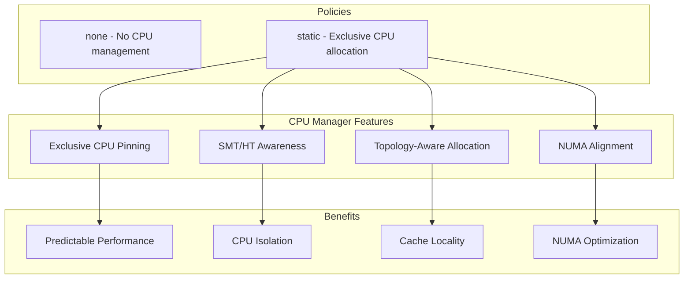
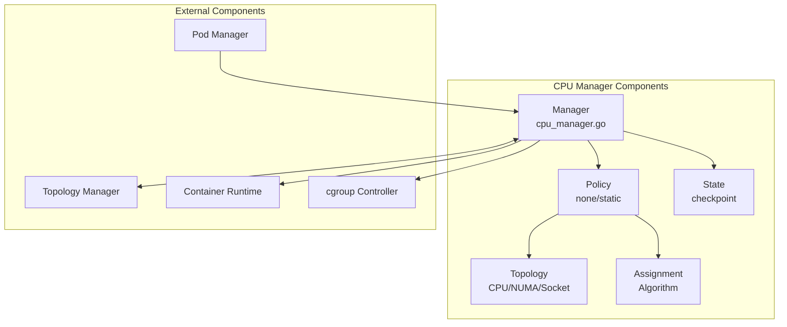
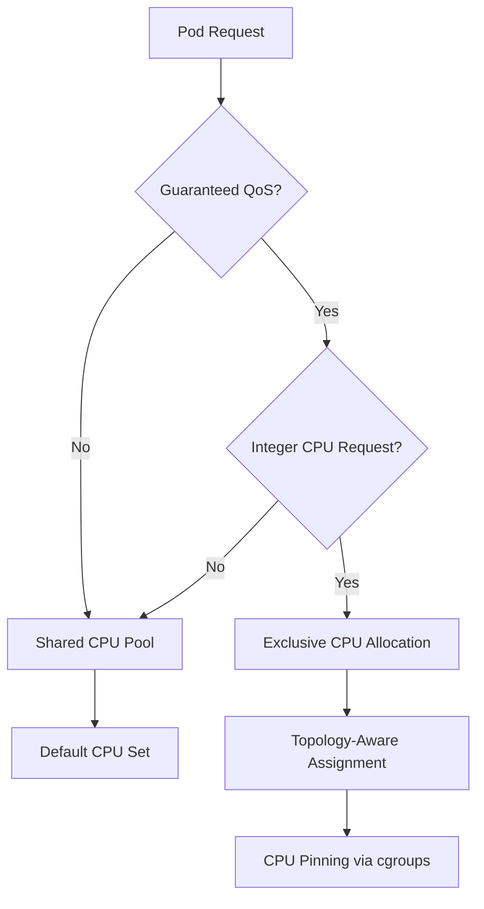
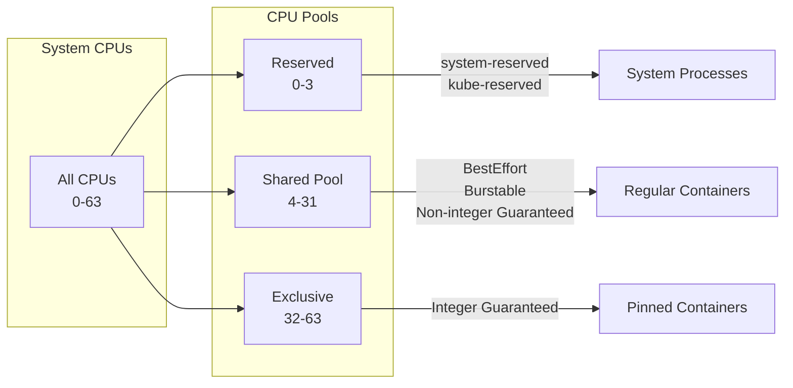
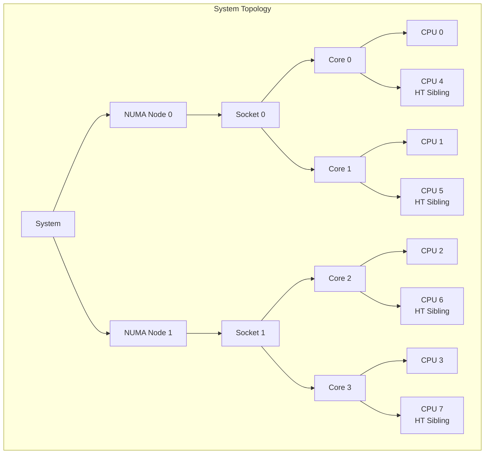
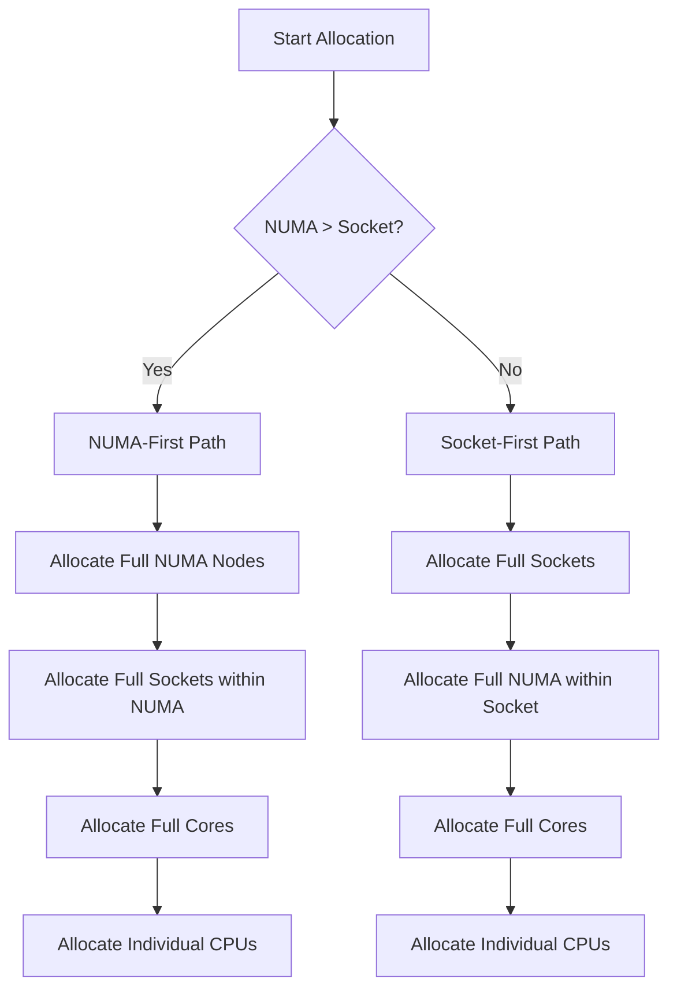
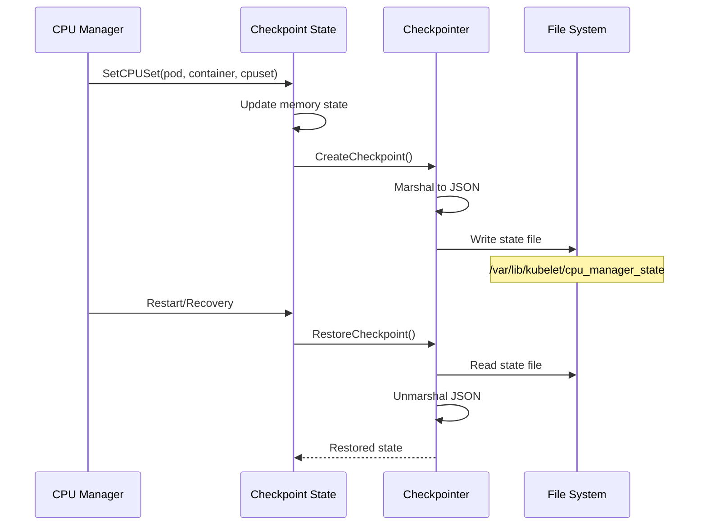
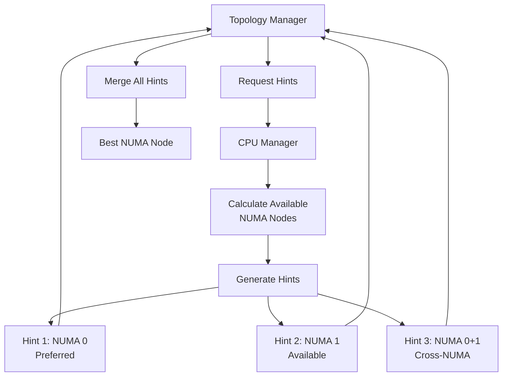
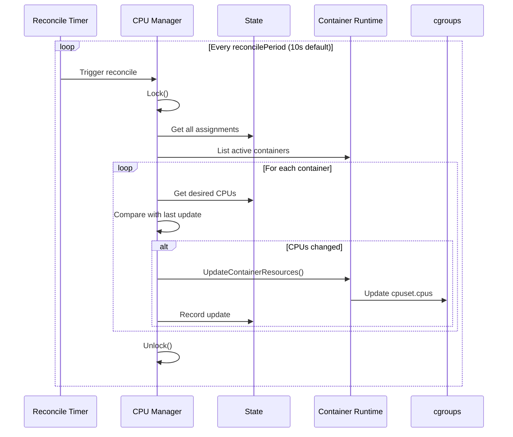

# kubelet Low-Level: CPU Manager Implementation

## Table of Contents
1. [Overview](#overview)
2. [Architecture](#architecture)
3. [CPU Policies](#cpu-policies)
4. [Static Policy Implementation](#static-policy-implementation)
5. [CPU Topology Discovery](#cpu-topology-discovery)
6. [CPU Assignment Algorithm](#cpu-assignment-algorithm)
7. [State Management](#state-management)
8. [Container CPU Updates](#container-cpu-updates)
9. [Topology Manager Integration](#topology-manager-integration)
10. [Admission and Allocation](#admission-and-allocation)
11. [Reconciliation Loop](#reconciliation-loop)
12. [Performance and Metrics](#performance-and-metrics)
13. [Troubleshooting](#troubleshooting)
14. [Best Practices](#best-practices)
15. [Summary](#summary)

## Overview

The CPU Manager is a kubelet component that enables CPU pinning for containers, providing exclusive CPU allocation for Guaranteed QoS pods with integer CPU requests. It ensures predictable performance by eliminating CPU contention and cache thrashing.

### Key Features



### Manager Interface

The CPU Manager interface (`pkg/kubelet/cm/cpumanager/cpu_manager.go:55`):

```go
type Manager interface {
    // Lifecycle management
    Start(activePods ActivePodsFunc, sourcesReady config.SourcesReady,
          podStatusProvider status.PodStatusProvider,
          containerRuntime runtimeService,
          initialContainers containermap.ContainerMap) error

    // CPU allocation
    Allocate(pod *v1.Pod, container *v1.Container) error
    AddContainer(p *v1.Pod, c *v1.Container, containerID string)
    RemoveContainer(containerID string) error

    // State access
    State() state.Reader
    GetExclusiveCPUs(podUID, containerName string) cpuset.CPUSet
    GetCPUAffinity(podUID, containerName string) cpuset.CPUSet
    GetAllocatableCPUs() cpuset.CPUSet
    GetAllCPUs() cpuset.CPUSet

    // Topology hints for NUMA alignment
    GetTopologyHints(*v1.Pod, *v1.Container) map[string][]topologymanager.TopologyHint
    GetPodTopologyHints(pod *v1.Pod) map[string][]topologymanager.TopologyHint
}
```

## Architecture

### Component Structure



### Manager Implementation

Core manager structure (`pkg/kubelet/cm/cpumanager/cpu_manager.go:102`):

```go
type manager struct {
    sync.Mutex
    policy Policy

    // Reconciliation period for CPU assignments
    reconcilePeriod time.Duration

    // CPU assignment state
    state           state.State
    lastUpdateState state.State

    // Runtime integration
    containerRuntime  runtimeService
    activePods        ActivePodsFunc
    podStatusProvider status.PodStatusProvider
    containerMap      containermap.ContainerMap

    // CPU topology information
    topology *topology.CPUTopology

    // Resource reservation
    nodeAllocatableReservation v1.ResourceList

    // State persistence
    stateFileDirectory string

    // CPU sets
    allCPUs         cpuset.CPUSet  // All CPUs in the system
    allocatableCPUs cpuset.CPUSet  // CPUs available for allocation
}
```

## CPU Policies

### Policy Types

The CPU Manager supports two policies (`pkg/kubelet/cm/cpumanager/policy.go:32`):

```go
const (
    // PolicyNone - No CPU management, containers run on shared CPU pool
    PolicyNone policyName = "none"

    // PolicyStatic - Exclusive CPU allocation for guaranteed containers
    PolicyStatic policyName = "static"
)

type Policy interface {
    Name() string
    Start(s state.State) error

    // CPU allocation/deallocation
    Allocate(s state.State, pod *v1.Pod, container *v1.Container) error
    RemoveContainer(s state.State, containerID string) error

    // Topology hints for NUMA alignment
    GetTopologyHints(s state.State, pod *v1.Pod, container *v1.Container) map[string][]topologymanager.TopologyHint
    GetPodTopologyHints(s state.State, pod *v1.Pod) map[string][]topologymanager.TopologyHint

    // Available CPUs
    GetAllocatableCPUs(s state.State) cpuset.CPUSet
    GetAvailableCPUs(s state.State) cpuset.CPUSet
}
```

### None Policy

The none policy (`pkg/kubelet/cm/cpumanager/policy_none.go:30`):

```go
type nonePolicy struct {
    options PolicyOptions
}

func (p *nonePolicy) Allocate(s state.State, pod *v1.Pod, container *v1.Container) error {
    // No CPU allocation - all containers use default CPU set
    return nil
}

func (p *nonePolicy) RemoveContainer(s state.State, containerID string) error {
    // No cleanup needed
    return nil
}
```

### Static Policy Overview



## Static Policy Implementation

### Static Policy Structure

The static policy implementation (`pkg/kubelet/cm/cpumanager/policy_static.go:106`):

```go
type staticPolicy struct {
    // CPU topology for the node
    topology *topology.CPUTopology

    // CPUs not available for exclusive assignment
    reservedCPUs cpuset.CPUSet

    // Reserved CPUs including their siblings
    reservedPhysicalCPUs cpuset.CPUSet

    // Topology manager for NUMA hints
    affinity topologymanager.Store

    // CPUs to reuse across containers in a pod
    cpusToReuse map[string]cpuset.CPUSet

    // Policy options (e.g., full-pcpus-only, distribute-cpus-across-numa)
    options StaticPolicyOptions

    // CPUs per core (for SMT/HT systems)
    cpuGroupSize int
}
```

### CPU Pools

The static policy manages four CPU pools:



### Allocation Eligibility

Determining if a container gets exclusive CPUs (`pkg/kubelet/cm/cpumanager/policy_static.go:380`):

```go
func (p *staticPolicy) podGuaranteedCPUs(pod *v1.Pod) int {
    // Only Guaranteed QoS pods eligible
    if v1qos.GetPodQOS(pod) != v1.PodQOSGuaranteed {
        return 0
    }

    cpuQuantity := resource.Quantity{}
    for _, container := range pod.Spec.InitContainers {
        if container.Resources.Requests != nil {
            if cpu, ok := container.Resources.Requests[v1.ResourceCPU]; ok {
                if cpu.MilliValue() > cpuQuantity.MilliValue() {
                    cpuQuantity = cpu
                }
            }
        }
    }

    for _, container := range pod.Spec.Containers {
        if container.Resources.Requests != nil {
            if cpu, ok := container.Resources.Requests[v1.ResourceCPU]; ok {
                cpuQuantity.Add(cpu)
            }
        }
    }

    // Must be integer CPU request
    if cpuQuantity.Value()*1000 != cpuQuantity.MilliValue() {
        return 0
    }

    return int(cpuQuantity.Value())
}
```

### Allocate Implementation

CPU allocation for containers (`pkg/kubelet/cm/cpumanager/policy_static.go:450`):

```go
func (p *staticPolicy) Allocate(s state.State, pod *v1.Pod, container *v1.Container) error {
    // Check if eligible for exclusive CPUs
    numCPUs := p.guaranteedCPUs(pod, container)
    if numCPUs == 0 {
        // Use shared pool
        s.SetDefaultCPUSet(s.GetDefaultCPUSet())
        return nil
    }

    // Check for init container CPUs to reuse
    if pod.Status.Phase == v1.PodRunning {
        if cpus, ok := p.cpusToReuse[pod.UID]; ok {
            s.SetCPUSet(pod.UID, container.Name, cpus)
            return nil
        }
    }

    // Get topology hints if available
    hint := p.getTopologyHint(pod, container)

    // Allocate CPUs
    cpuset, err := p.allocateCPUs(s, numCPUs, hint, pod.UID, container.Name)
    if err != nil {
        return err
    }

    // Update state
    s.SetCPUSet(pod.UID, container.Name, cpuset)

    // Update shared pool
    s.SetDefaultCPUSet(s.GetDefaultCPUSet().Difference(cpuset))

    return nil
}
```

## CPU Topology Discovery

### Topology Structure

CPU topology representation (`pkg/kubelet/cm/cpumanager/topology/topology.go:35`):

```go
type CPUTopology struct {
    NumCPUs      int
    NumCores     int
    NumSockets   int
    NumNUMANodes int
    CPUDetails   CPUDetails
}

type CPUInfo struct {
    CoreID       int
    SocketID     int
    NUMANodeID   int
    UncoreCacheID int
}

type CPUDetails map[int]CPUInfo

// Discovery from machine info
func Discover(machineInfo *cadvisorapi.MachineInfo) (*CPUTopology, error) {
    topology := &CPUTopology{
        NumCPUs:      machineInfo.NumCores,
        NumSockets:   machineInfo.NumSockets,
        CPUDetails:   make(CPUDetails),
    }

    // Build CPU details from cAdvisor topology
    for _, node := range machineInfo.Topology {
        for _, core := range node.Cores {
            for _, cpu := range core.Threads {
                topology.CPUDetails[cpu] = CPUInfo{
                    CoreID:     core.Id,
                    SocketID:   core.SocketID,
                    NUMANodeID: node.Id,
                }
            }
        }
    }

    return topology, nil
}
```

### Topology Relationships



## CPU Assignment Algorithm

### Assignment Strategy

CPU accumulator for topology-aware assignment (`pkg/kubelet/cm/cpumanager/cpu_assignment.go:200`):

```go
type cpuAccumulator struct {
    topo          *topology.CPUTopology
    details       topology.CPUDetails
    numCPUsNeeded int

    // Topology sorting functions
    numaOrSocketsFirst numaOrSocketsFirstFuncs

    // Available CPUs at each level
    freeCPUs           cpuset.CPUSet
    freeNUMANodes      cpuset.CPUSet
    freeSockets        cpuset.CPUSet
    freeCores          cpuset.CPUSet
}

func (a *cpuAccumulator) take(cpus cpuset.CPUSet) {
    a.result = a.result.Union(cpus)
    a.numCPUsNeeded -= cpus.Size()
}

func takeByTopology(topo *topology.CPUTopology, availableCPUs cpuset.CPUSet,
                   numCPUs int) (cpuset.CPUSet, error) {
    acc := newCPUAccumulator(topo, availableCPUs, numCPUs)

    // 1. Try to allocate whole NUMA nodes
    if acc.isSatisfied() {
        return acc.result, nil
    }
    acc.takeFullNUMANodes()

    // 2. Try to allocate whole sockets
    if acc.isSatisfied() {
        return acc.result, nil
    }
    acc.takeFullSockets()

    // 3. Try to allocate whole cores
    if acc.isSatisfied() {
        return acc.result, nil
    }
    acc.takeFullCores()

    // 4. Allocate individual CPUs
    if acc.isSatisfied() {
        return acc.result, nil
    }
    acc.takeRemainingCPUs()

    return acc.result, nil
}
```

### NUMA-First vs Socket-First



### Sorting Algorithm

Sorting available topology elements (`pkg/kubelet/cm/cpumanager/cpu_assignment.go:350`):

```go
func (a *cpuAccumulator) sort(ids []int,
                             getCPUs func(...int) cpuset.CPUSet) {
    // Sort by:
    // 1. Number of free CPUs (ascending)
    // 2. Number of total CPUs (ascending)
    // 3. Element ID (ascending)

    sort.Slice(ids, func(i, j int) bool {
        iCPUs := getCPUs(ids[i])
        jCPUs := getCPUs(ids[j])

        iFreeCPUs := a.freeCPUs.Intersection(iCPUs).Size()
        jFreeCPUs := a.freeCPUs.Intersection(jCPUs).Size()

        // Prefer element with fewer free CPUs (pack)
        if iFreeCPUs != jFreeCPUs {
            return iFreeCPUs < jFreeCPUs
        }

        // Prefer smaller element (less fragmentation)
        if iCPUs.Size() != jCPUs.Size() {
            return iCPUs.Size() < jCPUs.Size()
        }

        // Tiebreaker: lower ID
        return ids[i] < ids[j]
    })
}
```

## State Management

### State Interface

CPU Manager state (`pkg/kubelet/cm/cpumanager/state/state.go:35`):

```go
type State interface {
    Reader
    Writer
}

type Reader interface {
    GetCPUSet(podUID types.UID, containerName string) cpuset.CPUSet
    GetDefaultCPUSet() cpuset.CPUSet
    GetCPUSetOrDefault(podUID types.UID, containerName string) cpuset.CPUSet
    GetCPUAssignments() map[string]cpuset.CPUSet
}

type Writer interface {
    SetCPUSet(podUID types.UID, containerName string, cpuset cpuset.CPUSet)
    SetDefaultCPUSet(cpuset cpuset.CPUSet)
    SetCPUAssignments(map[string]cpuset.CPUSet)
    Delete(podUID types.UID, containerName string)
    ClearState()
}
```

### Checkpoint State

Persistent state storage (`pkg/kubelet/cm/cpumanager/state/state_checkpoint.go:45`):



Implementation:

```go
type stateCheckpoint struct {
    sync.RWMutex
    cache             State
    checkpointManager checkpointmanager.CheckpointManager
    checkpointName    string
    policyName        string
    containerMap      containermap.ContainerMap
}

func (sc *stateCheckpoint) SetCPUSet(podUID types.UID,
                                    containerName string,
                                    cpuset cpuset.CPUSet) {
    sc.Lock()
    defer sc.Unlock()

    // Update in-memory state
    sc.cache.SetCPUSet(podUID, containerName, cpuset)

    // Persist to checkpoint
    if err := sc.storeState(); err != nil {
        klog.ErrorS(err, "Failed to checkpoint state")
    }
}

func (sc *stateCheckpoint) storeState() error {
    checkpoint := &CPUManagerCheckpoint{
        PolicyName:      sc.policyName,
        DefaultCPUSet:   sc.cache.GetDefaultCPUSet().String(),
        Entries:         sc.cache.GetCPUAssignments(),
        Checksum:        0,
    }

    // Calculate checksum
    checkpoint.Checksum = checksum.New(checkpoint)

    return sc.checkpointManager.CreateCheckpoint(sc.checkpointName, checkpoint)
}
```

### State File Format

Example checkpoint file (`/var/lib/kubelet/cpu_manager_state`):

```json
{
  "policyName": "static",
  "defaultCpuSet": "0-3,8-31",
  "entries": {
    "pod1-uid:container1": "4-7",
    "pod2-uid:container1": "32-39",
    "pod2-uid:container2": "40-47"
  },
  "checksum": 2832948571
}
```

## Container CPU Updates

### Runtime Updates

Updating container CPU assignments (`pkg/kubelet/cm/cpumanager/cpu_manager.go:280`):

```go
func (m *manager) reconcileState() (success []reconciledContainer, failure []reconciledContainer) {
    success = []reconciledContainer{}
    failure = []reconciledContainer{}

    m.Lock()
    defer m.Unlock()

    // Get active pods and their containers
    activePods := m.activePods()

    for _, pod := range activePods {
        podStatus, ok := m.podStatusProvider.GetPodStatus(pod.UID)
        if !ok {
            continue
        }

        for _, container := range pod.Spec.Containers {
            containerID := findContainerID(&container, podStatus)
            if containerID == "" {
                continue
            }

            // Get desired CPU set
            desiredCPUs := m.state.GetCPUSetOrDefault(pod.UID, container.Name)

            // Check if update needed
            lastCPUs, ok := m.lastUpdateState.GetCPUSet(pod.UID, container.Name)
            if ok && lastCPUs.Equals(desiredCPUs) {
                continue  // No change needed
            }

            // Update container resources via CRI
            err := m.updateContainerCPUSet(containerID, desiredCPUs)
            if err != nil {
                failure = append(failure, reconciledContainer{pod.Name, container.Name, containerID})
                continue
            }

            success = append(success, reconciledContainer{pod.Name, container.Name, containerID})
            m.lastUpdateState.SetCPUSet(pod.UID, container.Name, desiredCPUs)
        }
    }

    return success, failure
}
```

### CRI Integration

Container resource update via CRI (`pkg/kubelet/cm/cpumanager/cpu_manager_linux.go:40`):

```go
func (m *manager) updateContainerCPUSet(containerID string, cpus cpuset.CPUSet) error {
    // Construct CRI update request
    req := &runtimeapi.UpdateContainerResourcesRequest{
        ContainerId: containerID,
        Linux: &runtimeapi.LinuxContainerResources{
            CpusetCpus: cpus.String(),
        },
    }

    // Call container runtime
    ctx, cancel := context.WithTimeout(context.Background(), 10*time.Second)
    defer cancel()

    return m.containerRuntime.UpdateContainerResources(ctx, containerID, req.Linux)
}
```

## Topology Manager Integration

### Topology Hints

Providing NUMA topology hints (`pkg/kubelet/cm/cpumanager/topology_hints.go:50`):



Implementation:

```go
func (p *staticPolicy) GetTopologyHints(s state.State, pod *v1.Pod,
                                       container *v1.Container) map[string][]topologymanager.TopologyHint {
    // Check if container needs exclusive CPUs
    numCPUs := p.guaranteedCPUs(pod, container)
    if numCPUs == 0 {
        return nil
    }

    // Get available CPUs
    available := p.GetAvailableCPUs(s)

    // Generate hints for each NUMA node
    var hints []topologymanager.TopologyHint
    for _, numaNode := range p.topology.CPUDetails.NUMANodes().UnsortedList() {
        numaAvailable := p.topology.CPUDetails.CPUsInNUMANodes(numaNode).Intersection(available)

        if numaAvailable.Size() >= numCPUs {
            hints = append(hints, topologymanager.TopologyHint{
                NUMANodeAffinity: bitmask.NewBitMask(numaNode),
                Preferred:        true,
            })
        }
    }

    // Cross-NUMA hint if no single node works
    if len(hints) == 0 {
        hints = append(hints, topologymanager.TopologyHint{
            NUMANodeAffinity: bitmask.NewBitMask(p.topology.CPUDetails.NUMANodes().UnsortedList()...),
            Preferred:        false,
        })
    }

    return map[string][]topologymanager.TopologyHint{
        string(v1.ResourceCPU): hints,
    }
}
```

## Admission and Allocation

### Pod Admission

CPU allocation during pod admission (`pkg/kubelet/cm/cpumanager/cpu_manager.go:320`):

```go
func (m *manager) Allocate(pod *v1.Pod, container *v1.Container) error {
    m.Lock()
    defer m.Unlock()

    // Delegate to policy
    err := m.policy.Allocate(m.state, pod, container)
    if err != nil {
        return fmt.Errorf("allocate error: %v", err)
    }

    // Update allocatable CPUs
    m.allocatableCPUs = m.policy.GetAllocatableCPUs(m.state)

    return nil
}
```

### Container Addition

Registering container after creation (`pkg/kubelet/cm/cpumanager/cpu_manager.go:340`):

```go
func (m *manager) AddContainer(pod *v1.Pod, container *v1.Container, containerID string) {
    m.Lock()
    defer m.Unlock()

    // Add to container map
    m.containerMap.Add(pod.UID, container.Name, containerID)

    // Trigger immediate reconciliation
    if m.policy.Name() != string(PolicyNone) {
        if err := m.updateContainerCPUSet(containerID,
            m.state.GetCPUSetOrDefault(pod.UID, container.Name)); err != nil {
            klog.ErrorS(err, "Failed to update container CPUs",
                       "pod", pod.Name, "container", container.Name)
        }
    }
}
```

### Container Removal

Cleanup on container termination (`pkg/kubelet/cm/cpumanager/cpu_manager.go:360`):

```go
func (m *manager) RemoveContainer(containerID string) error {
    m.Lock()
    defer m.Unlock()

    // Find pod and container name
    podUID, containerName, err := m.containerMap.GetContainerRef(containerID)
    if err != nil {
        return err
    }

    // Remove from policy
    if err := m.policy.RemoveContainer(m.state, containerID); err != nil {
        return err
    }

    // Clean up state
    m.state.Delete(podUID, containerName)
    m.lastUpdateState.Delete(podUID, containerName)
    m.containerMap.RemoveByContainerID(containerID)

    // Update allocatable CPUs
    m.allocatableCPUs = m.policy.GetAllocatableCPUs(m.state)

    return nil
}
```

## Reconciliation Loop

### Periodic Reconciliation



Implementation (`pkg/kubelet/cm/cpumanager/cpu_manager.go:250`):

```go
func (m *manager) Start(...) error {
    // ... initialization ...

    if m.policy.Name() == string(PolicyNone) {
        return nil
    }

    // Start reconciliation loop
    go wait.Until(func() {
        start := time.Now()
        success, failure := m.reconcileState()

        // Record metrics
        metrics.CPUManagerReconcileDuration.Observe(time.Since(start).Seconds())

        if len(success) > 0 {
            klog.V(4).InfoS("Reconciled container assignment",
                           "success", len(success))
        }
        if len(failure) > 0 {
            klog.ErrorS(nil, "Failed to reconcile container assignment",
                       "failure", len(failure))
        }
    }, m.reconcilePeriod, wait.NeverStop)

    return nil
}
```

## Performance and Metrics

### CPU Manager Metrics

Available metrics (`pkg/kubelet/metrics/metrics.go:500`):

```go
var (
    // CPU allocation latency
    CPUManagerAllocationDuration = metrics.NewHistogram(
        &metrics.HistogramOpts{
            Subsystem: KubeletSubsystem,
            Name:      "cpu_manager_allocation_duration_seconds",
            Help:      "Duration to allocate CPUs for a container",
            Buckets:   []float64{0.001, 0.01, 0.1, 0.5, 1.0, 2.0},
        },
    )

    // Reconciliation duration
    CPUManagerReconcileDuration = metrics.NewHistogram(
        &metrics.HistogramOpts{
            Subsystem: KubeletSubsystem,
            Name:      "cpu_manager_reconcile_duration_seconds",
            Help:      "Duration to reconcile CPU assignments",
            Buckets:   []float64{0.01, 0.05, 0.1, 0.5, 1.0, 5.0},
        },
    )

    // Pinned containers
    CPUManagerPinnedContainers = metrics.NewGauge(
        &metrics.GaugeOpts{
            Subsystem: KubeletSubsystem,
            Name:      "cpu_manager_pinned_containers",
            Help:      "Number of containers with exclusive CPU allocation",
        },
    )

    // Exclusive CPUs
    CPUManagerExclusiveCPUs = metrics.NewGauge(
        &metrics.GaugeOpts{
            Subsystem: KubeletSubsystem,
            Name:      "cpu_manager_exclusive_cpus_total",
            Help:      "Number of CPUs allocated exclusively",
        },
    )
)
```

### Performance Optimization

1. **Batch Updates**:

```go
func (m *manager) batchReconcile(containers []containerUpdate) {
    // Group by pod for efficiency
    podGroups := make(map[types.UID][]containerUpdate)
    for _, update := range containers {
        podGroups[update.podUID] = append(podGroups[update.podUID], update)
    }

    // Process pod by pod
    for podUID, updates := range podGroups {
        for _, update := range updates {
            m.updateContainerCPUSet(update.containerID, update.cpuset)
        }
    }
}
```

2. **Cache Optimization**:

```go
type cachedTopology struct {
    sync.RWMutex
    topology *topology.CPUTopology

    // Cached computations
    numaNodes    []int
    sockets      []int
    coresInNUMA  map[int][]int
    cpusInCore   map[int][]int
}
```

## Troubleshooting

### Common Issues

1. **CPU Allocation Failures**:

```bash
# Check CPU manager state
cat /var/lib/kubelet/cpu_manager_state | jq

# Verify available CPUs
kubectl describe node | grep -A 5 "Allocatable"

# Check kubelet logs
journalctl -u kubelet | grep -i "cpu.*manager"
```

2. **SMT Alignment Errors**:

```go
// Debug SMT alignment
func debugSMTAlignment(numCPUs int, cpusPerCore int) {
    if numCPUs % cpusPerCore != 0 {
        klog.ErrorS(nil, "SMT alignment error",
                   "requested", numCPUs,
                   "cpusPerCore", cpusPerCore,
                   "remainder", numCPUs % cpusPerCore)
    }
}
```

3. **State Corruption**:

```bash
# Backup and clear state
cp /var/lib/kubelet/cpu_manager_state /tmp/cpu_manager_state.backup
systemctl stop kubelet
rm /var/lib/kubelet/cpu_manager_state
systemctl start kubelet
```

### Debugging Tools

1. **CPU Assignment Viewer**:

```go
func (m *manager) debugCPUAssignments() {
    m.Lock()
    defer m.Unlock()

    fmt.Println("CPU Assignments:")
    fmt.Printf("  Default (shared): %s\n", m.state.GetDefaultCPUSet())

    for assignment, cpuset := range m.state.GetCPUAssignments() {
        parts := strings.Split(assignment, ":")
        if len(parts) == 2 {
            fmt.Printf("  Pod %s Container %s: %s\n",
                      parts[0][:8], parts[1], cpuset)
        }
    }

    fmt.Printf("  Allocatable: %s\n", m.allocatableCPUs)
    fmt.Printf("  Reserved: %s\n", m.policy.(*staticPolicy).reservedCPUs)
}
```

2. **Topology Verification**:

```bash
# Check CPU topology
lscpu --parse=CPU,CORE,SOCKET,NODE

# Verify HT/SMT
cat /sys/devices/system/cpu/cpu*/topology/thread_siblings_list

# Check NUMA topology
numactl --hardware
```

## Best Practices

### 1. Resource Planning

```yaml
# Reserve CPUs for system and kubelet
apiVersion: kubelet.config.k8s.io/v1beta1
kind: KubeletConfiguration
cpuManagerPolicy: static
systemReserved:
  cpu: "2"
kubeReserved:
  cpu: "2"
cpuManagerReconcilePeriod: "10s"
```

### 2. Pod Configuration

```yaml
# Guaranteed pod with exclusive CPUs
apiVersion: v1
kind: Pod
metadata:
  name: cpu-exclusive-pod
spec:
  containers:
  - name: app
    image: app:latest
    resources:
      requests:
        cpu: "4"       # Integer value for exclusive allocation
        memory: "8Gi"
      limits:
        cpu: "4"       # Must equal requests for Guaranteed QoS
        memory: "8Gi"
```

### 3. Policy Options

```yaml
# Static policy with options
cpuManagerPolicy: static
cpuManagerPolicyOptions:
  full-pcpus-only: "true"              # Allocate full physical CPUs
  distribute-cpus-across-numa: "true"   # Spread across NUMA nodes
  align-by-socket: "false"              # Don't force socket alignment
```

### 4. NUMA Alignment

```yaml
# Pod with topology manager alignment
apiVersion: v1
kind: Pod
metadata:
  name: numa-aligned-pod
spec:
  containers:
  - name: app
    image: app:latest
    resources:
      requests:
        cpu: "8"
        memory: "16Gi"
        nvidia.com/gpu: "1"  # Will align CPU, memory, and GPU on same NUMA
```

### 5. Monitoring

```go
// Custom monitoring for CPU manager
func monitorCPUManager(m *manager) {
    ticker := time.NewTicker(30 * time.Second)
    defer ticker.Stop()

    for range ticker.C {
        state := m.State()

        // Count exclusive allocations
        exclusive := 0
        for _, cpuset := range state.GetCPUAssignments() {
            exclusive += cpuset.Size()
        }

        // Record metrics
        metrics.CPUManagerExclusiveCPUs.Set(float64(exclusive))
        metrics.CPUManagerPinnedContainers.Set(float64(len(state.GetCPUAssignments())))

        // Check for fragmentation
        available := m.GetAllocatableCPUs()
        if available.Size() > 0 && !available.IsContiguous() {
            klog.Warning("CPU fragmentation detected", "available", available)
        }
    }
}
```

## Summary

The CPU Manager provides sophisticated CPU resource management for Kubernetes workloads:

### Key Implementation Details

- **Policies**: None (shared pool) and Static (exclusive allocation)
- **Topology-Aware**: NUMA, socket, core, and HT sibling awareness
- **State Management**: Checkpoint-based persistence with recovery
- **Runtime Integration**: CRI-based container CPU updates
- **Reconciliation**: Periodic enforcement of CPU assignments

### Architecture Highlights

- **Pluggable Policies**: Interface-based policy implementation
- **Topology Discovery**: Hardware topology from cAdvisor
- **Assignment Algorithm**: Multi-level topology-aware allocation
- **NUMA Integration**: Topology Manager hints for optimal placement

### Performance Characteristics

- **Allocation Latency**: Typically < 10ms for CPU assignment
- **Reconciliation Period**: 10s default, configurable
- **State Checkpoint**: Atomic updates with checksum validation
- **Scalability**: Supports hundreds of containers per node

### Best Practices

- Reserve adequate CPUs for system and kubelet
- Use integer CPU requests for exclusive allocation
- Enable topology manager for NUMA-aware placement
- Monitor CPU fragmentation and utilization
- Plan for SMT/HT alignment requirements

The CPU Manager is essential for latency-sensitive and performance-critical workloads requiring predictable CPU resources and NUMA optimization.