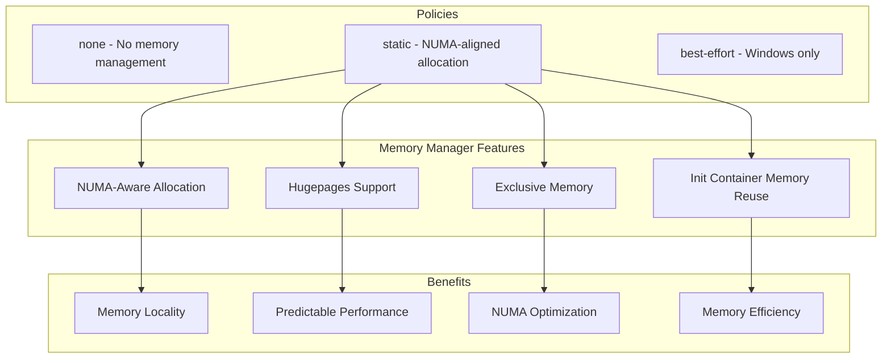
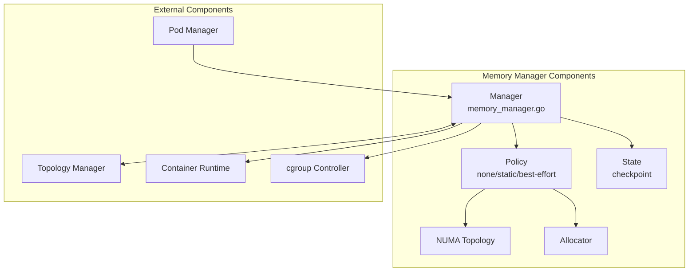
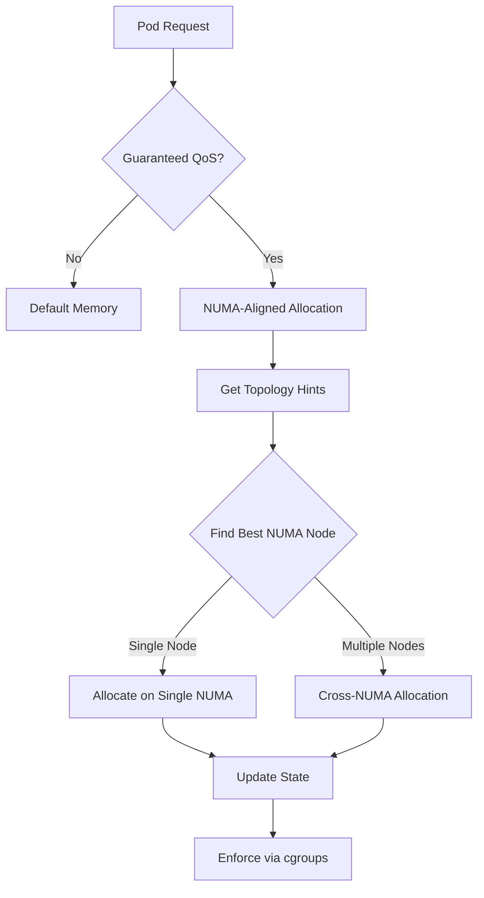
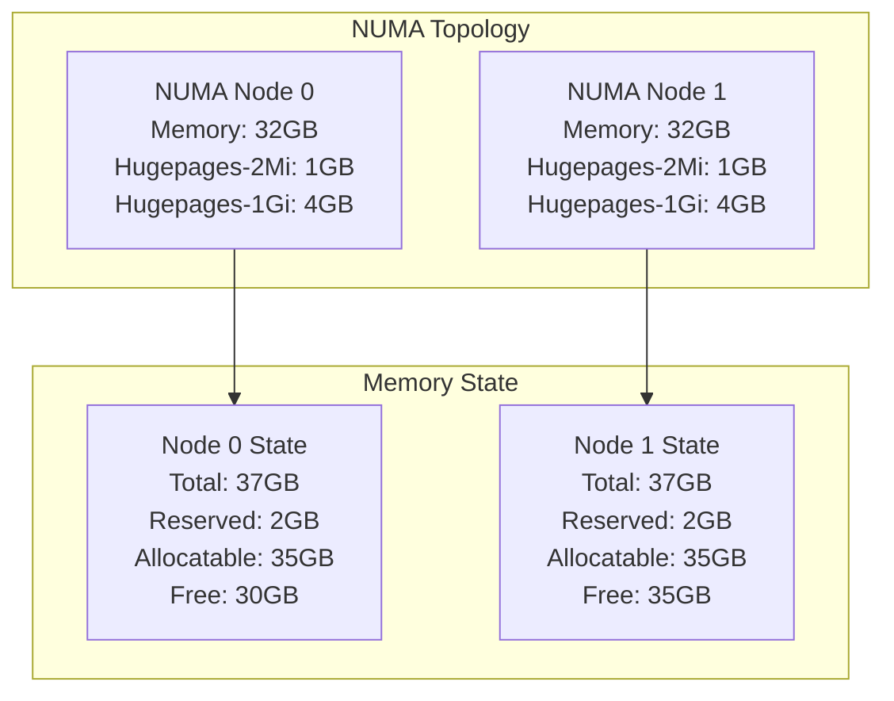
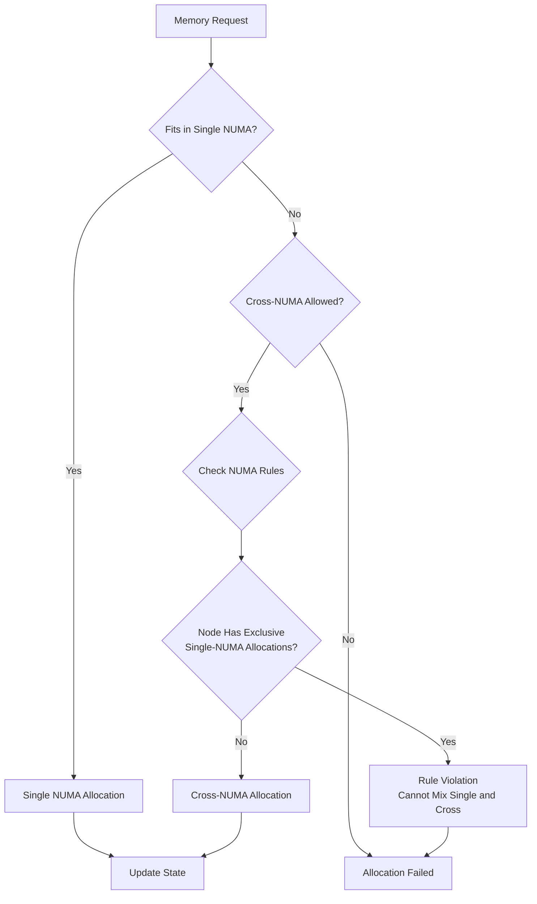
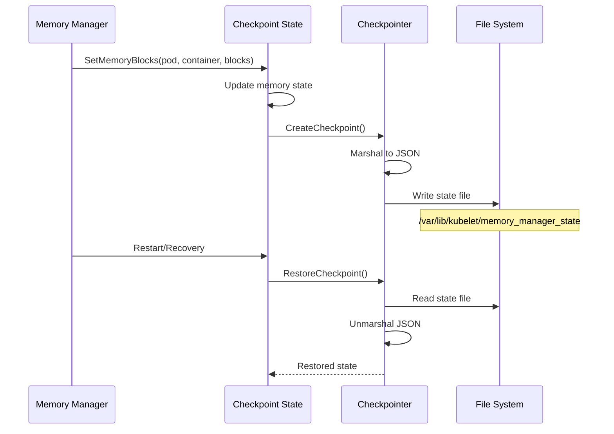
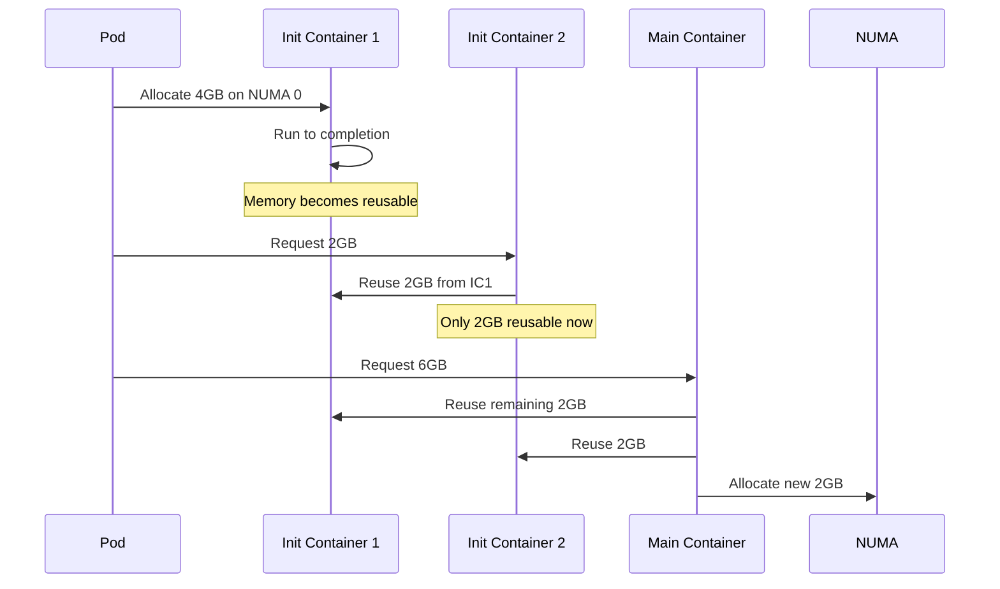
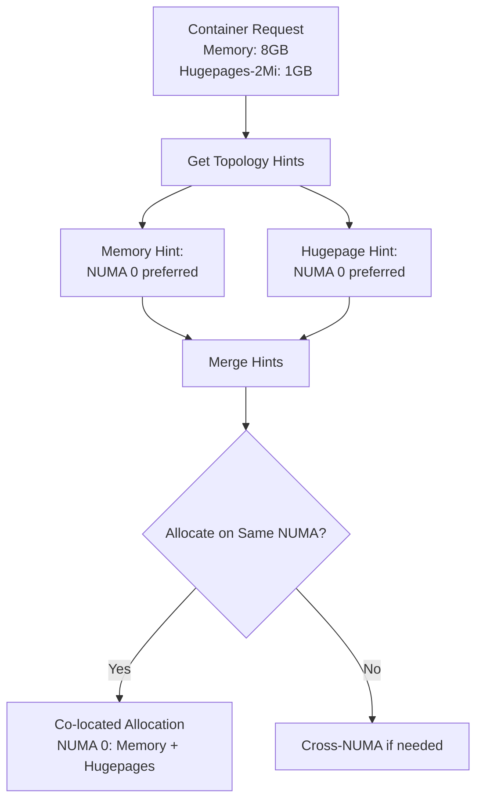
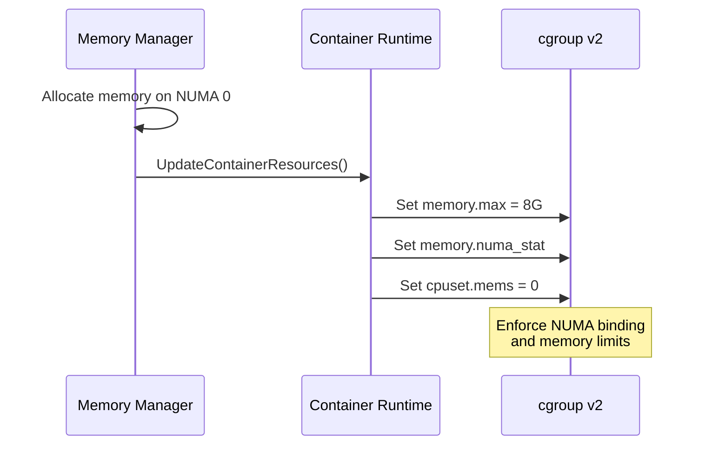

# kubelet Low-Level: Memory Manager Implementation

## Table of Contents
1. [Overview](#overview)
2. [Architecture](#architecture)
3. [Memory Policies](#memory-policies)
4. [Static Policy Implementation](#static-policy-implementation)
5. [NUMA Memory Allocation](#numa-memory-allocation)
6. [State Management](#state-management)
7. [Container Memory Assignment](#container-memory-assignment)
8. [Init Container Memory Reuse](#init-container-memory-reuse)
9. [Hugepages Support](#hugepages-support)
10. [Topology Manager Integration](#topology-manager-integration)
11. [Memory Enforcement](#memory-enforcement)
12. [Performance and Metrics](#performance-and-metrics)
13. [Troubleshooting](#troubleshooting)
14. [Best Practices](#best-practices)
15. [Summary](#summary)

## Overview

The Memory Manager is a kubelet component that provides guaranteed memory and hugepages allocation for Guaranteed QoS pods with NUMA-aware placement. It ensures optimal memory locality and prevents cross-NUMA memory access penalties.

### Key Features



### Manager Interface

The Memory Manager interface (`pkg/kubelet/cm/memorymanager/memory_manager.go:58`):

```go
type Manager interface {
    // Lifecycle management
    Start(ctx context.Context, activePods ActivePodsFunc,
          sourcesReady config.SourcesReady,
          podStatusProvider status.PodStatusProvider,
          containerRuntime runtimeService,
          initialContainers containermap.ContainerMap) error

    // Memory allocation
    Allocate(pod *v1.Pod, container *v1.Container) error
    AddContainer(ctx context.Context, p *v1.Pod, c *v1.Container, containerID string)
    RemoveContainer(ctx context.Context, containerID string) error

    // State access
    State() state.Reader
    GetMemoryNUMANodes(ctx context.Context, pod *v1.Pod, container *v1.Container) sets.Set[int]
    GetAllocatableMemory(ctx context.Context) []state.Block
    GetMemory(ctx context.Context, podUID, containerName string) []state.Block

    // Topology hints for NUMA alignment
    GetTopologyHints(*v1.Pod, *v1.Container) map[string][]topologymanager.TopologyHint
    GetPodTopologyHints(pod *v1.Pod) map[string][]topologymanager.TopologyHint
}
```

## Architecture

### Component Structure



### Manager Implementation

Core manager structure (`pkg/kubelet/cm/memorymanager/memory_manager.go:97`):

```go
type manager struct {
    sync.Mutex
    policy Policy

    // State for memory allocations
    state state.State

    // Runtime integration
    containerRuntime  runtimeService
    activePods        ActivePodsFunc
    podStatusProvider status.PodStatusProvider
    containerMap      containermap.ContainerMap

    // Configuration sources
    sourcesReady config.SourcesReady

    // State persistence
    stateFileDirectory string

    // Available memory per NUMA node
    allocatableMemory []state.Block
}
```

### Memory Resources

Supported memory resource types:

```go
// Regular memory and hugepages
const (
    ResourceMemory           = v1.ResourceMemory           // "memory"
    ResourceHugePagesPrefix  = v1.ResourceHugePagesPrefix  // "hugepages-"
    ResourceHugePages2Mi     = v1.ResourceHugePagesPrefix + "2Mi"
    ResourceHugePages1Gi     = v1.ResourceHugePagesPrefix + "1Gi"
)
```

## Memory Policies

### Policy Types

The Memory Manager supports three policies (`pkg/kubelet/cm/memorymanager/policy.go:25`):

```go
type policyType string

const (
    policyTypeNone       policyType = "None"
    PolicyTypeStatic     policyType = "Static"
    policyTypeBestEffort policyType = "BestEffort"  // Windows only
)

type Policy interface {
    Name() string
    Start(ctx context.Context, s state.State) error

    // Memory allocation/deallocation
    Allocate(ctx context.Context, s state.State, pod *v1.Pod, container *v1.Container) error
    RemoveContainer(s state.State, podUID string, containerName string)

    // Topology hints for NUMA alignment
    GetTopologyHints(ctx context.Context, s state.State, pod *v1.Pod, container *v1.Container) map[string][]topologymanager.TopologyHint
    GetPodTopologyHints(ctx context.Context, s state.State, pod *v1.Pod) map[string][]topologymanager.TopologyHint

    // Available memory
    GetAllocatableMemory(ctx context.Context, s state.State) []state.Block
    GetMemory(podUID, containerName string) []state.Block
}
```

### None Policy

The none policy (`pkg/kubelet/cm/memorymanager/policy_none.go:30`):

```go
type nonePolicy struct{}

func (p *nonePolicy) Allocate(ctx context.Context, s state.State, pod *v1.Pod, container *v1.Container) error {
    // No memory management - containers use default memory
    return nil
}

func (p *nonePolicy) GetTopologyHints(ctx context.Context, s state.State, pod *v1.Pod, container *v1.Container) map[string][]topologymanager.TopologyHint {
    // No topology hints
    return nil
}
```

### Static Policy Overview



## Static Policy Implementation

### Static Policy Structure

The static policy implementation (`pkg/kubelet/cm/memorymanager/policy_static.go:47`):

```go
type staticPolicy struct {
    // Machine memory information
    machineInfo *cadvisorapi.MachineInfo

    // Reserved memory per NUMA node
    systemReserved systemReservedMemory

    // Topology manager for NUMA hints
    affinity topologymanager.Store

    // Reusable memory from init containers
    initContainersReusableMemory reusableMemory
}

type systemReservedMemory map[int]map[v1.ResourceName]uint64

type reusableMemory map[string]map[string]map[v1.ResourceName]uint64
```

### Allocation Eligibility

Only Guaranteed pods get NUMA-aligned memory (`pkg/kubelet/cm/memorymanager/policy_static.go:101`):

```go
func (p *staticPolicy) Allocate(ctx context.Context, s state.State, pod *v1.Pod, container *v1.Container) error {
    // Only allocate for guaranteed pods
    qos := v1qos.GetPodQOS(pod)
    if qos != v1.PodQOSGuaranteed {
        logger.V(5).Info("Exclusive memory allocation skipped, pod QoS is not guaranteed", "qos", qos)
        return nil
    }

    // Check if already allocated
    if blocks := s.GetMemoryBlocks(string(pod.UID), container.Name); blocks != nil {
        p.updatePodReusableMemory(pod, container, blocks)
        logger.Info("Container already present in state, skipping")
        return nil
    }

    // Get topology hint from topology manager
    hint := p.affinity.GetAffinity(string(pod.UID), container.Name)

    // Calculate requested resources
    requestedResources, err := getRequestedResources(pod, container)
    if err != nil {
        return err
    }

    // Allocate memory according to hint
    return p.allocateMemoryBlocks(ctx, s, pod, container, requestedResources, hint)
}
```

### Memory Block Allocation

Creating memory blocks for containers (`pkg/kubelet/cm/memorymanager/policy_static.go:178`):

```go
func (p *staticPolicy) allocateMemoryBlocks(ctx context.Context, s state.State,
    pod *v1.Pod, container *v1.Container,
    requestedResources map[v1.ResourceName]uint64,
    hint topologymanager.TopologyHint) error {

    var containerBlocks []state.Block
    maskBits := hint.NUMANodeAffinity.GetBits()

    for resourceName, requestedSize := range requestedResources {
        // Check for reusable memory from init containers
        podReusableMemory := p.getPodReusableMemory(pod, hint.NUMANodeAffinity, resourceName)

        if podReusableMemory >= requestedSize {
            requestedSize = 0  // Fully satisfied by reusable memory
        } else {
            requestedSize -= podReusableMemory  // Partially satisfied
        }

        // Create memory block
        containerBlocks = append(containerBlocks, state.Block{
            NUMAAffinity: maskBits,
            Size:         requestedSize,
            Type:         resourceName,
        })

        // Update machine state
        p.updateMachineState(s.GetMachineState(), maskBits, resourceName, requestedSize)
    }

    // Update container state
    s.SetMemoryBlocks(string(pod.UID), container.Name, containerBlocks)

    // Update reusable memory tracking
    p.updatePodReusableMemory(pod, container, containerBlocks)

    return nil
}
```

## NUMA Memory Allocation

### NUMA Topology Discovery

Reading NUMA topology from machine info (`pkg/kubelet/cm/memorymanager/policy_static.go:250`):



Implementation:

```go
func (p *staticPolicy) getMachineNUMANodes(machineInfo *cadvisorapi.MachineInfo) []int {
    var numaNodes []int
    for _, node := range machineInfo.Topology {
        numaNodes = append(numaNodes, node.Id)
    }
    sort.Ints(numaNodes)
    return numaNodes
}

func (p *staticPolicy) getNUMANodeMemory(machineInfo *cadvisorapi.MachineInfo, nodeID int) map[v1.ResourceName]uint64 {
    memory := make(map[v1.ResourceName]uint64)

    for _, node := range machineInfo.Topology {
        if node.Id != nodeID {
            continue
        }

        // Regular memory
        memory[v1.ResourceMemory] = node.Memory

        // Hugepages
        for _, hugepage := range node.HugePages {
            resourceName := v1.ResourceName(fmt.Sprintf("%s%s", v1.ResourceHugePagesPrefix, hugepage.PageSize))
            memory[resourceName] = hugepage.NumPages * hugepage.PageSize.Value()
        }
    }

    return memory
}
```

### NUMA Allocation Rules

Single vs Cross-NUMA allocation rules:



Implementation (`pkg/kubelet/cm/memorymanager/policy_static.go:450`):

```go
func isAffinityViolatingNUMAAllocations(machineState state.NUMANodeMap, affinity bitmask.BitMask) bool {
    numaNodes := affinity.GetBits()

    // Single NUMA allocation is always allowed
    if len(numaNodes) == 1 {
        return false
    }

    // Check if any node has single-NUMA allocations
    for _, nodeID := range numaNodes {
        nodeState := machineState[nodeID]

        // Node has assignments and cells length is 1 (single-NUMA)
        if nodeState.NumberOfAssignments > 0 && len(nodeState.Cells) == 1 {
            // Violation: mixing single and cross-NUMA
            return true
        }
    }

    return false
}
```

## State Management

### State Interface

Memory Manager state (`pkg/kubelet/cm/memorymanager/state/state.go:127`):

```go
type State interface {
    Reader
    writer
}

type Reader interface {
    // Machine state per NUMA node
    GetMachineState() NUMANodeMap

    // Container memory blocks
    GetMemoryBlocks(podUID string, containerName string) []Block

    // All memory assignments
    GetMemoryAssignments() ContainerMemoryAssignments
}

type writer interface {
    // Update machine state
    SetMachineState(memoryMap NUMANodeMap)

    // Update container assignments
    SetMemoryBlocks(podUID string, containerName string, blocks []Block)
    SetMemoryAssignments(assignments ContainerMemoryAssignments)

    // Cleanup
    Delete(podUID string, containerName string)
    ClearState()
}
```

### State Data Structures

Memory state representation (`pkg/kubelet/cm/memorymanager/state/state.go:23`):

```go
// Memory information per resource type
type MemoryTable struct {
    TotalMemSize   uint64 `json:"total"`
    SystemReserved uint64 `json:"systemReserved"`
    Allocatable    uint64 `json:"allocatable"`
    Reserved       uint64 `json:"reserved"`
    Free           uint64 `json:"free"`
}

// NUMA node state
type NUMANodeState struct {
    // Number of container assignments
    NumberOfAssignments int `json:"numberOfAssignments"`

    // Memory state per resource type
    MemoryMap map[v1.ResourceName]*MemoryTable `json:"memoryMap"`

    // NUMA cells for cross-NUMA allocations
    Cells []int `json:"cells"`
}

// Memory block assignment
type Block struct {
    NUMAAffinity []int           `json:"numaAffinity"`
    Type         v1.ResourceName `json:"type"`
    Size         uint64          `json:"size"`
}

// Container assignments: pod -> container -> blocks
type ContainerMemoryAssignments map[string]map[string][]Block
```

### Checkpoint State

Persistent state storage (`pkg/kubelet/cm/memorymanager/state/state_checkpoint.go:45`):



Implementation:

```go
type stateCheckpoint struct {
    sync.RWMutex
    cache      state.State
    policyName string
    checkpointManager checkpointmanager.CheckpointManager
    checkpointName    string
}

func (sc *stateCheckpoint) SetMemoryBlocks(podUID string, containerName string, blocks []Block) {
    sc.Lock()
    defer sc.Unlock()

    // Update in-memory state
    sc.cache.SetMemoryBlocks(podUID, containerName, blocks)

    // Persist to checkpoint
    if err := sc.storeState(); err != nil {
        klog.ErrorS(err, "Failed to checkpoint memory state")
    }
}

func (sc *stateCheckpoint) storeState() error {
    checkpoint := &MemoryManagerCheckpoint{
        PolicyName:    sc.policyName,
        MachineState:  sc.cache.GetMachineState(),
        MemoryAssignments: sc.cache.GetMemoryAssignments(),
        Checksum:      0,
    }

    // Calculate checksum
    checkpoint.Checksum = checksum.New(checkpoint)

    return sc.checkpointManager.CreateCheckpoint(sc.checkpointName, checkpoint)
}
```

## Container Memory Assignment

### Add Container

Managing container memory lifecycle (`pkg/kubelet/cm/memorymanager/memory_manager.go:214`):

```go
func (m *manager) AddContainer(ctx context.Context, pod *v1.Pod, container *v1.Container, containerID string) {
    m.Lock()
    defer m.Unlock()

    // Track container
    m.containerMap.Add(string(pod.UID), container.Name, containerID)

    // Clean up completed init containers to free memory
    for _, initContainer := range pod.Spec.InitContainers {
        if initContainer.Name == container.Name {
            break  // Don't remove current container
        }

        // Skip restartable init containers (they run for pod lifetime)
        if podutil.IsRestartableInitContainer(&initContainer) {
            continue
        }

        // Remove completed init container
        m.policyRemoveContainerByRef(string(pod.UID), initContainer.Name)
    }
}
```

### Remove Container

Cleaning up memory on container termination (`pkg/kubelet/cm/memorymanager/memory_manager.go:270`):

```go
func (m *manager) RemoveContainer(ctx context.Context, containerID string) error {
    m.Lock()
    defer m.Unlock()

    // Find pod and container
    podUID, containerName, err := m.containerMap.GetContainerRef(containerID)
    if err != nil {
        return err
    }

    // Remove from policy
    m.policy.RemoveContainer(m.state, podUID, containerName)

    // Clean up state
    m.state.Delete(podUID, containerName)

    // Remove from container map
    m.containerMap.RemoveByContainerID(containerID)

    // Update allocatable memory
    m.allocatableMemory = m.policy.GetAllocatableMemory(ctx, m.state)

    return nil
}
```

## Init Container Memory Reuse

### Memory Reuse Mechanism

Reusing memory from completed init containers:



Implementation (`pkg/kubelet/cm/memorymanager/policy_static.go:300`):

```go
func (p *staticPolicy) updatePodReusableMemory(pod *v1.Pod, container *v1.Container, blocks []Block) {
    // Only track non-restartable init containers
    if !isInitContainer(pod, container) {
        return
    }

    if podutil.IsRestartableInitContainer(container) {
        return  // Restartable init containers don't release memory
    }

    podUID := string(pod.UID)
    if _, ok := p.initContainersReusableMemory[podUID]; !ok {
        p.initContainersReusableMemory[podUID] = make(map[string]map[v1.ResourceName]uint64)
    }

    p.initContainersReusableMemory[podUID][container.Name] = make(map[v1.ResourceName]uint64)

    for _, block := range blocks {
        p.initContainersReusableMemory[podUID][container.Name][block.Type] = block.Size
    }
}

func (p *staticPolicy) getPodReusableMemory(pod *v1.Pod, affinity bitmask.BitMask, resourceType v1.ResourceName) uint64 {
    podUID := string(pod.UID)
    podMemory, ok := p.initContainersReusableMemory[podUID]
    if !ok {
        return 0
    }

    var reusable uint64
    for _, containerMemory := range podMemory {
        if memory, ok := containerMemory[resourceType]; ok {
            reusable += memory
        }
    }

    return reusable
}
```

## Hugepages Support

### Hugepage Allocation

Managing hugepage memory (`pkg/kubelet/cm/memorymanager/policy_static.go:400`):

```yaml
# Pod requesting hugepages
apiVersion: v1
kind: Pod
spec:
  containers:
  - name: app
    resources:
      requests:
        memory: "8Gi"
        hugepages-2Mi: "1Gi"
        hugepages-1Gi: "2Gi"
      limits:
        memory: "8Gi"
        hugepages-2Mi: "1Gi"
        hugepages-1Gi: "2Gi"
```

Allocation logic:

```go
func getRequestedResources(pod *v1.Pod, container *v1.Container) (map[v1.ResourceName]uint64, error) {
    requested := make(map[v1.ResourceName]uint64)

    // Regular memory
    if memory, ok := container.Resources.Requests[v1.ResourceMemory]; ok {
        requested[v1.ResourceMemory] = uint64(memory.Value())
    }

    // Hugepages
    for resourceName, quantity := range container.Resources.Requests {
        if strings.HasPrefix(string(resourceName), string(v1.ResourceHugePagesPrefix)) {
            requested[resourceName] = uint64(quantity.Value())
        }
    }

    return requested, nil
}
```

### Hugepage NUMA Alignment

Ensuring hugepages and memory are co-located:



## Topology Manager Integration

### Providing Topology Hints

Memory hints for topology manager (`pkg/kubelet/cm/memorymanager/topology_hints.go:50`):

```go
func (p *staticPolicy) GetTopologyHints(ctx context.Context, s state.State,
    pod *v1.Pod, container *v1.Container) map[string][]topologymanager.TopologyHint {

    // Only for guaranteed pods
    if v1qos.GetPodQOS(pod) != v1.PodQOSGuaranteed {
        return nil
    }

    requestedResources, err := getRequestedResources(pod, container)
    if err != nil {
        return nil
    }

    machineState := s.GetMachineState()
    hints := map[string][]topologymanager.TopologyHint{}

    // Generate hints for each resource type
    for resourceType, requestedSize := range requestedResources {
        resourceHints := p.generateResourceHints(machineState, resourceType, requestedSize)
        hints[string(resourceType)] = resourceHints
    }

    return hints
}

func (p *staticPolicy) generateResourceHints(machineState state.NUMANodeMap,
    resourceType v1.ResourceName, requestedSize uint64) []topologymanager.TopologyHint {

    var hints []topologymanager.TopologyHint

    // Try single NUMA nodes first
    for nodeID, nodeState := range machineState {
        if nodeState.MemoryMap[resourceType].Free >= requestedSize {
            hints = append(hints, topologymanager.TopologyHint{
                NUMANodeAffinity: bitmask.NewBitMask(nodeID),
                Preferred:        true,
            })
        }
    }

    // If no single node works, try combinations
    if len(hints) == 0 {
        hints = p.generateCrossNUMAHints(machineState, resourceType, requestedSize)
    }

    return hints
}
```

### Hint Extension

Extending topology manager hints when needed (`pkg/kubelet/cm/memorymanager/policy_static.go:158`):

```go
func (p *staticPolicy) extendTopologyManagerHint(machineState state.NUMANodeMap,
    pod *v1.Pod, requestedResources map[v1.ResourceName]uint64,
    hint bitmask.BitMask) (*topologymanager.TopologyHint, error) {

    // Check which resources are not satisfied
    unsatisfied := make(map[v1.ResourceName]uint64)
    for resourceType, requested := range requestedResources {
        available := p.getAvailableMemory(machineState, hint, resourceType)
        if available < requested {
            unsatisfied[resourceType] = requested - available
        }
    }

    // Find additional NUMA nodes
    extendedMask := hint.Clone()
    for nodeID, nodeState := range machineState {
        if hint.IsSet(nodeID) {
            continue  // Already included
        }

        needed := false
        for resourceType, shortage := range unsatisfied {
            if nodeState.MemoryMap[resourceType].Free >= shortage {
                needed = true
                unsatisfied[resourceType] = 0
            }
        }

        if needed {
            extendedMask.Add(nodeID)
        }
    }

    return &topologymanager.TopologyHint{
        NUMANodeAffinity: extendedMask,
        Preferred:        false,  // Extended hints are not preferred
    }, nil
}
```

## Memory Enforcement

### cgroup Integration

Enforcing memory limits via cgroups:



Container resource update (`pkg/kubelet/cm/memorymanager/memory_manager_linux.go:40`):

```go
func (m *manager) updateContainerResources(containerID string, numaNodes sets.Set[int]) error {
    // Convert NUMA nodes to cpuset.mems format
    mems := numaNodes.List()
    memsString := strings.Join(intSliceToStringSlice(mems), ",")

    // Update via CRI
    req := &runtimeapi.UpdateContainerResourcesRequest{
        ContainerId: containerID,
        Linux: &runtimeapi.LinuxContainerResources{
            CpusetMems: memsString,
        },
    }

    ctx, cancel := context.WithTimeout(context.Background(), 10*time.Second)
    defer cancel()

    return m.containerRuntime.UpdateContainerResources(ctx, containerID, req.Linux)
}
```

## Performance and Metrics

### Memory Manager Metrics

Available metrics (`pkg/kubelet/metrics/metrics.go:550`):

```go
var (
    // Memory allocation requests
    MemoryManagerPinningRequestTotal = metrics.NewCounter(
        &metrics.CounterOpts{
            Subsystem: KubeletSubsystem,
            Name:      "memory_manager_pinning_requests_total",
            Help:      "Number of memory pinning requests",
        },
    )

    // Memory allocation errors
    MemoryManagerPinningErrorsTotal = metrics.NewCounter(
        &metrics.CounterOpts{
            Subsystem: KubeletSubsystem,
            Name:      "memory_manager_pinning_errors_total",
            Help:      "Number of memory pinning errors",
        },
    )

    // NUMA memory usage
    MemoryManagerNUMAUsage = metrics.NewGaugeVec(
        &metrics.GaugeOpts{
            Subsystem: KubeletSubsystem,
            Name:      "memory_manager_numa_memory_bytes",
            Help:      "Memory usage per NUMA node",
        },
        []string{"numa_node", "resource_type", "state"},
    )
)
```

### Performance Optimization

1. **Init Container Memory Reuse**:

```go
func (p *staticPolicy) optimizeMemoryReuse(pod *v1.Pod) {
    // Track maximum init container memory for reuse
    maxInitMemory := make(map[v1.ResourceName]uint64)

    for _, initContainer := range pod.Spec.InitContainers {
        if podutil.IsRestartableInitContainer(&initContainer) {
            continue  // Not reusable
        }

        for resourceType, quantity := range initContainer.Resources.Requests {
            current := uint64(quantity.Value())
            if current > maxInitMemory[resourceType] {
                maxInitMemory[resourceType] = current
            }
        }
    }

    // This memory can be reused by main containers
    p.maxReusableMemory[string(pod.UID)] = maxInitMemory
}
```

2. **NUMA Locality Optimization**:

```go
func (p *staticPolicy) optimizeNUMALocality(hints []topologymanager.TopologyHint) []topologymanager.TopologyHint {
    // Sort hints by NUMA locality preference
    sort.Slice(hints, func(i, j int) bool {
        // Prefer single NUMA
        iNodes := hints[i].NUMANodeAffinity.Count()
        jNodes := hints[j].NUMANodeAffinity.Count()

        if iNodes != jNodes {
            return iNodes < jNodes
        }

        // Prefer lower NUMA IDs for tie-breaking
        return hints[i].NUMANodeAffinity.GetBits()[0] < hints[j].NUMANodeAffinity.GetBits()[0]
    })

    return hints
}
```

## Troubleshooting

### Common Issues

1. **Memory Allocation Failures**:

```bash
# Check memory manager state
cat /var/lib/kubelet/memory_manager_state | jq

# Verify NUMA memory availability
numactl --hardware

# Check kubelet logs
journalctl -u kubelet | grep -i "memory.*manager"
```

2. **NUMA Rule Violations**:

```go
// Debug NUMA allocation rules
func debugNUMAViolation(machineState state.NUMANodeMap, affinity bitmask.BitMask) {
    logger := klog.TODO()

    for _, nodeID := range affinity.GetBits() {
        nodeState := machineState[nodeID]
        logger.Info("NUMA node state",
            "node", nodeID,
            "assignments", nodeState.NumberOfAssignments,
            "cells", nodeState.Cells)

        if len(nodeState.Cells) == 1 && affinity.Count() > 1 {
            logger.Error(nil, "NUMA rule violation: mixing single and cross-NUMA",
                "node", nodeID)
        }
    }
}
```

3. **Init Container Memory Not Reused**:

```bash
# Check pod status for init containers
kubectl describe pod <pod-name>

# Verify init container completion
kubectl get pod <pod-name> -o jsonpath='{.status.initContainerStatuses}'

# Check memory manager state for reusable memory
kubectl exec -n kube-system <kubelet-pod> -- cat /var/lib/kubelet/memory_manager_state | jq '.initContainersReusableMemory'
```

### Debugging Tools

1. **Memory State Inspector**:

```go
func (m *manager) debugMemoryState() {
    m.Lock()
    defer m.Unlock()

    fmt.Println("Memory Manager State:")

    // Machine state
    machineState := m.state.GetMachineState()
    for nodeID, nodeState := range machineState {
        fmt.Printf("  NUMA Node %d:\n", nodeID)
        for resourceType, memTable := range nodeState.MemoryMap {
            fmt.Printf("    %s: Total=%d, Free=%d, Reserved=%d\n",
                resourceType, memTable.TotalMemSize, memTable.Free, memTable.Reserved)
        }
    }

    // Container assignments
    assignments := m.state.GetMemoryAssignments()
    fmt.Println("  Container Assignments:")
    for podUID, containers := range assignments {
        for containerName, blocks := range containers {
            fmt.Printf("    Pod %s Container %s:\n", podUID[:8], containerName)
            for _, block := range blocks {
                fmt.Printf("      %s: %d bytes on NUMA %v\n",
                    block.Type, block.Size, block.NUMAAffinity)
            }
        }
    }
}
```

2. **NUMA Memory Monitor**:

```bash
#!/bin/bash
# Monitor NUMA memory usage

while true; do
    echo "=== NUMA Memory Status ==="
    numastat -m

    echo "=== Container NUMA Bindings ==="
    for cgroup in /sys/fs/cgroup/*/kubepods*; do
        if [ -f "$cgroup/cpuset.mems" ]; then
            echo "$(basename $cgroup): $(cat $cgroup/cpuset.mems)"
        fi
    done

    sleep 5
done
```

## Best Practices

### 1. System Configuration

```yaml
# Reserve memory for system and kubelet
apiVersion: kubelet.config.k8s.io/v1beta1
kind: KubeletConfiguration
memoryManagerPolicy: static
systemReserved:
  memory: "2Gi"
kubeReserved:
  memory: "2Gi"
reservedMemory:
- numaNode: 0
  limits:
    memory: "1Gi"
    hugepages-2Mi: "128Mi"
```

### 2. Pod Configuration

```yaml
# Guaranteed pod with NUMA-aligned memory
apiVersion: v1
kind: Pod
metadata:
  name: memory-guaranteed-pod
spec:
  containers:
  - name: app
    image: app:latest
    resources:
      requests:
        cpu: "4"
        memory: "8Gi"
        hugepages-2Mi: "1Gi"
      limits:
        cpu: "4"
        memory: "8Gi"
        hugepages-2Mi: "1Gi"
```

### 3. Init Container Optimization

```yaml
# Optimize init container memory reuse
apiVersion: v1
kind: Pod
spec:
  initContainers:
  - name: init-db
    image: init:latest
    resources:
      requests:
        memory: "4Gi"  # This memory can be reused
  containers:
  - name: app
    image: app:latest
    resources:
      requests:
        memory: "4Gi"  # Will reuse init container memory
```

### 4. NUMA Alignment with CPU Manager

```yaml
# Co-locate CPU and memory on same NUMA
apiVersion: v1
kind: Pod
spec:
  containers:
  - name: app
    resources:
      requests:
        cpu: "8"      # Will be pinned by CPU manager
        memory: "16Gi"  # Will be allocated on same NUMA
      limits:
        cpu: "8"
        memory: "16Gi"
```

### 5. Monitoring

```go
// Monitor memory fragmentation
func monitorMemoryFragmentation(m *manager) {
    ticker := time.NewTicker(30 * time.Second)
    defer ticker.Stop()

    for range ticker.C {
        state := m.State()
        machineState := state.GetMachineState()

        for nodeID, nodeState := range machineState {
            for resourceType, memTable := range nodeState.MemoryMap {
                fragmentation := float64(memTable.Reserved) / float64(memTable.Allocatable)

                metrics.MemoryManagerFragmentation.WithLabelValues(
                    fmt.Sprintf("%d", nodeID),
                    string(resourceType),
                ).Set(fragmentation)

                if fragmentation > 0.8 {
                    klog.Warning("High memory fragmentation",
                        "node", nodeID,
                        "resource", resourceType,
                        "fragmentation", fragmentation)
                }
            }
        }
    }
}
```

## Summary

The Memory Manager provides sophisticated NUMA-aware memory management for Kubernetes workloads:

### Key Implementation Details

- **Policies**: None (no management), Static (NUMA-aligned), BestEffort (Windows)
- **NUMA Awareness**: Single-node preference with cross-NUMA fallback
- **State Management**: Checkpoint-based persistence with recovery
- **Init Container Reuse**: Memory recycling from completed init containers
- **Hugepages**: Full support with NUMA alignment

### Architecture Highlights

- **Topology Integration**: Provides hints for optimal NUMA placement
- **Allocation Rules**: Prevents mixing single and cross-NUMA allocations
- **Resource Types**: Regular memory and multiple hugepage sizes
- **cgroup Enforcement**: NUMA binding via cpuset.mems

### Performance Characteristics

- **Memory Locality**: Reduced memory access latency
- **Init Container Efficiency**: Memory reuse reduces allocation overhead
- **NUMA Optimization**: Co-location with CPU and devices
- **Fragmentation Management**: Tracking and prevention

### Best Practices

- Reserve adequate memory for system and kubelet
- Use Guaranteed QoS for NUMA alignment
- Optimize init container memory reuse
- Co-locate with CPU Manager for full NUMA optimization
- Monitor memory fragmentation and availability

The Memory Manager is essential for memory-intensive workloads requiring predictable performance and NUMA optimization.