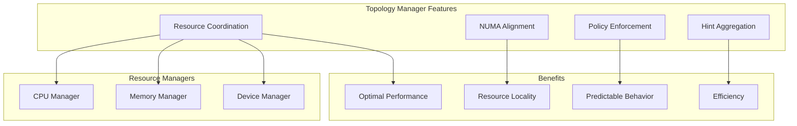
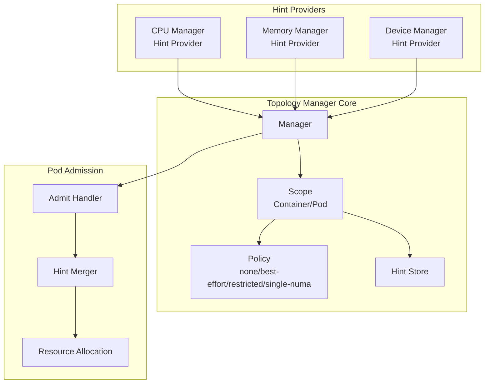
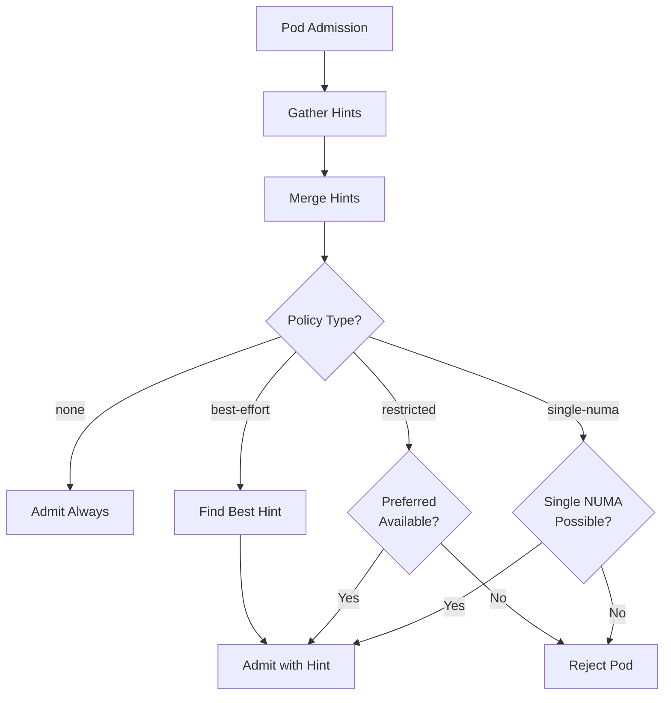
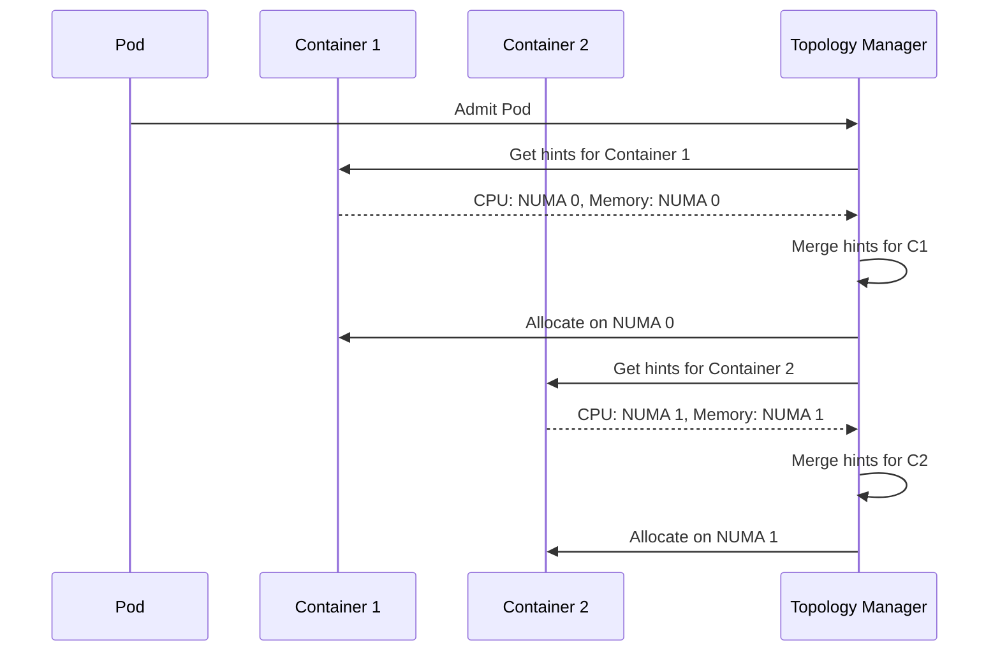
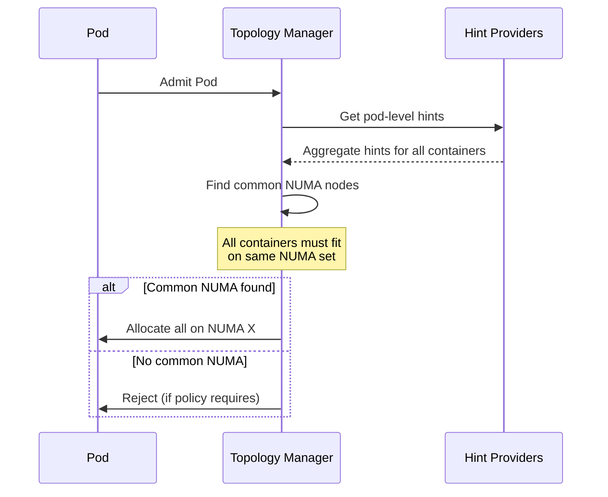
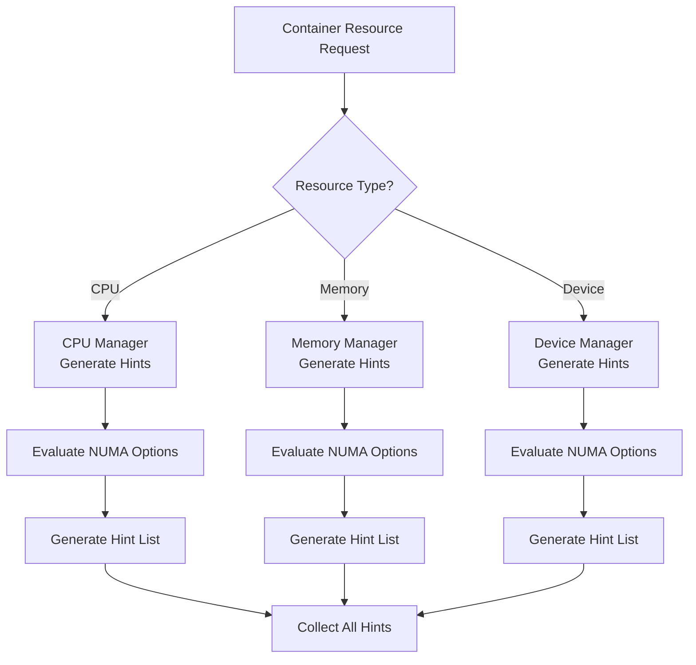
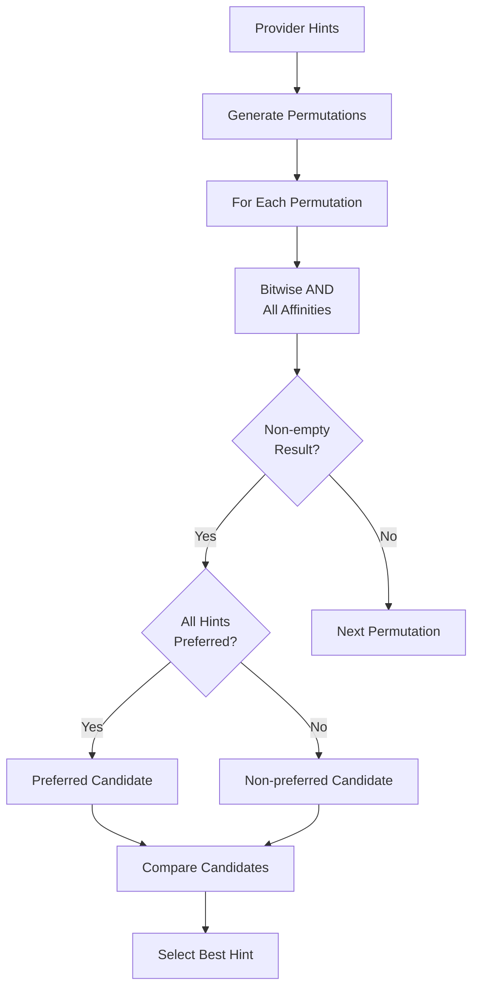
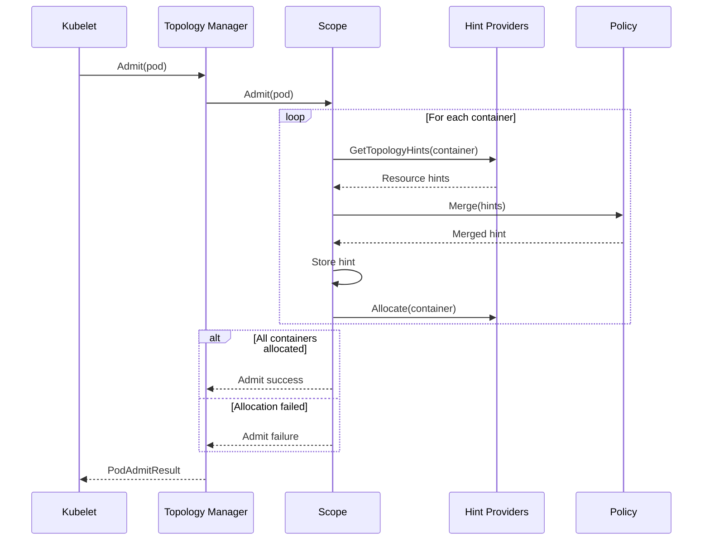
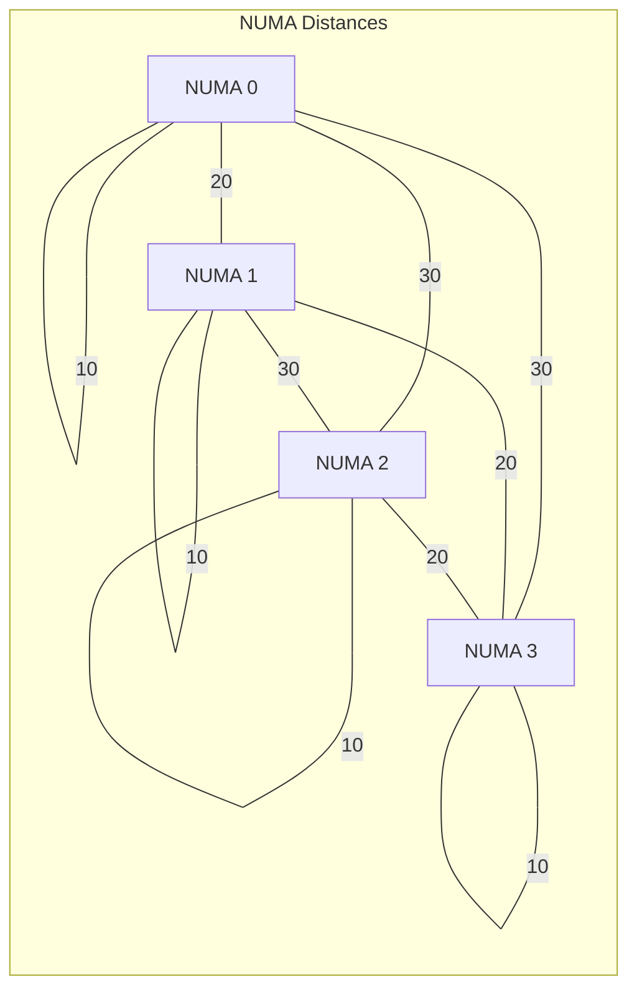
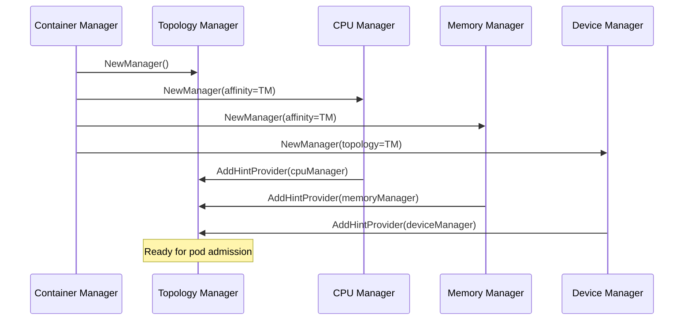

# kubelet Low-Level: Topology Manager Implementation

## Table of Contents
1. [Overview](#overview)
2. [Architecture](#architecture)
3. [Topology Policies](#topology-policies)
4. [Topology Scopes](#topology-scopes)
5. [Hint Provider Interface](#hint-provider-interface)
6. [Hint Generation](#hint-generation)
7. [Hint Merging Algorithm](#hint-merging-algorithm)
8. [Pod Admission Flow](#pod-admission-flow)
9. [NUMA Information](#numa-information)
10. [Policy Implementation Details](#policy-implementation-details)
11. [Container vs Pod Scope](#container-vs-pod-scope)
12. [Integration with Resource Managers](#integration-with-resource-managers)
13. [Performance and Metrics](#performance-and-metrics)
14. [Troubleshooting](#troubleshooting)
15. [Best Practices](#best-practices)
16. [Summary](#summary)

## Overview

The Topology Manager is a kubelet component that coordinates NUMA resource alignment across different resource managers (CPU, Memory, Device) to achieve optimal resource locality for containerized workloads.

### Key Features



### Manager Interface

The Topology Manager interface (`pkg/kubelet/cm/topologymanager/topology_manager.go:58`):

```go
type Manager interface {
    // Pod admission control
    lifecycle.PodAdmitHandler

    // Hint provider registration
    AddHintProvider(logger klog.Logger, h HintProvider)

    // Container lifecycle
    AddContainer(pod *v1.Pod, container *v1.Container, containerID string)
    RemoveContainer(containerID string) error

    // Store for topology hints
    Store
}

type Store interface {
    GetAffinity(podUID string, containerName string) TopologyHint
    GetPolicy() Policy
}
```

## Architecture

### Component Structure



### Manager Implementation

Core manager structure (`pkg/kubelet/cm/topologymanager/topology_manager.go:72`):

```go
type manager struct {
    // Topology Manager Scope determines hint generation granularity
    scope Scope
}

// Scope manages topology hints at container or pod level
type scope struct {
    sync.Mutex
    name string

    // Pod topology hints indexed by PodUID -> ContainerName
    podTopologyHints podTopologyHints

    // Registered hint providers
    hintProviders []HintProvider

    // Topology policy
    policy Policy

    // Container tracking
    podMap containermap.ContainerMap
}
```

### Topology Hint Structure

The fundamental data structure (`pkg/kubelet/cm/topologymanager/topology_manager.go:104`):

```go
type TopologyHint struct {
    // NUMA nodes where resources should be allocated
    NUMANodeAffinity bitmask.BitMask

    // Whether this allocation is preferred
    Preferred bool
}

// Hint comparison for sorting
func (th *TopologyHint) LessThan(other TopologyHint) bool {
    // Preferred hints are always better
    if th.Preferred != other.Preferred {
        return th.Preferred
    }
    // Among same preference, narrower is better
    return th.NUMANodeAffinity.IsNarrowerThan(other.NUMANodeAffinity)
}
```

## Topology Policies

### Policy Types

Four topology policies (`pkg/kubelet/cm/topologymanager/topology_manager.go:164`):

```go
const (
    PolicyNone           = "none"            // No topology alignment
    PolicyBestEffort     = "best-effort"     // Align if possible
    PolicyRestricted     = "restricted"      // Align or reject
    PolicySingleNumaNode = "single-numa-node" // Single NUMA only
)
```

### Policy Comparison

| Policy | Description | Admission | Alignment |
|--------|------------|-----------|-----------|
| **none** | No topology management | Always admit | No alignment |
| **best-effort** | Try to align resources | Always admit | Best available |
| **restricted** | Require preferred alignment | Reject if not preferred | Preferred only |
| **single-numa-node** | Require single NUMA | Reject if cross-NUMA | Single NUMA only |

### Policy Decision Flow



## Topology Scopes

### Scope Types

Two topology scopes (`pkg/kubelet/cm/topologymanager/scope.go:30`):

```go
const (
    containerTopologyScope = "container"  // Per-container alignment
    podTopologyScope       = "pod"        // Pod-level alignment
    noneTopologyScope      = "none"       // No scope (policy=none)
)
```

### Container Scope

Each container gets independent NUMA alignment:



### Pod Scope

All containers must align to same NUMA nodes:



## Hint Provider Interface

### HintProvider Definition

Resource managers implement this interface (`pkg/kubelet/cm/topologymanager/topology_manager.go:80`):

```go
type HintProvider interface {
    // Container-level hints
    GetTopologyHints(pod *v1.Pod, container *v1.Container) map[string][]TopologyHint

    // Pod-level hints
    GetPodTopologyHints(pod *v1.Pod) map[string][]TopologyHint

    // Allocate resources after hint merge
    Allocate(pod *v1.Pod, container *v1.Container) error
}
```

### CPU Manager as HintProvider

Example implementation (`pkg/kubelet/cm/cpumanager/topology_hints.go:50`):

```go
func (m *manager) GetTopologyHints(pod *v1.Pod, container *v1.Container) map[string][]TopologyHint {
    // Only for guaranteed pods with exclusive CPUs
    if !m.policy.requiresExclusiveCPUs(pod, container) {
        return nil
    }

    requested := m.policy.podGuaranteedCPUs(pod, container)
    available := m.policy.GetAvailableCPUs(m.state)

    // Generate hints for CPU allocation
    var hints []topologymanager.TopologyHint
    for _, numa := range m.topology.NUMANodes() {
        cpusInNUMA := m.topology.CPUsInNUMANode(numa).Intersection(available)

        if cpusInNUMA.Size() >= requested {
            hints = append(hints, topologymanager.TopologyHint{
                NUMANodeAffinity: bitmask.NewBitMask(numa),
                Preferred:        true,
            })
        }
    }

    return map[string][]topologymanager.TopologyHint{
        string(v1.ResourceCPU): hints,
    }
}
```

## Hint Generation

### Hint Generation Process



### Hint Generation Example

Memory manager hint generation (`pkg/kubelet/cm/memorymanager/topology_hints.go:60`):

```go
func (p *staticPolicy) generateMemoryHints(availableNUMANodes []int,
                                          request uint64) []topologymanager.TopologyHint {
    var hints []topologymanager.TopologyHint

    // Try single NUMA nodes first
    for _, numa := range availableNUMANodes {
        if p.getNUMANodeFreeMemory(numa) >= request {
            hints = append(hints, topologymanager.TopologyHint{
                NUMANodeAffinity: bitmask.NewBitMask(numa),
                Preferred:        true,
            })
        }
    }

    // If no single NUMA works, try combinations
    if len(hints) == 0 {
        hints = p.generateCrossNUMAHints(availableNUMANodes, request)
    }

    return hints
}
```

## Hint Merging Algorithm

### Merge Process

The core merging algorithm (`pkg/kubelet/cm/topologymanager/policy.go:44`):

```go
func mergePermutation(defaultAffinity bitmask.BitMask,
                     permutation []TopologyHint) TopologyHint {
    // Check if all hints are preferred
    preferred := true
    var numaAffinities []bitmask.BitMask

    for _, hint := range permutation {
        if hint.NUMANodeAffinity != nil {
            numaAffinities = append(numaAffinities, hint.NUMANodeAffinity)

            // Not preferred if affinities differ
            if !hint.NUMANodeAffinity.IsEqual(numaAffinities[0]) {
                preferred = false
            }
        }

        // Not preferred if any hint is not preferred
        if !hint.Preferred {
            preferred = false
        }
    }

    // Merge using bitwise AND
    mergedAffinity := bitmask.And(defaultAffinity, numaAffinities...)

    return TopologyHint{
        NUMANodeAffinity: mergedAffinity,
        Preferred:        preferred,
    }
}
```

### Merge Decision Tree



### HintMerger Implementation

Advanced merging with policy options (`pkg/kubelet/cm/topologymanager/policy.go:137`):

```go
type HintMerger struct {
    NUMAInfo *NUMAInfo
    Hints    [][]TopologyHint
    BestNonPreferredAffinityCount int
    CompareNUMAAffinityMasks func(candidate *TopologyHint,
                                 current *TopologyHint) *TopologyHint
}

func (m HintMerger) Merge() (TopologyHint, bool) {
    var bestHint *TopologyHint

    // Iterate all permutations
    for _, permutation := range m.generatePermutations() {
        candidate := mergePermutation(m.NUMAInfo.DefaultAffinityMask(), permutation)

        // Skip empty results
        if candidate.NUMANodeAffinity.Count() == 0 {
            continue
        }

        // Compare and update best hint
        bestHint = m.compare(bestHint, &candidate)
    }

    if bestHint == nil {
        return TopologyHint{}, false
    }

    return *bestHint, true
}
```

## Pod Admission Flow

### Admission Sequence



Implementation (`pkg/kubelet/cm/topologymanager/topology_manager.go:229`):

```go
func (m *manager) Admit(attrs *lifecycle.PodAdmitAttributes) lifecycle.PodAdmitResult {
    ctx := context.TODO()
    logger := klog.FromContext(ctx)

    logger.V(4).Info("Topology manager admission check", "pod", klog.KObj(attrs.Pod))
    metrics.TopologyManagerAdmissionRequestsTotal.Inc()

    startTime := time.Now()
    podAdmitResult := m.scope.Admit(ctx, attrs.Pod)
    metrics.TopologyManagerAdmissionDuration.Observe(
        float64(time.Since(startTime).Milliseconds()))

    logger.V(4).Info("Pod Admit Result",
                     "Message", podAdmitResult.Message,
                     "pod", klog.KObj(attrs.Pod))

    return podAdmitResult
}
```

## NUMA Information

### NUMA Discovery

NUMA topology discovery (`pkg/kubelet/cm/topologymanager/numa_info.go:35`):

```go
type NUMAInfo struct {
    Nodes         []int
    NUMADistances NUMADistances
}

type NUMADistances map[int][]int

func NewNUMAInfo(topology []cadvisorapi.Node, opts PolicyOptions) (*NUMAInfo, error) {
    numaNodes := []int{}
    distances := NUMADistances{}

    for _, node := range topology {
        numaNodes = append(numaNodes, node.Id)

        // Build distance matrix
        if node.Distances != nil {
            distances[node.Id] = node.Distances
        }
    }

    sort.Ints(numaNodes)

    return &NUMAInfo{
        Nodes:         numaNodes,
        NUMADistances: distances,
    }, nil
}
```

### NUMA Distance Matrix

Example NUMA topology:



### Closest NUMA Selection

Finding closest NUMA nodes (`pkg/kubelet/cm/topologymanager/numa_info.go:80`):

```go
func (n *NUMAInfo) Closest(m1, m2 bitmask.BitMask) bitmask.BitMask {
    // No distances available, fall back to narrowest
    if n.NUMADistances == nil {
        return n.Narrowest(m1, m2)
    }

    // Calculate average distance for each mask
    dist1 := n.averageDistance(m1)
    dist2 := n.averageDistance(m2)

    if dist1 < dist2 {
        return m1
    }
    return m2
}

func (n *NUMAInfo) averageDistance(mask bitmask.BitMask) float64 {
    nodes := mask.GetBits()
    if len(nodes) == 0 {
        return math.MaxFloat64
    }

    var totalDistance int
    var count int

    for i, node1 := range nodes {
        for j := i + 1; j < len(nodes); j++ {
            node2 := nodes[j]
            totalDistance += n.NUMADistances[node1][node2]
            count++
        }
    }

    if count == 0 {
        return 0
    }
    return float64(totalDistance) / float64(count)
}
```

## Policy Implementation Details

### BestEffort Policy

Always admits, uses best available alignment (`pkg/kubelet/cm/topologymanager/policy_best_effort.go:35`):

```go
func (p *bestEffortPolicy) Merge(providersHints []map[string][]TopologyHint) (TopologyHint, bool) {
    merger := NewHintMerger(p.numaInfo, filterProvidersHints(providersHints),
                           p.Name(), p.opts)

    bestHint := merger.Merge()

    // Always admit with best effort policy
    admit := true

    // Update metrics
    if bestHint.Preferred {
        metrics.TopologyManagerPreferredAllocations.Inc()
    }

    return bestHint, admit
}
```

### Restricted Policy

Only admits if preferred alignment available (`pkg/kubelet/cm/topologymanager/policy_restricted.go:35`):

```go
func (p *restrictedPolicy) Merge(providersHints []map[string][]TopologyHint) (TopologyHint, bool) {
    merger := NewHintMerger(p.numaInfo, filterProvidersHints(providersHints),
                           p.Name(), p.opts)

    bestHint := merger.Merge()

    // Only admit if we got a preferred hint
    admit := bestHint.Preferred

    if !admit {
        metrics.TopologyManagerRestrictedRejections.Inc()
    }

    return bestHint, admit
}
```

### SingleNumaNode Policy

Enforces single NUMA allocation (`pkg/kubelet/cm/topologymanager/policy_single_numa_node.go:35`):

```go
func (p *singleNumaNodePolicy) Merge(providersHints []map[string][]TopologyHint) (TopologyHint, bool) {
    // Filter to only single NUMA hints
    filteredHints := p.filterSingleNumaHints(filterProvidersHints(providersHints))

    merger := NewHintMerger(p.numaInfo, filteredHints, p.Name(), p.opts)
    bestHint := merger.Merge()

    // Only admit if single NUMA with preferred hint
    admit := bestHint.Preferred && bestHint.NUMANodeAffinity.Count() == 1

    if !admit {
        metrics.TopologyManagerSingleNumaRejections.Inc()
    }

    return bestHint, admit
}

func (p *singleNumaNodePolicy) filterSingleNumaHints(hints [][]TopologyHint) [][]TopologyHint {
    var filtered [][]TopologyHint

    for _, resourceHints := range hints {
        var singleNUMAHints []TopologyHint
        for _, hint := range resourceHints {
            if hint.NUMANodeAffinity.Count() == 1 {
                singleNUMAHints = append(singleNUMAHints, hint)
            }
        }
        filtered = append(filtered, singleNUMAHints)
    }

    return filtered
}
```

## Container vs Pod Scope

### Container Scope Implementation

Per-container alignment (`pkg/kubelet/cm/topologymanager/scope_container.go:45`):

```go
func (s *containerScope) Admit(ctx context.Context, pod *v1.Pod) lifecycle.PodAdmitResult {
    // Process each container independently
    for _, container := range append(pod.Spec.InitContainers, pod.Spec.Containers...) {
        result := s.admitContainer(ctx, pod, &container)
        if !result.Admit {
            return result
        }
    }

    return admission.GetPodAdmitResult(nil)
}

func (s *containerScope) admitContainer(ctx context.Context,
                                       pod *v1.Pod,
                                       container *v1.Container) lifecycle.PodAdmitResult {
    // Gather hints for this container
    providersHints := s.gatherHints(pod, container)

    // Merge hints
    bestHint, admit := s.policy.Merge(providersHints)

    if !admit {
        return admission.GetPodAdmitResult(
            fmt.Errorf("resources cannot be allocated for container %s",
                      container.Name))
    }

    // Store hint
    s.setTopologyHints(string(pod.UID), container.Name, bestHint)

    // Allocate resources
    for _, provider := range s.hintProviders {
        if err := provider.Allocate(pod, container); err != nil {
            return admission.GetPodAdmitResult(err)
        }
    }

    return admission.GetPodAdmitResult(nil)
}
```

### Pod Scope Implementation

Pod-level alignment (`pkg/kubelet/cm/topologymanager/scope_pod.go:45`):

```go
func (s *podScope) Admit(ctx context.Context, pod *v1.Pod) lifecycle.PodAdmitResult {
    // Gather hints for entire pod
    providersHints := s.gatherPodHints(pod)

    // Merge at pod level
    bestHint, admit := s.policy.Merge(providersHints)

    if !admit {
        return admission.GetPodAdmitResult(
            TopologyAffinityError{})
    }

    // Apply same hint to all containers
    for _, container := range append(pod.Spec.InitContainers, pod.Spec.Containers...) {
        s.setTopologyHints(string(pod.UID), container.Name, bestHint)

        // Allocate with pod-level hint
        for _, provider := range s.hintProviders {
            if err := provider.Allocate(pod, &container); err != nil {
                return admission.GetPodAdmitResult(err)
            }
        }
    }

    return admission.GetPodAdmitResult(nil)
}
```

## Integration with Resource Managers

### Resource Manager Registration



### Coordination Example

Full stack allocation:

```go
// CPU Manager hint generation
func (m *cpuManager) GetTopologyHints(pod *v1.Pod, container *v1.Container) map[string][]TopologyHint {
    return map[string][]TopologyHint{
        "cpu": {{NUMANodeAffinity: bitmask.NewBitMask(0), Preferred: true}},
    }
}

// Memory Manager hint generation
func (m *memoryManager) GetTopologyHints(pod *v1.Pod, container *v1.Container) map[string][]TopologyHint {
    return map[string][]TopologyHint{
        "memory": {{NUMANodeAffinity: bitmask.NewBitMask(0), Preferred: true}},
        "hugepages-2Mi": {{NUMANodeAffinity: bitmask.NewBitMask(0), Preferred: true}},
    }
}

// Device Manager hint generation
func (m *deviceManager) GetTopologyHints(pod *v1.Pod, container *v1.Container) map[string][]TopologyHint {
    return map[string][]TopologyHint{
        "nvidia.com/gpu": {{NUMANodeAffinity: bitmask.NewBitMask(0), Preferred: true}},
    }
}

// Topology Manager merges all hints
// Result: All resources on NUMA 0
```

## Performance and Metrics

### Topology Manager Metrics

Available metrics (`pkg/kubelet/metrics/metrics.go:600`):

```go
var (
    // Admission requests
    TopologyManagerAdmissionRequestsTotal = metrics.NewCounter(
        &metrics.CounterOpts{
            Subsystem: KubeletSubsystem,
            Name:      "topology_manager_admission_requests_total",
            Help:      "Number of admission requests to topology manager",
        },
    )

    // Admission duration
    TopologyManagerAdmissionDuration = metrics.NewHistogram(
        &metrics.HistogramOpts{
            Subsystem: KubeletSubsystem,
            Name:      "topology_manager_admission_duration_milliseconds",
            Help:      "Duration of topology manager pod admission",
            Buckets:   []float64{1, 10, 50, 100, 500, 1000, 5000},
        },
    )

    // Alignment results
    ContainerAlignedComputeResources = metrics.NewCounterVec(
        &metrics.CounterOpts{
            Subsystem: KubeletSubsystem,
            Name:      "container_aligned_compute_resources_count",
            Help:      "Number of containers with aligned resources",
        },
        []string{"scope", "alignment"},
    )
)
```

### Performance Optimization

1. **Hint Caching**:

```go
type cachedHints struct {
    sync.RWMutex
    hints map[string][]TopologyHint
    ttl   time.Duration
}

func (c *cachedHints) get(key string) ([]TopologyHint, bool) {
    c.RLock()
    defer c.RUnlock()
    hints, ok := c.hints[key]
    return hints, ok
}
```

2. **Permutation Pruning**:

```go
func (m HintMerger) generatePermutations() [][]TopologyHint {
    // Early pruning of impossible combinations
    var filtered [][]TopologyHint

    for _, hints := range m.Hints {
        var possible []TopologyHint
        for _, hint := range hints {
            // Skip hints that can't possibly work
            if hint.NUMANodeAffinity.Count() > m.MaxNodes {
                continue
            }
            possible = append(possible, hint)
        }
        filtered = append(filtered, possible)
    }

    return m.cartesianProduct(filtered)
}
```

## Troubleshooting

### Common Issues

1. **Pod Admission Failures**:

```bash
# Check topology manager logs
journalctl -u kubelet | grep -i "topology.*manager"

# View pod events
kubectl describe pod <pod-name>

# Check hint generation
kubectl logs -n kube-system <kubelet-pod> | grep "topology hints"
```

2. **NUMA Alignment Issues**:

```go
// Debug hint generation
func debugHints(providersHints []map[string][]TopologyHint) {
    for i, hints := range providersHints {
        fmt.Printf("Provider %d hints:\n", i)
        for resource, resourceHints := range hints {
            fmt.Printf("  Resource %s:\n", resource)
            for _, hint := range resourceHints {
                fmt.Printf("    NUMA: %v, Preferred: %v\n",
                    hint.NUMANodeAffinity.GetBits(), hint.Preferred)
            }
        }
    }
}
```

3. **Policy Violations**:

```bash
# Check policy configuration
kubectl get --raw /api/v1/nodes/<node>/proxy/configz | jq .kubeletconfig.topologyManagerPolicy

# Verify scope
kubectl get --raw /api/v1/nodes/<node>/proxy/configz | jq .kubeletconfig.topologyManagerScope
```

### Debugging Tools

1. **Hint Inspector**:

```go
func (m *manager) inspectHints(pod *v1.Pod) {
    for _, container := range pod.Spec.Containers {
        hint := m.GetAffinity(string(pod.UID), container.Name)

        fmt.Printf("Container %s:\n", container.Name)
        fmt.Printf("  NUMA Affinity: %v\n", hint.NUMANodeAffinity.GetBits())
        fmt.Printf("  Preferred: %v\n", hint.Preferred)
    }
}
```

2. **Admission Tracer**:

```go
func traceAdmission(pod *v1.Pod, result lifecycle.PodAdmitResult) {
    if !result.Admit {
        klog.Error("Pod admission failed",
            "pod", pod.Name,
            "reason", result.Reason,
            "message", result.Message)

        // Log hint details
        for _, container := range pod.Spec.Containers {
            klog.Info("Container resources",
                "container", container.Name,
                "requests", container.Resources.Requests)
        }
    }
}
```

## Best Practices

### 1. Policy Selection

```yaml
# For latency-sensitive workloads
apiVersion: kubelet.config.k8s.io/v1beta1
kind: KubeletConfiguration
topologyManagerPolicy: single-numa-node
topologyManagerScope: container

# For throughput workloads
topologyManagerPolicy: best-effort
topologyManagerScope: pod
```

### 2. Resource Configuration

```yaml
# Guaranteed pod for topology alignment
apiVersion: v1
kind: Pod
spec:
  containers:
  - name: app
    resources:
      requests:
        cpu: "8"
        memory: "16Gi"
        nvidia.com/gpu: "1"
      limits:
        cpu: "8"
        memory: "16Gi"
        nvidia.com/gpu: "1"
```

### 3. NUMA Node Planning

```bash
# Check NUMA topology before deployment
numactl --hardware

# Verify resource distribution
for node in 0 1 2 3; do
    echo "NUMA Node $node:"
    echo "  CPUs: $(cat /sys/devices/system/node/node$node/cpulist)"
    echo "  Memory: $(cat /sys/devices/system/node/node$node/meminfo | grep MemTotal)"
    echo "  Devices: $(ls /sys/devices/system/node/node$node/ | grep pci)"
done
```

### 4. Scope Selection

```go
// Choose scope based on workload
func selectScope(workloadType string) string {
    switch workloadType {
    case "batch":
        return "pod"  // All containers on same NUMA
    case "microservices":
        return "container"  // Independent NUMA per container
    default:
        return "container"
    }
}
```

### 5. Monitoring

```go
// Monitor topology alignment
func monitorAlignment(m Manager) {
    ticker := time.NewTicker(30 * time.Second)
    defer ticker.Stop()

    for range ticker.C {
        aligned := 0
        crossNUMA := 0

        for _, pod := range getRunningPods() {
            for _, container := range pod.Spec.Containers {
                hint := m.GetAffinity(string(pod.UID), container.Name)

                if hint.NUMANodeAffinity.Count() == 1 {
                    aligned++
                } else if hint.NUMANodeAffinity.Count() > 1 {
                    crossNUMA++
                }
            }
        }

        metrics.TopologyAlignedContainers.Set(float64(aligned))
        metrics.TopologyCrossNUMAContainers.Set(float64(crossNUMA))
    }
}
```

## Summary

The Topology Manager provides sophisticated NUMA-aware resource coordination for Kubernetes workloads:

### Key Implementation Details

- **Policies**: none, best-effort, restricted, single-numa-node
- **Scopes**: container-level or pod-level alignment
- **Hint System**: Resource managers provide NUMA preferences
- **Merging**: Bitwise AND to find common NUMA nodes
- **Admission**: Policy-based pod admission control

### Architecture Highlights

- **Pluggable Policies**: Interface-based policy implementation
- **Hint Providers**: CPU, Memory, Device managers as providers
- **Flexible Scopes**: Container or pod granularity
- **Distance Awareness**: NUMA distance-based optimization

### Performance Characteristics

- **Admission Latency**: Typically < 50ms for hint merge
- **Scalability**: Supports up to 8 NUMA nodes by default
- **Caching**: Hint caching for repeated allocations
- **Optimization**: Permutation pruning for efficiency

### Best Practices

- Select policy based on workload requirements
- Use single-numa-node for latency-sensitive workloads
- Choose appropriate scope (container vs pod)
- Monitor NUMA alignment metrics
- Plan resource distribution across NUMA nodes

The Topology Manager is essential for achieving optimal resource locality and predictable performance in NUMA systems.