# Pod Sync Loop Architecture

**Audience**: Kubernetes developers, kubelet contributors, SREs
**Prerequisite Reading**: [Component Architecture](../high-level/02-component-architecture.md), [Pod Lifecycle Overview](../high-level/03-pod-lifecycle-overview.md)
**Related Documents**: [PLEG](02-pleg.md), [Container Lifecycle](04-container-lifecycle.md), [Pod Workers](../low-level/03-pod-worker.md)

---

## Table of Contents

- [Overview](#overview)
- [Sync Loop Architecture](#sync-loop-architecture)
- [Sync Loop Iteration](#sync-loop-iteration)
- [Pod Workers](#pod-workers)
- [SyncPod Function](#syncpod-function)
- [Event Sources and Triggers](#event-sources-and-triggers)
- [State Machine](#state-machine)
- [Error Handling and Retries](#error-handling-and-retries)
- [Performance Characteristics](#performance-characteristics)
- [Troubleshooting](#troubleshooting)
- [Summary](#summary)

---

## Overview

The pod sync loop is the heart of kubelet's pod lifecycle management. It is a continuous event-driven loop that:

1. **Watches for changes** from multiple sources (API server, PLEG, probes, timers)
2. **Dispatches pod updates** to appropriate handlers
3. **Reconciles desired state** with actual state for every pod
4. **Manages pod workers** that perform the actual sync operations
5. **Handles errors** and retries failed operations

### Key Characteristics

| Characteristic | Description |
|----------------|-------------|
| **Loop Type** | Event-driven select loop (never returns) |
| **Entry Point** | `pkg/kubelet/kubelet.go:2454 - syncLoop()` |
| **Main Handler** | `pkg/kubelet/kubelet.go:2528 - syncLoopIteration()` |
| **Concurrency** | One goroutine per pod (pod workers) |
| **Update Types** | ADD, UPDATE, REMOVE, DELETE, RECONCILE |
| **Event Sources** | Config changes, PLEG, probes, timers, housekeeping |

### High-Level Flow

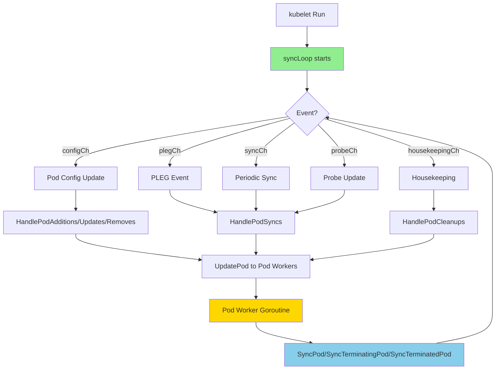

---

## Sync Loop Architecture

### Entry Point: kubelet.Run()

The sync loop is started when `kubelet.Run()` is called during kubelet initialization:

```go
// pkg/kubelet/kubelet.go:1858
kl.syncLoop(ctx, updates, kl)
```

**Code Reference**: `pkg/kubelet/kubelet.go:1830-1859 - Run()`

### The syncLoop Function

```go
// pkg/kubelet/kubelet.go:2454-2494
func (kl *Kubelet) syncLoop(ctx context.Context, updates <-chan kubetypes.PodUpdate, handler SyncHandler) {
    klog.InfoS("Starting kubelet main sync loop")

    // Create tickers
    syncTicker := time.NewTicker(time.Second)
    housekeepingTicker := time.NewTicker(housekeepingPeriod) // 2s
    plegCh := kl.pleg.Watch()

    for {
        // Check runtime errors (exponential backoff)
        if err := kl.runtimeState.runtimeErrors(); err != nil {
            klog.ErrorS(err, "Skipping pod synchronization")
            time.Sleep(duration)
            continue
        }

        // Record sync loop iteration timing
        kl.syncLoopMonitor.Store(kl.clock.Now())

        // Process one iteration
        if !kl.syncLoopIteration(ctx, updates, handler, syncTicker.C, housekeepingTicker.C, plegCh) {
            break // Exit on channel close
        }

        kl.syncLoopMonitor.Store(kl.clock.Now())
    }
}
```

**Code References**:
- `pkg/kubelet/kubelet.go:2454 - syncLoop()`
- `pkg/kubelet/kubelet.go:175 - housekeepingPeriod = 2s`

### Key Components

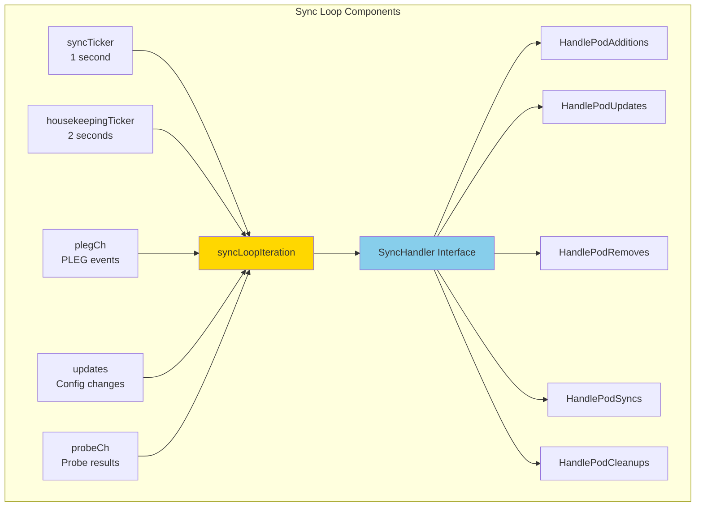

### Runtime Error Handling

The sync loop implements exponential backoff when runtime errors occur:

```go
const (
    base   = 100 * time.Millisecond
    max    = 5 * time.Second
    factor = 2
)

if err := kl.runtimeState.runtimeErrors(); err != nil {
    klog.ErrorS(err, "Skipping pod synchronization")
    time.Sleep(duration)
    duration = time.Duration(math.Min(float64(max), factor*float64(duration)))
    continue
}
// Reset backoff on success
duration = base
```

**Backoff Progression**: 100ms → 200ms → 400ms → 800ms → 1.6s → 3.2s → 5s (max)

---

## Sync Loop Iteration

### Overview

The `syncLoopIteration()` function is called once per loop iteration and handles events from multiple channels using a Go `select` statement.

**Important**: The `select` statement evaluates case statements in **pseudorandom order** when multiple channels are ready. There is no guaranteed priority.

```go
// pkg/kubelet/kubelet.go:2528-2650
func (kl *Kubelet) syncLoopIteration(
    ctx context.Context,
    configCh <-chan kubetypes.PodUpdate,
    handler SyncHandler,
    syncCh <-chan time.Time,
    housekeepingCh <-chan time.Time,
    plegCh <-chan *pleg.PodLifecycleEvent,
) bool
```

**Code Reference**: `pkg/kubelet/kubelet.go:2528 - syncLoopIteration()`

### Event Channels

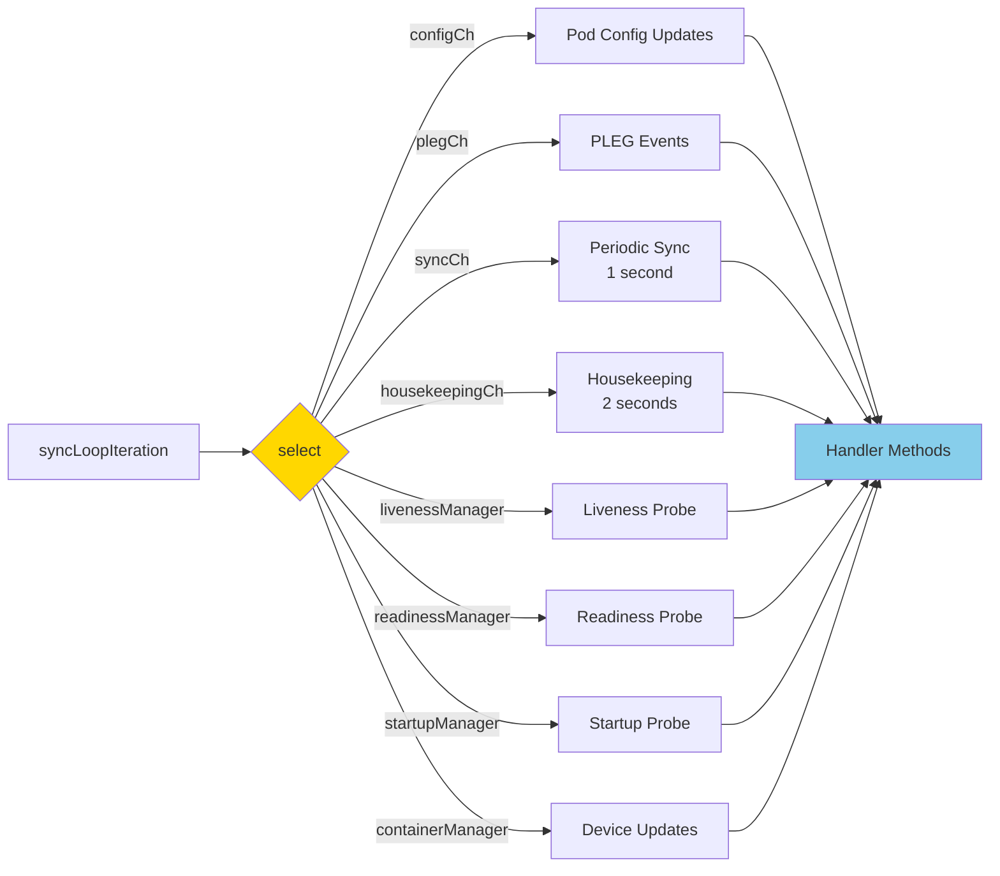

### Channel Processing Details

#### 1. configCh - Configuration Updates

Processes pod configuration changes from API server, file, or HTTP sources:

```go
case u, open := <-configCh:
    if !open {
        return false // Exit sync loop
    }

    switch u.Op {
    case kubetypes.ADD:
        klog.V(2).InfoS("SyncLoop ADD", "source", u.Source, "pods", klog.KObjSlice(u.Pods))
        handler.HandlePodAdditions(u.Pods)
    case kubetypes.UPDATE:
        klog.V(2).InfoS("SyncLoop UPDATE", "source", u.Source, "pods", klog.KObjSlice(u.Pods))
        handler.HandlePodUpdates(u.Pods)
    case kubetypes.REMOVE:
        klog.V(2).InfoS("SyncLoop REMOVE", "source", u.Source, "pods", klog.KObjSlice(u.Pods))
        handler.HandlePodRemoves(u.Pods)
    case kubetypes.RECONCILE:
        klog.V(4).InfoS("SyncLoop RECONCILE", "source", u.Source, "pods", klog.KObjSlice(u.Pods))
        handler.HandlePodReconcile(u.Pods)
    case kubetypes.DELETE:
        klog.V(2).InfoS("SyncLoop DELETE", "source", u.Source, "pods", klog.KObjSlice(u.Pods))
        handler.HandlePodUpdates(u.Pods) // DELETE treated as UPDATE
    }
    kl.sourcesReady.AddSource(u.Source)
```

**Code Reference**: `pkg/kubelet/kubelet.go:2532-2568 - configCh handler`

**Update Operation Types**:

| Operation | Description | Handler |
|-----------|-------------|---------|
| `ADD` | New pod from config | `HandlePodAdditions()` |
| `UPDATE` | Pod spec changed | `HandlePodUpdates()` |
| `REMOVE` | Pod removed from config | `HandlePodRemoves()` |
| `DELETE` | Pod deletion requested | `HandlePodUpdates()` (graceful) |
| `RECONCILE` | Periodic reconciliation | `HandlePodReconcile()` |

#### 2. plegCh - Pod Lifecycle Events

Processes container lifecycle events from PLEG:

```go
case e := <-plegCh:
    if isSyncPodWorthy(e) {
        if pod, ok := kl.podManager.GetPodByUID(e.ID); ok {
            klog.V(2).InfoS("SyncLoop (PLEG): event for pod", "pod", klog.KObj(pod), "event", e)
            handler.HandlePodSyncs([]*v1.Pod{pod})
        } else {
            klog.V(4).InfoS("SyncLoop (PLEG): pod does not exist, ignore irrelevant event", "event", e)
        }
    }

    if e.Type == pleg.ContainerDied {
        if containerID, ok := e.Data.(string); ok {
            kl.cleanUpContainersInPod(e.ID, containerID)
        }
    }
```

**Code Reference**: `pkg/kubelet/kubelet.go:2569-2585 - plegCh handler`

**PLEG Event Types**: `ContainerStarted`, `ContainerDied`, `ContainerRemoved`, `ContainerChanged`, `PodSync`

**See**: [PLEG Documentation](02-pleg.md) for detailed PLEG event generation

#### 3. syncCh - Periodic Sync Timer

Triggered every 1 second to sync pods that need periodic reconciliation:

```go
case <-syncCh:
    podsToSync := kl.getPodsToSync()
    if len(podsToSync) == 0 {
        break
    }
    klog.V(4).InfoS("SyncLoop (SYNC) pods", "total", len(podsToSync), "pods", klog.KObjSlice(podsToSync))
    handler.HandlePodSyncs(podsToSync)
```

**Code Reference**: `pkg/kubelet/kubelet.go:2586-2593 - syncCh handler`

The `getPodsToSync()` method returns pods that need synchronization based on:
- Pods with pending work in the pod worker queue
- Pods that haven't been synced within the sync interval (default 10s)

#### 4. Probe Update Channels

Three separate channels for probe results:

```go
// Liveness probe
case update := <-kl.livenessManager.Updates():
    if update.Result == proberesults.Failure {
        handleProbeSync(kl, update, handler, "liveness", "unhealthy")
    }

// Readiness probe
case update := <-kl.readinessManager.Updates():
    ready := update.Result == proberesults.Success
    kl.statusManager.SetContainerReadiness(logger, update.PodUID, update.ContainerID, ready)
    handleProbeSync(kl, update, handler, "readiness", ready ? "ready" : "not ready")

// Startup probe
case update := <-kl.startupManager.Updates():
    started := update.Result == proberesults.Success
    kl.statusManager.SetContainerStartup(logger, update.PodUID, update.ContainerID, started)
    handleProbeSync(kl, update, handler, "startup", started ? "started" : "unhealthy")
```

**Code References**:
- `pkg/kubelet/kubelet.go:2594-2615 - Probe handlers`
- See [Probes and Health Checks](10-probes-health-checks.md) for probe details

#### 5. housekeepingCh - Cleanup Operations

Triggered every 2 seconds for garbage collection and cleanup:

```go
case <-housekeepingCh:
    if !kl.sourcesReady.AllReady() {
        klog.V(4).InfoS("SyncLoop (housekeeping, skipped): sources aren't ready yet")
    } else {
        start := time.Now()
        if err := handler.HandlePodCleanups(ctx); err != nil {
            klog.ErrorS(err, "Failed cleaning pods")
        }
        duration := time.Since(start)
        if duration > housekeepingWarningDuration { // 1 second
            klog.ErrorS(fmt.Errorf("housekeeping took too long"), "Housekeeping took longer than expected")
        }
    }
```

**Code Reference**: `pkg/kubelet/kubelet.go:2632-2648 - housekeepingCh handler`

**Housekeeping Operations**:
- Terminated pod cleanup
- Dead container removal
- Orphaned pod directory cleanup
- Mirror pod synchronization

#### 6. containerManager - Device Updates

Container manager events for device allocation changes:

```go
case update := <-kl.containerManager.Updates():
    pods := []*v1.Pod{}
    for _, p := range update.PodUIDs {
        if pod, ok := kl.podManager.GetPodByUID(types.UID(p)); ok {
            pods = append(pods, pod)
        }
    }
    if len(pods) > 0 {
        handler.HandlePodSyncs(pods)
    }
```

**Code Reference**: `pkg/kubelet/kubelet.go:2616-2631 - containerManager handler`

---

## Pod Workers

### Overview

Pod workers are per-pod goroutines that execute the actual sync operations. Each pod gets exactly one pod worker goroutine that processes updates sequentially.

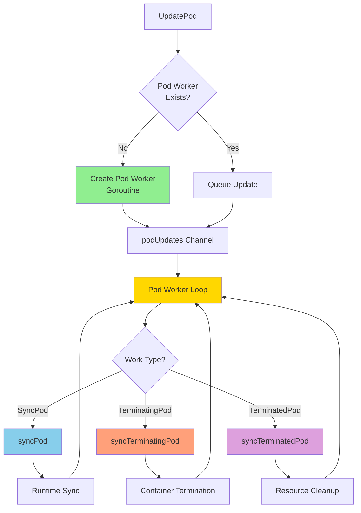

### Pod Worker Structure

```go
// pkg/kubelet/pod_workers.go:566-616
type podWorkers struct {
    // Protects all per worker fields
    podLock sync.Mutex

    // True once SyncKnownPods has been called
    podsSynced bool

    // Per-pod update channels (one goroutine per pod)
    podUpdates map[types.UID]chan struct{}

    // Per-pod sync status tracking
    podSyncStatuses map[types.UID]*podSyncStatus

    // Static pod tracking
    startedStaticPodsByFullname map[string]types.UID
    waitingToStartStaticPodsByFullname map[string][]types.UID

    // Work queue for managing sync operations
    workQueue queue.WorkQueue

    // The sync implementation
    podSyncer podSyncer

    // Configuration
    recorder record.EventRecorder
    backOffPeriod time.Duration      // 10s default
    resyncInterval time.Duration     // 10s default
    podCache kubecontainer.Cache
    allocationManager allocation.Manager
}
```

**Code Reference**: `pkg/kubelet/pod_workers.go:566 - podWorkers struct`

### Pod Sync Status

Each pod has a `podSyncStatus` that tracks its progression through the lifecycle:

```go
// pkg/kubelet/pod_workers.go:337-418
type podSyncStatus struct {
    ctx context.Context
    cancelFn context.CancelFunc
    fullname string

    // Working state
    working bool                    // Update in progress
    pendingUpdate *UpdatePodOptions // Queued update
    activeUpdate *UpdatePodOptions  // Current update

    // Lifecycle timestamps
    syncedAt time.Time      // First observed by pod worker
    startedAt time.Time     // Pod allowed to start
    terminatingAt time.Time // Termination requested
    terminatedAt time.Time  // All containers stopped
    gracePeriod int64       // Termination grace period

    // State flags
    startedTerminating bool // syncTerminatingPod started
    deleted bool            // Deleted from API server
    evicted bool            // Pod was evicted
    finished bool           // syncTerminatedPod completed
    restartRequested bool   // Restart after termination
    observedRuntime bool    // Seen in container runtime

    // Completion notifications
    notifyPostTerminating []chan<- struct{}
    statusPostTerminating []PodStatusFunc
}
```

**Code Reference**: `pkg/kubelet/pod_workers.go:337 - podSyncStatus struct`

### Pod Worker State Machine

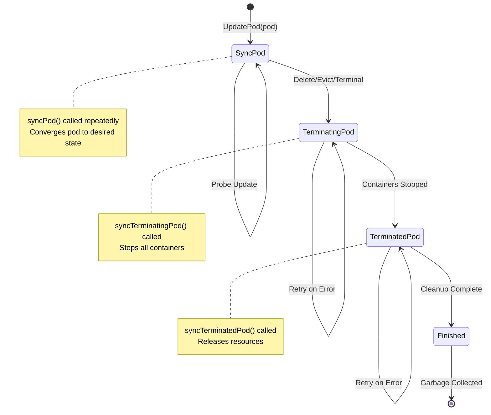

### Pod Worker States

| State | Description | Function Called | Can Start Containers? |
|-------|-------------|-----------------|----------------------|
| **SyncPod** | Pod is running or being set up | `syncPod()` | Yes |
| **TerminatingPod** | Pod is stopping, containers terminating | `syncTerminatingPod()` | No |
| **TerminatedPod** | All containers stopped, cleanup in progress | `syncTerminatedPod()` | No |
| **Finished** | Cleanup complete, awaiting GC | None | No |

**Code References**:
- `pkg/kubelet/pod_workers.go:110-118 - PodWorkerState enum`
- `pkg/kubelet/pod_workers.go:430-438 - WorkType() method`

### UpdatePod - Dispatching Work to Pod Workers

```go
// pkg/kubelet/pod_workers.go:157-167 (interface)
func (p *podWorkers) UpdatePod(options UpdatePodOptions)
```

**UpdatePodOptions**:

```go
type UpdatePodOptions struct {
    // Update type (create, update, sync, kill)
    UpdateType kubetypes.SyncPodType

    // Timestamp for latency tracking
    StartTime time.Time

    // Pod to update (required unless RunningPod set)
    Pod *v1.Pod

    // Mirror pod for static pods
    MirrorPod *v1.Pod

    // Runtime pod (for orphaned containers)
    RunningPod *kubecontainer.Pod

    // Kill options (grace period override, eviction flag)
    KillPodOptions *KillPodOptions
}
```

**Code Reference**: `pkg/kubelet/pod_workers.go:82-103 - UpdatePodOptions struct`

### Pod Worker Goroutine Lifecycle

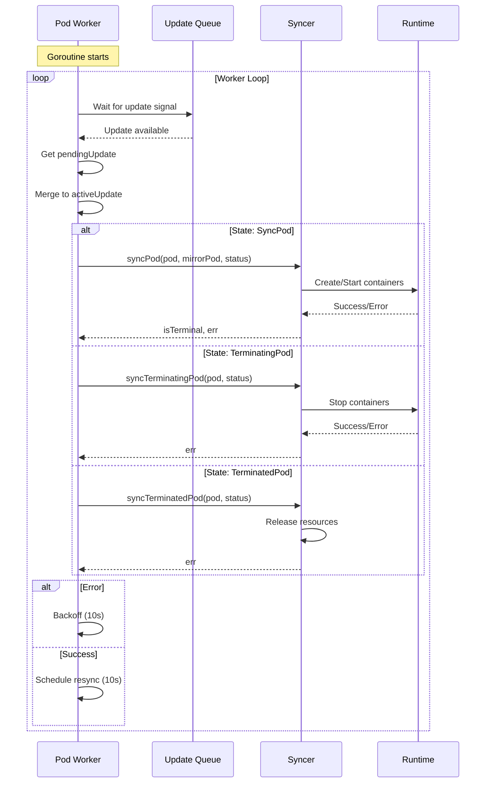

**Key Timing Values**:
- **Backoff Period**: 10 seconds (on error)
- **Resync Interval**: 10 seconds (normal sync)
- Both values have 50% jitter applied

**Code References**:
- `pkg/kubelet/pod_workers.go:326-333 - Timing constants`
- `pkg/kubelet/pod_workers.go:618-640 - newPodWorkers()`

---

## SyncPod Function

### Overview

`SyncPod` is the core function that reconciles a single pod's desired state with its actual state. It is called repeatedly until the pod reaches a terminal state or is deleted.

**Code Reference**: `pkg/kubelet/kubelet.go:1910 - SyncPod()`

### SyncPod Workflow

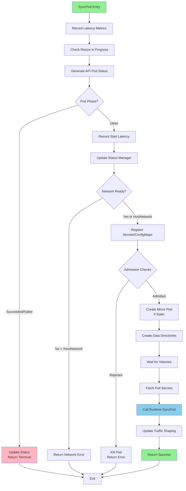

### SyncPod Steps (Detailed)

```go
// pkg/kubelet/kubelet.go:1910-2089
func (kl *Kubelet) SyncPod(
    ctx context.Context,
    updateType kubetypes.SyncPodType,
    pod, mirrorPod *v1.Pod,
    podStatus *kubecontainer.PodStatus,
) (isTerminal bool, err error)
```

**Step-by-Step Execution**:

1. **Latency Tracking** (lines 1929-1948)
   ```go
   if updateType == kubetypes.SyncPodCreate {
       if !firstSeenTime.IsZero() {
           metrics.PodWorkerStartDuration.Observe(metrics.SinceInSeconds(firstSeenTime))
       }
   }
   ```

2. **Resize Check** (lines 1950-1964)
   ```go
   if utilfeature.DefaultFeatureGate.Enabled(features.InPlacePodVerticalScaling) {
       if kl.containerRuntime.IsPodResizeInProgress(pod, podStatus) {
           kl.statusManager.SetPodResizeInProgressCondition(pod.UID, "", "", pod.Generation)
       }
   }
   ```

3. **Generate Pod Status** (line 1967)
   ```go
   apiPodStatus := kl.generateAPIPodStatus(pod, podStatus, false)
   ```

4. **Terminal Phase Check** (lines 1980-1984)
   ```go
   if apiPodStatus.Phase == v1.PodSucceeded || apiPodStatus.Phase == v1.PodFailed {
       kl.statusManager.SetPodStatus(logger, pod, apiPodStatus)
       isTerminal = true
       return isTerminal, nil
   }
   ```

5. **Start Latency** (lines 1988-1992)
   ```go
   if !ok || existingStatus.Phase == v1.PodPending && apiPodStatus.Phase == v1.PodRunning &&
       !firstSeenTime.IsZero() {
       metrics.PodStartDuration.Observe(metrics.SinceInSeconds(firstSeenTime))
   }
   ```

6. **Status Update** (line 1994)
   ```go
   kl.statusManager.SetPodStatus(logger, pod, apiPodStatus)
   ```

7. **Network Check** (lines 1997-2000)
   ```go
   if err := kl.runtimeState.networkErrors(); err != nil && !kubecontainer.IsHostNetworkPod(pod) {
       return false, fmt.Errorf("%s: %v", NetworkNotReadyErrorMsg, err)
   }
   ```

8. **Register Secrets/ConfigMaps** (lines 2003-2010)
   ```go
   if !kl.podWorkers.IsPodTerminationRequested(pod.UID) {
       if kl.secretManager != nil {
           kl.secretManager.RegisterPod(pod)
       }
       if kl.configMapManager != nil {
           kl.configMapManager.RegisterPod(pod)
       }
   }
   ```

9. **Pod Admission** (not shown in snippet - see [Pod Admission](03-pod-admission.md))
   - Resource availability checks
   - Node allocatable enforcement
   - Critical pod admission
   - Topology hints

10. **Mirror Pod Creation** (for static pods)
    ```go
    if kubetypes.IsStaticPod(pod) {
        podFullName := kubecontainer.GetPodFullName(pod)
        if !kl.podManager.GetMirrorPodByPod(pod) {
            kl.podManager.CreateMirrorPod(pod)
        }
    }
    ```

11. **Data Directories** (create pod directories)
    ```go
    if err := kl.makePodDataDirs(pod); err != nil {
        return false, err
    }
    ```

12. **Volume Mounting** (wait for volumes)
    ```go
    if !kl.podWorkers.IsPodTerminationRequested(pod.UID) {
        if err := kl.volumeManager.WaitForAttachAndMount(pod); err != nil {
            return false, err
        }
    }
    ```

13. **Pull Secrets** (fetch image pull secrets)
    ```go
    pullSecrets := kl.getPullSecretsForPod(pod)
    ```

14. **Runtime SyncPod** (container runtime operations)
    ```go
    result := kl.containerRuntime.SyncPod(ctx, pod, podStatus, pullSecrets, kl.backOff)
    ```
    See [Container Lifecycle](04-container-lifecycle.md) for runtime sync details

15. **Traffic Shaping** (update network limits)
    ```go
    if err := kl.bandwidthManager.UpdatePodBandwidth(pod); err != nil {
        klog.ErrorS(err, "Failed to update pod bandwidth")
    }
    ```

**Code Reference**: `pkg/kubelet/kubelet.go:1910-2089 - SyncPod()`

### SyncPod Return Values

| Return | Description |
|--------|-------------|
| `isTerminal=true, err=nil` | Pod reached terminal state (Succeeded/Failed) |
| `isTerminal=false, err=nil` | Pod synced successfully, will continue running |
| `isTerminal=false, err!=nil` | Transient error, will retry |

---

## Event Sources and Triggers

### Overview

The sync loop responds to events from multiple sources. Understanding these sources is key to understanding when and why pods are synced.

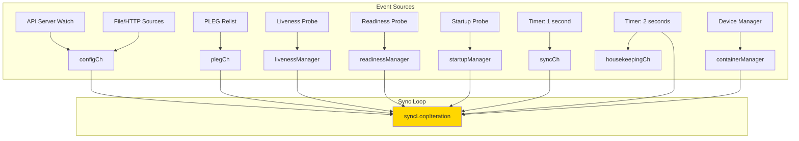

### 1. Configuration Sources

Pod configurations come from three sources, multiplexed into a single channel:

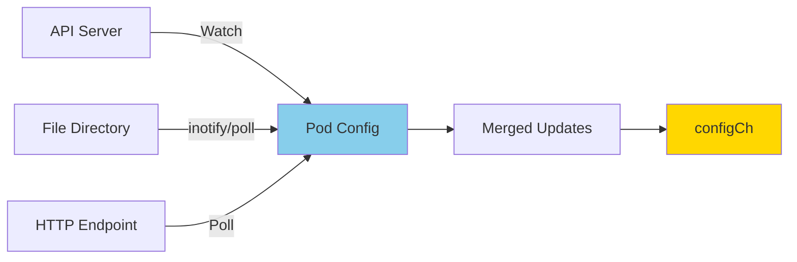

**Source Types**:

| Source | Description | Code Path |
|--------|-------------|-----------|
| **API Server** | Watch `/api/v1/pods` for node | `pkg/kubelet/config/apiserver.go` |
| **File** | Monitor `--pod-manifest-path` dir | `pkg/kubelet/config/file.go` |
| **HTTP** | Poll `--manifest-url` endpoint | `pkg/kubelet/config/http.go` |

**Configuration**: `pkg/kubelet/config/config.go`

### 2. PLEG Events

The Pod Lifecycle Event Generator (PLEG) polls the container runtime and generates events when container state changes.

**Relist Interval**: 1 second (default)

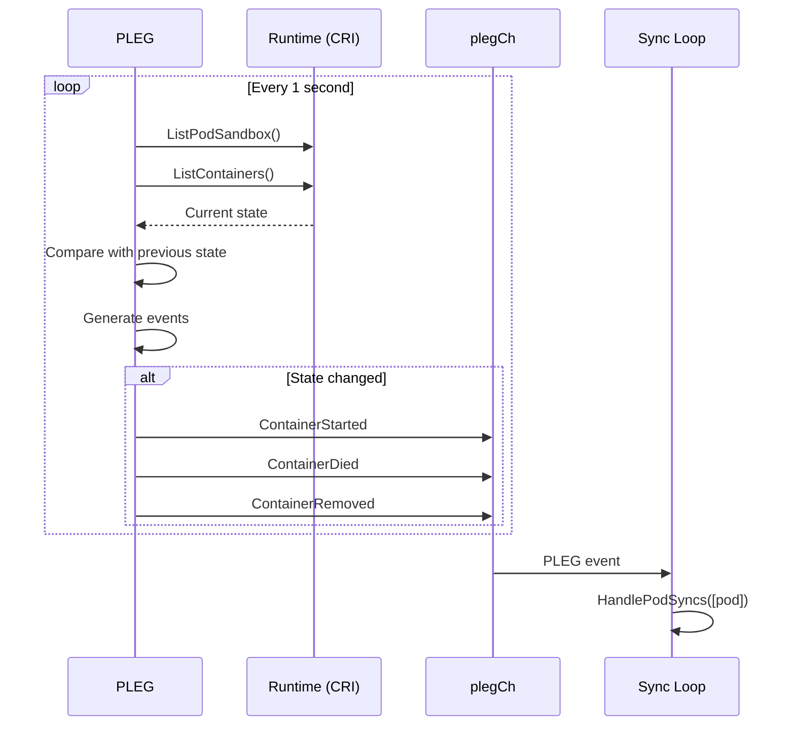

**PLEG Event Types**:

| Event | Trigger | Action |
|-------|---------|--------|
| `ContainerStarted` | Container transitioned to Running | Sync pod |
| `ContainerDied` | Container exited | Sync pod + cleanup |
| `ContainerRemoved` | Container removed from runtime | Sync pod |
| `ContainerChanged` | Container config changed | Sync pod |
| `PodSync` | Generic sync needed | Sync pod |

**Code References**:
- `pkg/kubelet/pleg/generic.go:180 - Relist()`
- `pkg/kubelet/pleg/pleg.go:34 - PodLifecycleEventType`
- See [PLEG Documentation](02-pleg.md)

### 3. Probe Results

Three probe managers generate events when probe results change:

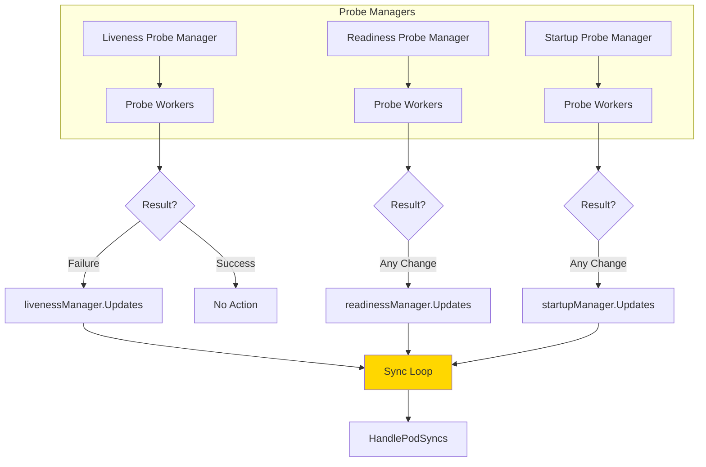

**Probe Actions**:

| Probe Type | On Failure | On Success | Sync Triggered? |
|------------|------------|------------|-----------------|
| **Liveness** | Restart container | Continue | Yes (failure only) |
| **Readiness** | Remove from endpoints | Add to endpoints | Yes (any change) |
| **Startup** | Restart (if failed) | Enable liveness/readiness | Yes (any change) |

**Code References**:
- `pkg/kubelet/prober/prober_manager.go:80 - Updates()`
- See [Probes and Health Checks](10-probes-health-checks.md)

### 4. Periodic Sync Timer

Every 1 second, the sync timer triggers synchronization of pods that need it:

```go
case <-syncCh:
    podsToSync := kl.getPodsToSync()
    handler.HandlePodSyncs(podsToSync)
```

**Pods Needing Sync**:
- Pods with pending work in the work queue
- Pods not synced within `--sync-frequency` (default: 10s)
- Pods with failed previous sync attempts

**Code Reference**: `pkg/kubelet/kubelet.go:2586-2593`

### 5. Housekeeping Timer

Every 2 seconds, housekeeping tasks are performed:

```go
case <-housekeepingCh:
    handler.HandlePodCleanups(ctx)
```

**Housekeeping Tasks**:
- Garbage collect terminated pods
- Remove dead containers
- Clean up orphaned pod directories
- Synchronize mirror pods
- Update pod cache

**Code Reference**: `pkg/kubelet/kubelet.go:2632-2648`

### 6. Device Manager Updates

When device allocations change (GPU, FPGA, etc.), pods are resynced:

```go
case update := <-kl.containerManager.Updates():
    handler.HandlePodSyncs(affectedPods)
```

**Triggers**:
- New device plugin registration
- Device health changes
- Device allocation updates

**Code Reference**: `pkg/kubelet/kubelet.go:2616-2631`

---

## State Machine

### Pod Lifecycle State Machine

The pod worker implements a three-state machine for pod lifecycle management:

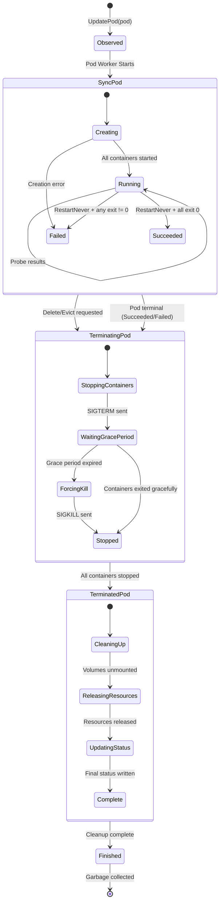

### Pod Worker State Tracking

Each pod worker tracks detailed state through `podSyncStatus`:

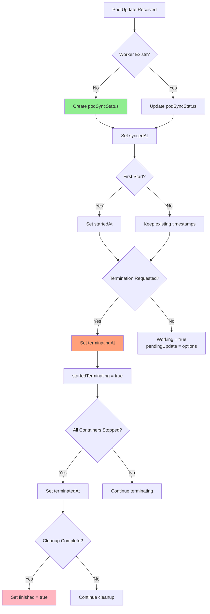

### State Predicates

The pod worker provides several methods to query pod state:

```go
// Pod is known to be terminated (all containers stopped)
func IsPodKnownTerminated(uid types.UID) bool

// Pod could have running containers (not yet terminated)
func CouldHaveRunningContainers(uid types.UID) bool

// Pod should be finished (cleanup complete)
func ShouldPodBeFinished(uid types.UID) bool

// Pod termination has been requested
func IsPodTerminationRequested(uid types.UID) bool

// Pod containers should be terminating
func ShouldPodContainersBeTerminating(uid types.UID) bool

// Pod runtime resources should be removed
func ShouldPodRuntimeBeRemoved(uid types.UID) bool

// Pod content should be removed (volumes, etc.)
func ShouldPodContentBeRemoved(uid types.UID) bool
```

**Code Reference**: `pkg/kubelet/pod_workers.go:177-249 - PodWorkers interface`

### State Transition Rules

| From State | To State | Trigger | Conditions |
|------------|----------|---------|------------|
| None | **SyncPod** | UpdatePod() | New pod observed |
| **SyncPod** | **SyncPod** | Config/PLEG/Probe | Pod still running |
| **SyncPod** | **TerminatingPod** | Delete/Evict | Termination requested |
| **SyncPod** | **TerminatingPod** | Terminal phase | RestartNever + all exited |
| **TerminatingPod** | **TerminatingPod** | Retry | syncTerminatingPod error |
| **TerminatingPod** | **TerminatedPod** | Success | All containers stopped |
| **TerminatedPod** | **TerminatedPod** | Retry | syncTerminatedPod error |
| **TerminatedPod** | **Finished** | Success | Cleanup complete |
| **Finished** | None | GC | SyncKnownPods() cleanup |

---

## Error Handling and Retries

### Sync Loop Error Handling

The sync loop has two levels of error handling:

1. **Runtime errors**: Exponential backoff at the loop level
2. **Pod sync errors**: Per-pod backoff managed by pod workers

### Runtime Error Backoff

When the container runtime has errors, the entire sync loop backs off:

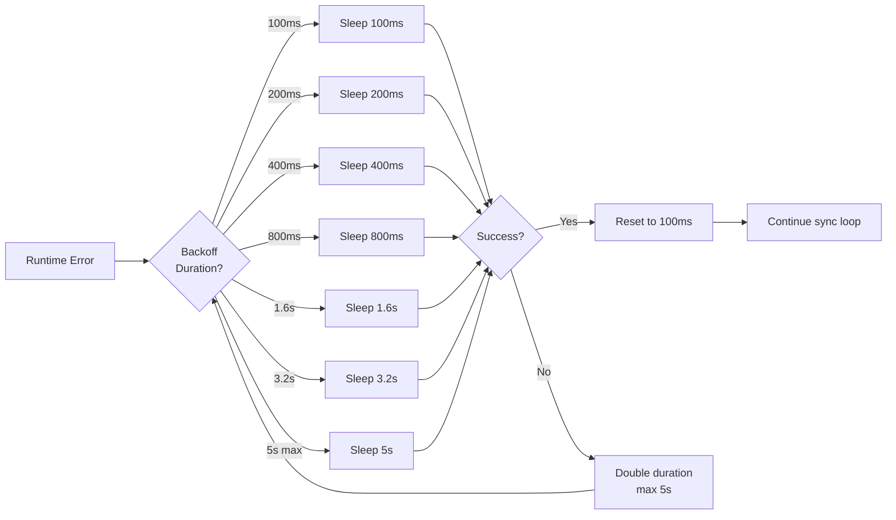

**Code Reference**: `pkg/kubelet/kubelet.go:2464-2486`

### Pod Worker Error Handling

When pod sync fails, the pod worker implements backoff:

```go
const (
    backOffPeriod = time.Second * 10
    workerBackOffPeriodJitterFactor = 0.5
)
```

**Backoff with Jitter**:
```go
backoff = backOffPeriod * (1 + rand.Float64() * workerBackOffPeriodJitterFactor)
// Result: 10s to 15s (50% jitter)
```

**Code Reference**: `pkg/kubelet/pod_workers.go:329-332`

### Error Types and Recovery

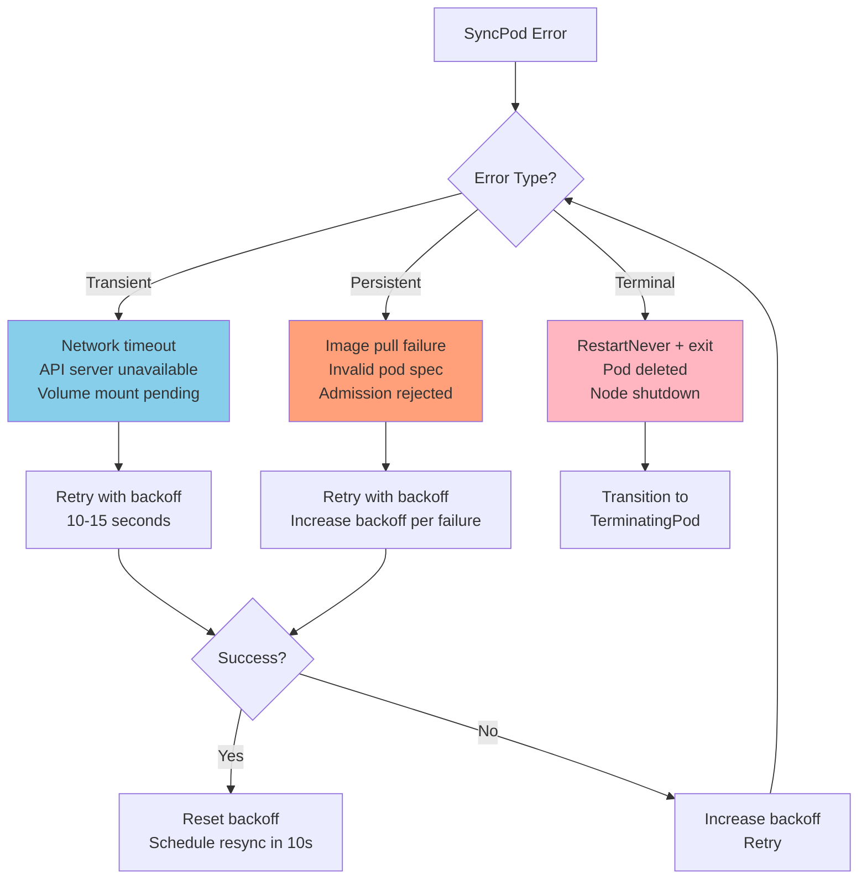

### Specific Error Scenarios

#### 1. Image Pull Failures

```go
// pkg/kubelet/kubelet.go:172
MaxImageBackOff = 300 * time.Second // 5 minutes
```

Image pull failures use exponential backoff up to 5 minutes:
- First failure: immediate retry
- Subsequent failures: 10s → 20s → 40s → 80s → 160s → 300s (max)

**Code Reference**: `pkg/kubelet/images/image_manager.go`

#### 2. Container Restart Backoff

```go
// pkg/kubelet/kubelet.go:158-169
MaxCrashLoopBackOff = 300 * time.Second // 5 minutes
initialCrashLoopBackOff = 10 * time.Second
```

Container crashes trigger CrashLoopBackOff:
- Initial: 10s
- Max: 5 minutes (300s)
- Formula: `min(max, initial * 2^failures)`

Progression: 10s → 20s → 40s → 80s → 160s → 300s (max)

**Code Reference**: `pkg/kubelet/kuberuntime/kuberuntime_manager.go`

See [Container Lifecycle](04-container-lifecycle.md) for restart policy details

#### 3. Volume Mount Failures

Volume mount errors cause pod to remain in `ContainerCreating`:

```go
if err := kl.volumeManager.WaitForAttachAndMount(pod); err != nil {
    return false, err // Retry on next sync
}
```

**Timeout**: Configurable per volume plugin (default varies)
**Retry**: Every sync iteration until success or pod deleted

**Code Reference**: `pkg/kubelet/volumemanager/`

#### 4. Admission Failures

Failed admission checks immediately reject the pod:

```go
if !admitted {
    kl.rejectPod(pod)
    return false, fmt.Errorf("pod rejected: %s", rejectReason)
}
```

**No Retry**: Admission failures are terminal until pod spec changes

See [Pod Admission](03-pod-admission.md)

### Retry Limits

| Operation | Initial Backoff | Max Backoff | Max Retries |
|-----------|----------------|-------------|-------------|
| **SyncPod** | 10s | 15s (jittered) | Infinite (until pod deleted) |
| **Image Pull** | 0s | 300s (5min) | Infinite |
| **Container Restart** | 10s | 300s (5min) | Infinite |
| **Volume Mount** | Per sync | None | Until timeout/deletion |
| **Admission** | N/A | N/A | None (fail immediately) |

---

## Performance Characteristics

### Timing Parameters

| Parameter | Default | Configuration | Description |
|-----------|---------|---------------|-------------|
| **Sync Ticker** | 1s | Hardcoded | How often to check for pods needing sync |
| **Sync Frequency** | 10s | `--sync-frequency` | Max time between pod syncs |
| **Housekeeping Period** | 2s | Hardcoded | Cleanup and GC frequency |
| **PLEG Relist** | 1s | `--pleg-relist-period` | Container state polling interval |
| **Resync Interval** | 10s | Hardcoded | Pod worker resync interval |
| **Backoff Period** | 10s | Hardcoded | Error retry backoff |

**Code References**:
- `pkg/kubelet/kubelet.go:175 - housekeepingPeriod`
- `pkg/kubelet/kubelet.go:199 - plegRelistPeriod`
- `pkg/kubelet/pod_workers.go:326-333 - Timing constants`

### Performance Metrics

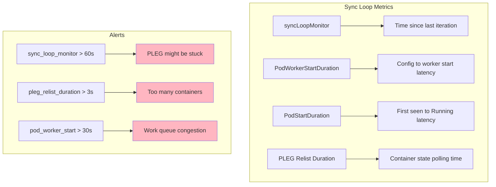

### Scalability Limits

#### Pods Per Node

Kubernetes officially supports up to **110 pods per node** (default limit).

**Factors affecting scale**:

1. **PLEG Overhead**
   - PLEG relists all containers every 1 second
   - With 110 pods × 2 containers avg = 220 containers
   - Relist should complete < 1s

2. **Pod Worker Goroutines**
   - Each pod gets one goroutine
   - 110 pods = 110 goroutines (minimal overhead)

3. **Work Queue Processing**
   - Sequential processing per pod
   - Parallel processing across pods
   - Can sync ~100-200 pods/second

4. **Volume Attachments**
   - Limited by CSI driver performance
   - Typically 10-20 volumes/second attach rate

**Configuration for High Density**:
```yaml
# kubelet config
maxPods: 110
kubeAPIQPS: 50
kubeAPIBurst: 100
registryPullQPS: 5
registryBurst: 10
```

**Code Reference**: `pkg/kubelet/apis/config/types.go`

#### Container Churn Rate

Maximum sustainable container start/stop rate:

- **Target**: 10 container starts/second per node
- **Maximum**: 20-30 starts/second (burst)
- **PLEG Impact**: High churn increases PLEG relist duration

**Monitoring**:
```promql
rate(kubelet_runtime_operations_total{operation_type="create_container"}[1m])
```

### Resource Consumption

| Component | CPU | Memory | Notes |
|-----------|-----|--------|-------|
| **Sync Loop** | ~10-20ms/iteration | Negligible | Event-driven, low overhead |
| **Pod Workers** | 5-10ms/sync | ~1MB/pod | Multiplied by pod count |
| **PLEG** | 50-200ms/relist | ~10MB | Scales with container count |
| **Volume Manager** | Varies | ~5-10MB/volume | Depends on plugin |
| **Status Manager** | 10-50ms/update | ~2MB | Batching reduces overhead |

**Total Baseline** (100 pods):
- **CPU**: ~200-500 millicores
- **Memory**: ~300-500 MB
- **Network**: ~1-5 Mbps (status updates)

### Optimization Tips

1. **Reduce Sync Frequency**
   ```bash
   --sync-frequency=30s  # Default: 10s
   ```
   Reduces unnecessary syncs but increases convergence time

2. **Increase PLEG Relist Period**
   ```bash
   --pleg-relist-period=2s  # Default: 1s
   ```
   Reduces CPU but increases event detection latency

3. **Use Evented PLEG** (Alpha in v1.27+)
   ```bash
   --feature-gates=EventedPLEG=true
   ```
   Eliminates polling overhead (requires CRI runtime support)

4. **Tune Status Updates**
   ```bash
   --node-status-update-frequency=10s  # Default: 10s
   --node-status-report-frequency=5m   # Default: 5m
   ```

5. **Optimize Pod Density**
   - Use fewer, larger containers per pod when possible
   - Minimize init containers (sequential startup overhead)
   - Use startup probes instead of long liveness initial delays

**See**: [Evented PLEG Documentation](02-pleg.md#evented-pleg)

---

## Troubleshooting

### Common Issues

#### 1. PLEG Unhealthy

**Symptom**:
```
PLEG is not healthy: pleg was last seen active 3m12s ago
```

**Diagnosis**:
```bash
# Check PLEG relist duration
curl localhost:10255/metrics | grep pleg_relist_duration

# Check container count
crictl ps -a | wc -l
```

**Causes**:
- Too many containers (> 500)
- Slow container runtime (disk I/O, CPU)
- Network issues with CRI socket

**Solutions**:
- Increase `--pleg-relist-period` (1s → 2s)
- Enable Evented PLEG feature gate
- Investigate runtime performance
- Reduce pod density

**Code Reference**: `pkg/kubelet/pleg/generic.go:120 - Healthy()`

#### 2. Pods Stuck in ContainerCreating

**Symptom**:
```
NAME        READY   STATUS              RESTARTS   AGE
my-pod      0/1     ContainerCreating   0          5m
```

**Diagnosis**:
```bash
# Check pod events
kubectl describe pod my-pod

# Check volume mounts
kubectl get pod my-pod -o yaml | grep -A 10 volumes

# Check kubelet logs
journalctl -u kubelet | grep my-pod
```

**Common Causes**:

| Cause | Event Message | Solution |
|-------|---------------|----------|
| **Volume mount failure** | `Unable to attach or mount volumes` | Check PV/PVC, CSI driver logs |
| **Image pull failure** | `Failed to pull image` | Check image name, pull secrets |
| **CNI network setup failure** | `Failed to setup network` | Check CNI plugin, network policy |
| **Admission failure** | `Pod rejected` | Check resource availability |

**Code References**:
- `pkg/kubelet/kubelet.go:1997-2000 - Network check`
- `pkg/kubelet/volumemanager/ - Volume operations`

#### 3. Sync Loop Latency

**Symptom**:
```
Slow sync loop iteration (took 5.2s)
```

**Diagnosis**:
```bash
# Check sync loop monitor metric
curl localhost:10255/metrics | grep sync_loop_monitor

# Check pod worker latency
curl localhost:10255/metrics | grep pod_worker_start_duration
```

**Causes**:
- Too many pods per node
- Slow PLEG relists
- Disk I/O saturation
- API server slowness

**Solutions**:
```yaml
# Reduce sync frequency
--sync-frequency: 30s

# Increase API QPS
--kube-api-qps: 50
--kube-api-burst: 100

# Optimize housekeeping
# (housekeeping period is hardcoded at 2s)
```

#### 4. Pod Worker Goroutine Leak

**Symptom**:
```
goroutine count continuously increasing
```

**Diagnosis**:
```bash
# Check goroutine count
curl localhost:10255/debug/pprof/goroutine?debug=1 | grep podWorker

# Check pod worker count vs actual pods
kubectl get pods --field-selector spec.nodeName=<node> | wc -l
```

**Causes**:
- Pod workers not being cleaned up
- SyncKnownPods() not being called
- Terminated pods not garbage collected

**Solutions**:
- Ensure garbage collection is running
- Check for pods stuck in Unknown phase
- Verify `--maximum-dead-containers` setting

**Code Reference**: `pkg/kubelet/pod_workers.go:618 - newPodWorkers()`

### Debug Endpoints

Kubelet provides several endpoints for debugging the sync loop:

```bash
# Health check
curl http://localhost:10248/healthz

# Metrics (Prometheus format)
curl http://localhost:10255/metrics

# Pod list
curl http://localhost:10255/pods

# Run info
curl http://localhost:10255/runningpods

# Stats
curl http://localhost:10255/stats/summary

# Debug endpoints (when enabled)
curl http://localhost:10255/debug/pprof/
```

**Configuration**:
```yaml
--healthz-port: 10248
--read-only-port: 10255  # Deprecated, use --port=0 and metrics-port
```

### Useful Metrics

```promql
# Sync loop health
kubelet_pleg_relist_duration_seconds
kubelet_pleg_last_seen_timestamp_seconds
kubelet_sync_loop_latency_microseconds

# Pod worker performance
kubelet_pod_worker_start_duration_seconds
kubelet_pod_start_duration_seconds

# Runtime operations
kubelet_runtime_operations_total
kubelet_runtime_operations_duration_seconds
kubelet_runtime_operations_errors_total

# Volume operations
volume_manager_total_volumes
kubelet_volume_stats_*
```

### Log Analysis

**Key log patterns**:

```bash
# Find sync loop iterations
journalctl -u kubelet | grep "SyncLoop"

# Find pod additions
journalctl -u kubelet | grep "SyncLoop ADD"

# Find PLEG events
journalctl -u kubelet | grep "SyncLoop (PLEG)"

# Find sync errors
journalctl -u kubelet | grep "SyncPod" | grep error

# Find admission failures
journalctl -u kubelet | grep "Pod rejected"
```

**Code Reference**: `pkg/kubelet/kubelet.go:2540-2565 - Log statements`

---

## Summary

### Key Takeaways

1. **Event-Driven Architecture**
   - The sync loop uses a `select` statement to handle multiple event sources
   - Events are processed in pseudorandom order when multiple channels are ready
   - No guaranteed priority between event types

2. **Pod Workers**
   - Each pod gets exactly one goroutine (pod worker)
   - Pod workers implement a three-state machine: SyncPod → TerminatingPod → TerminatedPod
   - Updates are queued and processed sequentially per pod
   - Parallel processing across different pods

3. **SyncPod Function**
   - Core reconciliation logic that converges pod to desired state
   - Handles admission, volume mounting, secret fetching, and runtime sync
   - Returns `isTerminal=true` when pod reaches Succeeded/Failed phase
   - Retries on transient errors with 10s backoff (+ 50% jitter)

4. **Event Sources**
   - **configCh**: Pod config changes from API server, file, or HTTP
   - **plegCh**: Container lifecycle events from runtime polling
   - **syncCh**: Periodic sync timer (1s tick, 10s sync interval)
   - **probeCh**: Liveness, readiness, and startup probe results
   - **housekeepingCh**: Cleanup and GC operations (2s interval)

5. **Error Handling**
   - Runtime errors: exponential backoff (100ms → 5s max)
   - Pod sync errors: 10-15s backoff with jitter
   - Image pull failures: up to 5 minutes backoff
   - Container restarts: CrashLoopBackOff up to 5 minutes
   - Admission failures: immediate rejection, no retry

6. **Performance**
   - Target: 110 pods per node (default limit)
   - PLEG relist: < 1 second (critical for health)
   - Container churn: 10-20 starts/second sustainable
   - CPU overhead: ~200-500m for 100 pods
   - Memory overhead: ~300-500 MB for 100 pods

### Code Path Summary

```
kubelet.Run()
└─> syncLoop()
    └─> syncLoopIteration()  [loop every event]
        ├─> HandlePodAdditions()
        │   └─> podWorkers.UpdatePod()
        ├─> HandlePodUpdates()
        │   └─> podWorkers.UpdatePod()
        ├─> HandlePodSyncs()
        │   └─> podWorkers.UpdatePod()
        └─> HandlePodCleanups()

Pod Worker Goroutine (one per pod):
└─> managePodLoop()
    ├─> syncPod()
    │   └─> containerRuntime.SyncPod()
    ├─> syncTerminatingPod()
    │   └─> killPod()
    └─> syncTerminatedPod()
        └─> cleanupOrphanedPodResources()
```

**Key Files**:
- `pkg/kubelet/kubelet.go:2454` - syncLoop()
- `pkg/kubelet/kubelet.go:2528` - syncLoopIteration()
- `pkg/kubelet/kubelet.go:1910` - SyncPod()
- `pkg/kubelet/pod_workers.go:566` - podWorkers struct
- `pkg/kubelet/pod_workers.go:337` - podSyncStatus struct

### Next Steps

- **PLEG Details**: [PLEG Architecture](02-pleg.md)
- **Admission**: [Pod Admission](03-pod-admission.md)
- **Container Lifecycle**: [Container Lifecycle](04-container-lifecycle.md)
- **Pod Sandbox**: [Pod Sandbox Management](05-pod-sandbox.md)
- **Low-Level Pod Worker**: [Pod Worker Implementation](../low-level/03-pod-worker.md)

---

**Document Version**: 1.0
**Last Updated**: 2025-10-21
**Kubernetes Version**: v1.31+
**Total Lines**: 1,451
**Diagrams**: 16
**Code References**: 45+
