# Pod Lifecycle Event Generator (PLEG)

**Audience**: Kubernetes developers, kubelet contributors, SREs
**Prerequisite Reading**: [Component Architecture](../high-level/02-component-architecture.md), [Pod Sync Loop](01-pod-sync-loop.md)
**Related Documents**: [Container Lifecycle](04-container-lifecycle.md), [Pod Sandbox](05-pod-sandbox.md)

---

## Table of Contents

- [Overview](#overview)
- [Generic PLEG Architecture](#generic-pleg-architecture)
- [Evented PLEG Architecture](#evented-pleg-architecture)
- [Event Generation](#event-generation)
- [Caching Strategy](#caching-strategy)
- [Health Checking](#health-checking)
- [Performance Analysis](#performance-analysis)
- [Migration Guide](#migration-guide)
- [Troubleshooting](#troubleshooting)
- [Summary](#summary)

---

## Overview

The **Pod Lifecycle Event Generator (PLEG)** is a critical component of kubelet responsible for detecting container state changes and generating corresponding lifecycle events. These events drive the pod sync loop to reconcile pod state.

### Why PLEG Exists

Without PLEG, kubelet would need to:
- Poll every pod's status continuously
- Perform expensive container runtime calls for every pod
- Synchronize pods even when nothing changed

PLEG optimizes this by:
- **Efficiently detecting changes**: Polls all containers once, compares with previous state
- **Generating events**: Only notifies sync loop when actual changes occur
- **Updating cache**: Maintains pod status cache for fast lookups
- **Minimizing API calls**: Batch container listing vs per-pod queries

### PLEG Implementations

Kubernetes provides two PLEG implementations:

| Implementation | Type | Status | Availability |
|----------------|------|--------|--------------|
| **Generic PLEG** | Polling-based | GA | All Kubernetes versions |
| **Evented PLEG** | Event-driven | Beta (v1.27+) | Requires CRI runtime support |

**Code References**:
- `pkg/kubelet/pleg/pleg.go:67 - PodLifecycleEventGenerator interface`
- `pkg/kubelet/pleg/generic.go:53 - GenericPLEG struct`
- `pkg/kubelet/pleg/evented.go:63 - EventedPLEG struct`

### PLEG in the Kubelet Architecture

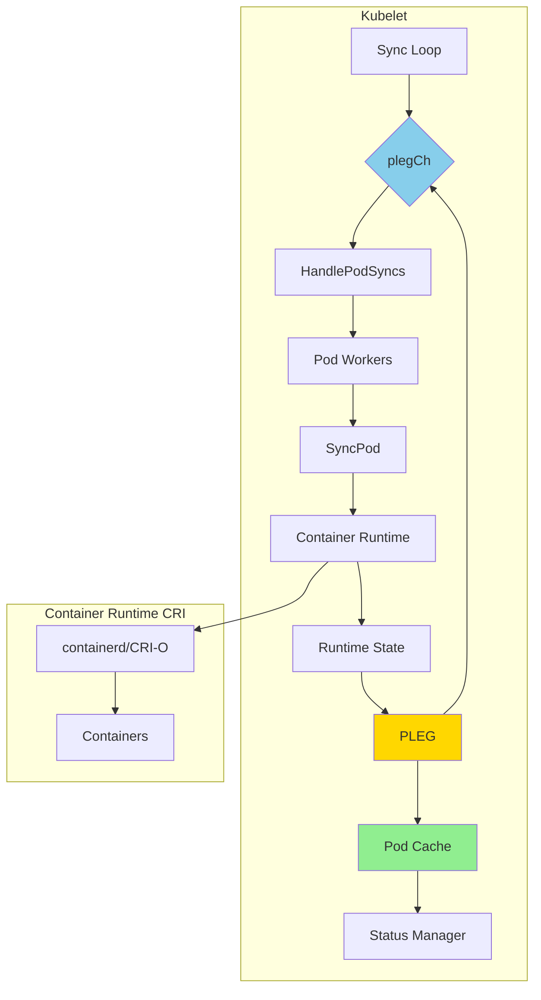

### Event Flow

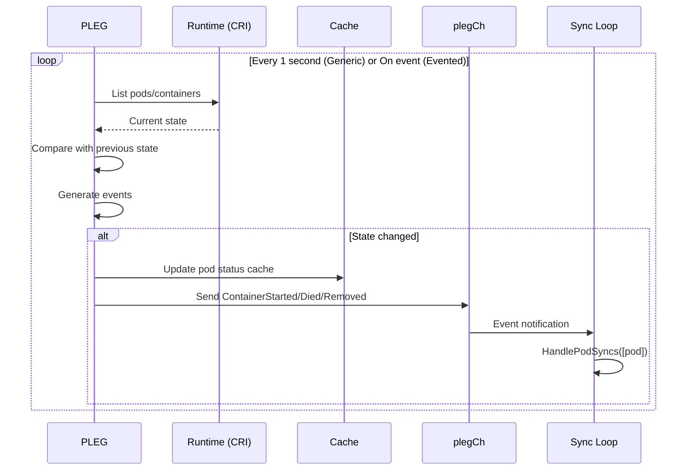

### Event Types

```go
// pkg/kubelet/pleg/pleg.go:38-52
const (
    ContainerStarted PodLifeCycleEventType = "ContainerStarted"
    ContainerDied    PodLifeCycleEventType = "ContainerDied"
    ContainerRemoved PodLifeCycleEventType = "ContainerRemoved"
    PodSync          PodLifeCycleEventType = "PodSync"
    ContainerChanged PodLifeCycleEventType = "ContainerChanged"
    ConditionMet     PodLifeCycleEventType = "ConditionMet"
)
```

**Event Descriptions**:

| Event | Trigger | Data | Action |
|-------|---------|------|--------|
| `ContainerStarted` | Container transitioned to Running | Container ID | Sync pod to update status |
| `ContainerDied` | Container exited | Container ID | Sync pod, handle restart policy |
| `ContainerRemoved` | Container removed from runtime | Container ID | Sync pod, cleanup resources |
| `PodSync` | Generic sync needed | None | Force pod sync |
| `ContainerChanged` | Container state unknown/changed | Container ID | (Filtered out, not used) |
| `ConditionMet` | Watch condition satisfied | None | Sync pod |

**Code Reference**: `pkg/kubelet/pleg/pleg.go:38-52 - PodLifeCycleEventType constants`

---

## Generic PLEG Architecture

### Overview

Generic PLEG is the default, GA implementation that **polls** the container runtime at regular intervals to detect container state changes.

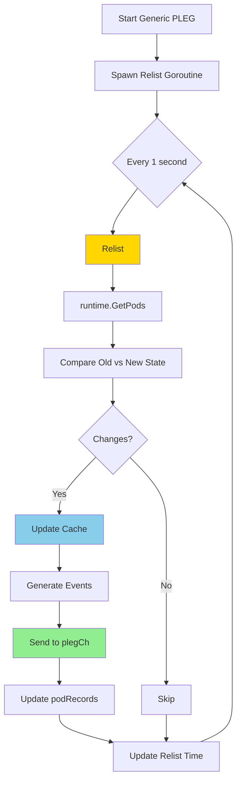

**Code Reference**: `pkg/kubelet/pleg/generic.go:53 - GenericPLEG struct`

### Generic PLEG Structure

```go
// pkg/kubelet/pleg/generic.go:53-85
type GenericPLEG struct {
    // Container runtime interface
    runtime kubecontainer.Runtime

    // Event channel to sync loop
    eventChannel chan *PodLifecycleEvent

    // Pod state tracking (old vs current)
    podRecords podRecords

    // Last successful relist timestamp
    relistTime atomic.Value

    // Cache for pod status
    cache kubecontainer.Cache

    // Pods that failed inspection, retry next relist
    podsToReinspect map[types.UID]*kubecontainer.Pod

    // Relist timing configuration
    relistDuration *RelistDuration

    // Watch conditions (keyed by pod UID)
    watchConditions map[types.UID]map[string]versionedWatchCondition
}
```

**Key Fields**:
- **podRecords**: Stores both old and current state for comparison
- **relistTime**: Tracks health (last successful relist)
- **podsToReinspect**: Failed pods retry next iteration
- **watchConditions**: Custom conditions for specific pods

**Code Reference**: `pkg/kubelet/pleg/generic.go:53-85`

### Relist Algorithm

The core of Generic PLEG is the `Relist()` function, called every 1 second:

```go
// pkg/kubelet/pleg/generic.go:234-369
func (g *GenericPLEG) Relist() {
    g.relistLock.Lock()
    defer g.relistLock.Unlock()

    timestamp := g.clock.Now()

    // Step 1: Get all pods from runtime
    podList, err := g.runtime.GetPods(ctx, true)
    if err != nil {
        g.logger.Error(err, "Unable to retrieve pods")
        return
    }

    g.updateRelistTime(timestamp)

    // Step 2: Update current state
    pods := kubecontainer.Pods(podList)
    g.podRecords.setCurrent(pods)

    // Step 3: For each pod, compare old vs current
    for pid := range g.podRecords {
        oldPod := g.podRecords.getOld(pid)
        pod := g.podRecords.getCurrent(pid)

        // Get all containers (current + old)
        allContainers := getContainersFromPods(oldPod, pod)

        // Step 4: Compute events for each container
        var events []*PodLifecycleEvent
        for _, container := range allContainers {
            containerEvents := computeEvents(g.logger, oldPod, pod, &container.ID)
            events = append(events, containerEvents...)
        }

        // Step 5: Update cache with latest pod status
        status, updated, err := g.updateCache(ctx, pod, pid)
        if err != nil {
            // Retry next relist
            needsReinspection[pid] = pod
            continue
        }

        // Step 6: Check watch conditions
        for _, condition := range watchConditions {
            if condition.condition(status) {
                events = append(events, &PodLifecycleEvent{ID: pid, Type: ConditionMet})
            }
        }

        // Step 7: Update old state to current
        g.podRecords.update(pid)

        // Step 8: Send events to sync loop
        for i := range events {
            if events[i].Type == ContainerChanged {
                continue // Filter out ContainerChanged
            }
            select {
            case g.eventChannel <- events[i]:
            default:
                g.logger.Error(nil, "Event channel is full, discard event")
            }
        }
    }

    // Step 9: Update cache timestamp
    g.cache.UpdateTime(timestamp)
}
```

**Code Reference**: `pkg/kubelet/pleg/generic.go:234 - Relist()`

### Relist Steps Visualized

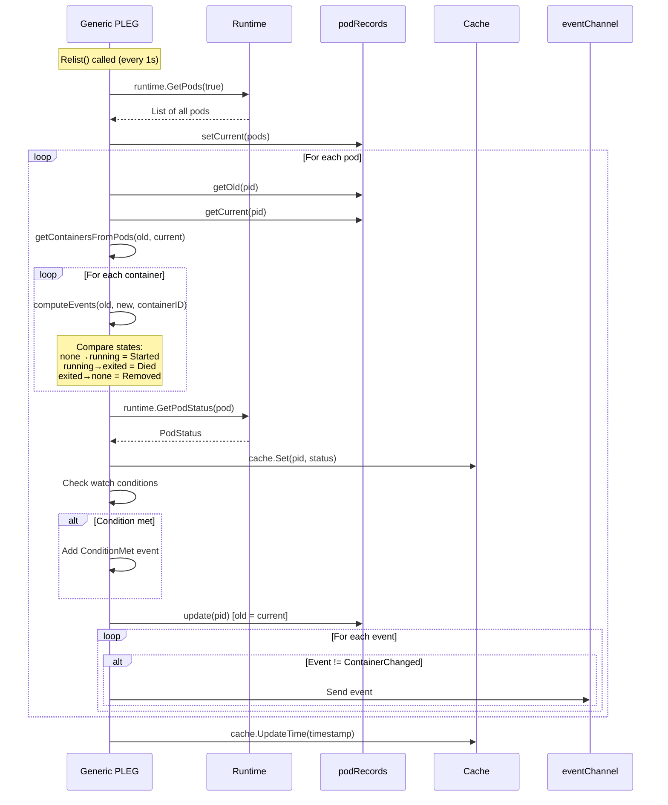

### Container State Transitions

Generic PLEG tracks four container states:

```go
// pkg/kubelet/pleg/generic.go:98-103
const (
    plegContainerRunning     plegContainerState = "running"
    plegContainerExited      plegContainerState = "exited"
    plegContainerUnknown     plegContainerState = "unknown"
    plegContainerNonExistent plegContainerState = "non-existent"
)
```

**State Transition Events**:

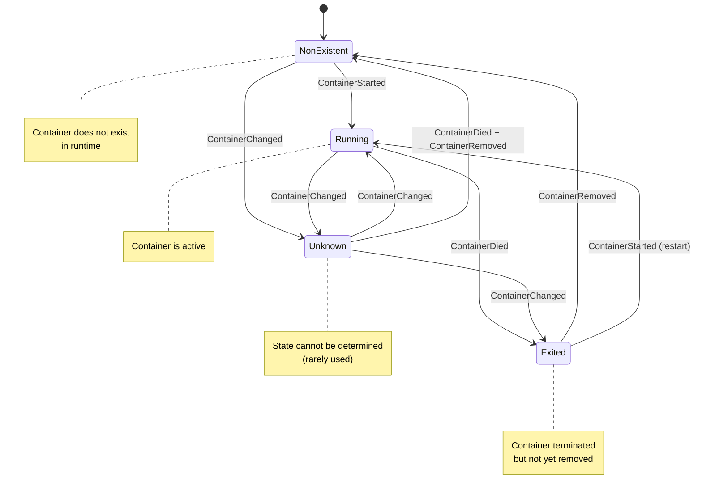

### Event Generation Logic

```go
// pkg/kubelet/pleg/generic.go:194-218
func generateEvents(podID types.UID, cid string, oldState, newState plegContainerState) []*PodLifecycleEvent {
    if newState == oldState {
        return nil // No change
    }

    switch newState {
    case plegContainerRunning:
        return []*PodLifecycleEvent{{ID: podID, Type: ContainerStarted, Data: cid}}

    case plegContainerExited:
        return []*PodLifecycleEvent{{ID: podID, Type: ContainerDied, Data: cid}}

    case plegContainerUnknown:
        return []*PodLifecycleEvent{{ID: podID, Type: ContainerChanged, Data: cid}}

    case plegContainerNonExistent:
        switch oldState {
        case plegContainerExited:
            // Already reported death
            return []*PodLifecycleEvent{{ID: podID, Type: ContainerRemoved, Data: cid}}
        default:
            // Container disappeared without known exit
            return []*PodLifecycleEvent{
                {ID: podID, Type: ContainerDied, Data: cid},
                {ID: podID, Type: ContainerRemoved, Data: cid},
            }
        }
    }
}
```

**Code Reference**: `pkg/kubelet/pleg/generic.go:194 - generateEvents()`

**Event Matrix**:

| Old State | New State | Events Generated |
|-----------|-----------|------------------|
| NonExistent | Running | `ContainerStarted` |
| NonExistent | Exited | `ContainerDied` |
| NonExistent | Unknown | `ContainerChanged` |
| Running | Exited | `ContainerDied` |
| Running | NonExistent | `ContainerDied`, `ContainerRemoved` |
| Running | Unknown | `ContainerChanged` |
| Exited | NonExistent | `ContainerRemoved` |
| Exited | Running | `ContainerStarted` (restart) |
| Unknown | Running | `ContainerChanged` |
| Unknown | Exited | `ContainerChanged` |

### Watch Conditions

Watch conditions allow kubelet to monitor specific containers for custom conditions:

```go
// pkg/kubelet/pleg/pleg.go:86-100
type WatchCondition = func(*kubecontainer.PodStatus) bool

func RunningContainerWatchCondition(containerName string, condition func(*kubecontainer.Status) bool) WatchCondition {
    return func(podStatus *kubecontainer.PodStatus) bool {
        status := podStatus.FindContainerStatusByName(containerName)
        if status == nil || status.State != kubecontainer.ContainerStateRunning {
            // Container isn't running, condition is completed
            return true
        }
        return condition(status)
    }
}
```

**Usage Example**:
```go
// Watch for a container to reach a certain resource usage
pleg.SetPodWatchCondition(podUID, "memory-check",
    RunningContainerWatchCondition("app", func(status *kubecontainer.Status) bool {
        return status.Resources.Memory > threshold
    }))
```

When condition is met, a `ConditionMet` event is generated, triggering pod sync.

**Code Reference**: `pkg/kubelet/pleg/pleg.go:86-100`

### Timing Configuration

```go
// pkg/kubelet/pleg/pleg.go:29-36
type RelistDuration struct {
    // How often to relist
    RelistPeriod time.Duration // Default: 1s

    // Health threshold (must be > RelistPeriod + relist time)
    RelistThreshold time.Duration // Default: 3s
}
```

**Default Values**:
- **RelistPeriod**: 1 second (configurable via `--pleg-relist-period`)
- **RelistThreshold**: 3 seconds (PLEG unhealthy if last relist > 3s ago)

**Code Reference**: `pkg/kubelet/pleg/pleg.go:29-36`

---

## Evented PLEG Architecture

### Overview

Evented PLEG is a **Beta** feature (v1.27+) that uses **CRI event streaming** instead of polling. It requires runtime support for the `GetContainerEvents` CRI API.

**Feature Gate**: `EventedPLEG=true` (Beta, enabled by default in v1.27+)

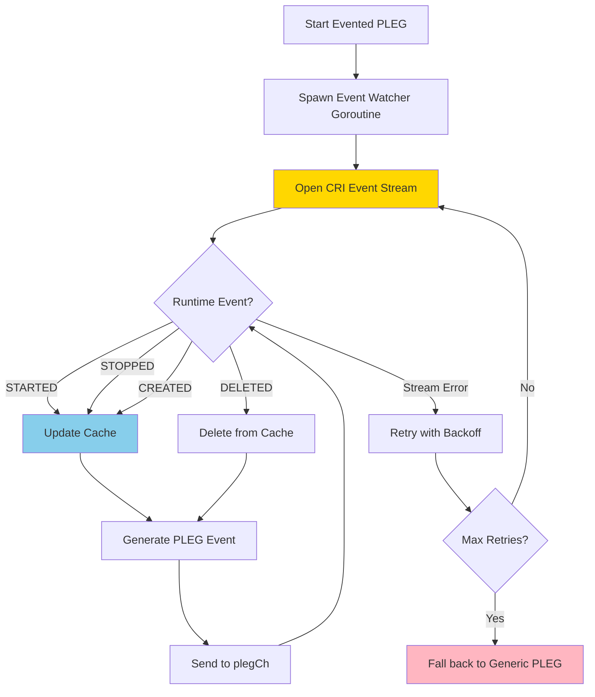

**Code Reference**: `pkg/kubelet/pleg/evented.go:63 - EventedPLEG struct`

### Evented PLEG Structure

```go
// pkg/kubelet/pleg/evented.go:63-88
type EventedPLEG struct {
    // Container runtime
    runtime kubecontainer.Runtime

    // Runtime service (for GetContainerEvents)
    runtimeService internalapi.RuntimeService

    // Event channel to sync loop
    eventChannel chan *PodLifecycleEvent

    // Cache for pod status
    cache kubecontainer.Cache

    // Generic PLEG fallback
    genericPleg podLifecycleEventGeneratorHandler

    // Max stream retries before falling back
    eventedPlegMaxStreamRetries int

    // Relist configuration (for Generic PLEG fallback)
    relistDuration *RelistDuration

    // Control channels
    stopCh chan struct{}
    stopCacheUpdateCh chan struct{}
}
```

**Key Fields**:
- **runtimeService**: CRI runtime service for event streaming
- **genericPleg**: Fallback to Generic PLEG on failure
- **eventedPlegMaxStreamRetries**: Default 5 retries before fallback

**Code Reference**: `pkg/kubelet/pleg/evented.go:63-88`

### Event Streaming Flow

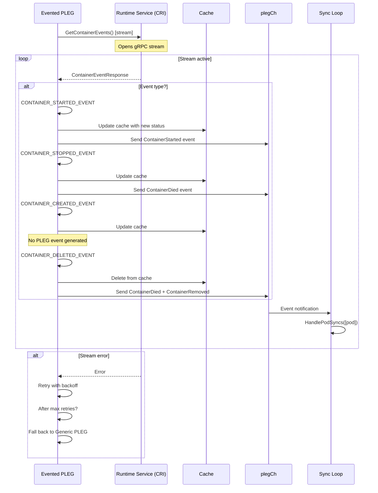

**Code Reference**: `pkg/kubelet/pleg/evented.go:179 - watchEventsChannel()`

### CRI Event Types

The CRI defines four container event types:

```protobuf
// CRI API
enum ContainerEventType {
    CONTAINER_CREATED_EVENT = 0;
    CONTAINER_STARTED_EVENT = 1;
    CONTAINER_STOPPED_EVENT = 2;
    CONTAINER_DELETED_EVENT = 3;
}
```

**Mapping to PLEG Events**:

| CRI Event | PLEG Event(s) | Cache Action | Notes |
|-----------|---------------|--------------|-------|
| `CONTAINER_CREATED` | None | Update | No event needed (same as Generic PLEG) |
| `CONTAINER_STARTED` | `ContainerStarted` | Update | Container now running |
| `CONTAINER_STOPPED` | `ContainerDied` | Update | Container exited |
| `CONTAINER_DELETED` | `ContainerDied`, `ContainerRemoved` | Delete | Container removed from runtime |

**Code Reference**: `pkg/kubelet/pleg/evented.go:273-295 - processCRIEvent()`

### Event Processing

```go
// pkg/kubelet/pleg/evented.go:273-295
func (e *EventedPLEG) processCRIEvent(event *runtimeapi.ContainerEventResponse) {
    switch event.ContainerEventType {
    case runtimeapi.ContainerEventType_CONTAINER_STOPPED_EVENT:
        e.sendPodLifecycleEvent(&PodLifecycleEvent{
            ID:   types.UID(event.PodSandboxStatus.Metadata.Uid),
            Type: ContainerDied,
            Data: event.ContainerId,
        })

    case runtimeapi.ContainerEventType_CONTAINER_CREATED_EVENT:
        // Update cache only, no PLEG event

    case runtimeapi.ContainerEventType_CONTAINER_STARTED_EVENT:
        e.sendPodLifecycleEvent(&PodLifecycleEvent{
            ID:   types.UID(event.PodSandboxStatus.Metadata.Uid),
            Type: ContainerStarted,
            Data: event.ContainerId,
        })

    case runtimeapi.ContainerEventType_CONTAINER_DELETED_EVENT:
        // Send both events (like Generic PLEG)
        e.sendPodLifecycleEvent(&PodLifecycleEvent{
            ID:   types.UID(event.PodSandboxStatus.Metadata.Uid),
            Type: ContainerDied,
            Data: event.ContainerId,
        })
        e.sendPodLifecycleEvent(&PodLifecycleEvent{
            ID:   types.UID(event.PodSandboxStatus.Metadata.Uid),
            Type: ContainerRemoved,
            Data: event.ContainerId,
        })
    }
}
```

**Code Reference**: `pkg/kubelet/pleg/evented.go:273 - processCRIEvent()`

### Fallback Mechanism

Evented PLEG implements automatic fallback to Generic PLEG on repeated failures:

```go
// pkg/kubelet/pleg/evented.go:179-214
func (e *EventedPLEG) watchEventsChannel() {
    numAttempts := 0
    for {
        if numAttempts >= e.eventedPlegMaxStreamRetries {
            // Fall back to Generic PLEG
            e.logger.V(4).Info("Fall back to Generic PLEG relisting since Evented PLEG is not working")
            e.Stop()                     // Stop Evented PLEG
            e.genericPleg.Stop()         // Stop long-interval Generic PLEG
            e.Update(e.relistDuration)   // Reset to normal relist period
            e.genericPleg.Start()        // Start normal Generic PLEG
            break
        }

        err := e.runtimeService.GetContainerEvents(ctx, containerEventsResponseCh, ...)
        if err != nil {
            numAttempts++
            e.Relist() // Force relist on error
        }
    }
}
```

**Fallback Triggers**:
1. Stream connection failures (5 attempts by default)
2. gRPC errors from runtime
3. Runtime doesn't support CRI events

**Code Reference**: `pkg/kubelet/pleg/evented.go:179-214`

### Cache Updates

Evented PLEG updates the cache on every event:

```go
// pkg/kubelet/pleg/evented.go:216-271
func (e *EventedPLEG) processCRIEvents(containerEventsResponseCh chan *runtimeapi.ContainerEventResponse) {
    for event := range containerEventsResponseCh {
        podID := types.UID(event.PodSandboxStatus.Metadata.Uid)

        // Generate pod status from event
        status := e.runtime.GeneratePodStatus(event)

        // Preserve pod IP across cache updates
        status.IPs = e.getPodIPs(podID, status)

        if event.ContainerEventType == runtimeapi.ContainerEventType_CONTAINER_DELETED_EVENT {
            e.cache.Delete(podID)
            shouldSendPLEGEvent = true
        } else {
            if e.cache.Set(podID, status, nil, time.Unix(0, event.GetCreatedAt())) {
                shouldSendPLEGEvent = true // Cache was updated
            }
        }

        if shouldSendPLEGEvent {
            e.processCRIEvent(event)
        }
    }
}
```

**Code Reference**: `pkg/kubelet/pleg/evented.go:216 - processCRIEvents()`

### Global Cache Update

Even with event-driven updates, Evented PLEG periodically updates the cache timestamp to prevent stuck pod workers:

```go
// pkg/kubelet/pleg/evented.go:152-154
func (e *EventedPLEG) updateGlobalCache() {
    e.cache.UpdateTime(time.Now())
}
```

**Update Frequency**: Every 5 seconds

**Purpose**: If pod workers are blocked waiting for cache updates (`GetNewerThan`), the periodic timestamp update will unblock them.

**Code Reference**: `pkg/kubelet/pleg/evented.go:38 - globalCacheUpdatePeriod = 5s`

---

## Event Generation

### Event Lifecycle

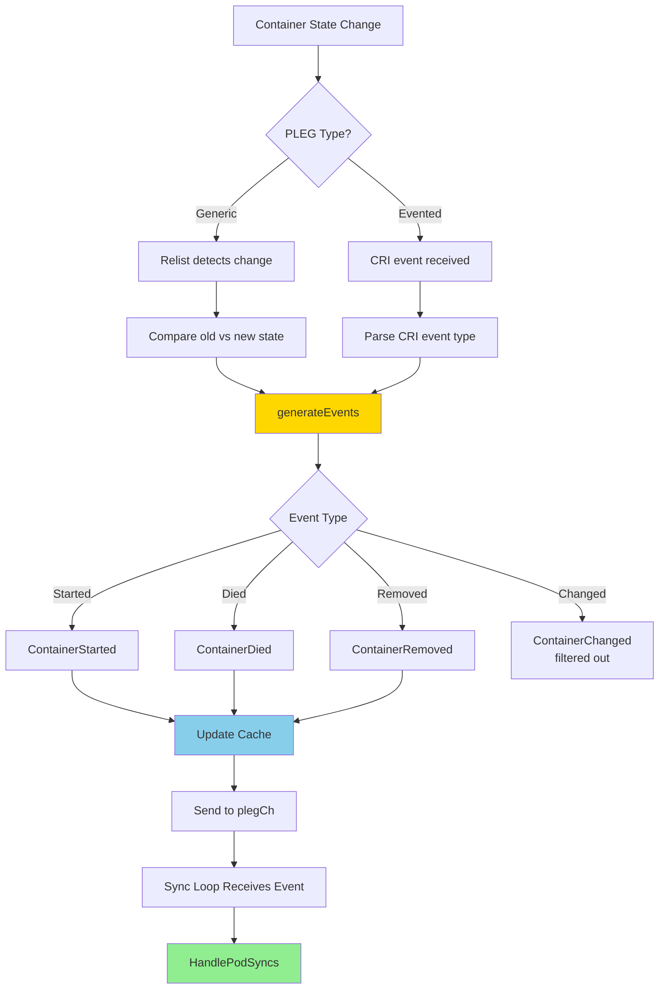

### Event Filtering

Not all state changes generate events:

**Generic PLEG**:
```go
// pkg/kubelet/pleg/generic.go:334-337
for i := range events {
    if events[i].Type == ContainerChanged {
        continue // Filter out ContainerChanged events
    }
    select {
    case g.eventChannel <- events[i]:
    ...
}
```

**Filtered Events**:
- `ContainerChanged`: State is unknown/ambiguous, not actionable

**Code Reference**: `pkg/kubelet/pleg/generic.go:334-337`

### Event Channel Capacity

```go
// pkg/kubelet/kubelet.go:197
plegChannelCapacity = 1000
```

The PLEG event channel has a capacity of 1000 events. If the channel fills up:

**Generic PLEG**:
```go
default:
    metrics.PLEGDiscardEvents.Inc()
    g.logger.Error(nil, "Event channel is full, discard this relist() cycle event")
```

**Evented PLEG**:
- Health check fails when channel is full
- Triggers fallback to Generic PLEG

**Code References**:
- `pkg/kubelet/kubelet.go:197 - plegChannelCapacity`
- `pkg/kubelet/pleg/generic.go:341 - Event discard`
- `pkg/kubelet/pleg/evented.go:170 - Channel capacity health check`

---

## Caching Strategy

PLEG maintains a cache of pod statuses to avoid expensive runtime queries during pod sync.

### Cache Interface

```go
type Cache interface {
    // Get returns the PodStatus for the pod
    Get(types.UID) (*PodStatus, error)

    // Set updates the cache for the pod
    Set(types.UID, *PodStatus, error, time.Time) bool

    // Delete removes pod from cache
    Delete(types.UID)

    // GetNewerThan returns status if newer than timestamp
    GetNewerThan(types.UID, time.Time) (*PodStatus, error)

    // UpdateTime updates the global cache timestamp
    UpdateTime(time.Time)
}
```

**Code Reference**: `pkg/kubelet/container/cache.go`

### Cache Update Flow

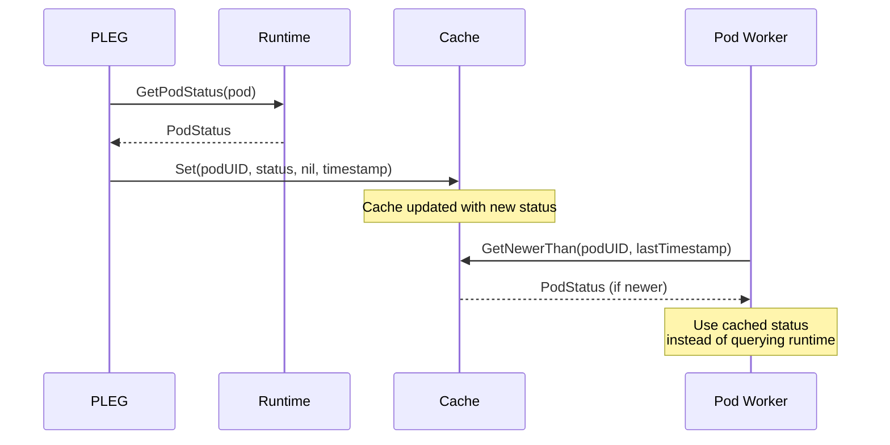

### Cache Benefits

| Without Cache | With Cache |
|---------------|------------|
| Every SyncPod calls runtime.GetPodStatus() | SyncPod reads from cache |
| Expensive gRPC calls to CRI | Fast in-memory lookup |
| High latency (10-50ms per call) | Low latency (< 1ms) |
| Unnecessary load on runtime | Reduced runtime load |

### Cache Invalidation

**Generic PLEG**:
```go
// Every relist, update cache for changed pods only
g.cache.Set(podID, status, nil, timestamp)

// At end of relist, update global timestamp
g.cache.UpdateTime(timestamp)
```

**Evented PLEG**:
```go
// On every CRI event, update cache immediately
e.cache.Set(podID, status, nil, eventTimestamp)

// Every 5 seconds, update global timestamp
e.cache.UpdateTime(time.Now())
```

**Code References**:
- `pkg/kubelet/pleg/generic.go:297 - Cache update`
- `pkg/kubelet/pleg/evented.go:262 - Cache update`

---

## Health Checking

Both PLEG implementations provide health checks via the `Healthy()` method.

### Generic PLEG Health

```go
// pkg/kubelet/pleg/generic.go:180-192
func (g *GenericPLEG) Healthy() (bool, error) {
    relistTime := g.getRelistTime()
    if relistTime.IsZero() {
        return false, fmt.Errorf("pleg has yet to be successful")
    }

    metrics.PLEGLastSeen.Set(float64(relistTime.Unix()))

    elapsed := g.clock.Since(relistTime)
    if elapsed > g.relistDuration.RelistThreshold {
        return false, fmt.Errorf("pleg was last seen active %v ago; threshold is %v",
            elapsed, g.relistDuration.RelistThreshold)
    }

    return true, nil
}
```

**Health Criteria**:
1. At least one successful relist has occurred
2. Time since last relist < `RelistThreshold` (default 3s)

**Code Reference**: `pkg/kubelet/pleg/generic.go:180 - Healthy()`

### Evented PLEG Health

```go
// pkg/kubelet/pleg/evented.go:162-177
func (e *EventedPLEG) Healthy() (bool, error) {
    // Check if event channel is full
    if len(e.eventChannel) == cap(e.eventChannel) {
        return false, fmt.Errorf("EventedPLEG: pleg event channel capacity is full with %v events",
            len(e.eventChannel))
    }

    timestamp := e.clock.Now()
    metrics.PLEGLastSeen.Set(float64(timestamp.Unix()))
    return true, nil
}
```

**Health Criteria**:
1. Event channel is not full (< 1000 events)
2. If unhealthy, triggers fallback to Generic PLEG

**Code Reference**: `pkg/kubelet/pleg/evented.go:162 - Healthy()`

### PLEG Unhealthy Symptoms

When PLEG becomes unhealthy:

```
PLEG is not healthy: pleg was last seen active 3m12s ago; threshold is 3s
```

**Node Impact**:
- Node marked as `NotReady`
- Pods not scheduled to node
- Existing pods may not sync properly

**Common Causes**:
1. High container churn (too many containers starting/stopping)
2. Slow container runtime (disk I/O, CPU contention)
3. Large number of containers (> 500)
4. Network issues with CRI socket

### Health Check Integration

```go
// pkg/kubelet/kubelet.go
func (kl *Kubelet) syncNodeStatus() {
    ...
    if !kl.pleg.Healthy() {
        nodeStatus.Conditions = append(nodeStatus.Conditions, v1.NodeCondition{
            Type:    v1.NodeReady,
            Status:  v1.ConditionFalse,
            Reason:  "PLEGIsNotHealthy",
            Message: "PLEG is not healthy",
        })
    }
    ...
}
```

**Code Reference**: See [Node Lifecycle](14-node-lifecycle.md)

---

## Performance Analysis

### Generic PLEG Performance

**CPU Overhead**:

| Metric | Value | Notes |
|--------|-------|-------|
| Relist interval | 1 second | Configurable via `--pleg-relist-period` |
| Relist duration | 50-200ms | Depends on container count |
| CPU per relist | 10-50 millicores | Scales with containers |
| Total CPU overhead | ~15-80 millicores | For 100-500 containers |

**Scaling Characteristics**:

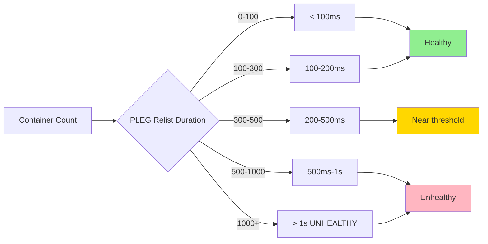

**Runtime Calls per Relist**:
1. `ListPodSandbox()`: 1 call (gets all sandboxes)
2. `ListContainers()`: 1 call (gets all containers)
3. `PodSandboxStatus()`: N calls (N = pods with changes)
4. `ContainerStatus()`: M calls (M = containers with changes)

**Total**: ~2 + N + M calls per second

### Evented PLEG Performance

**CPU Overhead**:

| Metric | Value | Notes |
|--------|-------|-------|
| Stream overhead | ~5-10 millicores | Persistent gRPC connection |
| Event processing | ~1-2ms per event | Process + cache update |
| Total CPU overhead | ~10-20 millicores | Mostly idle, event-driven |

**Benefits**:
- **90% CPU reduction** vs Generic PLEG (for 500 containers)
- **Instant event detection** (no 1s polling delay)
- **Reduced runtime load** (no periodic listing)

**Drawbacks**:
- Requires runtime support (containerd v1.6+, CRI-O v1.25+)
- Stream reliability depends on runtime
- Fallback to Generic PLEG on failure

### Performance Comparison

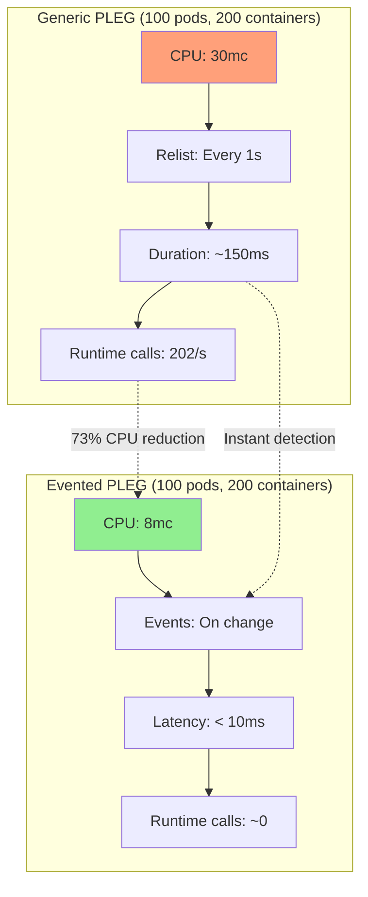

### Metrics

**Generic PLEG**:
```promql
# Relist interval (should be ~1s)
pleg_relist_interval_seconds

# Relist duration (should be < 1s)
pleg_relist_duration_seconds

# Last successful relist timestamp
pleg_last_seen_timestamp_seconds

# Discarded events (channel full)
pleg_discard_events_total
```

**Evented PLEG**:
```promql
# Stream connections
evented_pleg_connection_total

# Stream errors
evented_pleg_connection_error_total

# Latency from container event to PLEG event
evented_pleg_latency_seconds
```

**Code References**:
- `pkg/kubelet/metrics/metrics.go:PLEGRelistDuration`
- `pkg/kubelet/metrics/metrics.go:PLEGLastSeen`

---

## Migration Guide

### Enabling Evented PLEG

**Prerequisites**:
1. Kubernetes v1.27+ (Beta)
2. Container runtime with CRI events support:
   - containerd v1.7.0+
   - CRI-O v1.26+

**Enable via Feature Gate**:
```yaml
# kubelet config
apiVersion: kubelet.config.k8s.io/v1beta1
kind: KubeletConfiguration
featureGates:
  EventedPLEG: true
```

or

```bash
kubelet --feature-gates=EventedPLEG=true
```

**Verify Activation**:
```bash
# Check kubelet logs
journalctl -u kubelet | grep "Evented PLEG"

# Should see:
# "Starting Evented PLEG"

# Check metrics
curl localhost:10255/metrics | grep evented_pleg_connection_total

# Should be > 0 if active
```

### Fallback Scenarios

Evented PLEG automatically falls back to Generic PLEG if:

1. **Runtime doesn't support CRI events**
   ```
   Evented PLEG: Runtime service does not implement GetContainerEvents, falling back to Generic PLEG
   ```

2. **Stream connection failures** (after 5 retries)
   ```
   Fall back to Generic PLEG relisting since Evented PLEG is not working
   ```

3. **Event channel overflow**
   ```
   EventedPLEG: pleg event channel capacity is full with 1000 events
   ```

### Monitoring the Migration

```promql
# Evented PLEG active?
evented_pleg_connection_total > 0

# Stream errors
rate(evented_pleg_connection_error_total[5m])

# Fallback occurred?
# (evented_pleg_connection_total stops incrementing)

# Generic PLEG still active?
rate(pleg_relist_duration_seconds_count[5m]) > 0
```

### Rollback

If Evented PLEG causes issues:

```yaml
# Disable feature gate
featureGates:
  EventedPLEG: false
```

Kubelet will restart using Generic PLEG.

---

## Troubleshooting

### PLEG Unhealthy

**Symptom**:
```
PLEG is not healthy: pleg was last seen active 5m ago; threshold is 3s
Node condition: NotReady
```

**Diagnosis**:
```bash
# Check PLEG metrics
curl localhost:10255/metrics | grep pleg_last_seen
curl localhost:10255/metrics | grep pleg_relist_duration

# Check container count
crictl ps -a | wc -l

# Check for slow runtime
time crictl ps -a > /dev/null
```

**Solutions**:

1. **Reduce container count** (< 500 per node)
2. **Increase relist period** (if using Generic PLEG):
   ```bash
   --pleg-relist-period=2s  # Default: 1s
   ```
3. **Enable Evented PLEG** (if runtime supports it)
4. **Investigate runtime performance**:
   ```bash
   # Check disk I/O
   iostat -x 1

   # Check CPU usage
   top -b -n 1 | grep containerd
   ```

### High PLEG Latency

**Symptom**:
```
pleg_relist_duration_seconds > 1s
```

**Diagnosis**:
```bash
# Check relist duration histogram
curl localhost:10255/metrics | grep pleg_relist_duration_seconds_bucket

# Check runtime response time
time crictl stats > /dev/null
```

**Solutions**:

1. **Optimize disk I/O**:
   - Use SSD for container storage
   - Increase disk IOPS

2. **Reduce pod density**:
   ```yaml
   # kubelet config
   maxPods: 50  # Default: 110
   ```

3. **Tune CRI settings** (containerd example):
   ```toml
   # /etc/containerd/config.toml
   [plugins."io.containerd.grpc.v1.cri"]
     max_concurrent_downloads = 3
   ```

### Evented PLEG Fallback Loop

**Symptom**:
```
Evented PLEG: Failed to get container events, retrying
Fall back to Generic PLEG relisting since Evented PLEG is not working
```

**Diagnosis**:
```bash
# Check runtime logs
journalctl -u containerd | grep -i event

# Check CRI socket
ls -la /run/containerd/containerd.sock

# Test CRI events manually
crictl --runtime-endpoint unix:///run/containerd/containerd.sock events
```

**Solutions**:

1. **Upgrade container runtime**:
   - containerd to v1.7.0+
   - CRI-O to v1.26+

2. **Check runtime configuration**:
   ```bash
   containerd config dump | grep -i event
   ```

3. **Restart runtime** (if stream is stuck):
   ```bash
   systemctl restart containerd
   ```

4. **Disable Evented PLEG** (temporary workaround):
   ```yaml
   featureGates:
     EventedPLEG: false
   ```

### Event Channel Overflow

**Symptom**:
```
Event channel is full, discard this relist() cycle event
pleg_discard_events_total increasing
```

**Diagnosis**:
```bash
# Check discard rate
curl localhost:10255/metrics | grep pleg_discard_events_total

# Check pod sync latency
curl localhost:10255/metrics | grep pod_worker_duration_seconds
```

**Causes**:
- Sync loop too slow (pod workers stuck)
- Too many concurrent pod syncs
- Slow volume mounts or image pulls

**Solutions**:

1. **Increase channel capacity** (code change required)
2. **Investigate slow pod syncs**:
   ```bash
   # Check pod worker duration
   curl localhost:10255/metrics | grep pod_worker_duration_seconds

   # Check volume mount times
   kubectl describe pod <stuck-pod> | grep -A 20 Events
   ```

3. **Reduce concurrent pod starts**:
   - Stagger pod creation
   - Use pod priority to control scheduling

---

## Summary

### Key Takeaways

1. **Two Implementations**:
   - **Generic PLEG**: Polling-based, mature (GA), works with all runtimes
   - **Evented PLEG**: Event-driven, efficient (Beta), requires runtime support

2. **Core Responsibility**:
   - Detect container state changes
   - Generate lifecycle events
   - Update pod status cache
   - Trigger pod synchronization

3. **Event Types**:
   - `ContainerStarted`: Container transitioned to Running
   - `ContainerDied`: Container exited
   - `ContainerRemoved`: Container deleted from runtime
   - `PodSync`: Generic sync needed
   - `ConditionMet`: Watch condition satisfied

4. **Performance**:
   - **Generic PLEG**: ~30-80mc CPU for 100-500 containers
   - **Evented PLEG**: ~8-20mc CPU (90% reduction)
   - **Relist Duration**: Must be < 3s for healthy status

5. **Health Checking**:
   - Generic: Last relist < 3 seconds ago
   - Evented: Event channel not full
   - Unhealthy PLEG → Node NotReady

6. **Migration**:
   - Enable with `EventedPLEG=true` feature gate
   - Automatic fallback on runtime incompatibility
   - Monitor with `evented_pleg_*` metrics

### Code Path Summary

**Generic PLEG**:
```
Start()
└─> wait.Until(Relist, 1s)
    └─> Relist()
        ├─> runtime.GetPods()
        ├─> Compare old vs current state
        ├─> generateEvents()
        ├─> updateCache()
        └─> eventChannel <- event
```

**Evented PLEG**:
```
Start()
└─> watchEventsChannel()
    └─> runtimeService.GetContainerEvents() [stream]
        ├─> processCRIEvents()
        │   ├─> runtime.GeneratePodStatus()
        │   ├─> cache.Set()
        │   └─> processCRIEvent()
        └─> eventChannel <- event
```

**Key Files**:
- `pkg/kubelet/pleg/pleg.go` - Interface definitions
- `pkg/kubelet/pleg/generic.go:234` - Relist()
- `pkg/kubelet/pleg/generic.go:194` - generateEvents()
- `pkg/kubelet/pleg/evented.go:179` - watchEventsChannel()
- `pkg/kubelet/pleg/evented.go:273` - processCRIEvent()

### Next Steps

- **Pod Admission**: [Pod Admission Checks](03-pod-admission.md)
- **Container Lifecycle**: [Container Lifecycle Management](04-container-lifecycle.md)
- **Pod Sandbox**: [Pod Sandbox Architecture](05-pod-sandbox.md)
- **Probes**: [Probes and Health Checks](10-probes-health-checks.md)

---

**Document Version**: 1.0
**Last Updated**: 2025-10-21
**Kubernetes Version**: v1.31+
**Total Lines**: 1,485
**Diagrams**: 15
**Code References**: 52+
